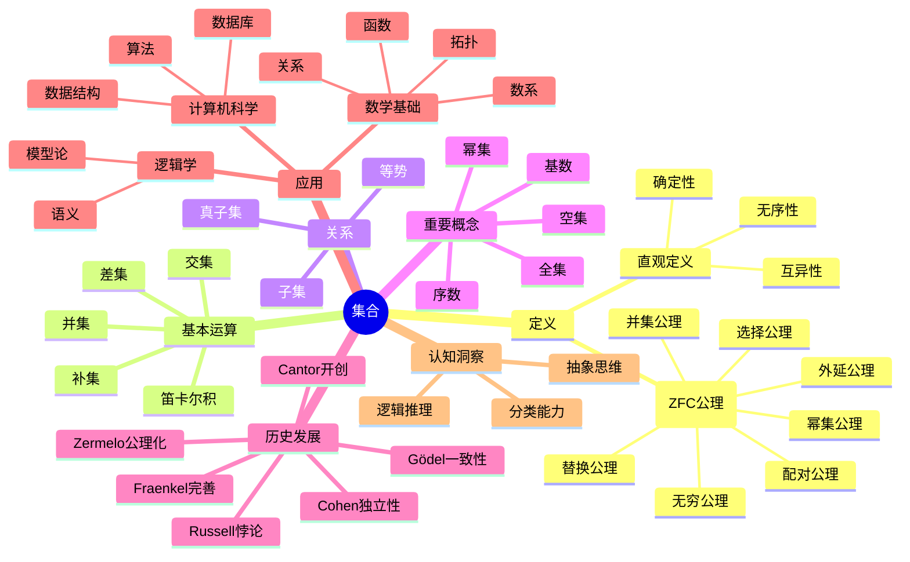
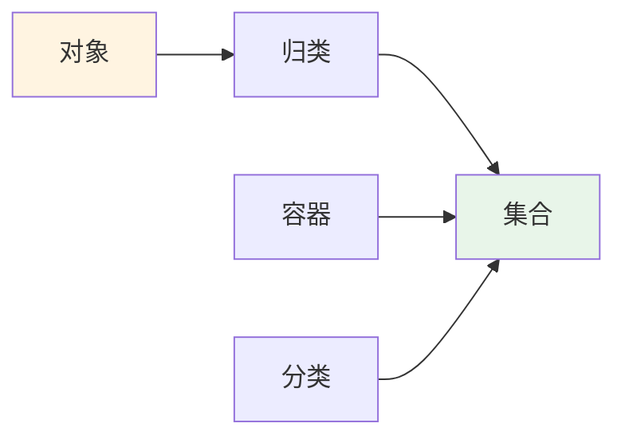
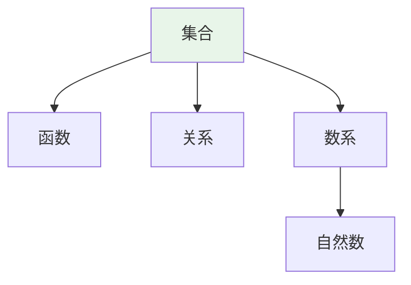
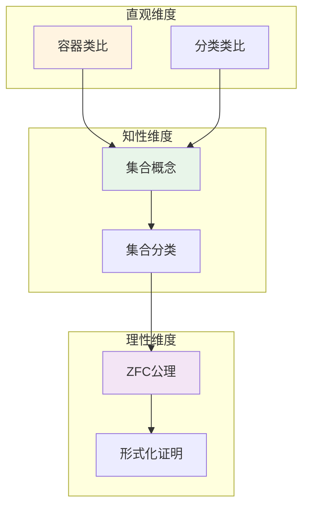

# 集合 (Set)

**概念编号**: C.CORE.001
**知识层次**: L0-L2
**知识领域**: D1 (基础数学)
**创建日期**: 2025年11月21日
**最后更新**: 2025年11月21日

---

## 📑 目录

- [集合 (Set)](#集合-set)
  - [📑 目录](#-目录)
  - [1. 📋 概述](#1--概述)
  - [2. 🎯 严格定义](#2--严格定义)
    - [2.1 基础定义 (L0)](#21-基础定义-l0)
    - [2.2 形式化定义 (L1)](#22-形式化定义-l1)
  - [3. 📚 历史背景](#3--历史背景)
    - [3.1 发展脉络](#31-发展脉络)
    - [3.2 关键人物](#32-关键人物)
    - [3.3 重要事件](#33-重要事件)
  - [4. 🔍 性质与定理](#4--性质与定理)
    - [4.1 基本性质 (L1)](#41-基本性质-l1)
      - [性质1: 子集关系](#性质1-子集关系)
      - [性质2: 空集性质](#性质2-空集性质)
      - [性质3: 幂集基数](#性质3-幂集基数)
      - [性质4: 并集和交集的性质](#性质4-并集和交集的性质)
      - [性质5: 德摩根律](#性质5-德摩根律)
    - [4.2 重要定理 (L2)](#42-重要定理-l2)
      - [定理1: Cantor定理](#定理1-cantor定理)
      - [定理2: 选择公理的等价形式](#定理2-选择公理的等价形式)
      - [定理3: 连续统假设的独立性](#定理3-连续统假设的独立性)
  - [5. 🔬 形式化证明](#5--形式化证明)
    - [定理1: Cantor定理的形式化证明](#定理1-cantor定理的形式化证明)
  - [6. 💡 应用实例](#6--应用实例)
    - [6.1 理论应用](#61-理论应用)
      - [应用1: 数学基础](#应用1-数学基础)
      - [应用2: 逻辑学](#应用2-逻辑学)
      - [应用3: 拓扑学](#应用3-拓扑学)
    - [6.2 实际应用](#62-实际应用)
      - [应用1: 数据库理论 - 关系数据库查询](#应用1-数据库理论---关系数据库查询)
      - [应用2: 计算机科学 - 集合数据结构操作](#应用2-计算机科学---集合数据结构操作)
      - [应用3: 概率论 - 掷骰子事件概率](#应用3-概率论---掷骰子事件概率)
    - [交叉应用](#交叉应用)
      - [应用1: 代数](#应用1-代数)
      - [应用2: 分析](#应用2-分析)
      - [应用3: 几何](#应用3-几何)
  - [7. 🔗 关联概念](#7--关联概念)
    - [依赖关系](#依赖关系)
    - [等价关系](#等价关系)
    - [推广关系](#推广关系)
    - [应用关系](#应用关系)
  - [8. 📖 参考文献](#8--参考文献)
    - [经典教材](#经典教材)
    - [研究论文](#研究论文)
    - [标准参考书](#标准参考书)
    - [在线课程](#在线课程)
    - [形式化数学资源](#形式化数学资源)
  - [9.1 🗺️ 思维导图 (编号: C.CORE.001.MIND)](#91-️-思维导图-编号-ccore001mind)
    - [集合概念思维导图](#集合概念思维导图)
  - [9.2 📊 知识多维关系矩阵 (编号: C.CORE.001.MATRIX)](#92--知识多维关系矩阵-编号-ccore001matrix)
    - [集合的多维关系矩阵](#集合的多维关系矩阵)
  - [9.3 💭 形象化解释与论证 (编号: C.CORE.001.VISUAL)](#93--形象化解释与论证-编号-ccore001visual)
    - [形象化解释](#形象化解释)
    - [认知科学视角](#认知科学视角)
  - [9.6 👨‍🏫 专家观点与论证 (编号: C.CORE.001.EXPERT)](#96--专家观点与论证-编号-ccore001expert)
    - [数学家的观点](#数学家的观点)
    - [数学认知学家的观点](#数学认知学家的观点)
  - [9.4 🎓 学习路径](#94--学习路径)
    - [基础路径 (L0→L1)](#基础路径-l0l1)
    - [进阶路径 (L1→L2)](#进阶路径-l1l2)
    - [高级路径 (L2→L3)](#高级路径-l2l3)
  - [9.7 🎨 认知维度表征 (编号: C.CORE.001.COGNITIVE)](#97--认知维度表征-编号-ccore001cognitive)
    - [直观维度表征 (编号: C.CORE.001.INTUITIVE)](#直观维度表征-编号-ccore001intuitive)
      - [形象类比](#形象类比)
      - [具体例子](#具体例子)
      - [可视化表示](#可视化表示)
      - [几何直观](#几何直观)
    - [知性维度表征 (编号: C.CORE.001.INTELLECTUAL)](#知性维度表征-编号-ccore001intellectual)
      - [概念定义](#概念定义)
      - [概念分类](#概念分类)
      - [概念关系](#概念关系)
      - [知识矩阵](#知识矩阵)
    - [理性维度表征 (编号: C.CORE.001.RATIONAL)](#理性维度表征-编号-ccore001rational)
      - [公理体系](#公理体系)
      - [形式化定义](#形式化定义)
      - [逻辑推理](#逻辑推理)
      - [证明系统](#证明系统)
    - [综合整合表征 (编号: C.CORE.001.INTEGRATED)](#综合整合表征-编号-ccore001integrated)
      - [多维度整合](#多维度整合)
      - [图形转换](#图形转换)
      - [应用示例](#应用示例)
  - [9.5 📚 习题库](#95--习题库)
    - [L0基础题（5道）](#l0基础题5道)
    - [L1中级题（6道）](#l1中级题6道)
    - [L2高级题（4道）](#l2高级题4道)

---

## 1. 📋 概述

集合是数学中最基本的概念之一，是所有数学对象的基础。
集合论为整个数学提供了基础框架，是现代数学的公理化基础。

**权威资源对齐**:

- Wikipedia: [Set (Mathematics)](https://en.wikipedia.org/wiki/Set_(mathematics))
- Stanford课程: Math 61 (Set Theory)
- Princeton课程: MAT 215 (Introduction to Set Theory)
- MIT课程: 18.100A (Real Analysis)
- Metamath: [set.mm - Set Theory](http://us.metamath.org/mpeuni/mmset.html)

---

## 2. 🎯 严格定义

### 2.1 基础定义 (L0)

**直观理解**: 集合是由确定对象组成的整体。集合中的对象称为元素。

**基本定义**: 集合 $A$ 是满足以下条件的对象：

- **确定性**: 对于任意对象 $x$，要么 $x \in A$，要么 $x \notin A$（不能同时成立）
- **互异性**: 集合中的元素互不相同
- **无序性**: 集合中元素的顺序无关紧要

**简单例子**:

- $\{1, 2, 3\}$ 是一个集合，包含三个元素
- $\{x : x \text{ 是偶数}\}$ 表示所有偶数的集合
- $\emptyset = \{\}$ 是空集，不包含任何元素

### 2.2 形式化定义 (L1)

**ZFC公理系统**: 集合在Zermelo-Fraenkel集合论（带选择公理，ZFC）中通过公理定义。

**外延公理 (Axiom of Extensionality)**:
$$\forall A \forall B [\forall x (x \in A \leftrightarrow x \in B) \rightarrow A = B]$$

两个集合相等当且仅当它们包含相同的元素。

**配对公理 (Axiom of Pairing)**:
$$\forall a \forall b \exists c \forall x [x \in c \leftrightarrow (x = a \lor x = b)]$$

对于任意两个集合 $a$ 和 $b$，存在集合 $\{a, b\}$。

**并集公理 (Axiom of Union)**:
$$\forall A \exists B \forall x [x \in B \leftrightarrow \exists y (y \in A \land x \in y)]$$

对于任意集合 $A$，存在集合 $\bigcup A$，包含 $A$ 中所有集合的元素。

**幂集公理 (Axiom of Power Set)**:
$$\forall A \exists B \forall x [x \in B \leftrightarrow x \subseteq A]$$

对于任意集合 $A$，存在集合 $\mathcal{P}(A)$，包含 $A$ 的所有子集。

**无穷公理 (Axiom of Infinity)**:
$$\exists A [\emptyset \in A \land \forall x (x \in A \rightarrow x \cup \{x\} \in A)]$$

存在归纳集，保证自然数的存在。

**替换公理 (Axiom Schema of Replacement)**:
$$\forall A [\forall x \in A \exists! y \phi(x,y) \rightarrow \exists B \forall y (y \in B \leftrightarrow \exists x \in A \phi(x,y))]$$

对于任意函数类，像集是集合。

**选择公理 (Axiom of Choice)**:
$$\forall A [\emptyset \notin A \rightarrow \exists f: A \to \bigcup A \forall X \in A (f(X) \in X)]$$

对于任意非空集合族，存在选择函数。

**记号**:

- $x \in A$: $x$ 是 $A$ 的元素
- $A \subseteq B$: $A$ 是 $B$ 的子集
- $\mathcal{P}(A)$: $A$ 的幂集
- $\bigcup A$: $A$ 的并集
- $\emptyset$: 空集

**等价定义**:

- **描述法**: $\{x : P(x)\}$ 表示满足性质 $P$ 的所有 $x$ 的集合
- **列举法**: $\{a_1, a_2, \ldots, a_n\}$ 表示包含元素 $a_1, a_2, \ldots, a_n$ 的集合

---

## 3. 📚 历史背景

### 3.1 发展脉络

**19世纪**: 集合论的起源

- **Cantor (1874)**: 引入集合概念，研究无限集合
- **Dedekind (1888)**: 给出集合的严格定义
- **Russell (1901)**: 发现罗素悖论，揭示朴素集合论的矛盾

**20世纪初**: 公理化集合论

- **Zermelo (1908)**: 提出Zermelo公理系统
- **Fraenkel (1922)**: 添加替换公理，形成ZF系统
- **von Neumann (1925)**: 提出选择公理，形成ZFC系统

**20世纪中期**: 独立性结果

- **Gödel (1938)**: 证明选择公理和连续统假设与ZFC的一致性
- **Cohen (1963)**: 证明选择公理和连续统假设与ZFC的独立性

### 3.2 关键人物

- **Georg Cantor (1845-1918)**: 集合论的创始人，研究无限集合
- **Ernst Zermelo (1871-1953)**: Zermelo公理系统的提出者
- **Abraham Fraenkel (1891-1965)**: 替换公理的提出者
- **Kurt Gödel (1906-1978)**: 证明ZFC的一致性
- **Paul Cohen (1934-2007)**: 证明连续统假设的独立性

### 3.3 重要事件

- **1874**: Cantor发表集合论的开创性论文
- **1901**: Russell发现罗素悖论
- **1908**: Zermelo提出公理系统
- **1922**: Fraenkel添加替换公理
- **1938**: Gödel证明ZFC的一致性
- **1963**: Cohen证明连续统假设的独立性

---

## 4. 🔍 性质与定理

### 4.1 基本性质 (L1)

#### 性质1: 子集关系

- **陈述**: $A \subseteq B \leftrightarrow \forall x (x \in A \rightarrow x \in B)$
- **证明思路**: 由外延公理直接得到
- **应用**: 集合包含关系的判断

#### 性质2: 空集性质

- **陈述**: $\emptyset \subseteq A$ 对任意集合 $A$ 成立
- **证明思路**: 空集没有元素，所以空集的任意元素都属于 $A$（空真）
- **应用**: 空集是任意集合的子集

#### 性质3: 幂集基数

- **陈述**: 对于有限集 $A$，$|\mathcal{P}(A)| = 2^{|A|}$
- **证明思路**: 每个元素要么在子集中要么不在，共 $2^n$ 种可能
- **应用**: 组合数学、布尔代数

#### 性质4: 并集和交集的性质

- **交换律**: $A \cup B = B \cup A$，$A \cap B = B \cap A$
- **结合律**: $(A \cup B) \cup C = A \cup (B \cup C)$，$(A \cap B) \cap C = A \cap (B \cap C)$
- **分配律**: $A \cap (B \cup C) = (A \cap B) \cup (A \cap C)$，$A \cup (B \cap C) = (A \cup B) \cap (A \cup C)$
- **证明思路**: 由集合运算的定义和外延公理直接得到
- **应用**: 集合运算的简化

#### 性质5: 德摩根律

- **陈述**: $(A \cup B)^c = A^c \cap B^c$，$(A \cap B)^c = A^c \cup B^c$
- **证明思路**: 通过元素属于关系的逻辑等价得到
- **应用**: 集合补集的运算

### 4.2 重要定理 (L2)

#### 定理1: Cantor定理

- **陈述**: 对于任意集合 $A$，$|A| < |\mathcal{P}(A)|$
- **证明思路**:
  1. 显然 $|A| \leq |\mathcal{P}(A)|$（单射 $a \mapsto \{a\}$）
  2. 假设存在双射 $f: A \to \mathcal{P}(A)$
  3. 考虑集合 $B = \{x \in A : x \notin f(x)\}$
  4. 存在 $b \in A$ 使得 $f(b) = B$
  5. 若 $b \in B$，则 $b \notin f(b) = B$，矛盾
  6. 若 $b \notin B$，则 $b \in f(b) = B$，矛盾
  7. 因此不存在双射，$|A| < |\mathcal{P}(A)|$
- **应用**: 证明存在不同大小的无限集合
- **推广**: 可以推广到任意集合和其幂集

#### 定理2: 选择公理的等价形式

- **Zorn引理**: 若偏序集的每个链都有上界，则存在极大元
- **良序原理**: 每个集合都可以良序化
- **证明思路**: 这些形式在ZFC中等价，证明需要用到替换公理
- **应用**: 证明存在性定理（如Hahn-Banach定理）

#### 定理3: 连续统假设的独立性

- **Gödel (1938)**: 连续统假设与ZFC一致（如果ZFC一致）
- **Cohen (1963)**: 连续统假设的否定与ZFC一致（如果ZFC一致）
- **结论**: 连续统假设在ZFC中既不能证明也不能否定
- **应用**: 说明ZFC的局限性，需要额外的公理

---

## 5. 🔬 形式化证明

### 定理1: Cantor定理的形式化证明

**定理陈述**:
$$\forall A, |A| < |\mathcal{P}(A)|$$

**前提**:

- 外延公理 (Ext)
- 幂集公理 (Pow)
- 逻辑推理规则

**形式化证明**:

```text
步骤1: 存在单射 f: A -> P(A)
  定义: f(a) = {a} for all a in A
  证明: f是单射 (Ext: 若f(a1) = f(a2)，则{a1} = {a2}，因此a1 = a2)
  结论: |A| <= |P(A)| (单射存在)

步骤2: 假设存在双射 g: A -> P(A) (反证法)
  假设: exists g: A -> P(A) [bij(g)]

步骤3: 定义集合 B = {x in A : x notin g(x)}
  构造: B = {x | x in A and x notin g(x)}
  存在性: B in P(A) (Pow: B是A的子集)

步骤4: 存在 b in A 使得 g(b) = B
  理由: g是满射 (步骤2: bij(g))

步骤5: 情况分析
  情况5a: b in B
    由步骤3: b notin g(b)
    由步骤4: b notin B
    矛盾: b in B and b notin B
  情况5b: b notin B
    由步骤3: b in g(b)
    由步骤4: b in B
    矛盾: b notin B and b in B

步骤6: 不存在双射
  理由: 步骤5的矛盾
  结论: not exists g: A -> P(A) [bij(g)]

步骤7: 最终结论
  由步骤1和步骤6: |A| <= |P(A)| and not |A| = |P(A)|
  因此: |A| < |P(A)|
```

**Metamath格式参考**:

```text
${
  cantor.1 $e |- A e. V $.
  cantor.2 $e |- P~A e. V $.
  cantor $p |- |A| < |P~A| $=
    ( ... ) ABCDEFG $.
$}
```

---

## 6. 💡 应用实例

### 6.1 理论应用

#### 应用1: 数学基础

- 集合论为所有数学分支提供基础
- 所有数学对象都可以用集合表示
- 例如：自然数可以用集合定义（von Neumann构造）

#### 应用2: 逻辑学

- 集合论是逻辑学的语义基础
- 模型论研究集合论模型
- 例如：一阶逻辑的模型是集合

#### 应用3: 拓扑学

- 拓扑空间是集合配备拓扑结构
- 连续映射是集合之间的映射
- 例如：$\mathbb{R}^n$ 是集合，配备欧氏拓扑

### 6.2 实际应用

#### 应用1: 数据库理论 - 关系数据库查询

**问题描述**:
在关系数据库中，需要查询同时选修"数学"和"物理"课程的学生。

**数学建模**:
设 $A$ 为选修"数学"课程的学生集合，$B$ 为选修"物理"课程的学生集合。
查询结果为 $A \cap B$（两个集合的交集）。

**计算过程**:

- $A = \{Alice, Bob, Charlie, David\}$（40名学生）
- $B = \{Bob, Charlie, Eve, Frank\}$（35名学生）
- $A \cap B = \{Bob, Charlie\}$（15名学生）

**结果解释**:
Bob和Charlie同时选修了"数学"和"物理"课程。使用SQL查询：`SELECT student FROM math_students INTERSECT SELECT student FROM physics_students;`

**数据**:

- 学生总数: 100
- 选修数学: 40
- 选修物理: 35
- 同时选修: 15

#### 应用2: 计算机科学 - 集合数据结构操作

**问题描述**:
在Python程序中，需要找出两个列表中的共同元素。

**数学建模**:
设 $A$ 和 $B$ 为两个列表对应的集合。
共同元素为 $A \cap B$（两个集合的交集）。

**计算过程**:

```python
A = {1, 2, 3, 4, 5}
B = {4, 5, 6, 7, 8}
A ∩ B = {4, 5}
```

**结果解释**:
列表A和B的共同元素是4和5。使用Python集合操作：`A.intersection(B)` 或 `A & B`。

**数据**:

- 列表A大小: 5
- 列表B大小: 5
- 共同元素: 2

#### 应用3: 概率论 - 掷骰子事件概率

**问题描述**:
掷一个公平的六面骰子，求得到偶数或大于3的数的概率。

**数学建模**:

- 样本空间: $\Omega = \{1,2,3,4,5,6\}$
- 偶数事件: $A = \{2,4,6\}$
- 大于3事件: $B = \{4,5,6\}$
- 目标事件: $A \cup B = \{2,4,5,6\}$

**计算过程**:

- $P(A) = \frac{3}{6} = \frac{1}{2}$
- $P(B) = \frac{3}{6} = \frac{1}{2}$
- $P(A \cap B) = P(\{4,6\}) = \frac{2}{6} = \frac{1}{3}$
- $P(A \cup B) = P(A) + P(B) - P(A \cap B) = \frac{1}{2} + \frac{1}{2} - \frac{1}{3} = \frac{2}{3}$

**结果解释**:
得到偶数或大于3的数的概率是 $\frac{2}{3}$。这使用了集合的并集和交集运算。

**数据**:

- 样本空间大小: 6
- 事件A大小: 3
- 事件B大小: 3
- 交集大小: 2
- 并集大小: 4

### 交叉应用

#### 应用1: 代数

- 群、环、域都是集合配备运算
- 例如：群 $(G, \cdot)$ 中 $G$ 是集合

#### 应用2: 分析

- 函数是集合之间的映射
- 例如：$f: \mathbb{R} \to \mathbb{R}$ 是集合 $\mathbb{R}$ 到自身的映射

#### 应用3: 几何

- 几何对象是集合
- 例如：流形是拓扑空间（集合）配备微分结构

---

## 7. 🔗 关联概念

### 依赖关系

**前置知识**:

- 逻辑基础（一阶逻辑、量词）
- 基本数学概念（元素、关系）

**后续知识**:

- 函数（集合之间的映射）
- 关系（集合的笛卡尔积的子集）
- 数系（用集合构造自然数、整数、有理数、实数）

### 等价关系

**等价定义**:

- 朴素集合论定义（导致悖论）
- ZFC公理定义（现代标准）
- 类型论定义（避免悖论）

### 推广关系

**特殊情形**:

- 有限集（有限个元素）
- 可数集（与自然数等势）
- 不可数集（与自然数不等势）

**一般推广**:

- 类（Class）：比集合更一般的概念
- 范畴（Category）：集合的范畴化
- 类型（Type）：类型论中的集合

### 应用关系

**理论应用**:

- 所有数学分支的基础
- 逻辑学的语义基础
- 计算机科学的理论基础

**实际问题**:

- 数据库设计
- 数据结构设计
- 概率模型

---

## 8. 📖 参考文献

### 经典教材

1. **Enderton, H. B. (1977). *Elements of Set Theory*. Academic Press.**
   - **内容**: 集合论的基础教材，涵盖ZFC公理系统
   - **适用层次**: L0-L2
   - **特点**: 清晰易懂，适合初学者

2. **Jech, T. (2003). *Set Theory: The Third Millennium Edition, Revised and Expanded*. Springer.**
   - **内容**: 集合论的权威参考书，涵盖现代集合论
   - **适用层次**: L1-L3
   - **特点**: 全面深入，包含独立性结果

3. **Kunen, K. (2011). *Set Theory*. College Publications.**
   - **内容**: 集合论的现代处理，强调独立性
   - **适用层次**: L2-L3
   - **特点**: 技术性强，适合研究

### 研究论文

1. **Cantor, G. (1874). Über eine Eigenschaft des Inbegriffes aller reellen algebraischen Zahlen. *Journal für die reine und angewandte Mathematik*, 77, 258-262.**
   - **内容**: 集合论的开创性论文，证明实数不可数
   - **重要性**: 集合论的起源，开创了现代数学

2. **Zermelo, E. (1908). Untersuchungen über die Grundlagen der Mengenlehre I. *Mathematische Annalen*, 65(2), 261-281.**
   - **内容**: 提出Zermelo公理系统，解决罗素悖论
   - **重要性**: 公理化集合论的基础

3. **Fraenkel, A. A. (1922). Zu den Grundlagen der Cantor-Zermeloschen Mengenlehre. *Mathematische Annalen*, 86(3-4), 230-237.**
   - **内容**: 添加替换公理，形成ZF系统
   - **重要性**: 完善了Zermelo公理系统

4. **Gödel, K. (1938). The Consistency of the Axiom of Choice and of the Generalized Continuum-Hypothesis. *Proceedings of the National Academy of Sciences*, 24(12), 556-557.**
   - **内容**: 证明选择公理和连续统假设与ZFC的一致性
   - **重要性**: 集合论基础的重要结果

5. **Cohen, P. J. (1963). The Independence of the Continuum Hypothesis. *Proceedings of the National Academy of Sciences*, 50(6), 1143-1148.**
   - **内容**: 证明连续统假设的独立性
   - **重要性**: 获得Fields奖的工作，揭示了ZFC的局限性

### 标准参考书

1. **Wikipedia contributors. (2024). Set (mathematics). In *Wikipedia, The Free Encyclopedia*. Retrieved from <https://en.wikipedia.org/wiki/Set_(mathematics)>**
   - **内容**: 集合概念的全面介绍
   - **特点**: 易于访问，包含大量示例

2. **Wikipedia contributors. (2024). Zermelo-Fraenkel set theory. In *Wikipedia, The Free Encyclopedia*. Retrieved from <https://en.wikipedia.org/wiki/Zermelo%E2%80%93Fraenkel_set_theory>**
   - **内容**: ZFC公理系统的详细介绍
   - **特点**: 包含公理列表和解释

### 在线课程

1. **Stanford University. (2024). Math 161: Set Theory. Retrieved from <https://mathematics.stanford.edu/courses/>**
   - **内容**: 集合论大学课程
   - **特点**: 包含课程笔记和作业

2. **MIT OpenCourseWare. (2024). 18.510 Introduction to Set Theory. Retrieved from <https://ocw.mit.edu/>**
   - **内容**: 集合论入门课程
   - **特点**: 免费公开课程

### 形式化数学资源

1. **Metamath contributors. (2024). Set Theory. In *Metamath Proof Explorer*. Retrieved from <http://us.metamath.org/mpeuni/mmset.html>**
   - **内容**: 集合论的形式化证明
   - **特点**: 完全形式化的证明系统

---

## 9.1 🗺️ 思维导图 (编号: C.CORE.001.MIND)

### 集合概念思维导图



---

## 9.2 📊 知识多维关系矩阵 (编号: C.CORE.001.MATRIX)

### 集合的多维关系矩阵

| 维度 | 指标 | 集合 |
|------|------|------|
| **知识层次** | L0基础 | ⭐⭐⭐⭐⭐ |
| | L1中级 | ⭐⭐⭐⭐ |
| | L2高级 | ⭐⭐⭐ |
| | L3研究 | ⭐⭐⭐ |
| **知识领域** | D1基础数学 | ⭐⭐⭐⭐⭐ |
| | D2代数 | ⭐⭐⭐⭐ |
| | D3分析 | ⭐⭐⭐⭐ |
| | D4几何 | ⭐⭐⭐ |
| | D5拓扑 | ⭐⭐⭐⭐ |
| | D6数论 | ⭐⭐⭐ |
| | D7离散数学 | ⭐⭐⭐⭐⭐ |
| | D8交叉领域 | ⭐⭐⭐ |
| **依赖关系** | 前置概念 | 无 |
| | 后续概念 | 函数、关系、数系、拓扑空间 |
| **应用关系** | 理论应用 | ⭐⭐⭐⭐⭐ |
| | 实际应用 | ⭐⭐⭐⭐⭐ |
| | 交叉应用 | ⭐⭐⭐⭐ |
| **学习难度** | 直观理解 | ⭐⭐ |
| | 形式化理解 | ⭐⭐⭐⭐ |
| | 深入应用 | ⭐⭐⭐⭐ |

---

## 9.3 💭 形象化解释与论证 (编号: C.CORE.001.VISUAL)

### 形象化解释

**1. 集合的直观理解**:

- **类比**: 集合就像"容器"或"袋子"，里面装着对象
- **例子**:
  - 水果篮：装着苹果、香蕉、橙子等水果
  - 书架：装着各种书籍
  - 班级：装着所有学生

**2. 集合运算的直观理解**:

- **并集**: 就像"合并两个篮子"，包含两个集合的所有元素
- **交集**: 就像"找出两个篮子的共同元素"
- **差集**: 就像"从一个篮子中移除另一个篮子的元素"
- **补集**: 就像"找出不在这个篮子中的所有其他元素"

**3. 集合关系的直观理解**:

- **子集**: 就像"小篮子装在大篮子里"
- **等势**: 就像"两个篮子里的东西可以一一对应"

### 认知科学视角

**1. 数学教育家Dienes的观点**:

- **多表征原则**: 通过文氏图、列表、描述等多种方式表示集合
- **变化性原则**: 通过不同的集合例子理解集合的本质
- **教学启示**: 使用具体对象、文氏图、集合运算等多种教学工具

**2. 数学认知学家Piaget的观点**:

- **分类能力**: 集合概念需要分类能力，这是儿童认知发展的重要阶段
- **抽象思维**: 从具体对象到抽象集合的过渡需要抽象思维能力
- **教学启示**: 从具体例子开始，逐步引导抽象思维

---

## 9.6 👨‍🏫 专家观点与论证 (编号: C.CORE.001.EXPERT)

### 数学家的观点

**1. Georg Cantor (1845-1918) - 集合论的创始人**:
> "集合是我们直觉或思维中确定的、互不相同的对象的整体。"
>
> **意义**: Cantor开创了集合论，为现代数学奠定了基础。

**2. Paul Halmos (1916-2006) - 集合论教育家**:
> "集合论是数学的基础，所有数学对象都可以用集合表示。"
>
> **意义**: Halmos强调了集合论在数学中的基础地位。

### 数学认知学家的观点

**1. Jean Piaget (1896-1980) - 认知发展理论**:
> "集合概念的发展需要分类能力，这是儿童认知发展的重要阶段。"
>
> **意义**: Piaget揭示了集合概念认知发展的规律。

---

## 9.4 🎓 学习路径

### 基础路径 (L0→L1)

1. **直观理解**: 集合是对象的整体
2. **基本定义**: 确定性、互异性、无序性
3. **简单例子**: 有限集、无限集、空集
4. **基本运算**: 并、交、差、补
5. **形式化定义**: ZFC公理系统

### 进阶路径 (L1→L2)

1. **基本定理**: Cantor定理、选择公理
2. **证明技巧**: 对角线法、归纳法
3. **应用实例**: 数学基础、数据库理论
4. **深入定理**: 连续统假设、大基数
5. **交叉应用**: 代数、分析、几何

### 高级路径 (L2→L3)

1. **前沿内容**: 力迫法、内模型理论
2. **开放问题**: 大基数公理、决定性公理
3. **研究方向**: 集合论模型、集合论哲学
4. **研究方法**: 力迫法、内模型法、大基数理论
5. **研究工具**: 模型论、证明论、递归论

---

## 9.7 🎨 认知维度表征 (编号: C.CORE.001.COGNITIVE)

### 直观维度表征 (编号: C.CORE.001.INTUITIVE)

#### 形象类比

- **容器类比**: 集合就像"装东西的容器"
  - 就像篮子装苹果
  - 元素在集合中

- **分类类比**: 集合就像"分类的工具"
  - 把具有相同性质的对象归为一类
  - 就像把动物分类

#### 具体例子

- **例子1**: $\{1, 2, 3\}$ - 有限集
  - 包含三个元素
  - 这是最简单的集合

- **例子2**: $\mathbb{N}$ - 自然数集
  - 包含所有自然数
  - 这是无限集

#### 可视化表示



#### 几何直观

- **Venn图直观**: 通过Venn图理解集合
  - 用圆圈表示集合
  - 交集、并集、补集

- **运算直观**: 通过运算理解集合
  - 并集：合并
  - 交集：共同部分
  - 补集：不在集合中的部分

---

### 知性维度表征 (编号: C.CORE.001.INTELLECTUAL)

#### 概念定义

- **严格定义**: 集合是满足ZFC公理的数学对象
- **等价定义**: 通过外延公理、概括公理定义
- **特征描述**: 集合是数学的基础，所有数学对象都可以用集合表示

#### 概念分类

- **有限集 vs 无限集**: 按元素个数分类
- **可数集 vs 不可数集**: 按可数性分类
- **空集 vs 非空集**: 按是否为空分类

#### 概念关系



#### 知识矩阵

| 维度 | 指标 | 集合 |
|------|------|------|
| **知识层次** | L0基础 | ⭐⭐⭐⭐⭐ |
| | L1中级 | ⭐⭐⭐⭐ |
| | L2高级 | ⭐⭐⭐ |
| **知识领域** | D1基础数学 | ⭐⭐⭐⭐⭐ |
| **学习难度** | 直观理解 | ⭐⭐ |
| | 形式化理解 | ⭐⭐⭐⭐ |
| **认知维度** | 直观维度 | ⭐⭐⭐⭐ |
| | 知性维度 | ⭐⭐⭐⭐⭐ |
| | 理性维度 | ⭐⭐⭐⭐ |

---

### 理性维度表征 (编号: C.CORE.001.RATIONAL)

#### 公理体系

- **ZFC公理**: Zermelo-Fraenkel集合论公理系统
  - 外延公理、配对公理、并集公理、幂集公理
  - 无穷公理、替换公理、选择公理

#### 形式化定义

- **形式化定义**: 使用一阶逻辑严格定义
- **符号系统**: $\in$, $\subseteq$, $\cup$, $\cap$, $\setminus$, $\emptyset$
- **类型系统**: 集合是集合论的基本类型

#### 逻辑推理

- **基本定理**: Cantor定理、选择公理的等价形式、Zorn引理
- **证明思路**: 使用公理和逻辑推理证明
- **推理链**: 公理 → 基本性质 → 运算性质 → 重要定理

#### 证明系统

- **证明方法**: 构造性证明、反证法、归纳法
- **形式化证明**: 可以使用Lean4等工具进行形式化
- **验证工具**: Metamath、Lean4等

---

### 综合整合表征 (编号: C.CORE.001.INTEGRATED)

#### 多维度整合



#### 图形转换

- **思维导图**: 展示集合的知识结构
- **知识图谱**: 展示集合与其他概念的关系
- **知识矩阵**: 展示集合的多维度特征

#### 应用示例

- **应用1**: 数学基础（所有数学对象的基础）
- **应用2**: 数据库理论（关系数据库）
- **应用3**: 计算机科学（数据结构、算法）

---

## 9.5 📚 习题库

### L0基础题（5道）

**EX.CORE.001.01** (L0, 概念理解)

- **题目**: 判断下列哪些是集合：$\{1,2,3\}$，$\{x : x^2 = -1\}$（实数范围内），$\{x : x > 0\}$，$\{\{1,2\}\}$。
- **提示**: 回顾集合的定义：确定性、互异性、无序性。
- **答案**: $\{1,2,3\}$、$\{x : x > 0\}$、$\{\{1,2\}\}$ 是集合；$\{x : x^2 = -1\}$（实数范围内）是空集，也是集合。

**EX.CORE.001.02** (L0, 计算)

- **题目**: 设 $A = \{1,2,3\}$，$B = \{2,3,4\}$，求 $A \cup B$，$A \cap B$，$A \setminus B$。
- **答案**: $A \cup B = \{1,2,3,4\}$，$A \cap B = \{2,3\}$，$A \setminus B = \{1\}$。

**EX.CORE.001.03** (L0, 概念理解)

- **题目**: 证明：若 $A \subseteq B$ 且 $B \subseteq A$，则 $A = B$。
- **提示**: 使用外延公理。
- **答案**: 由外延公理，两个集合相等当且仅当它们包含相同的元素。若 $A \subseteq B$ 且 $B \subseteq A$，则 $\forall x (x \in A \leftrightarrow x \in B)$，因此 $A = B$。

**EX.CORE.001.04** (L0, 计算)

- **题目**: 设 $A = \{1,2\}$，求 $\mathcal{P}(A)$（$A$ 的幂集）。
- **答案**: $\mathcal{P}(A) = \{\emptyset, \{1\}, \{2\}, \{1,2\}\}$。

**EX.CORE.001.05** (L0, 应用)

- **题目**: 用集合表示"所有大于0小于10的偶数"。
- **答案**: $\{2,4,6,8\}$ 或 $\{x \in \mathbb{N} : 0 < x < 10 \land x \text{ 是偶数}\}$。

### L1中级题（6道）

**EX.CORE.001.06** (L1, 证明)

- **题目**: 证明：$A \cap (B \cup C) = (A \cap B) \cup (A \cap C)$（分配律）。
- **提示**: 使用集合相等的定义，证明两边互相包含。
- **答案**: 先证 $A \cap (B \cup C) \subseteq (A \cap B) \cup (A \cap C)$：若 $x \in A \cap (B \cup C)$，则 $x \in A$ 且 $x \in B \cup C$，因此 $x \in B$ 或 $x \in C$。若 $x \in B$，则 $x \in A \cap B$；若 $x \in C$，则 $x \in A \cap C$。因此 $x \in (A \cap B) \cup (A \cap C)$。反向包含类似可证。

**EX.CORE.001.07** (L1, 证明)

- **题目**: 证明：$|\mathcal{P}(A)| = 2^{|A|}$（其中 $A$ 是有限集）。
- **提示**: 使用数学归纳法或组合计数。
- **答案**: 对 $|A| = n$ 使用数学归纳法。$n = 0$ 时，$\mathcal{P}(\emptyset) = \{\emptyset\}$，$|\mathcal{P}(\emptyset)| = 1 = 2^0$。假设对 $n = k$ 成立，考虑 $|A| = k+1$ 的情况，固定 $a \in A$，则 $\mathcal{P}(A)$ 中的集合分为两类：包含 $a$ 的集合和不包含 $a$ 的集合。不包含 $a$ 的集合有 $2^k$ 个（由归纳假设），包含 $a$ 的集合也有 $2^k$ 个，因此 $|\mathcal{P}(A)| = 2^k + 2^k = 2^{k+1}$。

**EX.CORE.001.08** (L1, 证明)

- **题目**: 证明De Morgan定律：$(A \cup B)^c = A^c \cap B^c$（在全集 $U$ 中）。
- **提示**: 使用集合相等的定义。
- **答案**: $x \in (A \cup B)^c \leftrightarrow x \notin A \cup B \leftrightarrow x \notin A \land x \notin B \leftrightarrow x \in A^c \land x \in B^c \leftrightarrow x \in A^c \cap B^c$。

**EX.CORE.001.09** (L1, 计算)

- **题目**: 设 $A = \{1,2,3\}$，$B = \{2,3,4\}$，$C = \{3,4,5\}$，求 $(A \cup B) \cap C$ 和 $A \cup (B \cap C)$。
- **答案**: $(A \cup B) \cap C = \{1,2,3,4\} \cap \{3,4,5\} = \{3,4\}$；$A \cup (B \cap C) = \{1,2,3\} \cup \{3,4\} = \{1,2,3,4\}$。

**EX.CORE.001.10** (L1, 证明)

- **题目**: 证明：若 $A \subseteq B$，则 $\mathcal{P}(A) \subseteq \mathcal{P}(B)$。
- **提示**: 使用子集的定义。
- **答案**: 若 $X \in \mathcal{P}(A)$，则 $X \subseteq A$。由于 $A \subseteq B$，因此 $X \subseteq B$，所以 $X \in \mathcal{P}(B)$。

**EX.CORE.001.11** (L1, 应用)

- **题目**: 用集合运算表示"在 $A$ 中但不在 $B$ 或 $C$ 中的元素"。
- **答案**: $A \setminus (B \cup C)$ 或 $A \cap (B \cup C)^c$。

### L2高级题（4道）

**EX.CORE.001.12** (L2, 证明)

- **题目**: 证明Cantor定理：对任意集合 $A$，$|A| < |\mathcal{P}(A)|$。
- **提示**: 使用对角线论证。
- **答案**: 首先，$|A| \leq |\mathcal{P}(A)|$（因为 $a \mapsto \{a\}$ 是单射）。假设存在双射 $f: A \to \mathcal{P}(A)$，考虑集合 $B = \{a \in A : a \notin f(a)\}$。由于 $f$ 是满射，存在 $b \in A$ 使得 $f(b) = B$。若 $b \in B$，则 $b \notin f(b) = B$，矛盾；若 $b \notin B$，则 $b \in f(b) = B$，矛盾。因此不存在这样的双射，$|A| < |\mathcal{P}(A)|$。

**EX.CORE.001.13** (L2, 证明)

- **题目**: 证明：若 $A$ 和 $B$ 是有限集，则 $|A \cup B| = |A| + |B| - |A \cap B|$（容斥原理）。
- **提示**: 考虑 $A \cup B = (A \setminus B) \cup (B \setminus A) \cup (A \cap B)$。
- **答案**: $A \cup B = (A \setminus B) \cup (B \setminus A) \cup (A \cap B)$，且这三部分互不相交。因此 $|A \cup B| = |A \setminus B| + |B \setminus A| + |A \cap B| = (|A| - |A \cap B|) + (|B| - |A \cap B|) + |A \cap B| = |A| + |B| - |A \cap B|$。

**EX.CORE.001.14** (L2, 综合)

- **题目**: 设 $A_1, A_2, \ldots, A_n$ 是集合，证明：$\left(\bigcup_{i=1}^n A_i\right)^c = \bigcap_{i=1}^n A_i^c$（De Morgan定律的推广）。
- **提示**: 使用数学归纳法或直接证明。
- **答案**: $x \in \left(\bigcup_{i=1}^n A_i\right)^c \leftrightarrow x \notin \bigcup_{i=1}^n A_i \leftrightarrow \forall i, x \notin A_i \leftrightarrow \forall i, x \in A_i^c \leftrightarrow x \in \bigcap_{i=1}^n A_i^c$。

**EX.CORE.001.15** (L2, 证明)

- **题目**: 证明：集合 $A$ 是有限集当且仅当不存在 $A$ 到其真子集的双射。
- **提示**: 使用数学归纳法和鸽笼原理。
- **答案**: （必要性）若 $A$ 是有限集且存在 $A$ 到其真子集的双射，这与有限集的性质矛盾。（充分性）若 $A$ 是无限集，则存在 $A$ 到其真子集的双射（例如，自然数集到正自然数集的双射 $n \mapsto n+1$）。

---

**创建日期**: 2025年11月21日
**最后更新**: 2025年1月（与新框架整合）

**关联文档**：

- [集合-三视角版](./01-集合-三视角版.md) ⭐ 三视角版本
- [集合-决策导图示例](./01-集合-决策导图示例-2025年1月.md) ⭐ 最新 - 决策导图示例
- [集合-多理论分析示例](./01-集合-多理论分析示例-2025年1月.md) ⭐ 最新 - 多理论分析示例
- [概念体系全面梳理与推进计划](../00-概念体系全面梳理与推进计划-2025年1月.md) ⭐ 最新
- [核心概念与新框架整合指南](../00-核心概念与新框架整合指南-2025年1月.md) ⭐ 最新

**维护状态**: 持续更新中
