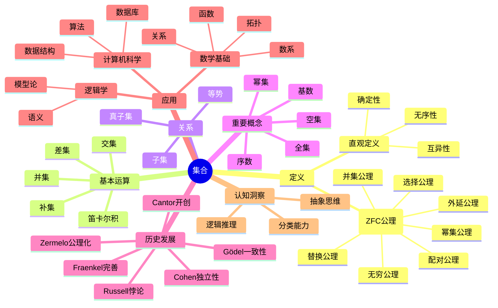
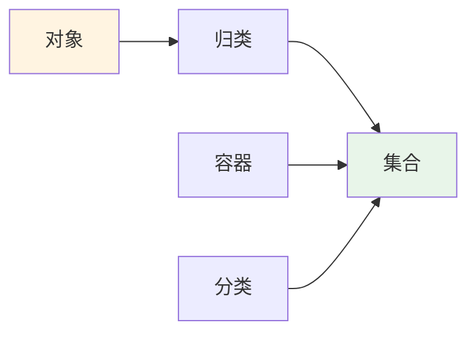
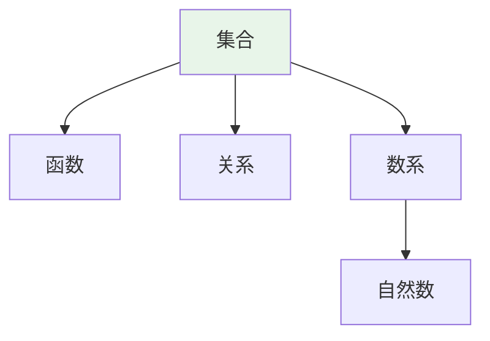
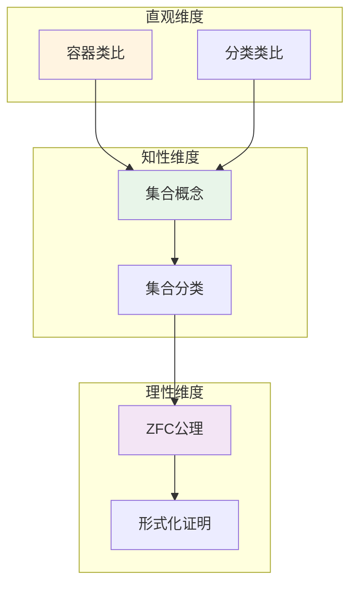

# 集合 (Set)

**概念编号**: C.CORE.001
**知识层次**: L0-L2
**知识领域**: D1 (基础数学)
**创建日期**: 2025年11月21日
**最后更新**: 2025年11月21日

---

## 📋 概述

集合是数学中最基本的概念之一，是所有数学对象的基础。集合论为整个数学提供了基础框架，是现代数学的公理化基础。

**权威资源对齐**:

- Wikipedia: [Set (Mathematics)](https://en.wikipedia.org/wiki/Set_(mathematics))
- Stanford课程: Math 61 (Set Theory)
- Princeton课程: MAT 215 (Introduction to Set Theory)
- MIT课程: 18.100A (Real Analysis)
- Metamath: [set.mm - Set Theory](http://us.metamath.org/mpeuni/mmset.html)

---

## 🎯 严格定义

### 基础定义 (L0)

**直观理解**: 集合是由确定对象组成的整体。集合中的对象称为元素。

**基本定义**: 集合 $A$ 是满足以下条件的对象：

- **确定性**: 对于任意对象 $x$，要么 $x \in A$，要么 $x \notin A$（不能同时成立）
- **互异性**: 集合中的元素互不相同
- **无序性**: 集合中元素的顺序无关紧要

**简单例子**:

- $\{1, 2, 3\}$ 是一个集合，包含三个元素
- $\{x : x \text{ 是偶数}\}$ 表示所有偶数的集合
- $\emptyset = \{\}$ 是空集，不包含任何元素

### 形式化定义 (L1)

**ZFC公理系统**: 集合在Zermelo-Fraenkel集合论（带选择公理，ZFC）中通过公理定义。

**外延公理 (Axiom of Extensionality)**:
$$\forall A \forall B [\forall x (x \in A \leftrightarrow x \in B) \rightarrow A = B]$$

两个集合相等当且仅当它们包含相同的元素。

**配对公理 (Axiom of Pairing)**:
$$\forall a \forall b \exists c \forall x [x \in c \leftrightarrow (x = a \lor x = b)]$$

对于任意两个集合 $a$ 和 $b$，存在集合 $\{a, b\}$。

**并集公理 (Axiom of Union)**:
$$\forall A \exists B \forall x [x \in B \leftrightarrow \exists y (y \in A \land x \in y)]$$

对于任意集合 $A$，存在集合 $\bigcup A$，包含 $A$ 中所有集合的元素。

**幂集公理 (Axiom of Power Set)**:
$$\forall A \exists B \forall x [x \in B \leftrightarrow x \subseteq A]$$

对于任意集合 $A$，存在集合 $\mathcal{P}(A)$，包含 $A$ 的所有子集。

**无穷公理 (Axiom of Infinity)**:
$$\exists A [\emptyset \in A \land \forall x (x \in A \rightarrow x \cup \{x\} \in A)]$$

存在归纳集，保证自然数的存在。

**替换公理 (Axiom Schema of Replacement)**:
$$\forall A [\forall x \in A \exists! y \phi(x,y) \rightarrow \exists B \forall y (y \in B \leftrightarrow \exists x \in A \phi(x,y))]$$

对于任意函数类，像集是集合。

**选择公理 (Axiom of Choice)**:
$$\forall A [\emptyset \notin A \rightarrow \exists f: A \to \bigcup A \forall X \in A (f(X) \in X)]$$

对于任意非空集合族，存在选择函数。

**记号**:

- $x \in A$: $x$ 是 $A$ 的元素
- $A \subseteq B$: $A$ 是 $B$ 的子集
- $\mathcal{P}(A)$: $A$ 的幂集
- $\bigcup A$: $A$ 的并集
- $\emptyset$: 空集

**等价定义**:

- **描述法**: $\{x : P(x)\}$ 表示满足性质 $P$ 的所有 $x$ 的集合
- **列举法**: $\{a_1, a_2, \ldots, a_n\}$ 表示包含元素 $a_1, a_2, \ldots, a_n$ 的集合

---

## 📚 历史背景

### 发展脉络

**19世纪**: 集合论的起源

- **Cantor (1874)**: 引入集合概念，研究无限集合
- **Dedekind (1888)**: 给出集合的严格定义
- **Russell (1901)**: 发现罗素悖论，揭示朴素集合论的矛盾

**20世纪初**: 公理化集合论

- **Zermelo (1908)**: 提出Zermelo公理系统
- **Fraenkel (1922)**: 添加替换公理，形成ZF系统
- **von Neumann (1925)**: 提出选择公理，形成ZFC系统

**20世纪中期**: 独立性结果

- **Gödel (1938)**: 证明选择公理和连续统假设与ZFC的一致性
- **Cohen (1963)**: 证明选择公理和连续统假设与ZFC的独立性

### 关键人物

- **Georg Cantor (1845-1918)**: 集合论的创始人，研究无限集合
- **Ernst Zermelo (1871-1953)**: Zermelo公理系统的提出者
- **Abraham Fraenkel (1891-1965)**: 替换公理的提出者
- **Kurt Gödel (1906-1978)**: 证明ZFC的一致性
- **Paul Cohen (1934-2007)**: 证明连续统假设的独立性

### 重要事件

- **1874**: Cantor发表集合论的开创性论文
- **1901**: Russell发现罗素悖论
- **1908**: Zermelo提出公理系统
- **1922**: Fraenkel添加替换公理
- **1938**: Gödel证明ZFC的一致性
- **1963**: Cohen证明连续统假设的独立性

---

## 🔍 性质与定理

### 基本性质 (L1)

#### 性质1: 子集关系

- **陈述**: $A \subseteq B \Leftrightarrow \forall x (x \in A \rightarrow x \in B)$
- **证明思路**: 由外延公理直接得到
- **应用**: 集合包含关系的判断

#### 性质2: 空集性质

- **陈述**: $\emptyset \subseteq A$ 对任意集合 $A$ 成立
- **证明思路**: 空集没有元素，所以空集的任意元素都属于 $A$（空真）
- **应用**: 空集是任意集合的子集

#### 性质3: 幂集基数

- **陈述**: 对于有限集 $A$，$|\mathcal{P}(A)| = 2^{|A|}$
- **证明思路**: 每个元素要么在子集中要么不在，共 $2^n$ 种可能
- **应用**: 组合数学、布尔代数

#### 性质4: 并集和交集的性质

- **交换律**: $A \cup B = B \cup A$，$A \cap B = B \cap A$
- **结合律**: $(A \cup B) \cup C = A \cup (B \cup C)$，$(A \cap B) \cap C = A \cap (B \cap C)$
- **分配律**: $A \cap (B \cup C) = (A \cap B) \cup (A \cap C)$，$A \cup (B \cap C) = (A \cup B) \cap (A \cup C)$
- **证明思路**: 由集合运算的定义和外延公理直接得到
- **应用**: 集合运算的简化

#### 性质5: 德摩根律

- **陈述**: $(A \cup B)^c = A^c \cap B^c$，$(A \cap B)^c = A^c \cup B^c$
- **证明思路**: 通过元素属于关系的逻辑等价得到
- **应用**: 集合补集的运算

### 重要定理 (L2)

#### 定理1: Cantor定理

- **陈述**: 对于任意集合 $A$，$|A| < |\mathcal{P}(A)|$
- **证明思路**:
  1. 显然 $|A| \leq |\mathcal{P}(A)|$（单射 $a \mapsto \{a\}$）
  2. 假设存在双射 $f: A \to \mathcal{P}(A)$
  3. 考虑集合 $B = \{x \in A : x \notin f(x)\}$
  4. 存在 $b \in A$ 使得 $f(b) = B$
  5. 若 $b \in B$，则 $b \notin f(b) = B$，矛盾
  6. 若 $b \notin B$，则 $b \in f(b) = B$，矛盾
  7. 因此不存在双射，$|A| < |\mathcal{P}(A)|$
- **应用**: 证明存在不同大小的无限集合
- **推广**: 可以推广到任意集合和其幂集

#### 定理2: 选择公理的等价形式

- **Zorn引理**: 若偏序集的每个链都有上界，则存在极大元
- **良序原理**: 每个集合都可以良序化
- **证明思路**: 这些形式在ZFC中等价，证明需要用到替换公理
- **应用**: 证明存在性定理（如Hahn-Banach定理）

#### 定理3: 连续统假设的独立性

- **Gödel (1938)**: 连续统假设与ZFC一致（如果ZFC一致）
- **Cohen (1963)**: 连续统假设的否定与ZFC一致（如果ZFC一致）
- **结论**: 连续统假设在ZFC中既不能证明也不能否定
- **应用**: 说明ZFC的局限性，需要额外的公理

---

## 💡 应用实例

### 理论应用

#### 应用1: 数学基础

- 集合论为所有数学分支提供基础
- 所有数学对象都可以用集合表示
- 例如：自然数可以用集合定义（von Neumann构造）

#### 应用2: 逻辑学

- 集合论是逻辑学的语义基础
- 模型论研究集合论模型
- 例如：一阶逻辑的模型是集合

#### 应用3: 拓扑学

- 拓扑空间是集合配备拓扑结构
- 连续映射是集合之间的映射
- 例如：$\mathbb{R}^n$ 是集合，配备欧氏拓扑

### 实际应用

#### 应用1: 数据库理论

- 关系数据库基于集合论
- 关系是集合的笛卡尔积的子集
- SQL查询基于集合运算

#### 应用2: 计算机科学

- 数据结构（如集合、映射）基于集合论
- 类型论是集合论的推广
- 例如：Python的set类型

#### 应用3: 概率论

- 事件是样本空间的子集
- 概率是集合上的测度
- 例如：掷骰子的样本空间是 $\{1,2,3,4,5,6\}$

### 交叉应用

#### 应用1: 代数

- 群、环、域都是集合配备运算
- 例如：群 $(G, \cdot)$ 中 $G$ 是集合

#### 应用2: 分析

- 函数是集合之间的映射
- 例如：$f: \mathbb{R} \to \mathbb{R}$ 是集合 $\mathbb{R}$ 到自身的映射

#### 应用3: 几何

- 几何对象是集合
- 例如：流形是拓扑空间（集合）配备微分结构

---

## 🔗 关联概念

### 依赖关系

**前置知识**:

- 逻辑基础（一阶逻辑、量词）
- 基本数学概念（元素、关系）

**后续知识**:

- 函数（集合之间的映射）
- 关系（集合的笛卡尔积的子集）
- 数系（用集合构造自然数、整数、有理数、实数）

### 等价关系

**等价定义**:

- 朴素集合论定义（导致悖论）
- ZFC公理定义（现代标准）
- 类型论定义（避免悖论）

### 推广关系

**特殊情形**:

- 有限集（有限个元素）
- 可数集（与自然数等势）
- 不可数集（与自然数不等势）

**一般推广**:

- 类（Class）：比集合更一般的概念
- 范畴（Category）：集合的范畴化
- 类型（Type）：类型论中的集合

### 应用关系

**理论应用**:

- 所有数学分支的基础
- 逻辑学的语义基础
- 计算机科学的理论基础

**实际问题**:

- 数据库设计
- 数据结构设计
- 概率模型

---

## 📖 参考文献

### 权威资源

- Wikipedia: [Set (Mathematics)](https://en.wikipedia.org/wiki/Set_(mathematics))
- Wikipedia: [Zermelo-Fraenkel Set Theory](https://en.wikipedia.org/wiki/Zermelo%E2%80%93Fraenkel_set_theory)
- Metamath: [set.mm - Set Theory](http://us.metamath.org/mpeuni/mmset.html)

### 经典教材

- Enderton, H. B. (1977). *Elements of Set Theory*. Academic Press.
- Jech, T. (2003). *Set Theory: The Third Millennium Edition*. Springer.
- Kunen, K. (2011). *Set Theory*. College Publications.

### 研究论文

- Cantor, G. (1874). "Über eine Eigenschaft des Inbegriffes aller reellen algebraischen Zahlen". *Journal für die reine und angewandte Mathematik*.
- Zermelo, E. (1908). "Untersuchungen über die Grundlagen der Mengenlehre I". *Mathematische Annalen*.
- Gödel, K. (1938). "The Consistency of the Axiom of Choice and of the Generalized Continuum-Hypothesis". *Proceedings of the National Academy of Sciences*.
- Cohen, P. J. (1963). "The Independence of the Continuum Hypothesis". *Proceedings of the National Academy of Sciences*.

---

## 🗺️ 思维导图 (编号: C.CORE.001.MIND)

### 集合概念思维导图

---

## 📊 知识多维关系矩阵 (编号: C.CORE.001.MATRIX)

### 集合的多维关系矩阵

| 维度 | 指标 | 集合 |
|------|------|------|
| **知识层次** | L0基础 | ⭐⭐⭐⭐⭐ |
| | L1中级 | ⭐⭐⭐⭐ |
| | L2高级 | ⭐⭐⭐ |
| | L3研究 | ⭐⭐⭐ |
| **知识领域** | D1基础数学 | ⭐⭐⭐⭐⭐ |
| | D2代数 | ⭐⭐⭐⭐ |
| | D3分析 | ⭐⭐⭐⭐ |
| | D4几何 | ⭐⭐⭐ |
| | D5拓扑 | ⭐⭐⭐⭐ |
| | D6数论 | ⭐⭐⭐ |
| | D7离散数学 | ⭐⭐⭐⭐⭐ |
| | D8交叉领域 | ⭐⭐⭐ |
| **依赖关系** | 前置概念 | 无 |
| | 后续概念 | 函数、关系、数系、拓扑空间 |
| **应用关系** | 理论应用 | ⭐⭐⭐⭐⭐ |
| | 实际应用 | ⭐⭐⭐⭐⭐ |
| | 交叉应用 | ⭐⭐⭐⭐ |
| **学习难度** | 直观理解 | ⭐⭐ |
| | 形式化理解 | ⭐⭐⭐⭐ |
| | 深入应用 | ⭐⭐⭐⭐ |

---

## 💭 形象化解释与论证 (编号: C.CORE.001.VISUAL)

### 形象化解释

**1. 集合的直观理解**:

- **类比**: 集合就像"容器"或"袋子"，里面装着对象
- **例子**:
  - 水果篮：装着苹果、香蕉、橙子等水果
  - 书架：装着各种书籍
  - 班级：装着所有学生

**2. 集合运算的直观理解**:

- **并集**: 就像"合并两个篮子"，包含两个集合的所有元素
- **交集**: 就像"找出两个篮子的共同元素"
- **差集**: 就像"从一个篮子中移除另一个篮子的元素"
- **补集**: 就像"找出不在这个篮子中的所有其他元素"

**3. 集合关系的直观理解**:

- **子集**: 就像"小篮子装在大篮子里"
- **等势**: 就像"两个篮子里的东西可以一一对应"

### 认知科学视角

**1. 数学教育家Dienes的观点**:

- **多表征原则**: 通过文氏图、列表、描述等多种方式表示集合
- **变化性原则**: 通过不同的集合例子理解集合的本质
- **教学启示**: 使用具体对象、文氏图、集合运算等多种教学工具

**2. 数学认知学家Piaget的观点**:

- **分类能力**: 集合概念需要分类能力，这是儿童认知发展的重要阶段
- **抽象思维**: 从具体对象到抽象集合的过渡需要抽象思维能力
- **教学启示**: 从具体例子开始，逐步引导抽象思维

---

## 👨‍🏫 专家观点与论证 (编号: C.CORE.001.EXPERT)

### 数学家的观点

**1. Georg Cantor (1845-1918) - 集合论的创始人**:
> "集合是我们直觉或思维中确定的、互不相同的对象的整体。"
>
> **意义**: Cantor开创了集合论，为现代数学奠定了基础。

**2. Paul Halmos (1916-2006) - 集合论教育家**:
> "集合论是数学的基础，所有数学对象都可以用集合表示。"
>
> **意义**: Halmos强调了集合论在数学中的基础地位。

### 数学认知学家的观点

**1. Jean Piaget (1896-1980) - 认知发展理论**:
> "集合概念的发展需要分类能力，这是儿童认知发展的重要阶段。"
>
> **意义**: Piaget揭示了集合概念认知发展的规律。

---

## 🎓 学习路径

### 基础路径 (L0→L1)

1. **直观理解**: 集合是对象的整体
2. **基本定义**: 确定性、互异性、无序性
3. **简单例子**: 有限集、无限集、空集
4. **基本运算**: 并、交、差、补
5. **形式化定义**: ZFC公理系统

### 进阶路径 (L1→L2)

1. **基本定理**: Cantor定理、选择公理
2. **证明技巧**: 对角线法、归纳法
3. **应用实例**: 数学基础、数据库理论
4. **深入定理**: 连续统假设、大基数
5. **交叉应用**: 代数、分析、几何

### 高级路径 (L2→L3)

1. **前沿内容**: 力迫法、内模型理论
2. **开放问题**: 大基数公理、决定性公理
3. **研究方向**: 集合论模型、集合论哲学
4. **研究方法**: 力迫法、内模型法、大基数理论
5. **研究工具**: 模型论、证明论、递归论

---

## 🎨 认知维度表征 (编号: C.CORE.001.COGNITIVE)

### 直观维度表征 (编号: C.CORE.001.INTUITIVE)

#### 形象类比

- **容器类比**: 集合就像"装东西的容器"
  - 就像篮子装苹果
  - 元素在集合中

- **分类类比**: 集合就像"分类的工具"
  - 把具有相同性质的对象归为一类
  - 就像把动物分类

#### 具体例子

- **例子1**: $\{1, 2, 3\}$ - 有限集
  - 包含三个元素
  - 这是最简单的集合

- **例子2**: $\mathbb{N}$ - 自然数集
  - 包含所有自然数
  - 这是无限集

#### 可视化表示

#### 几何直观

- **Venn图直观**: 通过Venn图理解集合
  - 用圆圈表示集合
  - 交集、并集、补集

- **运算直观**: 通过运算理解集合
  - 并集：合并
  - 交集：共同部分
  - 补集：不在集合中的部分

---

### 知性维度表征 (编号: C.CORE.001.INTELLECTUAL)

#### 概念定义

- **严格定义**: 集合是满足ZFC公理的数学对象
- **等价定义**: 通过外延公理、概括公理定义
- **特征描述**: 集合是数学的基础，所有数学对象都可以用集合表示

#### 概念分类

- **有限集 vs 无限集**: 按元素个数分类
- **可数集 vs 不可数集**: 按可数性分类
- **空集 vs 非空集**: 按是否为空分类

#### 概念关系

#### 知识矩阵

| 维度 | 指标 | 集合 |
|------|------|------|
| **知识层次** | L0基础 | ⭐⭐⭐⭐⭐ |
| | L1中级 | ⭐⭐⭐⭐ |
| | L2高级 | ⭐⭐⭐ |
| **知识领域** | D1基础数学 | ⭐⭐⭐⭐⭐ |
| **学习难度** | 直观理解 | ⭐⭐ |
| | 形式化理解 | ⭐⭐⭐⭐ |
| **认知维度** | 直观维度 | ⭐⭐⭐⭐ |
| | 知性维度 | ⭐⭐⭐⭐⭐ |
| | 理性维度 | ⭐⭐⭐⭐ |

---

### 理性维度表征 (编号: C.CORE.001.RATIONAL)

#### 公理体系

- **ZFC公理**: Zermelo-Fraenkel集合论公理系统
  - 外延公理、配对公理、并集公理、幂集公理
  - 无穷公理、替换公理、选择公理

#### 形式化定义

- **形式化定义**: 使用一阶逻辑严格定义
- **符号系统**: $\in$, $\subseteq$, $\cup$, $\cap$, $\setminus$, $\emptyset$
- **类型系统**: 集合是集合论的基本类型

#### 逻辑推理

- **基本定理**: Cantor定理、选择公理的等价形式、Zorn引理
- **证明思路**: 使用公理和逻辑推理证明
- **推理链**: 公理 → 基本性质 → 运算性质 → 重要定理

#### 证明系统

- **证明方法**: 构造性证明、反证法、归纳法
- **形式化证明**: 可以使用Lean4等工具进行形式化
- **验证工具**: Metamath、Lean4等

---

### 综合整合表征 (编号: C.CORE.001.INTEGRATED)

#### 多维度整合

#### 图形转换

- **思维导图**: 展示集合的知识结构
- **知识图谱**: 展示集合与其他概念的关系
- **知识矩阵**: 展示集合的多维度特征

#### 应用示例

- **应用1**: 数学基础（所有数学对象的基础）
- **应用2**: 数据库理论（关系数据库）
- **应用3**: 计算机科学（数据结构、算法）

---

**创建日期**: 2025年11月21日
**最后更新**: 2025年11月21日
**维护状态**: 持续更新中
