---
msc_primary: "00A99"
---

# 集合 (Set) - 三视角组织版

**概念编号**: C.CORE.001
**知识层次**: L0-L2
**知识领域**: D1 (基础数学)
**创建日期**: 2025年1月
**最后更新**: 2026-04-05

---

## 📋 目录 / Table of Contents

- [集合 (Set) - 三视角组织版](#集合-set---三视角组织版)
  - 📋 目录 / Table of Contents
  - 1. 📋 概述 (编号: C.CORE.001.01)
  - [🧠 认知学视角：如何理解集合 (编号: C.CORE.001.02)](#认知学视角如何理解集合-编号-ccore00102)
    - [认知起点 (编号: C.CORE.001.02.01)](#认知起点-编号-ccore0010201)
    - [认知过程 (编号: C.CORE.001.02.02)](#认知过程-编号-ccore0010202)
      - [阶段1：直观理解阶段 (编号: C.CORE.001.02.02.01)](#阶段1直观理解阶段-编号-ccore001020201)
      - [阶段2：概念形成阶段 (编号: C.CORE.001.02.02.02)](#阶段2概念形成阶段-编号-ccore001020202)
      - [阶段3：形式化阶段 (编号: C.CORE.001.02.02.03)](#阶段3形式化阶段-编号-ccore001020203)

## 形式化定义

**定义（集合）**：集合是由确定的不同元素组成的无序整体。

**形式化表述**：在ZFC公理体系中，集合是满足以下性质的对象：
- 外延性：两个集合相等当且仅当它们具有相同的元素
- 良基性：不存在集合A使得 A ∈ A（无循环成员关系）

**符号说明**：
- $A, B, C$：表示集合
- $a \in A$：表示元素 $a$ 属于集合 $A$
- $A \subseteq B$：表示 $A$ 是 $B$ 的子集
- $\emptyset$：表示空集
- $|A|$ 或 $\#A$：表示集合 $A$ 的基数（元素个数）

    - [认知障碍 (编号: C.CORE.001.02.03)](#认知障碍-编号-ccore0010203)
    - [认知工具 (编号: C.CORE.001.02.04)](#认知工具-编号-ccore0010204)
  - [🎓 教育学视角：如何教学集合 (编号: C.CORE.001.03)](#教育学视角如何教学集合-编号-ccore00103)
    - [教学目标 (编号: C.CORE.001.03.01)](#教学目标-编号-ccore0010301)
    - [教学路径 (编号: C.CORE.001.03.02)](#教学路径-编号-ccore0010302)
      - [阶段1：引入阶段（激发兴趣） (编号: C.CORE.001.03.02.01)](#阶段1引入阶段激发兴趣-编号-ccore001030201)
      - [阶段2：探索阶段（主动建构） (编号: C.CORE.001.03.02.02)](#阶段2探索阶段主动建构-编号-ccore001030202)
      - [阶段3：形式化阶段（抽象概括） (编号: C.CORE.001.03.02.03)](#阶段3形式化阶段抽象概括-编号-ccore001030203)
      - [阶段4：巩固阶段（应用深化） (编号: C.CORE.001.03.02.04)](#阶段4巩固阶段应用深化-编号-ccore001030204)
    - [教学难点 (编号: C.CORE.001.03.03)](#教学难点-编号-ccore0010303)
    - [教学策略 (编号: C.CORE.001.03.04)](#教学策略-编号-ccore0010304)
    - [评估方法 (编号: C.CORE.001.03.05)](#评估方法-编号-ccore0010305)
  - [🔬 数学家视角：如何思考集合 (编号: C.CORE.001.04)](#数学家视角如何思考集合-编号-ccore00104)
    - [一、第一人称思维描述 (编号: C.CORE.001.04.01)](#一第一人称思维描述-编号-ccore0010401)
      - [1.1 Cantor的发现过程](#11-cantor的发现过程)
      - [1.2 Zermelo的公理化思维](#12-zermelo的公理化思维)
    - [二、数学直觉的形成 (编号: C.CORE.001.04.02)](#二数学直觉的形成-编号-ccore0010402)
      - [2.1 直觉在概念发现中的作用](#21-直觉在概念发现中的作用)
      - [2.2 如何培养集合直觉](#22-如何培养集合直觉)
    - [三、数学美的教育价值 (编号: C.CORE.001.04.03)](#三数学美的教育价值-编号-ccore0010403)
      - [3.1 集合论的美在哪里](#31-集合论的美在哪里)
      - [3.2 如何培养学生的数学美感](#32-如何培养学生的数学美感)
    - [四、问题解决策略 (编号: C.CORE.001.04.04)](#四问题解决策略-编号-ccore0010404)
      - [4.1 数学家的启发式方法](#41-数学家的启发式方法)
      - [4.2 思维过程分析（通过具体问题）](#42-思维过程分析通过具体问题)
    - [五、批判性反思 (编号: C.CORE.001.04.05)](#五批判性反思-编号-ccore0010405)
      - [5.1 对当前数学教育的批判](#51-对当前数学教育的批判)
      - [5.2 数学家的教育理念](#52-数学家的教育理念)
    - [问题起源 (编号: C.CORE.001.04.06)](#问题起源-编号-ccore0010406)
    - [思维过程 (编号: C.CORE.001.04.02)](#思维过程-编号-ccore0010402)
      - [步骤1：问题提出 (编号: C.CORE.001.04.02.01)](#步骤1问题提出-编号-ccore001040201)
      - [步骤2：概念形成 (编号: C.CORE.001.04.02.02)](#步骤2概念形成-编号-ccore001040202)
      - [步骤3：理论发展 (编号: C.CORE.001.04.02.03)](#步骤3理论发展-编号-ccore001040203)
    - [历史发展 (编号: C.CORE.001.04.03)](#历史发展-编号-ccore0010403)
    - [3.2 关键人物和贡献 (编号: C.CORE.001.04.04)](#32-关键人物和贡献-编号-ccore0010404)
    - [重要定理 (编号: C.CORE.001.04.05)](#重要定理-编号-ccore0010405)
    - [开放问题 (编号: C.CORE.001.04.06)](#开放问题-编号-ccore0010406)
  - [💡 数学解释：为什么集合是这样定义的 (编号: C.CORE.001.05)](#数学解释为什么集合是这样定义的-编号-ccore00105)
    - [一、直观解释：集合是什么？](#一直观解释集合是什么)
      - [1.1 具体例子](#11-具体例子)
      - [1.2 形象类比](#12-形象类比)
      - [1.3 几何直观](#13-几何直观)
      - [1.4 操作体验](#14-操作体验)
    - [二、知性解释：集合的本质是什么？](#二知性解释集合的本质是什么)
      - [2.1 概念定义](#21-概念定义)
      - [2.2 分类体系](#22-分类体系)
      - [2.3 抽象结构](#23-抽象结构)
      - [2.4 知识体系](#24-知识体系)
    - [三、理性解释：集合的公理化定义](#三理性解释集合的公理化定义)
      - [3.1 公理体系](#31-公理体系)
      - [3.2 形式化证明](#32-形式化证明)
      - [3.3 系统建构](#33-系统建构)
    - [四、多视角解释：从不同角度理解集合](#四多视角解释从不同角度理解集合)
      - [4.1 数学家视角：集合是如何被发现的？](#41-数学家视角集合是如何被发现的)
      - [4.2 教育者视角：如何教学集合？](#42-教育者视角如何教学集合)
      - [4.3 学习者视角：如何学习集合？](#43-学习者视角如何学习集合)
      - [4.4 应用者视角：如何应用集合？](#44-应用者视角如何应用集合)
    - [五、思维表征：用多种方式理解集合](#五思维表征用多种方式理解集合)
      - [5.1 思维导图：集合的知识结构](#51-思维导图集合的知识结构)
      - [5.2 矩阵对比：不同解释方式的对比](#52-矩阵对比不同解释方式的对比)
      - [5.3 多视角表征：从不同角度表征集合](#53-多视角表征从不同角度表征集合)
      - [5.4 决策树：集合问题分类和策略选择](#54-决策树集合问题分类和策略选择)
      - [5.5 决策逻辑路径：集合问题解决过程](#55-决策逻辑路径集合问题解决过程)
      - [5.6 多维对比矩阵：集合概念特征对比](#56-多维对比矩阵集合概念特征对比)
  - [🔍 数学论证：如何论证集合 (编号: C.CORE.001.06)](#数学论证如何论证集合-编号-ccore00106)
    - [一、论证过程：从观察到反思](#一论证过程从观察到反思)
      - [1.1 观察（Observation）](#11-观察observation)
      - [1.2 猜想（Conjecture）](#12-猜想conjecture)
      - [1.3 证明（Proof）](#13-证明proof)
      - [1.4 反思（Reflection）](#14-反思reflection)
    - [二、论证类型：多种推理方式](#二论证类型多种推理方式)
      - [2.1 归纳论证（Inductive Reasoning）](#21-归纳论证inductive-reasoning)
      - [2.2 演绎论证（Deductive Reasoning）](#22-演绎论证deductive-reasoning)
      - [2.3 类比论证（Analogical Reasoning）](#23-类比论证analogical-reasoning)
      - [2.4 反证论证（Proof by Contradiction）](#24-反证论证proof-by-contradiction)
      - [2.5 构造论证（Constructive Reasoning）](#25-构造论证constructive-reasoning)
    - [三、论证可视化：用图形表示论证过程](#三论证可视化用图形表示论证过程)
      - [3.1 论证流程图](#31-论证流程图)
      - [3.2 论证类型对比](#32-论证类型对比)
      - [3.3 论证思维导图](#33-论证思维导图)
  - [🔗 三视角整合 (编号: C.CORE.001.07)](#三视角整合-编号-ccore00107)
    - [三个视角的关联](#三个视角的关联)
    - [如何综合运用三个视角](#如何综合运用三个视角)
  - [📚 参考文献 (编号: C.CORE.001.08)](#参考文献-编号-ccore00108)
    - [权威资源](#权威资源)
    - [经典教材](#经典教材)
    - [研究论文](#研究论文)

---

## 1. 📋 概述 (编号: C.CORE.001.01)

集合是数学中最基本的概念之一，是所有数学对象的基础。集合论为整个数学提供了基础框架，是现代数学的公理化基础。

本文档从**数学认知学**、**教育学**、**数学家**三个视角深入展开集合概念，避免简单的概念堆垒。

**权威资源对齐**:

- Wikipedia: [Set (Mathematics)](https://en.wikipedia.org/wiki/Set_(mathematics))
- Stanford课程: Math 61 (Set Theory)
- Princeton课程: MAT 215 (Introduction to Set Theory)
- MIT课程: 18.100A (Real Analysis)
- Metamath: [set.mm - Set Theory](http://us.metamath.org/mpeuni/mmset.html)[需更新][需更新]

---

## 🧠 认知学视角：如何理解集合 (编号: C.CORE.001.02)

### 认知起点 (编号: C.CORE.001.02.01)

**学习者已有的知识基础**:

- 日常经验中的"归类"、"分类"概念
- 数学中的"数"、"图形"等概念
- 语言中的"集合"一词的日常用法

**日常经验中的类似概念**:

- "班级学生的集合"：所有学生组成一个整体
- "图书馆书籍的集合"：所有书籍组成一个整体
- "自然数的集合"：所有自然数组成一个整体

### 认知过程 (编号: C.CORE.001.02.02)

#### 阶段1：直观理解阶段 (编号: C.CORE.001.02.02.01)

**具体例子**:

- 例子1：$\{1, 2, 3\}$ - 三个数的集合
- 例子2：$\{\text{苹果}, \text{香蕉}, \text{橙子}\}$ - 三种水果的集合
- 例子3：$\{x : x \text{是偶数}\}$ - 所有偶数的集合

**形象类比**:

- **容器类比**: 集合就像"装东西的盒子"
  - 盒子可以装东西（元素）
  - 盒子可以空着（空集）
  - 盒子可以装其他盒子（集合的集合）

- **分类类比**: 集合就像"分类的标签"
  - 把所有满足某种性质的对象归为一类
  - 这个类就是一个集合

**可视化表示**:

```text
文氏图（Venn Diagram）:
    ┌─────────┐
    │    A    │  ← 集合A（用圆圈表示）
    │  •  •   │  ← 元素（用点表示）
    └─────────┘
```

#### 阶段2：概念形成阶段 (编号: C.CORE.001.02.02.02)

**从例子中抽象出共同特征**:

- 所有例子都涉及"对象的整体"
- 对象是"确定的"（要么属于，要么不属于）
- 对象是"互异的"（每个对象只出现一次）
- 对象是"无序的"（$\{1,2,3\} = \{3,1,2\}$）

**识别关键属性**:

1. **确定性**: 对于任何对象$x$和集合$A$，要么$x \in A$，要么$x \notin A$，不能模棱两可
2. **互异性**: 集合中的元素互不相同
3. **无序性**: 集合中元素的顺序无关紧要

**建立概念边界**:

- **什么是集合**: 满足确定性、互异性、无序性的对象整体
- **什么不是集合**:
  - "所有集合的集合"（罗素悖论）
  - "很大的数"（不满足确定性）
  - 有序对$(a,b)$（有序的，不是集合）

#### 阶段3：形式化阶段 (编号: C.CORE.001.02.02.03)

**严格定义**:

- ZFC公理体系中的集合定义
- 集合是满足ZFC公理的对象

**公理化表述**:

- 外延公理：两个集合相等当且仅当它们有相同的元素
- 空集公理：存在空集
- 配对公理：对于任意$a,b$，存在集合$\{a,b\}$
- 并集公理：对于任意集合族，存在并集
- 幂集公理：对于任意集合，存在幂集
- 无穷公理：存在归纳集
- 替换公理：对于任意函数类，像集是集合
- 选择公理：对于任意非空集合族，存在选择函数

**逻辑结构**:

- 集合论是数学的基础
- 所有数学对象都可以用集合表示
- 集合论的公理体系避免了罗素悖论

### 认知障碍 (编号: C.CORE.001.02.03)

**常见误解**:

1. **误解1**: 认为集合的元素必须是有序的
   - **纠正**: 集合是无序的，$\{1,2,3\} = \{3,1,2\}$

2. **误解2**: 认为空集"什么都没有"，所以不是集合
   - **纠正**: 空集是一个集合，它包含0个元素

3. **误解3**: 认为"所有集合的集合"是一个集合
   - **纠正**: 这会导致罗素悖论，不是集合

4. **误解4**: 混淆子集和真子集
   - **纠正**: 子集($\subseteq$)包括相等的情况，真子集($\subset$)不包括相等

5. **误解5**: 混淆并集和交集
   - **纠正**: 并集($\cup$)是"或"的关系，交集($\cap$)是"且"的关系

**理解难点**:

1. **难点1**: 空集的概念
   - **原因**: 日常经验中没有"空容器"的概念
   - **解决方法**: 用"空盒子"类比，强调空集是一个集合，只是元素个数为0

2. **难点2**: 无限集合
   - **原因**: 日常经验中都是有限对象
   - **解决方法**: 从有限集合推广，用"所有自然数"等例子

3. **难点3**: 集合的集合
   - **原因**: 抽象层次较高
   - **解决方法**: 用"盒子装盒子"类比，逐步抽象

4. **难点4**: 集合运算的分配律
   - **原因**: 与数的运算不同，需要理解集合运算的逻辑
   - **解决方法**: 用文氏图可视化，用具体例子验证

**认知陷阱**:

- **罗素悖论**: 揭示集合概念的内在困难
  - 问题：是否存在"所有不包含自身的集合的集合"？
  - 如果存在，它是否包含自身？
  - 这导致矛盾，说明朴素集合论有问题
  - 解决：ZFC公理体系避免了这个问题

### 认知工具 (编号: C.CORE.001.02.04)

**类比工具**:

- **容器类比**: 集合 = 盒子，元素 = 盒子里的东西
- **分类类比**: 集合 = 分类标签，元素 = 被分类的对象

**可视化工具**:

- **文氏图**: 用圆圈表示集合
- **树状图**: 表示集合的层次结构
- **数轴**: 表示数集

**具体化工具**:

- **具体例子**: 用日常生活中的例子理解抽象概念
- **反例**: 用反例理解概念边界

---

## 🎓 教育学视角：如何教学集合 (编号: C.CORE.001.03)

### 教学目标 (编号: C.CORE.001.03.01)

**知识目标**:

- 理解集合的基本概念（确定性、互异性、无序性）
- 掌握集合的表示方法（列举法、描述法）
- 理解集合的基本运算（并、交、差、补）
- 理解集合的基本性质（交换律、结合律、分配律、德摩根律）

**能力目标**:

- 能够识别集合
- 能够进行集合运算
- 能够用集合语言表达数学问题
- 能够用文氏图表示集合关系

**情感目标**:

- 培养数学抽象思维
- 培养逻辑思维能力
- 激发对数学的兴趣
- 培养严谨的数学态度

### 教学路径 (编号: C.CORE.001.03.02)

#### 阶段1：引入阶段（激发兴趣） (编号: C.CORE.001.03.02.01)

**实际问题**:

- 问题1：班级有多少学生？如何表示"所有学生"？
- 问题2：图书馆有多少本书？如何表示"所有书籍"？
- 问题3：如何表示"所有自然数"？

**历史背景**:

- Cantor如何发现集合论
- 集合论如何成为数学的基础
- 罗素悖论的故事

**引发认知冲突**:

- 问题：是否存在"所有集合的集合"？
- 引出罗素悖论，激发思考

#### 阶段2：探索阶段（主动建构） (编号: C.CORE.001.03.02.02)

**引导发现**:

1. 让学生自己列举集合的例子
2. 让学生观察这些例子的共同特征
3. 引导学生抽象出集合的定义
4. 让学生自己发现集合的性质

**合作探究**:

- 小组讨论：什么是集合？
- 小组讨论：集合有哪些性质？
- 小组讨论：如何表示集合？
- 小组讨论：集合运算有哪些性质？

**多元表征**:

- **语言表征**: "所有自然数的集合"
- **符号表征**: $\mathbb{N} = \{1, 2, 3, \ldots\}$
- **图形表征**: 文氏图
- **集合表征**: $\{x : x \text{是自然数}\}$

#### 阶段3：形式化阶段（抽象概括） (编号: C.CORE.001.03.02.03)

**严格定义**:

- 集合的定义
- 集合的表示方法
- 集合的运算

**性质证明**:

- 集合运算的交换律、结合律、分配律
- 德摩根律
- 空集的性质

**应用拓展**:

- 集合在数学中的应用
- 集合在计算机科学中的应用
- 集合在逻辑学中的应用

#### 阶段4：巩固阶段（应用深化） (编号: C.CORE.001.03.02.04)

**练习应用**:

- 基础练习：集合的表示和运算
- 应用练习：用集合解决实际问题
- 综合练习：集合的综合应用

**变式训练**:

- 不同形式的集合表示
- 不同难度的集合运算
- 集合运算的证明

**知识整合**:

- 集合与其他数学概念的联系
- 集合在数学体系中的地位
- 集合论的公理化

### 教学难点 (编号: C.CORE.001.03.03)

**难点1：空集的概念**:

- **难点描述**: 学生难以理解"什么都没有"也是一个集合
- **解决方法**:
  - 用"空盒子"类比
  - 强调空集是一个集合，只是元素个数为0
  - 用具体例子：$\{x : x \neq x\}$是空集
  - 强调空集是任意集合的子集（空真原理）

**难点2：集合与元素的关系**:

- **难点描述**: 学生容易混淆"属于"和"包含"
- **解决方法**:
  - 强调"属于"($\in$)是元素与集合的关系
  - 强调"包含"($\subseteq$)是集合与集合的关系
  - 用具体例子区分：$1 \in \{1,2,3\}$ vs $\{1\} \subseteq \{1,2,3\}$
  - 强调元素和集合是不同的概念

**难点3：集合运算的分配律**:

- **难点描述**: 学生难以理解和记忆分配律
- **解决方法**:
  - 用文氏图可视化
  - 用具体例子验证
  - 与数的运算类比（但强调区别）
  - 通过逻辑推理理解

**难点4：无限集合**:

- **难点描述**: 学生难以理解无限集合的概念
- **解决方法**:
  - 从有限集合推广
  - 用"所有自然数"等具体例子
  - 强调无限集合与有限集合的区别
  - 引入可数集和不可数集的概念

### 教学策略 (编号: C.CORE.001.03.04)

**策略1：从具体到抽象**:

- 先给出具体例子
- 再抽象出一般概念
- 最后给出严格定义

**策略2：多元表征**:

- 用语言、符号、图形等多种方式表示同一概念
- 帮助学生建立不同表征之间的联系

**策略3：问题驱动**:

- 从实际问题出发
- 引出数学概念
- 解决问题

**策略4：合作学习**:

- 小组讨论
- 合作探究
- 互相学习

**策略5：可视化教学**:

- 使用文氏图
- 使用树状图
- 使用数轴

### 评估方法 (编号: C.CORE.001.03.05)

**形成性评估**（评估理解过程）:

- 课堂提问：检查学生对概念的理解
- 小组讨论：观察学生的思考过程
- 练习作业：检查学生的应用能力
- 概念图：检查学生对概念关系的理解

**总结性评估**（评估最终理解）:

- 测验：检查学生对概念和运算的掌握
- 项目：检查学生应用集合解决实际问题的能力
- 反思：检查学生对集合概念的理解深度
- 论文：检查学生对集合论历史和发展的理解

---

## 🔬 数学家视角：如何思考集合 (编号: C.CORE.001.04)

### 一、第一人称思维描述 (编号: C.CORE.001.04.01)

#### 1.1 Cantor的发现过程

**详细历史背景**:

- **1873年12月7日**：Cantor在给Dedekind的信中首次提出"是否存在不同大小的无穷"的问题
- **1874年**：Cantor发表论文《关于实代数数集合的一个性质》（Über eine Eigenschaft des Inbegriffes aller reellen algebraischen Zahlen），这是集合论的开端
- **1878年**：Cantor提出连续统假设（Continuum Hypothesis）
- **1891年**：Cantor发表对角线论证（Diagonal Argument），严格证明实数不可数
- **1895-1897年**：Cantor发表《集合论基础》（Beiträge zur Begründung der transfiniten Mengenlehre），建立集合论基础

**Cantor的详细第一人称描述**:
> "1873年12月，我在研究三角级数的唯一性问题时，遇到了一个根本性的问题：如何比较两个无穷集合的大小？
>
> 我首先考虑自然数集合 $\mathbb{N} = \{1, 2, 3, \ldots\}$。然后我发现，我可以将自然数和整数一一对应：
>
> - 1 ↔ 0
> - 2 ↔ 1
> - 3 ↔ -1
> - 4 ↔ 2
> - 5 ↔ -2
> - ...
>
> 这让我震惊：自然数和整数一样多！但整数看起来是自然数的两倍（包括正数和负数）。
>
> 更让我震惊的是，我发现有理数也可以和自然数一一对应。我构造了这样一个对应：
>
> - 将所有有理数 $\frac{p}{q}$（$p, q$ 互素）按照 $|p| + |q|$ 的大小排列
> - 当 $|p| + |q|$ 相同时，按照 $p$ 的大小排列
> - 这样每个有理数都有唯一的位置，可以与自然数一一对应
>
> 但是，当我尝试将实数和自然数对应时，我遇到了困难。我尝试了各种方法，但都无法建立一一对应。
>
> 1874年，我证明了：**实数是不可数的**。我的证明方法是这样的：
>
> - 假设实数和自然数可以一一对应
> - 那么所有实数可以排列成：$r_1, r_2, r_3, \ldots$
> - 但我可以构造一个新实数，它的第n位小数与$r_n$的第n位小数不同
> - 这个新实数不在列表中，矛盾！
>
> 这让我意识到：**无穷也有不同的大小**。我称自然数的基数为 $\aleph_0$（阿列夫零），实数的基数为 $\mathfrak{c}$（连续统的基数）。
>
> 1891年，我完善了这个证明，这就是著名的'对角线论证'（Diagonal Argument）。"

**详细的思维过程**:

1. **观察到的现象**（1873年）:

   **现象1：自然数和整数可以一一对应**
   - 构造对应：$f: \mathbb{N} \to \mathbb{Z}$
   - $f(1) = 0$, $f(2) = 1$, $f(3) = -1$, $f(4) = 2$, $f(5) = -2$, ...
   - 一般形式：$f(n) = \begin{cases} \frac{n}{2} & \text{如果} n \text{是偶数} \\ -\frac{n-1}{2} & \text{如果} n \text{是奇数} \end{cases}$
   - **结论**：自然数和整数有相同的"大小"

   **现象2：自然数和有理数可以一一对应**
   - 将所有有理数 $\frac{p}{q}$（$p, q$ 互素，$q > 0$）按照以下规则排列：
     - 首先按 $|p| + |q|$ 的大小排序
     - 当 $|p| + |q|$ 相同时，按 $p$ 的大小排序
   - 例如：$0, 1, -1, \frac{1}{2}, -\frac{1}{2}, 2, -2, \frac{1}{3}, -\frac{1}{3}, \frac{2}{3}, -\frac{2}{3}, 3, -3, \ldots$
   - **结论**：自然数和有理数有相同的"大小"

   **现象3：实数不能与自然数一一对应**
   - 尝试建立对应：假设所有实数可以排列成 $r_1, r_2, r_3, \ldots$
   - 但可以构造一个新实数，它的第n位小数与$r_n$的第n位小数不同
   - **结论**：实数比自然数"多"

2. **提出的猜想**（1874年）:

   **猜想1：存在不同大小的无穷**
   - 自然数的基数：$\aleph_0$
   - 实数的基数：$\mathfrak{c}$
   - **问题**：$\mathfrak{c} = \aleph_1$？（连续统假设）

   **猜想2：如何比较无穷的大小？**
   - 定义：如果存在从集合A到集合B的单射，则 $|A| \leq |B|$
   - 定义：如果存在从集合A到集合B的双射，则 $|A| = |B|$
   - **Cantor-Bernstein定理**：如果 $|A| \leq |B|$ 且 $|B| \leq |A|$，则 $|A| = |B|$

   **猜想3：如何严格定义"集合"？**
   - Cantor的原始定义："集合是我们直觉或思维中确定的、互异的对象的整体"
   - **问题**：这个定义太模糊，会导致悖论

3. **遇到的困难**（1890s）:

   **困难1：如何严格定义"集合"？**
   - Cantor的原始定义导致罗素悖论（1901年）
   - 罗素悖论：考虑集合 $R = \{x : x \notin x\}$
     - 如果 $R \in R$，则 $R \notin R$（矛盾）
     - 如果 $R \notin R$，则 $R \in R$（矛盾）
   - **问题**：需要更严格的定义

   **困难2：如何避免悖论？**
   - 朴素集合论允许"所有集合的集合"
   - 但这会导致矛盾
   - **需要**：限制集合的构造方式

   **困难3：如何建立数学的基础？**
   - 集合论应该作为数学的基础
   - 但需要避免悖论
   - **需要**：公理化方法

4. **突破的时刻**（1908年，Zermelo）:

   **突破1：公理化方法**
   - Zermelo提出ZF公理体系
   - 不定义"什么是集合"，而是通过公理限制集合的构造
   - **核心思想**：只允许通过公理构造的才是集合

   **突破2：解决罗素悖论**
   - 通过分离公理（Axiom Schema of Separation）避免"所有集合的集合"
   - 分离公理：对于任意集合$A$和性质$P$，$\{x \in A : P(x)\}$是集合
   - **关键**：不能直接构造$\{x : P(x)\}$，必须先有一个集合$A$

   **突破3：建立数学基础**
   - ZFC公理体系为数学提供严格基础
   - 所有数学概念都可以用集合定义
   - **影响**：现代数学建立在集合论基础上

#### 1.2 Zermelo的公理化思维

**详细历史背景**:

- **1901年**：Russell发现罗素悖论，引发数学基础危机
- **1904年**：Zermelo证明良序定理（Well-Ordering Theorem），需要使用选择公理
- **1908年**：Zermelo发表《集合论基础研究》（Untersuchungen über die Grundlagen der Mengenlehre），提出Zermelo公理体系
- **1922年**：Fraenkel和Skolem独立提出替换公理（Axiom Schema of Replacement），形成ZF公理体系
- **1925年**：von Neumann提出选择公理（Axiom of Choice），形成ZFC公理体系

**Zermelo的详细第一人称描述**:
> "1901年，Russell发现了罗素悖论，这让我意识到Cantor的朴素集合论有根本性的问题。
>
> 罗素悖论是这样的：考虑集合 $R = \{x : x \notin x\}$（所有不包含自身的集合的集合）。
>
> - 如果 $R \in R$，则根据定义，$R \notin R$（矛盾）
> - 如果 $R \notin R$，则根据定义，$R \in R$（矛盾）
>
> 这个悖论揭示了朴素集合论的问题：我们不能随意构造集合。
>
> 我意识到，问题的根源在于：我们试图定义'所有集合的集合'，但这样的集合会导致矛盾。
>
> 1908年，我提出了一个解决方案：**不定义'什么是集合'，而是通过公理来限制集合的构造**。
>
> 我的核心思想是：
>
> 1. 我们有一些'原始对象'（ur-elements），它们不是集合
> 2. 我们通过公理来构造集合
> 3. 只允许通过公理构造的才是集合
>
> 我提出的公理包括：
>
> - **外延公理**：两个集合相等当且仅当它们包含相同的元素
>   - 形式：$\forall A \forall B [\forall x (x \in A \leftrightarrow x \in B) \rightarrow A = B]$
>   - **意义**：集合由其元素唯一确定
>
> - **空集公理**：存在一个不包含任何元素的集合
>   - 形式：$\exists A \forall x (x \notin A)$
>   - **意义**：存在空集 $\emptyset$
>
> - **配对公理**：对于任意两个集合，存在包含它们的集合
>   - 形式：$\forall a \forall b \exists A \forall x [x \in A \leftrightarrow (x = a \lor x = b)]$
>   - **意义**：可以构造 $\{a, b\}$
>
> - **并集公理**：对于任意集合族，存在包含所有成员的集合
>   - 形式：$\forall A \exists B \forall x [x \in B \leftrightarrow \exists y (y \in A \land x \in y)]$
>   - **意义**：可以构造 $\bigcup A$
>
> - **幂集公理**：对于任意集合，存在包含其所有子集的集合
>   - 形式：$\forall A \exists B \forall x [x \in B \leftrightarrow x \subseteq A]$
>   - **意义**：可以构造 $\mathcal{P}(A)$
>
> - **分离公理**（Axiom Schema of Separation）：对于任意集合$A$和性质$P$，$\{x \in A : P(x)\}$是集合
>   - 形式：$\forall A \exists B \forall x [x \in B \leftrightarrow (x \in A \land \phi(x))]$
>   - **意义**：这是解决罗素悖论的关键！我们不能直接构造$\{x : P(x)\}$，必须先有一个集合$A$
>   - **罗素悖论的解决**：我们不能构造$\{x : x \notin x\}$，因为没有'所有集合的集合'作为基础
>
> - **无穷公理**：存在一个归纳集
>   - 形式：$\exists A [\emptyset \in A \land \forall x (x \in A \rightarrow x \cup \{x\} \in A)]$
>   - **意义**：保证自然数的存在
>
> 这个公理体系避免了罗素悖论，因为：
>
> - 我们不能直接构造$\{x : x \notin x\}$
> - 要构造这样的集合，我们需要先有一个集合$A$，然后构造$\{x \in A : x \notin x\}$
> - 但这样的集合不会导致矛盾，因为它只是$A$的子集"

**详细的思维过程**:

1. **问题识别**（1901-1904年）:

   **问题1：罗素悖论**
   - Russell在1901年发现：考虑集合 $R = \{x : x \notin x\}$
   - 如果 $R \in R$，则 $R \notin R$（矛盾）
   - 如果 $R \notin R$，则 $R \in R$（矛盾）
   - **根源**：朴素集合论允许"所有集合的集合"

   **问题2：其他悖论**
   - Burali-Forti悖论：所有序数的集合
   - Cantor悖论：所有集合的幂集的基数
   - **共同点**：都涉及"所有集合的集合"

   **问题3：数学基础危机**
   - 集合论应该作为数学的基础
   - 但集合论本身有矛盾
   - **需要**：建立无矛盾的集合论

2. **策略选择**（1904-1908年）:

   **策略1：公理化方法**
   - 不定义"什么是集合"
   - 通过公理限制集合的构造
   - **优势**：避免"所有集合的集合"

   **策略2：分离公理**
   - 不能直接构造$\{x : P(x)\}$
   - 必须先有一个集合$A$，然后构造$\{x \in A : P(x)\}$
   - **优势**：避免罗素悖论

   **策略3：最小公理集**
   - 只包含必要的公理
   - 避免冗余和矛盾
   - **优势**：简洁且安全

3. **公理设计**（1908年）:

   **公理1：外延公理（Axiom of Extensionality）**
   - 形式：$\forall A \forall B [\forall x (x \in A \leftrightarrow x \in B) \rightarrow A = B]$
   - **具体例子**：$\{1, 2, 3\} = \{3, 2, 1\}$（无序性）
   - **意义**：集合由其元素唯一确定

   **公理2：空集公理（Axiom of Empty Set）**
   - 形式：$\exists A \forall x (x \notin A)$
   - **具体例子**：$\emptyset = \{x : x \neq x\}$
   - **意义**：存在空集

   **公理3：配对公理（Axiom of Pairing）**
   - 形式：$\forall a \forall b \exists A \forall x [x \in A \leftrightarrow (x = a \lor x = b)]$
   - **具体例子**：$\{1, 2\} = \{x : x = 1 \lor x = 2\}$
   - **意义**：可以构造二元集合

   **公理4：并集公理（Axiom of Union）**
   - 形式：$\forall A \exists B \forall x [x \in B \leftrightarrow \exists y (y \in A \land x \in y)]$
   - **具体例子**：$\bigcup \{\{1, 2\}, \{2, 3\}\} = \{1, 2, 3\}$
   - **意义**：可以构造并集

   **公理5：幂集公理（Axiom of Power Set）**
   - 形式：$\forall A \exists B \forall x [x \in B \leftrightarrow x \subseteq A]$
   - **具体例子**：$\mathcal{P}(\{1, 2\}) = \{\emptyset, \{1\}, \{2\}, \{1, 2\}\}$
   - **意义**：可以构造幂集

   **公理6：分离公理（Axiom Schema of Separation）**
   - 形式：$\forall A \exists B \forall x [x \in B \leftrightarrow (x \in A \land \phi(x))]$
   - **具体例子**：$\{x \in \mathbb{N} : x \text{是偶数}\} = \{2, 4, 6, \ldots\}$
   - **意义**：这是解决罗素悖论的关键！
   - **罗素悖论的解决**：
     - 我们不能构造$\{x : x \notin x\}$（没有基础集合）
     - 但可以构造$\{x \in A : x \notin x\}$（这是$A$的子集，不会导致矛盾）

   **公理7：无穷公理（Axiom of Infinity）**
   - 形式：$\exists A [\emptyset \in A \land \forall x (x \in A \rightarrow x \cup \{x\} \in A)]$
   - **具体例子**：$A = \{\emptyset, \{\emptyset\}, \{\emptyset, \{\emptyset\}\}, \ldots\}$（自然数的von Neumann构造）
   - **意义**：保证自然数的存在

   **公理8：选择公理（Axiom of Choice，1904年Zermelo提出）**
   - 形式：$\forall A [\emptyset \notin A \rightarrow \exists f: A \to \bigcup A \forall X \in A (f(X) \in X)]$
   - **具体例子**：对于集合族$\{\{1, 2\}, \{3, 4\}, \{5\}\}$，选择函数$f$可以选择$f(\{1, 2\}) = 1$，$f(\{3, 4\}) = 3$，$f(\{5\}) = 5$
   - **意义**：保证选择函数的存在
   - **争议**：这个公理在数学中非常有用，但有些数学家认为它不够"构造性"

   **公理9：替换公理（Axiom Schema of Replacement，1922年Fraenkel提出）**
   - 形式：$\forall A [\forall x \in A \exists! y \phi(x,y) \rightarrow \exists B \forall y (y \in B \leftrightarrow \exists x \in A \phi(x,y))]$
   - **具体例子**：如果$f: A \to B$是函数，则$f[A] = \{f(x) : x \in A\}$是集合
   - **意义**：保证函数的值域是集合

   **公理10：正则公理（Axiom of Regularity，1925年von Neumann提出）**
   - 形式：$\forall A [A \neq \emptyset \rightarrow \exists x \in A (x \cap A = \emptyset)]$
   - **具体例子**：不存在集合$A$使得$A \in A$（避免循环）
   - **意义**：避免"集合包含自身"的情况

### 二、数学直觉的形成 (编号: C.CORE.001.04.02)

#### 2.1 直觉在概念发现中的作用

**Cantor的直觉**:

- **直觉1**: "集合"是"一些东西的集合"——这个直觉引导Cantor发现集合论
- **直觉2**: 无穷也有大小——这个直觉引导Cantor发现基数理论
- **直觉3**: 集合可以作为数学的基础——这个直觉引导Cantor建立集合论

**直觉的验证**:

- 通过严格的数学证明验证直觉的正确性
- 通过公理化避免直觉导致的悖论

**直觉的深化**:

- 从"一些东西的集合"到"满足某种性质的对象的全体"
- 从"无穷也有大小"到"基数的严格理论"
- 从"集合作为基础"到"ZFC公理体系"

#### 2.2 如何培养集合直觉

**数学家的建议**:

- **Hardy**: "数学直觉是长期训练的结果。通过大量练习和深入思考，我们可以培养对集合的直觉。"
- **Polya**: "从具体例子开始，逐步抽象，这是培养数学直觉的有效方法。"
- **Cantor**: "集合直觉来自于对'整体'和'部分'关系的深刻理解。"

**具体的培养方法**:

1. **大量练习**（通过具体例子）:

   **例子1：集合的基本运算**
   - 给定集合 $A = \{1, 2, 3\}$，$B = \{2, 3, 4\}$
   - 并集：$A \cup B = \{1, 2, 3, 4\}$（所有在$A$或$B$中的元素）
   - 交集：$A \cap B = \{2, 3\}$（所有同时在$A$和$B$中的元素）
   - 差集：$A \setminus B = \{1\}$（在$A$中但不在$B$中的元素）
   - **直觉培养**：通过具体计算理解集合运算的含义

   **例子2：幂集的计算**
   - 给定集合 $A = \{1, 2\}$
   - 幂集：$\mathcal{P}(A) = \{\emptyset, \{1\}, \{2\}, \{1, 2\}\}$
   - 观察：$|\mathcal{P}(A)| = 2^{|A|} = 2^2 = 4$
   - 一般规律：对于有限集$A$，$|\mathcal{P}(A)| = 2^{|A|}$
   - **直觉培养**：理解幂集的大小规律

   **例子3：Cantor定理的证明**
   - **定理**：对于任意集合$A$，$|A| < |\mathcal{P}(A)|$
   - **证明**（对角线法）：
     - 假设存在双射 $f: A \to \mathcal{P}(A)$
     - 构造集合 $B = \{x \in A : x \notin f(x)\}$
     - 如果存在 $a \in A$ 使得 $f(a) = B$，则：
       - 如果 $a \in B$，则 $a \notin f(a) = B$（矛盾）
       - 如果 $a \notin B$，则 $a \in f(a) = B$（矛盾）
     - 因此，不存在这样的$a$，矛盾！
   - **直觉培养**：理解对角线论证的思维过程

2. **深入思考**（通过具体问题）:

   **思考1：集合的本质是什么？**
   - **问题**：集合是"一些东西的集合"，但"一些东西"本身可能也是集合
   - **例子**：$\{\{1, 2\}, \{3, 4\}\}$ 是一个集合，它的元素是集合
   - **深入**：集合可以形成层次结构
   - **直觉**：集合是数学的基础，所有数学对象都可以用集合定义

   **思考2：无穷集合的直觉**
   - **问题**：如何理解"自然数和整数一样多"？
   - **例子**：对应关系 $f: \mathbb{N} \to \mathbb{Z}$，$f(n) = \begin{cases} \frac{n}{2} & \text{如果} n \text{是偶数} \\ -\frac{n-1}{2} & \text{如果} n \text{是奇数} \end{cases}$
   - **深入**：一一对应是判断两个集合"大小相同"的标准
   - **直觉**：无穷集合的大小不能简单地用"元素个数"来判断

   **思考3：集合运算的规律**
   - **问题**：为什么集合运算满足交换律、结合律、分配律？
   - **例子**：$(A \cup B) \cup C = A \cup (B \cup C)$（结合律）
   - **证明**：$x \in (A \cup B) \cup C \leftrightarrow x \in A \cup B \lor x \in C \leftrightarrow (x \in A \lor x \in B) \lor x \in C \leftrightarrow x \in A \lor (x \in B \lor x \in C) \leftrightarrow x \in A \cup (B \cup C)$
   - **直觉**：集合运算的规律来自于逻辑运算的规律

3. **类比和联想**（通过具体类比）:

   **类比1：集合和逻辑**
   - **集合运算**：$\cup$（并）、$\cap$（交）、$\setminus$（差）
   - **逻辑运算**：$\lor$（或）、$\land$（与）、$\neqg$（非）
   - **对应关系**：
     - $x \in A \cup B \leftrightarrow x \in A \lor x \in B$
     - $x \in A \cap B \leftrightarrow x \in A \land x \in B$
     - $x \in A \setminus B \leftrightarrow x \in A \land x \notin B$
   - **直觉**：集合运算本质上是逻辑运算

   **类比2：集合和函数**
   - **集合**：$\{1, 2, 3\}$
   - **特征函数**：$f_A(x) = \begin{cases} 1 & \text{如果} x \in A \\ 0 & \text{如果} x \notin A \end{cases}$
   - **对应关系**：集合可以用特征函数表示
   - **直觉**：集合和函数是等价的数学对象

   **类比3：集合和拓扑**
   - **集合**：$\{1, 2, 3\}$
   - **拓扑**：$\{\emptyset, \{1\}, \{2\}, \{1, 2\}, \{1, 2, 3\}\}$
   - **对应关系**：拓扑是幂集的子集，满足特定条件
   - **直觉**：拓扑是集合的特殊结构

4. **与专家交流**（通过具体案例）:

   **案例1：Cantor和Dedekind的通信**
   - **背景**：1873年，Cantor写信给Dedekind，询问"是否存在不同大小的无穷"
   - **Dedekind的回复**：建议Cantor研究"一一对应"的概念
   - **影响**：这引导Cantor发现基数理论
   - **启示**：与专家交流可以获得关键启发

   **案例2：Zermelo和Hilbert的讨论**
   - **背景**：1904年，Zermelo证明良序定理，需要使用选择公理
   - **Hilbert的质疑**：选择公理是否合理？
   - **Zermelo的回应**：选择公理是数学中常用的假设
   - **影响**：这引发了对选择公理的深入讨论
   - **启示**：与专家讨论可以深化理解

**具体的教学案例**:

**案例1：通过Venn图培养集合直觉**:

**问题**：给定集合 $A = \{1, 2, 3, 4\}$，$B = \{3, 4, 5, 6\}$，求 $A \cup B$ 和 $A \cap B$。

**教学步骤**：

1. **画Venn图**：
   - 画两个相交的圆，分别表示$A$和$B$
   - 在$A$中标记：1, 2
   - 在$B$中标记：5, 6
   - 在交集区域标记：3, 4
2. **求并集**：
   - $A \cup B$ = 所有在$A$或$B$中的元素 = $\{1, 2, 3, 4, 5, 6\}$
3. **求交集**：
   - $A \cap B$ = 所有同时在$A$和$B$中的元素 = $\{3, 4\}$
4. **验证**：
   - $|A \cup B| = |A| + |B| - |A \cap B| = 4 + 4 - 2 = 6$（容斥原理）

**教学启示**：

- Venn图提供直观的视觉表示
- 帮助学生理解集合运算的含义
- 培养集合直觉

**案例2：通过实际问题培养集合直觉**:

**问题**：一个班级有30名学生，其中20名学数学，15名学物理，10名既学数学又学物理。问有多少名学生既不学数学也不学物理？

**解决过程**：

1. **建立集合模型**：
   - $M$ = 学数学的学生集合，$|M| = 20$
   - $P$ = 学物理的学生集合，$|P| = 15$
   - $M \cap P$ = 既学数学又学物理的学生集合，$|M \cap P| = 10$
   - $U$ = 全班学生集合，$|U| = 30$
2. **应用容斥原理**：
   - $|M \cup P| = |M| + |P| - |M \cap P| = 20 + 15 - 10 = 25$
3. **求补集**：
   - 既不学数学也不学物理的学生 = $U \setminus (M \cup P)$
   - $|U \setminus (M \cup P)| = |U| - |M \cup P| = 30 - 25 = 5$

**教学启示**：

- 实际问题提供具体的应用场景
- 帮助学生理解集合运算的实际意义
- 培养集合直觉

**教学启示总结**:

1. **从具体例子开始，逐步抽象**：
   - 先学习有限集合
   - 再学习无限集合
   - 最后学习集合的集合
2. **鼓励学生思考集合的本质**：
   - 集合是什么？
   - 集合运算的本质是什么？
   - 集合在数学中的作用是什么？
3. **引导学生建立集合与其他概念的联系**：
   - 集合和逻辑
   - 集合和函数
   - 集合和拓扑

### 三、数学美的教育价值 (编号: C.CORE.001.04.03)

#### 3.1 集合论的美在哪里

**结构美**:

- **简洁性**: 集合的概念非常简洁——"由确定对象组成的整体"
  - **具体例子**：$\{1, 2, 3\}$ 表示包含元素1、2、3的集合
  - **形式化**：$x \in A$ 或 $x \notin A$（元素要么属于集合，要么不属于）
  - **美的体现**：一个简单的概念，却能描述所有数学对象

- **统一性**: 集合可以统一描述数学中的各种对象
  - **具体例子**：
    - 自然数：$0 = \emptyset$，$1 = \{\emptyset\}$，$2 = \{\emptyset, \{\emptyset\}\}$，...
    - 函数：$f: A \to B$ 是 $A \times B$ 的子集，满足单值性
    - 关系：$R \subseteq A \times B$
    - 拓扑：$\tau \subseteq \mathcal{P}(X)$，满足特定条件
  - **美的体现**：一个概念统一了所有数学对象

- **和谐性**: 集合运算满足优美的规律（交换律、结合律、分配律等）
  - **具体例子**：
    - 交换律：$A \cup B = B \cup A$，$A \cap B = B \cap A$
    - 结合律：$(A \cup B) \cup C = A \cup (B \cup C)$，$(A \cap B) \cap C = A \cap (B \cap C)$
    - 分配律：$A \cup (B \cap C) = (A \cup B) \cap (A \cup C)$，$A \cap (B \cup C) = (A \cap B) \cup (A \cap C)$
    - De Morgan律：$(A \cup B)^c = A^c \cap B^c$，$(A \cap B)^c = A^c \cup B^c$
  - **美的体现**：这些规律形式优美，应用广泛

**数学家的评价**:

- **Hardy**: "集合论的美在于它的简洁和统一。它为我们提供了一个统一的框架来理解数学。"
  - **具体体现**：所有数学概念都可以用集合定义
  - **例子**：自然数、函数、关系、拓扑都可以用集合表示

- **Rota**: "集合论的美在于它的基础性。它是数学的基础，所有数学概念都可以用集合来定义。"
  - **具体体现**：ZFC公理体系为数学提供严格基础
  - **例子**：现代数学建立在集合论基础上

**具体的美的展示**:

**例子1：Cantor定理的美**:

**定理**：对于任意集合$A$，$|A| < |\mathcal{P}(A)|$

**证明**（对角线法）：

- 假设存在双射 $f: A \to \mathcal{P}(A)$
- 构造集合 $B = \{x \in A : x \notin f(x)\}$
- 如果存在 $a \in A$ 使得 $f(a) = B$，则：
  - 如果 $a \in B$，则 $a \notin f(a) = B$（矛盾）
  - 如果 $a \notin B$，则 $a \in f(a) = B$（矛盾）
- 因此，不存在这样的$a$，矛盾！

**美的体现**：

- 证明方法简洁优美（对角线法）
- 结论深刻：存在不同大小的无穷
- 应用广泛：用于证明实数不可数

**例子2：幂集大小的美**:

**定理**：对于有限集$A$，$|\mathcal{P}(A)| = 2^{|A|}$

**证明**：

- 对于每个子集$S \subseteq A$，定义特征函数 $\chi_S: A \to \{0, 1\}$
- $\chi_S(x) = \begin{cases} 1 & \text{如果} x \in S \\ 0 & \text{如果} x \notin S \end{cases}$
- 子集和特征函数一一对应
- 特征函数的个数 = $2^{|A|}$（每个元素可以选择0或1）
- 因此，$|\mathcal{P}(A)| = 2^{|A|}$

**美的体现**：

- 公式简洁：$|\mathcal{P}(A)| = 2^{|A|}$
- 证明方法优美：特征函数对应
- 应用广泛：组合数学、概率论

**例子3：容斥原理的美**:

**定理**：对于有限集$A$和$B$，$|A \cup B| = |A| + |B| - |A \cap B|$

**证明**：

- $A \cup B = (A \setminus B) \cup (A \cap B) \cup (B \setminus A)$（不相交并）
- $|A \cup B| = |A \setminus B| + |A \cap B| + |B \setminus A|$
- $|A| = |A \setminus B| + |A \cap B|$，$|B| = |B \setminus A| + |A \cap B|$
- 因此，$|A \cup B| = |A| + |B| - |A \cap B|$

**美的体现**：

- 公式简洁：$|A \cup B| = |A| + |B| - |A \cap B|$
- 证明方法直观：Venn图
- 应用广泛：组合数学、概率论

**例子4：ZFC公理体系的美**:

**公理体系**：

- 外延公理、空集公理、配对公理、并集公理、幂集公理
- 分离公理、无穷公理、替换公理、选择公理、正则公理

**美的体现**：

- **简洁性**：10个公理（实际上是公理模式）就足以建立整个数学
- **统一性**：所有数学概念都可以用这些公理定义
- **和谐性**：公理之间相互协调，避免矛盾
- **基础性**：为数学提供严格基础

**数学家的评价**:

- **Gödel**: "ZFC公理体系的美在于它的完备性和一致性。它为我们提供了一个安全的基础来建立数学。"
  - **具体体现**：Gödel证明ZFC的一致性（相对于ZFC本身）
  - **例子**：ZFC可以证明大部分数学定理

- **Cohen**: "ZFC公理体系的美在于它的灵活性。通过添加不同的公理，我们可以研究不同的数学领域。"
  - **具体体现**：连续统假设与ZFC独立
  - **例子**：可以添加大基数公理研究大基数理论

#### 3.2 如何培养学生的数学美感

**数学家的建议**:

- **Hardy**: "展示集合论的美感，让学生感受到数学的美。"
- **Rota**: "通过集合论的历史和发展，让学生理解数学的美。"

**教学方法**:

1. **展示数学美**:
   - 展示集合论的简洁性和统一性
   - 展示集合运算的优美规律
   - 展示集合论在数学中的基础地位

2. **引导学生欣赏**:
   - 引导学生欣赏集合论的简洁性
   - 引导学生欣赏集合运算的和谐性
   - 引导学生欣赏集合论的基础性

3. **鼓励学生创造美**:
   - 鼓励学生发现集合论的美
   - 鼓励学生创造优美的集合证明
   - 鼓励学生探索集合论的美

### 四、问题解决策略 (编号: C.CORE.001.04.04)

#### 4.1 数学家的启发式方法

**策略1：从具体到抽象**（通过具体例子）:

- **具体例子**：从具体的集合例子开始
  - 例子1：$\{1, 2, 3\}$（有限集合）
  - 例子2：$\mathbb{N} = \{1, 2, 3, \ldots\}$（无限集合）
  - 例子3：$\{\{1, 2\}, \{3, 4\}\}$（集合的集合）
- **抽象过程**：抽象出集合的一般性质
  - 确定性：元素要么属于集合，要么不属于
  - 互异性：集合中的元素互不相同
  - 无序性：集合中元素的顺序无关紧要
- **理论建立**：建立集合的理论体系
  - 集合运算：并、交、差、补
  - 集合关系：包含、相等
  - 集合性质：交换律、结合律、分配律

**策略2：从简单到复杂**（通过渐进学习）:

- **阶段1**：先理解有限集合
  - 例子：$\{1, 2, 3\}$，$|\{1, 2, 3\}| = 3$
  - 运算：并、交、差、补
  - 性质：有限集合的运算规律
- **阶段2**：再理解无限集合
  - 例子：$\mathbb{N}$，$\mathbb{Z}$，$\mathbb{Q}$，$\mathbb{R}$
  - 概念：可数集、不可数集
  - 定理：Cantor定理、Cantor-Bernstein定理
- **阶段3**：最后理解集合的集合
  - 例子：$\mathcal{P}(A)$（幂集）
  - 概念：集合的层次结构
  - 应用：用集合定义自然数、函数、关系

**策略3：从问题到理论**（通过问题驱动）:

- **实际问题**：从实际问题出发
  - 问题1：如何表示"所有学生"？
  - 问题2：如何比较两个集合的"大小"？
  - 问题3：如何建立数学的基础？
- **概念引出**：引出集合概念
  - 集合：由确定对象组成的整体
  - 基数：集合的"大小"
  - 公理：集合的公理化
- **理论建立**：建立集合理论
  - ZFC公理体系
  - 集合论作为数学基础
  - 集合论的应用

#### 4.2 思维过程分析（通过具体问题）

**问题识别**（通过具体例子）:

- **问题类型1：集合运算问题**
  - 例子：给定集合 $A = \{1, 2, 3\}$，$B = \{2, 3, 4\}$，求 $A \cup B$，$A \cap B$，$A \setminus B$
  - **识别**：这是集合运算问题，需要理解并、交、差的定义
  - **难度**：简单问题
- **问题类型2：集合关系问题**
  - 例子：证明 $A \subseteq B$ 当且仅当 $A \cup B = B$
  - **识别**：这是集合关系问题，需要理解包含关系的定义
  - **难度**：中等问题
- **问题类型3：集合证明问题**
  - 例子：证明对于任意集合$A$，$|A| < |\mathcal{P}(A)|$
  - **识别**：这是集合证明问题，需要使用对角线法
  - **难度**：复杂问题

**策略选择**（通过具体方法）:

- **简单问题：直接方法**
  - 例子：求 $A \cup B$，其中 $A = \{1, 2, 3\}$，$B = \{2, 3, 4\}$
  - **方法**：直接应用并集定义
  - **步骤**：
    1. 列出$A$中的所有元素：1, 2, 3
    2. 列出$B$中的所有元素：2, 3, 4
    3. 合并，去除重复：1, 2, 3, 4
    4. 结果：$A \cup B = \{1, 2, 3, 4\}$
- **中等问题：分步方法**
  - 例子：证明 $A \subseteq B$ 当且仅当 $A \cup B = B$
  - **方法**：分两步证明（充分性和必要性）
  - **步骤**：
    1. **充分性**：如果 $A \subseteq B$，则 $A \cup B = B$
       - 证明：$A \cup B \subseteq B$（因为 $A \subseteq B$）
       - 证明：$B \subseteq A \cup B$（显然）
       - 因此：$A \cup B = B$
    2. **必要性**：如果 $A \cup B = B$，则 $A \subseteq B$
       - 证明：对于任意 $x \in A$，有 $x \in A \cup B = B$
       - 因此：$A \subseteq B$
- **复杂问题：分解方法**
  - 例子：证明对于任意集合$A$，$|A| < |\mathcal{P}(A)|$
  - **方法**：分解为多个步骤
  - **步骤**：
    1. **第一步**：证明 $|A| \leq |\mathcal{P}(A)|$
       - 构造单射 $f: A \to \mathcal{P}(A)$，$f(a) = \{a\}$
       - 因此：$|A| \leq |\mathcal{P}(A)|$
    2. **第二步**：证明 $|A| \neq |\mathcal{P}(A)|$
       - 假设存在双射 $g: A \to \mathcal{P}(A)$
       - 构造集合 $B = \{x \in A : x \notin g(x)\}$
       - 如果存在 $a \in A$ 使得 $g(a) = B$，则：
         - 如果 $a \in B$，则 $a \notin g(a) = B$（矛盾）
         - 如果 $a \notin B$，则 $a \in g(a) = B$（矛盾）
       - 因此，不存在这样的$a$，矛盾！
    3. **结论**：$|A| < |\mathcal{P}(A)|$

**执行和反思**（通过具体过程）:

- **执行策略**（通过具体例子）
  - 例子：证明 $A \cup (B \cap C) = (A \cup B) \cap (A \cup C)$
  - **执行**：
    1. 使用元素法：证明 $x \in A \cup (B \cap C) \leftrightarrow x \in (A \cup B) \cap (A \cup C)$
    2. 左边：$x \in A \cup (B \cap C) \leftrightarrow x \in A \lor (x \in B \land x \in C)$
    3. 右边：$x \in (A \cup B) \cap (A \cup C) \leftrightarrow (x \in A \lor x \in B) \land (x \in A \lor x \in C)$
    4. 使用分配律：$(x \in A \lor x \in B) \land (x \in A \lor x \in C) \leftrightarrow x \in A \lor (x \in B \land x \in C)$
    5. 因此：左边 = 右边
- **检查结果**（通过验证）
  - 验证：用具体例子验证
  - 例子：$A = \{1, 2\}$，$B = \{2, 3\}$，$C = \{3, 4\}$
  - 计算：$A \cup (B \cap C) = \{1, 2\} \cup \{3\} = \{1, 2, 3\}$
  - 计算：$(A \cup B) \cap (A \cup C) = \{1, 2, 3\} \cap \{1, 2, 3, 4\} = \{1, 2, 3\}$
  - 验证：结果一致
- **反思过程**（通过总结）
  - **成功因素**：
    - 使用了元素法（直接有效）
    - 使用了逻辑运算的分配律
    - 用具体例子验证了结果
  - **改进建议**：
    - 可以尝试使用Venn图可视化
    - 可以尝试使用集合运算的性质
    - 可以尝试使用反证法

### 五、批判性反思 (编号: C.CORE.001.04.05)

#### 5.1 对当前数学教育的批判

**问题1：过度形式化**（具体分析）:

- **数学家的观点**: "当前数学教育过度强调形式化，忽视了数学的直觉和美感。"
  - **具体表现**：
    - 直接给出集合的形式化定义：$A = \{x : P(x)\}$
    - 直接给出集合运算的形式化定义：$A \cup B = \{x : x \in A \lor x \in B\}$
    - 缺乏直观理解：学生不知道为什么要这样定义
  - **问题根源**：
    - 过度追求严格性
    - 忽视了学生的认知发展规律
    - 缺乏从具体到抽象的过程
  - **具体例子**：
    - **当前做法**：直接给出"集合是由确定对象组成的整体"
    - **问题**：学生不理解"确定对象"的含义
    - **改进建议**：先用具体例子（如"所有学生"），再抽象出一般概念
- **建议**: "应该平衡形式化和直觉，既要严格，也要有美感。"
  - **具体措施**：
    1. 从具体例子开始，逐步抽象
    2. 使用Venn图等可视化工具
    3. 通过实际问题理解抽象概念
    4. 在理解的基础上再引入形式化定义

**问题2：缺乏历史背景**（具体分析）:

- **数学家的观点**: "当前数学教育缺乏历史背景，学生不知道概念是如何被发现的。"
  - **具体表现**：
    - 直接给出集合的定义，不介绍Cantor的发现过程
    - 直接给出ZFC公理体系，不介绍罗素悖论的历史背景
    - 学生不知道为什么要公理化集合论
  - **问题根源**：
    - 认为历史背景不重要
    - 认为历史背景会分散注意力
    - 缺乏对数学发展过程的理解
  - **具体例子**：
    - **当前做法**：直接给出"集合是由确定对象组成的整体"
    - **问题**：学生不知道为什么这样定义
    - **改进建议**：介绍Cantor如何发现集合论，介绍罗素悖论如何引发公理化
- **建议**: "应该介绍概念的历史背景，让学生理解概念的发展过程。"
  - **具体措施**：
    1. 介绍概念的历史背景（如Cantor的发现过程）
    2. 介绍概念的发展过程（如从朴素集合论到ZFC公理体系）
    3. 介绍关键人物和贡献（如Cantor、Zermelo、Fraenkel）
    4. 通过历史理解概念的本质

**问题3：忽视数学美**（具体分析）:

- **数学家的观点**: "当前数学教育忽视了数学的美感，学生感受不到数学的美。"
  - **具体表现**：
    - 只关注集合的定义和运算，不关注集合论的美
    - 不展示Cantor定理的美（对角线法）
    - 不展示幂集大小的美（$|\mathcal{P}(A)| = 2^{|A|}$）
    - 不展示容斥原理的美（$|A \cup B| = |A| + |B| - |A \cap B|$）
  - **问题根源**：
    - 认为数学美不重要
    - 认为数学美难以教学
    - 缺乏对数学美的理解
  - **具体例子**：
    - **当前做法**：只教集合的定义和运算
    - **问题**：学生感受不到数学的美
    - **改进建议**：展示Cantor定理的美，展示幂集大小的美，展示容斥原理的美
- **建议**: "应该展示数学的美感，培养学生的数学美感。"
  - **具体措施**：
    1. 展示数学定理的美（如Cantor定理的对角线法）
    2. 展示数学公式的美（如$|\mathcal{P}(A)| = 2^{|A|}$）
    3. 展示数学证明的美（如容斥原理的证明）
    4. 引导学生欣赏数学的美

#### 5.2 数学家的教育理念

**理念1：数学是美的**:

- **Hardy**: "数学家的模式，就像画家或诗人的模式一样，必须是美的。"
- **应用**: 在教学中展示数学的美感，培养学生的数学美感

**理念2：数学是直觉的**:

- **Polya**: "数学直觉是数学发现的基础。"
- **应用**: 在教学中培养数学直觉，引导学生思考

**理念3：数学是历史的**:

- **Maddy**: "理解数学的历史有助于理解数学的本质。"
- **应用**: 在教学中介绍数学的历史，让学生理解概念的发展

### 问题起源 (编号: C.CORE.001.04.06)

**历史背景**:

- 19世纪末，数学基础问题：什么是数？
- Cantor研究无穷集合，发现集合论
- 罗素悖论引发集合论的公理化

**原始问题**:

- **问题1**: 如何严格定义"数"？
- **问题2**: 如何处理"无穷"？
- **问题3**: 如何建立数学的基础？

**研究动机**:

- 为数学提供严格的基础
- 解决数学基础中的矛盾
- 统一数学的不同分支

### 思维过程 (编号: C.CORE.001.04.02)

#### 步骤1：问题提出 (编号: C.CORE.001.04.02.01)

**观察到的现象**:

- 数学中有很多"整体"的概念：数的集合、函数的集合、图形的集合
- 这些"整体"有一些共同的性质

**提出的猜想**:

- 是否存在一个统一的概念来描述这些"整体"？
- 这个概念应该有什么性质？

**需要解决的问题**:

- 如何定义这个概念？
- 这个概念应该满足什么公理？

#### 步骤2：概念形成 (编号: C.CORE.001.04.02.02)

**尝试性定义**:

- **Cantor的定义**: "集合是我们直觉或思维中确定的、互异的对象的整体"
- **问题**: 这个定义太模糊，导致罗素悖论

**性质探索**:

- 确定性：对于任何对象，要么属于集合，要么不属于
- 互异性：集合中的元素互不相同
- 无序性：集合中元素的顺序无关紧要

**结构发现**:

- 集合可以包含其他集合
- 集合可以形成层次结构
- 集合的运算（并、交、差、补）有良好的性质

#### 步骤3：理论发展 (编号: C.CORE.001.04.02.03)

**定理证明**:

- 集合运算的基本性质
- 集合的基数理论
- 集合的序数理论

**应用拓展**:

- 用集合定义自然数、整数、有理数、实数
- 用集合定义函数、关系
- 用集合建立数学的基础

**理论完善**:

- Zermelo提出ZF公理体系
- Fraenkel加入替换公理
- 形成ZFC公理体系

### 历史发展 (编号: C.CORE.001.04.03)

**早期阶段**（1870s-1900s）:

- **Cantor (1874)**: 创立集合论，研究无穷集合
- **关键贡献**:
  - 发现可数集和不可数集的区别
  - 提出连续统假设
  - 建立基数理论

**关键突破**（1900s-1930s）:

- **Zermelo (1908)**: 提出ZF公理体系
- **Fraenkel (1922)**: 加入替换公理
- **关键贡献**:
  - 解决了罗素悖论
  - 建立了严格的集合论基础

**现代发展**（1930s-现在）:

- **Gödel (1938)**: 证明ZFC的一致性
- **Cohen (1963)**: 证明连续统假设的独立性
- **现代研究**:
  - 大基数理论
  - 力迫法
  - 内模型理论

### 3.2 关键人物和贡献 (编号: C.CORE.001.04.04)

**Georg Cantor (1845-1918)**:

- 集合论的创立者
- 研究无穷集合
- 发现可数集和不可数集的区别

**Ernst Zermelo (1871-1953)**:

- 提出ZF公理体系
- 解决罗素悖论
- 建立集合论的公理化基础

**Abraham Fraenkel (1891-1965)**:

- 加入替换公理
- 完善ZFC公理体系

**Kurt Gödel (1906-1978)**:

- 证明ZFC的一致性
- 证明连续统假设与ZFC的一致性

**Paul Cohen (1934-2007)**:

- 证明连续统假设的独立性
- 发展力迫法

### 重要定理 (编号: C.CORE.001.04.05)

**Cantor定理**:

- 对于任意集合$A$，$|A| < |\mathcal{P}(A)|$
- 证明思路：对角线法
- 意义：证明存在不同大小的无限集合

**选择公理的等价形式**:

- Zorn引理：若偏序集的每个链都有上界，则存在极大元
- 良序原理：每个集合都可以良序化
- 意义：这些形式在ZFC中等价

**连续统假设的独立性**:

- Gödel (1938): 连续统假设与ZFC一致
- Cohen (1963): 连续统假设的否定与ZFC一致
- 结论：连续统假设在ZFC中既不能证明也不能否定

### 开放问题 (编号: C.CORE.001.04.06)

**未解决问题**:

- **连续统假设**: 是否存在基数严格介于$\aleph_0$和$\mathfrak{c}$之间的集合？
  - 在ZFC中既不能证明也不能否定
  - 需要新的公理

**研究方向**:

- **大基数理论**: 研究大基数的性质和影响
- **力迫法**: 研究集合论的模型
- **内模型理论**: 研究集合论的内模型

---

## 💡 数学解释：为什么集合是这样定义的 (编号: C.CORE.001.05)

### 一、直观解释：集合是什么？

#### 1.1 具体例子

**生活中的例子**：

- **班级学生的集合**：一个班级的所有学生组成一个集合
  - 例如：$\{\text{张三}, \text{李四}, \text{王五}\}$ 表示包含三个学生的集合
  - **为什么这样定义**：因为我们需要一个概念来表示"一些东西的整体"
- **图书馆书籍的集合**：图书馆的所有书籍组成一个集合
  - 例如：$\{\text{《数学分析》}, \text{《线性代数》}, \text{《概率论》}\}$ 表示三本书的集合
  - **为什么这样定义**：因为我们需要一个概念来组织和管理这些书籍
- **自然数的集合**：所有自然数组成一个集合
  - 例如：$\mathbb{N} = \{1, 2, 3, 4, \ldots\}$ 表示所有自然数的集合
  - **为什么这样定义**：因为我们需要一个概念来表示"所有自然数"这个整体

**数学中的例子**：

- **有限集合**：$\{1, 2, 3\}$ - 三个数的集合
  - **为什么这样定义**：我们需要一个简单的方式来表示"包含1、2、3这三个数的整体"
- **无限集合**：$\mathbb{N} = \{1, 2, 3, \ldots\}$ - 所有自然数的集合
  - **为什么这样定义**：我们需要一个概念来表示"所有自然数"这个无穷的整体
- **集合的集合**：$\{\{1, 2\}, \{3, 4\}\}$ - 两个集合组成的集合
  - **为什么这样定义**：因为集合本身也可以作为元素，形成更高层次的结构

#### 1.2 形象类比

**容器类比**：

- **集合就像"装东西的盒子"**
  - 盒子可以装东西（元素）
  - 盒子可以空着（空集）
  - 盒子里的东西是确定的（确定性）
  - 盒子里的东西不重复（互异性）
  - 盒子里的东西没有顺序（无序性）
- **为什么这样类比**：这个类比帮助我们理解集合的基本特征

**袋子类比**：

- **集合就像"袋子"**
  - 袋子可以装球（元素）
  - 袋子可以空着（空集）
  - 袋子里的球是确定的（确定性）
- **为什么这样类比**：这个类比帮助我们理解集合的直观含义

#### 1.3 几何直观

**Venn图表示**：

- 使用圆圈表示集合
- 使用重叠区域表示交集
- 使用并集区域表示并集
- **为什么使用Venn图**：Venn图提供直观的视觉表示，帮助我们理解集合运算

**数轴表示**：

- 使用数轴上的区间表示数集
- 例如：$[0, 1]$ 表示0到1之间的所有实数
- **为什么使用数轴**：数轴提供几何直观，帮助我们理解数集的结构

#### 1.4 操作体验

**集合运算的操作**：

- **并集操作**：将两个集合的元素合并
  - 例如：$\{1, 2\} \cup \{2, 3\} = \{1, 2, 3\}$
  - **为什么这样操作**：因为我们需要一个运算来表示"在A中或在B中的元素"
- **交集操作**：找出两个集合的共同元素
  - 例如：$\{1, 2\} \cap \{2, 3\} = \{2\}$
  - **为什么这样操作**：因为我们需要一个运算来表示"同时在A和B中的元素"
- **差集操作**：找出在一个集合中但不在另一个集合中的元素
  - 例如：$\{1, 2\} \setminus \{2, 3\} = \{1\}$
  - **为什么这样操作**：因为我们需要一个运算来表示"在A中但不在B中的元素"

### 二、知性解释：集合的本质是什么？

#### 2.1 概念定义

**集合的内涵**：

- **集合是由确定的、互不相同的对象组成的整体**
  - **确定性**：对于任意对象$x$和集合$A$，要么$x \in A$，要么$x \notin A$，不能模棱两可
  - **互异性**：集合中的元素互不相同，$\{1, 1, 2\} = \{1, 2\}$
  - **无序性**：集合中元素的顺序无关紧要，$\{1, 2, 3\} = \{3, 2, 1\}$
- **为什么这样定义**：这些特征使得集合成为一个精确的数学概念，避免了模糊性

**集合的外延**：

- **有限集合**：元素个数有限的集合，例如 $\{1, 2, 3\}$
- **无限集合**：元素个数无限的集合，例如 $\mathbb{N} = \{1, 2, 3, \ldots\}$
- **空集**：不包含任何元素的集合，$\emptyset = \{\}$
- **为什么这样分类**：不同的集合类型有不同的性质和运算规律

#### 2.2 分类体系

**按元素个数分类**：

- **有限集**：$|\{1, 2, 3\}| = 3$
- **无限集**：$|\mathbb{N}| = \aleph_0$（可数无穷）
- **空集**：$|\emptyset| = 0$
- **为什么这样分类**：元素个数是集合的基本特征，影响集合的性质和运算

**按基数分类**：

- **可数集**：可以与自然数一一对应的集合，例如 $\mathbb{N}$、$\mathbb{Z}$、$\mathbb{Q}$
- **不可数集**：不能与自然数一一对应的集合，例如 $\mathbb{R}$
- **为什么这样分类**：基数理论帮助我们理解无穷集合的大小关系

#### 2.3 抽象结构

**集合的运算结构**：

- **并运算**：$A \cup B = \{x : x \in A \lor x \in B\}$
- **交运算**：$A \cap B = \{x : x \in A \land x \in B\}$
- **差运算**：$A \setminus B = \{x : x \in A \land x \notin B\}$
- **补运算**：$A^c = \{x : x \notin A\}$
- **为什么有这些运算**：这些运算对应逻辑运算，是集合论的基础

**集合的关系结构**：

- **包含关系**：$A \subseteq B$ 当且仅当 $\forall x (x \in A \rightarrow x \in B)$
- **相等关系**：$A = B$ 当且仅当 $A \subseteq B \land B \subseteq A$
- **为什么有这些关系**：这些关系帮助我们比较和分析集合

**集合的代数结构**：

- **幂集**：$\mathcal{P}(A) = \{B : B \subseteq A\}$
- **笛卡尔积**：$A \times B = \{(a, b) : a \in A \land b \in B\}$
- **为什么有这些结构**：这些结构是构建更复杂数学对象的基础

#### 2.4 知识体系

**集合在数学体系中的位置**：

- **基础地位**：集合是数学的基础，所有数学对象都可以用集合定义
  - 自然数：$0 = \emptyset$，$1 = \{\emptyset\}$，$2 = \{\emptyset, \{\emptyset\}\}$，...
  - 函数：$f: A \to B$ 是 $A \times B$ 的子集，满足单值性
  - 关系：$R \subseteq A \times B$
- **为什么是基础**：集合提供了统一的框架来定义和理解所有数学概念

**集合与其他概念的关系**：

- **集合与逻辑**：集合运算对应逻辑运算
  - $x \in A \cup B \leftrightarrow x \in A \lor x \in B$
  - $x \in A \cap B \leftrightarrow x \in A \land x \in B$
- **集合与函数**：函数是特殊的集合（满足单值性的关系）
- **集合与拓扑**：拓扑是集合的特殊结构
- **为什么有这些关系**：这些关系揭示了数学概念之间的内在联系

### 三、理性解释：集合的公理化定义

#### 3.1 公理体系

**ZFC公理体系**：

- **外延公理**：集合由其元素唯一确定
  - 形式：$\forall A \forall B [\forall x (x \in A \leftrightarrow x \in B) \rightarrow A = B]$
  - **为什么需要这个公理**：这个公理定义了集合的相等性，是集合论的基础
- **空集公理**：存在空集
  - 形式：$\exists A \forall x (x \notin A)$
  - **为什么需要这个公理**：空集是集合运算的基础，许多集合运算的结果可能是空集
- **分离公理**：可以从集合中分离出子集
  - 形式：$\forall A \exists B \forall x [x \in B \leftrightarrow (x \in A \land \phi(x))]$
  - **为什么需要这个公理**：这个公理避免了罗素悖论，是集合论安全性的关键

**公理体系的意义**：

- **避免悖论**：通过限制集合的构造方式，避免罗素悖论等矛盾
- **建立基础**：为数学提供严格的基础
- **统一框架**：所有数学概念都可以用集合定义

#### 3.2 形式化证明

**集合运算性质的证明**：

- **交换律**：$A \cup B = B \cup A$
  - **证明**：$x \in A \cup B \leftrightarrow x \in A \lor x \in B \leftrightarrow x \in B \lor x \in A \leftrightarrow x \in B \cup A$
  - **为什么这样证明**：利用逻辑运算的交换律和集合运算的定义
- **结合律**：$(A \cup B) \cup C = A \cup (B \cup C)$
  - **证明**：利用逻辑运算的结合律
  - **为什么这样证明**：集合运算的性质来自于逻辑运算的性质

**集合关系的证明**：

- **包含关系的传递性**：如果 $A \subseteq B$ 且 $B \subseteq C$，则 $A \subseteq C$
  - **证明**：$\forall x (x \in A \rightarrow x \in B)$ 且 $\forall x (x \in B \rightarrow x \in C)$，因此 $\forall x (x \in A \rightarrow x \in C)$
  - **为什么这样证明**：利用逻辑推理的传递性

#### 3.3 系统建构

**集合论在数学基础中的地位**：

- **作为数学基础**：所有数学对象都可以用集合定义
- **提供严格性**：ZFC公理体系为数学提供严格的基础
- **统一框架**：集合论为数学提供统一的框架

**集合论的发展历史**：

- **Cantor的发现**（1874年）：发现集合论和基数理论
- **罗素悖论**（1901年）：揭示朴素集合论的矛盾
- **ZFC公理体系**（1908-1925年）：建立严格的集合论基础
- **为什么这样发展**：数学的发展需要严格的基础，集合论的发展反映了这一需求

### 四、多视角解释：从不同角度理解集合

#### 4.1 数学家视角：集合是如何被发现的？

**Cantor的发现过程**：

- **问题提出**：如何比较两个无穷集合的大小？
- **关键洞察**：使用一一对应来比较集合的大小
- **重要发现**：存在不同大小的无穷
- **为什么这样发现**：数学家的直觉和严格证明相结合

**Zermelo的公理化过程**：

- **问题识别**：罗素悖论揭示了朴素集合论的矛盾
- **策略选择**：通过公理化限制集合的构造方式
- **公理设计**：设计ZFC公理体系
- **为什么这样设计**：需要避免悖论，同时保持集合论的丰富性

#### 4.2 教育者视角：如何教学集合？

**教学策略**：

- **从具体到抽象**：先学习具体例子，再学习抽象定义
- **从简单到复杂**：先学习有限集合，再学习无限集合
- **从直观到形式化**：先使用Venn图等直观工具，再学习形式化定义
- **为什么这样教学**：符合认知规律，帮助学生逐步建立理解

**学习路径**：

- **阶段1**：直观理解（使用具体例子和Venn图）
- **阶段2**：概念形成（学习集合的定义和性质）
- **阶段3**：形式化（学习ZFC公理体系）
- **为什么这样设计**：循序渐进，逐步深入

#### 4.3 学习者视角：如何学习集合？

**认知过程**：

- **直观阶段**：通过具体例子理解集合的含义
- **概念阶段**：理解集合的定义和性质
- **形式化阶段**：理解集合的公理化定义
- **为什么这样学习**：符合认知发展规律

**学习困难**：

- **困难1**：理解"集合的集合"的概念
- **困难2**：理解无限集合的性质
- **困难3**：理解公理化定义的必要性
- **如何克服**：通过具体例子、类比、历史背景等方式帮助理解

#### 4.4 应用者视角：如何应用集合？

**应用场景**：

- **数据库**：使用集合表示数据记录
- **概率论**：使用集合表示事件
- **逻辑学**：使用集合表示命题的真值集合
- **为什么这样应用**：集合提供了统一的框架来表示和处理各种对象

**应用方法**：

- **建立模型**：将实际问题转化为集合问题
- **使用运算**：使用集合运算解决问题
- **验证结果**：验证结果的正确性
- **为什么这样应用**：集合论提供了强大的工具来解决实际问题

### 五、思维表征：用多种方式理解集合

#### 5.1 思维导图：集合的知识结构

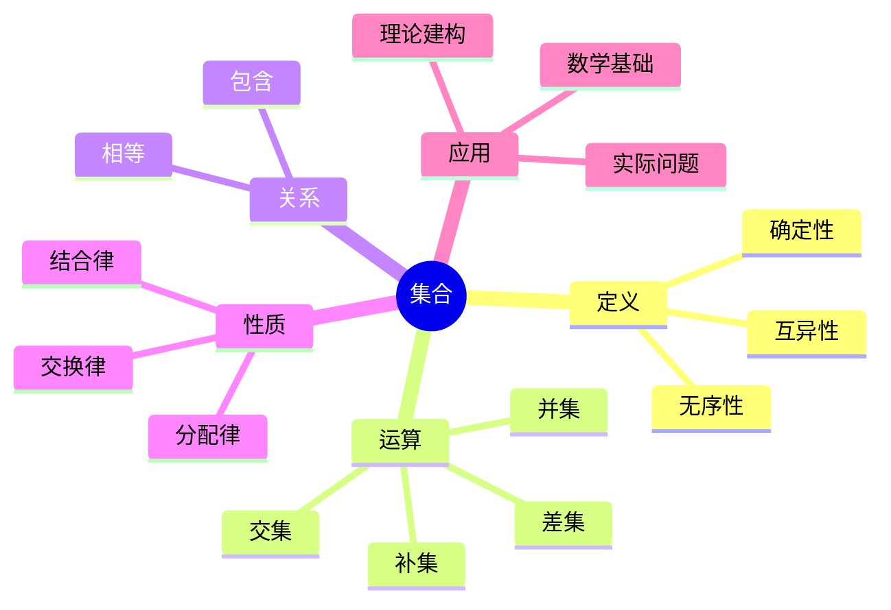
```mermaid
mindmap
  root((集合))
    定义
      确定性
      互异性
      无序性
    运算
      并集
      交集
      差集
      补集
    关系
      包含
      相等
    性质
      交换律
      结合律
      分配律
    应用
      数学基础
      实际问题
      理论建构
```

#### 5.2 矩阵对比：不同解释方式的对比

| 解释方式 | 特点 | 方法 | 工具 | 适用阶段 | 优势 | 局限 |
|---------|------|------|------|---------|------|------|
| **直观解释** | 具体、形象、可视 | 例子、类比、直观 | 图形、图像、动画 | 入门阶段 | 易于理解 | 不够严格 |
| **知性解释** | 概念、分类、抽象 | 定义、分类、结构 | 概念图、知识图谱 | 中级阶段 | 系统完整 | 不够直观 |
| **理性解释** | 公理、证明、形式化 | 公理、证明、系统 | 形式化工具、证明系统 | 高级阶段 | 严格准确 | 不够具体 |
| **多视角解释** | 多角度、整合 | 多视角、整合 | 多视角工具 | 所有阶段 | 全面深入 | 可能复杂 |

#### 5.3 多视角表征：从不同角度表征集合

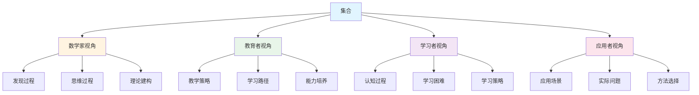
```mermaid
graph TD
    A[集合] --> B[数学家视角]
    A --> C[教育者视角]
    A --> D[学习者视角]
    A --> E[应用者视角]

    B --> B1[发现过程]
    B --> B2[思维过程]
    B --> B3[理论建构]

    C --> C1[教学策略]
    C --> C2[学习路径]
    C --> C3[能力培养]

    D --> D1[认知过程]
    D --> D2[学习困难]
    D --> D3[学习策略]

    E --> E1[应用场景]
    E --> E2[实际问题]
    E --> E3[方法选择]

    style A fill:#e1f5ff
    style B fill:#fff4e1
    style C fill:#e8f5e9
    style D fill:#f3e5f5
    style E fill:#fce4ec
```

#### 5.4 决策树：集合问题分类和策略选择

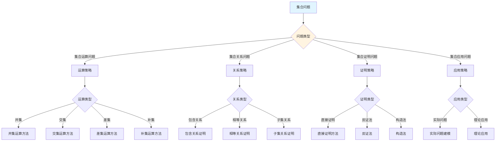
```mermaid
graph TD
    A[集合问题] --> B{问题类型}
    B -->|集合运算问题| C[运算策略]
    B -->|集合关系问题| D[关系策略]
    B -->|集合证明问题| E[证明策略]
    B -->|集合应用问题| F[应用策略]

    C --> C1{运算类型}
    C1 -->|并集| C2[并集运算方法]
    C1 -->|交集| C3[交集运算方法]
    C1 -->|差集| C4[差集运算方法]
    C1 -->|补集| C5[补集运算方法]

    D --> D1{关系类型}
    D1 -->|包含关系| D2[包含关系证明]
    D1 -->|相等关系| D3[相等关系证明]
    D1 -->|子集关系| D4[子集关系证明]

    E --> E1{证明类型}
    E1 -->|直接证明| E2[直接证明方法]
    E1 -->|反证法| E3[反证法]
    E1 -->|构造法| E4[构造法]

    F --> F1{应用类型}
    F1 -->|实际问题| F2[实际问题建模]
    F1 -->|理论应用| F3[理论应用]

    style A fill:#e1f5ff
    style B fill:#fff4e1
```

**说明**：

- **问题分类**：根据问题类型（运算、关系、证明、应用）进行分类
- **策略选择**：根据问题类型选择相应的解决策略
- **方法应用**：根据具体问题选择合适的方法

#### 5.5 决策逻辑路径：集合问题解决过程

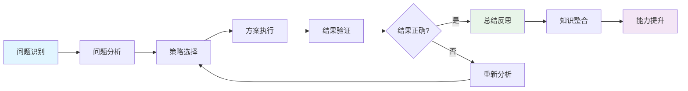
```mermaid
graph LR
    A[问题识别] --> B[问题分析]
    B --> C[策略选择]
    C --> D[方案执行]
    D --> E[结果验证]
    E --> F{结果正确?}
    F -->|是| G[总结反思]
    F -->|否| H[重新分析]
    H --> C

    G --> I[知识整合]
    I --> J[能力提升]

    style A fill:#e1f5ff
    style G fill:#e8f5e9
    style J fill:#f3e5f5
```

**说明**：

- **问题识别**：识别集合问题的类型和关键要素
- **问题分析**：分析问题的条件和目标
- **策略选择**：根据问题类型选择解决策略
- **方案执行**：执行选定的解决方案
- **结果验证**：验证结果的正确性
- **总结反思**：总结解题过程，反思解题方法
- **知识整合**：整合相关知识点
- **能力提升**：提升问题解决能力

#### 5.6 多维对比矩阵：集合概念特征对比

| 对比维度 | 集合定义 | 集合运算 | 集合关系 | 集合应用 |
|---------|---------|---------|---------|---------|
| **核心特征** | 确定性、互异性、无序性 | 并、交、差、补 | 包含、相等、子集 | 数学基础、实际问题、理论建构 |
| **理解难度** | ⭐⭐ | ⭐⭐⭐ | ⭐⭐⭐ | ⭐⭐⭐⭐ |
| **应用频率** | ⭐⭐⭐⭐⭐ | ⭐⭐⭐⭐⭐ | ⭐⭐⭐⭐ | ⭐⭐⭐ |
| **理论基础** | 集合论公理 | 集合运算律 | 集合关系性质 | 集合论应用 |
| **教学重点** | 概念理解 | 运算技能 | 关系证明 | 应用能力 |
| **学习阶段** | 入门阶段 | 入门-中级 | 中级阶段 | 中级-高级 |
| **认知维度** | 直观+知性 | 知性+理性 | 理性 | 理性+应用 |
| **思维表征** | 思维导图 | 决策树 | 决策逻辑路径 | 知识图谱 |

**说明**：

- **核心特征**：每个方面的核心特征
- **理解难度**：从1星到5星，表示理解难度
- **应用频率**：从1星到5星，表示应用频率
- **理论基础**：每个方面的理论基础
- **教学重点**：每个方面的教学重点
- **学习阶段**：每个方面的学习阶段
- **认知维度**：每个方面的认知维度
- **思维表征**：每个方面推荐的思维表征方法

---

## 🔍 数学论证：如何论证集合 (编号: C.CORE.001.06)

### 一、论证过程：从观察到反思

#### 1.1 观察（Observation）

**具体现象观察**：

- **现象1**：集合运算的规律性
  - 例如：观察$\{1,2\} \cup \{2,3\} = \{1,2,3\}$，$\{1,2\} \cap \{2,3\} = \{2\}$
  - **为什么重要**：这个现象揭示了集合运算的基本规律
- **现象2**：集合关系的传递性
  - 例如：如果$A \subseteq B$且$B \subseteq C$，则$A \subseteq C$
  - **为什么重要**：这个现象揭示了集合关系的逻辑结构

**模式识别**：

- **模式1**：集合运算与逻辑运算的对应
  - 例如：$x \in A \cup B \leftrightarrow x \in A \lor x \in B$
  - **为什么重要**：这个模式可能反映了集合与逻辑的深层联系
- **模式2**：集合的幂集大小规律
  - 例如：$|\mathcal{P}(\{1,2\})| = 4 = 2^2$，$|\mathcal{P}(\{1,2,3\})| = 8 = 2^3$
  - **为什么重要**：这个模式可能反映了集合的指数增长规律

**问题提出**：

- **问题1**：如何严格定义集合，避免悖论？
  - **为什么提出**：这个问题可能揭示集合的本质和基础
- **问题2**：如何比较无穷集合的大小？
  - **为什么提出**：这个问题可能揭示无穷的本质

#### 1.2 猜想（Conjecture）

**归纳猜想**：

- **猜想1**：集合运算满足交换律、结合律、分配律
  - **依据**：观察有限集合的运算规律
  - **为什么提出**：这个猜想可能揭示集合运算的一般规律
- **猜想2**：$n$元集合的幂集有$2^n$个元素
  - **依据**：观察小集合的幂集大小
  - **为什么提出**：这个猜想可能揭示幂集大小的一般规律

**类比猜想**：

- **猜想1**：集合运算类似于逻辑运算
  - **类比对象**：逻辑运算（$\lor$、$\land$、$\neqg$）
  - **为什么提出**：这个类比可能揭示集合与逻辑的深层结构
- **猜想2**：集合的包含关系类似于数的序关系
  - **类比对象**：数的序关系（$\leq$）
  - **为什么提出**：这个类比可能揭示集合关系的结构

**直觉猜想**：

- **猜想1**：所有集合的集合会导致矛盾
  - **直觉来源**：罗素悖论的直觉
  - **为什么提出**：这个直觉可能揭示集合论的基础问题
- **猜想2**：存在不同大小的无穷
  - **直觉来源**：Cantor的直觉
  - **为什么提出**：这个直觉可能揭示无穷的本质

#### 1.3 证明（Proof）

**直接证明**：

- **证明1**：集合运算的交换律
  - **证明思路**：使用集合的定义和逻辑运算的交换律
  - **关键步骤**：$x \in A \cup B \leftrightarrow x \in A \lor x \in B \leftrightarrow x \in B \lor x \in A \leftrightarrow x \in B \cup A$
  - **为什么这样证明**：这个证明方法直接、清晰
- **证明2**：幂集大小的公式
  - **证明思路**：使用数学归纳法
  - **关键步骤**：基础步骤$n=0$，归纳步骤$|\mathcal{P}(A \cup \{a\})| = 2|\mathcal{P}(A)|$
  - **为什么这样证明**：数学归纳法适合证明关于自然数的命题

**间接证明**：

- **反证法**：证明不存在"所有集合的集合"
  - **假设**：假设存在所有集合的集合$U$
  - **矛盾**：构造$R = \{x \in U : x \notin x\}$，导出$R \in R \leftrightarrow R \notin R$的矛盾
  - **为什么这样证明**：反证法适合证明否定性命题
- **构造法**：证明存在不可数集合
  - **构造方法**：使用Cantor对角线法构造不在列表中的实数
  - **验证**：验证构造的实数确实不在列表中
  - **为什么这样证明**：构造法适合证明存在性命题

**数学归纳法**：

- **归纳证明**：证明$n$元集合的幂集有$2^n$个元素
  - **基础步骤**：$n=0$时，$\emptyset$的幂集是$\{\emptyset\}$，有$2^0=1$个元素
  - **归纳步骤**：假设$n$元集合的幂集有$2^n$个元素，则$(n+1)$元集合的幂集有$2 \times 2^n = 2^{n+1}$个元素
  - **为什么这样证明**：数学归纳法适合证明关于自然数的命题

#### 1.4 反思（Reflection）

**过程回顾**：

- **论证回顾**：从观察集合运算规律，到猜想一般规律，再到严格证明
  - **成功之处**：成功建立了集合运算的严格理论
  - **不足之处**：朴素集合论存在悖论
  - **改进方向**：通过公理化避免悖论

**方法总结**：

- **证明方法**：使用了直接证明、反证法、构造法、数学归纳法
  - **方法特点**：直接证明清晰，反证法有效，构造法明确，归纳法严格
  - **适用范围**：不同方法适用于不同类型的命题
- **证明技巧**：使用逻辑运算的性质、集合的定义、数学归纳法
  - **技巧要点**：将集合问题转化为逻辑问题，使用归纳法处理自然数问题
  - **应用场景**：这些技巧可以应用于其他集合论问题

**理论意义**：

- **理论贡献**：建立了集合运算的严格理论，揭示了集合与逻辑的深层联系
  - **为什么重要**：这个论证揭示了集合论的基础结构
- **应用价值**：集合论为整个数学提供了基础
  - **为什么重要**：这个论证可以应用于所有数学分支

### 二、论证类型：多种推理方式

#### 2.1 归纳论证（Inductive Reasoning）

**不完全归纳**：

- **例子1**：从有限集合的运算规律归纳一般规律
  - **观察**：观察$\{1,2\} \cup \{2,3\} = \{1,2,3\}$，$\{1,2\} \cap \{2,3\} = \{2\}$
  - **结论**：集合运算满足交换律、结合律
  - **局限性**：不完全归纳的结论需要严格证明
- **例子2**：从幂集大小规律归纳一般公式
  - **观察**：$|\mathcal{P}(\{1\})| = 2$，$|\mathcal{P}(\{1,2\})| = 4$，$|\mathcal{P}(\{1,2,3\})| = 8$
  - **结论**：$n$元集合的幂集有$2^n$个元素
  - **局限性**：不完全归纳的结论需要数学归纳法严格证明

**数学归纳法**：

- **例子1**：证明幂集大小公式
  - **命题**：$n$元集合的幂集有$2^n$个元素
  - **证明**：基础步骤$n=0$，归纳步骤$|\mathcal{P}(A \cup \{a\})| = 2|\mathcal{P}(A)|$
  - **为什么有效**：数学归纳法是严格的归纳证明
- **例子2**：证明集合运算的性质
  - **命题**：集合运算满足分配律
  - **证明**：使用集合的定义和逻辑运算的分配律
  - **为什么有效**：数学归纳法适合证明关于自然数的命题

#### 2.2 演绎论证（Deductive Reasoning）

**三段论**：

- **例子1**：证明集合的包含关系
  - **大前提**：如果$A \subseteq B$且$B \subseteq C$，则$A \subseteq C$
  - **小前提**：$\{1\} \subseteq \{1,2\}$且$\{1,2\} \subseteq \{1,2,3\}$
  - **结论**：$\{1\} \subseteq \{1,2,3\}$
  - **为什么有效**：三段论是严格的演绎推理
- **例子2**：证明集合的相等关系
  - **大前提**：如果$A \subseteq B$且$B \subseteq A$，则$A = B$
  - **小前提**：$\{1,2\} \subseteq \{2,1\}$且$\{2,1\} \subseteq \{1,2\}$
  - **结论**：$\{1,2\} = \{2,1\}$
  - **为什么有效**：三段论是严格的演绎推理

**假言推理**：

- **例子1**：证明集合运算的性质
  - **前提**：如果$x \in A \cup B$，则$x \in A$或$x \in B$
  - **结论**：$A \subseteq A \cup B$
  - **为什么有效**：假言推理是严格的演绎推理
- **例子2**：证明集合关系的性质
  - **前提**：如果$A \subseteq B$，则$A \cup B = B$
  - **结论**：$\{1,2\} \cup \{1,2,3\} = \{1,2,3\}$
  - **为什么有效**：假言推理是严格的演绎推理

#### 2.3 类比论证（Analogical Reasoning）

**结构类比**：

- **例子1**：集合运算与逻辑运算的类比
  - **类比对象**：逻辑运算（$\lor$、$\land$、$\neqg$）
  - **相似性**：$A \cup B$对应$A \lor B$，$A \cap B$对应$A \land B$，$A^c$对应$\neqg A$
  - **结论**：集合运算与逻辑运算有相同的代数结构
  - **局限性**：类比不能替代严格证明
- **例子2**：集合的包含关系与数的序关系的类比
  - **类比对象**：数的序关系（$\leq$）
  - **相似性**：$A \subseteq B$对应$a \leq b$，都有传递性
  - **结论**：集合的包含关系与数的序关系有相似的结构
  - **局限性**：类比不能替代严格证明

**性质类比**：

- **例子1**：集合的幂集与数的幂运算的类比
  - **类比对象**：数的幂运算（$2^n$）
  - **相似性**：$|\mathcal{P}(A)| = 2^{|A|}$，类似于$2^n$
  - **结论**：集合的幂集大小与数的幂运算有相似规律
  - **局限性**：类比不能替代严格证明

#### 2.4 反证论证（Proof by Contradiction）

**反证法**：

- **例子1**：证明不存在"所有集合的集合"
  - **假设**：假设存在所有集合的集合$U$
  - **矛盾**：构造$R = \{x \in U : x \notin x\}$，导出$R \in R \leftrightarrow R \notin R$的矛盾
  - **结论**：不存在所有集合的集合
  - **为什么有效**：反证法是严格的间接证明
- **例子2**：证明集合运算的唯一性
  - **假设**：假设存在两个不同的并集
  - **矛盾**：导出集合相等的矛盾
  - **结论**：集合运算是唯一的
  - **为什么有效**：反证法是严格的间接证明

#### 2.5 构造论证（Constructive Reasoning）

**构造法**：

- **例子1**：构造不可数集合
  - **构造方法**：使用Cantor对角线法，构造不在列表中的实数
  - **验证**：验证构造的实数确实不在列表中
  - **为什么有效**：构造法是严格的直接证明
- **例子2**：构造von Neumann自然数
  - **构造方法**：$0 = \emptyset$，$n+1 = n \cup \{n\}$
  - **验证**：验证构造的自然数满足Peano公理
  - **为什么有效**：构造法是严格的直接证明

### 三、论证可视化：用图形表示论证过程

#### 3.1 论证流程图

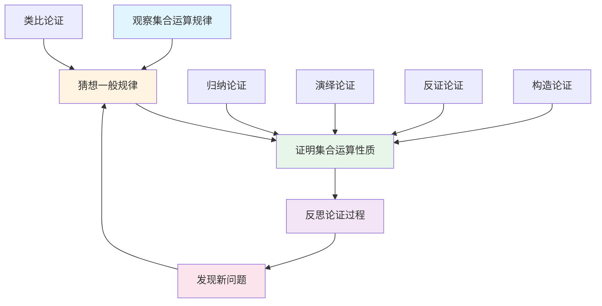
```mermaid
graph TD
    A[观察集合运算规律] --> B[猜想一般规律]
    B --> C[证明集合运算性质]
    C --> D[反思论证过程]
    D --> E[发现新问题]
    E --> B

    F[归纳论证] --> C
    G[演绎论证] --> C
    H[类比论证] --> B
    I[反证论证] --> C
    J[构造论证] --> C

    style A fill:#e1f5ff
    style B fill:#fff4e1
    style C fill:#e8f5e9
    style D fill:#f3e5f5
    style E fill:#fce4ec
```

#### 3.2 论证类型对比

| 论证类型 | 特点 | 适用场景 | 优势 | 局限 |
|---------|------|---------|------|------|
| **归纳论证** | 从特殊到一般 | 发现规律、提出猜想 | 启发性强 | 结论或然 |
| **演绎论证** | 从一般到特殊 | 严格证明、逻辑推理 | 结论必然 | 需要前提 |
| **类比论证** | 基于相似性 | 启发思路、发现联系 | 创造性高 | 结论或然 |
| **反证论证** | 假设否定 | 证明否定性命题 | 间接有效 | 需要矛盾 |
| **构造论证** | 直接构造 | 证明存在性命题 | 直接明确 | 需要构造 |

#### 3.3 论证思维导图

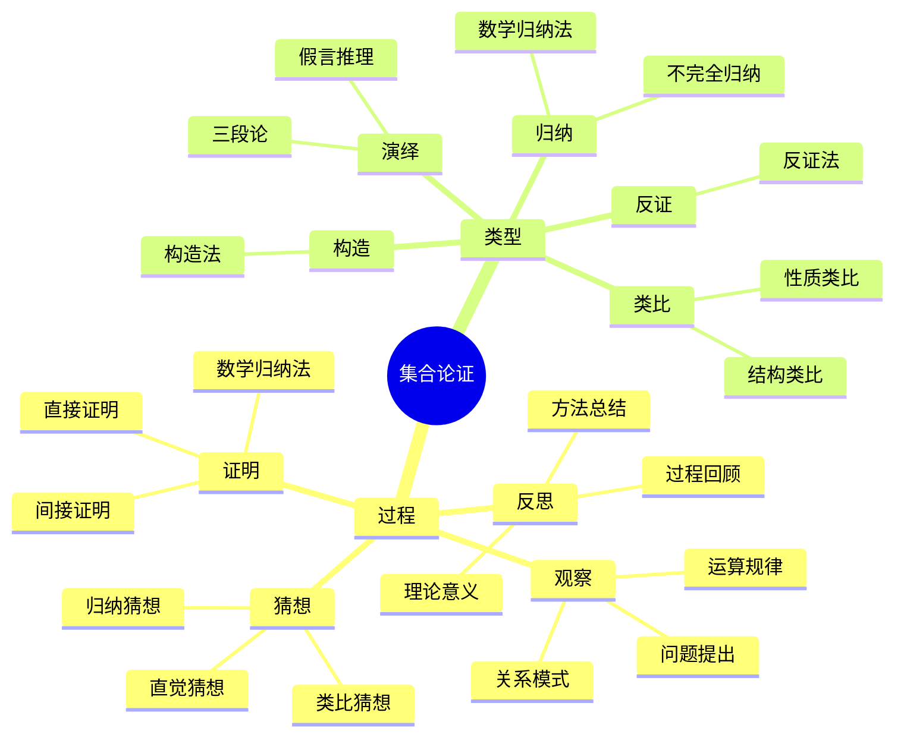
```mermaid
mindmap
  root((集合论证))
    过程
      观察
        运算规律
        关系模式
        问题提出
      猜想
        归纳猜想
        类比猜想
        直觉猜想
      证明
        直接证明
        间接证明
        数学归纳法
      反思
        过程回顾
        方法总结
        理论意义
    类型
      归纳
        不完全归纳
        数学归纳法
      演绎
        三段论
        假言推理
      类比
        结构类比
        性质类比
      反证
        反证法
      构造
        构造法
```

---

## 🔗 三视角整合 (编号: C.CORE.001.07)

### 三个视角的关联

**认知学视角 ↔ 教育学视角**:

- 认知学视角揭示的理解机制，指导教育学视角的教学设计
- 教育学视角的教学实践，验证认知学视角的理论
- 例如：认知障碍指导教学难点的设计

**认知学视角 ↔ 数学家视角**:

- 数学家视角的思维过程，启发认知学视角的认知路径
- 认知学视角的认知障碍，解释数学家视角的历史困难
- 例如：罗素悖论既是历史问题，也是认知障碍

**教育学视角 ↔ 数学家视角**:

- 数学家视角的历史发展，为教育学视角提供教学素材
- 教育学视角的教学策略，帮助学习者理解数学家视角的思维过程
- 例如：历史背景可以作为教学引入

### 如何综合运用三个视角

**学习建议**:

1. **从认知学视角开始**: 先建立直观理解
2. **用教育学视角深化**: 通过教学路径系统学习
3. **用数学家视角升华**: 理解概念的深层意义和历史背景

**教学建议**:

1. **引入阶段**: 用数学家视角的问题起源激发兴趣
2. **探索阶段**: 用认知学视角的认知过程引导发现
3. **形式化阶段**: 用教育学视角的教学策略系统教学
4. **巩固阶段**: 综合三个视角深化理解

---

## 📚 参考文献 (编号: C.CORE.001.08)

### 权威资源

- Wikipedia: [Set (Mathematics)](https://en.wikipedia.org/wiki/Set_(mathematics))
- Wikipedia: [Zermelo-Fraenkel Set Theory](https://en.wikipedia.org/wiki/Zermelo%E2%80%93Fraenkel_set_theory)
- Metamath: [set.mm - Set Theory](http://us.metamath.org/mpeuni/mmset.html)[需更新][需更新]

### 经典教材

- Enderton, H. B. (1977). *Elements of Set Theory*. Academic Press.
- Jech, T. (2003). *Set Theory: The Third Millennium Edition*. Springer.
- Kunen, K. (2011). *Set Theory*. College Publications.

### 研究论文

- Cantor, G. (1874). "Über eine Eigenschaft des Inbegriffes aller reellen algebraischen Zahlen". *Journal für die reine und angewandte Mathematik*.
- Zermelo, E. (1908). "Untersuchungen über die Grundlagen der Mengenlehre I". *Mathematische Annalen*.
- Gödel, K. (1938). "The Consistency of the Axiom of Choice and of the Generalized Continuum-Hypothesis". *Proceedings of the National Academy of Sciences*.
- Cohen, P. J. (1963). "The Independence of the Continuum Hypothesis". *Proceedings of the National Academy of Sciences*.

---

**创建日期**: 2025年1月
**最后更新**: 2026-04-05
**维护状态**: 持续更新中

---

## 📚 附录: 扩展分析


### 1. 多理论分析

---
msc_primary: "00A99"
---

# 集合概念的多理论分析示例 / Multi-Theory Analysis Example: Set Concept


---


## 🎯 一、Tall三个世界理论分析 / Tall's Three Worlds Theory Analysis (编号: C.CORE.001.MULTI.01)

### 1.1 感知-操作世界（Embodied World）

**集合在感知-操作世界中的理解 / Understanding Sets in the Embodied World**：

- **具体经验 / Concrete Experience**：
  - 通过观察和操作具体物体集合理解集合概念 / Understanding set concepts through observing and manipulating concrete object collections
  - 例如：一篮子苹果、一盒铅笔、一群学生 / Examples: a basket of apples, a box of pencils, a group of students
  - 通过分类活动理解集合的包含关系 / Understanding set inclusion relationships through classification activities

- **身体动作 / Bodily Actions**：
  - 通过数数、分类、比较等动作理解集合 / Understanding sets through actions such as counting, classifying, and comparing
  - 通过画圈、标记等操作表示集合 / Representing sets through operations such as drawing circles and marking
  - 通过集合运算（并、交、差）的具体操作理解 / Understanding through concrete operations of set operations (union, intersection, difference)

- **直观理解 / Intuitive Understanding**：
  - 集合是"一些东西的集合" / A set is a "collection of things"
  - 集合有大小（元素个数） / Sets have size (number of elements)
  - 集合之间有关系（包含、相等、相交等） / Sets have relationships (inclusion, equality, intersection, etc.)

**教学建议 / Teaching Suggestions**：

- 使用具体物体（如积木、卡片）进行集合操作 / Use concrete objects (such as blocks, cards) for set operations
- 通过游戏和活动理解集合概念 / Understand set concepts through games and activities
- 使用图形和图表可视化集合 / Use graphics and diagrams to visualize sets

### 1.2 概念-符号世界（Symbolic World）

**集合在概念-符号世界的理解 / Understanding Sets in the Symbolic World**：

- **符号表示 / Symbolic Representation**：
  - 使用集合符号：$\{1, 2, 3\}$、$\emptyset$、$\mathbb{N}$、$\mathbb{R}$ / Using set notation: $\{1, 2, 3\}$, $\emptyset$, $\mathbb{N}$, $\mathbb{R}$
  - 使用集合运算符号：$\cup$（并）、$\cap$（交）、$\setminus$（差）、$\subseteq$（包含） / Using set operation symbols: $\cup$ (union), $\cap$ (intersection), $\setminus$ (difference), $\subseteq$ (subset)
  - 使用逻辑符号：$\in$（属于）、$\notin$（不属于） / Using logical symbols: $\in$ (element of), $\notin$ (not element of)

- **概念理解 / Conceptual Understanding**：
  - 集合是满足某种性质的对象的全体 / A set is the collection of all objects satisfying a certain property
  - 集合的元素具有确定性、互异性、无序性 / Set elements have determinacy, distinctness, and unorderedness
  - 集合运算遵循特定规律（交换律、结合律、分配律等） / Set operations follow specific laws (commutative, associative, distributive, etc.)

- **抽象操作 / Abstract Operations**：
  - 通过符号操作进行集合运算 / Performing set operations through symbolic operations
  - 通过逻辑推理证明集合关系 / Proving set relationships through logical reasoning
  - 通过集合论语言表达数学概念 / Expressing mathematical concepts through set-theoretic language

**教学建议 / Teaching Suggestions**：

- 逐步引入集合符号 / Gradually introduce set notation
- 通过符号操作练习集合运算 / Practice set operations through symbolic operations
- 使用集合论语言表达数学概念 / Use set-theoretic language to express mathematical concepts

### 1.3 形式-公理世界（Formal World）

**集合在形式-公理世界的理解 / Understanding Sets in the Formal World**：

- **公理系统 / Axiomatic System**：
  - ZFC公理系统（Zermelo-Fraenkel集合论） / ZFC axiom system (Zermelo-Fraenkel set theory)
  - 空集公理、配对公理、并集公理、幂集公理等 / Empty set axiom, pairing axiom, union axiom, power set axiom, etc.
  - 通过公理严格定义集合 / Strictly defining sets through axioms

- **形式化定义 / Formal Definition**：
  - 集合的形式化定义：$x \in A$ 或 $x \notin A$ / Formal definition of set: $x \in A$ or $x \notin A$
  - 集合运算的形式化定义 / Formal definition of set operations
  - 集合关系的严格证明 / Strict proof of set relationships

- **逻辑推理 / Logical Reasoning**：
  - 通过逻辑推理证明集合性质 / Proving set properties through logical reasoning
  - 通过形式化方法研究集合论 / Studying set theory through formal methods
  - 通过公理系统建立数学基础 / Establishing mathematical foundations through axiom systems

**教学建议 / Teaching Suggestions**：

- 介绍ZFC公理系统 / Introduce ZFC axiom system
- 通过形式化证明理解集合性质 / Understand set properties through formal proofs
- 研究集合论在数学基础中的作用 / Study the role of set theory in mathematical foundations

### 1.4 三个世界的转换 / Transitions Between Worlds

**转换路径 / Transition Paths**：

1. **从感知-操作到概念-符号 / From Embodied to Symbolic**：
   - 将具体物体集合抽象为集合符号 / Abstracting concrete object collections into set notation
   - 从操作中提取集合概念 / Extracting set concepts from operations
   - 例如：从"一篮子苹果"到"集合$A = \{苹果_1, 苹果_2, \ldots\}$" / Example: from "a basket of apples" to "set $A = \{apple_1, apple_2, \ldots\}$"

2. **从概念-符号到形式-公理 / From Symbolic to Formal**：
   - 将集合概念形式化为公理 / Formalizing set concepts into axioms
   - 从符号操作到逻辑推理 / From symbolic operations to logical reasoning
   - 例如：从"$A \cup B$"到"并集公理" / Example: from "$A \cup B$" to "union axiom"

**转换支持 / Transition Support**：

- **识别转换困难 / Identifying Transition Difficulties**：
  - 识别从具体到抽象的困难 / Identifying difficulties in transitioning from concrete to abstract
  - 识别从符号到形式的困难 / Identifying difficulties in transitioning from symbolic to formal

- **设计转换活动 / Designing Transition Activities**：
  - 设计过渡活动支持转换 / Designing transition activities to support transitions
  - 提供渐进式支持 / Providing progressive support

- **评估转换效果 / Assessing Transition Effectiveness**：
  - 评估转换成功 / Assessing transition success
  - 提供反馈支持 / Providing feedback support

---

## 🔬 二、Dubinsky APOS理论分析 (编号: C.CORE.001.MULTI.02)

### 2.1 Action（动作）

**集合的Action阶段**：

- **具体操作**：
  - 列出集合的元素：$\{1, 2, 3, 4\}$`
  - 判断元素是否属于集合：$2 \in \{1, 2, 3\}$？
  - 进行集合运算：$\{1, 2\} \cup \{2, 3\} = ?$

- **操作特点**：
  - 需要外部指导（教师、教材）
  - 操作是具体的、机械的
  - 需要逐步执行

- **学习活动**：
  - 练习列出集合元素
  - 练习判断元素归属
  - 练习基本集合运算

**教学建议**：

- 提供大量练习机会
- 给予及时反馈
- 逐步增加操作复杂度

### 2.2 Process（过程）

**集合的Process阶段 / Process Stage of Set**：

- **内化过程 / Internalization Process**：
  - 将集合操作内化为心理过程 / Internalizing set operations as a mental process
  - 理解集合运算的内在逻辑 / Understanding the internal logic of set operations
  - 能够独立完成集合运算 / Being able to perform set operations independently

- **过程理解 / Process Understanding**：
  - 理解"并集"是"所有元素的集合" / Understanding that "union" is "the set of all elements"
  - 理解"交集"是"共同元素的集合" / Understanding that "intersection" is "the set of common elements"
  - 理解"差集"是"属于A但不属于B的元素" / Understanding that "difference" is "elements that belong to A but not to B"

- **灵活应用 / Flexible Application**：
  - 能够灵活应用集合运算 / Being able to flexibly apply set operations
  - 能够处理复杂的集合问题 / Being able to handle complex set problems
  - 能够理解集合运算的性质 / Being able to understand properties of set operations

**教学建议 / Teaching Suggestions**：

- 引导学生内化操作过程 / Guide students to internalize operation processes
- 通过变式练习加深理解 / Deepen understanding through variant exercises
- 鼓励学生独立思考和解决问题 / Encourage students to think independently and solve problems

### 2.3 Object（对象）

**集合的Object阶段**：

- **对象化理解**：
  - 将集合视为独立的对象
  - 可以对集合进行操作
  - 可以将集合作为其他概念的基础

- **对象操作**：
  - 集合的集合（幂集）
  - 集合的运算结果仍是集合
  - 集合可以作为函数的定义域和值域

- **抽象理解**：
  - 理解集合的抽象性质
  - 理解集合在数学中的基础地位
  - 理解集合论作为数学基础的作用

**教学建议**：

- 引导学生将集合视为对象
- 研究集合的集合（幂集）
- 探索集合在数学中的广泛应用

### 2.4 Schema（图式）

**集合的Schema阶段**：

- **完整图式**：
  - 整合集合的定义、运算、性质
  - 形成完整的集合概念图式
  - 理解集合与其他数学概念的关系

- **图式应用**：
  - 能够灵活应用集合概念
  - 能够解决复杂的集合问题
  - 能够理解集合论在数学中的作用

- **图式扩展**：
  - 理解集合论的推广（范畴论）
  - 理解集合论在数学基础中的作用
  - 理解集合论与其他数学分支的关系

**教学建议**：

- 帮助学生建立完整的集合概念图式
- 探索集合论与其他数学分支的关系
- 研究集合论在数学基础中的作用

### 2.5 APOS发展路径 / APOS Development Path

**发展过程 / Development Process**：

1. **Action → Process / 动作到过程**：
   - 将外部集合操作内化为心理过程 / Internalizing external set operations as mental processes
   - 从需要指导到独立完成 / From needing guidance to independent completion
   - 例如：从"计算$A \cup B$"到"理解并集过程" / Example: from "computing $A \cup B$" to "understanding the union process"

2. **Process → Object / 过程到对象**：
   - 将集合运算过程对象化 / Objectifying set operation processes
   - 从过程理解到对象理解 / From process understanding to object understanding
   - 例如：从"理解并集过程"到"将集合视为对象" / Example: from "understanding the union process" to "treating sets as objects"

3. **Object → Schema / 对象到图式**：
   - 整合多个集合对象和过程 / Integrating multiple set objects and processes
   - 形成完整的集合概念图式 / Forming a complete set concept schema
   - 例如：整合集合的各种理解和应用 / Example: integrating various understandings and applications of sets

**发展支持 / Development Support**：

- **识别发展困难 / Identifying Development Difficulties**：
  - 识别Action到Process的困难 / Identifying difficulties from Action to Process
  - 识别Process到Object的困难 / Identifying difficulties from Process to Object
  - 识别Object到Schema的困难 / Identifying difficulties from Object to Schema

- **设计发展活动 / Designing Development Activities**：
  - 设计过渡活动支持发展 / Designing transition activities to support development
  - 提供渐进式支持 / Providing progressive support

- **评估发展效果 / Assessing Development Effectiveness**：
  - 评估发展成功 / Assessing development success
  - 提供反馈支持 / Providing feedback support

---

## 💬 三、Sfard交流理论分析 / Sfard's Commognitive Theory Analysis (编号: C.CORE.001.MULTI.03)

### 3.1 集合作为交流工具 / Set as a Communication Tool

**集合的交流功能 / Communicative Function of Sets**：

- **数学交流 / Mathematical Communication**：
  - 集合用于表达数学概念：自然数集$\mathbb{N}$、实数集$\mathbb{R}$ / Sets are used to express mathematical concepts: natural number set $\mathbb{N}$, real number set $\mathbb{R}$
  - 集合用于描述数学结构：群、环、域的定义都基于集合 / Sets are used to describe mathematical structures: definitions of groups, rings, and fields are all based on sets
  - 集合用于表达数学关系：函数、映射、关系都基于集合 / Sets are used to express mathematical relationships: functions, mappings, and relations are all based on sets

- **概念表达 / Conceptual Expression**：
  - 通过集合表达"所有满足某种性质的对象" / Expressing "all objects satisfying a certain property" through sets
  - 通过集合运算表达"并"、"交"、"差"等概念 / Expressing concepts such as "union", "intersection", "difference" through set operations
  - 通过集合关系表达"包含"、"相等"等概念 / Expressing concepts such as "inclusion" and "equality" through set relationships

- **问题解决 / Problem Solving**：
  - 使用集合语言表达问题 / Using set language to express problems
  - 使用集合运算解决问题 / Using set operations to solve problems
  - 使用集合论方法证明定理 / Using set theory methods to prove theorems

### 3.2 集合学习的实践参与 / Practice Participation in Set Learning

**通过参与数学实践学习集合 / Learning Sets through Participation in Mathematical Practice**：

- **实践场景 / Practice Scenarios**：
  - 通过分类活动学习集合 / Learning sets through classification activities
  - 通过数据分析学习集合运算 / Learning set operations through data analysis
  - 通过逻辑推理学习集合关系 / Learning set relationships through logical reasoning
  - 通过数学证明学习集合论方法 / Learning set theory methods through mathematical proofs

- **实践方式 / Practice Methods**：
  - 参与数学讨论，使用集合语言 / Participating in mathematical discussions, using set language
  - 解决数学问题，应用集合方法 / Solving mathematical problems, applying set methods
  - 研究数学理论，理解集合论作用 / Studying mathematical theory, understanding the role of set theory

- **学习效果 / Learning Outcomes**：
  - 通过实践理解集合概念 / Understanding set concepts through practice
  - 通过应用掌握集合方法 / Mastering set methods through application
  - 通过参与形成数学思维 / Forming mathematical thinking through participation

**教学建议 / Teaching Suggestions**：

- 设计数学实践活动 / Design mathematical practice activities
- 鼓励学生参与数学讨论 / Encourage students to participate in mathematical discussions
- 提供实际问题解决机会 / Provide opportunities for solving real-world problems

---

## 🧠 四、Piaget认知发展理论分析 / Piaget's Cognitive Development Theory Analysis (编号: C.CORE.001.MULTI.04)

### 4.1 具体运算阶段（7-12岁）/ Concrete Operational Stage (7-12 years)

**集合在具体运算阶段的理解 / Understanding Sets in the Concrete Operational Stage**：

- **具体对象 / Concrete Objects**：
  - 通过具体物体理解集合 / Understanding sets through concrete objects
  - 例如：一篮子苹果、一盒铅笔 / Examples: a basket of apples, a box of pencils
  - 需要具体对象支持理解 / Requires concrete object support for understanding

- **逻辑思维 / Logical Thinking**：
  - 能够理解集合的包含关系 / Being able to understand set inclusion relationships
  - 能够进行简单的集合运算 / Being able to perform simple set operations
  - 但需要具体对象支持 / But requires concrete object support

- **教学建议 / Teaching Suggestions**：
  - 使用具体物体和图形 / Use concrete objects and graphics
  - 通过游戏和活动学习 / Learn through games and activities
  - 逐步引入抽象概念 / Gradually introduce abstract concepts

### 4.2 形式运算阶段（12+岁）/ Formal Operational Stage (12+ years)

**集合在形式运算阶段的理解 / Understanding Sets in the Formal Operational Stage**：

- **抽象思维 / Abstract Thinking**：
  - 能够理解抽象的集合概念 / Being able to understand abstract set concepts
  - 能够进行符号操作 / Being able to perform symbolic operations
  - 能够进行逻辑推理 / Being able to perform logical reasoning

- **形式推理 / Formal Reasoning**：
  - 能够证明集合性质 / Being able to prove set properties
  - 能够理解集合论公理 / Being able to understand set theory axioms
  - 能够研究集合论理论 / Being able to study set theory

- **教学建议 / Teaching Suggestions**：
  - 引入抽象概念和符号 / Introduce abstract concepts and symbols
  - 进行逻辑推理训练 / Conduct logical reasoning training
  - 研究集合论理论 / Study set theory

---

## 🌍 五、Vygotsky社会文化理论分析 / Vygotsky's Sociocultural Theory Analysis (编号: C.CORE.001.MULTI.05)

### 5.1 最近发展区（ZPD）/ Zone of Proximal Development (ZPD)

**集合学习的最近发展区 / Zone of Proximal Development in Set Learning**：

- **独立水平 / Independent Level**：
  - 学生可以独立理解集合的基本概念 / Students can independently understand basic set concepts
  - 学生可以独立进行基本集合运算 / Students can independently perform basic set operations
  - 学生可以独立解决简单集合问题 / Students can independently solve simple set problems

- **最近发展区 / Zone of Proximal Development**：
  - 需要指导才能理解集合的抽象性质 / Requires guidance to understand abstract properties of sets
  - 需要指导才能掌握复杂集合运算 / Requires guidance to master complex set operations
  - 需要指导才能解决复杂集合问题 / Requires guidance to solve complex set problems

- **潜在水平 / Potential Level**：
  - 未来可能理解集合论公理系统 / May understand set theory axiom systems in the future
  - 未来可能掌握集合论方法 / May master set theory methods in the future
  - 未来可能研究集合论理论 / May study set theory in the future

### 5.2 社会文化工具 / Sociocultural Tools

**集合作为社会文化工具 / Sets as Sociocultural Tools**：

- **数学符号 / Mathematical Symbols**：
  - 集合符号是数学交流的工具 / Set symbols are tools for mathematical communication
  - 通过社会文化实践学习集合符号 / Learning set symbols through sociocultural practice
  - 通过数学实践掌握集合方法 / Mastering set methods through mathematical practice

- **数学语言 / Mathematical Language**：
  - 集合论语言是数学表达的工具 / Set-theoretic language is a tool for mathematical expression
  - 通过参与数学实践学习集合语言 / Learning set language through participation in mathematical practice
  - 通过数学交流掌握集合表达 / Mastering set expression through mathematical communication

**教学建议 / Teaching Suggestions**：

- 提供适当的学习支持 / Provide appropriate learning support
- 设计最近发展区的学习活动 / Design learning activities in the zone of proximal development
- 鼓励学生参与数学实践和交流 / Encourage students to participate in mathematical practice and communication

---

## 🔄 六、多理论整合分析 / Multi-Theory Integration Analysis (编号: C.CORE.001.MULTI.06)

### 6.1 理论共同点 / Theoretical Commonalities

**各理论在集合概念分析中的共同点 / Commonalities of Theories in Set Concept Analysis**：

1. **多层次理解 / Multi-Level Understanding**：
   - 都强调从具体到抽象的发展 / All emphasize development from concrete to abstract
   - Tall的三个世界、APOS的四个阶段、Piaget的发展阶段都体现这一点 / Tall's three worlds, APOS's four stages, and Piaget's developmental stages all reflect this

2. **实践重要性 / Importance of Practice**：
   - 都强调实践在学习中的作用 / All emphasize the role of practice in learning
   - Sfard的交流理论、Vygotsky的社会文化理论都强调这一点 / Sfard's communication theory and Vygotsky's sociocultural theory both emphasize this

3. **认知发展 / Cognitive Development**：
   - 都关注认知发展的过程 / All focus on the process of cognitive development
   - 各理论都描述了从简单到复杂的发展 / Each theory describes development from simple to complex

### 6.2 理论互补性 / Theoretical Complementarity

**各理论在集合概念分析中的互补性 / Complementarity of Theories in Set Concept Analysis**：

1. **Tall三个世界 / Tall's Three Worlds**：
   - 适用于理解集合概念的不同层次 / Applicable to understanding different levels of set concepts
   - 从感知操作到形式公理的发展 / Development from embodied operations to formal axioms

2. **APOS理论 / APOS Theory**：
   - 适用于分析集合概念的学习过程 / Applicable to analyzing the learning process of set concepts
   - 从动作到图式的发展 / Development from action to schema

3. **Sfard交流理论 / Sfard's Communication Theory**：
   - 适用于设计集合概念的实践活动 / Applicable to designing practice activities for set concepts
   - 通过数学实践学习集合 / Learning sets through mathematical practice

4. **Piaget理论 / Piaget's Theory**：
   - 适用于理解集合概念的认知发展阶段 / Applicable to understanding cognitive development stages of set concepts
   - 从具体运算到形式运算的发展 / Development from concrete operations to formal operations

5. **Vygotsky理论 / Vygotsky's Theory**：
   - 适用于设计集合概念的学习支持 / Applicable to designing learning support for set concepts
   - 通过最近发展区促进学习 / Promoting learning through the zone of proximal development

### 6.3 整合应用框架

**多理论整合应用**：

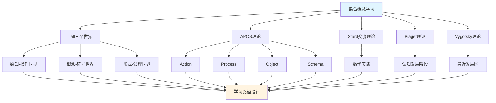
```mermaid
graph TB
    A[集合概念学习] --> B[Tall三个世界]
    A --> C[APOS理论]
    A --> D[Sfard交流理论]
    A --> E[Piaget理论]
    A --> F[Vygotsky理论]

    B --> G[感知-操作世界]
    B --> H[概念-符号世界]
    B --> I[形式-公理世界]

    C --> J[Action]
    C --> K[Process]
    C --> L[Object]
    C --> M[Schema]

    D --> N[数学实践]
    E --> O[认知发展阶段]
    F --> P[最近发展区]

    G --> Q[学习路径设计]
    H --> Q
    I --> Q
    J --> Q
    K --> Q
    L --> Q
    M --> Q
    N --> Q
    O --> Q
    P --> Q

    style A fill:#e1f5ff
    style Q fill:#fff4e1
```

---

## 📊 七、集合概念的多理论学习路径 / Multi-Theory Learning Path for Set Concept (编号: C.CORE.001.MULTI.07)

### 7.1 入门阶段（Tall感知-操作世界 + APOS Action）/ Entry Stage (Tall Embodied World + APOS Action)

**学习目标 / Learning Objectives**：

- 通过具体物体理解集合概念 / Understanding set concepts through concrete objects
- 掌握基本集合操作 / Mastering basic set operations

**学习活动 / Learning Activities**：

- 使用具体物体（积木、卡片）进行集合操作 / Using concrete objects (blocks, cards) for set operations
- 练习列出集合元素 / Practicing listing set elements
- 练习判断元素归属 / Practicing determining element membership
- 练习基本集合运算 / Practicing basic set operations

**评估标准 / Assessment Criteria**：

- 能够独立完成基本集合操作 / Being able to independently complete basic set operations
- 能够理解集合的基本概念 / Being able to understand basic set concepts

### 7.2 中级阶段（Tall概念-符号世界 + APOS Process/Object）/ Intermediate Stage (Tall Symbolic World + APOS Process/Object)

**学习目标 / Learning Objectives**：

- 理解集合的符号表示 / Understanding symbolic representation of sets
- 掌握集合运算的内在逻辑 / Mastering the internal logic of set operations
- 将集合视为对象 / Viewing sets as objects

**学习活动 / Learning Activities**：

- 学习集合符号和运算符号 / Learning set notation and operation symbols
- 通过符号操作进行集合运算 / Performing set operations through symbolic operations
- 理解集合运算的性质 / Understanding properties of set operations
- 研究集合的集合（幂集） / Studying sets of sets (power sets)

**评估标准 / Assessment Criteria**：

- 能够灵活应用集合符号 / Being able to flexibly apply set notation
- 能够理解集合运算的内在逻辑 / Being able to understand the internal logic of set operations
- 能够将集合视为对象进行操作 / Being able to operate on sets as objects

### 7.3 高级阶段（Tall形式-公理世界 + APOS Schema + Sfard实践）/ Advanced Stage (Tall Formal World + APOS Schema + Sfard Practice)

**学习目标 / Learning Objectives**：

- 理解集合论公理系统 / Understanding set theory axiom system
- 形成完整的集合概念图式 / Forming a complete set concept schema
- 通过数学实践应用集合论 / Applying set theory through mathematical practice

**学习活动 / Learning Activities**：

- 学习ZFC公理系统 / Learning ZFC axiom system
- 通过形式化证明理解集合性质 / Understanding set properties through formal proofs
- 研究集合论在数学基础中的作用 / Studying the role of set theory in mathematical foundations
- 参与数学实践，应用集合论方法 / Participating in mathematical practice, applying set theory methods

**评估标准 / Assessment Criteria**：

- 能够理解集合论公理系统 / Being able to understand set theory axiom system
- 能够形成完整的集合概念图式 / Being able to form a complete set concept schema
- 能够通过数学实践应用集合论 / Being able to apply set theory through mathematical practice

---

## 🧠 七、元认知理论分析 / Metacognitive Theory Analysis (编号: C.CORE.001.MULTI.07)

### 7.1 元认知知识（Metacognitive Knowledge）

**关于集合概念的知识 / Knowledge About the Set Concept**：

- **概念知识 / Conceptual Knowledge**：
  - 集合的定义：由确定对象组成的整体 / A set is a collection of distinct objects
  - 集合的性质：确定性、互异性、无序性 / Properties: determinacy, distinctness, unorderedness
  - 集合的表示方法：列举法、描述法、图示法 / Representation methods: roster, set-builder, Venn diagrams
  - 集合与其他概念的关系：集合是数学的基础概念 / Relationship: sets are foundational concepts in mathematics

- **策略知识 / Strategy Knowledge**：
  - 学习策略：通过具体例子理解集合，通过分类活动掌握集合运算 / Learning strategies: understand sets through concrete examples, master set operations through classification activities
  - 理解策略：从具体到抽象，从简单到复杂 / Understanding strategies: from concrete to abstract, from simple to complex
  - 应用策略：将集合方法应用到实际问题中 / Application strategies: apply set methods to real-world problems

- **任务知识 / Task Knowledge**：
  - 典型任务：集合运算、集合关系判断、集合证明 / Typical tasks: set operations, set relationship judgment, set proofs
  - 任务难度：基础任务（集合运算）→ 中级任务（集合关系）→ 高级任务（集合证明） / Task difficulty: basic (set operations) → intermediate (set relationships) → advanced (set proofs)
  - 任务要求：理解集合概念，掌握集合运算，能够进行集合推理 / Task requirements: understand set concepts, master set operations, be able to reason about sets

### 7.2 元认知监控（Metacognitive Monitoring）

**理解监控 / Comprehension Monitoring**：

- **自我提问 / Self-Questioning**：
  - "我理解集合的基本概念了吗？" / "Do I understand the basic concept of sets?"
  - "我能区分集合和元素吗？" / "Can I distinguish between sets and elements?"
  - "我理解集合运算的含义吗？" / "Do I understand the meaning of set operations?"

- **理解检查 / Comprehension Checking**：
  - 能否用自己的话解释集合概念？ / Can I explain the concept of sets in my own words?
  - 能否识别集合运算的错误？ / Can I identify errors in set operations?
  - 能否判断集合关系的正确性？ / Can I judge the correctness of set relationships?

- **困难识别 / Difficulty Identification**：
  - 识别理解困难：空集概念、无限集合、集合的集合 / Identify comprehension difficulties: empty set concept, infinite sets, sets of sets
  - 识别运算困难：复杂集合运算、集合证明 / Identify operation difficulties: complex set operations, set proofs

**过程监控 / Process Monitoring**：

- **学习过程监控 / Learning Process Monitoring**：
  - 监控学习进度：是否按计划学习？ / Monitor learning progress: Am I learning according to plan?
  - 监控学习效果：是否掌握了集合概念？ / Monitor learning effectiveness: Have I mastered the concept of sets?
  - 监控学习困难：遇到了哪些困难？ / Monitor learning difficulties: What difficulties have I encountered?

- **策略使用监控 / Strategy Use Monitoring**：
  - 使用的策略是否有效？ / Is the strategy I'm using effective?
  - 是否需要调整策略？ / Do I need to adjust my strategy?
  - 策略使用是否正确？ / Am I using the strategy correctly?

### 7.3 元认知调节（Metacognitive Regulation）

**计划调节 / Planning Regulation**：

- **学习计划制定 / Learning Plan Development**：
  - 制定学习计划：先学集合基本概念，再学集合运算，最后学集合应用 / Develop learning plan: first learn basic set concepts, then learn set operations, finally learn set applications
  - 调整学习计划：根据学习情况调整计划 / Adjust learning plan: adjust plan based on learning situation
  - 优化学习路径：选择最适合自己的学习路径 / Optimize learning path: choose the learning path that best suits oneself

**策略调节 / Strategy Regulation**：

- **策略选择 / Strategy Selection**：
  - 根据任务类型选择策略：简单任务用直接方法，复杂任务用分步方法 / Select strategies based on task type: use direct methods for simple tasks, step-by-step methods for complex tasks
  - 根据学习阶段选择策略：入门阶段用具体例子，高级阶段用抽象方法 / Select strategies based on learning stage: use concrete examples in entry stage, abstract methods in advanced stage

- **策略调整 / Strategy Adjustment**：
  - 如果遇到困难，尝试不同的策略 / If encountering difficulties, try different strategies
  - 如果策略无效，调整策略 / If strategy is ineffective, adjust strategy
  - 如果策略有效，继续使用并优化 / If strategy is effective, continue using and optimize

**反思调节 / Reflection Regulation**：

- **学习反思 / Learning Reflection**：
  - 反思学习过程：从集合学习中获得了什么？ / Reflect on learning process: What have I gained from learning sets?
  - 反思学习困难：遇到了哪些困难？如何克服？ / Reflect on learning difficulties: What difficulties did I encounter? How did I overcome them?
  - 反思学习策略：使用的策略是否有效？如何改进？ / Reflect on learning strategies: Were the strategies I used effective? How can I improve?

- **错误反思 / Error Reflection**：
  - 从错误中学习：分析错误原因，避免类似错误 / Learn from errors: analyze error causes, avoid similar errors
  - 改进学习方法：根据错误调整学习方法 / Improve learning methods: adjust learning methods based on errors

**教学建议 / Teaching Suggestions**：

- 教授元认知知识：帮助学生建立关于集合的元认知知识 / Teach metacognitive knowledge: help students build metacognitive knowledge about sets
- 培养监控能力：引导学生自我监控理解过程 / Develop monitoring ability: guide students to self-monitor their comprehension process
- 训练调节能力：教授学生如何调节学习策略 / Train regulation ability: teach students how to regulate learning strategies
- 使用元认知提示语：在学习过程中使用提示语引导学生 / Use metacognitive prompts: use prompts to guide students during learning

---

## 🎓 八、教学建议 / Teaching Suggestions (编号: C.CORE.001.MULTI.08)

### 8.1 基于多理论的教学设计 / Multi-Theory Based Teaching Design

**教学设计原则 / Teaching Design Principles**：

1. **多层次设计 / Multi-Level Design**：
   - 从感知操作到形式公理 / From embodied operations to formal axioms
   - 从动作到图式 / From action to schema
   - 从具体运算到形式运算 / From concrete operations to formal operations

2. **实践导向 / Practice-Oriented**：
   - 设计数学实践活动 / Design mathematical practice activities
   - 鼓励学生参与数学交流 / Encourage students to participate in mathematical communication
   - 提供实际问题解决机会 / Provide opportunities for solving real-world problems

3. **学习支持 / Learning Support**：
   - 提供适当的学习支持 / Provide appropriate learning support
   - 设计最近发展区的学习活动 / Design learning activities in the zone of proximal development
   - 给予及时反馈 / Give timely feedback

4. **情感因素考虑 / Affective Considerations**：
   - **减少数学焦虑 / Reducing Math Anxiety**：
     - 从具体例子开始，降低抽象难度 / Start with concrete examples to reduce abstract difficulty
     - 允许学生犯错，营造安全的学习环境 / Allow students to make mistakes and create a safe learning environment
     - 提供逐步支持，帮助学生建立信心 / Provide progressive support to help students build confidence

   - **激发学习动机 / Motivating Learning**：
     - 展示集合在现实中的应用 / Show applications of sets in real life
     - 设计有趣的集合问题 / Design interesting set problems
     - 介绍集合论的历史和数学家故事 / Introduce the history of set theory and mathematician stories

   - **培养数学兴趣 / Cultivating Math Interest**：
     - 展示集合论的美感 / Show the beauty of set theory
     - 介绍Cantor等数学家的故事 / Introduce stories of mathematicians like Cantor
     - 探索集合论在数学中的基础地位 / Explore the foundational role of set theory in mathematics

### 8.2 具体教学策略 / Specific Teaching Strategies

**入门阶段策略 / Entry Stage Strategies**：

- 使用具体物体和图形 / Use concrete objects and graphics
- 通过游戏和活动学习 / Learn through games and activities
- 提供大量练习机会 / Provide ample practice opportunities

**中级阶段策略 / Intermediate Stage Strategies**：

- 逐步引入抽象概念和符号 / Gradually introduce abstract concepts and symbols
- 通过变式练习加深理解 / Deepen understanding through variant exercises
- 鼓励学生独立思考和解决问题 / Encourage students to think independently and solve problems

**高级阶段策略 / Advanced Stage Strategies**：

- 引入公理系统和形式化方法 / Introduce axiom systems and formal methods
- 研究集合论理论 / Study set theory
- 参与数学实践和研究 / Participate in mathematical practice and research

---

## 🔗 九、关联文档 / Related Documents (编号: C.CORE.001.MULTI.09)

### 9.1 核心概念文档 / Core Concept Documents

- [集合](./01-集合.md) / [Set](./01-集合.md)
- [集合-三视角版](./01-集合.md) / [Set-Three Perspectives Version](./01-集合.md)
- [集合-决策导图示例](./01-集合.md) / [Set-Decision Map Example](./01-集合.md)

### 9.2 理论框架文档 / Theoretical Framework Documents

- [国际主流数学认知理论整合框架](../00-国际主流数学认知理论整合框架-2025年1月.md) / [International Mainstream Mathematical Cognitive Theories Integration Framework](../00-国际主流数学认知理论整合框架-2025年1月.md)
- [概念体系深度改进计划](./../00-概念体系全面梳理与推进计划-2025年1月.md) / [Concept System Deep Improvement Plan](./../00-概念体系全面梳理与推进计划-2025年1月.md)

---

## ✅ 十、总结 / Summary (编号: C.CORE.001.MULTI.10)

### 10.1 多理论分析的价值 / Value of Multi-Theory Analysis

**多理论分析的优势 / Advantages of Multi-Theory Analysis**：

1. **全面理解 / Comprehensive Understanding**：
   - 从多个角度理解集合概念 / Understanding set concepts from multiple perspectives
   - 理解集合概念的不同层次 / Understanding different levels of set concepts
   - 理解集合概念的学习过程 / Understanding the learning process of set concepts

2. **教学设计 / Teaching Design**：
   - 基于多理论设计教学 / Designing teaching based on multiple theories
   - 提供多层次学习支持 / Providing multi-level learning support
   - 设计实践活动 / Designing practice activities

3. **学习路径 / Learning Path**：
   - 设计基于多理论的学习路径 / Designing learning paths based on multiple theories
   - 支持不同认知发展阶段的学习 / Supporting learning at different cognitive development stages
   - 促进概念理解的发展 / Promoting the development of conceptual understanding

### 10.2 应用推广 / Application and Extension

**为其他32个核心概念建立多理论分析 / Establishing Multi-Theory Analysis for Other 32 Core Concepts**：

- 使用本文档作为模板 / Using this document as a template
- 为每个概念建立多理论分析 / Establishing multi-theory analysis for each concept
- 建立33个核心概念的多理论分析体系 / Establishing a multi-theory analysis system for 33 core concepts

---

**维护状态**: 持续更新中
**状态**: ✅ 示例完成


### 2. 决策导图

---
msc_primary: "00A99"
---

# 集合概念决策导图示例


---


## 🎓 一、学习决策导图 (编号: C.CORE.001.DECISION.01)

### 1.1 学习路径决策

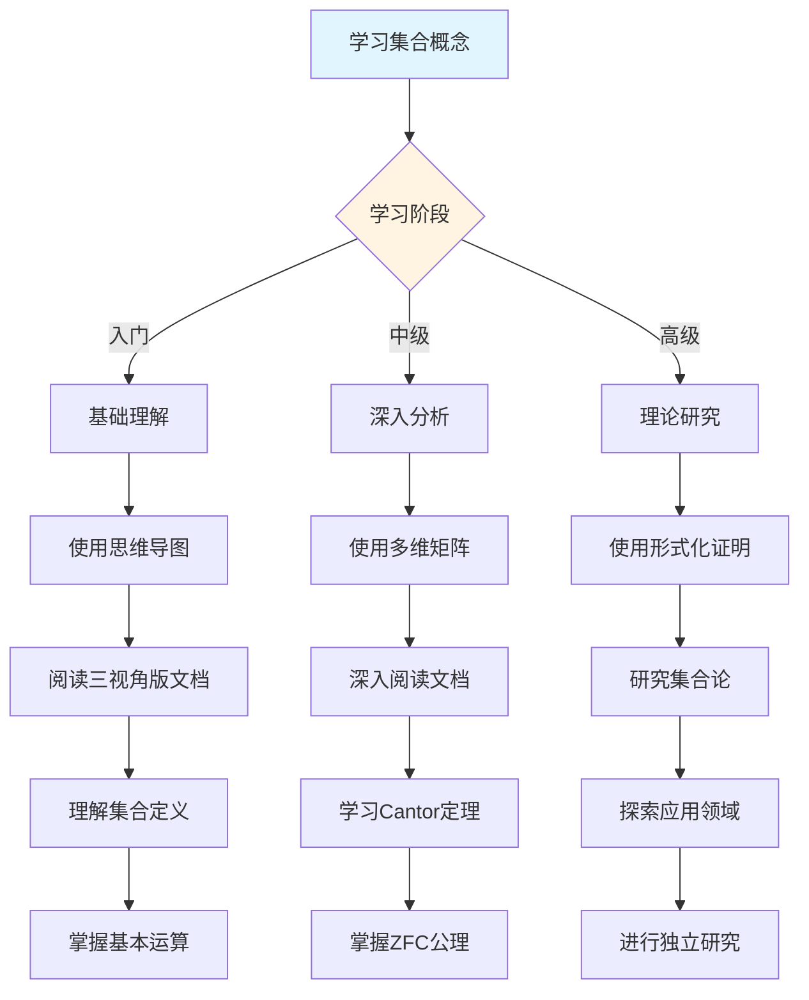
```mermaid
graph TD
    A[学习集合概念] --> B{学习阶段}
    B -->|入门| C[基础理解]
    B -->|中级| D[深入分析]
    B -->|高级| E[理论研究]

    C --> C1[使用思维导图]
    C1 --> C2[阅读三视角版文档]
    C2 --> C3[理解集合定义]
    C3 --> C4[掌握基本运算]

    D --> D1[使用多维矩阵]
    D1 --> D2[深入阅读文档]
    D2 --> D3[学习Cantor定理]
    D3 --> D4[掌握ZFC公理]

    E --> E1[使用形式化证明]
    E1 --> E2[研究集合论]
    E2 --> E3[探索应用领域]
    E3 --> E4[进行独立研究]

    style A fill:#e1f5ff
    style B fill:#fff4e1
```

### 1.2 学习重点决策

**基于知识矩阵的学习重点**：

| 学习阶段 | 知识层次 | 学习重点 | 推荐资源 |
|---------|---------|---------|---------|
| **入门** | L0基础 | 集合的定义、基本例子 | 思维导图、三视角版文档 |
| **入门** | L0基础 | 集合的基本运算（并、交、差、补） | 三视角版文档、应用实例 |
| **中级** | L1中级 | Cantor定理 | 多维矩阵、形式化证明 |
| **中级** | L1中级 | ZFC公理系统 | 三视角版文档、习题库 |
| **高级** | L2高级 | 集合论模型 | 形式化证明系统 |
| **高级** | L2高级 | 大基数理论 | 形式化证明系统 |

### 1.3 学习方法决策

**基于认知维度的学习方法**：

1. **直观维度**（入门阶段）
   - 使用思维导图建立总体框架
   - 使用具体例子理解概念（有限集、无限集、空集）
   - 使用Venn图直观理解集合运算

2. **知性维度**（中级阶段）
   - 使用多维矩阵分析概念特征
   - 使用概念分类系统理解（有限集vs无限集、可数集vs不可数集）
   - 使用关系分析建立联系（与函数、关系、数系的关系）

3. **理性维度**（高级阶段）
   - 使用形式化证明严格理解
   - 使用逻辑推理深入分析
   - 使用系统建构整体把握

---

## 🔬 二、研究决策导图 (编号: C.CORE.001.DECISION.02)

### 2.1 研究方向决策

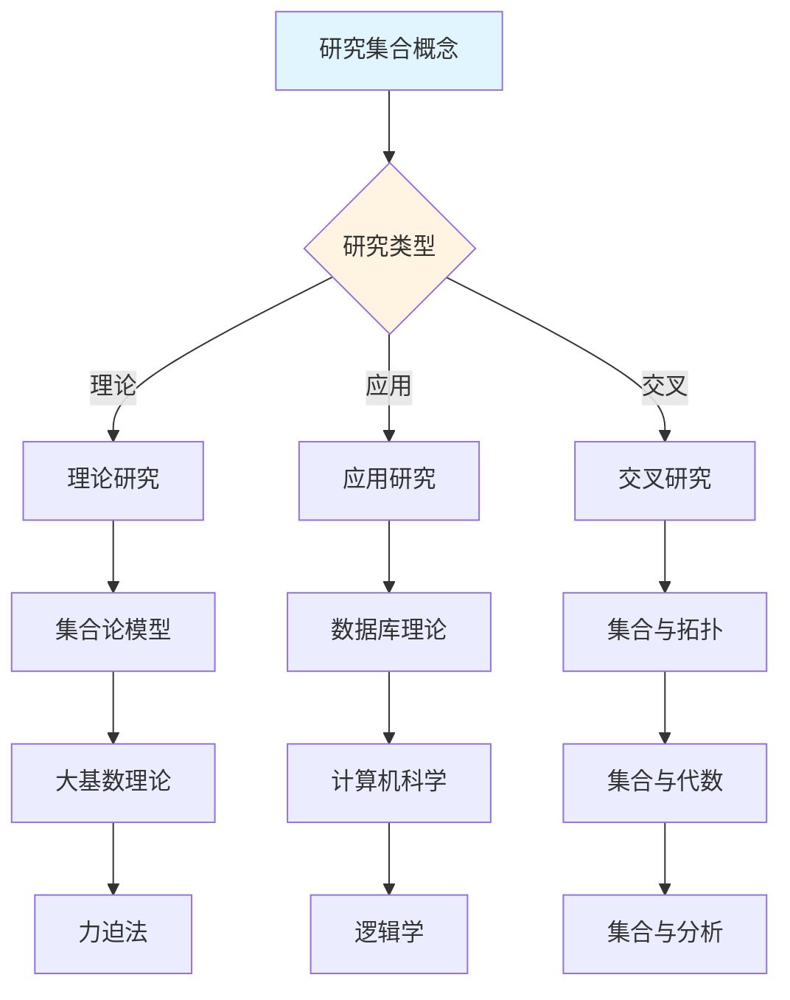
```mermaid
graph TD
    A[研究集合概念] --> B{研究类型}
    B -->|理论| C[理论研究]
    B -->|应用| D[应用研究]
    B -->|交叉| E[交叉研究]

    C --> C1[集合论模型]
    C1 --> C2[大基数理论]
    C2 --> C3[力迫法]

    D --> D1[数据库理论]
    D1 --> D2[计算机科学]
    D2 --> D3[逻辑学]

    E --> E1[集合与拓扑]
    E1 --> E2[集合与代数]
    E2 --> E3[集合与分析]

    style A fill:#e1f5ff
    style B fill:#fff4e1
```

### 2.2 研究问题决策

**基于知识矩阵的研究问题**：

1. **理论研究问题**
   - 集合论模型：ZFC模型、内模型
   - 大基数理论：不可达基数、超紧基数
   - 力迫法：力迫构造、独立性结果

2. **应用研究问题**
   - 数据库理论：关系数据库、查询优化
   - 计算机科学：数据结构、算法
   - 逻辑学：模型论、证明论

3. **交叉研究问题**
   - 集合与拓扑：拓扑空间、连续统假设
   - 集合与代数：代数结构、范畴论
   - 集合与分析：函数空间、测度论

### 2.3 研究方法决策

**基于形式化证明的研究方法**：

1. **构造性证明** → 集合的构造
   - 直接构造集合
   - 适用于有限集和可数集

2. **对角线方法** → Cantor定理
   - 使用对角线方法证明
   - 适用于不可数性证明

3. **力迫法** → 独立性结果
   - 使用力迫法构造模型
   - 适用于独立性证明

---

## 💼 三、应用决策导图 (编号: C.CORE.001.DECISION.03)

### 3.1 应用场景决策

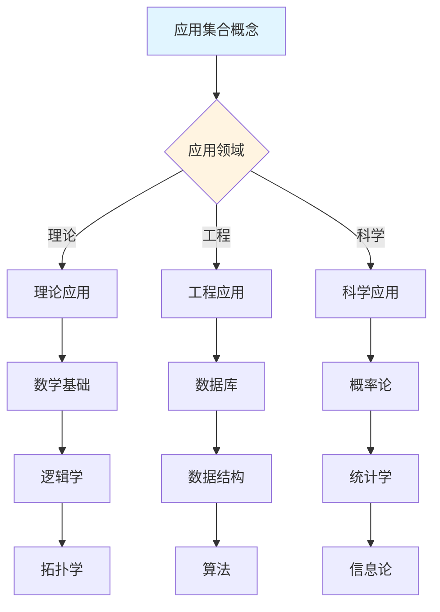
```mermaid
graph TD
    A[应用集合概念] --> B{应用领域}
    B -->|理论| C[理论应用]
    B -->|工程| D[工程应用]
    B -->|科学| E[科学应用]

    C --> C1[数学基础]
    C1 --> C2[逻辑学]
    C2 --> C3[拓扑学]

    D --> D1[数据库]
    D1 --> D2[数据结构]
    D2 --> D3[算法]

    E --> E1[概率论]
    E1 --> E2[统计学]
    E2 --> E3[信息论]

    style A fill:#e1f5ff
    style B fill:#fff4e1
```

### 3.2 应用方法决策

**基于应用场景的应用方法**：

1. **理论应用** → 使用形式化证明
   - 数学基础：所有数学对象的基础
   - 逻辑学：模型论、语义
   - 拓扑学：拓扑空间

2. **工程应用** → 使用论证过程
   - 数据库：关系数据库、查询优化
   - 数据结构：集合数据结构、操作
   - 算法：集合算法、图算法

3. **科学应用** → 使用综合方法
   - 概率论：事件空间、概率测度
   - 统计学：样本空间、统计推断
   - 信息论：信息集合、编码理论

---

## 🎓 四、教学决策导图 (编号: C.CORE.001.DECISION.04)

### 4.1 教学内容决策

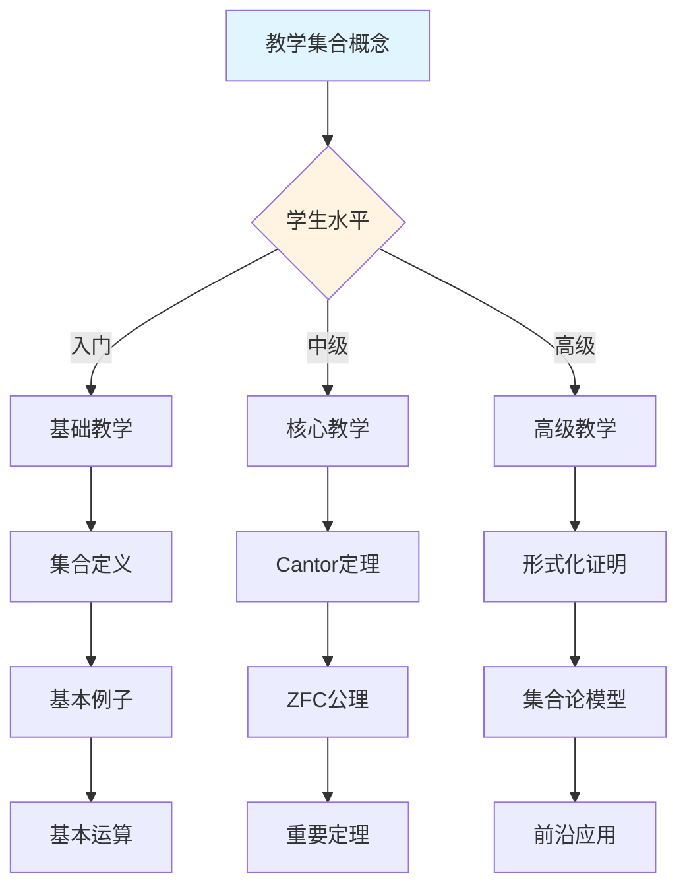
```mermaid
graph TD
    A[教学集合概念] --> B{学生水平}
    B -->|入门| C[基础教学]
    B -->|中级| D[核心教学]
    B -->|高级| E[高级教学]

    C --> C1[集合定义]
    C1 --> C2[基本例子]
    C2 --> C3[基本运算]

    D --> D1[Cantor定理]
    D1 --> D2[ZFC公理]
    D2 --> D3[重要定理]

    E --> E1[形式化证明]
    E1 --> E2[集合论模型]
    E2 --> E3[前沿应用]

    style A fill:#e1f5ff
    style B fill:#fff4e1
```

### 4.2 教学方法决策

**基于认知维度的教学方法**：

1. **直观维度**（入门教学）
   - 使用思维导图建立框架
   - 使用具体例子（有限集、无限集、空集）
   - 使用Venn图直观理解

2. **知性维度**（中级教学）
   - 使用多维矩阵深入分析
   - 使用概念分类系统
   - 使用关系分析建立联系

3. **理性维度**（高级教学）
   - 使用形式化证明严格理解
   - 使用逻辑推理深入分析
   - 使用系统建构整体把握

---

## 🔄 五、整合应用示例 (编号: C.CORE.001.DECISION.05)

### 5.1 完整学习流程示例

**阶段1：入门理解**:

1. 使用学习决策导图 → 确定学习路径：基础概念 → 集合定义 → 基本运算 → 基本应用
2. 使用总体思维导图 → 了解集合在数学基础中的位置
3. 阅读[集合-三视角版](./01-集合.md) → 理解集合的定义和基本运算
4. 使用论证过程 → 理解集合的直观意义（容器、分类、对象整体）

**阶段2：深入分析**:

1. 使用多维矩阵 → 分析集合的多维度特征（知识层次L0基础层、知识领域D1基础数学、学习难度中等）
2. 阅读[集合-三视角版](./01-集合.md) → 深入理解Cantor定理和ZFC公理系统
3. 使用形式化证明 → 学习Cantor定理的形式化证明
4. 使用分支关联思维导图 → 了解集合与函数、关系、数系的关系

**阶段3：应用研究**:

1. 使用研究决策导图 → 确定研究方向：集合论模型
2. 使用知识关联网络 → 发现集合与逻辑、拓扑、代数的关系
3. 使用形式化证明系统 → 构建集合论理论体系
4. 阅读[集合-三视角版](./01-集合.md) → 了解集合论的历史发展和开放问题

---

## 🔗 六、关联文档 (编号: C.CORE.001.DECISION.06)

### 6.1 核心概念文档

- [集合-三视角版](./01-集合.md)
- [集合](./01-集合.md)

### 6.2 框架文档

- [决策思维导图体系](../01-总体思维导图/05-决策思维导图体系.md)
- [概念体系全面梳理与推进计划](../00-概念体系全面梳理与推进计划-2025年1月.md)
- [核心概念与新框架整合指南](../00-核心概念与新框架整合指南-2025年1月.md)

### 6.3 相关文档

- [核心概念索引](./00-核心概念索引.md)
- [知识矩阵总览](../02-知识矩阵/00-知识矩阵总览.md)
- [形式化证明系统](../00-形式化证明系统-2025年11月.md)

---

**维护状态**: 持续更新中

