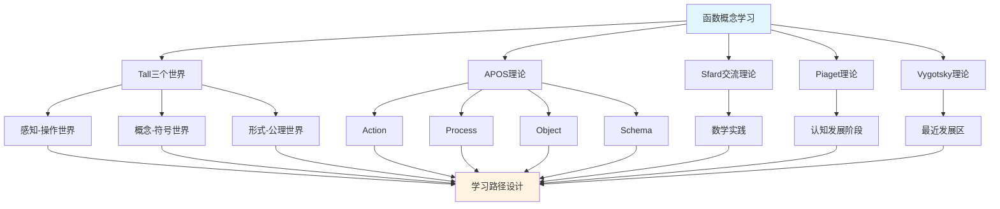

# 函数概念的多理论分析示例 / Multi-Theory Analysis Example: Function Concept

**主题编号 / Topic ID**: C.CORE.002.MULTI
**创建日期 / Created**: 2025年1月 / January 2025
**最后更新 / Last Updated**: 2025年1月 / January 2025
**关联概念 / Related Concepts**: [函数 / Function](./02-函数.md) | [函数-三视角版 / Function-Three Perspectives](./02-函数-三视角版.md)

---

## 📋 概述 / Overview

本文档为"函数"概念提供多理论分析示例，展示如何运用国际主流数学认知理论（Tall三个世界理论、Dubinsky APOS理论、Sfard交流理论、Piaget认知发展理论、Vygotsky社会文化理论）来分析数学概念。

This document provides a multi-theory analysis example for the "Function" concept, demonstrating how to apply international mainstream mathematical cognitive theories (Tall's Three Worlds Theory, Dubinsky APOS Theory, Sfard's Commognitive Theory, Piaget's Cognitive Development Theory, Vygotsky's Sociocultural Theory) to analyze mathematical concepts.

**分析目标 / Analysis Objectives**：

- 展示函数概念的多理论分析方法 / Demonstrate multi-theory analysis methods for function concepts
- 为其他核心概念提供分析参考 / Provide analysis reference for other core concepts
- 建立理论整合的应用示例 / Establish application examples of theoretical integration

---

## 🎯 一、Tall三个世界理论分析 / Tall's Three Worlds Theory Analysis (编号: C.CORE.002.MULTI.01)

### 1.1 感知-操作世界（Embodied World）

**函数在感知-操作世界中的理解 / Understanding Functions in the Embodied World**：

- **具体经验 / Concrete Experience**：
  - 通过输入输出关系理解函数 / Understanding functions through input-output relationships
  - 例如：温度转换（摄氏度→华氏度）、货币兑换（美元→人民币） / Examples: temperature conversion (Celsius→Fahrenheit), currency exchange (USD→CNY)
  - 通过机器、自动售货机等具体对象理解函数 / Understanding functions through concrete objects such as machines and vending machines

- **身体动作 / Bodily Actions**：
  - 通过"输入→处理→输出"的操作理解函数 / Understanding functions through "input→process→output" operations
  - 通过函数机器游戏理解函数概念 / Understanding function concepts through function machine games
  - 通过函数表（输入输出表）理解函数 / Understanding functions through function tables (input-output tables)

- **直观理解 / Intuitive Understanding**：
  - 函数是"一个输入对应一个输出" / A function is "one input corresponds to one output"
  - 函数是"规则"或"机器" / A function is a "rule" or "machine"
  - 函数有定义域和值域 / Functions have domain and range

**教学建议 / Teaching Suggestions**：

- 使用函数机器模型 / Use function machine models
- 通过输入输出表理解函数 / Understand functions through input-output tables
- 使用具体例子（温度转换、货币兑换等） / Use concrete examples (temperature conversion, currency exchange, etc.)

### 1.2 概念-符号世界（Symbolic World）

**函数在概念-符号世界的理解**：

- **符号表示**：
  - 使用函数符号：$f(x)$、$y = f(x)$、$f: A \to B$
  - 使用函数表达式：$f(x) = x^2$、$f(x) = \sin x$
  - 使用函数图像：坐标系中的曲线

- **概念理解**：
  - 函数是定义域到值域的映射
  - 函数满足单值性（一个输入对应一个输出）
  - 函数有各种性质（单调性、奇偶性、周期性等）

- **抽象操作**：
  - 通过符号操作进行函数运算（复合、反函数）
  - 通过函数图像分析函数性质
  - 通过函数方程研究函数

**教学建议**：

- 逐步引入函数符号
- 通过符号操作练习函数运算
- 使用函数图像理解函数性质

### 1.3 形式-公理世界（Formal World）

**函数在形式-公理世界的理解**：

- **公理系统**：
  - 函数的形式化定义：$f \subseteq A \times B$，满足单值性
  - 通过集合论定义函数
  - 通过范畴论理解函数（态射）

- **形式化定义**：
  - 函数的形式化定义：$\forall x \in A, \exists! y \in B, (x,y) \in f$
  - 函数运算的形式化定义
  - 函数性质的形式化证明

- **逻辑推理**：
  - 通过逻辑推理证明函数性质
  - 通过形式化方法研究函数理论
  - 通过范畴论研究函数的一般性质

**教学建议**：

- 介绍函数的形式化定义
- 通过形式化证明理解函数性质
- 研究函数在数学中的基础地位

---

## 🔬 二、Dubinsky APOS理论分析 (编号: C.CORE.002.MULTI.02)

### 2.1 Action（动作）

**函数的Action阶段**：

- **具体操作**：
  - 计算函数值：$f(2) = ?$（当$f(x) = x^2$时）
  - 绘制函数图像：给定函数表达式，绘制图像
  - 查找函数值：在函数表中查找对应值

- **操作特点**：
  - 需要外部指导（教师、教材）
  - 操作是具体的、机械的
  - 需要逐步执行

- **学习活动**：
  - 练习计算函数值
  - 练习绘制函数图像
  - 练习查找函数值

**教学建议**：

- 提供大量练习机会
- 给予及时反馈
- 逐步增加操作复杂度

### 2.2 Process（过程）

**函数的Process阶段**：

- **内化过程**：
  - 将函数操作内化为心理过程
  - 理解函数运算的内在逻辑
  - 能够独立完成函数运算

- **过程理解**：
  - 理解"函数"是"输入到输出的过程"
  - 理解"复合函数"是"先应用一个函数，再应用另一个函数"
  - 理解"反函数"是"反向的过程"

- **灵活应用**：
  - 能够灵活应用函数概念
  - 能够处理复杂的函数问题
  - 能够理解函数的各种性质

**教学建议**：

- 引导学生内化操作过程
- 通过变式练习加深理解
- 鼓励学生独立思考和解决问题

### 2.3 Object（对象）

**函数的Object阶段**：

- **对象化理解**：
  - 将函数视为独立的对象
  - 可以对函数进行操作
  - 可以将函数作为其他概念的基础

- **对象操作**：
  - 函数的函数（函数空间）
  - 函数的运算结果仍是函数
  - 函数可以作为其他函数的输入

- **抽象理解**：
  - 理解函数的抽象性质
  - 理解函数在数学中的基础地位
  - 理解函数论作为数学分支的作用

**教学建议**：

- 引导学生将函数视为对象
- 研究函数的函数（函数空间）
- 探索函数在数学中的广泛应用

### 2.4 Schema（图式）

**函数的Schema阶段**：

- **完整图式**：
  - 整合函数的定义、运算、性质
  - 形成完整的函数概念图式
  - 理解函数与其他数学概念的关系

- **图式应用**：
  - 能够灵活应用函数概念
  - 能够解决复杂的函数问题
  - 能够理解函数在数学中的作用

- **图式扩展**：
  - 理解函数的推广（映射、态射）
  - 理解函数在数学基础中的作用
  - 理解函数与其他数学分支的关系

**教学建议**：

- 帮助学生建立完整的函数概念图式
- 探索函数与其他数学分支的关系
- 研究函数在数学基础中的作用

---

## 💬 三、Sfard交流理论分析 / Sfard's Commognitive Theory Analysis (编号: C.CORE.002.MULTI.03)

### 3.1 函数作为交流工具 / Function as a Communication Tool

**函数的交流功能 / Communicative Function of Functions**：

- **数学交流 / Mathematical Communication**：
  - 函数用于表达数学关系：$y = f(x)$表示$y$与$x$的关系 / Functions are used to express mathematical relationships: $y = f(x)$ represents the relationship between $y$ and $x$
  - 函数用于描述数学变化：导数描述函数的变化率 / Functions are used to describe mathematical changes: derivatives describe the rate of change of functions
  - 函数用于表达数学结构：群同态、环同态都是函数 / Functions are used to express mathematical structures: group homomorphisms and ring homomorphisms are all functions

- **概念表达 / Conceptual Expression**：
  - 通过函数表达"依赖关系" / Expressing "dependency relationships" through functions
  - 通过函数运算表达"复合"、"逆"等概念 / Expressing concepts such as "composition" and "inverse" through function operations
  - 通过函数性质表达"单调"、"连续"等概念 / Expressing concepts such as "monotonicity" and "continuity" through function properties

- **问题解决 / Problem Solving**：
  - 使用函数语言表达问题 / Using function language to express problems
  - 使用函数方法解决问题 / Using function methods to solve problems
  - 使用函数论方法证明定理 / Using function theory methods to prove theorems

### 3.2 函数学习的实践参与 / Practice Participation in Function Learning

**通过参与数学实践学习函数 / Learning Functions through Participation in Mathematical Practice**：

- **实践场景 / Practice Scenarios**：
  - 通过实际问题学习函数（温度转换、距离时间关系等） / Learning functions through real-world problems (temperature conversion, distance-time relationships, etc.)
  - 通过数据分析学习函数（数据拟合、函数建模） / Learning functions through data analysis (data fitting, function modeling)
  - 通过函数图像学习函数性质 / Learning function properties through function graphs
  - 通过函数应用学习函数理论 / Learning function theory through function applications

- **实践方式 / Practice Methods**：
  - 参与数学讨论，使用函数语言 / Participating in mathematical discussions, using function language
  - 解决数学问题，应用函数方法 / Solving mathematical problems, applying function methods
  - 研究数学理论，理解函数作用 / Studying mathematical theory, understanding the role of functions

- **学习效果 / Learning Outcomes**：
  - 通过实践理解函数概念 / Understanding function concepts through practice
  - 通过应用掌握函数方法 / Mastering function methods through application
  - 通过参与形成数学思维 / Forming mathematical thinking through participation

**教学建议 / Teaching Suggestions**：

- 设计数学实践活动 / Design mathematical practice activities
- 鼓励学生参与数学讨论 / Encourage students to participate in mathematical discussions
- 提供实际问题解决机会 / Provide opportunities for solving real-world problems

---

## 🧠 四、Piaget认知发展理论分析 / Piaget's Cognitive Development Theory Analysis (编号: C.CORE.002.MULTI.04)

### 4.1 具体运算阶段（7-12岁）/ Concrete Operational Stage (7-12 years)

**函数在具体运算阶段的理解 / Understanding Functions in the Concrete Operational Stage**：

- **具体对象 / Concrete Objects**：
  - 通过具体例子理解函数 / Understanding functions through concrete examples
  - 例如：温度转换、货币兑换 / Examples: temperature conversion, currency exchange
  - 需要具体对象支持理解 / Requires concrete object support for understanding

- **逻辑思维 / Logical Thinking**：
  - 能够理解函数的输入输出关系 / Being able to understand input-output relationships of functions
  - 能够进行简单的函数运算 / Being able to perform simple function operations
  - 但需要具体对象支持 / But requires concrete object support

- **教学建议 / Teaching Suggestions**：
  - 使用具体例子和函数机器 / Use concrete examples and function machines
  - 通过游戏和活动学习 / Learn through games and activities
  - 逐步引入抽象概念 / Gradually introduce abstract concepts

### 4.2 形式运算阶段（12+岁）/ Formal Operational Stage (12+ years)

**函数在形式运算阶段的理解 / Understanding Functions in the Formal Operational Stage**：

- **抽象思维 / Abstract Thinking**：
  - 能够理解抽象的函数概念 / Being able to understand abstract function concepts
  - 能够进行符号操作 / Being able to perform symbolic operations
  - 能够进行逻辑推理 / Being able to perform logical reasoning

- **形式推理 / Formal Reasoning**：
  - 能够证明函数性质 / Being able to prove function properties
  - 能够理解函数的形式化定义 / Being able to understand formal definitions of functions
  - 能够研究函数理论 / Being able to study function theory

- **教学建议 / Teaching Suggestions**：
  - 引入抽象概念和符号 / Introduce abstract concepts and symbols
  - 进行逻辑推理训练 / Conduct logical reasoning training
  - 研究函数理论 / Study function theory

---

## 🌍 五、Vygotsky社会文化理论分析 / Vygotsky's Sociocultural Theory Analysis (编号: C.CORE.002.MULTI.05)

### 5.1 最近发展区（ZPD）/ Zone of Proximal Development (ZPD)

**函数学习的最近发展区 / Zone of Proximal Development in Function Learning**：

- **独立水平 / Independent Level**：
  - 学生可以独立理解函数的基本概念 / Students can independently understand basic function concepts
  - 学生可以独立进行基本函数运算 / Students can independently perform basic function operations
  - 学生可以独立解决简单函数问题 / Students can independently solve simple function problems

- **最近发展区 / Zone of Proximal Development**：
  - 需要指导才能理解函数的抽象性质 / Requires guidance to understand abstract properties of functions
  - 需要指导才能掌握复杂函数运算 / Requires guidance to master complex function operations
  - 需要指导才能解决复杂函数问题 / Requires guidance to solve complex function problems

- **潜在水平 / Potential Level**：
  - 未来可能理解函数的形式化定义 / May understand formal definitions of functions in the future
  - 未来可能掌握函数论方法 / May master function theory methods in the future
  - 未来可能研究函数理论 / May study function theory in the future

### 5.2 社会文化工具 / Sociocultural Tools

**函数作为社会文化工具 / Functions as Sociocultural Tools**：

- **数学符号 / Mathematical Symbols**：
  - 函数符号是数学交流的工具 / Function symbols are tools for mathematical communication
  - 通过社会文化实践学习函数符号 / Learning function symbols through sociocultural practice
  - 通过数学实践掌握函数方法 / Mastering function methods through mathematical practice

- **数学语言 / Mathematical Language**：
  - 函数语言是数学表达的工具 / Function language is a tool for mathematical expression
  - 通过参与数学实践学习函数语言 / Learning function language through participation in mathematical practice
  - 通过数学交流掌握函数表达 / Mastering function expression through mathematical communication

**教学建议 / Teaching Suggestions**：

- 提供适当的学习支持 / Provide appropriate learning support
- 设计最近发展区的学习活动 / Design learning activities in the zone of proximal development
- 鼓励学生参与数学实践和交流 / Encourage students to participate in mathematical practice and communication

---

## 🔄 六、多理论整合分析 / Multi-Theory Integration Analysis (编号: C.CORE.002.MULTI.06)

### 6.1 理论共同点 / Theoretical Commonalities

**各理论在函数概念分析中的共同点 / Commonalities of Theories in Function Concept Analysis**：

1. **多层次理解 / Multi-Level Understanding**：
   - 都强调从具体到抽象的发展 / All emphasize development from concrete to abstract
   - Tall的三个世界、APOS的四个阶段、Piaget的发展阶段都体现这一点 / Tall's three worlds, APOS's four stages, and Piaget's developmental stages all reflect this

2. **实践重要性 / Importance of Practice**：
   - 都强调实践在学习中的作用 / All emphasize the role of practice in learning
   - Sfard的交流理论、Vygotsky的社会文化理论都强调这一点 / Sfard's communication theory and Vygotsky's sociocultural theory both emphasize this

3. **认知发展 / Cognitive Development**：
   - 都关注认知发展的过程 / All focus on the process of cognitive development
   - 各理论都描述了从简单到复杂的发展 / Each theory describes development from simple to complex

### 6.2 理论互补性 / Theoretical Complementarity

**各理论在函数概念分析中的互补性 / Complementarity of Theories in Function Concept Analysis**：

1. **Tall三个世界 / Tall's Three Worlds**：
   - 适用于理解函数概念的不同层次 / Applicable to understanding different levels of function concepts
   - 从感知操作到形式公理的发展 / Development from embodied operations to formal axioms

2. **APOS理论 / APOS Theory**：
   - 适用于分析函数概念的学习过程 / Applicable to analyzing the learning process of function concepts
   - 从动作到图式的发展 / Development from action to schema

3. **Sfard交流理论 / Sfard's Communication Theory**：
   - 适用于设计函数概念的实践活动 / Applicable to designing practice activities for function concepts
   - 通过数学实践学习函数 / Learning functions through mathematical practice

4. **Piaget理论 / Piaget's Theory**：
   - 适用于理解函数概念的认知发展阶段 / Applicable to understanding cognitive development stages of function concepts
   - 从具体运算到形式运算的发展 / Development from concrete operations to formal operations

5. **Vygotsky理论 / Vygotsky's Theory**：
   - 适用于设计函数概念的学习支持 / Applicable to designing learning support for function concepts
   - 通过最近发展区促进学习 / Promoting learning through the zone of proximal development

### 6.3 整合应用框架

**多理论整合应用**：

---

## 📊 七、函数概念的多理论学习路径 (编号: C.CORE.002.MULTI.07)

### 7.1 入门阶段（Tall感知-操作世界 + APOS Action）

**学习目标**：

- 通过具体例子理解函数概念
- 掌握基本函数操作

**学习活动**：

- 使用函数机器模型
- 通过输入输出表理解函数
- 练习计算函数值
- 练习绘制简单函数图像

**评估标准**：

- 能够独立完成基本函数操作
- 能够理解函数的基本概念

### 7.2 中级阶段（Tall概念-符号世界 + APOS Process/Object）

**学习目标**：

- 理解函数的符号表示
- 掌握函数运算的内在逻辑
- 将函数视为对象

**学习活动**：

- 学习函数符号和表达式
- 通过符号操作进行函数运算
- 理解函数的各种性质
- 研究函数的函数（函数空间）

**评估标准**：

- 能够灵活应用函数符号
- 能够理解函数运算的内在逻辑
- 能够将函数视为对象进行操作

### 7.3 高级阶段（Tall形式-公理世界 + APOS Schema + Sfard实践）

**学习目标**：

- 理解函数的形式化定义
- 形成完整的函数概念图式
- 通过数学实践应用函数理论

**学习活动**：

- 学习函数的形式化定义
- 通过形式化证明理解函数性质
- 研究函数在数学基础中的作用
- 参与数学实践，应用函数方法

**评估标准**：

- 能够理解函数的形式化定义
- 能够形成完整的函数概念图式
- 能够通过数学实践应用函数理论

---

## 🎓 八、教学建议 (编号: C.CORE.002.MULTI.08)

### 8.1 基于多理论的教学设计

**教学设计原则**：

1. **多层次设计**：
   - 从感知操作到形式公理
   - 从动作到图式
   - 从具体运算到形式运算

2. **实践导向**：
   - 设计数学实践活动
   - 鼓励学生参与数学交流
   - 提供实际问题解决机会

3. **学习支持**：
   - 提供适当的学习支持
   - 设计最近发展区的学习活动
   - 给予及时反馈

### 8.2 具体教学策略

**入门阶段策略**：

- 使用函数机器模型和具体例子
- 通过游戏和活动学习
- 提供大量练习机会

**中级阶段策略**：

- 逐步引入抽象概念和符号
- 通过变式练习加深理解
- 鼓励学生独立思考和解决问题

**高级阶段策略**：

- 引入形式化定义和方法
- 研究函数理论
- 参与数学实践和研究

---

## 🔗 九、关联文档 (编号: C.CORE.002.MULTI.09)

### 9.1 核心概念文档

- [函数](./02-函数.md)
- [函数-三视角版](./02-函数-三视角版.md)
- [函数-决策导图示例](./02-函数-决策导图示例-2025年1月.md)

### 9.2 理论框架文档

- [国际主流数学认知理论整合框架](../00-国际主流数学认知理论整合框架-2025年1月.md)
- [概念体系深度改进计划](../00-概念体系深度改进计划-2025年1月.md)
- [集合-多理论分析示例](./01-集合-多理论分析示例-2025年1月.md) - 参考模板

---

## ✅ 十、总结 (编号: C.CORE.002.MULTI.10)

### 10.1 多理论分析的价值

**多理论分析的优势**：

1. **全面理解**：
   - 从多个角度理解函数概念
   - 理解函数概念的不同层次
   - 理解函数概念的学习过程

2. **教学设计**：
   - 基于多理论设计教学
   - 提供多层次学习支持
   - 设计实践活动

3. **学习路径**：
   - 设计基于多理论的学习路径
   - 支持不同认知发展阶段的学习
   - 促进概念理解的发展

### 10.2 与集合概念的对比

**函数与集合的多理论分析对比**：

| 理论 | 集合概念 | 函数概念 |
|------|---------|---------|
| **Tall感知-操作世界** | 具体物体集合 | 输入输出关系 |
| **Tall概念-符号世界** | 集合符号和运算 | 函数符号和表达式 |
| **Tall形式-公理世界** | ZFC公理系统 | 函数的形式化定义 |
| **APOS Action** | 集合操作 | 函数值计算 |
| **APOS Process** | 集合运算过程 | 函数运算过程 |
| **APOS Object** | 集合的集合 | 函数的函数 |
| **APOS Schema** | 集合概念图式 | 函数概念图式 |

---

**创建日期**: 2025年1月
**最后更新**: 2025年1月
**维护状态**: 持续更新中
**状态**: ✅ 示例完成
