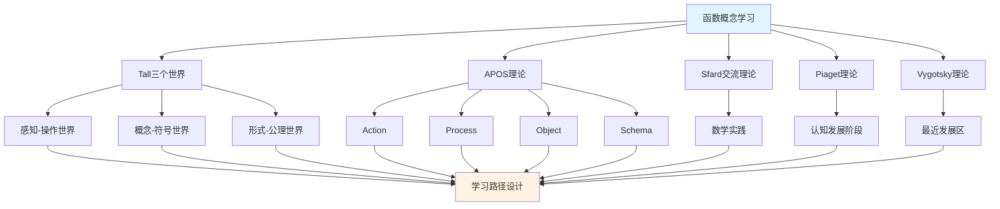

---
msc_primary: "00A99"
---

# 函数概念的多理论分析示例 / Multi-Theory Analysis Example: Function Concept

**主题编号 / Topic ID**: C.CORE.002.MULTI
**创建日期 / Created**: 2025年1月 / January 2025
**最后更新 / Last Updated**: 2025年1月 / January 2025
**关联概念 / Related Concepts**: [函数 / Function](./02-函数.md) | [函数-三视角版 / Function-Three Perspectives](./02-函数-三视角版.md)

---

## 📋 概述 / Overview

本文档为"函数"概念提供多理论分析示例，展示如何运用国际主流数学认知理论（Tall三个世界理论、Dubinsky APOS理论、Sfard交流理论、Piaget认知发展理论、Vygotsky社会文化理论）来分析数学概念。

This document provides a multi-theory analysis example for the "Function" concept, demonstrating how to apply international mainstream mathematical cognitive theories (Tall's Three Worlds Theory, Dubinsky APOS Theory, Sfard's Commognitive Theory, Piaget's Cognitive Development Theory, Vygotsky's Sociocultural Theory) to analyze mathematical concepts.

**分析目标 / Analysis Objectives**：

- 展示函数概念的多理论分析方法 / Demonstrate multi-theory analysis methods for function concepts
- 为其他核心概念提供分析参考 / Provide analysis reference for other core concepts
- 建立理论整合的应用示例 / Establish application examples of theoretical integration

---

## 📑 目录 / Table of Contents

- [函数概念的多理论分析示例 / Multi-Theory Analysis Example: Function Concept](#函数概念的多理论分析示例--multi-theory-analysis-example-function-concept)
  - [📋 概述 / Overview](#-概述--overview)
  - [📑 目录 / Table of Contents](#-目录--table-of-contents)
  - [🎯 一、Tall三个世界理论分析 / Tall's Three Worlds Theory Analysis (编号: C.CORE.002.MULTI.01)](#-一tall三个世界理论分析--talls-three-worlds-theory-analysis-编号-ccore002multi01)
    - [1.1 感知-操作世界（Embodied World）](#11-感知-操作世界embodied-world)
    - [1.2 概念-符号世界（Symbolic World）](#12-概念-符号世界symbolic-world)
    - [1.3 形式-公理世界（Formal World）](#13-形式-公理世界formal-world)
    - [1.4 三个世界的转换 / Transitions Between Worlds](#14-三个世界的转换--transitions-between-worlds)
  - [🔬 二、Dubinsky APOS理论分析 (编号: C.CORE.002.MULTI.02)](#-二dubinsky-apos理论分析-编号-ccore002multi02)
    - [2.1 Action（动作）](#21-action动作)
    - [2.2 Process（过程）](#22-process过程)
    - [2.3 Object（对象）](#23-object对象)
    - [2.4 Schema（图式）](#24-schema图式)
    - [2.5 APOS发展路径 / APOS Development Path](#25-apos发展路径--apos-development-path)
  - [💬 三、Sfard交流理论分析 / Sfard's Commognitive Theory Analysis (编号: C.CORE.002.MULTI.03)](#-三sfard交流理论分析--sfards-commognitive-theory-analysis-编号-ccore002multi03)
    - [3.1 函数作为交流工具 / Function as a Communication Tool](#31-函数作为交流工具--function-as-a-communication-tool)
    - [3.2 函数学习的实践参与 / Practice Participation in Function Learning](#32-函数学习的实践参与--practice-participation-in-function-learning)
  - [🧠 四、Piaget认知发展理论分析 / Piaget's Cognitive Development Theory Analysis (编号: C.CORE.002.MULTI.04)](#-四piaget认知发展理论分析--piagets-cognitive-development-theory-analysis-编号-ccore002multi04)
    - [4.1 具体运算阶段（7-12岁）/ Concrete Operational Stage (7-12 years)](#41-具体运算阶段7-12岁-concrete-operational-stage-7-12-years)
    - [4.2 形式运算阶段（12+岁）/ Formal Operational Stage (12+ years)](#42-形式运算阶段12岁-formal-operational-stage-12-years)
  - [🌍 五、Vygotsky社会文化理论分析 / Vygotsky's Sociocultural Theory Analysis (编号: C.CORE.002.MULTI.05)](#-五vygotsky社会文化理论分析--vygotskys-sociocultural-theory-analysis-编号-ccore002multi05)
    - [5.1 最近发展区（ZPD）/ Zone of Proximal Development (ZPD)](#51-最近发展区zpd-zone-of-proximal-development-zpd)
    - [5.2 社会文化工具 / Sociocultural Tools](#52-社会文化工具--sociocultural-tools)
  - [🔄 六、多理论整合分析 / Multi-Theory Integration Analysis (编号: C.CORE.002.MULTI.06)](#-六多理论整合分析--multi-theory-integration-analysis-编号-ccore002multi06)
    - [6.1 理论共同点 / Theoretical Commonalities](#61-理论共同点--theoretical-commonalities)
    - [6.2 理论互补性 / Theoretical Complementarity](#62-理论互补性--theoretical-complementarity)
    - [6.3 整合应用框架](#63-整合应用框架)
  - [📊 七、函数概念的多理论学习路径 / Multi-Theory Learning Path for Function Concept (编号: C.CORE.002.MULTI.07)](#-七函数概念的多理论学习路径--multi-theory-learning-path-for-function-concept-编号-ccore002multi07)
    - [7.1 入门阶段（Tall感知-操作世界 + APOS Action）/ Entry Stage (Tall Embodied World + APOS Action)](#71-入门阶段tall感知-操作世界--apos-action-entry-stage-tall-embodied-world--apos-action)
    - [7.2 中级阶段（Tall概念-符号世界 + APOS Process/Object）/ Intermediate Stage (Tall Symbolic World + APOS Process/Object)](#72-中级阶段tall概念-符号世界--apos-processobject-intermediate-stage-tall-symbolic-world--apos-processobject)
    - [7.3 高级阶段（Tall形式-公理世界 + APOS Schema + Sfard实践）/ Advanced Stage (Tall Formal World + APOS Schema + Sfard Practice)](#73-高级阶段tall形式-公理世界--apos-schema--sfard实践-advanced-stage-tall-formal-world--apos-schema--sfard-practice)
  - [🧠 七、元认知理论分析 / Metacognitive Theory Analysis (编号: C.CORE.002.MULTI.07.5)](#-七元认知理论分析--metacognitive-theory-analysis-编号-ccore002multi075)
    - [7.1 元认知知识（Metacognitive Knowledge）](#71-元认知知识metacognitive-knowledge)
    - [7.2 元认知监控（Metacognitive Monitoring）](#72-元认知监控metacognitive-monitoring)
    - [7.3 元认知调节（Metacognitive Regulation）](#73-元认知调节metacognitive-regulation)
  - [🎓 八、教学建议 / Teaching Suggestions (编号: C.CORE.002.MULTI.08)](#-八教学建议--teaching-suggestions-编号-ccore002multi08)
    - [8.1 基于多理论的教学设计 / Multi-Theory Based Teaching Design](#81-基于多理论的教学设计--multi-theory-based-teaching-design)
    - [8.2 具体教学策略](#82-具体教学策略)
  - [🔗 九、关联文档 / Related Documents (编号: C.CORE.002.MULTI.09)](#-九关联文档--related-documents-编号-ccore002multi09)
    - [9.1 核心概念文档 / Core Concept Documents](#91-核心概念文档--core-concept-documents)
    - [9.2 理论框架文档 / Theoretical Framework Documents](#92-理论框架文档--theoretical-framework-documents)
  - [✅ 十、总结 / Summary (编号: C.CORE.002.MULTI.10)](#-十总结--summary-编号-ccore002multi10)
    - [10.1 多理论分析的价值 / Value of Multi-Theory Analysis](#101-多理论分析的价值--value-of-multi-theory-analysis)
    - [10.2 与集合概念的对比 / Comparison with Set Concept](#102-与集合概念的对比--comparison-with-set-concept)

---

## 🎯 一、Tall三个世界理论分析 / Tall's Three Worlds Theory Analysis (编号: C.CORE.002.MULTI.01)

### 1.1 感知-操作世界（Embodied World）

**函数在感知-操作世界中的理解 / Understanding Functions in the Embodied World**：

- **具体经验 / Concrete Experience**：
  - 通过输入输出关系理解函数 / Understanding functions through input-output relationships
  - 例如：温度转换（摄氏度→华氏度）、货币兑换（美元→人民币） / Examples: temperature conversion (Celsius→Fahrenheit), currency exchange (USD→CNY)
  - 通过机器、自动售货机等具体对象理解函数 / Understanding functions through concrete objects such as machines and vending machines

- **身体动作 / Bodily Actions**：
  - 通过"输入→处理→输出"的操作理解函数 / Understanding functions through "input→process→output" operations
  - 通过函数机器游戏理解函数概念 / Understanding function concepts through function machine games
  - 通过函数表（输入输出表）理解函数 / Understanding functions through function tables (input-output tables)

- **直观理解 / Intuitive Understanding**：
  - 函数是"一个输入对应一个输出" / A function is "one input corresponds to one output"
  - 函数是"规则"或"机器" / A function is a "rule" or "machine"
  - 函数有定义域和值域 / Functions have domain and range

**教学建议 / Teaching Suggestions**：

- 使用函数机器模型 / Use function machine models
- 通过输入输出表理解函数 / Understand functions through input-output tables
- 使用具体例子（温度转换、货币兑换等） / Use concrete examples (temperature conversion, currency exchange, etc.)

### 1.2 概念-符号世界（Symbolic World）

**函数在概念-符号世界的理解**：

- **符号表示**：
  - 使用函数符号：$f(x)$、$y = f(x)$、$f: A \to B$
  - 使用函数表达式：$f(x) = x^2$、$f(x) = \sin x$
  - 使用函数图像：坐标系中的曲线

- **概念理解**：
  - 函数是定义域到值域的映射
  - 函数满足单值性（一个输入对应一个输出）
  - 函数有各种性质（单调性、奇偶性、周期性等）

- **抽象操作**：
  - 通过符号操作进行函数运算（复合、反函数）
  - 通过函数图像分析函数性质
  - 通过函数方程研究函数

**教学建议**：

- 逐步引入函数符号
- 通过符号操作练习函数运算
- 使用函数图像理解函数性质

### 1.3 形式-公理世界（Formal World）

**函数在形式-公理世界的理解**：

- **公理系统**：
  - 函数的形式化定义：$f \subseteq A \times B$，满足单值性
  - 通过集合论定义函数
  - 通过范畴论理解函数（态射）

- **形式化定义**：
  - 函数的形式化定义：$\forall x \in A, \exists! y \in B, (x,y) \in f$
  - 函数运算的形式化定义
  - 函数性质的形式化证明

- **逻辑推理**：
  - 通过逻辑推理证明函数性质
  - 通过形式化方法研究函数理论
  - 通过范畴论研究函数的一般性质

**教学建议**：

- 介绍函数的形式化定义
- 通过形式化证明理解函数性质
- 研究函数在数学中的基础地位

### 1.4 三个世界的转换 / Transitions Between Worlds

**转换路径 / Transition Paths**：

1. **从感知-操作到概念-符号 / From Embodied to Symbolic**：
   - 将输入输出关系抽象为函数符号 / Abstracting input-output relationships into function notation
   - 从操作中提取函数概念 / Extracting function concepts from operations
   - 例如：从"温度转换"到"函数$f(x) = \frac{9}{5}x + 32$" / Example: from "temperature conversion" to "function $f(x) = \frac{9}{5}x + 32$"

2. **从概念-符号到形式-公理 / From Symbolic to Formal**：
   - 将函数概念形式化为定义 / Formalizing function concepts into definitions
   - 从符号操作到逻辑推理 / From symbolic operations to logical reasoning
   - 例如：从"$f(x) = x^2$"到"$f: A \to B$" / Example: from "$f(x) = x^2$" to "$f: A \to B$"

**转换支持 / Transition Support**：

- **识别转换困难 / Identifying Transition Difficulties**：
  - 识别从具体到抽象的困难 / Identifying difficulties in transitioning from concrete to abstract
  - 识别从符号到形式的困难 / Identifying difficulties in transitioning from symbolic to formal

- **设计转换活动 / Designing Transition Activities**：
  - 设计过渡活动支持转换 / Designing transition activities to support transitions
  - 提供渐进式支持 / Providing progressive support

- **评估转换效果 / Assessing Transition Effectiveness**：
  - 评估转换成功 / Assessing transition success
  - 提供反馈支持 / Providing feedback support

---

## 🔬 二、Dubinsky APOS理论分析 (编号: C.CORE.002.MULTI.02)

### 2.1 Action（动作）

**函数的Action阶段**：

- **具体操作**：
  - 计算函数值：$f(2) = ?$（当$f(x) = x^2$时）
  - 绘制函数图像：给定函数表达式，绘制图像
  - 查找函数值：在函数表中查找对应值

- **操作特点**：
  - 需要外部指导（教师、教材）
  - 操作是具体的、机械的
  - 需要逐步执行

- **学习活动**：
  - 练习计算函数值
  - 练习绘制函数图像
  - 练习查找函数值

**教学建议**：

- 提供大量练习机会
- 给予及时反馈
- 逐步增加操作复杂度

### 2.2 Process（过程）

**函数的Process阶段**：

- **内化过程**：
  - 将函数操作内化为心理过程
  - 理解函数运算的内在逻辑
  - 能够独立完成函数运算

- **过程理解**：
  - 理解"函数"是"输入到输出的过程"
  - 理解"复合函数"是"先应用一个函数，再应用另一个函数"
  - 理解"反函数"是"反向的过程"

- **灵活应用**：
  - 能够灵活应用函数概念
  - 能够处理复杂的函数问题
  - 能够理解函数的各种性质

**教学建议**：

- 引导学生内化操作过程
- 通过变式练习加深理解
- 鼓励学生独立思考和解决问题

### 2.3 Object（对象）

**函数的Object阶段**：

- **对象化理解**：
  - 将函数视为独立的对象
  - 可以对函数进行操作
  - 可以将函数作为其他概念的基础

- **对象操作**：
  - 函数的函数（函数空间）
  - 函数的运算结果仍是函数
  - 函数可以作为其他函数的输入

- **抽象理解**：
  - 理解函数的抽象性质
  - 理解函数在数学中的基础地位
  - 理解函数论作为数学分支的作用

**教学建议**：

- 引导学生将函数视为对象
- 研究函数的函数（函数空间）
- 探索函数在数学中的广泛应用

### 2.4 Schema（图式）

**函数的Schema阶段**：

- **完整图式**：
  - 整合函数的定义、运算、性质
  - 形成完整的函数概念图式
  - 理解函数与其他数学概念的关系

- **图式应用**：
  - 能够灵活应用函数概念
  - 能够解决复杂的函数问题
  - 能够理解函数在数学中的作用

- **图式扩展**：
  - 理解函数的推广（映射、态射）
  - 理解函数在数学基础中的作用
  - 理解函数与其他数学分支的关系

**教学建议**：

- 帮助学生建立完整的函数概念图式
- 探索函数与其他数学分支的关系
- 研究函数在数学基础中的作用

### 2.5 APOS发展路径 / APOS Development Path

**发展过程 / Development Process**：

1. **Action → Process / 动作到过程**：
   - 将外部函数计算内化为心理过程 / Internalizing external function computations as mental processes
   - 从需要指导到独立完成 / From needing guidance to independent completion
   - 例如：从"计算$f(2)$"到"理解函数映射过程" / Example: from "computing $f(2)$" to "understanding the function mapping process"

2. **Process → Object / 过程到对象**：
   - 将函数映射过程对象化 / Objectifying function mapping processes
   - 从过程理解到对象理解 / From process understanding to object understanding
   - 例如：从"理解映射过程"到"将函数视为对象" / Example: from "understanding the mapping process" to "treating functions as objects"

3. **Object → Schema / 对象到图式**：
   - 整合多个函数对象和过程 / Integrating multiple function objects and processes
   - 形成完整的函数概念图式 / Forming a complete function concept schema
   - 例如：整合函数的各种理解和应用 / Example: integrating various understandings and applications of functions

**发展支持 / Development Support**：

- **识别发展困难 / Identifying Development Difficulties**：
  - 识别Action到Process的困难 / Identifying difficulties from Action to Process
  - 识别Process到Object的困难 / Identifying difficulties from Process to Object
  - 识别Object到Schema的困难 / Identifying difficulties from Object to Schema

- **设计发展活动 / Designing Development Activities**：
  - 设计过渡活动支持发展 / Designing transition activities to support development
  - 提供渐进式支持 / Providing progressive support

- **评估发展效果 / Assessing Development Effectiveness**：
  - 评估发展成功 / Assessing development success
  - 提供反馈支持 / Providing feedback support

---

## 💬 三、Sfard交流理论分析 / Sfard's Commognitive Theory Analysis (编号: C.CORE.002.MULTI.03)

### 3.1 函数作为交流工具 / Function as a Communication Tool

**函数的交流功能 / Communicative Function of Functions**：

- **数学交流 / Mathematical Communication**：
  - 函数用于表达数学关系：$y = f(x)$表示$y$与$x$的关系 / Functions are used to express mathematical relationships: $y = f(x)$ represents the relationship between $y$ and $x$
  - 函数用于描述数学变化：导数描述函数的变化率 / Functions are used to describe mathematical changes: derivatives describe the rate of change of functions
  - 函数用于表达数学结构：群同态、环同态都是函数 / Functions are used to express mathematical structures: group homomorphisms and ring homomorphisms are all functions

- **概念表达 / Conceptual Expression**：
  - 通过函数表达"依赖关系" / Expressing "dependency relationships" through functions
  - 通过函数运算表达"复合"、"逆"等概念 / Expressing concepts such as "composition" and "inverse" through function operations
  - 通过函数性质表达"单调"、"连续"等概念 / Expressing concepts such as "monotonicity" and "continuity" through function properties

- **问题解决 / Problem Solving**：
  - 使用函数语言表达问题 / Using function language to express problems
  - 使用函数方法解决问题 / Using function methods to solve problems
  - 使用函数论方法证明定理 / Using function theory methods to prove theorems

### 3.2 函数学习的实践参与 / Practice Participation in Function Learning

**通过参与数学实践学习函数 / Learning Functions through Participation in Mathematical Practice**：

- **实践场景 / Practice Scenarios**：
  - 通过实际问题学习函数（温度转换、距离时间关系等） / Learning functions through real-world problems (temperature conversion, distance-time relationships, etc.)
  - 通过数据分析学习函数（数据拟合、函数建模） / Learning functions through data analysis (data fitting, function modeling)
  - 通过函数图像学习函数性质 / Learning function properties through function graphs
  - 通过函数应用学习函数理论 / Learning function theory through function applications

- **实践方式 / Practice Methods**：
  - 参与数学讨论，使用函数语言 / Participating in mathematical discussions, using function language
  - 解决数学问题，应用函数方法 / Solving mathematical problems, applying function methods
  - 研究数学理论，理解函数作用 / Studying mathematical theory, understanding the role of functions

- **学习效果 / Learning Outcomes**：
  - 通过实践理解函数概念 / Understanding function concepts through practice
  - 通过应用掌握函数方法 / Mastering function methods through application
  - 通过参与形成数学思维 / Forming mathematical thinking through participation

**教学建议 / Teaching Suggestions**：

- 设计数学实践活动 / Design mathematical practice activities
- 鼓励学生参与数学讨论 / Encourage students to participate in mathematical discussions
- 提供实际问题解决机会 / Provide opportunities for solving real-world problems

---

## 🧠 四、Piaget认知发展理论分析 / Piaget's Cognitive Development Theory Analysis (编号: C.CORE.002.MULTI.04)

### 4.1 具体运算阶段（7-12岁）/ Concrete Operational Stage (7-12 years)

**函数在具体运算阶段的理解 / Understanding Functions in the Concrete Operational Stage**：

- **具体对象 / Concrete Objects**：
  - 通过具体例子理解函数 / Understanding functions through concrete examples
  - 例如：温度转换、货币兑换 / Examples: temperature conversion, currency exchange
  - 需要具体对象支持理解 / Requires concrete object support for understanding

- **逻辑思维 / Logical Thinking**：
  - 能够理解函数的输入输出关系 / Being able to understand input-output relationships of functions
  - 能够进行简单的函数运算 / Being able to perform simple function operations
  - 但需要具体对象支持 / But requires concrete object support

- **教学建议 / Teaching Suggestions**：
  - 使用具体例子和函数机器 / Use concrete examples and function machines
  - 通过游戏和活动学习 / Learn through games and activities
  - 逐步引入抽象概念 / Gradually introduce abstract concepts

### 4.2 形式运算阶段（12+岁）/ Formal Operational Stage (12+ years)

**函数在形式运算阶段的理解 / Understanding Functions in the Formal Operational Stage**：

- **抽象思维 / Abstract Thinking**：
  - 能够理解抽象的函数概念 / Being able to understand abstract function concepts
  - 能够进行符号操作 / Being able to perform symbolic operations
  - 能够进行逻辑推理 / Being able to perform logical reasoning

- **形式推理 / Formal Reasoning**：
  - 能够证明函数性质 / Being able to prove function properties
  - 能够理解函数的形式化定义 / Being able to understand formal definitions of functions
  - 能够研究函数理论 / Being able to study function theory

- **教学建议 / Teaching Suggestions**：
  - 引入抽象概念和符号 / Introduce abstract concepts and symbols
  - 进行逻辑推理训练 / Conduct logical reasoning training
  - 研究函数理论 / Study function theory

---

## 🌍 五、Vygotsky社会文化理论分析 / Vygotsky's Sociocultural Theory Analysis (编号: C.CORE.002.MULTI.05)

### 5.1 最近发展区（ZPD）/ Zone of Proximal Development (ZPD)

**函数学习的最近发展区 / Zone of Proximal Development in Function Learning**：

- **独立水平 / Independent Level**：
  - 学生可以独立理解函数的基本概念 / Students can independently understand basic function concepts
  - 学生可以独立进行基本函数运算 / Students can independently perform basic function operations
  - 学生可以独立解决简单函数问题 / Students can independently solve simple function problems

- **最近发展区 / Zone of Proximal Development**：
  - 需要指导才能理解函数的抽象性质 / Requires guidance to understand abstract properties of functions
  - 需要指导才能掌握复杂函数运算 / Requires guidance to master complex function operations
  - 需要指导才能解决复杂函数问题 / Requires guidance to solve complex function problems

- **潜在水平 / Potential Level**：
  - 未来可能理解函数的形式化定义 / May understand formal definitions of functions in the future
  - 未来可能掌握函数论方法 / May master function theory methods in the future
  - 未来可能研究函数理论 / May study function theory in the future

### 5.2 社会文化工具 / Sociocultural Tools

**函数作为社会文化工具 / Functions as Sociocultural Tools**：

- **数学符号 / Mathematical Symbols**：
  - 函数符号是数学交流的工具 / Function symbols are tools for mathematical communication
  - 通过社会文化实践学习函数符号 / Learning function symbols through sociocultural practice
  - 通过数学实践掌握函数方法 / Mastering function methods through mathematical practice

- **数学语言 / Mathematical Language**：
  - 函数语言是数学表达的工具 / Function language is a tool for mathematical expression
  - 通过参与数学实践学习函数语言 / Learning function language through participation in mathematical practice
  - 通过数学交流掌握函数表达 / Mastering function expression through mathematical communication

**教学建议 / Teaching Suggestions**：

- 提供适当的学习支持 / Provide appropriate learning support
- 设计最近发展区的学习活动 / Design learning activities in the zone of proximal development
- 鼓励学生参与数学实践和交流 / Encourage students to participate in mathematical practice and communication

---

## 🔄 六、多理论整合分析 / Multi-Theory Integration Analysis (编号: C.CORE.002.MULTI.06)

### 6.1 理论共同点 / Theoretical Commonalities

**各理论在函数概念分析中的共同点 / Commonalities of Theories in Function Concept Analysis**：

1. **多层次理解 / Multi-Level Understanding**：
   - 都强调从具体到抽象的发展 / All emphasize development from concrete to abstract
   - Tall的三个世界、APOS的四个阶段、Piaget的发展阶段都体现这一点 / Tall's three worlds, APOS's four stages, and Piaget's developmental stages all reflect this

2. **实践重要性 / Importance of Practice**：
   - 都强调实践在学习中的作用 / All emphasize the role of practice in learning
   - Sfard的交流理论、Vygotsky的社会文化理论都强调这一点 / Sfard's communication theory and Vygotsky's sociocultural theory both emphasize this

3. **认知发展 / Cognitive Development**：
   - 都关注认知发展的过程 / All focus on the process of cognitive development
   - 各理论都描述了从简单到复杂的发展 / Each theory describes development from simple to complex

### 6.2 理论互补性 / Theoretical Complementarity

**各理论在函数概念分析中的互补性 / Complementarity of Theories in Function Concept Analysis**：

1. **Tall三个世界 / Tall's Three Worlds**：
   - 适用于理解函数概念的不同层次 / Applicable to understanding different levels of function concepts
   - 从感知操作到形式公理的发展 / Development from embodied operations to formal axioms

2. **APOS理论 / APOS Theory**：
   - 适用于分析函数概念的学习过程 / Applicable to analyzing the learning process of function concepts
   - 从动作到图式的发展 / Development from action to schema

3. **Sfard交流理论 / Sfard's Communication Theory**：
   - 适用于设计函数概念的实践活动 / Applicable to designing practice activities for function concepts
   - 通过数学实践学习函数 / Learning functions through mathematical practice

4. **Piaget理论 / Piaget's Theory**：
   - 适用于理解函数概念的认知发展阶段 / Applicable to understanding cognitive development stages of function concepts
   - 从具体运算到形式运算的发展 / Development from concrete operations to formal operations

5. **Vygotsky理论 / Vygotsky's Theory**：
   - 适用于设计函数概念的学习支持 / Applicable to designing learning support for function concepts
   - 通过最近发展区促进学习 / Promoting learning through the zone of proximal development

### 6.3 整合应用框架

**多理论整合应用**：

```mermaid
graph TB
    A[函数概念学习] --> B[Tall三个世界]
    A --> C[APOS理论]
    A --> D[Sfard交流理论]
    A --> E[Piaget理论]
    A --> F[Vygotsky理论]

    B --> G[感知-操作世界]
    B --> H[概念-符号世界]
    B --> I[形式-公理世界]

    C --> J[Action]
    C --> K[Process]
    C --> L[Object]
    C --> M[Schema]

    D --> N[数学实践]
    E --> O[认知发展阶段]
    F --> P[最近发展区]

    G --> Q[学习路径设计]
    H --> Q
    I --> Q
    J --> Q
    K --> Q
    L --> Q
    M --> Q
    N --> Q
    O --> Q
    P --> Q

    style A fill:#e1f5ff
    style Q fill:#fff4e1
```

---

## 📊 七、函数概念的多理论学习路径 / Multi-Theory Learning Path for Function Concept (编号: C.CORE.002.MULTI.07)

### 7.1 入门阶段（Tall感知-操作世界 + APOS Action）/ Entry Stage (Tall Embodied World + APOS Action)

**学习目标 / Learning Objectives**：

- 通过具体例子理解函数概念 / Understanding function concepts through concrete examples
- 掌握基本函数操作 / Mastering basic function operations

**学习活动 / Learning Activities**：

- 使用函数机器模型 / Using function machine models
- 通过输入输出表理解函数 / Understanding functions through input-output tables
- 练习计算函数值 / Practicing calculating function values
- 练习绘制简单函数图像 / Practicing drawing simple function graphs

**评估标准 / Assessment Criteria**：

- 能够独立完成基本函数操作 / Being able to independently complete basic function operations
- 能够理解函数的基本概念 / Being able to understand basic function concepts

### 7.2 中级阶段（Tall概念-符号世界 + APOS Process/Object）/ Intermediate Stage (Tall Symbolic World + APOS Process/Object)

**学习目标 / Learning Objectives**：

- 理解函数的符号表示 / Understanding symbolic representation of functions
- 掌握函数运算的内在逻辑 / Mastering the internal logic of function operations
- 将函数视为对象 / Viewing functions as objects

**学习活动 / Learning Activities**：

- 学习函数符号和表达式 / Learning function notation and expressions
- 通过符号操作进行函数运算 / Performing function operations through symbolic operations
- 理解函数的各种性质 / Understanding various properties of functions
- 研究函数的函数（函数空间） / Studying functions of functions (function spaces)

**评估标准 / Assessment Criteria**：

- 能够灵活应用函数符号 / Being able to flexibly apply function notation
- 能够理解函数运算的内在逻辑 / Being able to understand the internal logic of function operations
- 能够将函数视为对象进行操作 / Being able to operate on functions as objects

### 7.3 高级阶段（Tall形式-公理世界 + APOS Schema + Sfard实践）/ Advanced Stage (Tall Formal World + APOS Schema + Sfard Practice)

**学习目标 / Learning Objectives**：

- 理解函数的形式化定义 / Understanding formal definition of functions
- 形成完整的函数概念图式 / Forming a complete function concept schema
- 通过数学实践应用函数理论 / Applying function theory through mathematical practice

**学习活动 / Learning Activities**：

- 学习函数的形式化定义 / Learning formal definition of functions
- 通过形式化证明理解函数性质 / Understanding function properties through formal proofs
- 研究函数在数学基础中的作用 / Studying the role of functions in mathematical foundations
- 参与数学实践，应用函数方法 / Participating in mathematical practice, applying function methods

**评估标准 / Assessment Criteria**：

- 能够理解函数的形式化定义 / Being able to understand formal definition of functions
- 能够形成完整的函数概念图式 / Being able to form a complete function concept schema
- 能够通过数学实践应用函数理论 / Being able to apply function theory through mathematical practice

---

## 🧠 七、元认知理论分析 / Metacognitive Theory Analysis (编号: C.CORE.002.MULTI.07.5)

### 7.1 元认知知识（Metacognitive Knowledge）

**关于函数概念的知识 / Knowledge About the Function Concept**：

- **概念知识 / Conceptual Knowledge**：
  - 函数的定义：对于集合$A$中的每个元素，集合$B$中都有唯一确定的元素与之对应 / A function is a relation where each element in set $A$ corresponds to exactly one element in set $B$
  - 函数的性质：单值性、定义域、值域 / Properties: single-valuedness, domain, range
  - 函数的表示方法：解析式、图像、表格 / Representation methods: analytical expression, graph, table
  - 函数与其他概念的关系：函数是映射的特殊情况，是分析学的基础 / Relationship: functions are special cases of mappings and foundations of analysis

- **策略知识 / Strategy Knowledge**：
  - 学习策略：通过具体例子理解函数，通过图像掌握函数性质 / Learning strategies: understand functions through concrete examples, master function properties through graphs
  - 理解策略：从对应关系到函数概念，从具体函数到抽象函数 / Understanding strategies: from correspondence to function concept, from concrete functions to abstract functions
  - 应用策略：将函数方法应用到实际问题中 / Application strategies: apply function methods to real-world problems

- **任务知识 / Task Knowledge**：
  - 典型任务：函数求值、函数性质分析、函数应用 / Typical tasks: function evaluation, function property analysis, function applications
  - 任务难度：基础任务（函数求值）→ 中级任务（函数性质）→ 高级任务（函数应用） / Task difficulty: basic (function evaluation) → intermediate (function properties) → advanced (function applications)
  - 任务要求：理解函数概念，掌握函数性质，能够进行函数推理 / Task requirements: understand function concepts, master function properties, be able to reason about functions

### 7.2 元认知监控（Metacognitive Monitoring）

**理解监控 / Comprehension Monitoring**：

- **自我提问 / Self-Questioning**：
  - "我理解函数的基本概念了吗？" / "Do I understand the basic concept of functions?"
  - "我能区分函数和关系吗？" / "Can I distinguish between functions and relations?"
  - "我理解函数的对应关系吗？" / "Do I understand the correspondence of functions?"

- **理解检查 / Comprehension Checking**：
  - 能否用自己的话解释函数概念？ / Can I explain the concept of functions in my own words?
  - 能否识别函数定义的错误？ / Can I identify errors in function definitions?
  - 能否判断函数关系的正确性？ / Can I judge the correctness of function relationships?

- **困难识别 / Difficulty Identification**：
  - 识别理解困难：复合函数、反函数、函数性质 / Identify comprehension difficulties: composite functions, inverse functions, function properties
  - 识别运算困难：函数求值、函数变换、函数应用 / Identify operation difficulties: function evaluation, function transformations, function applications

**过程监控 / Process Monitoring**：

- **学习过程监控 / Learning Process Monitoring**：
  - 监控学习进度：是否按计划学习？ / Monitor learning progress: Am I learning according to plan?
  - 监控学习效果：是否掌握了函数概念？ / Monitor learning effectiveness: Have I mastered the concept of functions?
  - 监控学习困难：遇到了哪些困难？ / Monitor learning difficulties: What difficulties have I encountered?

- **策略使用监控 / Strategy Use Monitoring**：
  - 使用的策略是否有效？ / Is the strategy I'm using effective?
  - 是否需要调整策略？ / Do I need to adjust my strategy?
  - 策略使用是否正确？ / Am I using the strategy correctly?

### 7.3 元认知调节（Metacognitive Regulation）

**计划调节 / Planning Regulation**：

- **学习计划制定 / Learning Plan Development**：
  - 制定学习计划：先学函数基本概念，再学函数性质，最后学函数应用 / Develop learning plan: first learn basic function concepts, then learn function properties, finally learn function applications
  - 调整学习计划：根据学习情况调整计划 / Adjust learning plan: adjust plan based on learning situation
  - 优化学习路径：选择最适合自己的学习路径 / Optimize learning path: choose the learning path that best suits oneself

**策略调节 / Strategy Regulation**：

- **策略选择 / Strategy Selection**：
  - 根据任务类型选择策略：简单任务用直接方法，复杂任务用分步方法 / Select strategies based on task type: use direct methods for simple tasks, step-by-step methods for complex tasks
  - 根据学习阶段选择策略：入门阶段用具体例子，高级阶段用抽象方法 / Select strategies based on learning stage: use concrete examples in entry stage, abstract methods in advanced stage

- **策略调整 / Strategy Adjustment**：
  - 如果遇到困难，尝试不同的策略 / If encountering difficulties, try different strategies
  - 如果策略无效，调整策略 / If strategy is ineffective, adjust strategy
  - 如果策略有效，继续使用并优化 / If strategy is effective, continue using and optimize

**反思调节 / Reflection Regulation**：

- **学习反思 / Learning Reflection**：
  - 反思学习过程：从函数学习中获得了什么？ / Reflect on learning process: What have I gained from learning functions?
  - 反思学习困难：遇到了哪些困难？如何克服？ / Reflect on learning difficulties: What difficulties did I encounter? How did I overcome them?
  - 反思学习策略：使用的策略是否有效？如何改进？ / Reflect on learning strategies: Were the strategies I used effective? How can I improve?

- **错误反思 / Error Reflection**：
  - 从错误中学习：分析错误原因，避免类似错误 / Learn from errors: analyze error causes, avoid similar errors
  - 改进学习方法：根据错误调整学习方法 / Improve learning methods: adjust learning methods based on errors

**教学建议 / Teaching Suggestions**：

- 教授元认知知识：帮助学生建立关于函数的元认知知识 / Teach metacognitive knowledge: help students build metacognitive knowledge about functions
- 培养监控能力：引导学生自我监控理解过程 / Develop monitoring ability: guide students to self-monitor their comprehension process
- 训练调节能力：教授学生如何调节学习策略 / Train regulation ability: teach students how to regulate learning strategies
- 使用元认知提示语：在学习过程中使用提示语引导学生 / Use metacognitive prompts: use prompts to guide students during learning

---

## 🎓 八、教学建议 / Teaching Suggestions (编号: C.CORE.002.MULTI.08)

### 8.1 基于多理论的教学设计 / Multi-Theory Based Teaching Design

**教学设计原则 / Teaching Design Principles**：

1. **多层次设计**：
   - 从感知操作到形式公理
   - 从动作到图式
   - 从具体运算到形式运算

2. **实践导向**：
   - 设计数学实践活动
   - 鼓励学生参与数学交流
   - 提供实际问题解决机会

3. **学习支持**：
   - 提供适当的学习支持
   - 设计最近发展区的学习活动
   - 给予及时反馈

4. **情感因素考虑 / Affective Considerations**：
   - **减少数学焦虑 / Reducing Math Anxiety**：
     - 从具体例子开始，降低抽象难度 / Start with concrete examples to reduce abstract difficulty
     - 使用函数机器模型，使抽象概念具体化 / Use function machine models to make abstract concepts concrete
     - 允许学生犯错，营造安全的学习环境 / Allow students to make mistakes and create a safe learning environment
     - 提供逐步支持，帮助学生建立信心 / Provide progressive support to help students build confidence

   - **激发学习动机 / Motivating Learning**：
     - 展示函数在现实中的应用 / Show applications of functions in real life
     - 设计有趣的函数问题 / Design interesting function problems
     - 介绍函数的历史和数学家故事 / Introduce the history of functions and mathematician stories
     - 展示函数的图像美感 / Show the beauty of function graphs

   - **培养数学兴趣 / Cultivating Math Interest**：
     - 展示函数的美感 / Show the beauty of functions
     - 介绍Euler、Dirichlet等数学家的故事 / Introduce stories of mathematicians like Euler and Dirichlet
     - 探索函数在数学中的核心地位 / Explore the central role of functions in mathematics

### 8.2 具体教学策略

**入门阶段策略**：

- 使用函数机器模型和具体例子
- 通过游戏和活动学习
- 提供大量练习机会

**中级阶段策略**：

- 逐步引入抽象概念和符号
- 通过变式练习加深理解
- 鼓励学生独立思考和解决问题

**高级阶段策略**：

- 引入形式化定义和方法
- 研究函数理论
- 参与数学实践和研究

---

## 🔗 九、关联文档 / Related Documents (编号: C.CORE.002.MULTI.09)

### 9.1 核心概念文档 / Core Concept Documents

- [函数](./02-函数.md) / [Function](./02-函数.md)
- [函数-三视角版](./02-函数-三视角版.md) / [Function-Three Perspectives Version](./02-函数-三视角版.md)
- [函数-决策导图示例](./02-函数-决策导图示例-2025年1月.md) / [Function-Decision Map Example](./02-函数-决策导图示例-2025年1月.md)

### 9.2 理论框架文档 / Theoretical Framework Documents

- [国际主流数学认知理论整合框架](../00-国际主流数学认知理论整合框架-2025年1月.md) / [International Mainstream Mathematical Cognitive Theories Integration Framework](../00-国际主流数学认知理论整合框架-2025年1月.md)
- [概念体系深度改进计划](../00-概念体系深度改进计划-2025年1月.md) / [Concept System Deep Improvement Plan](../00-概念体系深度改进计划-2025年1月.md)
- [集合-多理论分析示例](./01-集合-多理论分析示例-2025年1月.md) - 参考模板 / [Set-Multi-Theory Analysis Example](./01-集合-多理论分析示例-2025年1月.md) - Reference Template

---

## ✅ 十、总结 / Summary (编号: C.CORE.002.MULTI.10)

### 10.1 多理论分析的价值 / Value of Multi-Theory Analysis

**多理论分析的优势 / Advantages of Multi-Theory Analysis**：

1. **全面理解 / Comprehensive Understanding**：
   - 从多个角度理解函数概念 / Understanding function concepts from multiple perspectives
   - 理解函数概念的不同层次 / Understanding different levels of function concepts
   - 理解函数概念的学习过程 / Understanding the learning process of function concepts

2. **教学设计 / Teaching Design**：
   - 基于多理论设计教学 / Designing teaching based on multiple theories
   - 提供多层次学习支持 / Providing multi-level learning support
   - 设计实践活动 / Designing practice activities

3. **学习路径 / Learning Path**：
   - 设计基于多理论的学习路径 / Designing learning paths based on multiple theories
   - 支持不同认知发展阶段的学习 / Supporting learning at different cognitive development stages
   - 促进概念理解的发展 / Promoting the development of conceptual understanding

### 10.2 与集合概念的对比 / Comparison with Set Concept

**函数与集合的多理论分析对比 / Multi-Theory Analysis Comparison of Functions with Sets**：

| 理论 / Theory | 集合概念 / Set Concept | 函数概念 / Function Concept |
|------|---------|---------|
| **Tall感知-操作世界 / Tall Embodied World** | 具体物体集合 / Concrete object collections | 输入输出关系 / Input-output relationships |
| **Tall概念-符号世界 / Tall Symbolic World** | 集合符号和运算 / Set notation and operations | 函数符号和表达式 / Function notation and expressions |
| **Tall形式-公理世界 / Tall Formal World** | ZFC公理系统 / ZFC axiom system | 函数的形式化定义 / Formal definition of functions |
| **APOS Action** | 集合操作 / Set operations | 函数值计算 / Function value calculation |
| **APOS Process** | 集合运算过程 / Set operation process | 函数运算过程 / Function operation process |
| **APOS Object** | 集合的集合 / Sets of sets | 函数的函数 / Functions of functions |
| **APOS Schema** | 集合概念图式 / Set concept schema | 函数概念图式 / Function concept schema |

---

**创建日期**: 2025年1月
**最后更新**: 2025年1月
**维护状态**: 持续更新中
**状态**: ✅ 示例完成
