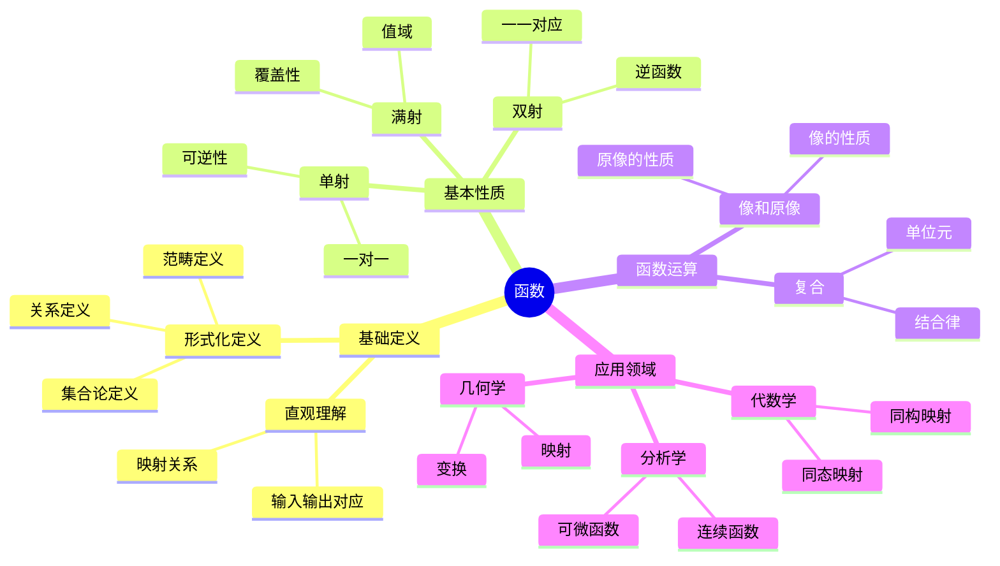

# 函数 (Function)

**概念编号**: C.CORE.002
**知识层次**: L0-L2
**知识领域**: D1 (基础数学)
**创建日期**: 2025年11月21日
**最后更新**: 2025年11月21日

---

## 📋 概述

函数是数学中最基本和最重要的概念之一，是连接不同数学对象的桥梁。函数概念贯穿所有数学分支，从基础数学到高级数学，从理论到应用，函数都扮演着核心角色。

**权威资源对齐**:

- Wikipedia: [Function (Mathematics)](https://en.wikipedia.org/wiki/Function_(mathematics))
- Stanford课程: Math 51 (Linear Algebra and Differential Calculus)
- Princeton课程: MAT 201 (Analysis)
- MIT课程: 18.01 (Single Variable Calculus)
- Metamath: [Function Definition](http://us.metamath.org/mpeuni/df-fun.html)

---

## 🎯 严格定义

### 基础定义 (L0)

**直观理解**: 函数是从一个集合到另一个集合的映射，每个输入对应唯一输出。

**基本定义**: 函数 $f: A \to B$ 是满足以下条件的对应关系：

- **单值性**: 对于每个 $a \in A$，存在唯一的 $b \in B$ 使得 $f(a) = b$
- **定义域**: $A$ 是函数的定义域（所有可能的输入）
- **值域**: $f(A) = \{f(a) : a \in A\}$ 是函数的值域（所有可能的输出）

**简单例子**:

- $f(x) = x^2$ 是从 $\mathbb{R}$ 到 $\mathbb{R}$ 的函数
- $f: \{1,2,3\} \to \{a,b\}$，$f(1) = a$，$f(2) = b$，$f(3) = a$
- 恒等函数 $f(x) = x$ 是每个集合到自身的函数

### 形式化定义 (L1)

**集合论定义**: 函数 $f: A \to B$ 是笛卡尔积 $A \times B$ 的子集，满足：

1. **存在性**: $\forall a \in A, \exists b \in B, (a,b) \in f$
2. **唯一性**: $\forall a \in A, \forall b_1, b_2 \in B, ((a,b_1) \in f \land (a,b_2) \in f) \Rightarrow b_1 = b_2$

**等价表述**: 函数是满足单值性的关系。

**记号**:

- $f: A \to B$: 从 $A$ 到 $B$ 的函数
- $f(a) = b$: $a$ 的像是 $b$
- $\text{dom}(f) = A$: 定义域
- $\text{ran}(f) = f(A)$: 值域
- $f^{-1}(B') = \{a \in A : f(a) \in B'\}$: 原像

**等价定义**:

- **关系定义**: 函数是满足单值性的二元关系
- **映射定义**: 函数是保持结构的映射（在特定结构中）
- **范畴定义**: 函数是集合范畴中的态射

---

## 📚 历史背景

### 发展脉络

**17-18世纪**: 函数概念的起源

- **Leibniz (1694)**: 引入"函数"（function）一词，表示依赖于变量的量
- **Euler (1748)**: 给出函数的解析定义：$y = f(x)$ 表示 $y$ 是 $x$ 的函数
- **Bernoulli (1718)**: 区分显式函数和隐式函数

**19世纪**: 函数概念的严格化

- **Dirichlet (1837)**: 给出函数的现代定义：函数是任意对应关系，不一定是解析式
- **Riemann (1854)**: 研究函数的可积性，引入Riemann积分
- **Weierstrass (1872)**: 给出函数的严格定义，强调单值性

**20世纪**: 函数概念的抽象化

- **Bourbaki (1939)**: 在集合论框架下给出函数的严格定义
- **范畴论 (1945)**: 将函数推广为范畴中的态射
- **类型论 (1980s)**: 在计算机科学中发展函数类型理论

### 关键人物

- **Gottfried Wilhelm Leibniz (1646-1716)**: 引入"函数"一词
- **Leonhard Euler (1707-1783)**: 发展函数理论，引入函数记号
- **Johann Peter Gustav Lejeune Dirichlet (1805-1859)**: 给出函数的现代定义
- **Bernhard Riemann (1826-1866)**: 研究函数的可积性和连续性
- **Karl Weierstrass (1815-1897)**: 严格化函数定义，强调单值性

### 重要事件

- **1694**: Leibniz引入"函数"一词
- **1748**: Euler发表《无穷分析引论》，系统研究函数
- **1837**: Dirichlet给出函数的现代定义
- **1872**: Weierstrass严格化函数定义
- **1939**: Bourbaki在集合论框架下定义函数

---

## 🔍 性质与定理

### 基本性质 (L1)

**性质1: 函数的复合**:

- **陈述**: 若 $f: A \to B$，$g: B \to C$，则复合函数 $g \circ f: A \to C$ 定义为 $(g \circ f)(a) = g(f(a))$
- **证明思路**: 由函数的定义，$f(a) \in B$，$g(f(a)) \in C$，因此 $g \circ f$ 是函数
- **性质**: 复合满足结合律：$(h \circ g) \circ f = h \circ (g \circ f)$
- **应用**: 函数变换、坐标变换

**性质2: 单射（Injection）**:

- **定义**: $f: A \to B$ 是单射当且仅当 $\forall x_1, x_2 \in A, f(x_1) = f(x_2) \Rightarrow x_1 = x_2$
- **等价条件**: $\forall y \in B, |f^{-1}(\{y\})| \leq 1$
- **性质**: 单射的复合仍是单射
- **应用**: 嵌入、同构

**性质3: 满射（Surjection）**:

- **定义**: $f: A \to B$ 是满射当且仅当 $\forall y \in B, \exists x \in A, f(x) = y$
- **等价条件**: $f(A) = B$
- **性质**: 满射的复合仍是满射
- **应用**: 覆盖、投影

**性质4: 双射（Bijection）**:

- **定义**: $f: A \to B$ 是双射当且仅当 $f$ 既是单射又是满射
- **性质**: 双射存在唯一的逆函数 $f^{-1}: B \to A$，满足 $f^{-1}(f(x)) = x$ 和 $f(f^{-1}(y)) = y$
- **应用**: 集合等势、坐标变换

**性质5: 像和原像的性质**:

- **像的性质**:
  - $f(A_1 \cup A_2) = f(A_1) \cup f(A_2)$
  - $f(A_1 \cap A_2) \subseteq f(A_1) \cap f(A_2)$（一般不等）
- **原像的性质**:
  - $f^{-1}(B_1 \cup B_2) = f^{-1}(B_1) \cup f^{-1}(B_2)$
  - $f^{-1}(B_1 \cap B_2) = f^{-1}(B_1) \cap f^{-1}(B_2)$
- **证明思路**: 由集合运算的定义和函数的定义直接得到
- **应用**: 集合运算、拓扑学

### 重要定理 (L2)

**定理1: 函数的分解定理**:

- **陈述**: 任意函数 $f: A \to B$ 可以唯一分解为满射和单射的复合：$f = i \circ s$，其中 $s: A \to f(A)$ 是满射，$i: f(A) \to B$ 是单射
- **证明思路**:
  1. 定义 $s(a) = f(a)$（$s$ 是满射）
  2. 定义 $i(b) = b$（$i$ 是单射）
  3. 显然 $f = i \circ s$
- **应用**: 函数分类、范畴论

**定理2: 逆函数存在性**:

- **陈述**: 函数 $f: A \to B$ 存在逆函数 $f^{-1}: B \to A$ 当且仅当 $f$ 是双射
- **证明思路**:
  1. 若 $f$ 是双射，定义 $f^{-1}(b) = a$ 其中 $f(a) = b$（由满射性存在，由单射性唯一）
  2. 若存在逆函数，则 $f$ 必须是双射（否则逆函数不满足单值性）
- **应用**: 坐标变换、同构

**定理3: 选择公理与函数**:

- **陈述**: 选择公理等价于：对于任意集合族 $\{A_i\}_{i \in I}$，存在选择函数 $f: I \to \bigcup_{i \in I} A_i$ 使得 $f(i) \in A_i$
- **证明思路**: 选择公理直接给出选择函数的存在性
- **应用**: 证明存在性定理（如Hahn-Banach定理）

**定理4: 函数的基数性质**:

- **陈述**:
  - 若存在单射 $f: A \to B$，则 $|A| \leq |B|$
  - 若存在满射 $f: A \to B$，则 $|B| \leq |A|$（需要选择公理）
  - 若存在双射 $f: A \to B$，则 $|A| = |B|$
- **证明思路**:
  1. 单射保持基数关系
  2. 满射的逆（需要选择公理）给出单射
  3. 双射给出等势
- **应用**: 基数比较、等势性

---

## 💡 应用实例

### 理论应用

**应用1: 数学分析**:

- 函数是分析学的基础对象
- 连续函数、可微函数、可积函数
- 例如：$f(x) = x^2$ 是连续、可微、可积的函数

**应用2: 代数**:

- 群同态、环同态、域同态都是函数
- 例如：群同态 $f: G \to H$ 满足 $f(ab) = f(a)f(b)$

**应用3: 拓扑学**:

- 连续映射是拓扑空间之间的函数
- 例如：$f: X \to Y$ 是连续映射当且仅当开集的原像是开集

**应用4: 范畴论**:

- 函数是集合范畴中的态射
- 例如：集合范畴 $\mathbf{Set}$ 的对象是集合，态射是函数

### 实际应用

**应用1: 物理学**:

- 物理量之间的关系用函数表示
- 例如：位置函数 $x(t)$、速度函数 $v(t) = \frac{dx}{dt}$

**应用2: 计算机科学**:

- 函数是程序的基本构建块
- 例如：编程语言中的函数定义和调用

**应用3: 经济学**:

- 经济模型用函数表示
- 例如：需求函数 $D(p)$、供给函数 $S(p)$

**应用4: 工程学**:

- 工程问题用函数建模
- 例如：信号处理中的函数变换（傅里叶变换）

### 交叉应用

**应用1: 函数分析**:

- 函数空间是无限维向量空间
- 例如：$L^2([0,1])$ 是可积函数的Hilbert空间

**应用2: 微分几何**:

- 流形之间的光滑映射是函数
- 例如：$f: M \to N$ 是流形之间的光滑映射

**应用3: 概率论**:

- 随机变量是函数
- 例如：随机变量 $X: \Omega \to \mathbb{R}$ 是概率空间到实数的函数

---

## 🔗 关联概念

### 依赖关系

**前置知识**:

- 集合（函数是集合的笛卡尔积的子集）
- 关系（函数是满足单值性的关系）
- 逻辑基础（函数的定义需要逻辑）

**后续知识**:

- 连续函数（函数的连续性）
- 可微函数（函数的可微性）
- 可积函数（函数的可积性）
- 函数空间（函数的集合配备结构）

### 等价关系

**等价定义**:

- 集合论定义（笛卡尔积的子集）
- 关系定义（满足单值性的关系）
- 映射定义（保持结构的映射）
- 范畴定义（集合范畴中的态射）

### 推广关系

**特殊情形**:

- 常值函数（值域是单点集）
- 恒等函数（定义域等于值域，$f(x) = x$）
- 单射函数（不同的输入对应不同的输出）
- 满射函数（每个输出都有对应的输入）

**一般推广**:

- 多值函数（允许一个输入对应多个输出）
- 部分函数（定义域是原定义域的子集）
- 函数类（函数的集合）
- 函子（范畴之间的映射）

### 应用关系

**理论应用**:

- 所有数学分支的基础
- 分析学、代数学、几何学、拓扑学的核心概念
- 范畴论中的态射

**实际问题**:

- 物理建模
- 计算机程序设计
- 经济模型
- 工程问题

---

## 📖 参考文献

### 权威资源

- Wikipedia: [Function (Mathematics)](https://en.wikipedia.org/wiki/Function_(mathematics))
- Wikipedia: [Bijection](https://en.wikipedia.org/wiki/Bijection)
- Wikipedia: [Injection](https://en.wikipedia.org/wiki/Injective_function)
- Wikipedia: [Surjection](https://en.wikipedia.org/wiki/Surjective_function)
- Metamath: [Function Definition](http://us.metamath.org/mpeuni/df-fun.html)

### 经典教材

- Bourbaki, N. (1968). *Theory of Sets*. Springer.
- Enderton, H. B. (1977). *Elements of Set Theory*. Academic Press.
- Rudin, W. (1976). *Principles of Mathematical Analysis*. McGraw-Hill.
- Apostol, T. M. (1974). *Mathematical Analysis*. Addison-Wesley.

### 历史文献

- Leibniz, G. W. (1694). "Nova methodus pro maximis et minimis". *Acta Eruditorum*.
- Euler, L. (1748). *Introductio in analysin infinitorum*. Lausanne.
- Dirichlet, P. G. L. (1837). "Über die Darstellung ganz willkürlicher Functionen durch Sinus- und Cosinusreihen". *Repertorium der Physik*.
- Weierstrass, K. (1872). "Über continuirliche Functionen eines reellen Arguments". *Monatsberichte der Königlich Preußischen Akademie der Wissenschaften*.

---

## 🎓 学习路径

### 基础路径 (L0→L1)

1. **直观理解**: 函数是输入到输出的对应关系
2. **基本定义**: 单值性、定义域、值域
3. **简单例子**: 多项式函数、三角函数、指数函数
4. **基本性质**: 函数的复合、像和原像
5. **形式化定义**: 集合论定义、关系定义

### 进阶路径 (L1→L2)

1. **函数性质**: 单射、满射、双射
2. **函数分类**: 函数的分解定理
3. **逆函数**: 逆函数的存在性和唯一性
4. **函数运算**: 函数的复合、函数的和、函数的积
5. **应用实例**: 分析学、代数学、几何学中的应用

### 高级路径 (L2→L3)

1. **函数空间**: 函数集合配备拓扑或度量结构
2. **函数分析**: 函数空间的Banach空间、Hilbert空间结构
3. **函数方程**: 函数满足的方程（如函数方程、微分方程）
4. **函数理论**: 复分析、调和分析中的函数理论
5. **前沿研究**: 函数逼近、函数插值、函数优化

---

## 🗺️ 思维导图 (编号: C.CORE.002.MIND)

### 函数概念思维导图

---

## 📊 知识多维关系矩阵 (编号: C.CORE.002.MATRIX)

### 函数的多维关系矩阵

| 维度 | 指标 | 函数 |
|------|------|------|
| **知识层次** | L0基础 | ⭐⭐⭐⭐⭐ |
| | L1中级 | ⭐⭐⭐⭐⭐ |
| | L2高级 | ⭐⭐⭐⭐ |
| | L3研究 | ⭐⭐ |
| **知识领域** | D1基础数学 | ⭐⭐⭐⭐⭐ |
| | D2代数 | ⭐⭐⭐⭐ |
| | D3分析 | ⭐⭐⭐⭐⭐ |
| | D4几何 | ⭐⭐⭐⭐ |
| | D5拓扑 | ⭐⭐⭐⭐ |
| | D6数论 | ⭐⭐⭐ |
| | D7离散数学 | ⭐⭐⭐⭐ |
| | D8交叉领域 | ⭐⭐⭐ |
| **依赖关系** | 前置概念 | 集合 |
| | 后续概念 | 极限、连续、导数、积分、线性映射、群同态 |
| **应用关系** | 理论应用 | ⭐⭐⭐⭐⭐ |
| | 实际应用 | ⭐⭐⭐⭐⭐ |
| | 交叉应用 | ⭐⭐⭐⭐ |
| **学习难度** | 直观理解 | ⭐⭐ |
| | 形式化理解 | ⭐⭐⭐ |
| | 深入应用 | ⭐⭐⭐ |

---

## 💭 形象化解释与论证 (编号: C.CORE.002.VISUAL)

### 形象化解释

**1. 函数的直观理解**:

- **类比**: 函数就像"机器"或"转换器"，输入一个值，输出一个值
- **例子**:
  - 自动售货机：投入硬币（输入），得到商品（输出）
  - 温度转换：输入摄氏度，输出华氏度
  - 计算器：输入数字，输出计算结果

**2. 函数性质的直观理解**:

- **单射**: 不同的输入产生不同的输出（"一对一"）
- **满射**: 每个可能的输出都有对应的输入（"全覆盖"）
- **双射**: 既是单射又是满射（"完美对应"）

**3. 函数复合的直观理解**:

- **类比**: 函数复合就像"流水线"，一个函数的输出作为另一个函数的输入
- **例子**:
  - 先加1再乘2：$f(x) = x+1$，$g(x) = 2x$，则 $(g \circ f)(x) = 2(x+1)$

### 认知科学视角

**1. 数学教育家Dienes的观点**:

- **多表征原则**: 通过表格、图形、公式、语言等多种方式表示函数
- **变化性原则**: 通过不同的函数例子理解函数的本质
- **教学启示**: 使用函数图像、函数表格、函数公式等多种教学工具

**2. 数学认知学家Tall的观点**:

- **过程-对象对偶**: 理解"函数运算"（过程）和"函数"（对象）
- **认知层次**: 从具体函数（如$f(x)=x^2$）到抽象函数概念
- **教学启示**: 从具体例子开始，逐步抽象化

---

## 👨‍🏫 专家观点与论证 (编号: C.CORE.002.EXPERT)

### 数学家的观点

**1. Leonhard Euler (1707-1783) - 函数理论的奠基者**:
> "函数是依赖于变量的解析表达式。"
>
> **意义**: Euler建立了函数理论的基础，引入了现代函数记号。

**2. Johann Peter Gustav Lejeune Dirichlet (1805-1859) - 现代函数定义的提出者**:
> "函数是任意对应关系，不一定是解析式。"
>
> **意义**: Dirichlet打破了函数必须是解析式的限制，给出了函数的现代定义。

**3. Karl Weierstrass (1815-1897) - 函数严格化的推动者**:
> "函数必须满足单值性，每个输入对应唯一的输出。"
>
> **意义**: Weierstrass严格化了函数定义，强调了单值性的重要性。

### 数学教育家的观点

**1. Zoltan Dienes (1916-2014) - 数学教育家**:
> "函数概念应该通过多种表征方式学习：表格、图形、公式、语言。"
>
> **教学启示**:
>
> - 使用函数表格展示输入输出对应
> - 使用函数图像可视化函数
> - 使用函数公式表示函数
> - 逐步抽象到一般函数概念

**2. Hans Freudenthal (1905-1990) - 数学教育家**:
> "函数概念的学习需要从'对应关系'发展到'映射结构'。"
>
> **认知发展**:
>
> - **对应阶段**: 理解输入输出对应（如函数表格）
> - **映射阶段**: 理解函数作为映射（如函数图像）
> - **结构阶段**: 理解函数的结构（如函数性质）

### 数学认知学家的观点

**1. David Tall - 数学认知学家**:
> "函数概念的理解需要从'过程'（如何计算）发展到'对象'（函数本身）。"
>
> **认知层次**:
>
> - **过程层次**: 理解"如何计算函数值"（如$f(2)=4$）
> - **对象层次**: 理解"函数本身"（如$f$是一个函数）

**2. Anna Sfard - 数学认知学家**:
> "函数概念的学习需要从'操作性理解'（知道如何计算）发展到'结构性理解'（理解函数的结构和性质）。"
>
> **理解层次**:
>
> - **操作性理解**: 知道如何计算函数值、画函数图像
> - **结构性理解**: 理解函数的性质（单射、满射、双射）、函数的运算（复合、逆）

---

**创建日期**: 2025年11月21日
**最后更新**: 2025年11月21日
**维护状态**: 持续更新中
