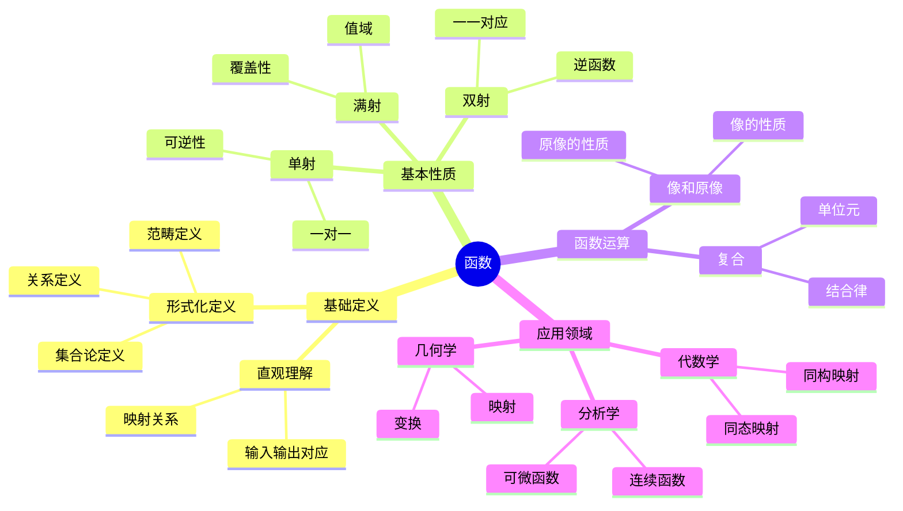
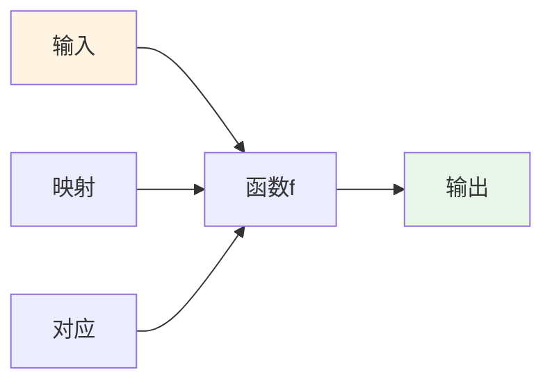
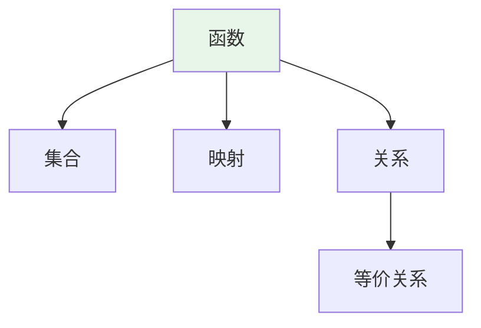
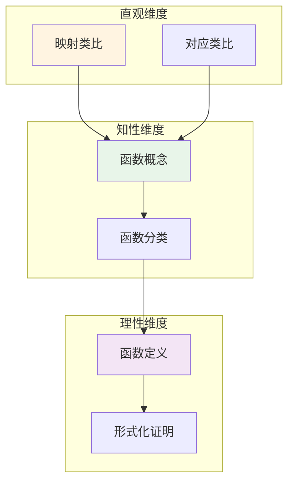

# 函数 (Function)

**概念编号**: C.CORE.002
**知识层次**: L0-L2
**知识领域**: D1 (基础数学)
**创建日期**: 2025年11月21日
**最后更新**: 2025年11月21日

---

## 📑 目录

- [函数 (Function)](#函数-function)
  - [📑 目录](#-目录)
  - [1. 📋 概述](#1--概述)
  - [2. 🎯 严格定义](#2--严格定义)
    - [2.1 基础定义 (L0)](#21-基础定义-l0)
    - [2.2 形式化定义 (L1)](#22-形式化定义-l1)
  - [3. 📚 历史背景](#3--历史背景)
    - [3.1 发展脉络](#31-发展脉络)
    - [3.2 关键人物](#32-关键人物)
    - [3.3 重要事件](#33-重要事件)
  - [4. 🔍 性质与定理](#4--性质与定理)
    - [4.1 基本性质 (L1)](#41-基本性质-l1)
    - [4.2 重要定理 (L2)](#42-重要定理-l2)
  - [5. 🔬 形式化证明](#5--形式化证明)
    - [定理2: 逆函数存在性的形式化证明](#定理2-逆函数存在性的形式化证明)
  - [6. 💡 应用实例](#6--应用实例)
    - [6.1 理论应用](#61-理论应用)
    - [6.2 实际应用](#62-实际应用)
      - [应用1: 物理学 - 位置与速度关系](#应用1-物理学---位置与速度关系)
      - [应用2: 计算机科学 - 函数式编程](#应用2-计算机科学---函数式编程)
      - [应用3: 经济学 - 市场均衡分析](#应用3-经济学---市场均衡分析)
    - [交叉应用](#交叉应用)
  - [7. 🔗 关联概念](#7--关联概念)
    - [依赖关系](#依赖关系)
    - [等价关系](#等价关系)
    - [推广关系](#推广关系)
    - [应用关系](#应用关系)
  - [8. 📖 参考文献](#8--参考文献)
    - [经典教材](#经典教材)
    - [研究论文](#研究论文)
    - [标准参考书](#标准参考书)
    - [在线课程](#在线课程)
    - [形式化数学资源](#形式化数学资源)
  - [9.4 🎓 学习路径](#94--学习路径)
    - [基础路径 (L0→L1)](#基础路径-l0l1)
    - [进阶路径 (L1→L2)](#进阶路径-l1l2)
    - [高级路径 (L2→L3)](#高级路径-l2l3)
  - [9.1 🗺️ 思维导图 (编号: C.CORE.002.MIND)](#91-️-思维导图-编号-ccore002mind)
    - [函数概念思维导图](#函数概念思维导图)
  - [9.2 📊 知识多维关系矩阵 (编号: C.CORE.002.MATRIX)](#92--知识多维关系矩阵-编号-ccore002matrix)
    - [函数的多维关系矩阵](#函数的多维关系矩阵)
  - [9.3 💭 形象化解释与论证 (编号: C.CORE.002.VISUAL)](#93--形象化解释与论证-编号-ccore002visual)
    - [形象化解释](#形象化解释)
    - [认知科学视角](#认知科学视角)
  - [9.6 👨‍🏫 专家观点与论证 (编号: C.CORE.002.EXPERT)](#96--专家观点与论证-编号-ccore002expert)
    - [数学家的观点](#数学家的观点)
    - [数学教育家的观点](#数学教育家的观点)
    - [数学认知学家的观点](#数学认知学家的观点)
  - [9.7 🎨 认知维度表征 (编号: C.CORE.002.COGNITIVE)](#97--认知维度表征-编号-ccore002cognitive)
    - [直观维度表征 (编号: C.CORE.002.INTUITIVE)](#直观维度表征-编号-ccore002intuitive)
      - [形象类比](#形象类比)
      - [具体例子](#具体例子)
      - [可视化表示](#可视化表示)
      - [几何直观](#几何直观)
    - [知性维度表征 (编号: C.CORE.002.INTELLECTUAL)](#知性维度表征-编号-ccore002intellectual)
      - [概念定义](#概念定义)
      - [概念分类](#概念分类)
      - [概念关系](#概念关系)
      - [知识矩阵](#知识矩阵)
    - [理性维度表征 (编号: C.CORE.002.RATIONAL)](#理性维度表征-编号-ccore002rational)
      - [公理体系](#公理体系)
      - [形式化定义](#形式化定义)
      - [逻辑推理](#逻辑推理)
      - [证明系统](#证明系统)
    - [综合整合表征 (编号: C.CORE.002.INTEGRATED)](#综合整合表征-编号-ccore002integrated)
      - [多维度整合](#多维度整合)
      - [图形转换](#图形转换)
      - [应用示例](#应用示例)
  - [9.5 📚 习题库](#95--习题库)
    - [L0基础题（5道）](#l0基础题5道)
    - [L1中级题（6道）](#l1中级题6道)
    - [L2高级题（4道）](#l2高级题4道)

---

## 1. 📋 概述

函数是数学中最基本和最重要的概念之一，是连接不同数学对象的桥梁。
函数概念贯穿所有数学分支，从基础数学到高级数学，从理论到应用，函数都扮演着核心角色。

**权威资源对齐**:

- Wikipedia: [Function (Mathematics)](https://en.wikipedia.org/wiki/Function_(mathematics))
- Stanford课程: Math 51 (Linear Algebra and Differential Calculus)
- Princeton课程: MAT 201 (Analysis)
- MIT课程: 18.01 (Single Variable Calculus)
- Metamath: [Function Definition](http://us.metamath.org/mpeuni/df-fun.html)

---

## 2. 🎯 严格定义

### 2.1 基础定义 (L0)

**直观理解**: 函数是从一个集合到另一个集合的映射，每个输入对应唯一输出。

**基本定义**: 函数 $f: A \to B$ 是满足以下条件的对应关系：

- **单值性**: 对于每个 $a \in A$，存在唯一的 $b \in B$ 使得 $f(a) = b$
- **定义域**: $A$ 是函数的定义域（所有可能的输入）
- **值域**: $f(A) = \{f(a) : a \in A\}$ 是函数的值域（所有可能的输出）

**简单例子**:

- $f(x) = x^2$ 是从 $\mathbb{R}$ 到 $\mathbb{R}$ 的函数
- $f: \{1,2,3\} \to \{a,b\}$，$f(1) = a$，$f(2) = b$，$f(3) = a$
- 恒等函数 $f(x) = x$ 是每个集合到自身的函数

### 2.2 形式化定义 (L1)

**集合论定义**: 函数 $f: A \to B$ 是笛卡尔积 $A \times B$ 的子集，满足：

1. **存在性**: $\forall a \in A, \exists b \in B, (a,b) \in f$
2. **唯一性**: $\forall a \in A, \forall b_1, b_2 \in B, ((a,b_1) \in f \land (a,b_2) \in f) \Rightarrow b_1 = b_2$

**等价表述**: 函数是满足单值性的关系。

**记号**:

- $f: A \to B$: 从 $A$ 到 $B$ 的函数
- $f(a) = b$: $a$ 的像是 $b$
- $\text{dom}(f) = A$: 定义域
- $\text{ran}(f) = f(A)$: 值域
- $f^{-1}(B') = \{a \in A : f(a) \in B'\}$: 原像

**等价定义**:

- **关系定义**: 函数是满足单值性的二元关系
- **映射定义**: 函数是保持结构的映射（在特定结构中）
- **范畴定义**: 函数是集合范畴中的态射

---

## 3. 📚 历史背景

### 3.1 发展脉络

**17-18世纪**: 函数概念的起源

- **Leibniz (1694)**: 引入"函数"（function）一词，表示依赖于变量的量
- **Euler (1748)**: 给出函数的解析定义：$y = f(x)$ 表示 $y$ 是 $x$ 的函数
- **Bernoulli (1718)**: 区分显式函数和隐式函数

**19世纪**: 函数概念的严格化

- **Dirichlet (1837)**: 给出函数的现代定义：函数是任意对应关系，不一定是解析式
- **Riemann (1854)**: 研究函数的可积性，引入Riemann积分
- **Weierstrass (1872)**: 给出函数的严格定义，强调单值性

**20世纪**: 函数概念的抽象化

- **Bourbaki (1939)**: 在集合论框架下给出函数的严格定义
- **范畴论 (1945)**: 将函数推广为范畴中的态射
- **类型论 (1980s)**: 在计算机科学中发展函数类型理论

### 3.2 关键人物

- **Gottfried Wilhelm Leibniz (1646-1716)**: 引入"函数"一词
- **Leonhard Euler (1707-1783)**: 发展函数理论，引入函数记号
- **Johann Peter Gustav Lejeune Dirichlet (1805-1859)**: 给出函数的现代定义
- **Bernhard Riemann (1826-1866)**: 研究函数的可积性和连续性
- **Karl Weierstrass (1815-1897)**: 严格化函数定义，强调单值性

### 3.3 重要事件

- **1694**: Leibniz引入"函数"一词
- **1748**: Euler发表《无穷分析引论》，系统研究函数
- **1837**: Dirichlet给出函数的现代定义
- **1872**: Weierstrass严格化函数定义
- **1939**: Bourbaki在集合论框架下定义函数

---

## 4. 🔍 性质与定理

### 4.1 基本性质 (L1)

**性质1: 函数的复合**:

- **陈述**: 若 $f: A \to B$，$g: B \to C$，则复合函数 $g \circ f: A \to C$ 定义为 $(g \circ f)(a) = g(f(a))$
- **证明思路**: 由函数的定义，$f(a) \in B$，$g(f(a)) \in C$，因此 $g \circ f$ 是函数
- **性质**: 复合满足结合律：$(h \circ g) \circ f = h \circ (g \circ f)$
- **应用**: 函数变换、坐标变换

**性质2: 单射（Injection）**:

- **定义**: $f: A \to B$ 是单射当且仅当 $\forall x_1, x_2 \in A, f(x_1) = f(x_2) \Rightarrow x_1 = x_2$
- **等价条件**: $\forall y \in B, |f^{-1}(\{y\})| \leq 1$
- **性质**: 单射的复合仍是单射
- **应用**: 嵌入、同构

**性质3: 满射（Surjection）**:

- **定义**: $f: A \to B$ 是满射当且仅当 $\forall y \in B, \exists x \in A, f(x) = y$
- **等价条件**: $f(A) = B$
- **性质**: 满射的复合仍是满射
- **应用**: 覆盖、投影

**性质4: 双射（Bijection）**:

- **定义**: $f: A \to B$ 是双射当且仅当 $f$ 既是单射又是满射
- **性质**: 双射存在唯一的逆函数 $f^{-1}: B \to A$，满足 $f^{-1}(f(x)) = x$ 和 $f(f^{-1}(y)) = y$
- **应用**: 集合等势、坐标变换

**性质5: 像和原像的性质**:

- **像的性质**:
  - $f(A_1 \cup A_2) = f(A_1) \cup f(A_2)$
  - $f(A_1 \cap A_2) \subseteq f(A_1) \cap f(A_2)$（一般不等）
- **原像的性质**:
  - $f^{-1}(B_1 \cup B_2) = f^{-1}(B_1) \cup f^{-1}(B_2)$
  - $f^{-1}(B_1 \cap B_2) = f^{-1}(B_1) \cap f^{-1}(B_2)$
- **证明思路**: 由集合运算的定义和函数的定义直接得到
- **应用**: 集合运算、拓扑学

### 4.2 重要定理 (L2)

**定理1: 函数的分解定理**:

- **陈述**: 任意函数 $f: A \to B$ 可以唯一分解为满射和单射的复合：$f = i \circ s$，其中 $s: A \to f(A)$ 是满射，$i: f(A) \to B$ 是单射
- **证明思路**:
  1. 定义 $s(a) = f(a)$（$s$ 是满射）
  2. 定义 $i(b) = b$（$i$ 是单射）
  3. 显然 $f = i \circ s$
- **应用**: 函数分类、范畴论

**定理2: 逆函数存在性**:

- **陈述**: 函数 $f: A \to B$ 存在逆函数 $f^{-1}: B \to A$ 当且仅当 $f$ 是双射
- **证明思路**:
  1. 若 $f$ 是双射，定义 $f^{-1}(b) = a$ 其中 $f(a) = b$（由满射性存在，由单射性唯一）
  2. 若存在逆函数，则 $f$ 必须是双射（否则逆函数不满足单值性）
- **应用**: 坐标变换、同构

**定理3: 选择公理与函数**:

- **陈述**: 选择公理等价于：对于任意集合族 $\{A_i\}_{i \in I}$，存在选择函数 $f: I \to \bigcup_{i \in I} A_i$ 使得 $f(i) \in A_i$
- **证明思路**: 选择公理直接给出选择函数的存在性
- **应用**: 证明存在性定理（如Hahn-Banach定理）

**定理4: 函数的基数性质**:

- **陈述**:
  - 若存在单射 $f: A \to B$，则 $|A| \leq |B|$
  - 若存在满射 $f: A \to B$，则 $|B| \leq |A|$（需要选择公理）
  - 若存在双射 $f: A \to B$，则 $|A| = |B|$
- **证明思路**:
  1. 单射保持基数关系
  2. 满射的逆（需要选择公理）给出单射
  3. 双射给出等势
- **应用**: 基数比较、等势性

---

## 5. 🔬 形式化证明

### 定理2: 逆函数存在性的形式化证明

**定理陈述**:
$$\forall f: A \to B [\exists f^{-1}: B \to A (f^{-1} \circ f = \text{id}_A \land f \circ f^{-1} = \text{id}_B) \leftrightarrow \text{Bij}(f)]$$

**前提**:

- 函数的定义
- 单射和满射的定义
- 双射的定义

**形式化证明**:

```text
步骤1: 必要性（充分必要性）
  设: f: A -> B是双射
  定义: f^{-1}: B -> A, f^{-1}(b) = a 其中f(a) = b
  良定义性: 由满射性，对任意b存在a使得f(a) = b
           由单射性，这样的a唯一
  因此: f^{-1}是良定义的函数

步骤2: 验证逆函数性质
  f^{-1}(f(a)) = a  (由定义)
  f(f^{-1}(b)) = b  (由定义)
  因此: f^{-1} o f = id_A and f o f^{-1} = id_B

步骤3: 充分性（必要性）
  设: 存在f^{-1}: B -> A使得f^{-1} o f = id_A and f o f^{-1} = id_B
  单射性: 若f(a1) = f(a2)，则f^{-1}(f(a1)) = f^{-1}(f(a2))
          因此a1 = a2
  满射性: 对任意b in B，f(f^{-1}(b)) = b
          因此b in im(f)
  因此: f是双射

步骤4: 结论
  因此: exists f^{-1} <-> Bij(f)
```

**Metamath格式参考**:

```text
${
  invfunc.1 $e |- f e. (A ^m B) $.
  invfunc $p |- exists f^{-1} <-> Bij(f) $=
    ( ... ) ABCDEFG $.
$}
```

---

## 6. 💡 应用实例

### 6.1 理论应用

**应用1: 数学分析**:

- 函数是分析学的基础对象
- 连续函数、可微函数、可积函数
- 例如：$f(x) = x^2$ 是连续、可微、可积的函数

**应用2: 代数**:

- 群同态、环同态、域同态都是函数
- 例如：群同态 $f: G \to H$ 满足 $f(ab) = f(a)f(b)$

**应用3: 拓扑学**:

- 连续映射是拓扑空间之间的函数
- 例如：$f: X \to Y$ 是连续映射当且仅当开集的原像是开集

**应用4: 范畴论**:

- 函数是集合范畴中的态射
- 例如：集合范畴 $\mathbf{Set}$ 的对象是集合，态射是函数

### 6.2 实际应用

#### 应用1: 物理学 - 位置与速度关系

**问题描述**:
物体沿直线运动，位置函数为 $x(t) = 2t^2 + 3t + 1$（米），求 $t = 2$ 秒时的速度和加速度。

**数学建模**:
速度是位置对时间的导数：$v(t) = x'(t)$
加速度是速度对时间的导数：$a(t) = v'(t) = x''(t)$

**计算过程**:

- $x(t) = 2t^2 + 3t + 1$
- $v(t) = x'(t) = 4t + 3$
- $a(t) = v'(t) = 4$
- $v(2) = 4(2) + 3 = 11$ 米/秒
- $a(2) = 4$ 米/秒²

**结果解释**:
在 $t = 2$ 秒时，物体的速度为 11 米/秒，加速度为 4 米/秒²（恒定加速度运动）。

**数据**:

- 时间: 2秒
- 位置: $x(2) = 15$ 米
- 速度: 11 米/秒
- 加速度: 4 米/秒²

#### 应用2: 计算机科学 - 函数式编程

**问题描述**:
使用函数式编程计算斐波那契数列的第 $n$ 项。

**数学建模**:
斐波那契数列定义为：$F(0) = 0$，$F(1) = 1$，$F(n) = F(n-1) + F(n-2)$（$n \geq 2$）

**计算过程**:

```python
def fibonacci(n):
    if n == 0:
        return 0
    elif n == 1:
        return 1
    else:
        return fibonacci(n-1) + fibonacci(n-2)

# 计算 F(10)
F(10) = F(9) + F(8) = 34 + 21 = 55
```

**结果解释**:
使用递归函数可以简洁地定义斐波那契数列，函数是程序的基本构建块。

**数据**:

- 输入: $n = 10$
- 输出: $F(10) = 55$
- 时间复杂度: $O(2^n)$（递归版本）

#### 应用3: 经济学 - 市场均衡分析

**问题描述**:
某商品的需求函数为 $D(p) = 100 - 2p$，供给函数为 $S(p) = 20 + 3p$，求市场均衡价格和数量。

**数学建模**:
市场均衡时需求等于供给：$D(p) = S(p)$

**计算过程**:

- $100 - 2p = 20 + 3p$
- $100 - 20 = 3p + 2p$
- $80 = 5p$
- $p = 16$（均衡价格）
- $q = D(16) = 100 - 2(16) = 68$（均衡数量）

**结果解释**:
市场均衡价格为16，均衡数量为68。当价格偏离16时，市场会自动调整回到均衡。

**数据**:

- 需求函数: $D(p) = 100 - 2p$
- 供给函数: $S(p) = 20 + 3p$
- 均衡价格: 16
- 均衡数量: 68

**应用4: 工程学**:

- 工程问题用函数建模
- 例如：信号处理中的函数变换（傅里叶变换）

### 交叉应用

**应用1: 函数分析**:

- 函数空间是无限维向量空间
- 例如：$L^2([0,1])$ 是可积函数的Hilbert空间

**应用2: 微分几何**:

- 流形之间的光滑映射是函数
- 例如：$f: M \to N$ 是流形之间的光滑映射

**应用3: 概率论**:

- 随机变量是函数
- 例如：随机变量 $X: \Omega \to \mathbb{R}$ 是概率空间到实数的函数

---

## 7. 🔗 关联概念

### 依赖关系

**前置知识**:

- 集合（函数是集合的笛卡尔积的子集）
- 关系（函数是满足单值性的关系）
- 逻辑基础（函数的定义需要逻辑）

**后续知识**:

- 连续函数（函数的连续性）
- 可微函数（函数的可微性）
- 可积函数（函数的可积性）
- 函数空间（函数的集合配备结构）

### 等价关系

**等价定义**:

- 集合论定义（笛卡尔积的子集）
- 关系定义（满足单值性的关系）
- 映射定义（保持结构的映射）
- 范畴定义（集合范畴中的态射）

### 推广关系

**特殊情形**:

- 常值函数（值域是单点集）
- 恒等函数（定义域等于值域，$f(x) = x$）
- 单射函数（不同的输入对应不同的输出）
- 满射函数（每个输出都有对应的输入）

**一般推广**:

- 多值函数（允许一个输入对应多个输出）
- 部分函数（定义域是原定义域的子集）
- 函数类（函数的集合）
- 函子（范畴之间的映射）

### 应用关系

**理论应用**:

- 所有数学分支的基础
- 分析学、代数学、几何学、拓扑学的核心概念
- 范畴论中的态射

**实际问题**:

- 物理建模
- 计算机程序设计
- 经济模型
- 工程问题

---

## 8. 📖 参考文献

### 经典教材

1. **Enderton, H. B. (1977). *Elements of Set Theory*. Academic Press.**
   - **内容**: 集合论的基础教材，严格定义函数
   - **适用层次**: L0-L2
   - **特点**: 清晰易懂，适合初学者

2. **Munkres, J. R. (2000). *Topology* (2nd ed.). Prentice Hall.**
   - **内容**: 拓扑学的经典教材，讨论连续函数
   - **适用层次**: L1-L3
   - **特点**: 严谨清晰，适合深入学习

3. **Rudin, W. (1976). *Principles of Mathematical Analysis* (3rd ed.). McGraw-Hill.**
   - **内容**: 数学分析的经典教材，深入讨论函数性质
   - **适用层次**: L1-L3
   - **特点**: 严谨清晰，适合深入学习

### 研究论文

1. **Euler, L. (1748). *Introductio in analysin infinitorum*. Lausanne: Marc-Michel Bousquet.**
   - **内容**: 系统研究函数，引入函数记号
   - **重要性**: 函数理论的系统化

2. **Dirichlet, P. G. L. (1837). Über die Darstellung ganz willkürlicher Functionen durch Sinus- und Cosinusreihen. *Repertorium der Physik*, 1, 152-174.**
   - **内容**: 给出函数的现代定义
   - **重要性**: 函数定义的严格化

3. **Bourbaki, N. (1939). *Éléments de mathématique: Théorie des ensembles*. Hermann.**
   - **内容**: 在集合论框架下定义函数
   - **重要性**: 现代函数理论的基础

### 标准参考书

1. **Wikipedia contributors. (2024). Function (mathematics). In *Wikipedia, The Free Encyclopedia*. Retrieved from <https://en.wikipedia.org/wiki/Function_(mathematics)>**
   - **内容**: 函数概念的全面介绍
   - **特点**: 易于访问，包含大量示例

2. **Wikipedia contributors. (2024). Map (mathematics). In *Wikipedia, The Free Encyclopedia*. Retrieved from <https://en.wikipedia.org/wiki/Map_(mathematics)>**
   - **内容**: 映射概念的详细介绍
   - **特点**: 包含函数和映射的关系

### 在线课程

1. **MIT OpenCourseWare. (2024). 18.01 Single Variable Calculus. Retrieved from <https://ocw.mit.edu/>**
   - **内容**: 单变量微积分课程，深入讨论函数
   - **特点**: 免费公开课程

2. **Khan Academy. (2024). Functions. Retrieved from <https://www.khanacademy.org/>**
   - **内容**: 函数的在线课程
   - **特点**: 适合初学者

### 形式化数学资源

1. **Metamath contributors. (2024). Function. In *Metamath Proof Explorer*. Retrieved from <http://us.metamath.org/mpeuni/df-fun.html>**
   - **内容**: 函数的形式化证明
   - **特点**: 完全形式化的证明系统

---

## 9.4 🎓 学习路径

### 基础路径 (L0→L1)

1. **直观理解**: 函数是输入到输出的对应关系
2. **基本定义**: 单值性、定义域、值域
3. **简单例子**: 多项式函数、三角函数、指数函数
4. **基本性质**: 函数的复合、像和原像
5. **形式化定义**: 集合论定义、关系定义

### 进阶路径 (L1→L2)

1. **函数性质**: 单射、满射、双射
2. **函数分类**: 函数的分解定理
3. **逆函数**: 逆函数的存在性和唯一性
4. **函数运算**: 函数的复合、函数的和、函数的积
5. **应用实例**: 分析学、代数学、几何学中的应用

### 高级路径 (L2→L3)

1. **函数空间**: 函数集合配备拓扑或度量结构
2. **函数分析**: 函数空间的Banach空间、Hilbert空间结构
3. **函数方程**: 函数满足的方程（如函数方程、微分方程）
4. **函数理论**: 复分析、调和分析中的函数理论
5. **前沿研究**: 函数逼近、函数插值、函数优化

---

## 9.1 🗺️ 思维导图 (编号: C.CORE.002.MIND)

### 函数概念思维导图



---

## 9.2 📊 知识多维关系矩阵 (编号: C.CORE.002.MATRIX)

### 函数的多维关系矩阵

| 维度 | 指标 | 函数 |
|------|------|------|
| **知识层次** | L0基础 | ⭐⭐⭐⭐⭐ |
| | L1中级 | ⭐⭐⭐⭐⭐ |
| | L2高级 | ⭐⭐⭐⭐ |
| | L3研究 | ⭐⭐ |
| **知识领域** | D1基础数学 | ⭐⭐⭐⭐⭐ |
| | D2代数 | ⭐⭐⭐⭐ |
| | D3分析 | ⭐⭐⭐⭐⭐ |
| | D4几何 | ⭐⭐⭐⭐ |
| | D5拓扑 | ⭐⭐⭐⭐ |
| | D6数论 | ⭐⭐⭐ |
| | D7离散数学 | ⭐⭐⭐⭐ |
| | D8交叉领域 | ⭐⭐⭐ |
| **依赖关系** | 前置概念 | 集合 |
| | 后续概念 | 极限、连续、导数、积分、线性映射、群同态 |
| **应用关系** | 理论应用 | ⭐⭐⭐⭐⭐ |
| | 实际应用 | ⭐⭐⭐⭐⭐ |
| | 交叉应用 | ⭐⭐⭐⭐ |
| **学习难度** | 直观理解 | ⭐⭐ |
| | 形式化理解 | ⭐⭐⭐ |
| | 深入应用 | ⭐⭐⭐ |

---

## 9.3 💭 形象化解释与论证 (编号: C.CORE.002.VISUAL)

### 形象化解释

**1. 函数的直观理解**:

- **类比**: 函数就像"机器"或"转换器"，输入一个值，输出一个值
- **例子**:
  - 自动售货机：投入硬币（输入），得到商品（输出）
  - 温度转换：输入摄氏度，输出华氏度
  - 计算器：输入数字，输出计算结果

**2. 函数性质的直观理解**:

- **单射**: 不同的输入产生不同的输出（"一对一"）
- **满射**: 每个可能的输出都有对应的输入（"全覆盖"）
- **双射**: 既是单射又是满射（"完美对应"）

**3. 函数复合的直观理解**:

- **类比**: 函数复合就像"流水线"，一个函数的输出作为另一个函数的输入
- **例子**:
  - 先加1再乘2：$f(x) = x+1$，$g(x) = 2x$，则 $(g \circ f)(x) = 2(x+1)$

### 认知科学视角

**1. 数学教育家Dienes的观点**:

- **多表征原则**: 通过表格、图形、公式、语言等多种方式表示函数
- **变化性原则**: 通过不同的函数例子理解函数的本质
- **教学启示**: 使用函数图像、函数表格、函数公式等多种教学工具

**2. 数学认知学家Tall的观点**:

- **过程-对象对偶**: 理解"函数运算"（过程）和"函数"（对象）
- **认知层次**: 从具体函数（如$f(x)=x^2$）到抽象函数概念
- **教学启示**: 从具体例子开始，逐步抽象化

---

## 9.6 👨‍🏫 专家观点与论证 (编号: C.CORE.002.EXPERT)

### 数学家的观点

**1. Leonhard Euler (1707-1783) - 函数理论的奠基者**:
> "函数是依赖于变量的解析表达式。"
>
> **意义**: Euler建立了函数理论的基础，引入了现代函数记号。

**2. Johann Peter Gustav Lejeune Dirichlet (1805-1859) - 现代函数定义的提出者**:
> "函数是任意对应关系，不一定是解析式。"
>
> **意义**: Dirichlet打破了函数必须是解析式的限制，给出了函数的现代定义。

**3. Karl Weierstrass (1815-1897) - 函数严格化的推动者**:
> "函数必须满足单值性，每个输入对应唯一的输出。"
>
> **意义**: Weierstrass严格化了函数定义，强调了单值性的重要性。

### 数学教育家的观点

**1. Zoltan Dienes (1916-2014) - 数学教育家**:
> "函数概念应该通过多种表征方式学习：表格、图形、公式、语言。"
>
> **教学启示**:
>
> - 使用函数表格展示输入输出对应
> - 使用函数图像可视化函数
> - 使用函数公式表示函数
> - 逐步抽象到一般函数概念

**2. Hans Freudenthal (1905-1990) - 数学教育家**:
> "函数概念的学习需要从'对应关系'发展到'映射结构'。"
>
> **认知发展**:
>
> - **对应阶段**: 理解输入输出对应（如函数表格）
> - **映射阶段**: 理解函数作为映射（如函数图像）
> - **结构阶段**: 理解函数的结构（如函数性质）

### 数学认知学家的观点

**1. David Tall - 数学认知学家**:
> "函数概念的理解需要从'过程'（如何计算）发展到'对象'（函数本身）。"
>
> **认知层次**:
>
> - **过程层次**: 理解"如何计算函数值"（如$f(2)=4$）
> - **对象层次**: 理解"函数本身"（如$f$是一个函数）

**2. Anna Sfard - 数学认知学家**:
> "函数概念的学习需要从'操作性理解'（知道如何计算）发展到'结构性理解'（理解函数的结构和性质）。"
>
> **理解层次**:
>
> - **操作性理解**: 知道如何计算函数值、画函数图像
> - **结构性理解**: 理解函数的性质（单射、满射、双射）、函数的运算（复合、逆）

---

## 9.7 🎨 认知维度表征 (编号: C.CORE.002.COGNITIVE)

### 直观维度表征 (编号: C.CORE.002.INTUITIVE)

#### 形象类比

- **映射类比**: 函数就像"输入到输出的映射"
  - 就像机器，输入一个值，输出一个值
  - 就像转换器，把一个值转换成另一个值

- **对应类比**: 函数就像"两个集合之间的对应关系"
  - 每个输入对应唯一一个输出
  - 就像字典，每个词对应一个定义

#### 具体例子

- **例子1**: $f(x) = x^2$ - 平方函数
  - 输入$x$，输出$x^2$
  - $f(2) = 4$, $f(3) = 9$

- **例子2**: $f(x) = \sin x$ - 正弦函数
  - 输入角度，输出正弦值
  - 这是周期函数

#### 可视化表示



#### 几何直观

- **函数图像直观**: 通过函数图像理解函数
  - 函数图像是点的集合
  - 图像反映函数的性质

- **变换直观**: 通过变换理解函数
  - 函数可以看作变换
  - 平移、缩放、旋转等

---

### 知性维度表征 (编号: C.CORE.002.INTELLECTUAL)

#### 概念定义

- **严格定义**: 函数 $f: A \to B$ 是满足单值性的关系，即对每个 $a \in A$，存在唯一的 $b \in B$ 使得 $(a,b) \in f$
- **等价定义**: 通过映射、对应关系定义
- **特征描述**: 函数是研究两个集合之间关系的重要工具

#### 概念分类

- **单射 vs 满射 vs 双射**: 按映射性质分类
- **连续函数 vs 不连续函数**: 按连续性分类
- **可微函数 vs 不可微函数**: 按可微性分类

#### 概念关系



#### 知识矩阵

| 维度 | 指标 | 函数 |
|------|------|------|
| **知识层次** | L0基础 | ⭐⭐⭐⭐⭐ |
| | L1中级 | ⭐⭐⭐⭐ |
| | L2高级 | ⭐⭐⭐ |
| **知识领域** | D1基础数学 | ⭐⭐⭐⭐⭐ |
| **学习难度** | 直观理解 | ⭐⭐ |
| | 形式化理解 | ⭐⭐⭐ |
| **认知维度** | 直观维度 | ⭐⭐⭐⭐⭐ |
| | 知性维度 | ⭐⭐⭐⭐⭐ |
| | 理性维度 | ⭐⭐⭐ |

---

### 理性维度表征 (编号: C.CORE.002.RATIONAL)

#### 公理体系

- **函数定义**: 函数是满足单值性的关系
- **单值性公理**: 对每个输入，存在唯一的输出
- **定义域和值域**: 函数的定义域和值域

#### 形式化定义

- **形式化定义**: 使用一阶逻辑严格定义
- **符号系统**: $f: A \to B$, $f(x)$, $f^{-1}$, $\circ$
- **类型系统**: 函数是集合类型到集合类型的映射

#### 逻辑推理

- **基本定理**: 函数的复合、函数的逆、函数的性质
- **证明思路**: 使用集合论和逻辑推理证明
- **推理链**: 定义 → 基本性质 → 运算性质 → 重要定理

#### 证明系统

- **证明方法**: 构造性证明、反证法、归纳法
- **形式化证明**: 可以使用Lean4等工具进行形式化
- **验证工具**: Metamath、Lean4等

---

### 综合整合表征 (编号: C.CORE.002.INTEGRATED)

#### 多维度整合



#### 图形转换

- **思维导图**: 展示函数的知识结构
- **知识图谱**: 展示函数与其他概念的关系
- **知识矩阵**: 展示函数的多维度特征

#### 应用示例

- **应用1**: 数学分析（连续函数、可微函数）
- **应用2**: 代数（同态、同构）
- **应用3**: 计算机科学（程序、算法）

---

## 9.5 📚 习题库

### L0基础题（5道）

**EX.CORE.002.01** (L0, 概念理解)

- **题目**: 判断下列哪些是函数：$f: \mathbb{R} \to \mathbb{R}$，$f(x) = x^2$；$g: \mathbb{R} \to \mathbb{R}$，$g(x) = \pm \sqrt{x}$；$h: \{1,2,3\} \to \{a,b\}$，$h(1) = a$，$h(2) = b$，$h(3) = a$。
- **答案**: $f$ 和 $h$ 是函数；$g$ 不是函数（因为 $\pm \sqrt{x}$ 不是单值的）。

**EX.CORE.002.02** (L0, 计算)

- **题目**: 设 $f(x) = x^2 + 1$，$g(x) = x - 2$，求 $(f \circ g)(x)$ 和 $(g \circ f)(x)$。
- **答案**: $(f \circ g)(x) = f(g(x)) = (x-2)^2 + 1 = x^2 - 4x + 5$；$(g \circ f)(x) = g(f(x)) = (x^2 + 1) - 2 = x^2 - 1$。

**EX.CORE.002.03** (L0, 概念理解)

- **题目**: 判断函数 $f: \mathbb{R} \to \mathbb{R}$，$f(x) = x^2$ 是否为单射、满射、双射。
- **答案**: 不是单射（$f(-1) = f(1) = 1$），不是满射（$-1$ 不在值域中），因此不是双射。

**EX.CORE.002.04** (L0, 计算)

- **题目**: 设 $f: \{1,2,3\} \to \{a,b,c\}$，$f(1) = a$，$f(2) = b$，$f(3) = c$，求 $f^{-1}(\{a,b\})$。
- **答案**: $f^{-1}(\{a,b\}) = \{1,2\}$。

**EX.CORE.002.05** (L0, 应用)

- **题目**: 用函数表示"将每个自然数映射到它的平方"。
- **答案**: $f: \mathbb{N} \to \mathbb{N}$，$f(n) = n^2$。

### L1中级题（6道）

**EX.CORE.002.06** (L1, 证明)

- **题目**: 证明：若 $f: A \to B$ 和 $g: B \to C$ 都是单射，则 $g \circ f$ 是单射。
- **提示**: 使用单射的定义。
- **答案**: 设 $(g \circ f)(a_1) = (g \circ f)(a_2)$，则 $g(f(a_1)) = g(f(a_2))$。由于 $g$ 是单射，$f(a_1) = f(a_2)$。由于 $f$ 是单射，$a_1 = a_2$。因此 $g \circ f$ 是单射。

**EX.CORE.002.07** (L1, 证明)

- **题目**: 证明：若 $f: A \to B$ 和 $g: B \to C$ 都是满射，则 $g \circ f$ 是满射。
- **提示**: 使用满射的定义。
- **答案**: 对任意 $c \in C$，由于 $g$ 是满射，存在 $b \in B$ 使得 $g(b) = c$。由于 $f$ 是满射，存在 $a \in A$ 使得 $f(a) = b$。因此 $(g \circ f)(a) = g(f(a)) = g(b) = c$，所以 $g \circ f$ 是满射。

**EX.CORE.002.08** (L1, 证明)

- **题目**: 证明：函数 $f: A \to B$ 有逆函数当且仅当 $f$ 是双射。
- **提示**: 证明两个方向。
- **答案**: （必要性）若 $f$ 有逆函数 $f^{-1}$，则 $f$ 必须是双射（单射和满射）。（充分性）若 $f$ 是双射，定义 $f^{-1}(b) = a$ 其中 $f(a) = b$，则 $f^{-1}$ 是 $f$ 的逆函数。

**EX.CORE.002.09** (L1, 计算)

- **题目**: 设 $f: \mathbb{R} \to \mathbb{R}$，$f(x) = 2x + 3$，求 $f$ 的逆函数。
- **答案**: $f^{-1}(y) = \frac{y-3}{2}$。

**EX.CORE.002.10** (L1, 证明)

- **题目**: 证明：$(f \circ g)^{-1} = g^{-1} \circ f^{-1}$（假设逆函数存在）。
- **提示**: 验证复合函数的逆函数。
- **答案**: $(f \circ g) \circ (g^{-1} \circ f^{-1}) = f \circ (g \circ g^{-1}) \circ f^{-1} = f \circ \text{id}_B \circ f^{-1} = f \circ f^{-1} = \text{id}_C$。类似可证 $(g^{-1} \circ f^{-1}) \circ (f \circ g) = \text{id}_A$。

**EX.CORE.002.11** (L1, 应用)

- **题目**: 设 $f: A \to B$，$C \subseteq A$，$D \subseteq B$，证明：$f(C \cap f^{-1}(D)) = f(C) \cap D$。
- **提示**: 证明两边互相包含。
- **答案**: $y \in f(C \cap f^{-1}(D)) \cap \exists x \in C \cap f^{-1}(D), f(x) = y$，因此 $x \in C$ 且 $x \in f^{-1}(D)$，所以 $f(x) = y \in f(C)$ 且 $y \in D$，因此 $y \in f(C) \cap D$。反向包含类似可证。

### L2高级题（4道）

**EX.CORE.002.12** (L2, 证明)

- **题目**: 证明：若 $f: A \to B$ 是函数，则 $f(f^{-1}(D)) \subseteq D$ 对所有 $D \subseteq B$ 成立，且当 $f$ 是满射时等号成立。
- **提示**: 使用原像和像的定义。
- **答案**: 若 $y \in f(f^{-1}(D))$，则存在 $x \in f^{-1}(D)$ 使得 $f(x) = y$，因此 $y = f(x) \in D$。若 $f$ 是满射且 $y \in D$，则存在 $x \in A$ 使得 $f(x) = y$，因此 $x \in f^{-1}(D)$，所以 $y = f(x) \in f(f^{-1}(D))$。

**EX.CORE.002.13** (L2, 证明)

- **题目**: 证明：函数 $f: A \to B$ 诱导出从 $\mathcal{P}(A)$ 到 $\mathcal{P}(B)$ 的函数 $\bar{f}$，其中 $\bar{f}(C) = f(C)$。研究 $\bar{f}$ 的性质。
- **提示**: 考虑 $\bar{f}$ 的单射性、满射性与 $f$ 的关系。
- **答案**: $\bar{f}$ 是函数。$\bar{f}$ 是单射当且仅当 $f$ 是单射；$\bar{f}$ 是满射当且仅当 $f$ 是满射。

**EX.CORE.002.14** (L2, 综合)

- **题目**: 设 $f: A \to B$，$g: B \to C$，证明：$\ker(g \circ f) = f^{-1}(\ker(g))$，其中 $\ker(f) = \{a \in A : f(a) = 0\}$（在适当的代数结构中）。
- **提示**: 使用核的定义。
- **答案**: $a \in \ker(g \circ f) \leftrightarrow (g \circ f)(a) = 0 \leftrightarrow g(f(a)) = 0 \leftrightarrow f(a) \in \ker(g) \leftrightarrow a \in f^{-1}(\ker(g))$。

**EX.CORE.002.15** (L2, 证明)

- **题目**: 证明：函数 $f: A \to B$ 可以唯一分解为满射和单射的复合：$f = i \circ s$，其中 $s: A \to f(A)$ 是满射，$i: f(A) \to B$ 是单射（包含映射）。
- **提示**: 构造分解并证明唯一性。
- **答案**: 定义 $s(a) = f(a)$（$s: A \to f(A)$），$i(b) = b$（$i: f(A) \to B$ 是包含映射）。则 $f = i \circ s$，$s$ 是满射，$i$ 是单射。唯一性由构造保证。

---

**创建日期**: 2025年11月21日
**最后更新**: 2025年1月（与新框架整合）

**关联文档**：

- [函数-三视角版](./02-函数-三视角版.md) ⭐ 三视角版本
- [函数-决策导图示例](./02-函数-决策导图示例-2025年1月.md) ⭐ 最新 - 决策导图示例
- [函数-多理论分析示例](./02-函数-多理论分析示例-2025年1月.md) ⭐ 最新 - 多理论分析示例
- [概念体系全面梳理与推进计划](../00-概念体系全面梳理与推进计划-2025年1月.md) ⭐ 最新
- [核心概念与新框架整合指南](../00-核心概念与新框架整合指南-2025年1月.md) ⭐ 最新

**维护状态**: 持续更新中
