---
msc_primary: "00A99"
---

# 函数 (Function) - 三视角组织版

**概念编号**: C.CORE.002
**知识层次**: L0-L2
**知识领域**: D1 (基础数学)
**创建日期**: 2025年1月
**最后更新**: 2026-04-05

---

## 📋 目录 / Table of Contents

- [函数 (Function) - 三视角组织版](#函数-function---三视角组织版)
  - 📋 目录 / Table of Contents
  - 1. 📋 概述 (编号: C.CORE.002.01)
  - [🧠 认知学视角：如何理解函数 (编号: C.CORE.002.02)](#认知学视角如何理解函数-编号-ccore00202)
    - [认知起点 (编号: C.CORE.002.02.01)](#认知起点-编号-ccore0020201)
    - [认知过程 (编号: C.CORE.002.02.02)](#认知过程-编号-ccore0020202)
      - [阶段1：直观理解阶段 (编号: C.CORE.002.02.02.01)](#阶段1直观理解阶段-编号-ccore002020201)
      - [阶段2：概念形成阶段 (编号: C.CORE.002.02.02.02)](#阶段2概念形成阶段-编号-ccore002020202)
      - [阶段3：形式化阶段 (编号: C.CORE.002.02.02.03)](#阶段3形式化阶段-编号-ccore002020203)

## 形式化定义

**定义（函数/映射）**：设 $A$ 和 $B$ 是两个集合，从 $A$ 到 $B$ 的函数 $f$ 是一个规则，使得对每个 $a \in A$，唯一确定一个元素 $f(a) \in B$。

**形式化表述**：函数 $f: A \to B$ 是笛卡尔积 $A \times B$ 的一个子集，满足：
- 完全性：$\forall a \in A, \exists b \in B: (a, b) \in f$
- 唯一性：$(a, b_1) \in f \land (a, b_2) \in f \Rightarrow b_1 = b_2$

**符号说明**：
- $f: A \to B$：表示从 $A$ 到 $B$ 的函数
- $f(a)$ 或 $f_a$：表示 $a$ 在 $f$ 下的像
- $\text{dom}(f) = A$：定义域
- $\text{codom}(f) = B$：上域/陪域
- $\text{im}(f) = \{f(a) : a \in A\}$：像集/值域

    - [认知障碍 (编号: C.CORE.002.02.03)](#认知障碍-编号-ccore0020203)
    - [认知工具 (编号: C.CORE.002.02.04)](#认知工具-编号-ccore0020204)
  - [🎓 教育学视角：如何教学函数 (编号: C.CORE.002.03)](#教育学视角如何教学函数-编号-ccore00203)
    - [教学目标 (编号: C.CORE.002.03.01)](#教学目标-编号-ccore0020301)
    - [教学路径 (编号: C.CORE.002.03.02)](#教学路径-编号-ccore0020302)
      - [阶段1：引入阶段（激发兴趣） (编号: C.CORE.002.03.02.01)](#阶段1引入阶段激发兴趣-编号-ccore002030201)
      - [阶段2：探索阶段（主动建构） (编号: C.CORE.002.03.02.02)](#阶段2探索阶段主动建构-编号-ccore002030202)
      - [阶段3：形式化阶段（抽象概括） (编号: C.CORE.002.03.02.03)](#阶段3形式化阶段抽象概括-编号-ccore002030203)
      - [阶段4：巩固阶段（应用深化） (编号: C.CORE.002.03.02.04)](#阶段4巩固阶段应用深化-编号-ccore002030204)
    - [教学难点 (编号: C.CORE.002.03.03)](#教学难点-编号-ccore0020303)
    - [教学策略 (编号: C.CORE.002.03.04)](#教学策略-编号-ccore0020304)
    - [评估方法 (编号: C.CORE.002.03.05)](#评估方法-编号-ccore0020305)
  - [🔬 数学家视角：如何思考函数 (编号: C.CORE.002.04)](#数学家视角如何思考函数-编号-ccore00204)
    - [问题起源 (编号: C.CORE.002.04.01)](#问题起源-编号-ccore0020401)
    - [思维过程 (编号: C.CORE.002.04.02)](#思维过程-编号-ccore0020402)
      - [步骤1：问题提出 (编号: C.CORE.002.04.02.01)](#步骤1问题提出-编号-ccore002040201)
      - [步骤2：概念形成 (编号: C.CORE.002.04.02.02)](#步骤2概念形成-编号-ccore002040202)
      - [步骤3：理论发展 (编号: C.CORE.002.04.02.03)](#步骤3理论发展-编号-ccore002040203)
    - [历史发展 (编号: C.CORE.002.04.03)](#历史发展-编号-ccore0020403)
    - [3.2 关键人物和贡献 (编号: C.CORE.002.04.04)](#32-关键人物和贡献-编号-ccore0020404)
    - [重要定理 (编号: C.CORE.002.04.05)](#重要定理-编号-ccore0020405)
    - [开放问题 (编号: C.CORE.002.04.06)](#开放问题-编号-ccore0020406)
    - [一、第一人称思维描述 (编号: C.CORE.002.04.07)](#一第一人称思维描述-编号-ccore0020407)
      - [1.1 Leibniz的发现过程](#11-leibniz的发现过程)
      - [1.2 Dirichlet的严格化思维](#12-dirichlet的严格化思维)
    - [二、数学直觉的形成 (编号: C.CORE.002.04.08)](#二数学直觉的形成-编号-ccore0020408)
      - [2.1 直觉在概念发现中的作用](#21-直觉在概念发现中的作用)
      - [2.2 如何培养函数直觉](#22-如何培养函数直觉)
    - [三、数学美的教育价值 (编号: C.CORE.002.04.09)](#三数学美的教育价值-编号-ccore0020409)
      - [3.1 函数论的美在哪里](#31-函数论的美在哪里)
      - [3.2 如何培养学生的数学美感](#32-如何培养学生的数学美感)
    - [四、问题解决策略 (编号: C.CORE.002.04.10)](#四问题解决策略-编号-ccore0020410)
      - [4.1 数学家的启发式方法](#41-数学家的启发式方法)
      - [4.2 思维过程分析（通过具体问题）](#42-思维过程分析通过具体问题)
    - [五、批判性反思 (编号: C.CORE.002.04.11)](#五批判性反思-编号-ccore0020411)
      - [5.1 函数概念的局限性（深入分析）](#51-函数概念的局限性深入分析)
      - [5.2 函数理论的未解决问题](#52-函数理论的未解决问题)
  - [💡 数学解释：为什么函数是这样定义的 (编号: C.CORE.002.05)](#数学解释为什么函数是这样定义的-编号-ccore00205)
    - [一、直观解释：函数是什么？](#一直观解释函数是什么)
      - [1.1 具体例子](#11-具体例子)
      - [1.2 形象类比](#12-形象类比)
      - [1.3 几何直观](#13-几何直观)
      - [1.4 操作体验](#14-操作体验)
    - [二、知性解释：函数的本质是什么？](#二知性解释函数的本质是什么)
      - [2.1 概念定义](#21-概念定义)
      - [2.2 分类体系](#22-分类体系)
      - [2.3 抽象结构](#23-抽象结构)
      - [2.4 知识体系](#24-知识体系)
    - [三、理性解释：函数的公理化定义](#三理性解释函数的公理化定义)
      - [3.1 公理体系](#31-公理体系)
      - [3.2 形式化证明](#32-形式化证明)
      - [3.3 系统建构](#33-系统建构)
    - [四、多视角解释：从不同角度理解函数](#四多视角解释从不同角度理解函数)
      - [4.1 数学家视角：函数是如何被发现的？](#41-数学家视角函数是如何被发现的)
      - [4.2 教育者视角：如何教学函数？](#42-教育者视角如何教学函数)
      - [4.3 学习者视角：如何学习函数？](#43-学习者视角如何学习函数)
      - [4.4 应用者视角：如何应用函数？](#44-应用者视角如何应用函数)
    - [五、思维表征：用多种方式理解函数](#五思维表征用多种方式理解函数)
      - [5.1 思维导图：函数的知识结构](#51-思维导图函数的知识结构)
      - [5.2 矩阵对比：不同解释方式的对比](#52-矩阵对比不同解释方式的对比)
      - [5.3 多视角表征：从不同角度表征函数](#53-多视角表征从不同角度表征函数)
      - [5.4 决策树：函数问题分类和策略选择](#54-决策树函数问题分类和策略选择)
      - [5.5 决策逻辑路径：函数问题解决过程](#55-决策逻辑路径函数问题解决过程)
      - [5.6 多维对比矩阵：函数概念特征对比](#56-多维对比矩阵函数概念特征对比)
  - [🔍 数学论证：如何论证函数 (编号: C.CORE.002.06)](#数学论证如何论证函数-编号-ccore00206)
    - [一、论证过程：从观察到反思](#一论证过程从观察到反思)
      - [1.1 观察（Observation）](#11-观察observation)
      - [1.2 猜想（Conjecture）](#12-猜想conjecture)
      - [1.3 证明（Proof）](#13-证明proof)
      - [1.4 反思（Reflection）](#14-反思reflection)
    - [二、论证类型：多种推理方式](#二论证类型多种推理方式)
      - [2.1 归纳论证（Inductive Reasoning）](#21-归纳论证inductive-reasoning)
      - [2.2 演绎论证（Deductive Reasoning）](#22-演绎论证deductive-reasoning)
      - [2.3 类比论证（Analogical Reasoning）](#23-类比论证analogical-reasoning)
      - [2.4 反证论证（Proof by Contradiction）](#24-反证论证proof-by-contradiction)
      - [2.5 构造论证（Constructive Reasoning）](#25-构造论证constructive-reasoning)
    - [三、论证可视化：用图形表示论证过程](#三论证可视化用图形表示论证过程)
      - [3.1 论证流程图](#31-论证流程图)
      - [3.2 论证类型对比](#32-论证类型对比)
      - [3.3 论证思维导图](#33-论证思维导图)
  - [🔗 三视角整合 (编号: C.CORE.002.07)](#三视角整合-编号-ccore00207)
    - [三个视角的关联](#三个视角的关联)
    - [如何综合运用三个视角](#如何综合运用三个视角)
  - [📚 参考文献 (编号: C.CORE.002.08)](#参考文献-编号-ccore00208)
    - [权威资源](#权威资源)
    - [经典教材](#经典教材)
    - [历史文献](#历史文献)

---

## 1. 📋 概述 (编号: C.CORE.002.01)

函数是数学中最基本和最重要的概念之一，是连接不同数学对象的桥梁。函数概念贯穿所有数学分支，从基础数学到高级数学，从理论到应用，函数都扮演着核心角色。

本文档从**数学认知学**、**教育学**、**数学家**三个视角深入展开函数概念，避免简单的概念堆垒。

**权威资源对齐**:

- Wikipedia: [Function (Mathematics)](https://en.wikipedia.org/wiki/Function_(mathematics))
- Stanford课程: Math 51 (Linear Algebra and Differential Calculus)
- Princeton课程: MAT 201 (Analysis)
- MIT课程: 18.01 (Single Variable Calculus)
- Metamath: [Function Definition](http://us.metamath.org/mpeuni/df-fun.html)[需更新][需更新]

---

## 🧠 认知学视角：如何理解函数 (编号: C.CORE.002.02)

### 认知起点 (编号: C.CORE.002.02.01)

**学习者已有的知识基础**:

- 日常经验中的"对应关系"、"映射"概念
- 数学中的"公式"、"表达式"概念
- 物理中的"关系"、"规律"概念

**日常经验中的类似概念**:

- "温度计"：温度对应高度
- "价格表"：商品对应价格
- "时间表"：时间对应事件

### 认知过程 (编号: C.CORE.002.02.02)

#### 阶段1：直观理解阶段 (编号: C.CORE.002.02.02.01)

**具体例子**:

- 例子1：$f(x) = x^2$ - 平方函数
- 例子2：$f(x) = 2x + 1$ - 线性函数
- 例子3：$f: \{1,2,3\} \to \{a,b\}$，$f(1) = a$，$f(2) = b$，$f(3) = a$ - 有限函数

**形象类比**:

- **机器类比**: 函数就像"输入-输出机器"
  - 输入一个值，输出一个值
  - 相同的输入总是产生相同的输出
  - 每个输入都有唯一的输出

- **映射类比**: 函数就像"对应关系"
  - 从一个集合到另一个集合的对应
  - 每个元素都有唯一的对应元素

**可视化表示**:

```text
函数图像:
    y
    ↑
    |     ●
    |    /
    |   /
    |  /
    | /
    └──────────→ x
```

#### 阶段2：概念形成阶段 (编号: C.CORE.002.02.02.02)

**从例子中抽象出共同特征**:

- 所有例子都涉及"输入到输出的对应"
- 对应是"确定的"（每个输入对应唯一输出）
- 对应是"单值的"（不能一个输入对应多个输出）

**识别关键属性**:

1. **单值性**: 对于每个输入，存在唯一的输出
2. **定义域**: 所有可能的输入
3. **值域**: 所有可能的输出

**建立概念边界**:

- **什么是函数**: 满足单值性的对应关系
- **什么不是函数**:
  - 一个输入对应多个输出（多值函数）
  - 某些输入没有输出（部分函数）

#### 阶段3：形式化阶段 (编号: C.CORE.002.02.02.03)

**严格定义**:

- 集合论定义：函数$f: A \to B$是笛卡尔积$A \times B$的子集，满足单值性
- 关系定义：函数是满足单值性的二元关系

**公理化表述**:

- 存在性：$\forall a \in A, \exists b \in B, (a,b) \in f$
- 唯一性：$\forall a \in A, \forall b_1, b_2 \in B, ((a,b_1) \in f \land (a,b_2) \in f) \Rightarrow b_1 = b_2$

**逻辑结构**:

- 函数是集合的特殊情况
- 函数是关系的特殊情况
- 函数是范畴中的态射

### 认知障碍 (编号: C.CORE.002.02.03)

**常见误解**:

1. **误解1**: 认为函数必须是解析式
   - **纠正**: 函数可以是任意对应关系，不一定是解析式

2. **误解2**: 认为函数必须是一对一的
   - **纠正**: 函数可以是多对一的，但不能是一对多的

3. **误解3**: 混淆函数和方程
   - **纠正**: 函数是映射，方程是等式

**理解难点**:

1. **难点1**: 函数的概念抽象
   - **原因**: 函数是高度抽象的概念
   - **解决方法**: 从具体例子开始，逐步抽象

2. **难点2**: 函数的复合
   - **原因**: 需要理解两个函数的组合
   - **解决方法**: 用具体例子，逐步理解

3. **难点3**: 反函数的概念
   - **原因**: 需要理解函数的可逆性
   - **解决方法**: 强调双射的条件

**认知陷阱**:

- **多值函数**: 不是函数，是关系
- **部分函数**: 不是函数，是部分映射

### 认知工具 (编号: C.CORE.002.02.04)

**类比工具**:

- **机器类比**: 函数 = 输入-输出机器
- **映射类比**: 函数 = 对应关系

**可视化工具**:

- **函数图像**: 用图形表示函数
- **箭头图**: 表示函数的映射关系

**具体化工具**:

- **具体例子**: 用日常生活中的例子理解抽象概念
- **反例**: 用反例理解概念边界

---

## 🎓 教育学视角：如何教学函数 (编号: C.CORE.002.03)

### 教学目标 (编号: C.CORE.002.03.01)

**知识目标**:

- 理解函数的基本概念（单值性、定义域、值域）
- 掌握函数的表示方法（解析式、图像、表格）
- 理解函数的性质（单射、满射、双射）
- 理解函数的运算（复合、逆函数）

**能力目标**:

- 能够识别函数
- 能够进行函数运算
- 能够用函数解决实际问题
- 能够绘制函数图像

**情感目标**:

- 培养数学抽象思维
- 培养函数思维
- 激发对数学的兴趣

### 教学路径 (编号: C.CORE.002.03.02)

#### 阶段1：引入阶段（激发兴趣） (编号: C.CORE.002.03.02.01)

**实际问题**:

- 问题1：如何表示温度和时间的关系？
- 问题2：如何表示价格和数量的关系？
- 问题3：如何表示距离和时间的关系？

**历史背景**:

- Leibniz如何引入函数概念
- Euler如何发展函数理论
- Dirichlet如何给出函数的现代定义

**引发认知冲突**:

- 问题：是否所有对应关系都是函数？
- 引出单值性的重要性

#### 阶段2：探索阶段（主动建构） (编号: C.CORE.002.03.02.02)

**引导发现**:

1. 让学生自己列举函数的例子
2. 让学生观察这些例子的共同特征
3. 引导学生抽象出函数的定义

**合作探究**:

- 小组讨论：什么是函数？
- 小组讨论：函数有哪些性质？
- 小组讨论：如何表示函数？

**多元表征**:

- **语言表征**: "函数是从A到B的映射"
- **符号表征**: $f: A \to B$
- **图形表征**: 函数图像
- **表格表征**: 函数值表

#### 阶段3：形式化阶段（抽象概括） (编号: C.CORE.002.03.02.03)

**严格定义**:

- 函数的定义
- 函数的表示方法
- 函数的性质

**性质证明**:

- 函数复合的性质
- 反函数的性质
- 函数像和原像的性质

**应用拓展**:

- 函数在数学中的应用
- 函数在物理中的应用
- 函数在计算机科学中的应用

#### 阶段4：巩固阶段（应用深化） (编号: C.CORE.002.03.02.04)

**练习应用**:

- 基础练习：函数的表示和运算
- 应用练习：用函数解决实际问题
- 综合练习：函数的综合应用

**变式训练**:

- 不同形式的函数表示
- 不同难度的函数运算
- 函数性质的证明

**知识整合**:

- 函数与其他数学概念的联系
- 函数在数学体系中的地位

### 教学难点 (编号: C.CORE.002.03.03)

**难点1：函数的概念抽象**:

- **难点描述**: 学生难以理解函数的抽象概念
- **解决方法**:
  - 从具体例子开始
  - 用类比帮助理解
  - 逐步抽象

**难点2：函数的复合**:

- **难点描述**: 学生难以理解函数的复合
- **解决方法**:
  - 用具体例子
  - 用图像可视化
  - 强调顺序的重要性

**难点3：反函数的概念**:

- **难点描述**: 学生难以理解反函数
- **解决方法**:
  - 强调双射的条件
  - 用具体例子
  - 强调反函数的存在性

### 教学策略 (编号: C.CORE.002.03.04)

**策略1：从具体到抽象**:

- 先给出具体例子
- 再抽象出一般概念
- 最后给出严格定义

**策略2：多元表征**:

- 用语言、符号、图形等多种方式表示同一概念
- 帮助学生建立不同表征之间的联系

**策略3：问题驱动**:

- 从实际问题出发
- 引出数学概念
- 解决问题

**策略4：可视化教学**:

- 使用函数图像
- 使用箭头图
- 使用表格

### 评估方法 (编号: C.CORE.002.03.05)

**形成性评估**（评估理解过程）:

- 课堂提问：检查学生对概念的理解
- 小组讨论：观察学生的思考过程
- 练习作业：检查学生的应用能力

**总结性评估**（评估最终理解）:

- 测验：检查学生对概念和运算的掌握
- 项目：检查学生应用函数解决实际问题的能力
- 反思：检查学生对函数概念的理解深度

---

## 🔬 数学家视角：如何思考函数 (编号: C.CORE.002.04)

### 问题起源 (编号: C.CORE.002.04.01)

**历史背景**:

- 17-18世纪，微积分的发展需要函数概念
- 19世纪，函数概念的严格化
- 20世纪，函数概念的抽象化

**原始问题**:

- **问题1**: 如何表示变量之间的关系？
- **问题2**: 如何严格定义函数？
- **问题3**: 如何推广函数概念？

**研究动机**:

- 为微积分提供基础
- 统一数学中的对应关系
- 发展函数理论

### 思维过程 (编号: C.CORE.002.04.02)

#### 步骤1：问题提出 (编号: C.CORE.002.04.02.01)

**观察到的现象**:

- 数学中有很多对应关系
- 这些对应关系有一些共同的性质

**提出的猜想**:

- 是否存在一个统一的概念来描述这些对应关系？
- 这个概念应该有什么性质？

**需要解决的问题**:

- 如何定义这个概念？
- 这个概念应该满足什么条件？

#### 步骤2：概念形成 (编号: C.CORE.002.04.02.02)

**尝试性定义**:

- **Leibniz的定义**: 函数是依赖于变量的量
- **Euler的定义**: 函数是解析表达式
- **Dirichlet的定义**: 函数是任意对应关系

**性质探索**:

- 单值性：每个输入对应唯一输出
- 定义域：所有可能的输入
- 值域：所有可能的输出

**结构发现**:

- 函数可以复合
- 函数可以有逆函数
- 函数可以形成函数空间

#### 步骤3：理论发展 (编号: C.CORE.002.04.02.03)

**定理证明**:

- 函数复合的性质
- 反函数的性质
- 函数像和原像的性质

**应用拓展**:

- 函数在分析学中的应用
- 函数在代数学中的应用
- 函数在几何学中的应用

**理论完善**:

- 集合论框架下的函数定义
- 范畴论中的函数概念
- 类型论中的函数类型

### 历史发展 (编号: C.CORE.002.04.03)

**早期阶段**（17-18世纪）:

- **Leibniz (1694)**: 引入"函数"一词
- **Euler (1748)**: 发展函数理论
- **关键贡献**:
  - 引入函数记号
  - 研究函数的性质
  - 发展函数理论

**关键突破**（19世纪）:

- **Dirichlet (1837)**: 给出函数的现代定义
- **Weierstrass (1872)**: 严格化函数定义
- **关键贡献**:
  - 函数不一定是解析式
  - 强调单值性
  - 建立函数理论

**现代发展**（20世纪）:

- **Bourbaki (1939)**: 集合论框架下的函数定义
- **范畴论 (1945)**: 函数作为态射
- **现代研究**:
  - 函数空间理论
  - 函数分析
  - 函数类型理论

### 3.2 关键人物和贡献 (编号: C.CORE.002.04.04)

**Gottfried Wilhelm Leibniz (1646-1716)**:

- 引入"函数"一词
- 发展微积分

**Leonhard Euler (1707-1783)**:

- 发展函数理论
- 引入函数记号

**Johann Peter Gustav Lejeune Dirichlet (1805-1859)**:

- 给出函数的现代定义
- 研究函数的性质

**Karl Weierstrass (1815-1897)**:

- 严格化函数定义
- 强调单值性

### 重要定理 (编号: C.CORE.002.04.05)

**函数的分解定理**:

- 任意函数可以唯一分解为满射和单射的复合
- 意义：函数分类的基础

**逆函数存在性**:

- 函数存在逆函数当且仅当函数是双射
- 意义：反函数理论的基础

**函数的基数性质**:

- 单射保持基数关系
- 满射的逆给出单射
- 双射给出等势

### 开放问题 (编号: C.CORE.002.04.06)

**未解决问题**:

- 函数空间的分类
- 函数方程的解
- 函数的优化问题

**研究方向**:

- 函数分析
- 函数空间理论
- 函数类型理论

### 一、第一人称思维描述 (编号: C.CORE.002.04.07)

#### 1.1 Leibniz的发现过程

**详细历史背景**:

- **1692年**：Leibniz在给Johann Bernoulli的信中首次使用"函数"（function）一词
- **1694年**：Leibniz在《新方法》（Nova Methodus）中正式引入"函数"概念
- **背景**：微积分的发展需要描述变量之间的依赖关系
- **问题**：如何统一描述"一个量依赖于另一个量"的关系？

**Leibniz的详细第一人称描述**:
> "1692年，我在研究微积分时，遇到了一个问题：如何描述一个量如何依赖于另一个量？
>
> 例如，在自由落体运动中，位置$s$依赖于时间$t$：$s = \frac{1}{2}gt^2$。速度$v$也依赖于时间$t$：$v = gt$。
>
> 我发现，这种依赖关系有一些共同的性质：
>
> 1. 每个输入（如时间$t$）对应一个输出（如位置$s$）
> 2. 这种对应关系是确定的（给定$t$，$s$是唯一的）
> 3. 这种对应关系可以用于描述变化
>
> 1694年，我引入了'函数'（function）一词来描述这种依赖关系。我写道：'如果量$x$依赖于量$y$，使得当$y$变化时，$x$也以某种方式变化，则称$x$是$y$的函数。'
>
> 例如：
>
> - $x = y^2$：$x$是$y$的函数
> - $s = \frac{1}{2}gt^2$：$s$是$t$的函数
> - $v = gt$：$v$是$t$的函数
>
> 我发现，函数可以复合。例如，如果$y = f(x)$，$z = g(y)$，则$z = g(f(x))$也是函数。这让我意识到，函数是数学的基础概念。"

**详细的思维过程**:

1. **观察到的现象**（1692年）:

   **现象1：量之间的依赖关系**
   - **例子1**：自由落体运动
     - 位置$s$依赖于时间$t$：$s = \frac{1}{2}gt^2$
     - 速度$v$依赖于时间$t$：$v = gt$
     - 加速度$a$是常数：$a = g$
   - **例子2**：圆的面积
     - 面积$A$依赖于半径$r$：$A = \pi r^2$
     - 周长$C$依赖于半径$r$：$C = 2\pi r$
   - **共同点**：一个量依赖于另一个量，且这种依赖关系是确定的

   **现象2：依赖关系的共同性质**
   - **性质1**：单值性
     - 给定输入（如$t = 2$），输出是唯一的（如$s = \frac{1}{2}g \cdot 4 = 2g$）
     - 不能有多个输出对应同一个输入
   - **性质2**：确定性
     - 依赖关系是明确的（如$s = \frac{1}{2}gt^2$）
     - 不是随机的或模糊的
   - **性质3**：可操作性
     - 可以通过代数运算处理函数（如复合、求导）

   **现象3：需要统一的概念**
   - 微积分中需要描述各种依赖关系
   - 需要统一的语言和符号
   - 需要统一的理论框架

2. **提出的猜想**（1694年）:

   **猜想1：存在统一的概念描述依赖关系**
   - **概念**：函数（function）
   - **定义**：如果量$x$依赖于量$y$，使得当$y$变化时，$x$也以某种方式变化，则称$x$是$y$的函数
   - **记号**：$x = f(y)$ 或 $x = F(y)$
   - **例子**：$s = f(t) = \frac{1}{2}gt^2$

   **猜想2：函数应该有什么性质？**
   - **单值性**：每个输入对应唯一输出
   - **确定性**：依赖关系是明确的
   - **可操作性**：可以进行代数运算

   **猜想3：如何严格定义函数？**
   - **问题**：Leibniz的定义依赖于"依赖关系"，但"依赖关系"本身需要定义
   - **尝试**：通过解析式定义函数（如$y = x^2$）
   - **局限**：不是所有函数都可以用解析式表示

3. **遇到的困难**（1694-1837年）:

   **困难1：如何严格定义"依赖关系"？**
   - Leibniz的定义依赖于直观的"依赖关系"概念
   - 但"依赖关系"本身需要严格定义
   - **问题**：什么是"依赖"？如何判断一个量是否依赖于另一个量？

   **困难2：如何避免歧义？**
   - 不同的函数可能有相同的值（如$f(x) = x^2$和$g(x) = |x|^2$在$x \geq 0$时相同）
   - 需要区分函数和函数值
   - **问题**：函数是什么？是规则？是对应关系？还是其他？

   **困难3：如何推广函数概念？**
   - 最初认为函数必须是解析式（如$y = x^2$）
   - 但有些函数不能用解析式表示（如Dirichlet函数）
   - **问题**：函数是否必须是解析式？如何定义更一般的函数？

4. **突破的时刻**（1837年，Dirichlet）:

   **突破1：函数的现代定义**
   - Dirichlet提出：函数不一定是解析式，可以是任意对应关系
   - **定义**：如果对于集合$A$中的每个元素$a$，集合$B$中有唯一确定的元素$b$与之对应，则称这种对应关系为函数
   - **关键**：强调对应关系，不限制形式

   **突破2：集合论框架**
   - 函数是集合的笛卡尔积的子集
   - 满足单值性条件：$\forall a \in A, \exists! b \in B, (a,b) \in f$
   - **意义**：为函数提供严格的数学基础

   **突破3：函数的广泛应用**
   - 函数不仅是微积分的工具，也是数学的基础概念
   - 所有数学对象都可以用函数描述
   - **影响**：函数成为现代数学的核心概念

#### 1.2 Dirichlet的严格化思维

**详细历史背景**:

- **1837年**：Dirichlet发表论文《关于用三角级数表示函数的条件》（Über die Darstellung ganz willkürlicher Functionen durch Sinus- und Cosinusreihen）
- **背景**：研究Fourier级数的收敛性，需要处理不能用解析式表示的函数
- **问题**：如何定义更一般的函数？函数是否必须是解析式？

**Dirichlet的详细第一人称描述**:
> "1837年，我在研究Fourier级数时，遇到了一个问题：如何表示一个不能用解析式表示的函数？
>
> 例如，考虑这样一个函数：
> $$f(x) = \begin{cases} 1 & \text{如果} x \text{是有理数} \\ 0 & \text{如果} x \text{是无理数} \end{cases}$$
>
> 这个函数不能用任何解析式表示，但它确实是一个函数：对于每个实数$x$，$f(x)$有唯一确定的值（要么是1，要么是0）。
>
> 我意识到，函数不一定是解析式。函数可以是任意对应关系，只要满足：
>
> 1. **单值性**：每个输入对应唯一输出
> 2. **确定性**：对应关系是明确的
>
> 我给出了函数的现代定义：
> > 如果对于集合$A$中的每个元素$a$，集合$B$中有唯一确定的元素$b$与之对应，则称这种对应关系为从$A$到$B$的函数。
>
> 这个定义不限制函数的形式，可以是：
>
> - 解析式：$f(x) = x^2$
> - 分段函数：$f(x) = \begin{cases} x & \text{如果} x \geq 0 \\ -x & \text{如果} x < 0 \end{cases}$
> - 表格：$f(1) = 2$，$f(2) = 4$，$f(3) = 6$
> - 图形：通过图形定义的函数
> - 甚至是我刚才提到的Dirichlet函数
>
> 这让我意识到，函数的概念比我们想象的更广泛。函数不仅是微积分的工具，也是数学的基础概念。"

**详细的思维过程**:

1. **问题识别**（1837年）:

   **问题1：函数是否必须是解析式？**
   - **传统观点**：函数必须是解析式（如$y = x^2$）
   - **反例**：Dirichlet函数不能用解析式表示
   - **问题**：Dirichlet函数是函数吗？如果是，如何定义？

   **问题2：如何定义更一般的函数？**
   - **需要**：能够处理不能用解析式表示的函数
   - **需要**：能够处理分段函数、表格函数、图形函数等
   - **问题**：如何统一这些不同类型的函数？

   **问题3：如何避免歧义？**
   - **歧义1**：函数和函数值的区别
     - $f$是函数，$f(x)$是函数值
     - 需要明确区分
   - **歧义2**：函数和表达式的区别
     - $x^2$是表达式，$f(x) = x^2$是函数
     - 需要明确区分
   - **问题**：如何严格定义函数，避免这些歧义？

2. **策略选择**（1837年）:

   **策略1：不限制函数的形式**
   - **核心思想**：函数是对应关系，不限制形式
   - **优势**：可以处理各种类型的函数
   - **例子**：
     - 解析式：$f(x) = x^2$
     - 分段函数：$f(x) = |x|$
     - 表格函数：$f(1) = 2$，$f(2) = 4$
     - Dirichlet函数：$f(x) = \begin{cases} 1 & \text{如果} x \text{是有理数} \\ 0 & \text{如果} x \text{是无理数} \end{cases}$

   **策略2：强调单值性**
   - **核心思想**：每个输入对应唯一输出
   - **形式化**：$\forall a \in A, \exists! b \in B, f(a) = b$
   - **意义**：这是函数的本质特征

   **策略3：通过集合论严格定义**
   - **核心思想**：函数是集合的笛卡尔积的子集
   - **形式化**：$f \subseteq A \times B$，满足单值性条件
   - **优势**：为函数提供严格的数学基础

3. **定义设计**（1837年）:

   **定义1：函数的集合论定义**
   - **形式**：函数$f: A \to B$是笛卡尔积$A \times B$的子集，满足：
     1. **存在性**：$\forall a \in A, \exists b \in B, (a,b) \in f$
     2. **唯一性**：$\forall a \in A, \forall b_1, b_2 \in B, ((a,b_1) \in f \land (a,b_2) \in f) \Rightarrow b_1 = b_2$
   - **记号**：$(a,b) \in f$ 等价于 $f(a) = b$
   - **例子**：$f = \{(1,2), (2,4), (3,6)\}$ 是从$\{1,2,3\}$到$\{2,4,6\}$的函数

   **定义2：定义域和值域**
   - **定义域**：$\text{dom}(f) = \{a \in A : \exists b \in B, (a,b) \in f\} = A$
   - **值域**：$\text{ran}(f) = \{b \in B : \exists a \in A, (a,b) \in f\} = f(A)$
   - **例子**：对于$f(x) = x^2$，定义域是$\mathbb{R}$，值域是$[0, \infty)$

   **定义3：函数的性质**
   - **单射（Injection）**：$\forall x_1, x_2 \in A, f(x_1) = f(x_2) \Rightarrow x_1 = x_2$
   - **满射（Surjection）**：$\forall y \in B, \exists x \in A, f(x) = y$
   - **双射（Bijection）**：既是单射又是满射
   - **例子**：
     - $f(x) = x^2$（$x \in \mathbb{R}$）不是单射（$f(-1) = f(1) = 1$），也不是满射（$-1$不在值域中）
     - $f(x) = x^2$（$x \in [0, \infty)$）是单射，但不是满射（如果值域是$\mathbb{R}$）
     - $f(x) = x^2$（$x \in [0, \infty)$，值域是$[0, \infty)$）是双射

### 二、数学直觉的形成 (编号: C.CORE.002.04.08)

#### 2.1 直觉在概念发现中的作用

**Leibniz的直觉**:

- **直觉1**: "函数"是"依赖关系"——这个直觉引导Leibniz发现函数概念
- **直觉2**: 函数可以复合——这个直觉引导Leibniz发现函数复合
- **直觉3**: 函数是数学的基础——这个直觉引导Leibniz建立函数理论

**Dirichlet的直觉**:

- **直觉1**: 函数不一定是解析式——这个直觉引导Dirichlet推广函数概念
- **直觉2**: 函数是任意对应关系——这个直觉引导Dirichlet严格化函数定义
- **直觉3**: 函数是数学的统一概念——这个直觉引导Dirichlet建立函数理论

**直觉的验证**:

- 通过严格的数学证明验证直觉的正确性
- 通过集合论严格化函数定义
- 通过应用验证函数的广泛性

**直觉的深化**:

- 从"依赖关系"到"对应关系"
- 从"解析式"到"任意对应"
- 从"微积分工具"到"数学基础概念"

#### 2.2 如何培养函数直觉

**数学家的建议**:

- **Euler**: "函数直觉是长期训练的结果。通过大量练习和深入思考，我们可以培养对函数的直觉。"
- **Dirichlet**: "从具体例子开始，逐步抽象，这是培养函数直觉的有效方法。"
- **Weierstrass**: "函数直觉来自于对'对应关系'的深刻理解。"

**具体的培养方法**:

1. **大量练习**（通过具体例子）:

   **例子1：函数的基本运算**
   - 给定函数 $f(x) = x^2$，$g(x) = x + 1$
   - 复合函数：$(g \circ f)(x) = g(f(x)) = g(x^2) = x^2 + 1$
   - 函数和：$(f + g)(x) = f(x) + g(x) = x^2 + x + 1$
   - 函数积：$(f \cdot g)(x) = f(x) \cdot g(x) = x^2(x + 1) = x^3 + x^2$
   - **直觉培养**：通过具体计算理解函数运算的含义

   **例子2：函数的性质判断**
   - 给定函数 $f(x) = x^2$（定义域：$\mathbb{R}$）
   - **单射判断**：$f(-1) = f(1) = 1$，因此不是单射
   - **满射判断**：$-1$不在值域中（值域是$[0, \infty)$），因此不是满射（如果值域是$\mathbb{R}$）
   - **双射判断**：不是双射
   - **改进**：如果定义域是$[0, \infty)$，值域是$[0, \infty)$，则$f$是双射
   - **直觉培养**：理解单射、满射、双射的含义

   **例子3：反函数的构造**
   - 给定函数 $f(x) = x^2$（定义域：$[0, \infty)$，值域：$[0, \infty)$）
   - **反函数**：$f^{-1}(y) = \sqrt{y}$（因为$f(\sqrt{y}) = (\sqrt{y})^2 = y$）
   - **验证**：$(f \circ f^{-1})(y) = f(\sqrt{y}) = y$，$(f^{-1} \circ f)(x) = f^{-1}(x^2) = \sqrt{x^2} = x$（因为$x \geq 0$）
   - **直觉培养**：理解反函数的构造和性质

2. **深入思考**（通过具体问题）:

   **思考1：函数的本质是什么？**
   - **问题**：函数是什么？是规则？是对应关系？还是其他？
   - **例子1**：$f(x) = x^2$（解析式）
   - **例子2**：$f = \{(1,2), (2,4), (3,6)\}$（集合）
   - **例子3**：$f(x) = \begin{cases} 1 & \text{如果} x \text{是有理数} \\ 0 & \text{如果} x \text{是无理数} \end{cases}$（分段函数）
   - **深入**：函数是对应关系，不限制形式
   - **直觉**：函数是数学的基础概念，所有数学对象都可以用函数描述

   **思考2：函数复合的直觉**
   - **问题**：为什么函数可以复合？复合的本质是什么？
   - **例子**：$(g \circ f)(x) = g(f(x))$
   - **深入**：复合是函数的"串联"，先应用$f$，再应用$g$
   - **直觉**：函数复合是函数的基本运算

   **思考3：函数和映射的关系**
   - **问题**：函数和映射有什么区别？
   - **例子**：函数是特殊的映射（满足单值性）
   - **深入**：映射是更一般的概念，函数是映射的特例
   - **直觉**：函数是数学中的基本映射

3. **类比和联想**（通过具体类比）:

   **类比1：函数和机器**
   - **函数**：$f: A \to B$
   - **机器类比**：函数就像一个机器，输入$a \in A$，输出$f(a) \in B$
   - **对应关系**：
     - 输入 = 定义域
     - 输出 = 值域
     - 机器 = 函数规则
   - **直觉**：函数是输入-输出的对应关系

   **类比2：函数和变换**
   - **函数**：$f: A \to B$
   - **变换类比**：函数将集合$A$变换为集合$B$的子集
   - **对应关系**：
     - $A$ = 原像空间
     - $B$ = 像空间
     - $f$ = 变换规则
   - **直觉**：函数是集合之间的变换

   **类比3：函数和关系**
   - **函数**：$f: A \to B$是$A \times B$的子集，满足单值性
   - **关系**：$R \subseteq A \times B$（不要求单值性）
   - **对应关系**：函数是特殊的二元关系
   - **直觉**：函数是满足单值性的关系

4. **与专家交流**（通过具体案例）:

   **案例1：Euler和Bernoulli的讨论**
   - **背景**：18世纪，Euler和Bernoulli讨论函数的定义
   - **Euler的观点**：函数必须是解析式
   - **Bernoulli的观点**：函数可以是任意对应关系
   - **影响**：这引发了对函数定义的深入讨论
   - **启示**：与专家讨论可以深化理解

   **案例2：Dirichlet和Weierstrass的讨论**
   - **背景**：19世纪，Dirichlet和Weierstrass讨论函数的严格定义
   - **Dirichlet的观点**：函数不一定是解析式
   - **Weierstrass的观点**：函数必须满足单值性
   - **影响**：这导致了函数的现代定义
   - **启示**：与专家讨论可以推动理论发展

**具体的教学案例**:

**案例1：通过实际问题培养函数直觉**:

**问题**：一个商店销售商品，价格$p$（元）和销量$q$（件）的关系是$q = 100 - 2p$。求：

1. 当价格$p = 20$元时，销量是多少？
2. 当销量$q = 50$件时，价格是多少？
3. 总收入$R$作为价格$p$的函数是什么？

**解决过程**：

1. **建立函数模型**：
   - 销量函数：$q(p) = 100 - 2p$（$p \in [0, 50]$）
   - 价格函数：$p(q) = \frac{100 - q}{2}$（$q \in [0, 100]$）
   - 收入函数：$R(p) = p \cdot q(p) = p(100 - 2p) = 100p - 2p^2$
2. **求解问题**：
   - $q(20) = 100 - 2 \times 20 = 60$（件）
   - $p(50) = \frac{100 - 50}{2} = 25$（元）
   - $R(p) = 100p - 2p^2$
3. **分析函数性质**：
   - 收入函数是二次函数，开口向下
   - 最大值在$p = 25$元处，最大收入$R(25) = 100 \times 25 - 2 \times 25^2 = 1250$（元）

**教学启示**：

- 实际问题提供具体的应用场景
- 帮助学生理解函数的实际意义
- 培养函数直觉

**案例2：通过函数图像培养函数直觉**:

**问题**：画出函数$f(x) = x^2$的图像，并分析其性质。

**教学步骤**：

1. **列表**：列出一些点$(x, f(x))$
   - $(-2, 4)$，$(-1, 1)$，$(0, 0)$，$(1, 1)$，$(2, 4)$
2. **描点**：在坐标系中描出这些点
3. **连线**：用平滑曲线连接这些点
4. **分析性质**：
   - 定义域：$\mathbb{R}$
   - 值域：$[0, \infty)$
   - 对称性：关于$y$轴对称
   - 单调性：在$(-\infty, 0]$上单调递减，在$[0, \infty)$上单调递增
   - 最值：最小值在$x = 0$处，$f(0) = 0$

**教学启示**：

- 函数图像提供直观的视觉表示
- 帮助学生理解函数的性质
- 培养函数直觉

**教学启示总结**:

1. **从具体例子开始，逐步抽象**：
   - 先学习基本函数（如$f(x) = x^2$）
   - 再学习复合函数（如$f(g(x))$）
   - 最后学习函数空间
2. **鼓励学生思考函数的本质**：
   - 函数是什么？
   - 函数运算的本质是什么？
   - 函数在数学中的作用是什么？
3. **引导学生建立函数与其他概念的联系**：
   - 函数和映射
   - 函数和关系
   - 函数和变换

### 三、数学美的教育价值 (编号: C.CORE.002.04.09)

#### 3.1 函数论的美在哪里

**结构美**:

- **简洁性**: 函数的概念非常简洁——"每个输入对应唯一输出"
  - **具体例子**：$f: A \to B$，对于每个$a \in A$，存在唯一的$b \in B$使得$f(a) = b$
  - **形式化**：$f \subseteq A \times B$，满足单值性条件
  - **美的体现**：一个简单的概念，却能描述所有数学中的对应关系

- **统一性**: 函数可以统一描述数学中的各种对应关系
  - **具体例子**：
    - 映射：函数是集合之间的映射
    - 变换：函数是空间的变换
    - 运算：函数是运算的抽象
    - 关系：函数是特殊的二元关系
  - **美的体现**：一个概念统一了所有数学中的对应关系

- **和谐性**: 函数运算满足优美的规律（复合、逆函数等）
  - **具体例子**：
    - 复合的结合律：$(h \circ g) \circ f = h \circ (g \circ f)$
    - 恒等函数：$f \circ \text{id}_A = f$，$\text{id}_B \circ f = f$
    - 逆函数的性质：$(f^{-1})^{-1} = f$，$(g \circ f)^{-1} = f^{-1} \circ g^{-1}$
  - **美的体现**：这些规律形式优美，应用广泛

**数学家的评价**:

- **Euler**: "函数论的美在于它的简洁和统一。它为我们提供了一个统一的框架来理解数学中的对应关系。"
  - **具体体现**：所有数学中的对应关系都可以用函数描述
  - **例子**：映射、变换、运算都可以用函数表示

- **Dirichlet**: "函数论的美在于它的广泛性。它是数学的基础，所有数学概念都可以用函数来描述。"
  - **具体体现**：函数是数学的基础概念
  - **例子**：集合、关系、运算都可以用函数定义

**具体的美的展示**:

**例子1：函数复合的美**:

**定理**：函数复合满足结合律：$(h \circ g) \circ f = h \circ (g \circ f)$

**证明**：

- 对于任意$a \in A$：
  - $((h \circ g) \circ f)(a) = (h \circ g)(f(a)) = h(g(f(a)))$
  - $(h \circ (g \circ f))(a) = h((g \circ f)(a)) = h(g(f(a)))$
- 因此：$(h \circ g) \circ f = h \circ (g \circ f)$

**美的体现**：

- 证明方法简洁优美
- 结论深刻：函数复合是结合的
- 应用广泛：函数复合是函数的基本运算

**例子2：双射函数的美**:

**定理**：函数$f: A \to B$是双射当且仅当存在逆函数$f^{-1}: B \to A$使得$f \circ f^{-1} = \text{id}_B$且$f^{-1} \circ f = \text{id}_A$

**证明**：

- **充分性**：如果存在逆函数，则$f$是双射
  - 单射：如果$f(a_1) = f(a_2)$，则$a_1 = f^{-1}(f(a_1)) = f^{-1}(f(a_2)) = a_2$
  - 满射：对于任意$b \in B$，$f(f^{-1}(b)) = b$
- **必要性**：如果$f$是双射，则存在逆函数
  - 定义$f^{-1}(b) = a$，其中$a$是使得$f(a) = b$的唯一元素
  - 验证：$f(f^{-1}(b)) = f(a) = b$，$f^{-1}(f(a)) = f^{-1}(b) = a$

**美的体现**：

- 双射和逆函数是等价的
- 逆函数是函数的"反向操作"
- 应用广泛：坐标变换、同构等

**例子3：函数的分解定理的美**:

**定理**：任意函数$f: A \to B$可以唯一分解为满射和单射的复合：$f = i \circ s$，其中$s: A \to f(A)$是满射，$i: f(A) \to B$是单射

**证明**：

- 定义$s(a) = f(a)$（$s: A \to f(A)$）
- 定义$i(b) = b$（$i: f(A) \to B$）
- 验证：$(i \circ s)(a) = i(s(a)) = i(f(a)) = f(a)$
- $s$是满射：$\forall b \in f(A), \exists a \in A, s(a) = f(a) = b$
- $i$是单射：$\forall b_1, b_2 \in f(A), i(b_1) = i(b_2) \Rightarrow b_1 = b_2$

**美的体现**：

- 任意函数都可以分解为满射和单射
- 分解是唯一的
- 应用广泛：函数分类、同态分解等

#### 3.2 如何培养学生的数学美感

**数学家的建议**:

- **Euler**: "展示函数论的美感，让学生感受到数学的美。"
- **Dirichlet**: "通过函数论的历史和发展，让学生理解数学的美。"

**教学方法**:

1. **展示数学美**:
   - 展示函数概念的简洁性和统一性
   - 展示函数运算的优美规律
   - 展示函数在数学中的基础地位

2. **引导学生欣赏**:
   - 引导学生欣赏函数概念的简洁性
   - 引导学生欣赏函数运算的和谐性
   - 引导学生欣赏函数的基础性

3. **鼓励学生创造美**:
   - 鼓励学生发现函数论的美
   - 鼓励学生创造优美的函数证明
   - 鼓励学生探索函数论的美

### 四、问题解决策略 (编号: C.CORE.002.04.10)

#### 4.1 数学家的启发式方法

**策略1：从具体到抽象**（通过具体例子）:

- **具体例子**：从具体的函数例子开始
  - 例子1：$f(x) = x^2$（基本函数）
  - 例子2：$f(x) = \sin x$（三角函数）
  - 例子3：$f(x) = \begin{cases} x & \text{如果} x \geq 0 \\ -x & \text{如果} x < 0 \end{cases}$（分段函数）
- **抽象过程**：抽象出函数的一般性质
  - 单值性：每个输入对应唯一输出
  - 定义域和值域
  - 函数的运算（复合、和、积）
- **理论建立**：建立函数的理论体系
  - 函数的集合论定义
  - 函数的性质（单射、满射、双射）
  - 函数的分解定理

**策略2：从简单到复杂**（通过渐进学习）:

- **阶段1**：先理解基本函数
  - 多项式函数：$f(x) = x^2$，$f(x) = x^3$
  - 指数函数：$f(x) = e^x$
  - 对数函数：$f(x) = \ln x$
- **阶段2**：再理解复合函数
  - 复合函数：$(g \circ f)(x) = g(f(x))$
  - 例子：$f(x) = x^2$，$g(x) = x + 1$，则$(g \circ f)(x) = x^2 + 1$
- **阶段3**：最后理解函数空间
  - 函数空间：所有函数的集合
  - 函数空间的结构（线性空间、拓扑空间等）

**策略3：从问题到理论**（通过问题驱动）:

- **实际问题**：从实际问题出发
  - 问题1：如何描述位置随时间的变化？（引出函数概念）
  - 问题2：如何描述价格和销量的关系？（引出函数应用）
  - 问题3：如何统一描述各种对应关系？（引出函数理论）
- **概念引出**：引出函数概念
  - 函数：对应关系
  - 函数的性质：单值性、确定性
  - 函数的运算：复合、和、积
- **理论建立**：建立函数理论
  - 函数的集合论定义
  - 函数的分类（单射、满射、双射）
  - 函数的分解定理

#### 4.2 思维过程分析（通过具体问题）

**问题识别**（通过具体例子）:

- **问题类型1：函数定义问题**
  - 例子：判断$f = \{(1,2), (2,4), (3,6)\}$是否是函数
  - **识别**：这是函数定义问题，需要检查单值性
  - **难度**：简单问题
- **问题类型2：函数性质问题**
  - 例子：判断$f(x) = x^2$是否是单射、满射、双射
  - **识别**：这是函数性质问题，需要分析函数的性质
  - **难度**：中等问题
- **问题类型3：函数应用问题**
  - 例子：用函数描述价格和销量的关系，求最大收入
  - **识别**：这是函数应用问题，需要建立函数模型并求解
  - **难度**：复杂问题

**策略选择**（通过具体方法）:

- **简单问题：直接方法**
  - 例子：判断$f = \{(1,2), (2,4), (3,6)\}$是否是函数
  - **方法**：直接检查单值性
  - **步骤**：
    1. 检查每个输入是否对应唯一输出
    2. $(1,2)$：输入1对应输出2
    3. $(2,4)$：输入2对应输出4
    4. $(3,6)$：输入3对应输出6
    5. 每个输入对应唯一输出，因此$f$是函数
- **中等问题：分步方法**
  - 例子：判断$f(x) = x^2$（定义域：$\mathbb{R}$）是否是单射、满射、双射
  - **方法**：分步判断单射和满射
  - **步骤**：
    1. **判断单射**：$f(-1) = f(1) = 1$，因此不是单射
    2. **判断满射**：$-1$不在值域中（值域是$[0, \infty)$），因此不是满射（如果值域是$\mathbb{R}$）
    3. **结论**：不是双射
- **复杂问题：分解方法**
  - 例子：用函数描述价格和销量的关系，求最大收入
  - **方法**：分解为多个步骤
  - **步骤**：
    1. **建立函数模型**：$q(p) = 100 - 2p$，$R(p) = p \cdot q(p) = 100p - 2p^2$
    2. **求导**：$R'(p) = 100 - 4p$
    3. **求极值**：$R'(p) = 0 \Rightarrow p = 25$
    4. **验证**：$R''(p) = -4 < 0$，因此$p = 25$是最大值点
    5. **计算最大收入**：$R(25) = 100 \times 25 - 2 \times 25^2 = 1250$

**执行和反思**（通过具体过程）:

- **执行策略**（通过具体例子）
  - 例子：判断$f(x) = x^2$是否是单射
  - **执行**：
    1. 假设$f(x_1) = f(x_2)$
    2. 则$x_1^2 = x_2^2$
    3. 因此$x_1 = \pm x_2$
    4. 如果$x_1 = -x_2 \neq 0$，则$f(x_1) = f(x_2)$但$x_1 \neq x_2$
    5. 因此$f$不是单射
- **检查结果**（通过验证）
  - 验证：用具体例子验证
  - 例子：$f(-1) = f(1) = 1$，但$-1 \neq 1$，因此$f$不是单射
  - 验证：结果一致
- **反思过程**（通过总结）
  - **成功因素**：
    - 使用了单射的定义
    - 找到了反例（$f(-1) = f(1)$）
    - 用具体例子验证了结果
  - **改进建议**：
    - 可以尝试限制定义域（如$[0, \infty)$）使函数成为单射
    - 可以尝试分析函数的图像
    - 可以尝试使用导数判断单调性

### 五、批判性反思 (编号: C.CORE.002.04.11)

#### 5.1 函数概念的局限性（深入分析）

**概念的边界**（具体分析）:

- **限制1：单值性要求**
  - **问题**：函数要求单值性（每个输入对应唯一输出），但有些对应关系不满足单值性
  - **例子**：平方根函数$f(x) = \sqrt{x}$在实数范围内不是函数（因为$\sqrt{4} = \pm 2$）
  - **解决**：限制值域（如$\sqrt{x} \geq 0$）或使用多值函数
  - **影响**：限制了函数的应用范围

- **限制2：定义域和值域要求**
  - **问题**：函数要求明确的定义域和值域，但有些对应关系没有明确的定义域和值域
  - **例子**：$f(x) = \frac{1}{x}$的定义域是$\mathbb{R} \setminus \{0\}$，不是$\mathbb{R}$
  - **解决**：明确指定定义域和值域
  - **影响**：需要仔细处理定义域和值域

- **限制3：静态性**
  - **问题**：函数是静态的对应关系，但有些过程是动态的
  - **例子**：随机过程、时间序列等
  - **解决**：使用随机函数、随机过程等概念
  - **影响**：需要推广函数概念

**概念的推广**（具体例子）:

- **推广1：多值函数**
  - **定义**：允许一个输入对应多个输出
  - **例子**：$f(x) = \sqrt{x}$（在复数范围内，$\sqrt{4} = \{2, -2\}$）
  - **应用**：复分析、代数几何
  - **意义**：扩展了函数概念的应用范围

- **推广2：部分函数**
  - **定义**：允许定义域是值域的子集
  - **例子**：$f(x) = \frac{1}{x}$（定义域是$\mathbb{R} \setminus \{0\}$）
  - **应用**：计算机科学、类型论
  - **意义**：更灵活的函数定义

- **推广3：函数式编程**
  - **定义**：将函数作为一等公民（first-class citizen）
  - **例子**：高阶函数、函数组合、lambda演算
  - **应用**：函数式编程语言（Haskell、Lisp等）
  - **意义**：函数不仅是数学概念，也是编程概念

**概念的局限性总结**:

- **数学局限性**：
  - 函数要求单值性，限制了某些对应关系
  - 函数是静态的，不能直接描述动态过程
  - 函数要求明确的定义域和值域，不够灵活

- **应用局限性**：
  - 函数不能直接描述随机过程
  - 函数不能直接描述多值对应关系
  - 函数不能直接描述部分定义的关系

- **理论局限性**：
  - 函数概念依赖于集合论
  - 函数概念在范畴论中被推广为态射
  - 函数概念在类型论中被推广为函数类型

#### 5.2 函数理论的未解决问题

**未解决的问题**:

- 函数空间的分类问题
- 函数方程的解的存在性和唯一性
- 函数的优化问题

**研究方向**:

- 函数分析
- 函数空间理论
- 函数类型理论

---

## 💡 数学解释：为什么函数是这样定义的 (编号: C.CORE.002.05)

### 一、直观解释：函数是什么？

#### 1.1 具体例子

**生活中的例子**：

- **温度计**：温度对应高度
  - 例如：温度20°C对应高度5cm
  - **为什么这样定义**：因为我们需要一个概念来表示"一个量依赖于另一个量"
- **价格表**：商品对应价格
  - 例如：苹果对应5元/斤
  - **为什么这样定义**：因为我们需要一个概念来表示"每个商品有唯一的价格"
- **时间表**：时间对应事件
  - 例如：8:00对应"上课"
  - **为什么这样定义**：因为我们需要一个概念来表示"每个时间点有确定的事件"

**数学中的例子**：

- **平方函数**：$f(x) = x^2$
  - 例如：$f(2) = 4$，$f(3) = 9$
  - **为什么这样定义**：我们需要一个概念来表示"每个数对应它的平方"
- **线性函数**：$f(x) = 2x + 1$
  - 例如：$f(1) = 3$，$f(2) = 5$
  - **为什么这样定义**：我们需要一个概念来表示"每个数对应它的2倍加1"
- **有限函数**：$f: \{1,2,3\} \to \{a,b\}$，$f(1) = a$，$f(2) = b$，$f(3) = a$
  - **为什么这样定义**：我们需要一个概念来表示"有限集合之间的对应关系"

#### 1.2 形象类比

**机器类比**：

- **函数就像"输入-输出机器"**
  - 输入一个值，输出一个值
  - 相同的输入总是产生相同的输出
  - 每个输入都有唯一的输出
- **为什么这样类比**：这个类比帮助我们理解函数的单值性和确定性

**映射类比**：

- **函数就像"映射"**
  - 从定义域映射到值域
  - 每个定义域中的元素映射到值域中的唯一元素
- **为什么这样类比**：这个类比帮助我们理解函数的映射本质

**变换类比**：

- **函数就像"变换"**
  - 将输入变换为输出
  - 保持某种结构或性质
- **为什么这样类比**：这个类比帮助我们理解函数作为变换的作用

#### 1.3 几何直观

**函数图像表示**：

- 使用坐标系表示函数
- 横轴表示输入，纵轴表示输出
- 函数图像是一条曲线或折线
- **为什么使用图像**：图像提供直观的视觉表示，帮助我们理解函数的性质

**函数关系图**：

- 使用箭头表示函数的对应关系
- 从定义域指向值域
- **为什么使用关系图**：关系图提供直观的对应关系表示

#### 1.4 操作体验

**函数运算的操作**：

- **函数复合**：$(f \circ g)(x) = f(g(x))$
  - 例如：如果$f(x) = x^2$，$g(x) = x + 1$，则$(f \circ g)(x) = (x+1)^2$
  - **为什么这样操作**：因为我们需要一个运算来表示"先应用g，再应用f"
- **函数求值**：给定输入值，计算输出值
  - 例如：$f(2) = 2^2 = 4$
  - **为什么这样操作**：因为我们需要计算函数在特定点的值

### 二、知性解释：函数的本质是什么？

#### 2.1 概念定义

**函数的内涵**：

- **函数是从定义域到值域的映射，满足单值性**
  - **单值性**：对于定义域中的每个元素，值域中有唯一的元素与之对应
  - **确定性**：对于给定的输入，输出是确定的
  - **定义域和值域**：函数有明确的定义域和值域
- **为什么这样定义**：这些特征使得函数成为一个精确的数学概念，避免了多值性和不确定性

**函数的外延**：

- **单射函数**：不同的输入对应不同的输出
- **满射函数**：值域中的每个元素都有原像
- **双射函数**：既是单射又是满射
- **为什么这样分类**：不同的函数类型有不同的性质和用途

#### 2.2 分类体系

**按定义域和值域分类**：

- **实函数**：$f: \mathbb{R} \to \mathbb{R}$
- **复函数**：$f: \mathbb{C} \to \mathbb{C}$
- **向量函数**：$f: \mathbb{R}^n \to \mathbb{R}^m$
- **为什么这样分类**：不同的定义域和值域类型对应不同的数学分支

**按性质分类**：

- **连续函数**：函数在定义域上连续
- **可导函数**：函数在定义域上可导
- **可积函数**：函数在定义域上可积
- **为什么这样分类**：不同的性质对应不同的分析和应用方法

#### 2.3 抽象结构

**函数的运算结构**：

- **函数复合**：$(f \circ g)(x) = f(g(x))$
- **函数加法**：$(f + g)(x) = f(x) + g(x)$
- **函数乘法**：$(f \cdot g)(x) = f(x) \cdot g(x)$
- **为什么有这些运算**：这些运算使得函数空间具有代数结构

**函数的关系结构**：

- **相等关系**：$f = g$ 当且仅当 $\forall x (f(x) = g(x))$
- **包含关系**：$f \subseteq g$ 当且仅当 $f$的定义域是$g$的定义域的子集，且$\forall x \in \text{dom}(f) (f(x) = g(x))$
- **为什么有这些关系**：这些关系帮助我们比较和分析函数

**函数的代数结构**：

- **函数空间**：所有函数的集合构成函数空间
- **函数代数**：函数空间具有代数结构
- **为什么有这些结构**：这些结构是函数分析的基础

#### 2.4 知识体系

**函数在数学体系中的位置**：

- **基础地位**：函数是数学的基础概念，连接不同的数学对象
  - 函数连接数和数
  - 函数连接集合和集合
  - 函数连接空间和空间
- **为什么是基础**：函数提供了统一的框架来描述数学对象之间的关系

**函数与其他概念的关系**：

- **函数与集合**：函数是特殊的集合（满足单值性的关系）
  - $f: A \to B$ 是 $A \times B$ 的子集，满足单值性
- **函数与映射**：函数是映射的特殊情况（单值映射）
- **函数与变换**：函数可以看作变换
- **为什么有这些关系**：这些关系揭示了函数与其他数学概念的内在联系

### 三、理性解释：函数的公理化定义

#### 3.1 公理体系

**函数的集合论定义**：

- **函数是满足单值性的关系**
  - 形式：$f: A \to B$ 是 $A \times B$ 的子集，满足：
    - $\forall x \in A \exists y \in B ((x,y) \in f)$（定义域覆盖）
    - $\forall x \in A \forall y_1, y_2 \in B (((x,y_1) \in f \land (x,y_2) \in f) \rightarrow y_1 = y_2)$（单值性）
- **为什么这样定义**：这个定义将函数建立在集合论基础上，提供了严格的基础

**函数的范畴论定义**：

- **函数是范畴中的态射**
  - 在集合范畴中，函数是态射
  - 满足态射的复合和单位律
- **为什么这样定义**：这个定义将函数放在更一般的框架中，揭示了函数的本质

#### 3.2 形式化证明

**函数运算性质的证明**：

- **复合的结合律**：$(f \circ g) \circ h = f \circ (g \circ h)$
  - **证明**：$((f \circ g) \circ h)(x) = (f \circ g)(h(x)) = f(g(h(x))) = f((g \circ h)(x)) = (f \circ (g \circ h))(x)$
  - **为什么这样证明**：利用函数复合的定义和逻辑推理
- **恒等函数**：$f \circ \text{id} = \text{id} \circ f = f$
  - **证明**：$(f \circ \text{id})(x) = f(\text{id}(x)) = f(x)$
  - **为什么这样证明**：利用恒等函数的定义

**函数性质的证明**：

- **单射的复合**：如果$f$和$g$都是单射，则$f \circ g$也是单射
  - **证明**：如果$(f \circ g)(x_1) = (f \circ g)(x_2)$，则$f(g(x_1)) = f(g(x_2))$，由于$f$是单射，$g(x_1) = g(x_2)$，由于$g$是单射，$x_1 = x_2$
  - **为什么这样证明**：利用单射的定义和逻辑推理

#### 3.3 系统建构

**函数论在数学基础中的地位**：

- **作为数学基础**：函数是数学的基础概念
- **提供统一框架**：函数为数学提供统一的框架
- **连接不同分支**：函数连接不同的数学分支

**函数论的发展历史**：

- **Leibniz的引入**（1694年）：引入"函数"概念
- **Euler的发展**（1748年）：发展函数理论
- **Dirichlet的严格化**（1837年）：严格定义函数
- **为什么这样发展**：数学的发展需要严格的基础，函数论的发展反映了这一需求

### 四、多视角解释：从不同角度理解函数

#### 4.1 数学家视角：函数是如何被发现的？

**Leibniz的发现过程**：

- **问题提出**：如何描述一个量依赖于另一个量的关系？
- **关键洞察**：引入"函数"概念来表示这种依赖关系
- **重要发现**：函数可以统一描述各种数学关系
- **为什么这样发现**：数学家的直觉和严格证明相结合

**Dirichlet的严格化过程**：

- **问题识别**：Euler的函数定义不够严格
- **策略选择**：使用集合论严格定义函数
- **定义设计**：函数是满足单值性的关系
- **为什么这样设计**：需要避免多值性和不确定性

#### 4.2 教育者视角：如何教学函数？

**教学策略**：

- **从具体到抽象**：先学习具体例子，再学习抽象定义
- **从简单到复杂**：先学习一元函数，再学习多元函数
- **从直观到形式化**：先使用图像等直观工具，再学习形式化定义
- **为什么这样教学**：符合认知规律，帮助学生逐步建立理解

**学习路径**：

- **阶段1**：直观理解（使用具体例子和图像）
- **阶段2**：概念形成（学习函数的定义和性质）
- **阶段3**：形式化（学习函数的集合论定义）
- **为什么这样设计**：循序渐进，逐步深入

#### 4.3 学习者视角：如何学习函数？

**认知过程**：

- **直观阶段**：通过具体例子理解函数的含义
- **概念阶段**：理解函数的定义和性质
- **形式化阶段**：理解函数的集合论定义
- **为什么这样学习**：符合认知发展规律

**学习困难**：

- **困难1**：理解"单值性"的概念
- **困难2**：理解函数的复合运算
- **困难3**：理解函数的抽象定义
- **如何克服**：通过具体例子、类比、历史背景等方式帮助理解

#### 4.4 应用者视角：如何应用函数？

**应用场景**：

- **物理**：使用函数描述物理量之间的关系
- **工程**：使用函数建模和优化
- **计算机科学**：使用函数编程
- **为什么这样应用**：函数提供了强大的工具来描述和处理各种关系

**应用方法**：

- **建立模型**：将实际问题转化为函数问题
- **使用运算**：使用函数运算解决问题
- **验证结果**：验证结果的正确性
- **为什么这样应用**：函数论提供了强大的工具来解决实际问题

### 五、思维表征：用多种方式理解函数

#### 5.1 思维导图：函数的知识结构

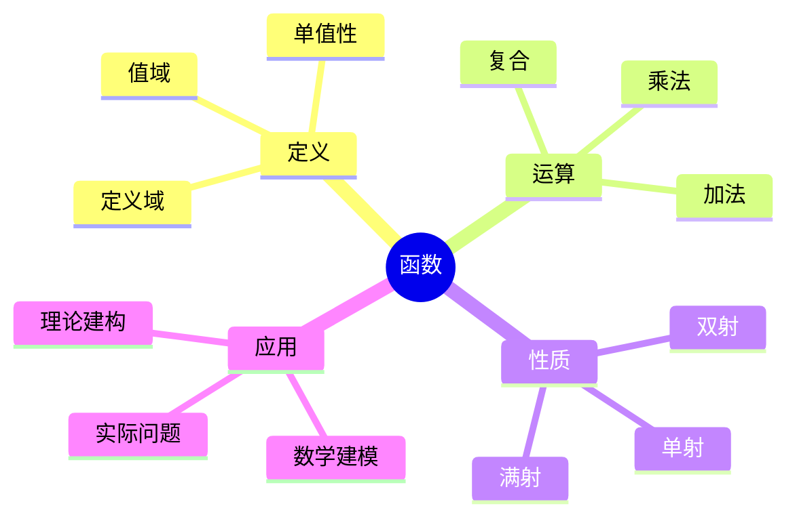
```mermaid
mindmap
  root((函数))
    定义
      单值性
      定义域
      值域
    运算
      复合
      加法
      乘法
    性质
      单射
      满射
      双射
    应用
      数学建模
      实际问题
      理论建构
```

#### 5.2 矩阵对比：不同解释方式的对比

| 解释方式 | 特点 | 方法 | 工具 | 适用阶段 | 优势 | 局限 |
|---------|------|------|------|---------|------|------|
| **直观解释** | 具体、形象、可视 | 例子、类比、直观 | 图像、关系图 | 入门阶段 | 易于理解 | 不够严格 |
| **知性解释** | 概念、分类、抽象 | 定义、分类、结构 | 概念图、知识图谱 | 中级阶段 | 系统完整 | 不够直观 |
| **理性解释** | 公理、证明、形式化 | 公理、证明、系统 | 形式化工具、证明系统 | 高级阶段 | 严格准确 | 不够具体 |
| **多视角解释** | 多角度、整合 | 多视角、整合 | 多视角工具 | 所有阶段 | 全面深入 | 可能复杂 |

#### 5.3 多视角表征：从不同角度表征函数

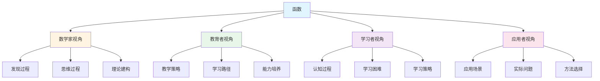
```mermaid
graph TD
    A[函数] --> B[数学家视角]
    A --> C[教育者视角]
    A --> D[学习者视角]
    A --> E[应用者视角]

    B --> B1[发现过程]
    B --> B2[思维过程]
    B --> B3[理论建构]

    C --> C1[教学策略]
    C --> C2[学习路径]
    C --> C3[能力培养]

    D --> D1[认知过程]
    D --> D2[学习困难]
    D --> D3[学习策略]

    E --> E1[应用场景]
    E --> E2[实际问题]
    E --> E3[方法选择]

    style A fill:#e1f5ff
    style B fill:#fff4e1
    style C fill:#e8f5e9
    style D fill:#f3e5f5
    style E fill:#fce4ec
```

#### 5.4 决策树：函数问题分类和策略选择

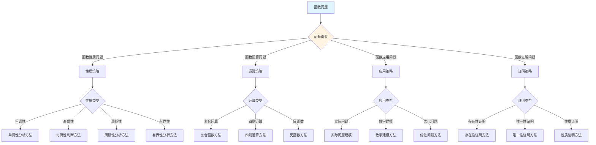
```mermaid
graph TD
    A[函数问题] --> B{问题类型}
    B -->|函数性质问题| C[性质策略]
    B -->|函数运算问题| D[运算策略]
    B -->|函数应用问题| E[应用策略]
    B -->|函数证明问题| F[证明策略]

    C --> C1{性质类型}
    C1 -->|单调性| C2[单调性分析方法]
    C1 -->|奇偶性| C3[奇偶性判断方法]
    C1 -->|周期性| C4[周期性分析方法]
    C1 -->|有界性| C5[有界性分析方法]

    D --> D1{运算类型}
    D1 -->|复合运算| D2[复合函数方法]
    D1 -->|四则运算| D3[四则运算方法]
    D1 -->|反函数| D4[反函数方法]

    E --> E1{应用类型}
    E1 -->|实际问题| E2[实际问题建模]
    E1 -->|数学建模| E3[数学建模方法]
    E1 -->|优化问题| E4[优化问题方法]

    F --> F1{证明类型}
    F1 -->|存在性证明| F2[存在性证明方法]
    F1 -->|唯一性证明| F3[唯一性证明方法]
    F1 -->|性质证明| F4[性质证明方法]

    style A fill:#e1f5ff
    style B fill:#fff4e1
```

**说明**：

- **问题分类**：根据问题类型（性质、运算、应用、证明）进行分类
- **策略选择**：根据问题类型选择相应的解决策略
- **方法应用**：根据具体问题选择合适的方法

#### 5.5 决策逻辑路径：函数问题解决过程

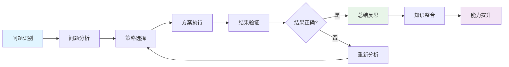
```mermaid
graph LR
    A[问题识别] --> B[问题分析]
    B --> C[策略选择]
    C --> D[方案执行]
    D --> E[结果验证]
    E --> F{结果正确?}
    F -->|是| G[总结反思]
    F -->|否| H[重新分析]
    H --> C

    G --> I[知识整合]
    I --> J[能力提升]

    style A fill:#e1f5ff
    style G fill:#e8f5e9
    style J fill:#f3e5f5
```

**说明**：

- **问题识别**：识别函数问题的类型和关键要素
- **问题分析**：分析问题的条件和目标
- **策略选择**：根据问题类型选择解决策略
- **方案执行**：执行选定的解决方案
- **结果验证**：验证结果的正确性
- **总结反思**：总结解题过程，反思解题方法
- **知识整合**：整合相关知识点
- **能力提升**：提升问题解决能力

#### 5.6 多维对比矩阵：函数概念特征对比

| 对比维度 | 函数定义 | 函数性质 | 函数运算 | 函数应用 |
|---------|---------|---------|---------|---------|
| **核心特征** | 单值性、定义域、值域 | 单调性、奇偶性、周期性、有界性 | 复合、四则运算、反函数 | 数学建模、实际问题、优化问题 |
| **理解难度** | ⭐⭐⭐ | ⭐⭐⭐⭐ | ⭐⭐⭐ | ⭐⭐⭐⭐ |
| **应用频率** | ⭐⭐⭐⭐⭐ | ⭐⭐⭐⭐ | ⭐⭐⭐⭐⭐ | ⭐⭐⭐⭐ |
| **理论基础** | 函数定义、映射理论 | 函数性质理论 | 函数运算理论 | 函数应用理论 |
| **教学重点** | 概念理解 | 性质分析 | 运算技能 | 应用能力 |
| **学习阶段** | 入门阶段 | 中级阶段 | 入门-中级 | 中级-高级 |
| **认知维度** | 直观+知性 | 知性+理性 | 知性+理性 | 理性+应用 |
| **思维表征** | 思维导图 | 决策树 | 决策逻辑路径 | 知识图谱 |

**说明**：

- **核心特征**：每个方面的核心特征
- **理解难度**：从1星到5星，表示理解难度
- **应用频率**：从1星到5星，表示应用频率
- **理论基础**：每个方面的理论基础
- **教学重点**：每个方面的教学重点
- **学习阶段**：每个方面的学习阶段
- **认知维度**：每个方面的认知维度
- **思维表征**：每个方面推荐的思维表征方法

---

## 🔍 数学论证：如何论证函数 (编号: C.CORE.002.06)

### 一、论证过程：从观察到反思

#### 1.1 观察（Observation）

**具体现象观察**：

- **现象1**：量的依赖关系
  - 例如：观察速度与时间的关系$v = at$，面积与半径的关系$A = \pi r^2$
  - **为什么重要**：这个现象揭示了函数作为依赖关系的本质
- **现象2**：函数的单值性
  - 例如：每个输入对应唯一输出，$f(x) = x^2$中每个$x$对应唯一的$x^2$
  - **为什么重要**：这个现象揭示了函数的基本特征

**模式识别**：

- **模式1**：函数的复合规律
  - 例如：$(f \circ g)(x) = f(g(x))$，复合函数满足结合律
  - **为什么重要**：这个模式可能反映了函数的代数结构
- **模式2**：函数的可逆性
  - 例如：双射函数有逆函数，$f(x) = 2x$的逆函数是$f^{-1}(x) = x/2$
  - **为什么重要**：这个模式可能反映了函数的对称性

**问题提出**：

- **问题1**：如何严格定义函数，避免歧义？
  - **为什么提出**：这个问题可能揭示函数的本质和基础
- **问题2**：如何判断函数是否可逆？
  - **为什么提出**：这个问题可能揭示函数的可逆性条件

#### 1.2 猜想（Conjecture）

**归纳猜想**：

- **猜想1**：函数的复合满足结合律
  - **依据**：观察具体函数的复合规律
  - **为什么提出**：这个猜想可能揭示函数复合的一般规律
- **猜想2**：双射函数有逆函数
  - **依据**：观察双射函数的性质
  - **为什么提出**：这个猜想可能揭示函数可逆性的一般规律

**类比猜想**：

- **猜想1**：函数类似于"机器"
  - **类比对象**：机器（输入→处理→输出）
  - **为什么提出**：这个类比可能揭示函数的本质
- **猜想2**：函数的复合类似于数的乘法
  - **类比对象**：数的乘法（结合律、单位元）
  - **为什么提出**：这个类比可能揭示函数的代数结构

**直觉猜想**：

- **猜想1**：连续函数可以"平滑"连接
  - **直觉来源**：函数的连续性直觉
  - **为什么提出**：这个直觉可能揭示函数的连续性本质
- **猜想2**：可微函数可以"局部线性化"
  - **直觉来源**：函数的可微性直觉
  - **为什么提出**：这个直觉可能揭示函数的可微性本质

#### 1.3 证明（Proof）

**直接证明**：

- **证明1**：函数复合的结合律
  - **证明思路**：使用函数的定义和复合的定义
  - **关键步骤**：$(f \circ (g \circ h))(x) = f((g \circ h)(x)) = f(g(h(x))) = (f \circ g)(h(x)) = ((f \circ g) \circ h)(x)$
  - **为什么这样证明**：这个证明方法直接、清晰
- **证明2**：双射函数有逆函数
  - **证明思路**：使用双射函数的定义构造逆函数
  - **关键步骤**：对于双射函数$f$，定义$f^{-1}(y) = x$当且仅当$f(x) = y$
  - **为什么这样证明**：这个证明方法直接、清晰

**间接证明**：

- **反证法**：证明函数不能有两个不同的逆函数
  - **假设**：假设函数$f$有两个不同的逆函数$g$和$h$
  - **矛盾**：导出$g = h$的矛盾
  - **为什么这样证明**：反证法适合证明唯一性命题

**构造法**：

- **构造法**：构造函数的分解
  - **构造方法**：将函数分解为单射和满射的复合
  - **验证**：验证分解的正确性
  - **为什么这样证明**：构造法适合证明存在性命题

#### 1.4 反思（Reflection）

**过程回顾**：

- **论证回顾**：从观察函数的依赖关系，到猜想函数的性质，再到严格证明
  - **成功之处**：成功建立了函数运算的严格理论
  - **不足之处**：函数概念需要进一步推广
  - **改进方向**：推广到多值函数、部分函数等

**方法总结**：

- **证明方法**：使用了直接证明、反证法、构造法
  - **方法特点**：直接证明清晰，反证法有效，构造法明确
  - **适用范围**：不同方法适用于不同类型的命题
- **证明技巧**：使用函数的定义、复合的定义、双射的性质
  - **技巧要点**：将函数问题转化为集合问题，使用构造法处理存在性问题
  - **应用场景**：这些技巧可以应用于其他函数论问题

**理论意义**：

- **理论贡献**：建立了函数运算的严格理论，揭示了函数的代数结构
  - **为什么重要**：这个论证揭示了函数论的基础结构
- **应用价值**：函数论为整个数学提供了基础工具
  - **为什么重要**：这个论证可以应用于所有数学分支

### 二、论证类型：多种推理方式

#### 2.1 归纳论证（Inductive Reasoning）

**不完全归纳**：

- **例子1**：从具体函数的复合规律归纳一般规律
  - **观察**：观察$f(x) = x^2$，$g(x) = x+1$的复合
  - **结论**：函数复合满足结合律
  - **局限性**：不完全归纳的结论需要严格证明
- **例子2**：从双射函数的性质归纳一般规律
  - **观察**：观察双射函数都有逆函数
  - **结论**：所有双射函数都有逆函数
  - **局限性**：不完全归纳的结论需要严格证明

#### 2.2 演绎论证（Deductive Reasoning）

**三段论**：

- **例子1**：证明函数的单值性
  - **大前提**：函数是单值的
  - **小前提**：$f(x) = x^2$是函数
  - **结论**：$f(x) = x^2$是单值的
  - **为什么有效**：三段论是严格的演绎推理
- **例子2**：证明函数的复合
  - **大前提**：函数的复合是函数
  - **小前提**：$f$和$g$是函数
  - **结论**：$f \circ g$是函数
  - **为什么有效**：三段论是严格的演绎推理

#### 2.3 类比论证（Analogical Reasoning）

**结构类比**：

- **例子1**：函数与机器的类比
  - **类比对象**：机器（输入→处理→输出）
  - **相似性**：函数$f: A \to B$对应机器（输入$A$→处理$f$→输出$B$）
  - **结论**：函数可以理解为"数学机器"
  - **局限性**：类比不能替代严格证明
- **例子2**：函数的复合与数的乘法的类比
  - **类比对象**：数的乘法
  - **相似性**：函数复合满足结合律，类似于数的乘法
  - **结论**：函数复合与数的乘法有相似的代数结构
  - **局限性**：类比不能替代严格证明

#### 2.4 反证论证（Proof by Contradiction）

**反证法**：

- **例子1**：证明函数不能有两个不同的逆函数
  - **假设**：假设函数$f$有两个不同的逆函数$g$和$h$
  - **矛盾**：导出$g = h$的矛盾
  - **结论**：函数最多有一个逆函数
  - **为什么有效**：反证法是严格的间接证明

#### 2.5 构造论证（Constructive Reasoning）

**构造法**：

- **例子1**：构造函数的分解
  - **构造方法**：将函数$f: A \to B$分解为$f = i \circ s$，其中$s$是满射，$i$是单射
  - **验证**：验证分解的正确性
  - **为什么有效**：构造法是严格的直接证明

### 三、论证可视化：用图形表示论证过程

#### 3.1 论证流程图

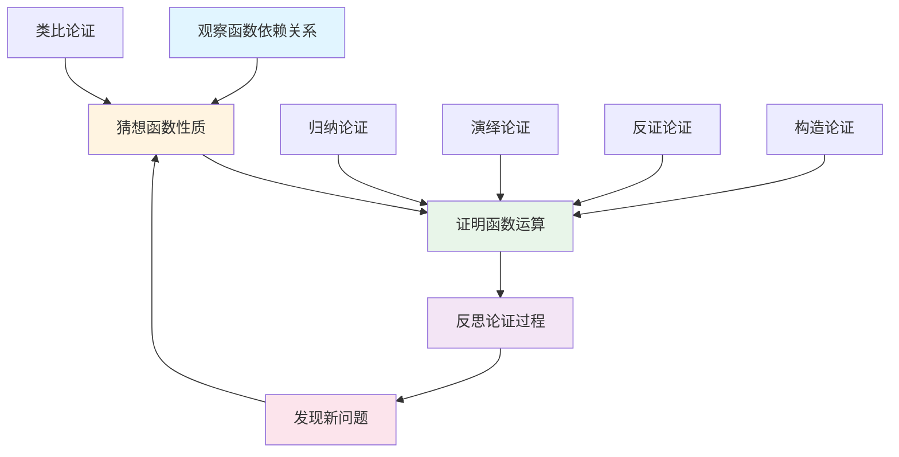
```mermaid
graph TD
    A[观察函数依赖关系] --> B[猜想函数性质]
    B --> C[证明函数运算]
    C --> D[反思论证过程]
    D --> E[发现新问题]
    E --> B

    F[归纳论证] --> C
    G[演绎论证] --> C
    H[类比论证] --> B
    I[反证论证] --> C
    J[构造论证] --> C

    style A fill:#e1f5ff
    style B fill:#fff4e1
    style C fill:#e8f5e9
    style D fill:#f3e5f5
    style E fill:#fce4ec
```

#### 3.2 论证类型对比

| 论证类型 | 特点 | 适用场景 | 优势 | 局限 |
|---------|------|---------|------|------|
| **归纳论证** | 从特殊到一般 | 发现规律、提出猜想 | 启发性强 | 结论或然 |
| **演绎论证** | 从一般到特殊 | 严格证明、逻辑推理 | 结论必然 | 需要前提 |
| **类比论证** | 基于相似性 | 启发思路、发现联系 | 创造性高 | 结论或然 |
| **反证论证** | 假设否定 | 证明否定性命题 | 间接有效 | 需要矛盾 |
| **构造论证** | 直接构造 | 证明存在性命题 | 直接明确 | 需要构造 |

#### 3.3 论证思维导图

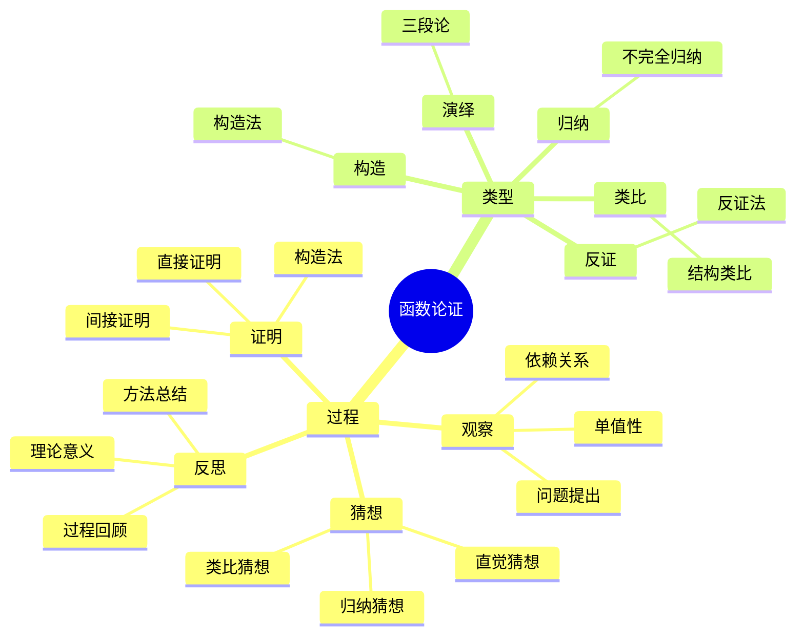
```mermaid
mindmap
  root((函数论证))
    过程
      观察
        依赖关系
        单值性
        问题提出
      猜想
        归纳猜想
        类比猜想
        直觉猜想
      证明
        直接证明
        间接证明
        构造法
      反思
        过程回顾
        方法总结
        理论意义
    类型
      归纳
        不完全归纳
      演绎
        三段论
      类比
        结构类比
      反证
        反证法
      构造
        构造法
```

---

## 🔗 三视角整合 (编号: C.CORE.002.07)

### 三个视角的关联

**认知学视角 ↔ 教育学视角**:

- 认知学视角揭示的理解机制，指导教育学视角的教学设计
- 教育学视角的教学实践，验证认知学视角的理论

**认知学视角 ↔ 数学家视角**:

- 数学家视角的思维过程，启发认知学视角的认知路径
- 认知学视角的认知障碍，解释数学家视角的历史困难

**教育学视角 ↔ 数学家视角**:

- 数学家视角的历史发展，为教育学视角提供教学素材
- 教育学视角的教学策略，帮助学习者理解数学家视角的思维过程

### 如何综合运用三个视角

**学习建议**:

1. **从认知学视角开始**: 先建立直观理解
2. **用教育学视角深化**: 通过教学路径系统学习
3. **用数学家视角升华**: 理解概念的深层意义和历史背景

**教学建议**:

1. **引入阶段**: 用数学家视角的问题起源激发兴趣
2. **探索阶段**: 用认知学视角的认知过程引导发现
3. **形式化阶段**: 用教育学视角的教学策略系统教学
4. **巩固阶段**: 综合三个视角深化理解

---

## 📚 参考文献 (编号: C.CORE.002.08)

### 权威资源

- Wikipedia: [Function (Mathematics)](https://en.wikipedia.org/wiki/Function_(mathematics))
- Wikipedia: [Bijection](https://en.wikipedia.org/wiki/Bijection)
- Metamath: [Function Definition](http://us.metamath.org/mpeuni/df-fun.html)[需更新][需更新]

### 经典教材

- Bourbaki, N. (1968). *Theory of Sets*. Springer.
- Enderton, H. B. (1977). *Elements of Set Theory*. Academic Press.
- Rudin, W. (1976). *Principles of Mathematical Analysis*. McGraw-Hill.

### 历史文献

- Leibniz, G. W. (1694). "Nova methodus pro maximis et minimis". *Acta Eruditorum*.
- Euler, L. (1748). *Introductio in analysin infinitorum*. Lausanne.
- Dirichlet, P. G. L. (1837). "Über die Darstellung ganz willkürlicher Functionen durch Sinus- und Cosinusreihen". *Repertorium der Physik*.

---

**创建日期**: 2025年1月
**最后更新**: 2026-04-05
**维护状态**: 持续更新中

---

## 📚 附录: 扩展分析


### 1. 多理论分析

---
msc_primary: "00A99"
---

# 函数概念的多理论分析示例 / Multi-Theory Analysis Example: Function Concept


---


## 🎯 一、Tall三个世界理论分析 / Tall's Three Worlds Theory Analysis (编号: C.CORE.002.MULTI.01)

### 1.1 感知-操作世界（Embodied World）

**函数在感知-操作世界中的理解 / Understanding Functions in the Embodied World**：

- **具体经验 / Concrete Experience**：
  - 通过输入输出关系理解函数 / Understanding functions through input-output relationships
  - 例如：温度转换（摄氏度→华氏度）、货币兑换（美元→人民币） / Examples: temperature conversion (Celsius→Fahrenheit), currency exchange (USD→CNY)
  - 通过机器、自动售货机等具体对象理解函数 / Understanding functions through concrete objects such as machines and vending machines

- **身体动作 / Bodily Actions**：
  - 通过"输入→处理→输出"的操作理解函数 / Understanding functions through "input→process→output" operations
  - 通过函数机器游戏理解函数概念 / Understanding function concepts through function machine games
  - 通过函数表（输入输出表）理解函数 / Understanding functions through function tables (input-output tables)

- **直观理解 / Intuitive Understanding**：
  - 函数是"一个输入对应一个输出" / A function is "one input corresponds to one output"
  - 函数是"规则"或"机器" / A function is a "rule" or "machine"
  - 函数有定义域和值域 / Functions have domain and range

**教学建议 / Teaching Suggestions**：

- 使用函数机器模型 / Use function machine models
- 通过输入输出表理解函数 / Understand functions through input-output tables
- 使用具体例子（温度转换、货币兑换等） / Use concrete examples (temperature conversion, currency exchange, etc.)

### 1.2 概念-符号世界（Symbolic World）

**函数在概念-符号世界的理解**：

- **符号表示**：
  - 使用函数符号：$f(x)$、$y = f(x)$、$f: A \to B$
  - 使用函数表达式：$f(x) = x^2$、$f(x) = \sin x$
  - 使用函数图像：坐标系中的曲线

- **概念理解**：
  - 函数是定义域到值域的映射
  - 函数满足单值性（一个输入对应一个输出）
  - 函数有各种性质（单调性、奇偶性、周期性等）

- **抽象操作**：
  - 通过符号操作进行函数运算（复合、反函数）
  - 通过函数图像分析函数性质
  - 通过函数方程研究函数

**教学建议**：

- 逐步引入函数符号
- 通过符号操作练习函数运算
- 使用函数图像理解函数性质

### 1.3 形式-公理世界（Formal World）

**函数在形式-公理世界的理解**：

- **公理系统**：
  - 函数的形式化定义：$f \subseteq A \times B$，满足单值性
  - 通过集合论定义函数
  - 通过范畴论理解函数（态射）

- **形式化定义**：
  - 函数的形式化定义：$\forall x \in A, \exists! y \in B, (x,y) \in f$
  - 函数运算的形式化定义
  - 函数性质的形式化证明

- **逻辑推理**：
  - 通过逻辑推理证明函数性质
  - 通过形式化方法研究函数理论
  - 通过范畴论研究函数的一般性质

**教学建议**：

- 介绍函数的形式化定义
- 通过形式化证明理解函数性质
- 研究函数在数学中的基础地位

### 1.4 三个世界的转换 / Transitions Between Worlds

**转换路径 / Transition Paths**：

1. **从感知-操作到概念-符号 / From Embodied to Symbolic**：
   - 将输入输出关系抽象为函数符号 / Abstracting input-output relationships into function notation
   - 从操作中提取函数概念 / Extracting function concepts from operations
   - 例如：从"温度转换"到"函数$f(x) = \frac{9}{5}x + 32$" / Example: from "temperature conversion" to "function $f(x) = \frac{9}{5}x + 32$"

2. **从概念-符号到形式-公理 / From Symbolic to Formal**：
   - 将函数概念形式化为定义 / Formalizing function concepts into definitions
   - 从符号操作到逻辑推理 / From symbolic operations to logical reasoning
   - 例如：从"$f(x) = x^2$"到"$f: A \to B$" / Example: from "$f(x) = x^2$" to "$f: A \to B$"

**转换支持 / Transition Support**：

- **识别转换困难 / Identifying Transition Difficulties**：
  - 识别从具体到抽象的困难 / Identifying difficulties in transitioning from concrete to abstract
  - 识别从符号到形式的困难 / Identifying difficulties in transitioning from symbolic to formal

- **设计转换活动 / Designing Transition Activities**：
  - 设计过渡活动支持转换 / Designing transition activities to support transitions
  - 提供渐进式支持 / Providing progressive support

- **评估转换效果 / Assessing Transition Effectiveness**：
  - 评估转换成功 / Assessing transition success
  - 提供反馈支持 / Providing feedback support

---

## 🔬 二、Dubinsky APOS理论分析 (编号: C.CORE.002.MULTI.02)

### 2.1 Action（动作）

**函数的Action阶段**：

- **具体操作**：
  - 计算函数值：$f(2) = ?$（当$f(x) = x^2$时）
  - 绘制函数图像：给定函数表达式，绘制图像
  - 查找函数值：在函数表中查找对应值

- **操作特点**：
  - 需要外部指导（教师、教材）
  - 操作是具体的、机械的
  - 需要逐步执行

- **学习活动**：
  - 练习计算函数值
  - 练习绘制函数图像
  - 练习查找函数值

**教学建议**：

- 提供大量练习机会
- 给予及时反馈
- 逐步增加操作复杂度

### 2.2 Process（过程）

**函数的Process阶段**：

- **内化过程**：
  - 将函数操作内化为心理过程
  - 理解函数运算的内在逻辑
  - 能够独立完成函数运算

- **过程理解**：
  - 理解"函数"是"输入到输出的过程"
  - 理解"复合函数"是"先应用一个函数，再应用另一个函数"
  - 理解"反函数"是"反向的过程"

- **灵活应用**：
  - 能够灵活应用函数概念
  - 能够处理复杂的函数问题
  - 能够理解函数的各种性质

**教学建议**：

- 引导学生内化操作过程
- 通过变式练习加深理解
- 鼓励学生独立思考和解决问题

### 2.3 Object（对象）

**函数的Object阶段**：

- **对象化理解**：
  - 将函数视为独立的对象
  - 可以对函数进行操作
  - 可以将函数作为其他概念的基础

- **对象操作**：
  - 函数的函数（函数空间）
  - 函数的运算结果仍是函数
  - 函数可以作为其他函数的输入

- **抽象理解**：
  - 理解函数的抽象性质
  - 理解函数在数学中的基础地位
  - 理解函数论作为数学分支的作用

**教学建议**：

- 引导学生将函数视为对象
- 研究函数的函数（函数空间）
- 探索函数在数学中的广泛应用

### 2.4 Schema（图式）

**函数的Schema阶段**：

- **完整图式**：
  - 整合函数的定义、运算、性质
  - 形成完整的函数概念图式
  - 理解函数与其他数学概念的关系

- **图式应用**：
  - 能够灵活应用函数概念
  - 能够解决复杂的函数问题
  - 能够理解函数在数学中的作用

- **图式扩展**：
  - 理解函数的推广（映射、态射）
  - 理解函数在数学基础中的作用
  - 理解函数与其他数学分支的关系

**教学建议**：

- 帮助学生建立完整的函数概念图式
- 探索函数与其他数学分支的关系
- 研究函数在数学基础中的作用

### 2.5 APOS发展路径 / APOS Development Path

**发展过程 / Development Process**：

1. **Action → Process / 动作到过程**：
   - 将外部函数计算内化为心理过程 / Internalizing external function computations as mental processes
   - 从需要指导到独立完成 / From needing guidance to independent completion
   - 例如：从"计算$f(2)$"到"理解函数映射过程" / Example: from "computing $f(2)$" to "understanding the function mapping process"

2. **Process → Object / 过程到对象**：
   - 将函数映射过程对象化 / Objectifying function mapping processes
   - 从过程理解到对象理解 / From process understanding to object understanding
   - 例如：从"理解映射过程"到"将函数视为对象" / Example: from "understanding the mapping process" to "treating functions as objects"

3. **Object → Schema / 对象到图式**：
   - 整合多个函数对象和过程 / Integrating multiple function objects and processes
   - 形成完整的函数概念图式 / Forming a complete function concept schema
   - 例如：整合函数的各种理解和应用 / Example: integrating various understandings and applications of functions

**发展支持 / Development Support**：

- **识别发展困难 / Identifying Development Difficulties**：
  - 识别Action到Process的困难 / Identifying difficulties from Action to Process
  - 识别Process到Object的困难 / Identifying difficulties from Process to Object
  - 识别Object到Schema的困难 / Identifying difficulties from Object to Schema

- **设计发展活动 / Designing Development Activities**：
  - 设计过渡活动支持发展 / Designing transition activities to support development
  - 提供渐进式支持 / Providing progressive support

- **评估发展效果 / Assessing Development Effectiveness**：
  - 评估发展成功 / Assessing development success
  - 提供反馈支持 / Providing feedback support

---

## 💬 三、Sfard交流理论分析 / Sfard's Commognitive Theory Analysis (编号: C.CORE.002.MULTI.03)

### 3.1 函数作为交流工具 / Function as a Communication Tool

**函数的交流功能 / Communicative Function of Functions**：

- **数学交流 / Mathematical Communication**：
  - 函数用于表达数学关系：$y = f(x)$表示$y$与$x$的关系 / Functions are used to express mathematical relationships: $y = f(x)$ represents the relationship between $y$ and $x$
  - 函数用于描述数学变化：导数描述函数的变化率 / Functions are used to describe mathematical changes: derivatives describe the rate of change of functions
  - 函数用于表达数学结构：群同态、环同态都是函数 / Functions are used to express mathematical structures: group homomorphisms and ring homomorphisms are all functions

- **概念表达 / Conceptual Expression**：
  - 通过函数表达"依赖关系" / Expressing "dependency relationships" through functions
  - 通过函数运算表达"复合"、"逆"等概念 / Expressing concepts such as "composition" and "inverse" through function operations
  - 通过函数性质表达"单调"、"连续"等概念 / Expressing concepts such as "monotonicity" and "continuity" through function properties

- **问题解决 / Problem Solving**：
  - 使用函数语言表达问题 / Using function language to express problems
  - 使用函数方法解决问题 / Using function methods to solve problems
  - 使用函数论方法证明定理 / Using function theory methods to prove theorems

### 3.2 函数学习的实践参与 / Practice Participation in Function Learning

**通过参与数学实践学习函数 / Learning Functions through Participation in Mathematical Practice**：

- **实践场景 / Practice Scenarios**：
  - 通过实际问题学习函数（温度转换、距离时间关系等） / Learning functions through real-world problems (temperature conversion, distance-time relationships, etc.)
  - 通过数据分析学习函数（数据拟合、函数建模） / Learning functions through data analysis (data fitting, function modeling)
  - 通过函数图像学习函数性质 / Learning function properties through function graphs
  - 通过函数应用学习函数理论 / Learning function theory through function applications

- **实践方式 / Practice Methods**：
  - 参与数学讨论，使用函数语言 / Participating in mathematical discussions, using function language
  - 解决数学问题，应用函数方法 / Solving mathematical problems, applying function methods
  - 研究数学理论，理解函数作用 / Studying mathematical theory, understanding the role of functions

- **学习效果 / Learning Outcomes**：
  - 通过实践理解函数概念 / Understanding function concepts through practice
  - 通过应用掌握函数方法 / Mastering function methods through application
  - 通过参与形成数学思维 / Forming mathematical thinking through participation

**教学建议 / Teaching Suggestions**：

- 设计数学实践活动 / Design mathematical practice activities
- 鼓励学生参与数学讨论 / Encourage students to participate in mathematical discussions
- 提供实际问题解决机会 / Provide opportunities for solving real-world problems

---

## 🧠 四、Piaget认知发展理论分析 / Piaget's Cognitive Development Theory Analysis (编号: C.CORE.002.MULTI.04)

### 4.1 具体运算阶段（7-12岁）/ Concrete Operational Stage (7-12 years)

**函数在具体运算阶段的理解 / Understanding Functions in the Concrete Operational Stage**：

- **具体对象 / Concrete Objects**：
  - 通过具体例子理解函数 / Understanding functions through concrete examples
  - 例如：温度转换、货币兑换 / Examples: temperature conversion, currency exchange
  - 需要具体对象支持理解 / Requires concrete object support for understanding

- **逻辑思维 / Logical Thinking**：
  - 能够理解函数的输入输出关系 / Being able to understand input-output relationships of functions
  - 能够进行简单的函数运算 / Being able to perform simple function operations
  - 但需要具体对象支持 / But requires concrete object support

- **教学建议 / Teaching Suggestions**：
  - 使用具体例子和函数机器 / Use concrete examples and function machines
  - 通过游戏和活动学习 / Learn through games and activities
  - 逐步引入抽象概念 / Gradually introduce abstract concepts

### 4.2 形式运算阶段（12+岁）/ Formal Operational Stage (12+ years)

**函数在形式运算阶段的理解 / Understanding Functions in the Formal Operational Stage**：

- **抽象思维 / Abstract Thinking**：
  - 能够理解抽象的函数概念 / Being able to understand abstract function concepts
  - 能够进行符号操作 / Being able to perform symbolic operations
  - 能够进行逻辑推理 / Being able to perform logical reasoning

- **形式推理 / Formal Reasoning**：
  - 能够证明函数性质 / Being able to prove function properties
  - 能够理解函数的形式化定义 / Being able to understand formal definitions of functions
  - 能够研究函数理论 / Being able to study function theory

- **教学建议 / Teaching Suggestions**：
  - 引入抽象概念和符号 / Introduce abstract concepts and symbols
  - 进行逻辑推理训练 / Conduct logical reasoning training
  - 研究函数理论 / Study function theory

---

## 🌍 五、Vygotsky社会文化理论分析 / Vygotsky's Sociocultural Theory Analysis (编号: C.CORE.002.MULTI.05)

### 5.1 最近发展区（ZPD）/ Zone of Proximal Development (ZPD)

**函数学习的最近发展区 / Zone of Proximal Development in Function Learning**：

- **独立水平 / Independent Level**：
  - 学生可以独立理解函数的基本概念 / Students can independently understand basic function concepts
  - 学生可以独立进行基本函数运算 / Students can independently perform basic function operations
  - 学生可以独立解决简单函数问题 / Students can independently solve simple function problems

- **最近发展区 / Zone of Proximal Development**：
  - 需要指导才能理解函数的抽象性质 / Requires guidance to understand abstract properties of functions
  - 需要指导才能掌握复杂函数运算 / Requires guidance to master complex function operations
  - 需要指导才能解决复杂函数问题 / Requires guidance to solve complex function problems

- **潜在水平 / Potential Level**：
  - 未来可能理解函数的形式化定义 / May understand formal definitions of functions in the future
  - 未来可能掌握函数论方法 / May master function theory methods in the future
  - 未来可能研究函数理论 / May study function theory in the future

### 5.2 社会文化工具 / Sociocultural Tools

**函数作为社会文化工具 / Functions as Sociocultural Tools**：

- **数学符号 / Mathematical Symbols**：
  - 函数符号是数学交流的工具 / Function symbols are tools for mathematical communication
  - 通过社会文化实践学习函数符号 / Learning function symbols through sociocultural practice
  - 通过数学实践掌握函数方法 / Mastering function methods through mathematical practice

- **数学语言 / Mathematical Language**：
  - 函数语言是数学表达的工具 / Function language is a tool for mathematical expression
  - 通过参与数学实践学习函数语言 / Learning function language through participation in mathematical practice
  - 通过数学交流掌握函数表达 / Mastering function expression through mathematical communication

**教学建议 / Teaching Suggestions**：

- 提供适当的学习支持 / Provide appropriate learning support
- 设计最近发展区的学习活动 / Design learning activities in the zone of proximal development
- 鼓励学生参与数学实践和交流 / Encourage students to participate in mathematical practice and communication

---

## 🔄 六、多理论整合分析 / Multi-Theory Integration Analysis (编号: C.CORE.002.MULTI.06)

### 6.1 理论共同点 / Theoretical Commonalities

**各理论在函数概念分析中的共同点 / Commonalities of Theories in Function Concept Analysis**：

1. **多层次理解 / Multi-Level Understanding**：
   - 都强调从具体到抽象的发展 / All emphasize development from concrete to abstract
   - Tall的三个世界、APOS的四个阶段、Piaget的发展阶段都体现这一点 / Tall's three worlds, APOS's four stages, and Piaget's developmental stages all reflect this

2. **实践重要性 / Importance of Practice**：
   - 都强调实践在学习中的作用 / All emphasize the role of practice in learning
   - Sfard的交流理论、Vygotsky的社会文化理论都强调这一点 / Sfard's communication theory and Vygotsky's sociocultural theory both emphasize this

3. **认知发展 / Cognitive Development**：
   - 都关注认知发展的过程 / All focus on the process of cognitive development
   - 各理论都描述了从简单到复杂的发展 / Each theory describes development from simple to complex

### 6.2 理论互补性 / Theoretical Complementarity

**各理论在函数概念分析中的互补性 / Complementarity of Theories in Function Concept Analysis**：

1. **Tall三个世界 / Tall's Three Worlds**：
   - 适用于理解函数概念的不同层次 / Applicable to understanding different levels of function concepts
   - 从感知操作到形式公理的发展 / Development from embodied operations to formal axioms

2. **APOS理论 / APOS Theory**：
   - 适用于分析函数概念的学习过程 / Applicable to analyzing the learning process of function concepts
   - 从动作到图式的发展 / Development from action to schema

3. **Sfard交流理论 / Sfard's Communication Theory**：
   - 适用于设计函数概念的实践活动 / Applicable to designing practice activities for function concepts
   - 通过数学实践学习函数 / Learning functions through mathematical practice

4. **Piaget理论 / Piaget's Theory**：
   - 适用于理解函数概念的认知发展阶段 / Applicable to understanding cognitive development stages of function concepts
   - 从具体运算到形式运算的发展 / Development from concrete operations to formal operations

5. **Vygotsky理论 / Vygotsky's Theory**：
   - 适用于设计函数概念的学习支持 / Applicable to designing learning support for function concepts
   - 通过最近发展区促进学习 / Promoting learning through the zone of proximal development

### 6.3 整合应用框架

**多理论整合应用**：

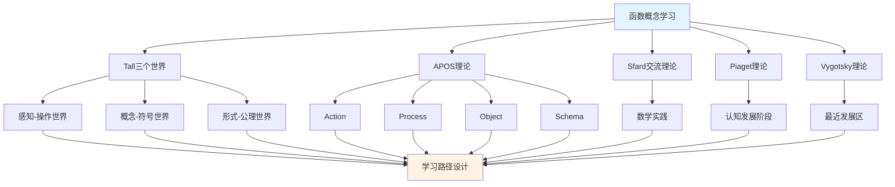
```mermaid
graph TB
    A[函数概念学习] --> B[Tall三个世界]
    A --> C[APOS理论]
    A --> D[Sfard交流理论]
    A --> E[Piaget理论]
    A --> F[Vygotsky理论]

    B --> G[感知-操作世界]
    B --> H[概念-符号世界]
    B --> I[形式-公理世界]

    C --> J[Action]
    C --> K[Process]
    C --> L[Object]
    C --> M[Schema]

    D --> N[数学实践]
    E --> O[认知发展阶段]
    F --> P[最近发展区]

    G --> Q[学习路径设计]
    H --> Q
    I --> Q
    J --> Q
    K --> Q
    L --> Q
    M --> Q
    N --> Q
    O --> Q
    P --> Q

    style A fill:#e1f5ff
    style Q fill:#fff4e1
```

---

## 📊 七、函数概念的多理论学习路径 / Multi-Theory Learning Path for Function Concept (编号: C.CORE.002.MULTI.07)

### 7.1 入门阶段（Tall感知-操作世界 + APOS Action）/ Entry Stage (Tall Embodied World + APOS Action)

**学习目标 / Learning Objectives**：

- 通过具体例子理解函数概念 / Understanding function concepts through concrete examples
- 掌握基本函数操作 / Mastering basic function operations

**学习活动 / Learning Activities**：

- 使用函数机器模型 / Using function machine models
- 通过输入输出表理解函数 / Understanding functions through input-output tables
- 练习计算函数值 / Practicing calculating function values
- 练习绘制简单函数图像 / Practicing drawing simple function graphs

**评估标准 / Assessment Criteria**：

- 能够独立完成基本函数操作 / Being able to independently complete basic function operations
- 能够理解函数的基本概念 / Being able to understand basic function concepts

### 7.2 中级阶段（Tall概念-符号世界 + APOS Process/Object）/ Intermediate Stage (Tall Symbolic World + APOS Process/Object)

**学习目标 / Learning Objectives**：

- 理解函数的符号表示 / Understanding symbolic representation of functions
- 掌握函数运算的内在逻辑 / Mastering the internal logic of function operations
- 将函数视为对象 / Viewing functions as objects

**学习活动 / Learning Activities**：

- 学习函数符号和表达式 / Learning function notation and expressions
- 通过符号操作进行函数运算 / Performing function operations through symbolic operations
- 理解函数的各种性质 / Understanding various properties of functions
- 研究函数的函数（函数空间） / Studying functions of functions (function spaces)

**评估标准 / Assessment Criteria**：

- 能够灵活应用函数符号 / Being able to flexibly apply function notation
- 能够理解函数运算的内在逻辑 / Being able to understand the internal logic of function operations
- 能够将函数视为对象进行操作 / Being able to operate on functions as objects

### 7.3 高级阶段（Tall形式-公理世界 + APOS Schema + Sfard实践）/ Advanced Stage (Tall Formal World + APOS Schema + Sfard Practice)

**学习目标 / Learning Objectives**：

- 理解函数的形式化定义 / Understanding formal definition of functions
- 形成完整的函数概念图式 / Forming a complete function concept schema
- 通过数学实践应用函数理论 / Applying function theory through mathematical practice

**学习活动 / Learning Activities**：

- 学习函数的形式化定义 / Learning formal definition of functions
- 通过形式化证明理解函数性质 / Understanding function properties through formal proofs
- 研究函数在数学基础中的作用 / Studying the role of functions in mathematical foundations
- 参与数学实践，应用函数方法 / Participating in mathematical practice, applying function methods

**评估标准 / Assessment Criteria**：

- 能够理解函数的形式化定义 / Being able to understand formal definition of functions
- 能够形成完整的函数概念图式 / Being able to form a complete function concept schema
- 能够通过数学实践应用函数理论 / Being able to apply function theory through mathematical practice

---

## 🧠 七、元认知理论分析 / Metacognitive Theory Analysis (编号: C.CORE.002.MULTI.07.5)

### 7.1 元认知知识（Metacognitive Knowledge）

**关于函数概念的知识 / Knowledge About the Function Concept**：

- **概念知识 / Conceptual Knowledge**：
  - 函数的定义：对于集合$A$中的每个元素，集合$B$中都有唯一确定的元素与之对应 / A function is a relation where each element in set $A$ corresponds to exactly one element in set $B$
  - 函数的性质：单值性、定义域、值域 / Properties: single-valuedness, domain, range
  - 函数的表示方法：解析式、图像、表格 / Representation methods: analytical expression, graph, table
  - 函数与其他概念的关系：函数是映射的特殊情况，是分析学的基础 / Relationship: functions are special cases of mappings and foundations of analysis

- **策略知识 / Strategy Knowledge**：
  - 学习策略：通过具体例子理解函数，通过图像掌握函数性质 / Learning strategies: understand functions through concrete examples, master function properties through graphs
  - 理解策略：从对应关系到函数概念，从具体函数到抽象函数 / Understanding strategies: from correspondence to function concept, from concrete functions to abstract functions
  - 应用策略：将函数方法应用到实际问题中 / Application strategies: apply function methods to real-world problems

- **任务知识 / Task Knowledge**：
  - 典型任务：函数求值、函数性质分析、函数应用 / Typical tasks: function evaluation, function property analysis, function applications
  - 任务难度：基础任务（函数求值）→ 中级任务（函数性质）→ 高级任务（函数应用） / Task difficulty: basic (function evaluation) → intermediate (function properties) → advanced (function applications)
  - 任务要求：理解函数概念，掌握函数性质，能够进行函数推理 / Task requirements: understand function concepts, master function properties, be able to reason about functions

### 7.2 元认知监控（Metacognitive Monitoring）

**理解监控 / Comprehension Monitoring**：

- **自我提问 / Self-Questioning**：
  - "我理解函数的基本概念了吗？" / "Do I understand the basic concept of functions?"
  - "我能区分函数和关系吗？" / "Can I distinguish between functions and relations?"
  - "我理解函数的对应关系吗？" / "Do I understand the correspondence of functions?"

- **理解检查 / Comprehension Checking**：
  - 能否用自己的话解释函数概念？ / Can I explain the concept of functions in my own words?
  - 能否识别函数定义的错误？ / Can I identify errors in function definitions?
  - 能否判断函数关系的正确性？ / Can I judge the correctness of function relationships?

- **困难识别 / Difficulty Identification**：
  - 识别理解困难：复合函数、反函数、函数性质 / Identify comprehension difficulties: composite functions, inverse functions, function properties
  - 识别运算困难：函数求值、函数变换、函数应用 / Identify operation difficulties: function evaluation, function transformations, function applications

**过程监控 / Process Monitoring**：

- **学习过程监控 / Learning Process Monitoring**：
  - 监控学习进度：是否按计划学习？ / Monitor learning progress: Am I learning according to plan?
  - 监控学习效果：是否掌握了函数概念？ / Monitor learning effectiveness: Have I mastered the concept of functions?
  - 监控学习困难：遇到了哪些困难？ / Monitor learning difficulties: What difficulties have I encountered?

- **策略使用监控 / Strategy Use Monitoring**：
  - 使用的策略是否有效？ / Is the strategy I'm using effective?
  - 是否需要调整策略？ / Do I need to adjust my strategy?
  - 策略使用是否正确？ / Am I using the strategy correctly?

### 7.3 元认知调节（Metacognitive Regulation）

**计划调节 / Planning Regulation**：

- **学习计划制定 / Learning Plan Development**：
  - 制定学习计划：先学函数基本概念，再学函数性质，最后学函数应用 / Develop learning plan: first learn basic function concepts, then learn function properties, finally learn function applications
  - 调整学习计划：根据学习情况调整计划 / Adjust learning plan: adjust plan based on learning situation
  - 优化学习路径：选择最适合自己的学习路径 / Optimize learning path: choose the learning path that best suits oneself

**策略调节 / Strategy Regulation**：

- **策略选择 / Strategy Selection**：
  - 根据任务类型选择策略：简单任务用直接方法，复杂任务用分步方法 / Select strategies based on task type: use direct methods for simple tasks, step-by-step methods for complex tasks
  - 根据学习阶段选择策略：入门阶段用具体例子，高级阶段用抽象方法 / Select strategies based on learning stage: use concrete examples in entry stage, abstract methods in advanced stage

- **策略调整 / Strategy Adjustment**：
  - 如果遇到困难，尝试不同的策略 / If encountering difficulties, try different strategies
  - 如果策略无效，调整策略 / If strategy is ineffective, adjust strategy
  - 如果策略有效，继续使用并优化 / If strategy is effective, continue using and optimize

**反思调节 / Reflection Regulation**：

- **学习反思 / Learning Reflection**：
  - 反思学习过程：从函数学习中获得了什么？ / Reflect on learning process: What have I gained from learning functions?
  - 反思学习困难：遇到了哪些困难？如何克服？ / Reflect on learning difficulties: What difficulties did I encounter? How did I overcome them?
  - 反思学习策略：使用的策略是否有效？如何改进？ / Reflect on learning strategies: Were the strategies I used effective? How can I improve?

- **错误反思 / Error Reflection**：
  - 从错误中学习：分析错误原因，避免类似错误 / Learn from errors: analyze error causes, avoid similar errors
  - 改进学习方法：根据错误调整学习方法 / Improve learning methods: adjust learning methods based on errors

**教学建议 / Teaching Suggestions**：

- 教授元认知知识：帮助学生建立关于函数的元认知知识 / Teach metacognitive knowledge: help students build metacognitive knowledge about functions
- 培养监控能力：引导学生自我监控理解过程 / Develop monitoring ability: guide students to self-monitor their comprehension process
- 训练调节能力：教授学生如何调节学习策略 / Train regulation ability: teach students how to regulate learning strategies
- 使用元认知提示语：在学习过程中使用提示语引导学生 / Use metacognitive prompts: use prompts to guide students during learning

---

## 🎓 八、教学建议 / Teaching Suggestions (编号: C.CORE.002.MULTI.08)

### 8.1 基于多理论的教学设计 / Multi-Theory Based Teaching Design

**教学设计原则 / Teaching Design Principles**：

1. **多层次设计**：
   - 从感知操作到形式公理
   - 从动作到图式
   - 从具体运算到形式运算

2. **实践导向**：
   - 设计数学实践活动
   - 鼓励学生参与数学交流
   - 提供实际问题解决机会

3. **学习支持**：
   - 提供适当的学习支持
   - 设计最近发展区的学习活动
   - 给予及时反馈

4. **情感因素考虑 / Affective Considerations**：
   - **减少数学焦虑 / Reducing Math Anxiety**：
     - 从具体例子开始，降低抽象难度 / Start with concrete examples to reduce abstract difficulty
     - 使用函数机器模型，使抽象概念具体化 / Use function machine models to make abstract concepts concrete
     - 允许学生犯错，营造安全的学习环境 / Allow students to make mistakes and create a safe learning environment
     - 提供逐步支持，帮助学生建立信心 / Provide progressive support to help students build confidence

   - **激发学习动机 / Motivating Learning**：
     - 展示函数在现实中的应用 / Show applications of functions in real life
     - 设计有趣的函数问题 / Design interesting function problems
     - 介绍函数的历史和数学家故事 / Introduce the history of functions and mathematician stories
     - 展示函数的图像美感 / Show the beauty of function graphs

   - **培养数学兴趣 / Cultivating Math Interest**：
     - 展示函数的美感 / Show the beauty of functions
     - 介绍Euler、Dirichlet等数学家的故事 / Introduce stories of mathematicians like Euler and Dirichlet
     - 探索函数在数学中的核心地位 / Explore the central role of functions in mathematics

### 8.2 具体教学策略

**入门阶段策略**：

- 使用函数机器模型和具体例子
- 通过游戏和活动学习
- 提供大量练习机会

**中级阶段策略**：

- 逐步引入抽象概念和符号
- 通过变式练习加深理解
- 鼓励学生独立思考和解决问题

**高级阶段策略**：

- 引入形式化定义和方法
- 研究函数理论
- 参与数学实践和研究

---

## 🔗 九、关联文档 / Related Documents (编号: C.CORE.002.MULTI.09)

### 9.1 核心概念文档 / Core Concept Documents

- [函数](./02-函数.md) / [Function](./02-函数.md)
- [函数-三视角版](./02-函数.md) / [Function-Three Perspectives Version](./02-函数.md)
- [函数-决策导图示例](./02-函数.md) / [Function-Decision Map Example](./02-函数.md)

### 9.2 理论框架文档 / Theoretical Framework Documents

- [国际主流数学认知理论整合框架](../00-国际主流数学认知理论整合框架-2025年1月.md) / [International Mainstream Mathematical Cognitive Theories Integration Framework](../00-国际主流数学认知理论整合框架-2025年1月.md)
- [概念体系深度改进计划](./../00-概念体系全面梳理与推进计划-2025年1月.md) / [Concept System Deep Improvement Plan](./../00-概念体系全面梳理与推进计划-2025年1月.md)
- [集合-多理论分析示例](./01-集合.md) - 参考模板 / [Set-Multi-Theory Analysis Example](./01-集合.md) - Reference Template

---

## ✅ 十、总结 / Summary (编号: C.CORE.002.MULTI.10)

### 10.1 多理论分析的价值 / Value of Multi-Theory Analysis

**多理论分析的优势 / Advantages of Multi-Theory Analysis**：

1. **全面理解 / Comprehensive Understanding**：
   - 从多个角度理解函数概念 / Understanding function concepts from multiple perspectives
   - 理解函数概念的不同层次 / Understanding different levels of function concepts
   - 理解函数概念的学习过程 / Understanding the learning process of function concepts

2. **教学设计 / Teaching Design**：
   - 基于多理论设计教学 / Designing teaching based on multiple theories
   - 提供多层次学习支持 / Providing multi-level learning support
   - 设计实践活动 / Designing practice activities

3. **学习路径 / Learning Path**：
   - 设计基于多理论的学习路径 / Designing learning paths based on multiple theories
   - 支持不同认知发展阶段的学习 / Supporting learning at different cognitive development stages
   - 促进概念理解的发展 / Promoting the development of conceptual understanding

### 10.2 与集合概念的对比 / Comparison with Set Concept

**函数与集合的多理论分析对比 / Multi-Theory Analysis Comparison of Functions with Sets**：

| 理论 / Theory | 集合概念 / Set Concept | 函数概念 / Function Concept |
|------|---------|---------|
| **Tall感知-操作世界 / Tall Embodied World** | 具体物体集合 / Concrete object collections | 输入输出关系 / Input-output relationships |
| **Tall概念-符号世界 / Tall Symbolic World** | 集合符号和运算 / Set notation and operations | 函数符号和表达式 / Function notation and expressions |
| **Tall形式-公理世界 / Tall Formal World** | ZFC公理系统 / ZFC axiom system | 函数的形式化定义 / Formal definition of functions |
| **APOS Action** | 集合操作 / Set operations | 函数值计算 / Function value calculation |
| **APOS Process** | 集合运算过程 / Set operation process | 函数运算过程 / Function operation process |
| **APOS Object** | 集合的集合 / Sets of sets | 函数的函数 / Functions of functions |
| **APOS Schema** | 集合概念图式 / Set concept schema | 函数概念图式 / Function concept schema |

---

**维护状态**: 持续更新中
**状态**: ✅ 示例完成


### 2. 决策导图

---
msc_primary: "00A99"
---

# 函数概念决策导图示例


---


## 🎓 一、学习决策导图 (编号: C.CORE.002.DECISION.01)

### 1.1 学习路径决策

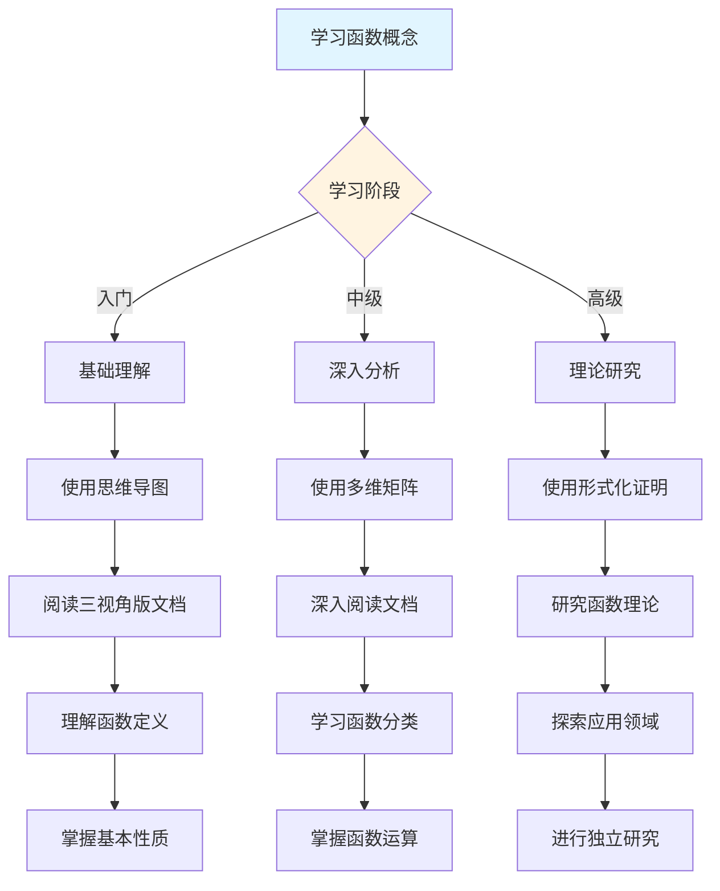
```mermaid
graph TD
    A[学习函数概念] --> B{学习阶段}
    B -->|入门| C[基础理解]
    B -->|中级| D[深入分析]
    B -->|高级| E[理论研究]

    C --> C1[使用思维导图]
    C1 --> C2[阅读三视角版文档]
    C2 --> C3[理解函数定义]
    C3 --> C4[掌握基本性质]

    D --> D1[使用多维矩阵]
    D1 --> D2[深入阅读文档]
    D2 --> D3[学习函数分类]
    D3 --> D4[掌握函数运算]

    E --> E1[使用形式化证明]
    E1 --> E2[研究函数理论]
    E2 --> E3[探索应用领域]
    E3 --> E4[进行独立研究]

    style A fill:#e1f5ff
    style B fill:#fff4e1
```

### 1.2 学习重点决策

**基于知识矩阵的学习重点**：

| 学习阶段 | 知识层次 | 学习重点 | 推荐资源 |
|---------|---------|---------|---------|
| **入门** | L0基础 | 函数的定义、基本例子 | 思维导图、三视角版文档 |
| **入门** | L0基础 | 函数的直观理解（映射、对应） | 三视角版文档、应用实例 |
| **中级** | L1中级 | 函数的分类（单射、满射、双射） | 多维矩阵、形式化证明 |
| **中级** | L1中级 | 函数的复合和逆 | 三视角版文档、习题库 |
| **高级** | L2高级 | 函数空间理论 | 形式化证明系统 |
| **高级** | L2高级 | 函数分析 | 形式化证明系统 |

### 1.3 学习方法决策

**基于认知维度的学习方法**：

1. **直观维度**（入门阶段）
   - 使用思维导图建立总体框架
   - 使用具体例子理解概念（映射、对应、图像）
   - 使用几何直观理解函数

2. **知性维度**（中级阶段）
   - 使用多维矩阵分析概念特征
   - 使用概念分类系统理解（单射vs满射vs双射、连续vs可微）
   - 使用关系分析建立联系（与集合、关系、映射的关系）

3. **理性维度**（高级阶段）
   - 使用形式化证明严格理解
   - 使用逻辑推理深入分析
   - 使用系统建构整体把握

---

## 🔬 二、研究决策导图 (编号: C.CORE.002.DECISION.02)

### 2.1 研究方向决策

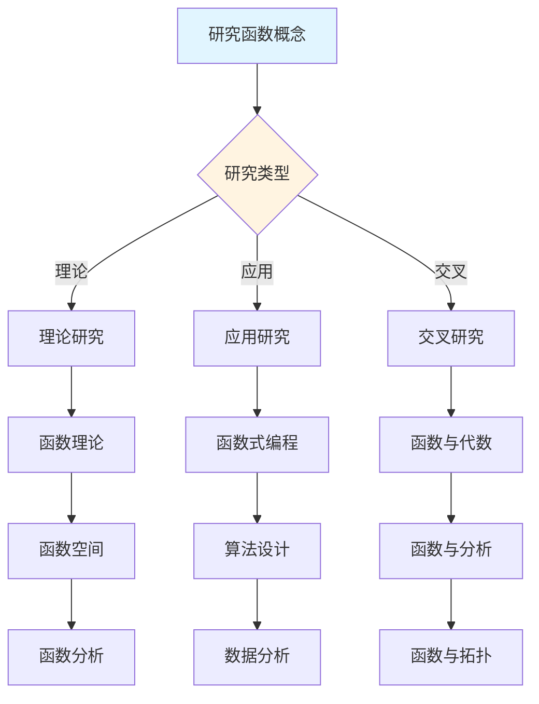
```mermaid
graph TD
    A[研究函数概念] --> B{研究类型}
    B -->|理论| C[理论研究]
    B -->|应用| D[应用研究]
    B -->|交叉| E[交叉研究]

    C --> C1[函数理论]
    C1 --> C2[函数空间]
    C2 --> C3[函数分析]

    D --> D1[函数式编程]
    D1 --> D2[算法设计]
    D2 --> D3[数据分析]

    E --> E1[函数与代数]
    E1 --> E2[函数与分析]
    E2 --> E3[函数与拓扑]

    style A fill:#e1f5ff
    style B fill:#fff4e1
```

### 2.2 研究问题决策

**基于知识矩阵的研究问题**：

1. **理论研究问题**
   - 函数理论：函数的分类和性质
   - 函数空间：函数空间的拓扑和结构
   - 函数分析：函数的分析和性质

2. **应用研究问题**
   - 函数式编程：函数在编程中的应用
   - 算法设计：函数在算法中的应用
   - 数据分析：函数在数据分析中的应用

3. **交叉研究问题**
   - 函数与代数：函数的代数结构
   - 函数与分析：函数的分析性质
   - 函数与拓扑：函数的拓扑性质

### 2.3 研究方法决策

**基于形式化证明的研究方法**：

1. **构造性证明** → 函数的构造
   - 直接构造函数
   - 适用于具体函数

2. **存在性证明** → 函数的存在性
   - 使用存在性证明
   - 适用于抽象函数

3. **范畴论方法** → 函数的范畴性质
   - 使用范畴论方法
   - 适用于函数范畴

---

## 💼 三、应用决策导图 (编号: C.CORE.002.DECISION.03)

### 3.1 应用场景决策

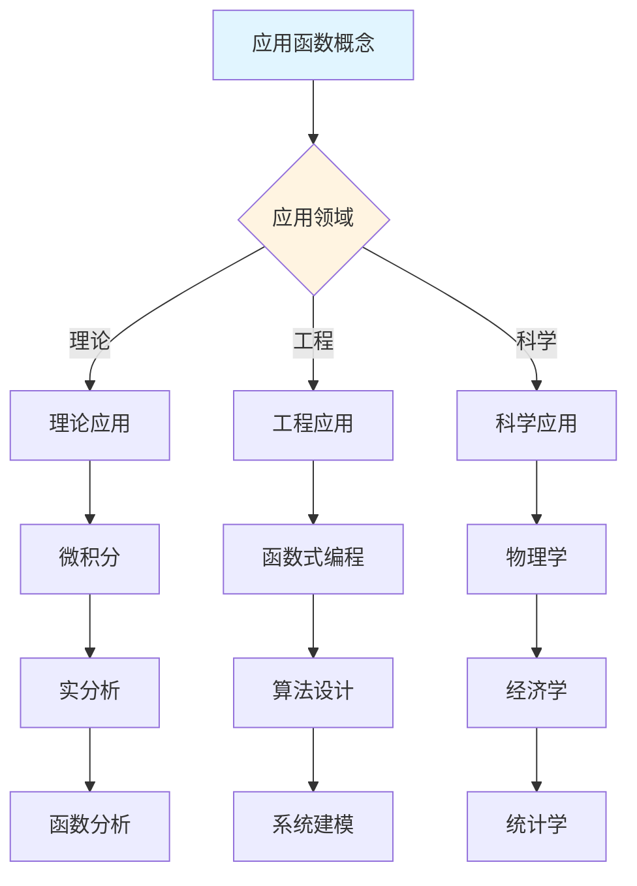
```mermaid
graph TD
    A[应用函数概念] --> B{应用领域}
    B -->|理论| C[理论应用]
    B -->|工程| D[工程应用]
    B -->|科学| E[科学应用]

    C --> C1[微积分]
    C1 --> C2[实分析]
    C2 --> C3[函数分析]

    D --> D1[函数式编程]
    D1 --> D2[算法设计]
    D2 --> D3[系统建模]

    E --> E1[物理学]
    E1 --> E2[经济学]
    E2 --> E3[统计学]

    style A fill:#e1f5ff
    style B fill:#fff4e1
```

### 3.2 应用方法决策

**基于应用场景的应用方法**：

1. **理论应用** → 使用形式化证明
   - 微积分：函数是微积分的基础
   - 实分析：函数的分析性质
   - 函数分析：函数空间理论

2. **工程应用** → 使用论证过程
   - 函数式编程：函数在编程中的应用
   - 算法设计：函数在算法中的应用
   - 系统建模：函数在建模中的应用

3. **科学应用** → 使用综合方法
   - 物理学：函数在物理中的应用
   - 经济学：函数在经济中的应用
   - 统计学：函数在统计中的应用

---

## 🎓 四、教学决策导图 (编号: C.CORE.002.DECISION.04)

### 4.1 教学内容决策

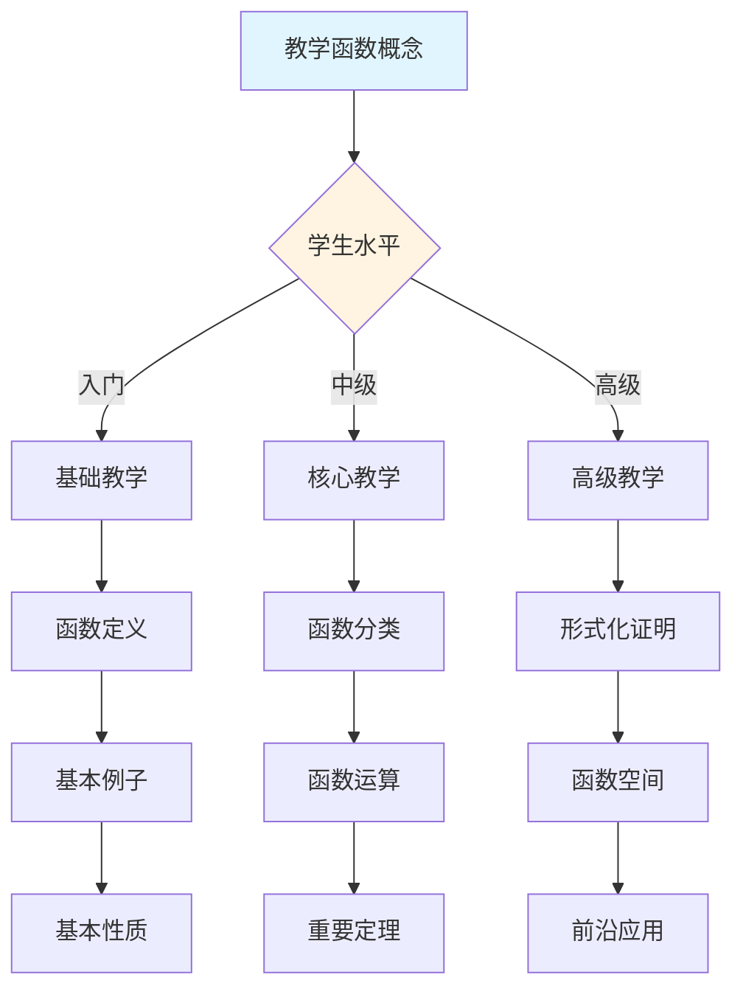
```mermaid
graph TD
    A[教学函数概念] --> B{学生水平}
    B -->|入门| C[基础教学]
    B -->|中级| D[核心教学]
    B -->|高级| E[高级教学]

    C --> C1[函数定义]
    C1 --> C2[基本例子]
    C2 --> C3[基本性质]

    D --> D1[函数分类]
    D1 --> D2[函数运算]
    D2 --> D3[重要定理]

    E --> E1[形式化证明]
    E1 --> E2[函数空间]
    E2 --> E3[前沿应用]

    style A fill:#e1f5ff
    style B fill:#fff4e1
```

### 4.2 教学方法决策

**基于认知维度的教学方法**：

1. **直观维度**（入门教学）
   - 使用思维导图建立框架
   - 使用具体例子（映射、对应、图像）
   - 使用几何直观理解

2. **知性维度**（中级教学）
   - 使用多维矩阵深入分析
   - 使用概念分类系统
   - 使用关系分析建立联系

3. **理性维度**（高级教学）
   - 使用形式化证明严格理解
   - 使用逻辑推理深入分析
   - 使用系统建构整体把握

---

## 🔄 五、整合应用示例 (编号: C.CORE.002.DECISION.05)

### 5.1 完整学习流程示例

**阶段1：入门理解**:

1. 使用学习决策导图 → 确定学习路径：基础概念 → 函数定义 → 基本性质 → 基本应用
2. 使用总体思维导图 → 了解函数在数学基础中的位置
3. 阅读[函数-三视角版](./02-函数.md) → 理解函数的定义和基本性质
4. 使用论证过程 → 理解函数的直观意义（映射、对应、关系）

**阶段2：深入分析**:

1. 使用多维矩阵 → 分析函数的多维度特征（知识层次L0基础层、知识领域D1基础数学、学习难度中等）
2. 阅读[函数-三视角版](./02-函数.md) → 深入理解函数分类和函数运算
3. 使用形式化证明 → 学习逆函数存在性的形式化证明
4. 使用分支关联思维导图 → 了解函数与集合、关系、映射的关系

**阶段3：应用研究**:

1. 使用研究决策导图 → 确定研究方向：函数理论
2. 使用知识关联网络 → 发现函数与代数、分析、拓扑的关系
3. 使用形式化证明系统 → 构建函数理论体系
4. 阅读[函数-三视角版](./02-函数.md) → 了解函数的历史发展和开放问题

---

## 🔗 六、关联文档 (编号: C.CORE.002.DECISION.06)

### 6.1 核心概念文档

- [函数-三视角版](./02-函数.md)
- [函数](./02-函数.md)

### 6.2 框架文档

- [决策思维导图体系](../01-总体思维导图/05-决策思维导图体系.md)
- [概念体系全面梳理与推进计划](../00-概念体系全面梳理与推进计划-2025年1月.md)
- [核心概念与新框架整合指南](../00-核心概念与新框架整合指南-2025年1月.md)

### 6.3 相关文档

- [核心概念索引](./00-核心概念索引.md)
- [知识矩阵总览](../02-知识矩阵/00-知识矩阵总览.md)
- [形式化证明系统](../00-形式化证明系统-2025年11月.md)

---

**维护状态**: 持续更新中

