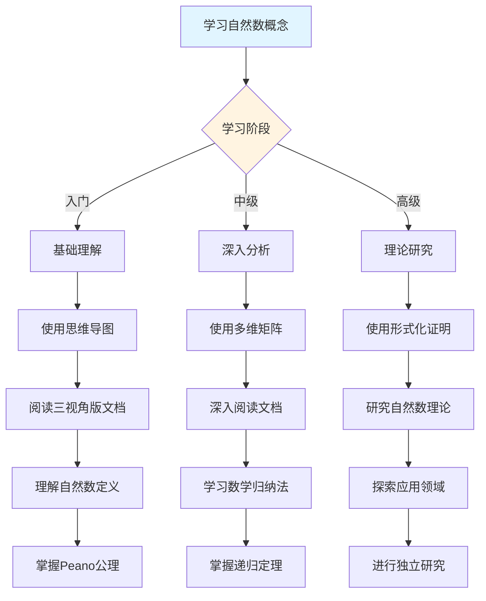
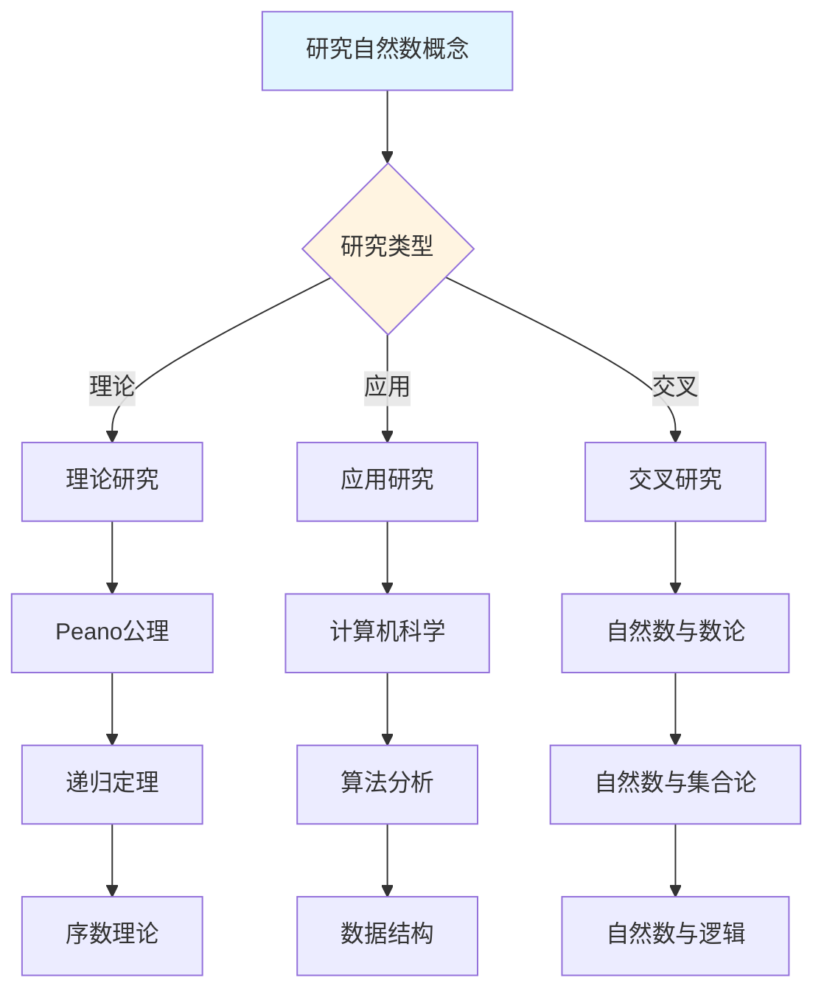
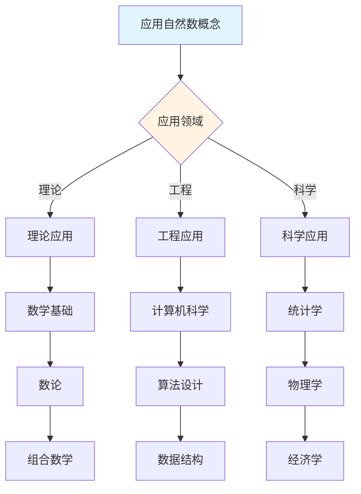
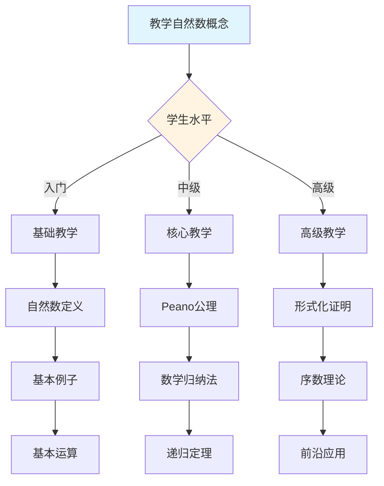

# 自然数概念决策导图示例

**主题编号**: C.CORE.003.DECISION
**创建日期**: 2025年1月
**最后更新**: 2025年1月
**关联概念**: [自然数-三视角版](./03-自然数-三视角版.md)

---

## 📋 概述

本文档提供自然数概念的详细决策导图示例，展示如何将[决策思维导图体系](../01-总体思维导图/05-决策思维导图体系.md)应用于自然数概念的学习、研究、应用和教学。

**目标**：为自然数概念提供完整的决策支持，包括：

- 学习决策导图
- 研究决策导图
- 应用决策导图
- 教学决策导图

---

## 🎓 一、学习决策导图 (编号: C.CORE.003.DECISION.01)

### 1.1 学习路径决策

### 1.2 学习重点决策

**基于知识矩阵的学习重点**：

| 学习阶段 | 知识层次 | 学习重点 | 推荐资源 |
|---------|---------|---------|---------|
| **入门** | L0基础 | 自然数的定义、基本例子 | 思维导图、三视角版文档 |
| **入门** | L0基础 | 自然数的直观理解（计数、顺序） | 三视角版文档、应用实例 |
| **中级** | L1中级 | Peano公理系统 | 多维矩阵、形式化证明 |
| **中级** | L1中级 | 数学归纳法 | 三视角版文档、习题库 |
| **高级** | L2高级 | 递归定理 | 形式化证明系统 |
| **高级** | L2高级 | 序数和基数理论 | 形式化证明系统 |

### 1.3 学习方法决策

**基于认知维度的学习方法**：

1. **直观维度**（入门阶段）
   - 使用思维导图建立总体框架
   - 使用具体例子理解概念（计数、顺序、数轴）
   - 使用几何直观理解自然数

2. **知性维度**（中级阶段）
   - 使用多维矩阵分析概念特征
   - 使用概念分类系统理解（有限vs无限、序数vs基数）
   - 使用关系分析建立联系（与集合、整数、数论的关系）

3. **理性维度**（高级阶段）
   - 使用形式化证明严格理解
   - 使用逻辑推理深入分析
   - 使用系统建构整体把握

---

## 🔬 二、研究决策导图 (编号: C.CORE.003.DECISION.02)

### 2.1 研究方向决策

### 2.2 研究问题决策

**基于知识矩阵的研究问题**：

1. **理论研究问题**
   - Peano公理：公理的独立性、完备性
   - 递归定理：递归定义的唯一性
   - 序数理论：自然数作为有限序数

2. **应用研究问题**
   - 计算机科学：自然数在算法中的应用
   - 算法分析：自然数在复杂度分析中的应用
   - 数据结构：自然数在数据结构中的应用

3. **交叉研究问题**
   - 自然数与数论：自然数的数论性质
   - 自然数与集合论：自然数的集合论构造
   - 自然数与逻辑：自然数的逻辑性质

### 2.3 研究方法决策

**基于形式化证明的研究方法**：

1. **构造性证明** → 自然数的构造
   - 直接构造自然数
   - 适用于集合论构造

2. **归纳法** → 数学归纳法
   - 使用数学归纳法证明
   - 适用于自然数性质证明

3. **递归方法** → 递归定理
   - 使用递归方法构造
   - 适用于递归定义

---

## 💼 三、应用决策导图 (编号: C.CORE.003.DECISION.03)

### 3.1 应用场景决策

### 3.2 应用方法决策

**基于应用场景的应用方法**：

1. **理论应用** → 使用形式化证明
   - 数学基础：自然数是所有数系的基础
   - 数论：自然数的数论性质
   - 组合数学：自然数在组合中的应用

2. **工程应用** → 使用论证过程
   - 计算机科学：自然数在编程中的应用
   - 算法设计：自然数在算法中的应用
   - 数据结构：自然数在数据结构中的应用

3. **科学应用** → 使用综合方法
   - 统计学：自然数在统计中的应用
   - 物理学：自然数在物理中的应用
   - 经济学：自然数在经济中的应用

---

## 🎓 四、教学决策导图 (编号: C.CORE.003.DECISION.04)

### 4.1 教学内容决策

### 4.2 教学方法决策

**基于认知维度的教学方法**：

1. **直观维度**（入门教学）
   - 使用思维导图建立框架
   - 使用具体例子（计数、顺序、数轴）
   - 使用几何直观理解

2. **知性维度**（中级教学）
   - 使用多维矩阵深入分析
   - 使用概念分类系统
   - 使用关系分析建立联系

3. **理性维度**（高级教学）
   - 使用形式化证明严格理解
   - 使用逻辑推理深入分析
   - 使用系统建构整体把握

---

## 🔄 五、整合应用示例 (编号: C.CORE.003.DECISION.05)

### 5.1 完整学习流程示例

**阶段1：入门理解**:

1. 使用学习决策导图 → 确定学习路径：基础概念 → 自然数定义 → Peano公理 → 基本应用
2. 使用总体思维导图 → 了解自然数在数学基础中的位置
3. 阅读[自然数-三视角版](./03-自然数-三视角版.md) → 理解自然数的定义和Peano公理
4. 使用论证过程 → 理解自然数的直观意义（计数、顺序、基础）

**阶段2：深入分析**:

1. 使用多维矩阵 → 分析自然数的多维度特征（知识层次L0基础层、知识领域D1基础数学、学习难度简单）
2. 阅读[自然数-三视角版](./03-自然数-三视角版.md) → 深入理解数学归纳法和递归定理
3. 使用形式化证明 → 学习数学归纳法的形式化证明
4. 使用分支关联思维导图 → 了解自然数与集合、整数、数论的关系

**阶段3：应用研究**:

1. 使用研究决策导图 → 确定研究方向：Peano公理
2. 使用知识关联网络 → 发现自然数与数论、集合论、逻辑的关系
3. 使用形式化证明系统 → 构建自然数理论体系
4. 阅读[自然数-三视角版](./03-自然数-三视角版.md) → 了解自然数的历史发展和开放问题

---

## 🔗 六、关联文档 (编号: C.CORE.003.DECISION.06)

### 6.1 核心概念文档

- [自然数-三视角版](./03-自然数-三视角版.md)
- [自然数](./03-自然数.md)

### 6.2 框架文档

- [决策思维导图体系](../01-总体思维导图/05-决策思维导图体系.md)
- [概念体系全面梳理与推进计划](../00-概念体系全面梳理与推进计划-2025年1月.md)
- [核心概念与新框架整合指南](../00-核心概念与新框架整合指南-2025年1月.md)

### 6.3 相关文档

- [核心概念索引](./00-核心概念索引.md)
- [知识矩阵总览](../02-知识矩阵/00-知识矩阵总览.md)
- [形式化证明系统](../00-形式化证明系统-2025年11月.md)

---

**创建日期**: 2025年1月
**最后更新**: 2025年1月
**维护状态**: 持续更新中
