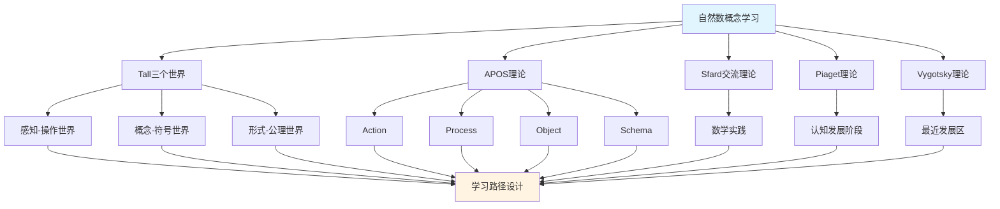

# 自然数概念的多理论分析示例

**主题编号**: C.CORE.003.MULTI
**创建日期**: 2025年1月
**最后更新**: 2025年1月
**关联概念**: [自然数](./03-自然数.md) | [自然数-三视角版](./03-自然数-三视角版.md)

---

## 📋 概述

本文档为"自然数"概念提供多理论分析示例，展示如何运用国际主流数学认知理论来分析数学概念。

**分析目标**：
- 展示自然数概念的多理论分析方法
- 为其他核心概念提供分析参考
- 建立理论整合的应用示例

---

## 🎯 一、Tall三个世界理论分析 (编号: C.CORE.003.MULTI.01)

### 1.1 感知-操作世界（Embodied World）

**自然数在感知-操作世界的理解**：

- **具体经验**：
  - 通过数数理解自然数：1个苹果、2个苹果、3个苹果...
  - 通过计数活动理解自然数的顺序
  - 通过比较大小理解自然数的大小关系

- **身体动作**：
  - 通过手指计数理解自然数
  - 通过数数动作理解自然数的递增
  - 通过操作物体理解自然数的运算

- **直观理解**：
  - 自然数是"数的个数"
  - 自然数有顺序（1, 2, 3, ...）
  - 自然数可以相加、相乘

**教学建议**：
- 使用具体物体进行数数活动
- 通过手指计数理解自然数
- 使用数轴可视化自然数

### 1.2 概念-符号世界（Symbolic World）

**自然数在概念-符号世界的理解**：

- **符号表示**：
  - 使用数字符号：1, 2, 3, ..., n
  - 使用集合符号：$\mathbb{N} = \{1, 2, 3, ...\}$
  - 使用运算符号：$+$, $\times$, $<$, $>$

- **概念理解**：
  - 自然数是满足Peano公理的集合
  - 自然数有加法和乘法运算
  - 自然数有大小关系（序关系）

- **抽象操作**：
  - 通过符号操作进行自然数运算
  - 通过数学归纳法证明自然数性质
  - 通过数论研究自然数

**教学建议**：
- 逐步引入自然数符号
- 通过符号操作练习自然数运算
- 使用数学归纳法理解自然数性质

### 1.3 形式-公理世界（Formal World）

**自然数在形式-公理世界的理解**：

- **公理系统**：
  - Peano公理系统
  - 通过公理严格定义自然数
  - 通过公理推导自然数性质

- **形式化定义**：
  - 自然数的形式化定义：满足Peano公理的集合
  - 自然数运算的形式化定义
  - 自然数性质的形式化证明

- **逻辑推理**：
  - 通过逻辑推理证明自然数性质
  - 通过形式化方法研究数论
  - 通过集合论构造自然数

**教学建议**：
- 介绍Peano公理系统
- 通过形式化证明理解自然数性质
- 研究自然数在数学基础中的作用

---

## 🔬 二、Dubinsky APOS理论分析 (编号: C.CORE.003.MULTI.02)

### 2.1 Action（动作）

**自然数的Action阶段**：

- **具体操作**：
  - 数数：1, 2, 3, ...
  - 计算：$2 + 3 = ?$，$2 \times 3 = ?$
  - 比较：$2 < 3$？

- **操作特点**：
  - 需要外部指导（教师、家长）
  - 操作是具体的、机械的
  - 需要逐步执行

- **学习活动**：
  - 练习数数
  - 练习基本运算
  - 练习比较大小

**教学建议**：
- 提供大量练习机会
- 给予及时反馈
- 逐步增加操作复杂度

### 2.2 Process（过程）

**自然数的Process阶段**：

- **内化过程**：
  - 将数数操作内化为心理过程
  - 理解自然数运算的内在逻辑
  - 能够独立完成自然数运算

- **过程理解**：
  - 理解"加法"是"合并的过程"
  - 理解"乘法"是"重复加法的过程"
  - 理解"大小关系"是"比较的过程"

- **灵活应用**：
  - 能够灵活应用自然数概念
  - 能够处理复杂的自然数问题
  - 能够理解自然数的各种性质

**教学建议**：
- 引导学生内化操作过程
- 通过变式练习加深理解
- 鼓励学生独立思考和解决问题

### 2.3 Object（对象）

**自然数的Object阶段**：

- **对象化理解**：
  - 将自然数视为独立的对象
  - 可以对自然数进行操作
  - 可以将自然数作为其他概念的基础

- **对象操作**：
  - 自然数的集合（$\mathbb{N}$）
  - 自然数的运算结果仍是自然数
  - 自然数可以作为函数的定义域

- **抽象理解**：
  - 理解自然数的抽象性质
  - 理解自然数在数学中的基础地位
  - 理解数论作为数学分支的作用

**教学建议**：
- 引导学生将自然数视为对象
- 研究自然数的集合（$\mathbb{N}$）
- 探索自然数在数学中的广泛应用

### 2.4 Schema（图式）

**自然数的Schema阶段**：

- **完整图式**：
  - 整合自然数的定义、运算、性质
  - 形成完整的自然数概念图式
  - 理解自然数与其他数学概念的关系

- **图式应用**：
  - 能够灵活应用自然数概念
  - 能够解决复杂的自然数问题
  - 能够理解自然数在数学中的作用

- **图式扩展**：
  - 理解自然数的推广（整数、有理数、实数）
  - 理解自然数在数学基础中的作用
  - 理解自然数与其他数学分支的关系

**教学建议**：
- 帮助学生建立完整的自然数概念图式
- 探索自然数与其他数学分支的关系
- 研究自然数在数学基础中的作用

---

## 💬 三、Sfard交流理论分析 (编号: C.CORE.003.MULTI.03)

### 3.1 自然数作为交流工具

**自然数的交流功能**：

- **数学交流**：
  - 自然数用于表达数量：3个苹果、5本书
  - 自然数用于描述顺序：第1名、第2名
  - 自然数用于表达数学关系：$n + 1 > n$

- **概念表达**：
  - 通过自然数表达"数量"
  - 通过自然数运算表达"合并"、"重复"等概念
  - 通过自然数关系表达"大小"、"顺序"等概念

- **问题解决**：
  - 使用自然数语言表达问题
  - 使用自然数方法解决问题
  - 使用数论方法证明定理

### 3.2 自然数学习的实践参与

**通过参与数学实践学习自然数**：

- **实践场景**：
  - 通过日常计数活动学习自然数
  - 通过游戏学习自然数运算
  - 通过问题解决学习自然数性质
  - 通过数论研究学习自然数理论

- **实践方式**：
  - 参与数学讨论，使用自然数语言
  - 解决数学问题，应用自然数方法
  - 研究数学理论，理解自然数作用

- **学习效果**：
  - 通过实践理解自然数概念
  - 通过应用掌握自然数方法
  - 通过参与形成数学思维

**教学建议**：
- 设计数学实践活动
- 鼓励学生参与数学讨论
- 提供实际问题解决机会

---

## 🧠 四、Piaget认知发展理论分析 (编号: C.CORE.003.MULTI.04)

### 4.1 前运算阶段（2-7岁）

**自然数在前运算阶段的理解**：

- **具体对象**：
  - 通过具体物体理解自然数
  - 例如：3个苹果、5个积木
  - 需要具体对象支持理解

- **符号使用**：
  - 开始使用数字符号
  - 但理解有限，可能认为数字只是标签
  - 难以理解抽象的数量概念

- **教学建议**：
  - 使用具体物体和图形
  - 通过游戏和活动学习
  - 逐步引入数字符号

### 4.2 具体运算阶段（7-12岁）

**自然数在具体运算阶段的理解**：

- **逻辑思维**：
  - 能够理解自然数的顺序
  - 能够进行简单的自然数运算
  - 但需要具体对象支持

- **守恒概念**：
  - 开始理解数量守恒
  - 理解自然数的大小关系
  - 理解自然数运算的性质

- **教学建议**：
  - 使用具体例子和操作
  - 通过游戏和活动学习
  - 逐步引入抽象概念

### 4.3 形式运算阶段（12+岁）

**自然数在形式运算阶段的理解**：

- **抽象思维**：
  - 能够理解抽象的自然数概念
  - 能够进行符号操作
  - 能够进行逻辑推理

- **形式推理**：
  - 能够证明自然数性质
  - 能够理解Peano公理
  - 能够研究数论

- **教学建议**：
  - 引入抽象概念和符号
  - 进行逻辑推理训练
  - 研究数论理论

---

## 🌍 五、Vygotsky社会文化理论分析 (编号: C.CORE.003.MULTI.05)

### 5.1 最近发展区（ZPD）

**自然数学习的最近发展区**：

- **独立水平**：
  - 学生可以独立理解自然数的基本概念
  - 学生可以独立进行基本自然数运算
  - 学生可以独立解决简单自然数问题

- **最近发展区**：
  - 需要指导才能理解自然数的抽象性质
  - 需要指导才能掌握复杂自然数运算
  - 需要指导才能解决复杂自然数问题

- **潜在水平**：
  - 未来可能理解Peano公理
  - 未来可能掌握数论方法
  - 未来可能研究数论理论

### 5.2 社会文化工具

**自然数作为社会文化工具**：

- **数学符号**：
  - 自然数符号是数学交流的工具
  - 通过社会文化实践学习自然数符号
  - 通过数学实践掌握自然数方法

- **数学语言**：
  - 自然数语言是数学表达的工具
  - 通过参与数学实践学习自然数语言
  - 通过数学交流掌握自然数表达

**教学建议**：
- 提供适当的学习支持
- 设计最近发展区的学习活动
- 鼓励学生参与数学实践和交流

---

## 🔄 六、多理论整合分析 (编号: C.CORE.003.MULTI.06)

### 6.1 理论共同点

**各理论在自然数概念分析中的共同点**：

1. **多层次理解**：
   - 都强调从具体到抽象的发展
   - Tall的三个世界、APOS的四个阶段、Piaget的发展阶段都体现这一点

2. **实践重要性**：
   - 都强调实践在学习中的作用
   - Sfard的交流理论、Vygotsky的社会文化理论都强调这一点

3. **认知发展**：
   - 都关注认知发展的过程
   - 各理论都描述了从简单到复杂的发展

### 6.2 理论互补性

**各理论在自然数概念分析中的互补性**：

1. **Tall三个世界**：
   - 适用于理解自然数概念的不同层次
   - 从感知操作到形式公理的发展

2. **APOS理论**：
   - 适用于分析自然数概念的学习过程
   - 从动作到图式的发展

3. **Sfard交流理论**：
   - 适用于设计自然数概念的实践活动
   - 通过数学实践学习自然数

4. **Piaget理论**：
   - 适用于理解自然数概念的认知发展阶段
   - 从具体运算到形式运算的发展

5. **Vygotsky理论**：
   - 适用于设计自然数概念的学习支持
   - 通过最近发展区促进学习

### 6.3 整合应用框架

**多理论整合应用**：

---

## 📊 七、自然数概念的多理论学习路径 (编号: C.CORE.003.MULTI.07)

### 7.1 入门阶段（Tall感知-操作世界 + APOS Action + Piaget前运算阶段）

**学习目标**：
- 通过具体例子理解自然数概念
- 掌握基本数数和计数操作

**学习活动**：
- 使用具体物体进行数数活动
- 通过手指计数理解自然数
- 练习基本数数和计数
- 使用数轴可视化自然数

**评估标准**：
- 能够独立完成基本数数操作
- 能够理解自然数的基本概念

### 7.2 中级阶段（Tall概念-符号世界 + APOS Process/Object + Piaget具体运算阶段）

**学习目标**：
- 理解自然数的符号表示
- 掌握自然数运算的内在逻辑
- 将自然数视为对象

**学习活动**：
- 学习自然数符号和运算符号
- 通过符号操作进行自然数运算
- 理解自然数的各种性质
- 研究自然数的集合（$\mathbb{N}$）

**评估标准**：
- 能够灵活应用自然数符号
- 能够理解自然数运算的内在逻辑
- 能够将自然数视为对象进行操作

### 7.3 高级阶段（Tall形式-公理世界 + APOS Schema + Piaget形式运算阶段）

**学习目标**：
- 理解Peano公理系统
- 形成完整的自然数概念图式
- 通过数学实践应用数论

**学习活动**：
- 学习Peano公理系统
- 通过形式化证明理解自然数性质
- 研究自然数在数学基础中的作用
- 参与数学实践，应用数论方法

**评估标准**：
- 能够理解Peano公理系统
- 能够形成完整的自然数概念图式
- 能够通过数学实践应用数论

---

## 🎓 八、教学建议 (编号: C.CORE.003.MULTI.08)

### 8.1 基于多理论的教学设计

**教学设计原则**：

1. **多层次设计**：
   - 从感知操作到形式公理
   - 从动作到图式
   - 从具体运算到形式运算

2. **实践导向**：
   - 设计数学实践活动
   - 鼓励学生参与数学交流
   - 提供实际问题解决机会

3. **学习支持**：
   - 提供适当的学习支持
   - 设计最近发展区的学习活动
   - 给予及时反馈

### 8.2 具体教学策略

**入门阶段策略**：
- 使用具体物体和手指计数
- 通过游戏和活动学习
- 提供大量练习机会

**中级阶段策略**：
- 逐步引入抽象概念和符号
- 通过变式练习加深理解
- 鼓励学生独立思考和解决问题

**高级阶段策略**：
- 引入Peano公理和形式化方法
- 研究数论理论
- 参与数学实践和研究

---

## 🔗 九、关联文档 (编号: C.CORE.003.MULTI.09)

### 9.1 核心概念文档

- [自然数](./03-自然数.md)
- [自然数-三视角版](./03-自然数-三视角版.md)
- [自然数-决策导图示例](./03-自然数-决策导图示例-2025年1月.md)

### 9.2 理论框架文档

- [国际主流数学认知理论整合框架](../00-国际主流数学认知理论整合框架-2025年1月.md)
- [概念体系深度改进计划](../00-概念体系深度改进计划-2025年1月.md)
- [集合-多理论分析示例](./01-集合-多理论分析示例-2025年1月.md) - 参考模板
- [函数-多理论分析示例](./02-函数-多理论分析示例-2025年1月.md) - 参考模板

---

## ✅ 十、总结 (编号: C.CORE.003.MULTI.10)

### 10.1 多理论分析的价值

**多理论分析的优势**：

1. **全面理解**：
   - 从多个角度理解自然数概念
   - 理解自然数概念的不同层次
   - 理解自然数概念的学习过程

2. **教学设计**：
   - 基于多理论设计教学
   - 提供多层次学习支持
   - 设计实践活动

3. **学习路径**：
   - 设计基于多理论的学习路径
   - 支持不同认知发展阶段的学习
   - 促进概念理解的发展

### 10.2 与集合、函数概念的对比

**自然数与集合、函数的多理论分析对比**：

| 理论 | 集合概念 | 函数概念 | 自然数概念 |
|------|---------|---------|-----------|
| **Tall感知-操作世界** | 具体物体集合 | 输入输出关系 | 数数和计数 |
| **Tall概念-符号世界** | 集合符号和运算 | 函数符号和表达式 | 数字符号和运算 |
| **Tall形式-公理世界** | ZFC公理系统 | 函数的形式化定义 | Peano公理系统 |
| **APOS Action** | 集合操作 | 函数值计算 | 数数和计数操作 |
| **APOS Process** | 集合运算过程 | 函数运算过程 | 自然数运算过程 |
| **APOS Object** | 集合的集合 | 函数的函数 | 自然数的集合 |
| **APOS Schema** | 集合概念图式 | 函数概念图式 | 自然数概念图式 |

---

**创建日期**: 2025年1月
**最后更新**: 2025年1月
**维护状态**: 持续更新中
**状态**: ✅ 示例完成
