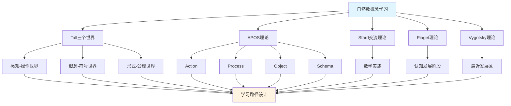

# 自然数概念的多理论分析示例 / Multi-Theory Analysis Example: Natural Number Concept

**主题编号 / Topic ID**: C.CORE.003.MULTI
**创建日期 / Created**: 2025年1月 / January 2025
**最后更新 / Last Updated**: 2025年1月 / January 2025
**关联概念 / Related Concepts**: [自然数 / Natural Number](./03-自然数.md) | [自然数-三视角版 / Natural Number-Three Perspectives](./03-自然数-三视角版.md)

---

## 📋 概述 / Overview

本文档为"自然数"概念提供多理论分析示例，展示如何运用国际主流数学认知理论来分析数学概念。

This document provides a multi-theory analysis example for the "Natural Number" concept, demonstrating how to apply international mainstream mathematical cognitive theories to analyze mathematical concepts.

**分析目标 / Analysis Objectives**：

- 展示自然数概念的多理论分析方法 / Demonstrate multi-theory analysis methods for natural number concepts
- 为其他核心概念提供分析参考 / Provide analysis reference for other core concepts
- 建立理论整合的应用示例 / Establish application examples of theoretical integration

---

## 📑 目录 / Table of Contents

- [自然数概念的多理论分析示例 / Multi-Theory Analysis Example: Natural Number Concept](#自然数概念的多理论分析示例--multi-theory-analysis-example-natural-number-concept)
  - [📋 概述 / Overview](#-概述--overview)
  - [📑 目录 / Table of Contents](#-目录--table-of-contents)
  - [🎯 一、Tall三个世界理论分析 (编号: C.CORE.003.MULTI.01)](#-一tall三个世界理论分析-编号-ccore003multi01)
    - [1.1 感知-操作世界（Embodied World）](#11-感知-操作世界embodied-world)
    - [1.2 概念-符号世界（Symbolic World）](#12-概念-符号世界symbolic-world)
    - [1.3 形式-公理世界（Formal World）](#13-形式-公理世界formal-world)
  - [🔬 二、Dubinsky APOS理论分析 (编号: C.CORE.003.MULTI.02)](#-二dubinsky-apos理论分析-编号-ccore003multi02)
    - [2.1 Action（动作）](#21-action动作)
    - [2.2 Process（过程）](#22-process过程)
    - [2.3 Object（对象）](#23-object对象)
    - [2.4 Schema（图式）](#24-schema图式)
  - [💬 三、Sfard交流理论分析 / Sfard's Commognitive Theory Analysis (编号: C.CORE.003.MULTI.03)](#-三sfard交流理论分析--sfards-commognitive-theory-analysis-编号-ccore003multi03)
    - [3.1 自然数作为交流工具 / Natural Number as a Communication Tool](#31-自然数作为交流工具--natural-number-as-a-communication-tool)
    - [3.2 自然数学习的实践参与 / Practice Participation in Natural Number Learning](#32-自然数学习的实践参与--practice-participation-in-natural-number-learning)
  - [🧠 四、Piaget认知发展理论分析 / Piaget's Cognitive Development Theory Analysis (编号: C.CORE.003.MULTI.04)](#-四piaget认知发展理论分析--piagets-cognitive-development-theory-analysis-编号-ccore003multi04)
    - [4.1 前运算阶段（2-7岁）/ Pre-operational Stage (2-7 years)](#41-前运算阶段2-7岁-pre-operational-stage-2-7-years)
    - [4.2 具体运算阶段（7-12岁）/ Concrete Operational Stage (7-12 years)](#42-具体运算阶段7-12岁-concrete-operational-stage-7-12-years)
    - [4.3 形式运算阶段（12+岁）/ Formal Operational Stage (12+ years)](#43-形式运算阶段12岁-formal-operational-stage-12-years)
  - [🌍 五、Vygotsky社会文化理论分析 / Vygotsky's Sociocultural Theory Analysis (编号: C.CORE.003.MULTI.05)](#-五vygotsky社会文化理论分析--vygotskys-sociocultural-theory-analysis-编号-ccore003multi05)
    - [5.1 最近发展区（ZPD）/ Zone of Proximal Development (ZPD)](#51-最近发展区zpd-zone-of-proximal-development-zpd)
    - [5.2 社会文化工具 / Sociocultural Tools](#52-社会文化工具--sociocultural-tools)
  - [🔄 六、多理论整合分析 / Multi-Theory Integration Analysis (编号: C.CORE.003.MULTI.06)](#-六多理论整合分析--multi-theory-integration-analysis-编号-ccore003multi06)
    - [6.1 理论共同点 / Theoretical Commonalities](#61-理论共同点--theoretical-commonalities)
    - [6.2 理论互补性 / Theoretical Complementarity](#62-理论互补性--theoretical-complementarity)
    - [6.3 整合应用框架](#63-整合应用框架)
  - [📊 七、自然数概念的多理论学习路径 / Multi-Theory Learning Path for Natural Number Concept (编号: C.CORE.003.MULTI.07)](#-七自然数概念的多理论学习路径--multi-theory-learning-path-for-natural-number-concept-编号-ccore003multi07)
    - [7.1 入门阶段（Tall感知-操作世界 + APOS Action + Piaget前运算阶段）/ Entry Stage (Tall Embodied World + APOS Action + Piaget Pre-operational Stage)](#71-入门阶段tall感知-操作世界--apos-action--piaget前运算阶段-entry-stage-tall-embodied-world--apos-action--piaget-pre-operational-stage)
    - [7.2 中级阶段（Tall概念-符号世界 + APOS Process/Object + Piaget具体运算阶段）/ Intermediate Stage (Tall Symbolic World + APOS Process/Object + Piaget Concrete Operational Stage)](#72-中级阶段tall概念-符号世界--apos-processobject--piaget具体运算阶段-intermediate-stage-tall-symbolic-world--apos-processobject--piaget-concrete-operational-stage)
    - [7.3 高级阶段（Tall形式-公理世界 + APOS Schema + Piaget形式运算阶段）/ Advanced Stage (Tall Formal World + APOS Schema + Piaget Formal Operational Stage)](#73-高级阶段tall形式-公理世界--apos-schema--piaget形式运算阶段-advanced-stage-tall-formal-world--apos-schema--piaget-formal-operational-stage)
  - [🎓 八、教学建议 / Teaching Suggestions (编号: C.CORE.003.MULTI.08)](#-八教学建议--teaching-suggestions-编号-ccore003multi08)
    - [8.1 基于多理论的教学设计 / Multi-Theory Based Teaching Design](#81-基于多理论的教学设计--multi-theory-based-teaching-design)
    - [8.2 具体教学策略 / Specific Teaching Strategies](#82-具体教学策略--specific-teaching-strategies)
  - [🔗 九、关联文档 / Related Documents (编号: C.CORE.003.MULTI.09)](#-九关联文档--related-documents-编号-ccore003multi09)
    - [9.1 核心概念文档 / Core Concept Documents](#91-核心概念文档--core-concept-documents)
    - [9.2 理论框架文档 / Theoretical Framework Documents](#92-理论框架文档--theoretical-framework-documents)
  - [✅ 十、总结 / Summary (编号: C.CORE.003.MULTI.10)](#-十总结--summary-编号-ccore003multi10)
    - [10.1 多理论分析的价值 / Value of Multi-Theory Analysis](#101-多理论分析的价值--value-of-multi-theory-analysis)
    - [10.2 与集合、函数概念的对比 / Comparison with Set and Function Concepts](#102-与集合函数概念的对比--comparison-with-set-and-function-concepts)

---

## 🎯 一、Tall三个世界理论分析 (编号: C.CORE.003.MULTI.01)

### 1.1 感知-操作世界（Embodied World）

**自然数在感知-操作世界的理解**：

- **具体经验**：
  - 通过数数理解自然数：1个苹果、2个苹果、3个苹果...
  - 通过计数活动理解自然数的顺序
  - 通过比较大小理解自然数的大小关系

- **身体动作**：
  - 通过手指计数理解自然数
  - 通过数数动作理解自然数的递增
  - 通过操作物体理解自然数的运算

- **直观理解**：
  - 自然数是"数的个数"
  - 自然数有顺序（1, 2, 3, ...）
  - 自然数可以相加、相乘

**教学建议**：

- 使用具体物体进行数数活动
- 通过手指计数理解自然数
- 使用数轴可视化自然数

### 1.2 概念-符号世界（Symbolic World）

**自然数在概念-符号世界的理解 / Understanding Natural Numbers in the Symbolic World**：

- **符号表示 / Symbolic Representation**：
  - 使用数字符号：1, 2, 3, ..., n / Using number symbols: 1, 2, 3, ..., n
  - 使用集合符号：$\mathbb{N} = \{1, 2, 3, ...\}$ / Using set notation: $\mathbb{N} = \{1, 2, 3, ...\}$
  - 使用运算符号：$+$, $\times$, $<$, $>$ / Using operation symbols: $+$, $\times$, $<$, $>$

- **概念理解 / Conceptual Understanding**：
  - 自然数是满足Peano公理的集合 / Natural numbers are sets satisfying Peano axioms
  - 自然数有加法和乘法运算 / Natural numbers have addition and multiplication operations
  - 自然数有大小关系（序关系） / Natural numbers have order relations

- **抽象操作 / Abstract Operations**：
  - 通过符号操作进行自然数运算 / Performing natural number operations through symbolic operations
  - 通过数学归纳法证明自然数性质 / Proving natural number properties through mathematical induction
  - 通过数论研究自然数 / Studying natural numbers through number theory

**教学建议 / Teaching Suggestions**：

- 逐步引入自然数符号 / Gradually introduce natural number notation
- 通过符号操作练习自然数运算 / Practice natural number operations through symbolic operations
- 使用数学归纳法理解自然数性质 / Use mathematical induction to understand natural number properties

### 1.3 形式-公理世界（Formal World）

**自然数在形式-公理世界的理解**：

- **公理系统**：
  - Peano公理系统
  - 通过公理严格定义自然数
  - 通过公理推导自然数性质

- **形式化定义**：
  - 自然数的形式化定义：满足Peano公理的集合
  - 自然数运算的形式化定义
  - 自然数性质的形式化证明

- **逻辑推理**：
  - 通过逻辑推理证明自然数性质
  - 通过形式化方法研究数论
  - 通过集合论构造自然数

**教学建议**：

- 介绍Peano公理系统
- 通过形式化证明理解自然数性质
- 研究自然数在数学基础中的作用

---

## 🔬 二、Dubinsky APOS理论分析 (编号: C.CORE.003.MULTI.02)

### 2.1 Action（动作）

**自然数的Action阶段**：

- **具体操作**：
  - 数数：1, 2, 3, ...
  - 计算：$2 + 3 = ?$，$2 \times 3 = ?$
  - 比较：$2 < 3$？

- **操作特点**：
  - 需要外部指导（教师、家长）
  - 操作是具体的、机械的
  - 需要逐步执行

- **学习活动**：
  - 练习数数
  - 练习基本运算
  - 练习比较大小

**教学建议**：

- 提供大量练习机会
- 给予及时反馈
- 逐步增加操作复杂度

### 2.2 Process（过程）

**自然数的Process阶段**：

- **内化过程**：
  - 将数数操作内化为心理过程
  - 理解自然数运算的内在逻辑
  - 能够独立完成自然数运算

- **过程理解**：
  - 理解"加法"是"合并的过程"
  - 理解"乘法"是"重复加法的过程"
  - 理解"大小关系"是"比较的过程"

- **灵活应用**：
  - 能够灵活应用自然数概念
  - 能够处理复杂的自然数问题
  - 能够理解自然数的各种性质

**教学建议**：

- 引导学生内化操作过程
- 通过变式练习加深理解
- 鼓励学生独立思考和解决问题

### 2.3 Object（对象）

**自然数的Object阶段**：

- **对象化理解**：
  - 将自然数视为独立的对象
  - 可以对自然数进行操作
  - 可以将自然数作为其他概念的基础

- **对象操作**：
  - 自然数的集合（$\mathbb{N}$）
  - 自然数的运算结果仍是自然数
  - 自然数可以作为函数的定义域

- **抽象理解**：
  - 理解自然数的抽象性质
  - 理解自然数在数学中的基础地位
  - 理解数论作为数学分支的作用

**教学建议**：

- 引导学生将自然数视为对象
- 研究自然数的集合（$\mathbb{N}$）
- 探索自然数在数学中的广泛应用

### 2.4 Schema（图式）

**自然数的Schema阶段**：

- **完整图式**：
  - 整合自然数的定义、运算、性质
  - 形成完整的自然数概念图式
  - 理解自然数与其他数学概念的关系

- **图式应用**：
  - 能够灵活应用自然数概念
  - 能够解决复杂的自然数问题
  - 能够理解自然数在数学中的作用

- **图式扩展**：
  - 理解自然数的推广（整数、有理数、实数）
  - 理解自然数在数学基础中的作用
  - 理解自然数与其他数学分支的关系

**教学建议**：

- 帮助学生建立完整的自然数概念图式
- 探索自然数与其他数学分支的关系
- 研究自然数在数学基础中的作用

---

## 💬 三、Sfard交流理论分析 / Sfard's Commognitive Theory Analysis (编号: C.CORE.003.MULTI.03)

### 3.1 自然数作为交流工具 / Natural Number as a Communication Tool

**自然数的交流功能 / Communicative Function of Natural Numbers**：

- **数学交流 / Mathematical Communication**：
  - 自然数用于表达数量：3个苹果、5本书 / Natural numbers are used to express quantity: 3 apples, 5 books
  - 自然数用于描述顺序：第1名、第2名 / Natural numbers are used to describe order: 1st place, 2nd place
  - 自然数用于表达数学关系：$n + 1 > n$ / Natural numbers are used to express mathematical relationships: $n + 1 > n$

- **概念表达 / Conceptual Expression**：
  - 通过自然数表达"数量" / Expressing "quantity" through natural numbers
  - 通过自然数运算表达"合并"、"重复"等概念 / Expressing concepts such as "combining" and "repeating" through natural number operations
  - 通过自然数关系表达"大小"、"顺序"等概念 / Expressing concepts such as "size" and "order" through natural number relationships

- **问题解决 / Problem Solving**：
  - 使用自然数语言表达问题 / Using natural number language to express problems
  - 使用自然数方法解决问题 / Using natural number methods to solve problems
  - 使用数论方法证明定理 / Using number theory methods to prove theorems

### 3.2 自然数学习的实践参与 / Practice Participation in Natural Number Learning

**通过参与数学实践学习自然数 / Learning Natural Numbers through Participation in Mathematical Practice**：

- **实践场景 / Practice Scenarios**：
  - 通过日常计数活动学习自然数 / Learning natural numbers through daily counting activities
  - 通过游戏学习自然数运算 / Learning natural number operations through games
  - 通过问题解决学习自然数性质 / Learning natural number properties through problem solving
  - 通过数论研究学习自然数理论 / Learning natural number theory through number theory research

- **实践方式 / Practice Methods**：
  - 参与数学讨论，使用自然数语言 / Participating in mathematical discussions, using natural number language
  - 解决数学问题，应用自然数方法 / Solving mathematical problems, applying natural number methods
  - 研究数学理论，理解自然数作用 / Studying mathematical theory, understanding the role of natural numbers

- **学习效果 / Learning Outcomes**：
  - 通过实践理解自然数概念 / Understanding natural number concepts through practice
  - 通过应用掌握自然数方法 / Mastering natural number methods through application
  - 通过参与形成数学思维 / Forming mathematical thinking through participation

**教学建议 / Teaching Suggestions**：

- 设计数学实践活动 / Design mathematical practice activities
- 鼓励学生参与数学讨论 / Encourage students to participate in mathematical discussions
- 提供实际问题解决机会 / Provide opportunities for solving real-world problems

---

## 🧠 四、Piaget认知发展理论分析 / Piaget's Cognitive Development Theory Analysis (编号: C.CORE.003.MULTI.04)

### 4.1 前运算阶段（2-7岁）/ Pre-operational Stage (2-7 years)

**自然数在前运算阶段的理解 / Understanding Natural Numbers in the Pre-operational Stage**：

- **具体对象 / Concrete Objects**：
  - 通过具体物体理解自然数 / Understanding natural numbers through concrete objects
  - 例如：3个苹果、5个积木 / Examples: 3 apples, 5 blocks
  - 需要具体对象支持理解 / Requires concrete object support for understanding

- **符号使用 / Symbol Use**：
  - 开始使用数字符号 / Beginning to use number symbols
  - 但理解有限，可能认为数字只是标签 / But understanding is limited, may think numbers are just labels
  - 难以理解抽象的数量概念 / Difficulty understanding abstract quantity concepts

- **教学建议 / Teaching Suggestions**：
  - 使用具体物体和图形 / Use concrete objects and graphics
  - 通过游戏和活动学习 / Learn through games and activities
  - 逐步引入数字符号 / Gradually introduce number symbols

### 4.2 具体运算阶段（7-12岁）/ Concrete Operational Stage (7-12 years)

**自然数在具体运算阶段的理解 / Understanding Natural Numbers in the Concrete Operational Stage**：

- **逻辑思维 / Logical Thinking**：
  - 能够理解自然数的顺序 / Being able to understand the order of natural numbers
  - 能够进行简单的自然数运算 / Being able to perform simple natural number operations
  - 但需要具体对象支持 / But requires concrete object support

- **守恒概念 / Conservation Concept**：
  - 开始理解数量守恒 / Beginning to understand quantity conservation
  - 理解自然数的大小关系 / Understanding size relationships of natural numbers
  - 理解自然数运算的性质 / Understanding properties of natural number operations

- **教学建议 / Teaching Suggestions**：
  - 使用具体例子和操作 / Use concrete examples and operations
  - 通过游戏和活动学习 / Learn through games and activities
  - 逐步引入抽象概念 / Gradually introduce abstract concepts

### 4.3 形式运算阶段（12+岁）/ Formal Operational Stage (12+ years)

**自然数在形式运算阶段的理解 / Understanding Natural Numbers in the Formal Operational Stage**：

- **抽象思维 / Abstract Thinking**：
  - 能够理解抽象的自然数概念 / Being able to understand abstract natural number concepts
  - 能够进行符号操作 / Being able to perform symbolic operations
  - 能够进行逻辑推理 / Being able to perform logical reasoning

- **形式推理 / Formal Reasoning**：
  - 能够证明自然数性质 / Being able to prove natural number properties
  - 能够理解Peano公理 / Being able to understand Peano axioms
  - 能够研究数论 / Being able to study number theory

- **教学建议 / Teaching Suggestions**：
  - 引入抽象概念和符号 / Introduce abstract concepts and symbols
  - 进行逻辑推理训练 / Conduct logical reasoning training
  - 研究数论理论 / Study number theory

---

## 🌍 五、Vygotsky社会文化理论分析 / Vygotsky's Sociocultural Theory Analysis (编号: C.CORE.003.MULTI.05)

### 5.1 最近发展区（ZPD）/ Zone of Proximal Development (ZPD)

**自然数学习的最近发展区 / Zone of Proximal Development in Natural Number Learning**：

- **独立水平 / Independent Level**：
  - 学生可以独立理解自然数的基本概念 / Students can independently understand basic natural number concepts
  - 学生可以独立进行基本自然数运算 / Students can independently perform basic natural number operations
  - 学生可以独立解决简单自然数问题 / Students can independently solve simple natural number problems

- **最近发展区 / Zone of Proximal Development**：
  - 需要指导才能理解自然数的抽象性质 / Requires guidance to understand abstract properties of natural numbers
  - 需要指导才能掌握复杂自然数运算 / Requires guidance to master complex natural number operations
  - 需要指导才能解决复杂自然数问题 / Requires guidance to solve complex natural number problems

- **潜在水平 / Potential Level**：
  - 未来可能理解Peano公理 / May understand Peano axioms in the future
  - 未来可能掌握数论方法 / May master number theory methods in the future
  - 未来可能研究数论理论 / May study number theory in the future

### 5.2 社会文化工具 / Sociocultural Tools

**自然数作为社会文化工具 / Natural Numbers as Sociocultural Tools**：

- **数学符号 / Mathematical Symbols**：
  - 自然数符号是数学交流的工具 / Natural number symbols are tools for mathematical communication
  - 通过社会文化实践学习自然数符号 / Learning natural number symbols through sociocultural practice
  - 通过数学实践掌握自然数方法 / Mastering natural number methods through mathematical practice

- **数学语言 / Mathematical Language**：
  - 自然数语言是数学表达的工具 / Natural number language is a tool for mathematical expression
  - 通过参与数学实践学习自然数语言 / Learning natural number language through participation in mathematical practice
  - 通过数学交流掌握自然数表达 / Mastering natural number expression through mathematical communication

**教学建议 / Teaching Suggestions**：

- 提供适当的学习支持 / Provide appropriate learning support
- 设计最近发展区的学习活动 / Design learning activities in the zone of proximal development
- 鼓励学生参与数学实践和交流 / Encourage students to participate in mathematical practice and communication

---

## 🔄 六、多理论整合分析 / Multi-Theory Integration Analysis (编号: C.CORE.003.MULTI.06)

### 6.1 理论共同点 / Theoretical Commonalities

**各理论在自然数概念分析中的共同点 / Commonalities of Theories in Natural Number Concept Analysis**：

1. **多层次理解 / Multi-Level Understanding**：
   - 都强调从具体到抽象的发展 / All emphasize development from concrete to abstract
   - Tall的三个世界、APOS的四个阶段、Piaget的发展阶段都体现这一点 / Tall's three worlds, APOS's four stages, and Piaget's developmental stages all reflect this

2. **实践重要性 / Importance of Practice**：
   - 都强调实践在学习中的作用 / All emphasize the role of practice in learning
   - Sfard的交流理论、Vygotsky的社会文化理论都强调这一点 / Sfard's communication theory and Vygotsky's sociocultural theory both emphasize this

3. **认知发展 / Cognitive Development**：
   - 都关注认知发展的过程 / All focus on the process of cognitive development
   - 各理论都描述了从简单到复杂的发展 / Each theory describes development from simple to complex

### 6.2 理论互补性 / Theoretical Complementarity

**各理论在自然数概念分析中的互补性 / Complementarity of Theories in Natural Number Concept Analysis**：

1. **Tall三个世界 / Tall's Three Worlds**：
   - 适用于理解自然数概念的不同层次 / Applicable to understanding different levels of natural number concepts
   - 从感知操作到形式公理的发展 / Development from embodied operations to formal axioms

2. **APOS理论 / APOS Theory**：
   - 适用于分析自然数概念的学习过程 / Applicable to analyzing the learning process of natural number concepts
   - 从动作到图式的发展 / Development from action to schema

3. **Sfard交流理论 / Sfard's Communication Theory**：
   - 适用于设计自然数概念的实践活动 / Applicable to designing practice activities for natural number concepts
   - 通过数学实践学习自然数 / Learning natural numbers through mathematical practice

4. **Piaget理论 / Piaget's Theory**：
   - 适用于理解自然数概念的认知发展阶段 / Applicable to understanding cognitive development stages of natural number concepts
   - 从具体运算到形式运算的发展 / Development from concrete operations to formal operations

5. **Vygotsky理论 / Vygotsky's Theory**：
   - 适用于设计自然数概念的学习支持 / Applicable to designing learning support for natural number concepts
   - 通过最近发展区促进学习 / Promoting learning through the zone of proximal development

### 6.3 整合应用框架

**多理论整合应用**：

---

## 📊 七、自然数概念的多理论学习路径 / Multi-Theory Learning Path for Natural Number Concept (编号: C.CORE.003.MULTI.07)

### 7.1 入门阶段（Tall感知-操作世界 + APOS Action + Piaget前运算阶段）/ Entry Stage (Tall Embodied World + APOS Action + Piaget Pre-operational Stage)

**学习目标 / Learning Objectives**：

- 通过具体例子理解自然数概念 / Understanding natural number concepts through concrete examples
- 掌握基本数数和计数操作 / Mastering basic counting and enumeration operations

**学习活动 / Learning Activities**：

- 使用具体物体进行数数活动 / Using concrete objects for counting activities
- 通过手指计数理解自然数 / Understanding natural numbers through finger counting
- 练习基本数数和计数 / Practicing basic counting and enumeration
- 使用数轴可视化自然数 / Using number lines to visualize natural numbers

**评估标准 / Assessment Criteria**：

- 能够独立完成基本数数操作 / Being able to independently complete basic counting operations
- 能够理解自然数的基本概念 / Being able to understand basic natural number concepts

### 7.2 中级阶段（Tall概念-符号世界 + APOS Process/Object + Piaget具体运算阶段）/ Intermediate Stage (Tall Symbolic World + APOS Process/Object + Piaget Concrete Operational Stage)

**学习目标 / Learning Objectives**：

- 理解自然数的符号表示 / Understanding symbolic representation of natural numbers
- 掌握自然数运算的内在逻辑 / Mastering the internal logic of natural number operations
- 将自然数视为对象 / Viewing natural numbers as objects

**学习活动 / Learning Activities**：

- 学习自然数符号和运算符号 / Learning natural number notation and operation symbols
- 通过符号操作进行自然数运算 / Performing natural number operations through symbolic operations
- 理解自然数的各种性质 / Understanding various properties of natural numbers
- 研究自然数的集合（$\mathbb{N}$） / Studying the set of natural numbers ($\mathbb{N}$)

**评估标准 / Assessment Criteria**：

- 能够灵活应用自然数符号 / Being able to flexibly apply natural number notation
- 能够理解自然数运算的内在逻辑 / Being able to understand the internal logic of natural number operations
- 能够将自然数视为对象进行操作 / Being able to operate on natural numbers as objects

### 7.3 高级阶段（Tall形式-公理世界 + APOS Schema + Piaget形式运算阶段）/ Advanced Stage (Tall Formal World + APOS Schema + Piaget Formal Operational Stage)

**学习目标 / Learning Objectives**：

- 理解Peano公理系统 / Understanding Peano axiom system
- 形成完整的自然数概念图式 / Forming a complete natural number concept schema
- 通过数学实践应用数论 / Applying number theory through mathematical practice

**学习活动 / Learning Activities**：

- 学习Peano公理系统 / Learning Peano axiom system
- 通过形式化证明理解自然数性质 / Understanding natural number properties through formal proofs
- 研究自然数在数学基础中的作用 / Studying the role of natural numbers in mathematical foundations
- 参与数学实践，应用数论方法 / Participating in mathematical practice, applying number theory methods

**评估标准 / Assessment Criteria**：

- 能够理解Peano公理系统 / Being able to understand Peano axiom system
- 能够形成完整的自然数概念图式 / Being able to form a complete natural number concept schema
- 能够通过数学实践应用数论 / Being able to apply number theory through mathematical practice

---

## 🎓 八、教学建议 / Teaching Suggestions (编号: C.CORE.003.MULTI.08)

### 8.1 基于多理论的教学设计 / Multi-Theory Based Teaching Design

**教学设计原则 / Teaching Design Principles**：

1. **多层次设计 / Multi-Level Design**：
   - 从感知操作到形式公理 / From embodied operations to formal axioms
   - 从动作到图式 / From action to schema
   - 从具体运算到形式运算 / From concrete operations to formal operations

2. **实践导向 / Practice-Oriented**：
   - 设计数学实践活动 / Design mathematical practice activities
   - 鼓励学生参与数学交流 / Encourage students to participate in mathematical communication
   - 提供实际问题解决机会 / Provide opportunities for solving real-world problems

3. **学习支持 / Learning Support**：
   - 提供适当的学习支持 / Provide appropriate learning support
   - 设计最近发展区的学习活动 / Design learning activities in the zone of proximal development
   - 给予及时反馈 / Give timely feedback

### 8.2 具体教学策略 / Specific Teaching Strategies

**入门阶段策略 / Entry Stage Strategies**：

- 使用具体物体和手指计数 / Use concrete objects and finger counting
- 通过游戏和活动学习 / Learn through games and activities
- 提供大量练习机会 / Provide ample practice opportunities

**中级阶段策略 / Intermediate Stage Strategies**：

- 逐步引入抽象概念和符号
- 通过变式练习加深理解
- 鼓励学生独立思考和解决问题

**高级阶段策略**：

- 引入Peano公理和形式化方法
- 研究数论理论
- 参与数学实践和研究

---

## 🔗 九、关联文档 / Related Documents (编号: C.CORE.003.MULTI.09)

### 9.1 核心概念文档 / Core Concept Documents

- [自然数](./03-自然数.md) / [Natural Number](./03-自然数.md)
- [自然数-三视角版](./03-自然数-三视角版.md) / [Natural Number-Three Perspectives Version](./03-自然数-三视角版.md)
- [自然数-决策导图示例](./03-自然数-决策导图示例-2025年1月.md) / [Natural Number-Decision Map Example](./03-自然数-决策导图示例-2025年1月.md)

### 9.2 理论框架文档 / Theoretical Framework Documents

- [国际主流数学认知理论整合框架](../00-国际主流数学认知理论整合框架-2025年1月.md) / [International Mainstream Mathematical Cognitive Theories Integration Framework](../00-国际主流数学认知理论整合框架-2025年1月.md)
- [概念体系深度改进计划](../00-概念体系深度改进计划-2025年1月.md) / [Concept System Deep Improvement Plan](../00-概念体系深度改进计划-2025年1月.md)
- [集合-多理论分析示例](./01-集合-多理论分析示例-2025年1月.md) - 参考模板 / [Set-Multi-Theory Analysis Example](./01-集合-多理论分析示例-2025年1月.md) - Reference Template
- [函数-多理论分析示例](./02-函数-多理论分析示例-2025年1月.md) - 参考模板 / [Function-Multi-Theory Analysis Example](./02-函数-多理论分析示例-2025年1月.md) - Reference Template

---

## ✅ 十、总结 / Summary (编号: C.CORE.003.MULTI.10)

### 10.1 多理论分析的价值 / Value of Multi-Theory Analysis

**多理论分析的优势 / Advantages of Multi-Theory Analysis**：

1. **全面理解 / Comprehensive Understanding**：
   - 从多个角度理解自然数概念 / Understanding natural number concepts from multiple perspectives
   - 理解自然数概念的不同层次 / Understanding different levels of natural number concepts
   - 理解自然数概念的学习过程 / Understanding the learning process of natural number concepts

2. **教学设计 / Teaching Design**：
   - 基于多理论设计教学 / Designing teaching based on multiple theories
   - 提供多层次学习支持 / Providing multi-level learning support
   - 设计实践活动 / Designing practice activities

3. **学习路径 / Learning Path**：
   - 设计基于多理论的学习路径 / Designing learning paths based on multiple theories
   - 支持不同认知发展阶段的学习 / Supporting learning at different cognitive development stages
   - 促进概念理解的发展 / Promoting the development of conceptual understanding

### 10.2 与集合、函数概念的对比 / Comparison with Set and Function Concepts

**自然数与集合、函数的多理论分析对比 / Multi-Theory Analysis Comparison of Natural Numbers with Sets and Functions**：

| 理论 / Theory | 集合概念 / Set Concept | 函数概念 / Function Concept | 自然数概念 / Natural Number Concept |
|------|---------|---------|-----------|
| **Tall感知-操作世界 / Tall Embodied World** | 具体物体集合 / Concrete object collections | 输入输出关系 / Input-output relationships | 数数和计数 / Counting and enumeration |
| **Tall概念-符号世界 / Tall Symbolic World** | 集合符号和运算 / Set notation and operations | 函数符号和表达式 / Function notation and expressions | 数字符号和运算 / Number notation and operations |
| **Tall形式-公理世界 / Tall Formal World** | ZFC公理系统 / ZFC axiom system | 函数的形式化定义 / Formal definition of functions | Peano公理系统 / Peano axiom system |
| **APOS Action** | 集合操作 / Set operations | 函数值计算 / Function value calculation | 数数和计数操作 / Counting and enumeration operations |
| **APOS Process** | 集合运算过程 / Set operation process | 函数运算过程 / Function operation process | 自然数运算过程 / Natural number operation process |
| **APOS Object** | 集合的集合 / Sets of sets | 函数的函数 / Functions of functions | 自然数的集合 / Set of natural numbers |
| **APOS Schema** | 集合概念图式 / Set concept schema | 函数概念图式 / Function concept schema | 自然数概念图式 / Natural number concept schema |

---

**创建日期**: 2025年1月
**最后更新**: 2025年1月
**维护状态**: 持续更新中
**状态**: ✅ 示例完成
