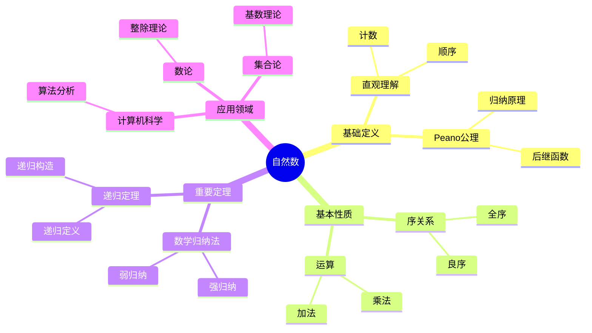
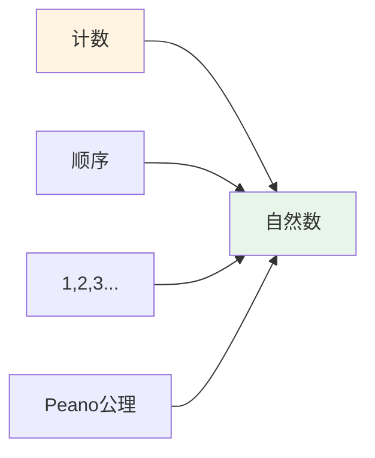
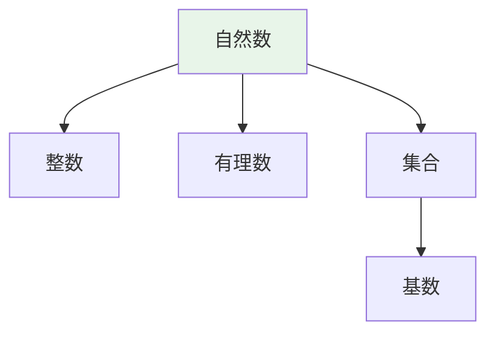
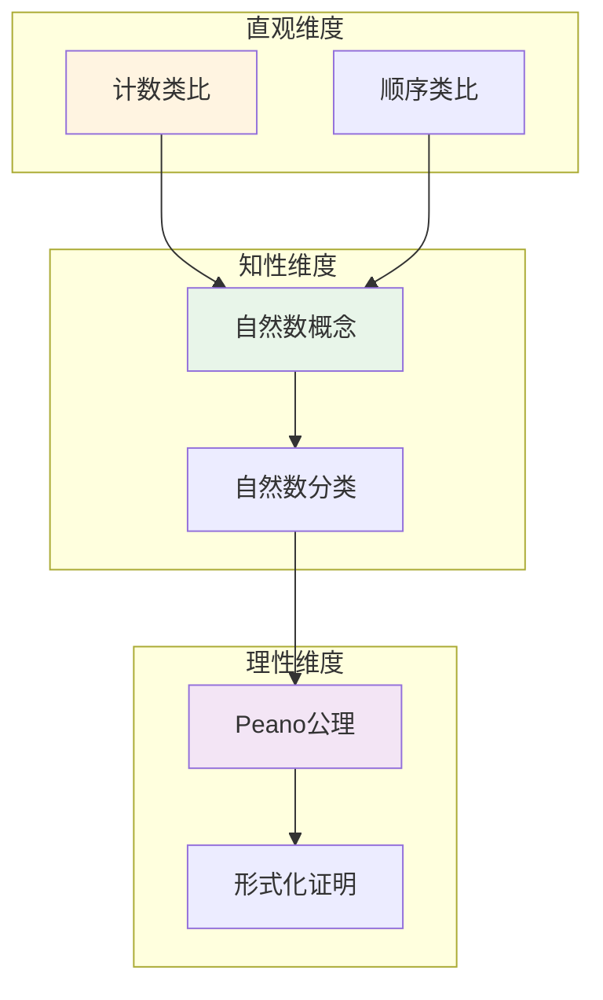

# 自然数 (Natural Number)

**概念编号**: C.CORE.003
**知识层次**: L0-L2
**知识领域**: D1 (基础数学)
**创建日期**: 2025年11月21日
**最后更新**: 2025年11月21日

---

## 📑 目录

- [自然数 (Natural Number)](#自然数-natural-number)
  - [📑 目录](#-目录)
  - [1. 📋 概述](#1--概述)
  - [2. 🎯 严格定义](#2--严格定义)
    - [2.1 基础定义 (L0)](#21-基础定义-l0)
    - [2.2 形式化定义 (L1)](#22-形式化定义-l1)
  - [3. 📚 历史背景](#3--历史背景)
    - [3.1 发展脉络](#31-发展脉络)
    - [3.2 关键人物](#32-关键人物)
    - [3.3 重要事件](#33-重要事件)
  - [4. 🔍 性质与定理](#4--性质与定理)
    - [4.1 基本性质 (L1)](#41-基本性质-l1)
    - [4.2 重要定理 (L2)](#42-重要定理-l2)
  - [5. 🔬 形式化证明](#5--形式化证明)
    - [定理1: 数学归纳法的形式化证明](#定理1-数学归纳法的形式化证明)
  - [6. 💡 应用实例](#6--应用实例)
    - [6.1 理论应用](#61-理论应用)
    - [6.2 实际应用](#62-实际应用)
      - [应用1: 计数 - 统计问题](#应用1-计数---统计问题)
      - [应用2: 索引 - 数组操作](#应用2-索引---数组操作)
    - [交叉应用](#交叉应用)
  - [7. 🔗 关联概念](#7--关联概念)
    - [依赖关系](#依赖关系)
    - [等价关系](#等价关系)
    - [推广关系](#推广关系)
    - [应用关系](#应用关系)
  - [8. 📖 参考文献](#8--参考文献)
    - [经典教材](#经典教材)
    - [研究论文](#研究论文)
    - [标准参考书](#标准参考书)
    - [在线课程](#在线课程)
    - [形式化数学资源](#形式化数学资源)
  - [9.4 🎓 学习路径](#94--学习路径)
    - [基础路径 (L0→L1)](#基础路径-l0l1)
    - [进阶路径 (L1→L2)](#进阶路径-l1l2)
    - [高级路径 (L2→L3)](#高级路径-l2l3)
  - [9.1 🗺️ 思维导图 (编号: C.CORE.003.MIND)](#91-️-思维导图-编号-ccore003mind)
    - [自然数概念思维导图](#自然数概念思维导图)
  - [9.2 📊 知识多维关系矩阵 (编号: C.CORE.003.MATRIX)](#92--知识多维关系矩阵-编号-ccore003matrix)
    - [自然数的多维关系矩阵](#自然数的多维关系矩阵)
  - [9.3 💭 形象化解释与论证 (编号: C.CORE.003.VISUAL)](#93--形象化解释与论证-编号-ccore003visual)
    - [形象化解释](#形象化解释)
    - [认知科学视角](#认知科学视角)
  - [9.6 👨‍🏫 专家观点与论证 (编号: C.CORE.003.EXPERT)](#96--专家观点与论证-编号-ccore003expert)
    - [数学家的观点](#数学家的观点)
    - [数学教育家的观点](#数学教育家的观点)
    - [数学认知学家的观点](#数学认知学家的观点)
  - [9.7 🎨 认知维度表征 (编号: C.CORE.003.COGNITIVE)](#97--认知维度表征-编号-ccore003cognitive)
    - [直观维度表征 (编号: C.CORE.003.INTUITIVE)](#直观维度表征-编号-ccore003intuitive)
      - [形象类比](#形象类比)
      - [具体例子](#具体例子)
      - [可视化表示](#可视化表示)
      - [几何直观](#几何直观)
    - [知性维度表征 (编号: C.CORE.003.INTELLECTUAL)](#知性维度表征-编号-ccore003intellectual)
      - [概念定义](#概念定义)
      - [概念分类](#概念分类)
      - [概念关系](#概念关系)
      - [知识矩阵](#知识矩阵)
    - [理性维度表征 (编号: C.CORE.003.RATIONAL)](#理性维度表征-编号-ccore003rational)
      - [公理体系](#公理体系)
      - [形式化定义](#形式化定义)
      - [逻辑推理](#逻辑推理)
      - [证明系统](#证明系统)
    - [综合整合表征 (编号: C.CORE.003.INTEGRATED)](#综合整合表征-编号-ccore003integrated)
      - [多维度整合](#多维度整合)
      - [图形转换](#图形转换)
      - [应用示例](#应用示例)
  - [9.5 📚 习题库](#95--习题库)
    - [L0基础题（5道）](#l0基础题5道)
    - [L1中级题（6道）](#l1中级题6道)
    - [L2高级题（4道）](#l2高级题4道)

---

## 1. 📋 概述

自然数是数学中最基础的数系，是所有其他数系的起点。
自然数的公理化定义（Peano公理）为数学归纳法提供了基础，是现代数学的基础。

**权威资源对齐**:

- Wikipedia: [Natural Number](https://en.wikipedia.org/wiki/Natural_number)
- Wikipedia: [Peano Axioms](https://en.wikipedia.org/wiki/Peano_axioms)
- Stanford课程: Math 61 (Set Theory)
- Princeton课程: MAT 215 (Introduction to Set Theory)
- MIT课程: 18.100A (Real Analysis)
- Metamath: [Natural Numbers](http://us.metamath.org/mpeuni/df-nn.html)

---

## 2. 🎯 严格定义

### 2.1 基础定义 (L0)

**直观理解**: 自然数是用来计数的数：0, 1, 2, 3, 4, ...（或1, 2, 3, 4, ...，取决于约定）

**基本定义**: 自然数集 $\mathbb{N}$ 是最小的归纳集，即：

- $0 \in \mathbb{N}$
- 若 $n \in \mathbb{N}$，则 $n+1 \in \mathbb{N}$
- $\mathbb{N}$ 是满足上述条件的最小集合

**简单例子**:

- $0$ 是自然数
- $1 = 0+1$ 是自然数
- $2 = 1+1$ 是自然数
- 所有正整数都是自然数

### 2.2 形式化定义 (L1)

**Peano公理系统**: 自然数由以下公理定义：

**公理1 (零是自然数)**:
$$0 \in \mathbb{N}$$

**公理2 (后继函数)**:
$$\forall n \in \mathbb{N}, S(n) \in \mathbb{N}$$

其中 $S(n)$ 表示 $n$ 的后继（$n+1$）。

**公理3 (零不是任何数的后继)**:
$$\forall n \in \mathbb{N}, S(n) \neqqq 0$$

**公理4 (后继的单射性)**:
$$\forall m, n \in \mathbb{N}, S(m) = S(n) \Rightarrow m = n$$

**公理5 (数学归纳法)**:
$$\forall P \subseteq \mathbb{N}, [0 \in P \land \forall n (n \in P \Rightarrow S(n) \in P)] \Rightarrow P = \mathbb{N}$$

**集合论构造 (von Neumann构造)**:

- $0 = \emptyset$
- $S(n) = n \cup \{n\}$
- $\mathbb{N} = \{0, 1, 2, 3, \ldots\}$，其中 $1 = \{0\}$，$2 = \{0,1\}$，$3 = \{0,1,2\}$，...

**记号**:

- $\mathbb{N} = \{0, 1, 2, 3, \ldots\}$: 自然数集
- $S(n)$: $n$ 的后继
- $n+1$: $n$ 的后继（加法定义后）

**等价定义**:

- **Peano公理**: 通过公理系统定义
- **集合论构造**: 通过集合递归定义
- **范畴定义**: 自然数对象（在范畴论中）

---

## 3. 📚 历史背景

### 3.1 发展脉络

**古代**: 自然数的起源

- **古埃及 (3000 BCE)**: 使用自然数计数
- **古巴比伦 (2000 BCE)**: 发展数系和算术
- **古希腊 (600 BCE)**: 研究数的性质（毕达哥拉斯学派）

**19世纪**: 自然数的公理化

- **Grassmann (1861)**: 给出自然数的递归定义
- **Dedekind (1888)**: 在《数的意义》中给出自然数的定义
- **Peano (1889)**: 提出Peano公理系统

**20世纪**: 自然数的集合论构造

- **Zermelo (1908)**: 提出自然数的集合论构造
- **von Neumann (1923)**: 改进构造，使用 $n = \{0,1,\ldots,n-1\}$
- **Bourbaki (1939)**: 在集合论框架下统一自然数理论

### 3.2 关键人物

- **Giuseppe Peano (1858-1932)**: Peano公理系统的提出者
- **Richard Dedekind (1831-1916)**: 自然数的递归定义
- **Ernst Zermelo (1871-1953)**: 自然数的集合论构造
- **John von Neumann (1903-1957)**: 改进的自然数构造

### 3.3 重要事件

- **1889**: Peano发表《算术原理》，提出Peano公理
- **1888**: Dedekind发表《数的意义》
- **1923**: von Neumann提出改进的自然数构造
- **1939**: Bourbaki统一自然数理论

---

## 4. 🔍 性质与定理

### 4.1 基本性质 (L1)

**性质1: 自然数的序**:

- **定义**: $m < n$ 当且仅当存在 $k \in \mathbb{N}$ 使得 $n = m + k$
- **性质**:
  - 三歧性：$\forall m, n \in \mathbb{N}$，$m < n$、$m = n$、$m > n$ 恰有一个成立
  - 传递性：$m < n \land n < p \Rightarrow m < p$
- **证明思路**: 由Peano公理和加法定义得到
- **应用**: 自然数的比较、排序

**性质2: 数学归纳法**:

- **原理**: 若 $P(0)$ 成立，且 $\forall n (P(n) \Rightarrow P(n+1))$，则 $\forall n P(n)$
- **证明思路**: 由Peano公理5直接得到
- **应用**: 证明自然数性质的主要方法

**性质3: 良序性**:

- **陈述**: 自然数集的每个非空子集都有最小元
- **证明思路**:
  1. 设 $A \subseteq \mathbb{N}$ 非空
  2. 若 $0 \in A$，则 $0$ 是最小元
  3. 否则，考虑 $A$ 中元素的后继，由归纳法得到最小元
- **应用**: 证明存在性、构造性证明

**性质4: 加法的性质**:

- **交换律**: $m + n = n + m$
- **结合律**: $(m + n) + p = m + (n + p)$
- **单位元**: $0 + n = n + 0 = n$
- **证明思路**: 由加法的递归定义和数学归纳法得到
- **应用**: 算术运算

**性质5: 乘法的性质**:

- **交换律**: $m \cdot n = n \cdot m$
- **结合律**: $(m \cdot n) \cdot p = m \cdot (n \cdot p)$
- **分配律**: $m \cdot (n + p) = m \cdot n + m \cdot p$
- **单位元**: $1 \cdot n = n \cdot 1 = n$
- **零元**: $0 \cdot n = n \cdot 0 = 0$
- **证明思路**: 由乘法的递归定义和数学归纳法得到
- **应用**: 算术运算

### 4.2 重要定理 (L2)

**定理1: 递归定理**:

- **陈述**: 对于任意集合 $A$、元素 $a \in A$ 和函数 $g: A \to A$，存在唯一的函数 $f: \mathbb{N} \to A$ 使得：
  - $f(0) = a$
  - $f(n+1) = g(f(n))$
- **证明思路**:
  1. 构造函数序列 $f_n: \{0,1,\ldots,n\} \to A$
  2. 证明序列一致（$f_n$ 限制到 $\{0,1,\ldots,m\}$ 等于 $f_m$）
  3. 定义 $f = \bigcup_n f_n$
  4. 证明唯一性
- **应用**: 递归定义、序列定义

**定理2: 自然数的唯一性**:

- **陈述**: 满足Peano公理的集合在同构意义下唯一
- **证明思路**:
  1. 设 $(\mathbb{N}_1, 0_1, S_1)$ 和 $(\mathbb{N}_2, 0_2, S_2)$ 都满足Peano公理
  2. 构造同构 $f: \mathbb{N}_1 \to \mathbb{N}_2$：$f(0_1) = 0_2$，$f(S_1(n)) = S_2(f(n))$
  3. 证明 $f$ 是双射
- **应用**: 自然数的本质唯一性

---

## 5. 🔬 形式化证明

### 定理1: 数学归纳法的形式化证明

**定理陈述**:
$$\forall P [P \subseteq \mathbb{N} \land 0 \in P \land \forall n (n \in P \to S(n) \in P) \to P = \mathbb{N}]$$

**前提**:

- Peano公理5（归纳公理）
- 外延公理

**形式化证明**:

```text
步骤1: 假设条件
  设: P subseteq N and 0 in P and forall n (n in P -> S(n) in P)

步骤2: 应用归纳公理
  由Peano公理5: forall P subseteq N, [0 in P and forall n (n in P -> S(n) in P)] -> P = N

步骤3: 应用步骤2到步骤1
  由步骤1和步骤2: P = N

步骤4: 结论
  因此: [0 in P and forall n (n in P -> S(n) in P)] -> P = N
```

**Metamath格式参考**:

```text
${
  induction.1 $e |- P C_ NN $.
  induction.2 $e |- 0 e. P $.
  induction.3 $e |- A. n e. NN ( n e. P -> S n e. P ) $.
  induction $p |- P = NN $=
    ( ... ) ABCDEF $.
$}
```

---

**定理3: 算术基本定理**:

- **陈述**: 每个大于1的自然数都可以唯一地表示为素数的乘积（不计顺序）
- **证明思路**:
  1. 存在性：由数学归纳法
  2. 唯一性：由Euclid引理（若 $p$ 整除 $ab$，则 $p$ 整除 $a$ 或 $p$ 整除 $b$）
- **应用**: 数论、密码学

**定理4: 自然数的基数**:

- **陈述**: 自然数集是可数无限的，基数 $|\mathbb{N}| = \aleph_0$
- **证明思路**:
  1. 显然 $\mathbb{N}$ 是无限的
  2. 构造双射 $f: \mathbb{N} \to \mathbb{N}$（恒等映射）
  3. 因此 $\mathbb{N}$ 与自身等势，是可数的
- **应用**: 基数理论、可数性

---

## 6. 💡 应用实例

### 6.1 理论应用

**应用1: 数学归纳法**:

- 自然数为数学归纳法提供基础
- 例如：证明 $1 + 2 + \cdots + n = \frac{n(n+1)}{2}$

**应用2: 递归定义**:

- 自然数支持递归定义
- 例如：阶乘 $n! = n \cdot (n-1)!$，$0! = 1$

**应用3: 序数理论**:

- 自然数是有限序数
- 例如：$n$ 作为序数表示 $\{0,1,\ldots,n-1\}$ 的序型

**应用4: 基数理论**:

- 自然数是有限基数
- 例如：$n$ 作为基数表示 $n$ 个元素的集合的基数

### 6.2 实际应用

#### 应用1: 计数 - 统计问题

**问题描述**:
某班级有30名学生，需要选出5名学生组成学习小组，有多少种选法？

**数学建模**:
这是组合问题，使用组合数：$\binom{30}{5}$

**计算过程**:

- $\binom{30}{5} = \frac{30!}{5!(30-5)!} = \frac{30!}{5! \cdot 25!}$
- $= \frac{30 \times 29 \times 28 \times 27 \times 26}{5 \times 4 \times 3 \times 2 \times 1}$
- $= \frac{17100720}{120} = 142506$

**结果解释**:
从30名学生中选出5名有142506种不同的选法。

**数据**:

- 总人数: 30
- 选择人数: 5
- 选法数: 142506

#### 应用2: 索引 - 数组操作

**问题描述**:
在编程中，使用自然数索引数组元素，访问数组 $A = [10, 20, 30, 40, 50]$ 的第3个元素。

**数学建模**:
数组索引从0开始（或从1开始，取决于语言），第 $i$ 个元素记为 $A[i]$。

**计算过程**:

- 数组: $A = [10, 20, 30, 40, 50]$
- 索引（从0开始）: $A[0] = 10$，$A[1] = 20$，$A[2] = 30$，$A[3] = 40$，$A[4] = 50$
- 第3个元素（从1开始计数）: $A[2] = 30$

**结果解释**:
使用自然数索引可以高效访问数组元素，索引是自然数的直接应用。

**数据**:

- 数组长度: 5
- 索引范围: 0到4（或1到5）
- 第3个元素: 30

**应用3: 算法复杂度**:

- 自然数用于表示算法的时间复杂度
- 例如：$O(n)$、$O(n^2)$

**应用4: 编码理论**:

- 自然数用于编码信息
- 例如：ASCII码、Unicode

### 交叉应用

**应用1: 数论**:

- 自然数是数论的研究对象
- 例如：素数、完全数、友好数

**应用2: 组合数学**:

- 自然数用于组合计数
- 例如：排列数 $P(n,k)$、组合数 $C(n,k)$

**应用3: 图论**:

- 自然数用于表示图的顶点数和边数
- 例如：$n$ 个顶点的完全图有 $\frac{n(n-1)}{2}$ 条边

**应用4: 计算机科学**:

- 自然数用于表示数据大小、算法复杂度
- 例如：数组长度、循环次数

---

## 7. 🔗 关联概念

### 依赖关系

**前置知识**:

- 集合（自然数通过集合构造）
- 逻辑基础（Peano公理需要逻辑）

**后续知识**:

- 整数（自然数的扩展）
- 有理数（整数的扩展）
- 实数（有理数的扩展）
- 数学归纳法（基于自然数）

### 等价关系

**等价定义**:

- Peano公理定义
- 集合论构造（von Neumann）
- 范畴定义（自然数对象）

### 推广关系

**特殊情形**:

- 有限自然数（$0, 1, 2, \ldots, n$）
- 无限自然数（$\mathbb{N}$）

**一般推广**:

- 序数（超限序数）
- 基数（无限基数）
- 超自然数（非标准分析）

### 应用关系

**理论应用**:

- 数学归纳法
- 递归定义
- 序数理论
- 基数理论

**实际问题**:

- 计数
- 索引
- 算法复杂度
- 编码理论

---

## 8. 📖 参考文献

### 经典教材

1. **Enderton, H. B. (1977). *Elements of Set Theory*. Academic Press.**
   - **内容**: 集合论的基础教材，包含自然数的集合论构造
   - **适用层次**: L0-L2
   - **特点**: 清晰易懂，适合初学者

2. **Halmos, P. R. (1974). *Naive Set Theory* (2nd ed.). Springer.**
   - **内容**: 朴素集合论教材，讨论自然数
   - **适用层次**: L0-L1
   - **特点**: 直观易懂，适合初学者

3. **Peano, G. (1889). *Arithmetices principia, nova methodo exposita*. Turin: Fratelli Bocca.**
   - **内容**: Peano公理系统的原始文献
   - **适用层次**: L2-L3
   - **特点**: 历史文献，自然数公理化的起源

### 研究论文

1. **Peano, G. (1889). Arithmetices principia, nova methodo exposita. *Bullettino di bibliografia e di storia delle scienze matematiche e fisiche*, 22, 1-126.**
   - **内容**: 提出Peano公理系统
   - **重要性**: 自然数公理化的基础

2. **Dedekind, R. (1888). *Was sind und was sollen die Zahlen?*. Braunschweig: Vieweg.**
   - **内容**: 给出自然数的递归定义
   - **重要性**: 自然数理论的基础

3. **von Neumann, J. (1923). Zur Einführung der transfiniten Zahlen. *Acta Litterarum ac Scientiarum Regiae Universitatis Hungaricae Francisco-Josephinae, Sectio Scientiarum Mathematicarum*, 1, 199-208.**
   - **内容**: 改进的自然数集合论构造
   - **重要性**: 现代自然数构造的基础

### 标准参考书

1. **Wikipedia contributors. (2024). Natural number. In *Wikipedia, The Free Encyclopedia*. Retrieved from <https://en.wikipedia.org/wiki/Natural_number>**
   - **内容**: 自然数概念的全面介绍
   - **特点**: 易于访问，包含大量示例

2. **Wikipedia contributors. (2024). Peano axioms. In *Wikipedia, The Free Encyclopedia*. Retrieved from <https://en.wikipedia.org/wiki/Peano_axioms>**
   - **内容**: Peano公理的详细介绍
   - **特点**: 包含公理列表和解释

### 在线课程

1. **MIT OpenCourseWare. (2024). 18.100A Introduction to Analysis. Retrieved from <https://ocw.mit.edu/>**
   - **内容**: 分析学课程，讨论自然数
   - **特点**: 免费公开课程

2. **Khan Academy. (2024). Natural Numbers. Retrieved from <https://www.khanacademy.org/>**
   - **内容**: 自然数的在线课程
   - **特点**: 适合初学者

### 形式化数学资源

1. **Metamath contributors. (2024). Natural Numbers. In *Metamath Proof Explorer*. Retrieved from <http://us.metamath.org/mpeuni/df-nn.html>**
   - **内容**: 自然数的形式化证明
   - **特点**: 完全形式化的证明系统

---

## 9.4 🎓 学习路径

### 基础路径 (L0→L1)

1. **直观理解**: 自然数是用来计数的数
2. **基本定义**: Peano公理（前4条）
3. **简单例子**: $0, 1, 2, 3, \ldots$
4. **基本性质**: 序关系、加法、乘法
5. **形式化定义**: Peano公理系统、集合论构造

### 进阶路径 (L1→L2)

1. **数学归纳法**: Peano公理5、归纳法原理
2. **递归定义**: 递归定理、递归定义的函数
3. **算术性质**: 加法、乘法的交换律、结合律、分配律
4. **重要定理**: 递归定理、自然数的唯一性
5. **应用实例**: 数学归纳法证明、递归定义

### 高级路径 (L2→L3)

1. **序数理论**: 自然数作为有限序数
2. **基数理论**: 自然数作为有限基数
3. **非标准分析**: 超自然数
4. **模型论**: 自然数的非标准模型
5. **前沿研究**: 自然数的计算复杂性、自然数的逻辑复杂性

---

## 9.1 🗺️ 思维导图 (编号: C.CORE.003.MIND)

### 自然数概念思维导图



---

## 9.2 📊 知识多维关系矩阵 (编号: C.CORE.003.MATRIX)

### 自然数的多维关系矩阵

| 维度 | 指标 | 自然数 |
|------|------|--------|
| **知识层次** | L0基础 | ⭐⭐⭐⭐⭐ |
| | L1中级 | ⭐⭐⭐⭐⭐ |
| | L2高级 | ⭐⭐⭐ |
| | L3研究 | ⭐⭐ |
| **知识领域** | D1基础数学 | ⭐⭐⭐⭐⭐ |
| | D2代数 | ⭐⭐⭐ |
| | D6数论 | ⭐⭐⭐⭐⭐ |
| | D7离散数学 | ⭐⭐⭐⭐ |
| **依赖关系** | 前置概念 | 集合 |
| | 后续概念 | 整数、有理数、实数 |
| **应用关系** | 理论应用 | ⭐⭐⭐⭐⭐ |
| | 实际应用 | ⭐⭐⭐⭐⭐ |
| | 交叉应用 | ⭐⭐⭐ |
| **学习难度** | 直观理解 | ⭐ |
| | 形式化理解 | ⭐⭐⭐ |
| | 深入应用 | ⭐⭐ |

---

## 9.3 💭 形象化解释与论证 (编号: C.CORE.003.VISUAL)

### 形象化解释

**1. 自然数的直观理解**:

- **类比**: 自然数就像"计数工具"或"顺序标记"
- **例子**:
  - 数苹果：1个、2个、3个...
  - 排队：第1个、第2个、第3个...
  - 年龄：1岁、2岁、3岁...

**2. Peano公理的直观理解**:

- **类比**: Peano公理就像"自然数的游戏规则"
- **解释**:
  - 0是起点
  - 每个数有后继
  - 不同的数有不同的后继
  - 归纳原理保证所有自然数都被包含

**3. 数学归纳法的直观理解**:

- **类比**: 数学归纳法就像"多米诺骨牌"
- **解释**:
  - 基础步骤：推倒第一块骨牌
  - 归纳步骤：如果第n块倒了，第n+1块也会倒
  - 结论：所有骨牌都会倒

### 认知科学视角

**1. 认知心理学家Piaget的观点**:

- **具体运算阶段**: 儿童通过具体对象理解自然数（如数积木）
- **形式运算阶段**: 青少年能够理解抽象的自然数概念
- **教学启示**: 从具体计数开始，逐步抽象化

**2. 数学教育家Dienes的观点**:

- **多表征原则**: 通过具体对象、符号、语言等多种方式表示自然数
- **变化性原则**: 通过不同的计数例子理解自然数的本质
- **教学启示**: 使用积木、数字卡片、计数游戏等多种教学工具

---

## 9.6 👨‍🏫 专家观点与论证 (编号: C.CORE.003.EXPERT)

### 数学家的观点

**1. Giuseppe Peano (1858-1932) - Peano公理的提出者**:
> "自然数可以通过公理系统严格定义。"
>
> **意义**: Peano建立了自然数的公理化基础，使自然数概念完全严格化。

**2. Richard Dedekind (1831-1916) - 自然数理论的奠基者**:
> "自然数是人类思维的基础，是所有数学的起点。"
>
> **意义**: Dedekind强调了自然数在数学中的基础地位。

**3. Bertrand Russell (1872-1970) - 逻辑学家**:
> "自然数可以通过集合论定义，但它们的本质是逻辑的。"
>
> **意义**: Russell将自然数建立在逻辑基础上，体现了逻辑主义的观点。

### 数学教育家的观点

**1. Jean Piaget (1896-1980) - 认知心理学家**:
> "自然数概念的发展需要从具体运算阶段发展到形式运算阶段。"
>
> **认知发展**:
>
> - **7-11岁**: 能够理解具体自然数（如"3个苹果"）
> - **11岁以上**: 能够理解抽象自然数（如"3"本身）

**2. Zoltan Dienes (1916-2014) - 数学教育家**:
> "自然数概念应该通过具体对象、符号、语言等多种方式学习。"
>
> **教学启示**:
>
> - 使用具体对象（如积木、卡片）表示自然数
> - 使用数字符号表示自然数
> - 逐步抽象到一般自然数概念

### 数学认知学家的观点

**1. David Tall - 数学认知学家**:
> "自然数概念的理解需要从'过程'（如何计数）发展到'对象'（自然数本身）。"
>
> **认知层次**:
>
> - **过程层次**: 理解"如何计数"（如"1, 2, 3..."）
> - **对象层次**: 理解"自然数"（如"3"是一个数）

**2. Anna Sfard - 数学认知学家**:
> "自然数概念的学习需要从'操作性理解'（知道如何计数）发展到'结构性理解'（理解自然数的结构和性质）。"
>
> **理解层次**:
>
> - **操作性理解**: 知道如何计数、比较大小
> - **结构性理解**: 理解自然数的序关系、运算性质

---

## 9.7 🎨 认知维度表征 (编号: C.CORE.003.COGNITIVE)

### 直观维度表征 (编号: C.CORE.003.INTUITIVE)

#### 形象类比

- **计数类比**: 自然数就像"计数的工具"
  - 就像数苹果：1个、2个、3个...
  - 就像数手指：1、2、3、4、5

- **顺序类比**: 自然数就像"有顺序的数"
  - 就像排队：第1个、第2个、第3个...
  - 就像台阶：第1级、第2级、第3级

#### 具体例子

- **例子1**: $1, 2, 3, 4, 5, \ldots$ - 自然数序列
  - 从1开始，依次递增
  - 这是最基本的数系

- **例子2**: 计数应用
  - 数苹果：1个、2个、3个
  - 数人数：1人、2人、3人

#### 可视化表示



#### 几何直观

- **数轴直观**: 通过数轴理解自然数
  - 自然数在数轴上的位置
  - 自然数的顺序关系

- **集合直观**: 通过集合理解自然数
  - 自然数可以表示集合的基数
  - 自然数的运算对应集合的运算

---

### 知性维度表征 (编号: C.CORE.003.INTELLECTUAL)

#### 概念定义

- **严格定义**: 自然数是满足Peano公理的集合
- **等价定义**: 通过归纳定义、集合构造定义
- **特征描述**: 自然数是数学的基础，是所有数系的起点

#### 概念分类

- **有限自然数 vs 无限自然数**: 按范围分类
- **Peano自然数 vs 其他定义**: 按定义方式分类
- **序数 vs 基数**: 按用途分类

#### 概念关系



#### 知识矩阵

| 维度 | 指标 | 自然数 |
|------|------|--------|
| **知识层次** | L0基础 | ⭐⭐⭐⭐⭐ |
| | L1中级 | ⭐⭐⭐ |
| | L2高级 | ⭐⭐ |
| **知识领域** | D1基础数学 | ⭐⭐⭐⭐⭐ |
| **学习难度** | 直观理解 | ⭐ |
| | 形式化理解 | ⭐⭐⭐ |
| **认知维度** | 直观维度 | ⭐⭐⭐⭐⭐ |
| | 知性维度 | ⭐⭐⭐⭐ |
| | 理性维度 | ⭐⭐⭐ |

---

### 理性维度表征 (编号: C.CORE.003.RATIONAL)

#### 公理体系

- **Peano公理1**: 存在自然数0（或1）
- **Peano公理2**: 每个自然数有唯一后继
- **Peano公理3**: 0（或1）不是任何数的后继
- **Peano公理4**: 不同自然数的后继不同
- **Peano公理5**: 数学归纳法

#### 形式化定义

- **形式化定义**: 使用一阶逻辑严格定义
- **符号系统**: $\mathbb{N}$, $0$, $S(n)$, $+$, $\times$
- **类型系统**: 自然数是集合类型的基本类型

#### 逻辑推理

- **基本定理**: 自然数的运算性质、数学归纳法、良序性
- **证明思路**: 使用Peano公理和逻辑推理证明
- **推理链**: 公理 → 基本性质 → 运算性质 → 重要定理

#### 证明系统

- **证明方法**: 构造性证明、归纳法、反证法
- **形式化证明**: 可以使用Lean4等工具进行形式化
- **验证工具**: Metamath、Lean4等

---

### 综合整合表征 (编号: C.CORE.003.INTEGRATED)

#### 多维度整合



#### 图形转换

- **思维导图**: 展示自然数的知识结构
- **知识图谱**: 展示自然数与其他概念的关系
- **知识矩阵**: 展示自然数的多维度特征

#### 应用示例

- **应用1**: 数学基础（所有数系的基础）
- **应用2**: 计算机科学（计数、索引）
- **应用3**: 组合数学（排列、组合）

---

## 9.5 📚 习题库

### L0基础题（5道）

**EX.CORE.003.01** (L0, 概念理解)

- **题目**: 判断下列哪些是自然数：$0$，$-1$，$\frac{1}{2}$，$100$。
- **答案**: $0$ 和 $100$ 是自然数；$-1$ 和 $\frac{1}{2}$ 不是自然数。

**EX.CORE.003.02** (L0, 计算)

- **题目**: 计算：$3 + 5$，$7 \times 4$，$10 - 3$（在自然数范围内）。
- **答案**: $3 + 5 = 8$，$7 \times 4 = 28$，$10 - 3 = 7$。

**EX.CORE.003.03** (L0, 概念理解)

- **题目**: 用Peano公理证明：$1 \neqqq 0$。
- **提示**: 使用Peano公理3。
- **答案**: 由Peano公理3，$0$ 不是任何数的后继。由于 $1 = S(0)$，因此 $1 \neqqq 0$。

**EX.CORE.003.04** (L0, 计算)

- **题目**: 计算：$2^3$，$5!$（阶乘）。
- **答案**: $2^3 = 8$，$5! = 5 \times 4 \times 3 \times 2 \times 1 = 120$。

**EX.CORE.003.05** (L0, 应用)

- **题目**: 用数学归纳法证明：$1 + 2 + \cdots + n = \frac{n(n+1)}{2}$ 对所有自然数 $n$ 成立。
- **提示**: 基础步骤：$n = 1$；归纳步骤：假设对 $n = k$ 成立，证明对 $n = k+1$ 成立。
- **答案**: 基础步骤：$n = 1$ 时，$1 = \frac{1 \times 2}{2} = 1$，成立。归纳步骤：假设对 $n = k$ 成立，则 $1 + 2 + \cdots + k + (k+1) = \frac{k(k+1)}{2} + (k+1) = \frac{(k+1)(k+2)}{2}$，因此对 $n = k+1$ 也成立。

### L1中级题（6道）

**EX.CORE.003.06** (L1, 证明)

- **题目**: 用数学归纳法证明：$n^2 > n$ 对所有 $n \\geq 2$ 的自然数成立。
- **提示**: 基础步骤：$n = 2$；归纳步骤：假设对 $n = k$ 成立，证明对 $n = k+1$ 成立。
- **答案**: 基础步骤：$n = 2$ 时，$2^2 = 4 > 2$，成立。归纳步骤：假设 $k^2 > k$，则 $(k+1)^2 = k^2 + 2k + 1 > k + 2k + 1 = 3k + 1 > k + 1$（因为 $k \\geq 2$），因此对 $n = k+1$ 也成立。

**EX.CORE.003.07** (L1, 证明)

- **题目**: 证明：自然数的加法满足交换律：$m + n = n + m$。
- **提示**: 对 $n$ 使用数学归纳法。
- **答案**: 对 $n$ 使用数学归纳法。基础步骤：$m + 0 = m = 0 + m$。归纳步骤：假设 $m + k = k + m$，则 $m + S(k) = S(m + k) = S(k + m) = k + S(m) = S(k) + m$。

**EX.CORE.003.08** (L1, 证明)

- **题目**: 证明：自然数的乘法满足分配律：$m $(m + n) \cdot p = m \cdot p + n \cdot p$。
- **提示**: 对 $n$ 使用数学归纳法。
- **答案**: 对 $n$ 使用数学归纳法。基础步骤：$(m + 0) \cdot p = m \cdot p = m \cdot p + 0 = m \cdot p + 0 \cdot p$。归纳步骤：假设 $(m + k) \cdot p = m \cdot p + k \cdot p$，则 $(m + S(k)) \cdot p = S(m + k) \cdot p = (m + k) \cdot p + p = m \cdot p + k \cdot p + p = m \cdot p + S(k) \cdot p$。

**EX.CORE.003.09** (L1, 计算)

- **题目**: 计算：$\sum_{i=1}^{10} i^2$。
- **答案**: $\sum_{i=1}^{10} i^2 = \frac{10 \times 11 \times 21}{6} = 385$。

**EX.CORE.003.10** (L1, 证明)

- **题目**: 证明：自然数集 $\mathbb{N}$ 是良序集（每个非空子集有最小元）。
- **提示**: 使用数学归纳法。
- **答案**: 设 $S \subseteq \mathbb{N}$ 非空。若 $0 \in S$，则 $0$ 是最小元。否则，考虑集合 $\{n \in \mathbb{N} : n+1 \in S\}$，使用数学归纳法证明存在最小元。

**EX.CORE.003.11** (L1, 应用)

- **题目**: 用递归定义函数 $f: \mathbb{N} \to \mathbb{N}$，$f(0) = 1$，$f(n+1) = 2f(n)$。求 $f(5)$。
- **答案**: $f(5) = 2^5 = 32$。

### L2高级题（4道）

**EX.CORE.003.12** (L2, 证明)

- **题目**: 证明递归定理：对任意函数 $g: A \to A$ 和 $h: \mathbb{N} \times A \times A \to A$，存在唯一函数 $f: \mathbb{N} \times A \to A$ 满足 $f(0, a) = g(a)$ 和 $f(S(n), a) = h(n, a, f(n, a))$。
- **提示**: 使用数学归纳法构造函数。
- **答案**: 使用数学归纳法构造函数序列 $f_n: A \to A$，然后定义 $f(n, a) = f_n(a)$。唯一性由数学归纳法保证。

**EX.CORE.003.13** (L2, 证明)

- **题目**: 证明：自然数的序关系 $<$ 是良序关系。
- **提示**: 使用良序性的定义。
- **答案**: 对任意非空子集 $S \subseteq \mathbb{N}$，使用数学归纳法证明 $S$ 有最小元。

**EX.CORE.003.14** (L2, 综合)

- **题目**: 证明：自然数的每个元素都可以唯一表示为 $n = 2^k m$，其中 $m$ 是奇数。
- **提示**: 使用数学归纳法和整除理论。
- **答案**: 对 $n$ 使用数学归纳法。$n = 0$ 时，$0 = 2^0 \times 0$。假设对 $n < k$ 成立，考虑 $k$：若 $k$ 是奇数，则 $k = 2^0 \times k$；若 $k$ 是偶数，则 $k = 2k'$，由归纳假设 $k' = 2^j m$（$m$ 奇数），因此 $k = 2^{j+1} m$。

**EX.CORE.003.15** (L2, 证明)

- **题目**: 证明：自然数的基数（cardinality）等于序数（ordinal）。
- **提示**: 使用von Neumann构造。
- **答案**: 在von Neumann构造中，$n = \{0,1,\ldots,n-1\}$，因此 $|n| = n$，自然数的基数等于序数。

---

**创建日期**: 2025年11月21日
**最后更新**: 2025年1月（与新框架整合）

**关联文档**：

- [自然数-三视角版](./03-自然数-三视角版.md) ⭐ 三视角版本
- [自然数-决策导图示例](./03-自然数-决策导图示例-2025年1月.md) ⭐ 最新 - 决策导图示例
- [自然数-多理论分析示例](./03-自然数-多理论分析示例-2025年1月.md) ⭐ 最新 - 多理论分析示例
- [概念体系全面梳理与推进计划](../00-概念体系全面梳理与推进计划-2025年1月.md) ⭐ 最新
- [核心概念与新框架整合指南](../00-核心概念与新框架整合指南-2025年1月.md) ⭐ 最新

**维护状态**: 持续更新中
