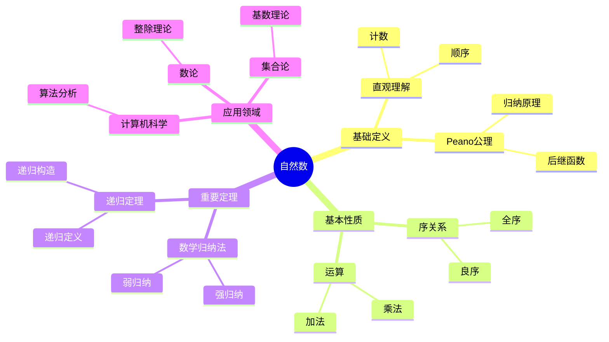

# 自然数 (Natural Number)

**概念编号**: C.CORE.003
**知识层次**: L0-L2
**知识领域**: D1 (基础数学)
**创建日期**: 2025年11月21日
**最后更新**: 2025年11月21日

---

## 📋 概述

自然数是数学中最基础的数系，是所有其他数系的起点。自然数的公理化定义（Peano公理）为数学归纳法提供了基础，是现代数学的基础。

**权威资源对齐**:

- Wikipedia: [Natural Number](https://en.wikipedia.org/wiki/Natural_number)
- Wikipedia: [Peano Axioms](https://en.wikipedia.org/wiki/Peano_axioms)
- Stanford课程: Math 61 (Set Theory)
- Princeton课程: MAT 215 (Introduction to Set Theory)
- MIT课程: 18.100A (Real Analysis)
- Metamath: [Natural Numbers](http://us.metamath.org/mpeuni/df-nn.html)

---

## 🎯 严格定义

### 基础定义 (L0)

**直观理解**: 自然数是用来计数的数：0, 1, 2, 3, 4, ...（或1, 2, 3, 4, ...，取决于约定）

**基本定义**: 自然数集 $\mathbb{N}$ 是最小的归纳集，即：

- $0 \in \mathbb{N}$
- 若 $n \in \mathbb{N}$，则 $n+1 \in \mathbb{N}$
- $\mathbb{N}$ 是满足上述条件的最小集合

**简单例子**:

- $0$ 是自然数
- $1 = 0+1$ 是自然数
- $2 = 1+1$ 是自然数
- 所有正整数都是自然数

### 形式化定义 (L1)

**Peano公理系统**: 自然数由以下公理定义：

**公理1 (零是自然数)**:
$$0 \in \mathbb{N}$$

**公理2 (后继函数)**:
$$\forall n \in \mathbb{N}, S(n) \in \mathbb{N}$$

其中 $S(n)$ 表示 $n$ 的后继（$n+1$）。

**公理3 (零不是任何数的后继)**:
$$\forall n \in \mathbb{N}, S(n) \neq 0$$

**公理4 (后继的单射性)**:
$$\forall m, n \in \mathbb{N}, S(m) = S(n) \Rightarrow m = n$$

**公理5 (数学归纳法)**:
$$\forall P \subseteq \mathbb{N}, [0 \in P \land \forall n (n \in P \Rightarrow S(n) \in P)] \Rightarrow P = \mathbb{N}$$

**集合论构造 (von Neumann构造)**:

- $0 = \emptyset$
- $S(n) = n \cup \{n\}$
- $\mathbb{N} = \{0, 1, 2, 3, \ldots\}$，其中 $1 = \{0\}$，$2 = \{0,1\}$，$3 = \{0,1,2\}$，...

**记号**:

- $\mathbb{N} = \{0, 1, 2, 3, \ldots\}$: 自然数集
- $S(n)$: $n$ 的后继
- $n+1$: $n$ 的后继（加法定义后）

**等价定义**:

- **Peano公理**: 通过公理系统定义
- **集合论构造**: 通过集合递归定义
- **范畴定义**: 自然数对象（在范畴论中）

---

## 📚 历史背景

### 发展脉络

**古代**: 自然数的起源

- **古埃及 (3000 BCE)**: 使用自然数计数
- **古巴比伦 (2000 BCE)**: 发展数系和算术
- **古希腊 (600 BCE)**: 研究数的性质（毕达哥拉斯学派）

**19世纪**: 自然数的公理化

- **Grassmann (1861)**: 给出自然数的递归定义
- **Dedekind (1888)**: 在《数的意义》中给出自然数的定义
- **Peano (1889)**: 提出Peano公理系统

**20世纪**: 自然数的集合论构造

- **Zermelo (1908)**: 提出自然数的集合论构造
- **von Neumann (1923)**: 改进构造，使用 $n = \{0,1,\ldots,n-1\}$
- **Bourbaki (1939)**: 在集合论框架下统一自然数理论

### 关键人物

- **Giuseppe Peano (1858-1932)**: Peano公理系统的提出者
- **Richard Dedekind (1831-1916)**: 自然数的递归定义
- **Ernst Zermelo (1871-1953)**: 自然数的集合论构造
- **John von Neumann (1903-1957)**: 改进的自然数构造

### 重要事件

- **1889**: Peano发表《算术原理》，提出Peano公理
- **1888**: Dedekind发表《数的意义》
- **1923**: von Neumann提出改进的自然数构造
- **1939**: Bourbaki统一自然数理论

---

## 🔍 性质与定理

### 基本性质 (L1)

**性质1: 自然数的序**:

- **定义**: $m < n$ 当且仅当存在 $k \in \mathbb{N}$ 使得 $n = m + k$
- **性质**:
  - 三歧性：$\forall m, n \in \mathbb{N}$，$m < n$、$m = n$、$m > n$ 恰有一个成立
  - 传递性：$m < n \land n < p \Rightarrow m < p$
- **证明思路**: 由Peano公理和加法定义得到
- **应用**: 自然数的比较、排序

**性质2: 数学归纳法**:

- **原理**: 若 $P(0)$ 成立，且 $\forall n (P(n) \Rightarrow P(n+1))$，则 $\forall n P(n)$
- **证明思路**: 由Peano公理5直接得到
- **应用**: 证明自然数性质的主要方法

**性质3: 良序性**:

- **陈述**: 自然数集的每个非空子集都有最小元
- **证明思路**:
  1. 设 $A \subseteq \mathbb{N}$ 非空
  2. 若 $0 \in A$，则 $0$ 是最小元
  3. 否则，考虑 $A$ 中元素的后继，由归纳法得到最小元
- **应用**: 证明存在性、构造性证明

**性质4: 加法的性质**:

- **交换律**: $m + n = n + m$
- **结合律**: $(m + n) + p = m + (n + p)$
- **单位元**: $0 + n = n + 0 = n$
- **证明思路**: 由加法的递归定义和数学归纳法得到
- **应用**: 算术运算

**性质5: 乘法的性质**:

- **交换律**: $m \cdot n = n \cdot m$
- **结合律**: $(m \cdot n) \cdot p = m \cdot (n \cdot p)$
- **分配律**: $m \cdot (n + p) = m \cdot n + m \cdot p$
- **单位元**: $1 \cdot n = n \cdot 1 = n$
- **零元**: $0 \cdot n = n \cdot 0 = 0$
- **证明思路**: 由乘法的递归定义和数学归纳法得到
- **应用**: 算术运算

### 重要定理 (L2)

**定理1: 递归定理**:

- **陈述**: 对于任意集合 $A$、元素 $a \in A$ 和函数 $g: A \to A$，存在唯一的函数 $f: \mathbb{N} \to A$ 使得：
  - $f(0) = a$
  - $f(n+1) = g(f(n))$
- **证明思路**:
  1. 构造函数序列 $f_n: \{0,1,\ldots,n\} \to A$
  2. 证明序列一致（$f_n$ 限制到 $\{0,1,\ldots,m\}$ 等于 $f_m$）
  3. 定义 $f = \bigcup_n f_n$
  4. 证明唯一性
- **应用**: 递归定义、序列定义

**定理2: 自然数的唯一性**:

- **陈述**: 满足Peano公理的集合在同构意义下唯一
- **证明思路**:
  1. 设 $(\mathbb{N}_1, 0_1, S_1)$ 和 $(\mathbb{N}_2, 0_2, S_2)$ 都满足Peano公理
  2. 构造同构 $f: \mathbb{N}_1 \to \mathbb{N}_2$：$f(0_1) = 0_2$，$f(S_1(n)) = S_2(f(n))$
  3. 证明 $f$ 是双射
- **应用**: 自然数的本质唯一性

**定理3: 算术基本定理**:

- **陈述**: 每个大于1的自然数都可以唯一地表示为素数的乘积（不计顺序）
- **证明思路**:
  1. 存在性：由数学归纳法
  2. 唯一性：由Euclid引理（若 $p$ 整除 $ab$，则 $p$ 整除 $a$ 或 $p$ 整除 $b$）
- **应用**: 数论、密码学

**定理4: 自然数的基数**:

- **陈述**: 自然数集是可数无限的，基数 $|\mathbb{N}| = \aleph_0$
- **证明思路**:
  1. 显然 $\mathbb{N}$ 是无限的
  2. 构造双射 $f: \mathbb{N} \to \mathbb{N}$（恒等映射）
  3. 因此 $\mathbb{N}$ 与自身等势，是可数的
- **应用**: 基数理论、可数性

---

## 💡 应用实例

### 理论应用

**应用1: 数学归纳法**:

- 自然数为数学归纳法提供基础
- 例如：证明 $1 + 2 + \cdots + n = \frac{n(n+1)}{2}$

**应用2: 递归定义**:

- 自然数支持递归定义
- 例如：阶乘 $n! = n \cdot (n-1)!$，$0! = 1$

**应用3: 序数理论**:

- 自然数是有限序数
- 例如：$n$ 作为序数表示 $\{0,1,\ldots,n-1\}$ 的序型

**应用4: 基数理论**:

- 自然数是有限基数
- 例如：$n$ 作为基数表示 $n$ 个元素的集合的基数

### 实际应用

**应用1: 计数**:

- 自然数用于计数对象
- 例如：统计人数、物品数量

**应用2: 索引**:

- 自然数用于索引序列
- 例如：数组索引、列表索引

**应用3: 算法复杂度**:

- 自然数用于表示算法的时间复杂度
- 例如：$O(n)$、$O(n^2)$

**应用4: 编码理论**:

- 自然数用于编码信息
- 例如：ASCII码、Unicode

### 交叉应用

**应用1: 数论**:

- 自然数是数论的研究对象
- 例如：素数、完全数、友好数

**应用2: 组合数学**:

- 自然数用于组合计数
- 例如：排列数 $P(n,k)$、组合数 $C(n,k)$

**应用3: 图论**:

- 自然数用于表示图的顶点数和边数
- 例如：$n$ 个顶点的完全图有 $\frac{n(n-1)}{2}$ 条边

**应用4: 计算机科学**:

- 自然数用于表示数据大小、算法复杂度
- 例如：数组长度、循环次数

---

## 🔗 关联概念

### 依赖关系

**前置知识**:

- 集合（自然数通过集合构造）
- 逻辑基础（Peano公理需要逻辑）

**后续知识**:

- 整数（自然数的扩展）
- 有理数（整数的扩展）
- 实数（有理数的扩展）
- 数学归纳法（基于自然数）

### 等价关系

**等价定义**:

- Peano公理定义
- 集合论构造（von Neumann）
- 范畴定义（自然数对象）

### 推广关系

**特殊情形**:

- 有限自然数（$0, 1, 2, \ldots, n$）
- 无限自然数（$\mathbb{N}$）

**一般推广**:

- 序数（超限序数）
- 基数（无限基数）
- 超自然数（非标准分析）

### 应用关系

**理论应用**:

- 数学归纳法
- 递归定义
- 序数理论
- 基数理论

**实际问题**:

- 计数
- 索引
- 算法复杂度
- 编码理论

---

## 📖 参考文献

### 权威资源

- Wikipedia: [Natural Number](https://en.wikipedia.org/wiki/Natural_number)
- Wikipedia: [Peano Axioms](https://en.wikipedia.org/wiki/Peano_axioms)
- Metamath: [Natural Numbers](http://us.metamath.org/mpeuni/df-nn.html)

### 经典教材

- Peano, G. (1889). *Arithmetices principia, nova methodo exposita*. Turin.
- Dedekind, R. (1888). *Was sind und was sollen die Zahlen?*. Vieweg.
- Enderton, H. B. (1977). *Elements of Set Theory*. Academic Press.
- Halmos, P. R. (1974). *Naive Set Theory*. Springer.

### 研究论文

- von Neumann, J. (1923). "Zur Einführung der transfiniten Zahlen". *Acta Litterarum ac Scientiarum*.
- Zermelo, E. (1908). "Untersuchungen über die Grundlagen der Mengenlehre I". *Mathematische Annalen*.

---

## 🎓 学习路径

### 基础路径 (L0→L1)

1. **直观理解**: 自然数是用来计数的数
2. **基本定义**: Peano公理（前4条）
3. **简单例子**: $0, 1, 2, 3, \ldots$
4. **基本性质**: 序关系、加法、乘法
5. **形式化定义**: Peano公理系统、集合论构造

### 进阶路径 (L1→L2)

1. **数学归纳法**: Peano公理5、归纳法原理
2. **递归定义**: 递归定理、递归定义的函数
3. **算术性质**: 加法、乘法的交换律、结合律、分配律
4. **重要定理**: 递归定理、自然数的唯一性
5. **应用实例**: 数学归纳法证明、递归定义

### 高级路径 (L2→L3)

1. **序数理论**: 自然数作为有限序数
2. **基数理论**: 自然数作为有限基数
3. **非标准分析**: 超自然数
4. **模型论**: 自然数的非标准模型
5. **前沿研究**: 自然数的计算复杂性、自然数的逻辑复杂性

---

## 🗺️ 思维导图 (编号: C.CORE.003.MIND)

### 自然数概念思维导图

---

## 📊 知识多维关系矩阵 (编号: C.CORE.003.MATRIX)

### 自然数的多维关系矩阵

| 维度 | 指标 | 自然数 |
|------|------|--------|
| **知识层次** | L0基础 | ⭐⭐⭐⭐⭐ |
| | L1中级 | ⭐⭐⭐⭐⭐ |
| | L2高级 | ⭐⭐⭐ |
| | L3研究 | ⭐⭐ |
| **知识领域** | D1基础数学 | ⭐⭐⭐⭐⭐ |
| | D2代数 | ⭐⭐⭐ |
| | D6数论 | ⭐⭐⭐⭐⭐ |
| | D7离散数学 | ⭐⭐⭐⭐ |
| **依赖关系** | 前置概念 | 集合 |
| | 后续概念 | 整数、有理数、实数 |
| **应用关系** | 理论应用 | ⭐⭐⭐⭐⭐ |
| | 实际应用 | ⭐⭐⭐⭐⭐ |
| | 交叉应用 | ⭐⭐⭐ |
| **学习难度** | 直观理解 | ⭐ |
| | 形式化理解 | ⭐⭐⭐ |
| | 深入应用 | ⭐⭐ |

---

## 💭 形象化解释与论证 (编号: C.CORE.003.VISUAL)

### 形象化解释

**1. 自然数的直观理解**:

- **类比**: 自然数就像"计数工具"或"顺序标记"
- **例子**:
  - 数苹果：1个、2个、3个...
  - 排队：第1个、第2个、第3个...
  - 年龄：1岁、2岁、3岁...

**2. Peano公理的直观理解**:

- **类比**: Peano公理就像"自然数的游戏规则"
- **解释**:
  - 0是起点
  - 每个数有后继
  - 不同的数有不同的后继
  - 归纳原理保证所有自然数都被包含

**3. 数学归纳法的直观理解**:

- **类比**: 数学归纳法就像"多米诺骨牌"
- **解释**:
  - 基础步骤：推倒第一块骨牌
  - 归纳步骤：如果第n块倒了，第n+1块也会倒
  - 结论：所有骨牌都会倒

### 认知科学视角

**1. 认知心理学家Piaget的观点**:

- **具体运算阶段**: 儿童通过具体对象理解自然数（如数积木）
- **形式运算阶段**: 青少年能够理解抽象的自然数概念
- **教学启示**: 从具体计数开始，逐步抽象化

**2. 数学教育家Dienes的观点**:

- **多表征原则**: 通过具体对象、符号、语言等多种方式表示自然数
- **变化性原则**: 通过不同的计数例子理解自然数的本质
- **教学启示**: 使用积木、数字卡片、计数游戏等多种教学工具

---

## 👨‍🏫 专家观点与论证 (编号: C.CORE.003.EXPERT)

### 数学家的观点

**1. Giuseppe Peano (1858-1932) - Peano公理的提出者**:
> "自然数可以通过公理系统严格定义。"
>
> **意义**: Peano建立了自然数的公理化基础，使自然数概念完全严格化。

**2. Richard Dedekind (1831-1916) - 自然数理论的奠基者**:
> "自然数是人类思维的基础，是所有数学的起点。"
>
> **意义**: Dedekind强调了自然数在数学中的基础地位。

**3. Bertrand Russell (1872-1970) - 逻辑学家**:
> "自然数可以通过集合论定义，但它们的本质是逻辑的。"
>
> **意义**: Russell将自然数建立在逻辑基础上，体现了逻辑主义的观点。

### 数学教育家的观点

**1. Jean Piaget (1896-1980) - 认知心理学家**:
> "自然数概念的发展需要从具体运算阶段发展到形式运算阶段。"
>
> **认知发展**:
>
> - **7-11岁**: 能够理解具体自然数（如"3个苹果"）
> - **11岁以上**: 能够理解抽象自然数（如"3"本身）

**2. Zoltan Dienes (1916-2014) - 数学教育家**:
> "自然数概念应该通过具体对象、符号、语言等多种方式学习。"
>
> **教学启示**:
>
> - 使用具体对象（如积木、卡片）表示自然数
> - 使用数字符号表示自然数
> - 逐步抽象到一般自然数概念

### 数学认知学家的观点

**1. David Tall - 数学认知学家**:
> "自然数概念的理解需要从'过程'（如何计数）发展到'对象'（自然数本身）。"
>
> **认知层次**:
>
> - **过程层次**: 理解"如何计数"（如"1, 2, 3..."）
> - **对象层次**: 理解"自然数"（如"3"是一个数）

**2. Anna Sfard - 数学认知学家**:
> "自然数概念的学习需要从'操作性理解'（知道如何计数）发展到'结构性理解'（理解自然数的结构和性质）。"
>
> **理解层次**:
>
> - **操作性理解**: 知道如何计数、比较大小
> - **结构性理解**: 理解自然数的序关系、运算性质

---

**创建日期**: 2025年11月21日
**最后更新**: 2025年11月21日
**维护状态**: 持续更新中
