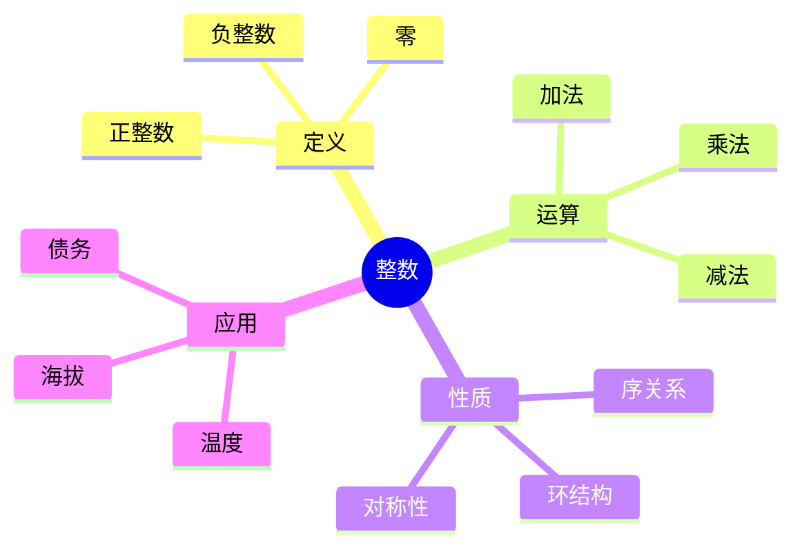
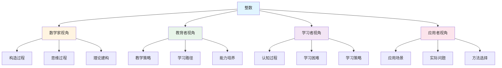
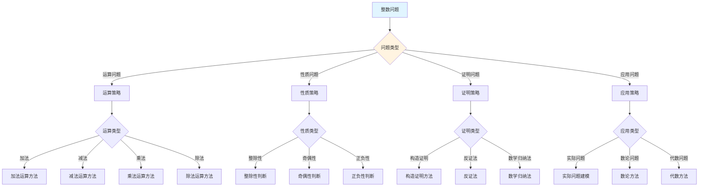
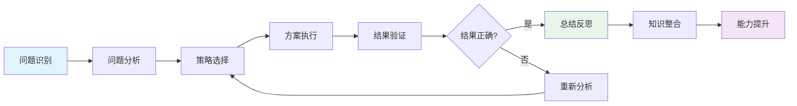
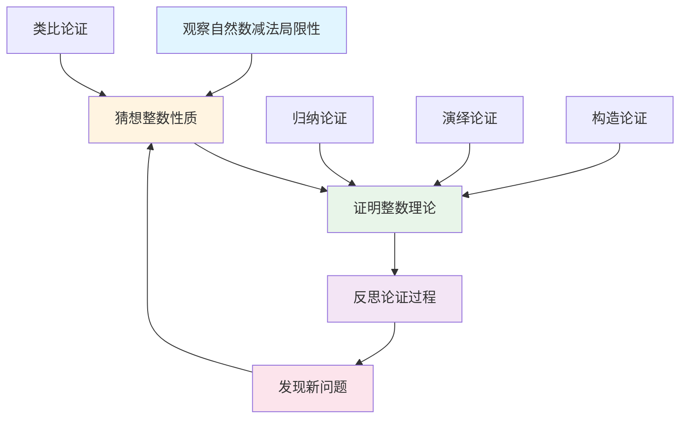
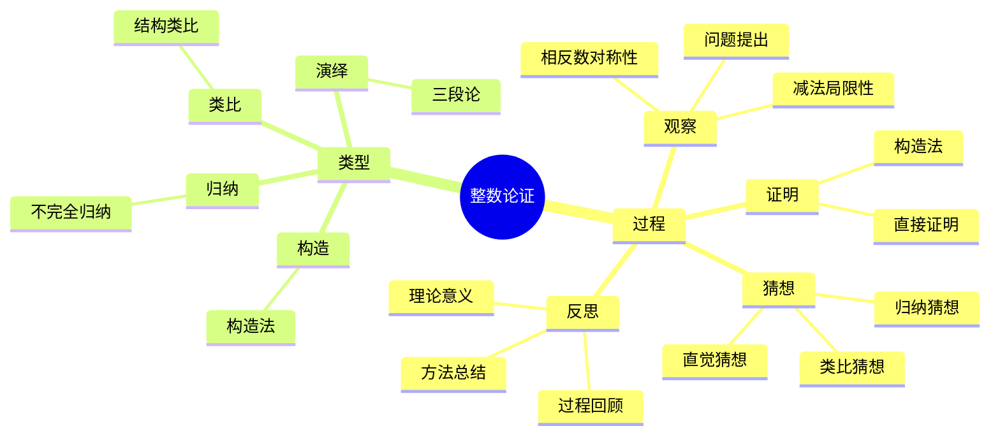

# 整数 (Integer) - 三视角组织版

**概念编号**: C.CORE.004
**知识层次**: L0-L2
**知识领域**: D1 (基础数学)
**创建日期**: 2025年1月
**最后更新**: 2025年1月

---

## 📋 目录 / Table of Contents

- [整数 (Integer) - 三视角组织版](#整数-integer---三视角组织版)
  - [📋 目录 / Table of Contents](#-目录--table-of-contents)
  - [1. 📋 概述 (编号: C.CORE.004.01)](#1--概述-编号-ccore00401)
  - [🧠 认知学视角：如何理解整数 (编号: C.CORE.004.02)](#-认知学视角如何理解整数-编号-ccore00402)
    - [认知起点 (编号: C.CORE.004.02.01)](#认知起点-编号-ccore0040201)
    - [认知过程 (编号: C.CORE.004.02.02)](#认知过程-编号-ccore0040202)
      - [阶段1：直观理解阶段 (编号: C.CORE.004.02.02.01)](#阶段1直观理解阶段-编号-ccore004020201)
      - [阶段2：概念形成阶段 (编号: C.CORE.004.02.02.02)](#阶段2概念形成阶段-编号-ccore004020202)
      - [阶段3：形式化阶段 (编号: C.CORE.004.02.02.03)](#阶段3形式化阶段-编号-ccore004020203)
    - [认知障碍 (编号: C.CORE.004.02.03)](#认知障碍-编号-ccore0040203)
    - [认知工具 (编号: C.CORE.004.02.04)](#认知工具-编号-ccore0040204)
  - [🎓 教育学视角：如何教学整数 (编号: C.CORE.004.03)](#-教育学视角如何教学整数-编号-ccore00403)
    - [教学目标 (编号: C.CORE.004.03.01)](#教学目标-编号-ccore0040301)
    - [教学路径 (编号: C.CORE.004.03.02)](#教学路径-编号-ccore0040302)
      - [阶段1：引入阶段（激发兴趣） (编号: C.CORE.004.03.02.01)](#阶段1引入阶段激发兴趣-编号-ccore004030201)
      - [阶段2：探索阶段（主动建构） (编号: C.CORE.004.03.02.02)](#阶段2探索阶段主动建构-编号-ccore004030202)
      - [阶段3：形式化阶段（抽象概括） (编号: C.CORE.004.03.02.03)](#阶段3形式化阶段抽象概括-编号-ccore004030203)
      - [阶段4：巩固阶段（应用深化） (编号: C.CORE.004.03.02.04)](#阶段4巩固阶段应用深化-编号-ccore004030204)
    - [教学难点 (编号: C.CORE.004.03.03)](#教学难点-编号-ccore0040303)
    - [教学策略 (编号: C.CORE.004.03.04)](#教学策略-编号-ccore0040304)
    - [评估方法 (编号: C.CORE.004.03.05)](#评估方法-编号-ccore0040305)
  - [🔬 数学家视角：如何思考整数 (编号: C.CORE.004.04)](#-数学家视角如何思考整数-编号-ccore00404)
    - [问题起源 (编号: C.CORE.004.04.01)](#问题起源-编号-ccore0040401)
    - [思维过程 (编号: C.CORE.004.04.02)](#思维过程-编号-ccore0040402)
      - [步骤1：问题提出 (编号: C.CORE.004.04.02.01)](#步骤1问题提出-编号-ccore004040201)
      - [步骤2：概念形成 (编号: C.CORE.004.04.02.02)](#步骤2概念形成-编号-ccore004040202)
      - [步骤3：理论发展 (编号: C.CORE.004.04.02.03)](#步骤3理论发展-编号-ccore004040203)
    - [历史发展 (编号: C.CORE.004.04.03)](#历史发展-编号-ccore0040403)
    - [3.2 关键人物和贡献 (编号: C.CORE.004.04.04)](#32-关键人物和贡献-编号-ccore0040404)
    - [重要定理 (编号: C.CORE.004.04.05)](#重要定理-编号-ccore0040405)
    - [开放问题 (编号: C.CORE.004.04.06)](#开放问题-编号-ccore0040406)
    - [一、第一人称思维描述 (编号: C.CORE.004.04.07)](#一第一人称思维描述-编号-ccore0040407)
      - [1.1 Dedekind的整数构造过程](#11-dedekind的整数构造过程)
    - [二、数学直觉的形成 (编号: C.CORE.004.04.08)](#二数学直觉的形成-编号-ccore0040408)
      - [2.1 直觉在概念发现中的作用](#21-直觉在概念发现中的作用)
      - [2.2 如何培养整数直觉](#22-如何培养整数直觉)
    - [三、数学美的教育价值 (编号: C.CORE.004.04.09)](#三数学美的教育价值-编号-ccore0040409)
      - [3.1 整数论的美在哪里](#31-整数论的美在哪里)
      - [3.2 如何培养学生的数学美感](#32-如何培养学生的数学美感)
    - [四、问题解决策略 (编号: C.CORE.004.04.10)](#四问题解决策略-编号-ccore0040410)
      - [4.1 数学家的启发式方法](#41-数学家的启发式方法)
      - [4.2 思维过程分析（通过具体问题）](#42-思维过程分析通过具体问题)
    - [五、批判性反思 (编号: C.CORE.004.04.11)](#五批判性反思-编号-ccore0040411)
      - [5.1 整数概念的局限性（深入分析）](#51-整数概念的局限性深入分析)
      - [5.2 整数理论的未解决问题（深入分析）](#52-整数理论的未解决问题深入分析)
  - [💡 数学解释：为什么整数是这样定义的 (编号: C.CORE.004.05)](#-数学解释为什么整数是这样定义的-编号-ccore00405)
    - [一、直观解释：整数是什么？](#一直观解释整数是什么)
      - [1.1 具体例子](#11-具体例子)
      - [1.2 形象类比](#12-形象类比)
      - [1.3 几何直观](#13-几何直观)
      - [1.4 操作体验](#14-操作体验)
    - [二、知性解释：整数的本质是什么？](#二知性解释整数的本质是什么)
      - [2.1 概念定义](#21-概念定义)
      - [2.2 分类体系](#22-分类体系)
      - [2.3 抽象结构](#23-抽象结构)
      - [2.4 知识体系](#24-知识体系)
    - [三、理性解释：整数的公理化定义](#三理性解释整数的公理化定义)
      - [3.1 公理体系](#31-公理体系)
      - [3.2 形式化证明](#32-形式化证明)
      - [3.3 系统建构](#33-系统建构)
    - [四、多视角解释：从不同角度理解整数](#四多视角解释从不同角度理解整数)
      - [4.1 数学家视角：整数是如何被发现的？](#41-数学家视角整数是如何被发现的)
      - [4.2 教育者视角：如何教学整数？](#42-教育者视角如何教学整数)
      - [4.3 学习者视角：如何学习整数？](#43-学习者视角如何学习整数)
      - [4.4 应用者视角：如何应用整数？](#44-应用者视角如何应用整数)
    - [五、思维表征：用多种方式理解整数](#五思维表征用多种方式理解整数)
      - [5.1 思维导图：整数的知识结构](#51-思维导图整数的知识结构)
      - [5.2 矩阵对比：不同解释方式的对比](#52-矩阵对比不同解释方式的对比)
      - [5.3 多视角表征：从不同角度表征整数](#53-多视角表征从不同角度表征整数)
  - [🔍 数学论证：如何论证整数 (编号: C.CORE.004.06)](#-数学论证如何论证整数-编号-ccore00406)
    - [一、论证过程：从观察到反思](#一论证过程从观察到反思)
      - [1.1 观察（Observation）](#11-观察observation)
      - [1.2 猜想（Conjecture）](#12-猜想conjecture)
      - [1.3 证明（Proof）](#13-证明proof)
      - [1.4 反思（Reflection）](#14-反思reflection)
    - [二、论证类型：多种推理方式](#二论证类型多种推理方式)
      - [2.1 归纳论证（Inductive Reasoning）](#21-归纳论证inductive-reasoning)
      - [2.2 演绎论证（Deductive Reasoning）](#22-演绎论证deductive-reasoning)
      - [2.3 类比论证（Analogical Reasoning）](#23-类比论证analogical-reasoning)
      - [2.4 构造论证（Constructive Reasoning）](#24-构造论证constructive-reasoning)
    - [三、论证可视化：用图形表示论证过程](#三论证可视化用图形表示论证过程)
      - [3.1 论证流程图](#31-论证流程图)
      - [3.2 论证类型对比](#32-论证类型对比)
      - [3.3 论证思维导图](#33-论证思维导图)
  - [🔗 三视角整合 (编号: C.CORE.004.07)](#-三视角整合-编号-ccore00407)
    - [三个视角的关联](#三个视角的关联)
    - [如何综合运用三个视角](#如何综合运用三个视角)
  - [📚 参考文献 (编号: C.CORE.004.08)](#-参考文献-编号-ccore00408)
    - [权威资源](#权威资源)
    - [经典教材](#经典教材)
    - [研究论文](#研究论文)

---

## 1. 📋 概述 (编号: C.CORE.004.01)

整数是自然数的扩展，包括正整数、零和负整数。整数构成一个交换环，是数论和代数学的基础对象。

本文档从**数学认知学**、**教育学**、**数学家**三个视角深入展开整数概念，避免简单的概念堆垒。

**权威资源对齐**:

- Wikipedia: [Integer](https://en.wikipedia.org/wiki/Integer)
- Stanford课程: Math 51 (Linear Algebra and Differential Calculus)
- Princeton课程: MAT 201 (Analysis)
- MIT课程: 18.01 (Single Variable Calculus)
- Metamath: [Integers](http://us.metamath.org/mpeuni/df-z.html)

---

## 🧠 认知学视角：如何理解整数 (编号: C.CORE.004.02)

### 认知起点 (编号: C.CORE.004.02.01)

**学习者已有的知识基础**:

- 自然数的概念
- 减法的概念（可能遇到不够减的情况）
- 日常经验中的"相反"、"负"概念

**日常经验中的类似概念**:

- "温度"：零上温度、零下温度
- "海拔"：海平面以上、海平面以下
- "债务"：欠款、负债

### 认知过程 (编号: C.CORE.004.02.02)

#### 阶段1：直观理解阶段 (编号: C.CORE.004.02.02.01)

**具体例子**:

- 例子1：温度：$5°C$、$0°C$、$-5°C$
- 例子2：海拔：$100m$、$0m$、$-50m$
- 例子3：债务：欠$100$元、不欠、有$100$元

**形象类比**:

- **温度类比**: 整数就像"温度计"
  - 正数：零上温度
  - 零：零度
  - 负数：零下温度

- **数轴类比**: 整数就像"数轴上的点"
  - 正数在原点右侧
  - 零在原点
  - 负数在原点左侧

**可视化表示**:

```text
数轴表示:
    ... -3  -2  -1   0   1   2   3  ...
    <----|----|----|----|----|----|---->
```

#### 阶段2：概念形成阶段 (编号: C.CORE.004.02.02.02)

**从例子中抽象出共同特征**:

- 所有例子都涉及"相反方向"
- 需要表示"相反"的概念
- 需要扩展自然数到负数

**识别关键属性**:

1. **对称性**: 每个正数都有对应的负数
2. **零的作用**: 零是正数和负数的分界点
3. **运算性质**: 整数的运算满足交换律、结合律等

**建立概念边界**:

- **什么是整数**: 自然数及其相反数的集合
- **什么不是整数**:
  - 分数（不是整数）
  - 无理数（不是整数）

#### 阶段3：形式化阶段 (编号: C.CORE.004.02.02.03)

**严格定义**:

- 等价类构造：通过自然数对的等价类构造
- Grothendieck群：自然数半群的Grothendieck群

**公理化表述**:

- 整数集$\mathbb{Z}$是满足交换环公理的集合
- 包含自然数作为子集
- 每个元素都有加法逆元

**逻辑结构**:

- 整数是自然数的扩展
- 整数构成交换环
- 整数是数论的基础

### 认知障碍 (编号: C.CORE.004.02.03)

**常见误解**:

1. **误解1**: 认为负数"小于零"就是"不存在"
   - **纠正**: 负数是存在的，只是表示相反方向

2. **误解2**: 混淆负数和减法
   - **纠正**: 负数是数，减法是运算

3. **误解3**: 认为负数的绝对值是负数
   - **纠正**: 负数的绝对值是正数

**理解难点**:

1. **难点1**: 负数的概念
   - **原因**: 日常经验中很少遇到负数
   - **解决方法**: 用温度、海拔等具体例子

2. **难点2**: 负数的运算
   - **原因**: 负数的运算规则与正数不同
   - **解决方法**: 用数轴可视化，用具体例子练习

3. **难点3**: 整数的构造
   - **原因**: 等价类构造比较抽象
   - **解决方法**: 从具体例子开始，逐步抽象

**认知陷阱**:

- **负数的意义**: 负数不是"不存在"，而是表示相反方向
- **整数的运算**: 需要理解负数的运算规则

### 认知工具 (编号: C.CORE.004.02.04)

**类比工具**:

- **温度类比**: 整数 = 温度计
- **数轴类比**: 整数 = 数轴上的点

**可视化工具**:

- **数轴**: 用数轴表示整数
- **温度计**: 用温度计类比整数

**具体化工具**:

- **具体例子**: 用日常生活中的例子理解抽象概念
- **反例**: 用反例理解概念边界

---

## 🎓 教育学视角：如何教学整数 (编号: C.CORE.004.03)

### 教学目标 (编号: C.CORE.004.03.01)

**知识目标**:

- 理解整数的基本概念
- 掌握整数的表示方法
- 理解整数的运算性质
- 理解整数的构造方法

**能力目标**:

- 能够识别整数
- 能够进行整数运算
- 能够用整数解决实际问题
- 能够理解整数的构造

**情感目标**:

- 培养数学抽象思维
- 培养逻辑思维能力
- 激发对数学的兴趣

### 教学路径 (编号: C.CORE.004.03.02)

#### 阶段1：引入阶段（激发兴趣） (编号: C.CORE.004.03.02.01)

**实际问题**:

- 问题1：如何表示零下温度？
- 问题2：如何表示海平面以下的高度？
- 问题3：如何表示欠款？

**历史背景**:

- 负数的历史发展
- 整数在数学中的地位
- 整数在数论中的应用

**引发认知冲突**:

- 问题：自然数不够用怎么办？
- 引出负数的必要性

#### 阶段2：探索阶段（主动建构） (编号: C.CORE.004.03.02.02)

**引导发现**:

1. 让学生自己列举需要负数的例子
2. 让学生观察这些例子的共同特征
3. 引导学生抽象出整数的定义

**合作探究**:

- 小组讨论：什么是整数？
- 小组讨论：整数有哪些性质？
- 小组讨论：如何表示整数？

**多元表征**:

- **语言表征**: "整数包括正整数、零和负整数"
- **符号表征**: $\mathbb{Z} = \{\ldots, -2, -1, 0, 1, 2, \ldots\}$
- **图形表征**: 数轴
- **集合表征**: 等价类构造

#### 阶段3：形式化阶段（抽象概括） (编号: C.CORE.004.03.02.03)

**严格定义**:

- 整数的等价类构造
- 整数的运算定义
- 整数的性质

**性质证明**:

- 整数运算的交换律、结合律
- 整数的环结构
- 整数的序关系

**应用拓展**:

- 整数在数论中的应用
- 整数在代数学中的应用
- 整数在计算机科学中的应用

#### 阶段4：巩固阶段（应用深化） (编号: C.CORE.004.03.02.04)

**练习应用**:

- 基础练习：整数的表示和运算
- 应用练习：用整数解决实际问题
- 综合练习：整数的综合应用

**变式训练**:

- 不同形式的整数表示
- 不同难度的整数运算
- 整数构造的变式

**知识整合**:

- 整数与其他数系的联系
- 整数在数学体系中的地位

### 教学难点 (编号: C.CORE.004.03.03)

**难点1：负数的概念**:

- **难点描述**: 学生难以理解负数的概念
- **解决方法**:
  - 用温度、海拔等具体例子
  - 用数轴可视化
  - 强调负数的实际意义

**难点2：负数的运算**:

- **难点描述**: 学生难以理解和记忆负数的运算规则
- **解决方法**:
  - 用数轴可视化
  - 用具体例子练习
  - 强调运算规则的一致性

**难点3：整数的构造**:

- **难点描述**: 学生难以理解等价类构造
- **解决方法**:
  - 从具体例子开始
  - 逐步抽象到等价类
  - 强调构造的必要性

### 教学策略 (编号: C.CORE.004.03.04)

**策略1：从具体到抽象**:

- 先给出具体例子
- 再抽象出一般概念
- 最后给出严格定义

**策略2：多元表征**:

- 用语言、符号、图形等多种方式表示同一概念
- 帮助学生建立不同表征之间的联系

**策略3：问题驱动**:

- 从实际问题出发
- 引出数学概念
- 解决问题

**策略4：可视化教学**:

- 使用数轴
- 使用温度计类比
- 使用具体例子

### 评估方法 (编号: C.CORE.004.03.05)

**形成性评估**（评估理解过程）:

- 课堂提问：检查学生对概念的理解
- 小组讨论：观察学生的思考过程
- 练习作业：检查学生的应用能力

**总结性评估**（评估最终理解）:

- 测验：检查学生对概念和运算的掌握
- 项目：检查学生应用整数解决实际问题的能力
- 反思：检查学生对整数概念的理解深度

---

## 🔬 数学家视角：如何思考整数 (编号: C.CORE.004.04)

### 问题起源 (编号: C.CORE.004.04.01)

**历史背景**:

- 古代：负数的出现
- 19世纪：整数的严格构造
- 20世纪：整数的公理化

**原始问题**:

- **问题1**: 如何表示"相反"的概念？
- **问题2**: 如何严格定义整数？
- **问题3**: 整数有哪些性质？

**研究动机**:

- 扩展自然数到负数
- 建立整数的严格基础
- 统一整数理论

### 思维过程 (编号: C.CORE.004.04.02)

#### 步骤1：问题提出 (编号: C.CORE.004.04.02.01)

**观察到的现象**:

- 自然数不够用（如减法运算）
- 需要表示"相反"的概念
- 需要扩展数系

**提出的猜想**:

- 可以引入负数
- 整数可以通过自然数构造
- 整数构成交换环

**需要解决的问题**:

- 如何定义负数？
- 如何构造整数？
- 整数应该满足什么性质？

#### 步骤2：概念形成 (编号: C.CORE.004.04.02.02)

**尝试性定义**:

- **等价类定义**: 通过自然数对的等价类
- **Grothendieck群**: 自然数半群的Grothendieck群

**性质探索**:

- 整数的运算性质
- 整数的序关系
- 整数的环结构

**结构发现**:

- 整数构成交换环
- 整数是自然数的扩展
- 整数是数论的基础

#### 步骤3：理论发展 (编号: C.CORE.004.04.02.03)

**定理证明**:

- 整数的基本性质
- 整数的运算性质
- 整数的环结构

**应用拓展**:

- 整数在数论中的应用
- 整数在代数学中的应用
- 整数在计算机科学中的应用

**理论完善**:

- 整数的等价类构造
- 整数的公理化
- 整数的范畴论研究

### 历史发展 (编号: C.CORE.004.04.03)

**早期阶段**（古代）:

- **中国 (200 BCE)**: 使用负数
- **印度 (600 CE)**: 发展负数理论
- **欧洲 (16世纪)**: 接受负数

**关键突破**（19世纪）:

- **Dedekind (1888)**: 给出整数的严格构造
- **Peano (1889)**: 在Peano公理中定义整数

**现代发展**（20世纪）:

- **Bourbaki (1939)**: 统一整数理论
- **Grothendieck (1950s)**: Grothendieck群构造

### 3.2 关键人物和贡献 (编号: C.CORE.004.04.04)

**Richard Dedekind (1831-1916)**:

- 给出整数的严格构造
- 建立整数的理论基础

**Giuseppe Peano (1858-1932)**:

- 在Peano公理中定义整数
- 建立整数的公理化基础

### 重要定理 (编号: C.CORE.004.04.05)

**整数的环结构**:

- 整数构成交换环
- 整数是整环
- 整数是主理想整环

**整数的序关系**:

- 整数是全序集
- 整数的序与运算相容
- 整数是良序集的扩展

### 开放问题 (编号: C.CORE.004.04.06)

**未解决问题**:

- 整数的哲学问题
- 整数的构造问题
- 整数的应用问题

**研究方向**:

- 整数的范畴论研究
- 整数的计算理论研究
- 整数的应用研究

### 一、第一人称思维描述 (编号: C.CORE.004.04.07)

#### 1.1 Dedekind的整数构造过程

**详细历史背景**:

- **1888年**：Dedekind发表《数的意义》（Was sind und was sollen die Zahlen）
- **背景**：研究如何从自然数严格构造整数
- **问题**：如何定义负数？如何统一加法和减法？

**Dedekind的详细第一人称描述**:
> "1888年，我在研究数的本质时，遇到了一个问题：如何从自然数构造整数？
>
> 我发现，自然数中的减法不总是可行的。例如，$3 - 5$在自然数中不存在。我意识到需要引入负数来表示'相反'的概念。
>
> 我的构造方法是这样的：
>
> - **思路**：用自然数对$(a,b)$表示$a - b$
> - **等价关系**：$(a,b) \sim (c,d)$当且仅当$a + d = b + c$
> - **例子**：$(3,5) \sim (0,2)$，因为$3 + 2 = 5 + 0$，都表示$-2$
> - **整数定义**：$\mathbb{Z} = (\mathbb{N} \times \mathbb{N}) / \sim$
>
> 例如，要构造$-2$：
>
> - 用自然数对$(0,2)$表示：$(0,2)$表示$0 - 2 = -2$
> - 等价类：$[(0,2)] = \{(0,2), (1,3), (2,4), \ldots\}$（所有表示$-2$的对）
> - 加法：$[(3,5)] + [(1,2)] = [(3+1, 5+2)] = [(4,7)]$，即$-2 + (-1) = -3$
> - 乘法：$[(3,5)] \cdot [(1,2)] = [(3 \cdot 1 + 5 \cdot 2, 3 \cdot 2 + 5 \cdot 1)] = [(13, 11)]$，即$-2 \times (-1) = 2$
>
> 这让我意识到，整数可以通过自然数对的等价类严格构造，避免了直接定义负数。这为数学基础提供了严格的基础。"

**详细的思维过程**:

1. **观察到的现象**（1888年）:

   **现象1：减法不总是可行**
   - **问题**：在自然数中，$3 - 5$不存在
   - **例子**：$3 - 5$在自然数中无意义
   - **需要**：扩展数系以支持所有减法

   **现象2：需要表示"相反"的概念**
   - **问题**：如何表示"相反方向"或"欠债"？
   - **例子**：$-5$表示"欠5"或"向左5步"
   - **需要**：引入负数

   **现象3：需要统一加法和减法**
   - **问题**：加法和减法是不同的运算
   - **观察**：$a - b = a + (-b)$
   - **需要**：统一为加法运算

2. **提出的猜想**（1888年）:

   **猜想1：用自然数对表示整数**
   - **思路**：用$(a,b)$表示$a - b$
   - **例子**：$(3,5)$表示$3 - 5 = -2$
   - **优点**：避免直接定义负数

   **猜想2：通过等价关系定义整数**
   - **等价关系**：$(a,b) \sim (c,d)$当且仅当$a + d = b + c$
   - **例子**：$(3,5) \sim (0,2)$，因为$3 + 2 = 5 + 0$
   - **意义**：所有表示同一个整数的对属于同一个等价类

   **猜想3：整数的运算性质**
   - **加法**：$[(a,b)] + [(c,d)] = [(a+c, b+d)]$
   - **乘法**：$[(a,b)] \cdot [(c,d)] = [(ac+bd, ad+bc)]$
   - **负号**：$-[(a,b)] = [(b,a)]$

3. **遇到的困难**（1888年）:

   **困难1：如何理解等价关系？**
   - **问题**：为什么$(a,b) \sim (c,d)$当且仅当$a + d = b + c$？
   - **解释**：如果$(a,b)$表示$a - b$，$(c,d)$表示$c - d$，则$a - b = c - d$当且仅当$a + d = b + c$
   - **解决**：通过等价关系严格定义

   **困难2：如何定义整数的运算？**
   - **问题**：如何定义$[(a,b)] + [(c,d)]$？
   - **思路**：如果$(a,b)$表示$a - b$，$(c,d)$表示$c - d$，则$(a-b) + (c-d) = (a+c) - (b+d)$
   - **解决**：定义$[(a,b)] + [(c,d)] = [(a+c, b+d)]$

   **困难3：如何避免循环定义？**
   - **问题**：定义整数时不能使用整数
   - **解决**：只使用自然数和集合论

4. **突破的时刻**（1888年，Dedekind）:

   **突破1：等价类构造**
   - 用自然数对的等价类定义整数
   - **关键**：避免直接定义负数
   - **意义**：为整数提供严格的数学基础

   **突破2：运算的严格定义**
   - 加法和乘法通过等价类定义
   - **关键**：运算与等价类表示无关
   - **意义**：整数构成交换环

   **突破3：整数的性质**
   - 整数是自然数的扩展
   - 整数构成交换环
   - 整数是数论的基础


### 二、数学直觉的形成 (编号: C.CORE.004.04.08)

#### 2.1 直觉在概念发现中的作用

**数学家的直觉**:

- **直觉1**: "负数"是"相反的数"——这个直觉引导数学家发现负数
- **直觉2**: 整数可以统一加法和减法——这个直觉引导数学家建立整数理论
- **直觉3**: 整数是自然数的扩展——这个直觉引导数学家构造整数

**直觉的验证**:

- 通过严格的数学证明验证直觉的正确性
- 通过构造严格化整数定义
- 通过应用验证整数的广泛性

**直觉的深化**:

- 从"相反的数"到"整数的严格构造"
- 从"统一运算"到"整数的代数结构"
- 从"自然数扩展"到"整数的公理化"

#### 2.2 如何培养整数直觉

**数学家的建议**:

- **Dedekind**: "整数直觉是长期训练的结果。通过大量练习和深入思考，我们可以培养对整数的直觉。"
- **Kronecker**: "从具体例子开始，逐步抽象，这是培养整数直觉的有效方法。"

**培养方法**:

1. **大量练习**: 通过大量整数运算练习，培养对整数的直觉
2. **深入思考**: 深入思考整数的本质，理解整数的深层结构
3. **类比和联想**: 通过类比和联想，建立整数与其他概念的联系
4. **与专家交流**: 与数学家交流，学习他们的思维方式

**教学启示**:

- 从具体例子开始，逐步抽象
- 鼓励学生思考整数的本质
- 引导学生建立整数与其他概念的联系

### 三、数学美的教育价值 (编号: C.CORE.004.04.09)

#### 3.1 整数论的美在哪里

**结构美**:

- **简洁性**: 整数的概念非常简洁——"自然数和它们的相反数"
- **统一性**: 整数可以统一处理加法和减法
- **和谐性**: 整数运算满足优美的规律（交换律、结合律等）

**数学家的评价**:

- **Dedekind**: "整数论的美在于它的简洁和统一。它为我们提供了一个统一的框架来理解数学中的运算。"
- **Kronecker**: "整数论的美在于它的基础性。它是数学的基础，所有数系都可以从整数构造。"

#### 3.2 如何培养学生的数学美感

**数学家的建议**:

- **Dedekind**: "展示整数论的美感，让学生感受到数学的美。"
- **Kronecker**: "通过整数论的历史和发展，让学生理解数学的美。"

**教学方法**:

1. **展示数学美**:
   - 展示整数概念的简洁性和统一性
   - 展示整数运算的优美规律
   - 展示整数在数学中的基础地位

2. **引导学生欣赏**:
   - 引导学生欣赏整数概念的简洁性
   - 引导学生欣赏整数运算的和谐性
   - 引导学生欣赏整数的基础性

3. **鼓励学生创造美**:
   - 鼓励学生发现整数论的美
   - 鼓励学生创造优美的整数证明
   - 鼓励学生探索整数论的美

### 四、问题解决策略 (编号: C.CORE.004.04.10)

#### 4.1 数学家的启发式方法

**策略1：从具体到抽象**（通过具体例子）:

- **具体例子**：从具体的整数例子开始
  - 例子1：$-2, -1, 0, 1, 2$（基本整数）
  - 例子2：$3 + (-5) = -2$（整数运算）
  - 例子3：$(-2) \times (-3) = 6$（负数乘法）
- **抽象过程**：抽象出整数的一般性质
  - 等价类构造：$\mathbb{Z} = (\mathbb{N} \times \mathbb{N}) / \sim$
  - 运算性质：交换律、结合律、分配律
  - 代数结构：整数构成交换环
- **理论建立**：建立整数的理论体系
  - 整数的等价类构造
  - 整数的运算理论
  - 整数的代数结构

**策略2：从简单到复杂**（通过渐进学习）:

- **阶段1**：先理解基本整数
  - 正整数：$1, 2, 3, \ldots$
  - 零：$0$
  - 负整数：$-1, -2, -3, \ldots$
- **阶段2**：再理解整数运算
  - 加法：$3 + (-5) = -2$
  - 乘法：$(-2) \times (-3) = 6$
  - 减法：$3 - 5 = 3 + (-5) = -2$
- **阶段3**：最后理解整数理论
  - 等价类构造
  - 整数的代数结构
  - 整数的应用

**策略3：从问题到理论**（通过问题驱动）:

- **实际问题**：从实际问题出发
  - 问题1：如何表示"欠债"？（引出负数）
  - 问题2：如何统一加法和减法？（引出整数）
  - 问题3：如何严格定义整数？（引出等价类构造）
- **概念引出**：引出整数概念
  - 负数：表示"相反"的数
  - 整数：自然数的扩展
  - 等价类构造：严格的构造方法
- **理论建立**：建立整数理论
  - 整数的等价类构造
  - 整数的运算理论
  - 整数的代数结构

#### 4.2 思维过程分析（通过具体问题）

**问题识别**（通过具体例子）:

- **问题类型1：整数构造问题**
  - 例子：如何从自然数构造整数？
  - **识别**：这是整数构造问题，需要使用等价类构造
  - **难度**：复杂问题
- **问题类型2：整数运算问题**
  - 例子：为什么$(-2) \times (-3) = 6$？
  - **识别**：这是整数运算问题，需要理解负数的乘法
  - **难度**：中等问题
- **问题类型3：整数应用问题**
  - 例子：用整数描述温度变化
  - **识别**：这是整数应用问题，需要理解整数的实际意义
  - **难度**：简单问题

**策略选择**（通过具体方法）:

- **简单问题：直接方法**
  - 例子：用整数描述温度变化
  - **方法**：直接使用整数的定义
  - **步骤**：
    1. 温度上升3度：$+3$
    2. 温度下降5度：$-5$
    3. 净变化：$+3 + (-5) = -2$（下降2度）
- **中等问题：分步方法**
  - 例子：为什么$(-2) \times (-3) = 6$？
  - **方法**：使用分配律
  - **步骤**：
    1. $(-2) \times (-3) = (-2) \times [(-1) + (-2)]$
    2. $= (-2) \times (-1) + (-2) \times (-2)$
    3. $= 2 + 4 = 6$
- **复杂问题：分解方法**
  - 例子：如何从自然数构造整数？
  - **方法**：分解为多个步骤
  - **步骤**：
    1. **第一步**：定义自然数对$(a,b)$表示$a - b$
    2. **第二步**：定义等价关系$(a,b) \sim (c,d)$当且仅当$a + d = b + c$
    3. **第三步**：定义整数$\mathbb{Z} = (\mathbb{N} \times \mathbb{N}) / \sim$
    4. **第四步**：定义运算（加法、乘法）

**执行和反思**（通过具体过程）:

- **执行策略**（通过具体例子）
  - 例子：为什么$(-2) \times (-3) = 6$？
  - **执行**：
    1. 使用分配律
    2. 计算$(-2) \times (-1) = 2$
    3. 计算$(-2) \times (-2) = 4$
    4. 得到$(-2) \times (-3) = 6$
- **检查结果**（通过验证）
  - 验证：用具体例子验证
  - 例子：$(-2) \times (-3) = 6$，$(-2) \times 3 = -6$，$(-2) \times (-3) = -(-6) = 6$（一致）
  - 验证：结果一致
- **反思过程**（通过总结）
  - **成功因素**：
    - 正确识别了问题类型（整数运算问题）
    - 选择了合适的方法（分配律）
    - 正确执行了计算
  - **改进建议**：
    - 可以尝试其他方法（如直接使用定义）
    - 可以尝试推广到更一般的情况
    - 可以尝试应用这个结果解决实际问题

### 五、批判性反思 (编号: C.CORE.004.04.11)

#### 5.1 整数概念的局限性（深入分析）

**概念的边界**（具体分析）:

- **限制1：只包含整数**
  - **问题**：整数只包含整数，不包括分数
  - **例子**：$\frac{1}{2}$不是整数
  - **解决**：扩展为有理数（$\mathbb{Q} = \{\frac{p}{q} : p, q \in \mathbb{Z}, q \neq 0\}$）
  - **影响**：限制了整数的应用范围

- **限制2：离散性**
  - **问题**：整数是离散的，不包括连续的量
  - **例子**：$\sqrt{2}$不是整数
  - **解决**：扩展为实数（$\mathbb{R}$）
  - **影响**：限制了整数的应用范围

- **限制3：不能表示所有数学量**
  - **问题**：整数不能表示所有数学量
  - **例子**：$\sqrt{-1}$不是整数
  - **解决**：扩展为复数（$\mathbb{C}$）
  - **影响**：限制了整数的应用范围

**概念的推广**（具体例子）:

- **推广1：有理数**
  - **定义**：$\mathbb{Q} = \{\frac{p}{q} : p, q \in \mathbb{Z}, q \neq 0\}$
  - **构造**：通过整数对的等价类：$\mathbb{Q} = (\mathbb{Z} \times (\mathbb{Z} \setminus \{0\})) / \sim$，其中$(a,b) \sim (c,d)$当且仅当$ad = bc$
  - **应用**：分数运算、除法运算
  - **意义**：扩展了整数的应用范围

- **推广2：实数**
  - **定义**：$\mathbb{R}$（通过Dedekind分割或Cauchy序列构造）
  - **构造**：通过有理数构造
  - **应用**：连续量、极限、微积分
  - **意义**：扩展了整数的应用范围

- **推广3：复数**
  - **定义**：$\mathbb{C} = \{a + bi : a, b \in \mathbb{R}\}$
  - **构造**：通过实数对构造
  - **应用**：复数运算、代数基本定理
  - **意义**：扩展了整数的应用范围

**概念的局限性总结**:

- **数学局限性**：
  - 整数只包含整数，不包括分数
  - 整数是离散的，不包括连续的量
  - 整数不能表示所有数学量

- **应用局限性**：
  - 整数不能直接描述分数
  - 整数不能直接描述连续量
  - 整数不能直接描述复数

- **理论局限性**：
  - 整数概念依赖于自然数
  - 整数概念在范畴论中被推广为整数对象
  - 整数概念在类型论中被推广为整数类型

#### 5.2 整数理论的未解决问题（深入分析）

**未解决的问题**（具体分析）:

- **问题1：整数的哲学问题**
  - **问题**：整数是发现的还是发明的？
  - **Platonism观点**：整数是客观存在的，我们只是发现它们
  - **Formalism观点**：整数是形式系统的产物，我们发明了它们
  - **Intuitionism观点**：整数是通过直觉构造的
  - **影响**：这个问题影响我们对数学本质的理解

- **问题2：整数的构造问题**
  - **问题**：哪种构造方法最自然？
  - **等价类构造**：通过自然数对的等价类
  - **Grothendieck群**：自然数半群的Grothendieck群
  - **问题**：哪种方法最"自然"？
  - **影响**：这个问题影响我们对整数本质的理解

- **问题3：整数的应用问题**
  - **问题**：如何更好地应用整数？
  - **数论**：整数在数论中的应用
  - **代数**：整数在代数中的应用
  - **计算**：整数在计算机科学中的应用
  - **影响**：这个问题影响整数的应用范围

**研究方向**（具体内容）:

- **方向1：整数的范畴论研究**
  - **内容**：整数对象（Integer Object）
  - **定义**：在范畴$\mathcal{C}$中，整数对象是一个对象$\mathbb{Z}$，满足某些性质
  - **应用**：范畴论中的整数概念
  - **意义**：统一了不同数学结构中的整数概念

- **方向2：整数的计算理论研究**
  - **内容**：整数在计算理论中的应用
  - **应用**：递归函数、图灵机、计算复杂度
  - **意义**：整数是计算理论的基础

- **方向3：整数的应用研究**
  - **内容**：整数在数论、代数、计算机科学中的应用
  - **应用**：密码学、编码理论、算法设计
  - **意义**：整数的应用在科学和工程中非常重要

---

## 💡 数学解释：为什么整数是这样定义的 (编号: C.CORE.004.05)

### 一、直观解释：整数是什么？

#### 1.1 具体例子

**生活中的例子**：

- **温度**：温度可以是正数、零或负数
  - 例如：20°C（正数）、0°C（零）、-10°C（负数）
  - **为什么这样定义**：因为我们需要一个概念来表示"相反方向"的量
- **海拔**：海拔可以是正数、零或负数
  - 例如：珠穆朗玛峰8848米（正数）、海平面0米（零）、死海-430米（负数）
  - **为什么这样定义**：因为我们需要一个概念来表示"高于或低于基准点"
- **债务**：债务可以用负数表示
  - 例如：欠债100元表示为-100元
  - **为什么这样定义**：因为我们需要一个概念来表示"相反"的概念

**数学中的例子**：

- **整数序列**：$\ldots, -3, -2, -1, 0, 1, 2, 3, \ldots$
  - **为什么这样定义**：我们需要一个概念来表示"所有整数"
- **减法运算**：$3 - 5 = -2$
  - **为什么这样定义**：整数使得所有减法运算都有结果

#### 1.2 形象类比

**数轴类比**：

- **整数就像"数轴上的点"**
  - 正数在原点右侧
  - 零在原点
  - 负数在原点左侧
- **为什么这样类比**：这个类比帮助我们理解整数的顺序和大小关系

**方向类比**：

- **整数就像"方向"**
  - 正数表示"向右"或"向前"
  - 零表示"不动"
  - 负数表示"向左"或"向后"
- **为什么这样类比**：这个类比帮助我们理解整数的"相反"概念

#### 1.3 几何直观

**数轴表示**：

- 使用数轴表示整数
- 整数在数轴上是等距的点
- **为什么使用数轴**：数轴提供几何直观，帮助我们理解整数的顺序和大小

**对称性表示**：

- 正数和负数关于原点对称
- **为什么使用对称性**：对称性揭示了整数的结构

#### 1.4 操作体验

**整数运算的操作**：

- **加法操作**：$3 + (-5) = -2$
  - **为什么这样操作**：因为我们需要一个运算来表示"合并正数和负数"
- **减法操作**：$3 - 5 = 3 + (-5) = -2$
  - **为什么这样操作**：因为我们需要统一加法和减法
- **乘法操作**：$(-3) \times (-2) = 6$
  - **为什么这样操作**：因为我们需要一个运算来表示"负数的乘法"

### 二、知性解释：整数的本质是什么？

#### 2.1 概念定义

**整数的内涵**：

- **整数是自然数的扩展，包括正整数、零和负整数**
  - **扩展性**：整数包含自然数
  - **相反性**：每个正整数都有对应的负整数
  - **统一性**：加法和减法统一为加法运算
- **为什么这样定义**：这些特征使得整数成为一个完整的数系，支持所有减法运算

**整数的外延**：

- **正整数**：$1, 2, 3, \ldots$
- **零**：$0$
- **负整数**：$-1, -2, -3, \ldots$
- **为什么这样分类**：不同的整数类型有不同的性质和用途

#### 2.2 分类体系

**按符号分类**：

- **正整数**：大于0的整数
- **零**：等于0的整数
- **负整数**：小于0的整数
- **为什么这样分类**：符号是整数的基本特征

**按构造方式分类**：

- **等价类构造**：通过自然数对的等价类构造
- **Grothendieck群构造**：自然数半群的Grothendieck群
- **为什么这样分类**：不同的构造方式揭示了整数的不同方面

#### 2.3 抽象结构

**整数的运算结构**：

- **加法运算**：$+ : \mathbb{Z} \times \mathbb{Z} \to \mathbb{Z}$
- **乘法运算**：$\times : \mathbb{Z} \times \mathbb{Z} \to \mathbb{Z}$
- **为什么有这些运算**：这些运算使得整数具有环结构

**整数的关系结构**：

- **小于关系**：$<$ 是整数上的全序关系
- **等于关系**：$=$ 是整数上的等价关系
- **为什么有这些关系**：这些关系帮助我们比较和分析整数

**整数的环结构**：

- **交换环**：整数构成交换环
- **整环**：整数是整环（无零因子）
- **主理想整环**：整数是主理想整环
- **为什么有这些结构**：这些结构是整数理论的基础

#### 2.4 知识体系

**整数在数学体系中的位置**：

- **扩展地位**：整数是自然数的扩展
  - 自然数：$\mathbb{N} = \{0, 1, 2, 3, \ldots\}$
  - 整数：$\mathbb{Z} = \{\ldots, -3, -2, -1, 0, 1, 2, 3, \ldots\}$
- **为什么是扩展**：整数解决了自然数中减法不总是可行的问题

**整数与其他概念的关系**：

- **整数与自然数**：整数包含自然数
  - 自然数可以嵌入到整数中
- **整数与有理数**：整数是有理数的子集
  - 有理数：$\mathbb{Q} = \{\frac{p}{q} : p \in \mathbb{Z}, q \in \mathbb{Z} \setminus \{0\}\}$
- **整数与环**：整数构成交换环
- **为什么有这些关系**：这些关系揭示了整数与其他数学概念的内在联系

### 三、理性解释：整数的公理化定义

#### 3.1 公理体系

**整数的等价类构造**：

- **构造方法**：$\mathbb{Z} = (\mathbb{N} \times \mathbb{N}) / \sim$，其中$(a,b) \sim (c,d)$当且仅当$a + d = b + c$
- **加法定义**：$[(a,b)] + [(c,d)] = [(a+c, b+d)]$
- **乘法定义**：$[(a,b)] \cdot [(c,d)] = [(ac+bd, ad+bc)]$
- **为什么这样构造**：这个构造将整数建立在自然数基础上，提供了严格的基础

**整数的Grothendieck群构造**：

- **构造方法**：整数是自然数半群的Grothendieck群
- **为什么这样构造**：这个构造揭示了整数的群结构

#### 3.2 形式化证明

**整数运算性质的证明**：

- **加法的交换律**：$a + b = b + a$
  - **证明**：使用等价类构造和自然数的交换律
  - **为什么这样证明**：利用自然数的性质和等价类的定义
- **乘法的结合律**：$(a \cdot b) \cdot c = a \cdot (b \cdot c)$
  - **证明**：使用等价类构造和自然数的结合律
  - **为什么这样证明**：利用自然数的性质和等价类的定义

**整数关系的证明**：

- **序关系的传递性**：如果$a < b$且$b < c$，则$a < c$
  - **证明**：使用序关系的定义和逻辑推理
  - **为什么这样证明**：利用序关系的定义

#### 3.3 系统建构

**整数论在数学基础中的地位**：

- **作为数系扩展**：整数是自然数的扩展
- **提供运算完整性**：整数使得所有减法运算都有结果
- **统一框架**：整数统一了加法和减法

**整数论的发展历史**：

- **Dedekind的构造**（1888年）：通过等价类构造整数
- **Peano的公理化**（1889年）：在Peano公理中定义整数
- **Grothendieck的构造**（1950年代）：Grothendieck群构造
- **为什么这样发展**：数学的发展需要严格的基础，整数论的发展反映了这一需求

### 四、多视角解释：从不同角度理解整数

#### 4.1 数学家视角：整数是如何被发现的？

**Dedekind的构造过程**：

- **问题提出**：如何从自然数构造整数？
- **关键洞察**：用自然数对的等价类表示整数
- **重要发现**：整数可以通过等价类严格构造
- **为什么这样发现**：数学家的直觉和严格证明相结合

**Grothendieck的构造过程**：

- **问题识别**：需要从群论角度理解整数
- **策略选择**：使用Grothendieck群构造
- **构造设计**：整数是自然数半群的Grothendieck群
- **为什么这样设计**：需要揭示整数的群结构

#### 4.2 教育者视角：如何教学整数？

**教学策略**：

- **从具体到抽象**：先学习具体例子，再学习抽象定义
- **从简单到复杂**：先学习正整数，再学习负整数
- **从直观到形式化**：先使用数轴等直观工具，再学习形式化定义
- **为什么这样教学**：符合认知规律，帮助学生逐步建立理解

**学习路径**：

- **阶段1**：直观理解（使用数轴和具体例子）
- **阶段2**：概念形成（学习整数的定义和性质）
- **阶段3**：形式化（学习整数的等价类构造）
- **为什么这样设计**：循序渐进，逐步深入

#### 4.3 学习者视角：如何学习整数？

**认知过程**：

- **直观阶段**：通过数轴理解整数的含义
- **概念阶段**：理解整数的定义和性质
- **形式化阶段**：理解整数的等价类构造
- **为什么这样学习**：符合认知发展规律

**学习困难**：

- **困难1**：理解"负数"的概念
- **困难2**：理解负数的运算规则
- **困难3**：理解等价类构造
- **如何克服**：通过具体例子、类比、历史背景等方式帮助理解

#### 4.4 应用者视角：如何应用整数？

**应用场景**：

- **温度**：使用整数表示温度
- **海拔**：使用整数表示海拔
- **债务**：使用整数表示债务
- **为什么这样应用**：整数提供了强大的工具来处理各种问题

**应用方法**：

- **建立模型**：将实际问题转化为整数问题
- **使用运算**：使用整数运算解决问题
- **验证结果**：验证结果的正确性
- **为什么这样应用**：整数论提供了强大的工具来解决实际问题

### 五、思维表征：用多种方式理解整数

#### 5.1 思维导图：整数的知识结构



#### 5.2 矩阵对比：不同解释方式的对比

| 解释方式 | 特点 | 方法 | 工具 | 适用阶段 | 优势 | 局限 |
|---------|------|------|------|---------|------|------|
| **直观解释** | 具体、形象、可视 | 例子、类比、直观 | 数轴、对称图 | 入门阶段 | 易于理解 | 不够严格 |
| **知性解释** | 概念、分类、抽象 | 定义、分类、结构 | 概念图、知识图谱 | 中级阶段 | 系统完整 | 不够直观 |
| **理性解释** | 公理、证明、形式化 | 公理、证明、系统 | 形式化工具、证明系统 | 高级阶段 | 严格准确 | 不够具体 |
| **多视角解释** | 多角度、整合 | 多视角、整合 | 多视角工具 | 所有阶段 | 全面深入 | 可能复杂 |

#### 5.3 多视角表征：从不同角度表征整数



#### 5.4 决策树：整数问题分类和策略选择



**说明**：
- **问题分类**：根据问题类型（运算、性质、证明、应用）进行分类
- **策略选择**：根据问题类型选择相应的解决策略
- **方法应用**：根据具体问题选择合适的方法

#### 5.5 决策逻辑路径：整数问题解决过程



**说明**：
- **问题识别**：识别整数问题的类型和关键要素
- **问题分析**：分析问题的条件和目标
- **策略选择**：根据问题类型选择解决策略
- **方案执行**：执行选定的解决方案
- **结果验证**：验证结果的正确性
- **总结反思**：总结解题过程，反思解题方法
- **知识整合**：整合相关知识点
- **能力提升**：提升问题解决能力

#### 5.6 多维对比矩阵：整数概念特征对比

| 对比维度 | 整数定义 | 整数运算 | 整数性质 | 整数应用 |
|---------|---------|---------|---------|---------|
| **核心特征** | 自然数扩展、相反数、零 | 加法、减法、乘法、除法 | 整除性、奇偶性、正负性 | 实际问题、数论、代数 |
| **理解难度** | ⭐⭐⭐ | ⭐⭐ | ⭐⭐⭐ | ⭐⭐⭐ |
| **应用频率** | ⭐⭐⭐⭐⭐ | ⭐⭐⭐⭐⭐ | ⭐⭐⭐⭐ | ⭐⭐⭐⭐ |
| **理论基础** | 整数构造理论 | 整数运算律 | 整数性质理论 | 整数应用理论 |
| **教学重点** | 概念理解 | 运算技能 | 性质分析 | 应用能力 |
| **学习阶段** | 入门阶段 | 入门阶段 | 中级阶段 | 中级阶段 |
| **认知维度** | 直观+知性 | 知性 | 知性+理性 | 理性+应用 |
| **思维表征** | 思维导图 | 决策树 | 决策逻辑路径 | 知识图谱 |

**说明**：
- **核心特征**：每个方面的核心特征
- **理解难度**：从1星到5星，表示理解难度
- **应用频率**：从1星到5星，表示应用频率
- **理论基础**：每个方面的理论基础
- **教学重点**：每个方面的教学重点
- **学习阶段**：每个方面的学习阶段
- **认知维度**：每个方面的认知维度
- **思维表征**：每个方面推荐的思维表征方法

---

## 🔍 数学论证：如何论证整数 (编号: C.CORE.004.06)

### 一、论证过程：从观察到反思

#### 1.1 观察（Observation）

**具体现象观察**：

- **现象1**：自然数减法的局限性
  - 例如：$3 - 5$在自然数中无意义，需要扩展数系
  - **为什么重要**：这个现象揭示了整数作为自然数扩展的必要性
- **现象2**：相反数的对称性
  - 例如：$+3$和$-3$关于$0$对称，$+3 + (-3) = 0$
  - **为什么重要**：这个现象揭示了整数的代数结构

**模式识别**：

- **模式1**：整数的序关系
  - 例如：$\ldots < -2 < -1 < 0 < 1 < 2 < \ldots$，整数有全序关系
  - **为什么重要**：这个模式可能反映了整数的序结构
- **模式2**：整数的环结构
  - 例如：整数加法、乘法满足交换律、结合律、分配律
  - **为什么重要**：这个模式可能反映了整数的代数结构

**问题提出**：

- **问题1**：如何严格构造整数，避免循环定义？
  - **为什么提出**：这个问题可能揭示整数的本质和基础
- **问题2**：如何证明整数的唯一分解定理？
  - **为什么提出**：这个问题可能揭示整数的数论性质

#### 1.2 猜想（Conjecture）

**归纳猜想**：

- **猜想1**：整数构成交换环
  - **依据**：观察整数的运算规律
  - **为什么提出**：这个猜想可能揭示整数的代数结构
- **猜想2**：整数有唯一分解定理
  - **依据**：观察整数的因数分解
  - **为什么提出**：这个猜想可能揭示整数的数论性质

**类比猜想**：

- **猜想1**：整数类似于"数轴上的点"
  - **类比对象**：数轴（左右对称）
  - **为什么提出**：这个类比可能揭示整数的几何结构
- **猜想2**：整数的构造类似于"自然数对"
  - **类比对象**：自然数对$(a,b)$表示$a-b$
  - **为什么提出**：这个类比可能揭示整数的构造方法

**直觉猜想**：

- **猜想1**：整数是"最自然"的扩展
  - **直觉来源**：整数的直观
  - **为什么提出**：这个直觉可能揭示整数的基础地位
- **猜想2**：整数有"最小"的环结构
  - **直觉来源**：整数的环结构
  - **为什么提出**：这个直觉可能揭示整数的代数性质

#### 1.3 证明（Proof）

**直接证明**：

- **证明1**：整数构成交换环
  - **证明思路**：使用整数的定义和自然数的性质
  - **关键步骤**：验证加法、乘法的交换律、结合律、分配律
  - **为什么这样证明**：这个证明方法直接、清晰
- **证明2**：整数的唯一分解定理
  - **证明思路**：使用带余除法和最大公约数
  - **关键步骤**：证明每个整数可以唯一分解为素数的乘积
  - **为什么这样证明**：这个证明方法直接、清晰

**构造法**：

- **构造法**：构造整数作为自然数对的等价类
  - **构造方法**：定义$(a,b) \sim (c,d)$当且仅当$a+d = b+c$，整数是等价类
  - **验证**：验证构造的整数满足环公理
  - **为什么这样证明**：构造法适合证明存在性命题

#### 1.4 反思（Reflection）

**过程回顾**：

- **论证回顾**：从观察自然数减法的局限性，到猜想整数的性质，再到严格证明
  - **成功之处**：成功建立了整数的严格理论
  - **不足之处**：整数概念需要进一步推广
  - **改进方向**：推广到有理数、实数等

**方法总结**：

- **证明方法**：使用了直接证明、构造法
  - **方法特点**：直接证明清晰，构造法明确
  - **适用范围**：不同方法适用于不同类型的命题
- **证明技巧**：使用自然数的性质、等价类构造、环公理
  - **技巧要点**：将整数问题转化为自然数问题，使用构造法处理存在性问题
  - **应用场景**：这些技巧可以应用于其他数论问题

**理论意义**：

- **理论贡献**：建立了整数的严格理论，揭示了整数的代数结构
  - **为什么重要**：这个论证揭示了数论的基础结构
- **应用价值**：整数为数论和代数学提供了基础
  - **为什么重要**：这个论证可以应用于所有数论和代数问题

### 二、论证类型：多种推理方式

#### 2.1 归纳论证（Inductive Reasoning）

**不完全归纳**：

- **例子1**：从具体整数的运算规律归纳一般规律
  - **观察**：观察$(-3) + 5 = 2$，$(-2) \times 3 = -6$的规律
  - **结论**：整数运算满足交换律、结合律
  - **局限性**：不完全归纳的结论需要严格证明

#### 2.2 演绎论证（Deductive Reasoning）

**三段论**：

- **例子1**：证明整数的性质
  - **大前提**：所有整数都有相反数
  - **小前提**：$-5$是整数
  - **结论**：$-5$有相反数$+5$
  - **为什么有效**：三段论是严格的演绎推理

#### 2.3 类比论证（Analogical Reasoning）

**结构类比**：

- **例子1**：整数与数轴的类比
  - **类比对象**：数轴
  - **相似性**：整数对应数轴上的点，关于原点对称
  - **结论**：整数可以理解为"数轴上的点"
  - **局限性**：类比不能替代严格证明

#### 2.4 构造论证（Constructive Reasoning）

**构造法**：

- **例子1**：构造整数作为自然数对的等价类
  - **构造方法**：$(a,b) \sim (c,d)$当且仅当$a+d = b+c$
  - **验证**：验证构造的整数满足环公理
  - **为什么有效**：构造法是严格的直接证明

### 三、论证可视化：用图形表示论证过程

#### 3.1 论证流程图



#### 3.2 论证类型对比

| 论证类型 | 特点 | 适用场景 | 优势 | 局限 |
|---------|------|---------|------|------|
| **归纳论证** | 从特殊到一般 | 发现规律、提出猜想 | 启发性强 | 结论或然 |
| **演绎论证** | 从一般到特殊 | 严格证明、逻辑推理 | 结论必然 | 需要前提 |
| **类比论证** | 基于相似性 | 启发思路、发现联系 | 创造性高 | 结论或然 |
| **构造论证** | 直接构造 | 证明存在性命题 | 直接明确 | 需要构造 |

#### 3.3 论证思维导图



---

## 🔗 三视角整合 (编号: C.CORE.004.07)

### 三个视角的关联

**认知学视角 ↔ 教育学视角**:

- 认知学视角揭示的理解机制，指导教育学视角的教学设计
- 教育学视角的教学实践，验证认知学视角的理论

**认知学视角 ↔ 数学家视角**:

- 数学家视角的思维过程，启发认知学视角的认知路径
- 认知学视角的认知障碍，解释数学家视角的历史困难

**教育学视角 ↔ 数学家视角**:

- 数学家视角的历史发展，为教育学视角提供教学素材
- 教育学视角的教学策略，帮助学习者理解数学家视角的思维过程

### 如何综合运用三个视角

**学习建议**:

1. **从认知学视角开始**: 先建立直观理解
2. **用教育学视角深化**: 通过教学路径系统学习
3. **用数学家视角升华**: 理解概念的深层意义和历史背景

**教学建议**:

1. **引入阶段**: 用数学家视角的问题起源激发兴趣
2. **探索阶段**: 用认知学视角的认知过程引导发现
3. **形式化阶段**: 用教育学视角的教学策略系统教学
4. **巩固阶段**: 综合三个视角深化理解

---

## 📚 参考文献 (编号: C.CORE.004.08)

### 权威资源

- Wikipedia: [Integer](https://en.wikipedia.org/wiki/Integer)
- Metamath: [Integers](http://us.metamath.org/mpeuni/df-z.html)

### 经典教材

- Dedekind, R. (1888). *Was sind und was sollen die Zahlen?*. Vieweg.
- Enderton, H. B. (1977). *Elements of Set Theory*. Academic Press.

### 研究论文

- Dedekind, R. (1888). "Was sind und was sollen die Zahlen?". *Vieweg*.

---

**创建日期**: 2025年1月
**最后更新**: 2025年1月
**维护状态**: 持续更新中
