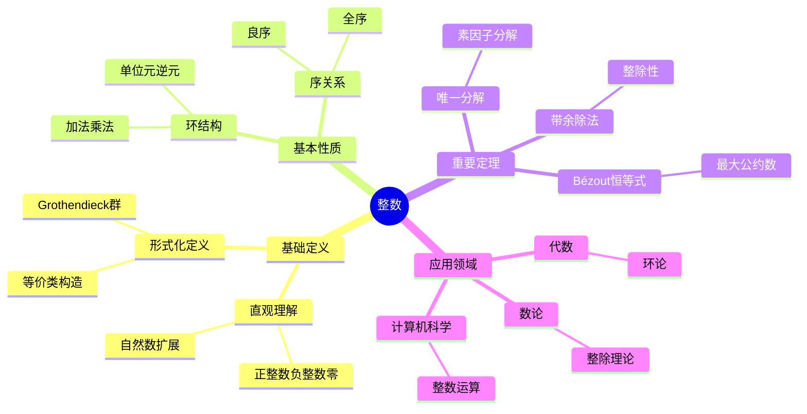

# 整数 (Integer)

**概念编号**: C.CORE.004
**知识层次**: L0-L2
**知识领域**: D1 (基础数学)
**创建日期**: 2025年11月21日
**最后更新**: 2025年11月21日

---

## 📋 概述

整数是自然数的扩展，包括正整数、零和负整数。整数构成一个交换环，是数论和代数学的基础对象。

**权威资源对齐**:

- Wikipedia: [Integer](https://en.wikipedia.org/wiki/Integer)
- Stanford课程: Math 51 (Linear Algebra and Differential Calculus)
- Princeton课程: MAT 201 (Analysis)
- MIT课程: 18.01 (Single Variable Calculus)
- Metamath: [Integers](http://us.metamath.org/mpeuni/df-z.html)

---

## 🎯 严格定义

### 基础定义 (L0)

**直观理解**: 整数包括正整数、零和负整数：$\ldots, -3, -2, -1, 0, 1, 2, 3, \ldots$

**基本定义**: 整数集 $\mathbb{Z}$ 是自然数的扩展，包含：

- 所有自然数：$0, 1, 2, 3, \ldots$
- 所有负整数：$-1, -2, -3, \ldots$

**简单例子**:

- $0$ 是整数
- $1$ 是整数
- $-1$ 是整数
- $42$ 是整数
- $-100$ 是整数

### 形式化定义 (L1)

**等价类构造**: 整数可以通过自然数对的等价类构造：

**定义**: 在 $\mathbb{N} \times \mathbb{N}$ 上定义等价关系：
$$(a,b) \sim (c,d) \Leftrightarrow a + d = b + c$$

整数集定义为：
$$\mathbb{Z} = (\mathbb{N} \times \mathbb{N}) / \sim$$

其中 $(a,b)$ 表示 $a - b$（在自然数中，$a - b$ 可能不存在，但通过等价类可以表示）。

**加法定义**:
$$[(a,b)] + [(c,d)] = [(a+c, b+d)]$$

**乘法定义**:
$$[(a,b)] \cdot [(c,d)] = [(ac+bd, ad+bc)]$$

**负号定义**:
$$-[(a,b)] = [(b,a)]$$

**记号**:

- $\mathbb{Z} = \{\ldots, -3, -2, -1, 0, 1, 2, 3, \ldots\}$: 整数集
- $n$: 正整数（对应 $[(n,0)]$）
- $-n$: 负整数（对应 $[(0,n)]$）
- $0$: 零（对应 $[(0,0)]$）

**等价定义**:

- **等价类构造**: 通过自然数对的等价类
- **Grothendieck群**: 自然数半群的Grothendieck群
- **序对构造**: 直接定义 $\mathbb{Z} = \mathbb{N} \cup \{(-n) : n \in \mathbb{N}\}$

---

## 📚 历史背景

### 发展脉络

**古代**: 整数的起源

- **古印度 (7世纪)**: 引入负数概念
- **中国 (《九章算术》，约1世纪)**: 使用负数解决实际问题
- **古希腊**: 主要研究正整数，对负数持怀疑态度

**17-18世纪**: 整数的接受

- **Descartes (1637)**: 在解析几何中使用负数
- **Euler (1748)**: 系统研究整数和负数
- **Gauss (1801)**: 在数论中广泛使用整数

**19世纪**: 整数的严格构造

- **Grassmann (1861)**: 给出整数的严格构造
- **Dedekind (1888)**: 在《数的意义》中给出整数的定义
- **Peano (1889)**: 在Peano公理基础上构造整数

**20世纪**: 整数的公理化

- **Bourbaki (1939)**: 在集合论框架下统一整数理论
- **Grothendieck (1957)**: 引入Grothendieck群构造

### 关键人物

- **Brahmagupta (598-668)**: 印度数学家，系统研究负数
- **René Descartes (1596-1650)**: 在解析几何中使用负数
- **Leonhard Euler (1707-1783)**: 系统研究整数和负数
- **Carl Friedrich Gauss (1777-1855)**: 在数论中广泛使用整数
- **Richard Dedekind (1831-1916)**: 给出整数的严格构造

### 重要事件

- **7世纪**: 古印度引入负数
- **1637**: Descartes在解析几何中使用负数
- **1801**: Gauss发表《算术研究》，广泛使用整数
- **1888**: Dedekind给出整数的严格构造
- **1939**: Bourbaki统一整数理论

---

## 🔍 性质与定理

### 基本性质 (L1)

**性质1: 整数的环结构**:

- **陈述**: 整数集 $\mathbb{Z}$ 配备加法和乘法构成交换环
- **加法性质**:
  - 交换律：$a + b = b + a$
  - 结合律：$(a + b) + c = a + (b + c)$
  - 单位元：$0 + a = a + 0 = a$
  - 逆元：$a + (-a) = (-a) + a = 0$
- **乘法性质**:
  - 交换律：$ab = ba$
  - 结合律：$(ab)c = a(bc)$
  - 单位元：$1 \cdot a = a \cdot 1 = a$
  - 分配律：$a(b+c) = ab + ac$
- **证明思路**: 由等价类构造和运算定义直接得到
- **应用**: 整数运算、数论

**性质2: 整数的序**:

- **定义**: $a < b$ 当且仅当存在正整数 $n$ 使得 $b = a + n$
- **性质**:
  - 三歧性：$\forall a, b \in \mathbb{Z}$，$a < b$、$a = b$、$a > b$ 恰有一个成立
  - 传递性：$a < b \land b < c \Rightarrow a < c$
  - 与运算相容：$a < b \Rightarrow a+c < b+c$，若 $c > 0$ 则 $ac < bc$
- **证明思路**: 由自然数的序和整数的构造得到
- **应用**: 整数比较、排序

**性质3: 整数的绝对值**:

- **定义**: $|a| = \begin{cases} a & \text{若 } a \geq 0 \\ -a & \text{若 } a < 0 \end{cases}$
- **性质**:
  - $|a| \geq 0$，且 $|a| = 0 \Leftrightarrow a = 0$
  - $|ab| = |a||b|$
  - $|a+b| \leq |a| + |b|$（三角不等式）
- **证明思路**: 由绝对值的定义和整数的性质得到
- **应用**: 距离、度量

**性质4: 整数的整除性**:

- **定义**: $a$ 整除 $b$（记作 $a \mid b$）当且仅当存在 $c \in \mathbb{Z}$ 使得 $b = ac$
- **性质**:
  - $a \mid a$（自反性）
  - $a \mid b \land b \mid c \Rightarrow a \mid c$（传递性）
  - $a \mid b \land a \mid c \Rightarrow a \mid (b+c)$
- **证明思路**: 由整除的定义直接得到
- **应用**: 数论、最大公约数、最小公倍数

**性质5: 整数的良序性（正整数）**:

- **陈述**: 正整数的每个非空子集都有最小元
- **证明思路**: 由自然数的良序性得到
- **应用**: 证明存在性、构造性证明

### 重要定理 (L2)

**定理1: 带余除法**:

- **陈述**: 对于任意整数 $a$ 和非零整数 $b$，存在唯一的整数 $q$ 和 $r$ 使得：
  $$a = bq + r, \quad 0 \leq r < |b|$$
- **证明思路**:
  1. 考虑集合 $S = \{a - bx : x \in \mathbb{Z}, a - bx \geq 0\}$
  2. $S$ 非空（取 $x$ 足够小）
  3. 由良序性，$S$ 有最小元 $r = a - bq$
  4. 证明 $0 \leq r < |b|$ 和唯一性
- **应用**: 最大公约数、Euclid算法

**定理2: 最大公约数的存在性**:

- **陈述**: 对于任意整数 $a, b$（不全为零），存在最大公约数 $\gcd(a,b)$
- **证明思路**:
  1. 考虑集合 $S = \{ax + by : x, y \in \mathbb{Z}, ax + by > 0\}$
  2. $S$ 非空（取 $x, y$ 使得 $ax + by \neq 0$）
  3. 由良序性，$S$ 有最小元 $d = ax_0 + by_0$
  4. 证明 $d$ 是 $a$ 和 $b$ 的公约数
  5. 证明 $d$ 是最大公约数
- **应用**: Euclid算法、Bézout恒等式

**定理3: Bézout恒等式**:

- **陈述**: 对于任意整数 $a, b$（不全为零），存在整数 $x, y$ 使得：
  $$\gcd(a,b) = ax + by$$
- **证明思路**: 由最大公约数的构造直接得到
- **应用**: 线性Diophantine方程、模逆元

**定理4: 整数的唯一分解**

- **陈述**: 每个大于1的整数都可以唯一地表示为素数的乘积（不计顺序和符号）
- **证明思路**:
  1. 存在性：由数学归纳法
  2. 唯一性：由Euclid引理
- **应用**: 数论、密码学

**定理5: 整数的基数**

- **陈述**: 整数集是可数无限的，基数 $|\mathbb{Z}| = \aleph_0$
- **证明思路**: 构造双射 $f: \mathbb{N} \to \mathbb{Z}$：$f(2n) = n$，$f(2n+1) = -(n+1)$
- **应用**: 基数理论、可数性

---

## 💡 应用实例

### 理论应用

**应用1: 数论**

- 整数是数论的研究对象
- 例如：素数、同余、Diophantine方程

**应用2: 代数**

- 整数环是交换环的典型例子
- 例如：整数的理想、整数的商环

**应用3: 组合数学**

- 整数用于计数和枚举
- 例如：排列数、组合数、生成函数

**应用4: 图论**

- 整数用于表示图的顶点数和边数
- 例如：$n$ 个顶点的图的边数

### 实际应用

**应用1: 计算机科学**

- 整数是编程语言的基本数据类型
- 例如：32位整数、64位整数

**应用2: 密码学**

- 整数用于加密算法
- 例如：RSA加密、椭圆曲线密码

**应用3: 编码理论**

- 整数用于编码信息
- 例如：ASCII码、Unicode

**应用4: 物理学**

- 整数用于量子数
- 例如：角动量量子数、主量子数

### 交叉应用

**应用1: 代数数论**

- 整数环是代数数论的基础
- 例如：代数整数的研究

**应用2: 组合优化**

- 整数规划问题
- 例如：背包问题、旅行商问题

**应用3: 离散数学**

- 整数用于离散结构
- 例如：图的顶点编号、序列索引

**应用4: 计算复杂性**

- 整数用于表示问题规模
- 例如：算法的时间复杂度、空间复杂度

---

## 🔗 关联概念

### 依赖关系

**前置知识**:

- 自然数（整数通过自然数构造）
- 集合（整数的集合论构造）
- 等价关系（整数的等价类构造）

**后续知识**:

- 有理数（整数的扩展）
- 最大公约数（整数的整除性）
- 同余（整数的模运算）
- 环论（整数环）

### 等价关系

**等价定义**:

- 等价类构造（自然数对的等价类）
- Grothendieck群（自然数半群的Grothendieck群）
- 序对构造（直接定义）

### 推广关系

**特殊情形**:

- 正整数（$\mathbb{Z}^+$）
- 负整数（$\mathbb{Z}^-$）
- 非负整数（$\mathbb{N}$）

**一般推广**:

- 有理数（整数的分式域）
- 代数整数（整数环的扩展）
- 整环（整数的抽象化）

### 应用关系

**理论应用**:

- 数论
- 代数
- 组合数学
- 图论

**实际问题**:

- 计算机科学
- 密码学
- 编码理论
- 物理学

---

## 📖 参考文献

### 权威资源

- Wikipedia: [Integer](https://en.wikipedia.org/wiki/Integer)
- Wikipedia: [Construction of the Integers](https://en.wikipedia.org/wiki/Construction_of_the_integers)
- Metamath: [Integers](http://us.metamath.org/mpeuni/df-z.html)

### 经典教材

- Dedekind, R. (1888). *Was sind und was sollen die Zahlen?*. Vieweg.
- Enderton, H. B. (1977). *Elements of Set Theory*. Academic Press.
- Rudin, W. (1976). *Principles of Mathematical Analysis*. McGraw-Hill.
- Artin, M. (2011). *Algebra*. Prentice Hall.

### 历史文献

- Gauss, C. F. (1801). *Disquisitiones Arithmeticae*. Leipzig.
- Grassmann, H. (1861). *Lehrbuch der Arithmetik*. Berlin.

---

## 🎓 学习路径

### 基础路径 (L0→L1)

1. **直观理解**: 整数包括正整数、零和负整数
2. **基本定义**: 整数的等价类构造
3. **简单例子**: 正整数、负整数、零
4. **基本运算**: 加法、减法、乘法
5. **形式化定义**: 等价类构造、Grothendieck群

### 进阶路径 (L1→L2)

1. **整数性质**: 环结构、序关系、绝对值
2. **整除性**: 整除、最大公约数、最小公倍数
3. **重要定理**: 带余除法、Bézout恒等式
4. **应用实例**: 数论、代数、组合数学
5. **深入定理**: 唯一分解定理、整数的基数

### 高级路径 (L2→L3)

1. **代数数论**: 整数环、代数整数
2. **组合数论**: 整数分拆、生成函数
3. **计算数论**: 整数算法、密码学
4. **前沿研究**: 整数规划、组合优化
5. **研究工具**: 数论软件、计算工具

---

## 🗺️ 思维导图 (编号: C.CORE.004.MIND)

### 整数概念思维导图

---

## 📊 知识多维关系矩阵 (编号: C.CORE.004.MATRIX)

### 整数的多维关系矩阵

| 维度 | 指标 | 整数 |
|------|------|------|
| **知识层次** | L0基础 | ⭐⭐⭐⭐⭐ |
| | L1中级 | ⭐⭐⭐⭐ |
| | L2高级 | ⭐⭐⭐ |
| | L3研究 | ⭐⭐ |
| **知识领域** | D1基础数学 | ⭐⭐⭐⭐⭐ |
| | D2代数 | ⭐⭐⭐ |
| | D6数论 | ⭐⭐⭐⭐⭐ |
| | D7离散数学 | ⭐⭐⭐⭐ |
| **依赖关系** | 前置概念 | 自然数 |
| | 后续概念 | 有理数、实数、复数 |
| **应用关系** | 理论应用 | ⭐⭐⭐⭐⭐ |
| | 实际应用 | ⭐⭐⭐⭐⭐ |
| | 交叉应用 | ⭐⭐⭐ |
| **学习难度** | 直观理解 | ⭐ |
| | 形式化理解 | ⭐⭐⭐ |
| | 深入应用 | ⭐⭐ |

---

## 💭 形象化解释与论证 (编号: C.CORE.004.VISUAL)

### 形象化解释

**1. 整数的直观理解**

- **类比**: 整数就像"数轴上的点"，包括正数、负数和零
- **例子**:
  - 温度：正数表示零上，负数表示零下
  - 海拔：正数表示海平面以上，负数表示海平面以下
  - 债务：正数表示资产，负数表示负债

**2. 整数运算的直观理解**

- **加法**: 在数轴上向右移动（正数）或向左移动（负数）
- **减法**: 加法的逆运算
- **乘法**: 重复加法

**3. 负数的直观理解**

- **类比**: 负数就像"相反方向"或"欠债"
- **例子**:
  - 如果向东走3步是+3，那么向西走3步是-3
  - 如果收入100元是+100，那么支出100元是-100

### 认知科学视角

**1. 数学教育家Dienes的观点**

- **多表征原则**: 通过数轴、具体情境、符号等多种方式表示整数
- **变化性原则**: 通过不同的整数例子理解整数的本质
- **教学启示**: 使用数轴、温度计、海拔图等多种教学工具

**2. 数学认知学家Tall的观点**

- **过程-对象对偶**: 理解"整数运算"（过程）和"整数"（对象）
- **认知层次**: 从具体整数（如"-3个苹果"）到抽象整数（如"-3"本身）

---

## 👨‍🏫 专家观点与论证 (编号: C.CORE.004.EXPERT)

### 数学家的观点

**1. Richard Dedekind (1831-1916) - 整数理论的奠基者**
> "整数是自然数的扩展，通过引入负数使减法运算封闭。"
>
> **意义**: Dedekind建立了整数的严格理论基础。

**2. Alexander Grothendieck (1928-2014) - Grothendieck群的提出者**
> "整数可以通过Grothendieck群构造，这是代数K理论的基础。"
>
> **意义**: Grothendieck的构造方法为代数K理论奠定了基础。

### 数学教育家的观点

**1. Zoltan Dienes (1916-2014) - 数学教育家**
> "整数概念应该通过数轴、具体情境、符号等多种方式学习。"
>
> **教学启示**:
>
> - 使用数轴可视化整数
> - 使用温度、海拔等具体情境理解负数
> - 逐步抽象到一般整数概念

**2. Hans Freudenthal (1905-1990) - 数学教育家**
> "整数概念的学习需要从'自然数扩展'发展到'抽象整数结构'。"
>
> **认知发展**:
>
> - **扩展阶段**: 理解负数作为自然数的扩展
> - **结构阶段**: 理解整数作为环的结构

### 数学认知学家的观点

**1. David Tall - 数学认知学家**
> "整数概念的理解需要从'过程'（如何运算）发展到'对象'（整数本身）。"
>
> **认知层次**:
>
> - **过程层次**: 理解"如何做整数运算"（如$-3 + 5 = 2$）
> - **对象层次**: 理解"整数"（如$-3$是一个整数）

---

**创建日期**: 2025年11月21日
**最后更新**: 2025年11月21日
**维护状态**: 持续更新中
