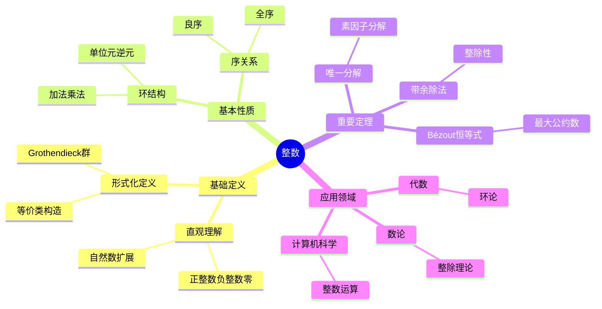
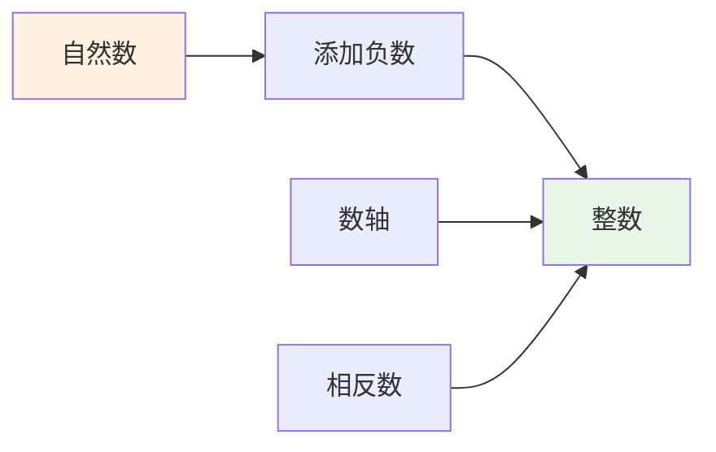
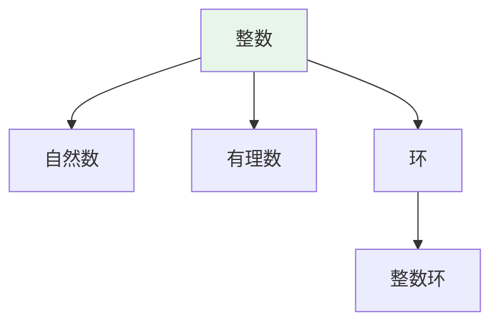
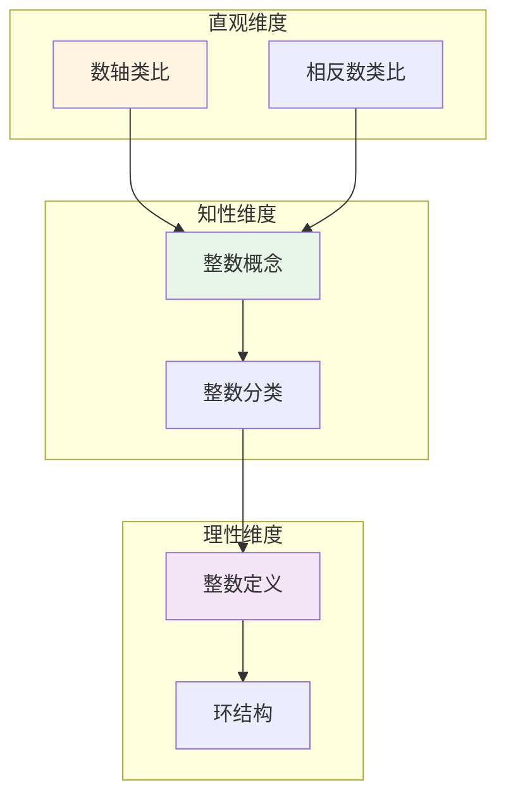

# 整数 (Integer)

**概念编号**: C.CORE.004
**知识层次**: L0-L2
**知识领域**: D1 (基础数学)
**创建日期**: 2025年11月21日
**最后更新**: 2025年11月21日

---

## 📑 目录

- [整数 (Integer)](#整数-integer)
  - [📑 目录](#-目录)
  - [1. 📋 概述](#1--概述)
  - [2. 🎯 严格定义](#2--严格定义)
    - [2.1 基础定义 (L0)](#21-基础定义-l0)
    - [2.2 形式化定义 (L1)](#22-形式化定义-l1)
  - [3. 📚 历史背景](#3--历史背景)
    - [3.1 发展脉络](#31-发展脉络)
    - [3.2 关键人物](#32-关键人物)
    - [3.3 重要事件](#33-重要事件)
  - [4. 🔍 性质与定理](#4--性质与定理)
    - [4.1 基本性质 (L1)](#41-基本性质-l1)
    - [4.2 重要定理 (L2)](#42-重要定理-l2)
  - [5. 🔬 形式化证明](#5--形式化证明)
    - [定理1: 带余除法的形式化证明](#定理1-带余除法的形式化证明)
  - [6. 💡 应用实例](#6--应用实例)
    - [6.1 理论应用](#61-理论应用)
    - [6.2 实际应用](#62-实际应用)
      - [应用1: 计算机科学 - RSA加密算法](#应用1-计算机科学---rsa加密算法)
      - [应用2: 密码学 - 模逆元计算](#应用2-密码学---模逆元计算)
    - [交叉应用](#交叉应用)
  - [7. 🔗 关联概念](#7--关联概念)
    - [依赖关系](#依赖关系)
    - [等价关系](#等价关系)
    - [推广关系](#推广关系)
    - [应用关系](#应用关系)
  - [8. 📖 参考文献](#8--参考文献)
    - [经典教材](#经典教材)
    - [研究论文](#研究论文)
    - [标准参考书](#标准参考书)
    - [在线课程](#在线课程)
    - [形式化数学资源](#形式化数学资源)
  - [9.4 🎓 学习路径](#94--学习路径)
    - [基础路径 (L0→L1)](#基础路径-l0l1)
    - [进阶路径 (L1→L2)](#进阶路径-l1l2)
    - [高级路径 (L2→L3)](#高级路径-l2l3)
  - [9.1 🗺️ 思维导图 (编号: C.CORE.004.MIND)](#91-️-思维导图-编号-ccore004mind)
    - [整数概念思维导图](#整数概念思维导图)
  - [9.2 📊 知识多维关系矩阵 (编号: C.CORE.004.MATRIX)](#92--知识多维关系矩阵-编号-ccore004matrix)
    - [整数的多维关系矩阵](#整数的多维关系矩阵)
  - [9.3 💭 形象化解释与论证 (编号: C.CORE.004.VISUAL)](#93--形象化解释与论证-编号-ccore004visual)
    - [形象化解释](#形象化解释)
    - [认知科学视角](#认知科学视角)
  - [9.6 👨‍🏫 专家观点与论证 (编号: C.CORE.004.EXPERT)](#96--专家观点与论证-编号-ccore004expert)
    - [数学家的观点](#数学家的观点)
    - [数学教育家的观点](#数学教育家的观点)
    - [数学认知学家的观点](#数学认知学家的观点)
  - [9.7 🎨 认知维度表征 (编号: C.CORE.004.COGNITIVE)](#97--认知维度表征-编号-ccore004cognitive)
    - [直观维度表征 (编号: C.CORE.004.INTUITIVE)](#直观维度表征-编号-ccore004intuitive)
      - [形象类比](#形象类比)
      - [具体例子](#具体例子)
      - [可视化表示](#可视化表示)
      - [几何直观](#几何直观)
    - [知性维度表征 (编号: C.CORE.004.INTELLECTUAL)](#知性维度表征-编号-ccore004intellectual)
      - [概念定义](#概念定义)
      - [概念分类](#概念分类)
      - [概念关系](#概念关系)
      - [知识矩阵](#知识矩阵)
    - [理性维度表征 (编号: C.CORE.004.RATIONAL)](#理性维度表征-编号-ccore004rational)
      - [公理体系](#公理体系)
      - [形式化定义](#形式化定义)
      - [逻辑推理](#逻辑推理)
      - [证明系统](#证明系统)
    - [综合整合表征 (编号: C.CORE.004.INTEGRATED)](#综合整合表征-编号-ccore004integrated)
      - [多维度整合](#多维度整合)
      - [图形转换](#图形转换)
      - [应用示例](#应用示例)
  - [9.5 📚 习题库](#95--习题库)
    - [L0基础题（5道）](#l0基础题5道)
    - [L1中级题（6道）](#l1中级题6道)
    - [L2高级题（4道）](#l2高级题4道)

---

## 1. 📋 概述

整数是自然数的扩展，包括正整数、零和负整数。
整数构成一个交换环，是数论和代数学的基础对象。

**权威资源对齐**:

- Wikipedia: [Integer](https://en.wikipedia.org/wiki/Integer)
- Stanford课程: Math 51 (Linear Algebra and Differential Calculus)
- Princeton课程: MAT 201 (Analysis)
- MIT课程: 18.01 (Single Variable Calculus)
- Metamath: [Integers](http://us.metamath.org/mpeuni/df-z.html)

---

## 2. 🎯 严格定义

### 2.1 基础定义 (L0)

**直观理解**: 整数包括正整数、零和负整数：$\ldots, -3, -2, -1, 0, 1, 2, 3, \ldots$

**基本定义**: 整数集 $\mathbb{Z}$ 是自然数的扩展，包含：

- 所有自然数：$0, 1, 2, 3, \ldots$
- 所有负整数：$-1, -2, -3, \ldots$

**简单例子**:

- $0$ 是整数
- $1$ 是整数
- $-1$ 是整数
- $42$ 是整数
- $-100$ 是整数

### 2.2 形式化定义 (L1)

**等价类构造**: 整数可以通过自然数对的等价类构造：

**定义**: 在 $\mathbb{N} \times \mathbb{N}$ 上定义等价关系：
$$(a,b) \sim (c,d) \leftrightarrow a + d = b + c$$

整数集定义为：
$$\mathbb{Z} = (\mathbb{N} \times \mathbb{N}) / \sim$$

其中 $(a,b)$ 表示 $a - b$（在自然数中，$a - b$ 可能不存在，但通过等价类可以表示）。

**加法定义**:
$$[(a,b)] + [(c,d)] = [(a+c, b+d)]$$

**乘法定义**:
$$[(a,b)] \cdot [(c,d)] = [(ac+bd, ad+bc)]$$

**负号定义**:
$$-[(a,b)] = [(b,a)]$$

**记号**:

- $\mathbb{Z} = \{\ldots, -3, -2, -1, 0, 1, 2, 3, \ldots\}$: 整数集
- $n$: 正整数（对应 $[(n,0)]$）
- $-n$: 负整数（对应 $[(0,n)]$）
- $0$: 零（对应 $[(0,0)]$）

**等价定义**:

- **等价类构造**: 通过自然数对的等价类
- **Grothendieck群**: 自然数半群的Grothendieck群
- **序对构造**: 直接定义 $\mathbb{Z} = \mathbb{N} \cup \{(-n) : n \in \mathbb{N}\}$

---

## 3. 📚 历史背景

### 3.1 发展脉络

**古代**: 整数的起源

- **古印度 (7世纪)**: 引入负数概念
- **中国 (《九章算术》，约1世纪)**: 使用负数解决实际问题
- **古希腊**: 主要研究正整数，对负数持怀疑态度

**17-18世纪**: 整数的接受

- **Descartes (1637)**: 在解析几何中使用负数
- **Euler (1748)**: 系统研究整数和负数
- **Gauss (1801)**: 在数论中广泛使用整数

**19世纪**: 整数的严格构造

- **Grassmann (1861)**: 给出整数的严格构造
- **Dedekind (1888)**: 在《数的意义》中给出整数的定义
- **Peano (1889)**: 在Peano公理基础上构造整数

**20世纪**: 整数的公理化

- **Bourbaki (1939)**: 在集合论框架下统一整数理论
- **Grothendieck (1957)**: 引入Grothendieck群构造

### 3.2 关键人物

- **Brahmagupta (598-668)**: 印度数学家，系统研究负数
- **René Descartes (1596-1650)**: 在解析几何中使用负数
- **Leonhard Euler (1707-1783)**: 系统研究整数和负数
- **Carl Friedrich Gauss (1777-1855)**: 在数论中广泛使用整数
- **Richard Dedekind (1831-1916)**: 给出整数的严格构造

### 3.3 重要事件

- **7世纪**: 古印度引入负数
- **1637**: Descartes在解析几何中使用负数
- **1801**: Gauss发表《算术研究》，广泛使用整数
- **1888**: Dedekind给出整数的严格构造
- **1939**: Bourbaki统一整数理论

---

## 4. 🔍 性质与定理

### 4.1 基本性质 (L1)

**性质1: 整数的环结构**:

- **陈述**: 整数集 $\mathbb{Z}$ 配备加法和乘法构成交换环
- **加法性质**:
  - 交换律：$a + b = b + a$
  - 结合律：$(a + b) + c = a + (b + c)$
  - 单位元：$0 + a = a + 0 = a$
  - 逆元：$a + (-a) = (-a) + a = 0$
- **乘法性质**:
  - 交换律：$ab = ba$
  - 结合律：$(ab)c = a(bc)$
  - 单位元：$1 \cdot a = a \cdot 1 = a$
  - 分配律：$a(b+c) = ab + ac$
- **证明思路**: 由等价类构造和运算定义直接得到
- **应用**: 整数运算、数论

**性质2: 整数的序**:

- **定义**: $a < b$ 当且仅当存在正整数 $n$ 使得 $b = a + n$
- **性质**:
  - 三歧性：$\forall a, b \in \mathbb{Z}$，$a < b$、$a = b$、$a > b$ 恰有一个成立
  - 传递性：$a < b \land b < c \Rightarrow a < c$
  - 与运算相容：$a < b \Rightarrow a+c < b+c$，若 $c > 0$ 则 $ac < bc$
- **证明思路**: 由自然数的序和整数的构造得到
- **应用**: 整数比较、排序

**性质3: 整数的绝对值**:

- **定义**: $|a| = \begin{cases} a & \text{若 } a \geq 0 \\ -a & \text{若 } a < 0 \end{cases}$
- **性质**:
  - $|a| \geq 0$，且 $|a| = 0 \leftrightarrow a = 0$
  - $|ab| = |a||b|$
  - $|a+b| \leq |a| + |b|$（三角不等式）
- **证明思路**: 由绝对值的定义和整数的性质得到
- **应用**: 距离、度量

**性质4: 整数的整除性**:

- **定义**: $a$ 整除 $b$（记作 $a \mid b$）当且仅当存在 $c \in \mathbb{Z}$ 使得 $b = ac$
- **性质**:
  - $a \mid a$（自反性）
  - $a \mid b \land b \mid c \Rightarrow a \mid c$（传递性）
  - $a \mid b \land a \mid c \Rightarrow a \mid (b+c)$
- **证明思路**: 由整除的定义直接得到
- **应用**: 数论、最大公约数、最小公倍数

**性质5: 整数的良序性（正整数）**:

- **陈述**: 正整数的每个非空子集都有最小元
- **证明思路**: 由自然数的良序性得到
- **应用**: 证明存在性、构造性证明

### 4.2 重要定理 (L2)

**定理1: 带余除法**:

- **陈述**: 对于任意整数 $a$ 和非零整数 $b$，存在唯一的整数 $q$ 和 $r$ 使得：
  $$a = bq + r, \quad 0 \leq r < |b|$$
- **证明思路**:
  1. 考虑集合 $S = \{a - bx : x \in \mathbb{Z}, a - bx \geq 0\}$
  2. $S$ 非空（取 $x$ 足够小）
  3. 由良序性，$S$ 有最小元 $r = a - bq$
  4. 证明 $0 \leq r < |b|$ 和唯一性
- **应用**: 最大公约数、Euclid算法

**定理2: 最大公约数的存在性**:

- **陈述**: 对于任意整数 $a, b$（不全为零），存在最大公约数 $\gcd(a,b)$
- **证明思路**:
  1. 考虑集合 $S = \{ax + by : x, y \in \mathbb{Z}, ax + by > 0\}$
  2. $S$ 非空（取 $x, y$ 使得 $ax + by \neq 0$）
  3. 由良序性，$S$ 有最小元 $d = ax_0 + by_0$
  4. 证明 $d$ 是 $a$ 和 $b$ 的公约数
  5. 证明 $d$ 是最大公约数
- **应用**: Euclid算法、Bézout恒等式

**定理3: Bézout恒等式**:

- **陈述**: 对于任意整数 $a, b$（不全为零），存在整数 $x, y$ 使得：
  $$\gcd(a,b) = ax + by$$
- **证明思路**: 由最大公约数的构造直接得到
- **应用**: 线性Diophantine方程、模逆元

**定理4: 整数的唯一分解**:

- **陈述**: 每个大于1的整数都可以唯一地表示为素数的乘积（不计顺序和符号）
- **证明思路**:
  1. 存在性：由数学归纳法
  2. 唯一性：由Euclid引理
- **应用**: 数论、密码学

**定理5: 整数的基数**:

- **陈述**: 整数集是可数无限的，基数 $|\mathbb{Z}| = \aleph_0$
- **证明思路**: 构造双射 $f: \mathbb{N} \to \mathbb{Z}$：$f(2n) = n$，$f(2n+1) = -(n+1)$
- **应用**: 基数理论、可数性

---

## 5. 🔬 形式化证明

### 定理1: 带余除法的形式化证明

**定理陈述**:
$$\forall a \in \mathbb{Z} \forall b \in \mathbb{Z} [b \neq 0 \to \exists! q, r \in \mathbb{Z} (a = bq + r \land 0 \leq r < |b|)]$$

**前提**:

- 整数的定义
- 自然数的良序性
- 绝对值的定义

**形式化证明**:

```text
步骤1: 假设条件
  设: a in Z, b in Z, b != 0

步骤2: 构造集合
  定义: S = {a - bx : x in Z, a - bx >= 0}
  性质: S非空（取x使得a - bx >= 0）

步骤3: 应用良序性
  S是自然数集的子集，因此有最小元
  设: r = min S
  存在: q in Z使得r = a - bq
  即: a = bq + r

步骤4: 证明0 <= r < |b|
  由构造: r >= 0
  假设: r >= |b|
  则: r - |b| = a - bq - |b| = a - b(q + sign(b)) >= 0
  且: r - |b| < r
  矛盾: r是最小元
  因此: r < |b|

步骤5: 证明唯一性
  设: a = bq1 + r1 = bq2 + r2，其中0 <= r1, r2 < |b|
  则: b(q1 - q2) = r2 - r1
  若q1 != q2: |b(q1 - q2)| >= |b| > |r2 - r1|
  矛盾: |r2 - r1| < |b|
  因此: q1 = q2，r1 = r2

步骤6: 结论
  因此: exists! q, r, a = bq + r and 0 <= r < |b|
```

**Metamath格式参考**:

```text
${
  divalg.1 $e |- A e. ZZ $.
  divalg.2 $e |- B e. ZZ $.
  divalg.3 $e |- B != 0 $.
  divalg $p |- exists! q, r in ZZ, A = B*q + r and 0 <= r < |B| $=
    ( ... ) ABCDEFG $.
$}
```

---

## 6. 💡 应用实例

### 6.1 理论应用

**应用1: 数论**:

- 整数是数论的研究对象
- 例如：素数、同余、Diophantine方程

**应用2: 代数**:

- 整数环是交换环的典型例子
- 例如：整数的理想、整数的商环

**应用3: 组合数学**:

- 整数用于计数和枚举
- 例如：排列数、组合数、生成函数

**应用4: 图论**:

- 整数用于表示图的顶点数和边数
- 例如：$n$ 个顶点的图的边数

### 6.2 实际应用

#### 应用1: 计算机科学 - RSA加密算法

**问题描述**:
使用RSA加密算法加密消息，选择两个大素数 $p = 61$，$q = 53$，公钥指数 $e = 17$，加密消息 $m = 65$。

**数学建模**:
RSA加密使用整数模运算：$c = m^e \bmod n$，其中 $n = pq$。

**计算过程**:

- $n = pq = 61 \times 53 = 3233$
- $\phi(n) = (p-1)(q-1) = 60 \times 52 = 3120$
- 加密：$c = 65^{17} \bmod 3233$
- 使用快速幂算法：$65^{17} \equiv 2790 \pmod{3233}$

**结果解释**:
消息65被加密为2790。RSA的安全性基于大整数分解的困难性。

**数据**:

- 素数: $p = 61$，$q = 53$
- 模数: $n = 3233$
- 公钥指数: $e = 17$
- 消息: $m = 65$
- 密文: $c = 2790$

#### 应用2: 密码学 - 模逆元计算

**问题描述**:
在模运算中，求 $7$ 在模 $26$ 下的逆元（用于仿射密码）。

**数学建模**:
模逆元 $a^{-1}$ 满足 $a \cdot a^{-1} \equiv 1 \pmod{m}$，使用扩展欧几里得算法。

**计算过程**:

- 求 $\gcd(7, 26) = 1$（互素，逆元存在）
- 扩展欧几里得算法：$26 = 3 \times 7 + 5$，$7 = 1 \times 5 + 2$，$5 = 2 \times 2 + 1$
- 回代：$1 = 5 - 2 \times 2 = 5 - 2(7 - 5) = 3 \times 5 - 2 \times 7 = 3(26 - 3 \times 7) - 2 \times 7 = 3 \times 26 - 11 \times 7$
- 因此：$7^{-1} \equiv -11 \equiv 15 \pmod{26}$

**结果解释**:
$7$ 在模 $26$ 下的逆元是 $15$，因为 $7 \times 15 = 105 \equiv 1 \pmod{26}$。

**数据**:

- 整数: $a = 7$
- 模数: $m = 26$
- 逆元: $a^{-1} = 15$

**应用3: 编码理论**:

- 整数用于编码信息
- 例如：ASCII码、Unicode

**应用4: 物理学**:

- 整数用于量子数
- 例如：角动量量子数、主量子数

### 交叉应用

**应用1: 代数数论**:

- 整数环是代数数论的基础
- 例如：代数整数的研究

**应用2: 组合优化**:

- 整数规划问题
- 例如：背包问题、旅行商问题

**应用3: 离散数学**:

- 整数用于离散结构
- 例如：图的顶点编号、序列索引

**应用4: 计算复杂性**:

- 整数用于表示问题规模
- 例如：算法的时间复杂度、空间复杂度

---

## 7. 🔗 关联概念

### 依赖关系

**前置知识**:

- 自然数（整数通过自然数构造）
- 集合（整数的集合论构造）
- 等价关系（整数的等价类构造）

**后续知识**:

- 有理数（整数的扩展）
- 最大公约数（整数的整除性）
- 同余（整数的模运算）
- 环论（整数环）

### 等价关系

**等价定义**:

- 等价类构造（自然数对的等价类）
- Grothendieck群（自然数半群的Grothendieck群）
- 序对构造（直接定义）

### 推广关系

**特殊情形**:

- 正整数（$\mathbb{Z}^+$）
- 负整数（$\mathbb{Z}^-$）
- 非负整数（$\mathbb{N}$）

**一般推广**:

- 有理数（整数的分式域）
- 代数整数（整数环的扩展）
- 整环（整数的抽象化）

### 应用关系

**理论应用**:

- 数论
- 代数
- 组合数学
- 图论

**实际问题**:

- 计算机科学
- 密码学
- 编码理论
- 物理学

---

## 8. 📖 参考文献

### 经典教材

1. **Enderton, H. B. (1977). *Elements of Set Theory*. Academic Press.**
   - **内容**: 集合论的基础教材，包含整数的集合论构造
   - **适用层次**: L0-L2
   - **特点**: 清晰易懂，适合初学者

2. **Artin, M. (2011). *Algebra* (2nd ed.). Prentice Hall.**
   - **内容**: 代数学的经典教材，讨论整数环
   - **适用层次**: L1-L3
   - **特点**: 清晰易懂，强调几何直观

3. **Rudin, W. (1976). *Principles of Mathematical Analysis* (3rd ed.). McGraw-Hill.**
   - **内容**: 数学分析的经典教材，讨论整数
   - **适用层次**: L1-L3
   - **特点**: 严谨清晰，适合深入学习

### 研究论文

1. **Dedekind, R. (1888). *Was sind und was sollen die Zahlen?*. Braunschweig: Vieweg.**
   - **内容**: 给出整数的严格构造
   - **重要性**: 整数理论的基础

2. **Gauss, C. F. (1801). *Disquisitiones Arithmeticae*. Leipzig: Fleischer.**
   - **内容**: 数论的经典著作，广泛使用整数
   - **重要性**: 现代数论的基础

3. **Grassmann, H. (1861). *Lehrbuch der Arithmetik*. Berlin: Enslin.**
   - **内容**: 系统研究整数运算
   - **重要性**: 整数运算理论的基础

### 标准参考书

1. **Wikipedia contributors. (2024). Integer. In *Wikipedia, The Free Encyclopedia*. Retrieved from <https://en.wikipedia.org/wiki/Integer>**
   - **内容**: 整数概念的全面介绍
   - **特点**: 易于访问，包含大量示例

2. **Wikipedia contributors. (2024). Construction of the integers. In *Wikipedia, The Free Encyclopedia*. Retrieved from <https://en.wikipedia.org/wiki/Construction_of_the_integers>**
   - **内容**: 整数构造的详细介绍
   - **特点**: 包含等价类构造方法

### 在线课程

1. **MIT OpenCourseWare. (2024). 18.100A Introduction to Analysis. Retrieved from <https://ocw.mit.edu/>**
   - **内容**: 分析学课程，讨论整数
   - **特点**: 免费公开课程

2. **Khan Academy. (2024). Integers. Retrieved from <https://www.khanacademy.org/>**
   - **内容**: 整数的在线课程
   - **特点**: 适合初学者

### 形式化数学资源

1. **Metamath contributors. (2024). Integers. In *Metamath Proof Explorer*. Retrieved from <http://us.metamath.org/mpeuni/df-z.html>**
   - **内容**: 整数的形式化证明
   - **特点**: 完全形式化的证明系统

---

## 9.4 🎓 学习路径

### 基础路径 (L0→L1)

1. **直观理解**: 整数包括正整数、零和负整数
2. **基本定义**: 整数的等价类构造
3. **简单例子**: 正整数、负整数、零
4. **基本运算**: 加法、减法、乘法
5. **形式化定义**: 等价类构造、Grothendieck群

### 进阶路径 (L1→L2)

1. **整数性质**: 环结构、序关系、绝对值
2. **整除性**: 整除、最大公约数、最小公倍数
3. **重要定理**: 带余除法、Bézout恒等式
4. **应用实例**: 数论、代数、组合数学
5. **深入定理**: 唯一分解定理、整数的基数

### 高级路径 (L2→L3)

1. **代数数论**: 整数环、代数整数
2. **组合数论**: 整数分拆、生成函数
3. **计算数论**: 整数算法、密码学
4. **前沿研究**: 整数规划、组合优化
5. **研究工具**: 数论软件、计算工具

---

## 9.1 🗺️ 思维导图 (编号: C.CORE.004.MIND)

### 整数概念思维导图



---

## 9.2 📊 知识多维关系矩阵 (编号: C.CORE.004.MATRIX)

### 整数的多维关系矩阵

| 维度 | 指标 | 整数 |
|------|------|------|
| **知识层次** | L0基础 | ⭐⭐⭐⭐⭐ |
| | L1中级 | ⭐⭐⭐⭐ |
| | L2高级 | ⭐⭐⭐ |
| | L3研究 | ⭐⭐ |
| **知识领域** | D1基础数学 | ⭐⭐⭐⭐⭐ |
| | D2代数 | ⭐⭐⭐ |
| | D6数论 | ⭐⭐⭐⭐⭐ |
| | D7离散数学 | ⭐⭐⭐⭐ |
| **依赖关系** | 前置概念 | 自然数 |
| | 后续概念 | 有理数、实数、复数 |
| **应用关系** | 理论应用 | ⭐⭐⭐⭐⭐ |
| | 实际应用 | ⭐⭐⭐⭐⭐ |
| | 交叉应用 | ⭐⭐⭐ |
| **学习难度** | 直观理解 | ⭐ |
| | 形式化理解 | ⭐⭐⭐ |
| | 深入应用 | ⭐⭐ |

---

## 9.3 💭 形象化解释与论证 (编号: C.CORE.004.VISUAL)

### 形象化解释

**1. 整数的直观理解**:

- **类比**: 整数就像"数轴上的点"，包括正数、负数和零
- **例子**:
  - 温度：正数表示零上，负数表示零下
  - 海拔：正数表示海平面以上，负数表示海平面以下
  - 债务：正数表示资产，负数表示负债

**2. 整数运算的直观理解**:

- **加法**: 在数轴上向右移动（正数）或向左移动（负数）
- **减法**: 加法的逆运算
- **乘法**: 重复加法

**3. 负数的直观理解**:

- **类比**: 负数就像"相反方向"或"欠债"
- **例子**:
  - 如果向东走3步是+3，那么向西走3步是-3
  - 如果收入100元是+100，那么支出100元是-100

### 认知科学视角

**1. 数学教育家Dienes的观点**:

- **多表征原则**: 通过数轴、具体情境、符号等多种方式表示整数
- **变化性原则**: 通过不同的整数例子理解整数的本质
- **教学启示**: 使用数轴、温度计、海拔图等多种教学工具

**2. 数学认知学家Tall的观点**:

- **过程-对象对偶**: 理解"整数运算"（过程）和"整数"（对象）
- **认知层次**: 从具体整数（如"-3个苹果"）到抽象整数（如"-3"本身）

---

## 9.6 👨‍🏫 专家观点与论证 (编号: C.CORE.004.EXPERT)

### 数学家的观点

**1. Richard Dedekind (1831-1916) - 整数理论的奠基者**:
> "整数是自然数的扩展，通过引入负数使减法运算封闭。"
>
> **意义**: Dedekind建立了整数的严格理论基础。

**2. Alexander Grothendieck (1928-2014) - Grothendieck群的提出者**:
> "整数可以通过Grothendieck群构造，这是代数K理论的基础。"
>
> **意义**: Grothendieck的构造方法为代数K理论奠定了基础。

### 数学教育家的观点

**1. Zoltan Dienes (1916-2014) - 数学教育家**:
> "整数概念应该通过数轴、具体情境、符号等多种方式学习。"
>
> **教学启示**:
>
> - 使用数轴可视化整数
> - 使用温度、海拔等具体情境理解负数
> - 逐步抽象到一般整数概念

**2. Hans Freudenthal (1905-1990) - 数学教育家**:
> "整数概念的学习需要从'自然数扩展'发展到'抽象整数结构'。"
>
> **认知发展**:
>
> - **扩展阶段**: 理解负数作为自然数的扩展
> - **结构阶段**: 理解整数作为环的结构

### 数学认知学家的观点

**1. David Tall - 数学认知学家**:
> "整数概念的理解需要从'过程'（如何运算）发展到'对象'（整数本身）。"
>
> **认知层次**:
>
> - **过程层次**: 理解"如何做整数运算"（如$-3 + 5 = 2$）
> - **对象层次**: 理解"整数"（如$-3$是一个整数）

---

## 9.7 🎨 认知维度表征 (编号: C.CORE.004.COGNITIVE)

### 直观维度表征 (编号: C.CORE.004.INTUITIVE)

#### 形象类比

- **数轴类比**: 整数就像"数轴上的点"
  - 包括正数、负数和零
  - 就像温度计，有正有负

- **相反数类比**: 整数就像"有相反数的数"
  - 每个正数有对应的负数
  - 就像左右对称

#### 具体例子

- **例子1**: $-3, -2, -1, 0, 1, 2, 3, \ldots$ - 整数序列
  - 包括负整数、零、正整数
  - 这是自然数的扩展

- **例子2**: 温度例子
  - 正数：零上温度
  - 负数：零下温度
  - 零：冰点

#### 可视化表示



#### 几何直观

- **数轴直观**: 通过数轴理解整数
  - 整数在数轴上的位置
  - 正数在右，负数在左

- **对称直观**: 通过对称理解整数
  - 正数和负数关于原点对称
  - 零是中心

---

### 知性维度表征 (编号: C.CORE.004.INTELLECTUAL)

#### 概念定义

- **严格定义**: 整数是自然数及其相反数构成的集合
- **等价定义**: 通过等价类构造、Grothendieck群构造
- **特征描述**: 整数是环，是自然数的扩展

#### 概念分类

- **正整数 vs 负整数 vs 零**: 按符号分类
- **偶数 vs 奇数**: 按整除性分类
- **素数 vs 合数**: 按因子分类（仅对正整数）

#### 概念关系



#### 知识矩阵

| 维度 | 指标 | 整数 |
|------|------|------|
| **知识层次** | L0基础 | ⭐⭐⭐⭐⭐ |
| | L1中级 | ⭐⭐⭐ |
| | L2高级 | ⭐⭐ |
| **知识领域** | D1基础数学 | ⭐⭐⭐⭐⭐ |
| **学习难度** | 直观理解 | ⭐⭐ |
| | 形式化理解 | ⭐⭐⭐ |
| **认知维度** | 直观维度 | ⭐⭐⭐⭐ |
| | 知性维度 | ⭐⭐⭐⭐ |
| | 理性维度 | ⭐⭐⭐ |

---

### 理性维度表征 (编号: C.CORE.004.RATIONAL)

#### 公理体系

- **整数定义**: 整数是自然数及其相反数
- **环公理**: 整数构成环
- **序公理**: 整数是全序集

#### 形式化定义

- **形式化定义**: 使用一阶逻辑严格定义
- **符号系统**: $\mathbb{Z}$, $+$, $-$, $\times$, $<$
- **类型系统**: 整数是自然数类型的扩展类型

#### 逻辑推理

- **基本定理**: 整数的运算性质、带余除法、唯一分解定理
- **证明思路**: 使用自然数公理和逻辑推理证明
- **推理链**: 定义 → 基本性质 → 运算性质 → 重要定理

#### 证明系统

- **证明方法**: 构造性证明、归纳法、反证法
- **形式化证明**: 可以使用Lean4等工具进行形式化
- **验证工具**: Metamath、Lean4等

---

### 综合整合表征 (编号: C.CORE.004.INTEGRATED)

#### 多维度整合



#### 图形转换

- **思维导图**: 展示整数的知识结构
- **知识图谱**: 展示整数与其他概念的关系
- **知识矩阵**: 展示整数的多维度特征

#### 应用示例

- **应用1**: 数论（整除性、同余）
- **应用2**: 代数（整数环、理想）
- **应用3**: 计算机科学（整数运算、编码）

---

## 9.5 📚 习题库

### L0基础题（5道）

**EX.CORE.004.01** (L0, 概念理解)

- **题目**: 判断下列哪些是整数：$-5$，$0$，$\frac{1}{2}$，$100$。
- **答案**: $-5$，$0$，$100$ 是整数；$\frac{1}{2}$ 不是整数。

**EX.CORE.004.02** (L0, 计算)

- **题目**: 计算：$(-3) + 5$，$(-7) \times 4$，$10 - (-3)$。
- **答案**: $(-3) + 5 = 2$，$(-7) \times 4 = -28$，$10 - (-3) = 13$。

**EX.CORE.004.03** (L0, 概念理解)

- **题目**: 证明：整数的加法满足结合律：$(a + b) + c = a + (b + c)$。
- **提示**: 使用整数的定义。
- **答案**: 由整数的定义和自然数的结合律得到。

**EX.CORE.004.04** (L0, 计算)

- **题目**: 计算：$| -5 |$，$| 0 |$，$| 7 |$（绝对值）。
- **答案**: $| -5 | = 5$，$| 0 | = 0$，$| 7 | = 7$。

**EX.CORE.004.05** (L0, 应用)

- **题目**: 用整数表示"比 $-3$ 大 $5$ 的数"。
- **答案**: $-3 + 5 = 2$。

### L1中级题（6道）

**EX.CORE.004.06** (L1, 证明)

- **题目**: 证明：整数的乘法满足交换律：$ab = ba$。
- **提示**: 使用整数的定义和自然数的交换律。
- **答案**: 由整数的定义和自然数的乘法交换律得到。

**EX.CORE.004.07** (L1, 证明)

- **题目**: 证明：若 $a, b \in \mathbb{Z}$ 且 $ab = 0$，则 $a = 0$ 或 $b = 0$（整环性质）。
- **提示**: 使用整数的性质。
- **答案**: 假设 $a \neq 0$ 且 $b \neq 0$，则 $|a| \geq 1$ 且 $|b| \geq 1$，因此 $|ab| = |a||b| \geq 1$，矛盾。因此 $a = 0$ 或 $b = 0$。

**EX.CORE.004.08** (L1, 计算)

- **题目**: 计算：$\gcd(12, 18)$，$\text{lcm}(12, 18)$（最大公约数和最小公倍数）。
- **答案**: $\gcd(12, 18) = 6$，$\text{lcm}(12, 18) = 36$。

**EX.CORE.004.09** (L1, 证明)

- **题目**: 证明：$\gcd(a, b) \cdot \text{lcm}(a, b) = |ab|$。
- **提示**: 使用素因子分解。
- **答案**: 设 $a = \prod p_i^{a_i}$，$b = \prod p_i^{b_i}$，则 $\gcd(a, b) = \prod p_i^{\min(a_i, b_i)}$，$\text{lcm}(a, b) = \prod p_i^{\max(a_i, b_i)}$，因此 $\gcd(a, b) \cdot \text{lcm}(a, b) = \prod p_i^{\min(a_i, b_i) + \max(a_i, b_i)} = \prod p_i^{a_i + b_i} = |ab|$。

**EX.CORE.004.10** (L1, 应用)

- **题目**: 使用Euclid算法计算 $\gcd(1071, 462)$。
- **答案**: $1071 = 2 \times 462 + 147$，$462 = 3 \times 147 + 21$，$147 = 7 \times 21 + 0$，因此 $\gcd(1071, 462) = 21$。

**EX.CORE.004.11** (L1, 证明)

- **题目**: 证明：整数的序关系满足传递性：若 $a < b$ 且 $b < c$，则 $a < c$。
- **提示**: 使用序关系的定义。
- **答案**: 由 $a < b$ 和 $b < c$，存在正整数 $m, n$ 使得 $b = a + m$ 和 $c = b + n$，因此 $c = a + (m + n)$，所以 $a < c$。

### L2高级题（4道）

**EX.CORE.004.12** (L2, 证明)

- **题目**: 证明：整数环 $\mathbb{Z}$ 是主理想整环（PID）。
- **提示**: 证明每个理想都是主理想。
- **答案**: 设 $I$ 是 $\mathbb{Z}$ 的理想。若 $I = \{0\}$，则 $I = (0)$。否则，设 $d$ 是 $I$ 中绝对值最小的正整数，则 $I = (d)$。

**EX.CORE.004.13** (L2, 证明)

- **题目**: 证明：整数满足良序性质：每个非空有下界的整数子集有最小元。
- **提示**: 使用自然数的良序性。
- **答案**: 设 $S \subseteq \mathbb{Z}$ 非空且有下界 $m$，则 $S' = \{s - m : s \in S, s \geq m\}$ 是自然数的非空子集，有最小元 $n$，因此 $S$ 有最小元 $m + n$。

**EX.CORE.004.14** (L2, 综合)

- **题目**: 证明：整数可以唯一分解为素数的乘积（算术基本定理）。
- **提示**: 使用数学归纳法和素数的性质。
- **答案**: 存在性：对 $|n|$ 使用数学归纳法。唯一性：假设 $n = p_1 \cdots p_k = q_1 \cdots q_l$，则 $p_1$ 整除某个 $q_j$，因此 $p_1 = q_j$，约去后继续。

**EX.CORE.004.15** (L2, 证明)

- **题目**: 证明：整数环 $\mathbb{Z}$ 是Euclid整环。
- **提示**: 定义Euclid函数 $\phi(n) = |n|$。
- **答案**: 定义 $\phi: \mathbb{Z} \setminus \{0\} \to \mathbb{N}$，$\phi(n) = |n|$。对任意 $a, b \in \mathbb{Z}$（$b \neq 0$），存在 $q, r \in \mathbb{Z}$ 使得 $a = bq + r$ 且 $0 \leq r < |b|$，因此 $\mathbb{Z}$ 是Euclid整环。

---

**创建日期**: 2025年11月21日
**最后更新**: 2025年1月（与新框架整合）

**关联文档**：

- [整数-多理论分析示例](./04-整数-多理论分析示例-2025年1月.md) ⭐ 最新 - 多理论分析示例

- [整数-决策导图示例](./04-整数-决策导图示例-2025年1月.md) ⭐ 最新 - 决策导图示例
- [概念体系全面梳理与推进计划](../00-概念体系全面梳理与推进计划-2025年1月.md) ⭐ 最新
- [核心概念与新框架整合指南](../00-核心概念与新框架整合指南-2025年1月.md) ⭐ 最新

**维护状态**: 持续更新中
