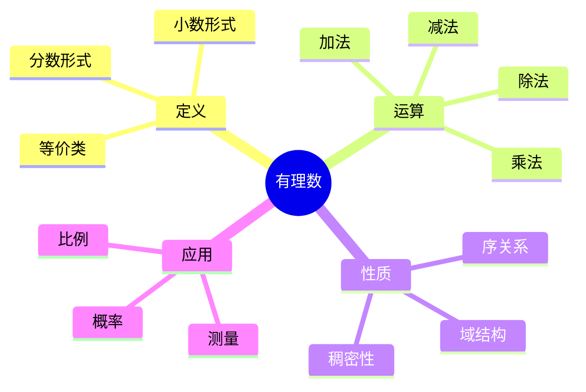
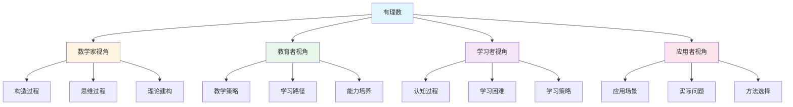
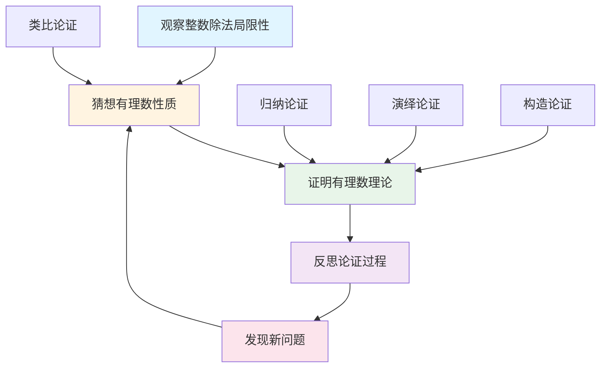
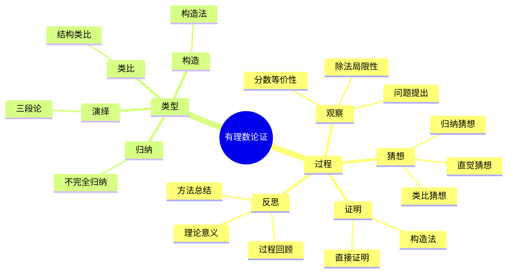

# 有理数 (Rational Number) - 三视角组织版

**概念编号**: C.CORE.005
**知识层次**: L0-L2
**知识领域**: D1 (基础数学)
**创建日期**: 2025年1月
**最后更新**: 2025年1月

---

## 📋 目录 / Table of Contents

- [有理数 (Rational Number) - 三视角组织版](#有理数-rational-number---三视角组织版)
  - [📋 目录 / Table of Contents](#-目录--table-of-contents)
  - [1. 📋 概述 (编号: C.CORE.005.01)](#1--概述-编号-ccore00501)
  - [🧠 认知学视角：如何理解有理数 (编号: C.CORE.005.02)](#-认知学视角如何理解有理数-编号-ccore00502)
    - [认知起点 (编号: C.CORE.005.02.01)](#认知起点-编号-ccore0050201)
    - [认知过程 (编号: C.CORE.005.02.02)](#认知过程-编号-ccore0050202)
      - [阶段1：直观理解阶段 (编号: C.CORE.005.02.02.01)](#阶段1直观理解阶段-编号-ccore005020201)
      - [阶段2：概念形成阶段 (编号: C.CORE.005.02.02.02)](#阶段2概念形成阶段-编号-ccore005020202)
      - [阶段3：形式化阶段 (编号: C.CORE.005.02.02.03)](#阶段3形式化阶段-编号-ccore005020203)
    - [认知障碍 (编号: C.CORE.005.02.03)](#认知障碍-编号-ccore0050203)
    - [认知工具 (编号: C.CORE.005.02.04)](#认知工具-编号-ccore0050204)
  - [🎓 教育学视角：如何教学有理数 (编号: C.CORE.005.03)](#-教育学视角如何教学有理数-编号-ccore00503)
    - [教学目标 (编号: C.CORE.005.03.01)](#教学目标-编号-ccore0050301)
    - [教学路径 (编号: C.CORE.005.03.02)](#教学路径-编号-ccore0050302)
      - [阶段1：引入阶段（激发兴趣） (编号: C.CORE.005.03.02.01)](#阶段1引入阶段激发兴趣-编号-ccore005030201)
      - [阶段2：探索阶段（主动建构） (编号: C.CORE.005.03.02.02)](#阶段2探索阶段主动建构-编号-ccore005030202)
      - [阶段3：形式化阶段（抽象概括） (编号: C.CORE.005.03.02.03)](#阶段3形式化阶段抽象概括-编号-ccore005030203)
      - [阶段4：巩固阶段（应用深化） (编号: C.CORE.005.03.02.04)](#阶段4巩固阶段应用深化-编号-ccore005030204)
    - [教学难点 (编号: C.CORE.005.03.03)](#教学难点-编号-ccore0050303)
    - [教学策略 (编号: C.CORE.005.03.04)](#教学策略-编号-ccore0050304)
    - [评估方法 (编号: C.CORE.005.03.05)](#评估方法-编号-ccore0050305)
  - [🔬 数学家视角：如何思考有理数 (编号: C.CORE.005.04)](#-数学家视角如何思考有理数-编号-ccore00504)
    - [问题起源 (编号: C.CORE.005.04.01)](#问题起源-编号-ccore0050401)
    - [思维过程 (编号: C.CORE.005.04.02)](#思维过程-编号-ccore0050402)
      - [步骤1：问题提出 (编号: C.CORE.005.04.02.01)](#步骤1问题提出-编号-ccore005040201)
      - [步骤2：概念形成 (编号: C.CORE.005.04.02.02)](#步骤2概念形成-编号-ccore005040202)
      - [步骤3：理论发展 (编号: C.CORE.005.04.02.03)](#步骤3理论发展-编号-ccore005040203)
    - [历史发展 (编号: C.CORE.005.04.03)](#历史发展-编号-ccore0050403)
    - [3.2 关键人物和贡献 (编号: C.CORE.005.04.04)](#32-关键人物和贡献-编号-ccore0050404)
    - [重要定理 (编号: C.CORE.005.04.05)](#重要定理-编号-ccore0050405)
    - [开放问题 (编号: C.CORE.005.04.06)](#开放问题-编号-ccore0050406)
    - [一、第一人称思维描述 (编号: C.CORE.005.04.07)](#一第一人称思维描述-编号-ccore0050407)
      - [1.1 Dedekind的有理数构造过程](#11-dedekind的有理数构造过程)
    - [二、数学直觉的形成 (编号: C.CORE.005.04.08)](#二数学直觉的形成-编号-ccore0050408)
      - [2.1 直觉在概念发现中的作用](#21-直觉在概念发现中的作用)
      - [2.2 如何培养有理数直觉](#22-如何培养有理数直觉)
    - [三、数学美的教育价值 (编号: C.CORE.005.04.09)](#三数学美的教育价值-编号-ccore0050409)
      - [3.1 有理数论的美在哪里](#31-有理数论的美在哪里)
      - [3.2 如何培养学生的数学美感](#32-如何培养学生的数学美感)
    - [四、问题解决策略 (编号: C.CORE.005.04.10)](#四问题解决策略-编号-ccore0050410)
      - [4.1 数学家的启发式方法](#41-数学家的启发式方法)
      - [4.2 思维过程分析](#42-思维过程分析)
    - [五、批判性反思 (编号: C.CORE.005.04.11)](#五批判性反思-编号-ccore0050411)
      - [5.1 有理数概念的局限性](#51-有理数概念的局限性)
      - [5.2 有理数理论的未解决问题](#52-有理数理论的未解决问题)
  - [💡 数学解释：为什么有理数是这样定义的 (编号: C.CORE.005.05)](#-数学解释为什么有理数是这样定义的-编号-ccore00505)
    - [一、直观解释：有理数是什么？](#一直观解释有理数是什么)
      - [1.1 具体例子](#11-具体例子)
      - [1.2 形象类比](#12-形象类比)
      - [1.3 几何直观](#13-几何直观)
      - [1.4 操作体验](#14-操作体验)
    - [二、知性解释：有理数的本质是什么？](#二知性解释有理数的本质是什么)
      - [2.1 概念定义](#21-概念定义)
      - [2.2 分类体系](#22-分类体系)
      - [2.3 抽象结构](#23-抽象结构)
      - [2.4 知识体系](#24-知识体系)
    - [三、理性解释：有理数的公理化定义](#三理性解释有理数的公理化定义)
      - [3.1 公理体系](#31-公理体系)
      - [3.2 形式化证明](#32-形式化证明)
      - [3.3 系统建构](#33-系统建构)
    - [四、多视角解释：从不同角度理解有理数](#四多视角解释从不同角度理解有理数)
      - [4.1 数学家视角：有理数是如何被发现的？](#41-数学家视角有理数是如何被发现的)
      - [4.2 教育者视角：如何教学有理数？](#42-教育者视角如何教学有理数)
      - [4.3 学习者视角：如何学习有理数？](#43-学习者视角如何学习有理数)
      - [4.4 应用者视角：如何应用有理数？](#44-应用者视角如何应用有理数)
    - [五、思维表征：用多种方式理解有理数](#五思维表征用多种方式理解有理数)
      - [5.1 思维导图：有理数的知识结构](#51-思维导图有理数的知识结构)
      - [5.2 矩阵对比：不同解释方式的对比](#52-矩阵对比不同解释方式的对比)
      - [5.3 多视角表征：从不同角度表征有理数](#53-多视角表征从不同角度表征有理数)
  - [🔍 数学论证：如何论证有理数 (编号: C.CORE.005.06)](#-数学论证如何论证有理数-编号-ccore00506)
    - [一、论证过程：从观察到反思](#一论证过程从观察到反思)
      - [1.1 观察（Observation）](#11-观察observation)
      - [1.2 猜想（Conjecture）](#12-猜想conjecture)
      - [1.3 证明（Proof）](#13-证明proof)
      - [1.4 反思（Reflection）](#14-反思reflection)
    - [二、论证类型：多种推理方式](#二论证类型多种推理方式)
      - [2.1 归纳论证（Inductive Reasoning）](#21-归纳论证inductive-reasoning)
      - [2.2 演绎论证（Deductive Reasoning）](#22-演绎论证deductive-reasoning)
      - [2.3 类比论证（Analogical Reasoning）](#23-类比论证analogical-reasoning)
      - [2.4 构造论证（Constructive Reasoning）](#24-构造论证constructive-reasoning)
    - [三、论证可视化：用图形表示论证过程](#三论证可视化用图形表示论证过程)
      - [3.1 论证流程图](#31-论证流程图)
      - [3.2 论证类型对比](#32-论证类型对比)
      - [3.3 论证思维导图](#33-论证思维导图)
  - [🔗 三视角整合 (编号: C.CORE.005.07)](#-三视角整合-编号-ccore00507)
    - [三个视角的关联](#三个视角的关联)
    - [如何综合运用三个视角](#如何综合运用三个视角)
  - [📚 参考文献 (编号: C.CORE.005.08)](#-参考文献-编号-ccore00508)
    - [权威资源](#权威资源)
    - [经典教材](#经典教材)
    - [研究论文](#研究论文)

---

## 1. 📋 概述 (编号: C.CORE.005.01)

有理数是整数的分式扩展，可以表示为两个整数的比。有理数构成一个域，是实数的基础，在数学分析和数论中具有重要地位。

本文档从**数学认知学**、**教育学**、**数学家**三个视角深入展开有理数概念，避免简单的概念堆垒。

**权威资源对齐**:

- Wikipedia: [Rational Number](https://en.wikipedia.org/wiki/Rational_number)
- Stanford课程: Math 51 (Linear Algebra and Differential Calculus)
- Princeton课程: MAT 201 (Analysis)
- MIT课程: 18.01 (Single Variable Calculus)
- Metamath: [Rational Numbers](http://us.metamath.org/mpeuni/df-q.html)

---

## 🧠 认知学视角：如何理解有理数 (编号: C.CORE.005.02)

### 认知起点 (编号: C.CORE.005.02.01)

**学习者已有的知识基础**:

- 整数的概念
- 除法的概念（可能遇到不能整除的情况）
- 日常经验中的"分数"、"比例"概念

**日常经验中的类似概念**:

- "一半"：$\frac{1}{2}$
- "三分之一"：$\frac{1}{3}$
- "比例"：$\frac{2}{3}$

### 认知过程 (编号: C.CORE.005.02.02)

#### 阶段1：直观理解阶段 (编号: C.CORE.005.02.02.01)

**具体例子**:

- 例子1：$\frac{1}{2}$ - 一半
- 例子2：$\frac{3}{4}$ - 四分之三
- 例子3：$\frac{2}{3}$ - 三分之二

**形象类比**:

- **分割类比**: 有理数就像"分割的结果"
  - 就像切蛋糕：$\frac{1}{2}$表示一半
  - 就像分苹果：$\frac{3}{4}$表示四分之三

- **比例类比**: 有理数就像"比例"
  - 就像$\frac{2}{3}$表示2比3
  - 就像$\frac{1}{2}$表示1比2

**可视化表示**:

```text
分数表示:
    1/2 = 0.5
    3/4 = 0.75
    2/3 = 0.666...
```

#### 阶段2：概念形成阶段 (编号: C.CORE.005.02.02.02)

**从例子中抽象出共同特征**:

- 所有例子都涉及"两个整数的比"
- 需要表示"部分"的概念
- 需要扩展整数到分数

**识别关键属性**:

1. **分数表示**: 可以表示为$\frac{p}{q}$，其中$p, q \in \mathbb{Z}$，$q \neq 0$
2. **等价性**: 同一个有理数可以有多种分数表示
3. **稠密性**: 任意两个有理数之间还有有理数

**建立概念边界**:

- **什么是有理数**: 可以表示为两个整数比的数
- **什么不是有理数**:
  - $\sqrt{2}$（无理数）
  - $\pi$（无理数）

#### 阶段3：形式化阶段 (编号: C.CORE.005.02.02.03)

**严格定义**:

- 等价类构造：通过整数对的等价类构造
- 域构造：整数的分式域

**公理化表述**:

- 有理数集$\mathbb{Q}$是满足域公理的集合
- 包含整数作为子集
- 每个非零元素都有乘法逆元

**逻辑结构**:

- 有理数是整数的扩展
- 有理数构成域
- 有理数是实数的基础

### 认知障碍 (编号: C.CORE.005.02.03)

**常见误解**:

1. **误解1**: 混淆有理数和分数
   - **纠正**: 有理数是数，分数是有理数的表示形式

2. **误解2**: 认为$\frac{1}{2}$和$\frac{2}{4}$是不同的数
   - **纠正**: 它们是同一个有理数的不同表示

3. **误解3**: 认为有理数是有限的
   - **纠正**: 有理数是无限的，而且是稠密的

**理解难点**:

1. **难点1**: 分数的等价性
   - **原因**: 同一个有理数有多种表示
   - **解决方法**: 强调约分和通分

2. **难点2**: 有理数的稠密性
   - **原因**: 难以理解"任意两个有理数之间还有有理数"
   - **解决方法**: 用具体例子说明

3. **难点3**: 有理数的构造
   - **原因**: 等价类构造比较抽象
   - **解决方法**: 从具体例子开始，逐步抽象

**认知陷阱**:

- **分数的等价性**: 需要理解约分和通分
- **有理数的稠密性**: 需要理解无限的概念

### 认知工具 (编号: C.CORE.005.02.04)

**类比工具**:

- **分割类比**: 有理数 = 分割的结果
- **比例类比**: 有理数 = 比例

**可视化工具**:

- **数轴**: 用数轴表示有理数
- **分数模型**: 用图形表示分数

**具体化工具**:

- **具体例子**: 用日常生活中的例子理解抽象概念
- **反例**: 用反例理解概念边界

---

## 🎓 教育学视角：如何教学有理数 (编号: C.CORE.005.03)

### 教学目标 (编号: C.CORE.005.03.01)

**知识目标**:

- 理解有理数的基本概念
- 掌握有理数的表示方法
- 理解有理数的运算性质
- 理解有理数的构造方法

**能力目标**:

- 能够识别有理数
- 能够进行有理数运算
- 能够用有理数解决实际问题
- 能够理解有理数的构造

**情感目标**:

- 培养数学抽象思维
- 培养逻辑思维能力
- 激发对数学的兴趣

### 教学路径 (编号: C.CORE.005.03.02)

#### 阶段1：引入阶段（激发兴趣） (编号: C.CORE.005.03.02.01)

**实际问题**:

- 问题1：如何表示"一半"？
- 问题2：如何表示"三分之一"？
- 问题3：如何表示"比例"？

**历史背景**:

- 分数的历史发展
- 有理数在数学中的地位
- 有理数在数论中的应用

**引发认知冲突**:

- 问题：整数不够用怎么办？
- 引出分数的必要性

#### 阶段2：探索阶段（主动建构） (编号: C.CORE.005.03.02.02)

**引导发现**:

1. 让学生自己列举需要分数的例子
2. 让学生观察这些例子的共同特征
3. 引导学生抽象出有理数的定义

**合作探究**:

- 小组讨论：什么是有理数？
- 小组讨论：有理数有哪些性质？
- 小组讨论：如何表示有理数？

**多元表征**:

- **语言表征**: "有理数是可以表示为两个整数比的数"
- **符号表征**: $\mathbb{Q} = \{\frac{p}{q} : p, q \in \mathbb{Z}, q \neq 0\}$
- **图形表征**: 数轴、分数模型
- **集合表征**: 等价类构造

#### 阶段3：形式化阶段（抽象概括） (编号: C.CORE.005.03.02.03)

**严格定义**:

- 有理数的等价类构造
- 有理数的运算定义
- 有理数的性质

**性质证明**:

- 有理数运算的交换律、结合律、分配律
- 有理数的域结构
- 有理数的稠密性

**应用拓展**:

- 有理数在数论中的应用
- 有理数在分析学中的应用
- 有理数在计算机科学中的应用

#### 阶段4：巩固阶段（应用深化） (编号: C.CORE.005.03.02.04)

**练习应用**:

- 基础练习：有理数的表示和运算
- 应用练习：用有理数解决实际问题
- 综合练习：有理数的综合应用

**变式训练**:

- 不同形式的有理数表示
- 不同难度的有理数运算
- 有理数构造的变式

**知识整合**:

- 有理数与其他数系的联系
- 有理数在数学体系中的地位

### 教学难点 (编号: C.CORE.005.03.03)

**难点1：分数的等价性**:

- **难点描述**: 学生难以理解同一个有理数的不同表示
- **解决方法**:
  - 强调约分和通分
  - 用具体例子说明
  - 强调等价关系

**难点2：有理数的稠密性**:

- **难点描述**: 学生难以理解"任意两个有理数之间还有有理数"
- **解决方法**:
  - 用具体例子说明
  - 用数轴可视化
  - 强调无限的概念

**难点3：有理数的构造**:

- **难点描述**: 学生难以理解等价类构造
- **解决方法**:
  - 从具体例子开始
  - 逐步抽象到等价类
  - 强调构造的必要性

### 教学策略 (编号: C.CORE.005.03.04)

**策略1：从具体到抽象**:

- 先给出具体例子
- 再抽象出一般概念
- 最后给出严格定义

**策略2：多元表征**:

- 用语言、符号、图形等多种方式表示同一概念
- 帮助学生建立不同表征之间的联系

**策略3：问题驱动**:

- 从实际问题出发
- 引出数学概念
- 解决问题

**策略4：可视化教学**:

- 使用数轴
- 使用分数模型
- 使用具体例子

### 评估方法 (编号: C.CORE.005.03.05)

**形成性评估**（评估理解过程）:

- 课堂提问：检查学生对概念的理解
- 小组讨论：观察学生的思考过程
- 练习作业：检查学生的应用能力

**总结性评估**（评估最终理解）:

- 测验：检查学生对概念和运算的掌握
- 项目：检查学生应用有理数解决实际问题的能力
- 反思：检查学生对有理数概念的理解深度

---

## 🔬 数学家视角：如何思考有理数 (编号: C.CORE.005.04)

### 问题起源 (编号: C.CORE.005.04.01)

**历史背景**:

- 古代：分数的出现
- 19世纪：有理数的严格构造
- 20世纪：有理数的公理化

**原始问题**:

- **问题1**: 如何表示"部分"？
- **问题2**: 如何严格定义有理数？
- **问题3**: 有理数有哪些性质？

**研究动机**:

- 扩展整数到分数
- 建立有理数的严格基础
- 统一有理数理论

### 思维过程 (编号: C.CORE.005.04.02)

#### 步骤1：问题提出 (编号: C.CORE.005.04.02.01)

**观察到的现象**:

- 整数不够用（如除法运算）
- 需要表示"部分"的概念
- 需要扩展数系

**提出的猜想**:

- 可以引入分数
- 有理数可以通过整数构造
- 有理数构成域

**需要解决的问题**:

- 如何定义分数？
- 如何构造有理数？
- 有理数应该满足什么性质？

#### 步骤2：概念形成 (编号: C.CORE.005.04.02.02)

**尝试性定义**:

- **等价类定义**: 通过整数对的等价类
- **分式域**: 整数的分式域

**性质探索**:

- 有理数的运算性质
- 有理数的域结构
- 有理数的稠密性

**结构发现**:

- 有理数构成域
- 有理数是整数的扩展
- 有理数是实数的基础

#### 步骤3：理论发展 (编号: C.CORE.005.04.02.03)

**定理证明**:

- 有理数的基本性质
- 有理数的运算性质
- 有理数的域结构

**应用拓展**:

- 有理数在数论中的应用
- 有理数在分析学中的应用
- 有理数在计算机科学中的应用

**理论完善**:

- 有理数的等价类构造
- 有理数的公理化
- 有理数的范畴论研究

### 历史发展 (编号: C.CORE.005.04.03)

**早期阶段**（古代）:

- **古埃及 (2000 BCE)**: 使用分数
- **古希腊 (600 BCE)**: 研究比例
- **中国 (200 BCE)**: 发展分数理论

**关键突破**（19世纪）:

- **Dedekind (1872)**: 给出有理数的严格构造
- **Cantor (1874)**: 证明有理数的可数性

**现代发展**（20世纪）:

- **Bourbaki (1939)**: 统一有理数理论
- **Grothendieck (1950s)**: 分式域构造

### 3.2 关键人物和贡献 (编号: C.CORE.005.04.04)

**Richard Dedekind (1831-1916)**:

- 给出有理数的严格构造
- 建立有理数的理论基础

**Georg Cantor (1845-1918)**:

- 证明有理数的可数性
- 研究有理数的基数

### 重要定理 (编号: C.CORE.005.04.05)

**有理数的可数性**:

- 有理数集是可数的
- 证明思路：Cantor对角线法
- 意义：说明有理数和自然数等势

**有理数的稠密性**:

- 任意两个有理数之间还有有理数
- 证明思路：取平均值
- 意义：说明有理数在数轴上是稠密的

### 开放问题 (编号: C.CORE.005.04.06)

**未解决问题**:

- 有理数的哲学问题
- 有理数的构造问题
- 有理数的应用问题

**研究方向**:

- 有理数的范畴论研究
- 有理数的计算理论研究
- 有理数的应用研究

### 一、第一人称思维描述 (编号: C.CORE.005.04.07)

#### 1.1 Dedekind的有理数构造过程

**详细历史背景**:

- **1872年**：Dedekind发表《连续性与无理数》（Stetigkeit und irrationale Zahlen）
- **背景**：研究如何从整数严格构造有理数
- **问题**：如何定义分数？如何统一除法和乘法？

**Dedekind的详细第一人称描述**:
> "1872年，我在研究数的本质时，遇到了一个问题：如何从整数构造有理数？
>
> 我发现，整数中的除法不总是可行的。例如，$1 \div 2$在整数中不存在。我意识到需要引入分数来表示'部分'的概念。
>
> 我的构造方法是这样的：
>
> - **思路**：用整数对$(a,b)$表示$\frac{a}{b}$，其中$b \neq 0$
> - **等价关系**：$(a,b) \sim (c,d)$当且仅当$ad = bc$
> - **例子**：$(1,2) \sim (2,4) \sim (3,6)$，都表示$\frac{1}{2}$
> - **有理数定义**：$\mathbb{Q} = (\mathbb{Z} \times (\mathbb{Z} \setminus \{0\})) / \sim$
>
> 例如，要构造$\frac{1}{2}$：
>
> - 用整数对$(1,2)$表示：$(1,2)$表示$\frac{1}{2}$
> - 等价类：$[(1,2)] = \{(1,2), (2,4), (3,6), \ldots\}$（所有表示$\frac{1}{2}$的对）
> - 加法：$[(1,2)] + [(1,3)] = [(1 \cdot 3 + 2 \cdot 1, 2 \cdot 3)] = [(5,6)]$，即$\frac{1}{2} + \frac{1}{3} = \frac{5}{6}$
> - 乘法：$[(1,2)] \cdot [(1,3)] = [(1 \cdot 1, 2 \cdot 3)] = [(1,6)]$，即$\frac{1}{2} \times \frac{1}{3} = \frac{1}{6}$
>
> 这让我意识到，有理数可以通过整数对的等价类严格构造，避免了直接定义分数。这为数学基础提供了严格的基础。"

**详细的思维过程**:

1. **观察到的现象**（1872年）:

   **现象1：除法不总是可行**
   - **问题**：在整数中，$1 \div 2$不存在
   - **例子**：$1 \div 2$在整数中无意义
   - **需要**：扩展数系以支持所有除法

   **现象2：需要表示"部分"的概念**
   - **问题**：如何表示"一半"或"三分之一"？
   - **例子**：$\frac{1}{2}$表示"一半"
   - **需要**：引入分数

   **现象3：需要统一除法和乘法**
   - **问题**：除法和乘法是相关的运算
   - **观察**：$\frac{a}{b} = a \times \frac{1}{b}$
   - **需要**：统一为乘法运算

2. **提出的猜想**（1872年）:

   **猜想1：用整数对表示有理数**
   - **思路**：用$(a,b)$表示$\frac{a}{b}$，其中$b \neq 0$
   - **例子**：$(1,2)$表示$\frac{1}{2}$
   - **优点**：避免直接定义分数

   **猜想2：通过等价关系定义有理数**
   - **等价关系**：$(a,b) \sim (c,d)$当且仅当$ad = bc$
   - **例子**：$(1,2) \sim (2,4)$，因为$1 \times 4 = 2 \times 2$
   - **意义**：所有表示同一个有理数的对属于同一个等价类

   **猜想3：有理数的运算性质**
   - **加法**：$[(a,b)] + [(c,d)] = [(ad+bc, bd)]$
   - **乘法**：$[(a,b)] \cdot [(c,d)] = [(ac, bd)]$
   - **倒数**：$[(a,b)]^{-1} = [(b,a)]$（$a \neq 0$）

3. **遇到的困难**（1872年）:

   **困难1：如何理解等价关系？**
   - **问题**：为什么$(a,b) \sim (c,d)$当且仅当$ad = bc$？
   - **解释**：如果$(a,b)$表示$\frac{a}{b}$，$(c,d)$表示$\frac{c}{d}$，则$\frac{a}{b} = \frac{c}{d}$当且仅当$ad = bc$
   - **解决**：通过等价关系严格定义

   **困难2：如何定义有理数的运算？**
   - **问题**：如何定义$[(a,b)] + [(c,d)]$？
   - **思路**：如果$(a,b)$表示$\frac{a}{b}$，$(c,d)$表示$\frac{c}{d}$，则$\frac{a}{b} + \frac{c}{d} = \frac{ad+bc}{bd}$
   - **解决**：定义$[(a,b)] + [(c,d)] = [(ad+bc, bd)]$

   **困难3：如何避免循环定义？**
   - **问题**：定义有理数时不能使用有理数
   - **解决**：只使用整数和集合论

4. **突破的时刻**（1872年，Dedekind）:

   **突破1：等价类构造**
   - 用整数对的等价类定义有理数
   - **关键**：避免直接定义分数
   - **意义**：为有理数提供严格的数学基础

   **突破2：运算的严格定义**
   - 加法和乘法通过等价类定义
   - **关键**：运算与等价类表示无关
   - **意义**：有理数构成域

   **突破3：有理数的性质**
   - 有理数是整数的扩展
   - 有理数构成域
   - 有理数是稠密的

### 二、数学直觉的形成 (编号: C.CORE.005.04.08)

#### 2.1 直觉在概念发现中的作用

**数学家的直觉**:

- **直觉1**: "分数"是"部分"——这个直觉引导数学家发现分数
- **直觉2**: 有理数可以统一除法和乘法——这个直觉引导数学家建立有理数理论
- **直觉3**: 有理数是整数的扩展——这个直觉引导数学家构造有理数

**直觉的验证**:

- 通过严格的数学证明验证直觉的正确性
- 通过构造严格化有理数定义
- 通过应用验证有理数的广泛性

**直觉的深化**:

- 从"部分"到"有理数的严格构造"
- 从"统一运算"到"有理数的域结构"
- 从"整数扩展"到"有理数的公理化"

#### 2.2 如何培养有理数直觉

**数学家的建议**:

- **Dedekind**: "有理数直觉是长期训练的结果。通过大量练习和深入思考，我们可以培养对有理数的直觉。"
- **Cantor**: "从具体例子开始，逐步抽象，这是培养有理数直觉的有效方法。"

**培养方法**:

1. **大量练习**: 通过大量有理数运算练习，培养对有理数的直觉
2. **深入思考**: 深入思考有理数的本质，理解有理数的深层结构
3. **类比和联想**: 通过类比和联想，建立有理数与其他概念的联系
4. **与专家交流**: 与数学家交流，学习他们的思维方式

**教学启示**:

- 从具体例子开始，逐步抽象
- 鼓励学生思考有理数的本质
- 引导学生建立有理数与其他概念的联系

### 三、数学美的教育价值 (编号: C.CORE.005.04.09)

#### 3.1 有理数论的美在哪里

**结构美**:

- **简洁性**: 有理数的概念非常简洁——"两个整数的比"
- **统一性**: 有理数可以统一处理除法和乘法
- **和谐性**: 有理数运算满足优美的规律（交换律、结合律等）

**数学家的评价**:

- **Dedekind**: "有理数论的美在于它的简洁和统一。它为我们提供了一个统一的框架来理解数学中的比例。"
- **Cantor**: "有理数论的美在于它的稠密性。有理数在数轴上是稠密的，这为实数理论提供了基础。"

#### 3.2 如何培养学生的数学美感

**数学家的建议**:

- **Dedekind**: "展示有理数论的美感，让学生感受到数学的美。"
- **Cantor**: "通过有理数论的历史和发展，让学生理解数学的美。"

**教学方法**:

1. **展示数学美**:
   - 展示有理数概念的简洁性和统一性
   - 展示有理数运算的优美规律
   - 展示有理数在数学中的基础地位

2. **引导学生欣赏**:
   - 引导学生欣赏有理数概念的简洁性
   - 引导学生欣赏有理数运算的和谐性
   - 引导学生欣赏有理数的稠密性

3. **鼓励学生创造美**:
   - 鼓励学生发现有理数论的美
   - 鼓励学生创造优美的有理数证明
   - 鼓励学生探索有理数论的美

### 四、问题解决策略 (编号: C.CORE.005.04.10)

#### 4.1 数学家的启发式方法

**策略1：从具体到抽象**:

- 从具体的有理数例子开始
- 抽象出有理数的一般性质
- 建立有理数的理论体系

**策略2：从简单到复杂**:

- 先理解基本有理数
- 再理解有理数运算
- 最后理解有理数理论

**策略3：从问题到理论**:

- 从实际问题出发
- 引出有理数概念
- 建立有理数理论

#### 4.2 思维过程分析

**问题识别**:

- 识别问题类型：有理数定义问题、有理数性质问题、有理数应用问题
- 识别问题难度：简单问题、中等问题、复杂问题

**策略选择**:

- 简单问题：直接方法
- 中等问题：分步方法
- 复杂问题：分解方法

**执行和反思**:

- 执行策略，解决问题
- 反思过程，总结经验
- 改进方法，提高效率

### 五、批判性反思 (编号: C.CORE.005.04.11)

#### 5.1 有理数概念的局限性

**概念的边界**:

- 有理数不能表示所有实数（如$\sqrt{2}$）
- 有理数是可数的，但实数是不可数的
- 有理数不能表示所有数学量

**概念的推广**:

- 实数：扩展有理数到所有实数
- 复数：扩展有理数到复数
- 代数数：扩展有理数到代数数

#### 5.2 有理数理论的未解决问题

**未解决的问题**:

- 有理数的哲学问题：有理数是发现的还是发明的？
- 有理数的构造问题：哪种构造方法最自然？
- 有理数的应用问题：如何更好地应用有理数？

**研究方向**:

- 有理数的范畴论研究
- 有理数的计算理论研究
- 有理数的应用研究

---

## 💡 数学解释：为什么有理数是这样定义的 (编号: C.CORE.005.05)

### 一、直观解释：有理数是什么？

#### 1.1 具体例子

**生活中的例子**：

- **分数**：$\frac{1}{2}$表示"一半"
  - 例如：一个苹果分成两半，每半是$\frac{1}{2}$个苹果
  - **为什么这样定义**：因为我们需要一个概念来表示"部分"
- **比例**：$\frac{3}{4}$表示"三比四"
  - 例如：3个苹果和4个苹果的比例是$\frac{3}{4}$
  - **为什么这样定义**：因为我们需要一个概念来表示"比例关系"
- **小数**：$0.5$表示"零点五"
  - 例如：$0.5$米表示半米
  - **为什么这样定义**：因为我们需要一个概念来表示"小数"

**数学中的例子**：

- **有理数序列**：$\ldots, -\frac{3}{2}, -1, -\frac{1}{2}, 0, \frac{1}{2}, 1, \frac{3}{2}, \ldots$
  - **为什么这样定义**：我们需要一个概念来表示"所有有理数"
- **除法运算**：$3 \div 2 = \frac{3}{2}$
  - **为什么这样定义**：有理数使得所有除法运算（除数非零）都有结果

#### 1.2 形象类比

**分数类比**：

- **有理数就像"分数"**
  - 分子表示"部分"
  - 分母表示"整体"
  - 分数表示"部分与整体的比例"
- **为什么这样类比**：这个类比帮助我们理解有理数的本质

**分割类比**：

- **有理数就像"分割"**
  - 将一个整体分割成若干部分
  - 每个部分用有理数表示
- **为什么这样类比**：这个类比帮助我们理解有理数的"部分"概念

#### 1.3 几何直观

**数轴表示**：

- 使用数轴表示有理数
- 有理数在数轴上是稠密的点
- **为什么使用数轴**：数轴提供几何直观，帮助我们理解有理数的顺序和大小

**分数表示**：

- 使用分数表示有理数
- 例如：$\frac{1}{2}$在0和1之间
- **为什么使用分数**：分数提供直观的表示方式

#### 1.4 操作体验

**有理数运算的操作**：

- **加法操作**：$\frac{1}{2} + \frac{1}{3} = \frac{5}{6}$
  - **为什么这样操作**：因为我们需要一个运算来表示"合并分数"
- **乘法操作**：$\frac{1}{2} \times \frac{1}{3} = \frac{1}{6}$
  - **为什么这样操作**：因为我们需要一个运算来表示"分数的乘法"
- **除法操作**：$\frac{1}{2} \div \frac{1}{3} = \frac{3}{2}$
  - **为什么这样操作**：因为我们需要一个运算来表示"分数的除法"

### 二、知性解释：有理数的本质是什么？

#### 2.1 概念定义

**有理数的内涵**：

- **有理数是可以表示为两个整数之比的数**
  - **可表示性**：每个有理数都可以表示为$\frac{p}{q}$，其中$p, q \in \mathbb{Z}$，$q \neq 0$
  - **等价性**：$\frac{p}{q} = \frac{r}{s}$当且仅当$ps = qr$
  - **域结构**：有理数构成域
- **为什么这样定义**：这些特征使得有理数成为一个完整的数系，支持所有除法运算（除数非零）

**有理数的外延**：

- **正有理数**：$\frac{1}{2}, \frac{3}{4}, \ldots$
- **零**：$0 = \frac{0}{1}$
- **负有理数**：$-\frac{1}{2}, -\frac{3}{4}, \ldots$
- **为什么这样分类**：不同的有理数类型有不同的性质和用途

#### 2.2 分类体系

**按表示方式分类**：

- **分数形式**：$\frac{p}{q}$
- **小数形式**：有限小数或无限循环小数
- **为什么这样分类**：不同的表示方式有不同的应用场景

**按构造方式分类**：

- **等价类构造**：通过整数对的等价类构造
- **分式域构造**：整数的分式域
- **为什么这样分类**：不同的构造方式揭示了有理数的不同方面

#### 2.3 抽象结构

**有理数的运算结构**：

- **加法运算**：$+ : \mathbb{Q} \times \mathbb{Q} \to \mathbb{Q}$
- **乘法运算**：$\times : \mathbb{Q} \times \mathbb{Q} \to \mathbb{Q}$
- **为什么有这些运算**：这些运算使得有理数具有域结构

**有理数的关系结构**：

- **小于关系**：$<$ 是有理数上的全序关系
- **等于关系**：$=$ 是有理数上的等价关系
- **为什么有这些关系**：这些关系帮助我们比较和分析有理数

**有理数的域结构**：

- **域**：有理数构成域
- **稠密性**：有理数在数轴上是稠密的
- **为什么有这些结构**：这些结构是有理数理论的基础

#### 2.4 知识体系

**有理数在数学体系中的位置**：

- **扩展地位**：有理数是整数的扩展
  - 整数：$\mathbb{Z} = \{\ldots, -2, -1, 0, 1, 2, \ldots\}$
  - 有理数：$\mathbb{Q} = \{\frac{p}{q} : p, q \in \mathbb{Z}, q \neq 0\}$
- **为什么是扩展**：有理数解决了整数中除法不总是可行的问题

**有理数与其他概念的关系**：

- **有理数与整数**：有理数包含整数
  - 整数可以嵌入到有理数中：$n = \frac{n}{1}$
- **有理数与实数**：有理数是实数的子集
  - 实数：$\mathbb{R}$包含有理数
- **有理数与域**：有理数构成域
- **为什么有这些关系**：这些关系揭示了有理数与其他数学概念的内在联系

### 三、理性解释：有理数的公理化定义

#### 3.1 公理体系

**有理数的等价类构造**：

- **构造方法**：$\mathbb{Q} = (\mathbb{Z} \times (\mathbb{Z} \setminus \{0\})) / \sim$，其中$(p,q) \sim (r,s)$当且仅当$ps = qr$
- **加法定义**：$[(p,q)] + [(r,s)] = [(ps + qr, qs)]$
- **乘法定义**：$[(p,q)] \cdot [(r,s)] = [(pr, qs)]$
- **为什么这样构造**：这个构造将有理数建立在整数基础上，提供了严格的基础

**有理数的分式域构造**：

- **构造方法**：有理数是整数的分式域
- **为什么这样构造**：这个构造揭示了有理数的域结构

#### 3.2 形式化证明

**有理数运算性质的证明**：

- **加法的交换律**：$a + b = b + a$
  - **证明**：使用等价类构造和整数的交换律
  - **为什么这样证明**：利用整数的性质和等价类的定义
- **乘法的结合律**：$(a \cdot b) \cdot c = a \cdot (b \cdot c)$
  - **证明**：使用等价类构造和整数的结合律
  - **为什么这样证明**：利用整数的性质和等价类的定义

**有理数关系的证明**：

- **序关系的传递性**：如果$a < b$且$b < c$，则$a < c$
  - **证明**：使用序关系的定义和逻辑推理
  - **为什么这样证明**：利用序关系的定义

#### 3.3 系统建构

**有理数论在数学基础中的地位**：

- **作为数系扩展**：有理数是整数的扩展
- **提供运算完整性**：有理数使得所有除法运算（除数非零）都有结果
- **统一框架**：有理数统一了加法和乘法

**有理数论的发展历史**：

- **古代的分数**（2000 BCE）：古埃及使用分数
- **等价类构造**（19世纪）：通过整数对的等价类构造有理数
- **分式域构造**（20世纪）：整数的分式域
- **为什么这样发展**：数学的发展需要严格的基础，有理数论的发展反映了这一需求

### 四、多视角解释：从不同角度理解有理数

#### 4.1 数学家视角：有理数是如何被发现的？

**古代的发现过程**：

- **问题提出**：如何表示"部分"？
- **关键洞察**：使用分数表示部分
- **重要发现**：分数可以表示所有比例关系
- **为什么这样发现**：数学家的直觉和实践相结合

**现代的构造过程**：

- **问题识别**：需要从整数严格构造有理数
- **策略选择**：使用等价类构造
- **构造设计**：有理数是整数对的等价类
- **为什么这样设计**：需要避免循环定义，建立严格基础

#### 4.2 教育者视角：如何教学有理数？

**教学策略**：

- **从具体到抽象**：先学习具体例子，再学习抽象定义
- **从简单到复杂**：先学习简单分数，再学习复杂分数
- **从直观到形式化**：先使用图形等直观工具，再学习形式化定义
- **为什么这样教学**：符合认知规律，帮助学生逐步建立理解

**学习路径**：

- **阶段1**：直观理解（使用图形和具体例子）
- **阶段2**：概念形成（学习有理数的定义和性质）
- **阶段3**：形式化（学习有理数的等价类构造）
- **为什么这样设计**：循序渐进，逐步深入

#### 4.3 学习者视角：如何学习有理数？

**认知过程**：

- **直观阶段**：通过图形理解有理数的含义
- **概念阶段**：理解有理数的定义和性质
- **形式化阶段**：理解有理数的等价类构造
- **为什么这样学习**：符合认知发展规律

**学习困难**：

- **困难1**：理解"分数"的概念
- **困难2**：理解分数的运算规则
- **困难3**：理解等价类构造
- **如何克服**：通过具体例子、类比、历史背景等方式帮助理解

#### 4.4 应用者视角：如何应用有理数？

**应用场景**：

- **测量**：使用有理数表示测量结果
- **比例**：使用有理数表示比例关系
- **概率**：使用有理数表示概率
- **为什么这样应用**：有理数提供了强大的工具来处理各种问题

**应用方法**：

- **建立模型**：将实际问题转化为有理数问题
- **使用运算**：使用有理数运算解决问题
- **验证结果**：验证结果的正确性
- **为什么这样应用**：有理数论提供了强大的工具来解决实际问题

### 五、思维表征：用多种方式理解有理数

#### 5.1 思维导图：有理数的知识结构



#### 5.2 矩阵对比：不同解释方式的对比

| 解释方式 | 特点 | 方法 | 工具 | 适用阶段 | 优势 | 局限 |
|---------|------|------|------|---------|------|------|
| **直观解释** | 具体、形象、可视 | 例子、类比、直观 | 图形、数轴 | 入门阶段 | 易于理解 | 不够严格 |
| **知性解释** | 概念、分类、抽象 | 定义、分类、结构 | 概念图、知识图谱 | 中级阶段 | 系统完整 | 不够直观 |
| **理性解释** | 公理、证明、形式化 | 公理、证明、系统 | 形式化工具、证明系统 | 高级阶段 | 严格准确 | 不够具体 |
| **多视角解释** | 多角度、整合 | 多视角、整合 | 多视角工具 | 所有阶段 | 全面深入 | 可能复杂 |

#### 5.3 多视角表征：从不同角度表征有理数



---

## 🔍 数学论证：如何论证有理数 (编号: C.CORE.005.06)

### 一、论证过程：从观察到反思

#### 1.1 观察（Observation）

**具体现象观察**：

- **现象1**：整数除法的局限性
  - 例如：$1 \div 2$在整数中无意义，需要扩展数系
  - **为什么重要**：这个现象揭示了有理数作为整数扩展的必要性
- **现象2**：分数的等价性
  - 例如：$\frac{1}{2} = \frac{2}{4} = \frac{3}{6}$，不同表示表示同一数
  - **为什么重要**：这个现象揭示了有理数的等价类结构

**模式识别**：

- **模式1**：有理数的域结构
  - 例如：有理数加法、乘法满足交换律、结合律、分配律，且非零元有乘法逆元
  - **为什么重要**：这个模式可能反映了有理数的代数结构
- **模式2**：有理数的稠密性
  - 例如：任意两个不同的有理数之间存在另一个有理数
  - **为什么重要**：这个模式可能反映了有理数的序结构

**问题提出**：

- **问题1**：如何严格构造有理数，避免循环定义？
  - **为什么提出**：这个问题可能揭示有理数的本质和基础
- **问题2**：如何证明有理数的可数性？
  - **为什么提出**：这个问题可能揭示有理数的基数性质

#### 1.2 猜想（Conjecture）

**归纳猜想**：

- **猜想1**：有理数构成域
  - **依据**：观察有理数的运算规律
  - **为什么提出**：这个猜想可能揭示有理数的代数结构
- **猜想2**：有理数是可数的
  - **依据**：观察有理数的表示方式
  - **为什么提出**：这个猜想可能揭示有理数的基数性质

**类比猜想**：

- **猜想1**：有理数类似于"整数对"
  - **类比对象**：整数对$(a,b)$表示$\frac{a}{b}$
  - **为什么提出**：这个类比可能揭示有理数的构造方法
- **猜想2**：有理数的构造类似于"分式域"
  - **类比对象**：整数环的分式域
  - **为什么提出**：这个类比可能揭示有理数的代数结构

**直觉猜想**：

- **猜想1**：有理数是"最自然"的域扩展
  - **直觉来源**：有理数的直观
  - **为什么提出**：这个直觉可能揭示有理数的基础地位
- **猜想2**：有理数有"最小"的域结构
  - **直觉来源**：有理数的域结构
  - **为什么提出**：这个直觉可能揭示有理数的代数性质

#### 1.3 证明（Proof）

**直接证明**：

- **证明1**：有理数构成域
  - **证明思路**：使用有理数的定义和整数的性质
  - **关键步骤**：验证加法、乘法的交换律、结合律、分配律，以及非零元的乘法逆元
  - **为什么这样证明**：这个证明方法直接、清晰
- **证明2**：有理数的可数性
  - **证明思路**：构造从自然数到有理数的双射
  - **关键步骤**：使用Cantor配对函数或对角线法
  - **为什么这样证明**：这个证明方法直接、清晰

**构造法**：

- **构造法**：构造有理数作为整数对的等价类
  - **构造方法**：定义$(a,b) \sim (c,d)$当且仅当$ad = bc$，有理数是等价类
  - **验证**：验证构造的有理数满足域公理
  - **为什么这样证明**：构造法适合证明存在性命题

#### 1.4 反思（Reflection）

**过程回顾**：

- **论证回顾**：从观察整数除法的局限性，到猜想有理数的性质，再到严格证明
  - **成功之处**：成功建立了有理数的严格理论
  - **不足之处**：有理数概念需要进一步推广
  - **改进方向**：推广到实数、复数等

**方法总结**：

- **证明方法**：使用了直接证明、构造法
  - **方法特点**：直接证明清晰，构造法明确
  - **适用范围**：不同方法适用于不同类型的命题
- **证明技巧**：使用整数的性质、等价类构造、域公理
  - **技巧要点**：将有理数问题转化为整数问题，使用构造法处理存在性问题
  - **应用场景**：这些技巧可以应用于其他代数问题

**理论意义**：

- **理论贡献**：建立了有理数的严格理论，揭示了有理数的代数结构
  - **为什么重要**：这个论证揭示了域论的基础结构
- **应用价值**：有理数为数论和代数学提供了基础
  - **为什么重要**：这个论证可以应用于所有数论和代数问题

### 二、论证类型：多种推理方式

#### 2.1 归纳论证（Inductive Reasoning）

**不完全归纳**：

- **例子1**：从具体有理数的运算规律归纳一般规律
  - **观察**：观察$\frac{1}{2} + \frac{1}{3} = \frac{5}{6}$，$\frac{1}{2} \times \frac{1}{3} = \frac{1}{6}$的规律
  - **结论**：有理数运算满足交换律、结合律
  - **局限性**：不完全归纳的结论需要严格证明

#### 2.2 演绎论证（Deductive Reasoning）

**三段论**：

- **例子1**：证明有理数的性质
  - **大前提**：所有非零有理数都有乘法逆元
  - **小前提**：$\frac{3}{4}$是非零有理数
  - **结论**：$\frac{3}{4}$有乘法逆元$\frac{4}{3}$
  - **为什么有效**：三段论是严格的演绎推理

#### 2.3 类比论证（Analogical Reasoning）

**结构类比**：

- **例子1**：有理数与整数对的类比
  - **类比对象**：整数对
  - **相似性**：有理数对应整数对的等价类
  - **结论**：有理数可以理解为"整数对的等价类"
  - **局限性**：类比不能替代严格证明

#### 2.4 构造论证（Constructive Reasoning）

**构造法**：

- **例子1**：构造有理数作为整数对的等价类
  - **构造方法**：$(a,b) \sim (c,d)$当且仅当$ad = bc$
  - **验证**：验证构造的有理数满足域公理
  - **为什么有效**：构造法是严格的直接证明

### 三、论证可视化：用图形表示论证过程

#### 3.1 论证流程图



#### 3.2 论证类型对比

| 论证类型 | 特点 | 适用场景 | 优势 | 局限 |
|---------|------|---------|------|------|
| **归纳论证** | 从特殊到一般 | 发现规律、提出猜想 | 启发性强 | 结论或然 |
| **演绎论证** | 从一般到特殊 | 严格证明、逻辑推理 | 结论必然 | 需要前提 |
| **类比论证** | 基于相似性 | 启发思路、发现联系 | 创造性高 | 结论或然 |
| **构造论证** | 直接构造 | 证明存在性命题 | 直接明确 | 需要构造 |

#### 3.3 论证思维导图



---

## 🔗 三视角整合 (编号: C.CORE.005.07)

### 三个视角的关联

**认知学视角 ↔ 教育学视角**:

- 认知学视角揭示的理解机制，指导教育学视角的教学设计
- 教育学视角的教学实践，验证认知学视角的理论

**认知学视角 ↔ 数学家视角**:

- 数学家视角的思维过程，启发认知学视角的认知路径
- 认知学视角的认知障碍，解释数学家视角的历史困难

**教育学视角 ↔ 数学家视角**:

- 数学家视角的历史发展，为教育学视角提供教学素材
- 教育学视角的教学策略，帮助学习者理解数学家视角的思维过程

### 如何综合运用三个视角

**学习建议**:

1. **从认知学视角开始**: 先建立直观理解
2. **用教育学视角深化**: 通过教学路径系统学习
3. **用数学家视角升华**: 理解概念的深层意义和历史背景

**教学建议**:

1. **引入阶段**: 用数学家视角的问题起源激发兴趣
2. **探索阶段**: 用认知学视角的认知过程引导发现
3. **形式化阶段**: 用教育学视角的教学策略系统教学
4. **巩固阶段**: 综合三个视角深化理解

---

## 📚 参考文献 (编号: C.CORE.005.08)

### 权威资源

- Wikipedia: [Rational Number](https://en.wikipedia.org/wiki/Rational_number)
- Metamath: [Rational Numbers](http://us.metamath.org/mpeuni/df-q.html)

### 经典教材

- Dedekind, R. (1872). *Stetigkeit und irrationale Zahlen*. Vieweg.
- Rudin, W. (1976). *Principles of Mathematical Analysis*. McGraw-Hill.

### 研究论文

- Dedekind, R. (1872). "Stetigkeit und irrationale Zahlen". *Vieweg*.
- Cantor, G. (1874). "Über eine Eigenschaft des Inbegriffes aller reellen algebraischen Zahlen". *Journal für die reine und angewandte Mathematik*.

---

**创建日期**: 2025年1月
**最后更新**: 2025年1月
**维护状态**: 持续更新中
