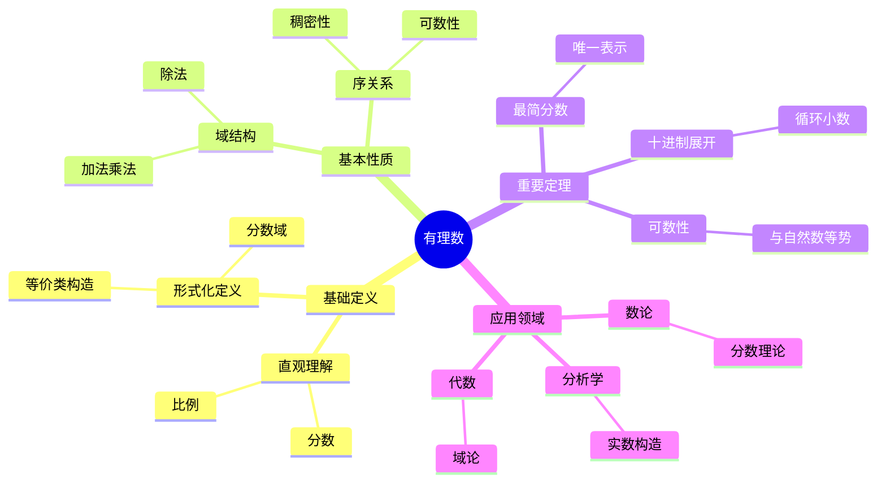
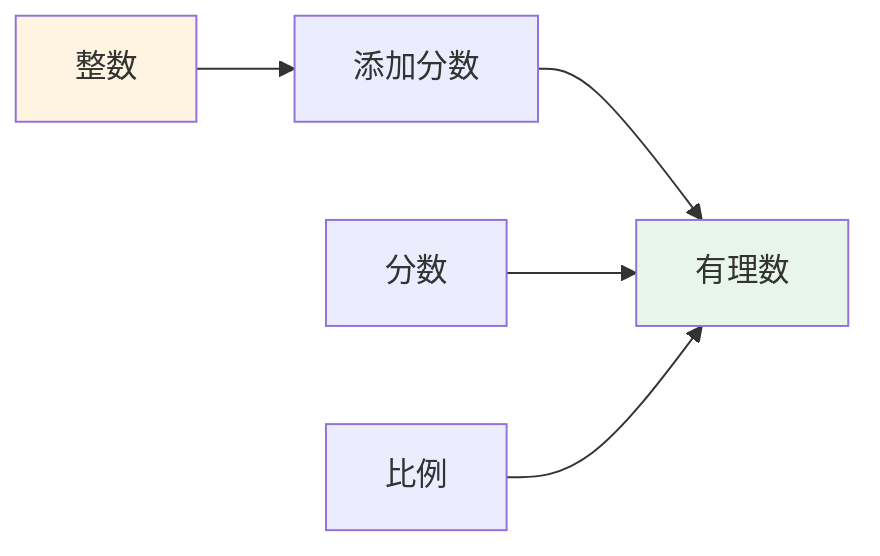
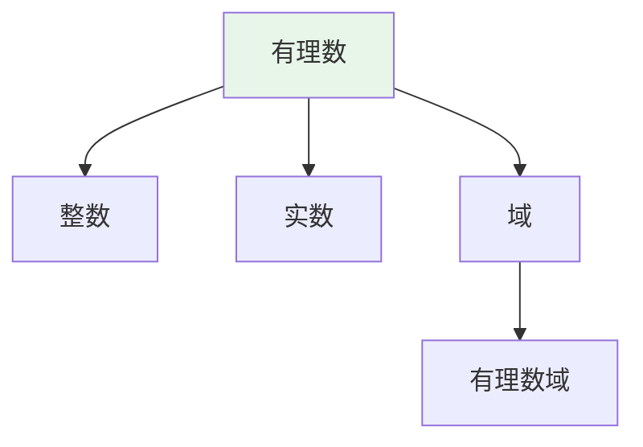
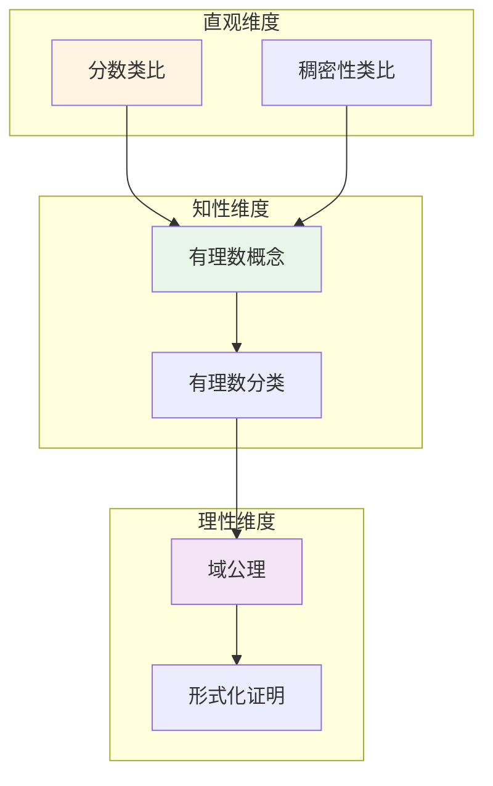

# 有理数 (Rational Number)

**概念编号**: C.CORE.005
**知识层次**: L0-L2
**知识领域**: D1 (基础数学)
**创建日期**: 2025年11月21日
**最后更新**: 2025年11月21日

---

## 📋 概述

有理数是整数的分式扩展，可以表示为两个整数的比。有理数构成一个域，是实数的基础，在数学分析和数论中具有重要地位。

**权威资源对齐**:

- Wikipedia: [Rational Number](https://en.wikipedia.org/wiki/Rational_number)
- Stanford课程: Math 51 (Linear Algebra and Differential Calculus)
- Princeton课程: MAT 201 (Analysis)
- MIT课程: 18.01 (Single Variable Calculus)
- Metamath: [Rational Numbers](http://us.metamath.org/mpeuni/df-q.html)

---

## 🎯 严格定义

### 基础定义 (L0)

**直观理解**: 有理数是可以表示为两个整数比的数，即 $\frac{p}{q}$，其中 $p, q \in \mathbb{Z}$，$q \neq 0$。

**基本定义**: 有理数集 $\mathbb{Q}$ 是所有可以表示为分数 $\frac{a}{b}$ 的数的集合，其中 $a, b \in \mathbb{Z}$，$b \neq 0$。

**简单例子**:

- $\frac{1}{2}$ 是有理数
- $\frac{3}{4}$ 是有理数
- $-\frac{5}{7}$ 是有理数
- $2 = \frac{2}{1}$ 是有理数
- $0 = \frac{0}{1}$ 是有理数

### 形式化定义 (L1)

**等价类构造**: 有理数可以通过整数对的等价类构造：

**定义**: 在 $\mathbb{Z} \times (\mathbb{Z} \setminus \{0\})$ 上定义等价关系：
$$(a,b) \sim (c,d) \Leftrightarrow ad = bc$$

有理数集定义为：
$$\mathbb{Q} = (\mathbb{Z} \times (\mathbb{Z} \setminus \{0\})) / \sim$$

其中 $(a,b)$ 表示 $\frac{a}{b}$。

**加法定义**:
$$[(a,b)] + [(c,d)] = [(ad+bc, bd)]$$

**乘法定义**:
$$[(a,b)] \cdot [(c,d)] = [(ac, bd)]$$

**负号定义**:
$$-[(a,b)] = [(-a,b)]$$

**倒数定义**:
$$[(a,b)]^{-1} = [(b,a)] \quad (a \neq 0)$$

**记号**:

- $\mathbb{Q} = \{\frac{p}{q} : p, q \in \mathbb{Z}, q \neq 0\}$: 有理数集
- $\frac{a}{b}$: 有理数（$a$ 是分子，$b$ 是分母）
- $\gcd(a,b) = 1$: 最简分数（分子分母互质）

**等价定义**:

- **等价类构造**: 通过整数对的等价类
- **分式域**: 整数环的分式域
- **序对构造**: 直接定义 $\mathbb{Q} = \{\frac{a}{b} : a, b \in \mathbb{Z}, b \neq 0\}$

---

## 📚 历史背景

### 发展脉络

**古代**: 有理数的起源

- **古埃及 (3000 BCE)**: 使用分数（单位分数）
- **古巴比伦 (2000 BCE)**: 发展60进制分数系统
- **古希腊 (600 BCE)**: 研究比例和分数（毕达哥拉斯学派）

**中世纪**: 有理数的系统化

- **印度 (7世纪)**: 发展分数运算
- **阿拉伯 (9世纪)**: 传播分数知识到欧洲
- **欧洲 (12-13世纪)**: 接受和使用分数

**19世纪**: 有理数的严格构造

- **Dedekind (1872)**: 在《连续性与无理数》中给出有理数的严格定义
- **Cantor (1872)**: 通过Cauchy序列构造有理数
- **Weierstrass (1872)**: 严格化有理数理论

**20世纪**: 有理数的公理化

- **Bourbaki (1939)**: 在集合论框架下统一有理数理论
- **Grothendieck (1957)**: 引入分式域构造

### 关键人物

- **Richard Dedekind (1831-1916)**: 给出有理数的严格构造
- **Georg Cantor (1845-1918)**: 通过Cauchy序列研究有理数
- **Karl Weierstrass (1815-1897)**: 严格化有理数理论

### 重要事件

- **1872**: Dedekind和Cantor独立给出实数的严格构造（包含有理数）
- **1939**: Bourbaki统一有理数理论

---

## 🔍 性质与定理

### 基本性质 (L1)

**性质1: 有理数的域结构**:

- **陈述**: 有理数集 $\mathbb{Q}$ 配备加法和乘法构成域
- **加法性质**:
  - 交换律：$\frac{a}{b} + \frac{c}{d} = \frac{c}{d} + \frac{a}{b}$
  - 结合律：$(\frac{a}{b} + \frac{c}{d}) + \frac{e}{f} = \frac{a}{b} + (\frac{c}{d} + \frac{e}{f})$
  - 单位元：$\frac{0}{1} + \frac{a}{b} = \frac{a}{b}$
  - 逆元：$\frac{a}{b} + (-\frac{a}{b}) = 0$
- **乘法性质**:
  - 交换律：$\frac{a}{b} \cdot \frac{c}{d} = \frac{c}{d} \cdot \frac{a}{b}$
  - 结合律：$(\frac{a}{b} \cdot \frac{c}{d}) \cdot \frac{e}{f} = \frac{a}{b} \cdot (\frac{c}{d} \cdot \frac{e}{f})$
  - 单位元：$\frac{1}{1} \cdot \frac{a}{b} = \frac{a}{b}$
  - 逆元：$\frac{a}{b} \cdot \frac{b}{a} = 1$（$a \neq 0$）
- **分配律**: $\frac{a}{b} \cdot (\frac{c}{d} + \frac{e}{f}) = \frac{a}{b} \cdot \frac{c}{d} + \frac{a}{b} \cdot \frac{e}{f}$
- **证明思路**: 由等价类构造和运算定义直接得到
- **应用**: 有理数运算、域论

**性质2: 有理数的序**:

- **定义**: $\frac{a}{b} < \frac{c}{d}$ 当且仅当 $ad < bc$（假设 $b, d > 0$）
- **性质**:
  - 三歧性：$\forall r, s \in \mathbb{Q}$，$r < s$、$r = s$、$r > s$ 恰有一个成立
  - 传递性：$r < s \land s < t \Rightarrow r < t$
  - 与运算相容：$r < s \Rightarrow r+t < s+t$，若 $t > 0$ 则 $rt < st$
- **证明思路**: 由整数的序和有理数的构造得到
- **应用**: 有理数比较、排序

**性质3: 有理数的稠密性**:

- **陈述**: 任意两个不同的有理数之间存在另一个有理数
- **证明思路**: 对于 $r < s$，取 $t = \frac{r+s}{2}$，则 $r < t < s$
- **应用**: 有理数逼近、实数构造

**性质4: 有理数的可数性**:

- **陈述**: 有理数集是可数无限的，基数 $|\mathbb{Q}| = \aleph_0$
- **证明思路**:
  1. 构造双射 $f: \mathbb{N} \to \mathbb{Q}$
  2. 使用Cantor配对函数或对角线法
  3. 例如：按分母大小和分子大小排序
- **应用**: 基数理论、可数性

**性质5: 有理数的Archimedes性质**:

- **陈述**: 对于任意正有理数 $r$，存在自然数 $n$ 使得 $n > r$
- **证明思路**: 由整数的Archimedes性质得到
- **应用**: 极限理论、实数构造

### 重要定理 (L2)

**定理1: 有理数的唯一表示（最简分数）**:

- **陈述**: 每个非零有理数可以唯一地表示为最简分数 $\frac{p}{q}$，其中 $\gcd(p,q) = 1$，$q > 0$
- **证明思路**:
  1. 存在性：约分得到最简分数
  2. 唯一性：若 $\frac{a}{b} = \frac{c}{d}$ 且都是最简分数，则 $a = c$，$b = d$
- **应用**: 有理数的标准表示

**定理2: 有理数的十进制展开**:

- **陈述**: 每个有理数有有限或循环的十进制展开
- **证明思路**:
  1. 考虑 $\frac{p}{q}$ 的十进制展开
  2. 使用带余除法，余数有限（最多 $q$ 个）
  3. 因此展开是循环的
- **应用**: 有理数的表示、数论

**定理3: 有理数在实数中的稠密性**:

- **陈述**: 有理数在实数中稠密，即任意两个不同的实数之间存在有理数
- **证明思路**: 由实数的Archimedes性质和有理数的稠密性得到
- **应用**: 实数逼近、分析学

**定理4: 有理数的完备性（不成立）**:

- **陈述**: 有理数集不是完备的，存在Cauchy序列不收敛到有理数
- **例子**: 序列 $a_n = (1 + \frac{1}{n})^n$ 收敛到 $e$（无理数）
- **应用**: 实数的必要性、完备性

---

## 💡 应用实例

### 理论应用

**应用1: 数学分析**:

- 有理数是实分析的基础
- 例如：有理数的极限、有理函数的连续性

**应用2: 数论**:

- 有理数用于研究Diophantine方程
- 例如：有理点、椭圆曲线的有理点

**应用3: 代数**:

- 有理数域是域论的典型例子
- 例如：域扩张、Galois理论

**应用4: 几何**:

- 有理数用于研究有理曲线
- 例如：有理参数化、代数曲线

### 实际应用

**应用1: 测量**:

- 有理数用于精确测量
- 例如：长度、重量、时间的测量

**应用2: 金融**:

- 有理数用于金融计算
- 例如：利率、汇率、百分比

**应用3: 工程**:

- 有理数用于工程设计
- 例如：比例、缩放、标准化

**应用4: 计算机科学**:

- 有理数用于精确计算
- 例如：符号计算、有理数算术

### 交叉应用

**应用1: 代数数论**:

- 有理数域是代数数论的基础
- 例如：数域的基域、类域论

**应用2: 代数几何**:

- 有理数用于研究代数簇
- 例如：有理点、Mordell-Weil定理

**应用3: 表示论**:

- 有理数用于表示理论
- 例如：有理表示、特征标

**应用4: 计算数论**:

- 有理数用于计算
- 例如：有理数算法、符号计算

---

## 🔗 关联概念

### 依赖关系

**前置知识**:

- 整数（有理数通过整数构造）
- 等价关系（有理数的等价类构造）
- 域（有理数是域）

**后续知识**:

- 实数（有理数的完备化）
- 代数数（有理数的代数扩张）
- 域论（有理数域）

### 等价关系

**等价定义**:

- 等价类构造（整数对的等价类）
- 分式域（整数环的分式域）
- 序对构造（直接定义）

### 推广关系

**特殊情形**:

- 整数（分母为1的有理数）
- 正有理数（$\mathbb{Q}^+$）
- 负有理数（$\mathbb{Q}^-$）

**一般推广**:

- 实数（有理数的完备化）
- 代数数（有理数的代数扩张）
- 分式域（一般整环的分式域）

### 应用关系

**理论应用**:

- 数学分析
- 数论
- 代数
- 几何

**实际问题**:

- 测量
- 金融
- 工程
- 计算机科学

---

## 📖 参考文献

### 权威资源

- Wikipedia: [Rational Number](https://en.wikipedia.org/wiki/Rational_number)
- Wikipedia: [Construction of the Rational Numbers](https://en.wikipedia.org/wiki/Construction_of_the_rational_numbers)
- Metamath: [Rational Numbers](http://us.metamath.org/mpeuni/df-q.html)

### 经典教材

- Dedekind, R. (1872). *Stetigkeit und irrationale Zahlen*. Vieweg.
- Rudin, W. (1976). *Principles of Mathematical Analysis*. McGraw-Hill.
- Artin, M. (2011). *Algebra*. Prentice Hall.
- Lang, S. (2002). *Algebra*. Springer.

### 历史文献

- Cantor, G. (1872). "Über die Ausdehnung eines Satzes aus der Theorie der trigonometrischen Reihen". *Mathematische Annalen*.

---

## 🎓 学习路径

### 基础路径 (L0→L1)

1. **直观理解**: 有理数是可以表示为分数的数
2. **基本定义**: 有理数的等价类构造
3. **简单例子**: 分数、整数、小数
4. **基本运算**: 加法、减法、乘法、除法
5. **形式化定义**: 等价类构造、分式域

### 进阶路径 (L1→L2)

1. **有理数性质**: 域结构、序关系、稠密性
2. **可数性**: 有理数的可数性证明
3. **重要定理**: 最简分数、十进制展开
4. **应用实例**: 数学分析、数论、代数
5. **深入定理**: 有理数在实数中的稠密性

### 高级路径 (L2→L3)

1. **代数数论**: 有理数域、数域
2. **代数几何**: 有理点、Mordell-Weil定理
3. **表示论**: 有理表示、特征标
4. **前沿研究**: 有理数算法、符号计算
5. **研究工具**: 计算软件、数论工具

---

## 🗺️ 思维导图 (编号: C.CORE.005.MIND)

### 有理数概念思维导图

---

## 📊 知识多维关系矩阵 (编号: C.CORE.005.MATRIX)

### 有理数的多维关系矩阵

| 维度 | 指标 | 有理数 |
|------|------|--------|
| **知识层次** | L0基础 | ⭐⭐⭐⭐⭐ |
| | L1中级 | ⭐⭐⭐⭐ |
| | L2高级 | ⭐⭐⭐ |
| | L3研究 | ⭐⭐ |
| **知识领域** | D1基础数学 | ⭐⭐⭐⭐⭐ |
| | D2代数 | ⭐⭐⭐ |
| | D3分析 | ⭐⭐⭐⭐ |
| | D6数论 | ⭐⭐⭐ |
| **依赖关系** | 前置概念 | 整数 |
| | 后续概念 | 实数、复数 |
| **应用关系** | 理论应用 | ⭐⭐⭐⭐ |
| | 实际应用 | ⭐⭐⭐⭐⭐ |
| | 交叉应用 | ⭐⭐⭐ |
| **学习难度** | 直观理解 | ⭐ |
| | 形式化理解 | ⭐⭐⭐ |
| | 深入应用 | ⭐⭐ |

---

## 💭 形象化解释与论证 (编号: C.CORE.005.VISUAL)

### 形象化解释

**1. 有理数的直观理解**:

- **类比**: 有理数就像"分数"或"比例"
- **例子**:
  - 分蛋糕：$\frac{1}{2}$表示一半，$\frac{1}{3}$表示三分之一
  - 比例：$\frac{3}{4}$表示3比4的比例
  - 百分比：$\frac{50}{100} = 50\%$

**2. 有理数运算的直观理解**:

- **加法**: 通分后相加（如$\frac{1}{2} + \frac{1}{3} = \frac{5}{6}$）
- **乘法**: 分子乘分子，分母乘分母（如$\frac{1}{2} \times \frac{1}{3} = \frac{1}{6}$）
- **除法**: 乘以倒数（如$\frac{1}{2} \div \frac{1}{3} = \frac{3}{2}$）

**3. 稠密性的直观理解**:

- **类比**: 稠密性就像"任意两个点之间都有其他点"
- **例子**:
  - 在0和1之间，有$\frac{1}{2}$、$\frac{1}{3}$、$\frac{2}{3}$等无数个有理数
  - 任意两个有理数之间都存在另一个有理数

### 认知科学视角

**1. 数学教育家Dienes的观点**:

- **多表征原则**: 通过分数、小数、比例等多种方式表示有理数
- **变化性原则**: 通过不同的有理数例子理解有理数的本质
- **教学启示**: 使用分数条、数轴、比例图等多种教学工具

**2. 数学认知学家Tall的观点**:

- **过程-对象对偶**: 理解"有理数运算"（过程）和"有理数"（对象）
- **认知层次**: 从具体分数（如"$\frac{1}{2}$个苹果"）到抽象有理数（如"$\frac{1}{2}$"本身）

---

## 👨‍🏫 专家观点与论证 (编号: C.CORE.005.EXPERT)

### 数学家的观点

**1. Richard Dedekind (1831-1916) - 有理数理论的奠基者**:
> "有理数是整数的分数域，是实数构造的基础。"
>
> **意义**: Dedekind建立了有理数的严格理论基础，为实数构造奠定了基础。

**2. Georg Cantor (1845-1918) - 集合论创始人**:
> "有理数是可数的，与自然数等势，这揭示了无限集合的奇妙性质。"
>
> **意义**: Cantor证明了有理数的可数性，开创了集合论。

### 数学教育家的观点

**1. Zoltan Dienes (1916-2014) - 数学教育家**:
> "有理数概念应该通过分数、小数、比例等多种方式学习。"
>
> **教学启示**:
>
> - 使用分数条可视化分数
> - 使用数轴理解有理数的序
> - 逐步抽象到一般有理数概念

**2. Hans Freudenthal (1905-1990) - 数学教育家**:
> "有理数概念的学习需要从'分数'发展到'抽象有理数结构'。"
>
> **认知发展**:
>
> - **分数阶段**: 理解分数作为部分与整体的关系
> - **结构阶段**: 理解有理数作为域的结构

### 数学认知学家的观点

**1. David Tall - 数学认知学家**:
> "有理数概念的理解需要从'过程'（如何运算）发展到'对象'（有理数本身）。"
>
> **认知层次**:
>
> - **过程层次**: 理解"如何做有理数运算"（如$\frac{1}{2} + \frac{1}{3}$）
> - **对象层次**: 理解"有理数"（如$\frac{1}{2}$是一个有理数）

---

## 🎨 认知维度表征 (编号: C.CORE.005.COGNITIVE)

### 直观维度表征 (编号: C.CORE.005.INTUITIVE)

#### 形象类比

- **分数类比**: 有理数就像"分数"
  - 就像分蛋糕：$\frac{1}{2}$表示一半
  - 就像比例：$\frac{3}{4}$表示3比4

- **稠密性类比**: 有理数就像"密集分布的数"
  - 任意两个有理数之间还有有理数
  - 就像数轴上的点很密集

#### 具体例子

- **例子1**: $\frac{1}{2}, \frac{1}{3}, \frac{2}{3}, \ldots$ - 分数
  - 分数的表示
  - 这是有理数的基本形式

- **例子2**: 小数表示
  - $\frac{1}{2} = 0.5$
  - $\frac{1}{3} = 0.333\ldots$

#### 可视化表示

#### 几何直观

- **数轴直观**: 通过数轴理解有理数
  - 有理数在数轴上的位置
  - 有理数的稠密性

- **分数条直观**: 通过分数条理解有理数
  - 分数条表示分数
  - 分数的比较和运算

---

### 知性维度表征 (编号: C.CORE.005.INTELLECTUAL)

#### 概念定义

- **严格定义**: 有理数是整数对$(a,b)$（$b \neq 0$）的等价类，记作$\frac{a}{b}$
- **等价定义**: 通过分数域、等价类构造定义
- **特征描述**: 有理数是域，是整数的分式域

#### 概念分类

- **正有理数 vs 负有理数 vs 零**: 按符号分类
- **有限小数 vs 无限循环小数**: 按小数表示分类
- **最简分数 vs 非最简分数**: 按约分分类

#### 概念关系

#### 知识矩阵

| 维度 | 指标 | 有理数 |
|------|------|--------|
| **知识层次** | L0基础 | ⭐⭐⭐⭐⭐ |
| | L1中级 | ⭐⭐⭐ |
| | L2高级 | ⭐⭐ |
| **知识领域** | D1基础数学 | ⭐⭐⭐⭐⭐ |
| **学习难度** | 直观理解 | ⭐ |
| | 形式化理解 | ⭐⭐⭐ |
| **认知维度** | 直观维度 | ⭐⭐⭐⭐⭐ |
| | 知性维度 | ⭐⭐⭐⭐ |
| | 理性维度 | ⭐⭐⭐ |

---

### 理性维度表征 (编号: C.CORE.005.RATIONAL)

#### 公理体系

- **域公理**: 有理数是域
- **序公理**: 有理数是全序集
- **稠密性**: 有理数在实数中稠密

#### 形式化定义

- **形式化定义**: 使用一阶逻辑严格定义
- **符号系统**: $\mathbb{Q}$, $\frac{a}{b}$, $+$, $-$, $\times$, $\div$
- **类型系统**: 有理数是整数类型的分式域类型

#### 逻辑推理

- **基本定理**: 有理数的运算性质、唯一表示、可数性
- **证明思路**: 使用整数公理和逻辑推理证明
- **推理链**: 定义 → 基本性质 → 运算性质 → 重要定理

#### 证明系统

- **证明方法**: 构造性证明、反证法、归纳法
- **形式化证明**: 可以使用Lean4等工具进行形式化
- **验证工具**: Metamath、Lean4等

---

### 综合整合表征 (编号: C.CORE.005.INTEGRATED)

#### 多维度整合

#### 图形转换

- **思维导图**: 展示有理数的知识结构
- **知识图谱**: 展示有理数与其他概念的关系
- **知识矩阵**: 展示有理数的多维度特征

#### 应用示例

- **应用1**: 数学基础（所有数系的基础）
- **应用2**: 实际应用（测量、计算）
- **应用3**: 数论（有理数域、代数数）

---

**创建日期**: 2025年11月21日
**最后更新**: 2025年11月21日
**维护状态**: 持续更新中
