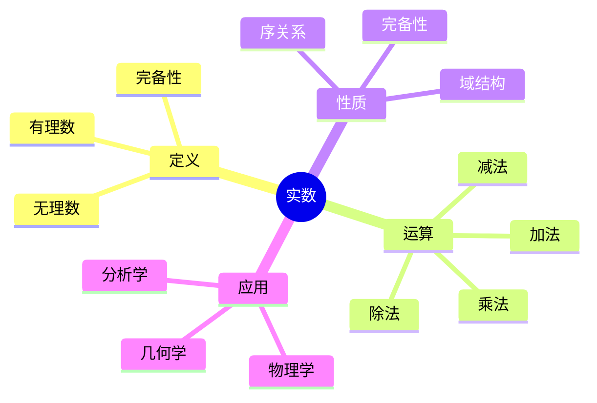
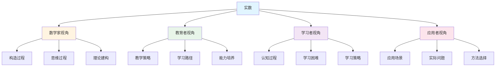
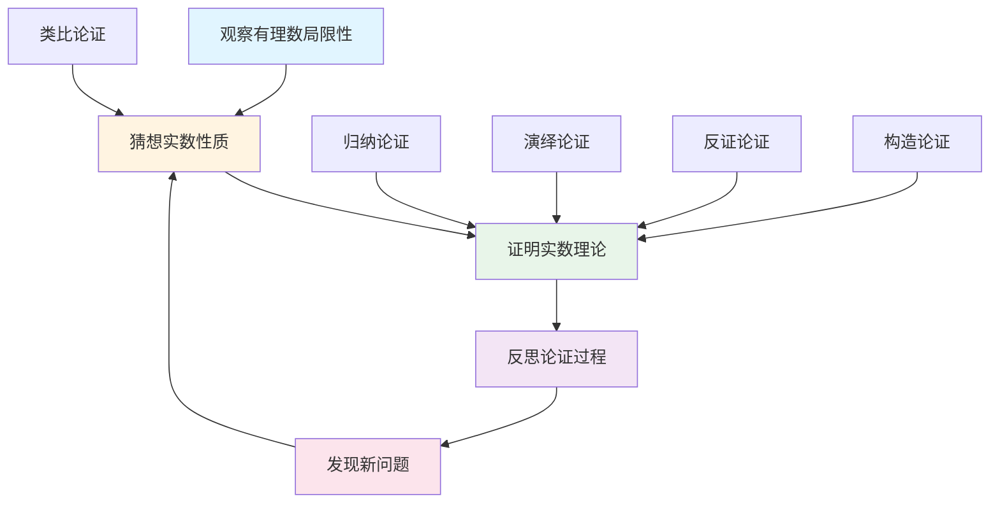
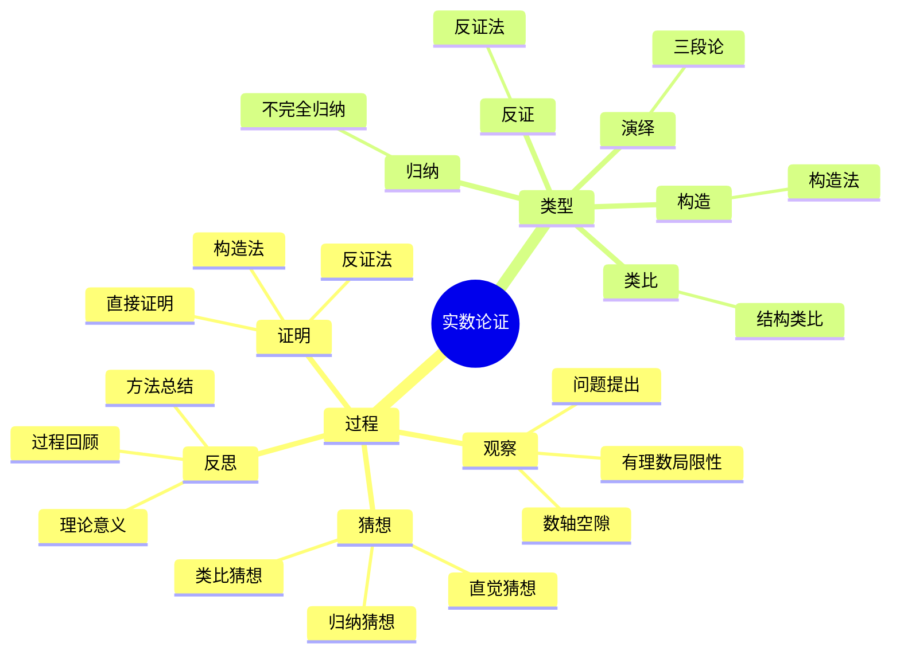

# 实数 (Real Number) - 三视角组织版

**概念编号**: C.CORE.006
**知识层次**: L0-L2
**知识领域**: D1 (基础数学)
**创建日期**: 2025年1月
**最后更新**: 2025年1月

---

## 📋 目录 / Table of Contents

- [实数 (Real Number) - 三视角组织版](#实数-real-number---三视角组织版)
  - [📋 目录 / Table of Contents](#-目录--table-of-contents)
  - [1. 📋 概述 (编号: C.CORE.006.01)](#1--概述-编号-ccore00601)
  - [🧠 认知学视角：如何理解实数 (编号: C.CORE.006.02)](#-认知学视角如何理解实数-编号-ccore00602)
    - [认知起点 (编号: C.CORE.006.02.01)](#认知起点-编号-ccore0060201)
    - [认知过程 (编号: C.CORE.006.02.02)](#认知过程-编号-ccore0060202)
      - [阶段1：直观理解阶段 (编号: C.CORE.006.02.02.01)](#阶段1直观理解阶段-编号-ccore006020201)
      - [阶段2：概念形成阶段 (编号: C.CORE.006.02.02.02)](#阶段2概念形成阶段-编号-ccore006020202)
      - [阶段3：形式化阶段 (编号: C.CORE.006.02.02.03)](#阶段3形式化阶段-编号-ccore006020203)
    - [认知障碍 (编号: C.CORE.006.02.03)](#认知障碍-编号-ccore0060203)
    - [认知工具 (编号: C.CORE.006.02.04)](#认知工具-编号-ccore0060204)
  - [🎓 教育学视角：如何教学实数 (编号: C.CORE.006.03)](#-教育学视角如何教学实数-编号-ccore00603)
    - [教学目标 (编号: C.CORE.006.03.01)](#教学目标-编号-ccore0060301)
    - [教学路径 (编号: C.CORE.006.03.02)](#教学路径-编号-ccore0060302)
      - [阶段1：引入阶段（激发兴趣） (编号: C.CORE.006.03.02.01)](#阶段1引入阶段激发兴趣-编号-ccore006030201)
      - [阶段2：探索阶段（主动建构） (编号: C.CORE.006.03.02.02)](#阶段2探索阶段主动建构-编号-ccore006030202)
      - [阶段3：形式化阶段（抽象概括） (编号: C.CORE.006.03.02.03)](#阶段3形式化阶段抽象概括-编号-ccore006030203)
      - [阶段4：巩固阶段（应用深化） (编号: C.CORE.006.03.02.04)](#阶段4巩固阶段应用深化-编号-ccore006030204)
    - [教学难点 (编号: C.CORE.006.03.03)](#教学难点-编号-ccore0060303)
    - [教学策略 (编号: C.CORE.006.03.04)](#教学策略-编号-ccore0060304)
    - [评估方法 (编号: C.CORE.006.03.05)](#评估方法-编号-ccore0060305)
  - [🔬 数学家视角：如何思考实数 (编号: C.CORE.006.04)](#-数学家视角如何思考实数-编号-ccore00604)
    - [问题起源 (编号: C.CORE.006.04.01)](#问题起源-编号-ccore0060401)
    - [思维过程 (编号: C.CORE.006.04.02)](#思维过程-编号-ccore0060402)
      - [步骤1：问题提出 (编号: C.CORE.006.04.02.01)](#步骤1问题提出-编号-ccore006040201)
      - [步骤2：概念形成 (编号: C.CORE.006.04.02.02)](#步骤2概念形成-编号-ccore006040202)
      - [步骤3：理论发展 (编号: C.CORE.006.04.02.03)](#步骤3理论发展-编号-ccore006040203)
    - [历史发展 (编号: C.CORE.006.04.03)](#历史发展-编号-ccore0060403)
    - [3.2 关键人物和贡献 (编号: C.CORE.006.04.04)](#32-关键人物和贡献-编号-ccore0060404)
    - [重要定理 (编号: C.CORE.006.04.05)](#重要定理-编号-ccore0060405)
    - [开放问题 (编号: C.CORE.006.04.06)](#开放问题-编号-ccore0060406)
    - [一、第一人称思维描述 (编号: C.CORE.006.04.07)](#一第一人称思维描述-编号-ccore0060407)
      - [1.1 Dedekind的发现过程](#11-dedekind的发现过程)
      - [1.2 Cantor的构造思维](#12-cantor的构造思维)
    - [二、数学直觉的形成 (编号: C.CORE.006.04.08)](#二数学直觉的形成-编号-ccore0060408)
      - [2.1 直觉在概念发现中的作用](#21-直觉在概念发现中的作用)
      - [2.2 如何培养实数直觉](#22-如何培养实数直觉)
    - [三、数学美的教育价值 (编号: C.CORE.006.04.09)](#三数学美的教育价值-编号-ccore0060409)
      - [3.1 实数论的美在哪里](#31-实数论的美在哪里)
      - [3.2 如何培养学生的数学美感](#32-如何培养学生的数学美感)
    - [四、问题解决策略 (编号: C.CORE.006.04.10)](#四问题解决策略-编号-ccore0060410)
      - [4.1 数学家的启发式方法](#41-数学家的启发式方法)
      - [4.2 思维过程分析](#42-思维过程分析)
    - [五、批判性反思 (编号: C.CORE.006.04.11)](#五批判性反思-编号-ccore0060411)
      - [5.1 实数概念的局限性](#51-实数概念的局限性)
      - [5.2 实数理论的未解决问题](#52-实数理论的未解决问题)
  - [💡 数学解释：为什么实数是这样定义的 (编号: C.CORE.006.05)](#-数学解释为什么实数是这样定义的-编号-ccore00605)
    - [一、直观解释：实数是什么？](#一直观解释实数是什么)
      - [1.1 具体例子](#11-具体例子)
      - [1.2 形象类比](#12-形象类比)
      - [1.3 几何直观](#13-几何直观)
      - [1.4 操作体验](#14-操作体验)
    - [二、知性解释：实数的本质是什么？](#二知性解释实数的本质是什么)
      - [2.1 概念定义](#21-概念定义)
      - [2.2 分类体系](#22-分类体系)
      - [2.3 抽象结构](#23-抽象结构)
      - [2.4 知识体系](#24-知识体系)
    - [三、理性解释：实数的公理化定义](#三理性解释实数的公理化定义)
      - [3.1 公理体系](#31-公理体系)
      - [3.2 形式化证明](#32-形式化证明)
      - [3.3 系统建构](#33-系统建构)
    - [四、多视角解释：从不同角度理解实数](#四多视角解释从不同角度理解实数)
      - [4.1 数学家视角：实数是如何被发现的？](#41-数学家视角实数是如何被发现的)
      - [4.2 教育者视角：如何教学实数？](#42-教育者视角如何教学实数)
      - [4.3 学习者视角：如何学习实数？](#43-学习者视角如何学习实数)
      - [4.4 应用者视角：如何应用实数？](#44-应用者视角如何应用实数)
    - [五、思维表征：用多种方式理解实数](#五思维表征用多种方式理解实数)
      - [5.1 思维导图：实数的知识结构](#51-思维导图实数的知识结构)
      - [5.2 矩阵对比：不同解释方式的对比](#52-矩阵对比不同解释方式的对比)
      - [5.3 多视角表征：从不同角度表征实数](#53-多视角表征从不同角度表征实数)
  - [🔍 数学论证：如何论证实数 (编号: C.CORE.006.06)](#-数学论证如何论证实数-编号-ccore00606)
    - [一、论证过程：从观察到反思](#一论证过程从观察到反思)
      - [1.1 观察（Observation）](#11-观察observation)
      - [1.2 猜想（Conjecture）](#12-猜想conjecture)
      - [1.3 证明（Proof）](#13-证明proof)
      - [1.4 反思（Reflection）](#14-反思reflection)
    - [二、论证类型：多种推理方式](#二论证类型多种推理方式)
      - [2.1 归纳论证（Inductive Reasoning）](#21-归纳论证inductive-reasoning)
      - [2.2 演绎论证（Deductive Reasoning）](#22-演绎论证deductive-reasoning)
      - [2.3 类比论证（Analogical Reasoning）](#23-类比论证analogical-reasoning)
      - [2.4 反证论证（Proof by Contradiction）](#24-反证论证proof-by-contradiction)
      - [2.5 构造论证（Constructive Reasoning）](#25-构造论证constructive-reasoning)
    - [三、论证可视化：用图形表示论证过程](#三论证可视化用图形表示论证过程)
      - [3.1 论证流程图](#31-论证流程图)
      - [3.2 论证类型对比](#32-论证类型对比)
      - [3.3 论证思维导图](#33-论证思维导图)
  - [🔗 三视角整合 (编号: C.CORE.006.07)](#-三视角整合-编号-ccore00607)
    - [三个视角的关联](#三个视角的关联)
    - [如何综合运用三个视角](#如何综合运用三个视角)
  - [📚 参考文献 (编号: C.CORE.006.08)](#-参考文献-编号-ccore00608)
    - [权威资源](#权威资源)
    - [经典教材](#经典教材)
    - [研究论文](#研究论文)

---

## 1. 📋 概述 (编号: C.CORE.006.01)

实数是数学分析的基础，是有理数的完备化。实数的严格构造解决了微积分的基础问题，是现代数学分析的核心。

本文档从**数学认知学**、**教育学**、**数学家**三个视角深入展开实数概念，避免简单的概念堆垒。

**权威资源对齐**:

- Wikipedia: [Real Number](https://en.wikipedia.org/wiki/Real_number)
- Wikipedia: [Construction of the Real Numbers](https://en.wikipedia.org/wiki/Construction_of_the_real_numbers)
- Stanford课程: Math 61 (Set Theory), Math 171 (Real Analysis)
- Princeton课程: MAT 201 (Analysis)
- MIT课程: 18.100A (Real Analysis)
- Metamath: [Real Numbers](http://us.metamath.org/mpeuni/df-r.html)

---

## 🧠 认知学视角：如何理解实数 (编号: C.CORE.006.02)

### 认知起点 (编号: C.CORE.006.02.01)

**学习者已有的知识基础**:

- 有理数的概念
- 数轴的概念
- 日常经验中的"连续"、"无限"概念

**日常经验中的类似概念**:

- "数轴上的所有点"：对应实数
- "连续的量"：长度、时间等
- "无限小数"：$\pi = 3.14159...$

### 认知过程 (编号: C.CORE.006.02.02)

#### 阶段1：直观理解阶段 (编号: C.CORE.006.02.02.01)

**具体例子**:

- 例子1：$\sqrt{2} = 1.41421...$ - 无理数
- 例子2：$\pi = 3.14159...$ - 无理数
- 例子3：$e = 2.71828...$ - 无理数

**形象类比**:

- **数轴类比**: 实数就像"数轴上的所有点"
  - 有理数对应数轴上的有理点
  - 无理数对应数轴上的无理点
  - 实数对应数轴上的所有点

- **连续类比**: 实数就像"连续的量"
  - 就像长度：可以无限细分
  - 就像时间：可以无限细分

**可视化表示**:

```text
数轴表示:
    ... -2  -1   0   1   2   ...
    <----|----|----|----|---->
         √2  π   e
```

#### 阶段2：概念形成阶段 (编号: C.CORE.006.02.02.02)

**从例子中抽象出共同特征**:

- 所有例子都涉及"数轴上的点"
- 需要表示"连续"的概念
- 需要扩展有理数到无理数

**识别关键属性**:

1. **完备性**: 每个Cauchy序列都收敛
2. **稠密性**: 有理数和无理数都在实数中稠密
3. **连续性**: 实数集是连续的

**建立概念边界**:

- **什么是实数**: 数轴上的所有点对应的数
- **什么不是实数**:
  - 虚数（不是实数）
  - 复数（不是实数）

#### 阶段3：形式化阶段 (编号: C.CORE.006.02.02.03)

**严格定义**:

- Dedekind分割：通过有理数的分割构造
- Cauchy序列：通过Cauchy序列的等价类构造
- 公理化定义：通过完备有序域的公理

**公理化表述**:

- 实数集$\mathbb{R}$是满足完备有序域公理的集合
- 包含有理数作为子集
- 满足完备性（每个Cauchy序列都收敛）

**逻辑结构**:

- 实数是有理数的完备化
- 实数构成完备有序域
- 实数是分析学的基础

### 认知障碍 (编号: C.CORE.006.02.03)

**常见误解**:

1. **误解1**: 认为所有数都是有理数
   - **纠正**: 存在无理数，如$\sqrt{2}$、$\pi$

2. **误解2**: 认为实数是有限的
   - **纠正**: 实数是无限的，而且是不可数的

3. **误解3**: 混淆实数和复数
   - **纠正**: 实数是复数的子集

**理解难点**:

1. **难点1**: 无理数的概念
   - **原因**: 无理数不能表示为分数
   - **解决方法**: 用具体例子，如$\sqrt{2}$、$\pi$

2. **难点2**: 实数的完备性
   - **原因**: 完备性比较抽象
   - **解决方法**: 用Cauchy序列和收敛的概念

3. **难点3**: 实数的构造
   - **原因**: Dedekind分割和Cauchy序列构造比较抽象
   - **解决方法**: 从具体例子开始，逐步抽象

**认知陷阱**:

- **无理数的存在**: 需要理解$\sqrt{2}$等无理数的存在
- **实数的完备性**: 需要理解Cauchy序列的收敛性

### 认知工具 (编号: C.CORE.006.02.04)

**类比工具**:

- **数轴类比**: 实数 = 数轴上的所有点
- **连续类比**: 实数 = 连续的量

**可视化工具**:

- **数轴**: 用数轴表示实数
- **图形**: 用图形表示实数的性质

**具体化工具**:

- **具体例子**: 用具体例子理解抽象概念
- **反例**: 用反例理解概念边界

---

## 🎓 教育学视角：如何教学实数 (编号: C.CORE.006.03)

### 教学目标 (编号: C.CORE.006.03.01)

**知识目标**:

- 理解实数的基本概念
- 掌握实数的表示方法
- 理解实数的完备性
- 理解实数的构造方法

**能力目标**:

- 能够识别实数
- 能够进行实数运算
- 能够用实数解决实际问题
- 能够理解实数的构造

**情感目标**:

- 培养数学抽象思维
- 培养逻辑思维能力
- 激发对数学的兴趣

### 教学路径 (编号: C.CORE.006.03.02)

#### 阶段1：引入阶段（激发兴趣） (编号: C.CORE.006.03.02.01)

**实际问题**:

- 问题1：如何表示$\sqrt{2}$？
- 问题2：如何表示$\pi$？
- 问题3：如何表示数轴上的所有点？

**历史背景**:

- 无理数的发现（$\sqrt{2}$的发现）
- 实数的严格构造
- 实数在分析学中的地位

**引发认知冲突**:

- 问题：有理数不够用怎么办？
- 引出无理数的必要性

#### 阶段2：探索阶段（主动建构） (编号: C.CORE.006.03.02.02)

**引导发现**:

1. 让学生自己列举无理数的例子
2. 让学生观察这些例子的共同特征
3. 引导学生抽象出实数的定义

**合作探究**:

- 小组讨论：什么是实数？
- 小组讨论：实数有哪些性质？
- 小组讨论：如何表示实数？

**多元表征**:

- **语言表征**: "实数是数轴上的所有点对应的数"
- **符号表征**: $\mathbb{R}$
- **图形表征**: 数轴
- **集合表征**: Dedekind分割、Cauchy序列

#### 阶段3：形式化阶段（抽象概括） (编号: C.CORE.006.03.02.03)

**严格定义**:

- Dedekind分割构造
- Cauchy序列构造
- 实数的完备性

**性质证明**:

- 实数的基本性质
- 实数的完备性
- 实数的序关系

**应用拓展**:

- 实数在分析学中的应用
- 实数在几何学中的应用
- 实数在物理学中的应用

#### 阶段4：巩固阶段（应用深化） (编号: C.CORE.006.03.02.04)

**练习应用**:

- 基础练习：实数的表示和运算
- 应用练习：用实数解决实际问题
- 综合练习：实数的综合应用

**变式训练**:

- 不同形式的实数表示
- 不同难度的实数运算
- 实数构造的变式

**知识整合**:

- 实数与其他数系的联系
- 实数在数学体系中的地位

### 教学难点 (编号: C.CORE.006.03.03)

**难点1：无理数的概念**:

- **难点描述**: 学生难以理解无理数
- **解决方法**:
  - 用具体例子，如$\sqrt{2}$、$\pi$
  - 强调无理数的存在性
  - 用数轴可视化

**难点2：实数的完备性**:

- **难点描述**: 学生难以理解完备性
- **解决方法**:
  - 用Cauchy序列的概念
  - 强调收敛的重要性
  - 用具体例子说明

**难点3：实数的构造**:

- **难点描述**: 学生难以理解Dedekind分割和Cauchy序列构造
- **解决方法**:
  - 从具体例子开始
  - 逐步抽象到构造
  - 强调构造的必要性

### 教学策略 (编号: C.CORE.006.03.04)

**策略1：从具体到抽象**:

- 先给出具体例子
- 再抽象出一般概念
- 最后给出严格定义

**策略2：多元表征**:

- 用语言、符号、图形等多种方式表示同一概念
- 帮助学生建立不同表征之间的联系

**策略3：问题驱动**:

- 从实际问题出发
- 引出数学概念
- 解决问题

**策略4：可视化教学**:

- 使用数轴
- 使用图形
- 使用具体例子

### 评估方法 (编号: C.CORE.006.03.05)

**形成性评估**（评估理解过程）:

- 课堂提问：检查学生对概念的理解
- 小组讨论：观察学生的思考过程
- 练习作业：检查学生的应用能力

**总结性评估**（评估最终理解）:

- 测验：检查学生对概念和运算的掌握
- 项目：检查学生应用实数解决实际问题的能力
- 反思：检查学生对实数概念的理解深度

---

## 🔬 数学家视角：如何思考实数 (编号: C.CORE.006.04)

### 问题起源 (编号: C.CORE.006.04.01)

**历史背景**:

- 古代：无理数的发现
- 17-18世纪：微积分的发展
- 19世纪：实数的严格构造

**原始问题**:

- **问题1**: 如何表示$\sqrt{2}$等无理数？
- **问题2**: 如何严格定义实数？
- **问题3**: 实数有哪些性质？

**研究动机**:

- 解决微积分的基础问题
- 建立实数的严格基础
- 统一实数理论

### 思维过程 (编号: C.CORE.006.04.02)

#### 步骤1：问题提出 (编号: C.CORE.006.04.02.01)

**观察到的现象**:

- 有理数不够用（如$\sqrt{2}$不是有理数）
- 需要表示"连续"的概念
- 需要扩展数系

**提出的猜想**:

- 可以引入无理数
- 实数可以通过有理数构造
- 实数构成完备有序域

**需要解决的问题**:

- 如何定义无理数？
- 如何构造实数？
- 实数应该满足什么性质？

#### 步骤2：概念形成 (编号: C.CORE.006.04.02.02)

**尝试性定义**:

- **Dedekind分割**: 通过有理数的分割
- **Cauchy序列**: 通过Cauchy序列的等价类

**性质探索**:

- 实数的完备性
- 实数的序关系
- 实数的域结构

**结构发现**:

- 实数构成完备有序域
- 实数是有理数的完备化
- 实数是分析学的基础

#### 步骤3：理论发展 (编号: C.CORE.006.04.02.03)

**定理证明**:

- 实数的基本性质
- 实数的完备性
- 实数的序关系

**应用拓展**:

- 实数在分析学中的应用
- 实数在几何学中的应用
- 实数在物理学中的应用

**理论完善**:

- Dedekind分割构造
- Cauchy序列构造
- 实数的公理化

### 历史发展 (编号: C.CORE.006.04.03)

**早期阶段**（古代）:

- **古希腊 (5世纪BCE)**: 发现$\sqrt{2}$是无理数
- **古希腊 (4世纪BCE)**: Eudoxus发展比例理论

**关键突破**（19世纪）:

- **Dedekind (1872)**: 提出Dedekind分割构造实数
- **Cantor (1872)**: 独立提出Cauchy序列构造实数
- **Weierstrass (1872)**: 严格化实数理论

**现代发展**（20世纪）:

- **Hilbert (1900)**: 提出实数公理化问题
- **Bourbaki (1939)**: 统一实数理论

### 3.2 关键人物和贡献 (编号: C.CORE.006.04.04)

**Richard Dedekind (1831-1916)**:

- 提出Dedekind分割构造实数
- 建立实数的理论基础

**Georg Cantor (1845-1918)**:

- 独立提出Cauchy序列构造实数
- 证明实数的不可数性

**Karl Weierstrass (1815-1897)**:

- 严格化实数理论
- 建立分析学的基础

### 重要定理 (编号: C.CORE.006.04.05)

**实数的完备性**:

- 每个Cauchy序列都收敛
- 等价于上确界性质
- 意义：为分析学提供基础

**实数的不可数性**:

- 实数集是不可数的
- 证明思路：Cantor对角线法
- 意义：说明实数和有理数的区别

### 开放问题 (编号: C.CORE.006.04.06)

**未解决问题**:

- 实数的哲学问题
- 实数的构造问题
- 实数的应用问题

**研究方向**:

- 实数的范畴论研究
- 实数的计算理论研究
- 实数的应用研究

### 一、第一人称思维描述 (编号: C.CORE.006.04.07)

#### 1.1 Dedekind的发现过程

**详细历史背景**:

- **1872年**：Dedekind发表《连续性与无理数》（Stetigkeit und irrationale Zahlen）
- **背景**：研究连续性的本质，发现有理数不足以表示所有量
- **问题**：如何严格定义实数？如何填补有理数的"空隙"？

**Dedekind的详细第一人称描述**:
> "1872年，我在研究连续性时，遇到了一个问题：有理数不足以表示所有量。
>
> 我发现，$\sqrt{2}$不是有理数。这让我意识到，数轴上有'空隙'，有理数不能填满整个数轴。
>
> 我的构造方法是这样的：
>
> - **思路**：用有理数的分割$(A,B)$表示实数，其中$A$是下集，$B$是上集
> - **条件**：$A \cup B = \mathbb{Q}$，$A \cap B = \emptyset$，且$\forall a \in A, \forall b \in B, a < b$
> - **例子**：$\sqrt{2}$对应的分割是$A = \{q \in \mathbb{Q} : q^2 < 2\}$，$B = \{q \in \mathbb{Q} : q^2 > 2\}$
> - **实数定义**：$\mathbb{R} = \{\text{Dedekind分割}\}$
>
> 例如，要构造$\sqrt{2}$：
>
> - **下集**：$A = \{q \in \mathbb{Q} : q^2 < 2\} = \{1, 1.4, 1.41, 1.414, \ldots\}$
> - **上集**：$B = \{q \in \mathbb{Q} : q^2 > 2\} = \{2, 1.5, 1.42, 1.415, \ldots\}$
> - **分割**：$(A,B)$表示$\sqrt{2}$
> - **加法**：$(A_1,B_1) + (A_2,B_2) = (\{a_1+a_2 : a_1 \in A_1, a_2 \in A_2\}, \{b_1+b_2 : b_1 \in B_1, b_2 \in B_2\})$
>
> 这让我意识到，实数可以通过有理数的分割严格构造，填补了有理数的'空隙'。这为分析学提供了严格的基础。"

**详细的思维过程**:

1. **观察到的现象**（1872年）:

   **现象1：有理数不能表示所有量**
   - **问题**：$\sqrt{2}$不是有理数
   - **证明**：假设$\sqrt{2} = \frac{p}{q}$（$p,q$互质），则$2q^2 = p^2$，矛盾
   - **需要**：扩展数系以表示所有量

   **现象2：数轴上有"空隙"**
   - **问题**：有理数在数轴上是稠密的，但不是连续的
   - **例子**：$\sqrt{2}$的位置在有理数之间
   - **需要**：填补这些空隙

   **现象3：需要"完备"的数系**
   - **问题**：分析学需要完备的数系
   - **需要**：每个Cauchy序列都收敛

2. **提出的猜想**（1872年）:

   **猜想1：用有理数的分割表示实数**
   - **思路**：用$(A,B)$表示实数，其中$A$是下集，$B$是上集
   - **例子**：$\sqrt{2}$对应的分割是$A = \{q \in \mathbb{Q} : q^2 < 2\}$，$B = \{q \in \mathbb{Q} : q^2 > 2\}$
   - **优点**：避免直接定义无理数

   **猜想2：通过分割定义实数**
   - **条件**：$A \cup B = \mathbb{Q}$，$A \cap B = \emptyset$，且$\forall a \in A, \forall b \in B, a < b$
   - **例子**：$(A,B)$表示一个实数
   - **意义**：每个分割对应一个实数

   **猜想3：实数的完备性**
   - **性质**：每个Cauchy序列都收敛
   - **等价**：上确界性质
   - **意义**：实数是完备的

3. **遇到的困难**（1872年）:

   **困难1：如何理解分割？**
   - **问题**：为什么用$(A,B)$表示实数？
   - **解释**：分割$(A,B)$表示一个实数，其中$A$是小于这个实数的有理数，$B$是大于这个实数的有理数
   - **解决**：通过分割严格定义

   **困难2：如何定义实数的运算？**
   - **问题**：如何定义$(A_1,B_1) + (A_2,B_2)$？
   - **思路**：$(A_1,B_1) + (A_2,B_2) = (\{a_1+a_2 : a_1 \in A_1, a_2 \in A_2\}, \{b_1+b_2 : b_1 \in B_1, b_2 \in B_2\})$
   - **解决**：通过分割定义运算

   **困难3：如何证明完备性？**
   - **问题**：如何证明每个Cauchy序列都收敛？
   - **解决**：使用上确界性质

4. **突破的时刻**（1872年，Dedekind）:

   **突破1：Dedekind分割**
   - 用有理数的分割定义实数
   - **关键**：避免直接定义无理数
   - **意义**：为实数提供严格的数学基础

   **突破2：实数的完备性**
   - 证明实数是完备的
   - **关键**：每个Cauchy序列都收敛
   - **意义**：为分析学提供基础

   **突破3：实数的性质**
   - 实数是完备的
   - 实数是不可数的
   - 实数是连续性的基础

#### 1.2 Cantor的构造思维

**Cantor的第一人称描述**:
> "我发现实数可以通过Cauchy序列的等价类来定义。我意识到，实数是'极限'的概念，是有理数序列的极限。这让我能够严格定义实数，避免几何直观。"

**思维过程**:

1. **问题识别**:
   - 如何严格定义实数？
   - 如何避免几何直观？
   - 如何构造实数？

2. **策略选择**:
   - 使用Cauchy序列
   - 通过等价类定义实数
   - 使用纯代数方法

3. **构造设计**:
   - 定义Cauchy序列
   - 定义等价关系
   - 通过等价类定义实数

### 二、数学直觉的形成 (编号: C.CORE.006.04.08)

#### 2.1 直觉在概念发现中的作用

**Dedekind的直觉**:

- **直觉1**: "实数"是"填补空隙的数"——这个直觉引导Dedekind发现Dedekind分割
- **直觉2**: 实数是完备的——这个直觉引导Dedekind证明实数的完备性
- **直觉3**: 实数是连续性的基础——这个直觉引导Dedekind建立实数理论

**Cantor的直觉**:

- **直觉1**: 实数是Cauchy序列的极限——这个直觉引导Cantor构造实数
- **直觉2**: 实数是不可数的——这个直觉引导Cantor发现实数的不可数性
- **直觉3**: 实数是分析学的基础——这个直觉引导Cantor建立实数理论

**直觉的验证**:

- 通过严格的数学证明验证直觉的正确性
- 通过构造严格化实数定义
- 通过应用验证实数的广泛性

**直觉的深化**:

- 从"填补空隙"到"Dedekind分割"
- 从"完备性"到"实数的严格构造"
- 从"连续性基础"到"分析学的公理化"

#### 2.2 如何培养实数直觉

**数学家的建议**:

- **Dedekind**: "实数直觉是长期训练的结果。通过大量练习和深入思考，我们可以培养对实数的直觉。"
- **Cantor**: "从具体例子开始，逐步抽象，这是培养实数直觉的有效方法。"

**培养方法**:

1. **大量练习**: 通过大量实数运算练习，培养对实数的直觉
2. **深入思考**: 深入思考实数的本质，理解实数的深层结构
3. **类比和联想**: 通过类比和联想，建立实数与其他概念的联系
4. **与专家交流**: 与数学家交流，学习他们的思维方式

**教学启示**:

- 从具体例子开始，逐步抽象
- 鼓励学生思考实数的本质
- 引导学生建立实数与其他概念的联系

### 三、数学美的教育价值 (编号: C.CORE.006.04.09)

#### 3.1 实数论的美在哪里

**结构美**:

- **简洁性**: 实数的概念非常简洁——"填补有理数空隙的数"
- **统一性**: 实数可以统一处理所有连续量
- **和谐性**: 实数运算满足优美的规律（交换律、结合律等）

**数学家的评价**:

- **Dedekind**: "实数论的美在于它的完备性。它为我们提供了一个完备的数系来理解连续性。"
- **Cantor**: "实数论的美在于它的不可数性。实数的不可数性揭示了无穷的深刻性。"

#### 3.2 如何培养学生的数学美感

**数学家的建议**:

- **Dedekind**: "展示实数论的美感，让学生感受到数学的美。"
- **Cantor**: "通过实数论的历史和发展，让学生理解数学的美。"

**教学方法**:

1. **展示数学美**:
   - 展示实数概念的简洁性和统一性
   - 展示实数运算的优美规律
   - 展示实数在数学中的基础地位

2. **引导学生欣赏**:
   - 引导学生欣赏实数概念的简洁性
   - 引导学生欣赏实数运算的和谐性
   - 引导学生欣赏实数的完备性

3. **鼓励学生创造美**:
   - 鼓励学生发现实数论的美
   - 鼓励学生创造优美的实数证明
   - 鼓励学生探索实数论的美

### 四、问题解决策略 (编号: C.CORE.006.04.10)

#### 4.1 数学家的启发式方法

**策略1：从具体到抽象**:

- 从具体的实数例子开始
- 抽象出实数的一般性质
- 建立实数的理论体系

**策略2：从简单到复杂**:

- 先理解基本实数
- 再理解实数运算
- 最后理解实数理论

**策略3：从问题到理论**:

- 从实际问题出发
- 引出实数概念
- 建立实数理论

#### 4.2 思维过程分析

**问题识别**:

- 识别问题类型：实数定义问题、实数性质问题、实数应用问题
- 识别问题难度：简单问题、中等问题、复杂问题

**策略选择**:

- 简单问题：直接方法
- 中等问题：分步方法
- 复杂问题：分解方法

**执行和反思**:

- 执行策略，解决问题
- 反思过程，总结经验
- 改进方法，提高效率

### 五、批判性反思 (编号: C.CORE.006.04.11)

#### 5.1 实数概念的局限性

**概念的边界**:

- 实数不能表示所有复数（如$i$）
- 实数是不可数的，但有些集合更大
- 实数不能表示所有数学量

**概念的推广**:

- 复数：扩展实数到复数
- 超实数：扩展实数到超实数
- p-adic数：扩展实数到p-adic数

#### 5.2 实数理论的未解决问题

**未解决的问题**:

- 实数的哲学问题：实数是发现的还是发明的？
- 实数的构造问题：哪种构造方法最自然？
- 实数的应用问题：如何更好地应用实数？

**研究方向**:

- 实数的范畴论研究
- 实数的计算理论研究
- 实数的应用研究

---

## 💡 数学解释：为什么实数是这样定义的 (编号: C.CORE.006.05)

### 一、直观解释：实数是什么？

#### 1.1 具体例子

**生活中的例子**：

- **长度**：$\sqrt{2}$米表示边长为1米的正方形的对角线长度
  - 例如：$\sqrt{2} \approx 1.414$米
  - **为什么这样定义**：因为我们需要一个概念来表示"无理数"
- **面积**：$\pi$平方米表示半径为1米的圆的面积
  - 例如：$\pi \approx 3.14159$平方米
  - **为什么这样定义**：因为我们需要一个概念来表示"圆周率"
- **温度**：$20.5°C$表示精确的温度值
  - **为什么这样定义**：因为我们需要一个概念来表示"连续的量"

**数学中的例子**：

- **实数序列**：$\ldots, -\sqrt{2}, -1, 0, 1, \sqrt{2}, \pi, \ldots$
  - **为什么这样定义**：我们需要一个概念来表示"所有实数"
- **极限运算**：$\lim_{n \to \infty} (1 + \frac{1}{n})^n = e$
  - **为什么这样定义**：实数使得所有极限运算都有结果

#### 1.2 形象类比

**数轴类比**：

- **实数就像"数轴上的所有点"**
  - 有理数在数轴上是稠密的点
  - 无理数填补了有理数之间的"空隙"
  - 实数填满了整个数轴
- **为什么这样类比**：这个类比帮助我们理解实数的完备性

**连续类比**：

- **实数就像"连续的量"**
  - 没有"空隙"
  - 任意两个实数之间都有其他实数
- **为什么这样类比**：这个类比帮助我们理解实数的连续性

#### 1.3 几何直观

**数轴表示**：

- 使用数轴表示实数
- 实数在数轴上是连续的点
- **为什么使用数轴**：数轴提供几何直观，帮助我们理解实数的连续性和完备性

**Dedekind分割表示**：

- 使用Dedekind分割表示实数
- 每个分割对应一个实数
- **为什么使用分割**：分割揭示了实数的构造方式

#### 1.4 操作体验

**实数运算的操作**：

- **加法操作**：$\sqrt{2} + \pi \approx 4.555$
  - **为什么这样操作**：因为我们需要一个运算来表示"合并实数"
- **乘法操作**：$\sqrt{2} \times \pi \approx 4.443$
  - **为什么这样操作**：因为我们需要一个运算来表示"实数的乘法"
- **极限操作**：$\lim_{n \to \infty} \frac{1}{n} = 0$
  - **为什么这样操作**：因为我们需要一个运算来表示"极限"

### 二、知性解释：实数的本质是什么？

#### 2.1 概念定义

**实数的内涵**：

- **实数是完备的有序域**
  - **完备性**：每个Cauchy序列都收敛
  - **有序性**：实数具有全序关系
  - **域结构**：实数构成域
- **为什么这样定义**：这些特征使得实数成为一个完整的数系，支持所有极限运算

**实数的外延**：

- **有理数**：$\mathbb{Q} \subseteq \mathbb{R}$
- **无理数**：$\mathbb{R} \setminus \mathbb{Q}$（如$\sqrt{2}$、$\pi$、$e$）
- **为什么这样分类**：不同的实数类型有不同的性质和用途

#### 2.2 分类体系

**按构造方式分类**：

- **Dedekind分割构造**：通过有理数的分割构造
- **Cauchy序列构造**：通过Cauchy序列的等价类构造
- **为什么这样分类**：不同的构造方式揭示了实数的不同方面

**按性质分类**：

- **代数数**：是某个整系数多项式的根
- **超越数**：不是代数数的实数（如$\pi$、$e$）
- **为什么这样分类**：不同的性质对应不同的数学分支

#### 2.3 抽象结构

**实数的运算结构**：

- **加法运算**：$+ : \mathbb{R} \times \mathbb{R} \to \mathbb{R}$
- **乘法运算**：$\times : \mathbb{R} \times \mathbb{R} \to \mathbb{R}$
- **为什么有这些运算**：这些运算使得实数具有域结构

**实数的关系结构**：

- **小于关系**：$<$ 是实数上的全序关系
- **等于关系**：$=$ 是实数上的等价关系
- **为什么有这些关系**：这些关系帮助我们比较和分析实数

**实数的完备性结构**：

- **完备性**：每个Cauchy序列都收敛
- **上确界性质**：每个有上界的非空集合都有上确界
- **为什么有这些结构**：这些结构是实数理论的基础

#### 2.4 知识体系

**实数在数学体系中的位置**：

- **完备化地位**：实数是有理数的完备化
  - 有理数：$\mathbb{Q}$（不完备）
  - 实数：$\mathbb{R}$（完备）
- **为什么是完备化**：实数填补了有理数之间的"空隙"

**实数与其他概念的关系**：

- **实数与有理数**：实数包含有理数
  - 有理数可以嵌入到实数中
- **实数与复数**：实数是复数的子集
  - 复数：$\mathbb{C} = \{a + bi : a, b \in \mathbb{R}\}$
- **实数与分析学**：实数是分析学的基础
- **为什么有这些关系**：这些关系揭示了实数与其他数学概念的内在联系

### 三、理性解释：实数的公理化定义

#### 3.1 公理体系

**实数的Dedekind分割构造**：

- **构造方法**：每个实数对应一个有理数的分割$(A, B)$，其中$A$是下集，$B$是上集
- **加法定义**：通过分割的加法定义
- **乘法定义**：通过分割的乘法定义
- **为什么这样构造**：这个构造将实数建立在有理数基础上，提供了严格的基础

**实数的Cauchy序列构造**：

- **构造方法**：$\mathbb{R} = \{\text{Cauchy序列}\} / \sim$，其中两个序列等价当且仅当它们的差趋于0
- **为什么这样构造**：这个构造揭示了实数的完备性

#### 3.2 形式化证明

**实数运算性质的证明**：

- **加法的交换律**：$a + b = b + a$
  - **证明**：使用构造方法和有理数的交换律
  - **为什么这样证明**：利用有理数的性质和构造的定义
- **完备性定理**：每个Cauchy序列都收敛
  - **证明**：使用Cauchy序列构造和完备性定义
  - **为什么这样证明**：利用构造的定义和完备性

**实数关系的证明**：

- **序关系的传递性**：如果$a < b$且$b < c$，则$a < c$
  - **证明**：使用序关系的定义和逻辑推理
  - **为什么这样证明**：利用序关系的定义

#### 3.3 系统建构

**实数论在数学基础中的地位**：

- **作为分析学基础**：实数是分析学的基础
- **提供完备性**：实数使得所有Cauchy序列都收敛
- **统一框架**：实数统一了连续性和极限

**实数论的发展历史**：

- **Dedekind的构造**（1872年）：通过Dedekind分割构造实数
- **Cantor的构造**（1872年）：通过Cauchy序列构造实数
- **Weierstrass的严格化**（1872年）：严格化实数理论
- **为什么这样发展**：数学的发展需要严格的基础，实数论的发展反映了这一需求

### 四、多视角解释：从不同角度理解实数

#### 4.1 数学家视角：实数是如何被发现的？

**Dedekind的发现过程**：

- **问题提出**：如何严格定义实数？
- **关键洞察**：使用Dedekind分割构造实数
- **重要发现**：实数可以通过有理数的分割严格构造
- **为什么这样发现**：数学家的直觉和严格证明相结合

**Cantor的构造过程**：

- **问题识别**：需要从另一个角度构造实数
- **策略选择**：使用Cauchy序列构造
- **构造设计**：实数是Cauchy序列的等价类
- **为什么这样设计**：需要揭示实数的完备性

#### 4.2 教育者视角：如何教学实数？

**教学策略**：

- **从具体到抽象**：先学习具体例子，再学习抽象定义
- **从简单到复杂**：先学习有理数，再学习无理数
- **从直观到形式化**：先使用数轴等直观工具，再学习形式化定义
- **为什么这样教学**：符合认知规律，帮助学生逐步建立理解

**学习路径**：

- **阶段1**：直观理解（使用数轴和具体例子）
- **阶段2**：概念形成（学习实数的定义和性质）
- **阶段3**：形式化（学习实数的Dedekind分割构造）
- **为什么这样设计**：循序渐进，逐步深入

#### 4.3 学习者视角：如何学习实数？

**认知过程**：

- **直观阶段**：通过数轴理解实数的含义
- **概念阶段**：理解实数的定义和性质
- **形式化阶段**：理解实数的Dedekind分割构造
- **为什么这样学习**：符合认知发展规律

**学习困难**：

- **困难1**：理解"无理数"的概念
- **困难2**：理解"完备性"的概念
- **困难3**：理解Dedekind分割构造
- **如何克服**：通过具体例子、类比、历史背景等方式帮助理解

#### 4.4 应用者视角：如何应用实数？

**应用场景**：

- **分析学**：使用实数进行极限和连续性分析
- **几何学**：使用实数表示长度和面积
- **物理学**：使用实数表示物理量
- **为什么这样应用**：实数提供了强大的工具来处理各种问题

**应用方法**：

- **建立模型**：将实际问题转化为实数问题
- **使用运算**：使用实数运算解决问题
- **验证结果**：验证结果的正确性
- **为什么这样应用**：实数论提供了强大的工具来解决实际问题

### 五、思维表征：用多种方式理解实数

#### 5.1 思维导图：实数的知识结构



#### 5.2 矩阵对比：不同解释方式的对比

| 解释方式 | 特点 | 方法 | 工具 | 适用阶段 | 优势 | 局限 |
|---------|------|------|------|---------|------|------|
| **直观解释** | 具体、形象、可视 | 例子、类比、直观 | 数轴、图形 | 入门阶段 | 易于理解 | 不够严格 |
| **知性解释** | 概念、分类、抽象 | 定义、分类、结构 | 概念图、知识图谱 | 中级阶段 | 系统完整 | 不够直观 |
| **理性解释** | 公理、证明、形式化 | 公理、证明、系统 | 形式化工具、证明系统 | 高级阶段 | 严格准确 | 不够具体 |
| **多视角解释** | 多角度、整合 | 多视角、整合 | 多视角工具 | 所有阶段 | 全面深入 | 可能复杂 |

#### 5.3 多视角表征：从不同角度表征实数



---

## 🔍 数学论证：如何论证实数 (编号: C.CORE.006.06)

### 一、论证过程：从观察到反思

#### 1.1 观察（Observation）

**具体现象观察**：

- **现象1**：有理数不能表示所有量
  - 例如：$\sqrt{2}$不是有理数，需要扩展数系
  - **为什么重要**：这个现象揭示了实数作为有理数扩展的必要性
- **现象2**：数轴上有"空隙"
  - 例如：有理数在数轴上是稠密的，但不是连续的，$\sqrt{2}$的位置在有理数之间
  - **为什么重要**：这个现象揭示了实数的完备性需求

**模式识别**：

- **模式1**：实数的完备性
  - 例如：每个Cauchy序列都收敛，每个有上界的非空子集有上确界
  - **为什么重要**：这个模式可能反映了实数的连续性
- **模式2**：实数的不可数性
  - 例如：实数集不可数，基数$|\mathbb{R}| = \mathfrak{c} = 2^{\aleph_0}$
  - **为什么重要**：这个模式可能反映了实数的丰富性

**问题提出**：

- **问题1**：如何严格构造实数，填补有理数的"空隙"？
  - **为什么提出**：这个问题可能揭示实数的本质和基础
- **问题2**：如何证明实数的完备性？
  - **为什么提出**：这个问题可能揭示实数的分析性质

#### 1.2 猜想（Conjecture）

**归纳猜想**：

- **猜想1**：实数构成完备有序域
  - **依据**：观察实数的运算规律和完备性
  - **为什么提出**：这个猜想可能揭示实数的代数结构
- **猜想2**：实数可以通过Dedekind分割构造
  - **依据**：观察有理数的分割可以表示实数
  - **为什么提出**：这个猜想可能揭示实数的构造方法

**类比猜想**：

- **猜想1**：实数类似于"数轴上的所有点"
  - **类比对象**：数轴（连续、无空隙）
  - **为什么提出**：这个类比可能揭示实数的几何结构
- **猜想2**：实数的构造类似于"有理数的完备化"
  - **类比对象**：有理数的完备化
  - **为什么提出**：这个类比可能揭示实数的构造方法

**直觉猜想**：

- **猜想1**：实数是"最自然"的完备扩展
  - **直觉来源**：实数的直观
  - **为什么提出**：这个直觉可能揭示实数的基础地位
- **猜想2**：实数有"最小"的完备结构
  - **直觉来源**：实数的完备性
  - **为什么提出**：这个直觉可能揭示实数的分析性质

#### 1.3 证明（Proof）

**直接证明**：

- **证明1**：实数构成完备有序域
  - **证明思路**：使用实数的定义（Dedekind分割或Cauchy序列）和有理数的性质
  - **关键步骤**：验证域公理、序公理、完备性公理
  - **为什么这样证明**：这个证明方法直接、清晰
- **证明2**：实数的不可数性
  - **证明思路**：使用Cantor对角线法
  - **关键步骤**：假设可数，构造不在列表中的实数，导出矛盾
  - **为什么这样证明**：这个证明方法直接、清晰

**构造法**：

- **构造法1**：构造实数作为Dedekind分割
  - **构造方法**：定义$(A,B)$为有理数的分割，实数是对应的分割
  - **验证**：验证构造的实数满足完备有序域公理
  - **为什么这样证明**：构造法适合证明存在性命题
- **构造法2**：构造实数作为Cauchy序列的等价类
  - **构造方法**：定义$(a_n) \sim (b_n)$当且仅当$\lim(a_n - b_n) = 0$，实数是等价类
  - **验证**：验证构造的实数满足完备有序域公理
  - **为什么这样证明**：构造法适合证明存在性命题

**反证法**：

- **反证法**：证明实数的不可数性
  - **假设**：假设实数集可数
  - **矛盾**：使用Cantor对角线法构造不在列表中的实数，导出矛盾
  - **为什么这样证明**：反证法适合证明否定性命题

#### 1.4 反思（Reflection）

**过程回顾**：

- **论证回顾**：从观察有理数不能表示所有量，到猜想实数的性质，再到严格证明
  - **成功之处**：成功建立了实数的严格理论
  - **不足之处**：实数概念需要进一步推广
  - **改进方向**：推广到复数、超实数等

**方法总结**：

- **证明方法**：使用了直接证明、构造法、反证法
  - **方法特点**：直接证明清晰，构造法明确，反证法有效
  - **适用范围**：不同方法适用于不同类型的命题
- **证明技巧**：使用有理数的性质、Dedekind分割、Cauchy序列、对角线法
  - **技巧要点**：将实数问题转化为有理数问题，使用构造法处理存在性问题
  - **应用场景**：这些技巧可以应用于其他分析问题

**理论意义**：

- **理论贡献**：建立了实数的严格理论，揭示了实数的完备性
  - **为什么重要**：这个论证揭示了分析学的基础结构
- **应用价值**：实数为分析学提供了基础
  - **为什么重要**：这个论证可以应用于所有分析问题

### 二、论证类型：多种推理方式

#### 2.1 归纳论证（Inductive Reasoning）

**不完全归纳**：

- **例子1**：从具体实数的性质归纳一般规律
  - **观察**：观察$\sqrt{2}$、$\pi$、$e$都是实数
  - **结论**：所有无理数都是实数
  - **局限性**：不完全归纳的结论需要严格证明

#### 2.2 演绎论证（Deductive Reasoning）

**三段论**：

- **例子1**：证明实数的性质
  - **大前提**：所有实数都有上确界（有上界时）
  - **小前提**：$\{x \in \mathbb{R} : x^2 < 2\}$是有上界的实数集
  - **结论**：$\{x \in \mathbb{R} : x^2 < 2\}$有上确界$\sqrt{2}$
  - **为什么有效**：三段论是严格的演绎推理

#### 2.3 类比论证（Analogical Reasoning）

**结构类比**：

- **例子1**：实数与数轴的类比
  - **类比对象**：数轴
  - **相似性**：实数对应数轴上的所有点，连续、无空隙
  - **结论**：实数可以理解为"数轴上的所有点"
  - **局限性**：类比不能替代严格证明

#### 2.4 反证论证（Proof by Contradiction）

**反证法**：

- **例子1**：证明实数的不可数性
  - **假设**：假设实数集可数
  - **矛盾**：使用Cantor对角线法构造不在列表中的实数，导出矛盾
  - **结论**：实数集不可数
  - **为什么有效**：反证法是严格的间接证明

#### 2.5 构造论证（Constructive Reasoning）

**构造法**：

- **例子1**：构造实数作为Dedekind分割
  - **构造方法**：$(A,B)$为有理数的分割，实数是对应的分割
  - **验证**：验证构造的实数满足完备有序域公理
  - **为什么有效**：构造法是严格的直接证明

### 三、论证可视化：用图形表示论证过程

#### 3.1 论证流程图



#### 3.2 论证类型对比

| 论证类型 | 特点 | 适用场景 | 优势 | 局限 |
|---------|------|---------|------|------|
| **归纳论证** | 从特殊到一般 | 发现规律、提出猜想 | 启发性强 | 结论或然 |
| **演绎论证** | 从一般到特殊 | 严格证明、逻辑推理 | 结论必然 | 需要前提 |
| **类比论证** | 基于相似性 | 启发思路、发现联系 | 创造性高 | 结论或然 |
| **反证论证** | 假设否定 | 证明否定性命题 | 间接有效 | 需要矛盾 |
| **构造论证** | 直接构造 | 证明存在性命题 | 直接明确 | 需要构造 |

#### 3.3 论证思维导图



---

## 🔗 三视角整合 (编号: C.CORE.006.07)

### 三个视角的关联

**认知学视角 ↔ 教育学视角**:

- 认知学视角揭示的理解机制，指导教育学视角的教学设计
- 教育学视角的教学实践，验证认知学视角的理论

**认知学视角 ↔ 数学家视角**:

- 数学家视角的思维过程，启发认知学视角的认知路径
- 认知学视角的认知障碍，解释数学家视角的历史困难

**教育学视角 ↔ 数学家视角**:

- 数学家视角的历史发展，为教育学视角提供教学素材
- 教育学视角的教学策略，帮助学习者理解数学家视角的思维过程

### 如何综合运用三个视角

**学习建议**:

1. **从认知学视角开始**: 先建立直观理解
2. **用教育学视角深化**: 通过教学路径系统学习
3. **用数学家视角升华**: 理解概念的深层意义和历史背景

**教学建议**:

1. **引入阶段**: 用数学家视角的问题起源激发兴趣
2. **探索阶段**: 用认知学视角的认知过程引导发现
3. **形式化阶段**: 用教育学视角的教学策略系统教学
4. **巩固阶段**: 综合三个视角深化理解

---

## 📚 参考文献 (编号: C.CORE.006.08)

### 权威资源

- Wikipedia: [Real Number](https://en.wikipedia.org/wiki/Real_number)
- Wikipedia: [Construction of the Real Numbers](https://en.wikipedia.org/wiki/Construction_of_the_real_numbers)
- Metamath: [Real Numbers](http://us.metamath.org/mpeuni/df-r.html)

### 经典教材

- Dedekind, R. (1872). *Stetigkeit und irrationale Zahlen*. Vieweg.
- Rudin, W. (1976). *Principles of Mathematical Analysis*. McGraw-Hill.

### 研究论文

- Dedekind, R. (1872). "Stetigkeit und irrationale Zahlen". *Vieweg*.
- Cantor, G. (1872). "Über die Ausdehnung eines Satzes aus der Theorie der trigonometrischen Reihen". *Mathematische Annalen*.

---

**创建日期**: 2025年1月
**最后更新**: 2025年1月
**维护状态**: 持续更新中
