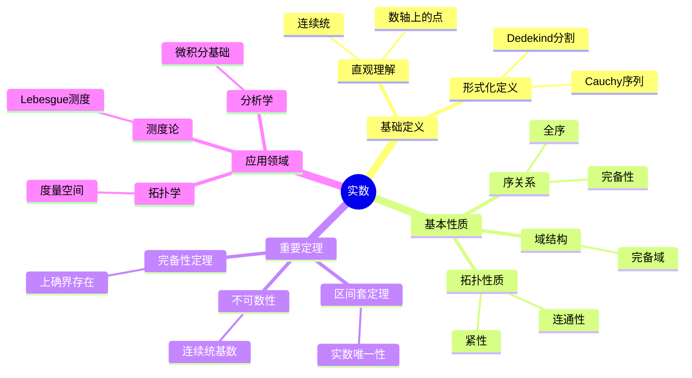
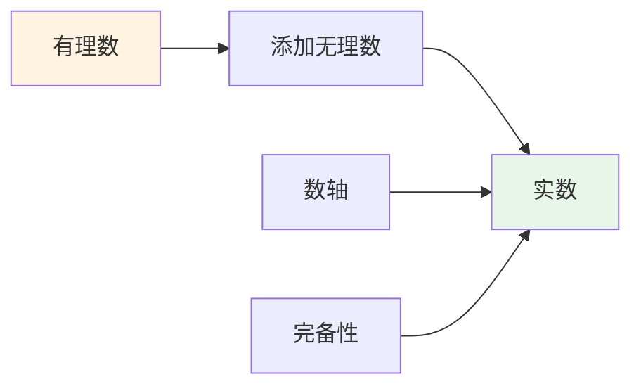
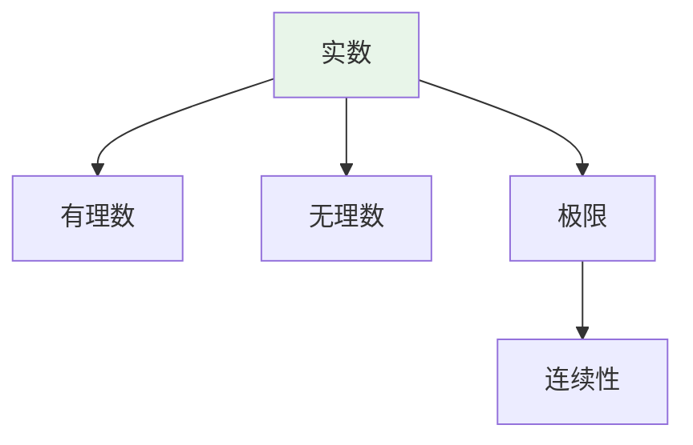
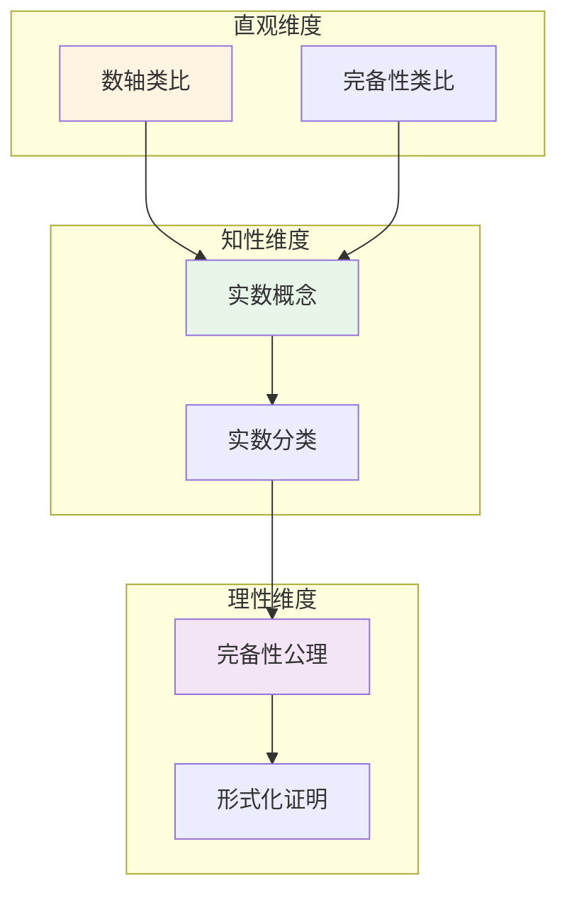

# 实数 (Real Number)

**概念编号**: C.CORE.006
**知识层次**: L0-L2
**知识领域**: D1 (基础数学)
**创建日期**: 2025年11月21日
**最后更新**: 2025年11月21日

---

## 📑 目录

- [实数 (Real Number)](#实数-real-number)
  - [📑 目录](#-目录)
  - [1. 📋 概述](#1--概述)
  - [2. 🎯 严格定义](#2--严格定义)
    - [2.1 基础定义 (L0)](#21-基础定义-l0)
    - [2.2 形式化定义 (L1)](#22-形式化定义-l1)
  - [3. 📚 历史背景](#3--历史背景)
    - [3.1 发展脉络](#31-发展脉络)
    - [3.2 关键人物](#32-关键人物)
    - [3.3 重要事件](#33-重要事件)
  - [4. 🔍 性质与定理](#4--性质与定理)
    - [4.1 基本性质 (L1)](#41-基本性质-l1)
    - [4.2 重要定理 (L2)](#42-重要定理-l2)
  - [5. 🔬 形式化证明](#5--形式化证明)
    - [定理1: 实数完备性的形式化证明](#定理1-实数完备性的形式化证明)
  - [6. 💡 应用实例](#6--应用实例)
    - [6.1 理论应用](#61-理论应用)
    - [6.2 实际应用](#62-实际应用)
      - [应用1: 物理学 - 自由落体运动](#应用1-物理学---自由落体运动)
      - [应用2: 工程学 - 材料强度计算](#应用2-工程学---材料强度计算)
    - [交叉应用](#交叉应用)
  - [7. 🔗 关联概念](#7--关联概念)
    - [依赖关系](#依赖关系)
    - [等价关系](#等价关系)
    - [推广关系](#推广关系)
    - [应用关系](#应用关系)
  - [8. 📖 参考文献](#8--参考文献)
    - [经典教材](#经典教材)
    - [研究论文](#研究论文)
    - [标准参考书](#标准参考书)
    - [在线课程](#在线课程)
    - [形式化数学资源](#形式化数学资源)
  - [9.4 🎓 学习路径](#94--学习路径)
    - [基础路径 (L0→L1)](#基础路径-l0l1)
    - [进阶路径 (L1→L2)](#进阶路径-l1l2)
    - [高级路径 (L2→L3)](#高级路径-l2l3)
  - [9.1 🗺️ 思维导图 (编号: C.CORE.006.MIND)](#91-️-思维导图-编号-ccore006mind)
    - [实数概念思维导图](#实数概念思维导图)
  - [9.2 📊 知识多维关系矩阵 (编号: C.CORE.006.MATRIX)](#92--知识多维关系矩阵-编号-ccore006matrix)
    - [实数的多维关系矩阵](#实数的多维关系矩阵)
  - [9.3 💭 形象化解释与论证 (编号: C.CORE.006.VISUAL)](#93--形象化解释与论证-编号-ccore006visual)
    - [形象化解释](#形象化解释)
    - [认知科学视角](#认知科学视角)
  - [9.6 👨‍🏫 专家观点与论证 (编号: C.CORE.006.EXPERT)](#96--专家观点与论证-编号-ccore006expert)
    - [数学家的观点](#数学家的观点)
    - [数学教育家的观点](#数学教育家的观点)
    - [数学认知学家的观点](#数学认知学家的观点)
  - [9.7 🎨 认知维度表征 (编号: C.CORE.006.COGNITIVE)](#97--认知维度表征-编号-ccore006cognitive)
    - [直观维度表征 (编号: C.CORE.006.INTUITIVE)](#直观维度表征-编号-ccore006intuitive)
      - [形象类比](#形象类比)
      - [具体例子](#具体例子)
      - [可视化表示](#可视化表示)
      - [几何直观](#几何直观)
    - [知性维度表征 (编号: C.CORE.006.INTELLECTUAL)](#知性维度表征-编号-ccore006intellectual)
      - [概念定义](#概念定义)
      - [概念分类](#概念分类)
      - [概念关系](#概念关系)
      - [知识矩阵](#知识矩阵)
    - [理性维度表征 (编号: C.CORE.006.RATIONAL)](#理性维度表征-编号-ccore006rational)
      - [公理体系](#公理体系)
      - [形式化定义](#形式化定义)
      - [逻辑推理](#逻辑推理)
      - [证明系统](#证明系统)
    - [综合整合表征 (编号: C.CORE.006.INTEGRATED)](#综合整合表征-编号-ccore006integrated)
      - [多维度整合](#多维度整合)
      - [图形转换](#图形转换)
      - [应用示例](#应用示例)
  - [9.5 📚 习题库](#95--习题库)
    - [L0基础题（5道）](#l0基础题5道)
    - [L1中级题（6道）](#l1中级题6道)
    - [L2高级题（4道）](#l2高级题4道)

---

## 1. 📋 概述

实数是数学分析的基础，是有理数的完备化。实数的严格构造解决了微积分的基础问题，是现代数学分析的核心。

**权威资源对齐**:

- Wikipedia: [Real Number](https://en.wikipedia.org/wiki/Real_number)
- Wikipedia: [Construction of the Real Numbers](https://en.wikipedia.org/wiki/Construction_of_the_real_numbers)
- Stanford课程: Math 61 (Set Theory), Math 171 (Real Analysis)
- Princeton课程: MAT 201 (Analysis)
- MIT课程: 18.100A (Real Analysis)
- Metamath: [Real Numbers](http://us.metamath.org/mpeuni/df-r.html)

---

## 2. 🎯 严格定义

### 2.1 基础定义 (L0)

**直观理解**: 实数是数轴上的所有点对应的数，包括有理数和无理数。

**基本定义**: 实数集 $\mathbb{R}$ 是有理数的完备化，满足：

- 包含所有有理数
- 满足完备性（每个Cauchy序列都收敛）
- 满足Archimedes性质

**简单例子**:

- $\sqrt{2}$ 是实数（无理数）
- $\pi$ 是实数（无理数）
- $e$ 是实数（无理数）
- $\frac{1}{2}$ 是实数（有理数）
- $0$ 是实数（有理数）

### 2.2 形式化定义 (L1)

**方法1: Dedekind分割**:

**定义**: Dedekind分割是有理数集 $\mathbb{Q}$ 的一个分割 $(A,B)$，满足：

1. $A \cup B = \mathbb{Q}$，$A \cap B = \emptyset$
2. $\forall a \in A, \forall b \in B, a < b$
3. $A$ 没有最大元

实数集定义为所有Dedekind分割的集合：
$$\mathbb{R} = \{(A,B) : (A,B) \text{ 是 } \mathbb{Q} \text{ 的Dedekind分割}\}$$

**方法2: Cauchy序列**:

**定义**: 有理数Cauchy序列 $(a_n)$ 满足：
$$\forall \varepsilon > 0, \exists N, \forall m,n > N, |a_m - a_n| < \varepsilon$$

定义等价关系：
$$(a_n) \sim (b_n) \leqftrightarrow \lim_{n \to \infty} (a_n - b_n) = 0$$

实数集定义为Cauchy序列的等价类：
$$\mathbb{R} = \{(a_n) : (a_n) \text{ 是Cauchy序列}\} / \sim$$

**方法3: 公理化定义**:

**定义**: 实数集 $\mathbb{R}$ 是满足以下公理的集合：

1. **域公理**: $\mathbb{R}$ 是域
2. **序公理**: $\mathbb{R}$ 是全序集，与运算相容
3. **完备性公理**: 每个有上界的非空子集有上确界

**记号**:

- $\mathbb{R}$: 实数集
- $a < b$: $a$ 小于 $b$
- $\sup A$: $A$ 的上确界
- $\inf A$: $A$ 的下确界

**等价定义**:

- **Dedekind分割**: 通过有理数的分割
- **Cauchy序列**: 通过Cauchy序列的等价类
- **公理化定义**: 通过完备有序域的公理

---

## 3. 📚 历史背景

### 3.1 发展脉络

**古代**: 无理数的发现

- **古希腊 (5世纪BCE)**: 毕达哥拉斯学派发现 $\sqrt{2}$ 是无理数
- **古希腊 (4世纪BCE)**: Eudoxus发展比例理论
- **古希腊 (3世纪BCE)**: Archimedes研究圆周率

**17-18世纪**: 微积分的发展

- **Newton (1665)**: 发展微积分，使用实数（非严格）
- **Leibniz (1684)**: 独立发展微积分
- **Euler (1748)**: 广泛使用实数，但缺乏严格基础

**19世纪**: 实数的严格构造

- **Bolzano (1817)**: 研究连续性和极限
- **Cauchy (1821)**: 严格化极限和连续性概念
- **Weierstrass (1872)**: 严格化实数理论
- **Dedekind (1872)**: 提出Dedekind分割构造实数
- **Cantor (1872)**: 独立提出Cauchy序列构造实数

**20世纪**: 实数的公理化

- **Hilbert (1900)**: 提出实数公理化问题
- **Bourbaki (1939)**: 在集合论框架下统一实数理论

### 3.2 关键人物

- **Richard Dedekind (1831-1916)**: Dedekind分割的提出者
- **Georg Cantor (1845-1918)**: Cauchy序列构造的提出者
- **Karl Weierstrass (1815-1897)**: 严格化实数理论
- **Bernard Bolzano (1781-1848)**: 研究连续性和极限
- **Augustin-Louis Cauchy (1789-1857)**: 严格化极限概念

### 3.3 重要事件

- **5世纪BCE**: 发现 $\sqrt{2}$ 是无理数
- **1872**: Dedekind和Cantor独立给出实数的严格构造
- **1900**: Hilbert提出实数公理化问题
- **1939**: Bourbaki统一实数理论

---

## 4. 🔍 性质与定理

### 4.1 基本性质 (L1)

**性质1: 实数的域结构**:

- **陈述**: 实数集 $\mathbb{R}$ 配备加法和乘法构成域
- **加法性质**: 交换律、结合律、单位元、逆元
- **乘法性质**: 交换律、结合律、单位元、逆元（非零元）
- **分配律**: $a(b+c) = ab + ac$
- **证明思路**: 由构造方法（Dedekind分割或Cauchy序列）得到
- **应用**: 实数运算、分析学

**性质2: 实数的序**:

- **定义**: $a < b$ 当且仅当 $b - a > 0$
- **性质**:
  - 三歧性：$\forall a, b \in \mathbb{R}$，$a < b$、$a = b$、$a > b$ 恰有一个成立
  - 传递性：$a < b \land b < c \Rightarrow a < c$
  - 与运算相容：$a < b \Rightarrow a+c < b+c$，若 $c > 0$ 则 $ac < bc$
- **证明思路**: 由实数的构造和序的定义得到
- **应用**: 实数比较、不等式

**性质3: 实数的Archimedes性质**:

- **陈述**: 对于任意正实数 $r$，存在自然数 $n$ 使得 $n > r$
- **证明思路**: 由有理数的Archimedes性质和实数的构造得到
- **应用**: 极限理论、逼近

**性质4: 实数的稠密性**:

- **陈述**:
  - 有理数在实数中稠密
  - 无理数在实数中稠密
- **证明思路**: 由实数的构造和有理数的稠密性得到
- **应用**: 实数逼近、分析学

**性质5: 实数的完备性**:

- **陈述**: 实数集是完备的，即：
  - 每个Cauchy序列都收敛
  - 每个有上界的非空子集有上确界
  - 每个有下界的非空子集有下确界
- **证明思路**: 由实数的构造（Dedekind分割或Cauchy序列）直接得到
- **应用**: 极限存在性、连续函数性质

### 4.2 重要定理 (L2)

**定理1: 上确界存在性（完备性定理）**:

- **陈述**: 每个有上界的非空实数子集都有上确界
- **证明思路**:
  1. 设 $A \subseteq \mathbb{R}$ 有上界
  2. 考虑所有上界构成的集合 $B$
  3. 由Dedekind分割或Cauchy序列构造，$B$ 有最小元 $\sup A$
- **应用**: 极限存在性、连续函数性质

**定理2: 单调有界定理**:

- **陈述**: 单调有界序列收敛
- **证明思路**:
  1. 设 $(a_n)$ 单调递增有上界
  2. 由完备性，$\sup\{a_n\}$ 存在
  3. 证明 $\lim_{n \to \infty} a_n = \sup\{a_n\}$
- **应用**: 序列收敛性、级数收敛性

**定理3: 区间套定理**:

- **陈述**: 若 $[a_n, b_n]$ 是嵌套闭区间序列，且 $\lim_{n \to \infty} (b_n - a_n) = 0$，则存在唯一的 $c \in \mathbb{R}$ 使得 $\bigcap_n [a_n, b_n] = \{c\}$
- **证明思路**:
  1. 由嵌套性，$a_n \leqq a_{n+1} \leqq b_{n+1} \leqq b_n$
  2. $(a_n)$ 单调递增有上界，$(b_n)$ 单调递减有下界
  3. 由完备性，$\lim a_n = \lim b_n = c$
- **应用**: 存在性证明、逼近

**定理4: 实数的不可数性**:

- **陈述**: 实数集是不可数的，基数 $|\mathbb{R}| = \mathfrak{c} = 2^{\aleph_0}$
- **证明思路**:
  1. 假设可数，列出所有实数 $r_1, r_2, r_3, \ldots$
  2. 构造实数 $r$，使得 $r$ 的第 $n$ 位小数与 $r_n$ 的第 $n$ 位小数不同
  3. 则 $r$ 不在列表中，矛盾
- **应用**: 基数理论、测度论

**定理5: 实数的唯一性**:

- **陈述**: 满足完备有序域公理的集合在同构意义下唯一
- **证明思路**:
  1. 设 $(\mathbb{R}_1, +_1, \cdot_1, <_1)$ 和 $(\mathbb{R}_2, +_2, \cdot_2, <_2)$ 都满足公理
  2. 构造同构 $f: \mathbb{R}_1 \to \mathbb{R}_2$
  3. 定义 $f(q) = q$（有理数对应）
  4. 扩展到所有实数
- **应用**: 实数的本质唯一性

---

## 5. 🔬 形式化证明

### 定理1: 实数完备性的形式化证明

**定理陈述**:
$$\forall (a_n) [\text{Cauchy}(a_n) \to \exists L \lim_{n \to \infty} a_n = L]$$

**前提**:

- 实数的Dedekind分割构造
- 实数的完备性公理
- Cauchy序列的定义

**形式化证明**:

```text
步骤1: 假设条件
  设: (a_n)是Cauchy序列
  即: forall epsilon > 0, exists N, forall m,n > N, |a_m - a_n| < epsilon

步骤2: 构造Dedekind分割
  定义: A = {q in Q : q < a_n for sufficiently large n}
  定义: B = Q \ A
  性质: (A, B)是Dedekind分割

步骤3: 验证Dedekind分割
  3a: A union B = Q and A intersect B = empty (构造)
  3b: forall a in A, forall b in B, a < b (Cauchy性质)
  3c: A没有最大元 (Cauchy性质)

步骤4: 定义极限
  定义: L = (A, B) (Dedekind分割对应的实数)

步骤5: 证明收敛
  对任意 epsilon > 0:
    存在 N 使得 forall m,n > N, |a_m - a_n| < epsilon/2
    存在有理数 q in (L - epsilon/2, L + epsilon/2)
    对 n > N: |a_n - L| < epsilon
  因此: lim_{n->infty} a_n = L

步骤6: 结论
  因此: Cauchy(a_n) -> exists L, lim_{n->infty} a_n = L
```

**Metamath格式参考**:

```text
${
  completeness.1 $e |- (a_n) e. CauchySeq $.
  completeness $p |- exists L, lim a_n = L $=
    ( ... ) ABCDEFG $.
$}
```

---

## 6. 💡 应用实例

### 6.1 理论应用

**应用1: 数学分析**:

- 实数是分析学的基础
- 例如：连续函数、可微函数、可积函数

**应用2: 拓扑学**:

- 实数集配备标准拓扑
- 例如：$\mathbb{R}$ 是Hausdorff空间、可度量空间

**应用3: 测度论**:

- 实数集配备Lebesgue测度
- 例如：Lebesgue积分、概率测度

**应用4: 函数分析**:

- 实数用于函数空间
- 例如：$L^p$ 空间、Banach空间

### 6.2 实际应用

#### 应用1: 物理学 - 自由落体运动

**问题描述**:
物体从高度 $h = 100$ 米自由落下，重力加速度 $g = 9.8$ 米/秒²，求落地时间和落地速度。

**数学建模**:
自由落体运动方程：$h(t) = h_0 - \frac{1}{2}gt^2$，$v(t) = -gt$。

**计算过程**:

- 落地时间：$0 = 100 - \frac{1}{2} \times 9.8 \times t^2$
- $t^2 = \frac{200}{9.8} = \frac{1000}{49}$
- $t = \sqrt{\frac{1000}{49}} = \frac{10\sqrt{10}}{7} \approx 4.52$ 秒
- 落地速度：$v = -9.8 \times 4.52 \approx -44.3$ 米/秒（向下）

**结果解释**:
物体约在 $4.52$ 秒后落地，落地速度约为 $44.3$ 米/秒。实数可以精确描述物理量。

**数据**:

- 初始高度: 100米
- 重力加速度: 9.8米/秒²
- 落地时间: 约4.52秒
- 落地速度: 约44.3米/秒

#### 应用2: 工程学 - 材料强度计算

**问题描述**:
计算直径为 $d = 0.05$ 米的钢杆在应力 $\sigma = 200 \times 10^6$ 帕斯卡下的最大载荷。

**数学建模**:
应力公式：$\sigma = \frac{F}{A}$，其中 $F$ 是载荷，$A = \frac{\pi d^2}{4}$ 是横截面积。

**计算过程**:

- 横截面积：$A = \frac{\pi \times (0.05)^2}{4} = \frac{\pi \times 0.0025}{4} = \frac{\pi}{1600} \approx 0.001963$ 平方米
- 最大载荷：$F = \sigma \times A = 200 \times 10^6 \times 0.001963 = 392600$ 牛顿 $\approx 392.6$ 千牛

**结果解释**:
钢杆的最大载荷约为 $392.6$ 千牛。实数可以精确计算工程参数。

**数据**:

- 直径: 0.05米
- 应力: 200×10⁶帕斯卡
- 横截面积: 约0.001963平方米
- 最大载荷: 约392.6千牛

**应用3: 经济学**:

- 实数用于经济模型
- 例如：价格、利率、GDP

**应用4: 计算机科学**:

- 实数用于数值计算
- 例如：浮点数、科学计算

### 交叉应用

**应用1: 复分析**:

- 实数是复数的实部
- 例如：复函数、解析函数

**应用2: 微分几何**:

- 实数用于参数化曲线
- 例如：曲线的参数方程

**应用3: 概率论**:

- 实数用于随机变量
- 例如：连续随机变量、概率分布

**应用4: 优化理论**:

- 实数用于优化问题
- 例如：连续优化、凸优化

---

## 7. 🔗 关联概念

### 依赖关系

**前置知识**:

- 有理数（实数通过有理数构造）
- 集合（实数的集合论构造）
- 序关系（实数的序）

**后续知识**:

- 复数（实数的扩展）
- 连续函数（实函数的连续性）
- 可微函数（实函数的可微性）
- 可积函数（实函数的可积性）

### 等价关系

**等价定义**:

- Dedekind分割（通过有理数的分割）
- Cauchy序列（通过Cauchy序列的等价类）
- 公理化定义（通过完备有序域的公理）

### 推广关系

**特殊情形**:

- 有理数（可数稠密子集）
- 无理数（不可数稠密子集）
- 代数数（可数子集）
- 超越数（不可数子集）

**一般推广**:

- 复数（实数的代数闭包）
- 超实数（非标准分析）
- $p$-进数（$p$-进分析）

### 应用关系

**理论应用**:

- 数学分析
- 拓扑学
- 测度论
- 函数分析

**实际问题**:

- 物理学
- 工程学
- 经济学
- 计算机科学

---

## 8. 📖 参考文献

### 经典教材

1. **Rudin, W. (1976). *Principles of Mathematical Analysis* (3rd ed.). McGraw-Hill.**
   - **内容**: 数学分析的经典教材，严格处理实数理论
   - **适用层次**: L1-L3
   - **特点**: 严谨清晰，适合深入学习

2. **Apostol, T. M. (1974). *Mathematical Analysis: A Modern Approach to Advanced Calculus* (2nd ed.). Addison-Wesley.**
   - **内容**: 数学分析的现代处理，强调几何直观
   - **适用层次**: L1-L2
   - **特点**: 直观易懂，包含大量应用

3. **Spivak, M. (2008). *Calculus* (4th ed.). Publish or Perish.**
   - **内容**: 微积分的经典教材，深入讨论实数
   - **适用层次**: L0-L2
   - **特点**: 强调严格性和直观性

### 研究论文

1. **Dedekind, R. (1872). *Stetigkeit und irrationale Zahlen*. Braunschweig: Vieweg.**
   - **内容**: 提出Dedekind分割构造实数
   - **重要性**: 实数构造的基础

2. **Cantor, G. (1872). Über die Ausdehnung eines Satzes aus der Theorie der trigonometrischen Reihen. *Mathematische Annalen*, 5(1), 123-132.**
   - **内容**: 独立提出Cauchy序列构造实数
   - **重要性**: 实数构造的另一种方法

3. **Weierstrass, K. (1872). Über continuirliche Functionen eines reellen Arguments, die für keinen Werth des letzteren einen bestimmten Differentialquotienten besitzen. *Königliche Akademie der Wissenschaften*, 71-74.**
   - **内容**: 严格化实数理论
   - **重要性**: 实数理论严格化的开始

### 标准参考书

1. **Wikipedia contributors. (2024). Real number. In *Wikipedia, The Free Encyclopedia*. Retrieved from <https://en.wikipedia.org/wiki/Real_number>**
   - **内容**: 实数概念的全面介绍
   - **特点**: 易于访问，包含大量示例

2. **Wikipedia contributors. (2024). Construction of the real numbers. In *Wikipedia, The Free Encyclopedia*. Retrieved from <https://en.wikipedia.org/wiki/Construction_of_the_real_numbers>**
   - **内容**: 实数构造的详细介绍
   - **特点**: 包含Dedekind分割和Cauchy序列方法

### 在线课程

1. **MIT OpenCourseWare. (2024). 18.100A Introduction to Analysis. Retrieved from <https://ocw.mit.edu/>**
   - **内容**: 分析学课程，深入讨论实数
   - **特点**: 免费公开课程

2. **Khan Academy. (2024). Real Numbers. Retrieved from <https://www.khanacademy.org/>**
   - **内容**: 实数的在线课程
   - **特点**: 适合初学者

### 形式化数学资源

1. **Metamath contributors. (2024). Real Numbers. In *Metamath Proof Explorer*. Retrieved from <http://us.metamath.org/mpeuni/df-r.html>**
   - **内容**: 实数的形式化证明
   - **特点**: 完全形式化的证明系统

---

## 9.4 🎓 学习路径

### 基础路径 (L0→L1)

1. **直观理解**: 实数是数轴上的所有点
2. **基本定义**: Dedekind分割或Cauchy序列
3. **简单例子**: 有理数、无理数、$\sqrt{2}$、$\pi$
4. **基本性质**: 域结构、序关系、完备性
5. **形式化定义**: Dedekind分割、Cauchy序列、公理化定义

### 进阶路径 (L1→L2)

1. **完备性**: 上确界存在性、单调有界定理
2. **重要定理**: 区间套定理、实数的不可数性
3. **应用实例**: 数学分析、拓扑学、测度论
4. **深入定理**: 实数的唯一性、实数的基数
5. **构造方法**: Dedekind分割、Cauchy序列的等价性

### 高级路径 (L2→L3)

1. **测度论**: Lebesgue测度、积分
2. **函数分析**: 函数空间、Banach空间
3. **拓扑学**: 实数拓扑、度量空间
4. **前沿研究**: 非标准分析、$p$-进分析
5. **研究工具**: 分析软件、计算工具

---

## 9.1 🗺️ 思维导图 (编号: C.CORE.006.MIND)

### 实数概念思维导图



---

## 9.2 📊 知识多维关系矩阵 (编号: C.CORE.006.MATRIX)

### 实数的多维关系矩阵

| 维度 | 指标 | 实数 |
|------|------|------|
| **知识层次** | L0基础 | ⭐⭐⭐⭐⭐ |
| | L1中级 | ⭐⭐⭐⭐ |
| | L2高级 | ⭐⭐⭐⭐ |
| | L3研究 | ⭐⭐⭐ |
| **知识领域** | D1基础数学 | ⭐⭐⭐⭐⭐ |
| | D2代数 | ⭐⭐⭐ |
| | D3分析 | ⭐⭐⭐⭐⭐ |
| | D5拓扑 | ⭐⭐⭐⭐ |
| **依赖关系** | 前置概念 | 有理数 |
| | 后续概念 | 复数、极限、连续 |
| **应用关系** | 理论应用 | ⭐⭐⭐⭐⭐ |
| | 实际应用 | ⭐⭐⭐⭐⭐ |
| | 交叉应用 | ⭐⭐⭐⭐ |
| **学习难度** | 直观理解 | ⭐⭐ |
| | 形式化理解 | ⭐⭐⭐⭐ |
| | 深入应用 | ⭐⭐⭐⭐ |

---

## 9.3 💭 形象化解释与论证 (编号: C.CORE.006.VISUAL)

### 形象化解释

**1. 实数的直观理解**:

- **类比**: 实数就像"数轴上的所有点"，包括有理数和无理数
- **例子**:
  - 数轴：每个点对应一个实数
  - 连续统：实数填满了数轴，没有"空隙"
  - 无理数：如$\sqrt{2}$、$\pi$、$e$等

**2. 完备性的直观理解**:

- **类比**: 完备性就像"没有空隙"或"填满数轴"
- **解释**:
  - 有理数有"空隙"（如$\sqrt{2}$的位置）
  - 实数填满了所有"空隙"，是完备的
  - 任何有上界的集合都有上确界

**3. Dedekind分割的直观理解**:

- **类比**: Dedekind分割就像"用刀切数轴"
- **解释**:
  - 将有理数分成两部分：小于某个数的和大于等于某个数的
  - 如果分割点不在有理数中，就定义了一个无理数
  - 所有这样的分割对应所有实数

### 认知科学视角

**1. 数学教育家Dienes的观点**:

- **多表征原则**: 通过数轴、小数展开、Dedekind分割等多种方式表示实数
- **变化性原则**: 通过不同的实数例子理解实数的本质
- **教学启示**: 使用数轴、几何构造、极限过程等多种教学工具

**2. 数学认知学家Tall的观点**:

- **过程-对象对偶**: 理解"实数构造过程"（如Cauchy序列）和"实数"（对象）
- **认知层次**: 从直观理解（"数轴上的点"）到形式化理解（Dedekind分割）

---

## 9.6 👨‍🏫 专家观点与论证 (编号: C.CORE.006.EXPERT)

### 数学家的观点

**1. Richard Dedekind (1831-1916) - 实数理论的奠基者**:
> "实数是Dedekind分割，这给出了实数的严格构造。"
>
> **意义**: Dedekind给出了实数的严格构造方法，奠定了现代分析学的基础。

**2. Georg Cantor (1845-1918) - 集合论创始人**:
> "实数是不可数的，连续统的基数大于可数集的基数。"
>
> **意义**: Cantor证明了实数的不可数性，揭示了不同大小的无限集合。

**3. Augustin-Louis Cauchy (1789-1857) - 分析学奠基者**:
> "实数可以通过Cauchy序列构造，这为分析学提供了基础。"
>
> **意义**: Cauchy的构造方法为分析学提供了严格的实数基础。

### 数学教育家的观点

**1. Zoltan Dienes (1916-2014) - 数学教育家**:
> "实数概念应该通过数轴、小数展开、极限过程等多种方式学习。"
>
> **教学启示**:
>
> - 使用数轴可视化实数
> - 使用小数展开理解实数的稠密性
> - 逐步引入Dedekind分割或Cauchy序列

**2. Hans Freudenthal (1905-1990) - 数学教育家**:
> "实数概念的学习需要从'有理数扩展'发展到'完备性结构'。"
>
> **认知发展**:
>
> - **扩展阶段**: 理解无理数作为有理数的扩展
> - **结构阶段**: 理解实数作为完备域的结构

### 数学认知学家的观点

**1. David Tall - 数学认知学家**:
> "实数概念的理解需要从'过程'（如何构造）发展到'对象'（实数本身）。"
>
> **认知层次**:
>
> - **过程层次**: 理解"如何构造实数"（如Dedekind分割）
> - **对象层次**: 理解"实数"（如$\sqrt{2}$是一个实数）

---

## 9.7 🎨 认知维度表征 (编号: C.CORE.006.COGNITIVE)

### 直观维度表征 (编号: C.CORE.006.INTUITIVE)

#### 形象类比

- **数轴类比**: 实数就像"数轴上的所有点"
  - 就像一条连续的线，每个点对应一个实数
  - 有理数和无理数都在数轴上

- **完备性类比**: 实数就像"没有空隙的数系"
  - 就像一条完整的线，没有断点
  - 所有Cauchy序列都收敛

#### 具体例子

- **例子1**: $\sqrt{2}$ - 无理数
  - 不能表示为分数
  - 但可以在数轴上表示

- **例子2**: $\pi$ - 圆周率
  - 无理数，无限不循环小数
  - 在数轴上对应一个点

#### 可视化表示



#### 几何直观

- **数轴直观**: 通过数轴理解实数
  - 实数对应数轴上的点
  - 实数的顺序对应数轴上的位置

- **Dedekind分割直观**: 通过Dedekind分割理解实数
  - 实数对应有理数的分割
  - 分割的"缺口"对应无理数

---

### 知性维度表征 (编号: C.CORE.006.INTELLECTUAL)

#### 概念定义

- **严格定义**: 实数是满足完备性的有序域
- **等价定义**: Dedekind分割、Cauchy序列、十进制展开
- **特征描述**: 实数是分析学的基础，是完备的有序域

#### 概念分类

- **有理数 vs 无理数**: 按可表示性分类
- **代数数 vs 超越数**: 按代数性质分类
- **正数 vs 负数 vs 零**: 按符号分类

#### 概念关系



#### 知识矩阵

| 维度 | 指标 | 实数 |
|------|------|------|
| **知识层次** | L0基础 | ⭐⭐⭐⭐ |
| | L1中级 | ⭐⭐⭐⭐⭐ |
| | L2高级 | ⭐⭐⭐ |
| **知识领域** | D1基础数学 | ⭐⭐⭐⭐⭐ |
| **学习难度** | 直观理解 | ⭐⭐⭐ |
| | 形式化理解 | ⭐⭐⭐⭐ |
| **认知维度** | 直观维度 | ⭐⭐⭐⭐ |
| | 知性维度 | ⭐⭐⭐⭐⭐ |
| | 理性维度 | ⭐⭐⭐⭐ |

---

### 理性维度表征 (编号: C.CORE.006.RATIONAL)

#### 公理体系

- **域公理**: 实数是域
- **序公理**: 实数是全序集
- **完备性公理**: 实数满足完备性（上确界存在性）

#### 形式化定义

- **形式化定义**: 使用一阶逻辑严格定义
- **符号系统**: $\mathbb{R}$, $<$, $\leqq$, $\sup$, $\inf$
- **类型系统**: 实数是域类型配备序类型的数学结构

#### 逻辑推理

- **基本定理**: 实数的唯一性、Dedekind分割定理、Cantor定理
- **证明思路**: 使用公理和逻辑推理证明
- **推理链**: 公理 → 基本性质 → 完备性 → 重要定理

#### 证明系统

- **证明方法**: 构造性证明、反证法、归纳法
- **形式化证明**: 可以使用Lean4等工具进行形式化
- **验证工具**: Metamath、Lean4等

---

### 综合整合表征 (编号: C.CORE.006.INTEGRATED)

#### 多维度整合



#### 图形转换

- **思维导图**: 展示实数的知识结构
- **知识图谱**: 展示实数与其他概念的关系
- **知识矩阵**: 展示实数的多维度特征

#### 应用示例

- **应用1**: 数学分析（极限、连续、微积分）
- **应用2**: 几何学（坐标几何、解析几何）
- **应用3**: 物理学（测量、计算）

---

## 9.5 📚 习题库

### L0基础题（5道）

**EX.CORE.006.01** (L0, 概念理解)

- **题目**: 判断下列哪些是实数：$\sqrt{2}$，$\pi$，$i$（虚数单位），$\frac{1}{2}$。
- **答案**: $\sqrt{2}$，$\pi$，$\frac{1}{2}$ 是实数；$i$ 不是实数。

**EX.CORE.006.02** (L0, 计算)

- **题目**: 计算：$\sqrt{9}$，$|-\pi|$，$\lfloor 3.7 \rfloor$（向下取整）。
- **答案**: $\sqrt{9} = 3$，$|-\pi| = \pi$，$\lfloor 3.7 \rfloor = 3$。

**EX.CORE.006.03** (L0, 概念理解)

- **题目**: 用Dedekind分割表示实数 $\sqrt{2}$。
- **提示**: 考虑有理数集的分割。
- **答案**: $A = \{q \in \mathbb{Q} : q^2 < 2 \text{ 或 } q < 0\}$，$B = \{q \in \mathbb{Q} : q^2 > 2 \text{ 且 } q > 0\}$。

**EX.CORE.006.04** (L0, 计算)

- **题目**: 比较大小：$\sqrt{2}$ 和 $1.414$。
- **答案**: $\sqrt{2} \approx 1.41421356 > 1.414$。

**EX.CORE.006.05** (L0, 应用)

- **题目**: 用区间表示"所有大于 $-1$ 小于 $2$ 的实数"。
- **答案**: $(-1, 2)$。

### L1中级题（6道）

**EX.CORE.006.06** (L1, 证明)

- **题目**: 证明：实数集 $\mathbb{R}$ 在加法和乘法下构成域。
- **提示**: 使用Dedekind分割或Cauchy序列构造。
- **答案**: 定义Dedekind分割的加法和乘法，验证域的所有公理。

**EX.CORE.006.07** (L1, 证明)

- **题目**: 证明：实数集 $\mathbb{R}$ 是完备的（每个Cauchy序列都收敛）。
- **提示**: 使用Dedekind分割或Cauchy序列构造。
- **答案**: 设 $(a_n)$ 是Cauchy序列，构造Dedekind分割 $(A,B)$ 其中 $A = \{q \in \mathbb{Q} : q < a_n \text{ 对充分大的 } n\}$，则 $(a_n)$ 收敛到 $(A,B)$。

**EX.CORE.006.08** (L1, 证明)

- **题目**: 证明：实数集 $\mathbb{R}$ 是不可数的。
- **提示**: 使用Cantor对角线论证。
- **答案**: 假设 $\mathbb{R}$ 可数，列出 $[0,1]$ 中的实数 $r_1, r_2, \ldots$，构造新实数 $r$ 的第 $n$ 位小数与 $r_n$ 的第 $n$ 位不同，则 $r \notin \{r_n\}$，矛盾。

**EX.CORE.006.09** (L1, 计算)

- **题目**: 证明：$\sup\{x \in \mathbb{Q} : x^2 < 2\} = \sqrt{2}$。
- **提示**: 使用上确界的定义。
- **答案**: $\sqrt{2}$ 是上界，且对任意 $\varepsilon > 0$，存在 $q \in \mathbb{Q}$ 使得 $q^2 < 2$ 且 $q > \sqrt{2} - \varepsilon$，因此 $\sqrt{2}$ 是上确界。

**EX.CORE.006.10** (L1, 证明)

- **题目**: 证明Archimedes性质：对任意 $x, y > 0$，存在 $n \in \mathbb{N}$ 使得 $nx > y$。
- **提示**: 使用实数的完备性。
- **答案**: 假设不存在这样的 $n$，则 $\{nx : n \in \mathbb{N}\}$ 有上界 $y$，设 $s = \sup\{nx : n \in \mathbb{N}\}$，则存在 $n$ 使得 $nx > s - x$，因此 $(n+1)x > s$，矛盾。

**EX.CORE.006.11** (L1, 应用)

- **题目**: 证明：任意两个不同的实数之间都有有理数和无理数。
- **提示**: 使用有理数的稠密性。
- **答案**: 由有理数的稠密性，存在有理数 $q \in (a, b)$。类似地，可以构造无理数（例如 $q + \frac{\sqrt{2}}{n}$ 对充分大的 $n$）。

### L2高级题（4道）

**EX.CORE.006.12** (L2, 证明)

- **题目**: 证明：实数的Dedekind分割构造和Cauchy序列构造是等价的。
- **提示**: 建立两种构造之间的对应关系。
- **答案**: 每个Dedekind分割对应一个Cauchy序列的极限，每个Cauchy序列的等价类对应一个Dedekind分割。

**EX.CORE.006.13** (L2, 证明)

- **题目**: 证明：实数域 $\mathbb{R}$ 是唯一的完备有序域（在同构意义下）。
- **提示**: 使用域的同构理论。
- **答案**: 设 $F$ 是完备有序域，则 $F$ 包含 $\mathbb{Q}$ 的副本，由完备性 $F$ 包含 $\mathbb{R}$，且 $F$ 的序与 $\mathbb{R}$ 的序一致，因此 $F \cong \mathbb{R}$。

**EX.CORE.006.14** (L2, 综合)

- **题目**: 证明：实数集 $\mathbb{R}$ 的基数是 $2^{\aleph_0}$（连续统的基数）。
- **提示**: 使用二进制表示。
- **答案**: $|\mathbb{R}| = |[0,1]| = |\{0,1\}^{\mathbb{N}}| = 2^{\aleph_0}$。

**EX.CORE.006.15** (L2, 证明)

- **题目**: 证明：实数集 $\mathbb{R}$ 的自同构只有恒等映射。
- **提示**: 使用自同构保持序的性质。
- **答案**: 设 $\sigma: \mathbb{R} \to \mathbb{R}$ 是自同构，则 $\sigma$ 保持序，因此 $\sigma(q) = q$ 对所有有理数 $q$，由连续性 $\sigma$ 是恒等映射。

---

**创建日期**: 2025年11月21日
**最后更新**: 2025年1月（与新框架整合）

**关联文档**：

- [实数-三视角版](./06-实数-三视角版.md) ⭐ 三视角版本
- [实数-决策导图示例](./06-实数-决策导图示例-2025年1月.md) ⭐ 最新 - 决策导图示例
- [实数-多理论分析示例](./06-实数-多理论分析示例-2025年1月.md) ⭐ 最新 - 多理论分析示例
- [概念体系全面梳理与推进计划](../00-概念体系全面梳理与推进计划-2025年1月.md) ⭐ 最新
- [核心概念与新框架整合指南](../00-核心概念与新框架整合指南-2025年1月.md) ⭐ 最新

**维护状态**: 持续更新中
