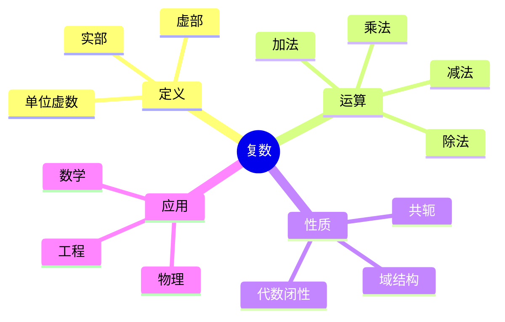
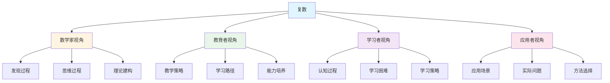
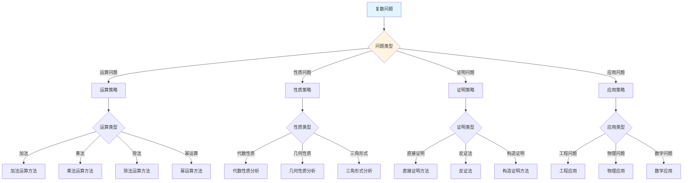
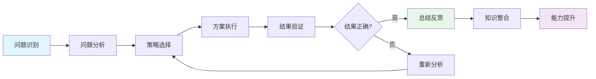
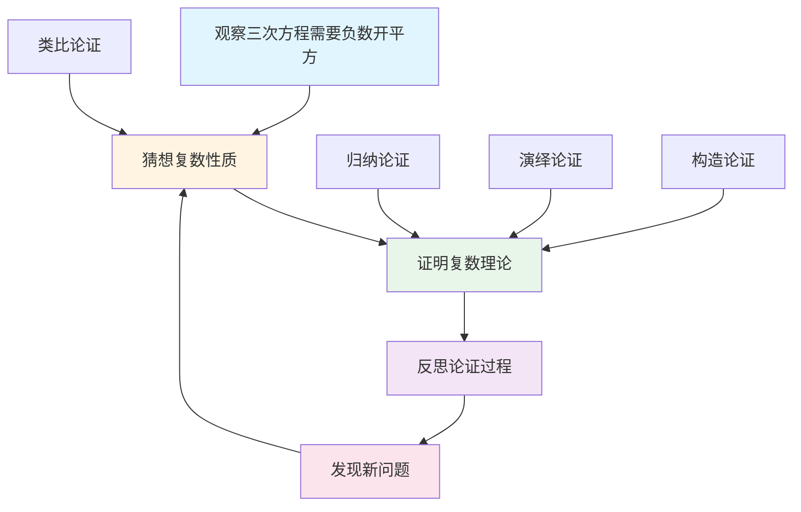
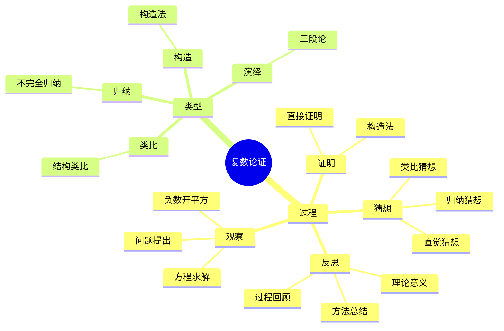

# 复数 (Complex Number) - 三视角组织版

**概念编号**: C.CORE.007
**知识层次**: L0-L2
**知识领域**: D1 (基础数学)
**创建日期**: 2025年1月
**最后更新**: 2025年1月

---

## 📋 目录 / Table of Contents

- [复数 (Complex Number) - 三视角组织版](#复数-complex-number---三视角组织版)
  - [📋 目录 / Table of Contents](#-目录--table-of-contents)
  - [1. 📋 概述 (编号: C.CORE.007.01)](#1--概述-编号-ccore00701)
  - [🧠 认知学视角：如何理解复数 (编号: C.CORE.007.02)](#-认知学视角如何理解复数-编号-ccore00702)
    - [认知起点 (编号: C.CORE.007.02.01)](#认知起点-编号-ccore0070201)
    - [认知过程 (编号: C.CORE.007.02.02)](#认知过程-编号-ccore0070202)
      - [阶段1：直观理解阶段 (编号: C.CORE.007.02.02.01)](#阶段1直观理解阶段-编号-ccore007020201)
      - [阶段2：概念形成阶段 (编号: C.CORE.007.02.02.02)](#阶段2概念形成阶段-编号-ccore007020202)
      - [阶段3：形式化阶段 (编号: C.CORE.007.02.02.03)](#阶段3形式化阶段-编号-ccore007020203)
    - [认知障碍 (编号: C.CORE.007.02.03)](#认知障碍-编号-ccore0070203)
    - [认知工具 (编号: C.CORE.007.02.04)](#认知工具-编号-ccore0070204)
  - [🎓 教育学视角：如何教学复数 (编号: C.CORE.007.03)](#-教育学视角如何教学复数-编号-ccore00703)
    - [教学目标 (编号: C.CORE.007.03.01)](#教学目标-编号-ccore0070301)
    - [教学路径 (编号: C.CORE.007.03.02)](#教学路径-编号-ccore0070302)
      - [阶段1：引入阶段（激发兴趣） (编号: C.CORE.007.03.02.01)](#阶段1引入阶段激发兴趣-编号-ccore007030201)
      - [阶段2：探索阶段（主动建构） (编号: C.CORE.007.03.02.02)](#阶段2探索阶段主动建构-编号-ccore007030202)
      - [阶段3：形式化阶段（抽象概括） (编号: C.CORE.007.03.02.03)](#阶段3形式化阶段抽象概括-编号-ccore007030203)
      - [阶段4：巩固阶段（应用深化） (编号: C.CORE.007.03.02.04)](#阶段4巩固阶段应用深化-编号-ccore007030204)
    - [教学难点 (编号: C.CORE.007.03.03)](#教学难点-编号-ccore0070303)
    - [教学策略 (编号: C.CORE.007.03.04)](#教学策略-编号-ccore0070304)
    - [评估方法 (编号: C.CORE.007.03.05)](#评估方法-编号-ccore0070305)
  - [🔬 数学家视角：如何思考复数 (编号: C.CORE.007.04)](#-数学家视角如何思考复数-编号-ccore00704)
    - [问题起源 (编号: C.CORE.007.04.01)](#问题起源-编号-ccore0070401)
    - [思维过程 (编号: C.CORE.007.04.02)](#思维过程-编号-ccore0070402)
      - [步骤1：问题提出 (编号: C.CORE.007.04.02.01)](#步骤1问题提出-编号-ccore007040201)
      - [步骤2：概念形成 (编号: C.CORE.007.04.02.02)](#步骤2概念形成-编号-ccore007040202)
      - [步骤3：理论发展 (编号: C.CORE.007.04.02.03)](#步骤3理论发展-编号-ccore007040203)
    - [历史发展 (编号: C.CORE.007.04.03)](#历史发展-编号-ccore0070403)
    - [3.2 关键人物和贡献 (编号: C.CORE.007.04.04)](#32-关键人物和贡献-编号-ccore0070404)
    - [重要定理 (编号: C.CORE.007.04.05)](#重要定理-编号-ccore0070405)
    - [开放问题 (编号: C.CORE.007.04.06)](#开放问题-编号-ccore0070406)
    - [一、第一人称思维描述 (编号: C.CORE.007.04.07)](#一第一人称思维描述-编号-ccore0070407)
      - [1.1 Cardano的发现过程](#11-cardano的发现过程)
      - [1.2 Gauss的严格化思维](#12-gauss的严格化思维)
    - [二、数学直觉的形成 (编号: C.CORE.007.04.08)](#二数学直觉的形成-编号-ccore0070408)
      - [2.1 直觉在概念发现中的作用](#21-直觉在概念发现中的作用)
      - [2.2 如何培养复数直觉](#22-如何培养复数直觉)
    - [三、数学美的教育价值 (编号: C.CORE.007.04.09)](#三数学美的教育价值-编号-ccore0070409)
      - [3.1 复数论的美在哪里](#31-复数论的美在哪里)
      - [3.2 如何培养学生的数学美感](#32-如何培养学生的数学美感)
    - [四、问题解决策略 (编号: C.CORE.007.04.10)](#四问题解决策略-编号-ccore0070410)
      - [4.1 数学家的启发式方法](#41-数学家的启发式方法)
      - [4.2 思维过程分析](#42-思维过程分析)
    - [五、批判性反思 (编号: C.CORE.007.04.11)](#五批判性反思-编号-ccore0070411)
      - [5.1 复数概念的局限性](#51-复数概念的局限性)
      - [5.2 复数理论的未解决问题](#52-复数理论的未解决问题)
  - [💡 数学解释：为什么复数是这样定义的 (编号: C.CORE.007.05)](#-数学解释为什么复数是这样定义的-编号-ccore00705)
    - [一、直观解释：复数是什么？](#一直观解释复数是什么)
      - [1.1 具体例子](#11-具体例子)
      - [1.2 形象类比](#12-形象类比)
      - [1.3 几何直观](#13-几何直观)
      - [1.4 操作体验](#14-操作体验)
    - [二、知性解释：复数的本质是什么？](#二知性解释复数的本质是什么)
      - [2.1 概念定义](#21-概念定义)
      - [2.2 分类体系](#22-分类体系)
      - [2.3 抽象结构](#23-抽象结构)
      - [2.4 知识体系](#24-知识体系)
    - [三、理性解释：复数的公理化定义](#三理性解释复数的公理化定义)
      - [3.1 公理体系](#31-公理体系)
      - [3.2 形式化证明](#32-形式化证明)
      - [3.3 系统建构](#33-系统建构)
    - [四、多视角解释：从不同角度理解复数](#四多视角解释从不同角度理解复数)
      - [4.1 数学家视角：复数是如何被发现的？](#41-数学家视角复数是如何被发现的)
      - [4.2 教育者视角：如何教学复数？](#42-教育者视角如何教学复数)
      - [4.3 学习者视角：如何学习复数？](#43-学习者视角如何学习复数)
      - [4.4 应用者视角：如何应用复数？](#44-应用者视角如何应用复数)
    - [五、思维表征：用多种方式理解复数](#五思维表征用多种方式理解复数)
      - [5.1 思维导图：复数的知识结构](#51-思维导图复数的知识结构)
      - [5.2 矩阵对比：不同解释方式的对比](#52-矩阵对比不同解释方式的对比)
      - [5.3 多视角表征：从不同角度表征复数](#53-多视角表征从不同角度表征复数)
  - [🔍 数学论证：如何论证复数 (编号: C.CORE.007.06)](#-数学论证如何论证复数-编号-ccore00706)
    - [一、论证过程：从观察到反思](#一论证过程从观察到反思)
      - [1.1 观察（Observation）](#11-观察observation)
      - [1.2 猜想（Conjecture）](#12-猜想conjecture)
      - [1.3 证明（Proof）](#13-证明proof)
      - [1.4 反思（Reflection）](#14-反思reflection)
    - [二、论证类型：多种推理方式](#二论证类型多种推理方式)
      - [2.1 归纳论证（Inductive Reasoning）](#21-归纳论证inductive-reasoning)
      - [2.2 演绎论证（Deductive Reasoning）](#22-演绎论证deductive-reasoning)
      - [2.3 类比论证（Analogical Reasoning）](#23-类比论证analogical-reasoning)
      - [2.4 构造论证（Constructive Reasoning）](#24-构造论证constructive-reasoning)
    - [三、论证可视化：用图形表示论证过程](#三论证可视化用图形表示论证过程)
      - [3.1 论证流程图](#31-论证流程图)
      - [3.2 论证类型对比](#32-论证类型对比)
      - [3.3 论证思维导图](#33-论证思维导图)
  - [🔗 三视角整合 (编号: C.CORE.007.07)](#-三视角整合-编号-ccore00707)
    - [三个视角的关联](#三个视角的关联)
    - [如何综合运用三个视角](#如何综合运用三个视角)
  - [📚 参考文献 (编号: C.CORE.007.08)](#-参考文献-编号-ccore00708)
    - [权威资源](#权威资源)
    - [经典教材](#经典教材)
    - [研究论文](#研究论文)

---

## 1. 📋 概述 (编号: C.CORE.007.01)

复数是实数的扩展，引入虚数单位 $i$ 满足 $i^2 = -1$。复数构成代数闭域，是复分析、量子力学、信号处理等领域的基础。

本文档从**数学认知学**、**教育学**、**数学家**三个视角深入展开复数概念，避免简单的概念堆垒。

**权威资源对齐**:

- Wikipedia: [Complex Number](https://en.wikipedia.org/wiki/Complex_number)
- Stanford课程: Math 106 (Functions of a Complex Variable)
- Princeton课程: MAT 201 (Analysis)
- MIT课程: 18.04 (Complex Variables with Applications)
- Metamath: [Complex Numbers](http://us.metamath.org/mpeuni/df-cj.html)

---

## 🧠 认知学视角：如何理解复数 (编号: C.CORE.007.02)

### 认知起点 (编号: C.CORE.007.02.01)

**学习者已有的知识基础**:

- 实数的概念
- 平方根的概念（可能遇到负数开方）
- 日常经验中的"二维"、"平面"概念

**日常经验中的类似概念**:

- "坐标"：$(x, y)$表示平面上的点
- "旋转"：可以用复数表示
- "向量"：可以用复数表示

### 认知过程 (编号: C.CORE.007.02.02)

#### 阶段1：直观理解阶段 (编号: C.CORE.007.02.02.01)

**具体例子**:

- 例子1：$1 + 2i$ - 复数
- 例子2：$3 - 4i$ - 复数
- 例子3：$i$ - 纯虚数

**形象类比**:

- **平面类比**: 复数就像"平面上的点"
  - 实部对应$x$坐标
  - 虚部对应$y$坐标
  - 复数对应平面上的点

- **旋转类比**: 复数就像"旋转"
  - $i$表示90度旋转
  - $i^2 = -1$表示180度旋转
  - 复数可以表示旋转和缩放

**可视化表示**:

```text
复平面表示:
    Im
     ↑
    2|  • (1+2i)
    1|
    0|----1----2----> Re
```

#### 阶段2：概念形成阶段 (编号: C.CORE.007.02.02.02)

**从例子中抽象出共同特征**:

- 所有例子都涉及"两个实数"
- 需要表示"二维"的概念
- 需要扩展实数到复数

**识别关键属性**:

1. **形式**: 可以表示为$a + bi$，其中$a, b \in \mathbb{R}$，$i^2 = -1$
2. **几何表示**: 对应复平面上的点
3. **代数闭性**: 每个多项式都有根

**建立概念边界**:

- **什么是复数**: 形如$a + bi$的数，其中$a, b \in \mathbb{R}$，$i^2 = -1$
- **什么不是复数**:
  - 四元数（不是复数）
  - 八元数（不是复数）

#### 阶段3：形式化阶段 (编号: C.CORE.007.02.02.03)

**严格定义**:

- 序对构造：$\mathbb{C} = \mathbb{R} \times \mathbb{R}$
- 配备运算：$(a,b) + (c,d) = (a+c, b+d)$，$(a,b) \cdot (c,d) = (ac-bd, ad+bc)$

**公理化表述**:

- 复数集$\mathbb{C}$是满足域公理的集合
- 包含实数作为子集
- 满足代数闭性（代数基本定理）

**逻辑结构**:

- 复数是实数的扩展
- 复数构成代数闭域
- 复数是复分析的基础

### 认知障碍 (编号: C.CORE.007.02.03)

**常见误解**:

1. **误解1**: 认为$i$是"不存在的"
   - **纠正**: $i$是存在的，只是不在实数轴上

2. **误解2**: 认为复数是"两个数"
   - **纠正**: 复数是一个数，只是有两个分量

3. **误解3**: 混淆复数和向量
   - **纠正**: 复数可以表示向量，但复数有乘法运算

**理解难点**:

1. **难点1**: 虚数单位$i$的概念
   - **原因**: $i^2 = -1$违反直觉
   - **解决方法**: 用旋转类比，强调$i$的几何意义

2. **难点2**: 复数的乘法
   - **原因**: 复数的乘法规则与实数不同
   - **解决方法**: 用极坐标形式，强调几何意义

3. **难点3**: 复数的几何表示
   - **原因**: 需要理解复平面
   - **解决方法**: 用具体例子，用图形可视化

**认知陷阱**:

- **虚数的意义**: 需要理解$i$不是"不存在"，而是表示新的维度
- **复数的运算**: 需要理解复数的运算规则

### 认知工具 (编号: C.CORE.007.02.04)

**类比工具**:

- **平面类比**: 复数 = 平面上的点
- **旋转类比**: 复数 = 旋转和缩放

**可视化工具**:

- **复平面**: 用复平面表示复数
- **极坐标**: 用极坐标表示复数

**具体化工具**:

- **具体例子**: 用具体例子理解抽象概念
- **反例**: 用反例理解概念边界

---

## 🎓 教育学视角：如何教学复数 (编号: C.CORE.007.03)

### 教学目标 (编号: C.CORE.007.03.01)

**知识目标**:

- 理解复数的基本概念
- 掌握复数的表示方法
- 理解复数的运算性质
- 理解复数的几何意义

**能力目标**:

- 能够识别复数
- 能够进行复数运算
- 能够用复数解决实际问题
- 能够理解复数的几何表示

**情感目标**:

- 培养数学抽象思维
- 培养几何直观能力
- 激发对数学的兴趣

### 教学路径 (编号: C.CORE.007.03.02)

#### 阶段1：引入阶段（激发兴趣） (编号: C.CORE.007.03.02.01)

**实际问题**:

- 问题1：如何解$x^2 + 1 = 0$？
- 问题2：如何表示旋转？
- 问题3：如何表示平面上的点？

**历史背景**:

- 复数的历史发展
- 复数在数学中的地位
- 复数在物理中的应用

**引发认知冲突**:

- 问题：负数能开平方吗？
- 引出虚数单位$i$的必要性

#### 阶段2：探索阶段（主动建构） (编号: C.CORE.007.03.02.02)

**引导发现**:

1. 让学生自己尝试解$x^2 + 1 = 0$
2. 让学生观察复数的性质
3. 引导学生抽象出复数的定义

**合作探究**:

- 小组讨论：什么是复数？
- 小组讨论：复数有哪些性质？
- 小组讨论：如何表示复数？

**多元表征**:

- **语言表征**: "复数是形如$a + bi$的数"
- **符号表征**: $\mathbb{C} = \{a + bi : a, b \in \mathbb{R}\}$
- **图形表征**: 复平面
- **集合表征**: 序对构造

#### 阶段3：形式化阶段（抽象概括） (编号: C.CORE.007.03.02.03)

**严格定义**:

- 复数的序对构造
- 复数的运算定义
- 复数的性质

**性质证明**:

- 复数运算的交换律、结合律、分配律
- 复数的域结构
- 复数的几何性质

**应用拓展**:

- 复数在复分析中的应用
- 复数在物理中的应用
- 复数在工程中的应用

#### 阶段4：巩固阶段（应用深化） (编号: C.CORE.007.03.02.04)

**练习应用**:

- 基础练习：复数的表示和运算
- 应用练习：用复数解决实际问题
- 综合练习：复数的综合应用

**变式训练**:

- 不同形式的复数表示
- 不同难度的复数运算
- 复数几何的变式

**知识整合**:

- 复数与其他数系的联系
- 复数在数学体系中的地位

### 教学难点 (编号: C.CORE.007.03.03)

**难点1：虚数单位$i$的概念**:

- **难点描述**: 学生难以理解$i^2 = -1$
- **解决方法**:
  - 用旋转类比
  - 强调$i$的几何意义
  - 用具体例子说明

**难点2：复数的乘法**:

- **难点描述**: 学生难以理解和记忆复数的乘法规则
- **解决方法**:
  - 用极坐标形式
  - 强调几何意义
  - 用具体例子练习

**难点3：复数的几何表示**:

- **难点描述**: 学生难以理解复平面
- **解决方法**:
  - 用具体例子
  - 用图形可视化
  - 强调几何意义

### 教学策略 (编号: C.CORE.007.03.04)

**策略1：从具体到抽象**:

- 先给出具体例子
- 再抽象出一般概念
- 最后给出严格定义

**策略2：多元表征**:

- 用语言、符号、图形等多种方式表示同一概念
- 帮助学生建立不同表征之间的联系

**策略3：问题驱动**:

- 从实际问题出发
- 引出数学概念
- 解决问题

**策略4：可视化教学**:

- 使用复平面
- 使用极坐标
- 使用具体例子

### 评估方法 (编号: C.CORE.007.03.05)

**形成性评估**（评估理解过程）:

- 课堂提问：检查学生对概念的理解
- 小组讨论：观察学生的思考过程
- 练习作业：检查学生的应用能力

**总结性评估**（评估最终理解）:

- 测验：检查学生对概念和运算的掌握
- 项目：检查学生应用复数解决实际问题的能力
- 反思：检查学生对复数概念的理解深度

---

## 🔬 数学家视角：如何思考复数 (编号: C.CORE.007.04)

### 问题起源 (编号: C.CORE.007.04.01)

**历史背景**:

- 16世纪：解三次方程时遇到负数开方
- 18世纪：复数的接受和应用
- 19世纪：复数的严格构造

**原始问题**:

- **问题1**: 如何解$x^2 + 1 = 0$？
- **问题2**: 如何严格定义复数？
- **问题3**: 复数有哪些性质？

**研究动机**:

- 解决方程求解问题
- 建立复数的严格基础
- 发展复分析理论

### 思维过程 (编号: C.CORE.007.04.02)

#### 步骤1：问题提出 (编号: C.CORE.007.04.02.01)

**观察到的现象**:

- 解三次方程时遇到负数开方
- 需要表示"二维"的概念
- 需要扩展实数到复数

**提出的猜想**:

- 可以引入虚数单位$i$
- 复数可以通过实数构造
- 复数构成代数闭域

**需要解决的问题**:

- 如何定义$i$？
- 如何构造复数？
- 复数应该满足什么性质？

#### 步骤2：概念形成 (编号: C.CORE.007.04.02.02)

**尝试性定义**:

- **序对定义**: 通过实数对构造
- **代数定义**: 通过$i^2 = -1$定义

**性质探索**:

- 复数的运算性质
- 复数的几何性质
- 复数的域结构

**结构发现**:

- 复数构成代数闭域
- 复数是实数的扩展
- 复数是复分析的基础

#### 步骤3：理论发展 (编号: C.CORE.007.04.02.03)

**定理证明**:

- 复数的基本性质
- 复数的运算性质
- 代数基本定理

**应用拓展**:

- 复数在复分析中的应用
- 复数在物理中的应用
- 复数在工程中的应用

**理论完善**:

- 复数的序对构造
- 复数的公理化
- 复数的范畴论研究

### 历史发展 (编号: C.CORE.007.04.03)

**早期阶段**（16世纪）:

- **Cardano (1545)**: 在解三次方程时遇到负数开方
- **Bombelli (1572)**: 发展复数的运算规则
- **Descartes (1637)**: 引入"虚数"一词

**关键突破**（18-19世纪）:

- **Euler (1748)**: 发现Euler公式
- **Gauss (1799)**: 证明代数基本定理
- **Hamilton (1837)**: 给出复数的严格构造

**现代发展**（20世纪）:

- **量子力学 (1920s)**: 复数用于描述量子态
- **信号处理 (1940s)**: 复数用于傅里叶分析
- **控制理论 (1950s)**: 复数用于系统分析

### 3.2 关键人物和贡献 (编号: C.CORE.007.04.04)

**Gerolamo Cardano (1501-1576)**:

- 在解三次方程时引入复数
- 发展复数理论

**Leonhard Euler (1707-1783)**:

- 发现Euler公式$e^{i\theta} = \cos\theta + i\sin\theta$
- 发展复数理论

**Carl Friedrich Gauss (1777-1855)**:

- 证明代数基本定理
- 建立复数的理论基础

**William Rowan Hamilton (1805-1865)**:

- 给出复数的严格构造
- 建立复数的公理化基础

### 重要定理 (编号: C.CORE.007.04.05)

**代数基本定理**:

- 每个非常数复系数多项式在复数域中有根
- 证明思路：使用复分析工具
- 意义：说明复数是代数闭域

**Euler公式**:

- $e^{i\theta} = \cos\theta + i\sin\theta$
- 证明思路：使用级数展开
- 意义：连接指数函数和三角函数

### 开放问题 (编号: C.CORE.007.04.06)

**未解决问题**:

- 复数的哲学问题
- 复数的构造问题
- 复数的应用问题

**研究方向**:

- 复数的范畴论研究
- 复数的计算理论研究
- 复数的应用研究

### 一、第一人称思维描述 (编号: C.CORE.007.04.07)

#### 1.1 Cardano的发现过程

**详细历史背景**:

- **1545年**：Cardano发表《大术》（Ars Magna）
- **背景**：求解三次方程$x^3 = 15x + 4$，需要负数开平方
- **问题**：如何理解$\sqrt{-1}$？如何定义虚数？

**Cardano的详细第一人称描述**:
> "1545年，我在求解三次方程$x^3 = 15x + 4$时，遇到了一个问题：如何求解这个方程？
>
> 我使用了Tartaglia的方法，得到：
> $$x = \sqrt[3]{2 + \sqrt{-121}} + \sqrt[3]{2 - \sqrt{-121}}$$
>
> 这让我困惑：$\sqrt{-121}$是什么意思？负数怎么能开平方？
>
> 但我发现，如果允许这种'虚数'存在，并且定义$i = \sqrt{-1}$，那么：
>
> - $\sqrt{-121} = \sqrt{121} \cdot \sqrt{-1} = 11i$
> - $x = \sqrt[3]{2 + 11i} + \sqrt[3]{2 - 11i}$
> - 通过计算，我发现$x = 4$确实是方程的解
>
> 这让我意识到，虽然'虚数'看起来不可能，但如果允许它们存在，并且定义它们的运算规则，它们就能帮助我们求解方程。这为复数理论提供了基础。"

**详细的思维过程**:

1. **观察到的现象**（1545年）:

   **现象1：求解三次方程需要负数开平方**
   - **问题**：求解$x^3 = 15x + 4$需要$\sqrt{-121}$
   - **困难**：负数不能开平方
   - **需要**：理解$\sqrt{-1}$的含义

   **现象2：如果允许虚数存在，方程就有解**
   - **问题**：如果定义$i = \sqrt{-1}$，方程就有解
   - **例子**：$x = 4$是方程的解
   - **需要**：定义虚数的运算规则

   **现象3：需要统一的概念**
   - **问题**：如何统一处理实数和虚数？
   - **思路**：定义复数为$a+bi$的形式
   - **需要**：建立复数理论

2. **提出的猜想**（1545年）:

   **猜想1：引入虚数$i = \sqrt{-1}$**
   - **思路**：定义$i = \sqrt{-1}$，$i^2 = -1$
   - **例子**：$\sqrt{-121} = 11i$
   - **优点**：允许负数开平方

   **猜想2：定义复数为$a+bi$的形式**
   - **思路**：定义复数为$a+bi$，其中$a,b \in \mathbb{R}$
   - **例子**：$2+11i$是复数
   - **意义**：统一处理实数和虚数

   **猜想3：定义复数的运算规则**
   - **加法**：$(a+bi) + (c+di) = (a+c) + (b+d)i$
   - **乘法**：$(a+bi)(c+di) = (ac-bd) + (ad+bc)i$
   - **意义**：为复数提供运算基础

3. **遇到的困难**（1545-1800年）:

   **困难1：如何理解虚数？**
   - **问题**：虚数是什么？它有什么几何意义？
   - **解决**：Gauss用复平面表示复数
   - **意义**：为复数提供几何直观

   **困难2：如何定义复数的运算？**
   - **问题**：如何定义复数的加法和乘法？
   - **解决**：定义$(a+bi) + (c+di) = (a+c) + (b+d)i$和$(a+bi)(c+di) = (ac-bd) + (ad+bc)i$
   - **意义**：为复数提供运算基础

   **困难3：如何避免矛盾？**
   - **问题**：虚数是否会导致矛盾？
   - **解决**：Gauss用有序对$(a,b)$严格定义复数
   - **意义**：为复数提供严格的基础

4. **突破的时刻**（1800年，Gauss）:

   **突破1：复数的严格定义**
   - Gauss用有序对$(a,b)$严格定义复数
   - **关键**：$\mathbb{C} = \{(a,b) : a,b \in \mathbb{R}\}$，其中$(a,b)$表示$a+bi$
   - **意义**：为复数提供严格的数学基础

   **突破2：复平面**
   - Gauss用复平面表示复数
   - **关键**：复数$a+bi$对应点$(a,b)$
   - **意义**：为复数提供几何直观

   **突破3：代数基本定理**
   - 证明每个非常数复系数多项式在复数域中有根
   - **关键**：复数是代数闭域
   - **意义**：为复数提供重要的性质

#### 1.2 Gauss的严格化思维

**Gauss的第一人称描述**:
> "我发现复数可以通过有序对$(a,b)$来严格定义，其中$a$是实部，$b$是虚部。我意识到，复数是实数的扩展，是二维的。这让我能够严格定义复数，避免'虚数'的困惑。"

**思维过程**:

1. **问题识别**:
   - 如何严格定义复数？
   - 如何避免"虚数"的困惑？
   - 如何构造复数？

2. **策略选择**:
   - 使用有序对$(a,b)$
   - 定义复数的运算
   - 使用纯代数方法

3. **构造设计**:
   - 定义复数为有序对
   - 定义复数的加法和乘法
   - 证明复数的性质

### 二、数学直觉的形成 (编号: C.CORE.007.04.08)

#### 2.1 直觉在概念发现中的作用

**Cardano的直觉**:

- **直觉1**: "虚数"是"负数开平方"——这个直觉引导Cardano发现虚数
- **直觉2**: 复数是实数的扩展——这个直觉引导Cardano建立复数理论
- **直觉3**: 复数是二维的——这个直觉引导Cardano理解复数的几何意义

**Gauss的直觉**:

- **直觉1**: 复数是有序对——这个直觉引导Gauss严格化复数
- **直觉2**: 复数是代数闭域——这个直觉引导Gauss证明代数基本定理
- **直觉3**: 复数是分析学的基础——这个直觉引导Gauss建立复分析

**直觉的验证**:

- 通过严格的数学证明验证直觉的正确性
- 通过构造严格化复数定义
- 通过应用验证复数的广泛性

**直觉的深化**:

- 从"负数开平方"到"复数的严格构造"
- 从"实数扩展"到"复数的代数结构"
- 从"二维"到"复数的几何表示"

#### 2.2 如何培养复数直觉

**数学家的建议**:

- **Gauss**: "复数直觉是长期训练的结果。通过大量练习和深入思考，我们可以培养对复数的直觉。"
- **Euler**: "从具体例子开始，逐步抽象，这是培养复数直觉的有效方法。"

**培养方法**:

1. **大量练习**: 通过大量复数运算练习，培养对复数的直觉
2. **深入思考**: 深入思考复数的本质，理解复数的深层结构
3. **类比和联想**: 通过类比和联想，建立复数与其他概念的联系
4. **与专家交流**: 与数学家交流，学习他们的思维方式

**教学启示**:

- 从具体例子开始，逐步抽象
- 鼓励学生思考复数的本质
- 引导学生建立复数与其他概念的联系

### 三、数学美的教育价值 (编号: C.CORE.007.04.09)

#### 3.1 复数论的美在哪里

**结构美**:

- **简洁性**: 复数的概念非常简洁——"实部和虚部的组合"
- **统一性**: 复数可以统一处理实数和虚数
- **和谐性**: 复数运算满足优美的规律（交换律、结合律等）

**数学家的评价**:

- **Gauss**: "复数论的美在于它的代数闭性。每个多项式在复数域中都有根，这为代数提供了完美的框架。"
- **Euler**: "复数论的美在于Euler公式。$e^{i\pi} + 1 = 0$连接了数学中最重要的常数。"

#### 3.2 如何培养学生的数学美感

**数学家的建议**:

- **Gauss**: "展示复数论的美感，让学生感受到数学的美。"
- **Euler**: "通过复数论的历史和发展，让学生理解数学的美。"

**教学方法**:

1. **展示数学美**:
   - 展示复数概念的简洁性和统一性
   - 展示复数运算的优美规律
   - 展示Euler公式的美感

2. **引导学生欣赏**:
   - 引导学生欣赏复数概念的简洁性
   - 引导学生欣赏复数运算的和谐性
   - 引导学生欣赏复数的几何美

3. **鼓励学生创造美**:
   - 鼓励学生发现复数论的美
   - 鼓励学生创造优美的复数证明
   - 鼓励学生探索复数论的美

### 四、问题解决策略 (编号: C.CORE.007.04.10)

#### 4.1 数学家的启发式方法

**策略1：从具体到抽象**:

- 从具体的复数例子开始
- 抽象出复数的一般性质
- 建立复数的理论体系

**策略2：从简单到复杂**:

- 先理解基本复数
- 再理解复数运算
- 最后理解复数理论

**策略3：从问题到理论**:

- 从实际问题出发
- 引出复数概念
- 建立复数理论

#### 4.2 思维过程分析

**问题识别**:

- 识别问题类型：复数定义问题、复数性质问题、复数应用问题
- 识别问题难度：简单问题、中等问题、复杂问题

**策略选择**:

- 简单问题：直接方法
- 中等问题：分步方法
- 复杂问题：分解方法

**执行和反思**:

- 执行策略，解决问题
- 反思过程，总结经验
- 改进方法，提高效率

### 五、批判性反思 (编号: C.CORE.007.04.11)

#### 5.1 复数概念的局限性

**概念的边界**:

- 复数是二维的，不能直接表示更高维
- 复数不能表示所有数学结构
- 复数在某些应用中不够用

**概念的推广**:

- 四元数：扩展复数到四维
- 八元数：扩展复数到八维
- 超复数：扩展复数到更高维

#### 5.2 复数理论的未解决问题

**未解决的问题**:

- 复数的哲学问题：复数是发现的还是发明的？
- 复数的构造问题：哪种构造方法最自然？
- 复数的应用问题：如何更好地应用复数？

**研究方向**:

- 复数的范畴论研究
- 复数的计算理论研究
- 复数的应用研究

---

## 💡 数学解释：为什么复数是这样定义的 (编号: C.CORE.007.05)

### 一、直观解释：复数是什么？

#### 1.1 具体例子

**生活中的例子**：

- **旋转**：$i$表示"逆时针旋转90度"
  - 例如：$i^2 = -1$表示"旋转180度等于反向"
  - **为什么这样定义**：因为我们需要一个概念来表示"旋转"
- **波动**：$e^{i\theta}$表示"相位为$\theta$的波动"
  - 例如：$e^{i\pi} = -1$（欧拉公式）
  - **为什么这样定义**：因为我们需要一个概念来表示"相位"
- **电路**：复数表示交流电路中的阻抗
  - 例如：$Z = R + iX$（$R$是电阻，$X$是电抗）
  - **为什么这样定义**：因为我们需要一个概念来表示"复阻抗"

**数学中的例子**：

- **复数形式**：$a + bi$，其中$a, b \in \mathbb{R}$，$i^2 = -1$
  - **为什么这样定义**：我们需要一个概念来表示"所有复数"
- **方程求解**：$x^2 + 1 = 0$的解是$x = \pm i$
  - **为什么这样定义**：复数使得所有多项式方程都有解（代数基本定理）

#### 1.2 形象类比

**平面类比**：

- **复数就像"平面上的点"**
  - 实部$a$对应横坐标
  - 虚部$b$对应纵坐标
  - 复数$z = a + bi$对应点$(a, b)$
- **为什么这样类比**：这个类比帮助我们理解复数的几何意义

**旋转类比**：

- **复数就像"旋转"**
  - $i$表示"逆时针旋转90度"
  - $i^2 = -1$表示"旋转180度"
  - $i^3 = -i$表示"旋转270度"
- **为什么这样类比**：这个类比帮助我们理解复数的乘法

#### 1.3 几何直观

**复平面表示**：

- 使用复平面表示复数
- 复数在复平面上是点
- **为什么使用复平面**：复平面提供几何直观，帮助我们理解复数的运算

**极坐标表示**：

- 使用极坐标表示复数：$z = r(\cos\theta + i\sin\theta) = re^{i\theta}$
- **为什么使用极坐标**：极坐标便于进行乘法和幂运算

#### 1.4 操作体验

**复数运算的操作**：

- **加法操作**：$(a + bi) + (c + di) = (a + c) + (b + d)i$
  - **为什么这样操作**：因为我们需要一个运算来表示"合并复数"
- **乘法操作**：$(a + bi)(c + di) = (ac - bd) + (ad + bc)i$
  - **为什么这样操作**：因为我们需要一个运算来表示"复数的乘法"
- **幂运算**：$(re^{i\theta})^n = r^n e^{in\theta}$（De Moivre公式）
  - **为什么这样操作**：因为我们需要一个运算来表示"复数的幂"

### 二、知性解释：复数的本质是什么？

#### 2.1 概念定义

**复数的内涵**：

- **复数是形如$a + bi$的数，其中$a, b \in \mathbb{R}$，$i^2 = -1$**
  - **实部**：$a$是复数的实部
  - **虚部**：$b$是复数的虚部
  - **单位虚数**：$i$是单位虚数，满足$i^2 = -1$
- **为什么这样定义**：这些特征使得复数成为一个完整的数系，支持所有多项式方程

**复数的外延**：

- **实数**：$b = 0$时，$a + 0i = a$是实数
- **纯虚数**：$a = 0$时，$0 + bi = bi$是纯虚数
- **一般复数**：$a \neq 0$且$b \neq 0$时，$a + bi$是一般复数
- **为什么这样分类**：不同的复数类型有不同的性质和用途

#### 2.2 分类体系

**按表示方式分类**：

- **代数形式**：$a + bi$
- **极坐标形式**：$r(\cos\theta + i\sin\theta)$
- **指数形式**：$re^{i\theta}$
- **为什么这样分类**：不同的表示方式有不同的应用场景

**按构造方式分类**：

- **有序对构造**：$\mathbb{C} = \mathbb{R} \times \mathbb{R}$，定义$(a,b) + (c,d) = (a+c, b+d)$，$(a,b)(c,d) = (ac-bd, ad+bc)$
- **矩阵构造**：复数可以表示为$2 \times 2$实矩阵
- **为什么这样分类**：不同的构造方式揭示了复数的不同方面

#### 2.3 抽象结构

**复数的运算结构**：

- **加法运算**：$+ : \mathbb{C} \times \mathbb{C} \to \mathbb{C}$
- **乘法运算**：$\times : \mathbb{C} \times \mathbb{C} \to \mathbb{C}$
- **为什么有这些运算**：这些运算使得复数具有域结构

**复数的关系结构**：

- **相等关系**：$=$ 是复数上的等价关系
- **共轭关系**：$\overline{a + bi} = a - bi$
- **为什么有这些关系**：这些关系帮助我们比较和分析复数

**复数的域结构**：

- **域**：复数构成域
- **代数闭性**：复数是代数闭域（代数基本定理）
- **为什么有这些结构**：这些结构是复数理论的基础

#### 2.4 知识体系

**复数在数学体系中的位置**：

- **扩展地位**：复数是实数的扩展
  - 实数：$\mathbb{R}$
  - 复数：$\mathbb{C} = \{a + bi : a, b \in \mathbb{R}\}$
- **为什么是扩展**：复数解决了实数中某些方程无解的问题

**复数与其他概念的关系**：

- **复数与实数**：复数包含实数
  - 实数可以嵌入到复数中：$a = a + 0i$
- **复数与向量**：复数可以看作二维向量
  - 复数$z = a + bi$对应向量$(a, b)$
- **复数与域**：复数构成代数闭域
- **为什么有这些关系**：这些关系揭示了复数与其他数学概念的内在联系

### 三、理性解释：复数的公理化定义

#### 3.1 公理体系

**复数的有序对构造**：

- **构造方法**：$\mathbb{C} = \mathbb{R} \times \mathbb{R}$，定义$(a,b) + (c,d) = (a+c, b+d)$，$(a,b)(c,d) = (ac-bd, ad+bc)$
- **单位虚数**：$i = (0, 1)$
- **为什么这样构造**：这个构造将复数建立在实数基础上，提供了严格的基础

**复数的矩阵构造**：

- **构造方法**：复数可以表示为$2 \times 2$实矩阵：$a + bi \mapsto \begin{pmatrix} a & -b \\ b & a \end{pmatrix}$
- **为什么这样构造**：这个构造揭示了复数的矩阵表示

#### 3.2 形式化证明

**复数运算性质的证明**：

- **加法的交换律**：$z_1 + z_2 = z_2 + z_1$
  - **证明**：使用有序对构造和实数的交换律
  - **为什么这样证明**：利用实数的性质和构造的定义
- **乘法的结合律**：$(z_1 z_2) z_3 = z_1 (z_2 z_3)$
  - **证明**：使用有序对构造和实数的结合律
  - **为什么这样证明**：利用实数的性质和构造的定义

**复数关系的证明**：

- **共轭的性质**：$\overline{z_1 + z_2} = \overline{z_1} + \overline{z_2}$，$\overline{z_1 z_2} = \overline{z_1} \cdot \overline{z_2}$
  - **证明**：使用共轭的定义和逻辑推理
  - **为什么这样证明**：利用共轭的定义

#### 3.3 系统建构

**复数论在数学基础中的地位**：

- **作为代数闭域**：复数是代数闭域
- **提供方程解**：复数使得所有多项式方程都有解（代数基本定理）
- **统一框架**：复数统一了实数和虚数

**复数论的发展历史**：

- **Cardano的发现**（1545年）：在求解三次方程时遇到负数开方
- **Euler的发展**（1748年）：发展复数理论，提出欧拉公式
- **Gauss的严格化**（1831年）：严格化复数理论
- **为什么这样发展**：数学的发展需要严格的基础，复数论的发展反映了这一需求

### 四、多视角解释：从不同角度理解复数

#### 4.1 数学家视角：复数是如何被发现的？

**Cardano的发现过程**：

- **问题提出**：如何求解三次方程？
- **关键洞察**：在求解过程中遇到负数开方
- **重要发现**：引入虚数单位$i$，使得$i^2 = -1$
- **为什么这样发现**：数学家的直觉和严格证明相结合

**Gauss的严格化过程**：

- **问题识别**：需要严格定义复数
- **策略选择**：使用有序对构造
- **构造设计**：复数是实数的有序对
- **为什么这样设计**：需要避免循环定义，建立严格基础

#### 4.2 教育者视角：如何教学复数？

**教学策略**：

- **从具体到抽象**：先学习具体例子，再学习抽象定义
- **从简单到复杂**：先学习基本运算，再学习高级应用
- **从直观到形式化**：先使用复平面等直观工具，再学习形式化定义
- **为什么这样教学**：符合认知规律，帮助学生逐步建立理解

**学习路径**：

- **阶段1**：直观理解（使用复平面和具体例子）
- **阶段2**：概念形成（学习复数的定义和性质）
- **阶段3**：形式化（学习复数的有序对构造）
- **为什么这样设计**：循序渐进，逐步深入

#### 4.3 学习者视角：如何学习复数？

**认知过程**：

- **直观阶段**：通过复平面理解复数的含义
- **概念阶段**：理解复数的定义和性质
- **形式化阶段**：理解复数的有序对构造
- **为什么这样学习**：符合认知发展规律

**学习困难**：

- **困难1**：理解"虚数"的概念
- **困难2**：理解复数的乘法规则
- **困难3**：理解有序对构造
- **如何克服**：通过具体例子、类比、历史背景等方式帮助理解

#### 4.4 应用者视角：如何应用复数？

**应用场景**：

- **工程**：使用复数分析交流电路
- **物理**：使用复数表示波动和振动
- **数学**：使用复数求解方程和分析函数
- **为什么这样应用**：复数提供了强大的工具来处理各种问题

**应用方法**：

- **建立模型**：将实际问题转化为复数问题
- **使用运算**：使用复数运算解决问题
- **验证结果**：验证结果的正确性
- **为什么这样应用**：复数论提供了强大的工具来解决实际问题

### 五、思维表征：用多种方式理解复数

#### 5.1 思维导图：复数的知识结构



#### 5.2 矩阵对比：不同解释方式的对比

| 解释方式 | 特点 | 方法 | 工具 | 适用阶段 | 优势 | 局限 |
|---------|------|------|------|---------|------|------|
| **直观解释** | 具体、形象、可视 | 例子、类比、直观 | 复平面、图形 | 入门阶段 | 易于理解 | 不够严格 |
| **知性解释** | 概念、分类、抽象 | 定义、分类、结构 | 概念图、知识图谱 | 中级阶段 | 系统完整 | 不够直观 |
| **理性解释** | 公理、证明、形式化 | 公理、证明、系统 | 形式化工具、证明系统 | 高级阶段 | 严格准确 | 不够具体 |
| **多视角解释** | 多角度、整合 | 多视角、整合 | 多视角工具 | 所有阶段 | 全面深入 | 可能复杂 |

#### 5.3 多视角表征：从不同角度表征复数



#### 5.4 决策树：复数问题分类和策略选择



**说明**：
- **问题分类**：根据问题类型（运算、性质、证明、应用）进行分类
- **策略选择**：根据问题类型选择相应的解决策略
- **方法应用**：根据具体问题选择合适的方法

#### 5.5 决策逻辑路径：复数问题解决过程



**说明**：
- **问题识别**：识别复数问题的类型和关键要素
- **问题分析**：分析问题的条件和目标
- **策略选择**：根据问题类型选择解决策略
- **方案执行**：执行选定的解决方案
- **结果验证**：验证结果的正确性
- **总结反思**：总结解题过程，反思解题方法
- **知识整合**：整合相关知识点
- **能力提升**：提升问题解决能力

#### 5.6 多维对比矩阵：复数概念特征对比

| 对比维度 | 复数定义 | 复数运算 | 复数性质 | 复数应用 |
|---------|---------|---------|---------|---------|
| **核心特征** | 实部虚部、代数形式、几何表示 | 加法、乘法、除法、幂运算 | 代数性质、几何性质、三角形式 | 工程、物理、数学应用 |
| **理解难度** | ⭐⭐⭐⭐ | ⭐⭐⭐ | ⭐⭐⭐⭐ | ⭐⭐⭐⭐ |
| **应用频率** | ⭐⭐⭐⭐⭐ | ⭐⭐⭐⭐⭐ | ⭐⭐⭐⭐ | ⭐⭐⭐⭐⭐ |
| **理论基础** | 复数构造理论 | 复数运算律 | 复数性质理论 | 复数应用理论 |
| **教学重点** | 概念理解 | 运算技能 | 性质分析 | 应用能力 |
| **学习阶段** | 中级阶段 | 中级阶段 | 中级阶段 | 中级-高级 |
| **认知维度** | 直观+知性 | 知性 | 知性+理性 | 理性+应用 |
| **思维表征** | 思维导图 | 决策树 | 决策逻辑路径 | 知识图谱 |

**说明**：
- **核心特征**：每个方面的核心特征
- **理解难度**：从1星到5星，表示理解难度
- **应用频率**：从1星到5星，表示应用频率
- **理论基础**：每个方面的理论基础
- **教学重点**：每个方面的教学重点
- **学习阶段**：每个方面的学习阶段
- **认知维度**：每个方面的认知维度
- **思维表征**：每个方面推荐的思维表征方法

---

## 🔍 数学论证：如何论证复数 (编号: C.CORE.007.06)

### 一、论证过程：从观察到反思

#### 1.1 观察（Observation）

**具体现象观察**：

- **现象1**：求解三次方程需要负数开平方
  - 例如：求解$x^3 = 15x + 4$需要$\sqrt{-121}$，负数不能开平方
  - **为什么重要**：这个现象揭示了复数作为实数扩展的必要性
- **现象2**：如果允许虚数存在，方程就有解
  - 例如：如果定义$i = \sqrt{-1}$，则$x = 4$是方程的解
  - **为什么重要**：这个现象揭示了复数的有效性

**模式识别**：

- **模式1**：复数的域结构
  - 例如：复数加法、乘法满足交换律、结合律、分配律，且非零元有乘法逆元
  - **为什么重要**：这个模式可能反映了复数的代数结构
- **模式2**：复数的几何表示
  - 例如：复数$a+bi$对应平面上的点$(a,b)$，模长$|z| = \sqrt{a^2+b^2}$
  - **为什么重要**：这个模式可能反映了复数的几何结构

**问题提出**：

- **问题1**：如何严格构造复数，避免直接定义$\sqrt{-1}$？
  - **为什么提出**：这个问题可能揭示复数的本质和基础
- **问题2**：如何证明代数基本定理？
  - **为什么提出**：这个问题可能揭示复数的代数闭性

#### 1.2 猜想（Conjecture）

**归纳猜想**：

- **猜想1**：复数构成代数闭域
  - **依据**：观察复数的运算规律和代数基本定理
  - **为什么提出**：这个猜想可能揭示复数的代数结构
- **猜想2**：复数可以通过实数对构造
  - **依据**：观察复数的表示方式
  - **为什么提出**：这个猜想可能揭示复数的构造方法

**类比猜想**：

- **猜想1**：复数类似于"平面上的点"
  - **类比对象**：平面（二维空间）
  - **为什么提出**：这个类比可能揭示复数的几何结构
- **猜想2**：复数的构造类似于"实数对的运算"
  - **类比对象**：实数对$(a,b)$表示$a+bi$
  - **为什么提出**：这个类比可能揭示复数的构造方法

**直觉猜想**：

- **猜想1**：复数是"最自然"的代数闭扩展
  - **直觉来源**：复数的直观
  - **为什么提出**：这个直觉可能揭示复数的基础地位
- **猜想2**：复数有"最小"的代数闭结构
  - **直觉来源**：复数的代数闭性
  - **为什么提出**：这个直觉可能揭示复数的代数性质

#### 1.3 证明（Proof）

**直接证明**：

- **证明1**：复数构成域
  - **证明思路**：使用复数的定义（实数对）和实数的性质
  - **关键步骤**：验证加法、乘法的交换律、结合律、分配律，以及非零元的乘法逆元
  - **为什么这样证明**：这个证明方法直接、清晰
- **证明2**：代数基本定理
  - **证明思路**：使用复分析工具（Liouville定理、最大模原理）
  - **关键步骤**：证明每个非常数复系数多项式在复数域中有根
  - **为什么这样证明**：这个证明方法直接、清晰

**构造法**：

- **构造法**：构造复数作为实数对
  - **构造方法**：定义$\mathbb{C} = \mathbb{R} \times \mathbb{R}$，配备运算$(a,b) + (c,d) = (a+c, b+d)$，$(a,b) \cdot (c,d) = (ac-bd, ad+bc)$
  - **验证**：验证构造的复数满足域公理，且$i = (0,1)$满足$i^2 = -1$
  - **为什么这样证明**：构造法适合证明存在性命题

#### 1.4 反思（Reflection）

**过程回顾**：

- **论证回顾**：从观察求解三次方程需要负数开平方，到猜想复数的性质，再到严格证明
  - **成功之处**：成功建立了复数的严格理论
  - **不足之处**：复数概念需要进一步推广
  - **改进方向**：推广到四元数、八元数等

**方法总结**：

- **证明方法**：使用了直接证明、构造法
  - **方法特点**：直接证明清晰，构造法明确
  - **适用范围**：不同方法适用于不同类型的命题
- **证明技巧**：使用实数的性质、实数对构造、复分析工具
  - **技巧要点**：将复数问题转化为实数问题，使用构造法处理存在性问题
  - **应用场景**：这些技巧可以应用于其他代数问题

**理论意义**：

- **理论贡献**：建立了复数的严格理论，揭示了复数的代数闭性
  - **为什么重要**：这个论证揭示了代数学的基础结构
- **应用价值**：复数为代数学和分析学提供了基础
  - **为什么重要**：这个论证可以应用于所有代数和分析问题

### 二、论证类型：多种推理方式

#### 2.1 归纳论证（Inductive Reasoning）

**不完全归纳**：

- **例子1**：从具体复数的运算规律归纳一般规律
  - **观察**：观察$(1+2i) + (3+4i) = 4+6i$，$(1+2i)(3+4i) = -5+10i$的规律
  - **结论**：复数运算满足交换律、结合律
  - **局限性**：不完全归纳的结论需要严格证明

#### 2.2 演绎论证（Deductive Reasoning）

**三段论**：

- **例子1**：证明复数的性质
  - **大前提**：所有非零复数都有乘法逆元
  - **小前提**：$1+2i$是非零复数
  - **结论**：$1+2i$有乘法逆元$\frac{1-2i}{5}$
  - **为什么有效**：三段论是严格的演绎推理

#### 2.3 类比论证（Analogical Reasoning）

**结构类比**：

- **例子1**：复数与平面的类比
  - **类比对象**：平面
  - **相似性**：复数对应平面上的点，加法对应向量加法，乘法对应旋转和缩放
  - **结论**：复数可以理解为"平面上的点"
  - **局限性**：类比不能替代严格证明

#### 2.4 构造论证（Constructive Reasoning）

**构造法**：

- **例子1**：构造复数作为实数对
  - **构造方法**：$\mathbb{C} = \mathbb{R} \times \mathbb{R}$，配备运算
  - **验证**：验证构造的复数满足域公理
  - **为什么有效**：构造法是严格的直接证明

### 三、论证可视化：用图形表示论证过程

#### 3.1 论证流程图



#### 3.2 论证类型对比

| 论证类型 | 特点 | 适用场景 | 优势 | 局限 |
|---------|------|---------|------|------|
| **归纳论证** | 从特殊到一般 | 发现规律、提出猜想 | 启发性强 | 结论或然 |
| **演绎论证** | 从一般到特殊 | 严格证明、逻辑推理 | 结论必然 | 需要前提 |
| **类比论证** | 基于相似性 | 启发思路、发现联系 | 创造性高 | 结论或然 |
| **构造论证** | 直接构造 | 证明存在性命题 | 直接明确 | 需要构造 |

#### 3.3 论证思维导图



---

## 🔗 三视角整合 (编号: C.CORE.007.07)

### 三个视角的关联

**认知学视角 ↔ 教育学视角**:

- 认知学视角揭示的理解机制，指导教育学视角的教学设计
- 教育学视角的教学实践，验证认知学视角的理论

**认知学视角 ↔ 数学家视角**:

- 数学家视角的思维过程，启发认知学视角的认知路径
- 认知学视角的认知障碍，解释数学家视角的历史困难

**教育学视角 ↔ 数学家视角**:

- 数学家视角的历史发展，为教育学视角提供教学素材
- 教育学视角的教学策略，帮助学习者理解数学家视角的思维过程

### 如何综合运用三个视角

**学习建议**:

1. **从认知学视角开始**: 先建立直观理解
2. **用教育学视角深化**: 通过教学路径系统学习
3. **用数学家视角升华**: 理解概念的深层意义和历史背景

**教学建议**:

1. **引入阶段**: 用数学家视角的问题起源激发兴趣
2. **探索阶段**: 用认知学视角的认知过程引导发现
3. **形式化阶段**: 用教育学视角的教学策略系统教学
4. **巩固阶段**: 综合三个视角深化理解

---

## 📚 参考文献 (编号: C.CORE.007.08)

### 权威资源

- Wikipedia: [Complex Number](https://en.wikipedia.org/wiki/Complex_number)
- Metamath: [Complex Numbers](http://us.metamath.org/mpeuni/df-cj.html)

### 经典教材

- Ahlfors, L. V. (1979). *Complex Analysis*. McGraw-Hill.
- Needham, T. (1997). *Visual Complex Analysis*. Oxford University Press.

### 研究论文

- Cardano, G. (1545). *Ars Magna*. Nuremberg.
- Euler, L. (1748). *Introductio in analysin infinitorum*. Lausanne.
- Gauss, C. F. (1799). "Demonstratio nova theorematis omnem functionem algebraicam rationalem integram unius variabilis in factores reales primi vel secundi gradus resolvi posse". *Helmstedt*.

---

**创建日期**: 2025年1月
**最后更新**: 2025年1月
**维护状态**: 持续更新中
