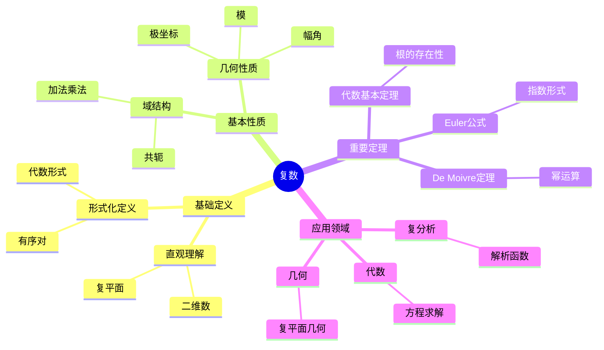
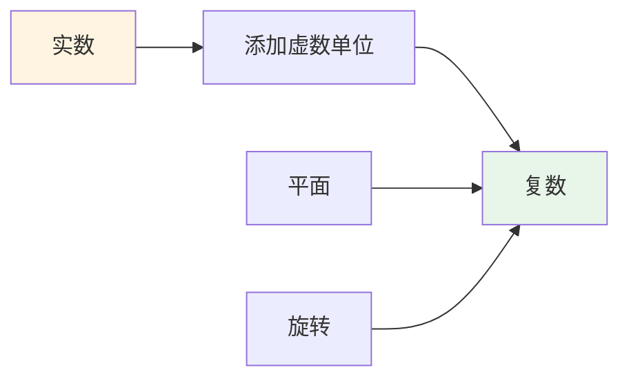
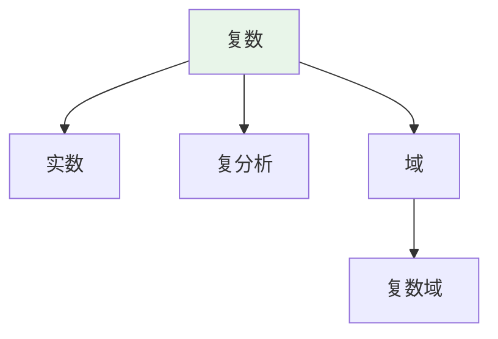
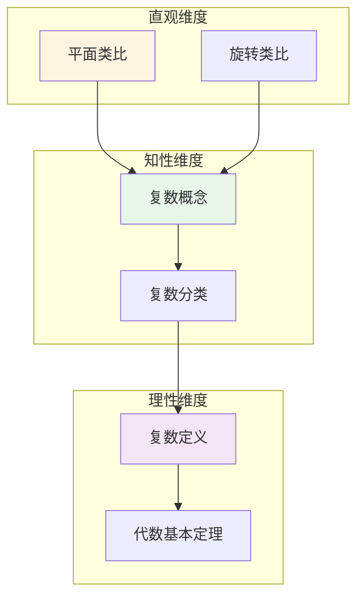

# 复数 (Complex Number)

**概念编号**: C.CORE.007
**知识层次**: L0-L2
**知识领域**: D1 (基础数学)
**创建日期**: 2025年11月21日
**最后更新**: 2025年11月21日

---

## 📑 目录

- [复数 (Complex Number)](#复数-complex-number)
  - [📑 目录](#-目录)
  - [1. 📋 概述](#1--概述)
  - [2. 🎯 严格定义](#2--严格定义)
    - [2.1 基础定义 (L0)](#21-基础定义-l0)
    - [2.2 形式化定义 (L1)](#22-形式化定义-l1)
  - [3. 📚 历史背景](#3--历史背景)
    - [3.1 发展脉络](#31-发展脉络)
    - [3.2 关键人物](#32-关键人物)
    - [3.3 重要事件](#33-重要事件)
  - [4. 🔍 性质与定理](#4--性质与定理)
    - [4.1 基本性质 (L1)](#41-基本性质-l1)
    - [4.2 重要定理 (L2)](#42-重要定理-l2)
  - [5. 🔬 形式化证明](#5--形式化证明)
    - [定理2: Euler公式的形式化证明](#定理2-euler公式的形式化证明)
  - [6. 💡 应用实例](#6--应用实例)
    - [6.1 理论应用](#61-理论应用)
    - [6.2 实际应用](#62-实际应用)
      - [应用1: 量子力学 - 量子叠加态](#应用1-量子力学---量子叠加态)
      - [应用2: 信号处理 - 傅里叶变换](#应用2-信号处理---傅里叶变换)
    - [交叉应用](#交叉应用)
  - [7. 🔗 关联概念](#7--关联概念)
    - [依赖关系](#依赖关系)
    - [等价关系](#等价关系)
    - [推广关系](#推广关系)
    - [应用关系](#应用关系)
  - [8. 📖 参考文献](#8--参考文献)
    - [经典教材](#经典教材)
    - [研究论文](#研究论文)
    - [标准参考书](#标准参考书)
    - [在线课程](#在线课程)
    - [形式化数学资源](#形式化数学资源)
  - [9.4 🎓 学习路径](#94--学习路径)
    - [基础路径 (L0→L1)](#基础路径-l0l1)
    - [进阶路径 (L1→L2)](#进阶路径-l1l2)
    - [高级路径 (L2→L3)](#高级路径-l2l3)
  - [9.1 🗺️ 思维导图 (编号: C.CORE.007.MIND)](#91-️-思维导图-编号-ccore007mind)
    - [复数概念思维导图](#复数概念思维导图)
  - [9.2 📊 知识多维关系矩阵 (编号: C.CORE.007.MATRIX)](#92--知识多维关系矩阵-编号-ccore007matrix)
    - [复数的多维关系矩阵](#复数的多维关系矩阵)
  - [9.3 💭 形象化解释与论证 (编号: C.CORE.007.VISUAL)](#93--形象化解释与论证-编号-ccore007visual)
    - [形象化解释](#形象化解释)
    - [认知科学视角](#认知科学视角)
  - [9.6 👨‍🏫 专家观点与论证 (编号: C.CORE.007.EXPERT)](#96--专家观点与论证-编号-ccore007expert)
    - [数学家的观点](#数学家的观点)
    - [数学教育家的观点](#数学教育家的观点)
    - [数学认知学家的观点](#数学认知学家的观点)
  - [9.7 🎨 认知维度表征 (编号: C.CORE.007.COGNITIVE)](#97--认知维度表征-编号-ccore007cognitive)
    - [直观维度表征 (编号: C.CORE.007.INTUITIVE)](#直观维度表征-编号-ccore007intuitive)
      - [形象类比](#形象类比)
      - [具体例子](#具体例子)
      - [可视化表示](#可视化表示)
      - [几何直观](#几何直观)
    - [知性维度表征 (编号: C.CORE.007.INTELLECTUAL)](#知性维度表征-编号-ccore007intellectual)
      - [概念定义](#概念定义)
      - [概念分类](#概念分类)
      - [概念关系](#概念关系)
      - [知识矩阵](#知识矩阵)
    - [理性维度表征 (编号: C.CORE.007.RATIONAL)](#理性维度表征-编号-ccore007rational)
      - [公理体系](#公理体系)
      - [形式化定义](#形式化定义)
      - [逻辑推理](#逻辑推理)
      - [证明系统](#证明系统)
    - [综合整合表征 (编号: C.CORE.007.INTEGRATED)](#综合整合表征-编号-ccore007integrated)
      - [多维度整合](#多维度整合)
      - [图形转换](#图形转换)
      - [应用示例](#应用示例)
  - [9.5 📚 习题库](#95--习题库)
    - [L0基础题（5道）](#l0基础题5道)
    - [L1中级题（6道）](#l1中级题6道)
    - [L2高级题（4道）](#l2高级题4道)

---

## 1. 📋 概述

复数是实数的扩展，引入虚数单位 $i$ 满足 $i^2 = -1$。复数构成代数闭域，是复分析、量子力学、信号处理等领域的基础。

**权威资源对齐**:

- Wikipedia: [Complex Number](https://en.wikipedia.org/wiki/Complex_number)
- Stanford课程: Math 106 (Functions of a Complex Variable)
- Princeton课程: MAT 201 (Analysis)
- MIT课程: 18.04 (Complex Variables with Applications)
- Metamath: [Complex Numbers](http://us.metamath.org/mpeuni/df-cj.html)

---

## 2. 🎯 严格定义

### 2.1 基础定义 (L0)

**直观理解**: 复数是形如 $a + bi$ 的数，其中 $a, b \in \mathbb{R}$，$i$ 是虚数单位满足 $i^2 = -1$。

**基本定义**: 复数集 $\mathbb{C}$ 是所有形如 $a + bi$ 的数的集合，其中 $a, b \in \mathbb{R}$，$i^2 = -1$。

**简单例子**:

- $1 + 2i$ 是复数
- $3 - 4i$ 是复数
- $5i$ 是复数（纯虚数）
- $7$ 是复数（实数）
- $0$ 是复数

### 2.2 形式化定义 (L1)

**序对构造**: 复数可以通过实数对构造：

**定义**: 复数集定义为：
$$\mathbb{C} = \mathbb{R} \times \mathbb{R}$$

配备运算：

- **加法**: $(a,b) + (c,d) = (a+c, b+d)$
- **乘法**: $(a,b) \cdot (c,d) = (ac-bd, ad+bc)$

**标准记号**: $(a,b) = a + bi$，其中 $i = (0,1)$。

**验证**: $i^2 = (0,1) \cdot (0,1) = (-1, 0) = -1$。

**等价定义**:

- **序对构造**: 通过实数对
- **矩阵表示**: 通过 $2 \times 2$ 实矩阵
- **多项式商**: $\mathbb{C} = \mathbb{R}[x] / (x^2 + 1)$

**记号**:

- $\mathbb{C} = \{a + bi : a, b \in \mathbb{R}\}$: 复数集
- $a + bi$: 复数的代数形式
- $\text{Re}(z) = a$: 实部
- $\text{Im}(z) = b$: 虚部
- $|z| = \sqrt{a^2 + b^2}$: 模长
- $\arg(z) = \theta$: 幅角
- $\overline{z} = a - bi$: 共轭

---

## 3. 📚 历史背景

### 3.1 发展脉络

**16世纪**: 复数的引入

- **Cardano (1545)**: 在《大术》中解三次方程时遇到负数开方
- **Bombelli (1572)**: 发展复数的运算规则
- **Descartes (1637)**: 引入"虚数"（imaginary）一词

**18世纪**: 复数的接受和应用

- **Euler (1748)**: 发现Euler公式 $e^{i\theta} = \cos\theta + i\sin\theta$
- **d'Alembert (1746)**: 在流体力学中使用复数
- **Gauss (1799)**: 证明代数基本定理

**19世纪**: 复数的严格构造

- **Hamilton (1837)**: 给出复数的严格构造（序对）
- **Argand (1806)**: 提出复数的几何表示（Argand图）
- **Cauchy (1821)**: 发展复分析理论

**20世纪**: 复数的广泛应用

- **量子力学 (1920s)**: 复数用于描述量子态
- **信号处理 (1940s)**: 复数用于傅里叶分析
- **控制理论 (1950s)**: 复数用于系统分析

### 3.2 关键人物

- **Gerolamo Cardano (1501-1576)**: 在解三次方程时引入复数
- **Leonhard Euler (1707-1783)**: 发现Euler公式
- **Carl Friedrich Gauss (1777-1855)**: 证明代数基本定理
- **William Rowan Hamilton (1805-1865)**: 给出复数的严格构造
- **Augustin-Louis Cauchy (1789-1857)**: 发展复分析理论

### 3.3 重要事件

- **1545**: Cardano在解三次方程时遇到复数
- **1748**: Euler发现Euler公式
- **1799**: Gauss证明代数基本定理
- **1837**: Hamilton给出复数的严格构造
- **1920s**: 复数在量子力学中的应用

---

## 4. 🔍 性质与定理

### 4.1 基本性质 (L1)

**性质1: 复数的域结构**:

- **陈述**: 复数集 $\mathbb{C}$ 配备加法和乘法构成域
- **加法性质**: 交换律、结合律、单位元、逆元
- **乘法性质**: 交换律、结合律、单位元、逆元（非零元）
- **分配律**: $z(w+u) = zw + zu$
- **证明思路**: 由序对构造和运算定义直接得到
- **应用**: 复数运算、复分析

**性质2: 复数的模和共轭**:

- **模长**: $|z| = \sqrt{a^2 + b^2} = \sqrt{z\overline{z}}$
- **共轭**: $\overline{a+bi} = a-bi$
- **性质**:
  - $|z| \geqqq 0$，且 $|z| = 0 \leqqftrightarrow z = 0$
  - $|zw| = |z||w|$
  - $|z+w| \leqqq |z| + |w|$（三角不等式）
  - $\overline{z+w} = \overline{z} + \overline{w}$
  - $\overline{zw} = \overline{z} \cdot \overline{w}$
- **证明思路**: 由模和共轭的定义直接得到
- **应用**: 复数几何、复分析

**性质3: 复数的极坐标形式**:

- **定义**: $z = r(\cos\theta + i\sin\theta) = re^{i\theta}$，其中 $r = |z|$，$\theta = \arg(z)$
- **性质**:
  - $r$ 唯一（$r = |z|$）
  - $\theta$ 模 $2\pi$ 唯一
- **证明思路**: 由Euler公式和三角函数的性质得到
- **应用**: 复数乘法、De Moivre定理

**性质4: De Moivre定理**:

- **陈述**: $(r(\cos\theta + i\sin\theta))^n = r^n(\cos(n\theta) + i\sin(n\theta))$
- **等价形式**: $(re^{i\theta})^n = r^n e^{in\theta}$
- **证明思路**: 由Euler公式和指数法则得到
- **应用**: 复数幂、根的计算

**性质5: 复数的根**:

- **陈述**: 对于非零复数 $z = re^{i\theta}$ 和正整数 $n$，$z$ 有 $n$ 个 $n$ 次根：
  $$w_k = \sqrt[n]{r} e^{i(\theta + 2k\pi)/n}, \quad k = 0, 1, \ldots, n-1$$
- **证明思路**: 由De Moivre定理和根的周期性得到
- **应用**: 复数方程、几何

### 4.2 重要定理 (L2)

**定理1: 代数基本定理**:

- **陈述**: 每个非常数复系数多项式在复数域中有根
- **等价形式**: 每个 $n$ 次复系数多项式有恰好 $n$ 个根（计重数）
- **证明思路**:
  1. 使用复分析工具（Liouville定理、最大模原理）
  2. 或使用拓扑方法（Brouwer不动点定理）
- **应用**: 多项式理论、代数

**定理2: Euler公式**:

- **陈述**: $e^{i\theta} = \cos\theta + i\sin\theta$
- **证明思路**:
  1. 使用Taylor级数展开
  2. $e^{i\theta} = \sum_{n=0}^\infty \frac{(i\theta)^n}{n!} = \sum_{n=0}^\infty \frac{(-1)^n \theta^{2n}}{(2n)!} + i\sum_{n=0}^\infty \frac{(-1)^n \theta^{2n+1}}{(2n+1)!} = \cos\theta + i\sin\theta$
- **应用**: 复数表示、三角函数

**定理3: 复数的三角不等式**:

- **陈述**: $|z+w| \leqqq |z| + |w|$，等号成立当且仅当 $z$ 和 $w$ 同向
- **证明思路**:
  1. $|z+w|^2 = (z+w)(\overline{z+w}) = |z|^2 + |w|^2 + 2\text{Re}(z\overline{w})$
  2. $\leqqq |z|^2 + |w|^2 + 2|z||w| = (|z| + |w|)^2$
- **应用**: 复数几何、复分析

**定理4: 复数的唯一性（代数闭域）**:

- **陈述**: 复数域是包含实数的最小代数闭域
- **证明思路**: 由代数基本定理得到
- **应用**: 域论、代数

**定理5: 复数的基数**:

- **陈述**: 复数集是不可数的，基数 $|\mathbb{C}| = \mathfrak{c} = 2^{\aleph_0}$
- **证明思路**: $\mathbb{C} = \mathbb{R} \times \mathbb{R}$，因此 $|\mathbb{C}| = |\mathbb{R}|^2 = \mathfrak{c}^2 = \mathfrak{c}$
- **应用**: 基数理论、测度论

---

## 5. 🔬 形式化证明

### 定理2: Euler公式的形式化证明

**定理陈述**:
$$\forall \theta \in \mathbb{R}, e^{i\theta} = \cos\theta + i\sin\theta$$

**前提**:

- 指数函数的Taylor级数
- 三角函数的Taylor级数
- 复数的运算

**形式化证明**:

```text
步骤1: 指数函数的Taylor级数
  e^z = sum_{n=0}^infty z^n / n!  (对所有复数z)

步骤2: 代入z = i*theta
  e^{i*theta} = sum_{n=0}^infty (i*theta)^n / n!

步骤3: 分离实部和虚部
  对n = 2k: (i*theta)^{2k} / (2k)! = (-1)^k * theta^{2k} / (2k)!
  对n = 2k+1: (i*theta)^{2k+1} / (2k+1)! = i * (-1)^k * theta^{2k+1} / (2k+1)!

步骤4: 重新组合
  e^{i*theta} = sum_{k=0}^infty (-1)^k * theta^{2k} / (2k)!
                + i * sum_{k=0}^infty (-1)^k * theta^{2k+1} / (2k+1)!

步骤5: 识别三角函数
  cos(theta) = sum_{k=0}^infty (-1)^k * theta^{2k} / (2k)!
  sin(theta) = sum_{k=0}^infty (-1)^k * theta^{2k+1} / (2k+1)!

步骤6: 结论
  因此: e^{i*theta} = cos(theta) + i*sin(theta)
```

**Metamath格式参考**:

```text
${
  euler.1 $e |- theta e. RR $.
  euler $p |- e^(i*theta) = cos(theta) + i*sin(theta) $=
    ( ... ) ABCDEFG $.
$}
```

---

## 6. 💡 应用实例

### 6.1 理论应用

**应用1: 复分析**:

- 复数是复分析的基础
- 例如：解析函数、全纯函数、留数定理

**应用2: 代数**:

- 复数用于代数方程
- 例如：代数基本定理、Galois理论

**应用3: 几何**:

- 复数用于几何变换
- 例如：旋转、缩放、Möbius变换

**应用4: 数论**:

- 复数用于数论
- 例如：L函数、Riemann zeta函数

### 6.2 实际应用

#### 应用1: 量子力学 - 量子叠加态

**问题描述**:
电子的自旋状态可以用复数表示，求自旋向上和自旋向下状态的等权重叠加态。

**数学建模**:
自旋状态空间是 $\mathbb{C}^2$，基为 $\{|+\rangle, |-\rangle\}$。
叠加态：$|\psi\rangle = \alpha|+\rangle + \beta|-\rangle$，其中 $|\alpha|^2 + |\beta|^2 = 1$。

**计算过程**:

- 基向量：$|+\rangle = \begin{pmatrix} 1 \\ 0 \end{pmatrix}$，$|-\rangle = \begin{pmatrix} 0 \\ 1 \end{pmatrix}$
- 等权重叠加：$\alpha = \beta = \frac{1}{\sqrt{2}}$
- 叠加态：$|\psi\rangle = \frac{1}{\sqrt{2}}\begin{pmatrix} 1 \\ 1 \end{pmatrix}$
- 归一化验证：$|\frac{1}{\sqrt{2}}|^2 + |\frac{1}{\sqrt{2}}|^2 = \frac{1}{2} + \frac{1}{2} = 1$ ✓

**结果解释**:
等权重叠加态是 $\frac{1}{\sqrt{2}}(|+\rangle + |-\rangle)$。复数用于描述量子态的相位和幅度。

**数据**:

- 状态空间维数: 2
- 叠加系数: $\alpha = \beta = \frac{1}{\sqrt{2}}$
- 归一化: 满足

#### 应用2: 信号处理 - 傅里叶变换

**问题描述**:
计算信号 $f(t) = \cos(2\pi t)$ 的傅里叶变换。

**数学建模**:
傅里叶变换：$F(\omega) = \int_{-\infty}^{\infty} f(t) e^{-i\omega t} dt$。

**计算过程**:

- $f(t) = \cos(2\pi t) = \frac{e^{i2\pi t} + e^{-i2\pi t}}{2}$
- $F(\omega) = \int_{-\infty}^{\infty} \frac{e^{i2\pi t} + e^{-i2\pi t}}{2} e^{-i\omega t} dt$
- $= \frac{1}{2}[\delta(\omega - 2\pi) + \delta(\omega + 2\pi)]$

**结果解释**:
$\cos(2\pi t)$ 的傅里叶变换是两个狄拉克δ函数，位于 $\omega = \pm 2\pi$。复数用于频域分析。

**数据**:

- 信号: $f(t) = \cos(2\pi t)$
- 频率: $\pm 2\pi$ 弧度/秒
- 变换: $F(\omega) = \frac{1}{2}[\delta(\omega - 2\pi) + \delta(\omega + 2\pi)]$

**应用3: 控制理论**:

- 复数用于系统分析
- 例如：传递函数、稳定性分析

**应用4: 电路分析**:

- 复数用于交流电路
- 例如：阻抗、相位、频率响应

### 交叉应用

**应用1: 微分几何**:

- 复数用于复流形
- 例如：Riemann曲面、Kähler流形

**应用2: 代数几何**:

- 复数用于代数簇
- 例如：复代数簇、Hodge理论

**应用3: 表示论**:

- 复数用于表示理论
- 例如：复表示、特征标

**应用4: 概率论**:

- 复数用于特征函数
- 例如：概率分布、随机过程

---

## 7. 🔗 关联概念

### 依赖关系

**前置知识**:

- 实数（复数通过实数构造）
- 向量空间（复数可以看作2维实向量空间）

**后续知识**:

- 复分析（复函数的分析）
- 解析函数（复函数的解析性）
- 全纯函数（复函数的全纯性）
- 四元数（复数的推广）

### 等价关系

**等价定义**:

- 序对构造（通过实数对）
- 矩阵表示（通过 $2 \times 2$ 实矩阵）
- 多项式商（$\mathbb{R}[x] / (x^2 + 1)$）

### 推广关系

**特殊情形**:

- 实数（虚部为0的复数）
- 纯虚数（实部为0的复数）

**一般推广**:

- 四元数（$\mathbb{H}$）
- 八元数（$\mathbb{O}$）
- 超复数（Clifford代数）

### 应用关系

**理论应用**:

- 复分析
- 代数
- 几何
- 数论

**实际问题**:

- 量子力学
- 信号处理
- 控制理论
- 电路分析

---

## 8. 📖 参考文献

### 经典教材

1. **Ahlfors, L. V. (1979). *Complex Analysis* (3rd ed.). McGraw-Hill.**
   - **内容**: 复分析的经典教材，深入讨论复数
   - **适用层次**: L2-L3
   - **特点**: 权威参考，适合深入学习

2. **Needham, T. (1997). *Visual Complex Analysis*. Oxford University Press.**
   - **内容**: 复分析的视觉化教材，强调几何直观
   - **适用层次**: L1-L2
   - **特点**: 直观易懂，包含大量可视化

3. **Conway, J. B. (1978). *Functions of One Complex Variable* (2nd ed.). Springer.**
   - **内容**: 单复变函数的专门教材
   - **适用层次**: L2-L3
   - **特点**: 技术性强，适合研究

### 研究论文

1. **Cardano, G. (1545). *Artis Magnae Sive de Regulis Algebraicis Liber Unus*. Nuremberg: Petreius.**
   - **内容**: 在解三次方程时引入复数
   - **重要性**: 复数的起源

2. **Euler, L. (1748). *Introductio in analysin infinitorum*. Lausanne: Marc-Michel Bousquet.**
   - **内容**: 发现Euler公式 $e^{i\theta} = \cos\theta + i\sin\theta$
   - **重要性**: 复数理论的里程碑

3. **Hamilton, W. R. (1837). Theory of Conjugate Functions, or Algebraic Couples. *Transactions of the Royal Irish Academy*, 17, 293-422.**
   - **内容**: 给出复数的严格构造（序对）
   - **重要性**: 复数构造的基础

### 标准参考书

1. **Wikipedia contributors. (2024). Complex number. In *Wikipedia, The Free Encyclopedia*. Retrieved from <https://en.wikipedia.org/wiki/Complex_number>**
   - **内容**: 复数概念的全面介绍
   - **特点**: 易于访问，包含大量示例

2. **Wikipedia contributors. (2024). Complex analysis. In *Wikipedia, The Free Encyclopedia*. Retrieved from <https://en.wikipedia.org/wiki/Complex_analysis>**
   - **内容**: 复分析的全面介绍
   - **特点**: 包含复数的应用

### 在线课程

1. **MIT OpenCourseWare. (2024). 18.04 Complex Variables with Applications. Retrieved from <https://ocw.mit.edu/>**
   - **内容**: 复变函数课程，深入讨论复数
   - **特点**: 免费公开课程

2. **Khan Academy. (2024). Complex Numbers. Retrieved from <https://www.khanacademy.org/>**
   - **内容**: 复数的在线课程
   - **特点**: 适合初学者

### 形式化数学资源

1. **Metamath contributors. (2024). Complex Numbers. In *Metamath Proof Explorer*. Retrieved from <http://us.metamath.org/mpeuni/df-cj.html>**
   - **内容**: 复数的形式化证明
   - **特点**: 完全形式化的证明系统

---

## 9.4 🎓 学习路径

### 基础路径 (L0→L1)

1. **直观理解**: 复数是形如 $a + bi$ 的数
2. **基本定义**: 复数的序对构造
3. **简单例子**: 代数形式、极坐标形式
4. **基本运算**: 加法、减法、乘法、除法
5. **形式化定义**: 序对构造、矩阵表示、多项式商

### 进阶路径 (L1→L2)

1. **复数性质**: 模、共轭、极坐标形式
2. **重要定理**: Euler公式、De Moivre定理、代数基本定理
3. **应用实例**: 复分析、代数、几何
4. **深入定理**: 复数的唯一性、复数的基数
5. **复数的根**: $n$ 次根的计算

### 高级路径 (L2→L3)

1. **复分析**: 解析函数、全纯函数、留数定理
2. **代数几何**: 复代数簇、Hodge理论
3. **表示论**: 复表示、特征标
4. **前沿研究**: 复动力系统、Teichmüller理论
5. **研究工具**: 复分析软件、计算工具

---

## 9.1 🗺️ 思维导图 (编号: C.CORE.007.MIND)

### 复数概念思维导图



---

## 9.2 📊 知识多维关系矩阵 (编号: C.CORE.007.MATRIX)

### 复数的多维关系矩阵

| 维度 | 指标 | 复数 |
|------|------|------|
| **知识层次** | L0基础 | ⭐⭐⭐⭐⭐ |
| | L1中级 | ⭐⭐⭐⭐ |
| | L2高级 | ⭐⭐⭐⭐ |
| | L3研究 | ⭐⭐⭐ |
| **知识领域** | D1基础数学 | ⭐⭐⭐⭐⭐ |
| | D2代数 | ⭐⭐⭐⭐ |
| | D3分析 | ⭐⭐⭐⭐⭐ |
| | D4几何 | ⭐⭐⭐⭐ |
| **依赖关系** | 前置概念 | 实数 |
| | 后续概念 | 复分析、代数几何 |
| **应用关系** | 理论应用 | ⭐⭐⭐⭐⭐ |
| | 实际应用 | ⭐⭐⭐⭐ |
| | 交叉应用 | ⭐⭐⭐⭐ |
| **学习难度** | 直观理解 | ⭐⭐ |
| | 形式化理解 | ⭐⭐⭐ |
| | 深入应用 | ⭐⭐⭐ |

---

## 9.3 💭 形象化解释与论证 (编号: C.CORE.007.VISUAL)

### 形象化解释

**1. 复数的直观理解**:

- **类比**: 复数就像"二维数"或"平面上的点"
- **例子**:
  - 复平面：横轴是实部，纵轴是虚部
  - 向量：复数可以看作从原点到点的向量
  - 旋转：乘以$i$相当于逆时针旋转90度

**2. 复数运算的直观理解**:

- **加法**: 向量加法（如$(3+4i) + (1+2i) = 4+6i$）
- **乘法**: 模相乘，幅角相加（如$r_1e^{i\theta_1} \cdot r_2e^{i\theta_2} = r_1r_2e^{i(\theta_1+\theta_2)}$）
- **共轭**: 关于实轴的反射（如$\overline{3+4i} = 3-4i$）

**3. Euler公式的直观理解**:

- **类比**: Euler公式就像"连接代数和三角的桥梁"
- **解释**:
  - $e^{i\theta} = \cos\theta + i\sin\theta$将指数函数和三角函数联系起来
  - 当$\theta = \pi$时，得到$e^{i\pi} + 1 = 0$（Euler恒等式）

### 认知科学视角

**1. 数学教育家Dienes的观点**:

- **多表征原则**: 通过代数形式、几何形式、极坐标形式等多种方式表示复数
- **变化性原则**: 通过不同的复数例子理解复数的本质
- **教学启示**: 使用复平面、向量、旋转等多种教学工具

**2. 数学认知学家Tall的观点**:

- **过程-对象对偶**: 理解"复数运算"（过程）和"复数"（对象）
- **认知层次**: 从直观理解（"二维数"）到形式化理解（有序对定义）

---

## 9.6 👨‍🏫 专家观点与论证 (编号: C.CORE.007.EXPERT)

### 数学家的观点

**1. Leonhard Euler (1707-1783) - 复数理论的奠基者**:
> "复数通过引入虚数单位$i$扩展了实数，Euler公式揭示了复数的深刻性质。"
>
> **意义**: Euler建立了复数理论的基础，Euler公式是数学中最美的公式之一。

**2. Carl Friedrich Gauss (1777-1855) - 代数基本定理的证明者**:
> "每个复系数多项式都有复根，这体现了复数的完备性。"
>
> **意义**: Gauss证明了代数基本定理，揭示了复数在代数中的核心地位。

**3. Augustin-Louis Cauchy (1789-1857) - 复分析的奠基者**:
> "复分析研究解析函数，这是数学中最优美的理论之一。"
>
> **意义**: Cauchy开创了复分析，揭示了复数的分析性质。

### 数学教育家的观点

**1. Zoltan Dienes (1916-2014) - 数学教育家**:
> "复数概念应该通过代数形式、几何形式、极坐标形式等多种方式学习。"
>
> **教学启示**:
>
> - 使用复平面可视化复数
> - 使用向量理解复数运算
> - 逐步引入Euler公式和极坐标形式

**2. Hans Freudenthal (1905-1990) - 数学教育家**:
> "复数概念的学习需要从'实数扩展'发展到'复分析结构'。"
>
> **认知发展**:
>
> - **扩展阶段**: 理解复数作为实数的扩展
> - **结构阶段**: 理解复数作为域的结构和几何结构

### 数学认知学家的观点

**1. David Tall - 数学认知学家**:
> "复数概念的理解需要从'过程'（如何运算）发展到'对象'（复数本身）。"
>
> **认知层次**:
>
> - **过程层次**: 理解"如何做复数运算"（如$(3+4i)(1+2i)$）
> - **对象层次**: 理解"复数"（如$3+4i$是一个复数）

---

## 9.7 🎨 认知维度表征 (编号: C.CORE.007.COGNITIVE)

### 直观维度表征 (编号: C.CORE.007.INTUITIVE)

#### 形象类比

- **平面类比**: 复数就像"平面上的点"
  - 实部对应横坐标，虚部对应纵坐标
  - 就像坐标$(x, y)$

- **旋转类比**: 复数就像"旋转和缩放"
  - 乘以$i$相当于旋转90度
  - 复数的模对应距离，幅角对应角度

#### 具体例子

- **例子1**: $3 + 4i$ - 复数
  - 实部：3
  - 虚部：4
  - 模：5

- **例子2**: $e^{i\pi} = -1$ - Euler公式
  - 连接指数函数和三角函数
  - 这是复分析的基础

#### 可视化表示



#### 几何直观

- **复平面直观**: 通过复平面理解复数
  - 复数对应平面上的点
  - 实轴和虚轴

- **极坐标直观**: 通过极坐标理解复数
  - 模和幅角
  - 乘法的几何意义

---

### 知性维度表征 (编号: C.CORE.007.INTELLECTUAL)

#### 概念定义

- **严格定义**: 复数是形如$a + bi$的数，其中$a, b \in \mathbb{R}$，$i^2 = -1$
- **等价定义**: 通过有序对、矩阵表示定义
- **特征描述**: 复数是代数闭域，是实数的代数闭包

#### 概念分类

- **实数 vs 纯虚数 vs 一般复数**: 按类型分类
- **代数数 vs 超越数**: 按代数性质分类
- **单位根 vs 一般复数**: 按特殊性质分类

#### 概念关系



#### 知识矩阵

| 维度 | 指标 | 复数 |
|------|------|------|
| **知识层次** | L0基础 | ⭐⭐⭐⭐ |
| | L1中级 | ⭐⭐⭐⭐ |
| | L2高级 | ⭐⭐⭐ |
| **知识领域** | D1基础数学 | ⭐⭐⭐⭐⭐ |
| **学习难度** | 直观理解 | ⭐⭐⭐ |
| | 形式化理解 | ⭐⭐⭐ |
| **认知维度** | 直观维度 | ⭐⭐⭐⭐ |
| | 知性维度 | ⭐⭐⭐⭐ |
| | 理性维度 | ⭐⭐⭐ |

---

### 理性维度表征 (编号: C.CORE.007.RATIONAL)

#### 公理体系

- **复数定义**: 复数是实数对$(a,b)$，记作$a + bi$
- **域公理**: 复数是域
- **代数闭性**: 复数是代数闭域

#### 形式化定义

- **形式化定义**: 使用一阶逻辑严格定义
- **符号系统**: $\mathbb{C}$, $i$, $a + bi$, $|z|$, $\arg z$
- **类型系统**: 复数是实数类型的扩展类型

#### 逻辑推理

- **基本定理**: 复数的运算性质、代数基本定理、Euler公式
- **证明思路**: 使用实数公理和逻辑推理证明
- **推理链**: 定义 → 基本性质 → 运算性质 → 重要定理

#### 证明系统

- **证明方法**: 构造性证明、几何方法、代数方法
- **形式化证明**: 可以使用Lean4等工具进行形式化
- **验证工具**: Metamath、Lean4等

---

### 综合整合表征 (编号: C.CORE.007.INTEGRATED)

#### 多维度整合



#### 图形转换

- **思维导图**: 展示复数的知识结构
- **知识图谱**: 展示复数与其他概念的关系
- **知识矩阵**: 展示复数的多维度特征

#### 应用示例

- **应用1**: 复分析（解析函数、留数定理）
- **应用2**: 代数（代数基本定理、Galois理论）
- **应用3**: 工程（信号处理、控制理论）

---

## 9.5 📚 习题库

### L0基础题（5道）

**EX.CORE.007.01** (L0, 概念理解)

- **题目**: 计算：$(3 + 4i) + (1 - 2i)$，$(2 + i)(3 - i)$。
- **答案**: $(3 + 4i) + (1 - 2i) = 4 + 2i$，$(2 + i)(3 - i) = 6 - 2i + 3i - i^2 = 7 + i$。

**EX.CORE.007.02** (L0, 计算)

- **题目**: 计算：$|3 + 4i|$（模长），$\overline{2 - 5i}$（共轭）。
- **答案**: $|3 + 4i| = \sqrt{9 + 16} = 5$，$\overline{2 - 5i} = 2 + 5i$。

**EX.CORE.007.03** (L0, 概念理解)

- **题目**: 将复数 $1 + i$ 表示为极坐标形式。
- **答案**: $1 + i = \sqrt{2}e^{i\pi/4} = \sqrt{2}(\cos\frac{\pi}{4} + i\sin\frac{\pi}{4})$。

**EX.CORE.007.04** (L0, 计算)

- **题目**: 计算：$(1 + i)^4$。
- **答案**: $(1 + i)^2 = 2i$，$(1 + i)^4 = (2i)^2 = -4$。

**EX.CORE.007.05** (L0, 应用)

- **题目**: 求方程 $z^2 + 1 = 0$ 的所有解。
- **答案**: $z = \pm i$。

### L1中级题（6道）

**EX.CORE.007.06** (L1, 证明)

- **题目**: 证明：复数集 $\mathbb{C}$ 在加法和乘法下构成域。
- **提示**: 验证域的所有公理。
- **答案**: 验证加法和乘法的交换律、结合律、分配律，以及单位元、逆元的存在性。

**EX.CORE.007.07** (L1, 证明)

- **题目**: 证明：$|z_1 z_2| = |z_1||z_2|$ 和 $|\overline{z}| = |z|$。
- **提示**: 使用模长的定义。
- **答案**: $|z_1 z_2|^2 = (z_1 z_2)(\overline{z_1 z_2}) = z_1 \overline{z_1} z_2 \overline{z_2} = |z_1|^2 |z_2|^2$。$|\overline{z}|^2 = \overline{z} \cdot z = |z|^2$。

**EX.CORE.007.08** (L1, 计算)

- **题目**: 使用De Moivre公式计算：$(\cos\frac{\pi}{6} + i\sin\frac{\pi}{6})^3$。
- **答案**: $(\cos\frac{\pi}{6} + i\sin\frac{\pi}{6})^3 = \cos\frac{\pi}{2} + i\sin\frac{\pi}{2} = i$。

**EX.CORE.007.09** (L1, 证明)

- **题目**: 证明：复数 $z$ 的 $n$ 次方根有 $n$ 个不同的值。
- **提示**: 使用极坐标形式。
- **答案**: 设 $z = re^{i\theta}$，则 $z^{1/n} = r^{1/n}e^{i(\theta + 2k\pi)/n}$（$k = 0, 1, \ldots, n-1$），共 $n$ 个不同的值。

**EX.CORE.007.10** (L1, 应用)

- **题目**: 求 $z^3 = 1$ 的所有解（单位根）。
- **答案**: $z = e^{2k\pi i/3}$（$k = 0, 1, 2$），即 $1$，$\frac{-1 + \sqrt{3}i}{2}$，$\frac{-1 - \sqrt{3}i}{2}$。

**EX.CORE.007.11** (L1, 证明)

- **题目**: 证明：$\mathbb{C}$ 是代数闭域（代数基本定理）。
- **提示**: 使用代数基本定理。
- **答案**: 代数基本定理：每个非常数复系数多项式都有复根，因此 $\mathbb{C}$ 是代数闭域。

### L2高级题（4道）

**EX.CORE.007.12** (L2, 证明)

- **题目**: 证明：复数域 $\mathbb{C}$ 是实数域 $\mathbb{R}$ 的代数闭包。
- **提示**: 使用代数基本定理。
- **答案**: $\mathbb{C}$ 包含 $\mathbb{R}$，且是代数闭域，且是包含 $\mathbb{R}$ 的最小代数闭域，因此 $\mathbb{C}$ 是 $\mathbb{R}$ 的代数闭包。

**EX.CORE.007.13** (L2, 证明)

- **题目**: 证明：复数域 $\mathbb{C}$ 的自同构只有恒等映射和共轭映射。
- **提示**: 使用自同构保持 $\mathbb{R}$ 的性质。
- **答案**: 设 $\sigma: \mathbb{C} \to \mathbb{C}$ 是自同构，则 $\sigma|_{\mathbb{R}} = \text{id}$，因此 $\sigma(i)^2 = \sigma(i^2) = \sigma(-1) = -1$，所以 $\sigma(i) = \pm i$，因此 $\sigma = \text{id}$ 或 $\sigma(z) = \overline{z}$。

**EX.CORE.007.14** (L2, 综合)

- **题目**: 证明：$\mathbb{C}$ 不能赋予全序使得它成为有序域。
- **提示**: 考虑 $i$ 的序。
- **答案**: 假设 $\mathbb{C}$ 是有序域，则 $i > 0$ 或 $i < 0$。若 $i > 0$，则 $i^2 = -1 > 0$，矛盾。若 $i < 0$，则 $-i > 0$，因此 $(-i)^2 = -1 > 0$，矛盾。

**EX.CORE.007.15** (L2, 证明)

- **题目**: 证明：复数域 $\mathbb{C}$ 是唯一的代数闭域且包含 $\mathbb{R}$（在同构意义下）。
- **提示**: 使用域的同构理论。
- **答案**: 设 $F$ 是代数闭域且包含 $\mathbb{R}$，则 $F$ 包含 $\mathbb{C}$，且 $F$ 的每个元素都是某个多项式的根，因此 $F \cong \mathbb{C}$。

---

**创建日期**: 2025年11月21日
**最后更新**: 2025年1月（与新框架整合）

**关联文档**：

- [复数-多理论分析示例](./07-复数-多理论分析示例-2025年1月.md) ⭐ 最新 - 多理论分析示例

- [复数-三视角版](./07-复数-三视角版.md) ⭐ 三视角版本
- [复数-决策导图示例](./07-复数-决策导图示例-2025年1月.md) ⭐ 最新 - 决策导图示例
- [概念体系全面梳理与推进计划](../00-概念体系全面梳理与推进计划-2025年1月.md) ⭐ 最新
- [核心概念与新框架整合指南](../00-核心概念与新框架整合指南-2025年1月.md) ⭐ 最新

**维护状态**: 持续更新中
