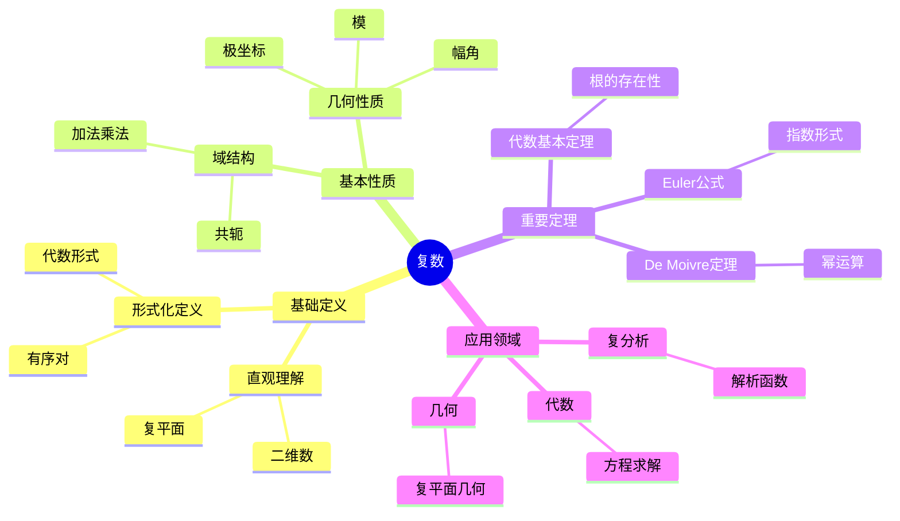

# 复数 (Complex Number)

**概念编号**: C.CORE.007
**知识层次**: L0-L2
**知识领域**: D1 (基础数学)
**创建日期**: 2025年11月21日
**最后更新**: 2025年11月21日

---

## 📋 概述

复数是实数的扩展，引入虚数单位 $i$ 满足 $i^2 = -1$。复数构成代数闭域，是复分析、量子力学、信号处理等领域的基础。

**权威资源对齐**:

- Wikipedia: [Complex Number](https://en.wikipedia.org/wiki/Complex_number)
- Stanford课程: Math 106 (Functions of a Complex Variable)
- Princeton课程: MAT 201 (Analysis)
- MIT课程: 18.04 (Complex Variables with Applications)
- Metamath: [Complex Numbers](http://us.metamath.org/mpeuni/df-cj.html)

---

## 🎯 严格定义

### 基础定义 (L0)

**直观理解**: 复数是形如 $a + bi$ 的数，其中 $a, b \in \mathbb{R}$，$i$ 是虚数单位满足 $i^2 = -1$。

**基本定义**: 复数集 $\mathbb{C}$ 是所有形如 $a + bi$ 的数的集合，其中 $a, b \in \mathbb{R}$，$i^2 = -1$。

**简单例子**:

- $1 + 2i$ 是复数
- $3 - 4i$ 是复数
- $5i$ 是复数（纯虚数）
- $7$ 是复数（实数）
- $0$ 是复数

### 形式化定义 (L1)

**序对构造**: 复数可以通过实数对构造：

**定义**: 复数集定义为：
$$\mathbb{C} = \mathbb{R} \times \mathbb{R}$$

配备运算：

- **加法**: $(a,b) + (c,d) = (a+c, b+d)$
- **乘法**: $(a,b) \cdot (c,d) = (ac-bd, ad+bc)$

**标准记号**: $(a,b) = a + bi$，其中 $i = (0,1)$。

**验证**: $i^2 = (0,1) \cdot (0,1) = (-1, 0) = -1$。

**等价定义**:

- **序对构造**: 通过实数对
- **矩阵表示**: 通过 $2 \times 2$ 实矩阵
- **多项式商**: $\mathbb{C} = \mathbb{R}[x] / (x^2 + 1)$

**记号**:

- $\mathbb{C} = \{a + bi : a, b \in \mathbb{R}\}$: 复数集
- $a + bi$: 复数的代数形式
- $\text{Re}(z) = a$: 实部
- $\text{Im}(z) = b$: 虚部
- $|z| = \sqrt{a^2 + b^2}$: 模长
- $\arg(z) = \theta$: 幅角
- $\overline{z} = a - bi$: 共轭

---

## 📚 历史背景

### 发展脉络

**16世纪**: 复数的引入

- **Cardano (1545)**: 在《大术》中解三次方程时遇到负数开方
- **Bombelli (1572)**: 发展复数的运算规则
- **Descartes (1637)**: 引入"虚数"（imaginary）一词

**18世纪**: 复数的接受和应用

- **Euler (1748)**: 发现Euler公式 $e^{i\theta} = \cos\theta + i\sin\theta$
- **d'Alembert (1746)**: 在流体力学中使用复数
- **Gauss (1799)**: 证明代数基本定理

**19世纪**: 复数的严格构造

- **Hamilton (1837)**: 给出复数的严格构造（序对）
- **Argand (1806)**: 提出复数的几何表示（Argand图）
- **Cauchy (1821)**: 发展复分析理论

**20世纪**: 复数的广泛应用

- **量子力学 (1920s)**: 复数用于描述量子态
- **信号处理 (1940s)**: 复数用于傅里叶分析
- **控制理论 (1950s)**: 复数用于系统分析

### 关键人物

- **Gerolamo Cardano (1501-1576)**: 在解三次方程时引入复数
- **Leonhard Euler (1707-1783)**: 发现Euler公式
- **Carl Friedrich Gauss (1777-1855)**: 证明代数基本定理
- **William Rowan Hamilton (1805-1865)**: 给出复数的严格构造
- **Augustin-Louis Cauchy (1789-1857)**: 发展复分析理论

### 重要事件

- **1545**: Cardano在解三次方程时遇到复数
- **1748**: Euler发现Euler公式
- **1799**: Gauss证明代数基本定理
- **1837**: Hamilton给出复数的严格构造
- **1920s**: 复数在量子力学中的应用

---

## 🔍 性质与定理

### 基本性质 (L1)

**性质1: 复数的域结构**:

- **陈述**: 复数集 $\mathbb{C}$ 配备加法和乘法构成域
- **加法性质**: 交换律、结合律、单位元、逆元
- **乘法性质**: 交换律、结合律、单位元、逆元（非零元）
- **分配律**: $z(w+u) = zw + zu$
- **证明思路**: 由序对构造和运算定义直接得到
- **应用**: 复数运算、复分析

**性质2: 复数的模和共轭**:

- **模长**: $|z| = \sqrt{a^2 + b^2} = \sqrt{z\overline{z}}$
- **共轭**: $\overline{a+bi} = a-bi$
- **性质**:
  - $|z| \geq 0$，且 $|z| = 0 \Leftrightarrow z = 0$
  - $|zw| = |z||w|$
  - $|z+w| \leq |z| + |w|$（三角不等式）
  - $\overline{z+w} = \overline{z} + \overline{w}$
  - $\overline{zw} = \overline{z} \cdot \overline{w}$
- **证明思路**: 由模和共轭的定义直接得到
- **应用**: 复数几何、复分析

**性质3: 复数的极坐标形式**:

- **定义**: $z = r(\cos\theta + i\sin\theta) = re^{i\theta}$，其中 $r = |z|$，$\theta = \arg(z)$
- **性质**:
  - $r$ 唯一（$r = |z|$）
  - $\theta$ 模 $2\pi$ 唯一
- **证明思路**: 由Euler公式和三角函数的性质得到
- **应用**: 复数乘法、De Moivre定理

**性质4: De Moivre定理**:

- **陈述**: $(r(\cos\theta + i\sin\theta))^n = r^n(\cos(n\theta) + i\sin(n\theta))$
- **等价形式**: $(re^{i\theta})^n = r^n e^{in\theta}$
- **证明思路**: 由Euler公式和指数法则得到
- **应用**: 复数幂、根的计算

**性质5: 复数的根**:

- **陈述**: 对于非零复数 $z = re^{i\theta}$ 和正整数 $n$，$z$ 有 $n$ 个 $n$ 次根：
  $$w_k = \sqrt[n]{r} e^{i(\theta + 2k\pi)/n}, \quad k = 0, 1, \ldots, n-1$$
- **证明思路**: 由De Moivre定理和根的周期性得到
- **应用**: 复数方程、几何

### 重要定理 (L2)

**定理1: 代数基本定理**:

- **陈述**: 每个非常数复系数多项式在复数域中有根
- **等价形式**: 每个 $n$ 次复系数多项式有恰好 $n$ 个根（计重数）
- **证明思路**:
  1. 使用复分析工具（Liouville定理、最大模原理）
  2. 或使用拓扑方法（Brouwer不动点定理）
- **应用**: 多项式理论、代数

**定理2: Euler公式**:

- **陈述**: $e^{i\theta} = \cos\theta + i\sin\theta$
- **证明思路**:
  1. 使用Taylor级数展开
  2. $e^{i\theta} = \sum_{n=0}^\infty \frac{(i\theta)^n}{n!} = \sum_{n=0}^\infty \frac{(-1)^n \theta^{2n}}{(2n)!} + i\sum_{n=0}^\infty \frac{(-1)^n \theta^{2n+1}}{(2n+1)!} = \cos\theta + i\sin\theta$
- **应用**: 复数表示、三角函数

**定理3: 复数的三角不等式**:

- **陈述**: $|z+w| \leq |z| + |w|$，等号成立当且仅当 $z$ 和 $w$ 同向
- **证明思路**:
  1. $|z+w|^2 = (z+w)(\overline{z+w}) = |z|^2 + |w|^2 + 2\text{Re}(z\overline{w})$
  2. $\leq |z|^2 + |w|^2 + 2|z||w| = (|z| + |w|)^2$
- **应用**: 复数几何、复分析

**定理4: 复数的唯一性（代数闭域）**:

- **陈述**: 复数域是包含实数的最小代数闭域
- **证明思路**: 由代数基本定理得到
- **应用**: 域论、代数

**定理5: 复数的基数**:

- **陈述**: 复数集是不可数的，基数 $|\mathbb{C}| = \mathfrak{c} = 2^{\aleph_0}$
- **证明思路**: $\mathbb{C} = \mathbb{R} \times \mathbb{R}$，因此 $|\mathbb{C}| = |\mathbb{R}|^2 = \mathfrak{c}^2 = \mathfrak{c}$
- **应用**: 基数理论、测度论

---

## 💡 应用实例

### 理论应用

**应用1: 复分析**

- 复数是复分析的基础
- 例如：解析函数、全纯函数、留数定理

**应用2: 代数**

- 复数用于代数方程
- 例如：代数基本定理、Galois理论

**应用3: 几何**

- 复数用于几何变换
- 例如：旋转、缩放、Möbius变换

**应用4: 数论**

- 复数用于数论
- 例如：L函数、Riemann zeta函数

### 实际应用

**应用1: 量子力学**

- 复数用于描述量子态
- 例如：波函数、量子叠加、量子纠缠

**应用2: 信号处理**

- 复数用于傅里叶分析
- 例如：频域分析、滤波器设计

**应用3: 控制理论**

- 复数用于系统分析
- 例如：传递函数、稳定性分析

**应用4: 电路分析**

- 复数用于交流电路
- 例如：阻抗、相位、频率响应

### 交叉应用

**应用1: 微分几何**

- 复数用于复流形
- 例如：Riemann曲面、Kähler流形

**应用2: 代数几何**

- 复数用于代数簇
- 例如：复代数簇、Hodge理论

**应用3: 表示论**

- 复数用于表示理论
- 例如：复表示、特征标

**应用4: 概率论**

- 复数用于特征函数
- 例如：概率分布、随机过程

---

## 🔗 关联概念

### 依赖关系

**前置知识**:

- 实数（复数通过实数构造）
- 向量空间（复数可以看作2维实向量空间）

**后续知识**:

- 复分析（复函数的分析）
- 解析函数（复函数的解析性）
- 全纯函数（复函数的全纯性）
- 四元数（复数的推广）

### 等价关系

**等价定义**:

- 序对构造（通过实数对）
- 矩阵表示（通过 $2 \times 2$ 实矩阵）
- 多项式商（$\mathbb{R}[x] / (x^2 + 1)$）

### 推广关系

**特殊情形**:

- 实数（虚部为0的复数）
- 纯虚数（实部为0的复数）

**一般推广**:

- 四元数（$\mathbb{H}$）
- 八元数（$\mathbb{O}$）
- 超复数（Clifford代数）

### 应用关系

**理论应用**:

- 复分析
- 代数
- 几何
- 数论

**实际问题**:

- 量子力学
- 信号处理
- 控制理论
- 电路分析

---

## 📖 参考文献

### 权威资源

- Wikipedia: [Complex Number](https://en.wikipedia.org/wiki/Complex_number)
- Wikipedia: [Complex Analysis](https://en.wikipedia.org/wiki/Complex_analysis)
- Metamath: [Complex Numbers](http://us.metamath.org/mpeuni/df-cj.html)

### 经典教材

- Ahlfors, L. V. (1979). *Complex Analysis*. McGraw-Hill.
- Needham, T. (1997). *Visual Complex Analysis*. Oxford University Press.
- Conway, J. B. (1978). *Functions of One Complex Variable*. Springer.
- Stein, E. M., & Shakarchi, R. (2003). *Complex Analysis*. Princeton University Press.

### 历史文献

- Cardano, G. (1545). *Ars Magna*. Nuremberg.
- Euler, L. (1748). *Introductio in analysin infinitorum*. Lausanne.
- Hamilton, W. R. (1837). "Theory of Conjugate Functions, or Algebraic Couples". *Transactions of the Royal Irish Academy*.

---

## 🎓 学习路径

### 基础路径 (L0→L1)

1. **直观理解**: 复数是形如 $a + bi$ 的数
2. **基本定义**: 复数的序对构造
3. **简单例子**: 代数形式、极坐标形式
4. **基本运算**: 加法、减法、乘法、除法
5. **形式化定义**: 序对构造、矩阵表示、多项式商

### 进阶路径 (L1→L2)

1. **复数性质**: 模、共轭、极坐标形式
2. **重要定理**: Euler公式、De Moivre定理、代数基本定理
3. **应用实例**: 复分析、代数、几何
4. **深入定理**: 复数的唯一性、复数的基数
5. **复数的根**: $n$ 次根的计算

### 高级路径 (L2→L3)

1. **复分析**: 解析函数、全纯函数、留数定理
2. **代数几何**: 复代数簇、Hodge理论
3. **表示论**: 复表示、特征标
4. **前沿研究**: 复动力系统、Teichmüller理论
5. **研究工具**: 复分析软件、计算工具

---

## 🗺️ 思维导图 (编号: C.CORE.007.MIND)

### 复数概念思维导图

---

## 📊 知识多维关系矩阵 (编号: C.CORE.007.MATRIX)

### 复数的多维关系矩阵

| 维度 | 指标 | 复数 |
|------|------|------|
| **知识层次** | L0基础 | ⭐⭐⭐⭐⭐ |
| | L1中级 | ⭐⭐⭐⭐ |
| | L2高级 | ⭐⭐⭐⭐ |
| | L3研究 | ⭐⭐⭐ |
| **知识领域** | D1基础数学 | ⭐⭐⭐⭐⭐ |
| | D2代数 | ⭐⭐⭐⭐ |
| | D3分析 | ⭐⭐⭐⭐⭐ |
| | D4几何 | ⭐⭐⭐⭐ |
| **依赖关系** | 前置概念 | 实数 |
| | 后续概念 | 复分析、代数几何 |
| **应用关系** | 理论应用 | ⭐⭐⭐⭐⭐ |
| | 实际应用 | ⭐⭐⭐⭐ |
| | 交叉应用 | ⭐⭐⭐⭐ |
| **学习难度** | 直观理解 | ⭐⭐ |
| | 形式化理解 | ⭐⭐⭐ |
| | 深入应用 | ⭐⭐⭐ |

---

## 💭 形象化解释与论证 (编号: C.CORE.007.VISUAL)

### 形象化解释

**1. 复数的直观理解**

- **类比**: 复数就像"二维数"或"平面上的点"
- **例子**:
  - 复平面：横轴是实部，纵轴是虚部
  - 向量：复数可以看作从原点到点的向量
  - 旋转：乘以$i$相当于逆时针旋转90度

**2. 复数运算的直观理解**

- **加法**: 向量加法（如$(3+4i) + (1+2i) = 4+6i$）
- **乘法**: 模相乘，幅角相加（如$r_1e^{i\theta_1} \cdot r_2e^{i\theta_2} = r_1r_2e^{i(\theta_1+\theta_2)}$）
- **共轭**: 关于实轴的反射（如$\overline{3+4i} = 3-4i$）

**3. Euler公式的直观理解**

- **类比**: Euler公式就像"连接代数和三角的桥梁"
- **解释**:
  - $e^{i\theta} = \cos\theta + i\sin\theta$将指数函数和三角函数联系起来
  - 当$\theta = \pi$时，得到$e^{i\pi} + 1 = 0$（Euler恒等式）

### 认知科学视角

**1. 数学教育家Dienes的观点**

- **多表征原则**: 通过代数形式、几何形式、极坐标形式等多种方式表示复数
- **变化性原则**: 通过不同的复数例子理解复数的本质
- **教学启示**: 使用复平面、向量、旋转等多种教学工具

**2. 数学认知学家Tall的观点**

- **过程-对象对偶**: 理解"复数运算"（过程）和"复数"（对象）
- **认知层次**: 从直观理解（"二维数"）到形式化理解（有序对定义）

---

## 👨‍🏫 专家观点与论证 (编号: C.CORE.007.EXPERT)

### 数学家的观点

**1. Leonhard Euler (1707-1783) - 复数理论的奠基者**
> "复数通过引入虚数单位$i$扩展了实数，Euler公式揭示了复数的深刻性质。"
>
> **意义**: Euler建立了复数理论的基础，Euler公式是数学中最美的公式之一。

**2. Carl Friedrich Gauss (1777-1855) - 代数基本定理的证明者**
> "每个复系数多项式都有复根，这体现了复数的完备性。"
>
> **意义**: Gauss证明了代数基本定理，揭示了复数在代数中的核心地位。

**3. Augustin-Louis Cauchy (1789-1857) - 复分析的奠基者**
> "复分析研究解析函数，这是数学中最优美的理论之一。"
>
> **意义**: Cauchy开创了复分析，揭示了复数的分析性质。

### 数学教育家的观点

**1. Zoltan Dienes (1916-2014) - 数学教育家**
> "复数概念应该通过代数形式、几何形式、极坐标形式等多种方式学习。"
>
> **教学启示**:
>
> - 使用复平面可视化复数
> - 使用向量理解复数运算
> - 逐步引入Euler公式和极坐标形式

**2. Hans Freudenthal (1905-1990) - 数学教育家**
> "复数概念的学习需要从'实数扩展'发展到'复分析结构'。"
>
> **认知发展**:
>
> - **扩展阶段**: 理解复数作为实数的扩展
> - **结构阶段**: 理解复数作为域的结构和几何结构

### 数学认知学家的观点

**1. David Tall - 数学认知学家**
> "复数概念的理解需要从'过程'（如何运算）发展到'对象'（复数本身）。"
>
> **认知层次**:
>
> - **过程层次**: 理解"如何做复数运算"（如$(3+4i)(1+2i)$）
> - **对象层次**: 理解"复数"（如$3+4i$是一个复数）

---

**创建日期**: 2025年11月21日
**最后更新**: 2025年11月21日
**维护状态**: 持续更新中
