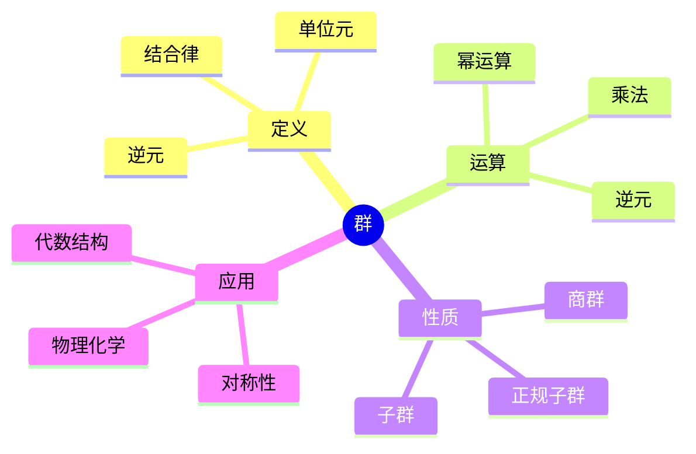
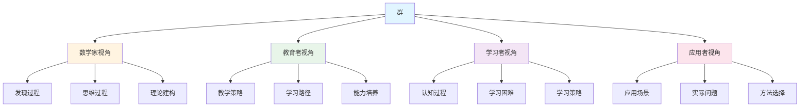
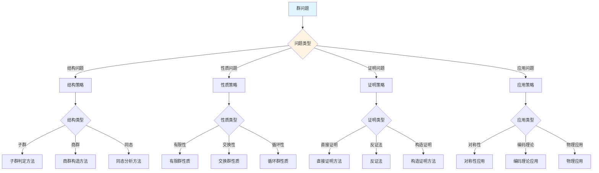
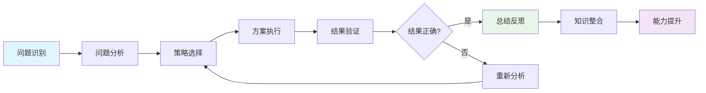
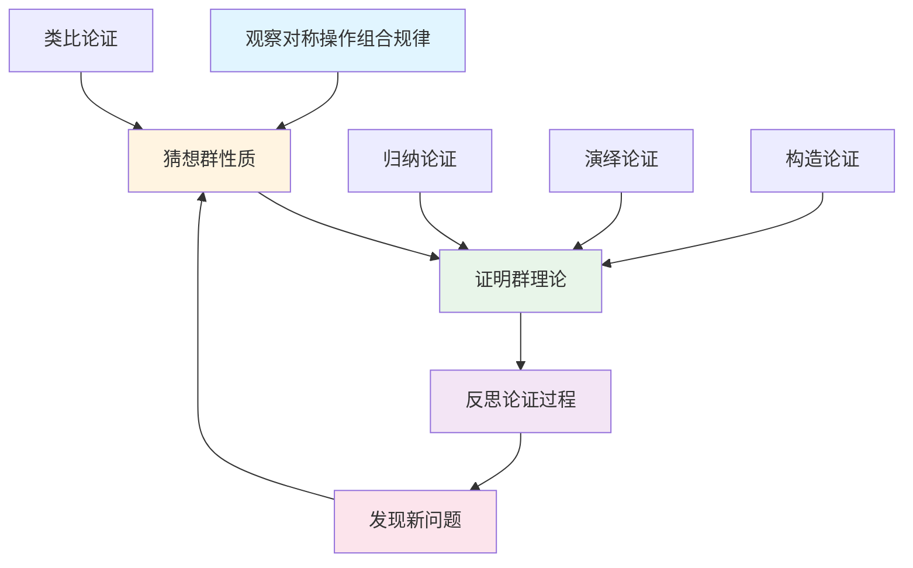
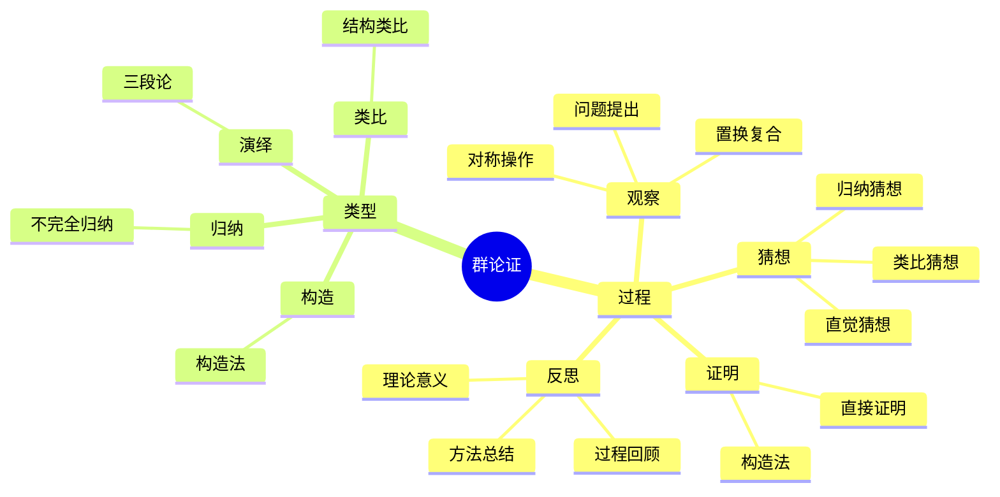

# 群 (Group) - 三视角组织版

**概念编号**: C.CORE.008
**知识层次**: L0-L2
**知识领域**: D2 (代数)
**创建日期**: 2025年1月
**最后更新**: 2025年1月

---

## 📋 目录 / Table of Contents

- [群 (Group) - 三视角组织版](#群-group---三视角组织版)
  - [📋 目录 / Table of Contents](#-目录--table-of-contents)
  - [1. 📋 概述 (编号: C.CORE.008.01)](#1--概述-编号-ccore00801)
  - [🧠 认知学视角：如何理解群 (编号: C.CORE.008.02)](#-认知学视角如何理解群-编号-ccore00802)
    - [认知起点 (编号: C.CORE.008.02.01)](#认知起点-编号-ccore0080201)
    - [认知过程 (编号: C.CORE.008.02.02)](#认知过程-编号-ccore0080202)
      - [阶段1：直观理解阶段 (编号: C.CORE.008.02.02.01)](#阶段1直观理解阶段-编号-ccore008020201)
      - [阶段2：概念形成阶段 (编号: C.CORE.008.02.02.02)](#阶段2概念形成阶段-编号-ccore008020202)
      - [阶段3：形式化阶段 (编号: C.CORE.008.02.02.03)](#阶段3形式化阶段-编号-ccore008020203)
    - [认知障碍 (编号: C.CORE.008.02.03)](#认知障碍-编号-ccore0080203)
    - [认知工具 (编号: C.CORE.008.02.04)](#认知工具-编号-ccore0080204)
  - [🎓 教育学视角：如何教学群 (编号: C.CORE.008.03)](#-教育学视角如何教学群-编号-ccore00803)
    - [教学目标 (编号: C.CORE.008.03.01)](#教学目标-编号-ccore0080301)
    - [教学路径 (编号: C.CORE.008.03.02)](#教学路径-编号-ccore0080302)
      - [阶段1：引入阶段（激发兴趣） (编号: C.CORE.008.03.02.01)](#阶段1引入阶段激发兴趣-编号-ccore008030201)
      - [阶段2：探索阶段（主动建构） (编号: C.CORE.008.03.02.02)](#阶段2探索阶段主动建构-编号-ccore008030202)
      - [阶段3：形式化阶段（抽象概括） (编号: C.CORE.008.03.02.03)](#阶段3形式化阶段抽象概括-编号-ccore008030203)
      - [阶段4：巩固阶段（应用深化） (编号: C.CORE.008.03.02.04)](#阶段4巩固阶段应用深化-编号-ccore008030204)
    - [教学难点 (编号: C.CORE.008.03.03)](#教学难点-编号-ccore0080303)
    - [教学策略 (编号: C.CORE.008.03.04)](#教学策略-编号-ccore0080304)
    - [评估方法 (编号: C.CORE.008.03.05)](#评估方法-编号-ccore0080305)
  - [🔬 数学家视角：如何思考群 (编号: C.CORE.008.04)](#-数学家视角如何思考群-编号-ccore00804)
    - [问题起源 (编号: C.CORE.008.04.01)](#问题起源-编号-ccore0080401)
    - [思维过程 (编号: C.CORE.008.04.02)](#思维过程-编号-ccore0080402)
      - [步骤1：问题提出 (编号: C.CORE.008.04.02.01)](#步骤1问题提出-编号-ccore008040201)
      - [步骤2：概念形成 (编号: C.CORE.008.04.02.02)](#步骤2概念形成-编号-ccore008040202)
      - [步骤3：理论发展 (编号: C.CORE.008.04.02.03)](#步骤3理论发展-编号-ccore008040203)
    - [历史发展 (编号: C.CORE.008.04.03)](#历史发展-编号-ccore0080403)
    - [3.2 关键人物和贡献 (编号: C.CORE.008.04.04)](#32-关键人物和贡献-编号-ccore0080404)
    - [重要定理 (编号: C.CORE.008.04.05)](#重要定理-编号-ccore0080405)
    - [开放问题 (编号: C.CORE.008.04.06)](#开放问题-编号-ccore0080406)
    - [一、第一人称思维描述 (编号: C.CORE.008.04.07)](#一第一人称思维描述-编号-ccore0080407)
      - [1.1 Galois的发现过程](#11-galois的发现过程)
      - [1.2 Cayley的抽象化思维](#12-cayley的抽象化思维)
    - [二、数学直觉的形成 (编号: C.CORE.008.04.08)](#二数学直觉的形成-编号-ccore0080408)
      - [2.1 直觉在概念发现中的作用](#21-直觉在概念发现中的作用)
      - [2.2 如何培养群直觉](#22-如何培养群直觉)
    - [三、数学美的教育价值 (编号: C.CORE.008.04.09)](#三数学美的教育价值-编号-ccore0080409)
      - [3.1 群论的美在哪里](#31-群论的美在哪里)
      - [3.2 如何培养学生的数学美感](#32-如何培养学生的数学美感)
    - [四、问题解决策略 (编号: C.CORE.008.04.10)](#四问题解决策略-编号-ccore0080410)
      - [4.1 数学家的启发式方法](#41-数学家的启发式方法)
      - [4.2 思维过程分析](#42-思维过程分析)
    - [五、批判性反思 (编号: C.CORE.008.04.11)](#五批判性反思-编号-ccore0080411)
      - [5.1 群概念的局限性](#51-群概念的局限性)
      - [5.2 群理论的未解决问题](#52-群理论的未解决问题)
  - [💡 数学解释：为什么群是这样定义的 (编号: C.CORE.008.05)](#-数学解释为什么群是这样定义的-编号-ccore00805)
    - [一、直观解释：群是什么？](#一直观解释群是什么)
      - [1.1 具体例子](#11-具体例子)
      - [1.2 形象类比](#12-形象类比)
      - [1.3 几何直观](#13-几何直观)
      - [1.4 操作体验](#14-操作体验)
    - [二、知性解释：群的本质是什么？](#二知性解释群的本质是什么)
      - [2.1 概念定义](#21-概念定义)
      - [2.2 分类体系](#22-分类体系)
      - [2.3 抽象结构](#23-抽象结构)
      - [2.4 知识体系](#24-知识体系)
    - [三、理性解释：群的公理化定义](#三理性解释群的公理化定义)
      - [3.1 公理体系](#31-公理体系)
      - [3.2 形式化证明](#32-形式化证明)
      - [3.3 系统建构](#33-系统建构)
    - [四、多视角解释：从不同角度理解群](#四多视角解释从不同角度理解群)
      - [4.1 数学家视角：群是如何被发现的？](#41-数学家视角群是如何被发现的)
      - [4.2 教育者视角：如何教学群？](#42-教育者视角如何教学群)
      - [4.3 学习者视角：如何学习群？](#43-学习者视角如何学习群)
      - [4.4 应用者视角：如何应用群？](#44-应用者视角如何应用群)
    - [五、思维表征：用多种方式理解群](#五思维表征用多种方式理解群)
      - [5.1 思维导图：群的知识结构](#51-思维导图群的知识结构)
      - [5.2 矩阵对比：不同解释方式的对比](#52-矩阵对比不同解释方式的对比)
      - [5.3 多视角表征：从不同角度表征群](#53-多视角表征从不同角度表征群)
      - [5.4 决策树：群问题分类和策略选择](#54-决策树群问题分类和策略选择)
      - [5.5 决策逻辑路径：群问题解决过程](#55-决策逻辑路径群问题解决过程)
      - [5.6 多维对比矩阵：群概念特征对比](#56-多维对比矩阵群概念特征对比)
  - [🔍 数学论证：如何论证群 (编号: C.CORE.008.06)](#-数学论证如何论证群-编号-ccore00806)
    - [一、论证过程：从观察到反思](#一论证过程从观察到反思)
      - [1.1 观察（Observation）](#11-观察observation)
      - [1.2 猜想（Conjecture）](#12-猜想conjecture)
      - [1.3 证明（Proof）](#13-证明proof)
      - [1.4 反思（Reflection）](#14-反思reflection)
    - [二、论证类型：多种推理方式](#二论证类型多种推理方式)
      - [2.1 归纳论证（Inductive Reasoning）](#21-归纳论证inductive-reasoning)
      - [2.2 演绎论证（Deductive Reasoning）](#22-演绎论证deductive-reasoning)
      - [2.3 类比论证（Analogical Reasoning）](#23-类比论证analogical-reasoning)
      - [2.4 构造论证（Constructive Reasoning）](#24-构造论证constructive-reasoning)
    - [三、论证可视化：用图形表示论证过程](#三论证可视化用图形表示论证过程)
      - [3.1 论证流程图](#31-论证流程图)
      - [3.2 论证类型对比](#32-论证类型对比)
      - [3.3 论证思维导图](#33-论证思维导图)
  - [🔗 三视角整合 (编号: C.CORE.008.07)](#-三视角整合-编号-ccore00807)
    - [三个视角的关联](#三个视角的关联)
    - [如何综合运用三个视角](#如何综合运用三个视角)
  - [📚 参考文献 (编号: C.CORE.008.08)](#-参考文献-编号-ccore00808)
    - [权威资源](#权威资源)
    - [经典教材](#经典教材)
    - [研究论文](#研究论文)

---


## 1. 📋 概述 (编号: C.CORE.008.01)

群是代数学中最基本的结构之一，是研究对称性的数学工具。群论在数学、物理学、化学等领域有广泛应用，是现代数学的核心分支。

本文档从**数学认知学**、**教育学**、**数学家**三个视角深入展开群概念，避免简单的概念堆垒。

**权威资源对齐**:

- Wikipedia: [Group (Mathematics)](https://en.wikipedia.org/wiki/Group_(mathematics))
- Wikipedia: [Group Theory](https://en.wikipedia.org/wiki/Group_theory)
- Stanford课程: Math 120 (Groups, Rings, and Fields)
- Princeton课程: MAT 350 (Abstract Algebra)
- MIT课程: 18.701 (Algebra I)
- Metamath: [Group Theory](http://us.metamath.org/mpeuni/df-grp.html)

---

## 🧠 认知学视角：如何理解群 (编号: C.CORE.008.02)

### 认知起点 (编号: C.CORE.008.02.01)

**学习者已有的知识基础**:

- 集合的概念
- 二元运算的概念
- 日常经验中的"对称"、"变换"概念

**日常经验中的类似概念**:

- "旋转"：图形的旋转对称
- "反射"：图形的反射对称
- "置换"：物品的重新排列

### 认知过程 (编号: C.CORE.008.02.02)

#### 阶段1：直观理解阶段 (编号: C.CORE.008.02.02.01)

**具体例子**:

- 例子1：$(\mathbb{Z}, +)$ - 整数加法群
- 例子2：$S_3$ - 3个元素的对称群（置换群）
- 例子3：$D_3$ - 正三角形的对称群（二面体群）

**形象类比**:

- **对称类比**: 群就像"对称操作的集合"
  - 旋转、反射、平移等对称操作
  - 这些操作可以复合
  - 每个操作都有逆操作

- **运算类比**: 群就像"有逆运算的运算系统"
  - 加法有减法（逆运算）
  - 乘法有除法（逆运算）

**可视化表示**:

```text
群运算表:
    ·  e  a  b
    e  e  a  b
    a  a  b  e
    b  b  e  a
```

#### 阶段2：概念形成阶段 (编号: C.CORE.008.02.02.02)

**从例子中抽象出共同特征**:

- 所有例子都涉及"集合和运算"
- 运算满足"结合律"
- 存在"单位元"和"逆元"

**识别关键属性**:

1. **结合律**: $(a \cdot b) \cdot c = a \cdot (b \cdot c)$
2. **单位元**: 存在$e$使得$e \cdot a = a \cdot e = a$
3. **逆元**: 对每个$a$，存在$a^{-1}$使得$a \cdot a^{-1} = e$

**建立概念边界**:

- **什么是群**: 满足结合律、有单位元、每个元素有逆元的代数结构
- **什么不是群**:
  - 自然数加法（没有逆元）
  - 整数乘法（0没有逆元）

#### 阶段3：形式化阶段 (编号: C.CORE.008.02.02.03)

**严格定义**:

- 公理化定义：通过结合律、单位元、逆元三条公理
- 范畴定义：群是只有一个对象的群胚

**公理化表述**:

- 公理1：结合律
- 公理2：单位元存在性
- 公理3：逆元存在性

**逻辑结构**:

- 群是代数结构的基础
- 群是研究对称性的工具
- 群是环和域的基础

### 认知障碍 (编号: C.CORE.008.02.03)

**常见误解**:

1. **误解1**: 认为群必须满足交换律
   - **纠正**: 群不一定满足交换律，满足交换律的群是交换群（Abel群）

2. **误解2**: 认为群必须是有限的
   - **纠正**: 群可以是有限的，也可以是无限的

3. **误解3**: 混淆群和集合
   - **纠正**: 群是集合配备运算的结构，不是单纯的集合

**理解难点**:

1. **难点1**: 群的抽象性
   - **原因**: 群是高度抽象的概念
   - **解决方法**: 从具体例子开始，逐步抽象

2. **难点2**: 群运算的非交换性
   - **原因**: 日常经验中的运算大多是交换的
   - **解决方法**: 用置换、旋转等具体例子说明

3. **难点3**: 群同态和群同构
   - **原因**: 需要理解群之间的映射
   - **解决方法**: 用具体例子，强调保持运算的重要性

**认知陷阱**:

- **交换律**: 需要理解群不一定满足交换律
- **单位元**: 需要理解单位元的唯一性

### 认知工具 (编号: C.CORE.008.02.04)

**类比工具**:

- **对称类比**: 群 = 对称操作的集合
- **运算类比**: 群 = 有逆运算的运算系统

**可视化工具**:

- **群运算表**: 用表格表示群运算
- **Cayley图**: 用图表示群的结构

**具体化工具**:

- **具体例子**: 用具体例子理解抽象概念
- **反例**: 用反例理解概念边界

---

## 🎓 教育学视角：如何教学群 (编号: C.CORE.008.03)

### 教学目标 (编号: C.CORE.008.03.01)

**知识目标**:

- 理解群的基本概念
- 掌握群的公理化定义
- 理解群的性质
- 理解群同态和群同构

**能力目标**:

- 能够判断一个结构是否是群
- 能够进行群运算
- 能够理解群的结构
- 能够应用群论解决实际问题

**情感目标**:

- 培养数学抽象思维
- 培养对称性思维
- 激发对数学的兴趣

### 教学路径 (编号: C.CORE.008.03.02)

#### 阶段1：引入阶段（激发兴趣） (编号: C.CORE.008.03.02.01)

**实际问题**:

- 问题1：如何描述图形的对称性？
- 问题2：如何研究方程的对称性？
- 问题3：如何研究物理系统的对称性？

**历史背景**:

- Galois如何引入群概念
- 群论在数学中的地位
- 群论在物理中的应用

**引发认知冲突**:

- 问题：如何统一描述各种对称性？
- 引出群的概念

#### 阶段2：探索阶段（主动建构） (编号: C.CORE.008.03.02.02)

**引导发现**:

1. 让学生自己列举对称操作的例子
2. 让学生观察这些操作的共同特征
3. 引导学生抽象出群的定义

**合作探究**:

- 小组讨论：什么是群？
- 小组讨论：群有哪些性质？
- 小组讨论：如何表示群？

**多元表征**:

- **语言表征**: "群是满足结合律、有单位元、每个元素有逆元的代数结构"
- **符号表征**: $(G, \cdot)$
- **图形表征**: 群运算表、Cayley图
- **集合表征**: 公理化定义

#### 阶段3：形式化阶段（抽象概括） (编号: C.CORE.008.03.02.03)

**严格定义**:

- 群的公理化定义
- 群的性质
- 群同态和群同构

**性质证明**:

- 单位元的唯一性
- 逆元的唯一性
- 消去律

**应用拓展**:

- 群在数学中的应用
- 群在物理中的应用
- 群在化学中的应用

#### 阶段4：巩固阶段（应用深化） (编号: C.CORE.008.03.02.04)

**练习应用**:

- 基础练习：群的表示和运算
- 应用练习：用群解决实际问题
- 综合练习：群的综合应用

**变式训练**:

- 不同形式的群表示
- 不同性质的群
- 群同态和群同构

**知识整合**:

- 群与其他代数结构的联系
- 群在数学体系中的地位

### 教学难点 (编号: C.CORE.008.03.03)

**难点1：群的抽象性**:

- **难点描述**: 学生难以理解群的抽象概念
- **解决方法**:
  - 从具体例子开始
  - 用对称性类比
  - 逐步抽象

**难点2：群运算的非交换性**:

- **难点描述**: 学生难以理解非交换群
- **解决方法**:
  - 用置换、旋转等具体例子
  - 强调非交换性的重要性
  - 用群运算表可视化

**难点3：群同态和群同构**:

- **难点描述**: 学生难以理解群之间的映射
- **解决方法**:
  - 用具体例子
  - 强调保持运算的重要性
  - 用图形可视化

### 教学策略 (编号: C.CORE.008.03.04)

**策略1：从具体到抽象**:

- 先给出具体例子
- 再抽象出一般概念
- 最后给出严格定义

**策略2：多元表征**:

- 用语言、符号、图形等多种方式表示同一概念
- 帮助学生建立不同表征之间的联系

**策略3：问题驱动**:

- 从实际问题出发
- 引出数学概念
- 解决问题

**策略4：可视化教学**:

- 使用群运算表
- 使用Cayley图
- 使用具体例子

### 评估方法 (编号: C.CORE.008.03.05)

**形成性评估**（评估理解过程）:

- 课堂提问：检查学生对概念的理解
- 小组讨论：观察学生的思考过程
- 练习作业：检查学生的应用能力

**总结性评估**（评估最终理解）:

- 测验：检查学生对概念和运算的掌握
- 项目：检查学生应用群论解决实际问题的能力
- 反思：检查学生对群概念的理解深度

---

## 🔬 数学家视角：如何思考群 (编号: C.CORE.008.04)

### 问题起源 (编号: C.CORE.008.04.01)

**历史背景**:

- 19世纪初：群论的起源
- 19世纪中期：群论的系统化
- 20世纪：群论的现代发展

**原始问题**:

- **问题1**: 如何研究方程的对称性？
- **问题2**: 如何统一描述各种对称性？
- **问题3**: 群有哪些性质？

**研究动机**:

- 解决方程可解性问题
- 统一对称性理论
- 发展抽象代数

### 思维过程 (编号: C.CORE.008.04.02)

#### 步骤1：问题提出 (编号: C.CORE.008.04.02.01)

**观察到的现象**:

- 方程有对称性
- 图形有对称性
- 这些对称性有一些共同的性质

**提出的猜想**:

- 可以引入群概念
- 群可以统一描述对称性
- 群有丰富的结构

**需要解决的问题**:

- 如何定义群？
- 群应该满足什么条件？
- 群有哪些性质？

#### 步骤2：概念形成 (编号: C.CORE.008.04.02.02)

**尝试性定义**:

- **置换群**: 通过置换定义
- **抽象群**: 通过公理定义

**性质探索**:

- 群的结合律
- 群的单位元
- 群的逆元

**结构发现**:

- 群构成代数结构
- 群是研究对称性的工具
- 群是环和域的基础

#### 步骤3：理论发展 (编号: C.CORE.008.04.02.03)

**定理证明**:

- 群的基本性质
- 群的分类定理
- 群的表示论

**应用拓展**:

- 群在数学中的应用
- 群在物理中的应用
- 群在化学中的应用

**理论完善**:

- 群的公理化
- 群的范畴论研究
- 群的表示论

### 历史发展 (编号: C.CORE.008.04.03)

**早期阶段**（19世纪初）:

- **Galois (1832)**: 在研究方程可解性时引入群概念
- **Cauchy (1815)**: 研究置换群
- **Abel (1824)**: 证明五次方程不可解

**关键突破**（19世纪中期）:

- **Cayley (1854)**: 给出群的抽象定义
- **Jordan (1870)**: 系统研究有限群
- **Sylow (1872)**: 证明Sylow定理

**现代发展**（20世纪）:

- **Burnside (1897)**: 研究有限群理论
- **Frobenius (1897)**: 发展群表示论
- **Thompson (1960s)**: 有限单群分类

### 3.2 关键人物和贡献 (编号: C.CORE.008.04.04)

**Évariste Galois (1811-1832)**:

- 群论的创始人
- 引入群概念研究方程可解性

**Arthur Cayley (1821-1895)**:

- 给出群的抽象定义
- 建立群论的基础

**Camille Jordan (1838-1922)**:

- 系统研究有限群
- 建立群论的理论体系

### 重要定理 (编号: C.CORE.008.04.05)

**Lagrange定理**:

- 子群的阶整除群的阶
- 意义：群结构的基本限制

**Sylow定理**:

- 有限群有Sylow子群
- 意义：有限群分类的基础

**有限单群分类**:

- 所有有限单群都已分类
- 意义：群论的重大成就

### 开放问题 (编号: C.CORE.008.04.06)

**未解决问题**:

- 群的分类问题
- 群的表示问题
- 群的应用问题

**研究方向**:

- 群的范畴论研究
- 群的表示论研究
- 群的应用研究

### 一、第一人称思维描述 (编号: C.CORE.008.04.07)

#### 1.1 Galois的发现过程

**详细历史背景**:

- **1830年**：Galois研究五次方程的可解性
- **背景**：研究方程的根置换，发现对称性
- **问题**：如何判断方程是否可解？如何描述根的对称性？

**Galois的详细第一人称描述**:
> "1830年，我在研究五次方程的可解性时，遇到了一个问题：如何判断方程是否可解？
>
> 我发现，方程的根有对称性。例如，对于方程$x^2 - 2 = 0$，根是$\sqrt{2}$和$-\sqrt{2}$，它们可以通过置换$\sigma: \sqrt{2} \mapsto -\sqrt{2}$互换。
>
> 我的发现是：
>
> - **对称性**：方程的根可以通过置换互换
> - **置换群**：所有置换构成一个群
> - **可解性**：方程可解当且仅当对应的群是可解群
>
> 例如，对于方程$x^2 - 2 = 0$：
>
> - **根**：$\sqrt{2}$和$-\sqrt{2}$
> - **置换**：$\sigma: \sqrt{2} \mapsto -\sqrt{2}$，$\sigma^2 = \text{id}$
> - **群**：$\{e, \sigma\}$（2阶循环群）
> - **可解性**：这个群是可解群，所以方程可解
>
> 对于五次方程$x^5 - x - 1 = 0$：
>
> - **置换群**：$S_5$（5次对称群）
> - **可解性**：$S_5$不是可解群，所以方程不可用根式解
>
> 这让我意识到，群是描述对称性的工具，群的性质决定了方程的可解性。这为代数方程理论提供了新的视角。"

**详细的思维过程**:

1. **观察到的现象**（1830年）:

   **现象1：方程的根有对称性**
   - **问题**：方程的根可以通过置换互换
   - **例子**：$x^2 - 2 = 0$的根$\sqrt{2}$和$-\sqrt{2}$可以互换
   - **需要**：描述这种对称性

   **现象2：置换的复合满足某些性质**
   - **问题**：置换的复合满足结合律、有单位元、有逆元
   - **例子**：$\sigma \circ \tau$也是置换
   - **需要**：抽象出群的概念

   **现象3：群与方程可解性相关**
   - **问题**：方程可解当且仅当对应的群是可解群
   - **例子**：$S_5$不是可解群，所以五次方程不可用根式解
   - **需要**：建立群与方程可解性的关系

2. **提出的猜想**（1830年）:

   **猜想1：用群描述对称性**
   - **思路**：用置换群描述根的对称性
   - **例子**：$x^2 - 2 = 0$的置换群是$\{e, \sigma\}$
   - **优点**：统一描述对称性

   **猜想2：群与方程可解性相关**
   - **关系**：方程可解当且仅当对应的群是可解群
   - **例子**：$S_5$不是可解群，所以五次方程不可用根式解
   - **意义**：用群的性质判断方程的可解性

   **猜想3：群是数学的基础**
   - **性质**：群是抽象的数学结构
   - **应用**：群可以应用到更广泛的领域
   - **意义**：群是统一的数学结构

3. **遇到的困难**（1830年）:

   **困难1：如何严格定义群？**
   - **问题**：如何定义群？
   - **解决**：通过公理定义群（结合律、单位元、逆元）
   - **意义**：为群提供严格的数学基础

   **困难2：如何判断群的性质？**
   - **问题**：如何判断群是否可解？
   - **解决**：通过群的结构判断
   - **意义**：为方程可解性提供判断方法

   **困难3：如何应用群论？**
   - **问题**：如何用群论解决实际问题？
   - **解决**：建立Galois理论
   - **意义**：为代数方程理论提供新视角

4. **突破的时刻**（1830年，Galois）:

   **突破1：群的概念**
   - 引入群的概念描述对称性
   - **关键**：抽象出群的结构
   - **意义**：为群论提供基础

   **突破2：Galois理论**
   - 建立群与方程可解性的关系
   - **关键**：方程可解当且仅当对应的群是可解群
   - **意义**：为代数方程理论提供新视角

   **突破3：群论的广泛应用**
   - 群论可以应用到更广泛的领域
   - **关键**：群是抽象的数学结构
   - **意义**：群论成为数学的基础

#### 1.2 Cayley的抽象化思维

**Cayley的第一人称描述**:
> "我发现群不一定要是置换群，可以是任何满足群公理的集合。我意识到，群是抽象的数学结构，是研究对称性的工具。这让我能够将群论应用到更广泛的领域。"

**思维过程**:

1. **问题识别**:
   - 群是否只能是置换群？
   - 如何抽象化群的概念？
   - 如何推广群论？

2. **策略选择**:
   - 通过公理定义群
   - 不限制群的具体形式
   - 强调群的抽象性

3. **抽象化设计**:
   - 定义群公理
   - 证明群的性质
   - 建立群论的理论体系

### 二、数学直觉的形成 (编号: C.CORE.008.04.08)

#### 2.1 直觉在概念发现中的作用

**Galois的直觉**:

- **直觉1**: "群"是"对称性"——这个直觉引导Galois发现群论
- **直觉2**: 群与方程可解性相关——这个直觉引导Galois建立Galois理论
- **直觉3**: 群是数学的基础——这个直觉引导Galois建立群论

**Cayley的直觉**:

- **直觉1**: 群是抽象的——这个直觉引导Cayley抽象化群
- **直觉2**: 群可以应用到更广泛的领域——这个直觉引导Cayley推广群论
- **直觉3**: 群是统一的数学结构——这个直觉引导Cayley建立群论

**直觉的验证**:

- 通过严格的数学证明验证直觉的正确性
- 通过公理化严格化群定义
- 通过应用验证群的广泛性

**直觉的深化**:

- 从"对称性"到"群的公理化"
- 从"方程可解性"到"Galois理论"
- 从"数学基础"到"群论的广泛应用"

#### 2.2 如何培养群直觉

**数学家的建议**:

- **Galois**: "群直觉是长期训练的结果。通过大量练习和深入思考，我们可以培养对群的直觉。"
- **Cayley**: "从具体例子开始，逐步抽象，这是培养群直觉的有效方法。"

**培养方法**:

1. **大量练习**: 通过大量群运算练习，培养对群的直觉
2. **深入思考**: 深入思考群的本质，理解群的深层结构
3. **类比和联想**: 通过类比和联想，建立群与其他概念的联系
4. **与专家交流**: 与数学家交流，学习他们的思维方式

**教学启示**:

- 从具体例子开始，逐步抽象
- 鼓励学生思考群的本质
- 引导学生建立群与其他概念的联系

### 三、数学美的教育价值 (编号: C.CORE.008.04.09)

#### 3.1 群论的美在哪里

**结构美**:

- **简洁性**: 群的概念非常简洁——"满足结合律、单位元、逆元的集合"
- **统一性**: 群可以统一描述数学中的各种对称性
- **和谐性**: 群运算满足优美的规律（结合律、单位元、逆元）

**数学家的评价**:

- **Galois**: "群论的美在于它的对称性。它为我们提供了一个统一的框架来理解数学中的对称性。"
- **Cayley**: "群论的美在于它的抽象性。它是数学的基础，所有数学概念都可以用群来描述。"

#### 3.2 如何培养学生的数学美感

**数学家的建议**:

- **Galois**: "展示群论的美感，让学生感受到数学的美。"
- **Cayley**: "通过群论的历史和发展，让学生理解数学的美。"

**教学方法**:

1. **展示数学美**:
   - 展示群概念的简洁性和统一性
   - 展示群运算的优美规律
   - 展示群在数学中的基础地位

2. **引导学生欣赏**:
   - 引导学生欣赏群概念的简洁性
   - 引导学生欣赏群运算的和谐性
   - 引导学生欣赏群的基础性

3. **鼓励学生创造美**:
   - 鼓励学生发现群论的美
   - 鼓励学生创造优美的群证明
   - 鼓励学生探索群论的美

### 四、问题解决策略 (编号: C.CORE.008.04.10)

#### 4.1 数学家的启发式方法

**策略1：从具体到抽象**:

- 从具体的群例子开始
- 抽象出群的一般性质
- 建立群的理论体系

**策略2：从简单到复杂**:

- 先理解基本群
- 再理解群运算
- 最后理解群理论

**策略3：从问题到理论**:

- 从实际问题出发
- 引出群概念
- 建立群理论

#### 4.2 思维过程分析

**问题识别**:

- 识别问题类型：群定义问题、群性质问题、群应用问题
- 识别问题难度：简单问题、中等问题、复杂问题

**策略选择**:

- 简单问题：直接方法
- 中等问题：分步方法
- 复杂问题：分解方法

**执行和反思**:

- 执行策略，解决问题
- 反思过程，总结经验
- 改进方法，提高效率

### 五、批判性反思 (编号: C.CORE.008.04.11)

#### 5.1 群概念的局限性

**概念的边界**:

- 群只描述对称性，不能描述所有数学结构
- 群是抽象的，需要具体化才能应用
- 群不能表示所有数学量

**概念的推广**:

- 半群：去掉逆元条件
- 幺半群：去掉逆元条件，保留单位元
- 群胚：更一般的结构

#### 5.2 群理论的未解决问题

**未解决的问题**:

- 群的分类问题：如何分类所有群？
- 群的表示问题：如何表示群？
- 群的应用问题：如何更好地应用群？

**研究方向**:

- 群的范畴论研究
- 群的表示论研究
- 群的应用研究

---

## 💡 数学解释：为什么群是这样定义的 (编号: C.CORE.008.05)

### 一、直观解释：群是什么？

#### 1.1 具体例子

**生活中的例子**：

- **旋转对称**：正方形的旋转对称构成群
  - 例如：旋转0°、90°、180°、270°构成群
  - **为什么这样定义**：因为我们需要一个概念来表示"对称性"
- **置换**：三个对象的置换构成群
  - 例如：$\{1,2,3\}$的所有置换构成群$S_3$
  - **为什么这样定义**：因为我们需要一个概念来表示"排列"
- **整数加法**：整数在加法下构成群
  - 例如：$(\mathbb{Z}, +)$是群
  - **为什么这样定义**：因为我们需要一个概念来表示"运算结构"

**数学中的例子**：

- **置换群**：$S_n$表示$n$个对象的置换群
  - **为什么这样定义**：我们需要一个概念来表示"所有置换"
- **循环群**：$\mathbb{Z}_n$表示模$n$的循环群
  - **为什么这样定义**：我们需要一个概念来表示"循环结构"
- **矩阵群**：$GL(n, \mathbb{R})$表示$n \times n$可逆矩阵群
  - **为什么这样定义**：我们需要一个概念来表示"线性变换"

#### 1.2 形象类比

**对称类比**：

- **群就像"对称性"**
  - 群描述对象的对称性
  - 群的元素是对称变换
  - 群的运算是变换的复合
- **为什么这样类比**：这个类比帮助我们理解群的本质

**运算类比**：

- **群就像"运算结构"**
  - 群有一个运算（通常是乘法或加法）
  - 运算满足结合律
  - 有单位元和逆元
- **为什么这样类比**：这个类比帮助我们理解群的运算结构

#### 1.3 几何直观

**Cayley图表示**：

- 使用Cayley图表示群
- 群的元素是图的顶点
- 群的生成元是图的边
- **为什么使用Cayley图**：Cayley图提供几何直观，帮助我们理解群的结构

**对称图形表示**：

- 使用对称图形表示群
- 例如：正多边形的对称群
- **为什么使用对称图形**：对称图形提供直观的群表示

#### 1.4 操作体验

**群运算的操作**：

- **乘法操作**：$g \cdot h$（群的乘法）
  - **为什么这样操作**：因为我们需要一个运算来表示"变换的复合"
- **逆元操作**：$g^{-1}$（群的逆元）
  - **为什么这样操作**：因为我们需要一个运算来表示"逆变换"
- **幂运算**：$g^n = g \cdot g \cdots g$（$n$次）
  - **为什么这样操作**：因为我们需要一个运算来表示"重复应用"

### 二、知性解释：群的本质是什么？

#### 2.1 概念定义

**群的内涵**：

- **群是一个集合$G$配备一个二元运算$\cdot$，满足结合律、单位元、逆元**
  - **结合律**：$(g \cdot h) \cdot k = g \cdot (h \cdot k)$
  - **单位元**：存在$e \in G$使得$e \cdot g = g \cdot e = g$
  - **逆元**：对于每个$g \in G$，存在$g^{-1} \in G$使得$g \cdot g^{-1} = g^{-1} \cdot g = e$
- **为什么这样定义**：这些特征使得群成为一个完整的代数结构，支持所有对称性研究

**群的外延**：

- **有限群**：元素个数有限的群
- **无限群**：元素个数无限的群
- **交换群**：运算满足交换律的群（Abel群）
- **非交换群**：运算不满足交换律的群
- **为什么这样分类**：不同的群类型有不同的性质和用途

#### 2.2 分类体系

**按元素个数分类**：

- **有限群**：$|G| < \infty$
- **无限群**：$|G| = \infty$
- **为什么这样分类**：元素个数是群的基本特征

**按运算性质分类**：

- **交换群（Abel群）**：$g \cdot h = h \cdot g$
- **非交换群**：存在$g, h$使得$g \cdot h \neqqq h \cdot g$
- **为什么这样分类**：交换性是群的重要性质

#### 2.3 抽象结构

**群的运算结构**：

- **群运算**：$\cdot : G \times G \to G$
- **为什么有这个运算**：这个运算使得群具有代数结构

**群的关系结构**：

- **共轭关系**：$g \sim h$当且仅当存在$x$使得$h = xgx^{-1}$
- **为什么有这个关系**：这个关系帮助我们分类群元素

**群的子结构**：

- **子群**：$H \subseteq G$是子群当且仅当$H$在群运算下封闭
- **正规子群**：$N \trianglelefteq G$是正规子群当且仅当$gNg^{-1} = N$对所有$g \in G$
- **为什么有这些结构**：这些结构是群理论的基础

#### 2.4 知识体系

**群在数学体系中的位置**：

- **基础地位**：群是代数结构的基础
  - 群是环和域的基础
  - 群是研究对称性的工具
- **为什么是基础**：群提供了统一的框架来研究对称性

**群与其他概念的关系**：

- **群与环**：环的加法群是群
- **群与域**：域的加法群和乘法群（非零元）都是群
- **群与对称**：群描述对称性
- **为什么有这些关系**：这些关系揭示了群与其他数学概念的内在联系

### 三、理性解释：群的公理化定义

#### 3.1 公理体系

**群的公理化定义**：

- **公理1（结合律）**：$(g \cdot h) \cdot k = g \cdot (h \cdot k)$
- **公理2（单位元）**：存在$e \in G$使得$e \cdot g = g \cdot e = g$
- **公理3（逆元）**：对于每个$g \in G$，存在$g^{-1} \in G$使得$g \cdot g^{-1} = g^{-1} \cdot g = e$
- **为什么需要这些公理**：这些公理定义了群的基本结构

**群的范畴论定义**：

- **群是集合范畴中的群对象**
- **为什么这样定义**：这个定义将群放在更一般的框架中

#### 3.2 形式化证明

**群运算性质的证明**：

- **单位元的唯一性**：如果$e$和$e'$都是单位元，则$e = e'$
  - **证明**：$e = e \cdot e' = e'$
  - **为什么这样证明**：利用单位元的定义
- **逆元的唯一性**：如果$g^{-1}$和$g'$都是$g$的逆元，则$g^{-1} = g'$
  - **证明**：$g^{-1} = g^{-1} \cdot (g \cdot g') = (g^{-1} \cdot g) \cdot g' = e \cdot g' = g'$
  - **为什么这样证明**：利用逆元的定义

**群关系的证明**：

- **Lagrange定理**：如果$H$是有限群$G$的子群，则$|H|$整除$|G|$
  - **证明**：使用陪集分解
  - **为什么这样证明**：利用子群和陪集的性质

#### 3.3 系统建构

**群论在数学基础中的地位**：

- **作为代数基础**：群是代数结构的基础
- **提供对称性工具**：群是研究对称性的工具
- **统一框架**：群统一了各种对称性研究

**群论的发展历史**：

- **Galois的引入**（1832年）：在研究方程可解性时引入群概念
- **Cayley的抽象化**（1854年）：给出群的抽象定义
- **有限单群分类**（1980年代）：完成有限单群的分类
- **为什么这样发展**：数学的发展需要严格的基础，群论的发展反映了这一需求

### 四、多视角解释：从不同角度理解群

#### 4.1 数学家视角：群是如何被发现的？

**Galois的发现过程**：

- **问题提出**：如何研究方程的可解性？
- **关键洞察**：使用群描述方程的对称性
- **重要发现**：群可以统一描述对称性
- **为什么这样发现**：数学家的直觉和严格证明相结合

**Cayley的抽象化过程**：

- **问题识别**：需要抽象化群概念
- **策略选择**：使用公理化定义
- **定义设计**：群是满足三个公理的代数结构
- **为什么这样设计**：需要统一各种群实例

#### 4.2 教育者视角：如何教学群？

**教学策略**：

- **从具体到抽象**：先学习具体例子，再学习抽象定义
- **从简单到复杂**：先学习有限群，再学习无限群
- **从直观到形式化**：先使用对称图形等直观工具，再学习形式化定义
- **为什么这样教学**：符合认知规律，帮助学生逐步建立理解

**学习路径**：

- **阶段1**：直观理解（使用对称图形和具体例子）
- **阶段2**：概念形成（学习群的定义和性质）
- **阶段3**：形式化（学习群的公理化定义）
- **为什么这样设计**：循序渐进，逐步深入

#### 4.3 学习者视角：如何学习群？

**认知过程**：

- **直观阶段**：通过对称图形理解群的含义
- **概念阶段**：理解群的定义和性质
- **形式化阶段**：理解群的公理化定义
- **为什么这样学习**：符合认知发展规律

**学习困难**：

- **困难1**：理解"抽象群"的概念
- **困难2**：理解"非交换群"的概念
- **困难3**：理解"正规子群"的概念
- **如何克服**：通过具体例子、类比、历史背景等方式帮助理解

#### 4.4 应用者视角：如何应用群？

**应用场景**：

- **数学**：使用群研究对称性和代数结构
- **物理**：使用群描述物理系统的对称性
- **化学**：使用群描述分子的对称性
- **为什么这样应用**：群提供了强大的工具来处理各种问题

**应用方法**：

- **建立模型**：将实际问题转化为群问题
- **使用理论**：使用群论解决问题
- **验证结果**：验证结果的正确性
- **为什么这样应用**：群论提供了强大的工具来解决实际问题

### 五、思维表征：用多种方式理解群

#### 5.1 思维导图：群的知识结构



#### 5.2 矩阵对比：不同解释方式的对比

| 解释方式 | 特点 | 方法 | 工具 | 适用阶段 | 优势 | 局限 |
|---------|------|------|------|---------|------|------|
| **直观解释** | 具体、形象、可视 | 例子、类比、直观 | 对称图形、Cayley图 | 入门阶段 | 易于理解 | 不够严格 |
| **知性解释** | 概念、分类、抽象 | 定义、分类、结构 | 概念图、知识图谱 | 中级阶段 | 系统完整 | 不够直观 |
| **理性解释** | 公理、证明、形式化 | 公理、证明、系统 | 形式化工具、证明系统 | 高级阶段 | 严格准确 | 不够具体 |
| **多视角解释** | 多角度、整合 | 多视角、整合 | 多视角工具 | 所有阶段 | 全面深入 | 可能复杂 |

#### 5.3 多视角表征：从不同角度表征群



#### 5.4 决策树：群问题分类和策略选择



**说明**：

- **问题分类**：根据问题类型（结构、性质、证明、应用）进行分类
- **策略选择**：根据问题类型选择相应的解决策略
- **方法应用**：根据具体问题选择合适的方法

#### 5.5 决策逻辑路径：群问题解决过程



**说明**：

- **问题识别**：识别群问题的类型和关键要素
- **问题分析**：分析问题的条件和目标
- **策略选择**：根据问题类型选择解决策略
- **方案执行**：执行选定的解决方案
- **结果验证**：验证结果的正确性
- **总结反思**：总结解题过程，反思解题方法
- **知识整合**：整合相关知识点
- **能力提升**：提升问题解决能力

#### 5.6 多维对比矩阵：群概念特征对比

| 对比维度 | 群定义 | 群结构 | 群性质 | 群应用 |
|---------|---------|---------|---------|---------|
| **核心特征** | 群公理、二元运算 | 子群、商群、同态 | 有限性、交换性、循环性 | 对称性、编码理论、物理应用 |
| **理解难度** | ⭐⭐⭐⭐ | ⭐⭐⭐⭐ | ⭐⭐⭐⭐ | ⭐⭐⭐⭐ |
| **应用频率** | ⭐⭐⭐⭐⭐ | ⭐⭐⭐⭐ | ⭐⭐⭐⭐ | ⭐⭐⭐⭐ |
| **理论基础** | 群公理体系 | 群结构理论 | 群性质理论 | 群应用理论 |
| **教学重点** | 概念理解 | 结构分析 | 性质分析 | 应用能力 |
| **学习阶段** | 中级阶段 | 中级-高级 | 中级-高级 | 高级阶段 |
| **认知维度** | 知性+理性 | 理性 | 理性 | 理性+应用 |
| **思维表征** | 思维导图 | 决策树 | 决策逻辑路径 | 知识图谱 |

**说明**：

- **核心特征**：每个方面的核心特征
- **理解难度**：从1星到5星，表示理解难度
- **应用频率**：从1星到5星，表示应用频率
- **理论基础**：每个方面的理论基础
- **教学重点**：每个方面的教学重点
- **学习阶段**：每个方面的学习阶段
- **认知维度**：每个方面的认知维度
- **思维表征**：每个方面推荐的思维表征方法

---

## 🔍 数学论证：如何论证群 (编号: C.CORE.008.06)

### 一、论证过程：从观察到反思

#### 1.1 观察（Observation）

**具体现象观察**：

- **现象1**：对称操作的组合规律
  - 例如：观察正方形的旋转和反射的组合，满足结合律、有单位元、每个操作有逆操作
  - **为什么重要**：这个现象揭示了群作为对称性研究工具的必要性
- **现象2**：置换的复合规律
  - 例如：观察置换的复合满足结合律、有恒等置换、每个置换有逆置换
  - **为什么重要**：这个现象揭示了群的抽象结构

**模式识别**：

- **模式1**：群的公理结构
  - 例如：结合律、单位元、逆元三个公理可以刻画对称性
  - **为什么重要**：这个模式可能反映了群的本质
- **模式2**：Lagrange定理
  - 例如：子群的阶整除群的阶，$|H| \mid |G|$
  - **为什么重要**：这个模式可能反映了群的结构

**问题提出**：

- **问题1**：如何严格定义群，统一不同的对称结构？
  - **为什么提出**：这个问题可能揭示群的本质和基础
- **问题2**：如何证明Lagrange定理？
  - **为什么提出**：这个问题可能揭示群的结构性质

#### 1.2 猜想（Conjecture）

**归纳猜想**：

- **猜想1**：群是研究对称性的统一工具
  - **依据**：观察不同对称结构都满足群公理
  - **为什么提出**：这个猜想可能揭示群的统一性
- **猜想2**：子群的阶整除群的阶
  - **依据**：观察具体群的子群阶数
  - **为什么提出**：这个猜想可能揭示群的结构性质

**类比猜想**：

- **猜想1**：群类似于"对称操作的集合"
  - **类比对象**：对称操作（旋转、反射等）
  - **为什么提出**：这个类比可能揭示群的本质
- **猜想2**：群的构造类似于"变换的复合"
  - **类比对象**：变换的复合
  - **为什么提出**：这个类比可能揭示群的构造方法

**直觉猜想**：

- **猜想1**：群是"最自然"的对称性工具
  - **直觉来源**：群的直观
  - **为什么提出**：这个直觉可能揭示群的基础地位
- **猜想2**：群有"最小"的公理结构
  - **直觉来源**：群的公理结构
  - **为什么提出**：这个直觉可能揭示群的本质

#### 1.3 证明（Proof）

**直接证明**：

- **证明1**：Lagrange定理
  - **证明思路**：使用陪集分解
  - **关键步骤**：证明左陪集构成群的划分，每个陪集大小等于子群的阶，因此$|G| = |G/H| \cdot |H|$
  - **为什么这样证明**：这个证明方法直接、清晰
- **证明2**：Cayley定理
  - **证明思路**：构造群到对称群的同态
  - **关键步骤**：对$g \in G$，定义左平移$\lambda_g$，映射$g \mapsto \lambda_g$是同态
  - **为什么这样证明**：这个证明方法直接、清晰

**构造法**：

- **构造法**：构造群作为变换的集合
  - **构造方法**：定义群为满足结合律、有单位元、每个元素有逆元的变换集合
  - **验证**：验证构造的群满足群公理
  - **为什么这样证明**：构造法适合证明存在性命题

#### 1.4 反思（Reflection）

**过程回顾**：

- **论证回顾**：从观察对称操作的组合规律，到猜想群的性质，再到严格证明
  - **成功之处**：成功建立了群的严格理论
  - **不足之处**：群概念需要进一步推广
  - **改进方向**：推广到环、域、范畴等

**方法总结**：

- **证明方法**：使用了直接证明、构造法
  - **方法特点**：直接证明清晰，构造法明确
  - **适用范围**：不同方法适用于不同类型的命题
- **证明技巧**：使用陪集分解、左平移、群同态
  - **技巧要点**：将群问题转化为集合问题，使用构造法处理存在性问题
  - **应用场景**：这些技巧可以应用于其他群论问题

**理论意义**：

- **理论贡献**：建立了群的严格理论，揭示了群的对称性本质
  - **为什么重要**：这个论证揭示了代数学的基础结构
- **应用价值**：群为代数学、几何学、物理学提供了基础
  - **为什么重要**：这个论证可以应用于所有对称性问题

### 二、论证类型：多种推理方式

#### 2.1 归纳论证（Inductive Reasoning）

**不完全归纳**：

- **例子1**：从具体群的子群阶数归纳一般规律
  - **观察**：观察$S_3$的子群阶数都是$|S_3| = 6$的因子
  - **结论**：子群的阶整除群的阶
  - **局限性**：不完全归纳的结论需要严格证明

#### 2.2 演绎论证（Deductive Reasoning）

**三段论**：

- **例子1**：证明群的性质
  - **大前提**：所有群元素都有逆元
  - **小前提**：$g$是群元素
  - **结论**：$g$有逆元$g^{-1}$
  - **为什么有效**：三段论是严格的演绎推理

#### 2.3 类比论证（Analogical Reasoning）

**结构类比**：

- **例子1**：群与对称操作的类比
  - **类比对象**：对称操作
  - **相似性**：群对应对称操作的集合，群运算对应操作的复合
  - **结论**：群可以理解为"对称操作的集合"
  - **局限性**：类比不能替代严格证明

#### 2.4 构造论证（Constructive Reasoning）

**构造法**：

- **例子1**：构造群作为变换的集合
  - **构造方法**：定义群为满足群公理的变换集合
  - **验证**：验证构造的群满足群公理
  - **为什么有效**：构造法是严格的直接证明

### 三、论证可视化：用图形表示论证过程

#### 3.1 论证流程图



#### 3.2 论证类型对比

| 论证类型 | 特点 | 适用场景 | 优势 | 局限 |
|---------|------|---------|------|------|
| **归纳论证** | 从特殊到一般 | 发现规律、提出猜想 | 启发性强 | 结论或然 |
| **演绎论证** | 从一般到特殊 | 严格证明、逻辑推理 | 结论必然 | 需要前提 |
| **类比论证** | 基于相似性 | 启发思路、发现联系 | 创造性高 | 结论或然 |
| **构造论证** | 直接构造 | 证明存在性命题 | 直接明确 | 需要构造 |

#### 3.3 论证思维导图



---

## 🔗 三视角整合 (编号: C.CORE.008.07)

### 三个视角的关联

**认知学视角 ↔ 教育学视角**:

- 认知学视角揭示的理解机制，指导教育学视角的教学设计
- 教育学视角的教学实践，验证认知学视角的理论

**认知学视角 ↔ 数学家视角**:

- 数学家视角的思维过程，启发认知学视角的认知路径
- 认知学视角的认知障碍，解释数学家视角的历史困难

**教育学视角 ↔ 数学家视角**:

- 数学家视角的历史发展，为教育学视角提供教学素材
- 教育学视角的教学策略，帮助学习者理解数学家视角的思维过程

### 如何综合运用三个视角

**学习建议**:

1. **从认知学视角开始**: 先建立直观理解
2. **用教育学视角深化**: 通过教学路径系统学习
3. **用数学家视角升华**: 理解概念的深层意义和历史背景

**教学建议**:

1. **引入阶段**: 用数学家视角的问题起源激发兴趣
2. **探索阶段**: 用认知学视角的认知过程引导发现
3. **形式化阶段**: 用教育学视角的教学策略系统教学
4. **巩固阶段**: 综合三个视角深化理解

---

## 📚 参考文献 (编号: C.CORE.008.08)

### 权威资源

- Wikipedia: [Group (Mathematics)](https://en.wikipedia.org/wiki/Group_(mathematics))
- Wikipedia: [Group Theory](https://en.wikipedia.org/wiki/Group_theory)
- Metamath: [Group Theory](http://us.metamath.org/mpeuni/df-grp.html)

### 经典教材

- Galois, É. (1832). "Mémoire sur les conditions de résolubilité des équations par radicaux". *Journal de Mathématiques Pures et Appliquées*.
- Cayley, A. (1854). "On the Theory of Groups". *Philosophical Magazine*.
- Lang, S. (2002). *Algebra*. Springer.

### 研究论文

- Galois, É. (1832). "Mémoire sur les conditions de résolubilité des équations par radicaux". *Journal de Mathématiques Pures et Appliquées*.
- Cayley, A. (1854). "On the Theory of Groups". *Philosophical Magazine*.

---

**创建日期**: 2025年1月
**最后更新**: 2025年1月
**维护状态**: 持续更新中
