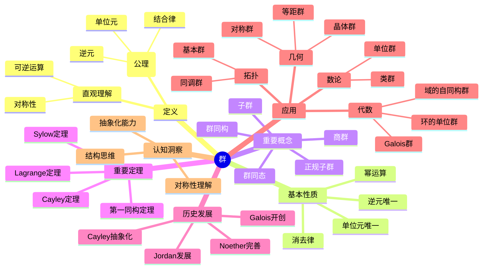
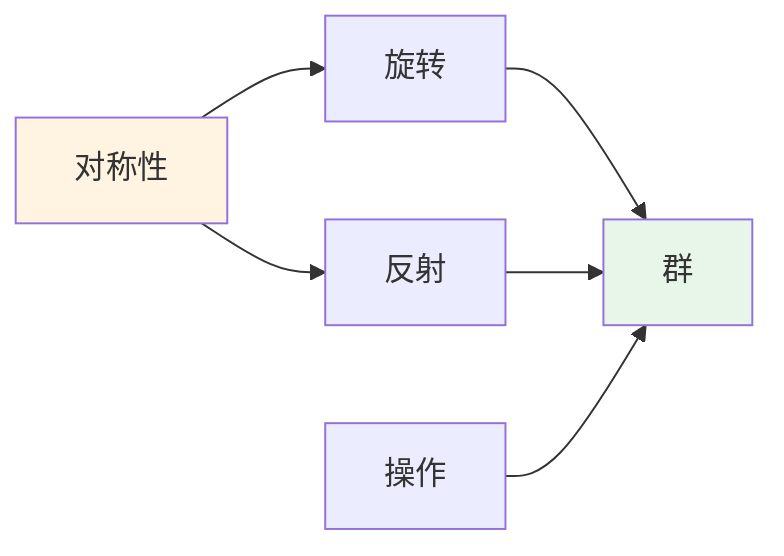
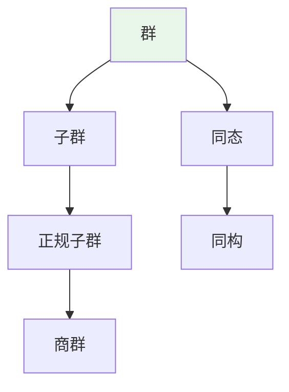
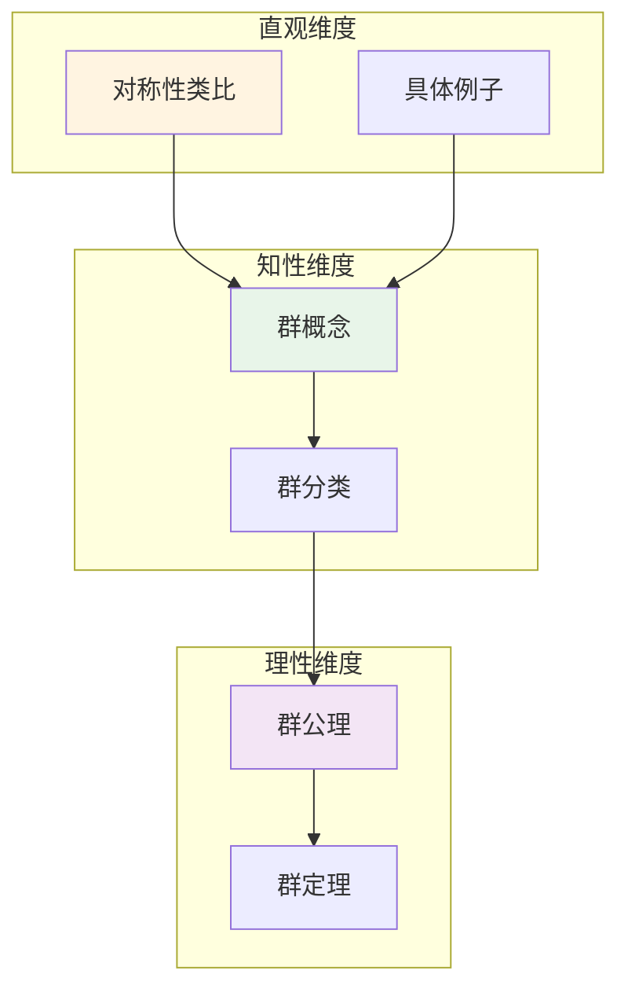

# 群 (Group)

**概念编号**: C.CORE.008
**知识层次**: L0-L2
**知识领域**: D2 (代数)
**创建日期**: 2025年11月21日
**最后更新**: 2025年11月21日

---

## 📑 目录

- [群 (Group)](#群-group)
  - [📑 目录](#-目录)
  - [1. 📋 概述](#1--概述)
  - [2. 🎯 严格定义](#2--严格定义)
    - [2.1 基础定义 (L0)](#21-基础定义-l0)
    - [2.2 形式化定义 (L1)](#22-形式化定义-l1)
  - [3. 📚 历史背景](#3--历史背景)
    - [3.1 发展脉络](#31-发展脉络)
    - [3.2 关键人物](#32-关键人物)
    - [3.3 重要事件](#33-重要事件)
  - [4. 🔍 性质与定理](#4--性质与定理)
    - [4.1 基本性质 (L1)](#41-基本性质-l1)
      - [性质1: 单位元的唯一性](#性质1-单位元的唯一性)
      - [性质2: 逆元的唯一性](#性质2-逆元的唯一性)
      - [性质3: 消去律](#性质3-消去律)
      - [性质4: 幂的性质](#性质4-幂的性质)
      - [性质5: 子群](#性质5-子群)
    - [4.2 重要定理 (L2)](#42-重要定理-l2)
      - [定理1: Lagrange定理](#定理1-lagrange定理)
      - [定理2: Cayley定理](#定理2-cayley定理)
      - [定理3: 第一同构定理](#定理3-第一同构定理)
      - [定理4: Sylow定理](#定理4-sylow定理)
      - [定理5: 有限单群分类](#定理5-有限单群分类)
  - [5. 🔬 形式化证明](#5--形式化证明)
    - [定理1: Lagrange定理的形式化证明](#定理1-lagrange定理的形式化证明)
  - [6. 💡 应用实例](#6--应用实例)
    - [6.1 理论应用](#61-理论应用)
      - [应用1: 代数](#应用1-代数)
      - [应用2: 几何](#应用2-几何)
      - [应用3: 拓扑](#应用3-拓扑)
      - [应用4: 数论](#应用4-数论)
    - [6.2 实际应用](#62-实际应用)
      - [应用1: 物理学 - 晶体对称性](#应用1-物理学---晶体对称性)
      - [应用2: 化学 - 分子对称性分析](#应用2-化学---分子对称性分析)
      - [应用3: 密码学](#应用3-密码学)
      - [应用4: 计算机科学](#应用4-计算机科学)
    - [交叉应用](#交叉应用)
      - [应用1: 表示论](#应用1-表示论)
      - [应用2: 代数拓扑](#应用2-代数拓扑)
      - [应用3: 代数几何](#应用3-代数几何)
      - [应用4: 数论](#应用4-数论-1)
  - [7. 🔗 关联概念](#7--关联概念)
    - [依赖关系](#依赖关系)
    - [等价关系](#等价关系)
    - [推广关系](#推广关系)
    - [应用关系](#应用关系)
  - [8. 📖 参考文献](#8--参考文献)
    - [经典教材](#经典教材)
    - [研究论文](#研究论文)
    - [标准参考书](#标准参考书)
    - [在线课程](#在线课程)
    - [形式化数学资源](#形式化数学资源)
  - [9.1 🗺️ 思维导图 (编号: C.CORE.008.MIND)](#91-️-思维导图-编号-ccore008mind)
    - [群概念思维导图](#群概念思维导图)
  - [9.2 📊 知识多维关系矩阵 (编号: C.CORE.008.MATRIX)](#92--知识多维关系矩阵-编号-ccore008matrix)
    - [群的多维关系矩阵](#群的多维关系矩阵)
  - [9.3 💭 形象化解释与论证 (编号: C.CORE.008.VISUAL)](#93--形象化解释与论证-编号-ccore008visual)
    - [形象化解释](#形象化解释)
    - [认知科学视角](#认知科学视角)
  - [9.6 👨‍🏫 专家观点与论证 (编号: C.CORE.008.EXPERT)](#96--专家观点与论证-编号-ccore008expert)
    - [数学家的观点](#数学家的观点)
    - [数学教育家的观点](#数学教育家的观点)
    - [数学认知学家的观点](#数学认知学家的观点)
  - [9.4 🎓 学习路径](#94--学习路径)
    - [基础路径 (L0→L1)](#基础路径-l0l1)
    - [进阶路径 (L1→L2)](#进阶路径-l1l2)
    - [高级路径 (L2→L3)](#高级路径-l2l3)
  - [9.7 🎨 认知维度表征 (编号: C.CORE.008.COGNITIVE)](#97--认知维度表征-编号-ccore008cognitive)
    - [直观维度表征 (编号: C.CORE.008.INTUITIVE)](#直观维度表征-编号-ccore008intuitive)
      - [形象类比](#形象类比)
      - [具体例子](#具体例子)
      - [可视化表示](#可视化表示)
      - [几何直观](#几何直观)
    - [知性维度表征 (编号: C.CORE.008.INTELLECTUAL)](#知性维度表征-编号-ccore008intellectual)
      - [概念定义](#概念定义)
      - [概念分类](#概念分类)
      - [概念关系](#概念关系)
      - [知识矩阵](#知识矩阵)
    - [理性维度表征 (编号: C.CORE.008.RATIONAL)](#理性维度表征-编号-ccore008rational)
      - [公理体系](#公理体系)
      - [形式化定义](#形式化定义)
      - [逻辑推理](#逻辑推理)
      - [证明系统](#证明系统)
    - [综合整合表征 (编号: C.CORE.008.INTEGRATED)](#综合整合表征-编号-ccore008integrated)
      - [多维度整合](#多维度整合)
      - [图形转换](#图形转换)
      - [应用示例](#应用示例)
  - [9.5 📚 习题库](#95--习题库)
    - [L0基础题（5道）](#l0基础题5道)
    - [L1中级题（6道）](#l1中级题6道)
    - [L2高级题（4道）](#l2高级题4道)

---

## 1. 📋 概述

群是代数学中最基本的结构之一，是研究对称性的数学工具。
群论在数学、物理学、化学等领域有广泛应用，是现代数学的核心分支。

**权威资源对齐**:

- Wikipedia: [Group (Mathematics)](https://en.wikipedia.org/wiki/Group_(mathematics))
- Wikipedia: [Group Theory](https://en.wikipedia.org/wiki/Group_theory)
- Stanford课程: Math 120 (Groups, Rings, and Fields)
- Princeton课程: MAT 350 (Abstract Algebra)
- MIT课程: 18.701 (Algebra I)
- Metamath: [Group Theory](http://us.metamath.org/mpeuni/df-grp.html)

---

## 2. 🎯 严格定义

### 2.1 基础定义 (L0)

**直观理解**: 群是一个集合配备一个二元运算，满足结合律、有单位元、每个元素有逆元。

**基本定义**: 群 $(G, \cdot)$ 是一个集合 $G$ 配备二元运算 $\cdot: G \times G \to G$，满足：

1. **结合律**: $(a \cdot b) \cdot c = a \cdot (b \cdot c)$
2. **单位元**: 存在 $e \in G$ 使得 $e \cdot a = a \cdot e = a$
3. **逆元**: 对每个 $a \in G$，存在 $a^{-1} \in G$ 使得 $a \cdot a^{-1} = a^{-1} \cdot a = e$

**简单例子**:

- $(\mathbb{Z}, +)$: 整数加法群
- $(\mathbb{Q}^*, \cdot)$: 非零有理数乘法群
- $S_n$: $n$ 个元素的对称群（置换群）
- $D_n$: $n$ 边形二面体群

### 2.2 形式化定义 (L1)

**公理化定义**: 群 $(G, \cdot)$ 是满足以下公理的代数结构：

**公理1 (结合律)**:
$$\forall a, b, c \in G, (a \cdot b) \cdot c = a \cdot (b \cdot c)$$

**公理2 (单位元存在性)**:
$$\exists e \in G, \forall a \in G, e \cdot a = a \cdot e = a$$

**公理3 (逆元存在性)**:
$$\forall a \in G, \exists a^{-1} \in G, a \cdot a^{-1} = a^{-1} \cdot a = e$$

**等价定义**: 群也可以定义为满足左消去律和右消去律的半群。

**记号**:

- $(G, \cdot)$ 或 $G$: 群
- $e$ 或 $1$: 单位元
- $a^{-1}$: $a$ 的逆元
- $a^n$: $a$ 的 $n$ 次幂
- $|G|$: 群的阶（元素个数）
- $|g|$: 元素 $g$ 的阶（最小正整数 $n$ 使得 $g^n = e$）

**等价定义**:

- **公理化定义**: 通过结合律、单位元、逆元
- **范畴定义**: 群是只有一个对象的群胚
- **表示定义**: 群是集合到自身的双射的集合

---

## 3. 📚 历史背景

### 3.1 发展脉络

**19世纪初**: 群论的起源

- **Galois (1832)**: 在研究方程可解性时引入群概念
- **Cauchy (1815)**: 研究置换群
- **Abel (1824)**: 证明五次方程不可解

**19世纪中期**: 群论的系统化

- **Cayley (1854)**: 给出群的抽象定义
- **Jordan (1870)**: 系统研究有限群
- **Sylow (1872)**: 证明Sylow定理

**19世纪末-20世纪初**: 群论的发展

- **Burnside (1897)**: 研究有限群理论
- **Frobenius (1897)**: 发展群表示论
- **Noether (1920s)**: 发展抽象代数

**20世纪中期**: 群论的现代发展

- **Brauer (1930s)**: 发展模表示论
- **Thompson (1960s)**: 有限单群分类
- **Langlands (1967)**: 朗兰兹纲领

### 3.2 关键人物

- **Évariste Galois (1811-1832)**: 群论的创始人
- **Arthur Cayley (1821-1895)**: 给出群的抽象定义
- **Camille Jordan (1838-1922)**: 系统研究有限群
- **Ludwig Sylow (1832-1918)**: 证明Sylow定理
- **Emmy Noether (1882-1935)**: 发展抽象代数

### 3.3 重要事件

- **1832**: Galois引入群概念
- **1854**: Cayley给出群的抽象定义
- **1872**: Sylow证明Sylow定理
- **1897**: Frobenius发展群表示论
- **1960s-1980s**: 有限单群分类完成

---

## 4. 🔍 性质与定理

### 4.1 基本性质 (L1)

#### 性质1: 单位元的唯一性

- **陈述**: 群的单位元是唯一的
- **证明思路**: 假设有两个单位元 $e$ 和 $e'$，则 $e = e \cdot e' = e'$
- **应用**: 群的基本性质

#### 性质2: 逆元的唯一性

- **陈述**: 每个元素的逆元是唯一的
- **证明思路**: 假设 $a$ 有两个逆元 $b$ 和 $c$，则 $b = b \cdot e = b \cdot (a \cdot c) = (b \cdot a) \cdot c = e \cdot c = c$
- **应用**: 群的基本性质

#### 性质3: 消去律

- **陈述**: 若 $ab = ac$，则 $b = c$（左消去律）；若 $ba = ca$，则 $b = c$（右消去律）
- **证明思路**: 两边同时左乘（或右乘）$a^{-1}$
- **应用**: 群运算的性质

#### 性质4: 幂的性质

- **陈述**:
  - $a^m \cdot a^n = a^{m+n}$
  - $(a^m)^n = a^{mn}$
  - $(ab)^n = a^n b^n$（若 $ab = ba$）
- **证明思路**: 由结合律和归纳法得到
- **应用**: 群元素的幂运算

#### 性质5: 子群

- **定义**: 子集 $H \subseteq G$ 是子群当且仅当：
  1. $e \in H$
  2. $\forall a, b \in H, ab \in H$
  3. $\forall a \in H, a^{-1} \in H$
- **等价条件**: $H \neqq \emptyset$ 且 $\forall a, b \in H, ab^{-1} \in H$
- **应用**: 群的结构研究

### 4.2 重要定理 (L2)

#### 定理1: Lagrange定理

- **陈述**: 若 $H$ 是有限群 $G$ 的子群，则 $|H|$ 整除 $|G|$
- **证明思路**:
  1. 定义 $H$ 的左陪集：$aH = \{ah : h \in H\}$
  2. 证明左陪集构成 $G$ 的一个划分
  3. 每个左陪集的大小等于 $|H|$
  4. 因此 $|G| = |G/H| \cdot |H|$
- **应用**: 有限群的结构、Sylow定理

#### 定理2: Cayley定理

- **陈述**: 每个群同构于某个对称群的子群
- **证明思路**:
  1. 对 $g \in G$，定义左平移 $\lambda_g: G \to G$，$\lambda_g(x) = gx$
  2. $\lambda_g$ 是双射，因此 $\lambda_g \in S_G$
  3. 映射 $g \mapsto \lambda_g$ 是群同态
  4. 由单射性，$G \cong \text{im}(\lambda) \leqq S_G$
- **应用**: 群的表示、群的作用

#### 定理3: 第一同构定理

- **陈述**: 若 $\phi: G \to H$ 是群同态，则 $G/\ker(\phi) \cong \text{im}(\phi)$
- **证明思路**:
  1. 定义映射 $\bar{\phi}: G/\ker(\phi) \to \text{im}(\phi)$，$\bar{\phi}(g\ker(\phi)) = \phi(g)$
  2. 证明 $\bar{\phi}$ 是良定义的
  3. 证明 $\bar{\phi}$ 是同构
- **应用**: 群的结构、商群

#### 定理4: Sylow定理

- **Sylow第一定理**: 若 $p^k$ 整除 $|G|$，则 $G$ 有 $p^k$ 阶子群
- **Sylow第二定理**: $G$ 的所有Sylow $p$-子群共轭
- **Sylow第三定理**: $G$ 的Sylow $p$-子群个数 $n_p$ 满足 $n_p \equiv 1 \pmod{p}$ 且 $n_p \mid |G|/p^k$
- **证明思路**: 使用群作用和组合论
- **应用**: 有限群的结构、单群分类

#### 定理5: 有限单群分类

- **陈述**: 有限单群分为以下类型：
  1. 循环群 $\mathbb{Z}_p$（$p$ 素数）
  2. 交错群 $A_n$（$n \geqq 5$）
  3. 26个散在单群
  4. 16个李型单群族
- **历史**: 1960s-1980s完成，涉及100多位数学家
- **应用**: 有限群理论、表示论

---

## 5. 🔬 形式化证明

### 定理1: Lagrange定理的形式化证明

**定理陈述**:
$$\forall G \forall H [\text{Group}(G) \land \text{Subgroup}(H, G) \land \text{Finite}(G) \to |H| \mid |G|]$$

**前提**:

- 群的定义
- 子群的定义
- 陪集分解定理

**形式化证明**:

```text
步骤1: 假设条件
  设: Group(G) and Subgroup(H, G) and Finite(G)

步骤2: 陪集分解
  由陪集分解定理: G = Union_{g in G} gH
  性质: 不同陪集不相交

步骤3: 陪集大小
  对任意 g in G: |gH| = |H|
  理由: 左平移是双射

步骤4: 计算群的阶
  |G| = |Union_{g in G} gH|
      = Sum_{gH in G/H} |gH|  (不同陪集不相交)
      = |G/H| * |H|  (步骤3: 每个陪集大小|H|)

步骤5: 整除关系
  由步骤4: |G| = |G/H| * |H|
  因此: |H| | |G|

步骤6: 结论
  因此: [Group(G) and Subgroup(H, G) and Finite(G)] -> |H| | |G|
```

**Metamath格式参考**:

```text
${
  lagrange.1 $e |- G e. Grp $.
  lagrange.2 $e |- H e. SubGrp G $.
  lagrange.3 $e |- |G| e. NN $.
  lagrange $p |- |H| || |G| $=
    ( ... ) ABCDEFG $.
$}
```

---

## 6. 💡 应用实例

### 6.1 理论应用

#### 应用1: 代数

- 群是代数学的基础结构
- 例如：环的单位群、域的自同构群、Galois群

#### 应用2: 几何

- 群用于研究对称性
- 例如：等距群、晶体群、Klein群

#### 应用3: 拓扑

- 群用于研究拓扑空间
- 例如：基本群、同调群、上同调群

#### 应用4: 数论

- 群用于数论
- 例如：类群、单位群、Galois群

### 6.2 实际应用

#### 应用1: 物理学 - 晶体对称性

**问题描述**:
研究立方晶体的对称性，确定其对称群。

**数学建模**:
立方晶体的对称群是立方体群 $O_h$，包含48个对称操作：

- 24个旋转（$O$ 群）
- 24个旋转反射

**计算过程**:

- 立方体有6个面，每个面有4个旋转对称（$90^\circ, 180^\circ, 270^\circ, 360^\circ$）
- 旋转群 $O$ 的阶：$|O| = 24$
- 加上反射：$|O_h| = 48$

**结果解释**:
立方晶体的对称群是48阶群 $O_h$，描述了所有可能的对称操作。

**数据**:

- 对称群阶: 48
- 旋转操作: 24
- 反射操作: 24

#### 应用2: 化学 - 分子对称性分析

**问题描述**:
分析水分子（$H_2O$）的对称性，确定其点群。

**数学建模**:
水分子具有以下对称性：

- 一个2重旋转轴（通过O原子，垂直于分子平面）
- 两个反射面（包含旋转轴）

**计算过程**:

- 点群: $C_{2v}$
- 群元素: $\{E, C_2, \sigma_v, \sigma_v'\}$（4个元素）
- 群表:
  - $C_2 \circ C_2 = E$
  - $\sigma_v \circ \sigma_v = E$
  - $C_2 \circ \sigma_v = \sigma_v'$

**结果解释**:
水分子的对称群是 $C_{2v}$，阶为4，描述了分子的所有对称操作。

**数据**:

- 点群: $C_{2v}$
- 群阶: 4
- 旋转轴: 1个（2重）
- 反射面: 2个

#### 应用3: 密码学

- 群用于密码算法
- 例如：椭圆曲线群、有限域乘法群

#### 应用4: 计算机科学

- 群用于算法设计
- 例如：置换群、图的自同构群

### 交叉应用

#### 应用1: 表示论

- 群表示是群到线性群的同态
- 例如：有限群表示、李群表示

#### 应用2: 代数拓扑

- 群用于研究拓扑空间
- 例如：基本群、同调群

#### 应用3: 代数几何

- 群用于研究代数簇
- 例如：自同构群、Galois群

#### 应用4: 数论

- 群用于数论
- 例如：类域论、朗兰兹纲领

---

## 7. 🔗 关联概念

### 依赖关系

**前置知识**:

- 集合（群是集合配备运算）
- 函数（群运算是函数）
- 等价关系（陪集、商群）

**后续知识**:

- 环（环的加法群）
- 域（域的乘法群）
- 模（群作用）
- 表示论（群表示）

### 等价关系

**等价定义**:

- 公理化定义（结合律、单位元、逆元）
- 范畴定义（群胚）
- 表示定义（双射的集合）

### 推广关系

**特殊情形**:

- 交换群（Abel群）
- 有限群
- 循环群
- 单群

**一般推广**:

- 半群（只有结合律）
- 幺半群（有单位元的半群）
- 群胚（有逆元的范畴）
- 量子群（Hopf代数）

### 应用关系

**理论应用**:

- 代数
- 几何
- 拓扑
- 数论

**实际问题**:

- 物理学
- 化学
- 密码学
- 计算机科学

---

## 8. 📖 参考文献

### 经典教材

1. **Artin, M. (2011). *Algebra* (2nd ed.). Prentice Hall.**
   - **内容**: 代数学的经典教材，涵盖群、环、域等代数结构
   - **适用层次**: L1-L3
   - **特点**: 清晰易懂，强调几何直观

2. **Dummit, D. S., & Foote, R. M. (2004). *Abstract Algebra* (3rd ed.). Wiley.**
   - **内容**: 抽象代数的全面教材，包含大量习题
   - **适用层次**: L1-L3
   - **特点**: 内容全面，适合深入学习

3. **Lang, S. (2002). *Algebra* (3rd ed.). Springer.**
   - **内容**: 代数学的权威参考书，涵盖现代代数
   - **适用层次**: L2-L3
   - **特点**: 技术性强，适合研究

4. **Rotman, J. J. (1995). *An Introduction to the Theory of Groups* (4th ed.). Springer.**
   - **内容**: 群论的专门教材，深入讨论群的性质
   - **适用层次**: L1-L3
   - **特点**: 群论专题，包含表示论

### 研究论文

1. **Galois, É. (1832). Mémoire sur les conditions de résolubilité des équations par radicaux. *Journal de Mathématiques Pures et Appliquées*, 11, 417-433.**
   - **内容**: 群论的起源，研究方程可解性
   - **重要性**: 群论的开创性工作，Galois理论的基础

2. **Cayley, A. (1854). On the Theory of Groups, as Depending on the Symbolic Equation $\theta^n = 1$. *Philosophical Magazine*, 7(42), 40-47.**
   - **内容**: 给出群的抽象定义
   - **重要性**: 群论系统化的开始

3. **Sylow, L. (1872). Théorèmes sur les groupes de substitutions. *Mathematische Annalen*, 5(4), 584-594.**
   - **内容**: 证明Sylow定理
   - **重要性**: 有限群理论的基础定理

4. **Frobenius, G. (1897). Über die Primfactoren der Gruppendeterminante. *Sitzungsberichte der Königlich Preußischen Akademie der Wissenschaften zu Berlin*, 1343-1382.**
   - **内容**: 发展群表示论
   - **重要性**: 群表示论的奠基工作

### 标准参考书

1. **Wikipedia contributors. (2024). Group (mathematics). In *Wikipedia, The Free Encyclopedia*. Retrieved from <https://en.wikipedia.org/wiki/Group_(mathematics)>**
   - **内容**: 群概念的全面介绍
   - **特点**: 易于访问，包含大量示例

2. **Wikipedia contributors. (2024). Group theory. In *Wikipedia, The Free Encyclopedia*. Retrieved from <https://en.wikipedia.org/wiki/Group_theory>**
   - **内容**: 群论的全面介绍
   - **特点**: 包含历史发展和应用

### 在线课程

1. **Stanford University. (2024). Math 120: Groups, Rings, and Fields. Retrieved from <https://mathematics.stanford.edu/courses/>**
   - **内容**: 群、环、域的大学课程
   - **特点**: 包含课程笔记和作业

2. **MIT OpenCourseWare. (2024). 18.703 Modern Algebra. Retrieved from <https://ocw.mit.edu/>**
   - **内容**: 现代代数学课程
   - **特点**: 免费公开课程

### 形式化数学资源

1. **Metamath contributors. (2024). Group Theory. In *Metamath Proof Explorer*. Retrieved from <http://us.metamath.org/mpeuni/df-grp.html>**
   - **内容**: 群论的形式化证明
   - **特点**: 完全形式化的证明系统

---

## 9.1 🗺️ 思维导图 (编号: C.CORE.008.MIND)

### 群概念思维导图



---

## 9.2 📊 知识多维关系矩阵 (编号: C.CORE.008.MATRIX)

### 群的多维关系矩阵

| 维度 | 指标 | 群 |
|------|------|------|
| **知识层次** | L0基础 | ⭐⭐⭐ |
| | L1中级 | ⭐⭐⭐⭐⭐ |
| | L2高级 | ⭐⭐⭐⭐⭐ |
| | L3研究 | ⭐⭐⭐⭐ |
| **知识领域** | D1基础数学 | ⭐⭐⭐ |
| | D2代数 | ⭐⭐⭐⭐⭐ |
| | D4几何 | ⭐⭐⭐⭐ |
| | D5拓扑 | ⭐⭐⭐⭐ |
| | D6数论 | ⭐⭐⭐⭐ |
| | D8交叉领域 | ⭐⭐⭐⭐ |
| **依赖关系** | 前置概念 | 集合、函数 |
| | 后续概念 | 环、域、模、表示论 |
| **应用关系** | 理论应用 | ⭐⭐⭐⭐⭐ |
| | 实际应用 | ⭐⭐⭐⭐ |
| | 交叉应用 | ⭐⭐⭐⭐ |
| **学习难度** | 直观理解 | ⭐⭐⭐ |
| | 形式化理解 | ⭐⭐⭐⭐ |
| | 深入应用 | ⭐⭐⭐⭐⭐ |

---

## 9.3 💭 形象化解释与论证 (编号: C.CORE.008.VISUAL)

### 形象化解释

**1. 群的直观理解**:

- **类比**: 群就像"可逆的对称操作集合"
- **例子**:
  - 旋转：正方形可以旋转0°、90°、180°、270°，这些旋转构成群
  - 翻转：可以翻转，翻转两次回到原状
  - 整数加法：整数相加，每个数都有相反数（逆元）

**2. 群运算的直观理解**:

- **结合律**: 就像"先做A再做B，然后做C，与先做A，再做B和C的组合，结果相同"
- **单位元**: 就像"什么都不做"的操作
- **逆元**: 就像"撤销操作"，每个操作都有对应的撤销操作

**3. 子群的直观理解**:

- **类比**: 子群就像"群的一部分，本身也是群"
- **例子**:
  - 偶数是整数加法群的子群
  - 旋转90°的倍数构成旋转群的子群

### 认知科学视角

**1. 数学教育家Dienes的观点**:

- **多表征原则**: 通过几何（对称性）、代数（运算）、组合（置换）等多种方式理解群
- **变化性原则**: 通过不同的群例子理解群的本质
- **教学启示**: 使用对称图形、置换游戏、群运算表等多种教学工具

**2. 数学认知学家Tall的观点**:

- **过程-对象对偶**: 理解"群运算过程"（如何运算）和"群"（对象）
- **认知层次**: 从直观理解（"对称性"）到形式化理解（群公理）
- **教学启示**: 从具体对称操作开始，逐步抽象到群概念

---

## 9.6 👨‍🏫 专家观点与论证 (编号: C.CORE.008.EXPERT)

### 数学家的观点

**1. Évariste Galois (1811-1832) - 群论的创始人**:
> "群是研究方程可解性的工具，通过群的结构可以判断方程是否可以用根式求解。"
>
> **意义**: Galois开创了群论，解决了方程可解性问题。

**2. Felix Klein (1849-1925) - Erlangen纲领的提出者**:
> "几何学研究在群作用下不变的性质，不同的群对应不同的几何。"
>
> **意义**: Klein用群统一了几何学，提出了Erlangen纲领。

**3. Hermann Weyl (1885-1955) - 群表示论的推动者**:
> "群表示是将抽象群具体化为矩阵，使我们能够用线性代数研究群。"
>
> **意义**: Weyl推动了群表示论的发展，连接了群论和线性代数。

### 数学教育家的观点

**1. Zoltan Dienes (1916-2014) - 数学教育家**:
> "群概念应该通过对称性、置换、运算等多种方式学习。"
>
> **教学建议**:
>
> - 从具体对称操作开始
> - 通过置换游戏理解群运算
> - 逐步抽象到群公理

**2. Hans Freudenthal (1905-1990) - 数学教育家**:
> "群概念的学习需要从'对称性'发展到'群结构'。"
>
> **教学建议**:
>
> - 先理解对称性
> - 再理解群运算
> - 最后理解群结构

### 数学认知学家的观点

**1. David Tall - 数学认知学家**:
> "群概念的理解需要从'过程'（如何运算）发展到'对象'（群本身）。"
>
> **认知层次**:
>
> - 过程层次：理解群运算
> - 对象层次：理解群结构
> - 形式化层次：理解群公理

---

## 9.4 🎓 学习路径

### 基础路径 (L0→L1)

1. **直观理解**: 群是研究对称性的工具
2. **基本定义**: 群的公理化定义
3. **简单例子**: 整数加法群、对称群、二面体群
4. **基本性质**: 单位元、逆元、消去律
5. **形式化定义**: 公理化定义、范畴定义

### 进阶路径 (L1→L2)

1. **子群**: 子群的定义和性质
2. **重要定理**: Lagrange定理、Cayley定理、第一同构定理
3. **应用实例**: 代数、几何、拓扑
4. **深入定理**: Sylow定理、有限单群分类
5. **群的作用**: 群作用、轨道、稳定子

### 高级路径 (L2→L3)

1. **表示论**: 群表示、特征标
2. **李群**: 连续群、李代数
3. **代数群**: 代数群、算术群
4. **前沿研究**: 朗兰兹纲领、几何群论
5. **研究工具**: 群论软件、计算工具

---

## 9.7 🎨 认知维度表征 (编号: C.CORE.008.COGNITIVE)

### 直观维度表征 (编号: C.CORE.008.INTUITIVE)

#### 形象类比

- **对称性类比**: 群就像"对称操作的集合"
  - 正三角形的旋转对称 → 旋转群
  - 正方形的反射对称 → 反射群
  - 就像物体的对称性可以用群来描述

- **操作类比**: 群就像"可逆操作的集合"
  - 整数的加法 → 加法群
  - 非零有理数的乘法 → 乘法群
  - 就像可以"撤销"的操作

#### 具体例子

- **例子1**: $(\mathbb{Z}, +)$ - 整数加法群
  - 单位元: $0$
  - 逆元: $a$ 的逆元是 $-a$
  - 运算: 加法

- **例子2**: $S_3$ - 3个元素的对称群
  - 6个元素: 所有3个元素的置换
  - 运算: 置换的复合
  - 表示正三角形的对称性

#### 可视化表示



#### 几何直观

- **对称性**: 通过几何图形的对称性理解群
  - 正多边形的对称群
  - 晶体的对称群

- **操作**: 通过几何变换理解群运算
  - 旋转、反射、平移等变换
  - 变换的复合

---

### 知性维度表征 (编号: C.CORE.008.INTELLECTUAL)

#### 概念定义

- **严格定义**: 群 $(G, \cdot)$ 是满足结合律、有单位元、每个元素有逆元的代数结构
- **等价定义**: 群是满足左消去律和右消去律的半群
- **特征描述**: 群是研究对称性的数学工具

#### 概念分类

- **有限群 vs 无限群**: 按元素个数分类
- **交换群 vs 非交换群**: 按运算交换性分类
- **循环群 vs 非循环群**: 按生成元分类

#### 概念关系



#### 知识矩阵

| 维度 | 指标 | 群 |
|------|------|------|
| **知识层次** | L0基础 | ⭐⭐⭐⭐ |
| | L1中级 | ⭐⭐⭐⭐⭐ |
| | L2高级 | ⭐⭐⭐⭐⭐ |
| **知识领域** | D2代数 | ⭐⭐⭐⭐⭐ |
| **学习难度** | 直观理解 | ⭐⭐⭐ |
| | 形式化理解 | ⭐⭐⭐⭐ |
| **认知维度** | 直观维度 | ⭐⭐⭐⭐ |
| | 知性维度 | ⭐⭐⭐⭐⭐ |
| | 理性维度 | ⭐⭐⭐⭐⭐ |

---

### 理性维度表征 (编号: C.CORE.008.RATIONAL)

#### 公理体系

- **公理1 (结合律)**: $\forall a, b, c \in G, (a \cdot b) \cdot c = a \cdot (b \cdot c)$
- **公理2 (单位元存在性)**: $\exists e \in G, \forall a \in G, e \cdot a = a \cdot e = a$
- **公理3 (逆元存在性)**: $\forall a \in G, \exists a^{-1} \in G, a \cdot a^{-1} = a^{-1} \cdot a = e$

#### 形式化定义

- **形式化定义**: 使用一阶逻辑严格定义
- **符号系统**: $G$, $\cdot$, $e$, $a^{-1}$, $|G|$
- **类型系统**: 群是集合类型配备运算类型的代数结构

#### 逻辑推理

- **基本定理**: 拉格朗日定理、同态基本定理、Cayley定理
- **证明思路**: 使用公理和逻辑推理证明
- **推理链**: 公理 → 基本性质 → 子群 → 重要定理

#### 证明系统

- **证明方法**: 构造性证明、反证法、归纳法
- **形式化证明**: 可以使用Lean4等工具进行形式化
- **验证工具**: Metamath、Lean4等

---

### 综合整合表征 (编号: C.CORE.008.INTEGRATED)

#### 多维度整合



#### 图形转换

- **思维导图**: 展示群的知识结构
- **知识图谱**: 展示群与其他概念的关系
- **知识矩阵**: 展示群的多维度特征

#### 应用示例

- **应用1**: 对称性研究（几何、晶体、物理）
- **应用2**: 代数结构（环、域的基础）
- **应用3**: 数论应用（Galois群、类群）

---

## 9.5 📚 习题库

### L0基础题（5道）

**EX.CORE.008.01** (L0, 概念理解)

- **题目**: 判断下列哪些是群：$(\mathbb{Z}, +)$，$(\mathbb{N}, +)$，$(\mathbb{Z}_n, +)$（模 $n$ 的整数加法群）。
- **答案**: $(\mathbb{Z}, +)$ 和 $(\mathbb{Z}_n, +)$ 是群；$(\mathbb{N}, +)$ 不是群（缺少加法逆元）。

**EX.CORE.008.02** (L0, 计算)

- **题目**: 在群 $(\mathbb{Z}_5, +)$ 中计算：$3 + 4$，$2 + 3$。
- **答案**: $3 + 4 = 2 \pmod{5}$，$2 + 3 = 0 \pmod{5}$。

**EX.CORE.008.03** (L0, 概念理解)

- **题目**: 证明：群的单位元是唯一的。
- **提示**: 假设有两个单位元。
- **答案**: 设 $e$ 和 $e'$ 都是单位元，则 $e = e \cdot e' = e'$。

**EX.CORE.008.04** (L0, 计算)

- **题目**: 在对称群 $S_3$ 中，计算 $(1\ 2)(2\ 3)$。
- **答案**: $(1\ 2)(2\ 3) = (1\ 2\ 3)$。

**EX.CORE.008.05** (L0, 应用)

- **题目**: 列出群 $(\mathbb{Z}_4, +)$ 的所有元素和运算表。
- **答案**: 元素：$\{0, 1, 2, 3\}$。运算表：$+$ | 0 | 1 | 2 | 3；0 | 0 | 1 | 2 | 3；1 | 1 | 2 | 3 | 0；2 | 2 | 3 | 0 | 1；3 | 3 | 0 | 1 | 2。

### L1中级题（6道）

**EX.CORE.008.06** (L1, 证明)

- **题目**: 证明：群中每个元素的逆元是唯一的。
- **提示**: 假设有两个逆元。
- **答案**: 设 $a$ 有两个逆元 $b$ 和 $c$，则 $b = b \cdot e = b \cdot (a \cdot c) = (b \cdot a) \cdot c = e \cdot c = c$。

**EX.CORE.008.07** (L1, 证明)

- **题目**: 证明：若 $G$ 是群且 $a^2 = e$ 对所有 $a \in G$ 成立，则 $G$ 是Abel群。
- **提示**: 考虑 $(ab)^2$。
- **答案**: $(ab)^2 = e$，因此 $abab = e$，所以 $ab = (ab)^{-1} = b^{-1}a^{-1} = ba$（因为 $a^2 = e$ 意味着 $a = a^{-1}$）。

**EX.CORE.008.08** (L1, 证明)

- **题目**: 证明Lagrange定理：有限群 $G$ 的子群 $H$ 的阶整除 $G$ 的阶。
- **提示**: 使用陪集分解。
- **答案**: $G$ 可以分解为 $H$ 的左陪集的并：$G = \bigcup_{g \in G} gH$，且不同陪集不相交，每个陪集的大小等于 $|H|$，因此 $|G| = |G/H| \cdot |H|$。

**EX.CORE.008.09** (L1, 计算)

- **题目**: 计算对称群 $S_4$ 的阶和 $A_4$（交错群）的阶。
- **答案**: $|S_4| = 4! = 24$，$|A_4| = \frac{24}{2} = 12$。

**EX.CORE.008.10** (L1, 证明)

- **题目**: 证明：循环群是Abel群。
- **提示**: 使用生成元的性质。
- **答案**: 设 $G = \langle g \rangle$，则对任意 $a, b \in G$，存在 $m, n \in \mathbb{Z}$ 使得 $a = g^m$，$b = g^n$，因此 $ab = g^m g^n = g^{m+n} = g^{n+m} = g^n g^m = ba$。

**EX.CORE.008.11** (L1, 应用)

- **题目**: 找出群 $(\mathbb{Z}_{12}, +)$ 的所有子群。
- **答案**: $\{0\}$，$\langle 6 \rangle = \{0, 6\}$，$\langle 4 \rangle = \{0, 4, 8\}$，$\langle 3 \rangle = \{0, 3, 6, 9\}$，$\langle 2 \rangle = \{0, 2, 4, 6, 8, 10\}$，$\mathbb{Z}_{12}$。

### L2高级题（4道）

**EX.CORE.008.12** (L2, 证明)

- **题目**: 证明Sylow第一定理：若 $G$ 是有限群，$p$ 是素数，$p^k$ 整除 $|G|$，则 $G$ 有 $p^k$ 阶子群。
- **提示**: 使用群作用。
- **答案**: 考虑 $G$ 在 $p^k$ 元子集上的作用，使用轨道-稳定子定理。

**EX.CORE.008.13** (L2, 证明)

- **题目**: 证明：有限群 $G$ 是循环群当且仅当对每个 $d$ 整除 $|G|$，$G$ 有唯一的 $d$ 阶子群。
- **提示**: 使用循环群的性质。
- **答案**: （必要性）循环群有唯一的 $d$ 阶子群。（充分性）设 $G$ 有唯一的 $d$ 阶子群 $H_d$，则 $G = \bigcup_{d \mid |G|} H_d$，因此 $G$ 是循环群。

**EX.CORE.008.14** (L2, 综合)

- **题目**: 证明：$A_5$（5次交错群）是单群（没有非平凡正规子群）。
- **提示**: 使用共轭类和Sylow定理。
- **答案**: $A_5$ 的阶是 $60 = 2^2 \times 3 \times 5$。使用Sylow定理和共轭类分析，证明 $A_5$ 没有非平凡正规子群。

**EX.CORE.008.15** (L2, 证明)

- **题目**: 证明：若 $G$ 是有限群且 $|G| = p^2$（$p$ 是素数），则 $G$ 是Abel群。
- **提示**: 使用群的中心和Lagrange定理。
- **答案**: 群的中心 $Z(G)$ 非平凡（$|Z(G)| = p$ 或 $p^2$）。若 $|Z(G)| = p^2$，则 $G = Z(G)$ 是Abel群。若 $|Z(G)| = p$，则 $G/Z(G)$ 是 $p$ 阶循环群，因此 $G$ 是Abel群。

---

**创建日期**: 2025年11月21日
**最后更新**: 2025年1月（与新框架整合）

**关联文档**：

- [群-三视角版](./08-群-三视角版.md) ⭐ 三视角版本
- [群-决策导图示例](./08-群-决策导图示例-2025年1月.md) ⭐ 最新 - 决策导图示例
- [群-多理论分析示例](./08-群-多理论分析示例-2025年1月.md) ⭐ 最新 - 多理论分析示例
- [概念体系全面梳理与推进计划](../00-概念体系全面梳理与推进计划-2025年1月.md) ⭐ 最新
- [核心概念与新框架整合指南](../00-核心概念与新框架整合指南-2025年1月.md) ⭐ 最新

**维护状态**: 持续更新中
