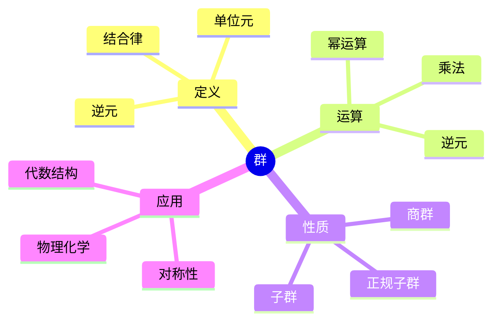
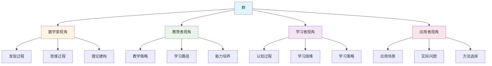
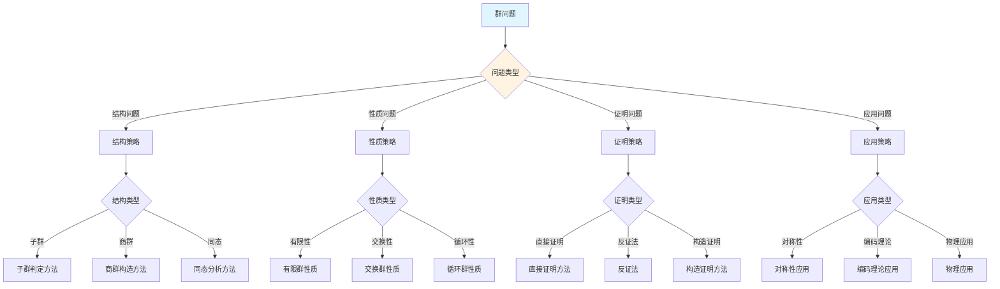
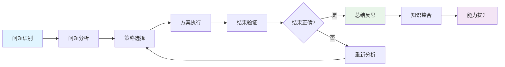
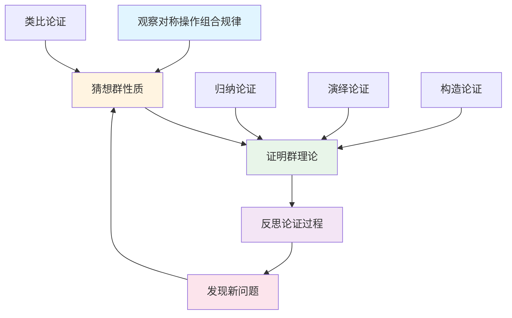
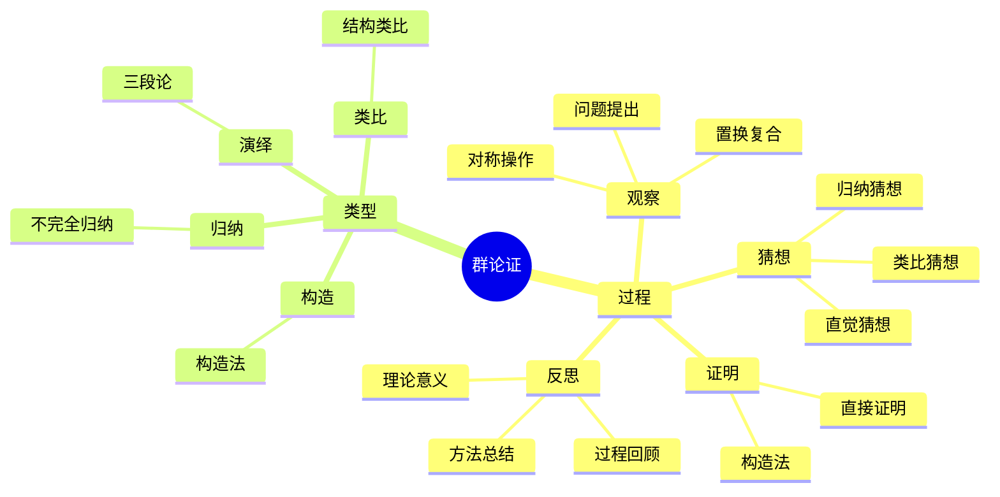
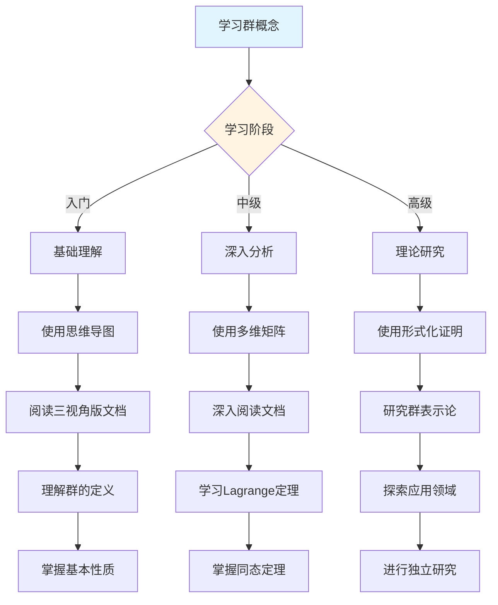
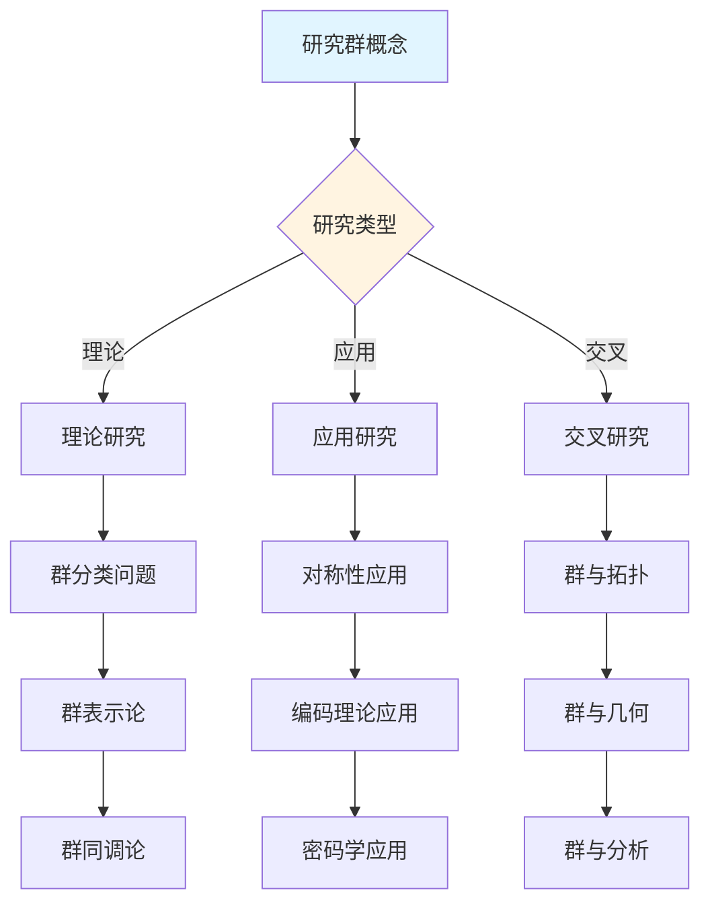
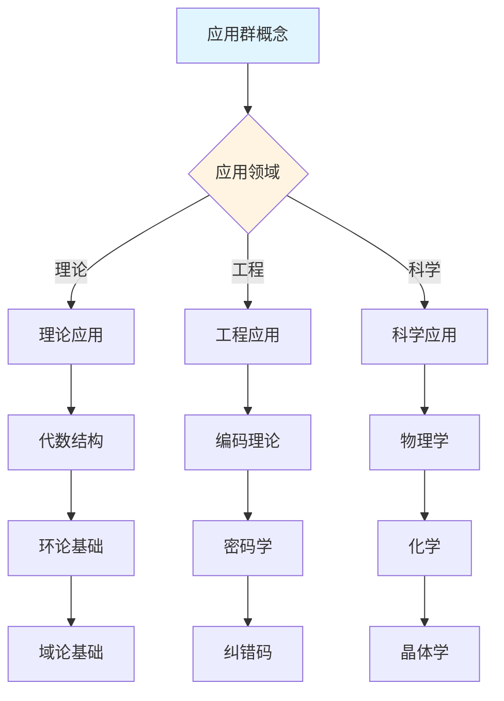
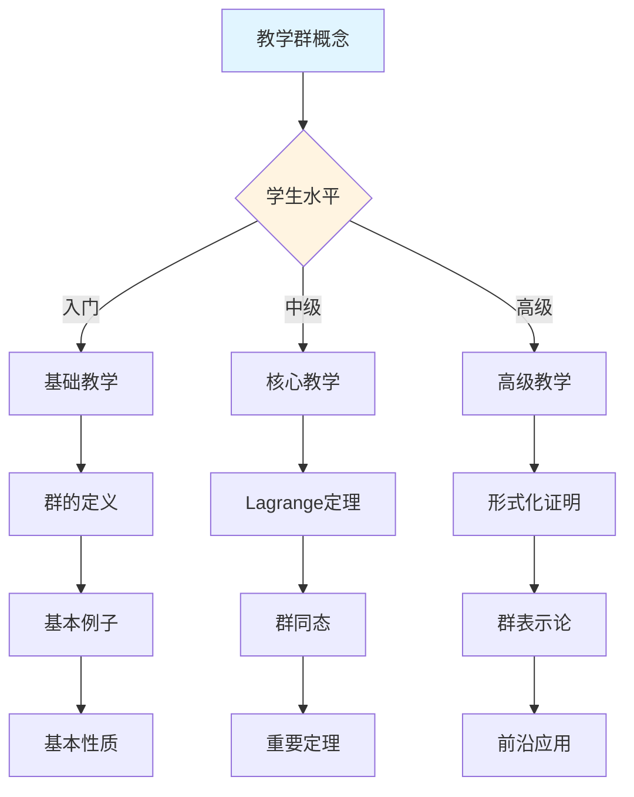

---
msc_primary: "00A99"
---

# 群 (Group) - 三视角组织版

**概念编号**: C.CORE.008
**知识层次**: L0-L2
**知识领域**: D2 (代数)
**创建日期**: 2025年1月
**最后更新**: 2026-04-05

---

## 📋 目录 / Table of Contents

- [群 (Group) - 三视角组织版](#群-group---三视角组织版)
  - 📋 目录 / Table of Contents
  - 1. 📋 概述 (编号: C.CORE.008.01)
  - [🧠 认知学视角：如何理解群 (编号: C.CORE.008.02)](#认知学视角如何理解群-编号-ccore00802)
    - [认知起点 (编号: C.CORE.008.02.01)](#认知起点-编号-ccore0080201)
    - [认知过程 (编号: C.CORE.008.02.02)](#认知过程-编号-ccore0080202)
      - [阶段1：直观理解阶段 (编号: C.CORE.008.02.02.01)](#阶段1直观理解阶段-编号-ccore008020201)
      - [阶段2：概念形成阶段 (编号: C.CORE.008.02.02.02)](#阶段2概念形成阶段-编号-ccore008020202)
      - [阶段3：形式化阶段 (编号: C.CORE.008.02.02.03)](#阶段3形式化阶段-编号-ccore008020203)

## 形式化定义

**定义（群）**：群是一个有序对 $(G, \cdot)$，其中 $G$ 是非空集合，$\cdot: G \times G \to G$ 是二元运算，满足：

1. **结合律**：$\forall a, b, c \in G: (a \cdot b) \cdot c = a \cdot (b \cdot c)$
2. **单位元**：$\exists e \in G, \forall a \in G: e \cdot a = a \cdot e = a$
3. **逆元**：$\forall a \in G, \exists a^{-1} \in G: a \cdot a^{-1} = a^{-1} \cdot a = e$

**符号说明**：
- $G$：群的底层集合
- $e$ 或 $1_G$：单位元
- $a^{-1}$：元素 $a$ 的逆元
- $|G|$ 或 $\#G$：群的阶（元素个数）
- $a^n$：$a$ 的 $n$ 次幂（$n \in \mathbb{Z}$）

    - [认知障碍 (编号: C.CORE.008.02.03)](#认知障碍-编号-ccore0080203)
    - [认知工具 (编号: C.CORE.008.02.04)](#认知工具-编号-ccore0080204)
  - [🎓 教育学视角：如何教学群 (编号: C.CORE.008.03)](#教育学视角如何教学群-编号-ccore00803)
    - [教学目标 (编号: C.CORE.008.03.01)](#教学目标-编号-ccore0080301)
    - [教学路径 (编号: C.CORE.008.03.02)](#教学路径-编号-ccore0080302)
      - [阶段1：引入阶段（激发兴趣） (编号: C.CORE.008.03.02.01)](#阶段1引入阶段激发兴趣-编号-ccore008030201)
      - [阶段2：探索阶段（主动建构） (编号: C.CORE.008.03.02.02)](#阶段2探索阶段主动建构-编号-ccore008030202)
      - [阶段3：形式化阶段（抽象概括） (编号: C.CORE.008.03.02.03)](#阶段3形式化阶段抽象概括-编号-ccore008030203)
      - [阶段4：巩固阶段（应用深化） (编号: C.CORE.008.03.02.04)](#阶段4巩固阶段应用深化-编号-ccore008030204)
    - [教学难点 (编号: C.CORE.008.03.03)](#教学难点-编号-ccore0080303)
    - [教学策略 (编号: C.CORE.008.03.04)](#教学策略-编号-ccore0080304)
    - [评估方法 (编号: C.CORE.008.03.05)](#评估方法-编号-ccore0080305)
  - [🔬 数学家视角：如何思考群 (编号: C.CORE.008.04)](#数学家视角如何思考群-编号-ccore00804)
    - [问题起源 (编号: C.CORE.008.04.01)](#问题起源-编号-ccore0080401)
    - [思维过程 (编号: C.CORE.008.04.02)](#思维过程-编号-ccore0080402)
      - [步骤1：问题提出 (编号: C.CORE.008.04.02.01)](#步骤1问题提出-编号-ccore008040201)
      - [步骤2：概念形成 (编号: C.CORE.008.04.02.02)](#步骤2概念形成-编号-ccore008040202)
      - [步骤3：理论发展 (编号: C.CORE.008.04.02.03)](#步骤3理论发展-编号-ccore008040203)
    - [历史发展 (编号: C.CORE.008.04.03)](#历史发展-编号-ccore0080403)
    - [3.2 关键人物和贡献 (编号: C.CORE.008.04.04)](#32-关键人物和贡献-编号-ccore0080404)
    - [重要定理 (编号: C.CORE.008.04.05)](#重要定理-编号-ccore0080405)
    - [开放问题 (编号: C.CORE.008.04.06)](#开放问题-编号-ccore0080406)
    - [一、第一人称思维描述 (编号: C.CORE.008.04.07)](#一第一人称思维描述-编号-ccore0080407)
      - [1.1 Galois的发现过程](#11-galois的发现过程)
      - [1.2 Cayley的抽象化思维](#12-cayley的抽象化思维)
    - [二、数学直觉的形成 (编号: C.CORE.008.04.08)](#二数学直觉的形成-编号-ccore0080408)
      - [2.1 直觉在概念发现中的作用](#21-直觉在概念发现中的作用)
      - [2.2 如何培养群直觉](#22-如何培养群直觉)
    - [三、数学美的教育价值 (编号: C.CORE.008.04.09)](#三数学美的教育价值-编号-ccore0080409)
      - [3.1 群论的美在哪里](#31-群论的美在哪里)
      - [3.2 如何培养学生的数学美感](#32-如何培养学生的数学美感)
    - [四、问题解决策略 (编号: C.CORE.008.04.10)](#四问题解决策略-编号-ccore0080410)
      - [4.1 数学家的启发式方法](#41-数学家的启发式方法)
      - [4.2 思维过程分析](#42-思维过程分析)
    - [五、批判性反思 (编号: C.CORE.008.04.11)](#五批判性反思-编号-ccore0080411)
      - [5.1 群概念的局限性](#51-群概念的局限性)
      - [5.2 群理论的未解决问题](#52-群理论的未解决问题)
  - [💡 数学解释：为什么群是这样定义的 (编号: C.CORE.008.05)](#数学解释为什么群是这样定义的-编号-ccore00805)
    - [一、直观解释：群是什么？](#一直观解释群是什么)
      - [1.1 具体例子](#11-具体例子)
      - [1.2 形象类比](#12-形象类比)
      - [1.3 几何直观](#13-几何直观)
      - [1.4 操作体验](#14-操作体验)
    - [二、知性解释：群的本质是什么？](#二知性解释群的本质是什么)
      - [2.1 概念定义](#21-概念定义)
      - [2.2 分类体系](#22-分类体系)
      - [2.3 抽象结构](#23-抽象结构)
      - [2.4 知识体系](#24-知识体系)
    - [三、理性解释：群的公理化定义](#三理性解释群的公理化定义)
      - [3.1 公理体系](#31-公理体系)
      - [3.2 形式化证明](#32-形式化证明)
      - [3.3 系统建构](#33-系统建构)
    - [四、多视角解释：从不同角度理解群](#四多视角解释从不同角度理解群)
      - [4.1 数学家视角：群是如何被发现的？](#41-数学家视角群是如何被发现的)
      - [4.2 教育者视角：如何教学群？](#42-教育者视角如何教学群)
      - [4.3 学习者视角：如何学习群？](#43-学习者视角如何学习群)
      - [4.4 应用者视角：如何应用群？](#44-应用者视角如何应用群)
    - [五、思维表征：用多种方式理解群](#五思维表征用多种方式理解群)
      - [5.1 思维导图：群的知识结构](#51-思维导图群的知识结构)
      - [5.2 矩阵对比：不同解释方式的对比](#52-矩阵对比不同解释方式的对比)
      - [5.3 多视角表征：从不同角度表征群](#53-多视角表征从不同角度表征群)
      - [5.4 决策树：群问题分类和策略选择](#54-决策树群问题分类和策略选择)
      - [5.5 决策逻辑路径：群问题解决过程](#55-决策逻辑路径群问题解决过程)
      - [5.6 多维对比矩阵：群概念特征对比](#56-多维对比矩阵群概念特征对比)
  - [🔍 数学论证：如何论证群 (编号: C.CORE.008.06)](#数学论证如何论证群-编号-ccore00806)
    - [一、论证过程：从观察到反思](#一论证过程从观察到反思)
      - [1.1 观察（Observation）](#11-观察observation)
      - [1.2 猜想（Conjecture）](#12-猜想conjecture)
      - [1.3 证明（Proof）](#13-证明proof)
      - [1.4 反思（Reflection）](#14-反思reflection)
    - [二、论证类型：多种推理方式](#二论证类型多种推理方式)
      - [2.1 归纳论证（Inductive Reasoning）](#21-归纳论证inductive-reasoning)
      - [2.2 演绎论证（Deductive Reasoning）](#22-演绎论证deductive-reasoning)
      - [2.3 类比论证（Analogical Reasoning）](#23-类比论证analogical-reasoning)
      - [2.4 构造论证（Constructive Reasoning）](#24-构造论证constructive-reasoning)
    - [三、论证可视化：用图形表示论证过程](#三论证可视化用图形表示论证过程)
      - [3.1 论证流程图](#31-论证流程图)
      - [3.2 论证类型对比](#32-论证类型对比)
      - [3.3 论证思维导图](#33-论证思维导图)
  - [🔗 三视角整合 (编号: C.CORE.008.07)](#三视角整合-编号-ccore00807)
    - [三个视角的关联](#三个视角的关联)
    - [如何综合运用三个视角](#如何综合运用三个视角)
  - [📚 参考文献 (编号: C.CORE.008.08)](#参考文献-编号-ccore00808)
    - [权威资源](#权威资源)
    - [经典教材](#经典教材)
    - [研究论文](#研究论文)

---


## 1. 📋 概述 (编号: C.CORE.008.01)

群是代数学中最基本的结构之一，是研究对称性的数学工具。群论在数学、物理学、化学等领域有广泛应用，是现代数学的核心分支。

本文档从**数学认知学**、**教育学**、**数学家**三个视角深入展开群概念，避免简单的概念堆垒。

**权威资源对齐**:

- Wikipedia: [Group (Mathematics)](https://en.wikipedia.org/wiki/Group_(mathematics))
- Wikipedia: [Group Theory](https://en.wikipedia.org/wiki/Group_theory)
- Stanford课程: Math 120 (Groups, Rings, and Fields)
- Princeton课程: MAT 350 (Abstract Algebra)
- MIT课程: 18.701 (Algebra I)
- Metamath: [Group Theory](http://us.metamath.org/mpeuni/df-grp.html)[需更新][需更新]

---

## 🧠 认知学视角：如何理解群 (编号: C.CORE.008.02)

### 认知起点 (编号: C.CORE.008.02.01)

**学习者已有的知识基础**:

- 集合的概念
- 二元运算的概念
- 日常经验中的"对称"、"变换"概念

**日常经验中的类似概念**:

- "旋转"：图形的旋转对称
- "反射"：图形的反射对称
- "置换"：物品的重新排列

### 认知过程 (编号: C.CORE.008.02.02)

#### 阶段1：直观理解阶段 (编号: C.CORE.008.02.02.01)

**具体例子**:

- 例子1：$(\mathbb{Z}, +)$ - 整数加法群
- 例子2：$S_3$ - 3个元素的对称群（置换群）
- 例子3：$D_3$ - 正三角形的对称群（二面体群）

**形象类比**:

- **对称类比**: 群就像"对称操作的集合"
  - 旋转、反射、平移等对称操作
  - 这些操作可以复合
  - 每个操作都有逆操作

- **运算类比**: 群就像"有逆运算的运算系统"
  - 加法有减法（逆运算）
  - 乘法有除法（逆运算）

**可视化表示**:

```text
群运算表:
    ·  e  a  b
    e  e  a  b
    a  a  b  e
    b  b  e  a
```

#### 阶段2：概念形成阶段 (编号: C.CORE.008.02.02.02)

**从例子中抽象出共同特征**:

- 所有例子都涉及"集合和运算"
- 运算满足"结合律"
- 存在"单位元"和"逆元"

**识别关键属性**:

1. **结合律**: $(a \cdot b) \cdot c = a \cdot (b \cdot c)$
2. **单位元**: 存在$e$使得$e \cdot a = a \cdot e = a$
3. **逆元**: 对每个$a$，存在$a^{-1}$使得$a \cdot a^{-1} = e$

**建立概念边界**:

- **什么是群**: 满足结合律、有单位元、每个元素有逆元的代数结构
- **什么不是群**:
  - 自然数加法（没有逆元）
  - 整数乘法（0没有逆元）

#### 阶段3：形式化阶段 (编号: C.CORE.008.02.02.03)

**严格定义**:

- 公理化定义：通过结合律、单位元、逆元三条公理
- 范畴定义：群是只有一个对象的群胚

**公理化表述**:

- 公理1：结合律
- 公理2：单位元存在性
- 公理3：逆元存在性

**逻辑结构**:

- 群是代数结构的基础
- 群是研究对称性的工具
- 群是环和域的基础

### 认知障碍 (编号: C.CORE.008.02.03)

**常见误解**:

1. **误解1**: 认为群必须满足交换律
   - **纠正**: 群不一定满足交换律，满足交换律的群是交换群（Abel群）

2. **误解2**: 认为群必须是有限的
   - **纠正**: 群可以是有限的，也可以是无限的

3. **误解3**: 混淆群和集合
   - **纠正**: 群是集合配备运算的结构，不是单纯的集合

**理解难点**:

1. **难点1**: 群的抽象性
   - **原因**: 群是高度抽象的概念
   - **解决方法**: 从具体例子开始，逐步抽象

2. **难点2**: 群运算的非交换性
   - **原因**: 日常经验中的运算大多是交换的
   - **解决方法**: 用置换、旋转等具体例子说明

3. **难点3**: 群同态和群同构
   - **原因**: 需要理解群之间的映射
   - **解决方法**: 用具体例子，强调保持运算的重要性

**认知陷阱**:

- **交换律**: 需要理解群不一定满足交换律
- **单位元**: 需要理解单位元的唯一性

### 认知工具 (编号: C.CORE.008.02.04)

**类比工具**:

- **对称类比**: 群 = 对称操作的集合
- **运算类比**: 群 = 有逆运算的运算系统

**可视化工具**:

- **群运算表**: 用表格表示群运算
- **Cayley图**: 用图表示群的结构

**具体化工具**:

- **具体例子**: 用具体例子理解抽象概念
- **反例**: 用反例理解概念边界

---

## 🎓 教育学视角：如何教学群 (编号: C.CORE.008.03)

### 教学目标 (编号: C.CORE.008.03.01)

**知识目标**:

- 理解群的基本概念
- 掌握群的公理化定义
- 理解群的性质
- 理解群同态和群同构

**能力目标**:

- 能够判断一个结构是否是群
- 能够进行群运算
- 能够理解群的结构
- 能够应用群论解决实际问题

**情感目标**:

- 培养数学抽象思维
- 培养对称性思维
- 激发对数学的兴趣

### 教学路径 (编号: C.CORE.008.03.02)

#### 阶段1：引入阶段（激发兴趣） (编号: C.CORE.008.03.02.01)

**实际问题**:

- 问题1：如何描述图形的对称性？
- 问题2：如何研究方程的对称性？
- 问题3：如何研究物理系统的对称性？

**历史背景**:

- Galois如何引入群概念
- 群论在数学中的地位
- 群论在物理中的应用

**引发认知冲突**:

- 问题：如何统一描述各种对称性？
- 引出群的概念

#### 阶段2：探索阶段（主动建构） (编号: C.CORE.008.03.02.02)

**引导发现**:

1. 让学生自己列举对称操作的例子
2. 让学生观察这些操作的共同特征
3. 引导学生抽象出群的定义

**合作探究**:

- 小组讨论：什么是群？
- 小组讨论：群有哪些性质？
- 小组讨论：如何表示群？

**多元表征**:

- **语言表征**: "群是满足结合律、有单位元、每个元素有逆元的代数结构"
- **符号表征**: $(G, \cdot)$
- **图形表征**: 群运算表、Cayley图
- **集合表征**: 公理化定义

#### 阶段3：形式化阶段（抽象概括） (编号: C.CORE.008.03.02.03)

**严格定义**:

- 群的公理化定义
- 群的性质
- 群同态和群同构

**性质证明**:

- 单位元的唯一性
- 逆元的唯一性
- 消去律

**应用拓展**:

- 群在数学中的应用
- 群在物理中的应用
- 群在化学中的应用

#### 阶段4：巩固阶段（应用深化） (编号: C.CORE.008.03.02.04)

**练习应用**:

- 基础练习：群的表示和运算
- 应用练习：用群解决实际问题
- 综合练习：群的综合应用

**变式训练**:

- 不同形式的群表示
- 不同性质的群
- 群同态和群同构

**知识整合**:

- 群与其他代数结构的联系
- 群在数学体系中的地位

### 教学难点 (编号: C.CORE.008.03.03)

**难点1：群的抽象性**:

- **难点描述**: 学生难以理解群的抽象概念
- **解决方法**:
  - 从具体例子开始
  - 用对称性类比
  - 逐步抽象

**难点2：群运算的非交换性**:

- **难点描述**: 学生难以理解非交换群
- **解决方法**:
  - 用置换、旋转等具体例子
  - 强调非交换性的重要性
  - 用群运算表可视化

**难点3：群同态和群同构**:

- **难点描述**: 学生难以理解群之间的映射
- **解决方法**:
  - 用具体例子
  - 强调保持运算的重要性
  - 用图形可视化

### 教学策略 (编号: C.CORE.008.03.04)

**策略1：从具体到抽象**:

- 先给出具体例子
- 再抽象出一般概念
- 最后给出严格定义

**策略2：多元表征**:

- 用语言、符号、图形等多种方式表示同一概念
- 帮助学生建立不同表征之间的联系

**策略3：问题驱动**:

- 从实际问题出发
- 引出数学概念
- 解决问题

**策略4：可视化教学**:

- 使用群运算表
- 使用Cayley图
- 使用具体例子

### 评估方法 (编号: C.CORE.008.03.05)

**形成性评估**（评估理解过程）:

- 课堂提问：检查学生对概念的理解
- 小组讨论：观察学生的思考过程
- 练习作业：检查学生的应用能力

**总结性评估**（评估最终理解）:

- 测验：检查学生对概念和运算的掌握
- 项目：检查学生应用群论解决实际问题的能力
- 反思：检查学生对群概念的理解深度

---

## 🔬 数学家视角：如何思考群 (编号: C.CORE.008.04)

### 问题起源 (编号: C.CORE.008.04.01)

**历史背景**:

- 19世纪初：群论的起源
- 19世纪中期：群论的系统化
- 20世纪：群论的现代发展

**原始问题**:

- **问题1**: 如何研究方程的对称性？
- **问题2**: 如何统一描述各种对称性？
- **问题3**: 群有哪些性质？

**研究动机**:

- 解决方程可解性问题
- 统一对称性理论
- 发展抽象代数

### 思维过程 (编号: C.CORE.008.04.02)

#### 步骤1：问题提出 (编号: C.CORE.008.04.02.01)

**观察到的现象**:

- 方程有对称性
- 图形有对称性
- 这些对称性有一些共同的性质

**提出的猜想**:

- 可以引入群概念
- 群可以统一描述对称性
- 群有丰富的结构

**需要解决的问题**:

- 如何定义群？
- 群应该满足什么条件？
- 群有哪些性质？

#### 步骤2：概念形成 (编号: C.CORE.008.04.02.02)

**尝试性定义**:

- **置换群**: 通过置换定义
- **抽象群**: 通过公理定义

**性质探索**:

- 群的结合律
- 群的单位元
- 群的逆元

**结构发现**:

- 群构成代数结构
- 群是研究对称性的工具
- 群是环和域的基础

#### 步骤3：理论发展 (编号: C.CORE.008.04.02.03)

**定理证明**:

- 群的基本性质
- 群的分类定理
- 群的表示论

**应用拓展**:

- 群在数学中的应用
- 群在物理中的应用
- 群在化学中的应用

**理论完善**:

- 群的公理化
- 群的范畴论研究
- 群的表示论

### 历史发展 (编号: C.CORE.008.04.03)

**早期阶段**（19世纪初）:

- **Galois (1832)**: 在研究方程可解性时引入群概念
- **Cauchy (1815)**: 研究置换群
- **Abel (1824)**: 证明五次方程不可解

**关键突破**（19世纪中期）:

- **Cayley (1854)**: 给出群的抽象定义
- **Jordan (1870)**: 系统研究有限群
- **Sylow (1872)**: 证明Sylow定理

**现代发展**（20世纪）:

- **Burnside (1897)**: 研究有限群理论
- **Frobenius (1897)**: 发展群表示论
- **Thompson (1960s)**: 有限单群分类

### 3.2 关键人物和贡献 (编号: C.CORE.008.04.04)

**Évariste Galois (1811-1832)**:

- 群论的创始人
- 引入群概念研究方程可解性

**Arthur Cayley (1821-1895)**:

- 给出群的抽象定义
- 建立群论的基础

**Camille Jordan (1838-1922)**:

- 系统研究有限群
- 建立群论的理论体系

### 重要定理 (编号: C.CORE.008.04.05)

**Lagrange定理**:

- 子群的阶整除群的阶
- 意义：群结构的基本限制

**Sylow定理**:

- 有限群有Sylow子群
- 意义：有限群分类的基础

**有限单群分类**:

- 所有有限单群都已分类
- 意义：群论的重大成就

### 开放问题 (编号: C.CORE.008.04.06)

**未解决问题**:

- 群的分类问题
- 群的表示问题
- 群的应用问题

**研究方向**:

- 群的范畴论研究
- 群的表示论研究
- 群的应用研究

### 一、第一人称思维描述 (编号: C.CORE.008.04.07)

#### 1.1 Galois的发现过程

**详细历史背景**:

- **1830年**：Galois研究五次方程的可解性
- **背景**：研究方程的根置换，发现对称性
- **问题**：如何判断方程是否可解？如何描述根的对称性？

**Galois的详细第一人称描述**:
> "1830年，我在研究五次方程的可解性时，遇到了一个问题：如何判断方程是否可解？
>
> 我发现，方程的根有对称性。例如，对于方程$x^2 - 2 = 0$，根是$\sqrt{2}$和$-\sqrt{2}$，它们可以通过置换$\sigma: \sqrt{2} \mapsto -\sqrt{2}$互换。
>
> 我的发现是：
>
> - **对称性**：方程的根可以通过置换互换
> - **置换群**：所有置换构成一个群
> - **可解性**：方程可解当且仅当对应的群是可解群
>
> 例如，对于方程$x^2 - 2 = 0$：
>
> - **根**：$\sqrt{2}$和$-\sqrt{2}$
> - **置换**：$\sigma: \sqrt{2} \mapsto -\sqrt{2}$，$\sigma^2 = \text{id}$
> - **群**：$\{e, \sigma\}$（2阶循环群）
> - **可解性**：这个群是可解群，所以方程可解
>
> 对于五次方程$x^5 - x - 1 = 0$：
>
> - **置换群**：$S_5$（5次对称群）
> - **可解性**：$S_5$不是可解群，所以方程不可用根式解
>
> 这让我意识到，群是描述对称性的工具，群的性质决定了方程的可解性。这为代数方程理论提供了新的视角。"

**详细的思维过程**:

1. **观察到的现象**（1830年）:

   **现象1：方程的根有对称性**
   - **问题**：方程的根可以通过置换互换
   - **例子**：$x^2 - 2 = 0$的根$\sqrt{2}$和$-\sqrt{2}$可以互换
   - **需要**：描述这种对称性

   **现象2：置换的复合满足某些性质**
   - **问题**：置换的复合满足结合律、有单位元、有逆元
   - **例子**：$\sigma \circ \tau$也是置换
   - **需要**：抽象出群的概念

   **现象3：群与方程可解性相关**
   - **问题**：方程可解当且仅当对应的群是可解群
   - **例子**：$S_5$不是可解群，所以五次方程不可用根式解
   - **需要**：建立群与方程可解性的关系

2. **提出的猜想**（1830年）:

   **猜想1：用群描述对称性**
   - **思路**：用置换群描述根的对称性
   - **例子**：$x^2 - 2 = 0$的置换群是$\{e, \sigma\}$
   - **优点**：统一描述对称性

   **猜想2：群与方程可解性相关**
   - **关系**：方程可解当且仅当对应的群是可解群
   - **例子**：$S_5$不是可解群，所以五次方程不可用根式解
   - **意义**：用群的性质判断方程的可解性

   **猜想3：群是数学的基础**
   - **性质**：群是抽象的数学结构
   - **应用**：群可以应用到更广泛的领域
   - **意义**：群是统一的数学结构

3. **遇到的困难**（1830年）:

   **困难1：如何严格定义群？**
   - **问题**：如何定义群？
   - **解决**：通过公理定义群（结合律、单位元、逆元）
   - **意义**：为群提供严格的数学基础

   **困难2：如何判断群的性质？**
   - **问题**：如何判断群是否可解？
   - **解决**：通过群的结构判断
   - **意义**：为方程可解性提供判断方法

   **困难3：如何应用群论？**
   - **问题**：如何用群论解决实际问题？
   - **解决**：建立Galois理论
   - **意义**：为代数方程理论提供新视角

4. **突破的时刻**（1830年，Galois）:

   **突破1：群的概念**
   - 引入群的概念描述对称性
   - **关键**：抽象出群的结构
   - **意义**：为群论提供基础

   **突破2：Galois理论**
   - 建立群与方程可解性的关系
   - **关键**：方程可解当且仅当对应的群是可解群
   - **意义**：为代数方程理论提供新视角

   **突破3：群论的广泛应用**
   - 群论可以应用到更广泛的领域
   - **关键**：群是抽象的数学结构
   - **意义**：群论成为数学的基础

#### 1.2 Cayley的抽象化思维

**Cayley的第一人称描述**:
> "我发现群不一定要是置换群，可以是任何满足群公理的集合。我意识到，群是抽象的数学结构，是研究对称性的工具。这让我能够将群论应用到更广泛的领域。"

**思维过程**:

1. **问题识别**:
   - 群是否只能是置换群？
   - 如何抽象化群的概念？
   - 如何推广群论？

2. **策略选择**:
   - 通过公理定义群
   - 不限制群的具体形式
   - 强调群的抽象性

3. **抽象化设计**:
   - 定义群公理
   - 证明群的性质
   - 建立群论的理论体系

### 二、数学直觉的形成 (编号: C.CORE.008.04.08)

#### 2.1 直觉在概念发现中的作用

**Galois的直觉**:

- **直觉1**: "群"是"对称性"——这个直觉引导Galois发现群论
- **直觉2**: 群与方程可解性相关——这个直觉引导Galois建立Galois理论
- **直觉3**: 群是数学的基础——这个直觉引导Galois建立群论

**Cayley的直觉**:

- **直觉1**: 群是抽象的——这个直觉引导Cayley抽象化群
- **直觉2**: 群可以应用到更广泛的领域——这个直觉引导Cayley推广群论
- **直觉3**: 群是统一的数学结构——这个直觉引导Cayley建立群论

**直觉的验证**:

- 通过严格的数学证明验证直觉的正确性
- 通过公理化严格化群定义
- 通过应用验证群的广泛性

**直觉的深化**:

- 从"对称性"到"群的公理化"
- 从"方程可解性"到"Galois理论"
- 从"数学基础"到"群论的广泛应用"

#### 2.2 如何培养群直觉

**数学家的建议**:

- **Galois**: "群直觉是长期训练的结果。通过大量练习和深入思考，我们可以培养对群的直觉。"
- **Cayley**: "从具体例子开始，逐步抽象，这是培养群直觉的有效方法。"

**培养方法**:

1. **大量练习**: 通过大量群运算练习，培养对群的直觉
2. **深入思考**: 深入思考群的本质，理解群的深层结构
3. **类比和联想**: 通过类比和联想，建立群与其他概念的联系
4. **与专家交流**: 与数学家交流，学习他们的思维方式

**教学启示**:

- 从具体例子开始，逐步抽象
- 鼓励学生思考群的本质
- 引导学生建立群与其他概念的联系

### 三、数学美的教育价值 (编号: C.CORE.008.04.09)

#### 3.1 群论的美在哪里

**结构美**:

- **简洁性**: 群的概念非常简洁——"满足结合律、单位元、逆元的集合"
- **统一性**: 群可以统一描述数学中的各种对称性
- **和谐性**: 群运算满足优美的规律（结合律、单位元、逆元）

**数学家的评价**:

- **Galois**: "群论的美在于它的对称性。它为我们提供了一个统一的框架来理解数学中的对称性。"
- **Cayley**: "群论的美在于它的抽象性。它是数学的基础，所有数学概念都可以用群来描述。"

#### 3.2 如何培养学生的数学美感

**数学家的建议**:

- **Galois**: "展示群论的美感，让学生感受到数学的美。"
- **Cayley**: "通过群论的历史和发展，让学生理解数学的美。"

**教学方法**:

1. **展示数学美**:
   - 展示群概念的简洁性和统一性
   - 展示群运算的优美规律
   - 展示群在数学中的基础地位

2. **引导学生欣赏**:
   - 引导学生欣赏群概念的简洁性
   - 引导学生欣赏群运算的和谐性
   - 引导学生欣赏群的基础性

3. **鼓励学生创造美**:
   - 鼓励学生发现群论的美
   - 鼓励学生创造优美的群证明
   - 鼓励学生探索群论的美

### 四、问题解决策略 (编号: C.CORE.008.04.10)

#### 4.1 数学家的启发式方法

**策略1：从具体到抽象**:

- 从具体的群例子开始
- 抽象出群的一般性质
- 建立群的理论体系

**策略2：从简单到复杂**:

- 先理解基本群
- 再理解群运算
- 最后理解群理论

**策略3：从问题到理论**:

- 从实际问题出发
- 引出群概念
- 建立群理论

#### 4.2 思维过程分析

**问题识别**:

- 识别问题类型：群定义问题、群性质问题、群应用问题
- 识别问题难度：简单问题、中等问题、复杂问题

**策略选择**:

- 简单问题：直接方法
- 中等问题：分步方法
- 复杂问题：分解方法

**执行和反思**:

- 执行策略，解决问题
- 反思过程，总结经验
- 改进方法，提高效率

### 五、批判性反思 (编号: C.CORE.008.04.11)

#### 5.1 群概念的局限性

**概念的边界**:

- 群只描述对称性，不能描述所有数学结构
- 群是抽象的，需要具体化才能应用
- 群不能表示所有数学量

**概念的推广**:

- 半群：去掉逆元条件
- 幺半群：去掉逆元条件，保留单位元
- 群胚：更一般的结构

#### 5.2 群理论的未解决问题

**未解决的问题**:

- 群的分类问题：如何分类所有群？
- 群的表示问题：如何表示群？
- 群的应用问题：如何更好地应用群？

**研究方向**:

- 群的范畴论研究
- 群的表示论研究
- 群的应用研究

---

## 💡 数学解释：为什么群是这样定义的 (编号: C.CORE.008.05)

### 一、直观解释：群是什么？

#### 1.1 具体例子

**生活中的例子**：

- **旋转对称**：正方形的旋转对称构成群
  - 例如：旋转0°、90°、180°、270°构成群
  - **为什么这样定义**：因为我们需要一个概念来表示"对称性"
- **置换**：三个对象的置换构成群
  - 例如：$\{1,2,3\}$的所有置换构成群$S_3$
  - **为什么这样定义**：因为我们需要一个概念来表示"排列"
- **整数加法**：整数在加法下构成群
  - 例如：$(\mathbb{Z}, +)$是群
  - **为什么这样定义**：因为我们需要一个概念来表示"运算结构"

**数学中的例子**：

- **置换群**：$S_n$表示$n$个对象的置换群
  - **为什么这样定义**：我们需要一个概念来表示"所有置换"
- **循环群**：$\mathbb{Z}_n$表示模$n$的循环群
  - **为什么这样定义**：我们需要一个概念来表示"循环结构"
- **矩阵群**：$GL(n, \mathbb{R})$表示$n \times n$可逆矩阵群
  - **为什么这样定义**：我们需要一个概念来表示"线性变换"

#### 1.2 形象类比

**对称类比**：

- **群就像"对称性"**
  - 群描述对象的对称性
  - 群的元素是对称变换
  - 群的运算是变换的复合
- **为什么这样类比**：这个类比帮助我们理解群的本质

**运算类比**：

- **群就像"运算结构"**
  - 群有一个运算（通常是乘法或加法）
  - 运算满足结合律
  - 有单位元和逆元
- **为什么这样类比**：这个类比帮助我们理解群的运算结构

#### 1.3 几何直观

**Cayley图表示**：

- 使用Cayley图表示群
- 群的元素是图的顶点
- 群的生成元是图的边
- **为什么使用Cayley图**：Cayley图提供几何直观，帮助我们理解群的结构

**对称图形表示**：

- 使用对称图形表示群
- 例如：正多边形的对称群
- **为什么使用对称图形**：对称图形提供直观的群表示

#### 1.4 操作体验

**群运算的操作**：

- **乘法操作**：$g \cdot h$（群的乘法）
  - **为什么这样操作**：因为我们需要一个运算来表示"变换的复合"
- **逆元操作**：$g^{-1}$（群的逆元）
  - **为什么这样操作**：因为我们需要一个运算来表示"逆变换"
- **幂运算**：$g^n = g \cdot g \cdots g$（$n$次）
  - **为什么这样操作**：因为我们需要一个运算来表示"重复应用"

### 二、知性解释：群的本质是什么？

#### 2.1 概念定义

**群的内涵**：

- **群是一个集合$G$配备一个二元运算$\cdot$，满足结合律、单位元、逆元**
  - **结合律**：$(g \cdot h) \cdot k = g \cdot (h \cdot k)$
  - **单位元**：存在$e \in G$使得$e \cdot g = g \cdot e = g$
  - **逆元**：对于每个$g \in G$，存在$g^{-1} \in G$使得$g \cdot g^{-1} = g^{-1} \cdot g = e$
- **为什么这样定义**：这些特征使得群成为一个完整的代数结构，支持所有对称性研究

**群的外延**：

- **有限群**：元素个数有限的群
- **无限群**：元素个数无限的群
- **交换群**：运算满足交换律的群（Abel群）
- **非交换群**：运算不满足交换律的群
- **为什么这样分类**：不同的群类型有不同的性质和用途

#### 2.2 分类体系

**按元素个数分类**：

- **有限群**：$|G| < \infty$
- **无限群**：$|G| = \infty$
- **为什么这样分类**：元素个数是群的基本特征

**按运算性质分类**：

- **交换群（Abel群）**：$g \cdot h = h \cdot g$
- **非交换群**：存在$g, h$使得$g \cdot h \neq h \cdot g$
- **为什么这样分类**：交换性是群的重要性质

#### 2.3 抽象结构

**群的运算结构**：

- **群运算**：$\cdot : G \times G \to G$
- **为什么有这个运算**：这个运算使得群具有代数结构

**群的关系结构**：

- **共轭关系**：$g \sim h$当且仅当存在$x$使得$h = xgx^{-1}$
- **为什么有这个关系**：这个关系帮助我们分类群元素

**群的子结构**：

- **子群**：$H \subseteq G$是子群当且仅当$H$在群运算下封闭
- **正规子群**：$N \trianglelefteq G$是正规子群当且仅当$gNg^{-1} = N$对所有$g \in G$
- **为什么有这些结构**：这些结构是群理论的基础

#### 2.4 知识体系

**群在数学体系中的位置**：

- **基础地位**：群是代数结构的基础
  - 群是环和域的基础
  - 群是研究对称性的工具
- **为什么是基础**：群提供了统一的框架来研究对称性

**群与其他概念的关系**：

- **群与环**：环的加法群是群
- **群与域**：域的加法群和乘法群（非零元）都是群
- **群与对称**：群描述对称性
- **为什么有这些关系**：这些关系揭示了群与其他数学概念的内在联系

### 三、理性解释：群的公理化定义

#### 3.1 公理体系

**群的公理化定义**：

- **公理1（结合律）**：$(g \cdot h) \cdot k = g \cdot (h \cdot k)$
- **公理2（单位元）**：存在$e \in G$使得$e \cdot g = g \cdot e = g$
- **公理3（逆元）**：对于每个$g \in G$，存在$g^{-1} \in G$使得$g \cdot g^{-1} = g^{-1} \cdot g = e$
- **为什么需要这些公理**：这些公理定义了群的基本结构

**群的范畴论定义**：

- **群是集合范畴中的群对象**
- **为什么这样定义**：这个定义将群放在更一般的框架中

#### 3.2 形式化证明

**群运算性质的证明**：

- **单位元的唯一性**：如果$e$和$e'$都是单位元，则$e = e'$
  - **证明**：$e = e \cdot e' = e'$
  - **为什么这样证明**：利用单位元的定义
- **逆元的唯一性**：如果$g^{-1}$和$g'$都是$g$的逆元，则$g^{-1} = g'$
  - **证明**：$g^{-1} = g^{-1} \cdot (g \cdot g') = (g^{-1} \cdot g) \cdot g' = e \cdot g' = g'$
  - **为什么这样证明**：利用逆元的定义

**群关系的证明**：

- **Lagrange定理**：如果$H$是有限群$G$的子群，则$|H|$整除$|G|$
  - **证明**：使用陪集分解
  - **为什么这样证明**：利用子群和陪集的性质

#### 3.3 系统建构

**群论在数学基础中的地位**：

- **作为代数基础**：群是代数结构的基础
- **提供对称性工具**：群是研究对称性的工具
- **统一框架**：群统一了各种对称性研究

**群论的发展历史**：

- **Galois的引入**（1832年）：在研究方程可解性时引入群概念
- **Cayley的抽象化**（1854年）：给出群的抽象定义
- **有限单群分类**（1980年代）：完成有限单群的分类
- **为什么这样发展**：数学的发展需要严格的基础，群论的发展反映了这一需求

### 四、多视角解释：从不同角度理解群

#### 4.1 数学家视角：群是如何被发现的？

**Galois的发现过程**：

- **问题提出**：如何研究方程的可解性？
- **关键洞察**：使用群描述方程的对称性
- **重要发现**：群可以统一描述对称性
- **为什么这样发现**：数学家的直觉和严格证明相结合

**Cayley的抽象化过程**：

- **问题识别**：需要抽象化群概念
- **策略选择**：使用公理化定义
- **定义设计**：群是满足三个公理的代数结构
- **为什么这样设计**：需要统一各种群实例

#### 4.2 教育者视角：如何教学群？

**教学策略**：

- **从具体到抽象**：先学习具体例子，再学习抽象定义
- **从简单到复杂**：先学习有限群，再学习无限群
- **从直观到形式化**：先使用对称图形等直观工具，再学习形式化定义
- **为什么这样教学**：符合认知规律，帮助学生逐步建立理解

**学习路径**：

- **阶段1**：直观理解（使用对称图形和具体例子）
- **阶段2**：概念形成（学习群的定义和性质）
- **阶段3**：形式化（学习群的公理化定义）
- **为什么这样设计**：循序渐进，逐步深入

#### 4.3 学习者视角：如何学习群？

**认知过程**：

- **直观阶段**：通过对称图形理解群的含义
- **概念阶段**：理解群的定义和性质
- **形式化阶段**：理解群的公理化定义
- **为什么这样学习**：符合认知发展规律

**学习困难**：

- **困难1**：理解"抽象群"的概念
- **困难2**：理解"非交换群"的概念
- **困难3**：理解"正规子群"的概念
- **如何克服**：通过具体例子、类比、历史背景等方式帮助理解

#### 4.4 应用者视角：如何应用群？

**应用场景**：

- **数学**：使用群研究对称性和代数结构
- **物理**：使用群描述物理系统的对称性
- **化学**：使用群描述分子的对称性
- **为什么这样应用**：群提供了强大的工具来处理各种问题

**应用方法**：

- **建立模型**：将实际问题转化为群问题
- **使用理论**：使用群论解决问题
- **验证结果**：验证结果的正确性
- **为什么这样应用**：群论提供了强大的工具来解决实际问题

### 五、思维表征：用多种方式理解群

#### 5.1 思维导图：群的知识结构


```mermaid
mindmap
  root((群))
    定义
      结合律
      单位元
      逆元
    运算
      乘法
      逆元
      幂运算
    性质
      子群
      正规子群
      商群
    应用
      对称性
      代数结构
      物理化学
```

#### 5.2 矩阵对比：不同解释方式的对比

| 解释方式 | 特点 | 方法 | 工具 | 适用阶段 | 优势 | 局限 |
|---------|------|------|------|---------|------|------|
| **直观解释** | 具体、形象、可视 | 例子、类比、直观 | 对称图形、Cayley图 | 入门阶段 | 易于理解 | 不够严格 |
| **知性解释** | 概念、分类、抽象 | 定义、分类、结构 | 概念图、知识图谱 | 中级阶段 | 系统完整 | 不够直观 |
| **理性解释** | 公理、证明、形式化 | 公理、证明、系统 | 形式化工具、证明系统 | 高级阶段 | 严格准确 | 不够具体 |
| **多视角解释** | 多角度、整合 | 多视角、整合 | 多视角工具 | 所有阶段 | 全面深入 | 可能复杂 |

#### 5.3 多视角表征：从不同角度表征群


```mermaid
graph TD
    A[群] --> B[数学家视角]
    A --> C[教育者视角]
    A --> D[学习者视角]
    A --> E[应用者视角]

    B --> B1[发现过程]
    B --> B2[思维过程]
    B --> B3[理论建构]

    C --> C1[教学策略]
    C --> C2[学习路径]
    C --> C3[能力培养]

    D --> D1[认知过程]
    D --> D2[学习困难]
    D --> D3[学习策略]

    E --> E1[应用场景]
    E --> E2[实际问题]
    E --> E3[方法选择]

    style A fill:#e1f5ff
    style B fill:#fff4e1
    style C fill:#e8f5e9
    style D fill:#f3e5f5
    style E fill:#fce4ec
```

#### 5.4 决策树：群问题分类和策略选择


```mermaid
graph TD
    A[群问题] --> B{问题类型}
    B -->|结构问题| C[结构策略]
    B -->|性质问题| D[性质策略]
    B -->|证明问题| E[证明策略]
    B -->|应用问题| F[应用策略]

    C --> C1{结构类型}
    C1 -->|子群| C2[子群判定方法]
    C1 -->|商群| C3[商群构造方法]
    C1 -->|同态| C4[同态分析方法]

    D --> D1{性质类型}
    D1 -->|有限性| D2[有限群性质]
    D1 -->|交换性| D3[交换群性质]
    D1 -->|循环性| D4[循环群性质]

    E --> E1{证明类型}
    E1 -->|直接证明| E2[直接证明方法]
    E1 -->|反证法| E3[反证法]
    E1 -->|构造证明| E4[构造证明方法]

    F --> F1{应用类型}
    F1 -->|对称性| F2[对称性应用]
    F1 -->|编码理论| F3[编码理论应用]
    F1 -->|物理应用| F4[物理应用]

    style A fill:#e1f5ff
    style B fill:#fff4e1
```

**说明**：

- **问题分类**：根据问题类型（结构、性质、证明、应用）进行分类
- **策略选择**：根据问题类型选择相应的解决策略
- **方法应用**：根据具体问题选择合适的方法

#### 5.5 决策逻辑路径：群问题解决过程


```mermaid
graph LR
    A[问题识别] --> B[问题分析]
    B --> C[策略选择]
    C --> D[方案执行]
    D --> E[结果验证]
    E --> F{结果正确?}
    F -->|是| G[总结反思]
    F -->|否| H[重新分析]
    H --> C

    G --> I[知识整合]
    I --> J[能力提升]

    style A fill:#e1f5ff
    style G fill:#e8f5e9
    style J fill:#f3e5f5
```

**说明**：

- **问题识别**：识别群问题的类型和关键要素
- **问题分析**：分析问题的条件和目标
- **策略选择**：根据问题类型选择解决策略
- **方案执行**：执行选定的解决方案
- **结果验证**：验证结果的正确性
- **总结反思**：总结解题过程，反思解题方法
- **知识整合**：整合相关知识点
- **能力提升**：提升问题解决能力

#### 5.6 多维对比矩阵：群概念特征对比

| 对比维度 | 群定义 | 群结构 | 群性质 | 群应用 |
|---------|---------|---------|---------|---------|
| **核心特征** | 群公理、二元运算 | 子群、商群、同态 | 有限性、交换性、循环性 | 对称性、编码理论、物理应用 |
| **理解难度** | ⭐⭐⭐⭐ | ⭐⭐⭐⭐ | ⭐⭐⭐⭐ | ⭐⭐⭐⭐ |
| **应用频率** | ⭐⭐⭐⭐⭐ | ⭐⭐⭐⭐ | ⭐⭐⭐⭐ | ⭐⭐⭐⭐ |
| **理论基础** | 群公理体系 | 群结构理论 | 群性质理论 | 群应用理论 |
| **教学重点** | 概念理解 | 结构分析 | 性质分析 | 应用能力 |
| **学习阶段** | 中级阶段 | 中级-高级 | 中级-高级 | 高级阶段 |
| **认知维度** | 知性+理性 | 理性 | 理性 | 理性+应用 |
| **思维表征** | 思维导图 | 决策树 | 决策逻辑路径 | 知识图谱 |

**说明**：

- **核心特征**：每个方面的核心特征
- **理解难度**：从1星到5星，表示理解难度
- **应用频率**：从1星到5星，表示应用频率
- **理论基础**：每个方面的理论基础
- **教学重点**：每个方面的教学重点
- **学习阶段**：每个方面的学习阶段
- **认知维度**：每个方面的认知维度
- **思维表征**：每个方面推荐的思维表征方法

---

## 🔍 数学论证：如何论证群 (编号: C.CORE.008.06)

### 一、论证过程：从观察到反思

#### 1.1 观察（Observation）

**具体现象观察**：

- **现象1**：对称操作的组合规律
  - 例如：观察正方形的旋转和反射的组合，满足结合律、有单位元、每个操作有逆操作
  - **为什么重要**：这个现象揭示了群作为对称性研究工具的必要性
- **现象2**：置换的复合规律
  - 例如：观察置换的复合满足结合律、有恒等置换、每个置换有逆置换
  - **为什么重要**：这个现象揭示了群的抽象结构

**模式识别**：

- **模式1**：群的公理结构
  - 例如：结合律、单位元、逆元三个公理可以刻画对称性
  - **为什么重要**：这个模式可能反映了群的本质
- **模式2**：Lagrange定理
  - 例如：子群的阶整除群的阶，$|H| \mid |G|$
  - **为什么重要**：这个模式可能反映了群的结构

**问题提出**：

- **问题1**：如何严格定义群，统一不同的对称结构？
  - **为什么提出**：这个问题可能揭示群的本质和基础
- **问题2**：如何证明Lagrange定理？
  - **为什么提出**：这个问题可能揭示群的结构性质

#### 1.2 猜想（Conjecture）

**归纳猜想**：

- **猜想1**：群是研究对称性的统一工具
  - **依据**：观察不同对称结构都满足群公理
  - **为什么提出**：这个猜想可能揭示群的统一性
- **猜想2**：子群的阶整除群的阶
  - **依据**：观察具体群的子群阶数
  - **为什么提出**：这个猜想可能揭示群的结构性质

**类比猜想**：

- **猜想1**：群类似于"对称操作的集合"
  - **类比对象**：对称操作（旋转、反射等）
  - **为什么提出**：这个类比可能揭示群的本质
- **猜想2**：群的构造类似于"变换的复合"
  - **类比对象**：变换的复合
  - **为什么提出**：这个类比可能揭示群的构造方法

**直觉猜想**：

- **猜想1**：群是"最自然"的对称性工具
  - **直觉来源**：群的直观
  - **为什么提出**：这个直觉可能揭示群的基础地位
- **猜想2**：群有"最小"的公理结构
  - **直觉来源**：群的公理结构
  - **为什么提出**：这个直觉可能揭示群的本质

#### 1.3 证明（Proof）

**直接证明**：

- **证明1**：Lagrange定理
  - **证明思路**：使用陪集分解
  - **关键步骤**：证明左陪集构成群的划分，每个陪集大小等于子群的阶，因此$|G| = |G/H| \cdot |H|$
  - **为什么这样证明**：这个证明方法直接、清晰
- **证明2**：Cayley定理
  - **证明思路**：构造群到对称群的同态
  - **关键步骤**：对$g \in G$，定义左平移$\lambda_g$，映射$g \mapsto \lambda_g$是同态
  - **为什么这样证明**：这个证明方法直接、清晰

**构造法**：

- **构造法**：构造群作为变换的集合
  - **构造方法**：定义群为满足结合律、有单位元、每个元素有逆元的变换集合
  - **验证**：验证构造的群满足群公理
  - **为什么这样证明**：构造法适合证明存在性命题

#### 1.4 反思（Reflection）

**过程回顾**：

- **论证回顾**：从观察对称操作的组合规律，到猜想群的性质，再到严格证明
  - **成功之处**：成功建立了群的严格理论
  - **不足之处**：群概念需要进一步推广
  - **改进方向**：推广到环、域、范畴等

**方法总结**：

- **证明方法**：使用了直接证明、构造法
  - **方法特点**：直接证明清晰，构造法明确
  - **适用范围**：不同方法适用于不同类型的命题
- **证明技巧**：使用陪集分解、左平移、群同态
  - **技巧要点**：将群问题转化为集合问题，使用构造法处理存在性问题
  - **应用场景**：这些技巧可以应用于其他群论问题

**理论意义**：

- **理论贡献**：建立了群的严格理论，揭示了群的对称性本质
  - **为什么重要**：这个论证揭示了代数学的基础结构
- **应用价值**：群为代数学、几何学、物理学提供了基础
  - **为什么重要**：这个论证可以应用于所有对称性问题

### 二、论证类型：多种推理方式

#### 2.1 归纳论证（Inductive Reasoning）

**不完全归纳**：

- **例子1**：从具体群的子群阶数归纳一般规律
  - **观察**：观察$S_3$的子群阶数都是$|S_3| = 6$的因子
  - **结论**：子群的阶整除群的阶
  - **局限性**：不完全归纳的结论需要严格证明

#### 2.2 演绎论证（Deductive Reasoning）

**三段论**：

- **例子1**：证明群的性质
  - **大前提**：所有群元素都有逆元
  - **小前提**：$g$是群元素
  - **结论**：$g$有逆元$g^{-1}$
  - **为什么有效**：三段论是严格的演绎推理

#### 2.3 类比论证（Analogical Reasoning）

**结构类比**：

- **例子1**：群与对称操作的类比
  - **类比对象**：对称操作
  - **相似性**：群对应对称操作的集合，群运算对应操作的复合
  - **结论**：群可以理解为"对称操作的集合"
  - **局限性**：类比不能替代严格证明

#### 2.4 构造论证（Constructive Reasoning）

**构造法**：

- **例子1**：构造群作为变换的集合
  - **构造方法**：定义群为满足群公理的变换集合
  - **验证**：验证构造的群满足群公理
  - **为什么有效**：构造法是严格的直接证明

### 三、论证可视化：用图形表示论证过程

#### 3.1 论证流程图


```mermaid
graph TD
    A[观察对称操作组合规律] --> B[猜想群性质]
    B --> C[证明群理论]
    C --> D[反思论证过程]
    D --> E[发现新问题]
    E --> B

    F[归纳论证] --> C
    G[演绎论证] --> C
    H[类比论证] --> B
    I[构造论证] --> C

    style A fill:#e1f5ff
    style B fill:#fff4e1
    style C fill:#e8f5e9
    style D fill:#f3e5f5
    style E fill:#fce4ec
```

#### 3.2 论证类型对比

| 论证类型 | 特点 | 适用场景 | 优势 | 局限 |
|---------|------|---------|------|------|
| **归纳论证** | 从特殊到一般 | 发现规律、提出猜想 | 启发性强 | 结论或然 |
| **演绎论证** | 从一般到特殊 | 严格证明、逻辑推理 | 结论必然 | 需要前提 |
| **类比论证** | 基于相似性 | 启发思路、发现联系 | 创造性高 | 结论或然 |
| **构造论证** | 直接构造 | 证明存在性命题 | 直接明确 | 需要构造 |

#### 3.3 论证思维导图


```mermaid
mindmap
  root((群论证))
    过程
      观察
        对称操作
        置换复合
        问题提出
      猜想
        归纳猜想
        类比猜想
        直觉猜想
      证明
        直接证明
        构造法
      反思
        过程回顾
        方法总结
        理论意义
    类型
      归纳
        不完全归纳
      演绎
        三段论
      类比
        结构类比
      构造
        构造法
```

---

## 🔗 三视角整合 (编号: C.CORE.008.07)

### 三个视角的关联

**认知学视角 ↔ 教育学视角**:

- 认知学视角揭示的理解机制，指导教育学视角的教学设计
- 教育学视角的教学实践，验证认知学视角的理论

**认知学视角 ↔ 数学家视角**:

- 数学家视角的思维过程，启发认知学视角的认知路径
- 认知学视角的认知障碍，解释数学家视角的历史困难

**教育学视角 ↔ 数学家视角**:

- 数学家视角的历史发展，为教育学视角提供教学素材
- 教育学视角的教学策略，帮助学习者理解数学家视角的思维过程

### 如何综合运用三个视角

**学习建议**:

1. **从认知学视角开始**: 先建立直观理解
2. **用教育学视角深化**: 通过教学路径系统学习
3. **用数学家视角升华**: 理解概念的深层意义和历史背景

**教学建议**:

1. **引入阶段**: 用数学家视角的问题起源激发兴趣
2. **探索阶段**: 用认知学视角的认知过程引导发现
3. **形式化阶段**: 用教育学视角的教学策略系统教学
4. **巩固阶段**: 综合三个视角深化理解

---

## 📚 参考文献 (编号: C.CORE.008.08)

### 权威资源

- Wikipedia: [Group (Mathematics)](https://en.wikipedia.org/wiki/Group_(mathematics))
- Wikipedia: [Group Theory](https://en.wikipedia.org/wiki/Group_theory)
- Metamath: [Group Theory](http://us.metamath.org/mpeuni/df-grp.html)[需更新][需更新]

### 经典教材

- Galois, É. (1832). "Mémoire sur les conditions de résolubilité des équations par radicaux". *Journal de Mathématiques Pures et Appliquées*.
- Cayley, A. (1854). "On the Theory of Groups". *Philosophical Magazine*.
- Lang, S. (2002). *Algebra*. Springer.

### 研究论文

- Galois, É. (1832). "Mémoire sur les conditions de résolubilité des équations par radicaux". *Journal de Mathématiques Pures et Appliquées*.
- Cayley, A. (1854). "On the Theory of Groups". *Philosophical Magazine*.

---

**创建日期**: 2025年1月
**最后更新**: 2026-04-05
**维护状态**: 持续更新中

---

## 📚 附录: 扩展分析


### 1. 多理论分析

---
msc_primary: "00A99"
---

# 群概念的多理论分析示例


---


## 🎯 一、Tall三个世界理论分析 / Tall's Three Worlds Theory Analysis (编号: C.CORE.008.MULTI.01)

### 1.1 感知-操作世界（Embodied World）

**群在感知-操作世界中的理解 / Understanding Groups in the Embodied World**：

- **具体经验 / Concrete Experience**：
  - 通过对称性操作理解群：旋转、反射、平移 / Understanding groups through symmetry operations: rotation, reflection, translation
  - 例如：正方形的对称性、正三角形的旋转 / Examples: symmetry of squares, rotation of equilateral triangles
  - 通过组合操作理解群的运算 / Understanding group operations through composition operations

- **身体动作 / Bodily Actions**：
  - 通过旋转、翻转等动作理解群 / Understanding groups through actions such as rotation and flipping
  - 通过组合操作理解群的运算 / Understanding group operations through composition operations
  - 通过对称性操作理解群的性质 / Understanding group properties through symmetry operations

- **直观理解 / Intuitive Understanding**：
  - 群是"对称性的集合" / A group is a "collection of symmetries"
  - 群运算满足结合律、有单位元、有逆元 / Group operations satisfy associativity, have identity element, and have inverses
  - 群可以用来描述对称性 / Groups can be used to describe symmetry

**教学建议 / Teaching Suggestions**：

- 使用具体对称性操作（如旋转、反射） / Use concrete symmetry operations (such as rotation, reflection)
- 通过游戏和活动理解群概念 / Understand group concepts through games and activities
- 使用图形和图表可视化群 / Use graphics and diagrams to visualize groups

### 1.2 概念-符号世界（Symbolic World）

**群在概念-符号世界的理解 / Understanding Groups in the Symbolic World**：

- **符号表示 / Symbolic Representation**：
  - 使用群符号：$(G, \cdot)$、$e$（单位元）、$g^{-1}$（逆元） / Using group notation: $(G, \cdot)$, $e$ (identity element), $g^{-1}$ (inverse element)
  - 使用群表（Cayley表）表示群运算 / Using group tables (Cayley tables) to represent group operations
  - 使用群同态、群同构等概念 / Using concepts such as group homomorphisms and group isomorphisms

- **概念理解 / Conceptual Understanding**：
  - 群是满足群公理的代数结构 / A group is an algebraic structure satisfying group axioms
  - 群有单位元、逆元、结合律 / Groups have identity element, inverses, and associativity
  - 群可以用来研究对称性 / Groups can be used to study symmetry

- **抽象操作 / Abstract Operations**：
  - 通过符号操作进行群运算 / Performing group operations through symbolic operations
  - 通过群表研究群结构 / Studying group structure through group tables
  - 通过群同态研究群关系 / Studying group relationships through group homomorphisms

**教学建议 / Teaching Suggestions**：

- 逐步引入群符号 / Gradually introduce group notation
- 通过群表练习群运算 / Practice group operations through group tables
- 使用群同态理解群关系 / Use group homomorphisms to understand group relationships

### 1.3 形式-公理世界（Formal World）

**群在形式-公理世界的理解 / Understanding Groups in the Formal World**：

- **公理系统 / Axiomatic System**：
  - 群公理：结合律、单位元、逆元 / Group axioms: associativity, identity element, inverses
  - 通过公理严格定义群 / Strictly defining groups through axioms
  - 通过公理推导群性质 / Deriving group properties through axioms

- **形式化定义 / Formal Definition**：
  - 群的形式化定义：$(G, \cdot)$ 满足群公理 / Formal definition of group: $(G, \cdot)$ satisfies group axioms
  - 群运算的形式化定义 / Formal definition of group operations
  - 群性质的形式化证明 / Formal proof of group properties

- **逻辑推理 / Logical Reasoning**：
  - 通过逻辑推理证明群性质 / Proving group properties through logical reasoning
  - 通过形式化方法研究群论 / Studying group theory through formal methods
  - 通过范畴论研究群的一般性质 / Studying general properties of groups through category theory

**教学建议 / Teaching Suggestions**：

- 介绍群公理系统 / Introduce group axiom system
- 通过形式化证明理解群性质 / Understand group properties through formal proofs
- 研究群论在数学中的作用 / Study the role of group theory in mathematics

### 1.4 三个世界的转换 / Transitions Between Worlds

**转换路径 / Transition Paths**：

1. **从感知-操作到概念-符号 / From Embodied to Symbolic**：
   - 将具体对称操作抽象为群符号 / Abstracting concrete symmetry operations into group symbols
   - 从操作中提取群概念 / Extracting group concepts from operations
   - 例如：从"旋转操作"到"旋转群$C_n$" / Example: from "rotation operations" to "rotation group $C_n$"

2. **从概念-符号到形式-公理 / From Symbolic to Formal**：
   - 将群概念形式化为群公理 / Formalizing group concepts into group axioms
   - 从符号运算到逻辑推理 / From symbolic operations to logical reasoning
   - 例如：从"$g \cdot h$"到"群公理" / Example: from "$g \cdot h$" to "group axioms"

**转换支持 / Transition Support**：

- **识别转换困难 / Identifying Transition Difficulties**：
  - 识别从具体操作到抽象群的困难 / Identifying difficulties in transitioning from concrete operations to abstract groups
  - 识别从符号运算到形式化定义的困难 / Identifying difficulties in transitioning from symbolic operations to formal definitions

- **设计转换活动 / Designing Transition Activities**：
  - 设计过渡活动支持转换 / Designing transition activities to support transitions
  - 提供渐进式支持 / Providing progressive support

- **评估转换效果 / Assessing Transition Effectiveness**：
  - 评估转换成功 / Assessing transition success
  - 提供反馈支持 / Providing feedback support

---

## 🔬 二、Dubinsky APOS理论分析 / Dubinsky APOS Theory Analysis (编号: C.CORE.008.MULTI.02)

### 2.1 Action（动作）

**群的Action阶段 / Action Stage of Group**：

- **具体操作 / Concrete Operations**：
  - 进行群运算：$a \cdot b = ?$ / Performing group operations: $a \cdot b = ?$
  - 查找单位元：$e \cdot a = ?$ / Finding identity element: $e \cdot a = ?$
  - 查找逆元：$a \cdot a^{-1} = ?$ / Finding inverse element: $a \cdot a^{-1} = ?$

- **操作特点 / Operation Characteristics**：
  - 需要外部指导（教师、教材） / Requires external guidance (teacher, textbook)
  - 操作是具体的、机械的 / Operations are concrete and mechanical
  - 需要逐步执行 / Requires step-by-step execution

- **学习活动 / Learning Activities**：
  - 练习群运算 / Practice group operations
  - 练习查找单位元和逆元 / Practice finding identity and inverse elements
  - 练习验证群公理 / Practice verifying group axioms

**教学建议 / Teaching Suggestions**：

- 提供大量练习机会 / Provide ample practice opportunities
- 给予及时反馈 / Give timely feedback
- 逐步增加操作复杂度 / Gradually increase operation complexity

### 2.2 Process（过程）

**群的Process阶段 / Process Stage of Group**：

- **内化过程 / Internalization Process**：
  - 将群运算内化为心理过程 / Internalizing group operations as a mental process
  - 理解群运算的内在逻辑 / Understanding the internal logic of group operations
  - 能够独立完成群运算 / Being able to perform group operations independently

- **过程理解 / Process Understanding**：
  - 理解"群运算"是"组合的过程" / Understanding that "group operation" is "the process of composition"
  - 理解"单位元"是"不改变元素的过程" / Understanding that "identity element" is "the process that does not change elements"
  - 理解"逆元"是"反向的过程" / Understanding that "inverse element" is "the process of reversal"

- **灵活应用 / Flexible Application**：
  - 能够灵活应用群概念 / Being able to flexibly apply group concepts
  - 能够处理复杂的群问题 / Being able to handle complex group problems
  - 能够理解群的各种性质 / Being able to understand various properties of groups

**教学建议 / Teaching Suggestions**：

- 引导学生内化操作过程 / Guide students to internalize operation processes
- 通过变式练习加深理解 / Deepen understanding through variant exercises
- 鼓励学生独立思考和解决问题 / Encourage students to think independently and solve problems

### 2.3 Object（对象）

**群的Object阶段 / Object Stage of Group**：

- **对象化理解 / Objectification Understanding**：
  - 将群视为独立的对象 / Viewing groups as independent objects
  - 可以对群进行操作 / Being able to perform operations on groups
  - 可以将群作为其他概念的基础 / Being able to use groups as the foundation for other concepts

- **对象操作 / Object Operations**：
  - 群的群（群范畴） / Groups of groups (group category)
  - 群的运算结果仍是群 / The result of group operations is still a group
  - 群可以作为其他结构的子结构 / Groups can serve as substructures of other structures

- **抽象理解 / Abstract Understanding**：
  - 理解群的抽象性质 / Understanding abstract properties of groups
  - 理解群在数学中的基础地位 / Understanding the fundamental position of groups in mathematics
  - 理解群论作为数学分支的作用 / Understanding the role of group theory as a branch of mathematics

**教学建议 / Teaching Suggestions**：

- 引导学生将群视为对象 / Guide students to view groups as objects
- 研究群的群（群范畴） / Study groups of groups (group category)
- 探索群在数学中的广泛应用 / Explore the wide applications of groups in mathematics

### 2.4 Schema（图式）

**群的Schema阶段 / Schema Stage of Group**：

- **完整图式 / Complete Schema**：
  - 整合群的定义、运算、性质 / Integrating group definitions, operations, and properties
  - 形成完整的群概念图式 / Forming a complete group concept schema
  - 理解群与其他数学概念的关系 / Understanding the relationship between groups and other mathematical concepts

- **图式应用 / Schema Application**：
  - 能够灵活应用群概念 / Being able to flexibly apply group concepts
  - 能够解决复杂的群问题 / Being able to solve complex group problems
  - 能够理解群在数学中的作用 / Being able to understand the role of groups in mathematics

- **图式扩展 / Schema Extension**：
  - 理解群的推广（环、域、模） / Understanding generalizations of groups (rings, fields, modules)
  - 理解群在数学基础中的作用 / Understanding the role of groups in mathematical foundations
  - 理解群与其他数学分支的关系 / Understanding the relationship between groups and other branches of mathematics

**教学建议 / Teaching Suggestions**：

- 帮助学生建立完整的群概念图式 / Help students establish a complete group concept schema
- 探索群与其他数学分支的关系 / Explore the relationship between groups and other branches of mathematics
- 研究群在数学基础中的作用

### 2.5 APOS发展路径 / APOS Development Path

**发展过程 / Development Process**：

1. **Action → Process / 动作到过程**：
   - 将外部群运算操作内化为心理过程 / Internalizing external group operation actions as mental processes
   - 从需要指导到独立完成 / From needing guidance to independent completion
   - 例如：从"计算$g \cdot h$"到"理解群运算过程" / Example: from "computing $g \cdot h$" to "understanding the group operation process"

2. **Process → Object / 过程到对象**：
   - 将群运算过程对象化 / Objectifying group operation processes
   - 从过程理解到对象理解 / From process understanding to object understanding
   - 例如：从"理解群运算过程"到"将群视为对象" / Example: from "understanding the group operation process" to "treating groups as objects"

3. **Object → Schema / 对象到图式**：
   - 整合群的所有方面形成完整图式 / Integrating all aspects of groups to form a complete schema
   - 从对象理解到系统理解 / From object understanding to systematic understanding
   - 例如：从"理解群对象"到"形成群论图式" / Example: from "understanding group objects" to "forming a group theory schema"

**发展支持 / Development Support**：

- **识别发展困难 / Identifying Development Difficulties**：
  - 识别内化困难 / Identifying internalization difficulties
  - 识别对象化困难 / Identifying objectification difficulties
  - 识别图式化困难 / Identifying schematization difficulties

- **设计发展活动 / Designing Development Activities**：
  - 设计支持内化的活动 / Designing activities to support internalization
  - 设计支持对象化的活动 / Designing activities to support objectification
  - 设计支持图式化的活动 / Designing activities to support schematization

- **评估发展效果 / Assessing Development Effectiveness**：
  - 评估各阶段发展 / Assessing development at each stage
  - 提供反馈支持 / Providing feedback support

---

## 💬 三、Sfard交流理论分析 / Sfard's Commognitive Theory Analysis (编号: C.CORE.008.MULTI.03)

### 3.1 群作为交流工具 / Group as a Communication Tool

**群的交流功能 / Communicative Function of Groups**：

- **数学交流 / Mathematical Communication**：
  - 群用于表达对称性：旋转群、对称群 / Groups are used to express symmetry: rotation groups, symmetry groups
  - 群用于描述数学结构：群同态、群同构 / Groups are used to describe mathematical structures: group homomorphisms, group isomorphisms
  - 群用于表达数学关系：群作用、群表示 / Groups are used to express mathematical relationships: group actions, group representations

- **概念表达 / Conceptual Expression**：
  - 通过群表达"对称性" / Expressing "symmetry" through groups
  - 通过群运算表达"组合"、"变换"等概念 / Expressing concepts such as "composition" and "transformation" through group operations
  - 通过群性质表达"结构"、"关系"等概念 / Expressing concepts such as "structure" and "relationship" through group properties

- **问题解决 / Problem Solving**：
  - 使用群语言表达问题 / Using group language to express problems
  - 使用群方法解决问题 / Using group methods to solve problems
  - 使用群论方法证明定理 / Using group theory methods to prove theorems

### 3.2 群学习的实践参与 / Practice Participation in Group Learning

**通过参与数学实践学习群 / Learning Groups through Participation in Mathematical Practice**：

- **实践场景 / Practice Scenarios**：
  - 通过对称性研究学习群 / Learning groups through symmetry research
  - 通过群表研究学习群结构 / Learning group structure through group table research
  - 通过群同态研究学习群关系 / Learning group relationships through group homomorphism research
  - 通过群论研究学习群理论 / Learning group theory through group theory research

- **实践方式 / Practice Methods**：
  - 参与数学讨论，使用群语言 / Participating in mathematical discussions, using group language
  - 解决数学问题，应用群方法 / Solving mathematical problems, applying group methods
  - 研究数学理论，理解群作用 / Studying mathematical theory, understanding the role of groups

- **学习效果 / Learning Outcomes**：
  - 通过实践理解群概念 / Understanding group concepts through practice
  - 通过应用掌握群方法 / Mastering group methods through application
  - 通过参与形成数学思维 / Forming mathematical thinking through participation

**教学建议 / Teaching Suggestions**：

- 设计数学实践活动 / Design mathematical practice activities
- 鼓励学生参与数学讨论 / Encourage students to participate in mathematical discussions
- 提供实际问题解决机会 / Provide opportunities for solving real-world problems

---

## 🧠 四、Piaget认知发展理论分析 / Piaget's Cognitive Development Theory Analysis (编号: C.CORE.008.MULTI.04)

### 4.1 具体运算阶段（7-12岁）/ Concrete Operational Stage (7-12 years)

**群在具体运算阶段的理解 / Understanding Groups in the Concrete Operational Stage**：

- **具体对象 / Concrete Objects**：
  - 通过具体对称性操作理解群 / Understanding groups through concrete symmetry operations
  - 例如：旋转、反射 / Examples: rotation, reflection
  - 需要具体对象支持理解 / Requires concrete object support for understanding

- **逻辑思维 / Logical Thinking**：
  - 能够理解群的基本运算 / Being able to understand basic group operations
  - 能够进行简单的群运算 / Being able to perform simple group operations
  - 但需要具体对象支持 / But requires concrete object support

- **教学建议 / Teaching Suggestions**：
  - 使用具体对称性操作 / Use concrete symmetry operations
  - 通过游戏和活动学习 / Learn through games and activities
  - 逐步引入抽象概念 / Gradually introduce abstract concepts

### 4.2 形式运算阶段（12+岁）/ Formal Operational Stage (12+ years)

**群在形式运算阶段的理解 / Understanding Groups in the Formal Operational Stage**：

- **抽象思维 / Abstract Thinking**：
  - 能够理解抽象的群概念 / Being able to understand abstract group concepts
  - 能够进行符号操作 / Being able to perform symbolic operations
  - 能够进行逻辑推理 / Being able to perform logical reasoning

- **形式推理 / Formal Reasoning**：
  - 能够证明群性质 / Being able to prove group properties
  - 能够理解群公理 / Being able to understand group axioms
  - 能够研究群论 / Being able to study group theory

- **教学建议 / Teaching Suggestions**：
  - 引入抽象概念和符号 / Introduce abstract concepts and symbols
  - 进行逻辑推理训练 / Conduct logical reasoning training
  - 研究群论理论 / Study group theory

---

## 🌍 五、Vygotsky社会文化理论分析 / Vygotsky's Sociocultural Theory Analysis (编号: C.CORE.008.MULTI.05)

### 5.1 最近发展区（ZPD）/ Zone of Proximal Development (ZPD)

**群学习的最近发展区 / Zone of Proximal Development in Group Learning**：

- **独立水平 / Independent Level**：
  - 学生可以独立理解群的基本概念 / Students can independently understand basic group concepts
  - 学生可以独立进行基本群运算 / Students can independently perform basic group operations
  - 学生可以独立解决简单群问题 / Students can independently solve simple group problems

- **最近发展区 / Zone of Proximal Development**：
  - 需要指导才能理解群的抽象性质 / Requires guidance to understand abstract properties of groups
  - 需要指导才能掌握复杂群运算 / Requires guidance to master complex group operations
  - 需要指导才能解决复杂群问题 / Requires guidance to solve complex group problems

- **潜在水平 / Potential Level**：
  - 未来可能理解群论公理 / May understand group theory axioms in the future
  - 未来可能掌握群论方法 / May master group theory methods in the future
  - 未来可能研究群论理论 / May study group theory in the future

### 5.2 社会文化工具 / Sociocultural Tools

**群作为社会文化工具 / Groups as Sociocultural Tools**：

- **数学符号 / Mathematical Symbols**：
  - 群符号是数学交流的工具 / Group symbols are tools for mathematical communication
  - 通过社会文化实践学习群符号 / Learning group symbols through sociocultural practice
  - 通过数学实践掌握群方法 / Mastering group methods through mathematical practice

- **数学语言 / Mathematical Language**：
  - 群语言是数学表达的工具 / Group language is a tool for mathematical expression
  - 通过参与数学实践学习群语言 / Learning group language through participation in mathematical practice
  - 通过数学交流掌握群表达 / Mastering group expression through mathematical communication

**教学建议 / Teaching Suggestions**：

- 提供适当的学习支持 / Provide appropriate learning support
- 设计最近发展区的学习活动 / Design learning activities in the zone of proximal development
- 鼓励学生参与数学实践和交流 / Encourage students to participate in mathematical practice and communication

---

## 🔄 六、多理论整合分析 / Multi-Theory Integration Analysis (编号: C.CORE.008.MULTI.06)

### 6.1 理论共同点 / Theoretical Commonalities

**各理论在群概念分析中的共同点 / Commonalities of Theories in Group Concept Analysis**：

1. **多层次理解 / Multi-Level Understanding**：
   - 都强调从具体到抽象的发展 / All emphasize development from concrete to abstract
   - Tall的三个世界、APOS的四个阶段、Piaget的发展阶段都体现这一点 / Tall's three worlds, APOS's four stages, and Piaget's developmental stages all reflect this

2. **实践重要性 / Importance of Practice**：
   - 都强调实践在学习中的作用 / All emphasize the role of practice in learning
   - Sfard的交流理论、Vygotsky的社会文化理论都强调这一点 / Sfard's communication theory and Vygotsky's sociocultural theory both emphasize this

3. **认知发展 / Cognitive Development**：
   - 都关注认知发展的过程 / All focus on the process of cognitive development
   - 各理论都描述了从简单到复杂的发展 / Each theory describes development from simple to complex

### 6.2 理论互补性 / Theoretical Complementarity

**各理论在群概念分析中的互补性 / Complementarity of Theories in Group Concept Analysis**：

1. **Tall三个世界 / Tall's Three Worlds**：
   - 适用于理解群概念的不同层次 / Applicable to understanding different levels of group concepts
   - 从感知操作到形式公理的发展 / Development from embodied operations to formal axioms

2. **APOS理论 / APOS Theory**：
   - 适用于分析群概念的学习过程 / Applicable to analyzing the learning process of group concepts
   - 从动作到图式的发展 / Development from action to schema

3. **Sfard交流理论 / Sfard's Communication Theory**：
   - 适用于设计群概念的实践活动 / Applicable to designing practice activities for group concepts
   - 通过数学实践学习群 / Learning groups through mathematical practice

4. **Piaget理论 / Piaget's Theory**：
   - 适用于理解群概念的认知发展阶段 / Applicable to understanding cognitive development stages of group concepts
   - 从具体运算到形式运算的发展 / Development from concrete operations to formal operations

5. **Vygotsky理论 / Vygotsky's Theory**：
   - 适用于设计群概念的学习支持 / Applicable to designing learning support for group concepts
   - 通过最近发展区促进学习 / Promoting learning through the zone of proximal development

---

## 📊 七、群概念的多理论学习路径 / Multi-Theory Learning Path for Group Concept (编号: C.CORE.008.MULTI.07)

### 7.1 入门阶段（Tall感知-操作世界 + APOS Action）/ Entry Stage (Tall Embodied World + APOS Action)

**学习目标 / Learning Objectives**：

- 通过具体对称性操作理解群概念 / Understanding group concepts through concrete symmetry operations
- 掌握基本群运算 / Mastering basic group operations

**学习活动 / Learning Activities**：

- 使用具体对称性操作（旋转、反射） / Using concrete symmetry operations (rotation, reflection)
- 通过群表理解群运算 / Understanding group operations through group tables
- 练习基本群运算 / Practicing basic group operations
- 使用图形可视化群 / Using graphics to visualize groups

**评估标准 / Assessment Criteria**：

- 能够独立完成基本群运算 / Being able to independently complete basic group operations
- 能够理解群的基本概念 / Being able to understand basic group concepts

### 7.2 中级阶段（Tall概念-符号世界 + APOS Process/Object）/ Intermediate Stage (Tall Symbolic World + APOS Process/Object)

**学习目标 / Learning Objectives**：

- 理解群的符号表示 / Understanding symbolic representation of groups
- 掌握群运算的内在逻辑 / Mastering the internal logic of group operations
- 将群视为对象 / Viewing groups as objects

**学习活动 / Learning Activities**：

- 学习群符号和群表 / Learning group notation and group tables
- 通过符号操作进行群运算 / Performing group operations through symbolic operations
- 理解群的各种性质 / Understanding various properties of groups
- 研究群的群（群范畴） / Studying groups of groups (group category)

**评估标准 / Assessment Criteria**：

- 能够灵活应用群符号 / Being able to flexibly apply group notation
- 能够理解群运算的内在逻辑 / Being able to understand the internal logic of group operations
- 能够将群视为对象进行操作 / Being able to operate on groups as objects

### 7.3 高级阶段（Tall形式-公理世界 + APOS Schema）/ Advanced Stage (Tall Formal World + APOS Schema)

**学习目标 / Learning Objectives**：

- 理解群公理系统 / Understanding group axiom systems
- 形成完整的群概念图式 / Forming a complete group concept schema
- 通过数学实践应用群论 / Applying group theory through mathematical practice

**学习活动 / Learning Activities**：

- 学习群公理系统 / Learning group axiom systems
- 通过形式化证明理解群性质 / Understanding group properties through formal proofs
- 研究群在数学基础中的作用 / Studying the role of groups in mathematical foundations
- 参与数学实践，应用群论方法 / Participating in mathematical practice, applying group theory methods

**评估标准 / Assessment Criteria**：

- 能够理解群公理系统 / Being able to understand group axiom systems
- 能够形成完整的群概念图式 / Being able to form a complete group concept schema
- 能够通过数学实践应用群论 / Being able to apply group theory through mathematical practice

---

## 🧠 七、元认知理论分析 / Metacognitive Theory Analysis (编号: C.CORE.008.MULTI.07.5)

### 7.1 元认知知识（Metacognitive Knowledge）

**关于群概念的知识 / Knowledge About the Group Concept**：

- **概念知识 / Conceptual Knowledge**：
  - 群的定义：具有二元运算的集合，满足结合律、单位元、逆元 / Groups are sets with binary operations satisfying associativity, identity, and inverse properties
  - 群的性质：封闭性、结合律、单位元、逆元 / Properties: closure, associativity, identity, inverse
  - 群的表示方法：群表、生成元、群同态 / Representation methods: group tables, generators, group homomorphisms
  - 群与其他概念的关系：群是抽象代数的基础，是研究对称性的工具 / Relationship: groups are foundations of abstract algebra and tools for studying symmetry

- **策略知识 / Strategy Knowledge**：
  - 学习策略：通过对称性操作理解群，通过具体例子掌握群运算 / Learning strategies: understand groups through symmetry operations, master group operations through concrete examples
  - 理解策略：从具体操作到抽象结构，从有限群到无限群 / Understanding strategies: from concrete operations to abstract structures, from finite groups to infinite groups
  - 应用策略：将群方法应用到实际问题中 / Application strategies: apply group methods to real-world problems

- **任务知识 / Task Knowledge**：
  - 典型任务：群运算、群性质分析、群应用 / Typical tasks: group operations, group property analysis, group applications
  - 任务难度：基础任务（群运算）→ 中级任务（群性质）→ 高级任务（群应用） / Task difficulty: basic (group operations) → intermediate (group properties) → advanced (group applications)
  - 任务要求：理解群概念，掌握群运算，能够进行群推理 / Task requirements: understand group concepts, master group operations, be able to reason about groups

### 7.2 元认知监控（Metacognitive Monitoring）

**理解监控 / Comprehension Monitoring**：

- **自我提问 / Self-Questioning**：
  - "我理解群的基本概念了吗？" / "Do I understand the basic concept of groups?"
  - "我能区分群和其他代数结构吗？" / "Can I distinguish between groups and other algebraic structures?"
  - "我理解群运算的性质吗？" / "Do I understand the properties of group operations?"

- **理解检查 / Comprehension Checking**：
  - 能否用自己的话解释群概念？ / Can I explain the concept of groups in my own words?
  - 能否识别群运算的错误？ / Can I identify errors in group operations?
  - 能否判断群结构的正确性？ / Can I judge the correctness of group structures?

- **困难识别 / Difficulty Identification**：
  - 识别理解困难：抽象性、群同态、群作用、群表示 / Identify comprehension difficulties: abstraction, group homomorphisms, group actions, group representations
  - 识别运算困难：群运算、群证明、群论问题 / Identify operation difficulties: group operations, group proofs, group theory problems

**过程监控 / Process Monitoring**：

- **学习过程监控 / Learning Process Monitoring**：
  - 监控学习进度：是否按计划学习？ / Monitor learning progress: Am I learning according to plan?
  - 监控学习效果：是否掌握了群概念？ / Monitor learning effectiveness: Have I mastered the concept of groups?
  - 监控学习困难：遇到了哪些困难？ / Monitor learning difficulties: What difficulties have I encountered?

- **策略使用监控 / Strategy Use Monitoring**：
  - 使用的策略是否有效？ / Is the strategy I'm using effective?
  - 是否需要调整策略？ / Do I need to adjust my strategy?
  - 策略使用是否正确？ / Am I using the strategy correctly?

### 7.3 元认知调节（Metacognitive Regulation）

**计划调节 / Planning Regulation**：

- **学习计划制定 / Learning Plan Development**：
  - 制定学习计划：先学群基本概念，再学群运算，最后学群应用 / Develop learning plan: first learn basic group concepts, then learn group operations, finally learn group applications
  - 调整学习计划：根据学习情况调整计划 / Adjust learning plan: adjust plan based on learning situation
  - 优化学习路径：选择最适合自己的学习路径 / Optimize learning path: choose the learning path that best suits oneself

**策略调节 / Strategy Regulation**：

- **策略选择 / Strategy Selection**：
  - 根据任务类型选择策略：简单任务用直接方法，复杂任务用分步方法 / Select strategies based on task type: use direct methods for simple tasks, step-by-step methods for complex tasks
  - 根据学习阶段选择策略：入门阶段用具体例子，高级阶段用抽象方法 / Select strategies based on learning stage: use concrete examples in entry stage, abstract methods in advanced stage

- **策略调整 / Strategy Adjustment**：
  - 如果遇到困难，尝试不同的策略 / If encountering difficulties, try different strategies
  - 如果策略无效，调整策略 / If strategy is ineffective, adjust strategy
  - 如果策略有效，继续使用并优化 / If strategy is effective, continue using and optimize

**反思调节 / Reflection Regulation**：

- **学习反思 / Learning Reflection**：
  - 反思学习过程：从群学习中获得了什么？ / Reflect on learning process: What have I gained from learning groups?
  - 反思学习困难：遇到了哪些困难？如何克服？ / Reflect on learning difficulties: What difficulties did I encounter? How did I overcome them?
  - 反思学习策略：使用的策略是否有效？如何改进？ / Reflect on learning strategies: Were the strategies I used effective? How can I improve?

- **错误反思 / Error Reflection**：
  - 从错误中学习：分析错误原因，避免类似错误 / Learn from errors: analyze error causes, avoid similar errors
  - 改进学习方法：根据错误调整学习方法 / Improve learning methods: adjust learning methods based on errors

**教学建议 / Teaching Suggestions**：

- 教授元认知知识：帮助学生建立关于群的元认知知识 / Teach metacognitive knowledge: help students build metacognitive knowledge about groups
- 培养监控能力：引导学生自我监控理解过程 / Develop monitoring ability: guide students to self-monitor their comprehension process
- 训练调节能力：教授学生如何调节学习策略 / Train regulation ability: teach students how to regulate learning strategies
- 使用元认知提示语：在学习过程中使用提示语引导学生 / Use metacognitive prompts: use prompts to guide students during learning

---

## 🎓 八、教学建议 / Teaching Suggestions (编号: C.CORE.008.MULTI.08)

### 8.1 基于多理论的教学设计 / Multi-Theory Based Teaching Design

**教学设计原则 / Teaching Design Principles**：

1. **多层次设计 / Multi-Level Design**：
   - 从感知操作到形式公理 / From embodied operations to formal axioms
   - 从动作到图式 / From action to schema
   - 从具体运算到形式运算 / From concrete operations to formal operations

2. **实践导向 / Practice-Oriented**：
   - 设计数学实践活动 / Design mathematical practice activities
   - 鼓励学生参与数学交流 / Encourage students to participate in mathematical communication
   - 提供实际问题解决机会 / Provide opportunities for solving real-world problems

3. **学习支持 / Learning Support**：
   - 提供适当的学习支持 / Provide appropriate learning support
   - 设计最近发展区的学习活动 / Design learning activities in the zone of proximal development
   - 给予及时反馈 / Give timely feedback

4. **情感因素考虑 / Affective Considerations**：
   - **减少数学焦虑 / Reducing Math Anxiety**：
     - 从对称性操作开始，降低群概念的抽象难度 / Start with symmetry operations to reduce the abstract difficulty of group concepts
     - 使用具体例子（旋转、反射）理解群 / Use concrete examples (rotation, reflection) to understand groups
     - 允许学生犯错，营造安全的学习环境 / Allow students to make mistakes and create a safe learning environment
     - 提供逐步支持，帮助学生建立信心 / Provide progressive support to help students build confidence

   - **激发学习动机 / Motivating Learning**：
     - 展示群在现实中的应用（对称性、密码学等） / Show applications of groups in real life (symmetry, cryptography, etc.)
     - 设计有趣的群问题 / Design interesting group problems
     - 介绍群论的历史和数学家的故事（Galois、Cayley） / Introduce the history of group theory and mathematician stories (Galois, Cayley)
     - 展示群的结构美感和对称性 / Show the structural beauty and symmetry of groups

   - **培养数学兴趣 / Cultivating Math Interest**：
     - 展示群的美感 / Show the beauty of groups
     - 介绍Galois、Cayley等数学家的故事 / Introduce stories of mathematicians like Galois and Cayley
     - 探索群在数学中的基础地位 / Explore the foundational role of groups in mathematics

### 8.2 具体教学策略 / Specific Teaching Strategies

**入门阶段策略 / Entry Stage Strategies**：

- 使用具体对称性操作和群表 / Use concrete symmetry operations and group tables
- 通过游戏和活动学习 / Learn through games and activities
- 提供大量练习机会 / Provide ample practice opportunities

**中级阶段策略 / Intermediate Stage Strategies**：

- 逐步引入抽象概念和符号
- 通过变式练习加深理解
- 鼓励学生独立思考和解决问题

**高级阶段策略**：

- 引入群公理和形式化方法
- 研究群论理论
- 参与数学实践和研究

---

## 🔗 九、关联文档 / Related Documents (编号: C.CORE.008.MULTI.09)

### 9.1 核心概念文档 / Core Concept Documents

- [群](./08-群.md) / [Group](./08-群.md)
- [群-三视角版](./08-群.md) / [Group-Three Perspectives Version](./08-群.md)
- [群-决策导图示例](./08-群.md) / [Group-Decision Map Example](./08-群.md)

### 9.2 理论框架文档 / Theoretical Framework Documents

- [国际主流数学认知理论整合框架](../00-国际主流数学认知理论整合框架-2025年1月.md) / [International Mainstream Mathematical Cognitive Theories Integration Framework](../00-国际主流数学认知理论整合框架-2025年1月.md)
- [概念体系深度改进计划](./../00-概念体系全面梳理与推进计划-2025年1月.md) / [Concept System Deep Improvement Plan](./../00-概念体系全面梳理与推进计划-2025年1月.md)
- [集合-多理论分析示例](./01-集合.md) - 参考模板 / [Set-Multi-Theory Analysis Example](./01-集合.md) - Reference Template
- [函数-多理论分析示例](./02-函数.md) - 参考模板 / [Function-Multi-Theory Analysis Example](./02-函数.md) - Reference Template
- [自然数-多理论分析示例](./03-自然数.md) - 参考模板 / [Natural Number-Multi-Theory Analysis Example](./03-自然数.md) - Reference Template

---

## ✅ 十、总结 / Summary (编号: C.CORE.008.MULTI.10)

### 10.1 多理论分析的价值 / Value of Multi-Theory Analysis

**多理论分析的优势 / Advantages of Multi-Theory Analysis**：

1. **全面理解 / Comprehensive Understanding**：
   - 从多个角度理解群概念 / Understanding group concepts from multiple perspectives
   - 理解群概念的不同层次 / Understanding different levels of group concepts
   - 理解群概念的学习过程 / Understanding the learning process of group concepts

2. **教学设计 / Teaching Design**：
   - 基于多理论设计教学 / Designing teaching based on multiple theories
   - 提供多层次学习支持 / Providing multi-level learning support
   - 设计实践活动 / Designing practice activities

3. **学习路径 / Learning Path**：
   - 设计基于多理论的学习路径 / Designing learning paths based on multiple theories
   - 支持不同认知发展阶段的学习 / Supporting learning at different cognitive development stages
   - 促进概念理解的发展 / Promoting the development of conceptual understanding

### 10.2 与集合、函数、自然数概念的对比 / Comparison with Set, Function, and Natural Number Concepts

**群与集合、函数、自然数的多理论分析对比 / Multi-Theory Analysis Comparison of Groups with Sets, Functions, and Natural Numbers**：

| 理论 / Theory | 集合概念 / Set Concept | 函数概念 / Function Concept | 自然数概念 / Natural Number Concept | 群概念 / Group Concept |
|------|---------|---------|-----------|--------|
| **Tall感知-操作世界 / Tall Embodied World** | 具体物体集合 / Concrete object collections | 输入输出关系 / Input-output relationships | 数数和计数 / Counting and enumeration | 对称性操作 / Symmetry operations |
| **Tall概念-符号世界 / Tall Symbolic World** | 集合符号和运算 / Set notation and operations | 函数符号和表达式 / Function notation and expressions | 数字符号和运算 / Number notation and operations | 群符号和群表 / Group notation and group tables |
| **Tall形式-公理世界 / Tall Formal World** | ZFC公理系统 / ZFC axiom system | 函数的形式化定义 / Formal definition of functions | Peano公理系统 / Peano axiom system | 群公理系统 / Group axiom system |
| **APOS Action** | 集合操作 / Set operations | 函数值计算 / Function value calculation | 数数和计数操作 / Counting and enumeration operations | 群运算操作 / Group operation operations |
| **APOS Process** | 集合运算过程 / Set operation process | 函数运算过程 / Function operation process | 自然数运算过程 / Natural number operation process | 群运算过程 / Group operation process |
| **APOS Object** | 集合的集合 / Sets of sets | 函数的函数 / Functions of functions | 自然数的集合 / Set of natural numbers | 群的群 / Groups of groups |
| **APOS Schema** | 集合概念图式 / Set concept schema | 函数概念图式 / Function concept schema | 自然数概念图式 / Natural number concept schema | 群概念图式 / Group concept schema |

---

**维护状态**: 持续更新中
**状态**: ✅ 示例完成


### 2. 决策导图

---
msc_primary: "00A99"
---

# 群概念决策导图示例


---


## 🎓 一、学习决策导图 (编号: C.CORE.008.DECISION.01)

### 1.1 学习路径决策


```mermaid
graph TD
    A[学习群概念] --> B{学习阶段}
    B -->|入门| C[基础理解]
    B -->|中级| D[深入分析]
    B -->|高级| E[理论研究]

    C --> C1[使用思维导图]
    C1 --> C2[阅读三视角版文档]
    C2 --> C3[理解群的定义]
    C3 --> C4[掌握基本性质]

    D --> D1[使用多维矩阵]
    D1 --> D2[深入阅读文档]
    D2 --> D3[学习Lagrange定理]
    D3 --> D4[掌握同态定理]

    E --> E1[使用形式化证明]
    E1 --> E2[研究群表示论]
    E2 --> E3[探索应用领域]
    E3 --> E4[进行独立研究]

    style A fill:#e1f5ff
    style B fill:#fff4e1
```

### 1.2 学习重点决策

**基于知识矩阵的学习重点**：

| 学习阶段 | 知识层次 | 学习重点 | 推荐资源 |
|---------|---------|---------|---------|
| **入门** | L0基础 | 群的定义、基本例子 | 思维导图、三视角版文档 |
| **入门** | L0基础 | 群的运算和基本性质 | 三视角版文档、应用实例 |
| **中级** | L1中级 | Lagrange定理 | 多维矩阵、形式化证明 |
| **中级** | L1中级 | 群同态和同构 | 三视角版文档、习题库 |
| **高级** | L2高级 | 群表示论 | 形式化证明系统 |
| **高级** | L2高级 | Sylow定理 | 形式化证明系统 |

### 1.3 学习方法决策

**基于认知维度的学习方法**：

1. **直观维度**（入门阶段）
   - 使用思维导图建立总体框架
   - 使用具体例子理解概念（对称群、循环群）
   - 使用几何直观理解群作用

2. **知性维度**（中级阶段）
   - 使用多维矩阵分析概念特征
   - 使用概念分类系统理解（有限群vs无限群、交换群vs非交换群）
   - 使用关系分析建立联系（与环、域的关系）

3. **理性维度**（高级阶段）
   - 使用形式化证明严格理解
   - 使用逻辑推理深入分析
   - 使用系统建构整体把握

---

## 🔬 二、研究决策导图 (编号: C.CORE.008.DECISION.02)

### 2.1 研究方向决策


```mermaid
graph TD
    A[研究群概念] --> B{研究类型}
    B -->|理论| C[理论研究]
    B -->|应用| D[应用研究]
    B -->|交叉| E[交叉研究]

    C --> C1[群分类问题]
    C1 --> C2[群表示论]
    C2 --> C3[群同调论]

    D --> D1[对称性应用]
    D1 --> D2[编码理论应用]
    D2 --> D3[密码学应用]

    E --> E1[群与拓扑]
    E1 --> E2[群与几何]
    E2 --> E3[群与分析]

    style A fill:#e1f5ff
    style B fill:#fff4e1
```

### 2.2 研究问题决策

**基于知识矩阵的研究问题**：

1. **理论研究问题**
   - 群分类问题：有限群的分类
   - 群表示论：群的线性表示
   - 群同调论：群的同调群

2. **应用研究问题**
   - 对称性研究：晶体学、分子对称性
   - 编码理论：群码、纠错码
   - 密码学：群密码、椭圆曲线密码

3. **交叉研究问题**
   - 拓扑群：群与拓扑的结合
   - 李群：群与流形的结合
   - 群作用：群在几何对象上的作用

### 2.3 研究方法决策

**基于形式化证明的研究方法**：

1. **构造性证明** → 群的存在性
   - 直接构造群
   - 适用于具体群的构造

2. **分类方法** → 群的分类
   - 使用分类定理
   - 适用于有限群的分类

3. **表示论方法** → 群表示
   - 使用线性表示
   - 适用于群的结构研究

---

## 💼 三、应用决策导图 (编号: C.CORE.008.DECISION.03)

### 3.1 应用场景决策


```mermaid
graph TD
    A[应用群概念] --> B{应用领域}
    B -->|理论| C[理论应用]
    B -->|工程| D[工程应用]
    B -->|科学| E[科学应用]

    C --> C1[代数结构]
    C1 --> C2[环论基础]
    C2 --> C3[域论基础]

    D --> D1[编码理论]
    D1 --> D2[密码学]
    D2 --> D3[纠错码]

    E --> E1[物理学]
    E1 --> E2[化学]
    E2 --> E3[晶体学]

    style A fill:#e1f5ff
    style B fill:#fff4e1
```

### 3.2 应用方法决策

**基于应用场景的应用方法**：

1. **理论应用** → 使用形式化证明
   - 代数结构：群是环和域的基础
   - 表示论：群的线性表示
   - 同调论：群的同调群

2. **工程应用** → 使用论证过程
   - 编码理论：使用群码
   - 密码学：使用群密码
   - 纠错码：使用群结构

3. **科学应用** → 使用综合方法
   - 物理学：使用对称群
   - 化学：使用分子对称群
   - 晶体学：使用空间群

---

## 🎓 四、教学决策导图 (编号: C.CORE.008.DECISION.04)

### 4.1 教学内容决策


```mermaid
graph TD
    A[教学群概念] --> B{学生水平}
    B -->|入门| C[基础教学]
    B -->|中级| D[核心教学]
    B -->|高级| E[高级教学]

    C --> C1[群的定义]
    C1 --> C2[基本例子]
    C2 --> C3[基本性质]

    D --> D1[Lagrange定理]
    D1 --> D2[群同态]
    D2 --> D3[重要定理]

    E --> E1[形式化证明]
    E1 --> E2[群表示论]
    E2 --> E3[前沿应用]

    style A fill:#e1f5ff
    style B fill:#fff4e1
```

### 4.2 教学方法决策

**基于认知维度的教学方法**：

1. **直观维度**（入门教学）
   - 使用思维导图建立框架
   - 使用具体例子（对称群、循环群）
   - 使用几何直观理解

2. **知性维度**（中级教学）
   - 使用多维矩阵深入分析
   - 使用概念分类系统
   - 使用关系分析建立联系

3. **理性维度**（高级教学）
   - 使用形式化证明严格理解
   - 使用逻辑推理深入分析
   - 使用系统建构整体把握

---

## 🔄 五、整合应用示例 (编号: C.CORE.008.DECISION.05)

### 5.1 完整学习流程示例

**阶段1：入门理解**:

1. 使用学习决策导图 → 确定学习路径：基础概念 → 群的定义 → 群的性质 → 群的应用
2. 使用总体思维导图 → 了解群在代数结构中的位置
3. 阅读[群-三视角版](./08-群.md) → 理解群的定义和基本性质
4. 使用论证过程 → 理解群的直观意义（对称性和变换）

**阶段2：深入分析**:

1. 使用多维矩阵 → 分析群的多维度特征（知识层次L1中级层、知识领域D2代数、学习难度中等偏难）
2. 阅读[群-三视角版](./08-群.md) → 深入理解Lagrange定理和同态定理
3. 使用形式化证明 → 学习Lagrange定理的形式化证明
4. 使用分支关联思维导图 → 了解群与环、域的关系

**阶段3：应用研究**:

1. 使用研究决策导图 → 确定研究方向：群表示论
2. 使用知识关联网络 → 发现群与向量空间、表示的关系
3. 使用形式化证明系统 → 构建群表示论理论体系
4. 阅读[群-三视角版](./08-群.md) → 了解群论的历史发展和开放问题

---

## 🔗 六、关联文档 (编号: C.CORE.008.DECISION.06)

### 6.1 核心概念文档

- [群-三视角版](./08-群.md)
- [群](./08-群.md)

### 6.2 框架文档

- [决策思维导图体系](../01-总体思维导图/05-决策思维导图体系.md)
- [概念体系全面梳理与推进计划](../00-概念体系全面梳理与推进计划-2025年1月.md)
- [核心概念与新框架整合指南](../00-核心概念与新框架整合指南-2025年1月.md)

### 6.3 相关文档

- [核心概念索引](./00-核心概念索引.md)
- [知识矩阵总览](../02-知识矩阵/00-知识矩阵总览.md)
- [形式化证明系统](../00-形式化证明系统-2025年11月.md)

---

**维护状态**: 持续更新中

