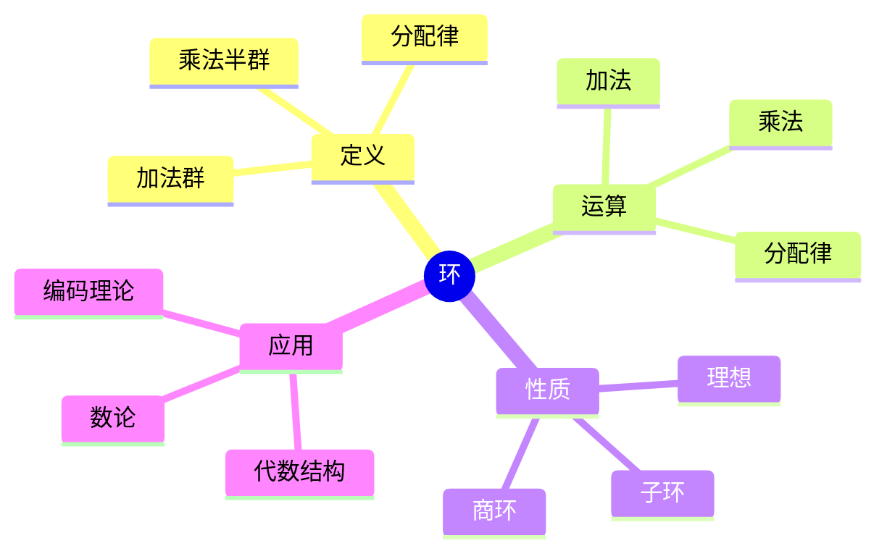
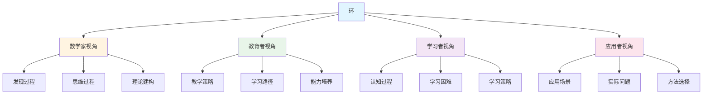
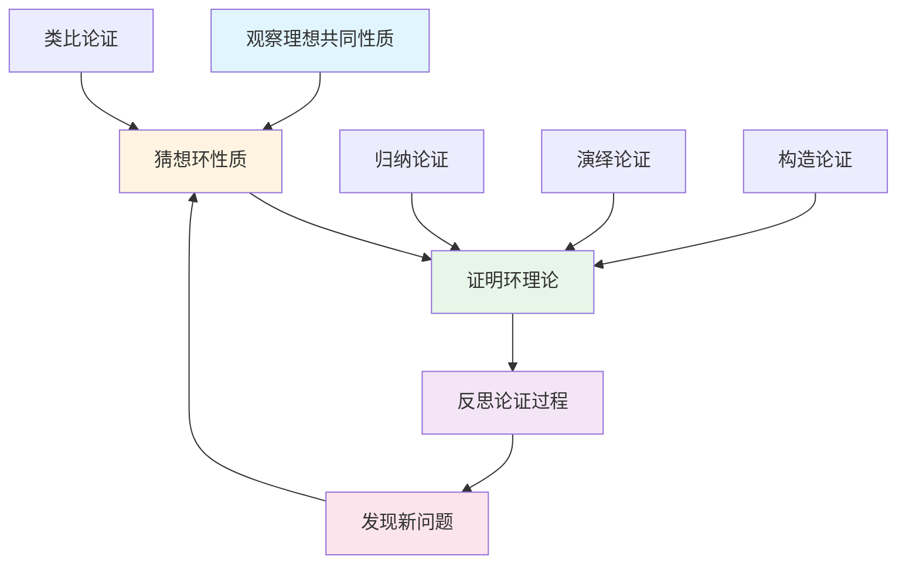
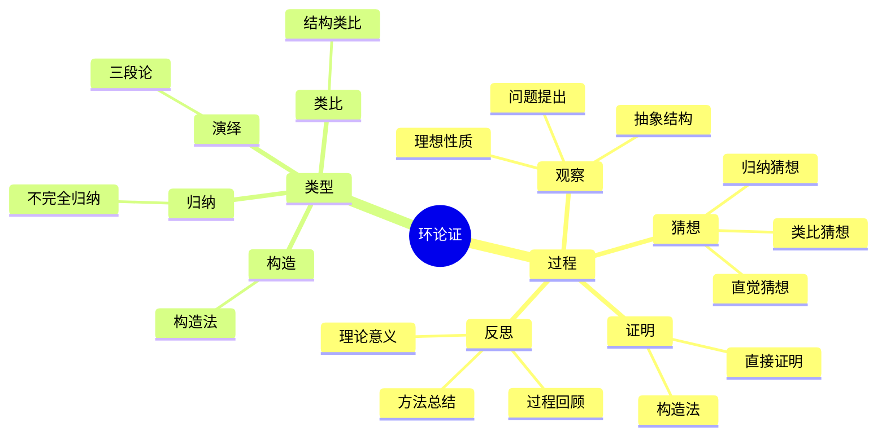

# 环 (Ring) - 三视角组织版

**概念编号**: C.CORE.009
**知识层次**: L0-L2
**知识领域**: D2 (代数)
**创建日期**: 2025年1月
**最后更新**: 2025年1月

---

## 📋 目录 / Table of Contents

- [环 (Ring) - 三视角组织版](#环-ring---三视角组织版)
  - [📋 目录 / Table of Contents](#-目录--table-of-contents)
  - [1. 📋 概述 (编号: C.CORE.009.01)](#1--概述-编号-ccore00901)
  - [🧠 认知学视角：如何理解环 (编号: C.CORE.009.02)](#-认知学视角如何理解环-编号-ccore00902)
    - [认知起点 (编号: C.CORE.009.02.01)](#认知起点-编号-ccore0090201)
    - [认知过程 (编号: C.CORE.009.02.02)](#认知过程-编号-ccore0090202)
      - [阶段1：直观理解阶段 (编号: C.CORE.009.02.02.01)](#阶段1直观理解阶段-编号-ccore009020201)
      - [阶段2：概念形成阶段 (编号: C.CORE.009.02.02.02)](#阶段2概念形成阶段-编号-ccore009020202)
      - [阶段3：形式化阶段 (编号: C.CORE.009.02.02.03)](#阶段3形式化阶段-编号-ccore009020203)
    - [认知障碍 (编号: C.CORE.009.02.03)](#认知障碍-编号-ccore0090203)
    - [认知工具 (编号: C.CORE.009.02.04)](#认知工具-编号-ccore0090204)
  - [🎓 教育学视角：如何教学环 (编号: C.CORE.009.03)](#-教育学视角如何教学环-编号-ccore00903)
    - [教学目标 (编号: C.CORE.009.03.01)](#教学目标-编号-ccore0090301)
    - [教学路径 (编号: C.CORE.009.03.02)](#教学路径-编号-ccore0090302)
      - [阶段1：引入阶段（激发兴趣） (编号: C.CORE.009.03.02.01)](#阶段1引入阶段激发兴趣-编号-ccore009030201)
      - [阶段2：探索阶段（主动建构） (编号: C.CORE.009.03.02.02)](#阶段2探索阶段主动建构-编号-ccore009030202)
      - [阶段3：形式化阶段（抽象概括） (编号: C.CORE.009.03.02.03)](#阶段3形式化阶段抽象概括-编号-ccore009030203)
      - [阶段4：巩固阶段（应用深化） (编号: C.CORE.009.03.02.04)](#阶段4巩固阶段应用深化-编号-ccore009030204)
    - [教学难点 (编号: C.CORE.009.03.03)](#教学难点-编号-ccore0090303)
    - [教学策略 (编号: C.CORE.009.03.04)](#教学策略-编号-ccore0090304)
    - [评估方法 (编号: C.CORE.009.03.05)](#评估方法-编号-ccore0090305)
  - [🔬 数学家视角：如何思考环 (编号: C.CORE.009.04)](#-数学家视角如何思考环-编号-ccore00904)
    - [问题起源 (编号: C.CORE.009.04.01)](#问题起源-编号-ccore0090401)
    - [思维过程 (编号: C.CORE.009.04.02)](#思维过程-编号-ccore0090402)
      - [步骤1：问题提出 (编号: C.CORE.009.04.02.01)](#步骤1问题提出-编号-ccore009040201)
      - [步骤2：概念形成 (编号: C.CORE.009.04.02.02)](#步骤2概念形成-编号-ccore009040202)
      - [步骤3：理论发展 (编号: C.CORE.009.04.02.03)](#步骤3理论发展-编号-ccore009040203)
    - [历史发展 (编号: C.CORE.009.04.03)](#历史发展-编号-ccore0090403)
    - [3.2 关键人物和贡献 (编号: C.CORE.009.04.04)](#32-关键人物和贡献-编号-ccore0090404)
    - [重要定理 (编号: C.CORE.009.04.05)](#重要定理-编号-ccore0090405)
    - [开放问题 (编号: C.CORE.009.04.06)](#开放问题-编号-ccore0090406)
    - [一、第一人称思维描述 (编号: C.CORE.009.04.07)](#一第一人称思维描述-编号-ccore0090407)
      - [1.1 Dedekind的发现过程](#11-dedekind的发现过程)
    - [二、数学直觉的形成 (编号: C.CORE.009.04.08)](#二数学直觉的形成-编号-ccore0090408)
      - [2.1 直觉在概念发现中的作用](#21-直觉在概念发现中的作用)
      - [2.2 如何培养环直觉](#22-如何培养环直觉)
    - [三、数学美的教育价值 (编号: C.CORE.009.04.09)](#三数学美的教育价值-编号-ccore0090409)
      - [3.1 环论的美在哪里](#31-环论的美在哪里)
      - [3.2 如何培养学生的数学美感](#32-如何培养学生的数学美感)
    - [四、问题解决策略 (编号: C.CORE.009.04.10)](#四问题解决策略-编号-ccore0090410)
      - [4.1 数学家的启发式方法](#41-数学家的启发式方法)
      - [4.2 思维过程分析](#42-思维过程分析)
    - [五、批判性反思 (编号: C.CORE.009.04.11)](#五批判性反思-编号-ccore0090411)
      - [5.1 环概念的局限性](#51-环概念的局限性)
      - [5.2 环理论的未解决问题](#52-环理论的未解决问题)
  - [💡 数学解释：为什么环是这样定义的 (编号: C.CORE.009.05)](#-数学解释为什么环是这样定义的-编号-ccore00905)
    - [一、直观解释：环是什么？](#一直观解释环是什么)
      - [1.1 具体例子](#11-具体例子)
      - [1.2 形象类比](#12-形象类比)
      - [1.3 几何直观](#13-几何直观)
      - [1.4 操作体验](#14-操作体验)
    - [二、知性解释：环的本质是什么？](#二知性解释环的本质是什么)
      - [2.1 概念定义](#21-概念定义)
      - [2.2 分类体系](#22-分类体系)
      - [2.3 抽象结构](#23-抽象结构)
      - [2.4 知识体系](#24-知识体系)
    - [三、理性解释：环的公理化定义](#三理性解释环的公理化定义)
      - [3.1 公理体系](#31-公理体系)
      - [3.2 形式化证明](#32-形式化证明)
      - [3.3 系统建构](#33-系统建构)
    - [四、多视角解释：从不同角度理解环](#四多视角解释从不同角度理解环)
      - [4.1 数学家视角：环是如何被发现的？](#41-数学家视角环是如何被发现的)
      - [4.2 教育者视角：如何教学环？](#42-教育者视角如何教学环)
      - [4.3 学习者视角：如何学习环？](#43-学习者视角如何学习环)
      - [4.4 应用者视角：如何应用环？](#44-应用者视角如何应用环)
    - [五、思维表征：用多种方式理解环](#五思维表征用多种方式理解环)
      - [5.1 思维导图：环的知识结构](#51-思维导图环的知识结构)
      - [5.2 矩阵对比：不同解释方式的对比](#52-矩阵对比不同解释方式的对比)
      - [5.3 多视角表征：从不同角度表征环](#53-多视角表征从不同角度表征环)
  - [🔍 数学论证：如何论证环 (编号: C.CORE.009.06)](#-数学论证如何论证环-编号-ccore00906)
    - [一、论证过程：从观察到反思](#一论证过程从观察到反思)
      - [1.1 观察（Observation）](#11-观察observation)
      - [1.2 猜想（Conjecture）](#12-猜想conjecture)
      - [1.3 证明（Proof）](#13-证明proof)
      - [1.4 反思（Reflection）](#14-反思reflection)
    - [二、论证类型：多种推理方式](#二论证类型多种推理方式)
      - [2.1 归纳论证（Inductive Reasoning）](#21-归纳论证inductive-reasoning)
      - [2.2 演绎论证（Deductive Reasoning）](#22-演绎论证deductive-reasoning)
      - [2.3 类比论证（Analogical Reasoning）](#23-类比论证analogical-reasoning)
      - [2.4 构造论证（Constructive Reasoning）](#24-构造论证constructive-reasoning)
    - [三、论证可视化：用图形表示论证过程](#三论证可视化用图形表示论证过程)
      - [3.1 论证流程图](#31-论证流程图)
      - [3.2 论证类型对比](#32-论证类型对比)
      - [3.3 论证思维导图](#33-论证思维导图)
  - [🔗 三视角整合 (编号: C.CORE.009.07)](#-三视角整合-编号-ccore00907)
    - [三个视角的关联](#三个视角的关联)
    - [如何综合运用三个视角](#如何综合运用三个视角)
  - [📚 参考文献 (编号: C.CORE.009.08)](#-参考文献-编号-ccore00908)
    - [权威资源](#权威资源)
    - [经典教材](#经典教材)
    - [研究论文](#研究论文)

---

## 1. 📋 概述 (编号: C.CORE.009.01)

环是代数学中的基本结构，同时配备加法和乘法两种运算。环论在代数数论、代数几何、交换代数等领域有重要应用，是现代代数学的核心分支。

本文档从**数学认知学**、**教育学**、**数学家**三个视角深入展开环概念，避免简单的概念堆垒。

**权威资源对齐**:

- Wikipedia: [Ring (Mathematics)](https://en.wikipedia.org/wiki/Ring_(mathematics))
- Wikipedia: [Ring Theory](https://en.wikipedia.org/wiki/Ring_theory)
- Stanford课程: Math 120 (Groups, Rings, and Fields)
- Princeton课程: MAT 350 (Abstract Algebra)
- MIT课程: 18.701 (Algebra I)
- Metamath: [Ring Theory](http://us.metamath.org/mpeuni/df-ring.html)

---

## 🧠 认知学视角：如何理解环 (编号: C.CORE.009.02)

### 认知起点 (编号: C.CORE.009.02.01)

**学习者已有的知识基础**:

- 群的概念
- 加法和乘法的概念
- 日常经验中的"运算"概念

**日常经验中的类似概念**:

- "整数运算"：加法和乘法
- "矩阵运算"：矩阵加法和乘法
- "多项式运算"：多项式加法和乘法

### 认知过程 (编号: C.CORE.009.02.02)

#### 阶段1：直观理解阶段 (编号: C.CORE.009.02.02.01)

**具体例子**:

- 例子1：$(\mathbb{Z}, +, \cdot)$ - 整数环
- 例子2：$\mathbb{Z}_n$ - 模$n$剩余类环
- 例子3：$\mathbb{Z}[x]$ - 整数系数多项式环

**形象类比**:

- **运算类比**: 环就像"有两种运算的系统"
  - 加法：可以相加
  - 乘法：可以相乘
  - 两种运算通过分配律联系

- **结构类比**: 环就像"群的扩展"
  - 加法构成群
  - 乘法满足结合律
  - 乘法对加法满足分配律

**可视化表示**:

```text
环的结构:
    加法群 (R, +)
         ↓
    乘法半群 (R, ·)
         ↓
    分配律连接
```

#### 阶段2：概念形成阶段 (编号: C.CORE.009.02.02.02)

**从例子中抽象出共同特征**:

- 所有例子都涉及"两种运算"
- 加法构成交换群
- 乘法满足结合律
- 乘法对加法满足分配律

**识别关键属性**:

1. **加法群**: $(R, +)$是交换群
2. **乘法结合律**: $(a \cdot b) \cdot c = a \cdot (b \cdot c)$
3. **分配律**: $a \cdot (b + c) = a \cdot b + a \cdot c$

**建立概念边界**:

- **什么是环**: 满足加法群、乘法结合律、分配律的代数结构
- **什么不是环**:
  - 自然数（加法不构成群）
  - 群（只有一种运算）

#### 阶段3：形式化阶段 (编号: C.CORE.009.02.02.03)

**严格定义**:

- 公理化定义：通过加法群、乘法结合律、分配律三条公理
- 范畴定义：环是Abel群范畴中的幺半群对象

**公理化表述**:

- 公理1：加法群
- 公理2：乘法结合律
- 公理3：分配律

**逻辑结构**:

- 环是群的扩展
- 环是域的基础
- 环是代数结构的重要类型

### 认知障碍 (编号: C.CORE.009.02.03)

**常见误解**:

1. **误解1**: 认为环必须有乘法单位元
   - **纠正**: 环不一定有乘法单位元，有单位元的环是幺环

2. **误解2**: 认为环的乘法必须满足交换律
   - **纠正**: 环的乘法不一定满足交换律，满足交换律的环是交换环

3. **误解3**: 混淆环和域
   - **纠正**: 域是特殊的环，非零元对乘法构成群

**理解难点**:

1. **难点1**: 两种运算的关系
   - **原因**: 需要理解分配律的作用
   - **解决方法**: 用具体例子说明分配律的重要性

2. **难点2**: 环的理想
   - **原因**: 理想是环的子结构，比较抽象
   - **解决方法**: 用具体例子，强调理想的作用

3. **难点3**: 环同态和环同构
   - **原因**: 需要理解环之间的映射
   - **解决方法**: 用具体例子，强调保持运算的重要性

**认知陷阱**:

- **单位元**: 需要理解环不一定有乘法单位元
- **交换律**: 需要理解环的乘法不一定满足交换律

### 认知工具 (编号: C.CORE.009.02.04)

**类比工具**:

- **运算类比**: 环 = 有两种运算的系统
- **结构类比**: 环 = 群的扩展

**可视化工具**:

- **环的结构图**: 用图表示环的结构
- **运算表**: 用表格表示环的运算

**具体化工具**:

- **具体例子**: 用具体例子理解抽象概念
- **反例**: 用反例理解概念边界

---

## 🎓 教育学视角：如何教学环 (编号: C.CORE.009.03)

### 教学目标 (编号: C.CORE.009.03.01)

**知识目标**:

- 理解环的基本概念
- 掌握环的公理化定义
- 理解环的性质
- 理解环的理想

**能力目标**:

- 能够判断一个结构是否是环
- 能够进行环运算
- 能够理解环的结构
- 能够应用环论解决实际问题

**情感目标**:

- 培养数学抽象思维
- 培养代数思维
- 激发对数学的兴趣

### 教学路径 (编号: C.CORE.009.03.02)

#### 阶段1：引入阶段（激发兴趣） (编号: C.CORE.009.03.02.01)

**实际问题**:

- 问题1：如何统一描述整数、多项式、矩阵的运算？
- 问题2：如何研究代数结构？
- 问题3：如何研究代数数论？

**历史背景**:

- 环论的历史发展
- 环论在数学中的地位
- 环论在代数数论中的应用

**引发认知冲突**:

- 问题：如何扩展群的概念？
- 引出环的概念

#### 阶段2：探索阶段（主动建构） (编号: C.CORE.009.03.02.02)

**引导发现**:

1. 让学生自己列举有两种运算的例子
2. 让学生观察这些例子的共同特征
3. 引导学生抽象出环的定义

**合作探究**:

- 小组讨论：什么是环？
- 小组讨论：环有哪些性质？
- 小组讨论：如何表示环？

**多元表征**:

- **语言表征**: "环是满足加法群、乘法结合律、分配律的代数结构"
- **符号表征**: $(R, +, \cdot)$
- **图形表征**: 环的结构图
- **集合表征**: 公理化定义

#### 阶段3：形式化阶段（抽象概括） (编号: C.CORE.009.03.02.03)

**严格定义**:

- 环的公理化定义
- 环的性质
- 环的理想

**性质证明**:

- 环的基本性质
- 理想的性质
- 环同态和环同构

**应用拓展**:

- 环在数学中的应用
- 环在代数数论中的应用
- 环在代数几何中的应用

#### 阶段4：巩固阶段（应用深化） (编号: C.CORE.009.03.02.04)

**练习应用**:

- 基础练习：环的表示和运算
- 应用练习：用环解决实际问题
- 综合练习：环的综合应用

**变式训练**:

- 不同形式的环表示
- 不同性质的环
- 环的理想

**知识整合**:

- 环与其他代数结构的联系
- 环在数学体系中的地位

### 教学难点 (编号: C.CORE.009.03.03)

**难点1：两种运算的关系**:

- **难点描述**: 学生难以理解分配律的作用
- **解决方法**:
  - 用具体例子说明分配律的重要性
  - 强调分配律连接两种运算

**难点2：环的理想**:

- **难点描述**: 学生难以理解理想的概念
- **解决方法**:
  - 用具体例子
  - 强调理想的作用
  - 用图形可视化

**难点3：环同态和环同构**:

- **难点描述**: 学生难以理解环之间的映射
- **解决方法**:
  - 用具体例子
  - 强调保持运算的重要性
  - 用图形可视化

### 教学策略 (编号: C.CORE.009.03.04)

**策略1：从具体到抽象**:

- 先给出具体例子
- 再抽象出一般概念
- 最后给出严格定义

**策略2：多元表征**:

- 用语言、符号、图形等多种方式表示同一概念
- 帮助学生建立不同表征之间的联系

**策略3：问题驱动**:

- 从实际问题出发
- 引出数学概念
- 解决问题

**策略4：可视化教学**:

- 使用环的结构图
- 使用运算表
- 使用具体例子

### 评估方法 (编号: C.CORE.009.03.05)

**形成性评估**（评估理解过程）:

- 课堂提问：检查学生对概念的理解
- 小组讨论：观察学生的思考过程
- 练习作业：检查学生的应用能力

**总结性评估**（评估最终理解）:

- 测验：检查学生对概念和运算的掌握
- 项目：检查学生应用环论解决实际问题的能力
- 反思：检查学生对环概念的理解深度

---

## 🔬 数学家视角：如何思考环 (编号: C.CORE.009.04)

### 问题起源 (编号: C.CORE.009.04.01)

**历史背景**:

- 19世纪：环论的起源
- 20世纪初：环论的系统化
- 20世纪中期：环论的现代发展

**原始问题**:

- **问题1**: 如何统一描述整数、多项式、矩阵的运算？
- **问题2**: 如何研究代数结构？
- **问题3**: 环有哪些性质？

**研究动机**:

- 统一代数结构理论
- 发展代数数论
- 发展代数几何

### 思维过程 (编号: C.CORE.009.04.02)

#### 步骤1：问题提出 (编号: C.CORE.009.04.02.01)

**观察到的现象**:

- 整数、多项式、矩阵都有两种运算
- 这些运算有一些共同的性质
- 需要统一的概念来描述

**提出的猜想**:

- 可以引入环概念
- 环可以统一描述这些结构
- 环有丰富的结构

**需要解决的问题**:

- 如何定义环？
- 环应该满足什么条件？
- 环有哪些性质？

#### 步骤2：概念形成 (编号: C.CORE.009.04.02.02)

**尝试性定义**:

- **公理化定义**: 通过加法群、乘法结合律、分配律
- **范畴定义**: 环是Abel群范畴中的幺半群对象

**性质探索**:

- 环的基本性质
- 环的理想
- 环的同态

**结构发现**:

- 环是群的扩展
- 环是域的基础
- 环是代数结构的重要类型

#### 步骤3：理论发展 (编号: C.CORE.009.04.02.03)

**定理证明**:

- 环的基本性质
- 理想的性质
- 环的分类定理

**应用拓展**:

- 环在数学中的应用
- 环在代数数论中的应用
- 环在代数几何中的应用

**理论完善**:

- 环的公理化
- 环的范畴论研究
- 环的表示论

### 历史发展 (编号: C.CORE.009.04.03)

**早期阶段**（19世纪）:

- **Dedekind (1871)**: 在研究代数数论时引入理想概念
- **Hilbert (1890)**: 研究多项式环

**关键突破**（20世纪初）:

- **Noether (1921)**: 发展交换环理论
- **Artin (1927)**: 研究非交换环

**现代发展**（20世纪中期）:

- **Grothendieck (1950s)**: 发展概形理论
- **Serre (1955)**: 研究局部环

### 3.2 关键人物和贡献 (编号: C.CORE.009.04.04)

**Richard Dedekind (1831-1916)**:

- 在研究代数数论时引入理想概念
- 建立环论的基础

**Emmy Noether (1882-1935)**:

- 发展交换环理论
- 建立现代环论

**Alexander Grothendieck (1928-2014)**:

- 发展概形理论
- 建立现代代数几何

### 重要定理 (编号: C.CORE.009.04.05)

**Hilbert基定理**:

- 多项式环的理想是有限生成的
- 意义：环结构的基本性质

**Noether环的性质**:

- Noether环的理想满足升链条件
- 意义：环分类的基础

### 开放问题 (编号: C.CORE.009.04.06)

**未解决问题**:

- 环的分类问题
- 环的表示问题
- 环的应用问题

**研究方向**:

- 环的范畴论研究
- 环的表示论研究
- 环的应用研究

### 一、第一人称思维描述 (编号: C.CORE.009.04.07)

#### 1.1 Dedekind的发现过程

**详细历史背景**:

- **1871年**：Dedekind发表《代数数论》（Vorlesungen über Zahlentheorie）
- **背景**：研究代数数域的理想，发现理想有共同的性质
- **问题**：如何抽象这些性质？如何统一处理数论和代数？

**Dedekind的详细第一人称描述**:
> "1871年，我在研究代数数域的理想时，遇到了一个问题：如何抽象理想的性质？
>
> 我发现，整数的理想和代数数域的理想有共同的性质：
>
> - **加法封闭**：两个理想的和还是理想
> - **乘法封闭**：两个理想的积还是理想
> - **吸收性质**：理想与环的元素的积还在理想中
>
> 我的发现是：
>
> - **环的概念**：一个集合配备加法和乘法运算，满足某些公理
> - **理想的概念**：环的子集，满足某些性质
> - **统一性**：整数环和代数数域都是环，它们的理想有共同的性质
>
> 例如，对于整数环$\mathbb{Z}$：
>
> - **理想**：$(2) = \{2n : n \in \mathbb{Z}\}$（偶数）
> - **性质**：$(2) + (2) = (2)$，$(2) \cdot (2) = (4)$
> - **吸收**：$2 \cdot (2) = (4) \subseteq (2)$
>
> 对于多项式环$\mathbb{Q}[x]$：
>
> - **理想**：$(x^2 + 1) = \{f(x)(x^2+1) : f(x) \in \mathbb{Q}[x]\}$
> - **性质**：$(x^2+1) + (x^2+1) = (x^2+1)$，$(x^2+1) \cdot (x^2+1) = ((x^2+1)^2)$
> - **吸收**：$x \cdot (x^2+1) = (x^3+x) \subseteq (x^2+1)$
>
> 这让我意识到，环是抽象的理想结构，环的性质决定了理想的性质。这为数论和代数提供了统一的框架。"

**详细的思维过程**:

1. **观察到的现象**（1871年）:

   **现象1：理想有共同的性质**
   - **问题**：整数的理想和代数数域的理想有共同的性质
   - **例子**：$(2)$和$(x^2+1)$都有加法封闭、乘法封闭、吸收性质
   - **需要**：抽象这些性质

   **现象2：这些性质可以抽象**
   - **问题**：如何抽象理想的性质？
   - **思路**：定义环的概念，理想是环的子集
   - **需要**：建立环论

   **现象3：需要统一的概念**
   - **问题**：如何统一处理数论和代数？
   - **思路**：用环论统一
   - **需要**：建立环论的理论体系

2. **提出的猜想**（1871年）:

   **猜想1：用环描述理想的性质**
   - **思路**：定义环的概念，理想是环的子集
   - **例子**：$\mathbb{Z}$和$\mathbb{Q}[x]$都是环
   - **优点**：统一描述理想的性质

   **猜想2：环与数论相关**
   - **关系**：整数环和代数数域都是环
   - **例子**：$\mathbb{Z}$是环，$\mathbb{Q}[\sqrt{2}]$也是环
   - **意义**：用环论统一数论和代数

   **猜想3：环是数学的基础**
   - **性质**：环是抽象的数学结构
   - **应用**：环可以应用到更广泛的领域
   - **意义**：环是统一的数学结构

3. **遇到的困难**（1871年）:

   **困难1：如何严格定义环？**
   - **问题**：如何定义环？
   - **解决**：通过公理定义环（加法群、乘法半群、分配律）
   - **意义**：为环提供严格的数学基础

   **困难2：如何判断环的性质？**
   - **问题**：如何判断环是否可交换？是否有单位元？
   - **解决**：通过环的结构判断
   - **意义**：为环分类提供方法

   **困难3：如何应用环论？**
   - **问题**：如何用环论解决实际问题？
   - **解决**：建立理想理论、商环理论
   - **意义**：为数论和代数提供新视角

4. **突破的时刻**（1871年，Dedekind）:

   **突破1：环的概念**
   - 引入环的概念描述理想的性质
   - **关键**：抽象出环的结构
   - **意义**：为环论提供基础

   **突破2：理想理论**
   - 建立理想理论
   - **关键**：理想是环的子集，满足某些性质
   - **意义**：为数论和代数提供统一框架

   **突破3：环论的广泛应用**
   - 环论可以应用到更广泛的领域
   - **关键**：环是抽象的数学结构
   - **意义**：环论成为数学的基础

### 二、数学直觉的形成 (编号: C.CORE.009.04.08)

#### 2.1 直觉在概念发现中的作用

**Dedekind的直觉**:

- **直觉1**: "环"是"理想的抽象"——这个直觉引导Dedekind发现环论
- **直觉2**: 环可以统一数论和代数——这个直觉引导Dedekind建立环论
- **直觉3**: 环是数学的基础——这个直觉引导Dedekind建立环论

**直觉的验证**:

- 通过严格的数学证明验证直觉的正确性
- 通过公理化严格化环定义
- 通过应用验证环的广泛性

**直觉的深化**:

- 从"理想的抽象"到"环的公理化"
- 从"统一数论和代数"到"环论的广泛应用"
- 从"数学基础"到"环论的深入发展"

#### 2.2 如何培养环直觉

**数学家的建议**:

- **Dedekind**: "环直觉是长期训练的结果。通过大量练习和深入思考，我们可以培养对环的直觉。"
- **Noether**: "从具体例子开始，逐步抽象，这是培养环直觉的有效方法。"

**培养方法**:

1. **大量练习**: 通过大量环运算练习，培养对环的直觉
2. **深入思考**: 深入思考环的本质，理解环的深层结构
3. **类比和联想**: 通过类比和联想，建立环与其他概念的联系
4. **与专家交流**: 与数学家交流，学习他们的思维方式

**教学启示**:

- 从具体例子开始，逐步抽象
- 鼓励学生思考环的本质
- 引导学生建立环与其他概念的联系

### 三、数学美的教育价值 (编号: C.CORE.009.04.09)

#### 3.1 环论的美在哪里

**结构美**:

- **简洁性**: 环的概念非常简洁——"满足加法和乘法公理的集合"
- **统一性**: 环可以统一描述数学中的各种代数结构
- **和谐性**: 环运算满足优美的规律（分配律等）

**数学家的评价**:

- **Dedekind**: "环论的美在于它的统一性。它为我们提供了一个统一的框架来理解数学中的代数结构。"
- **Noether**: "环论的美在于它的抽象性。它是数学的基础，所有代数结构都可以用环来描述。"

#### 3.2 如何培养学生的数学美感

**数学家的建议**:

- **Dedekind**: "展示环论的美感，让学生感受到数学的美。"
- **Noether**: "通过环论的历史和发展，让学生理解数学的美。"

**教学方法**:

1. **展示数学美**:
   - 展示环概念的简洁性和统一性
   - 展示环运算的优美规律
   - 展示环在数学中的基础地位

2. **引导学生欣赏**:
   - 引导学生欣赏环概念的简洁性
   - 引导学生欣赏环运算的和谐性
   - 引导学生欣赏环的基础性

3. **鼓励学生创造美**:
   - 鼓励学生发现环论的美
   - 鼓励学生创造优美的环证明
   - 鼓励学生探索环论的美

### 四、问题解决策略 (编号: C.CORE.009.04.10)

#### 4.1 数学家的启发式方法

**策略1：从具体到抽象**:

- 从具体的环例子开始
- 抽象出环的一般性质
- 建立环的理论体系

**策略2：从简单到复杂**:

- 先理解基本环
- 再理解环运算
- 最后理解环理论

**策略3：从问题到理论**:

- 从实际问题出发
- 引出环概念
- 建立环理论

#### 4.2 思维过程分析

**问题识别**:

- 识别问题类型：环定义问题、环性质问题、环应用问题
- 识别问题难度：简单问题、中等问题、复杂问题

**策略选择**:

- 简单问题：直接方法
- 中等问题：分步方法
- 复杂问题：分解方法

**执行和反思**:

- 执行策略，解决问题
- 反思过程，总结经验
- 改进方法，提高效率

### 五、批判性反思 (编号: C.CORE.009.04.11)

#### 5.1 环概念的局限性

**概念的边界**:

- 环只描述某些代数结构，不能描述所有数学结构
- 环是抽象的，需要具体化才能应用
- 环不能表示所有数学量

**概念的推广**:

- 半环：去掉某些条件
- 代数：更一般的结构
- 范畴：更抽象的结构

#### 5.2 环理论的未解决问题

**未解决的问题**:

- 环的分类问题：如何分类所有环？
- 环的表示问题：如何表示环？
- 环的应用问题：如何更好地应用环？

**研究方向**:

- 环的范畴论研究
- 环的表示论研究
- 环的应用研究

---

## 💡 数学解释：为什么环是这样定义的 (编号: C.CORE.009.05)

### 一、直观解释：环是什么？

#### 1.1 具体例子

**生活中的例子**：

- **整数运算**：整数在加法和乘法下构成环
  - 例如：$(\mathbb{Z}, +, \times)$是环
  - **为什么这样定义**：因为我们需要一个概念来表示"两种运算的结构"
- **多项式运算**：多项式在加法和乘法下构成环
  - 例如：$\mathbb{Z}[x]$（整数系数多项式）是环
  - **为什么这样定义**：因为我们需要一个概念来表示"多项式的运算结构"
- **矩阵运算**：矩阵在加法和乘法下构成环
  - 例如：$M_n(\mathbb{R})$（$n \times n$实矩阵）是环
  - **为什么这样定义**：因为我们需要一个概念来表示"矩阵的运算结构"

**数学中的例子**：

- **整数环**：$(\mathbb{Z}, +, \times)$
  - **为什么这样定义**：我们需要一个概念来表示"整数的运算结构"
- **多项式环**：$\mathbb{Z}[x]$、$\mathbb{R}[x]$
  - **为什么这样定义**：我们需要一个概念来表示"多项式的运算结构"
- **矩阵环**：$M_n(\mathbb{R})$、$M_n(\mathbb{C})$
  - **为什么这样定义**：我们需要一个概念来表示"矩阵的运算结构"

#### 1.2 形象类比

**运算类比**：

- **环就像"两种运算的结构"**
  - 环有两个运算：加法和乘法
  - 加法构成Abel群
  - 乘法满足结合律和分配律
- **为什么这样类比**：这个类比帮助我们理解环的本质

**扩展类比**：

- **环就像"群的扩展"**
  - 环是群的扩展（添加了乘法运算）
  - 环的加法群是Abel群
  - 环的乘法是半群
- **为什么这样类比**：这个类比帮助我们理解环与群的关系

#### 1.3 几何直观

**理想表示**：

- 使用理想表示环的子结构
- 理想是环的子集，在加法和乘法下封闭
- **为什么使用理想**：理想揭示了环的结构

**商环表示**：

- 使用商环表示环的商结构
- 商环是环模理想的结果
- **为什么使用商环**：商环揭示了环的同态结构

#### 1.4 操作体验

**环运算的操作**：

- **加法操作**：$a + b$（环的加法）
  - **为什么这样操作**：因为我们需要一个运算来表示"合并元素"
- **乘法操作**：$a \cdot b$（环的乘法）
  - **为什么这样操作**：因为我们需要一个运算来表示"元素的乘法"
- **分配律操作**：$a(b + c) = ab + ac$（分配律）
  - **为什么这样操作**：因为我们需要连接加法和乘法

### 二、知性解释：环的本质是什么？

#### 2.1 概念定义

**环的内涵**：

- **环是一个集合$R$配备两个二元运算$+$和$\cdot$，满足：**
  - **$(R, +)$是Abel群**
  - **$(R, \cdot)$是半群（满足结合律）**
  - **分配律**：$a(b + c) = ab + ac$，$(a + b)c = ac + bc$
- **为什么这样定义**：这些特征使得环成为一个完整的代数结构，支持两种运算

**环的外延**：

- **交换环**：乘法满足交换律的环
- **非交换环**：乘法不满足交换律的环
- **有单位元环**：乘法有单位元的环
- **整环**：无零因子的交换环
- **为什么这样分类**：不同的环类型有不同的性质和用途

#### 2.2 分类体系

**按乘法性质分类**：

- **交换环**：$ab = ba$
- **非交换环**：存在$a, b$使得$ab \neq ba$
- **为什么这样分类**：交换性是环的重要性质

**按单位元分类**：

- **有单位元环**：存在$1 \in R$使得$1 \cdot a = a \cdot 1 = a$
- **无单位元环**：没有单位元
- **为什么这样分类**：单位元是环的重要特征

#### 2.3 抽象结构

**环的运算结构**：

- **加法运算**：$+ : R \times R \to R$
- **乘法运算**：$\cdot : R \times R \to R$
- **为什么有这些运算**：这些运算使得环具有代数结构

**环的关系结构**：

- **理想关系**：$I \trianglelefteq R$是理想当且仅当$I$是子环且$RI \subseteq I$
- **为什么有这个关系**：这个关系帮助我们研究环的结构

**环的子结构**：

- **子环**：$S \subseteq R$是子环当且仅当$S$在加法和乘法下封闭
- **理想**：$I \trianglelefteq R$是理想当且仅当$I$是子环且$RI \subseteq I$
- **为什么有这些结构**：这些结构是环理论的基础

#### 2.4 知识体系

**环在数学体系中的位置**：

- **扩展地位**：环是群的扩展
  - 群：一种运算
  - 环：两种运算
- **为什么是扩展**：环添加了乘法运算，扩展了群的结构

**环与其他概念的关系**：

- **环与群**：环的加法群是Abel群
- **环与域**：域是特殊的环（每个非零元都有乘法逆元）
- **环与代数**：环是代数的基础
- **为什么有这些关系**：这些关系揭示了环与其他数学概念的内在联系

### 三、理性解释：环的公理化定义

#### 3.1 公理体系

**环的公理化定义**：

- **公理1（加法群）**：$(R, +)$是Abel群
- **公理2（乘法结合律）**：$(ab)c = a(bc)$
- **公理3（分配律）**：$a(b + c) = ab + ac$，$(a + b)c = ac + bc$
- **为什么需要这些公理**：这些公理定义了环的基本结构

**环的范畴论定义**：

- **环是Abel群范畴中的幺半群对象**
- **为什么这样定义**：这个定义将环放在更一般的框架中

#### 3.2 形式化证明

**环运算性质的证明**：

- **分配律的证明**：$a(b + c) = ab + ac$
  - **证明**：使用分配律的定义
  - **为什么这样证明**：利用分配律的定义
- **零元的性质**：$0 \cdot a = a \cdot 0 = 0$
  - **证明**：$0 \cdot a = (0 + 0) \cdot a = 0 \cdot a + 0 \cdot a$，因此$0 \cdot a = 0$
  - **为什么这样证明**：利用零元和分配律

**环关系的证明**：

- **理想的性质**：如果$I$是理想，则$R/I$是环
  - **证明**：使用理想的定义和商环的构造
  - **为什么这样证明**：利用理想的定义

#### 3.3 系统建构

**环论在数学基础中的地位**：

- **作为代数基础**：环是代数结构的基础
- **提供运算结构**：环提供了两种运算的结构
- **统一框架**：环统一了各种代数结构

**环论的发展历史**：

- **Dedekind的引入**（1871年）：在研究代数数论时引入理想概念
- **Noether的发展**（1921年）：发展交换环理论
- **Artin的发展**（1927年）：研究非交换环
- **为什么这样发展**：数学的发展需要严格的基础，环论的发展反映了这一需求

### 四、多视角解释：从不同角度理解环

#### 4.1 数学家视角：环是如何被发现的？

**Dedekind的发现过程**：

- **问题提出**：如何研究代数数？
- **关键洞察**：使用理想研究代数数
- **重要发现**：理想可以统一描述代数结构
- **为什么这样发现**：数学家的直觉和严格证明相结合

**Noether的抽象化过程**：

- **问题识别**：需要抽象化环概念
- **策略选择**：使用公理化定义
- **定义设计**：环是满足公理的代数结构
- **为什么这样设计**：需要统一各种环实例

#### 4.2 教育者视角：如何教学环？

**教学策略**：

- **从具体到抽象**：先学习具体例子，再学习抽象定义
- **从简单到复杂**：先学习交换环，再学习非交换环
- **从直观到形式化**：先使用具体例子等直观工具，再学习形式化定义
- **为什么这样教学**：符合认知规律，帮助学生逐步建立理解

**学习路径**：

- **阶段1**：直观理解（使用具体例子）
- **阶段2**：概念形成（学习环的定义和性质）
- **阶段3**：形式化（学习环的公理化定义）
- **为什么这样设计**：循序渐进，逐步深入

#### 4.3 学习者视角：如何学习环？

**认知过程**：

- **直观阶段**：通过具体例子理解环的含义
- **概念阶段**：理解环的定义和性质
- **形式化阶段**：理解环的公理化定义
- **为什么这样学习**：符合认知发展规律

**学习困难**：

- **困难1**：理解"两种运算"的概念
- **困难2**：理解"理想"的概念
- **困难3**：理解"商环"的概念
- **如何克服**：通过具体例子、类比、历史背景等方式帮助理解

#### 4.4 应用者视角：如何应用环？

**应用场景**：

- **数学**：使用环研究代数结构和数论
- **编码理论**：使用环设计纠错码
- **密码学**：使用环设计密码系统
- **为什么这样应用**：环提供了强大的工具来处理各种问题

**应用方法**：

- **建立模型**：将实际问题转化为环问题
- **使用理论**：使用环论解决问题
- **验证结果**：验证结果的正确性
- **为什么这样应用**：环论提供了强大的工具来解决实际问题

### 五、思维表征：用多种方式理解环

#### 5.1 思维导图：环的知识结构



#### 5.2 矩阵对比：不同解释方式的对比

| 解释方式 | 特点 | 方法 | 工具 | 适用阶段 | 优势 | 局限 |
|---------|------|------|------|---------|------|------|
| **直观解释** | 具体、形象、可视 | 例子、类比、直观 | 具体例子、图形 | 入门阶段 | 易于理解 | 不够严格 |
| **知性解释** | 概念、分类、抽象 | 定义、分类、结构 | 概念图、知识图谱 | 中级阶段 | 系统完整 | 不够直观 |
| **理性解释** | 公理、证明、形式化 | 公理、证明、系统 | 形式化工具、证明系统 | 高级阶段 | 严格准确 | 不够具体 |
| **多视角解释** | 多角度、整合 | 多视角、整合 | 多视角工具 | 所有阶段 | 全面深入 | 可能复杂 |

#### 5.3 多视角表征：从不同角度表征环



---

## 🔍 数学论证：如何论证环 (编号: C.CORE.009.06)

### 一、论证过程：从观察到反思

#### 1.1 观察（Observation）

**具体现象观察**：

- **现象1**：理想有共同的性质
  - 例如：整数的理想$(2)$和多项式环的理想$(x^2+1)$都有加法封闭、乘法封闭、吸收性质
  - **为什么重要**：这个现象揭示了环作为理想结构抽象的必要性
- **现象2**：这些性质可以抽象
  - 例如：整数环$\mathbb{Z}$和多项式环$\mathbb{Q}[x]$都满足环公理
  - **为什么重要**：这个现象揭示了环的统一性

**模式识别**：

- **模式1**：环的公理结构
  - 例如：加法群、乘法结合律、分配律三个公理可以刻画理想结构
  - **为什么重要**：这个模式可能反映了环的本质
- **模式2**：理想的性质
  - 例如：理想是子群且满足吸收性质
  - **为什么重要**：这个模式可能反映了环的结构

**问题提出**：

- **问题1**：如何严格定义环，统一不同的代数结构？
  - **为什么提出**：这个问题可能揭示环的本质和基础
- **问题2**：如何证明Hilbert基定理？
  - **为什么提出**：这个问题可能揭示环的结构性质

#### 1.2 猜想（Conjecture）

**归纳猜想**：

- **猜想1**：环是研究理想的统一工具
  - **依据**：观察不同代数结构都满足环公理
  - **为什么提出**：这个猜想可能揭示环的统一性
- **猜想2**：Noether环的理想升链条件
  - **依据**：观察具体环的理想升链
  - **为什么提出**：这个猜想可能揭示环的结构性质

**类比猜想**：

- **猜想1**：环类似于"有两个运算的群"
  - **类比对象**：群（一个运算）
  - **为什么提出**：这个类比可能揭示环的本质
- **猜想2**：理想的构造类似于"子群加吸收"
  - **类比对象**：子群（一个运算）
  - **为什么提出**：这个类比可能揭示理想的构造方法

**直觉猜想**：

- **猜想1**：环是"最自然"的理想结构
  - **直觉来源**：环的直观
  - **为什么提出**：这个直觉可能揭示环的基础地位
- **猜想2**：环有"最小"的公理结构
  - **直觉来源**：环的公理结构
  - **为什么提出**：这个直觉可能揭示环的本质

#### 1.3 证明（Proof）

**直接证明**：

- **证明1**：Hilbert基定理
  - **证明思路**：使用Noether环的性质
  - **关键步骤**：证明Noether环上的多项式环也是Noether环
  - **为什么这样证明**：这个证明方法直接、清晰
- **证明2**：第一同构定理（环）
  - **证明思路**：构造环同态诱导的商环同构
  - **关键步骤**：定义映射$\bar{\phi}: R/\ker(\phi) \to \text{im}(\phi)$，证明是同构
  - **为什么这样证明**：这个证明方法直接、清晰

**构造法**：

- **构造法**：构造环作为Abel群的自同态环
  - **构造方法**：定义环为Abel群的自同态集合，配备加法和复合
  - **验证**：验证构造的环满足环公理
  - **为什么这样证明**：构造法适合证明存在性命题

#### 1.4 反思（Reflection）

**过程回顾**：

- **论证回顾**：从观察理想有共同的性质，到猜想环的性质，再到严格证明
  - **成功之处**：成功建立了环的严格理论
  - **不足之处**：环概念需要进一步推广
  - **改进方向**：推广到域、代数、范畴等

**方法总结**：

- **证明方法**：使用了直接证明、构造法
  - **方法特点**：直接证明清晰，构造法明确
  - **适用范围**：不同方法适用于不同类型的命题
- **证明技巧**：使用理想的性质、商环、环同态
  - **技巧要点**：将环问题转化为群问题，使用构造法处理存在性问题
  - **应用场景**：这些技巧可以应用于其他环论问题

**理论意义**：

- **理论贡献**：建立了环的严格理论，揭示了环的理想结构
  - **为什么重要**：这个论证揭示了代数学的基础结构
- **应用价值**：环为代数学、数论、几何学提供了基础
  - **为什么重要**：这个论证可以应用于所有代数问题

### 二、论证类型：多种推理方式

#### 2.1 归纳论证（Inductive Reasoning）

**不完全归纳**：

- **例子1**：从具体环的理想性质归纳一般规律
  - **观察**：观察$\mathbb{Z}$和$\mathbb{Q}[x]$的理想都有共同性质
  - **结论**：环的理想有共同的性质
  - **局限性**：不完全归纳的结论需要严格证明

#### 2.2 演绎论证（Deductive Reasoning）

**三段论**：

- **例子1**：证明环的性质
  - **大前提**：所有环都有零元
  - **小前提**：$\mathbb{Z}$是环
  - **结论**：$\mathbb{Z}$有零元$0$
  - **为什么有效**：三段论是严格的演绎推理

#### 2.3 类比论证（Analogical Reasoning）

**结构类比**：

- **例子1**：环与群的类比
  - **类比对象**：群
  - **相似性**：环的加法构成群，环有两个运算
  - **结论**：环可以理解为"有两个运算的群"
  - **局限性**：类比不能替代严格证明

#### 2.4 构造论证（Constructive Reasoning）

**构造法**：

- **例子1**：构造环作为Abel群的自同态环
  - **构造方法**：定义环为Abel群的自同态集合
  - **验证**：验证构造的环满足环公理
  - **为什么有效**：构造法是严格的直接证明

### 三、论证可视化：用图形表示论证过程

#### 3.1 论证流程图



#### 3.2 论证类型对比

| 论证类型 | 特点 | 适用场景 | 优势 | 局限 |
|---------|------|---------|------|------|
| **归纳论证** | 从特殊到一般 | 发现规律、提出猜想 | 启发性强 | 结论或然 |
| **演绎论证** | 从一般到特殊 | 严格证明、逻辑推理 | 结论必然 | 需要前提 |
| **类比论证** | 基于相似性 | 启发思路、发现联系 | 创造性高 | 结论或然 |
| **构造论证** | 直接构造 | 证明存在性命题 | 直接明确 | 需要构造 |

#### 3.3 论证思维导图



---

## 🔗 三视角整合 (编号: C.CORE.009.07)

### 三个视角的关联

**认知学视角 ↔ 教育学视角**:

- 认知学视角揭示的理解机制，指导教育学视角的教学设计
- 教育学视角的教学实践，验证认知学视角的理论

**认知学视角 ↔ 数学家视角**:

- 数学家视角的思维过程，启发认知学视角的认知路径
- 认知学视角的认知障碍，解释数学家视角的历史困难

**教育学视角 ↔ 数学家视角**:

- 数学家视角的历史发展，为教育学视角提供教学素材
- 教育学视角的教学策略，帮助学习者理解数学家视角的思维过程

### 如何综合运用三个视角

**学习建议**:

1. **从认知学视角开始**: 先建立直观理解
2. **用教育学视角深化**: 通过教学路径系统学习
3. **用数学家视角升华**: 理解概念的深层意义和历史背景

**教学建议**:

1. **引入阶段**: 用数学家视角的问题起源激发兴趣
2. **探索阶段**: 用认知学视角的认知过程引导发现
3. **形式化阶段**: 用教育学视角的教学策略系统教学
4. **巩固阶段**: 综合三个视角深化理解

---

## 📚 参考文献 (编号: C.CORE.009.08)

### 权威资源

- Wikipedia: [Ring (Mathematics)](https://en.wikipedia.org/wiki/Ring_(mathematics))
- Wikipedia: [Ring Theory](https://en.wikipedia.org/wiki/Ring_theory)
- Metamath: [Ring Theory](http://us.metamath.org/mpeuni/df-ring.html)

### 经典教材

- Atiyah, M. F., & Macdonald, I. G. (1969). *Introduction to Commutative Algebra*. Addison-Wesley.
- Lang, S. (2002). *Algebra*. Springer.

### 研究论文

- Dedekind, R. (1871). "Über die Theorie der ganzen algebraischen Zahlen". *Journal für die reine und angewandte Mathematik*.
- Noether, E. (1921). "Idealtheorie in Ringbereichen". *Mathematische Annalen*.

---

**创建日期**: 2025年1月
**最后更新**: 2025年1月
**维护状态**: 持续更新中
