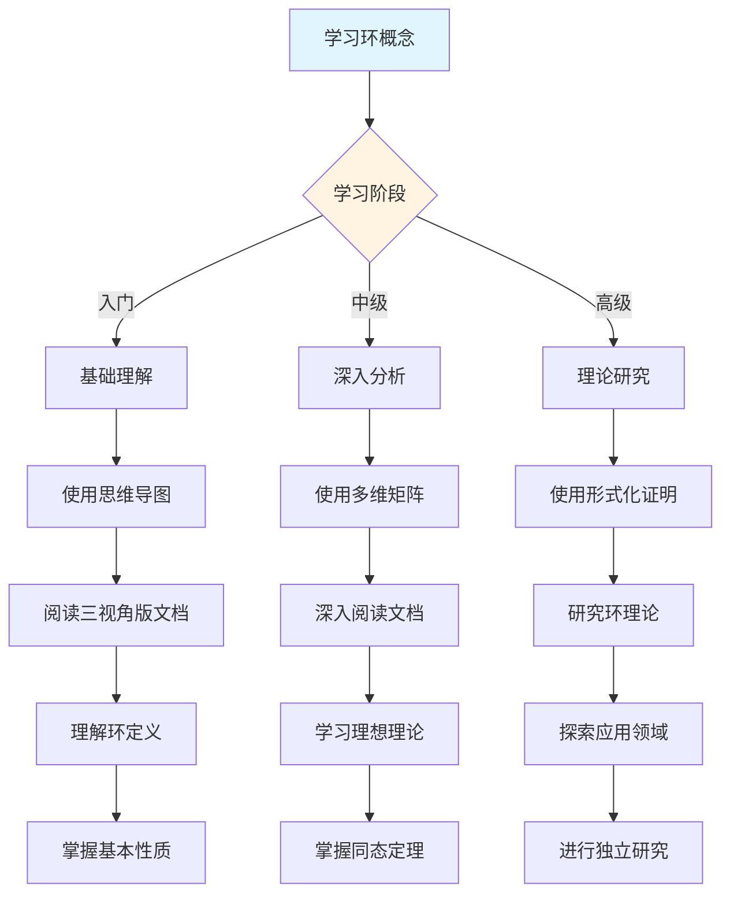
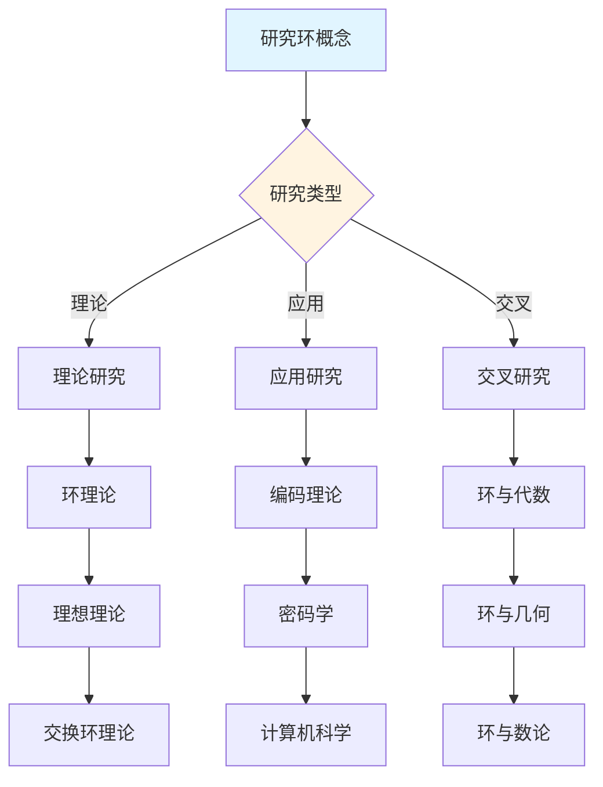
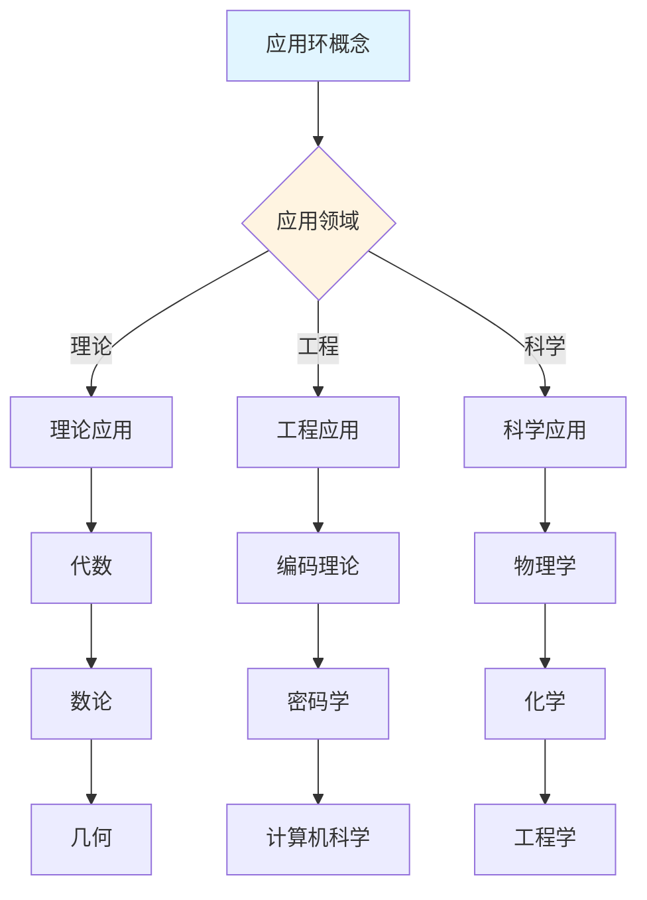
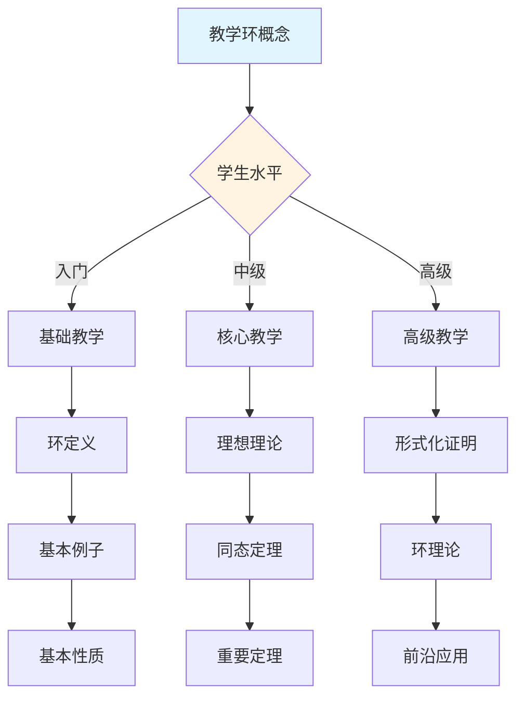

# 环概念决策导图示例

**主题编号**: C.CORE.009.DECISION
**创建日期**: 2025年1月
**最后更新**: 2025年1月
**关联概念**: [环-三视角版](./09-环-三视角版.md)

---

## 📋 概述

本文档提供环概念的详细决策导图示例，展示如何将[决策思维导图体系](../01-总体思维导图/05-决策思维导图体系.md)应用于环概念的学习、研究、应用和教学。

**目标**：为环概念提供完整的决策支持，包括：

- 学习决策导图
- 研究决策导图
- 应用决策导图
- 教学决策导图

---

## 🎓 一、学习决策导图 (编号: C.CORE.009.DECISION.01)

### 1.1 学习路径决策

### 1.2 学习重点决策

**基于知识矩阵的学习重点**：

| 学习阶段 | 知识层次 | 学习重点 | 推荐资源 |
|---------|---------|---------|---------|
| **入门** | L0基础 | 环的定义、基本例子 | 思维导图、三视角版文档 |
| **入门** | L0基础 | 环的直观理解（加法和乘法） | 三视角版文档、应用实例 |
| **中级** | L1中级 | 理想理论 | 多维矩阵、形式化证明 |
| **中级** | L1中级 | 同态和同构 | 三视角版文档、习题库 |
| **高级** | L2高级 | 环的分类理论 | 形式化证明系统 |
| **高级** | L2高级 | 交换环理论 | 形式化证明系统 |

### 1.3 学习方法决策

**基于认知维度的学习方法**：

1. **直观维度**（入门阶段）
   - 使用思维导图建立总体框架
   - 使用具体例子理解概念（整数环、多项式环、矩阵环）
   - 使用几何直观理解环

2. **知性维度**（中级阶段）
   - 使用多维矩阵分析概念特征
   - 使用概念分类系统理解（交换环vs非交换环、整环vs域）
   - 使用关系分析建立联系（与群、域、向量空间的关系）

3. **理性维度**（高级阶段）
   - 使用形式化证明严格理解
   - 使用逻辑推理深入分析
   - 使用系统建构整体把握

---

## 🔬 二、研究决策导图 (编号: C.CORE.009.DECISION.02)

### 2.1 研究方向决策

### 2.2 研究问题决策

**基于知识矩阵的研究问题**：

1. **理论研究问题**
   - 环理论：环的分类和性质
   - 理想理论：理想的结构和性质
   - 交换环理论：交换环的分类

2. **应用研究问题**
   - 编码理论：环在编码理论中的应用（循环码）
   - 密码学：环在密码学中的应用（多项式环加密）
   - 计算机科学：环在计算机科学中的应用

3. **交叉研究问题**
   - 环与代数：环的代数结构
   - 环与几何：环的几何性质
   - 环与数论：环的数论性质

### 2.3 研究方法决策

**基于形式化证明的研究方法**：

1. **构造性证明** → 环的构造
   - 直接构造环
   - 适用于具体环

2. **同态方法** → 同态定理
   - 使用同态方法
   - 适用于环的同态

3. **理想方法** → 理想理论
   - 使用理想方法
   - 适用于理想的结构

---

## 💼 三、应用决策导图 (编号: C.CORE.009.DECISION.03)

### 3.1 应用场景决策

### 3.2 应用方法决策

**基于应用场景的应用方法**：

1. **理论应用** → 使用形式化证明
   - 代数：环是代数的基础
   - 数论：环在数论中的应用
   - 几何：环在几何中的应用

2. **工程应用** → 使用论证过程
   - 编码理论：环在编码理论中的应用（循环码）
   - 密码学：环在密码学中的应用（多项式环加密）
   - 计算机科学：环在计算机科学中的应用

3. **科学应用** → 使用综合方法
   - 物理学：环在物理中的应用
   - 化学：环在化学中的应用
   - 工程学：环在工程中的应用

---

## 🎓 四、教学决策导图 (编号: C.CORE.009.DECISION.04)

### 4.1 教学内容决策

### 4.2 教学方法决策

**基于认知维度的教学方法**：

1. **直观维度**（入门教学）
   - 使用思维导图建立框架
   - 使用具体例子（整数环、多项式环、矩阵环）
   - 使用几何直观理解

2. **知性维度**（中级教学）
   - 使用多维矩阵深入分析
   - 使用概念分类系统
   - 使用关系分析建立联系

3. **理性维度**（高级教学）
   - 使用形式化证明严格理解
   - 使用逻辑推理深入分析
   - 使用系统建构整体把握

---

## 🔄 五、整合应用示例 (编号: C.CORE.009.DECISION.05)

### 5.1 完整学习流程示例

**阶段1：入门理解**

1. 使用学习决策导图 → 确定学习路径：基础概念 → 环定义 → 基本性质 → 基本应用
2. 使用总体思维导图 → 了解环在代数结构中的位置
3. 阅读[环-三视角版](./09-环-三视角版.md) → 理解环的定义和基本性质
4. 使用论证过程 → 理解环的直观意义（加法和乘法、扩展）

**阶段2：深入分析**

1. 使用多维矩阵 → 分析环的多维度特征（知识层次L1中级层、知识领域D2代数、学习难度中等偏难）
2. 阅读[环-三视角版](./09-环-三视角版.md) → 深入理解理想理论和同态定理
3. 使用形式化证明 → 学习第一同构定理的形式化证明
4. 使用分支关联思维导图 → 了解环与群、域、向量空间的关系

**阶段3：应用研究**

1. 使用研究决策导图 → 确定研究方向：环理论
2. 使用知识关联网络 → 发现环与代数、几何、数论的关系
3. 使用形式化证明系统 → 构建环理论体系
4. 阅读[环-三视角版](./09-环-三视角版.md) → 了解环的历史发展和开放问题

---

## 🔗 六、关联文档 (编号: C.CORE.009.DECISION.06)

### 6.1 核心概念文档

- [环-三视角版](./09-环-三视角版.md)
- [环](./09-环.md)

### 6.2 框架文档

- [决策思维导图体系](../01-总体思维导图/05-决策思维导图体系.md)
- [概念体系全面梳理与推进计划](../00-概念体系全面梳理与推进计划-2025年1月.md)
- [核心概念与新框架整合指南](../00-核心概念与新框架整合指南-2025年1月.md)

### 6.3 相关文档

- [核心概念索引](./00-核心概念索引.md)
- [知识矩阵总览](../02-知识矩阵/00-知识矩阵总览.md)
- [形式化证明系统](../00-形式化证明系统-2025年11月.md)

---

**创建日期**: 2025年1月
**最后更新**: 2025年1月
**维护状态**: 持续更新中
