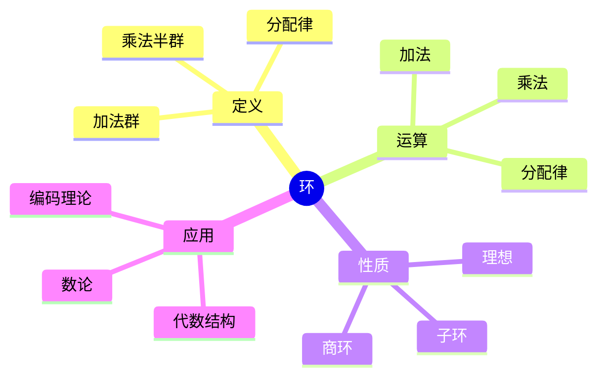
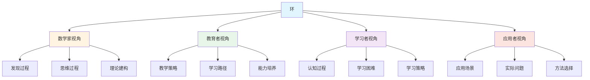
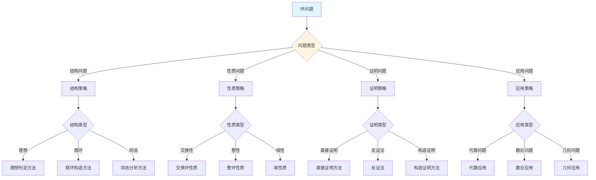
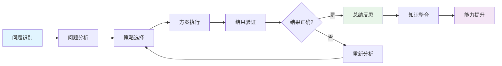
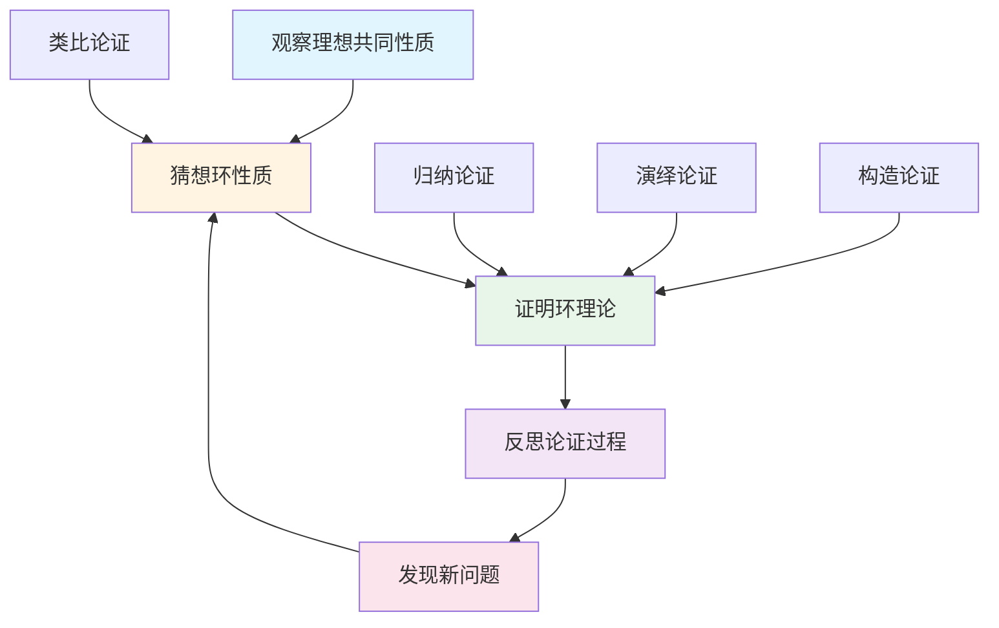
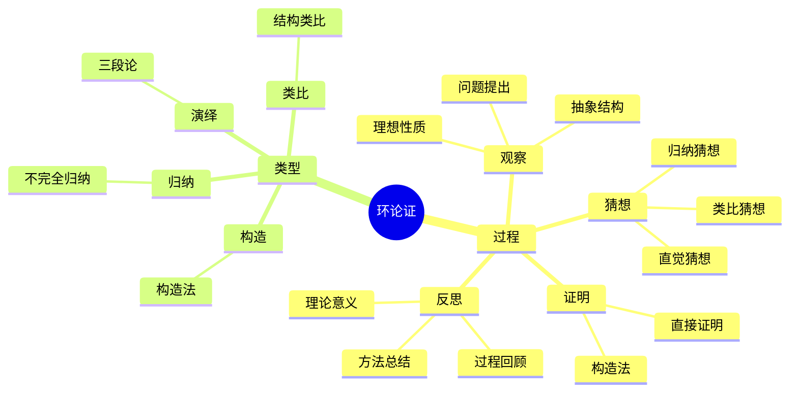
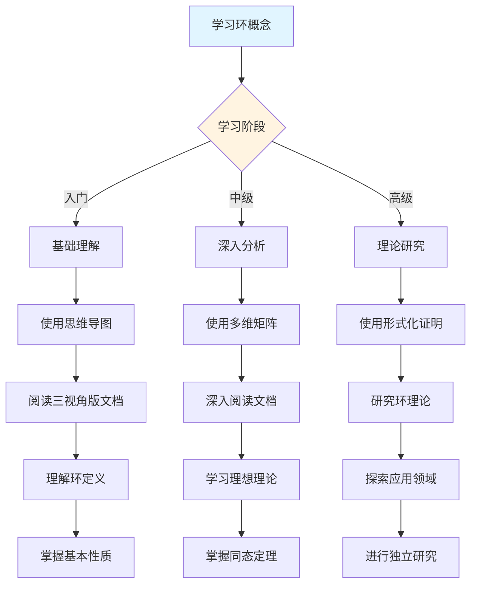
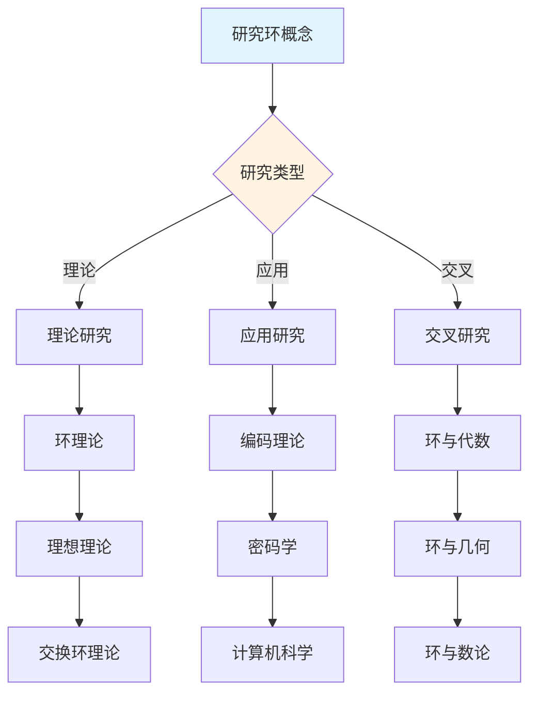
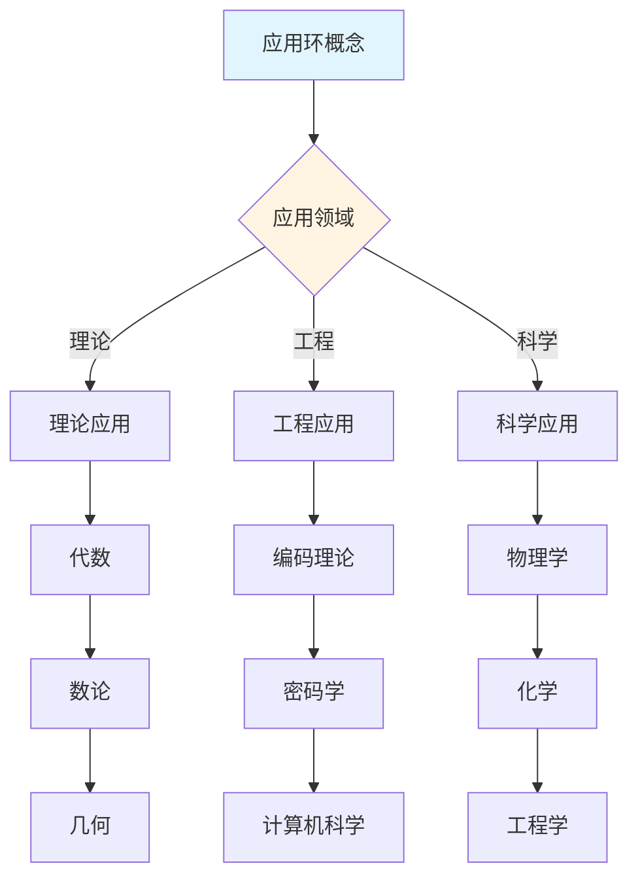
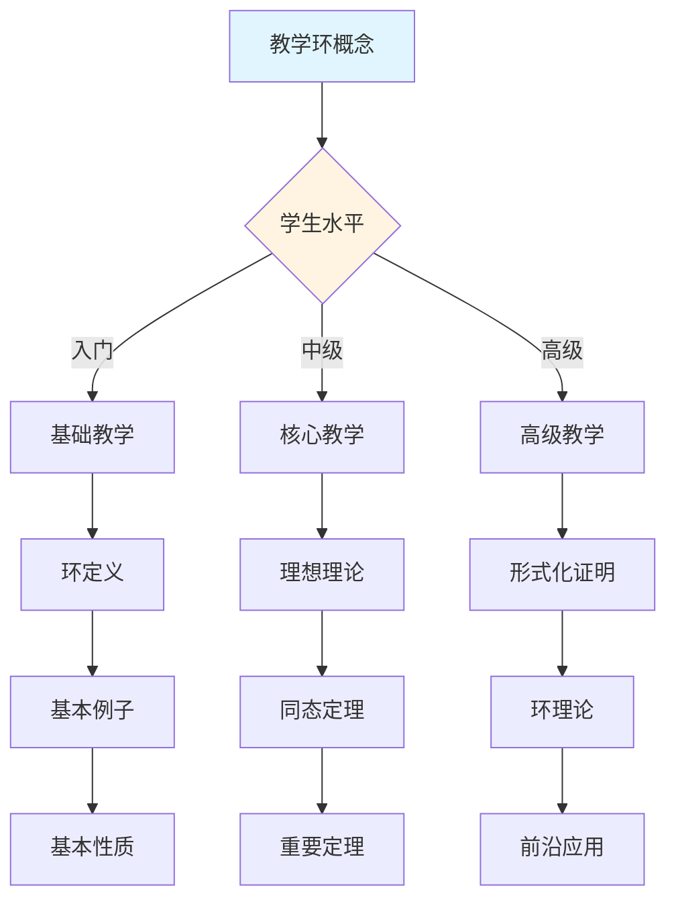

---
msc_primary: "00A99"
---

# 环 (Ring) - 三视角组织版

**概念编号**: C.CORE.009
**知识层次**: L0-L2
**知识领域**: D2 (代数)
**创建日期**: 2025年1月
**最后更新**: 2026-04-05

---

## 📋 目录 / Table of Contents

- [环 (Ring) - 三视角组织版](#环-ring---三视角组织版)
  - 📋 目录 / Table of Contents
  - 1. 📋 概述 (编号: C.CORE.009.01)
  - [🧠 认知学视角：如何理解环 (编号: C.CORE.009.02)](#认知学视角如何理解环-编号-ccore00902)
    - [认知起点 (编号: C.CORE.009.02.01)](#认知起点-编号-ccore0090201)
    - [认知过程 (编号: C.CORE.009.02.02)](#认知过程-编号-ccore0090202)
      - [阶段1：直观理解阶段 (编号: C.CORE.009.02.02.01)](#阶段1直观理解阶段-编号-ccore009020201)
      - [阶段2：概念形成阶段 (编号: C.CORE.009.02.02.02)](#阶段2概念形成阶段-编号-ccore009020202)
      - [阶段3：形式化阶段 (编号: C.CORE.009.02.02.03)](#阶段3形式化阶段-编号-ccore009020203)

## 形式化定义

**定义（环）**：环是一个有序三元组 $(R, +, \cdot)$，其中 $R$ 是非空集合，$+$ 和 $\cdot$ 是二元运算，满足：

1. $(R, +)$ 是**交换群**
2. $(R, \cdot)$ 是**半群**（满足结合律）
3. **分配律**：$a \cdot (b + c) = a \cdot b + a \cdot c$ 且 $(a + b) \cdot c = a \cdot c + b \cdot c$

**特殊类型**：
- **交换环**：乘法满足交换律
- **含幺环**：乘法有单位元 $1$
- **整环**：无零因子的交换含幺环
- **域**：非零元都有乘法逆元的交换含幺环

**符号说明**：
- $0_R$：加法单位元（零元）
- $1_R$：乘法单位元（单位元）
- $-a$：加法逆元
- $a^{-1}$：乘法逆元（若存在）
- $R^\times$：可逆元群（单位群）

    - [认知障碍 (编号: C.CORE.009.02.03)](#认知障碍-编号-ccore0090203)
    - [认知工具 (编号: C.CORE.009.02.04)](#认知工具-编号-ccore0090204)
  - [🎓 教育学视角：如何教学环 (编号: C.CORE.009.03)](#教育学视角如何教学环-编号-ccore00903)
    - [教学目标 (编号: C.CORE.009.03.01)](#教学目标-编号-ccore0090301)
    - [教学路径 (编号: C.CORE.009.03.02)](#教学路径-编号-ccore0090302)
      - [阶段1：引入阶段（激发兴趣） (编号: C.CORE.009.03.02.01)](#阶段1引入阶段激发兴趣-编号-ccore009030201)
      - [阶段2：探索阶段（主动建构） (编号: C.CORE.009.03.02.02)](#阶段2探索阶段主动建构-编号-ccore009030202)
      - [阶段3：形式化阶段（抽象概括） (编号: C.CORE.009.03.02.03)](#阶段3形式化阶段抽象概括-编号-ccore009030203)
      - [阶段4：巩固阶段（应用深化） (编号: C.CORE.009.03.02.04)](#阶段4巩固阶段应用深化-编号-ccore009030204)
    - [教学难点 (编号: C.CORE.009.03.03)](#教学难点-编号-ccore0090303)
    - [教学策略 (编号: C.CORE.009.03.04)](#教学策略-编号-ccore0090304)
    - [评估方法 (编号: C.CORE.009.03.05)](#评估方法-编号-ccore0090305)
  - [🔬 数学家视角：如何思考环 (编号: C.CORE.009.04)](#数学家视角如何思考环-编号-ccore00904)
    - [问题起源 (编号: C.CORE.009.04.01)](#问题起源-编号-ccore0090401)
    - [思维过程 (编号: C.CORE.009.04.02)](#思维过程-编号-ccore0090402)
      - [步骤1：问题提出 (编号: C.CORE.009.04.02.01)](#步骤1问题提出-编号-ccore009040201)
      - [步骤2：概念形成 (编号: C.CORE.009.04.02.02)](#步骤2概念形成-编号-ccore009040202)
      - [步骤3：理论发展 (编号: C.CORE.009.04.02.03)](#步骤3理论发展-编号-ccore009040203)
    - [历史发展 (编号: C.CORE.009.04.03)](#历史发展-编号-ccore0090403)
    - [3.2 关键人物和贡献 (编号: C.CORE.009.04.04)](#32-关键人物和贡献-编号-ccore0090404)
    - [重要定理 (编号: C.CORE.009.04.05)](#重要定理-编号-ccore0090405)
    - [开放问题 (编号: C.CORE.009.04.06)](#开放问题-编号-ccore0090406)
    - [一、第一人称思维描述 (编号: C.CORE.009.04.07)](#一第一人称思维描述-编号-ccore0090407)
      - [1.1 Dedekind的发现过程](#11-dedekind的发现过程)
    - [二、数学直觉的形成 (编号: C.CORE.009.04.08)](#二数学直觉的形成-编号-ccore0090408)
      - [2.1 直觉在概念发现中的作用](#21-直觉在概念发现中的作用)
      - [2.2 如何培养环直觉](#22-如何培养环直觉)
    - [三、数学美的教育价值 (编号: C.CORE.009.04.09)](#三数学美的教育价值-编号-ccore0090409)
      - [3.1 环论的美在哪里](#31-环论的美在哪里)
      - [3.2 如何培养学生的数学美感](#32-如何培养学生的数学美感)
    - [四、问题解决策略 (编号: C.CORE.009.04.10)](#四问题解决策略-编号-ccore0090410)
      - [4.1 数学家的启发式方法](#41-数学家的启发式方法)
      - [4.2 思维过程分析](#42-思维过程分析)
    - [五、批判性反思 (编号: C.CORE.009.04.11)](#五批判性反思-编号-ccore0090411)
      - [5.1 环概念的局限性](#51-环概念的局限性)
      - [5.2 环理论的未解决问题](#52-环理论的未解决问题)
  - [💡 数学解释：为什么环是这样定义的 (编号: C.CORE.009.05)](#数学解释为什么环是这样定义的-编号-ccore00905)
    - [一、直观解释：环是什么？](#一直观解释环是什么)
      - [1.1 具体例子](#11-具体例子)
      - [1.2 形象类比](#12-形象类比)
      - [1.3 几何直观](#13-几何直观)
      - [1.4 操作体验](#14-操作体验)
    - [二、知性解释：环的本质是什么？](#二知性解释环的本质是什么)
      - [2.1 概念定义](#21-概念定义)
      - [2.2 分类体系](#22-分类体系)
      - [2.3 抽象结构](#23-抽象结构)
      - [2.4 知识体系](#24-知识体系)
    - [三、理性解释：环的公理化定义](#三理性解释环的公理化定义)
      - [3.1 公理体系](#31-公理体系)
      - [3.2 形式化证明](#32-形式化证明)
      - [3.3 系统建构](#33-系统建构)
    - [四、多视角解释：从不同角度理解环](#四多视角解释从不同角度理解环)
      - [4.1 数学家视角：环是如何被发现的？](#41-数学家视角环是如何被发现的)
      - [4.2 教育者视角：如何教学环？](#42-教育者视角如何教学环)
      - [4.3 学习者视角：如何学习环？](#43-学习者视角如何学习环)
      - [4.4 应用者视角：如何应用环？](#44-应用者视角如何应用环)
    - [五、思维表征：用多种方式理解环](#五思维表征用多种方式理解环)
      - [5.1 思维导图：环的知识结构](#51-思维导图环的知识结构)
      - [5.2 矩阵对比：不同解释方式的对比](#52-矩阵对比不同解释方式的对比)
      - [5.3 多视角表征：从不同角度表征环](#53-多视角表征从不同角度表征环)
      - [5.4 决策树：环问题分类和策略选择](#54-决策树环问题分类和策略选择)
      - [5.5 决策逻辑路径：环问题解决过程](#55-决策逻辑路径环问题解决过程)
      - [5.6 多维对比矩阵：环概念特征对比](#56-多维对比矩阵环概念特征对比)
  - [🔍 数学论证：如何论证环 (编号: C.CORE.009.06)](#数学论证如何论证环-编号-ccore00906)
    - [一、论证过程：从观察到反思](#一论证过程从观察到反思)
      - [1.1 观察（Observation）](#11-观察observation)
      - [1.2 猜想（Conjecture）](#12-猜想conjecture)
      - [1.3 证明（Proof）](#13-证明proof)
      - [1.4 反思（Reflection）](#14-反思reflection)
    - [二、论证类型：多种推理方式](#二论证类型多种推理方式)
      - [2.1 归纳论证（Inductive Reasoning）](#21-归纳论证inductive-reasoning)
      - [2.2 演绎论证（Deductive Reasoning）](#22-演绎论证deductive-reasoning)
      - [2.3 类比论证（Analogical Reasoning）](#23-类比论证analogical-reasoning)
      - [2.4 构造论证（Constructive Reasoning）](#24-构造论证constructive-reasoning)
    - [三、论证可视化：用图形表示论证过程](#三论证可视化用图形表示论证过程)
      - [3.1 论证流程图](#31-论证流程图)
      - [3.2 论证类型对比](#32-论证类型对比)
      - [3.3 论证思维导图](#33-论证思维导图)
  - [🔗 三视角整合 (编号: C.CORE.009.07)](#三视角整合-编号-ccore00907)
    - [三个视角的关联](#三个视角的关联)
    - [如何综合运用三个视角](#如何综合运用三个视角)
  - [📚 参考文献 (编号: C.CORE.009.08)](#参考文献-编号-ccore00908)
    - [权威资源](#权威资源)
    - [经典教材](#经典教材)
    - [研究论文](#研究论文)

---

## 1. 📋 概述 (编号: C.CORE.009.01)

环是代数学中的基本结构，同时配备加法和乘法两种运算。环论在代数数论、代数几何、交换代数等领域有重要应用，是现代代数学的核心分支。

本文档从**数学认知学**、**教育学**、**数学家**三个视角深入展开环概念，避免简单的概念堆垒。

**权威资源对齐**:

- Wikipedia: [Ring (Mathematics)](https://en.wikipedia.org/wiki/Ring_(mathematics))
- Wikipedia: [Ring Theory](https://en.wikipedia.org/wiki/Ring_theory)
- Stanford课程: Math 120 (Groups, Rings, and Fields)
- Princeton课程: MAT 350 (Abstract Algebra)
- MIT课程: 18.701 (Algebra I)
- Metamath: [Ring Theory](http://us.metamath.org/mpeuni/df-ring.html)[需更新][需更新]

---

## 🧠 认知学视角：如何理解环 (编号: C.CORE.009.02)

### 认知起点 (编号: C.CORE.009.02.01)

**学习者已有的知识基础**:

- 群的概念
- 加法和乘法的概念
- 日常经验中的"运算"概念

**日常经验中的类似概念**:

- "整数运算"：加法和乘法
- "矩阵运算"：矩阵加法和乘法
- "多项式运算"：多项式加法和乘法

### 认知过程 (编号: C.CORE.009.02.02)

#### 阶段1：直观理解阶段 (编号: C.CORE.009.02.02.01)

**具体例子**:

- 例子1：$(\mathbb{Z}, +, \cdot)$ - 整数环
- 例子2：$\mathbb{Z}_n$ - 模$n$剩余类环
- 例子3：$\mathbb{Z}[x]$ - 整数系数多项式环

**形象类比**:

- **运算类比**: 环就像"有两种运算的系统"
  - 加法：可以相加
  - 乘法：可以相乘
  - 两种运算通过分配律联系

- **结构类比**: 环就像"群的扩展"
  - 加法构成群
  - 乘法满足结合律
  - 乘法对加法满足分配律

**可视化表示**:

```text
环的结构:
    加法群 (R, +)
         ↓
    乘法半群 (R, ·)
         ↓
    分配律连接
```

#### 阶段2：概念形成阶段 (编号: C.CORE.009.02.02.02)

**从例子中抽象出共同特征**:

- 所有例子都涉及"两种运算"
- 加法构成交换群
- 乘法满足结合律
- 乘法对加法满足分配律

**识别关键属性**:

1. **加法群**: $(R, +)$是交换群
2. **乘法结合律**: $(a \cdot b) \cdot c = a \cdot (b \cdot c)$
3. **分配律**: $a \cdot (b + c) = a \cdot b + a \cdot c$

**建立概念边界**:

- **什么是环**: 满足加法群、乘法结合律、分配律的代数结构
- **什么不是环**:
  - 自然数（加法不构成群）
  - 群（只有一种运算）

#### 阶段3：形式化阶段 (编号: C.CORE.009.02.02.03)

**严格定义**:

- 公理化定义：通过加法群、乘法结合律、分配律三条公理
- 范畴定义：环是Abel群范畴中的幺半群对象

**公理化表述**:

- 公理1：加法群
- 公理2：乘法结合律
- 公理3：分配律

**逻辑结构**:

- 环是群的扩展
- 环是域的基础
- 环是代数结构的重要类型

### 认知障碍 (编号: C.CORE.009.02.03)

**常见误解**:

1. **误解1**: 认为环必须有乘法单位元
   - **纠正**: 环不一定有乘法单位元，有单位元的环是幺环

2. **误解2**: 认为环的乘法必须满足交换律
   - **纠正**: 环的乘法不一定满足交换律，满足交换律的环是交换环

3. **误解3**: 混淆环和域
   - **纠正**: 域是特殊的环，非零元对乘法构成群

**理解难点**:

1. **难点1**: 两种运算的关系
   - **原因**: 需要理解分配律的作用
   - **解决方法**: 用具体例子说明分配律的重要性

2. **难点2**: 环的理想
   - **原因**: 理想是环的子结构，比较抽象
   - **解决方法**: 用具体例子，强调理想的作用

3. **难点3**: 环同态和环同构
   - **原因**: 需要理解环之间的映射
   - **解决方法**: 用具体例子，强调保持运算的重要性

**认知陷阱**:

- **单位元**: 需要理解环不一定有乘法单位元
- **交换律**: 需要理解环的乘法不一定满足交换律

### 认知工具 (编号: C.CORE.009.02.04)

**类比工具**:

- **运算类比**: 环 = 有两种运算的系统
- **结构类比**: 环 = 群的扩展

**可视化工具**:

- **环的结构图**: 用图表示环的结构
- **运算表**: 用表格表示环的运算

**具体化工具**:

- **具体例子**: 用具体例子理解抽象概念
- **反例**: 用反例理解概念边界

---

## 🎓 教育学视角：如何教学环 (编号: C.CORE.009.03)

### 教学目标 (编号: C.CORE.009.03.01)

**知识目标**:

- 理解环的基本概念
- 掌握环的公理化定义
- 理解环的性质
- 理解环的理想

**能力目标**:

- 能够判断一个结构是否是环
- 能够进行环运算
- 能够理解环的结构
- 能够应用环论解决实际问题

**情感目标**:

- 培养数学抽象思维
- 培养代数思维
- 激发对数学的兴趣

### 教学路径 (编号: C.CORE.009.03.02)

#### 阶段1：引入阶段（激发兴趣） (编号: C.CORE.009.03.02.01)

**实际问题**:

- 问题1：如何统一描述整数、多项式、矩阵的运算？
- 问题2：如何研究代数结构？
- 问题3：如何研究代数数论？

**历史背景**:

- 环论的历史发展
- 环论在数学中的地位
- 环论在代数数论中的应用

**引发认知冲突**:

- 问题：如何扩展群的概念？
- 引出环的概念

#### 阶段2：探索阶段（主动建构） (编号: C.CORE.009.03.02.02)

**引导发现**:

1. 让学生自己列举有两种运算的例子
2. 让学生观察这些例子的共同特征
3. 引导学生抽象出环的定义

**合作探究**:

- 小组讨论：什么是环？
- 小组讨论：环有哪些性质？
- 小组讨论：如何表示环？

**多元表征**:

- **语言表征**: "环是满足加法群、乘法结合律、分配律的代数结构"
- **符号表征**: $(R, +, \cdot)$
- **图形表征**: 环的结构图
- **集合表征**: 公理化定义

#### 阶段3：形式化阶段（抽象概括） (编号: C.CORE.009.03.02.03)

**严格定义**:

- 环的公理化定义
- 环的性质
- 环的理想

**性质证明**:

- 环的基本性质
- 理想的性质
- 环同态和环同构

**应用拓展**:

- 环在数学中的应用
- 环在代数数论中的应用
- 环在代数几何中的应用

#### 阶段4：巩固阶段（应用深化） (编号: C.CORE.009.03.02.04)

**练习应用**:

- 基础练习：环的表示和运算
- 应用练习：用环解决实际问题
- 综合练习：环的综合应用

**变式训练**:

- 不同形式的环表示
- 不同性质的环
- 环的理想

**知识整合**:

- 环与其他代数结构的联系
- 环在数学体系中的地位

### 教学难点 (编号: C.CORE.009.03.03)

**难点1：两种运算的关系**:

- **难点描述**: 学生难以理解分配律的作用
- **解决方法**:
  - 用具体例子说明分配律的重要性
  - 强调分配律连接两种运算

**难点2：环的理想**:

- **难点描述**: 学生难以理解理想的概念
- **解决方法**:
  - 用具体例子
  - 强调理想的作用
  - 用图形可视化

**难点3：环同态和环同构**:

- **难点描述**: 学生难以理解环之间的映射
- **解决方法**:
  - 用具体例子
  - 强调保持运算的重要性
  - 用图形可视化

### 教学策略 (编号: C.CORE.009.03.04)

**策略1：从具体到抽象**:

- 先给出具体例子
- 再抽象出一般概念
- 最后给出严格定义

**策略2：多元表征**:

- 用语言、符号、图形等多种方式表示同一概念
- 帮助学生建立不同表征之间的联系

**策略3：问题驱动**:

- 从实际问题出发
- 引出数学概念
- 解决问题

**策略4：可视化教学**:

- 使用环的结构图
- 使用运算表
- 使用具体例子

### 评估方法 (编号: C.CORE.009.03.05)

**形成性评估**（评估理解过程）:

- 课堂提问：检查学生对概念的理解
- 小组讨论：观察学生的思考过程
- 练习作业：检查学生的应用能力

**总结性评估**（评估最终理解）:

- 测验：检查学生对概念和运算的掌握
- 项目：检查学生应用环论解决实际问题的能力
- 反思：检查学生对环概念的理解深度

---

## 🔬 数学家视角：如何思考环 (编号: C.CORE.009.04)

### 问题起源 (编号: C.CORE.009.04.01)

**历史背景**:

- 19世纪：环论的起源
- 20世纪初：环论的系统化
- 20世纪中期：环论的现代发展

**原始问题**:

- **问题1**: 如何统一描述整数、多项式、矩阵的运算？
- **问题2**: 如何研究代数结构？
- **问题3**: 环有哪些性质？

**研究动机**:

- 统一代数结构理论
- 发展代数数论
- 发展代数几何

### 思维过程 (编号: C.CORE.009.04.02)

#### 步骤1：问题提出 (编号: C.CORE.009.04.02.01)

**观察到的现象**:

- 整数、多项式、矩阵都有两种运算
- 这些运算有一些共同的性质
- 需要统一的概念来描述

**提出的猜想**:

- 可以引入环概念
- 环可以统一描述这些结构
- 环有丰富的结构

**需要解决的问题**:

- 如何定义环？
- 环应该满足什么条件？
- 环有哪些性质？

#### 步骤2：概念形成 (编号: C.CORE.009.04.02.02)

**尝试性定义**:

- **公理化定义**: 通过加法群、乘法结合律、分配律
- **范畴定义**: 环是Abel群范畴中的幺半群对象

**性质探索**:

- 环的基本性质
- 环的理想
- 环的同态

**结构发现**:

- 环是群的扩展
- 环是域的基础
- 环是代数结构的重要类型

#### 步骤3：理论发展 (编号: C.CORE.009.04.02.03)

**定理证明**:

- 环的基本性质
- 理想的性质
- 环的分类定理

**应用拓展**:

- 环在数学中的应用
- 环在代数数论中的应用
- 环在代数几何中的应用

**理论完善**:

- 环的公理化
- 环的范畴论研究
- 环的表示论

### 历史发展 (编号: C.CORE.009.04.03)

**早期阶段**（19世纪）:

- **Dedekind (1871)**: 在研究代数数论时引入理想概念
- **Hilbert (1890)**: 研究多项式环

**关键突破**（20世纪初）:

- **Noether (1921)**: 发展交换环理论
- **Artin (1927)**: 研究非交换环

**现代发展**（20世纪中期）:

- **Grothendieck (1950s)**: 发展概形理论
- **Serre (1955)**: 研究局部环

### 3.2 关键人物和贡献 (编号: C.CORE.009.04.04)

**Richard Dedekind (1831-1916)**:

- 在研究代数数论时引入理想概念
- 建立环论的基础

**Emmy Noether (1882-1935)**:

- 发展交换环理论
- 建立现代环论

**Alexander Grothendieck (1928-2014)**:

- 发展概形理论
- 建立现代代数几何

### 重要定理 (编号: C.CORE.009.04.05)

**Hilbert基定理**:

- 多项式环的理想是有限生成的
- 意义：环结构的基本性质

**Noether环的性质**:

- Noether环的理想满足升链条件
- 意义：环分类的基础

### 开放问题 (编号: C.CORE.009.04.06)

**未解决问题**:

- 环的分类问题
- 环的表示问题
- 环的应用问题

**研究方向**:

- 环的范畴论研究
- 环的表示论研究
- 环的应用研究

### 一、第一人称思维描述 (编号: C.CORE.009.04.07)

#### 1.1 Dedekind的发现过程

**详细历史背景**:

- **1871年**：Dedekind发表《代数数论》（Vorlesungen über Zahlentheorie）
- **背景**：研究代数数域的理想，发现理想有共同的性质
- **问题**：如何抽象这些性质？如何统一处理数论和代数？

**Dedekind的详细第一人称描述**:
> "1871年，我在研究代数数域的理想时，遇到了一个问题：如何抽象理想的性质？
>
> 我发现，整数的理想和代数数域的理想有共同的性质：
>
> - **加法封闭**：两个理想的和还是理想
> - **乘法封闭**：两个理想的积还是理想
> - **吸收性质**：理想与环的元素的积还在理想中
>
> 我的发现是：
>
> - **环的概念**：一个集合配备加法和乘法运算，满足某些公理
> - **理想的概念**：环的子集，满足某些性质
> - **统一性**：整数环和代数数域都是环，它们的理想有共同的性质
>
> 例如，对于整数环$\mathbb{Z}$：
>
> - **理想**：$(2) = \{2n : n \in \mathbb{Z}\}$（偶数）
> - **性质**：$(2) + (2) = (2)$，$(2) \cdot (2) = (4)$
> - **吸收**：$2 \cdot (2) = (4) \subseteq (2)$
>
> 对于多项式环$\mathbb{Q}[x]$：
>
> - **理想**：$(x^2 + 1) = \{f(x)(x^2+1) : f(x) \in \mathbb{Q}[x]\}$
> - **性质**：$(x^2+1) + (x^2+1) = (x^2+1)$，$(x^2+1) \cdot (x^2+1) = ((x^2+1)^2)$
> - **吸收**：$x \cdot (x^2+1) = (x^3+x) \subseteq (x^2+1)$
>
> 这让我意识到，环是抽象的理想结构，环的性质决定了理想的性质。这为数论和代数提供了统一的框架。"

**详细的思维过程**:

1. **观察到的现象**（1871年）:

   **现象1：理想有共同的性质**
   - **问题**：整数的理想和代数数域的理想有共同的性质
   - **例子**：$(2)$和$(x^2+1)$都有加法封闭、乘法封闭、吸收性质
   - **需要**：抽象这些性质

   **现象2：这些性质可以抽象**
   - **问题**：如何抽象理想的性质？
   - **思路**：定义环的概念，理想是环的子集
   - **需要**：建立环论

   **现象3：需要统一的概念**
   - **问题**：如何统一处理数论和代数？
   - **思路**：用环论统一
   - **需要**：建立环论的理论体系

2. **提出的猜想**（1871年）:

   **猜想1：用环描述理想的性质**
   - **思路**：定义环的概念，理想是环的子集
   - **例子**：$\mathbb{Z}$和$\mathbb{Q}[x]$都是环
   - **优点**：统一描述理想的性质

   **猜想2：环与数论相关**
   - **关系**：整数环和代数数域都是环
   - **例子**：$\mathbb{Z}$是环，$\mathbb{Q}[\sqrt{2}]$也是环
   - **意义**：用环论统一数论和代数

   **猜想3：环是数学的基础**
   - **性质**：环是抽象的数学结构
   - **应用**：环可以应用到更广泛的领域
   - **意义**：环是统一的数学结构

3. **遇到的困难**（1871年）:

   **困难1：如何严格定义环？**
   - **问题**：如何定义环？
   - **解决**：通过公理定义环（加法群、乘法半群、分配律）
   - **意义**：为环提供严格的数学基础

   **困难2：如何判断环的性质？**
   - **问题**：如何判断环是否可交换？是否有单位元？
   - **解决**：通过环的结构判断
   - **意义**：为环分类提供方法

   **困难3：如何应用环论？**
   - **问题**：如何用环论解决实际问题？
   - **解决**：建立理想理论、商环理论
   - **意义**：为数论和代数提供新视角

4. **突破的时刻**（1871年，Dedekind）:

   **突破1：环的概念**
   - 引入环的概念描述理想的性质
   - **关键**：抽象出环的结构
   - **意义**：为环论提供基础

   **突破2：理想理论**
   - 建立理想理论
   - **关键**：理想是环的子集，满足某些性质
   - **意义**：为数论和代数提供统一框架

   **突破3：环论的广泛应用**
   - 环论可以应用到更广泛的领域
   - **关键**：环是抽象的数学结构
   - **意义**：环论成为数学的基础

### 二、数学直觉的形成 (编号: C.CORE.009.04.08)

#### 2.1 直觉在概念发现中的作用

**Dedekind的直觉**:

- **直觉1**: "环"是"理想的抽象"——这个直觉引导Dedekind发现环论
- **直觉2**: 环可以统一数论和代数——这个直觉引导Dedekind建立环论
- **直觉3**: 环是数学的基础——这个直觉引导Dedekind建立环论

**直觉的验证**:

- 通过严格的数学证明验证直觉的正确性
- 通过公理化严格化环定义
- 通过应用验证环的广泛性

**直觉的深化**:

- 从"理想的抽象"到"环的公理化"
- 从"统一数论和代数"到"环论的广泛应用"
- 从"数学基础"到"环论的深入发展"

#### 2.2 如何培养环直觉

**数学家的建议**:

- **Dedekind**: "环直觉是长期训练的结果。通过大量练习和深入思考，我们可以培养对环的直觉。"
- **Noether**: "从具体例子开始，逐步抽象，这是培养环直觉的有效方法。"

**培养方法**:

1. **大量练习**: 通过大量环运算练习，培养对环的直觉
2. **深入思考**: 深入思考环的本质，理解环的深层结构
3. **类比和联想**: 通过类比和联想，建立环与其他概念的联系
4. **与专家交流**: 与数学家交流，学习他们的思维方式

**教学启示**:

- 从具体例子开始，逐步抽象
- 鼓励学生思考环的本质
- 引导学生建立环与其他概念的联系

### 三、数学美的教育价值 (编号: C.CORE.009.04.09)

#### 3.1 环论的美在哪里

**结构美**:

- **简洁性**: 环的概念非常简洁——"满足加法和乘法公理的集合"
- **统一性**: 环可以统一描述数学中的各种代数结构
- **和谐性**: 环运算满足优美的规律（分配律等）

**数学家的评价**:

- **Dedekind**: "环论的美在于它的统一性。它为我们提供了一个统一的框架来理解数学中的代数结构。"
- **Noether**: "环论的美在于它的抽象性。它是数学的基础，所有代数结构都可以用环来描述。"

#### 3.2 如何培养学生的数学美感

**数学家的建议**:

- **Dedekind**: "展示环论的美感，让学生感受到数学的美。"
- **Noether**: "通过环论的历史和发展，让学生理解数学的美。"

**教学方法**:

1. **展示数学美**:
   - 展示环概念的简洁性和统一性
   - 展示环运算的优美规律
   - 展示环在数学中的基础地位

2. **引导学生欣赏**:
   - 引导学生欣赏环概念的简洁性
   - 引导学生欣赏环运算的和谐性
   - 引导学生欣赏环的基础性

3. **鼓励学生创造美**:
   - 鼓励学生发现环论的美
   - 鼓励学生创造优美的环证明
   - 鼓励学生探索环论的美

### 四、问题解决策略 (编号: C.CORE.009.04.10)

#### 4.1 数学家的启发式方法

**策略1：从具体到抽象**:

- 从具体的环例子开始
- 抽象出环的一般性质
- 建立环的理论体系

**策略2：从简单到复杂**:

- 先理解基本环
- 再理解环运算
- 最后理解环理论

**策略3：从问题到理论**:

- 从实际问题出发
- 引出环概念
- 建立环理论

#### 4.2 思维过程分析

**问题识别**:

- 识别问题类型：环定义问题、环性质问题、环应用问题
- 识别问题难度：简单问题、中等问题、复杂问题

**策略选择**:

- 简单问题：直接方法
- 中等问题：分步方法
- 复杂问题：分解方法

**执行和反思**:

- 执行策略，解决问题
- 反思过程，总结经验
- 改进方法，提高效率

### 五、批判性反思 (编号: C.CORE.009.04.11)

#### 5.1 环概念的局限性

**概念的边界**:

- 环只描述某些代数结构，不能描述所有数学结构
- 环是抽象的，需要具体化才能应用
- 环不能表示所有数学量

**概念的推广**:

- 半环：去掉某些条件
- 代数：更一般的结构
- 范畴：更抽象的结构

#### 5.2 环理论的未解决问题

**未解决的问题**:

- 环的分类问题：如何分类所有环？
- 环的表示问题：如何表示环？
- 环的应用问题：如何更好地应用环？

**研究方向**:

- 环的范畴论研究
- 环的表示论研究
- 环的应用研究

---

## 💡 数学解释：为什么环是这样定义的 (编号: C.CORE.009.05)

### 一、直观解释：环是什么？

#### 1.1 具体例子

**生活中的例子**：

- **整数运算**：整数在加法和乘法下构成环
  - 例如：$(\mathbb{Z}, +, \times)$是环
  - **为什么这样定义**：因为我们需要一个概念来表示"两种运算的结构"
- **多项式运算**：多项式在加法和乘法下构成环
  - 例如：$\mathbb{Z}[x]$（整数系数多项式）是环
  - **为什么这样定义**：因为我们需要一个概念来表示"多项式的运算结构"
- **矩阵运算**：矩阵在加法和乘法下构成环
  - 例如：$M_n(\mathbb{R})$（$n \times n$实矩阵）是环
  - **为什么这样定义**：因为我们需要一个概念来表示"矩阵的运算结构"

**数学中的例子**：

- **整数环**：$(\mathbb{Z}, +, \times)$
  - **为什么这样定义**：我们需要一个概念来表示"整数的运算结构"
- **多项式环**：$\mathbb{Z}[x]$、$\mathbb{R}[x]$
  - **为什么这样定义**：我们需要一个概念来表示"多项式的运算结构"
- **矩阵环**：$M_n(\mathbb{R})$、$M_n(\mathbb{C})$
  - **为什么这样定义**：我们需要一个概念来表示"矩阵的运算结构"

#### 1.2 形象类比

**运算类比**：

- **环就像"两种运算的结构"**
  - 环有两个运算：加法和乘法
  - 加法构成Abel群
  - 乘法满足结合律和分配律
- **为什么这样类比**：这个类比帮助我们理解环的本质

**扩展类比**：

- **环就像"群的扩展"**
  - 环是群的扩展（添加了乘法运算）
  - 环的加法群是Abel群
  - 环的乘法是半群
- **为什么这样类比**：这个类比帮助我们理解环与群的关系

#### 1.3 几何直观

**理想表示**：

- 使用理想表示环的子结构
- 理想是环的子集，在加法和乘法下封闭
- **为什么使用理想**：理想揭示了环的结构

**商环表示**：

- 使用商环表示环的商结构
- 商环是环模理想的结果
- **为什么使用商环**：商环揭示了环的同态结构

#### 1.4 操作体验

**环运算的操作**：

- **加法操作**：$a + b$（环的加法）
  - **为什么这样操作**：因为我们需要一个运算来表示"合并元素"
- **乘法操作**：$a \cdot b$（环的乘法）
  - **为什么这样操作**：因为我们需要一个运算来表示"元素的乘法"
- **分配律操作**：$a(b + c) = ab + ac$（分配律）
  - **为什么这样操作**：因为我们需要连接加法和乘法

### 二、知性解释：环的本质是什么？

#### 2.1 概念定义

**环的内涵**：

- **环是一个集合$R$配备两个二元运算$+$和$\cdot$，满足：**
  - **$(R, +)$是Abel群**
  - **$(R, \cdot)$是半群（满足结合律）**
  - **分配律**：$a(b + c) = ab + ac$，$(a + b)c = ac + bc$
- **为什么这样定义**：这些特征使得环成为一个完整的代数结构，支持两种运算

**环的外延**：

- **交换环**：乘法满足交换律的环
- **非交换环**：乘法不满足交换律的环
- **有单位元环**：乘法有单位元的环
- **整环**：无零因子的交换环
- **为什么这样分类**：不同的环类型有不同的性质和用途

#### 2.2 分类体系

**按乘法性质分类**：

- **交换环**：$ab = ba$
- **非交换环**：存在$a, b$使得$ab \neq ba$
- **为什么这样分类**：交换性是环的重要性质

**按单位元分类**：

- **有单位元环**：存在$1 \in R$使得$1 \cdot a = a \cdot 1 = a$
- **无单位元环**：没有单位元
- **为什么这样分类**：单位元是环的重要特征

#### 2.3 抽象结构

**环的运算结构**：

- **加法运算**：$+ : R \times R \to R$
- **乘法运算**：$\cdot : R \times R \to R$
- **为什么有这些运算**：这些运算使得环具有代数结构

**环的关系结构**：

- **理想关系**：$I \trianglelefteq R$是理想当且仅当$I$是子环且$RI \subseteq I$
- **为什么有这个关系**：这个关系帮助我们研究环的结构

**环的子结构**：

- **子环**：$S \subseteq R$是子环当且仅当$S$在加法和乘法下封闭
- **理想**：$I \trianglelefteq R$是理想当且仅当$I$是子环且$RI \subseteq I$
- **为什么有这些结构**：这些结构是环理论的基础

#### 2.4 知识体系

**环在数学体系中的位置**：

- **扩展地位**：环是群的扩展
  - 群：一种运算
  - 环：两种运算
- **为什么是扩展**：环添加了乘法运算，扩展了群的结构

**环与其他概念的关系**：

- **环与群**：环的加法群是Abel群
- **环与域**：域是特殊的环（每个非零元都有乘法逆元）
- **环与代数**：环是代数的基础
- **为什么有这些关系**：这些关系揭示了环与其他数学概念的内在联系

### 三、理性解释：环的公理化定义

#### 3.1 公理体系

**环的公理化定义**：

- **公理1（加法群）**：$(R, +)$是Abel群
- **公理2（乘法结合律）**：$(ab)c = a(bc)$
- **公理3（分配律）**：$a(b + c) = ab + ac$，$(a + b)c = ac + bc$
- **为什么需要这些公理**：这些公理定义了环的基本结构

**环的范畴论定义**：

- **环是Abel群范畴中的幺半群对象**
- **为什么这样定义**：这个定义将环放在更一般的框架中

#### 3.2 形式化证明

**环运算性质的证明**：

##### 定理1：分配律

**定理陈述**：对于环$R$中的任意元素$a, b, c$，有$a(b + c) = ab + ac$和$(a + b)c = ac + bc$。

**形式化表述**：
$$\forall a, b, c \in R, \quad a(b + c) = ab + ac, \quad (a + b)c = ac + bc$$

**证明**：
1. **左分配律**：由环的公理，$a(b + c) = ab + ac$是分配律的直接应用
2. **右分配律**：$(a + b)c = ac + bc$也是分配律的直接应用
3. **验证**：这些性质是环定义的一部分

**为什么这样证明**：分配律是环的公理之一，因此直接成立。

---

##### 定理2：零元的性质

**定理陈述**：对于环$R$中的任意元素$a$，有$0 \cdot a = a \cdot 0 = 0$。

**形式化表述**：
$$\forall a \in R, \quad 0 \cdot a = a \cdot 0 = 0$$

**证明**：
1. **第一步**：$0 \cdot a = (0 + 0) \cdot a$（因为$0$是加法单位元）
2. **第二步**：$(0 + 0) \cdot a = 0 \cdot a + 0 \cdot a$（分配律）
3. **第三步**：因此$0 \cdot a = 0 \cdot a + 0 \cdot a$
4. **第四步**：两边同时加上$-(0 \cdot a)$，得到$0 = 0 \cdot a$
5. **同理**：$a \cdot 0 = 0$

**为什么这样证明**：利用零元的定义和分配律，通过代数运算推导。

---

##### 定理3：商环的构造

**定理陈述**：如果$I$是环$R$的理想，则$R/I$是环。

**形式化表述**：
$$\forall I \triangleleft R, \quad (R/I, +, \cdot) \text{是环}$$

**证明**：
1. **加法定义**：$[a] + [b] = [a + b]$，其中$[a]$表示$a$的等价类
2. **乘法定义**：$[a] \cdot [b] = [ab]$
3. **验证结合律**：$([a] + [b]) + [c] = [a + b] + [c] = [(a + b) + c] = [a + (b + c)] = [a] + ([b] + [c])$
4. **验证分配律**：$a = [a][b + c] = [a(b + c)] = [ab + ac] = [ab] + [ac] = [a][b] + [a][c]$
5. **单位元**：$[0]$是加法单位元，$[1]$是乘法单位元（如果$R$有单位元）

**为什么这样证明**：利用理想的定义和等价类的性质，通过定义验证环的公理。

#### 3.3 系统建构

**环论在数学基础中的地位**：

- **作为代数基础**：环是代数结构的基础
- **提供运算结构**：环提供了两种运算的结构
- **统一框架**：环统一了各种代数结构

**环论的发展历史**：

- **Dedekind的引入**（1871年）：在研究代数数论时引入理想概念
- **Noether的发展**（1921年）：发展交换环理论
- **Artin的发展**（1927年）：研究非交换环
- **为什么这样发展**：数学的发展需要严格的基础，环论的发展反映了这一需求

### 四、多视角解释：从不同角度理解环

#### 4.1 数学家视角：环是如何被发现的？

**Dedekind的发现过程**：

- **问题提出**：如何研究代数数？
- **关键洞察**：使用理想研究代数数
- **重要发现**：理想可以统一描述代数结构
- **为什么这样发现**：数学家的直觉和严格证明相结合

**Noether的抽象化过程**：

- **问题识别**：需要抽象化环概念
- **策略选择**：使用公理化定义
- **定义设计**：环是满足公理的代数结构
- **为什么这样设计**：需要统一各种环实例

#### 4.2 教育者视角：如何教学环？

**教学策略**：

- **从具体到抽象**：先学习具体例子，再学习抽象定义
- **从简单到复杂**：先学习交换环，再学习非交换环
- **从直观到形式化**：先使用具体例子等直观工具，再学习形式化定义
- **为什么这样教学**：符合认知规律，帮助学生逐步建立理解

**学习路径**：

- **阶段1**：直观理解（使用具体例子）
- **阶段2**：概念形成（学习环的定义和性质）
- **阶段3**：形式化（学习环的公理化定义）
- **为什么这样设计**：循序渐进，逐步深入

#### 4.3 学习者视角：如何学习环？

**认知过程**：

- **直观阶段**：通过具体例子理解环的含义
- **概念阶段**：理解环的定义和性质
- **形式化阶段**：理解环的公理化定义
- **为什么这样学习**：符合认知发展规律

**学习困难**：

- **困难1**：理解"两种运算"的概念
- **困难2**：理解"理想"的概念
- **困难3**：理解"商环"的概念
- **如何克服**：通过具体例子、类比、历史背景等方式帮助理解

#### 4.4 应用者视角：如何应用环？

**应用场景**：

- **数学**：使用环研究代数结构和数论
- **编码理论**：使用环设计纠错码
- **密码学**：使用环设计密码系统
- **为什么这样应用**：环提供了强大的工具来处理各种问题

**应用方法**：

- **建立模型**：将实际问题转化为环问题
- **使用理论**：使用环论解决问题
- **验证结果**：验证结果的正确性
- **为什么这样应用**：环论提供了强大的工具来解决实际问题

### 五、思维表征：用多种方式理解环

#### 5.1 思维导图：环的知识结构



#### 5.2 矩阵对比：不同解释方式的对比

| 解释方式 | 特点 | 方法 | 工具 | 适用阶段 | 优势 | 局限 |
|---------|------|------|------|---------|------|------|
| **直观解释** | 具体、形象、可视 | 例子、类比、直观 | 具体例子、图形 | 入门阶段 | 易于理解 | 不够严格 |
| **知性解释** | 概念、分类、抽象 | 定义、分类、结构 | 概念图、知识图谱 | 中级阶段 | 系统完整 | 不够直观 |
| **理性解释** | 公理、证明、形式化 | 公理、证明、系统 | 形式化工具、证明系统 | 高级阶段 | 严格准确 | 不够具体 |
| **多视角解释** | 多角度、整合 | 多视角、整合 | 多视角工具 | 所有阶段 | 全面深入 | 可能复杂 |

#### 5.3 多视角表征：从不同角度表征环



#### 5.4 决策树：环问题分类和策略选择



**说明**：

- **问题分类**：根据问题类型（结构、性质、证明、应用）进行分类
- **策略选择**：根据问题类型选择相应的解决策略
- **方法应用**：根据具体问题选择合适的方法

#### 5.5 决策逻辑路径：环问题解决过程



**说明**：

- **问题识别**：识别环问题的类型和关键要素
- **问题分析**：分析问题的条件和目标
- **策略选择**：根据问题类型选择解决策略
- **方案执行**：执行选定的解决方案
- **结果验证**：验证结果的正确性
- **总结反思**：总结解题过程，反思解题方法
- **知识整合**：整合相关知识点
- **能力提升**：提升问题解决能力

#### 5.6 多维对比矩阵：环概念特征对比

| 对比维度 | 环定义 | 环结构 | 环性质 | 环应用 |
|---------|---------|---------|---------|---------|
| **核心特征** | 环公理、二元运算 | 理想、商环、同态 | 交换性、整性、域性 | 代数、数论、几何应用 |
| **理解难度** | ⭐⭐⭐⭐ | ⭐⭐⭐⭐ | ⭐⭐⭐⭐ | ⭐⭐⭐⭐ |
| **应用频率** | ⭐⭐⭐⭐ | ⭐⭐⭐⭐ | ⭐⭐⭐⭐ | ⭐⭐⭐⭐ |
| **理论基础** | 环公理体系 | 环结构理论 | 环性质理论 | 环应用理论 |
| **教学重点** | 概念理解 | 结构分析 | 性质分析 | 应用能力 |
| **学习阶段** | 中级-高级 | 高级阶段 | 高级阶段 | 高级阶段 |
| **认知维度** | 知性+理性 | 理性 | 理性 | 理性+应用 |
| **思维表征** | 思维导图 | 决策树 | 决策逻辑路径 | 知识图谱 |

**说明**：

- **核心特征**：每个方面的核心特征
- **理解难度**：从1星到5星，表示理解难度
- **应用频率**：从1星到5星，表示应用频率
- **理论基础**：每个方面的理论基础
- **教学重点**：每个方面的教学重点
- **学习阶段**：每个方面的学习阶段
- **认知维度**：每个方面的认知维度
- **思维表征**：每个方面推荐的思维表征方法

---

## 🔍 数学论证：如何论证环 (编号: C.CORE.009.06)

### 一、论证过程：从观察到反思

#### 1.1 观察（Observation）

**具体现象观察**：

- **现象1**：理想有共同的性质
  - 例如：整数的理想$(2)$和多项式环的理想$(x^2+1)$都有加法封闭、乘法封闭、吸收性质
  - **为什么重要**：这个现象揭示了环作为理想结构抽象的必要性
- **现象2**：这些性质可以抽象
  - 例如：整数环$\mathbb{Z}$和多项式环$\mathbb{Q}[x]$都满足环公理
  - **为什么重要**：这个现象揭示了环的统一性

**模式识别**：

- **模式1**：环的公理结构
  - 例如：加法群、乘法结合律、分配律三个公理可以刻画理想结构
  - **为什么重要**：这个模式可能反映了环的本质
- **模式2**：理想的性质
  - 例如：理想是子群且满足吸收性质
  - **为什么重要**：这个模式可能反映了环的结构

**问题提出**：

- **问题1**：如何严格定义环，统一不同的代数结构？
  - **为什么提出**：这个问题可能揭示环的本质和基础
- **问题2**：如何证明Hilbert基定理？
  - **为什么提出**：这个问题可能揭示环的结构性质

#### 1.2 猜想（Conjecture）

**归纳猜想**：

- **猜想1**：环是研究理想的统一工具
  - **依据**：观察不同代数结构都满足环公理
  - **为什么提出**：这个猜想可能揭示环的统一性
- **猜想2**：Noether环的理想升链条件
  - **依据**：观察具体环的理想升链
  - **为什么提出**：这个猜想可能揭示环的结构性质

**类比猜想**：

- **猜想1**：环类似于"有两个运算的群"
  - **类比对象**：群（一个运算）
  - **为什么提出**：这个类比可能揭示环的本质
- **猜想2**：理想的构造类似于"子群加吸收"
  - **类比对象**：子群（一个运算）
  - **为什么提出**：这个类比可能揭示理想的构造方法

**直觉猜想**：

- **猜想1**：环是"最自然"的理想结构
  - **直觉来源**：环的直观
  - **为什么提出**：这个直觉可能揭示环的基础地位
- **猜想2**：环有"最小"的公理结构
  - **直觉来源**：环的公理结构
  - **为什么提出**：这个直觉可能揭示环的本质

#### 1.3 证明（Proof）

**直接证明**：

- **证明1**：Hilbert基定理
  - **证明思路**：使用Noether环的性质
  - **关键步骤**：证明Noether环上的多项式环也是Noether环
  - **为什么这样证明**：这个证明方法直接、清晰
- **证明2**：第一同构定理（环）
  - **证明思路**：构造环同态诱导的商环同构
  - **关键步骤**：定义映射$\bar{\phi}: R/\ker(\phi) \to \text{im}(\phi)$，证明是同构
  - **为什么这样证明**：这个证明方法直接、清晰

**构造法**：

- **构造法**：构造环作为Abel群的自同态环
  - **构造方法**：定义环为Abel群的自同态集合，配备加法和复合
  - **验证**：验证构造的环满足环公理
  - **为什么这样证明**：构造法适合证明存在性命题

#### 1.4 反思（Reflection）

**过程回顾**：

- **论证回顾**：从观察理想有共同的性质，到猜想环的性质，再到严格证明
  - **成功之处**：成功建立了环的严格理论
  - **不足之处**：环概念需要进一步推广
  - **改进方向**：推广到域、代数、范畴等

**方法总结**：

- **证明方法**：使用了直接证明、构造法
  - **方法特点**：直接证明清晰，构造法明确
  - **适用范围**：不同方法适用于不同类型的命题
- **证明技巧**：使用理想的性质、商环、环同态
  - **技巧要点**：将环问题转化为群问题，使用构造法处理存在性问题
  - **应用场景**：这些技巧可以应用于其他环论问题

**理论意义**：

- **理论贡献**：建立了环的严格理论，揭示了环的理想结构
  - **为什么重要**：这个论证揭示了代数学的基础结构
- **应用价值**：环为代数学、数论、几何学提供了基础
  - **为什么重要**：这个论证可以应用于所有代数问题

### 二、论证类型：多种推理方式

#### 2.1 归纳论证（Inductive Reasoning）

**不完全归纳**：

- **例子1**：从具体环的理想性质归纳一般规律
  - **观察**：观察$\mathbb{Z}$和$\mathbb{Q}[x]$的理想都有共同性质
  - **结论**：环的理想有共同的性质
  - **局限性**：不完全归纳的结论需要严格证明

#### 2.2 演绎论证（Deductive Reasoning）

**三段论**：

- **例子1**：证明环的性质
  - **大前提**：所有环都有零元
  - **小前提**：$\mathbb{Z}$是环
  - **结论**：$\mathbb{Z}$有零元$0$
  - **为什么有效**：三段论是严格的演绎推理

#### 2.3 类比论证（Analogical Reasoning）

**结构类比**：

- **例子1**：环与群的类比
  - **类比对象**：群
  - **相似性**：环的加法构成群，环有两个运算
  - **结论**：环可以理解为"有两个运算的群"
  - **局限性**：类比不能替代严格证明

#### 2.4 构造论证（Constructive Reasoning）

**构造法**：

- **例子1**：构造环作为Abel群的自同态环
  - **构造方法**：定义环为Abel群的自同态集合
  - **验证**：验证构造的环满足环公理
  - **为什么有效**：构造法是严格的直接证明

### 三、论证可视化：用图形表示论证过程

#### 3.1 论证流程图



#### 3.2 论证类型对比

| 论证类型 | 特点 | 适用场景 | 优势 | 局限 |
|---------|------|---------|------|------|
| **归纳论证** | 从特殊到一般 | 发现规律、提出猜想 | 启发性强 | 结论或然 |
| **演绎论证** | 从一般到特殊 | 严格证明、逻辑推理 | 结论必然 | 需要前提 |
| **类比论证** | 基于相似性 | 启发思路、发现联系 | 创造性高 | 结论或然 |
| **构造论证** | 直接构造 | 证明存在性命题 | 直接明确 | 需要构造 |

#### 3.3 论证思维导图



---

## 🔗 三视角整合 (编号: C.CORE.009.07)

### 三个视角的关联

**认知学视角 ↔ 教育学视角**:

- 认知学视角揭示的理解机制，指导教育学视角的教学设计
- 教育学视角的教学实践，验证认知学视角的理论

**认知学视角 ↔ 数学家视角**:

- 数学家视角的思维过程，启发认知学视角的认知路径
- 认知学视角的认知障碍，解释数学家视角的历史困难

**教育学视角 ↔ 数学家视角**:

- 数学家视角的历史发展，为教育学视角提供教学素材
- 教育学视角的教学策略，帮助学习者理解数学家视角的思维过程

### 如何综合运用三个视角

**学习建议**:

1. **从认知学视角开始**: 先建立直观理解
2. **用教育学视角深化**: 通过教学路径系统学习
3. **用数学家视角升华**: 理解概念的深层意义和历史背景

**教学建议**:

1. **引入阶段**: 用数学家视角的问题起源激发兴趣
2. **探索阶段**: 用认知学视角的认知过程引导发现
3. **形式化阶段**: 用教育学视角的教学策略系统教学
4. **巩固阶段**: 综合三个视角深化理解

---

## 📚 参考文献 (编号: C.CORE.009.08)

### 权威资源

- Wikipedia: [Ring (Mathematics)](https://en.wikipedia.org/wiki/Ring_(mathematics))
- Wikipedia: [Ring Theory](https://en.wikipedia.org/wiki/Ring_theory)
- Metamath: [Ring Theory](http://us.metamath.org/mpeuni/df-ring.html)[需更新][需更新]

### 经典教材

- Atiyah, M. F., & Macdonald, I. G. (1969). *Introduction to Commutative Algebra*. Addison-Wesley.
- Lang, S. (2002). *Algebra*. Springer.

### 研究论文

- Dedekind, R. (1871). "Über die Theorie der ganzen algebraischen Zahlen". *Journal für die reine und angewandte Mathematik*.
- Noether, E. (1921). "Idealtheorie in Ringbereichen". *Mathematische Annalen*.

---

**创建日期**: 2025年1月
**最后更新**: 2026-04-05
**维护状态**: 持续更新中

---

## 📚 附录: 扩展分析


### 1. 多理论分析

---
msc_primary: "00A99"
---

# 环概念的多理论分析示例 / Multi-Theory Analysis Example: Ring Concept


---


## 🎯 一、Tall三个世界理论分析 (编号: C.CORE.009.MULTI.01)

### 1.1 感知-操作世界（Embodied World）

**环在感知-操作世界的理解**：

- **具体经验**：
  - 通过整数理解环：整数环 $\mathbb{Z}$
  - 例如：整数的加法和乘法运算
  - 通过多项式理解环：多项式环 $\mathbb{Z}[x]$
  - 例如：多项式的加法和乘法运算

- **身体动作**：
  - 通过数系运算理解环
  - 通过加法和乘法操作理解环运算
  - 通过分配律操作理解环的性质

- **直观理解**：
  - 环是"可以进行加法和乘法的结构"
  - 环有加法和乘法两种运算
  - 环满足分配律

**教学建议**：

- 使用具体例子（整数环、多项式环）
- 通过运算操作理解环
- 使用图表可视化环

### 1.2 概念-符号世界（Symbolic World）

**环在概念-符号世界的理解 / Understanding Rings in the Symbolic World**：

- **符号表示 / Symbolic Representation**：
  - 使用环符号：$(R, +, \cdot)$、$\mathbb{Z}$、$\mathbb{Z}[x]$ / Using ring notation: $(R, +, \cdot)$, $\mathbb{Z}$, $\mathbb{Z}[x]$
  - 使用理想符号：$I \triangleleft R$ / Using ideal notation: $I \triangleleft R$
  - 使用商环符号：$R/I$ / Using quotient ring notation: $R/I$

- **概念理解 / Conceptual Understanding**：
  - 环是满足环公理的代数结构 / Rings are algebraic structures satisfying ring axioms
  - 环有加法和乘法两种运算 / Rings have two operations: addition and multiplication
  - 环可以用来研究代数结构 / Rings can be used to study algebraic structures

- **抽象操作 / Abstract Operations**：
  - 通过符号操作进行环运算 / Performing ring operations through symbolic operations
  - 通过理想研究环结构 / Studying ring structure through ideals
  - 通过商环研究环关系 / Studying ring relationships through quotient rings

**教学建议 / Teaching Suggestions**：

- 逐步引入环符号 / Gradually introduce ring notation
- 通过理想练习环研究 / Practice ring study through ideals
- 使用商环理解环关系 / Use quotient rings to understand ring relationships

### 1.3 形式-公理世界（Formal World）

**环在形式-公理世界的理解 / Understanding Rings in the Formal World**：

- **公理系统 / Axiomatic System**：
  - 环公理：加法群、乘法半群、分配律 / Ring axioms: additive group, multiplicative semigroup, distributivity
  - 通过公理严格定义环 / Strictly defining rings through axioms
  - 通过公理推导演性质 / Deriving ring properties through axioms

- **形式化定义 / Formal Definition**：
  - 环的形式化定义：$(R, +, \cdot)$ 满足环公理 / Formal definition of ring: $(R, +, \cdot)$ satisfies ring axioms
  - 环运算的形式化定义 / Formal definition of ring operations
  - 环性质的形式化证明 / Formal proof of ring properties

- **逻辑推理 / Logical Reasoning**：
  - 通过逻辑推理证明环性质 / Proving ring properties through logical reasoning
  - 通过形式化方法研究环论 / Studying ring theory through formal methods
  - 通过范畴论研究环的一般性质 / Studying general properties of rings through category theory

**教学建议 / Teaching Suggestions**：

- 介绍环公理系统 / Introduce ring axiom system
- 通过形式化证明理解环性质 / Understand ring properties through formal proofs
- 研究环论在数学中的作用 / Study the role of ring theory in mathematics

### 1.4 三个世界的转换 / Transitions Between Worlds

**转换路径 / Transition Paths**：

1. **从感知-操作到概念-符号 / From Embodied to Symbolic**：
   - 将具体运算结构抽象为环符号 / Abstracting concrete operation structures into ring symbols
   - 从操作中提取环概念 / Extracting ring concepts from operations
   - 例如：从"整数运算"到"整数环$\mathbb{Z}$" / Example: from "integer operations" to "integer ring $\mathbb{Z}$"

2. **从概念-符号到形式-公理 / From Symbolic to Formal**：
   - 将环概念形式化为环公理 / Formalizing ring concepts into ring axioms
   - 从符号运算到逻辑推理 / From symbolic operations to logical reasoning
   - 例如：从"$a \cdot (b + c)$"到"分配律公理" / Example: from "$a \cdot (b + c)$" to "distributivity axiom"

**转换支持 / Transition Support**：

- **识别转换困难 / Identifying Transition Difficulties**：
  - 识别从具体运算到抽象环的困难 / Identifying difficulties in transitioning from concrete operations to abstract rings
  - 识别从符号运算到形式化定义的困难 / Identifying difficulties in transitioning from symbolic operations to formal definitions

- **设计转换活动 / Designing Transition Activities**：
  - 设计过渡活动支持转换 / Designing transition activities to support transitions
  - 提供渐进式支持 / Providing progressive support

- **评估转换效果 / Assessing Transition Effectiveness**：
  - 评估转换成功 / Assessing transition success
  - 提供反馈支持 / Providing feedback support

---

## 🔬 二、Dubinsky APOS理论分析 (编号: C.CORE.009.MULTI.02)

### 2.1 Action（动作）

**环的Action阶段 / Action Stage of Ring**：

- **具体操作 / Concrete Operations**：
  - 计算环运算：$(a+b) \cdot c = ?$（给定$a, b, c$） / Computing ring operations: $(a+b) \cdot c = ?$ (given $a, b, c$)
  - 使用环规则：分配律、结合律 / Using ring rules: distributivity, associativity
  - 计算理想：$I = \{r \in R : ?\}$ / Computing ideals: $I = \{r \in R : ?\}$

- **操作特点 / Operation Characteristics**：
  - 需要外部指导（教师、教材） / Requires external guidance (teacher, textbook)
  - 操作是具体的、机械的 / Operations are concrete and mechanical
  - 需要逐步执行 / Requires step-by-step execution

- **学习活动 / Learning Activities**：
  - 练习计算环运算 / Practice computing ring operations
  - 练习使用环规则 / Practice using ring rules
  - 练习计算理想 / Practice computing ideals

**教学建议 / Teaching Suggestions**：

- 提供大量练习机会 / Provide ample practice opportunities
- 给予及时反馈 / Give timely feedback
- 逐步增加操作复杂度 / Gradually increase operation complexity

### 2.2 Process（过程）

**环的Process阶段**：

- **内化过程**：
  - 将环运算内化为心理过程
  - 理解环运算的内在逻辑
  - 能够独立完成环运算

- **过程理解**：
  - 理解"环"是"两种运算的结构"
  - 理解"环运算"是"分配律的过程"
  - 理解"理想"是"子环的过程"

- **灵活应用**：
  - 能够灵活应用环概念
  - 能够处理复杂的环问题
  - 能够理解环的各种性质

**教学建议**：

- 引导学生内化操作过程
- 通过变式练习加深理解
- 鼓励学生探索环应用

### 2.3 Object（对象）

**环的Object阶段**：

- **对象化理解**：
  - 将环视为独立的对象
  - 理解环作为数学对象的结构
  - 能够对环进行运算和操作

- **对象操作**：
  - 能够比较不同的环
  - 能够组合环运算
  - 能够研究环的性质

- **概念整合**：
  - 理解环与群、域的关系
  - 理解环在代数中的作用
  - 理解环在数学中的作用

**教学建议**：

- 引导学生将环对象化
- 通过对象操作加深理解
- 整合环与其他概念

### 2.4 Schema（图式）

**环的Schema阶段**：

- **图式构建**：
  - 构建完整的环图式
  - 整合环的各种理解
  - 建立环与其他概念的联系

- **图式应用**：
  - 能够灵活应用环图式
  - 能够解决复杂的环问题
  - 能够研究环论理论

- **图式发展**：
  - 不断发展环图式
  - 探索环的新应用
  - 研究环论理论的发展

**教学建议**：

- 帮助学生构建环图式
- 通过应用发展图式
- 鼓励学生探索环论理论

### 2.5 APOS发展路径 / APOS Development Path

**发展过程 / Development Process**：

1. **Action → Process / 动作到过程**：
   - 将外部环运算操作内化为心理过程 / Internalizing external ring operation actions as mental processes
   - 从需要指导到独立完成 / From needing guidance to independent completion
   - 例如：从"计算$a \cdot b$"到"理解环乘法过程" / Example: from "computing $a \cdot b$" to "understanding the ring multiplication process"

2. **Process → Object / 过程到对象**：
   - 将环运算过程对象化 / Objectifying ring operation processes
   - 从过程理解到对象理解 / From process understanding to object understanding
   - 例如：从"理解环运算过程"到"将环视为对象" / Example: from "understanding the ring operation process" to "treating rings as objects"

3. **Object → Schema / 对象到图式**：
   - 整合环的所有方面形成完整图式 / Integrating all aspects of rings to form a complete schema
   - 从对象理解到系统理解 / From object understanding to systematic understanding
   - 例如：从"理解环对象"到"形成环论图式" / Example: from "understanding ring objects" to "forming a ring theory schema"

**发展支持 / Development Support**：

- **识别发展困难 / Identifying Development Difficulties**：
  - 识别内化困难 / Identifying internalization difficulties
  - 识别对象化困难 / Identifying objectification difficulties
  - 识别图式化困难 / Identifying schematization difficulties

- **设计发展活动 / Designing Development Activities**：
  - 设计支持内化的活动 / Designing activities to support internalization
  - 设计支持对象化的活动 / Designing activities to support objectification
  - 设计支持图式化的活动 / Designing activities to support schematization

- **评估发展效果 / Assessing Development Effectiveness**：
  - 评估各阶段发展 / Assessing development at each stage
  - 提供反馈支持 / Providing feedback support

---

## 💬 三、Sfard交流理论分析 (编号: C.CORE.009.MULTI.03)

### 3.1 环作为交流工具 / Ring as a Communication Tool

**环的交流功能 / Communicative Function of Rings**：

- **数学交流 / Mathematical Communication**：
  - 环用于表达"两种运算的结构"：$(R, +, \cdot)$ / Rings are used to express "structures with two operations": $(R, +, \cdot)$
  - 环用于描述"理想"：$I \triangleleft R$ / Rings are used to describe "ideals": $I \triangleleft R$
  - 环用于表达数学关系：商环、同态 / Rings are used to express mathematical relationships: quotient rings, homomorphisms

- **概念表达 / Conceptual Expression**：
  - 通过环表达"加法"、"乘法"、"分配律"等概念 / Expressing concepts such as "addition", "multiplication", and "distributivity" through rings
  - 通过环符号表达"环运算"的概念 / Expressing the concept of "ring operations" through ring notation
  - 通过理想表达"子结构"的概念 / Expressing the concept of "substructure" through ideals

- **问题解决 / Problem Solving**：
  - 使用环语言表达问题 / Using ring language to express problems
  - 使用环方法解决问题 / Using ring methods to solve problems
  - 使用环论方法证明定理 / Using ring theory methods to prove theorems

### 3.2 环学习的实践参与 / Practice Participation in Ring Learning

**通过参与数学实践学习环 / Learning Rings through Participation in Mathematical Practice**：

- **实践场景 / Practice Scenarios**：
  - 通过整数环学习环 / Learning rings through integer rings
  - 通过多项式环学习环 / Learning rings through polynomial rings
  - 通过理想学习环 / Learning rings through ideals
  - 通过环论研究学习环理论 / Learning ring theory through ring theory research

- **实践方式 / Practice Methods**：
  - 参与数学讨论，使用环语言 / Participating in mathematical discussions, using ring language
  - 解决数学问题，应用环方法 / Solving mathematical problems, applying ring methods
  - 研究数学理论，理解环作用 / Studying mathematical theory, understanding the role of rings

- **学习效果 / Learning Outcomes**：
  - 通过实践理解环概念 / Understanding ring concepts through practice
  - 通过应用掌握环方法 / Mastering ring methods through application
  - 通过参与形成数学思维 / Forming mathematical thinking through participation

**教学建议 / Teaching Suggestions**：

- 设计数学实践活动 / Design mathematical practice activities
- 鼓励学生参与数学讨论 / Encourage students to participate in mathematical discussions
- 提供实际问题解决机会 / Provide opportunities for solving real-world problems

---

## 🧠 四、Piaget认知发展理论分析 / Piaget's Cognitive Development Theory Analysis (编号: C.CORE.009.MULTI.04)

### 4.1 具体运算阶段（7-12岁）/ Concrete Operational Stage (7-12 years)

**环在具体运算阶段的理解 / Understanding Rings in the Concrete Operational Stage**：

- **具体对象 / Concrete Objects**：
  - 通过具体环值理解环 / Understanding rings through concrete ring values
  - 例如：整数环 $\mathbb{Z}$、多项式环 $\mathbb{Z}[x]$ / Examples: integer ring $\mathbb{Z}$, polynomial ring $\mathbb{Z}[x]$
  - 需要具体数值支持理解 / Requires concrete numerical support for understanding

- **逻辑思维 / Logical Thinking**：
  - 能够理解环的基本概念 / Being able to understand basic ring concepts
  - 能够进行简单的环运算 / Being able to perform simple ring operations
  - 但需要具体对象支持 / But requires concrete object support

- **教学建议 / Teaching Suggestions**：
  - 使用具体环值 / Use concrete ring values
  - 通过计算器验证环值 / Verify ring values through calculators
  - 逐步引入抽象概念 / Gradually introduce abstract concepts

### 4.2 形式运算阶段（12+岁）/ Formal Operational Stage (12+ years)

**环在形式运算阶段的理解 / Understanding Rings in the Formal Operational Stage**：

- **抽象思维 / Abstract Thinking**：
  - 能够理解抽象的环概念 / Being able to understand abstract ring concepts
  - 能够进行符号操作 / Being able to perform symbolic operations
  - 能够进行逻辑推理 / Being able to perform logical reasoning

- **形式推理 / Formal Reasoning**：
  - 能够证明环性质 / Being able to prove ring properties
  - 能够理解环定义 / Being able to understand ring definition
  - 能够研究环论 / Being able to study ring theory

- **教学建议 / Teaching Suggestions**：
  - 引入抽象概念和符号 / Introduce abstract concepts and symbols
  - 进行逻辑推理训练 / Conduct logical reasoning training
  - 研究环论理论 / Study ring theory

---

## 🌍 五、Vygotsky社会文化理论分析 / Vygotsky's Sociocultural Theory Analysis (编号: C.CORE.009.MULTI.05)

### 5.1 最近发展区（ZPD）/ Zone of Proximal Development (ZPD)

**环学习的最近发展区 / Zone of Proximal Development in Ring Learning**：

- **独立能力 / Independent Ability**：
  - 能够理解环的基本概念 / Being able to understand basic ring concepts
  - 能够进行简单的环运算 / Being able to perform simple ring operations
  - 能够理解分配律 / Being able to understand distributivity

- **潜在能力 / Potential Ability**：
  - 能够理解环定义 / Being able to understand ring definition
  - 能够证明环性质 / Being able to prove ring properties
  - 能够研究环论理论 / Being able to study ring theory

- **教学建议 / Teaching Suggestions**：
  - 识别学生的最近发展区 / Identify students' zone of proximal development
  - 提供适当的支持和指导 / Provide appropriate support and guidance
  - 逐步提高学习要求 / Gradually increase learning requirements

### 5.2 社会互动 / Social Interaction

**通过社会互动学习环 / Learning Rings through Social Interaction**：

- **互动方式 / Interaction Methods**：
  - 与教师互动，学习环概念 / Interacting with teachers to learn ring concepts
  - 与同学互动，讨论环问题 / Interacting with classmates to discuss ring problems
  - 参与数学社区，研究环论理论 / Participating in mathematical communities to study ring theory

- **互动效果 / Interaction Effects**：
  - 通过互动理解环概念 / Understanding ring concepts through interaction
  - 通过讨论深化理解 / Deepening understanding through discussion
  - 通过参与形成数学思维 / Forming mathematical thinking through participation

- **教学建议 / Teaching Suggestions**：
  - 设计互动学习活动 / Design interactive learning activities
  - 鼓励学生讨论和交流 / Encourage students to discuss and communicate
  - 提供合作学习机会 / Provide cooperative learning opportunities

### 5.3 文化工具 / Cultural Tools

**环作为文化工具 / Rings as Cultural Tools**：

- **数学工具 / Mathematical Tools**：
  - 环是数学研究的重要工具 / Rings are important tools for mathematical research
  - 环用于解决实际问题 / Rings are used to solve real-world problems
  - 环用于研究数学理论 / Rings are used to study mathematical theory

- **文化意义 / Cultural Significance**：
  - 环是数学文化的重要组成部分 / Rings are an important part of mathematical culture
  - 环反映了数学思维的发展 / Rings reflect the development of mathematical thinking
  - 环体现了数学的美感 / Rings embody the beauty of mathematics

- **教学建议 / Teaching Suggestions**：
  - 介绍环的历史和文化意义 / Introduce the history and cultural significance of rings
  - 展示环在数学中的作用 / Demonstrate the role of rings in mathematics
  - 培养学生对数学文化的理解 / Cultivate students' understanding of mathematical culture

---

## 🔄 六、多理论整合分析框架 / Multi-Theory Integration Analysis Framework (编号: C.CORE.009.MULTI.06)

### 6.1 理论互补性 / Theoretical Complementarity

**各理论在环学习中的互补作用 / Complementary Roles of Theories in Ring Learning**：

- **Tall理论 / Tall's Theory**：提供三个世界的理解框架 / Provides understanding framework of three worlds
  - 感知-操作世界：具体环的直观理解 / Embodied world: intuitive understanding of concrete rings
  - 概念-符号世界：环符号和运算 / Symbolic world: ring notation and operations
  - 形式-公理世界：环定义和理论 / Formal world: ring definitions and theory

- **APOS理论 / APOS Theory**：提供认知发展路径 / Provides cognitive development path
  - Action：环运算操作 / Action: ring operation operations
  - Process：环运算过程 / Process: ring operation process
  - Object：环作为对象 / Object: rings as objects
  - Schema：环图式 / Schema: ring schema

- **Sfard理论 / Sfard's Theory**：提供交流视角 / Provides communication perspective
  - 环作为交流工具 / Rings as communication tools
  - 通过实践参与学习 / Learning through practice participation

- **Piaget理论 / Piaget's Theory**：提供认知发展阶段 / Provides cognitive development stages
  - 具体运算阶段：具体环值 / Concrete operational stage: concrete ring values
  - 形式运算阶段：抽象环概念 / Formal operational stage: abstract ring concepts

- **Vygotsky理论 / Vygotsky's Theory**：提供社会文化视角 / Provides sociocultural perspective
  - 最近发展区：学习支持 / Zone of proximal development: learning support
  - 社会互动：合作学习 / Social interaction: cooperative learning
  - 文化工具：数学文化 / Cultural tools: mathematical culture

### 6.2 整合教学策略 / Integrated Teaching Strategies

**基于多理论的整合教学策略 / Integrated Teaching Strategies Based on Multiple Theories**：

1. **多层次理解 / Multi-Level Understanding**：
   - 从感知-操作世界开始（具体环） / Start from embodied world (concrete rings)
   - 过渡到概念-符号世界（环符号） / Transition to symbolic world (ring notation)
   - 最终达到形式-公理世界（环定义） / Finally reach formal world (ring definition)

2. **渐进式发展 / Progressive Development**：
   - 从Action开始（环运算操作） / Start from Action (ring operation operations)
   - 发展为Process（环运算过程） / Develop into Process (ring operation process)
   - 对象化为Object（环作为对象） / Objectify into Object (rings as objects)
   - 构建Schema（环图式） / Construct Schema (ring schema)

3. **实践参与 / Practice Participation**：
   - 通过数学实践学习环 / Learning rings through mathematical practice
   - 使用环语言交流 / Using ring language for communication
   - 解决实际问题 / Solving real-world problems

4. **认知发展支持 / Cognitive Development Support**：
   - 根据认知发展阶段设计教学 / Design teaching according to cognitive development stages
   - 提供适当的支持和指导 / Provide appropriate support and guidance
   - 促进认知发展 / Promote cognitive development

5. **社会文化融入 / Sociocultural Integration**：
   - 通过社会互动学习 / Learning through social interaction
   - 使用文化工具 / Using cultural tools
   - 理解数学文化 / Understanding mathematical culture

---

## 📊 七、与其他概念的比较分析 / Comparison Analysis with Other Concepts (编号: C.CORE.009.MULTI.07)

### 7.1 与群的关系 / Relationship with Groups

**环与群的关系 / Relationship between Rings and Groups**：

- **结构关系 / Structural Relationship**：
  - 环的加法群是群 / The additive group of a ring is a group
  - 环是群的扩展（添加乘法） / Rings are extensions of groups (adding multiplication)
  - 群是环的特殊情况（只有一种运算） / Groups are special cases of rings (with only one operation)

- **认知理解 / Cognitive Understanding**：
  - 群：一种运算 / Groups: one operation
  - 环：两种运算 / Rings: two operations
  - 从群到环的扩展 / Extension from groups to rings

- **教学建议 / Teaching Suggestions**：
  - 强调环与群的关系 / Emphasize the relationship between rings and groups
  - 通过群理解环 / Understand rings through groups
  - 对比群与环的异同 / Compare similarities and differences between groups and rings

### 7.2 与域的关系 / Relationship with Fields

**环与域的关系 / Relationship between Rings and Fields**：

- **包含关系 / Inclusion Relationship**：
  - 域是环的特殊情况 / Fields are special cases of rings
  - 域是乘法有逆元的环 / Fields are rings with multiplicative inverses
  - $\text{域} \subset \text{环}$ / Fields $\subset$ Rings

- **认知理解 / Cognitive Understanding**：
  - 环：乘法不一定有逆元 / Rings: multiplication may not have inverses
  - 域：乘法有逆元 / Fields: multiplication has inverses
  - 域是环的特殊情况 / Fields are special cases of rings

- **教学建议 / Teaching Suggestions**：
  - 强调环与域的关系 / Emphasize the relationship between rings and fields
  - 通过环理解域 / Understand fields through rings
  - 对比环与域的异同 / Compare similarities and differences between rings and fields

### 7.3 在代数结构中的地位 / Position in Algebraic Structures

**环在代数结构中的地位 / Position of Rings in Algebraic Structures**：

- **结构层次 / Structural Hierarchy**：
  - 群 $\to$ 环 $\to$ 域 / Groups $\to$ Rings $\to$ Fields
  - 环是群和域的中间结构 / Rings are intermediate structures between groups and fields
  - 环是抽象代数的基础 / Rings are foundations of abstract algebra

- **应用广泛 / Wide Applications**：
  - 环用于代数数论 / Rings are used in algebraic number theory
  - 环用于代数几何
  - 环用于交换代数

- **教学建议**：
  - 强调环在代数结构中的地位
  - 整合环与其他结构
  - 展示环的广泛应用

---

## 🎓 八、学习路径设计 (编号: C.CORE.009.MULTI.08)

### 8.1 基础路径（L0→L1）

**从直观理解到严格定义**：

1. **感知-操作世界**：
   - 理解具体环的直观概念
   - 通过具体例子理解环
   - 使用图形可视化环

2. **概念-符号世界**：
   - 引入环符号
   - 学习环规则
   - 练习环运算

3. **形式-公理世界**：
   - 学习环定义
   - 理解环性质
   - 证明环定理

### 8.2 进阶路径（L1→L2）

**从基本概念到深入应用**：

1. **APOS发展**：
   - 从Action到Process
   - 从Process到Object
   - 从Object到Schema

2. **实践参与**：
   - 通过数学实践学习
   - 使用环解决问题
   - 研究环论理论

3. **认知发展**：
   - 从具体运算到形式运算
   - 发展抽象思维能力
   - 形成数学思维

### 8.3 情感因素考虑 / Affective Considerations

**减少数学焦虑 / Reducing Math Anxiety**：

- 从具体数系（整数、多项式）开始，降低环概念的抽象难度 / Start with concrete number systems (integers, polynomials) to reduce the abstract difficulty of ring concepts
- 使用具体例子理解环的运算 / Use concrete examples to understand ring operations
- 允许学生犯错，营造安全的学习环境 / Allow students to make mistakes and create a safe learning environment
- 提供逐步支持，帮助学生建立信心 / Provide progressive support to help students build confidence

**激发学习动机 / Motivating Learning**：

- 展示环在现实中的应用（代数数论、代数几何等） / Show applications of rings in real life (algebraic number theory, algebraic geometry, etc.)
- 设计有趣的环问题 / Design interesting ring problems
- 介绍环论的历史和数学家的故事（Noether、Hilbert） / Introduce the history of ring theory and mathematician stories (Noether, Hilbert)
- 展示环的结构美感 / Show the structural beauty of rings

**培养数学兴趣 / Cultivating Math Interest**：

- 展示环的美感 / Show the beauty of rings
- 介绍Noether、Hilbert等数学家的故事 / Introduce stories of mathematicians like Noether and Hilbert
- 探索环在代数中的基础地位 / Explore the foundational role of rings in algebra

### 8.4 元认知理论分析 / Metacognitive Theory Analysis

**元认知知识 / Metacognitive Knowledge**：

- **概念知识 / Conceptual Knowledge**：
  - 环的定义：具有两个二元运算的集合，满足特定公理 / Rings are sets with two binary operations satisfying specific axioms
  - 环的性质：加法群、乘法半群、分配律 / Properties: additive group, multiplicative semigroup, distributivity
  - 环的表示方法：环表、理想、环同态 / Representation methods: ring tables, ideals, ring homomorphisms
  - 环与其他概念的关系：环是群的扩展，是域的基础 / Relationship: rings are extensions of groups and foundations of fields

- **策略知识 / Strategy Knowledge**：
  - 学习策略：通过具体数系理解环，通过例子掌握环运算 / Learning strategies: understand rings through concrete number systems, master ring operations through examples
  - 理解策略：从群到环，从环到域 / Understanding strategies: from groups to rings, from rings to fields
  - 应用策略：将环方法应用到实际问题中 / Application strategies: apply ring methods to real-world problems

- **任务知识 / Task Knowledge**：
  - 典型任务：环运算、环性质分析、环应用 / Typical tasks: ring operations, ring property analysis, ring applications
  - 任务难度：基础任务（环运算）→ 中级任务（环性质）→ 高级任务（环应用） / Task difficulty: basic (ring operations) → intermediate (ring properties) → advanced (ring applications)
  - 任务要求：理解环概念，掌握环运算，能够进行环推理 / Task requirements: understand ring concepts, master ring operations, be able to reason about rings

**元认知监控 / Metacognitive Monitoring**：

- **自我提问 / Self-Questioning**：
  - "我理解环的基本概念了吗？" / "Do I understand the basic concept of rings?"
  - "我能区分环和群吗？" / "Can I distinguish between rings and groups?"
  - "我理解环运算的性质吗？" / "Do I understand the properties of ring operations?"

- **理解检查 / Comprehension Checking**：
  - 能否用自己的话解释环概念？ / Can I explain the concept of rings in my own words?
  - 能否识别环运算的错误？ / Can I identify errors in ring operations?
  - 能否判断环结构的正确性？ / Can I judge the correctness of ring structures?

**元认知调节 / Metacognitive Regulation**：

- **计划调节 / Planning Regulation**：
  - 制定学习计划：先学环基本概念，再学环运算，最后学环应用 / Develop learning plan: first learn basic ring concepts, then learn ring operations, finally learn ring applications
  - 调整学习计划：根据学习情况调整计划 / Adjust learning plan: adjust plan based on learning situation

- **策略调节 / Strategy Regulation**：
  - 根据任务类型选择策略：简单任务用直接方法，复杂任务用分步方法 / Select strategies based on task type: use direct methods for simple tasks, step-by-step methods for complex tasks
  - 如果遇到困难，尝试不同的策略 / If encountering difficulties, try different strategies

- **反思调节 / Reflection Regulation**：
  - 反思学习过程：从环学习中获得了什么？ / Reflect on learning process: What have I gained from learning rings?
  - 从错误中学习：分析错误原因，避免类似错误 / Learn from errors: analyze error causes, avoid similar errors

**教学建议 / Teaching Suggestions**：

- 教授元认知知识：帮助学生建立关于环的元认知知识 / Teach metacognitive knowledge: help students build metacognitive knowledge about rings
- 培养监控能力：引导学生自我监控理解过程 / Develop monitoring ability: guide students to self-monitor their comprehension process
- 训练调节能力：教授学生如何调节学习策略 / Train regulation ability: teach students how to regulate learning strategies

### 8.5 高级路径（L2→L3）

**从应用到研究**：

1. **理论深化**：
   - 研究环论理论
   - 探索环应用
   - 研究环发展

2. **图式发展**：
   - 发展环图式
   - 整合环与其他概念
   - 形成数学思维

3. **文化理解**：
   - 理解环的历史
   - 理解环的文化意义
   - 形成数学文化理解

---

## 🔗 九、关联文档 / Related Documents (编号: C.CORE.009.MULTI.09)

### 9.1 相关概念文档 / Related Concept Documents

- [环](./09-环.md) - 环概念主文档 / [Ring](./09-环.md) - Main document for ring concept
- [环-三视角版](./09-环.md) - 环三视角版文档 / [Ring-Three Perspectives Version](./09-环.md) - Three perspectives version document for ring
- [群-多理论分析示例](./08-群.md) - 群多理论分析示例 / [Group-Multi-Theory Analysis Example](./08-群.md) - Multi-theory analysis example for group
- [域-多理论分析示例](./10-域.md) - 域多理论分析示例 / [Field-Multi-Theory Analysis Example](./10-域.md) - Multi-theory analysis example for field

### 9.2 相关理论文档 / Related Theoretical Documents

- [国际主流数学认知理论整合框架](../00-国际主流数学认知理论整合框架-2025年1月.md) / [International Mainstream Mathematical Cognitive Theories Integration Framework](../00-国际主流数学认知理论整合框架-2025年1月.md)
- [概念体系深度改进计划](./../00-概念体系全面梳理与推进计划-2025年1月.md) / [Concept System Deep Improvement Plan](./../00-概念体系全面梳理与推进计划-2025年1月.md)

---

**维护状态**: 持续更新中
**状态**: ✅ 已完成


### 2. 决策导图

---
msc_primary: "00A99"
---

# 环概念决策导图示例


---


## 🎓 一、学习决策导图 (编号: C.CORE.009.DECISION.01)

### 1.1 学习路径决策



### 1.2 学习重点决策

**基于知识矩阵的学习重点**：

| 学习阶段 | 知识层次 | 学习重点 | 推荐资源 |
|---------|---------|---------|---------|
| **入门** | L0基础 | 环的定义、基本例子 | 思维导图、三视角版文档 |
| **入门** | L0基础 | 环的直观理解（加法和乘法） | 三视角版文档、应用实例 |
| **中级** | L1中级 | 理想理论 | 多维矩阵、形式化证明 |
| **中级** | L1中级 | 同态和同构 | 三视角版文档、习题库 |
| **高级** | L2高级 | 环的分类理论 | 形式化证明系统 |
| **高级** | L2高级 | 交换环理论 | 形式化证明系统 |

### 1.3 学习方法决策

**基于认知维度的学习方法**：

1. **直观维度**（入门阶段）
   - 使用思维导图建立总体框架
   - 使用具体例子理解概念（整数环、多项式环、矩阵环）
   - 使用几何直观理解环

2. **知性维度**（中级阶段）
   - 使用多维矩阵分析概念特征
   - 使用概念分类系统理解（交换环vs非交换环、整环vs域）
   - 使用关系分析建立联系（与群、域、向量空间的关系）

3. **理性维度**（高级阶段）
   - 使用形式化证明严格理解
   - 使用逻辑推理深入分析
   - 使用系统建构整体把握

---

## 🔬 二、研究决策导图 (编号: C.CORE.009.DECISION.02)

### 2.1 研究方向决策



### 2.2 研究问题决策

**基于知识矩阵的研究问题**：

1. **理论研究问题**
   - 环理论：环的分类和性质
   - 理想理论：理想的结构和性质
   - 交换环理论：交换环的分类

2. **应用研究问题**
   - 编码理论：环在编码理论中的应用（循环码）
   - 密码学：环在密码学中的应用（多项式环加密）
   - 计算机科学：环在计算机科学中的应用

3. **交叉研究问题**
   - 环与代数：环的代数结构
   - 环与几何：环的几何性质
   - 环与数论：环的数论性质

### 2.3 研究方法决策

**基于形式化证明的研究方法**：

1. **构造性证明** → 环的构造
   - 直接构造环
   - 适用于具体环

2. **同态方法** → 同态定理
   - 使用同态方法
   - 适用于环的同态

3. **理想方法** → 理想理论
   - 使用理想方法
   - 适用于理想的结构

---

## 💼 三、应用决策导图 (编号: C.CORE.009.DECISION.03)

### 3.1 应用场景决策



### 3.2 应用方法决策

**基于应用场景的应用方法**：

1. **理论应用** → 使用形式化证明
   - 代数：环是代数的基础
   - 数论：环在数论中的应用
   - 几何：环在几何中的应用

2. **工程应用** → 使用论证过程
   - 编码理论：环在编码理论中的应用（循环码）
   - 密码学：环在密码学中的应用（多项式环加密）
   - 计算机科学：环在计算机科学中的应用

3. **科学应用** → 使用综合方法
   - 物理学：环在物理中的应用
   - 化学：环在化学中的应用
   - 工程学：环在工程中的应用

---

## 🎓 四、教学决策导图 (编号: C.CORE.009.DECISION.04)

### 4.1 教学内容决策



### 4.2 教学方法决策

**基于认知维度的教学方法**：

1. **直观维度**（入门教学）
   - 使用思维导图建立框架
   - 使用具体例子（整数环、多项式环、矩阵环）
   - 使用几何直观理解

2. **知性维度**（中级教学）
   - 使用多维矩阵深入分析
   - 使用概念分类系统
   - 使用关系分析建立联系

3. **理性维度**（高级教学）
   - 使用形式化证明严格理解
   - 使用逻辑推理深入分析
   - 使用系统建构整体把握

---

## 🔄 五、整合应用示例 (编号: C.CORE.009.DECISION.05)

### 5.1 完整学习流程示例

**阶段1：入门理解**:

1. 使用学习决策导图 → 确定学习路径：基础概念 → 环定义 → 基本性质 → 基本应用
2. 使用总体思维导图 → 了解环在代数结构中的位置
3. 阅读[环-三视角版](./09-环.md) → 理解环的定义和基本性质
4. 使用论证过程 → 理解环的直观意义（加法和乘法、扩展）

**阶段2：深入分析**:

1. 使用多维矩阵 → 分析环的多维度特征（知识层次L1中级层、知识领域D2代数、学习难度中等偏难）
2. 阅读[环-三视角版](./09-环.md) → 深入理解理想理论和同态定理
3. 使用形式化证明 → 学习第一同构定理的形式化证明
4. 使用分支关联思维导图 → 了解环与群、域、向量空间的关系

**阶段3：应用研究**:

1. 使用研究决策导图 → 确定研究方向：环理论
2. 使用知识关联网络 → 发现环与代数、几何、数论的关系
3. 使用形式化证明系统 → 构建环理论体系
4. 阅读[环-三视角版](./09-环.md) → 了解环的历史发展和开放问题

---

## 🔗 六、关联文档 (编号: C.CORE.009.DECISION.06)

### 6.1 核心概念文档

- [环-三视角版](./09-环.md)
- [环](./09-环.md)

### 6.2 框架文档

- [决策思维导图体系](../01-总体思维导图/05-决策思维导图体系.md)
- [概念体系全面梳理与推进计划](../00-概念体系全面梳理与推进计划-2025年1月.md)
- [核心概念与新框架整合指南](../00-核心概念与新框架整合指南-2025年1月.md)

### 6.3 相关文档

- [核心概念索引](./00-核心概念索引.md)
- [知识矩阵总览](../02-知识矩阵/00-知识矩阵总览.md)
- [形式化证明系统](../00-形式化证明系统-2025年11月.md)

---

**维护状态**: 持续更新中

