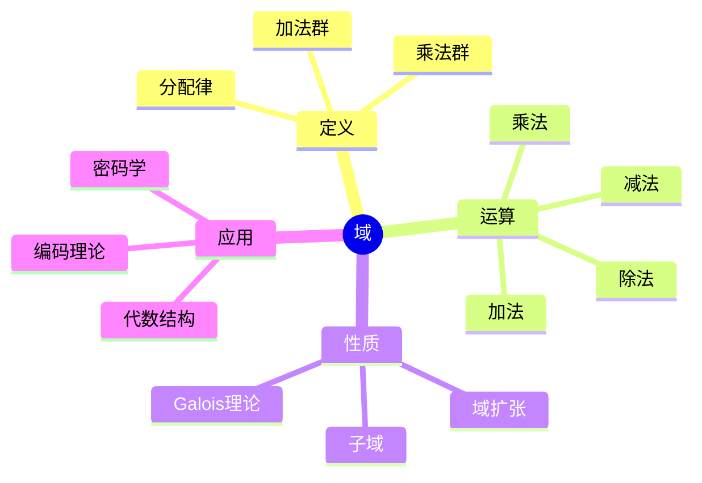
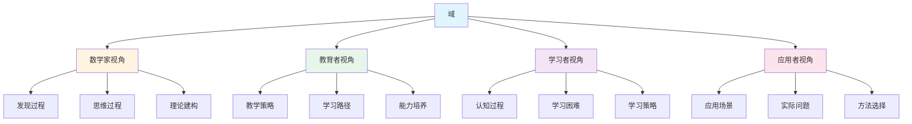
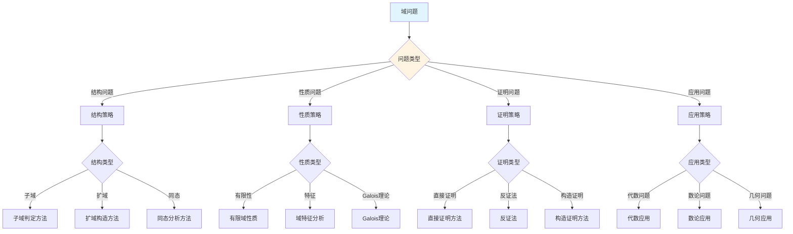
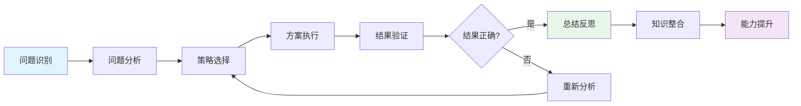
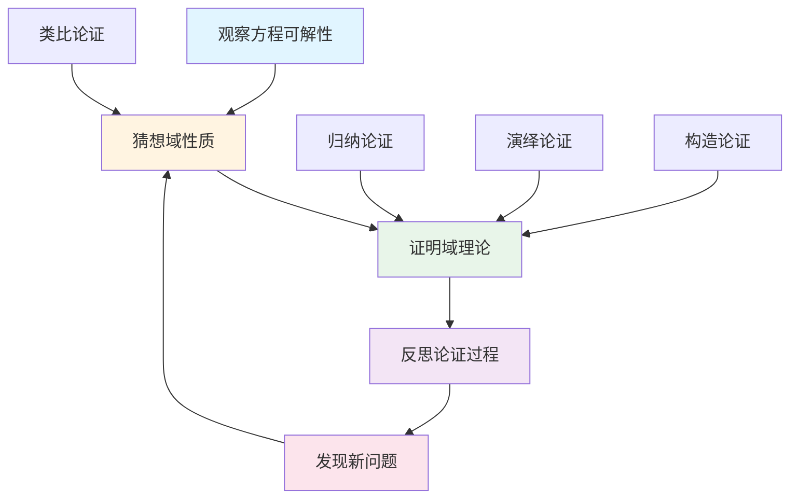
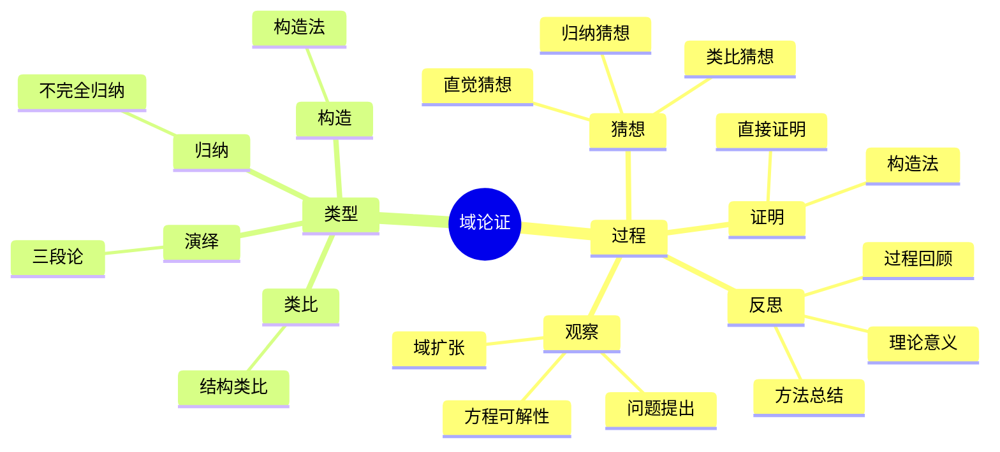

# 域 (Field) - 三视角组织版

**概念编号**: C.CORE.010
**知识层次**: L0-L2
**知识领域**: D2 (代数)
**创建日期**: 2025年1月
**最后更新**: 2025年1月

---

## 📋 目录 / Table of Contents

- [域 (Field) - 三视角组织版](#域-field---三视角组织版)
  - [📋 目录 / Table of Contents](#-目录--table-of-contents)
  - [1. 📋 概述 (编号: C.CORE.010.01)](#1--概述-编号-ccore01001)
  - [🧠 认知学视角：如何理解域 (编号: C.CORE.010.02)](#-认知学视角如何理解域-编号-ccore01002)
    - [认知起点 (编号: C.CORE.010.02.01)](#认知起点-编号-ccore0100201)
    - [认知过程 (编号: C.CORE.010.02.02)](#认知过程-编号-ccore0100202)
      - [阶段1：直观理解阶段 (编号: C.CORE.010.02.02.01)](#阶段1直观理解阶段-编号-ccore010020201)
      - [阶段2：概念形成阶段 (编号: C.CORE.010.02.02.02)](#阶段2概念形成阶段-编号-ccore010020202)
      - [阶段3：形式化阶段 (编号: C.CORE.010.02.02.03)](#阶段3形式化阶段-编号-ccore010020203)
    - [认知障碍 (编号: C.CORE.010.02.03)](#认知障碍-编号-ccore0100203)
    - [认知工具 (编号: C.CORE.010.02.04)](#认知工具-编号-ccore0100204)
  - [🎓 教育学视角：如何教学域 (编号: C.CORE.010.03)](#-教育学视角如何教学域-编号-ccore01003)
    - [教学目标 (编号: C.CORE.010.03.01)](#教学目标-编号-ccore0100301)
    - [教学路径 (编号: C.CORE.010.03.02)](#教学路径-编号-ccore0100302)
      - [阶段1：引入阶段（激发兴趣） (编号: C.CORE.010.03.02.01)](#阶段1引入阶段激发兴趣-编号-ccore010030201)
      - [阶段2：探索阶段（主动建构） (编号: C.CORE.010.03.02.02)](#阶段2探索阶段主动建构-编号-ccore010030202)
      - [阶段3：形式化阶段（抽象概括） (编号: C.CORE.010.03.02.03)](#阶段3形式化阶段抽象概括-编号-ccore010030203)
      - [阶段4：巩固阶段（应用深化） (编号: C.CORE.010.03.02.04)](#阶段4巩固阶段应用深化-编号-ccore010030204)
    - [教学难点 (编号: C.CORE.010.03.03)](#教学难点-编号-ccore0100303)
    - [教学策略 (编号: C.CORE.010.03.04)](#教学策略-编号-ccore0100304)
    - [评估方法 (编号: C.CORE.010.03.05)](#评估方法-编号-ccore0100305)
  - [🔬 数学家视角：如何思考域 (编号: C.CORE.010.04)](#-数学家视角如何思考域-编号-ccore01004)
    - [问题起源 (编号: C.CORE.010.04.01)](#问题起源-编号-ccore0100401)
    - [思维过程 (编号: C.CORE.010.04.02)](#思维过程-编号-ccore0100402)
      - [步骤1：问题提出 (编号: C.CORE.010.04.02.01)](#步骤1问题提出-编号-ccore010040201)
      - [步骤2：概念形成 (编号: C.CORE.010.04.02.02)](#步骤2概念形成-编号-ccore010040202)
      - [步骤3：理论发展 (编号: C.CORE.010.04.02.03)](#步骤3理论发展-编号-ccore010040203)
    - [历史发展 (编号: C.CORE.010.04.03)](#历史发展-编号-ccore0100403)
    - [3.2 关键人物和贡献 (编号: C.CORE.010.04.04)](#32-关键人物和贡献-编号-ccore0100404)
    - [重要定理 (编号: C.CORE.010.04.05)](#重要定理-编号-ccore0100405)
    - [开放问题 (编号: C.CORE.010.04.06)](#开放问题-编号-ccore0100406)
    - [一、第一人称思维描述 (编号: C.CORE.010.04.07)](#一第一人称思维描述-编号-ccore0100407)
      - [1.1 Galois的发现过程](#11-galois的发现过程)
    - [二、数学直觉的形成 (编号: C.CORE.010.04.08)](#二数学直觉的形成-编号-ccore0100408)
      - [2.1 直觉在概念发现中的作用](#21-直觉在概念发现中的作用)
      - [2.2 如何培养域直觉](#22-如何培养域直觉)
    - [三、数学美的教育价值 (编号: C.CORE.010.04.09)](#三数学美的教育价值-编号-ccore0100409)
      - [3.1 域论的美在哪里](#31-域论的美在哪里)
      - [3.2 如何培养学生的数学美感](#32-如何培养学生的数学美感)
    - [四、问题解决策略 (编号: C.CORE.010.04.10)](#四问题解决策略-编号-ccore0100410)
      - [4.1 数学家的启发式方法](#41-数学家的启发式方法)
      - [4.2 思维过程分析](#42-思维过程分析)
    - [五、批判性反思 (编号: C.CORE.010.04.11)](#五批判性反思-编号-ccore0100411)
      - [5.1 域概念的局限性](#51-域概念的局限性)
      - [5.2 域理论的未解决问题](#52-域理论的未解决问题)
  - [💡 数学解释：为什么域是这样定义的 (编号: C.CORE.010.05)](#-数学解释为什么域是这样定义的-编号-ccore01005)
    - [一、直观解释：域是什么？](#一直观解释域是什么)
      - [1.1 具体例子](#11-具体例子)
      - [1.2 形象类比](#12-形象类比)
      - [1.3 几何直观](#13-几何直观)
      - [1.4 操作体验](#14-操作体验)
    - [二、知性解释：域的本质是什么？](#二知性解释域的本质是什么)
      - [2.1 概念定义](#21-概念定义)
      - [2.2 分类体系](#22-分类体系)
      - [2.3 抽象结构](#23-抽象结构)
      - [2.4 知识体系](#24-知识体系)
    - [三、理性解释：域的公理化定义](#三理性解释域的公理化定义)
      - [3.1 公理体系](#31-公理体系)
      - [3.2 形式化证明](#32-形式化证明)
      - [3.3 系统建构](#33-系统建构)
    - [四、多视角解释：从不同角度理解域](#四多视角解释从不同角度理解域)
      - [4.1 数学家视角：域是如何被发现的？](#41-数学家视角域是如何被发现的)
      - [4.2 教育者视角：如何教学域？](#42-教育者视角如何教学域)
      - [4.3 学习者视角：如何学习域？](#43-学习者视角如何学习域)
      - [4.4 应用者视角：如何应用域？](#44-应用者视角如何应用域)
    - [五、思维表征：用多种方式理解域](#五思维表征用多种方式理解域)
      - [5.1 思维导图：域的知识结构](#51-思维导图域的知识结构)
      - [5.2 矩阵对比：不同解释方式的对比](#52-矩阵对比不同解释方式的对比)
      - [5.3 多视角表征：从不同角度表征域](#53-多视角表征从不同角度表征域)
      - [5.4 决策树：域问题分类和策略选择](#54-决策树域问题分类和策略选择)
      - [5.5 决策逻辑路径：域问题解决过程](#55-决策逻辑路径域问题解决过程)
      - [5.6 多维对比矩阵：域概念特征对比](#56-多维对比矩阵域概念特征对比)
  - [🔍 数学论证：如何论证域 (编号: C.CORE.010.06)](#-数学论证如何论证域-编号-ccore01006)
    - [一、论证过程：从观察到反思](#一论证过程从观察到反思)
      - [1.1 观察（Observation）](#11-观察observation)
      - [1.2 猜想（Conjecture）](#12-猜想conjecture)
      - [1.3 证明（Proof）](#13-证明proof)
      - [1.4 反思（Reflection）](#14-反思reflection)
    - [二、论证类型：多种推理方式](#二论证类型多种推理方式)
      - [2.1 归纳论证（Inductive Reasoning）](#21-归纳论证inductive-reasoning)
      - [2.2 演绎论证（Deductive Reasoning）](#22-演绎论证deductive-reasoning)
      - [2.3 类比论证（Analogical Reasoning）](#23-类比论证analogical-reasoning)
      - [2.4 构造论证（Constructive Reasoning）](#24-构造论证constructive-reasoning)
    - [三、论证可视化：用图形表示论证过程](#三论证可视化用图形表示论证过程)
      - [3.1 论证流程图](#31-论证流程图)
      - [3.2 论证类型对比](#32-论证类型对比)
      - [3.3 论证思维导图](#33-论证思维导图)
  - [🔗 三视角整合 (编号: C.CORE.010.07)](#-三视角整合-编号-ccore01007)
    - [三个视角的关联](#三个视角的关联)
    - [如何综合运用三个视角](#如何综合运用三个视角)
  - [📚 参考文献 (编号: C.CORE.010.08)](#-参考文献-编号-ccore01008)
    - [权威资源](#权威资源)
    - [经典教材](#经典教材)
    - [研究论文](#研究论文)

---

## 1. 📋 概述 (编号: C.CORE.010.01)

域是同时配备加法和乘法两种运算的代数结构，其中非零元对乘法构成群。域是代数学、数论、代数几何等领域的基础，是现代数学的核心概念。

本文档从**数学认知学**、**教育学**、**数学家**三个视角深入展开域概念，避免简单的概念堆垒。

**权威资源对齐**:

- Wikipedia: [Field (Mathematics)](https://en.wikipedia.org/wiki/Field_(mathematics))
- Stanford课程: Math 120 (Groups, Rings, and Fields)
- Princeton课程: MAT 350 (Abstract Algebra)
- MIT课程: 18.701 (Algebra I)
- Metamath: [Field Theory](http://us.metamath.org/mpeuni/df-field.html)

---

## 🧠 认知学视角：如何理解域 (编号: C.CORE.010.02)

### 认知起点 (编号: C.CORE.010.02.01)

**学习者已有的知识基础**:

- 环的概念
- 群的概念
- 日常经验中的"数系"概念

**日常经验中的类似概念**:

- "有理数"：可以加减乘除
- "实数"：可以加减乘除
- "复数"：可以加减乘除

### 认知过程 (编号: C.CORE.010.02.02)

#### 阶段1：直观理解阶段 (编号: C.CORE.010.02.02.01)

**具体例子**:

- 例子1：$(\mathbb{Q}, +, \cdot)$ - 有理数域
- 例子2：$(\mathbb{R}, +, \cdot)$ - 实数域
- 例子3：$(\mathbb{C}, +, \cdot)$ - 复数域

**形象类比**:

- **数系类比**: 域就像"可以加减乘除的数系"
  - 可以相加
  - 可以相乘
  - 可以相除（非零元）

- **结构类比**: 域就像"特殊的环"
  - 加法构成群
  - 非零元对乘法构成群
  - 乘法对加法满足分配律

**可视化表示**:

```text
域的结构:
    加法群 (F, +)
         ↓
    乘法群 (F\{0}, ·)
         ↓
    分配律连接
```

#### 阶段2：概念形成阶段 (编号: C.CORE.010.02.02.02)

**从例子中抽象出共同特征**:

- 所有例子都涉及"两种运算"
- 加法构成交换群
- 非零元对乘法构成交换群
- 乘法对加法满足分配律

**识别关键属性**:

1. **加法群**: $(F, +)$是交换群
2. **乘法群**: $(F \setminus \{0\}, \cdot)$是交换群
3. **分配律**: $a \cdot (b + c) = a \cdot b + a \cdot c$

**建立概念边界**:

- **什么是域**: 满足加法群、非零元乘法群、分配律的代数结构
- **什么不是域**:
  - 整数环（非零元对乘法不构成群）
  - 矩阵环（非零元对乘法不构成群）

#### 阶段3：形式化阶段 (编号: C.CORE.010.02.02.03)

**严格定义**:

- 公理化定义：通过加法群、乘法群、分配律三条公理
- 范畴定义：域是环的特殊情况

**公理化表述**:

- 公理1：加法群
- 公理2：乘法群（非零元）
- 公理3：分配律

**逻辑结构**:

- 域是特殊的环
- 域是向量空间的基础
- 域是代数结构的重要类型

### 认知障碍 (编号: C.CORE.010.02.03)

**常见误解**:

1. **误解1**: 认为所有环都是域
   - **纠正**: 域是特殊的环，非零元对乘法构成群

2. **误解2**: 认为域必须是无限的
   - **纠正**: 域可以是有限的，如$\mathbb{F}_p$（$p$素数）

3. **误解3**: 混淆域和环
   - **纠正**: 域是特殊的环，非零元对乘法构成群

**理解难点**:

1. **难点1**: 有限域的概念
   - **原因**: 有限域比较抽象
   - **解决方法**: 用具体例子，如$\mathbb{F}_p$

2. **难点2**: 域的扩张
   - **原因**: 域的扩张比较抽象
   - **解决方法**: 用具体例子，如$\mathbb{Q} \subset \mathbb{R} \subset \mathbb{C}$

3. **难点3**: Galois理论
   - **原因**: Galois理论比较抽象
   - **解决方法**: 从具体例子开始，逐步抽象

**认知陷阱**:

- **有限域**: 需要理解有限域的存在性
- **域的扩张**: 需要理解域的扩张结构

### 认知工具 (编号: C.CORE.010.02.04)

**类比工具**:

- **数系类比**: 域 = 可以加减乘除的数系
- **结构类比**: 域 = 特殊的环

**可视化工具**:

- **域的结构图**: 用图表示域的结构
- **域的扩张图**: 用图表示域的扩张

**具体化工具**:

- **具体例子**: 用具体例子理解抽象概念
- **反例**: 用反例理解概念边界

---

## 🎓 教育学视角：如何教学域 (编号: C.CORE.010.03)

### 教学目标 (编号: C.CORE.010.03.01)

**知识目标**:

- 理解域的基本概念
- 掌握域的公理化定义
- 理解域的性质
- 理解域的扩张

**能力目标**:

- 能够判断一个结构是否是域
- 能够进行域运算
- 能够理解域的结构
- 能够应用域论解决实际问题

**情感目标**:

- 培养数学抽象思维
- 培养代数思维
- 激发对数学的兴趣

### 教学路径 (编号: C.CORE.010.03.02)

#### 阶段1：引入阶段（激发兴趣） (编号: C.CORE.010.03.02.01)

**实际问题**:

- 问题1：如何统一描述有理数、实数、复数的运算？
- 问题2：如何研究代数方程？
- 问题3：如何研究Galois理论？

**历史背景**:

- 域论的历史发展
- 域论在数学中的地位
- 域论在Galois理论中的应用

**引发认知冲突**:

- 问题：如何扩展环的概念？
- 引出域的概念

#### 阶段2：探索阶段（主动建构） (编号: C.CORE.010.03.02.02)

**引导发现**:

1. 让学生自己列举可以加减乘除的数系
2. 让学生观察这些数系的共同特征
3. 引导学生抽象出域的定义

**合作探究**:

- 小组讨论：什么是域？
- 小组讨论：域有哪些性质？
- 小组讨论：如何表示域？

**多元表征**:

- **语言表征**: "域是满足加法群、非零元乘法群、分配律的代数结构"
- **符号表征**: $(F, +, \cdot)$
- **图形表征**: 域的结构图
- **集合表征**: 公理化定义

#### 阶段3：形式化阶段（抽象概括） (编号: C.CORE.010.03.02.03)

**严格定义**:

- 域的公理化定义
- 域的性质
- 域的扩张

**性质证明**:

- 域的基本性质
- 域的扩张性质
- Galois理论

**应用拓展**:

- 域在数学中的应用
- 域在Galois理论中的应用
- 域在代数几何中的应用

#### 阶段4：巩固阶段（应用深化） (编号: C.CORE.010.03.02.04)

**练习应用**:

- 基础练习：域的表示和运算
- 应用练习：用域解决实际问题
- 综合练习：域的综合应用

**变式训练**:

- 不同形式的域表示
- 不同性质的域
- 域的扩张

**知识整合**:

- 域与其他代数结构的联系
- 域在数学体系中的地位

### 教学难点 (编号: C.CORE.010.03.03)

**难点1：有限域的概念**:

- **难点描述**: 学生难以理解有限域
- **解决方法**:
  - 用具体例子，如$\mathbb{F}_p$
  - 强调有限域的存在性
  - 用运算表可视化

**难点2：域的扩张**:

- **难点描述**: 学生难以理解域的扩张
- **解决方法**:
  - 用具体例子，如$\mathbb{Q} \subset \mathbb{R} \subset \mathbb{C}$
  - 强调扩张的结构
  - 用图形可视化

**难点3：Galois理论**:

- **难点描述**: 学生难以理解Galois理论
- **解决方法**:
  - 从具体例子开始
  - 逐步抽象到理论
  - 强调Galois理论的重要性

### 教学策略 (编号: C.CORE.010.03.04)

**策略1：从具体到抽象**:

- 先给出具体例子
- 再抽象出一般概念
- 最后给出严格定义

**策略2：多元表征**:

- 用语言、符号、图形等多种方式表示同一概念
- 帮助学生建立不同表征之间的联系

**策略3：问题驱动**:

- 从实际问题出发
- 引出数学概念
- 解决问题

**策略4：可视化教学**:

- 使用域的结构图
- 使用域的扩张图
- 使用具体例子

### 评估方法 (编号: C.CORE.010.03.05)

**形成性评估**（评估理解过程）:

- 课堂提问：检查学生对概念的理解
- 小组讨论：观察学生的思考过程
- 练习作业：检查学生的应用能力

**总结性评估**（评估最终理解）:

- 测验：检查学生对概念和运算的掌握
- 项目：检查学生应用域论解决实际问题的能力
- 反思：检查学生对域概念的理解深度

---

## 🔬 数学家视角：如何思考域 (编号: C.CORE.010.04)

### 问题起源 (编号: C.CORE.010.04.01)

**历史背景**:

- 19世纪：域论的起源
- 20世纪初：域论的系统化
- 20世纪中期：域论的现代发展

**原始问题**:

- **问题1**: 如何统一描述有理数、实数、复数的运算？
- **问题2**: 如何研究代数方程？
- **问题3**: 域有哪些性质？

**研究动机**:

- 统一数系理论
- 发展Galois理论
- 发展代数几何

### 思维过程 (编号: C.CORE.010.04.02)

#### 步骤1：问题提出 (编号: C.CORE.010.04.02.01)

**观察到的现象**:

- 有理数、实数、复数都有两种运算
- 这些运算有一些共同的性质
- 需要统一的概念来描述

**提出的猜想**:

- 可以引入域概念
- 域可以统一描述这些结构
- 域有丰富的结构

**需要解决的问题**:

- 如何定义域？
- 域应该满足什么条件？
- 域有哪些性质？

#### 步骤2：概念形成 (编号: C.CORE.010.04.02.02)

**尝试性定义**:

- **公理化定义**: 通过加法群、乘法群、分配律
- **范畴定义**: 域是特殊的环

**性质探索**:

- 域的基本性质
- 域的扩张
- Galois理论

**结构发现**:

- 域是特殊的环
- 域是向量空间的基础
- 域是代数结构的重要类型

#### 步骤3：理论发展 (编号: C.CORE.010.04.02.03)

**定理证明**:

- 域的基本性质
- 域的扩张性质
- Galois理论

**应用拓展**:

- 域在数学中的应用
- 域在Galois理论中的应用
- 域在代数几何中的应用

**理论完善**:

- 域的公理化
- 域的范畴论研究
- Galois理论的发展

### 历史发展 (编号: C.CORE.010.04.03)

**早期阶段**（19世纪）:

- **Galois (1832)**: 在研究方程可解性时引入域概念
- **Dedekind (1871)**: 研究代数数域

**关键突破**（20世纪初）:

- **Steinitz (1910)**: 发展域论
- **Artin (1927)**: 发展Galois理论

**现代发展**（20世纪中期）:

- **Grothendieck (1950s)**: 发展概形理论
- **Langlands (1967)**: 朗兰兹纲领

### 3.2 关键人物和贡献 (编号: C.CORE.010.04.04)

**Évariste Galois (1811-1832)**:

- 在研究方程可解性时引入域概念
- 建立Galois理论的基础

**Ernst Steinitz (1871-1928)**:

- 发展域论
- 建立现代域论

**Emil Artin (1898-1962)**:

- 发展Galois理论
- 建立现代Galois理论

### 重要定理 (编号: C.CORE.010.04.05)

**Galois基本定理**:

- 域的Galois扩张与Galois群一一对应
- 意义：Galois理论的基础

**有限域的存在性**:

- 对每个素数幂$p^n$，存在唯一的$p^n$元有限域
- 意义：有限域分类的基础

### 开放问题 (编号: C.CORE.010.04.06)

**未解决问题**:

- 域的分类问题
- 域的表示问题
- 域的应用问题

**研究方向**:

- 域的范畴论研究
- 域的表示论研究
- 域的应用研究

### 一、第一人称思维描述 (编号: C.CORE.010.04.07)

#### 1.1 Galois的发现过程

**详细历史背景**:

- **1830年**：Galois研究方程的可解性
- **背景**：研究方程的系数域，发现域与方程可解性的关系
- **问题**：如何判断方程是否可解？域的性质如何影响方程的可解性？

**Galois的详细第一人称描述**:
> "1830年，我在研究方程的可解性时，遇到了一个问题：如何判断方程是否可解？
>
> 我发现，方程的系数域有特殊的性质。例如，对于方程$x^2 - 2 = 0$：
>
> - **系数域**：$\mathbb{Q}$（有理数域）
> - **根域**：$\mathbb{Q}(\sqrt{2}) = \{a + b\sqrt{2} : a, b \in \mathbb{Q}\}$
> - **Galois群**：$\text{Gal}(\mathbb{Q}(\sqrt{2})/\mathbb{Q}) = \{e, \sigma\}$，其中$\sigma(\sqrt{2}) = -\sqrt{2}$
> - **可解性**：Galois群是可解群，所以方程可解
>
> 对于五次方程$x^5 - x - 1 = 0$：
>
> - **系数域**：$\mathbb{Q}$
> - **Galois群**：$S_5$（5次对称群）
> - **可解性**：$S_5$不是可解群，所以方程不可用根式解
>
> 我的发现是：
>
> - **域的概念**：一个集合配备加法和乘法运算，满足某些公理（交换环，且非零元有乘法逆元）
> - **域扩张**：从一个域构造更大的域
> - **Galois群**：域扩张的自同构群
> - **可解性**：方程可解当且仅当对应的Galois群是可解群
>
> 这让我意识到，域是描述方程系数集合的工具，域的性质决定了方程的可解性。这为代数方程理论提供了新的视角。"

**详细的思维过程**:

1. **观察到的现象**（1830年）:

   **现象1：系数域有特殊的性质**
   - **问题**：方程的系数域有特殊的性质
   - **例子**：$\mathbb{Q}$和$\mathbb{Q}(\sqrt{2})$都是域
   - **需要**：描述这些性质

   **现象2：域的性质与方程可解性相关**
   - **问题**：域的性质如何影响方程的可解性？
   - **例子**：$\mathbb{Q}(\sqrt{2})$的Galois群是可解群，所以方程可解
   - **需要**：建立域与方程可解性的关系

   **现象3：需要统一的概念**
   - **问题**：如何统一处理不同的域？
   - **思路**：用域论统一
   - **需要**：建立域论的理论体系

2. **提出的猜想**（1830年）:

   **猜想1：用域描述系数集合**
   - **思路**：定义域的概念，方程的系数在域中
   - **例子**：$\mathbb{Q}$和$\mathbb{Q}(\sqrt{2})$都是域
   - **优点**：统一描述系数集合

   **猜想2：域与方程可解性相关**
   - **关系**：方程可解当且仅当对应的Galois群是可解群
   - **例子**：$S_5$不是可解群，所以五次方程不可用根式解
   - **意义**：用域的性质判断方程的可解性

   **猜想3：域是数学的基础**
   - **性质**：域是抽象的数学结构
   - **应用**：域可以应用到更广泛的领域
   - **意义**：域是统一的数学结构

3. **遇到的困难**（1830年）:

   **困难1：如何严格定义域？**
   - **问题**：如何定义域？
   - **解决**：通过公理定义域（交换环，且非零元有乘法逆元）
   - **意义**：为域提供严格的数学基础

   **困难2：如何判断域的性质？**
   - **问题**：如何判断域是否有限？是否代数闭？
   - **解决**：通过域的结构判断
   - **意义**：为域分类提供方法

   **困难3：如何应用域论？**
   - **问题**：如何用域论解决实际问题？
   - **解决**：建立Galois理论
   - **意义**：为代数方程理论提供新视角

4. **突破的时刻**（1830年，Galois）:

   **突破1：域的概念**
   - 引入域的概念描述系数集合
   - **关键**：抽象出域的结构
   - **意义**：为域论提供基础

   **突破2：Galois理论**
   - 建立域与方程可解性的关系
   - **关键**：方程可解当且仅当对应的Galois群是可解群
   - **意义**：为代数方程理论提供新视角

   **突破3：域论的广泛应用**
   - 域论可以应用到更广泛的领域
   - **关键**：域是抽象的数学结构
   - **意义**：域论成为数学的基础

### 二、数学直觉的形成 (编号: C.CORE.010.04.08)

#### 2.1 直觉在概念发现中的作用

**Galois的直觉**:

- **直觉1**: "域"是"系数的集合"——这个直觉引导Galois发现域论
- **直觉2**: 域与方程可解性相关——这个直觉引导Galois建立Galois理论
- **直觉3**: 域是数学的基础——这个直觉引导Galois建立域论

**直觉的验证**:

- 通过严格的数学证明验证直觉的正确性
- 通过公理化严格化域定义
- 通过应用验证域的广泛性

**直觉的深化**:

- 从"系数的集合"到"域的公理化"
- 从"方程可解性"到"Galois理论"
- 从"数学基础"到"域论的广泛应用"

#### 2.2 如何培养域直觉

**数学家的建议**:

- **Galois**: "域直觉是长期训练的结果。通过大量练习和深入思考，我们可以培养对域的直觉。"
- **Dedekind**: "从具体例子开始，逐步抽象，这是培养域直觉的有效方法。"

**培养方法**:

1. **大量练习**: 通过大量域运算练习，培养对域的直觉
2. **深入思考**: 深入思考域的本质，理解域的深层结构
3. **类比和联想**: 通过类比和联想，建立域与其他概念的联系
4. **与专家交流**: 与数学家交流，学习他们的思维方式

**教学启示**:

- 从具体例子开始，逐步抽象
- 鼓励学生思考域的本质
- 引导学生建立域与其他概念的联系

### 三、数学美的教育价值 (编号: C.CORE.010.04.09)

#### 3.1 域论的美在哪里

**结构美**:

- **简洁性**: 域的概念非常简洁——"满足加法和乘法公理的集合，乘法有逆元"
- **统一性**: 域可以统一描述数学中的各种数系
- **和谐性**: 域运算满足优美的规律（交换律、结合律等）

**数学家的评价**:

- **Galois**: "域论的美在于它的统一性。它为我们提供了一个统一的框架来理解数学中的数系。"
- **Dedekind**: "域论的美在于它的基础性。它是数学的基础，所有数系都可以用域来描述。"

#### 3.2 如何培养学生的数学美感

**数学家的建议**:

- **Galois**: "展示域论的美感，让学生感受到数学的美。"
- **Dedekind**: "通过域论的历史和发展，让学生理解数学的美。"

**教学方法**:

1. **展示数学美**:
   - 展示域概念的简洁性和统一性
   - 展示域运算的优美规律
   - 展示域在数学中的基础地位

2. **引导学生欣赏**:
   - 引导学生欣赏域概念的简洁性
   - 引导学生欣赏域运算的和谐性
   - 引导学生欣赏域的基础性

3. **鼓励学生创造美**:
   - 鼓励学生发现域论的美
   - 鼓励学生创造优美的域证明
   - 鼓励学生探索域论的美

### 四、问题解决策略 (编号: C.CORE.010.04.10)

#### 4.1 数学家的启发式方法

**策略1：从具体到抽象**:

- 从具体的域例子开始
- 抽象出域的一般性质
- 建立域的理论体系

**策略2：从简单到复杂**:

- 先理解基本域
- 再理解域运算
- 最后理解域理论

**策略3：从问题到理论**:

- 从实际问题出发
- 引出域概念
- 建立域理论

#### 4.2 思维过程分析

**问题识别**:

- 识别问题类型：域定义问题、域性质问题、域应用问题
- 识别问题难度：简单问题、中等问题、复杂问题

**策略选择**:

- 简单问题：直接方法
- 中等问题：分步方法
- 复杂问题：分解方法

**执行和反思**:

- 执行策略，解决问题
- 反思过程，总结经验
- 改进方法，提高效率

### 五、批判性反思 (编号: C.CORE.010.04.11)

#### 5.1 域概念的局限性

**概念的边界**:

- 域只描述某些数系，不能描述所有数学结构
- 域是抽象的，需要具体化才能应用
- 域不能表示所有数学量

**概念的推广**:

- 除环：去掉交换性条件
- 代数：更一般的结构
- 范畴：更抽象的结构

#### 5.2 域理论的未解决问题

**未解决的问题**:

- 域的分类问题：如何分类所有域？
- 域的表示问题：如何表示域？
- 域的应用问题：如何更好地应用域？

**研究方向**:

- 域的范畴论研究
- 域的表示论研究
- 域的应用研究

---

## 💡 数学解释：为什么域是这样定义的 (编号: C.CORE.010.05)

### 一、直观解释：域是什么？

#### 1.1 具体例子

**生活中的例子**：

- **有理数运算**：有理数在加法和乘法下构成域
  - 例如：$(\mathbb{Q}, +, \times)$是域
  - **为什么这样定义**：因为我们需要一个概念来表示"可以进行所有四则运算的数系"
- **实数运算**：实数在加法和乘法下构成域
  - 例如：$(\mathbb{R}, +, \times)$是域
  - **为什么这样定义**：因为我们需要一个概念来表示"连续的数系"
- **复数运算**：复数在加法和乘法下构成域
  - 例如：$(\mathbb{C}, +, \times)$是域
  - **为什么这样定义**：因为我们需要一个概念来表示"代数闭的数系"

**数学中的例子**：

- **数域**：$\mathbb{Q}$、$\mathbb{R}$、$\mathbb{C}$
  - **为什么这样定义**：我们需要一个概念来表示"可以进行所有四则运算的数系"
- **有限域**：$\mathbb{Z}_p$（$p$是素数）
  - **为什么这样定义**：我们需要一个概念来表示"有限个元素的域"
- **函数域**：$\mathbb{Q}(x)$（有理函数域）
  - **为什么这样定义**：我们需要一个概念来表示"函数的域"

#### 1.2 形象类比

**运算类比**：

- **域就像"完整的数系"**
  - 域有两个运算：加法和乘法
  - 加法构成Abel群
  - 乘法（非零元）构成Abel群
  - 满足分配律
- **为什么这样类比**：这个类比帮助我们理解域的本质

**扩展类比**：

- **域就像"环的扩展"**
  - 域是特殊的环（每个非零元都有乘法逆元）
  - 域可以进行除法运算
- **为什么这样类比**：这个类比帮助我们理解域与环的关系

#### 1.3 几何直观

**域扩张表示**：

- 使用域扩张表示域的关系
- 例如：$\mathbb{Q} \subseteq \mathbb{R} \subseteq \mathbb{C}$
- **为什么使用域扩张**：域扩张揭示了域的结构

**Galois对应表示**：

- 使用Galois对应表示域和群的关系
- Galois理论建立了域扩张和群之间的对应
- **为什么使用Galois对应**：Galois对应揭示了域的深层结构

#### 1.4 操作体验

**域运算的操作**：

- **加法操作**：$a + b$（域的加法）
  - **为什么这样操作**：因为我们需要一个运算来表示"合并元素"
- **乘法操作**：$a \cdot b$（域的乘法）
  - **为什么这样操作**：因为我们需要一个运算来表示"元素的乘法"
- **除法操作**：$a / b = a \cdot b^{-1}$（域的除法）
  - **为什么这样操作**：因为我们需要一个运算来表示"元素的除法"

### 二、知性解释：域的本质是什么？

#### 2.1 概念定义

**域的内涵**：

- **域是一个集合$F$配备两个二元运算$+$和$\cdot$，满足：**
  - **$(F, +)$是Abel群**
  - **$(F \setminus \{0\}, \cdot)$是Abel群**
  - **分配律**：$a(b + c) = ab + ac$
- **为什么这样定义**：这些特征使得域成为一个完整的代数结构，支持所有四则运算

**域的外延**：

- **数域**：$\mathbb{Q}$、$\mathbb{R}$、$\mathbb{C}$
- **有限域**：$\mathbb{Z}_p$（$p$是素数）
- **函数域**：$\mathbb{Q}(x)$、$\mathbb{R}(x)$
- **代数数域**：$\mathbb{Q}(\sqrt{2})$、$\mathbb{Q}(\sqrt[3]{2})$
- **为什么这样分类**：不同的域类型有不同的性质和用途

#### 2.2 分类体系

**按元素个数分类**：

- **有限域**：$|F| < \infty$
- **无限域**：$|F| = \infty$
- **为什么这样分类**：元素个数是域的基本特征

**按特征分类**：

- **特征0域**：$\text{char}(F) = 0$（如$\mathbb{Q}$、$\mathbb{R}$、$\mathbb{C}$）
- **特征$p$域**：$\text{char}(F) = p$（如$\mathbb{Z}_p$）
- **为什么这样分类**：特征是域的重要性质

#### 2.3 抽象结构

**域的运算结构**：

- **加法运算**：$+ : F \times F \to F$
- **乘法运算**：$\cdot : F \times F \to F$
- **为什么有这些运算**：这些运算使得域具有代数结构

**域的关系结构**：

- **域扩张关系**：$F \subseteq E$是域扩张
- **为什么有这个关系**：这个关系帮助我们研究域的结构

**域的子结构**：

- **子域**：$K \subseteq F$是子域当且仅当$K$在加法和乘法下封闭
- **域扩张**：$F \subseteq E$是域扩张
- **为什么有这些结构**：这些结构是域理论的基础

#### 2.4 知识体系

**域在数学体系中的位置**：

- **特殊地位**：域是特殊的环
  - 环：两种运算，乘法不一定有逆元
  - 域：两种运算，乘法（非零元）有逆元
- **为什么是特殊**：域可以进行除法运算，是更完整的结构

**域与其他概念的关系**：

- **域与环**：域是特殊的环
- **域与向量空间**：域是向量空间的标量域
- **域与Galois理论**：域是Galois理论的基础
- **为什么有这些关系**：这些关系揭示了域与其他数学概念的内在联系

### 三、理性解释：域的公理化定义

#### 3.1 公理体系

**域的公理化定义**：

- **公理1（加法群）**：$(F, +)$是Abel群
- **公理2（乘法群）**：$(F \setminus \{0\}, \cdot)$是Abel群
- **公理3（分配律）**：$a(b + c) = ab + ac$
- **为什么需要这些公理**：这些公理定义了域的基本结构

**域的范畴论定义**：

- **域是特殊的环**
- **为什么这样定义**：这个定义将域放在更一般的框架中

#### 3.2 形式化证明

**域运算性质的证明**：

- **除法的定义**：$a / b = a \cdot b^{-1}$
  - **证明**：使用乘法的逆元
  - **为什么这样证明**：利用逆元的定义
- **零元的性质**：$0 \cdot a = a \cdot 0 = 0$
  - **证明**：$0 \cdot a = (0 + 0) \cdot a = 0 \cdot a + 0 \cdot a$，因此$0 \cdot a = 0$
  - **为什么这样证明**：利用零元和分配律

**域关系的证明**：

- **域扩张的性质**：如果$F \subseteq E$是域扩张，则$E$是$F$上的向量空间
  - **证明**：使用域扩张的定义和向量空间的定义
  - **为什么这样证明**：利用域扩张的定义

#### 3.3 系统建构

**域论在数学基础中的地位**：

- **作为代数基础**：域是代数结构的基础
- **提供运算完整性**：域支持所有四则运算
- **统一框架**：域统一了各种数系

**域论的发展历史**：

- **Galois的引入**（1832年）：在研究方程可解性时引入域概念
- **Steinitz的发展**（1910年）：发展域论
- **Artin的发展**（1927年）：发展Galois理论
- **为什么这样发展**：数学的发展需要严格的基础，域论的发展反映了这一需求

### 四、多视角解释：从不同角度理解域

#### 4.1 数学家视角：域是如何被发现的？

**Galois的发现过程**：

- **问题提出**：如何研究方程的可解性？
- **关键洞察**：使用域描述方程的根
- **重要发现**：域可以统一描述数系
- **为什么这样发现**：数学家的直觉和严格证明相结合

**Steinitz的抽象化过程**：

- **问题识别**：需要抽象化域概念
- **策略选择**：使用公理化定义
- **定义设计**：域是满足公理的代数结构
- **为什么这样设计**：需要统一各种域实例

#### 4.2 教育者视角：如何教学域？

**教学策略**：

- **从具体到抽象**：先学习具体例子，再学习抽象定义
- **从简单到复杂**：先学习数域，再学习一般域
- **从直观到形式化**：先使用具体例子等直观工具，再学习形式化定义
- **为什么这样教学**：符合认知规律，帮助学生逐步建立理解

**学习路径**：

- **阶段1**：直观理解（使用具体例子）
- **阶段2**：概念形成（学习域的定义和性质）
- **阶段3**：形式化（学习域的公理化定义）
- **为什么这样设计**：循序渐进，逐步深入

#### 4.3 学习者视角：如何学习域？

**认知过程**：

- **直观阶段**：通过具体例子理解域的含义
- **概念阶段**：理解域的定义和性质
- **形式化阶段**：理解域的公理化定义
- **为什么这样学习**：符合认知发展规律

**学习困难**：

- **困难1**：理解"域"的概念
- **困难2**：理解"域扩张"的概念
- **困难3**：理解"Galois理论"的概念
- **如何克服**：通过具体例子、类比、历史背景等方式帮助理解

#### 4.4 应用者视角：如何应用域？

**应用场景**：

- **数学**：使用域研究代数结构和方程
- **编码理论**：使用有限域设计纠错码
- **密码学**：使用有限域设计密码系统
- **为什么这样应用**：域提供了强大的工具来处理各种问题

**应用方法**：

- **建立模型**：将实际问题转化为域问题
- **使用理论**：使用域论解决问题
- **验证结果**：验证结果的正确性
- **为什么这样应用**：域论提供了强大的工具来解决实际问题

### 五、思维表征：用多种方式理解域

#### 5.1 思维导图：域的知识结构



#### 5.2 矩阵对比：不同解释方式的对比

| 解释方式 | 特点 | 方法 | 工具 | 适用阶段 | 优势 | 局限 |
|---------|------|------|------|---------|------|------|
| **直观解释** | 具体、形象、可视 | 例子、类比、直观 | 具体例子、图形 | 入门阶段 | 易于理解 | 不够严格 |
| **知性解释** | 概念、分类、抽象 | 定义、分类、结构 | 概念图、知识图谱 | 中级阶段 | 系统完整 | 不够直观 |
| **理性解释** | 公理、证明、形式化 | 公理、证明、系统 | 形式化工具、证明系统 | 高级阶段 | 严格准确 | 不够具体 |
| **多视角解释** | 多角度、整合 | 多视角、整合 | 多视角工具 | 所有阶段 | 全面深入 | 可能复杂 |

#### 5.3 多视角表征：从不同角度表征域



#### 5.4 决策树：域问题分类和策略选择



**说明**：

- **问题分类**：根据问题类型（结构、性质、证明、应用）进行分类
- **策略选择**：根据问题类型选择相应的解决策略
- **方法应用**：根据具体问题选择合适的方法

#### 5.5 决策逻辑路径：域问题解决过程



**说明**：

- **问题识别**：识别域问题的类型和关键要素
- **问题分析**：分析问题的条件和目标
- **策略选择**：根据问题类型选择解决策略
- **方案执行**：执行选定的解决方案
- **结果验证**：验证结果的正确性
- **总结反思**：总结解题过程，反思解题方法
- **知识整合**：整合相关知识点
- **能力提升**：提升问题解决能力

#### 5.6 多维对比矩阵：域概念特征对比

| 对比维度 | 域定义 | 域结构 | 域性质 | 域应用 |
|---------|---------|---------|---------|---------|
| **核心特征** | 域公理、二元运算 | 子域、扩域、同态 | 有限性、特征、Galois理论 | 代数、数论、几何应用 |
| **理解难度** | ⭐⭐⭐⭐ | ⭐⭐⭐⭐⭐ | ⭐⭐⭐⭐⭐ | ⭐⭐⭐⭐ |
| **应用频率** | ⭐⭐⭐⭐ | ⭐⭐⭐⭐ | ⭐⭐⭐⭐ | ⭐⭐⭐⭐ |
| **理论基础** | 域公理体系 | 域结构理论 | 域性质理论 | 域应用理论 |
| **教学重点** | 概念理解 | 结构分析 | 性质分析 | 应用能力 |
| **学习阶段** | 高级阶段 | 高级阶段 | 高级阶段 | 高级阶段 |
| **认知维度** | 知性+理性 | 理性 | 理性 | 理性+应用 |
| **思维表征** | 思维导图 | 决策树 | 决策逻辑路径 | 知识图谱 |

**说明**：

- **核心特征**：每个方面的核心特征
- **理解难度**：从1星到5星，表示理解难度
- **应用频率**：从1星到5星，表示应用频率
- **理论基础**：每个方面的理论基础
- **教学重点**：每个方面的教学重点
- **学习阶段**：每个方面的学习阶段
- **认知维度**：每个方面的认知维度
- **思维表征**：每个方面推荐的思维表征方法

---

## 🔍 数学论证：如何论证域 (编号: C.CORE.010.06)

### 一、论证过程：从观察到反思

#### 1.1 观察（Observation）

**具体现象观察**：

- **现象1**：方程可解性需要域的概念
  - 例如：研究$x^2 + 1 = 0$的可解性需要引入复数域
  - **为什么重要**：这个现象揭示了域作为方程求解工具的必要性
- **现象2**：域扩张的规律性
  - 例如：有理数域$\mathbb{Q}$到实数域$\mathbb{R}$再到复数域$\mathbb{C}$的扩张
  - **为什么重要**：这个现象揭示了域的结构

**模式识别**：

- **模式1**：域的Galois对应
  - 例如：在Galois扩张中，子群和中间域一一对应
  - **为什么重要**：这个模式可能反映了域的结构
- **模式2**：有限域的结构
  - 例如：有限域的阶为$p^n$（$p$素数），且唯一
  - **为什么重要**：这个模式可能反映了域的分类

**问题提出**：

- **问题1**：如何严格定义域，统一不同的数系？
  - **为什么提出**：这个问题可能揭示域的本质和基础
- **问题2**：如何证明Galois对应？
  - **为什么提出**：这个问题可能揭示域的结构性质

#### 1.2 猜想（Conjecture）

**归纳猜想**：

- **猜想1**：域是研究方程可解性的统一工具
  - **依据**：观察不同数系都满足域公理
  - **为什么提出**：这个猜想可能揭示域的统一性
- **猜想2**：Galois对应
  - **依据**：观察具体域扩张的子群和中间域
  - **为什么提出**：这个猜想可能揭示域的结构性质

**类比猜想**：

- **猜想1**：域类似于"可除的环"
  - **类比对象**：环（不可除）
  - **为什么提出**：这个类比可能揭示域的本质
- **猜想2**：域扩张类似于"向量空间"
  - **类比对象**：向量空间
  - **为什么提出**：这个类比可能揭示域扩张的结构

**直觉猜想**：

- **猜想1**：域是"最自然"的数系结构
  - **直觉来源**：域的直观
  - **为什么提出**：这个直觉可能揭示域的基础地位
- **猜想2**：域有"最小"的公理结构
  - **直觉来源**：域的公理结构
  - **为什么提出**：这个直觉可能揭示域的本质

#### 1.3 证明（Proof）

**直接证明**：

- **证明1**：Galois对应
  - **证明思路**：使用Galois群和中间域的对应
  - **关键步骤**：证明子群和中间域一一对应，且保持包含关系
  - **为什么这样证明**：这个证明方法直接、清晰
- **证明2**：有限域的乘法群是循环群
  - **证明思路**：使用有限域的性质
  - **关键步骤**：证明有限域的乘法群是循环群
  - **为什么这样证明**：这个证明方法直接、清晰

**构造法**：

- **构造法**：构造有限域
  - **构造方法**：对每个$p^n$（$p$素数），构造唯一的$p^n$元有限域$\mathbb{F}_{p^n}$
  - **验证**：验证构造的有限域满足域公理
  - **为什么这样证明**：构造法适合证明存在性命题

#### 1.4 反思（Reflection）

**过程回顾**：

- **论证回顾**：从观察方程可解性需要域的概念，到猜想域的性质，再到严格证明
  - **成功之处**：成功建立了域的严格理论
  - **不足之处**：域概念需要进一步推广
  - **改进方向**：推广到代数、概形等

**方法总结**：

- **证明方法**：使用了直接证明、构造法
  - **方法特点**：直接证明清晰，构造法明确
  - **适用范围**：不同方法适用于不同类型的命题
- **证明技巧**：使用Galois群、域扩张、有限域的性质
  - **技巧要点**：将域问题转化为群问题，使用构造法处理存在性问题
  - **应用场景**：这些技巧可以应用于其他域论问题

**理论意义**：

- **理论贡献**：建立了域的严格理论，揭示了域的Galois结构
  - **为什么重要**：这个论证揭示了代数学的基础结构
- **应用价值**：域为代数学、数论、几何学提供了基础
  - **为什么重要**：这个论证可以应用于所有代数问题

### 二、论证类型：多种推理方式

#### 2.1 归纳论证（Inductive Reasoning）

**不完全归纳**：

- **例子1**：从具体域的性质归纳一般规律
  - **观察**：观察$\mathbb{Q}$、$\mathbb{R}$、$\mathbb{C}$都满足域公理
  - **结论**：域有共同的性质
  - **局限性**：不完全归纳的结论需要严格证明

#### 2.2 演绎论证（Deductive Reasoning）

**三段论**：

- **例子1**：证明域的性质
  - **大前提**：所有非零域元素都有乘法逆元
  - **小前提**：$2$是非零有理数
  - **结论**：$2$有乘法逆元$\frac{1}{2}$
  - **为什么有效**：三段论是严格的演绎推理

#### 2.3 类比论证（Analogical Reasoning）

**结构类比**：

- **例子1**：域与环的类比
  - **类比对象**：环
  - **相似性**：域是交换环，且每个非零元可逆
  - **结论**：域可以理解为"可除的环"
  - **局限性**：类比不能替代严格证明

#### 2.4 构造论证（Constructive Reasoning）

**构造法**：

- **例子1**：构造有限域
  - **构造方法**：对每个$p^n$，构造唯一的$p^n$元有限域
  - **验证**：验证构造的有限域满足域公理
  - **为什么有效**：构造法是严格的直接证明

### 三、论证可视化：用图形表示论证过程

#### 3.1 论证流程图



#### 3.2 论证类型对比

| 论证类型 | 特点 | 适用场景 | 优势 | 局限 |
|---------|------|---------|------|------|
| **归纳论证** | 从特殊到一般 | 发现规律、提出猜想 | 启发性强 | 结论或然 |
| **演绎论证** | 从一般到特殊 | 严格证明、逻辑推理 | 结论必然 | 需要前提 |
| **类比论证** | 基于相似性 | 启发思路、发现联系 | 创造性高 | 结论或然 |
| **构造论证** | 直接构造 | 证明存在性命题 | 直接明确 | 需要构造 |

#### 3.3 论证思维导图



---

## 🔗 三视角整合 (编号: C.CORE.010.07)

### 三个视角的关联

**认知学视角 ↔ 教育学视角**:

- 认知学视角揭示的理解机制，指导教育学视角的教学设计
- 教育学视角的教学实践，验证认知学视角的理论

**认知学视角 ↔ 数学家视角**:

- 数学家视角的思维过程，启发认知学视角的认知路径
- 认知学视角的认知障碍，解释数学家视角的历史困难

**教育学视角 ↔ 数学家视角**:

- 数学家视角的历史发展，为教育学视角提供教学素材
- 教育学视角的教学策略，帮助学习者理解数学家视角的思维过程

### 如何综合运用三个视角

**学习建议**:

1. **从认知学视角开始**: 先建立直观理解
2. **用教育学视角深化**: 通过教学路径系统学习
3. **用数学家视角升华**: 理解概念的深层意义和历史背景

**教学建议**:

1. **引入阶段**: 用数学家视角的问题起源激发兴趣
2. **探索阶段**: 用认知学视角的认知过程引导发现
3. **形式化阶段**: 用教育学视角的教学策略系统教学
4. **巩固阶段**: 综合三个视角深化理解

---

## 📚 参考文献 (编号: C.CORE.010.08)

### 权威资源

- Wikipedia: [Field (Mathematics)](https://en.wikipedia.org/wiki/Field_(mathematics))
- Metamath: [Field Theory](http://us.metamath.org/mpeuni/df-field.html)

### 经典教材

- Artin, E. (1998). *Galois Theory*. Dover Publications.
- Lang, S. (2002). *Algebra*. Springer.

### 研究论文

- Galois, É. (1832). "Mémoire sur les conditions de résolubilité des équations par radicaux". *Journal de Mathématiques Pures et Appliquées*.
- Steinitz, E. (1910). "Algebraische Theorie der Körper". *Journal für die reine und angewandte Mathematik*.

---

**创建日期**: 2025年1月
**最后更新**: 2025年1月
**维护状态**: 持续更新中
