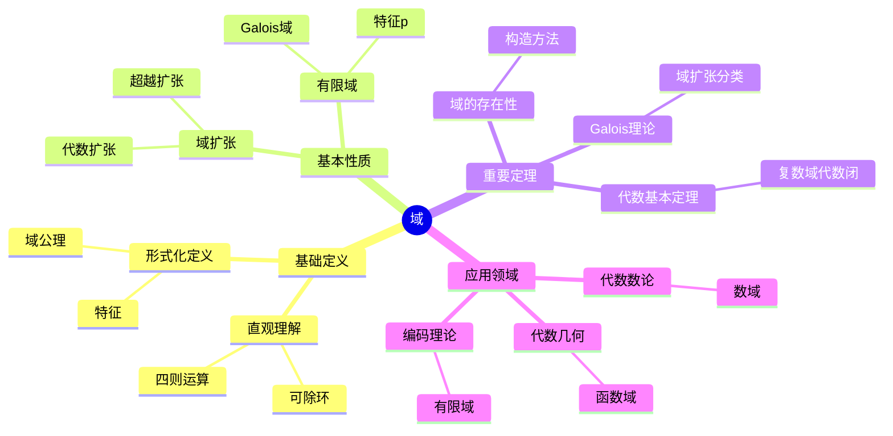
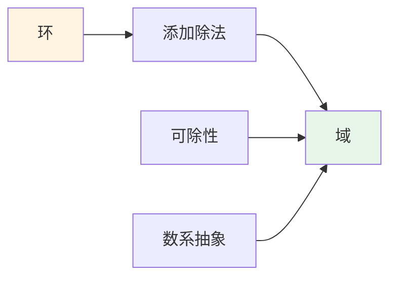
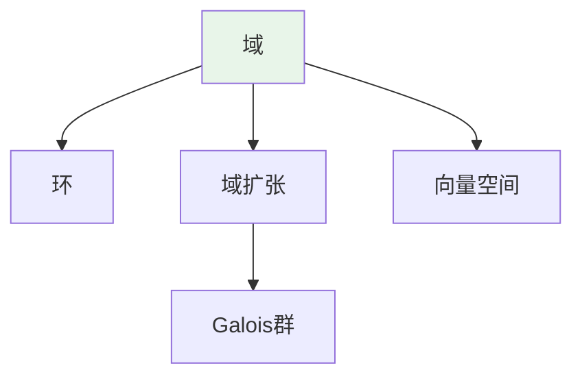
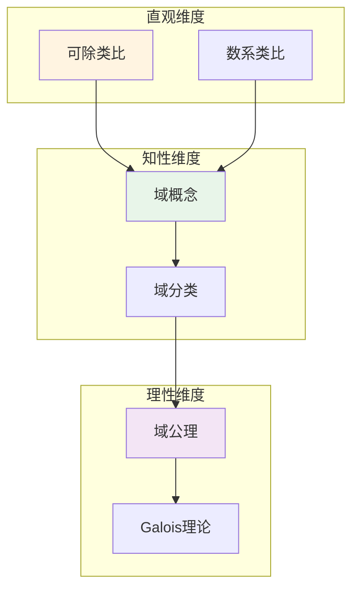

# 域 (Field)

**概念编号**: C.CORE.010
**知识层次**: L0-L2
**知识领域**: D2 (代数)
**创建日期**: 2025年11月21日
**最后更新**: 2025年11月21日

---

## 📋 概述

域是同时配备加法和乘法两种运算的代数结构，其中非零元对乘法构成群。域是代数学、数论、代数几何等领域的基础，是现代数学的核心概念。

**权威资源对齐**:

- Wikipedia: [Field (Mathematics)](https://en.wikipedia.org/wiki/Field_(mathematics))
- Stanford课程: Math 120 (Groups, Rings, and Fields)
- Princeton课程: MAT 350 (Abstract Algebra)
- MIT课程: 18.701 (Algebra I)
- Metamath: [Field Theory](http://us.metamath.org/mpeuni/df-field.html)

---

## 🎯 严格定义

### 基础定义 (L0)

**直观理解**: 域是一个集合配备加法和乘法两种运算，加法构成交换群，非零元对乘法构成交换群，乘法对加法满足分配律。

**基本定义**: 域 $(F, +, \cdot)$ 是一个集合 $F$ 配备两个二元运算 $+$ 和 $\cdot$，满足：

1. **加法群**: $(F, +)$ 是交换群
2. **乘法群**: $(F \setminus \{0\}, \cdot)$ 是交换群
3. **分配律**: $a \cdot (b + c) = a \cdot b + a \cdot c$

**简单例子**:

- $(\mathbb{Q}, +, \cdot)$: 有理数域
- $(\mathbb{R}, +, \cdot)$: 实数域
- $(\mathbb{C}, +, \cdot)$: 复数域
- $\mathbb{F}_p$: $p$ 元有限域（$p$ 素数）

### 形式化定义 (L1)

**公理化定义**: 域 $(F, +, \cdot)$ 是满足以下公理的代数结构：

**公理1 (加法群)**: $(F, +)$ 是交换群

**公理2 (乘法群)**: $(F \setminus \{0\}, \cdot)$ 是交换群

**公理3 (分配律)**: $\forall a, b, c \in F, a \cdot (b + c) = a \cdot b + a \cdot c$

**等价定义**: 域是交换环，其中每个非零元可逆。

**记号**:

- $(F, +, \cdot)$ 或 $F$: 域
- $0$: 加法单位元
- $1$: 乘法单位元
- $-a$: $a$ 的加法逆元
- $a^{-1}$: $a$ 的乘法逆元（$a \neq 0$）

---

## 📚 历史背景

### 发展脉络

**19世纪**: 域论的起源

- **Galois (1832)**: 在研究方程可解性时引入域概念
- **Dedekind (1871)**: 在研究代数数时引入数域
- **Weber (1893)**: 给出域的抽象定义

**20世纪初**: 域论的系统化

- **Steinitz (1910)**: 发展域论基础
- **Artin (1927)**: 发展Galois理论
- **Noether (1920s)**: 发展交换代数

**20世纪中期**: 域论的现代发展

- **Chevalley (1940s)**: 发展类域论
- **Langlands (1967)**: 提出朗兰兹纲领

### 关键人物

- **Évariste Galois (1811-1832)**: 域论的创始人
- **Ernst Steinitz (1871-1928)**: 发展域论基础
- **Emil Artin (1898-1962)**: 发展Galois理论

---

## 🔍 性质与定理

### 基本性质 (L1)

**性质1: 域的特征**:

- **定义**: 域的特征 $\text{char}(F)$ 是最小正整数 $p$ 使得 $p \cdot 1 = 0$，若不存在则 $\text{char}(F) = 0$
- **性质**: 特征为素数或0
- **应用**: 域的分类

**性质2: 域扩张**:

- **定义**: 若 $K$ 是 $F$ 的子域，则 $K/F$ 是域扩张
- **次数**: $[K:F] = \dim_F K$（作为 $F$-向量空间）
- **应用**: Galois理论

**性质3: 有限域**:

- **陈述**: 有限域的阶为 $p^n$（$p$ 素数）
- **性质**: 对每个 $p^n$，存在唯一的 $p^n$ 元有限域 $\mathbb{F}_{p^n}$
- **应用**: 编码理论、密码学

### 重要定理 (L2)

**定理1: 代数基本定理**:

- **陈述**: 复数域 $\mathbb{C}$ 是代数闭域
- **应用**: 多项式理论

**定理2: Galois对应**:

- **陈述**: 在Galois扩张 $K/F$ 中，子群和中间域一一对应
- **应用**: Galois理论

**定理3: 有限域的乘法群**:

- **陈述**: 有限域的乘法群是循环群
- **应用**: 有限域理论

---

## 💡 应用实例

### 理论应用

- 代数数论（数域）
- 代数几何（函数域）
- Galois理论（域扩张）

### 实际应用

#### 应用1: 编码理论 - 有限域上的Reed-Solomon码

**问题描述**:
在有限域 $\mathbb{F}_{2^8}$ 中，构造Reed-Solomon码，使用生成多项式 $g(x) = (x - \alpha)(x - \alpha^2)$，其中 $\alpha$ 是 $\mathbb{F}_{2^8}$ 的本原元。

**数学建模**:
Reed-Solomon码是有限域上的线性码，生成多项式为 $g(x) = \prod_{i=1}^{n-k} (x - \alpha^i)$。

**计算过程**:
- 有限域: $\mathbb{F}_{2^8}$（256个元素）
- 生成多项式: $g(x) = (x - \alpha)(x - \alpha^2) = x^2 - (\alpha + \alpha^2)x + \alpha^3$
- 码长: $n = 255$（$\mathbb{F}_{2^8}$ 的非零元素）
- 信息位: $k = 253$
- 纠错能力: $t = 1$（可纠正1个错误）

**结果解释**:
Reed-Solomon码广泛用于CD、DVD等存储介质，有限域提供了高效的算术运算。

**数据**:
- 有限域: $\mathbb{F}_{2^8}$（256个元素）
- 码长: 255
- 信息位: 253
- 纠错能力: 1个错误

#### 应用2: 密码学 - 椭圆曲线密码学

**问题描述**:
在有限域 $\mathbb{F}_{23}$ 上，椭圆曲线 $y^2 = x^3 + x + 1$，点 $P = (3, 10)$，计算 $2P$（点倍乘）。

**数学建模**:
椭圆曲线点群运算：$P + Q$ 使用弦切线法，$2P$ 使用切线法。

**计算过程**:
- 曲线: $y^2 = x^3 + x + 1$ 在 $\mathbb{F}_{23}$ 上
- 点 $P = (3, 10)$：验证 $10^2 \equiv 3^3 + 3 + 1 \equiv 31 \equiv 8 \pmod{23}$，$100 \equiv 8 \pmod{23}$ ✓
- 切线斜率：$s = \frac{3x_P^2 + 1}{2y_P} = \frac{3 \times 9 + 1}{20} = \frac{28}{20} = \frac{7}{5} \equiv 7 \times 5^{-1} \equiv 7 \times 14 \equiv 98 \equiv 6 \pmod{23}$
- $2P = (s^2 - 2x_P, s(x_P - x_{2P}) - y_P) = (36 - 6, 6(3 - 7) - 10) = (7, -34) = (7, 12) \pmod{23}$

**结果解释**:
椭圆曲线密码学（ECC）使用有限域上的椭圆曲线群，提供高安全性。

**数据**:
- 有限域: $\mathbb{F}_{23}$
- 椭圆曲线: $y^2 = x^3 + x + 1$
- 基点: $P = (3, 10)$
- 倍点: $2P = (7, 12)$

#### 应用3: 计算机科学 - 有限域算术

**问题描述**:
在有限域 $\mathbb{F}_{2^4}$（由不可约多项式 $x^4 + x + 1$ 定义）中，计算 $(x^3 + x^2 + 1) \times (x^2 + x)$。

**数学建模**:
有限域 $\mathbb{F}_{2^4}$ 的元素是次数小于4的多项式，运算模 $x^4 + x + 1$。

**计算过程**:
- $(x^3 + x^2 + 1)(x^2 + x) = x^5 + x^4 + x^3 + x^4 + x^3 + x^2 + x^2 + x = x^5 + 2x^4 + 2x^3 + 2x^2 + x$
- 在 $\mathbb{Z}_2$ 中：$= x^5 + x$
- 模 $x^4 + x + 1$：$x^5 = x \cdot x^4 \equiv x(x + 1) = x^2 + x \pmod{x^4 + x + 1}$
- 因此：$(x^3 + x^2 + 1)(x^2 + x) \equiv x^2 + x + x = x^2 \pmod{x^4 + x + 1}$

**结果解释**:
有限域算术用于AES加密算法中的S-box和MixColumns操作。

**数据**:
- 有限域: $\mathbb{F}_{2^4}$
- 不可约多项式: $x^4 + x + 1$
- 操作数: $x^3 + x^2 + 1$，$x^2 + x$
- 结果: $x^2$

---

## 🔗 关联概念

### 依赖关系

- 环（域是特殊的环）
- 群（域的加法群和乘法群）

### 推广关系

- 交换环（一般化）
- 除环（非交换域）

---

## 📖 参考文献

- Wikipedia: [Field (Mathematics)](https://en.wikipedia.org/wiki/Field_(mathematics))
- Artin, M. (2011). *Algebra*. Prentice Hall.
- Lang, S. (2002). *Algebra*. Springer.

---

## 🗺️ 思维导图 (编号: C.CORE.010.MIND)

### 域概念思维导图

---

## 📊 知识多维关系矩阵 (编号: C.CORE.010.MATRIX)

### 域的多维关系矩阵

| 维度 | 指标 | 域 |
|------|------|------|
| **知识层次** | L0基础 | ⭐⭐⭐⭐ |
| | L1中级 | ⭐⭐⭐⭐⭐ |
| | L2高级 | ⭐⭐⭐⭐ |
| | L3研究 | ⭐⭐⭐ |
| **知识领域** | D1基础数学 | ⭐⭐⭐ |
| | D2代数 | ⭐⭐⭐⭐⭐ |
| | D4几何 | ⭐⭐⭐ |
| | D6数论 | ⭐⭐⭐⭐ |
| **依赖关系** | 前置概念 | 环 |
| | 后续概念 | 向量空间、Galois理论 |
| **应用关系** | 理论应用 | ⭐⭐⭐⭐ |
| | 实际应用 | ⭐⭐⭐ |
| | 交叉应用 | ⭐⭐⭐ |
| **学习难度** | 直观理解 | ⭐⭐⭐ |
| | 形式化理解 | ⭐⭐⭐⭐ |
| | 深入应用 | ⭐⭐⭐⭐ |

---

## 💭 形象化解释与论证 (编号: C.CORE.010.VISUAL)

### 形象化解释

**1. 域的直观理解**

- **类比**: 域就像"可以进行四则运算的集合"
- **例子**:
  - 有理数域：可以进行加减乘除
  - 实数域：可以进行加减乘除
  - 有限域：如$\mathbb{F}_p$（$p$为素数）

**2. 域扩张的直观理解**

- **类比**: 域扩张就像"在域中添加新元素"
- **例子**:
  - 从有理数域$\mathbb{Q}$扩张到$\mathbb{Q}(\sqrt{2})$（添加$\sqrt{2}$）
  - 从实数域$\mathbb{R}$扩张到复数域$\mathbb{C}$（添加$i$）

**3. Galois理论的直观理解**

- **类比**: Galois理论就像"研究域扩张的对称性"
- **解释**:
  - Galois群描述域扩张的对称性
  - 通过Galois群可以判断方程是否可用根式求解

### 认知科学视角

**1. 数学教育家Dienes的观点**

- **多表征原则**: 通过具体域、抽象定义、几何表示等多种方式理解域
- **变化性原则**: 通过不同的域例子理解域的本质
- **教学启示**: 使用有理数域、实数域、有限域等多种例子

**2. 数学认知学家Tall的观点**

- **过程-对象对偶**: 理解"域运算"（过程）和"域"（对象）
- **认知层次**: 从具体域（如有理数域）到抽象域概念

---

## 👨‍🏫 专家观点与论证 (编号: C.CORE.010.EXPERT)

### 数学家的观点

**1. Évariste Galois (1811-1832) - Galois理论的创始人**
> "域扩张的Galois群决定了方程是否可用根式求解。"
>
> **意义**: Galois建立了Galois理论，解决了方程可解性问题。

**2. Richard Dedekind (1831-1916) - 域理论的奠基者**
> "域是代数学的基础，域扩张理论是理解代数的关键。"
>
> **意义**: Dedekind建立了域理论的基础。

### 数学教育家的观点

**1. Zoltan Dienes (1916-2014) - 数学教育家**
> "域概念应该通过具体域（有理数域、实数域）逐步抽象学习。"
>
> **教学启示**:
>
> - 从有理数域开始理解域的概念
> - 通过域扩张理解域的结构
> - 逐步抽象到一般域概念

**2. Hans Freudenthal (1905-1990) - 数学教育家**
> "域概念的学习需要从'环扩展'发展到'Galois结构'。"
>
> **认知发展**:
>
> - **扩展阶段**: 理解域作为环的扩展（添加除法）
> - **结构阶段**: 理解域扩张和Galois理论

### 数学认知学家的观点

**1. David Tall - 数学认知学家**
> "域概念的理解需要从'过程'（如何运算）发展到'对象'（域本身）。"
>
> **认知层次**:
>
> - **过程层次**: 理解"如何做域运算"（如$\frac{a}{b} + \frac{c}{d}$）
> - **对象层次**: 理解"域"（如$\mathbb{Q}$是一个域）

---

## 🎨 认知维度表征 (编号: C.CORE.010.COGNITIVE)

### 直观维度表征 (编号: C.CORE.010.INTUITIVE)

#### 形象类比

- **可除类比**: 域就像"可以除法的环"
  - 除了加法和乘法，还可以做除法
  - 就像有理数、实数、复数

- **数系类比**: 域就像"数系的抽象"
  - 有理数域、实数域、复数域
  - 就像熟悉的数系，但更抽象

#### 具体例子

- **例子1**: $(\mathbb{Q}, +, \cdot)$ - 有理数域
  - 加法：有理数加法
  - 乘法：有理数乘法
  - 除法：非零有理数可除

- **例子2**: $\mathbb{F}_p$ - $p$元有限域（$p$为素数）
  - 元素：$0, 1, 2, \ldots, p-1$
  - 运算：模$p$运算
  - 是有限域

#### 可视化表示

#### 几何直观

- **数系结构**: 通过数系理解域
  - 有理数域、实数域、复数域
  - 数系的运算性质

- **域扩张**: 通过域扩张理解域的结构
  - 从有理数域到实数域
  - 从实数域到复数域

---

### 知性维度表征 (编号: C.CORE.010.INTELLECTUAL)

#### 概念定义

- **严格定义**: 域 $(F, +, \cdot)$ 是交换环，且非零元素在乘法下形成群
- **等价定义**: 域是每个非零元素都有乘法逆元的交换环
- **特征描述**: 域是可以做除法的交换环

#### 概念分类

- **有限域 vs 无限域**: 按元素个数分类
- **特征$p$域 vs 特征$0$域**: 按特征分类
- **代数闭域 vs 非代数闭域**: 按代数闭性分类

#### 概念关系

#### 知识矩阵

| 维度 | 指标 | 域 |
|------|------|------|
| **知识层次** | L0基础 | ⭐⭐⭐⭐ |
| | L1中级 | ⭐⭐⭐⭐⭐ |
| | L2高级 | ⭐⭐⭐⭐ |
| **知识领域** | D2代数 | ⭐⭐⭐⭐⭐ |
| **学习难度** | 直观理解 | ⭐⭐⭐ |
| | 形式化理解 | ⭐⭐⭐⭐ |
| **认知维度** | 直观维度 | ⭐⭐⭐ |
| | 知性维度 | ⭐⭐⭐⭐⭐ |
| | 理性维度 | ⭐⭐⭐⭐ |

---

### 理性维度表征 (编号: C.CORE.010.RATIONAL)

#### 公理体系

- **加法公理**: $(F, +)$ 是交换群
- **乘法公理**: $(F^*, \cdot)$ 是交换群（$F^* = F \setminus \{0\}$）
- **分配律**: $a(b+c) = ab + ac$

#### 形式化定义

- **形式化定义**: 使用一阶逻辑严格定义
- **符号系统**: $F$, $+$, $\cdot$, $0$, $1$, $a^{-1}$
- **类型系统**: 域是集合类型配备两种运算类型的代数结构

#### 逻辑推理

- **基本定理**: 域扩张的性质、Galois理论、有限域的分类
- **证明思路**: 使用公理和逻辑推理证明
- **推理链**: 公理 → 基本性质 → 域扩张 → Galois理论

#### 证明系统

- **证明方法**: 构造性证明、Galois理论、分类定理
- **形式化证明**: 可以使用Lean4等工具进行形式化
- **验证工具**: Metamath、Lean4等

---

### 综合整合表征 (编号: C.CORE.010.INTEGRATED)

#### 多维度整合

#### 图形转换

- **思维导图**: 展示域的知识结构
- **知识图谱**: 展示域与其他概念的关系
- **知识矩阵**: 展示域的多维度特征

#### 应用示例

- **应用1**: Galois理论（方程可解性）
- **应用2**: 代数数论（数域、类域论）
- **应用3**: 编码理论（有限域、纠错码）

---

**创建日期**: 2025年11月21日
**最后更新**: 2025年11月21日
**维护状态**: 持续更新中
