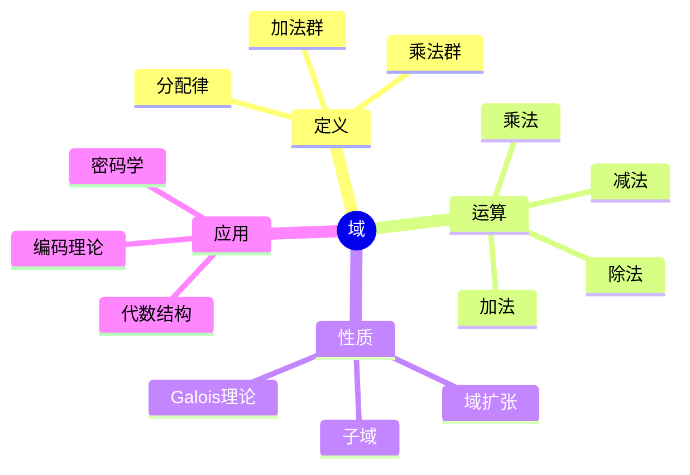
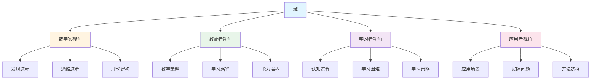
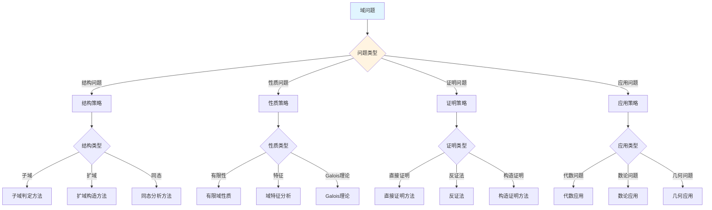
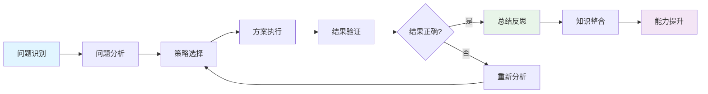
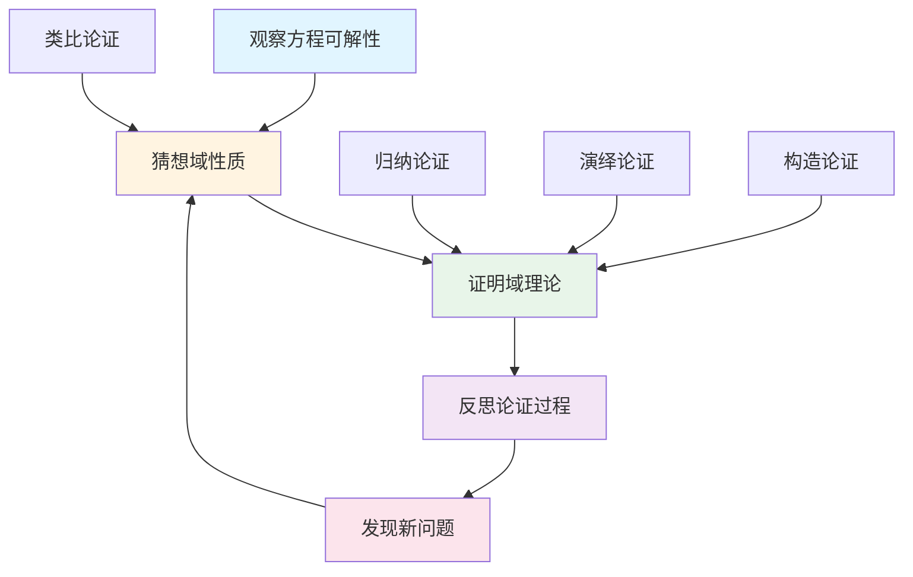
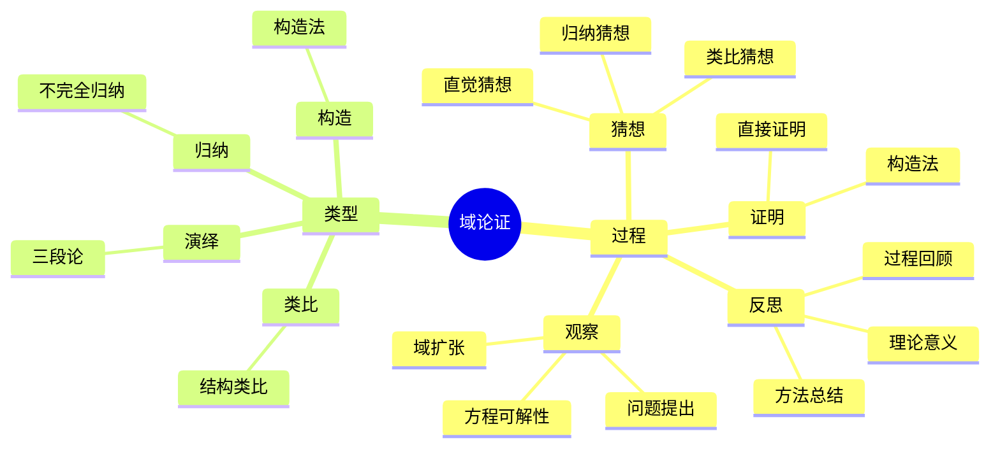
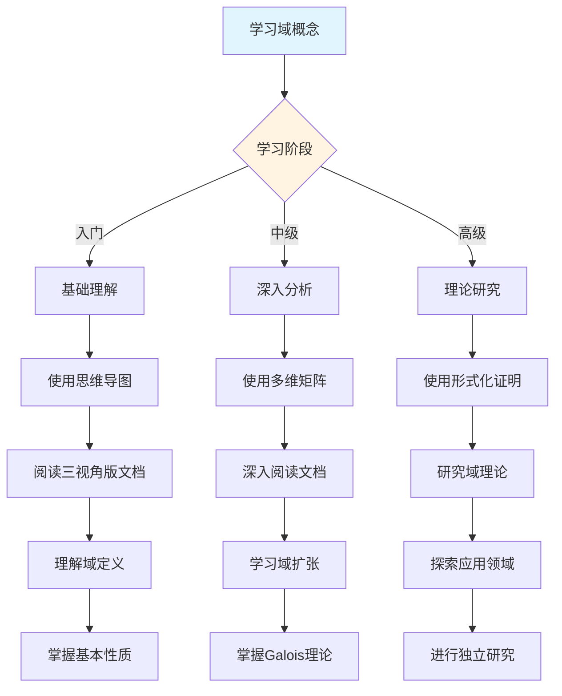
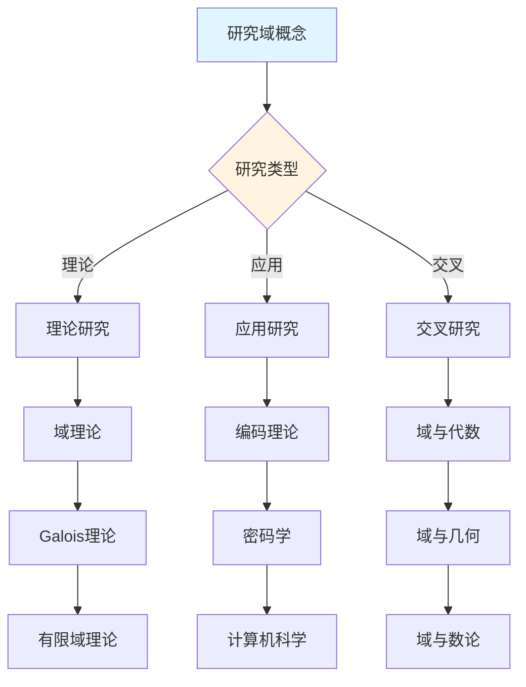
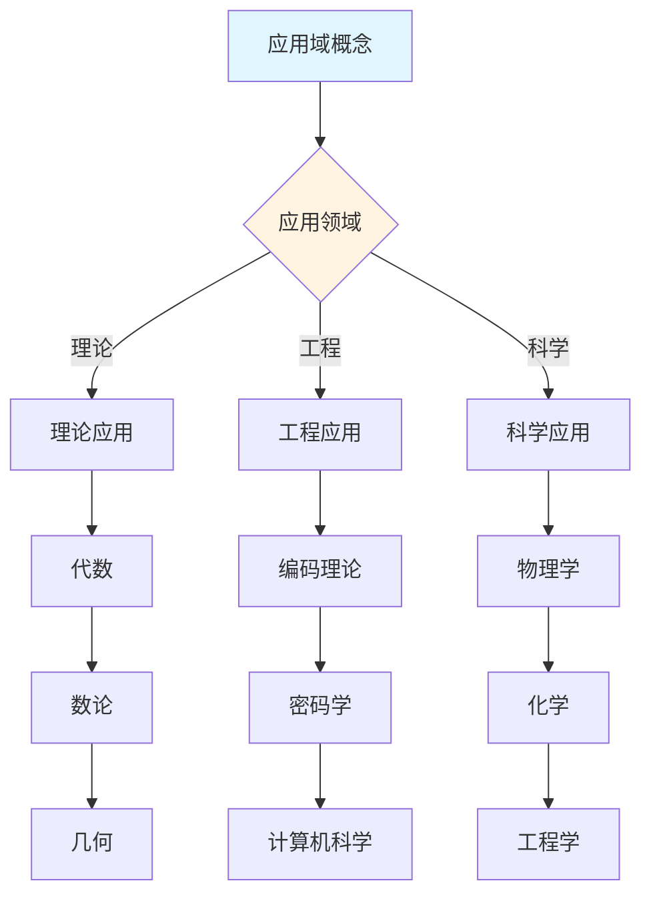
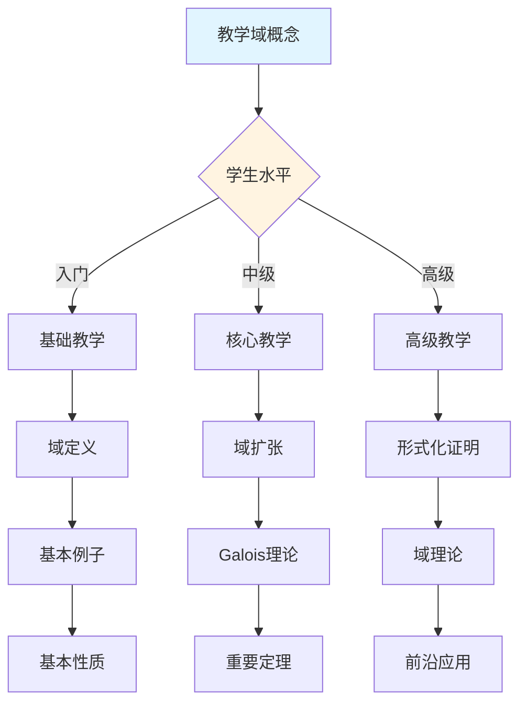

---
msc_primary: "00A99"
---

# 域 (Field) - 三视角组织版

**概念编号**: C.CORE.010
**知识层次**: L0-L2
**知识领域**: D2 (代数)
**创建日期**: 2025年1月
**最后更新**: 2026-04-05

---

## 📋 目录 / Table of Contents

- [域 (Field) - 三视角组织版](#域-field---三视角组织版)
  - 📋 目录 / Table of Contents
  - 1. 📋 概述 (编号: C.CORE.010.01)
  - [🧠 认知学视角：如何理解域 (编号: C.CORE.010.02)](#认知学视角如何理解域-编号-ccore01002)
    - [认知起点 (编号: C.CORE.010.02.01)](#认知起点-编号-ccore0100201)
    - [认知过程 (编号: C.CORE.010.02.02)](#认知过程-编号-ccore0100202)
      - [阶段1：直观理解阶段 (编号: C.CORE.010.02.02.01)](#阶段1直观理解阶段-编号-ccore010020201)
      - [阶段2：概念形成阶段 (编号: C.CORE.010.02.02.02)](#阶段2概念形成阶段-编号-ccore010020202)
      - [阶段3：形式化阶段 (编号: C.CORE.010.02.02.03)](#阶段3形式化阶段-编号-ccore010020203)

## 形式化定义

**定义（域）**：域是一个交换环 $(F, +, \cdot)$，其中 $0 \neq 1$，且每个非零元都有乘法逆元：
$$\forall a \in F, a \neq 0 \Rightarrow \exists a^{-1} \in F: a \cdot a^{-1} = 1$$

**等价表述**：域是一个集合 $F$，配备加法和乘法，使得：
- $(F, +)$ 是交换群
- $(F \setminus \{0\}, \cdot)$ 是交换群
- 分配律成立

**符号说明**：
- $\mathbb{Q}, \mathbb{R}, \mathbb{C}$：常见的域
- $\mathbb{F}_p$ 或 $\mathbb{Z}/p\mathbb{Z}$：$p$ 元有限域
- $\text{char}(F)$：域的特征
- $F^\times = F \setminus \{0\}$：乘法群

    - [认知障碍 (编号: C.CORE.010.02.03)](#认知障碍-编号-ccore0100203)
    - [认知工具 (编号: C.CORE.010.02.04)](#认知工具-编号-ccore0100204)
  - [🎓 教育学视角：如何教学域 (编号: C.CORE.010.03)](#教育学视角如何教学域-编号-ccore01003)
    - [教学目标 (编号: C.CORE.010.03.01)](#教学目标-编号-ccore0100301)
    - [教学路径 (编号: C.CORE.010.03.02)](#教学路径-编号-ccore0100302)
      - [阶段1：引入阶段（激发兴趣） (编号: C.CORE.010.03.02.01)](#阶段1引入阶段激发兴趣-编号-ccore010030201)
      - [阶段2：探索阶段（主动建构） (编号: C.CORE.010.03.02.02)](#阶段2探索阶段主动建构-编号-ccore010030202)
      - [阶段3：形式化阶段（抽象概括） (编号: C.CORE.010.03.02.03)](#阶段3形式化阶段抽象概括-编号-ccore010030203)
      - [阶段4：巩固阶段（应用深化） (编号: C.CORE.010.03.02.04)](#阶段4巩固阶段应用深化-编号-ccore010030204)
    - [教学难点 (编号: C.CORE.010.03.03)](#教学难点-编号-ccore0100303)
    - [教学策略 (编号: C.CORE.010.03.04)](#教学策略-编号-ccore0100304)
    - [评估方法 (编号: C.CORE.010.03.05)](#评估方法-编号-ccore0100305)
  - [🔬 数学家视角：如何思考域 (编号: C.CORE.010.04)](#数学家视角如何思考域-编号-ccore01004)
    - [问题起源 (编号: C.CORE.010.04.01)](#问题起源-编号-ccore0100401)
    - [思维过程 (编号: C.CORE.010.04.02)](#思维过程-编号-ccore0100402)
      - [步骤1：问题提出 (编号: C.CORE.010.04.02.01)](#步骤1问题提出-编号-ccore010040201)
      - [步骤2：概念形成 (编号: C.CORE.010.04.02.02)](#步骤2概念形成-编号-ccore010040202)
      - [步骤3：理论发展 (编号: C.CORE.010.04.02.03)](#步骤3理论发展-编号-ccore010040203)
    - [历史发展 (编号: C.CORE.010.04.03)](#历史发展-编号-ccore0100403)
    - [3.2 关键人物和贡献 (编号: C.CORE.010.04.04)](#32-关键人物和贡献-编号-ccore0100404)
    - [重要定理 (编号: C.CORE.010.04.05)](#重要定理-编号-ccore0100405)
    - [开放问题 (编号: C.CORE.010.04.06)](#开放问题-编号-ccore0100406)
    - [一、第一人称思维描述 (编号: C.CORE.010.04.07)](#一第一人称思维描述-编号-ccore0100407)
      - [1.1 Galois的发现过程](#11-galois的发现过程)
    - [二、数学直觉的形成 (编号: C.CORE.010.04.08)](#二数学直觉的形成-编号-ccore0100408)
      - [2.1 直觉在概念发现中的作用](#21-直觉在概念发现中的作用)
      - [2.2 如何培养域直觉](#22-如何培养域直觉)
    - [三、数学美的教育价值 (编号: C.CORE.010.04.09)](#三数学美的教育价值-编号-ccore0100409)
      - [3.1 域论的美在哪里](#31-域论的美在哪里)
      - [3.2 如何培养学生的数学美感](#32-如何培养学生的数学美感)
    - [四、问题解决策略 (编号: C.CORE.010.04.10)](#四问题解决策略-编号-ccore0100410)
      - [4.1 数学家的启发式方法](#41-数学家的启发式方法)
      - [4.2 思维过程分析](#42-思维过程分析)
    - [五、批判性反思 (编号: C.CORE.010.04.11)](#五批判性反思-编号-ccore0100411)
      - [5.1 域概念的局限性](#51-域概念的局限性)
      - [5.2 域理论的未解决问题](#52-域理论的未解决问题)
  - [💡 数学解释：为什么域是这样定义的 (编号: C.CORE.010.05)](#数学解释为什么域是这样定义的-编号-ccore01005)
    - [一、直观解释：域是什么？](#一直观解释域是什么)
      - [1.1 具体例子](#11-具体例子)
      - [1.2 形象类比](#12-形象类比)
      - [1.3 几何直观](#13-几何直观)
      - [1.4 操作体验](#14-操作体验)
    - [二、知性解释：域的本质是什么？](#二知性解释域的本质是什么)
      - [2.1 概念定义](#21-概念定义)
      - [2.2 分类体系](#22-分类体系)
      - [2.3 抽象结构](#23-抽象结构)
      - [2.4 知识体系](#24-知识体系)
    - [三、理性解释：域的公理化定义](#三理性解释域的公理化定义)
      - [3.1 公理体系](#31-公理体系)
      - [3.2 形式化证明](#32-形式化证明)
      - [3.3 系统建构](#33-系统建构)
    - [四、多视角解释：从不同角度理解域](#四多视角解释从不同角度理解域)
      - [4.1 数学家视角：域是如何被发现的？](#41-数学家视角域是如何被发现的)
      - [4.2 教育者视角：如何教学域？](#42-教育者视角如何教学域)
      - [4.3 学习者视角：如何学习域？](#43-学习者视角如何学习域)
      - [4.4 应用者视角：如何应用域？](#44-应用者视角如何应用域)
    - [五、思维表征：用多种方式理解域](#五思维表征用多种方式理解域)
      - [5.1 思维导图：域的知识结构](#51-思维导图域的知识结构)
      - [5.2 矩阵对比：不同解释方式的对比](#52-矩阵对比不同解释方式的对比)
      - [5.3 多视角表征：从不同角度表征域](#53-多视角表征从不同角度表征域)
      - [5.4 决策树：域问题分类和策略选择](#54-决策树域问题分类和策略选择)
      - [5.5 决策逻辑路径：域问题解决过程](#55-决策逻辑路径域问题解决过程)
      - [5.6 多维对比矩阵：域概念特征对比](#56-多维对比矩阵域概念特征对比)
  - [🔍 数学论证：如何论证域 (编号: C.CORE.010.06)](#数学论证如何论证域-编号-ccore01006)
    - [一、论证过程：从观察到反思](#一论证过程从观察到反思)
      - [1.1 观察（Observation）](#11-观察observation)
      - [1.2 猜想（Conjecture）](#12-猜想conjecture)
      - [1.3 证明（Proof）](#13-证明proof)
      - [1.4 反思（Reflection）](#14-反思reflection)
    - [二、论证类型：多种推理方式](#二论证类型多种推理方式)
      - [2.1 归纳论证（Inductive Reasoning）](#21-归纳论证inductive-reasoning)
      - [2.2 演绎论证（Deductive Reasoning）](#22-演绎论证deductive-reasoning)
      - [2.3 类比论证（Analogical Reasoning）](#23-类比论证analogical-reasoning)
      - [2.4 构造论证（Constructive Reasoning）](#24-构造论证constructive-reasoning)
    - [三、论证可视化：用图形表示论证过程](#三论证可视化用图形表示论证过程)
      - [3.1 论证流程图](#31-论证流程图)
      - [3.2 论证类型对比](#32-论证类型对比)
      - [3.3 论证思维导图](#33-论证思维导图)
  - [🔗 三视角整合 (编号: C.CORE.010.07)](#三视角整合-编号-ccore01007)
    - [三个视角的关联](#三个视角的关联)
    - [如何综合运用三个视角](#如何综合运用三个视角)
  - [📚 参考文献 (编号: C.CORE.010.08)](#参考文献-编号-ccore01008)
    - [权威资源](#权威资源)
    - [经典教材](#经典教材)
    - [研究论文](#研究论文)

---

## 1. 📋 概述 (编号: C.CORE.010.01)

域是同时配备加法和乘法两种运算的代数结构，其中非零元对乘法构成群。域是代数学、数论、代数几何等领域的基础，是现代数学的核心概念。

本文档从**数学认知学**、**教育学**、**数学家**三个视角深入展开域概念，避免简单的概念堆垒。

**权威资源对齐**:

- Wikipedia: [Field (Mathematics)](https://en.wikipedia.org/wiki/Field_(mathematics))
- Stanford课程: Math 120 (Groups, Rings, and Fields)
- Princeton课程: MAT 350 (Abstract Algebra)
- MIT课程: 18.701 (Algebra I)
- Metamath: [Field Theory](http://us.metamath.org/mpeuni/df-field.html)[需更新][需更新]

---

## 🧠 认知学视角：如何理解域 (编号: C.CORE.010.02)

### 认知起点 (编号: C.CORE.010.02.01)

**学习者已有的知识基础**:

- 环的概念
- 群的概念
- 日常经验中的"数系"概念

**日常经验中的类似概念**:

- "有理数"：可以加减乘除
- "实数"：可以加减乘除
- "复数"：可以加减乘除

### 认知过程 (编号: C.CORE.010.02.02)

#### 阶段1：直观理解阶段 (编号: C.CORE.010.02.02.01)

**具体例子**:

- 例子1：$(\mathbb{Q}, +, \cdot)$ - 有理数域
- 例子2：$(\mathbb{R}, +, \cdot)$ - 实数域
- 例子3：$(\mathbb{C}, +, \cdot)$ - 复数域

**形象类比**:

- **数系类比**: 域就像"可以加减乘除的数系"
  - 可以相加
  - 可以相乘
  - 可以相除（非零元）

- **结构类比**: 域就像"特殊的环"
  - 加法构成群
  - 非零元对乘法构成群
  - 乘法对加法满足分配律

**可视化表示**:

```text
域的结构:
    加法群 (F, +)
         ↓
    乘法群 (F\{0}, ·)
         ↓
    分配律连接
```

#### 阶段2：概念形成阶段 (编号: C.CORE.010.02.02.02)

**从例子中抽象出共同特征**:

- 所有例子都涉及"两种运算"
- 加法构成交换群
- 非零元对乘法构成交换群
- 乘法对加法满足分配律

**识别关键属性**:

1. **加法群**: $(F, +)$是交换群
2. **乘法群**: $(F \setminus \{0\}, \cdot)$是交换群
3. **分配律**: $a \cdot (b + c) = a \cdot b + a \cdot c$

**建立概念边界**:

- **什么是域**: 满足加法群、非零元乘法群、分配律的代数结构
- **什么不是域**:
  - 整数环（非零元对乘法不构成群）
  - 矩阵环（非零元对乘法不构成群）

#### 阶段3：形式化阶段 (编号: C.CORE.010.02.02.03)

**严格定义**:

- 公理化定义：通过加法群、乘法群、分配律三条公理
- 范畴定义：域是环的特殊情况

**公理化表述**:

- 公理1：加法群
- 公理2：乘法群（非零元）
- 公理3：分配律

**逻辑结构**:

- 域是特殊的环
- 域是向量空间的基础
- 域是代数结构的重要类型

### 认知障碍 (编号: C.CORE.010.02.03)

**常见误解**:

1. **误解1**: 认为所有环都是域
   - **纠正**: 域是特殊的环，非零元对乘法构成群

2. **误解2**: 认为域必须是无限的
   - **纠正**: 域可以是有限的，如$\mathbb{F}_p$（$p$素数）

3. **误解3**: 混淆域和环
   - **纠正**: 域是特殊的环，非零元对乘法构成群

**理解难点**:

1. **难点1**: 有限域的概念
   - **原因**: 有限域比较抽象
   - **解决方法**: 用具体例子，如$\mathbb{F}_p$

2. **难点2**: 域的扩张
   - **原因**: 域的扩张比较抽象
   - **解决方法**: 用具体例子，如$\mathbb{Q} \subset \mathbb{R} \subset \mathbb{C}$

3. **难点3**: Galois理论
   - **原因**: Galois理论比较抽象
   - **解决方法**: 从具体例子开始，逐步抽象

**认知陷阱**:

- **有限域**: 需要理解有限域的存在性
- **域的扩张**: 需要理解域的扩张结构

### 认知工具 (编号: C.CORE.010.02.04)

**类比工具**:

- **数系类比**: 域 = 可以加减乘除的数系
- **结构类比**: 域 = 特殊的环

**可视化工具**:

- **域的结构图**: 用图表示域的结构
- **域的扩张图**: 用图表示域的扩张

**具体化工具**:

- **具体例子**: 用具体例子理解抽象概念
- **反例**: 用反例理解概念边界

---

## 🎓 教育学视角：如何教学域 (编号: C.CORE.010.03)

### 教学目标 (编号: C.CORE.010.03.01)

**知识目标**:

- 理解域的基本概念
- 掌握域的公理化定义
- 理解域的性质
- 理解域的扩张

**能力目标**:

- 能够判断一个结构是否是域
- 能够进行域运算
- 能够理解域的结构
- 能够应用域论解决实际问题

**情感目标**:

- 培养数学抽象思维
- 培养代数思维
- 激发对数学的兴趣

### 教学路径 (编号: C.CORE.010.03.02)

#### 阶段1：引入阶段（激发兴趣） (编号: C.CORE.010.03.02.01)

**实际问题**:

- 问题1：如何统一描述有理数、实数、复数的运算？
- 问题2：如何研究代数方程？
- 问题3：如何研究Galois理论？

**历史背景**:

- 域论的历史发展
- 域论在数学中的地位
- 域论在Galois理论中的应用

**引发认知冲突**:

- 问题：如何扩展环的概念？
- 引出域的概念

#### 阶段2：探索阶段（主动建构） (编号: C.CORE.010.03.02.02)

**引导发现**:

1. 让学生自己列举可以加减乘除的数系
2. 让学生观察这些数系的共同特征
3. 引导学生抽象出域的定义

**合作探究**:

- 小组讨论：什么是域？
- 小组讨论：域有哪些性质？
- 小组讨论：如何表示域？

**多元表征**:

- **语言表征**: "域是满足加法群、非零元乘法群、分配律的代数结构"
- **符号表征**: $(F, +, \cdot)$
- **图形表征**: 域的结构图
- **集合表征**: 公理化定义

#### 阶段3：形式化阶段（抽象概括） (编号: C.CORE.010.03.02.03)

**严格定义**:

- 域的公理化定义
- 域的性质
- 域的扩张

**性质证明**:

- 域的基本性质
- 域的扩张性质
- Galois理论

**应用拓展**:

- 域在数学中的应用
- 域在Galois理论中的应用
- 域在代数几何中的应用

#### 阶段4：巩固阶段（应用深化） (编号: C.CORE.010.03.02.04)

**练习应用**:

- 基础练习：域的表示和运算
- 应用练习：用域解决实际问题
- 综合练习：域的综合应用

**变式训练**:

- 不同形式的域表示
- 不同性质的域
- 域的扩张

**知识整合**:

- 域与其他代数结构的联系
- 域在数学体系中的地位

### 教学难点 (编号: C.CORE.010.03.03)

**难点1：有限域的概念**:

- **难点描述**: 学生难以理解有限域
- **解决方法**:
  - 用具体例子，如$\mathbb{F}_p$
  - 强调有限域的存在性
  - 用运算表可视化

**难点2：域的扩张**:

- **难点描述**: 学生难以理解域的扩张
- **解决方法**:
  - 用具体例子，如$\mathbb{Q} \subset \mathbb{R} \subset \mathbb{C}$
  - 强调扩张的结构
  - 用图形可视化

**难点3：Galois理论**:

- **难点描述**: 学生难以理解Galois理论
- **解决方法**:
  - 从具体例子开始
  - 逐步抽象到理论
  - 强调Galois理论的重要性

### 教学策略 (编号: C.CORE.010.03.04)

**策略1：从具体到抽象**:

- 先给出具体例子
- 再抽象出一般概念
- 最后给出严格定义

**策略2：多元表征**:

- 用语言、符号、图形等多种方式表示同一概念
- 帮助学生建立不同表征之间的联系

**策略3：问题驱动**:

- 从实际问题出发
- 引出数学概念
- 解决问题

**策略4：可视化教学**:

- 使用域的结构图
- 使用域的扩张图
- 使用具体例子

### 评估方法 (编号: C.CORE.010.03.05)

**形成性评估**（评估理解过程）:

- 课堂提问：检查学生对概念的理解
- 小组讨论：观察学生的思考过程
- 练习作业：检查学生的应用能力

**总结性评估**（评估最终理解）:

- 测验：检查学生对概念和运算的掌握
- 项目：检查学生应用域论解决实际问题的能力
- 反思：检查学生对域概念的理解深度

---

## 🔬 数学家视角：如何思考域 (编号: C.CORE.010.04)

### 问题起源 (编号: C.CORE.010.04.01)

**历史背景**:

- 19世纪：域论的起源
- 20世纪初：域论的系统化
- 20世纪中期：域论的现代发展

**原始问题**:

- **问题1**: 如何统一描述有理数、实数、复数的运算？
- **问题2**: 如何研究代数方程？
- **问题3**: 域有哪些性质？

**研究动机**:

- 统一数系理论
- 发展Galois理论
- 发展代数几何

### 思维过程 (编号: C.CORE.010.04.02)

#### 步骤1：问题提出 (编号: C.CORE.010.04.02.01)

**观察到的现象**:

- 有理数、实数、复数都有两种运算
- 这些运算有一些共同的性质
- 需要统一的概念来描述

**提出的猜想**:

- 可以引入域概念
- 域可以统一描述这些结构
- 域有丰富的结构

**需要解决的问题**:

- 如何定义域？
- 域应该满足什么条件？
- 域有哪些性质？

#### 步骤2：概念形成 (编号: C.CORE.010.04.02.02)

**尝试性定义**:

- **公理化定义**: 通过加法群、乘法群、分配律
- **范畴定义**: 域是特殊的环

**性质探索**:

- 域的基本性质
- 域的扩张
- Galois理论

**结构发现**:

- 域是特殊的环
- 域是向量空间的基础
- 域是代数结构的重要类型

#### 步骤3：理论发展 (编号: C.CORE.010.04.02.03)

**定理证明**:

- 域的基本性质
- 域的扩张性质
- Galois理论

**应用拓展**:

- 域在数学中的应用
- 域在Galois理论中的应用
- 域在代数几何中的应用

**理论完善**:

- 域的公理化
- 域的范畴论研究
- Galois理论的发展

### 历史发展 (编号: C.CORE.010.04.03)

**早期阶段**（19世纪）:

- **Galois (1832)**: 在研究方程可解性时引入域概念
- **Dedekind (1871)**: 研究代数数域

**关键突破**（20世纪初）:

- **Steinitz (1910)**: 发展域论
- **Artin (1927)**: 发展Galois理论

**现代发展**（20世纪中期）:

- **Grothendieck (1950s)**: 发展概形理论
- **Langlands (1967)**: 朗兰兹纲领

### 3.2 关键人物和贡献 (编号: C.CORE.010.04.04)

**Évariste Galois (1811-1832)**:

- 在研究方程可解性时引入域概念
- 建立Galois理论的基础

**Ernst Steinitz (1871-1928)**:

- 发展域论
- 建立现代域论

**Emil Artin (1898-1962)**:

- 发展Galois理论
- 建立现代Galois理论

### 重要定理 (编号: C.CORE.010.04.05)

**Galois基本定理**:

- 域的Galois扩张与Galois群一一对应
- 意义：Galois理论的基础

**有限域的存在性**:

- 对每个素数幂$p^n$，存在唯一的$p^n$元有限域
- 意义：有限域分类的基础

### 开放问题 (编号: C.CORE.010.04.06)

**未解决问题**:

- 域的分类问题
- 域的表示问题
- 域的应用问题

**研究方向**:

- 域的范畴论研究
- 域的表示论研究
- 域的应用研究

### 一、第一人称思维描述 (编号: C.CORE.010.04.07)

#### 1.1 Galois的发现过程

**详细历史背景**:

- **1830年**：Galois研究方程的可解性
- **背景**：研究方程的系数域，发现域与方程可解性的关系
- **问题**：如何判断方程是否可解？域的性质如何影响方程的可解性？

**Galois的详细第一人称描述**:
> "1830年，我在研究方程的可解性时，遇到了一个问题：如何判断方程是否可解？
>
> 我发现，方程的系数域有特殊的性质。例如，对于方程$x^2 - 2 = 0$：
>
> - **系数域**：$\mathbb{Q}$（有理数域）
> - **根域**：$\mathbb{Q}(\sqrt{2}) = \{a + b\sqrt{2} : a, b \in \mathbb{Q}\}$
> - **Galois群**：$\text{Gal}(\mathbb{Q}(\sqrt{2})/\mathbb{Q}) = \{e, \sigma\}$，其中$\sigma(\sqrt{2}) = -\sqrt{2}$
> - **可解性**：Galois群是可解群，所以方程可解
>
> 对于五次方程$x^5 - x - 1 = 0$：
>
> - **系数域**：$\mathbb{Q}$
> - **Galois群**：$S_5$（5次对称群）
> - **可解性**：$S_5$不是可解群，所以方程不可用根式解
>
> 我的发现是：
>
> - **域的概念**：一个集合配备加法和乘法运算，满足某些公理（交换环，且非零元有乘法逆元）
> - **域扩张**：从一个域构造更大的域
> - **Galois群**：域扩张的自同构群
> - **可解性**：方程可解当且仅当对应的Galois群是可解群
>
> 这让我意识到，域是描述方程系数集合的工具，域的性质决定了方程的可解性。这为代数方程理论提供了新的视角。"

**详细的思维过程**:

1. **观察到的现象**（1830年）:

   **现象1：系数域有特殊的性质**
   - **问题**：方程的系数域有特殊的性质
   - **例子**：$\mathbb{Q}$和$\mathbb{Q}(\sqrt{2})$都是域
   - **需要**：描述这些性质

   **现象2：域的性质与方程可解性相关**
   - **问题**：域的性质如何影响方程的可解性？
   - **例子**：$\mathbb{Q}(\sqrt{2})$的Galois群是可解群，所以方程可解
   - **需要**：建立域与方程可解性的关系

   **现象3：需要统一的概念**
   - **问题**：如何统一处理不同的域？
   - **思路**：用域论统一
   - **需要**：建立域论的理论体系

2. **提出的猜想**（1830年）:

   **猜想1：用域描述系数集合**
   - **思路**：定义域的概念，方程的系数在域中
   - **例子**：$\mathbb{Q}$和$\mathbb{Q}(\sqrt{2})$都是域
   - **优点**：统一描述系数集合

   **猜想2：域与方程可解性相关**
   - **关系**：方程可解当且仅当对应的Galois群是可解群
   - **例子**：$S_5$不是可解群，所以五次方程不可用根式解
   - **意义**：用域的性质判断方程的可解性

   **猜想3：域是数学的基础**
   - **性质**：域是抽象的数学结构
   - **应用**：域可以应用到更广泛的领域
   - **意义**：域是统一的数学结构

3. **遇到的困难**（1830年）:

   **困难1：如何严格定义域？**
   - **问题**：如何定义域？
   - **解决**：通过公理定义域（交换环，且非零元有乘法逆元）
   - **意义**：为域提供严格的数学基础

   **困难2：如何判断域的性质？**
   - **问题**：如何判断域是否有限？是否代数闭？
   - **解决**：通过域的结构判断
   - **意义**：为域分类提供方法

   **困难3：如何应用域论？**
   - **问题**：如何用域论解决实际问题？
   - **解决**：建立Galois理论
   - **意义**：为代数方程理论提供新视角

4. **突破的时刻**（1830年，Galois）:

   **突破1：域的概念**
   - 引入域的概念描述系数集合
   - **关键**：抽象出域的结构
   - **意义**：为域论提供基础

   **突破2：Galois理论**
   - 建立域与方程可解性的关系
   - **关键**：方程可解当且仅当对应的Galois群是可解群
   - **意义**：为代数方程理论提供新视角

   **突破3：域论的广泛应用**
   - 域论可以应用到更广泛的领域
   - **关键**：域是抽象的数学结构
   - **意义**：域论成为数学的基础

### 二、数学直觉的形成 (编号: C.CORE.010.04.08)

#### 2.1 直觉在概念发现中的作用

**Galois的直觉**:

- **直觉1**: "域"是"系数的集合"——这个直觉引导Galois发现域论
- **直觉2**: 域与方程可解性相关——这个直觉引导Galois建立Galois理论
- **直觉3**: 域是数学的基础——这个直觉引导Galois建立域论

**直觉的验证**:

- 通过严格的数学证明验证直觉的正确性
- 通过公理化严格化域定义
- 通过应用验证域的广泛性

**直觉的深化**:

- 从"系数的集合"到"域的公理化"
- 从"方程可解性"到"Galois理论"
- 从"数学基础"到"域论的广泛应用"

#### 2.2 如何培养域直觉

**数学家的建议**:

- **Galois**: "域直觉是长期训练的结果。通过大量练习和深入思考，我们可以培养对域的直觉。"
- **Dedekind**: "从具体例子开始，逐步抽象，这是培养域直觉的有效方法。"

**培养方法**:

1. **大量练习**: 通过大量域运算练习，培养对域的直觉
2. **深入思考**: 深入思考域的本质，理解域的深层结构
3. **类比和联想**: 通过类比和联想，建立域与其他概念的联系
4. **与专家交流**: 与数学家交流，学习他们的思维方式

**教学启示**:

- 从具体例子开始，逐步抽象
- 鼓励学生思考域的本质
- 引导学生建立域与其他概念的联系

### 三、数学美的教育价值 (编号: C.CORE.010.04.09)

#### 3.1 域论的美在哪里

**结构美**:

- **简洁性**: 域的概念非常简洁——"满足加法和乘法公理的集合，乘法有逆元"
- **统一性**: 域可以统一描述数学中的各种数系
- **和谐性**: 域运算满足优美的规律（交换律、结合律等）

**数学家的评价**:

- **Galois**: "域论的美在于它的统一性。它为我们提供了一个统一的框架来理解数学中的数系。"
- **Dedekind**: "域论的美在于它的基础性。它是数学的基础，所有数系都可以用域来描述。"

#### 3.2 如何培养学生的数学美感

**数学家的建议**:

- **Galois**: "展示域论的美感，让学生感受到数学的美。"
- **Dedekind**: "通过域论的历史和发展，让学生理解数学的美。"

**教学方法**:

1. **展示数学美**:
   - 展示域概念的简洁性和统一性
   - 展示域运算的优美规律
   - 展示域在数学中的基础地位

2. **引导学生欣赏**:
   - 引导学生欣赏域概念的简洁性
   - 引导学生欣赏域运算的和谐性
   - 引导学生欣赏域的基础性

3. **鼓励学生创造美**:
   - 鼓励学生发现域论的美
   - 鼓励学生创造优美的域证明
   - 鼓励学生探索域论的美

### 四、问题解决策略 (编号: C.CORE.010.04.10)

#### 4.1 数学家的启发式方法

**策略1：从具体到抽象**:

- 从具体的域例子开始
- 抽象出域的一般性质
- 建立域的理论体系

**策略2：从简单到复杂**:

- 先理解基本域
- 再理解域运算
- 最后理解域理论

**策略3：从问题到理论**:

- 从实际问题出发
- 引出域概念
- 建立域理论

#### 4.2 思维过程分析

**问题识别**:

- 识别问题类型：域定义问题、域性质问题、域应用问题
- 识别问题难度：简单问题、中等问题、复杂问题

**策略选择**:

- 简单问题：直接方法
- 中等问题：分步方法
- 复杂问题：分解方法

**执行和反思**:

- 执行策略，解决问题
- 反思过程，总结经验
- 改进方法，提高效率

### 五、批判性反思 (编号: C.CORE.010.04.11)

#### 5.1 域概念的局限性

**概念的边界**:

- 域只描述某些数系，不能描述所有数学结构
- 域是抽象的，需要具体化才能应用
- 域不能表示所有数学量

**概念的推广**:

- 除环：去掉交换性条件
- 代数：更一般的结构
- 范畴：更抽象的结构

#### 5.2 域理论的未解决问题

**未解决的问题**:

- 域的分类问题：如何分类所有域？
- 域的表示问题：如何表示域？
- 域的应用问题：如何更好地应用域？

**研究方向**:

- 域的范畴论研究
- 域的表示论研究
- 域的应用研究

---

## 💡 数学解释：为什么域是这样定义的 (编号: C.CORE.010.05)

### 一、直观解释：域是什么？

#### 1.1 具体例子

**生活中的例子**：

- **有理数运算**：有理数在加法和乘法下构成域
  - 例如：$(\mathbb{Q}, +, \times)$是域
  - **为什么这样定义**：因为我们需要一个概念来表示"可以进行所有四则运算的数系"
- **实数运算**：实数在加法和乘法下构成域
  - 例如：$(\mathbb{R}, +, \times)$是域
  - **为什么这样定义**：因为我们需要一个概念来表示"连续的数系"
- **复数运算**：复数在加法和乘法下构成域
  - 例如：$(\mathbb{C}, +, \times)$是域
  - **为什么这样定义**：因为我们需要一个概念来表示"代数闭的数系"

**数学中的例子**：

- **数域**：$\mathbb{Q}$、$\mathbb{R}$、$\mathbb{C}$
  - **为什么这样定义**：我们需要一个概念来表示"可以进行所有四则运算的数系"
- **有限域**：$\mathbb{Z}_p$（$p$是素数）
  - **为什么这样定义**：我们需要一个概念来表示"有限个元素的域"
- **函数域**：$\mathbb{Q}(x)$（有理函数域）
  - **为什么这样定义**：我们需要一个概念来表示"函数的域"

#### 1.2 形象类比

**运算类比**：

- **域就像"完整的数系"**
  - 域有两个运算：加法和乘法
  - 加法构成Abel群
  - 乘法（非零元）构成Abel群
  - 满足分配律
- **为什么这样类比**：这个类比帮助我们理解域的本质

**扩展类比**：

- **域就像"环的扩展"**
  - 域是特殊的环（每个非零元都有乘法逆元）
  - 域可以进行除法运算
- **为什么这样类比**：这个类比帮助我们理解域与环的关系

#### 1.3 几何直观

**域扩张表示**：

- 使用域扩张表示域的关系
- 例如：$\mathbb{Q} \subseteq \mathbb{R} \subseteq \mathbb{C}$
- **为什么使用域扩张**：域扩张揭示了域的结构

**Galois对应表示**：

- 使用Galois对应表示域和群的关系
- Galois理论建立了域扩张和群之间的对应
- **为什么使用Galois对应**：Galois对应揭示了域的深层结构

#### 1.4 操作体验

**域运算的操作**：

- **加法操作**：$a + b$（域的加法）
  - **为什么这样操作**：因为我们需要一个运算来表示"合并元素"
- **乘法操作**：$a \cdot b$（域的乘法）
  - **为什么这样操作**：因为我们需要一个运算来表示"元素的乘法"
- **除法操作**：$a / b = a \cdot b^{-1}$（域的除法）
  - **为什么这样操作**：因为我们需要一个运算来表示"元素的除法"

### 二、知性解释：域的本质是什么？

#### 2.1 概念定义

**域的内涵**：

- **域是一个集合$F$配备两个二元运算$+$和$\cdot$，满足：**
  - **$(F, +)$是Abel群**
  - **$(F \setminus \{0\}, \cdot)$是Abel群**
  - **分配律**：$a(b + c) = ab + ac$
- **为什么这样定义**：这些特征使得域成为一个完整的代数结构，支持所有四则运算

**域的外延**：

- **数域**：$\mathbb{Q}$、$\mathbb{R}$、$\mathbb{C}$
- **有限域**：$\mathbb{Z}_p$（$p$是素数）
- **函数域**：$\mathbb{Q}(x)$、$\mathbb{R}(x)$
- **代数数域**：$\mathbb{Q}(\sqrt{2})$、$\mathbb{Q}(\sqrt[3]{2})$
- **为什么这样分类**：不同的域类型有不同的性质和用途

#### 2.2 分类体系

**按元素个数分类**：

- **有限域**：$|F| < \infty$
- **无限域**：$|F| = \infty$
- **为什么这样分类**：元素个数是域的基本特征

**按特征分类**：

- **特征0域**：$\text{char}(F) = 0$（如$\mathbb{Q}$、$\mathbb{R}$、$\mathbb{C}$）
- **特征$p$域**：$\text{char}(F) = p$（如$\mathbb{Z}_p$）
- **为什么这样分类**：特征是域的重要性质

#### 2.3 抽象结构

**域的运算结构**：

- **加法运算**：$+ : F \times F \to F$
- **乘法运算**：$\cdot : F \times F \to F$
- **为什么有这些运算**：这些运算使得域具有代数结构

**域的关系结构**：

- **域扩张关系**：$F \subseteq E$是域扩张
- **为什么有这个关系**：这个关系帮助我们研究域的结构

**域的子结构**：

- **子域**：$K \subseteq F$是子域当且仅当$K$在加法和乘法下封闭
- **域扩张**：$F \subseteq E$是域扩张
- **为什么有这些结构**：这些结构是域理论的基础

#### 2.4 知识体系

**域在数学体系中的位置**：

- **特殊地位**：域是特殊的环
  - 环：两种运算，乘法不一定有逆元
  - 域：两种运算，乘法（非零元）有逆元
- **为什么是特殊**：域可以进行除法运算，是更完整的结构

**域与其他概念的关系**：

- **域与环**：域是特殊的环
- **域与向量空间**：域是向量空间的标量域
- **域与Galois理论**：域是Galois理论的基础
- **为什么有这些关系**：这些关系揭示了域与其他数学概念的内在联系

### 三、理性解释：域的公理化定义

#### 3.1 公理体系

**域的公理化定义**：

- **公理1（加法群）**：$(F, +)$是Abel群
- **公理2（乘法群）**：$(F \setminus \{0\}, \cdot)$是Abel群
- **公理3（分配律）**：$a(b + c) = ab + ac$
- **为什么需要这些公理**：这些公理定义了域的基本结构

**域的范畴论定义**：

- **域是特殊的环**
- **为什么这样定义**：这个定义将域放在更一般的框架中

#### 3.2 形式化证明

**域运算性质的证明**：

##### 定理1：除法的定义

**定理陈述**：在域$F$中，对于非零元素$b$，除法定义为$a / b = a \cdot b^{-1}$。

**形式化表述**：
$$\forall a \in F, \forall b \in F^*, \quad a / b = a \cdot b^{-1}$$

**证明**：
1. **逆元存在性**：由于$b \neq 0$，存在$b^{-1} \in F$使得$b \cdot b^{-1} = 1$
2. **除法定义**：$a / b$定义为满足$(a / b) \cdot b = a$的元素
3. **验证**：$(a \cdot b^{-1}) \cdot b = a \cdot (b^{-1} \cdot b) = a \cdot 1 = a$
4. **唯一性**：如果$c \cdot b = a$，则$c = a \cdot b^{-1}$

**为什么这样证明**：利用域中非零元素的逆元存在性和乘法的结合律。

---

##### 定理2：零元的性质

**定理陈述**：对于域$F$中的任意元素$a$，有$0 \cdot a = a \cdot 0 = 0$。

**形式化表述**：
$$\forall a \in F, \quad 0 \cdot a = a \cdot 0 = 0$$

**证明**：
1. **第一步**：$0 \cdot a = (0 + 0) \cdot a$（因为$0$是加法单位元）
2. **第二步**：$(0 + 0) \cdot a = 0 \cdot a + 0 \cdot a$（分配律）
3. **第三步**：因此$0 \cdot a = 0 \cdot a + 0 \cdot a$
4. **第四步**：两边同时加上$-(0 \cdot a)$，得到$0 = 0 \cdot a$
5. **同理**：$a \cdot 0 = 0$

**为什么这样证明**：利用零元的定义和分配律，通过代数运算推导。

---

##### 定理3：域扩张作为向量空间

**定理陈述**：如果$F \subseteq E$是域扩张，则$E$是$F$上的向量空间。

**形式化表述**：
$$\forall F \subseteq E \text{域扩张}, \quad E \text{是}F\text{上的向量空间}$$

**证明**：
1. **向量空间结构**：
   - 向量加法：$E$中的加法（域$E$的加法）
   - 标量乘法：$F \times E \to E$，$(a, x) \mapsto a \cdot x$（域$E$的乘法）
2. **验证向量空间公理**：
   - $(E, +)$是Abel群（因为$E$是域）
   - 标量乘法的分配律：$a(x + y) = ax + ay$（域$E$的分配律）
   - 标量乘法的结合律：$(ab)x = a(bx)$（域$E$的乘法结合律）
   - 单位元：$1 \cdot x = x$（域$E$的乘法单位元）
3. **维数**：$[E : F] = \dim_F E$是域扩张的次数

**为什么这样证明**：利用域扩张的定义和向量空间的定义，通过验证公理证明。

#### 3.3 系统建构

**域论在数学基础中的地位**：

- **作为代数基础**：域是代数结构的基础
- **提供运算完整性**：域支持所有四则运算
- **统一框架**：域统一了各种数系

**域论的发展历史**：

- **Galois的引入**（1832年）：在研究方程可解性时引入域概念
- **Steinitz的发展**（1910年）：发展域论
- **Artin的发展**（1927年）：发展Galois理论
- **为什么这样发展**：数学的发展需要严格的基础，域论的发展反映了这一需求

### 四、多视角解释：从不同角度理解域

#### 4.1 数学家视角：域是如何被发现的？

**Galois的发现过程**：

- **问题提出**：如何研究方程的可解性？
- **关键洞察**：使用域描述方程的根
- **重要发现**：域可以统一描述数系
- **为什么这样发现**：数学家的直觉和严格证明相结合

**Steinitz的抽象化过程**：

- **问题识别**：需要抽象化域概念
- **策略选择**：使用公理化定义
- **定义设计**：域是满足公理的代数结构
- **为什么这样设计**：需要统一各种域实例

#### 4.2 教育者视角：如何教学域？

**教学策略**：

- **从具体到抽象**：先学习具体例子，再学习抽象定义
- **从简单到复杂**：先学习数域，再学习一般域
- **从直观到形式化**：先使用具体例子等直观工具，再学习形式化定义
- **为什么这样教学**：符合认知规律，帮助学生逐步建立理解

**学习路径**：

- **阶段1**：直观理解（使用具体例子）
- **阶段2**：概念形成（学习域的定义和性质）
- **阶段3**：形式化（学习域的公理化定义）
- **为什么这样设计**：循序渐进，逐步深入

#### 4.3 学习者视角：如何学习域？

**认知过程**：

- **直观阶段**：通过具体例子理解域的含义
- **概念阶段**：理解域的定义和性质
- **形式化阶段**：理解域的公理化定义
- **为什么这样学习**：符合认知发展规律

**学习困难**：

- **困难1**：理解"域"的概念
- **困难2**：理解"域扩张"的概念
- **困难3**：理解"Galois理论"的概念
- **如何克服**：通过具体例子、类比、历史背景等方式帮助理解

#### 4.4 应用者视角：如何应用域？

**应用场景**：

- **数学**：使用域研究代数结构和方程
- **编码理论**：使用有限域设计纠错码
- **密码学**：使用有限域设计密码系统
- **为什么这样应用**：域提供了强大的工具来处理各种问题

**应用方法**：

- **建立模型**：将实际问题转化为域问题
- **使用理论**：使用域论解决问题
- **验证结果**：验证结果的正确性
- **为什么这样应用**：域论提供了强大的工具来解决实际问题

### 五、思维表征：用多种方式理解域

#### 5.1 思维导图：域的知识结构


```mermaid
mindmap
  root((域))
    定义
      加法群
      乘法群
      分配律
    运算
      加法
      减法
      乘法
      除法
    性质
      子域
      域扩张
      Galois理论
    应用
      代数结构
      编码理论
      密码学
```

#### 5.2 矩阵对比：不同解释方式的对比

| 解释方式 | 特点 | 方法 | 工具 | 适用阶段 | 优势 | 局限 |
|---------|------|------|------|---------|------|------|
| **直观解释** | 具体、形象、可视 | 例子、类比、直观 | 具体例子、图形 | 入门阶段 | 易于理解 | 不够严格 |
| **知性解释** | 概念、分类、抽象 | 定义、分类、结构 | 概念图、知识图谱 | 中级阶段 | 系统完整 | 不够直观 |
| **理性解释** | 公理、证明、形式化 | 公理、证明、系统 | 形式化工具、证明系统 | 高级阶段 | 严格准确 | 不够具体 |
| **多视角解释** | 多角度、整合 | 多视角、整合 | 多视角工具 | 所有阶段 | 全面深入 | 可能复杂 |

#### 5.3 多视角表征：从不同角度表征域


```mermaid
graph TD
    A[域] --> B[数学家视角]
    A --> C[教育者视角]
    A --> D[学习者视角]
    A --> E[应用者视角]

    B --> B1[发现过程]
    B --> B2[思维过程]
    B --> B3[理论建构]

    C --> C1[教学策略]
    C --> C2[学习路径]
    C --> C3[能力培养]

    D --> D1[认知过程]
    D --> D2[学习困难]
    D --> D3[学习策略]

    E --> E1[应用场景]
    E --> E2[实际问题]
    E --> E3[方法选择]

    style A fill:#e1f5ff
    style B fill:#fff4e1
    style C fill:#e8f5e9
    style D fill:#f3e5f5
    style E fill:#fce4ec
```

#### 5.4 决策树：域问题分类和策略选择


```mermaid
graph TD
    A[域问题] --> B{问题类型}
    B -->|结构问题| C[结构策略]
    B -->|性质问题| D[性质策略]
    B -->|证明问题| E[证明策略]
    B -->|应用问题| F[应用策略]

    C --> C1{结构类型}
    C1 -->|子域| C2[子域判定方法]
    C1 -->|扩域| C3[扩域构造方法]
    C1 -->|同态| C4[同态分析方法]

    D --> D1{性质类型}
    D1 -->|有限性| D2[有限域性质]
    D1 -->|特征| D3[域特征分析]
    D1 -->|Galois理论| D4[Galois理论]

    E --> E1{证明类型}
    E1 -->|直接证明| E2[直接证明方法]
    E1 -->|反证法| E3[反证法]
    E1 -->|构造证明| E4[构造证明方法]

    F --> F1{应用类型}
    F1 -->|代数问题| F2[代数应用]
    F1 -->|数论问题| F3[数论应用]
    F1 -->|几何问题| F4[几何应用]

    style A fill:#e1f5ff
    style B fill:#fff4e1
```

**说明**：

- **问题分类**：根据问题类型（结构、性质、证明、应用）进行分类
- **策略选择**：根据问题类型选择相应的解决策略
- **方法应用**：根据具体问题选择合适的方法

#### 5.5 决策逻辑路径：域问题解决过程


```mermaid
graph LR
    A[问题识别] --> B[问题分析]
    B --> C[策略选择]
    C --> D[方案执行]
    D --> E[结果验证]
    E --> F{结果正确?}
    F -->|是| G[总结反思]
    F -->|否| H[重新分析]
    H --> C

    G --> I[知识整合]
    I --> J[能力提升]

    style A fill:#e1f5ff
    style G fill:#e8f5e9
    style J fill:#f3e5f5
```

**说明**：

- **问题识别**：识别域问题的类型和关键要素
- **问题分析**：分析问题的条件和目标
- **策略选择**：根据问题类型选择解决策略
- **方案执行**：执行选定的解决方案
- **结果验证**：验证结果的正确性
- **总结反思**：总结解题过程，反思解题方法
- **知识整合**：整合相关知识点
- **能力提升**：提升问题解决能力

#### 5.6 多维对比矩阵：域概念特征对比

| 对比维度 | 域定义 | 域结构 | 域性质 | 域应用 |
|---------|---------|---------|---------|---------|
| **核心特征** | 域公理、二元运算 | 子域、扩域、同态 | 有限性、特征、Galois理论 | 代数、数论、几何应用 |
| **理解难度** | ⭐⭐⭐⭐ | ⭐⭐⭐⭐⭐ | ⭐⭐⭐⭐⭐ | ⭐⭐⭐⭐ |
| **应用频率** | ⭐⭐⭐⭐ | ⭐⭐⭐⭐ | ⭐⭐⭐⭐ | ⭐⭐⭐⭐ |
| **理论基础** | 域公理体系 | 域结构理论 | 域性质理论 | 域应用理论 |
| **教学重点** | 概念理解 | 结构分析 | 性质分析 | 应用能力 |
| **学习阶段** | 高级阶段 | 高级阶段 | 高级阶段 | 高级阶段 |
| **认知维度** | 知性+理性 | 理性 | 理性 | 理性+应用 |
| **思维表征** | 思维导图 | 决策树 | 决策逻辑路径 | 知识图谱 |

**说明**：

- **核心特征**：每个方面的核心特征
- **理解难度**：从1星到5星，表示理解难度
- **应用频率**：从1星到5星，表示应用频率
- **理论基础**：每个方面的理论基础
- **教学重点**：每个方面的教学重点
- **学习阶段**：每个方面的学习阶段
- **认知维度**：每个方面的认知维度
- **思维表征**：每个方面推荐的思维表征方法

---

## 🔍 数学论证：如何论证域 (编号: C.CORE.010.06)

### 一、论证过程：从观察到反思

#### 1.1 观察（Observation）

**具体现象观察**：

- **现象1**：方程可解性需要域的概念
  - 例如：研究$x^2 + 1 = 0$的可解性需要引入复数域
  - **为什么重要**：这个现象揭示了域作为方程求解工具的必要性
- **现象2**：域扩张的规律性
  - 例如：有理数域$\mathbb{Q}$到实数域$\mathbb{R}$再到复数域$\mathbb{C}$的扩张
  - **为什么重要**：这个现象揭示了域的结构

**模式识别**：

- **模式1**：域的Galois对应
  - 例如：在Galois扩张中，子群和中间域一一对应
  - **为什么重要**：这个模式可能反映了域的结构
- **模式2**：有限域的结构
  - 例如：有限域的阶为$p^n$（$p$素数），且唯一
  - **为什么重要**：这个模式可能反映了域的分类

**问题提出**：

- **问题1**：如何严格定义域，统一不同的数系？
  - **为什么提出**：这个问题可能揭示域的本质和基础
- **问题2**：如何证明Galois对应？
  - **为什么提出**：这个问题可能揭示域的结构性质

#### 1.2 猜想（Conjecture）

**归纳猜想**：

- **猜想1**：域是研究方程可解性的统一工具
  - **依据**：观察不同数系都满足域公理
  - **为什么提出**：这个猜想可能揭示域的统一性
- **猜想2**：Galois对应
  - **依据**：观察具体域扩张的子群和中间域
  - **为什么提出**：这个猜想可能揭示域的结构性质

**类比猜想**：

- **猜想1**：域类似于"可除的环"
  - **类比对象**：环（不可除）
  - **为什么提出**：这个类比可能揭示域的本质
- **猜想2**：域扩张类似于"向量空间"
  - **类比对象**：向量空间
  - **为什么提出**：这个类比可能揭示域扩张的结构

**直觉猜想**：

- **猜想1**：域是"最自然"的数系结构
  - **直觉来源**：域的直观
  - **为什么提出**：这个直觉可能揭示域的基础地位
- **猜想2**：域有"最小"的公理结构
  - **直觉来源**：域的公理结构
  - **为什么提出**：这个直觉可能揭示域的本质

#### 1.3 证明（Proof）

**直接证明**：

- **证明1**：Galois对应
  - **证明思路**：使用Galois群和中间域的对应
  - **关键步骤**：证明子群和中间域一一对应，且保持包含关系
  - **为什么这样证明**：这个证明方法直接、清晰
- **证明2**：有限域的乘法群是循环群
  - **证明思路**：使用有限域的性质
  - **关键步骤**：证明有限域的乘法群是循环群
  - **为什么这样证明**：这个证明方法直接、清晰

**构造法**：

- **构造法**：构造有限域
  - **构造方法**：对每个$p^n$（$p$素数），构造唯一的$p^n$元有限域$\mathbb{F}_{p^n}$
  - **验证**：验证构造的有限域满足域公理
  - **为什么这样证明**：构造法适合证明存在性命题

#### 1.4 反思（Reflection）

**过程回顾**：

- **论证回顾**：从观察方程可解性需要域的概念，到猜想域的性质，再到严格证明
  - **成功之处**：成功建立了域的严格理论
  - **不足之处**：域概念需要进一步推广
  - **改进方向**：推广到代数、概形等

**方法总结**：

- **证明方法**：使用了直接证明、构造法
  - **方法特点**：直接证明清晰，构造法明确
  - **适用范围**：不同方法适用于不同类型的命题
- **证明技巧**：使用Galois群、域扩张、有限域的性质
  - **技巧要点**：将域问题转化为群问题，使用构造法处理存在性问题
  - **应用场景**：这些技巧可以应用于其他域论问题

**理论意义**：

- **理论贡献**：建立了域的严格理论，揭示了域的Galois结构
  - **为什么重要**：这个论证揭示了代数学的基础结构
- **应用价值**：域为代数学、数论、几何学提供了基础
  - **为什么重要**：这个论证可以应用于所有代数问题

### 二、论证类型：多种推理方式

#### 2.1 归纳论证（Inductive Reasoning）

**不完全归纳**：

- **例子1**：从具体域的性质归纳一般规律
  - **观察**：观察$\mathbb{Q}$、$\mathbb{R}$、$\mathbb{C}$都满足域公理
  - **结论**：域有共同的性质
  - **局限性**：不完全归纳的结论需要严格证明

#### 2.2 演绎论证（Deductive Reasoning）

**三段论**：

- **例子1**：证明域的性质
  - **大前提**：所有非零域元素都有乘法逆元
  - **小前提**：$2$是非零有理数
  - **结论**：$2$有乘法逆元$\frac{1}{2}$
  - **为什么有效**：三段论是严格的演绎推理

#### 2.3 类比论证（Analogical Reasoning）

**结构类比**：

- **例子1**：域与环的类比
  - **类比对象**：环
  - **相似性**：域是交换环，且每个非零元可逆
  - **结论**：域可以理解为"可除的环"
  - **局限性**：类比不能替代严格证明

#### 2.4 构造论证（Constructive Reasoning）

**构造法**：

- **例子1**：构造有限域
  - **构造方法**：对每个$p^n$，构造唯一的$p^n$元有限域
  - **验证**：验证构造的有限域满足域公理
  - **为什么有效**：构造法是严格的直接证明

### 三、论证可视化：用图形表示论证过程

#### 3.1 论证流程图


```mermaid
graph TD
    A[观察方程可解性] --> B[猜想域性质]
    B --> C[证明域理论]
    C --> D[反思论证过程]
    D --> E[发现新问题]
    E --> B

    F[归纳论证] --> C
    G[演绎论证] --> C
    H[类比论证] --> B
    I[构造论证] --> C

    style A fill:#e1f5ff
    style B fill:#fff4e1
    style C fill:#e8f5e9
    style D fill:#f3e5f5
    style E fill:#fce4ec
```

#### 3.2 论证类型对比

| 论证类型 | 特点 | 适用场景 | 优势 | 局限 |
|---------|------|---------|------|------|
| **归纳论证** | 从特殊到一般 | 发现规律、提出猜想 | 启发性强 | 结论或然 |
| **演绎论证** | 从一般到特殊 | 严格证明、逻辑推理 | 结论必然 | 需要前提 |
| **类比论证** | 基于相似性 | 启发思路、发现联系 | 创造性高 | 结论或然 |
| **构造论证** | 直接构造 | 证明存在性命题 | 直接明确 | 需要构造 |

#### 3.3 论证思维导图


```mermaid
mindmap
  root((域论证))
    过程
      观察
        方程可解性
        域扩张
        问题提出
      猜想
        归纳猜想
        类比猜想
        直觉猜想
      证明
        直接证明
        构造法
      反思
        过程回顾
        方法总结
        理论意义
    类型
      归纳
        不完全归纳
      演绎
        三段论
      类比
        结构类比
      构造
        构造法
```

---

## 🔗 三视角整合 (编号: C.CORE.010.07)

### 三个视角的关联

**认知学视角 ↔ 教育学视角**:

- 认知学视角揭示的理解机制，指导教育学视角的教学设计
- 教育学视角的教学实践，验证认知学视角的理论

**认知学视角 ↔ 数学家视角**:

- 数学家视角的思维过程，启发认知学视角的认知路径
- 认知学视角的认知障碍，解释数学家视角的历史困难

**教育学视角 ↔ 数学家视角**:

- 数学家视角的历史发展，为教育学视角提供教学素材
- 教育学视角的教学策略，帮助学习者理解数学家视角的思维过程

### 如何综合运用三个视角

**学习建议**:

1. **从认知学视角开始**: 先建立直观理解
2. **用教育学视角深化**: 通过教学路径系统学习
3. **用数学家视角升华**: 理解概念的深层意义和历史背景

**教学建议**:

1. **引入阶段**: 用数学家视角的问题起源激发兴趣
2. **探索阶段**: 用认知学视角的认知过程引导发现
3. **形式化阶段**: 用教育学视角的教学策略系统教学
4. **巩固阶段**: 综合三个视角深化理解

---

## 📚 参考文献 (编号: C.CORE.010.08)

### 权威资源

- Wikipedia: [Field (Mathematics)](https://en.wikipedia.org/wiki/Field_(mathematics))
- Metamath: [Field Theory](http://us.metamath.org/mpeuni/df-field.html)[需更新][需更新]

### 经典教材

- Artin, E. (1998). *Galois Theory*. Dover Publications.
- Lang, S. (2002). *Algebra*. Springer.

### 研究论文

- Galois, É. (1832). "Mémoire sur les conditions de résolubilité des équations par radicaux". *Journal de Mathématiques Pures et Appliquées*.
- Steinitz, E. (1910). "Algebraische Theorie der Körper". *Journal für die reine und angewandte Mathematik*.

---

**创建日期**: 2025年1月
**最后更新**: 2026-04-05
**维护状态**: 持续更新中

---

## 📚 附录: 扩展分析


### 1. 多理论分析

---
msc_primary: "00A99"
---

# 域概念的多理论分析示例 / Multi-Theory Analysis Example: Field Concept


---


## 🎯 一、Tall三个世界理论分析 (编号: C.CORE.010.MULTI.01)

### 1.1 感知-操作世界（Embodied World）

**域在感知-操作世界的理解**：

- **具体经验**：
  - 通过数系理解域：有理数、实数、复数
  - 例如：$\mathbb{Q}$、$\mathbb{R}$、$\mathbb{C}$
  - 通过运算操作理解域的加法和乘法

- **身体动作**：
  - 通过数系运算理解域
  - 通过加法和乘法操作理解域运算
  - 通过逆运算理解域的逆元

- **直观理解**：
  - 域是"可以进行加法和乘法的数系"
  - 域有加法和乘法两种运算
  - 域可以用来进行各种运算

**教学建议**：

- 使用具体数系（有理数、实数、复数）
- 通过运算操作理解域
- 使用图表可视化域

### 1.2 概念-符号世界（Symbolic World）

**域在概念-符号世界的理解 / Understanding Fields in the Symbolic World**：

- **符号表示 / Symbolic Representation**：
  - 使用域符号：$(F, +, \cdot)$、$\mathbb{Q}$、$\mathbb{R}$、$\mathbb{C}$ / Using field notation: $(F, +, \cdot)$, $\mathbb{Q}$, $\mathbb{R}$, $\mathbb{C}$
  - 使用域扩张符号：$K/F$、$[K:F]$ / Using field extension notation: $K/F$, $[K:F]$
  - 使用有限域符号：$\mathbb{F}_p$、$\mathbb{F}_{p^n}$ / Using finite field notation: $\mathbb{F}_p$, $\mathbb{F}_{p^n}$

- **概念理解 / Conceptual Understanding**：
  - 域是满足域公理的代数结构 / Fields are algebraic structures satisfying field axioms
  - 域有加法和乘法两种运算 / Fields have two operations: addition and multiplication
  - 域可以用来研究代数结构 / Fields can be used to study algebraic structures

- **抽象操作 / Abstract Operations**：
  - 通过符号操作进行域运算 / Performing field operations through symbolic operations
  - 通过域扩张研究域结构 / Studying field structure through field extensions
  - 通过Galois理论研究域关系 / Studying field relationships through Galois theory

**教学建议 / Teaching Suggestions**：

- 逐步引入域符号 / Gradually introduce field notation
- 通过域扩张练习域研究 / Practice field study through field extensions
- 使用Galois理论理解域关系 / Use Galois theory to understand field relationships

### 1.3 形式-公理世界（Formal World）

**域在形式-公理世界的理解**：

- **公理系统**：
  - 域公理：加法群、乘法群、分配律
  - 通过公理严格定义域
  - 通过公理推导向域性质

- **形式化定义**：
  - 域的形式化定义：$(F, +, \cdot)$ 满足域公理
  - 域扩张的形式化定义
  - Galois群的形式化定义

- **逻辑推理**：
  - 通过逻辑推理证明域性质
  - 通过形式化方法研究域论
  - 通过范畴论研究域的一般性质

**教学建议**：

- 介绍域公理系统
- 通过形式化证明理解域性质
- 研究域在代数学中的作用

### 1.4 三个世界的转换 / Transitions Between Worlds

**转换路径 / Transition Paths**：

1. **从感知-操作到概念-符号 / From Embodied to Symbolic**：
   - 将具体运算结构抽象为域符号 / Abstracting concrete operation structures into field symbols
   - 从操作中提取域概念 / Extracting field concepts from operations
   - 例如：从"有理数运算"到"有理数域$\mathbb{Q}$" / Example: from "rational number operations" to "rational number field $\mathbb{Q}$"

2. **从概念-符号到形式-公理 / From Symbolic to Formal**：
   - 将域概念形式化为域公理 / Formalizing field concepts into field axioms
   - 从符号运算到逻辑推理 / From symbolic operations to logical reasoning
   - 例如：从"$a \cdot a^{-1} = 1$"到"乘法逆元公理" / Example: from "$a \cdot a^{-1} = 1$" to "multiplicative inverse axiom"

**转换支持 / Transition Support**：

- **识别转换困难 / Identifying Transition Difficulties**：
  - 识别从具体运算到抽象域的困难 / Identifying difficulties in transitioning from concrete operations to abstract fields
  - 识别从符号运算到形式化定义的困难 / Identifying difficulties in transitioning from symbolic operations to formal definitions

- **设计转换活动 / Designing Transition Activities**：
  - 设计过渡活动支持转换 / Designing transition activities to support transitions
  - 提供渐进式支持 / Providing progressive support

- **评估转换效果 / Assessing Transition Effectiveness**：
  - 评估转换成功 / Assessing transition success
  - 提供反馈支持 / Providing feedback support

---

## 🔬 二、Dubinsky APOS理论分析 (编号: C.CORE.010.MULTI.02)

### 2.1 Action（动作）

**域的Action阶段**：

- **具体操作**：
  - 进行域运算：$a + b = ?$、$a \cdot b = ?$
  - 查找逆元：$-a = ?$、$a^{-1} = ?$
  - 验证域公理：给定集合和运算，验证是否构成域

- **操作特点**：
  - 需要外部指导（教师、教材）
  - 操作是具体的、机械的
  - 需要逐步执行

- **学习活动**：
  - 练习域运算
  - 练习查找逆元
  - 练习验证域公理

**教学建议**：

- 提供大量练习机会
- 给予及时反馈
- 逐步增加操作复杂度

### 2.2 Process（过程）

**域的Process阶段**：

- **内化过程**：
  - 将域运算内化为心理过程
  - 理解域运算的内在逻辑
  - 能够独立完成域运算

- **过程理解**：
  - 理解"域运算"是"运算的过程"
  - 理解"域扩张"是"扩展的过程"
  - 理解"Galois群"是"对称性的过程"

- **灵活应用**：
  - 能够灵活应用域概念
  - 能够处理复杂的域问题
  - 能够理解域的各种性质

**教学建议**：

- 引导学生内化操作过程
- 通过变式练习加深理解
- 鼓励学生独立思考和解决问题

### 2.3 Object（对象）

**域的Object阶段**：

- **对象化理解**：
  - 将域视为独立的对象
  - 可以对域进行操作
  - 可以将域作为其他概念的基础

- **对象操作**：
  - 域的域（域范畴）
  - 域的运算结果仍是域
  - 域可以作为其他结构的子结构

- **抽象理解**：
  - 理解域的抽象性质
  - 理解域在代数学中的基础地位
  - 理解域作为代数学核心的作用

**教学建议**：

- 引导学生将域视为对象
- 研究域范畴
- 探索域在代数学中的广泛应用

### 2.4 Schema（图式）

**域的Schema阶段**：

- **完整图式**：
  - 整合域的定义、运算、性质
  - 形成完整的域概念图式
  - 理解域与其他数学概念的关系

- **图式应用**：
  - 能够灵活应用域概念
  - 能够解决复杂的域问题
  - 能够理解域在代数学中的作用

- **图式扩展**：
  - 理解域的推广（环、模、代数）
  - 理解域在代数学基础中的作用
  - 理解域与其他数学分支的关系

**教学建议**：

- 帮助学生建立完整的域概念图式
- 探索域与其他数学分支的关系
- 研究域在代数学基础中的作用

### 2.5 APOS发展路径 / APOS Development Path

**发展过程 / Development Process**：

1. **Action → Process / 动作到过程**：
   - 将外部域运算操作内化为心理过程 / Internalizing external field operation actions as mental processes
   - 从需要指导到独立完成 / From needing guidance to independent completion
   - 例如：从"计算$a \cdot b^{-1}$"到"理解域除法过程" / Example: from "computing $a \cdot b^{-1}$" to "understanding the field division process"

2. **Process → Object / 过程到对象**：
   - 将域运算过程对象化 / Objectifying field operation processes
   - 从过程理解到对象理解 / From process understanding to object understanding
   - 例如：从"理解域运算过程"到"将域视为对象" / Example: from "understanding the field operation process" to "treating fields as objects"

3. **Object → Schema / 对象到图式**：
   - 整合域的所有方面形成完整图式 / Integrating all aspects of fields to form a complete schema
   - 从对象理解到系统理解 / From object understanding to systematic understanding
   - 例如：从"理解域对象"到"形成域论图式" / Example: from "understanding field objects" to "forming a field theory schema"

**发展支持 / Development Support**：

- **识别发展困难 / Identifying Development Difficulties**：
  - 识别内化困难 / Identifying internalization difficulties
  - 识别对象化困难 / Identifying objectification difficulties
  - 识别图式化困难 / Identifying schematization difficulties

- **设计发展活动 / Designing Development Activities**：
  - 设计支持内化的活动 / Designing activities to support internalization
  - 设计支持对象化的活动 / Designing activities to support objectification
  - 设计支持图式化的活动 / Designing activities to support schematization

- **评估发展效果 / Assessing Development Effectiveness**：
  - 评估各阶段发展 / Assessing development at each stage
  - 提供反馈支持 / Providing feedback support

---

## 💬 三、Sfard交流理论分析 / Sfard's Commognitive Theory Analysis (编号: C.CORE.010.MULTI.03)

### 3.1 域作为交流工具 / Field as a Communication Tool

**域的交流功能 / Communicative Function of Fields**：

- **数学交流 / Mathematical Communication**：
  - 域用于表达数系：$\mathbb{Q}$、$\mathbb{R}$、$\mathbb{C}$ / Fields are used to express number systems: $\mathbb{Q}$, $\mathbb{R}$, $\mathbb{C}$
  - 域用于描述代数结构：域扩张、Galois群 / Fields are used to describe algebraic structures: field extensions, Galois groups
  - 域用于表达数学关系：Galois对应、类域论 / Fields are used to express mathematical relationships: Galois correspondence, class field theory

- **概念表达 / Conceptual Expression**：
  - 通过域表达"运算"、"结构"等概念 / Expressing concepts such as "operations" and "structure" through fields
  - 通过域扩张表达"扩展"、"包含"等概念 / Expressing concepts such as "extension" and "inclusion" through field extensions
  - 通过Galois群表达"对称性"、"自同构"等概念 / Expressing concepts such as "symmetry" and "automorphism" through Galois groups

- **问题解决 / Problem Solving**：
  - 使用域语言表达问题 / Using field language to express problems
  - 使用域方法解决问题 / Using field methods to solve problems
  - 使用域论方法证明定理 / Using field theory methods to prove theorems

### 3.2 域学习的实践参与 / Practice Participation in Field Learning

**通过参与数学实践学习域 / Learning Fields through Participation in Mathematical Practice**：

- **实践场景 / Practice Scenarios**：
  - 通过数系研究学习域 / Learning fields through number system research
  - 通过方程研究学习域 / Learning fields through equation research
  - 通过Galois理论研究学习域 / Learning fields through Galois theory research
  - 通过域论研究学习域理论 / Learning field theory through field theory research

- **实践方式 / Practice Methods**：
  - 参与数学讨论，使用域语言 / Participating in mathematical discussions, using field language
  - 解决数学问题，应用域方法 / Solving mathematical problems, applying field methods
  - 研究数学理论，理解域作用 / Studying mathematical theory, understanding the role of fields

- **学习效果 / Learning Outcomes**：
  - 通过实践理解域概念 / Understanding field concepts through practice
  - 通过应用掌握域方法 / Mastering field methods through application
  - 通过参与形成数学思维 / Forming mathematical thinking through participation

**教学建议 / Teaching Suggestions**：

- 设计数学实践活动 / Design mathematical practice activities
- 鼓励学生参与数学讨论 / Encourage students to participate in mathematical discussions
- 提供实际问题解决机会 / Provide opportunities for solving real-world problems

---

## 🧠 四、Piaget认知发展理论分析 / Piaget's Cognitive Development Theory Analysis (编号: C.CORE.010.MULTI.04)

### 4.1 具体运算阶段（7-12岁）/ Concrete Operational Stage (7-12 years)

**域在具体运算阶段的理解 / Understanding Fields in the Concrete Operational Stage**：

- **具体对象 / Concrete Objects**：
  - 通过具体数系理解域 / Understanding fields through concrete number systems
  - 例如：有理数、实数 / Examples: rational numbers, real numbers
  - 需要具体对象支持理解 / Requires concrete object support for understanding

- **逻辑思维 / Logical Thinking**：
  - 能够理解域的基本概念 / Being able to understand basic field concepts
  - 能够进行简单的域运算 / Being able to perform simple field operations
  - 但需要具体对象支持 / But requires concrete object support

- **教学建议 / Teaching Suggestions**：
  - 使用具体数系 / Use concrete number systems
  - 通过运算操作学习 / Learn through operation activities
  - 逐步引入抽象概念 / Gradually introduce abstract concepts

### 4.2 形式运算阶段（12+岁）/ Formal Operational Stage (12+ years)

**域在形式运算阶段的理解 / Understanding Fields in the Formal Operational Stage**：

- **抽象思维 / Abstract Thinking**：
  - 能够理解抽象的域概念 / Being able to understand abstract field concepts
  - 能够进行符号操作 / Being able to perform symbolic operations
  - 能够进行逻辑推理 / Being able to perform logical reasoning

- **形式推理 / Formal Reasoning**：
  - 能够证明域性质 / Being able to prove field properties
  - 能够理解域公理 / Being able to understand field axioms
  - 能够研究域论 / Being able to study field theory

- **教学建议 / Teaching Suggestions**：
  - 引入抽象概念和符号 / Introduce abstract concepts and symbols
  - 进行逻辑推理训练 / Conduct logical reasoning training
  - 研究域论理论 / Study field theory

---

## 🌍 五、Vygotsky社会文化理论分析 / Vygotsky's Sociocultural Theory Analysis (编号: C.CORE.010.MULTI.05)

### 5.1 最近发展区（ZPD）/ Zone of Proximal Development (ZPD)

**域学习的最近发展区 / Zone of Proximal Development in Field Learning**：

- **独立水平 / Independent Level**：
  - 学生可以独立理解域的基本概念 / Students can independently understand basic field concepts
  - 学生可以独立进行基本域运算 / Students can independently perform basic field operations
  - 学生可以独立解决简单域问题 / Students can independently solve simple field problems

- **最近发展区 / Zone of Proximal Development**：
  - 需要指导才能理解域公理 / Requires guidance to understand field axioms
  - 需要指导才能掌握复杂域运算 / Requires guidance to master complex field operations
  - 需要指导才能解决复杂域问题 / Requires guidance to solve complex field problems

- **潜在水平 / Potential Level**：
  - 未来可能理解域论公理 / May understand field theory axioms in the future
  - 未来可能掌握域论方法 / May master field theory methods in the future
  - 未来可能研究域论理论 / May study field theory in the future

### 5.2 社会文化工具 / Sociocultural Tools

**域作为社会文化工具 / Fields as Sociocultural Tools**：

- **数学符号 / Mathematical Symbols**：
  - 域符号是数学交流的工具 / Field symbols are tools for mathematical communication
  - 通过社会文化实践学习域符号 / Learning field symbols through sociocultural practice
  - 通过数学实践掌握域方法 / Mastering field methods through mathematical practice

- **数学语言 / Mathematical Language**：
  - 域语言是数学表达的工具 / Field language is a tool for mathematical expression
  - 通过参与数学实践学习域语言 / Learning field language through participation in mathematical practice
  - 通过数学交流掌握域表达 / Mastering field expression through mathematical communication

**教学建议 / Teaching Suggestions**：

- 提供适当的学习支持 / Provide appropriate learning support
- 设计最近发展区的学习活动 / Design learning activities in the zone of proximal development
- 鼓励学生参与数学实践和交流 / Encourage students to participate in mathematical practice and communication

---

## 🔄 六、多理论整合分析 / Multi-Theory Integration Analysis (编号: C.CORE.010.MULTI.06)

### 6.1 理论共同点 / Theoretical Commonalities

**各理论在域概念分析中的共同点 / Commonalities of Theories in Field Concept Analysis**：

1. **多层次理解 / Multi-Level Understanding**：
   - 都强调从具体到抽象的发展 / All emphasize development from concrete to abstract
   - Tall的三个世界、APOS的四个阶段、Piaget的发展阶段都体现这一点 / Tall's three worlds, APOS's four stages, and Piaget's developmental stages all reflect this

2. **实践重要性 / Importance of Practice**：
   - 都强调实践在学习中的作用 / All emphasize the role of practice in learning
   - Sfard的交流理论、Vygotsky的社会文化理论都强调这一点 / Sfard's communication theory and Vygotsky's sociocultural theory both emphasize this

3. **认知发展 / Cognitive Development**：
   - 都关注认知发展的过程 / All focus on the process of cognitive development
   - 各理论都描述了从简单到复杂的发展 / Each theory describes development from simple to complex

### 6.2 理论互补性 / Theoretical Complementarity

**各理论在域概念分析中的互补性 / Complementarity of Theories in Field Concept Analysis**：

1. **Tall三个世界 / Tall's Three Worlds**：
   - 适用于理解域概念的不同层次 / Applicable to understanding different levels of field concepts
   - 从感知操作到形式公理的发展 / Development from embodied operations to formal axioms

2. **APOS理论 / APOS Theory**：
   - 适用于分析域概念的学习过程 / Applicable to analyzing the learning process of field concepts
   - 从动作到图式的发展 / Development from action to schema

3. **Sfard交流理论 / Sfard's Communication Theory**：
   - 适用于设计域概念的实践活动 / Applicable to designing practice activities for field concepts
   - 通过数学实践学习域 / Learning fields through mathematical practice

4. **Piaget理论 / Piaget's Theory**：
   - 适用于理解域概念的认知发展阶段 / Applicable to understanding cognitive development stages of field concepts
   - 从具体运算到形式运算的发展 / Development from concrete operations to formal operations

5. **Vygotsky理论 / Vygotsky's Theory**：
   - 适用于设计域概念的学习支持 / Applicable to designing learning support for field concepts
   - 通过最近发展区促进学习 / Promoting learning through the zone of proximal development

---

## 📊 七、域概念的多理论学习路径 / Multi-Theory Learning Path for Field Concept (编号: C.CORE.010.MULTI.07)

### 7.1 入门阶段（Tall感知-操作世界 + APOS Action）/ Entry Stage (Tall Embodied World + APOS Action)

**学习目标 / Learning Objectives**：

- 通过具体数系理解域概念 / Understanding field concepts through concrete number systems
- 掌握基本域运算 / Mastering basic field operations

**学习活动 / Learning Activities**：

- 使用具体数系（有理数、实数、复数） / Using concrete number systems (rational numbers, real numbers, complex numbers)
- 通过运算操作理解域 / Understanding fields through operation activities
- 练习基本域运算 / Practicing basic field operations
- 使用图表可视化域 / Using charts to visualize fields

**评估标准 / Assessment Criteria**：

- 能够独立完成基本域运算 / Being able to independently complete basic field operations
- 能够理解域的基本概念 / Being able to understand basic field concepts

### 7.2 中级阶段（Tall概念-符号世界 + APOS Process/Object）/ Intermediate Stage (Tall Symbolic World + APOS Process/Object)

**学习目标 / Learning Objectives**：

- 理解域的符号表示 / Understanding symbolic representation of fields
- 掌握域扩张概念 / Mastering field extension concepts
- 将域视为对象 / Viewing fields as objects

**学习活动 / Learning Activities**：

- 学习域符号和域扩张 / Learning field notation and field extensions
- 通过符号操作进行域运算 / Performing field operations through symbolic operations
- 理解域的各种性质 / Understanding various properties of fields
- 研究域范畴 / Studying field category

**评估标准 / Assessment Criteria**：

- 能够灵活应用域符号 / Being able to flexibly apply field notation
- 能够理解域扩张 / Being able to understand field extensions
- 能够将域视为对象进行操作 / Being able to operate on fields as objects

### 7.3 高级阶段（Tall形式-公理世界 + APOS Schema）/ Advanced Stage (Tall Formal World + APOS Schema)

**学习目标 / Learning Objectives**：

- 理解域公理系统 / Understanding field axiom system
- 形成完整的域概念图式 / Forming a complete field concept schema
- 通过数学实践应用域论 / Applying field theory through mathematical practice

**学习活动 / Learning Activities**：

- 学习域公理系统 / Learning field axiom system
- 通过形式化证明理解域性质 / Understanding field properties through formal proofs
- 研究域在代数学基础中的作用 / Studying the role of fields in algebra foundations
- 参与数学实践，应用域论方法 / Participating in mathematical practice, applying field theory methods

**评估标准 / Assessment Criteria**：

- 能够理解域公理系统 / Being able to understand field axiom system
- 能够形成完整的域概念图式 / Being able to form a complete field concept schema
- 能够通过数学实践应用域论 / Being able to apply field theory through mathematical practice

---

## 🧠 七、元认知理论分析 / Metacognitive Theory Analysis (编号: C.CORE.010.MULTI.07.5)

### 7.1 元认知知识（Metacognitive Knowledge）

**关于域概念的知识 / Knowledge About the Field Concept**：

- **概念知识 / Conceptual Knowledge**：
  - 域的定义：具有两个二元运算的集合，满足特定公理，乘法有逆元 / Fields are sets with two binary operations satisfying specific axioms, with multiplicative inverses
  - 域的性质：加法群、乘法群、分配律 / Properties: additive group, multiplicative group, distributivity
  - 域的表示方法：域表、域扩张、域同态 / Representation methods: field tables, field extensions, field homomorphisms
  - 域与其他概念的关系：域是环的特殊情况，是数系的基础 / Relationship: fields are special cases of rings and foundations of number systems

- **策略知识 / Strategy Knowledge**：
  - 学习策略：通过具体数系理解域，通过例子掌握域运算 / Learning strategies: understand fields through concrete number systems, master field operations through examples
  - 理解策略：从环到域，从有限域到无限域 / Understanding strategies: from rings to fields, from finite fields to infinite fields
  - 应用策略：将域方法应用到实际问题中 / Application strategies: apply field methods to real-world problems

- **任务知识 / Task Knowledge**：
  - 典型任务：域运算、域性质分析、域应用 / Typical tasks: field operations, field property analysis, field applications
  - 任务难度：基础任务（域运算）→ 中级任务（域性质）→ 高级任务（域应用） / Task difficulty: basic (field operations) → intermediate (field properties) → advanced (field applications)
  - 任务要求：理解域概念，掌握域运算，能够进行域推理 / Task requirements: understand field concepts, master field operations, be able to reason about fields

### 7.2 元认知监控（Metacognitive Monitoring）

**理解监控 / Comprehension Monitoring**：

- **自我提问 / Self-Questioning**：
  - "我理解域的基本概念了吗？" / "Do I understand the basic concept of fields?"
  - "我能区分域和环吗？" / "Can I distinguish between fields and rings?"
  - "我理解域运算的性质吗？" / "Do I understand the properties of field operations?"

- **理解检查 / Comprehension Checking**：
  - 能否用自己的话解释域概念？ / Can I explain the concept of fields in my own words?
  - 能否识别域运算的错误？ / Can I identify errors in field operations?
  - 能否判断域结构的正确性？ / Can I judge the correctness of field structures?

- **困难识别 / Difficulty Identification**：
  - 识别理解困难：抽象性、域扩张、Galois理论、域应用 / Identify comprehension difficulties: abstraction, field extensions, Galois theory, field applications
  - 识别运算困难：域运算、域证明、域论问题 / Identify operation difficulties: field operations, field proofs, field theory problems

**过程监控 / Process Monitoring**：

- **学习过程监控 / Learning Process Monitoring**：
  - 监控学习进度：是否按计划学习？ / Monitor learning progress: Am I learning according to plan?
  - 监控学习效果：是否掌握了域概念？ / Monitor learning effectiveness: Have I mastered the concept of fields?
  - 监控学习困难：遇到了哪些困难？ / Monitor learning difficulties: What difficulties have I encountered?

- **策略使用监控 / Strategy Use Monitoring**：
  - 使用的策略是否有效？ / Is the strategy I'm using effective?
  - 是否需要调整策略？ / Do I need to adjust my strategy?
  - 策略使用是否正确？ / Am I using the strategy correctly?

### 7.3 元认知调节（Metacognitive Regulation）

**计划调节 / Planning Regulation**：

- **学习计划制定 / Learning Plan Development**：
  - 制定学习计划：先学域基本概念，再学域运算，最后学域应用 / Develop learning plan: first learn basic field concepts, then learn field operations, finally learn field applications
  - 调整学习计划：根据学习情况调整计划 / Adjust learning plan: adjust plan based on learning situation
  - 优化学习路径：选择最适合自己的学习路径 / Optimize learning path: choose the learning path that best suits oneself

**策略调节 / Strategy Regulation**：

- **策略选择 / Strategy Selection**：
  - 根据任务类型选择策略：简单任务用直接方法，复杂任务用分步方法 / Select strategies based on task type: use direct methods for simple tasks, step-by-step methods for complex tasks
  - 根据学习阶段选择策略：入门阶段用具体例子，高级阶段用抽象方法 / Select strategies based on learning stage: use concrete examples in entry stage, abstract methods in advanced stage

- **策略调整 / Strategy Adjustment**：
  - 如果遇到困难，尝试不同的策略 / If encountering difficulties, try different strategies
  - 如果策略无效，调整策略 / If strategy is ineffective, adjust strategy
  - 如果策略有效，继续使用并优化 / If strategy is effective, continue using and optimize

**反思调节 / Reflection Regulation**：

- **学习反思 / Learning Reflection**：
  - 反思学习过程：从域学习中获得了什么？ / Reflect on learning process: What have I gained from learning fields?
  - 反思学习困难：遇到了哪些困难？如何克服？ / Reflect on learning difficulties: What difficulties did I encounter? How did I overcome them?
  - 反思学习策略：使用的策略是否有效？如何改进？ / Reflect on learning strategies: Were the strategies I used effective? How can I improve?

- **错误反思 / Error Reflection**：
  - 从错误中学习：分析错误原因，避免类似错误 / Learn from errors: analyze error causes, avoid similar errors
  - 改进学习方法：根据错误调整学习方法 / Improve learning methods: adjust learning methods based on errors

**教学建议 / Teaching Suggestions**：

- 教授元认知知识：帮助学生建立关于域的元认知知识 / Teach metacognitive knowledge: help students build metacognitive knowledge about fields
- 培养监控能力：引导学生自我监控理解过程 / Develop monitoring ability: guide students to self-monitor their comprehension process
- 训练调节能力：教授学生如何调节学习策略 / Train regulation ability: teach students how to regulate learning strategies
- 使用元认知提示语：在学习过程中使用提示语引导学生 / Use metacognitive prompts: use prompts to guide students during learning

---

## 🎓 八、教学建议 / Teaching Suggestions (编号: C.CORE.010.MULTI.08)

### 8.1 基于多理论的教学设计 / Multi-Theory Based Teaching Design

**教学设计原则 / Teaching Design Principles**：

1. **多层次设计 / Multi-Level Design**：
   - 从感知操作到形式公理 / From embodied operations to formal axioms
   - 从动作到图式 / From action to schema
   - 从具体运算到形式运算 / From concrete operations to formal operations

2. **实践导向 / Practice-Oriented**：
   - 设计数学实践活动 / Design mathematical practice activities
   - 鼓励学生参与数学交流 / Encourage students to participate in mathematical communication
   - 提供实际问题解决机会 / Provide opportunities for solving real-world problems

3. **学习支持 / Learning Support**：
   - 提供适当的学习支持 / Provide appropriate learning support
   - 设计最近发展区的学习活动 / Design learning activities in the zone of proximal development
   - 给予及时反馈 / Give timely feedback

4. **情感因素考虑 / Affective Considerations**：
   - **减少数学焦虑 / Reducing Math Anxiety**：
     - 从具体数系（有理数、实数、复数）开始，降低域概念的抽象难度 / Start with concrete number systems (rational numbers, real numbers, complex numbers) to reduce the abstract difficulty of field concepts
     - 使用具体例子理解域的运算 / Use concrete examples to understand field operations
     - 允许学生犯错，营造安全的学习环境 / Allow students to make mistakes and create a safe learning environment
     - 提供逐步支持，帮助学生建立信心 / Provide progressive support to help students build confidence

   - **激发学习动机 / Motivating Learning**：
     - 展示域在现实中的应用（数论、代数几何等） / Show applications of fields in real life (number theory, algebraic geometry, etc.)
     - 设计有趣的域问题 / Design interesting field problems
     - 介绍域论的历史和数学家的故事（Galois、Dedekind） / Introduce the history of field theory and mathematician stories (Galois, Dedekind)
     - 展示域的结构美感 / Show the structural beauty of fields

   - **培养数学兴趣 / Cultivating Math Interest**：
     - 展示域的美感 / Show the beauty of fields
     - 介绍Galois、Dedekind等数学家的故事 / Introduce stories of mathematicians like Galois and Dedekind
     - 探索域在代数中的基础地位 / Explore the foundational role of fields in algebra

### 8.2 具体教学策略 / Specific Teaching Strategies

**入门阶段策略 / Entry Stage Strategies**：

- 使用具体数系和运算操作 / Use concrete number systems and operation activities
- 通过图表可视化域 / Visualize fields through charts
- 提供大量练习机会 / Provide ample practice opportunities

**中级阶段策略 / Intermediate Stage Strategies**：

- 逐步引入抽象概念和符号
- 通过变式练习加深理解
- 鼓励学生独立思考和解决问题

**高级阶段策略**：

- 引入域公理和形式化方法
- 研究域论理论
- 参与数学实践和研究

---

## 🔗 九、关联文档 / Related Documents (编号: C.CORE.010.MULTI.09)

### 9.1 核心概念文档 / Core Concept Documents

- [域](./10-域.md) / [Field](./10-域.md)
- [域-三视角版](./10-域.md) / [Field-Three Perspectives Version](./10-域.md)
- [域-决策导图示例](./10-域.md) / [Field-Decision Map Example](./10-域.md)

### 9.2 理论框架文档 / Theoretical Framework Documents

- [国际主流数学认知理论整合框架](../00-国际主流数学认知理论整合框架-2025年1月.md) / [International Mainstream Mathematical Cognitive Theories Integration Framework](../00-国际主流数学认知理论整合框架-2025年1月.md)
- [概念体系深度改进计划](./../00-概念体系全面梳理与推进计划-2025年1月.md) / [Concept System Deep Improvement Plan](./../00-概念体系全面梳理与推进计划-2025年1月.md)
- [集合-多理论分析示例](./01-集合.md) - 参考模板 / [Set-Multi-Theory Analysis Example](./01-集合.md) - Reference Template
- [函数-多理论分析示例](./02-函数.md) - 参考模板 / [Function-Multi-Theory Analysis Example](./02-函数.md) - Reference Template
- [自然数-多理论分析示例](./03-自然数.md) - 参考模板 / [Natural Number-Multi-Theory Analysis Example](./03-自然数.md) - Reference Template
- [有理数-多理论分析示例](./05-有理数.md) - 参考模板 / [Rational Number-Multi-Theory Analysis Example](./05-有理数.md) - Reference Template
- [群-多理论分析示例](./08-群.md) - 参考模板 / [Group-Multi-Theory Analysis Example](./08-群.md) - Reference Template
- [向量空间-多理论分析示例](./11-向量空间.md) - 参考模板 / [Vector Space-Multi-Theory Analysis Example](./11-向量空间.md) - Reference Template
- [极限-多理论分析示例](./13-极限.md) - 参考模板 / [Limit-Multi-Theory Analysis Example](./13-极限.md) - Reference Template
- [导数-多理论分析示例](./15-导数.md) - 参考模板 / [Derivative-Multi-Theory Analysis Example](./15-导数.md) - Reference Template
- [组合数-多理论分析示例](./30-组合数.md) - 参考模板 / [Binomial Coefficient-Multi-Theory Analysis Example](./30-组合数.md) - Reference Template
- [表示-多理论分析示例](./32-表示.md) - 参考模板 / [Representation-Multi-Theory Analysis Example](./32-表示.md) - Reference Template

---

## ✅ 十、总结 / Summary (编号: C.CORE.010.MULTI.10)

### 10.1 多理论分析的价值 / Value of Multi-Theory Analysis

**多理论分析的优势 / Advantages of Multi-Theory Analysis**：

1. **全面理解 / Comprehensive Understanding**：
   - 从多个角度理解域概念 / Understanding field concepts from multiple perspectives
   - 理解域概念的不同层次 / Understanding different levels of field concepts
   - 理解域概念的学习过程 / Understanding the learning process of field concepts

2. **教学设计 / Teaching Design**：
   - 基于多理论设计教学 / Designing teaching based on multiple theories
   - 提供多层次学习支持 / Providing multi-level learning support
   - 设计实践活动 / Designing practice activities

3. **学习路径 / Learning Path**：
   - 设计基于多理论的学习路径 / Designing learning paths based on multiple theories
   - 支持不同认知发展阶段的学习 / Supporting learning at different cognitive development stages
   - 促进概念理解的发展 / Promoting the development of conceptual understanding

### 10.2 与群、有理数概念的对比 / Comparison with Group and Rational Number Concepts

**域与群、有理数的多理论分析对比 / Multi-Theory Analysis Comparison of Fields with Groups and Rational Numbers**：

| 理论 / Theory | 群概念 / Group Concept | 有理数概念 / Rational Number Concept | 域概念 / Field Concept |
|------|--------|-----------|--------|
| **Tall感知-操作世界 / Tall Embodied World** | 对称性操作 / Symmetry operations | 分割和测量 / Division and measurement | 数系运算 / Number system operations |
| **Tall概念-符号世界 / Tall Symbolic World** | 群符号和群表 / Group notation and group tables | 分数符号和小数符号 / Fraction notation and decimal notation | 域符号和域扩张 / Field notation and field extensions |
| **Tall形式-公理世界 / Tall Formal World** | 群公理系统 / Group axiom system | 有理数域公理系统 / Rational number field axiom system | 域公理系统 / Field axiom system |
| **APOS Action** | 群运算操作 / Group operation operations | 分割和测量操作 / Division and measurement operations | 域运算操作 / Field operation operations |
| **APOS Process** | 群运算过程 / Group operation process | 有理数运算过程 / Rational number operation process | 域运算过程 / Field operation process |
| **APOS Object** | 群的群 / Groups of groups | 有理数的域 / Field of rational numbers | 域的域（域范畴） / Fields of fields (field category) |
| **APOS Schema** | 群概念图式 / Group concept schema | 有理数概念图式 / Rational number concept schema | 域概念图式 / Field concept schema |

**关键关系 / Key Relationships**：

- 域是群的推广：域有加法和乘法两种运算 / Fields are generalizations of groups: fields have both addition and multiplication operations
- 有理数是域的例子：有理数域是最简单的无限域 / Rational numbers are examples of fields: the rational number field is the simplest infinite field
- 域将群的概念扩展到两种运算的结构 / Fields extend group concepts to structures with two operations

---

**维护状态**: 持续更新中
**状态**: ✅ 示例完成


### 2. 决策导图

---
msc_primary: "00A99"
---

# 域概念决策导图示例


---


## 🎓 一、学习决策导图 (编号: C.CORE.010.DECISION.01)

### 1.1 学习路径决策


```mermaid
graph TD
    A[学习域概念] --> B{学习阶段}
    B -->|入门| C[基础理解]
    B -->|中级| D[深入分析]
    B -->|高级| E[理论研究]

    C --> C1[使用思维导图]
    C1 --> C2[阅读三视角版文档]
    C2 --> C3[理解域定义]
    C3 --> C4[掌握基本性质]

    D --> D1[使用多维矩阵]
    D1 --> D2[深入阅读文档]
    D2 --> D3[学习域扩张]
    D3 --> D4[掌握Galois理论]

    E --> E1[使用形式化证明]
    E1 --> E2[研究域理论]
    E2 --> E3[探索应用领域]
    E3 --> E4[进行独立研究]

    style A fill:#e1f5ff
    style B fill:#fff4e1
```

### 1.2 学习重点决策

**基于知识矩阵的学习重点**：

| 学习阶段 | 知识层次 | 学习重点 | 推荐资源 |
|---------|---------|---------|---------|
| **入门** | L0基础 | 域的定义、基本例子 | 思维导图、三视角版文档 |
| **入门** | L0基础 | 域的直观理解（加法和乘法、除法） | 三视角版文档、应用实例 |
| **中级** | L1中级 | 域扩张理论 | 多维矩阵、形式化证明 |
| **中级** | L1中级 | Galois理论 | 三视角版文档、习题库 |
| **高级** | L2高级 | 域的分类理论 | 形式化证明系统 |
| **高级** | L2高级 | 有限域理论 | 形式化证明系统 |

### 1.3 学习方法决策

**基于认知维度的学习方法**：

1. **直观维度**（入门阶段）
   - 使用思维导图建立总体框架
   - 使用具体例子理解概念（有理数域、实数域、复数域、有限域）
   - 使用几何直观理解域

2. **知性维度**（中级阶段）
   - 使用多维矩阵分析概念特征
   - 使用概念分类系统理解（无限域vs有限域、特征零域vs特征p域）
   - 使用关系分析建立联系（与环、向量空间、群的关系）

3. **理性维度**（高级阶段）
   - 使用形式化证明严格理解
   - 使用逻辑推理深入分析
   - 使用系统建构整体把握

---

## 🔬 二、研究决策导图 (编号: C.CORE.010.DECISION.02)

### 2.1 研究方向决策


```mermaid
graph TD
    A[研究域概念] --> B{研究类型}
    B -->|理论| C[理论研究]
    B -->|应用| D[应用研究]
    B -->|交叉| E[交叉研究]

    C --> C1[域理论]
    C1 --> C2[Galois理论]
    C2 --> C3[有限域理论]

    D --> D1[编码理论]
    D1 --> D2[密码学]
    D2 --> D3[计算机科学]

    E --> E1[域与代数]
    E1 --> E2[域与几何]
    E2 --> E3[域与数论]

    style A fill:#e1f5ff
    style B fill:#fff4e1
```

### 2.2 研究问题决策

**基于知识矩阵的研究问题**：

1. **理论研究问题**
   - 域理论：域的分类和性质
   - Galois理论：Galois群和Galois对应
   - 有限域理论：有限域的结构

2. **应用研究问题**
   - 编码理论：域在编码理论中的应用（Reed-Solomon码）
   - 密码学：域在密码学中的应用（椭圆曲线密码学）
   - 计算机科学：域在计算机科学中的应用（有限域算术）

3. **交叉研究问题**
   - 域与代数：域的代数结构
   - 域与几何：域的几何性质
   - 域与数论：域的数论性质

### 2.3 研究方法决策

**基于形式化证明的研究方法**：

1. **构造性证明** → 域的构造
   - 直接构造域
   - 适用于具体域

2. **Galois方法** → Galois理论
   - 使用Galois方法
   - 适用于域扩张

3. **有限域方法** → 有限域理论
   - 使用有限域方法
   - 适用于有限域的结构

---

## 💼 三、应用决策导图 (编号: C.CORE.010.DECISION.03)

### 3.1 应用场景决策


```mermaid
graph TD
    A[应用域概念] --> B{应用领域}
    B -->|理论| C[理论应用]
    B -->|工程| D[工程应用]
    B -->|科学| E[科学应用]

    C --> C1[代数]
    C1 --> C2[数论]
    C2 --> C3[几何]

    D --> D1[编码理论]
    D1 --> D2[密码学]
    D2 --> D3[计算机科学]

    E --> E1[物理学]
    E1 --> E2[化学]
    E2 --> E3[工程学]

    style A fill:#e1f5ff
    style B fill:#fff4e1
```

### 3.2 应用方法决策

**基于应用场景的应用方法**：

1. **理论应用** → 使用形式化证明
   - 代数：域是代数的基础
   - 数论：域在数论中的应用
   - 几何：域在几何中的应用

2. **工程应用** → 使用论证过程
   - 编码理论：域在编码理论中的应用（Reed-Solomon码）
   - 密码学：域在密码学中的应用（椭圆曲线密码学）
   - 计算机科学：域在计算机科学中的应用（有限域算术）

3. **科学应用** → 使用综合方法
   - 物理学：域在物理中的应用
   - 化学：域在化学中的应用
   - 工程学：域在工程中的应用

---

## 🎓 四、教学决策导图 (编号: C.CORE.010.DECISION.04)

### 4.1 教学内容决策


```mermaid
graph TD
    A[教学域概念] --> B{学生水平}
    B -->|入门| C[基础教学]
    B -->|中级| D[核心教学]
    B -->|高级| E[高级教学]

    C --> C1[域定义]
    C1 --> C2[基本例子]
    C2 --> C3[基本性质]

    D --> D1[域扩张]
    D1 --> D2[Galois理论]
    D2 --> D3[重要定理]

    E --> E1[形式化证明]
    E1 --> E2[域理论]
    E2 --> E3[前沿应用]

    style A fill:#e1f5ff
    style B fill:#fff4e1
```

### 4.2 教学方法决策

**基于认知维度的教学方法**：

1. **直观维度**（入门教学）
   - 使用思维导图建立框架
   - 使用具体例子（有理数域、实数域、复数域、有限域）
   - 使用几何直观理解

2. **知性维度**（中级教学）
   - 使用多维矩阵深入分析
   - 使用概念分类系统
   - 使用关系分析建立联系

3. **理性维度**（高级教学）
   - 使用形式化证明严格理解
   - 使用逻辑推理深入分析
   - 使用系统建构整体把握

---

## 🔄 五、整合应用示例 (编号: C.CORE.010.DECISION.05)

### 5.1 完整学习流程示例

**阶段1：入门理解**:

1. 使用学习决策导图 → 确定学习路径：基础概念 → 域定义 → 基本性质 → 基本应用
2. 使用总体思维导图 → 了解域在代数结构中的位置
3. 阅读[域-三视角版](./10-域.md) → 理解域的定义和基本性质
4. 使用论证过程 → 理解域的直观意义（加法和乘法、除法、扩展）

**阶段2：深入分析**:

1. 使用多维矩阵 → 分析域的多维度特征（知识层次L1中级层、知识领域D2代数、学习难度中等偏难）
2. 阅读[域-三视角版](./10-域.md) → 深入理解域扩张和Galois理论
3. 使用形式化证明 → 学习第一同构定理的形式化证明
4. 使用分支关联思维导图 → 了解域与环、向量空间、群的关系

**阶段3：应用研究**:

1. 使用研究决策导图 → 确定研究方向：域理论
2. 使用知识关联网络 → 发现域与代数、几何、数论的关系
3. 使用形式化证明系统 → 构建域理论体系
4. 阅读[域-三视角版](./10-域.md) → 了解域的历史发展和开放问题

---

## 🔗 六、关联文档 (编号: C.CORE.010.DECISION.06)

### 6.1 核心概念文档

- [域-三视角版](./10-域.md)
- [域](./10-域.md)

### 6.2 框架文档

- [决策思维导图体系](../01-总体思维导图/05-决策思维导图体系.md)
- [概念体系全面梳理与推进计划](../00-概念体系全面梳理与推进计划-2025年1月.md)
- [核心概念与新框架整合指南](../00-核心概念与新框架整合指南-2025年1月.md)

### 6.3 相关文档

- [核心概念索引](./00-核心概念索引.md)
- [知识矩阵总览](../02-知识矩阵/00-知识矩阵总览.md)
- [形式化证明系统](../00-形式化证明系统-2025年11月.md)

---

**维护状态**: 持续更新中

