# 域 (Field)

**概念编号**: C.CORE.010
**知识层次**: L0-L2
**知识领域**: D2 (代数)
**创建日期**: 2025年11月21日
**最后更新**: 2025年1月（与新框架整合）

**关联文档**：

- [域-三视角版](./10-域-三视角版.md) ⭐ 三视角版本
- [域-决策导图示例](./10-域-决策导图示例-2025年1月.md) ⭐ 最新 - 决策导图示例
- [概念体系全面梳理与推进计划](../00-概念体系全面梳理与推进计划-2025年1月.md) ⭐ 最新
- [核心概念与新框架整合指南](../00-核心概念与新框架整合指南-2025年1月.md) ⭐ 最新

---

## 📑 目录

- [域 (Field)](#域-field)
  - [📑 目录](#-目录)
  - [1. 📋 概述](#1--概述)
  - [2. 🎯 严格定义](#2--严格定义)
    - [2.1 基础定义 (L0)](#21-基础定义-l0)
    - [2.2 形式化定义 (L1)](#22-形式化定义-l1)
  - [3. 📚 历史背景](#3--历史背景)
    - [3.1 发展脉络](#31-发展脉络)
    - [3.2 关键人物](#32-关键人物)
    - [3.3 重要事件](#33-重要事件)
  - [4. 🔍 性质与定理](#4--性质与定理)
    - [4.1 基本性质 (L1)](#41-基本性质-l1)
    - [4.2 重要定理 (L2)](#42-重要定理-l2)
  - [5. 🔬 形式化证明](#5--形式化证明)
    - [定理1: 第一同构定理（环）的形式化证明](#定理1-第一同构定理环的形式化证明)
  - [6. 💡 应用实例](#6--应用实例)
    - [6.1 理论应用](#61-理论应用)
    - [6.2 实际应用](#62-实际应用)
      - [应用1: 编码理论 - 有限域上的Reed-Solomon码](#应用1-编码理论---有限域上的reed-solomon码)
      - [应用2: 密码学 - 椭圆曲线密码学](#应用2-密码学---椭圆曲线密码学)
      - [应用3: 计算机科学 - 有限域算术](#应用3-计算机科学---有限域算术)
  - [7. 🔗 关联概念](#7--关联概念)
    - [依赖关系](#依赖关系)
    - [推广关系](#推广关系)
  - [8. 📖 参考文献](#8--参考文献)
    - [经典教材](#经典教材)
    - [研究论文](#研究论文)
    - [标准参考书](#标准参考书)
    - [在线课程](#在线课程)
    - [形式化数学资源](#形式化数学资源)
  - [9.1 🗺️ 思维导图 (编号: C.CORE.010.MIND)](#91-️-思维导图-编号-ccore010mind)
    - [域概念思维导图](#域概念思维导图)
  - [9.2 📊 知识多维关系矩阵 (编号: C.CORE.010.MATRIX)](#92--知识多维关系矩阵-编号-ccore010matrix)
    - [域的多维关系矩阵](#域的多维关系矩阵)
  - [9.3 💭 形象化解释与论证 (编号: C.CORE.010.VISUAL)](#93--形象化解释与论证-编号-ccore010visual)
    - [形象化解释](#形象化解释)
    - [认知科学视角](#认知科学视角)
  - [9.6 👨‍🏫 专家观点与论证 (编号: C.CORE.010.EXPERT)](#96--专家观点与论证-编号-ccore010expert)
    - [数学家的观点](#数学家的观点)
    - [数学教育家的观点](#数学教育家的观点)
    - [数学认知学家的观点](#数学认知学家的观点)
  - [9.7 🎨 认知维度表征 (编号: C.CORE.010.COGNITIVE)](#97--认知维度表征-编号-ccore010cognitive)
    - [直观维度表征 (编号: C.CORE.010.INTUITIVE)](#直观维度表征-编号-ccore010intuitive)
      - [形象类比](#形象类比)
      - [具体例子](#具体例子)
      - [可视化表示](#可视化表示)
      - [几何直观](#几何直观)
    - [知性维度表征 (编号: C.CORE.010.INTELLECTUAL)](#知性维度表征-编号-ccore010intellectual)
      - [概念定义](#概念定义)
      - [概念分类](#概念分类)
      - [概念关系](#概念关系)
      - [知识矩阵](#知识矩阵)
    - [理性维度表征 (编号: C.CORE.010.RATIONAL)](#理性维度表征-编号-ccore010rational)
      - [公理体系](#公理体系)
      - [形式化定义](#形式化定义)
      - [逻辑推理](#逻辑推理)
      - [证明系统](#证明系统)
    - [综合整合表征 (编号: C.CORE.010.INTEGRATED)](#综合整合表征-编号-ccore010integrated)
      - [多维度整合](#多维度整合)
      - [图形转换](#图形转换)
      - [应用示例](#应用示例)
  - [9.5 📚 习题库](#95--习题库)
    - [L0基础题（5道）](#l0基础题5道)
    - [L1中级题（6道）](#l1中级题6道)
    - [L2高级题（4道）](#l2高级题4道)

---

## 1. 📋 概述

域是同时配备加法和乘法两种运算的代数结构，其中非零元对乘法构成群。域是代数学、数论、代数几何等领域的基础，是现代数学的核心概念。

**权威资源对齐**:

- Wikipedia: [Field (Mathematics)](https://en.wikipedia.org/wiki/Field_(mathematics))
- Stanford课程: Math 120 (Groups, Rings, and Fields)
- Princeton课程: MAT 350 (Abstract Algebra)
- MIT课程: 18.701 (Algebra I)
- Metamath: [Field Theory](http://us.metamath.org/mpeuni/df-field.html)

---

## 2. 🎯 严格定义

### 2.1 基础定义 (L0)

**直观理解**: 域是一个集合配备加法和乘法两种运算，加法构成交换群，非零元对乘法构成交换群，乘法对加法满足分配律。

**基本定义**: 域 $(F, +, \cdot)$ 是一个集合 $F$ 配备两个二元运算 $+$ 和 $\cdot$，满足：

1. **加法群**: $(F, +)$ 是交换群
2. **乘法群**: $(F \setminus \{0\}, \cdot)$ 是交换群
3. **分配律**: $a \cdot (b + c) = a \cdot b + a \cdot c$

**简单例子**:

- $(\mathbb{Q}, +, \cdot)$: 有理数域
- $(\mathbb{R}, +, \cdot)$: 实数域
- $(\mathbb{C}, +, \cdot)$: 复数域
- $\mathbb{F}_p$: $p$ 元有限域（$p$ 素数）

### 2.2 形式化定义 (L1)

**公理化定义**: 域 $(F, +, \cdot)$ 是满足以下公理的代数结构：

**公理1 (加法群)**: $(F, +)$ 是交换群

**公理2 (乘法群)**: $(F \setminus \{0\}, \cdot)$ 是交换群

**公理3 (分配律)**: $\forall a, b, c \in F, a \cdot (b + c) = a \cdot b + a \cdot c$

**等价定义**: 域是交换环，其中每个非零元可逆。

**记号**:

- $(F, +, \cdot)$ 或 $F$: 域
- $0$: 加法单位元
- $1$: 乘法单位元
- $-a$: $a$ 的加法逆元
- $a^{-1}$: $a$ 的乘法逆元（$a \neq 0$）

---

## 3. 📚 历史背景

### 3.1 发展脉络

**19世纪**: 域论的起源

- **Galois (1832)**: 在研究方程可解性时引入域概念
- **Dedekind (1871)**: 在研究代数数时引入数域
- **Weber (1893)**: 给出域的抽象定义

**20世纪初**: 域论的系统化

- **Steinitz (1910)**: 发展域论基础
- **Artin (1927)**: 发展Galois理论
- **Noether (1920s)**: 发展交换代数

**20世纪中期**: 域论的现代发展

- **Chevalley (1940s)**: 发展类域论
- **Langlands (1967)**: 提出朗兰兹纲领

### 3.2 关键人物

- **Évariste Galois (1811-1832)**: 域论的创始人
- **Richard Dedekind (1831-1916)**: 引入数域概念
- **Heinrich Weber (1842-1913)**: 给出域的抽象定义
- **Ernst Steinitz (1871-1928)**: 发展域论基础
- **Emil Artin (1898-1962)**: 发展Galois理论
- **Claude Chevalley (1909-1984)**: 发展类域论

### 3.3 重要事件

- **1832**: Galois在研究方程可解性时引入域概念
- **1871**: Dedekind引入数域概念
- **1893**: Weber给出域的抽象定义
- **1910**: Steinitz发展域论基础
- **1927**: Artin发展Galois理论
- **1940s**: Chevalley发展类域论
- **1967**: Langlands提出朗兰兹纲领

---

## 4. 🔍 性质与定理

### 4.1 基本性质 (L1)

**性质1: 域的特征**:

- **定义**: 域的特征 $\text{char}(F)$ 是最小正整数 $p$ 使得 $p \cdot 1 = 0$，若不存在则 $\text{char}(F) = 0$
- **性质**: 特征为素数或0
- **应用**: 域的分类

**性质2: 域扩张**:

- **定义**: 若 $K$ 是 $F$ 的子域，则 $K/F$ 是域扩张
- **次数**: $[K:F] = \dim_F K$（作为 $F$-向量空间）
- **应用**: Galois理论

**性质3: 有限域**:

- **陈述**: 有限域的阶为 $p^n$（$p$ 素数）
- **性质**: 对每个 $p^n$，存在唯一的 $p^n$ 元有限域 $\mathbb{F}_{p^n}$
- **应用**: 编码理论、密码学

### 4.2 重要定理 (L2)

**定理1: 代数基本定理**:

- **陈述**: 复数域 $\mathbb{C}$ 是代数闭域
- **应用**: 多项式理论

**定理2: Galois对应**:

- **陈述**: 在Galois扩张 $K/F$ 中，子群和中间域一一对应
- **应用**: Galois理论

**定理3: 有限域的乘法群**:

- **陈述**: 有限域的乘法群是循环群
- **应用**: 有限域理论

---

## 5. 🔬 形式化证明

### 定理1: 第一同构定理（环）的形式化证明

**定理陈述**:
$$\forall R \forall S \forall \phi [\text{RingHom}(\phi, R, S) \to R/\ker(\phi) \cong \text{im}(\phi)]$$

**前提**:

- 环的定义
- 环同态的定义
- 理想和商环的定义

**形式化证明**:

```text
步骤1: 假设条件
  设: phi: R -> S是环同态

步骤2: 定义映射
  定义: bar_phi: R/ker(phi) -> im(phi)
  定义: bar_phi(a + ker(phi)) = phi(a)

步骤3: 证明良定义性
  设: a + ker(phi) = b + ker(phi)
  则: a - b in ker(phi)
  因此: phi(a - b) = 0
  即: phi(a) = phi(b)
  因此: bar_phi(a + ker(phi)) = bar_phi(b + ker(phi))

步骤4: 证明是环同态
  bar_phi((a + ker(phi)) + (b + ker(phi)))
    = bar_phi((a+b) + ker(phi))
    = phi(a+b) = phi(a) + phi(b)
    = bar_phi(a + ker(phi)) + bar_phi(b + ker(phi))
  类似证明乘法

步骤5: 证明是双射
  单射: 若bar_phi(a + ker(phi)) = bar_phi(b + ker(phi))，则phi(a) = phi(b)，因此a - b in ker(phi)，所以a + ker(phi) = b + ker(phi)
  满射: 对任意s in im(phi)，存在a使得phi(a) = s，因此bar_phi(a + ker(phi)) = s

步骤6: 结论
  因此: R/ker(phi) cong im(phi)
```

**Metamath格式参考**:

```text
${
  ringiso.1 $e |- R e. Ring $.
  ringiso.2 $e |- S e. Ring $.
  ringiso.3 $e |- phi e. RingHom(R, S) $.
  ringiso $p |- R/ker(phi) cong im(phi) $=
    ( ... ) ABCDEFG $.
$}
```

---

## 6. 💡 应用实例

### 6.1 理论应用

- 代数数论（数域）
- 代数几何（函数域）
- Galois理论（域扩张）

### 6.2 实际应用

#### 应用1: 编码理论 - 有限域上的Reed-Solomon码

**问题描述**:
在有限域 $\mathbb{F}_{2^8}$ 中，构造Reed-Solomon码，使用生成多项式 $g(x) = (x - \alpha)(x - \alpha^2)$，其中 $\alpha$ 是 $\mathbb{F}_{2^8}$ 的本原元。

**数学建模**:
Reed-Solomon码是有限域上的线性码，生成多项式为 $g(x) = \prod_{i=1}^{n-k} (x - \alpha^i)$。

**计算过程**:

- 有限域: $\mathbb{F}_{2^8}$（256个元素）
- 生成多项式: $g(x) = (x - \alpha)(x - \alpha^2) = x^2 - (\alpha + \alpha^2)x + \alpha^3$
- 码长: $n = 255$（$\mathbb{F}_{2^8}$ 的非零元素）
- 信息位: $k = 253$
- 纠错能力: $t = 1$（可纠正1个错误）

**结果解释**:
Reed-Solomon码广泛用于CD、DVD等存储介质，有限域提供了高效的算术运算。

**数据**:

- 有限域: $\mathbb{F}_{2^8}$（256个元素）
- 码长: 255
- 信息位: 253
- 纠错能力: 1个错误

#### 应用2: 密码学 - 椭圆曲线密码学

**问题描述**:
在有限域 $\mathbb{F}_{23}$ 上，椭圆曲线 $y^2 = x^3 + x + 1$，点 $P = (3, 10)$，计算 $2P$（点倍乘）。

**数学建模**:
椭圆曲线点群运算：$P + Q$ 使用弦切线法，$2P$ 使用切线法。

**计算过程**:

- 曲线: $y^2 = x^3 + x + 1$ 在 $\mathbb{F}_{23}$ 上
- 点 $P = (3, 10)$：验证 $10^2 \equiv 3^3 + 3 + 1 \equiv 31 \equiv 8 \pmod{23}$，$100 \equiv 8 \pmod{23}$ ✓
- 切线斜率：$s = \frac{3x_P^2 + 1}{2y_P} = \frac{3 \times 9 + 1}{20} = \frac{28}{20} = \frac{7}{5} \equiv 7 \times 5^{-1} \equiv 7 \times 14 \equiv 98 \equiv 6 \pmod{23}$
- $2P = (s^2 - 2x_P, s(x_P - x_{2P}) - y_P) = (36 - 6, 6(3 - 7) - 10) = (7, -34) = (7, 12) \pmod{23}$

**结果解释**:
椭圆曲线密码学（ECC）使用有限域上的椭圆曲线群，提供高安全性。

**数据**:

- 有限域: $\mathbb{F}_{23}$
- 椭圆曲线: $y^2 = x^3 + x + 1$
- 基点: $P = (3, 10)$
- 倍点: $2P = (7, 12)$

#### 应用3: 计算机科学 - 有限域算术

**问题描述**:
在有限域 $\mathbb{F}_{2^4}$（由不可约多项式 $x^4 + x + 1$ 定义）中，计算 $(x^3 + x^2 + 1) \times (x^2 + x)$。

**数学建模**:
有限域 $\mathbb{F}_{2^4}$ 的元素是次数小于4的多项式，运算模 $x^4 + x + 1$。

**计算过程**:

- $(x^3 + x^2 + 1)(x^2 + x) = x^5 + x^4 + x^3 + x^4 + x^3 + x^2 + x^2 + x = x^5 + 2x^4 + 2x^3 + 2x^2 + x$
- 在 $\mathbb{Z}_2$ 中：$= x^5 + x$
- 模 $x^4 + x + 1$：$x^5 = x \cdot x^4 \equiv x(x + 1) = x^2 + x \pmod{x^4 + x + 1}$
- 因此：$(x^3 + x^2 + 1)(x^2 + x) \equiv x^2 + x + x = x^2 \pmod{x^4 + x + 1}$

**结果解释**:
有限域算术用于AES加密算法中的S-box和MixColumns操作。

**数据**:

- 有限域: $\mathbb{F}_{2^4}$
- 不可约多项式: $x^4 + x + 1$
- 操作数: $x^3 + x^2 + 1$，$x^2 + x$
- 结果: $x^2$

---

## 7. 🔗 关联概念

### 依赖关系

- 环（域是特殊的环）
- 群（域的加法群和乘法群）

### 推广关系

- 交换环（一般化）
- 除环（非交换域）

---

## 8. 📖 参考文献

### 经典教材

1. **Artin, M. (2011). *Algebra* (2nd ed.). Prentice Hall.**
   - **内容**: 代数学的经典教材，深入讨论域论
   - **适用层次**: L1-L3
   - **特点**: 清晰易懂，强调几何直观

2. **Lang, S. (2002). *Algebra* (3rd ed.). Springer.**
   - **内容**: 代数学的权威参考书，涵盖域论
   - **适用层次**: L1-L3
   - **特点**: 技术性强，适合研究

3. **Stewart, I. (2015). *Galois Theory* (4th ed.). Chapman and Hall/CRC.**
   - **内容**: Galois理论的专门教材，深入讨论域扩张
   - **适用层次**: L2-L3
   - **特点**: 域论专题，包含Galois对应

### 研究论文

1. **Galois, É. (1832). Mémoire sur les conditions de résolubilité des équations par radicaux. *Journal de Mathématiques Pures et Appliquées*, 11, 417-433.**
   - **内容**: 研究域扩张和Galois群
   - **重要性**: Galois理论的起源

2. **Steinitz, E. (1910). Algebraische Theorie der Körper. *Journal für die reine und angewandte Mathematik*, 137, 167-309.**
   - **内容**: 系统化域论，引入域扩张理论
   - **重要性**: 域论的基础

3. **Artin, E. (1948). *Galois Theory*. Notre Dame Mathematical Lectures.**
   - **内容**: 现代Galois理论的系统化
   - **重要性**: Galois理论的现代处理

### 标准参考书

1. **Wikipedia contributors. (2024). Field (mathematics). In *Wikipedia, The Free Encyclopedia*. Retrieved from <https://en.wikipedia.org/wiki/Field_(mathematics)>**
   - **内容**: 域概念的全面介绍
   - **特点**: 易于访问，包含大量示例

2. **Wikipedia contributors. (2024). Galois theory. In *Wikipedia, The Free Encyclopedia*. Retrieved from <https://en.wikipedia.org/wiki/Galois_theory>**
   - **内容**: Galois理论的全面介绍
   - **特点**: 包含域扩张和Galois对应

### 在线课程

1. **Stanford University. (2024). Math 120: Groups, Rings, and Fields. Retrieved from <https://mathematics.stanford.edu/courses/>**
   - **内容**: 群、环、域的大学课程
   - **特点**: 包含课程笔记和作业

2. **MIT OpenCourseWare. (2024). 18.703 Modern Algebra. Retrieved from <https://ocw.mit.edu/>**
   - **内容**: 现代代数学课程
   - **特点**: 免费公开课程

### 形式化数学资源

1. **Metamath contributors. (2024). Field Theory. In *Metamath Proof Explorer*. Retrieved from <http://us.metamath.org/mpeuni/df-field.html>**
   - **内容**: 域论的形式化证明
   - **特点**: 完全形式化的证明系统

---

## 9.1 🗺️ 思维导图 (编号: C.CORE.010.MIND)

### 域概念思维导图

```mermaid
mindmap
  root((域))
    基础定义
      直观理解
        可除环
        四则运算
      形式化定义
        域公理
        特征
    基本性质
      域扩张
        代数扩张
        超越扩张
      有限域
        Galois域
        特征p
    重要定理
      域的存在性
        构造方法
      Galois理论
        域扩张分类
      代数基本定理
        复数域代数闭
    应用领域
      代数数论
        数域
      代数几何
        函数域
      编码理论
        有限域
```



---

## 9.2 📊 知识多维关系矩阵 (编号: C.CORE.010.MATRIX)

### 域的多维关系矩阵

| 维度 | 指标 | 域 |
|------|------|------|
| **知识层次** | L0基础 | ⭐⭐⭐⭐ |
| | L1中级 | ⭐⭐⭐⭐⭐ |
| | L2高级 | ⭐⭐⭐⭐ |
| | L3研究 | ⭐⭐⭐ |
| **知识领域** | D1基础数学 | ⭐⭐⭐ |
| | D2代数 | ⭐⭐⭐⭐⭐ |
| | D4几何 | ⭐⭐⭐ |
| | D6数论 | ⭐⭐⭐⭐ |
| **依赖关系** | 前置概念 | 环 |
| | 后续概念 | 向量空间、Galois理论 |
| **应用关系** | 理论应用 | ⭐⭐⭐⭐ |
| | 实际应用 | ⭐⭐⭐ |
| | 交叉应用 | ⭐⭐⭐ |
| **学习难度** | 直观理解 | ⭐⭐⭐ |
| | 形式化理解 | ⭐⭐⭐⭐ |
| | 深入应用 | ⭐⭐⭐⭐ |

---

## 9.3 💭 形象化解释与论证 (编号: C.CORE.010.VISUAL)

### 形象化解释

**1. 域的直观理解**:

- **类比**: 域就像"可以进行四则运算的集合"
- **例子**:
  - 有理数域：可以进行加减乘除
  - 实数域：可以进行加减乘除
  - 有限域：如$\mathbb{F}_p$（$p$为素数）

**2. 域扩张的直观理解**:

- **类比**: 域扩张就像"在域中添加新元素"
- **例子**:
  - 从有理数域$\mathbb{Q}$扩张到$\mathbb{Q}(\sqrt{2})$（添加$\sqrt{2}$）
  - 从实数域$\mathbb{R}$扩张到复数域$\mathbb{C}$（添加$i$）

**3. Galois理论的直观理解**:

- **类比**: Galois理论就像"研究域扩张的对称性"
- **解释**:
  - Galois群描述域扩张的对称性
  - 通过Galois群可以判断方程是否可用根式求解

### 认知科学视角

**1. 数学教育家Dienes的观点**:

- **多表征原则**: 通过具体域、抽象定义、几何表示等多种方式理解域
- **变化性原则**: 通过不同的域例子理解域的本质
- **教学启示**: 使用有理数域、实数域、有限域等多种例子

**2. 数学认知学家Tall的观点**:

- **过程-对象对偶**: 理解"域运算"（过程）和"域"（对象）
- **认知层次**: 从具体域（如有理数域）到抽象域概念

---

## 9.6 👨‍🏫 专家观点与论证 (编号: C.CORE.010.EXPERT)

### 数学家的观点

**1. Évariste Galois (1811-1832) - Galois理论的创始人**:
> "域扩张的Galois群决定了方程是否可用根式求解。"
>
> **意义**: Galois建立了Galois理论，解决了方程可解性问题。

**2. Richard Dedekind (1831-1916) - 域理论的奠基者**:
> "域是代数学的基础，域扩张理论是理解代数的关键。"
>
> **意义**: Dedekind建立了域理论的基础。

### 数学教育家的观点

**1. Zoltan Dienes (1916-2014) - 数学教育家**:
> "域概念应该通过具体域（有理数域、实数域）逐步抽象学习。"
>
> **教学启示**:
>
> - 从有理数域开始理解域的概念
> - 通过域扩张理解域的结构
> - 逐步抽象到一般域概念

**2. Hans Freudenthal (1905-1990) - 数学教育家**:
> "域概念的学习需要从'环扩展'发展到'Galois结构'。"
>
> **认知发展**:
>
> - **扩展阶段**: 理解域作为环的扩展（添加除法）
> - **结构阶段**: 理解域扩张和Galois理论

### 数学认知学家的观点

**1. David Tall - 数学认知学家**:
> "域概念的理解需要从'过程'（如何运算）发展到'对象'（域本身）。"
>
> **认知层次**:
>
> - **过程层次**: 理解"如何做域运算"（如$\frac{a}{b} + \frac{c}{d}$）
> - **对象层次**: 理解"域"（如$\mathbb{Q}$是一个域）

---

## 9.7 🎨 认知维度表征 (编号: C.CORE.010.COGNITIVE)

### 直观维度表征 (编号: C.CORE.010.INTUITIVE)

#### 形象类比

- **可除类比**: 域就像"可以除法的环"
  - 除了加法和乘法，还可以做除法
  - 就像有理数、实数、复数

- **数系类比**: 域就像"数系的抽象"
  - 有理数域、实数域、复数域
  - 就像熟悉的数系，但更抽象

#### 具体例子

- **例子1**: $(\mathbb{Q}, +, \cdot)$ - 有理数域
  - 加法：有理数加法
  - 乘法：有理数乘法
  - 除法：非零有理数可除

- **例子2**: $\mathbb{F}_p$ - $p$元有限域（$p$为素数）
  - 元素：$0, 1, 2, \ldots, p-1$
  - 运算：模$p$运算
  - 是有限域

#### 可视化表示

```mermaid
graph LR
    A[环] --> B[添加除法]
    B --> C[域]
    D[可除性] --> C
    E[数系抽象] --> C

    style A fill:#fff4e1
    style C fill:#e8f5e9
```



#### 几何直观

- **数系结构**: 通过数系理解域
  - 有理数域、实数域、复数域
  - 数系的运算性质

- **域扩张**: 通过域扩张理解域的结构
  - 从有理数域到实数域
  - 从实数域到复数域

---

### 知性维度表征 (编号: C.CORE.010.INTELLECTUAL)

#### 概念定义

- **严格定义**: 域 $(F, +, \cdot)$ 是交换环，且非零元素在乘法下形成群
- **等价定义**: 域是每个非零元素都有乘法逆元的交换环
- **特征描述**: 域是可以做除法的交换环

#### 概念分类

- **有限域 vs 无限域**: 按元素个数分类
- **特征$p$域 vs 特征$0$域**: 按特征分类
- **代数闭域 vs 非代数闭域**: 按代数闭性分类

#### 概念关系

```mermaid
graph TD
    A[域] --> B[环]
    A --> C[域扩张]
    C --> D[Galois群]
    A --> E[向量空间]

    style A fill:#e8f5e9
```



#### 知识矩阵

| 维度 | 指标 | 域 |
|------|------|------|
| **知识层次** | L0基础 | ⭐⭐⭐⭐ |
| | L1中级 | ⭐⭐⭐⭐⭐ |
| | L2高级 | ⭐⭐⭐⭐ |
| **知识领域** | D2代数 | ⭐⭐⭐⭐⭐ |
| **学习难度** | 直观理解 | ⭐⭐⭐ |
| | 形式化理解 | ⭐⭐⭐⭐ |
| **认知维度** | 直观维度 | ⭐⭐⭐ |
| | 知性维度 | ⭐⭐⭐⭐⭐ |
| | 理性维度 | ⭐⭐⭐⭐ |

---

### 理性维度表征 (编号: C.CORE.010.RATIONAL)

#### 公理体系

- **加法公理**: $(F, +)$ 是交换群
- **乘法公理**: $(F^*, \cdot)$ 是交换群（$F^* = F \setminus \{0\}$）
- **分配律**: $a(b+c) = ab + ac$

#### 形式化定义

- **形式化定义**: 使用一阶逻辑严格定义
- **符号系统**: $F$, $+$, $\cdot$, $0$, $1$, $a^{-1}$
- **类型系统**: 域是集合类型配备两种运算类型的代数结构

#### 逻辑推理

- **基本定理**: 域扩张的性质、Galois理论、有限域的分类
- **证明思路**: 使用公理和逻辑推理证明
- **推理链**: 公理 → 基本性质 → 域扩张 → Galois理论

#### 证明系统

- **证明方法**: 构造性证明、Galois理论、分类定理
- **形式化证明**: 可以使用Lean4等工具进行形式化
- **验证工具**: Metamath、Lean4等

---

### 综合整合表征 (编号: C.CORE.010.INTEGRATED)

#### 多维度整合

```mermaid
graph TB
    subgraph 直观维度
        A1[可除类比]
        A2[数系类比]
    end

    subgraph 知性维度
        B1[域概念]
        B2[域分类]
    end

    subgraph 理性维度
        C1[域公理]
        C2[Galois理论]
    end

    A1 --> B1
    A2 --> B1
    B1 --> B2
    B2 --> C1
    C1 --> C2

    style A1 fill:#fff4e1
    style B1 fill:#e8f5e9
    style C1 fill:#f3e5f5
```

#### 图形转换

- **思维导图**: 展示域的知识结构
- **知识图谱**: 展示域与其他概念的关系
- **知识矩阵**: 展示域的多维度特征

#### 应用示例

- **应用1**: Galois理论（方程可解性）
- **应用2**: 代数数论（数域、类域论）
- **应用3**: 编码理论（有限域、纠错码）

---

## 9.5 📚 习题库

### L0基础题（5道）

**EX.CORE.010.01** (L0, 概念理解)

- **题目**: 判断下列哪些是域：$\mathbb{Q}$，$\mathbb{Z}$，$\mathbb{Z}_5$（模5的整数），$\mathbb{R}$。
- **答案**: $\mathbb{Q}$，$\mathbb{Z}_5$，$\mathbb{R}$ 是域；$\mathbb{Z}$ 不是域（不是所有非零元都有乘法逆元）。

**EX.CORE.010.02** (L0, 计算)

- **题目**: 在域 $\mathbb{Z}_7$ 中计算：$3 + 5$，$2 \times 4$，$3^{-1}$。
- **答案**: $3 + 5 = 1 \pmod{7}$，$2 \times 4 = 1 \pmod{7}$，$3^{-1} = 5 \pmod{7}$（因为 $3 \times 5 = 15 \equiv 1 \pmod{7}$）。

**EX.CORE.010.03** (L0, 概念理解)

- **题目**: 证明：域的特征是素数或 $0$。
- **提示**: 考虑特征的定义。
- **答案**: 若特征 $p > 0$，假设 $p = ab$（$1 < a, b < p$），则 $p \cdot 1 = (a \cdot 1)(b \cdot 1) = 0$，因此 $a \cdot 1 = 0$ 或 $b \cdot 1 = 0$，与 $p$ 的最小性矛盾。

**EX.CORE.010.04** (L0, 计算)

- **题目**: 在域 $\mathbb{Q}(\sqrt{2}) = \{a + b\sqrt{2} : a, b \in \mathbb{Q}\}$ 中计算：$(1 + \sqrt{2})(2 - \sqrt{2})$。
- **答案**: $(1 + \sqrt{2})(2 - \sqrt{2}) = 2 - \sqrt{2} + 2\sqrt{2} - 2 = \sqrt{2}$。

**EX.CORE.010.05** (L0, 应用)

- **题目**: 找出域 $\mathbb{Z}_3$ 的所有元素。
- **答案**: $\{0, 1, 2\}$。

### L1中级题（6道）

**EX.CORE.010.06** (L1, 证明)

- **题目**: 证明：有限域 $\mathbb{F}_p$（$p$ 是素数）的阶是 $p$。
- **提示**: 使用域的定义。
- **答案**: $\mathbb{F}_p = \mathbb{Z}_p$ 有 $p$ 个元素：$\{0, 1, 2, \ldots, p-1\}$。

**EX.CORE.010.07** (L1, 证明)

- **题目**: 证明：对每个素数 $p$ 和正整数 $n$，存在唯一的 $p^n$ 元有限域 $\mathbb{F}_{p^n}$。
- **提示**: 使用有限域的存在性和唯一性定理。
- **答案**: 存在性：$\mathbb{F}_{p^n}$ 是 $x^{p^n} - x$ 在 $\mathbb{F}_p$ 上的分裂域。唯一性：任意两个 $p^n$ 元有限域同构。

**EX.CORE.010.08** (L1, 计算)

- **题目**: 计算域扩张 $\mathbb{Q}(\sqrt{2})/\mathbb{Q}$ 的次数。
- **答案**: $[\mathbb{Q}(\sqrt{2}) : \mathbb{Q}] = 2$（因为 $\{1, \sqrt{2}\}$ 是 $\mathbb{Q}(\sqrt{2})$ 在 $\mathbb{Q}$ 上的基）。

**EX.CORE.010.09** (L1, 证明)

- **题目**: 证明：域 $F$ 的每个有限扩张都是代数扩张。
- **提示**: 使用维数理论。
- **答案**: 设 $[K : F] = n$，则对任意 $\alpha \in K$，$\{1, \alpha, \alpha^2, \ldots, \alpha^n\}$ 线性相关，因此存在非零多项式 $f(x) \in F[x]$ 使得 $f(\alpha) = 0$。

**EX.CORE.010.10** (L1, 应用)

- **题目**: 找出域 $\mathbb{Q}(\sqrt{2}, \sqrt{3})$ 在 $\mathbb{Q}$ 上的基。
- **答案**: $\{1, \sqrt{2}, \sqrt{3}, \sqrt{6}\}$（因为 $\sqrt{2}$ 和 $\sqrt{3}$ 在 $\mathbb{Q}$ 上线性无关，且 $\sqrt{6} = \sqrt{2}\sqrt{3}$）。

**EX.CORE.010.11** (L1, 证明)

- **题目**: 证明：域 $F$ 的自同构群 $\text{Aut}(F)$ 是 $F$ 的Galois群。
- **提示**: 使用Galois群的定义。
- **答案**: $\text{Aut}(F)$ 是保持 $F$ 的固定子域的 $F$ 的自同构群，因此是Galois群。

### L2高级题（4道）

**EX.CORE.010.12** (L2, 证明)

- **题目**: 证明：域 $F$ 是代数闭域当且仅当每个非常数多项式 $f(x) \in F[x]$ 都有根。
- **提示**: 使用代数闭域的定义。
- **答案**: （必要性）若 $F$ 是代数闭域，则每个非常数多项式都有根。（充分性）若每个非常数多项式都有根，则每个多项式都可以分解为线性因子，因此 $F$ 是代数闭域。

**EX.CORE.010.13** (L2, 证明)

- **题目**: 证明：复数域 $\mathbb{C}$ 是实数域 $\mathbb{R}$ 的代数闭包。
- **提示**: 使用代数基本定理。
- **答案**: $\mathbb{C}$ 包含 $\mathbb{R}$，且是代数闭域（代数基本定理），且是包含 $\mathbb{R}$ 的最小代数闭域，因此 $\mathbb{C}$ 是 $\mathbb{R}$ 的代数闭包。

**EX.CORE.010.14** (L2, 综合)

- **题目**: 证明：域 $F$ 的Galois扩张 $K/F$ 的Galois群 $\text{Gal}(K/F)$ 的阶等于 $[K : F]$。
- **提示**: 使用Galois对应。
- **答案**: 由Galois基本定理，$\text{Gal}(K/F)$ 的阶等于 $[K : F]$。

**EX.CORE.010.15** (L2, 证明)

- **题目**: 证明：有限域的乘法群是循环群。
- **提示**: 使用有限Abel群的结构定理。
- **答案**: 设 $\mathbb{F}_q$ 是有限域，$\mathbb{F}_q^*$ 是乘法群。$\mathbb{F}_q^*$ 是有限Abel群，因此是循环群（有限域的乘法群总是循环的）。

---

**创建日期**: 2025年11月21日
**最后更新**: 2025年1月（与新框架整合）

**关联文档**：

- [域-三视角版](./10-域-三视角版.md) ⭐ 三视角版本
- [域-决策导图示例](./10-域-决策导图示例-2025年1月.md) ⭐ 最新 - 决策导图示例
- [域-多理论分析示例](./10-域-多理论分析示例-2025年1月.md) ⭐ 最新 - 多理论分析示例
- [概念体系与新框架整合指南](../00-核心概念与新框架整合指南-2025年1月.md) ⭐ 最新

**维护状态**: 持续更新中
