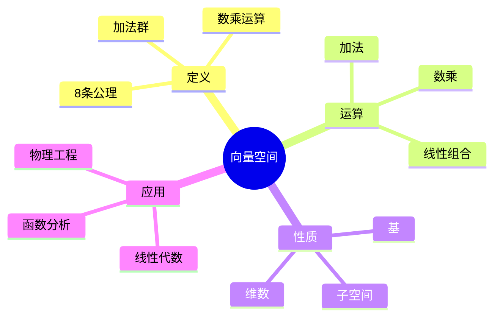
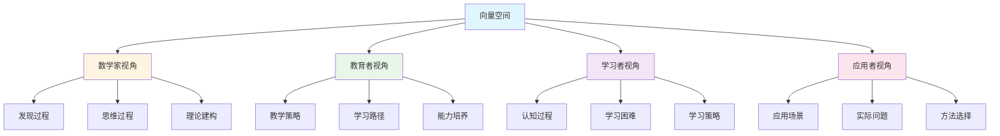
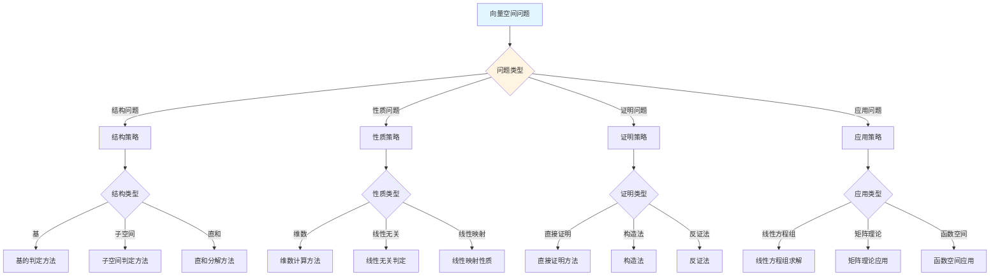
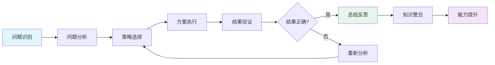
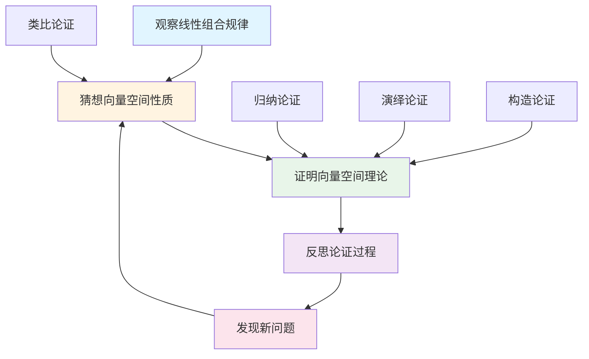
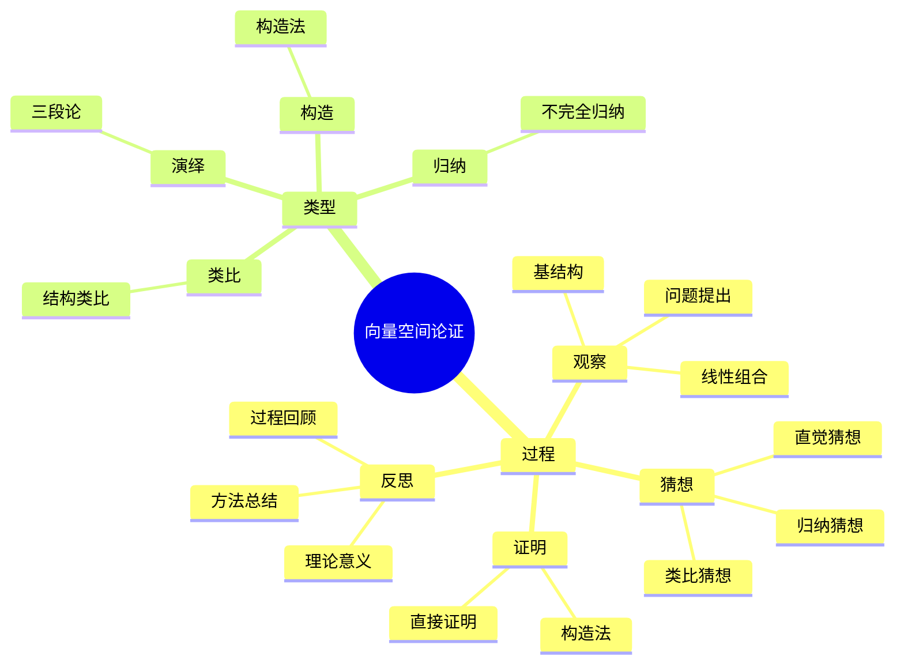

# 向量空间 (Vector Space) - 三视角组织版

**概念编号**: C.CORE.011
**知识层次**: L0-L2
**知识领域**: D2 (代数)
**创建日期**: 2025年1月
**最后更新**: 2025年1月

---

## 📋 目录 / Table of Contents

- [向量空间 (Vector Space) - 三视角组织版](#向量空间-vector-space---三视角组织版)
  - [📋 目录 / Table of Contents](#-目录--table-of-contents)
  - [1. 📋 概述 (编号: C.CORE.011.01)](#1--概述-编号-ccore01101)
  - [🧠 认知学视角：如何理解向量空间 (编号: C.CORE.011.02)](#-认知学视角如何理解向量空间-编号-ccore01102)
    - [认知起点 (编号: C.CORE.011.02.01)](#认知起点-编号-ccore0110201)
    - [认知过程 (编号: C.CORE.011.02.02)](#认知过程-编号-ccore0110202)
      - [阶段1：直观理解阶段 (编号: C.CORE.011.02.02.01)](#阶段1直观理解阶段-编号-ccore011020201)
      - [阶段2：概念形成阶段 (编号: C.CORE.011.02.02.02)](#阶段2概念形成阶段-编号-ccore011020202)
      - [阶段3：形式化阶段 (编号: C.CORE.011.02.02.03)](#阶段3形式化阶段-编号-ccore011020203)
    - [认知障碍 (编号: C.CORE.011.02.03)](#认知障碍-编号-ccore0110203)
    - [认知工具 (编号: C.CORE.011.02.04)](#认知工具-编号-ccore0110204)
  - [🎓 教育学视角：如何教学向量空间 (编号: C.CORE.011.03)](#-教育学视角如何教学向量空间-编号-ccore01103)
    - [教学目标 (编号: C.CORE.011.03.01)](#教学目标-编号-ccore0110301)
    - [教学路径 (编号: C.CORE.011.03.02)](#教学路径-编号-ccore0110302)
      - [阶段1：引入阶段（激发兴趣） (编号: C.CORE.011.03.02.01)](#阶段1引入阶段激发兴趣-编号-ccore011030201)
      - [阶段2：探索阶段（主动建构） (编号: C.CORE.011.03.02.02)](#阶段2探索阶段主动建构-编号-ccore011030202)
      - [阶段3：形式化阶段（抽象概括） (编号: C.CORE.011.03.02.03)](#阶段3形式化阶段抽象概括-编号-ccore011030203)
      - [阶段4：巩固阶段（应用深化） (编号: C.CORE.011.03.02.04)](#阶段4巩固阶段应用深化-编号-ccore011030204)
    - [教学难点 (编号: C.CORE.011.03.03)](#教学难点-编号-ccore0110303)
    - [教学策略 (编号: C.CORE.011.03.04)](#教学策略-编号-ccore0110304)
    - [评估方法 (编号: C.CORE.011.03.05)](#评估方法-编号-ccore0110305)
  - [🔬 数学家视角：如何思考向量空间 (编号: C.CORE.011.04)](#-数学家视角如何思考向量空间-编号-ccore01104)
    - [问题起源 (编号: C.CORE.011.04.01)](#问题起源-编号-ccore0110401)
    - [思维过程 (编号: C.CORE.011.04.02)](#思维过程-编号-ccore0110402)
      - [步骤1：问题提出 (编号: C.CORE.011.04.02.01)](#步骤1问题提出-编号-ccore011040201)
      - [步骤2：概念形成 (编号: C.CORE.011.04.02.02)](#步骤2概念形成-编号-ccore011040202)
      - [步骤3：理论发展 (编号: C.CORE.011.04.02.03)](#步骤3理论发展-编号-ccore011040203)
    - [历史发展 (编号: C.CORE.011.04.03)](#历史发展-编号-ccore0110403)
    - [3.2 关键人物和贡献 (编号: C.CORE.011.04.04)](#32-关键人物和贡献-编号-ccore0110404)
    - [重要定理 (编号: C.CORE.011.04.05)](#重要定理-编号-ccore0110405)
    - [开放问题 (编号: C.CORE.011.04.06)](#开放问题-编号-ccore0110406)
    - [一、第一人称思维描述 (编号: C.CORE.011.04.07)](#一第一人称思维描述-编号-ccore0110407)
      - [1.1 Peano的发现过程](#11-peano的发现过程)
    - [二、数学直觉的形成 (编号: C.CORE.011.04.08)](#二数学直觉的形成-编号-ccore0110408)
      - [2.1 直觉在概念发现中的作用](#21-直觉在概念发现中的作用)
      - [2.2 如何培养向量空间直觉](#22-如何培养向量空间直觉)
    - [三、数学美的教育价值 (编号: C.CORE.011.04.09)](#三数学美的教育价值-编号-ccore0110409)
      - [3.1 向量空间论的美在哪里](#31-向量空间论的美在哪里)
      - [3.2 如何培养学生的数学美感](#32-如何培养学生的数学美感)
    - [四、问题解决策略 (编号: C.CORE.011.04.10)](#四问题解决策略-编号-ccore0110410)
      - [4.1 数学家的启发式方法](#41-数学家的启发式方法)
      - [4.2 思维过程分析](#42-思维过程分析)
    - [五、批判性反思 (编号: C.CORE.011.04.11)](#五批判性反思-编号-ccore0110411)
      - [5.1 向量空间概念的局限性](#51-向量空间概念的局限性)
      - [5.2 向量空间理论的未解决问题](#52-向量空间理论的未解决问题)
  - [💡 数学解释：为什么向量空间是这样定义的 (编号: C.CORE.011.05)](#-数学解释为什么向量空间是这样定义的-编号-ccore01105)
    - [一、直观解释：向量空间是什么？](#一直观解释向量空间是什么)
      - [1.1 具体例子](#11-具体例子)
      - [1.2 形象类比](#12-形象类比)
      - [1.3 几何直观](#13-几何直观)
      - [1.4 操作体验](#14-操作体验)
    - [二、知性解释：向量空间的本质是什么？](#二知性解释向量空间的本质是什么)
      - [2.1 概念定义](#21-概念定义)
      - [2.2 分类体系](#22-分类体系)
      - [2.3 抽象结构](#23-抽象结构)
      - [2.4 知识体系](#24-知识体系)
    - [三、理性解释：向量空间的公理化定义](#三理性解释向量空间的公理化定义)
      - [3.1 公理体系](#31-公理体系)
      - [3.2 形式化证明](#32-形式化证明)
      - [3.3 系统建构](#33-系统建构)
    - [四、多视角解释：从不同角度理解向量空间](#四多视角解释从不同角度理解向量空间)
      - [4.1 数学家视角：向量空间是如何被发现的？](#41-数学家视角向量空间是如何被发现的)
      - [4.2 教育者视角：如何教学向量空间？](#42-教育者视角如何教学向量空间)
      - [4.3 学习者视角：如何学习向量空间？](#43-学习者视角如何学习向量空间)
      - [4.4 应用者视角：如何应用向量空间？](#44-应用者视角如何应用向量空间)
    - [五、思维表征：用多种方式理解向量空间](#五思维表征用多种方式理解向量空间)
      - [5.1 思维导图：向量空间的知识结构](#51-思维导图向量空间的知识结构)
      - [5.2 矩阵对比：不同解释方式的对比](#52-矩阵对比不同解释方式的对比)
      - [5.3 多视角表征：从不同角度表征向量空间](#53-多视角表征从不同角度表征向量空间)
      - [5.4 决策树：向量空间问题分类和策略选择](#54-决策树向量空间问题分类和策略选择)
      - [5.5 决策逻辑路径：向量空间问题解决过程](#55-决策逻辑路径向量空间问题解决过程)
      - [5.6 多维对比矩阵：向量空间概念特征对比](#56-多维对比矩阵向量空间概念特征对比)
  - [🔍 数学论证：如何论证向量空间 (编号: C.CORE.011.06)](#-数学论证如何论证向量空间-编号-ccore01106)
    - [一、论证过程：从观察到反思](#一论证过程从观察到反思)
      - [1.1 观察（Observation）](#11-观察observation)
      - [1.2 猜想（Conjecture）](#12-猜想conjecture)
      - [1.3 证明（Proof）](#13-证明proof)
      - [1.4 反思（Reflection）](#14-反思reflection)
    - [二、论证类型：多种推理方式](#二论证类型多种推理方式)
      - [2.1 归纳论证（Inductive Reasoning）](#21-归纳论证inductive-reasoning)
      - [2.2 演绎论证（Deductive Reasoning）](#22-演绎论证deductive-reasoning)
      - [2.3 类比论证（Analogical Reasoning）](#23-类比论证analogical-reasoning)
      - [2.4 构造论证（Constructive Reasoning）](#24-构造论证constructive-reasoning)
    - [三、论证可视化：用图形表示论证过程](#三论证可视化用图形表示论证过程)
      - [3.1 论证流程图](#31-论证流程图)
      - [3.2 论证类型对比](#32-论证类型对比)
      - [3.3 论证思维导图](#33-论证思维导图)
  - [🔗 三视角整合 (编号: C.CORE.011.07)](#-三视角整合-编号-ccore01107)
    - [三个视角的关联](#三个视角的关联)
    - [如何综合运用三个视角](#如何综合运用三个视角)
  - [📚 参考文献 (编号: C.CORE.011.08)](#-参考文献-编号-ccore01108)
    - [权威资源](#权威资源)
    - [经典教材](#经典教材)
    - [研究论文](#研究论文)

---

## 1. 📋 概述 (编号: C.CORE.011.01)

向量空间是线性代数的核心概念，是域上的模。向量空间理论在数学、物理学、工程学等领域有广泛应用，是现代数学的基础工具。

本文档从**数学认知学**、**教育学**、**数学家**三个视角深入展开向量空间概念，避免简单的概念堆垒。

**权威资源对齐**:

- Wikipedia: [Vector Space](https://en.wikipedia.org/wiki/Vector_space)
- Stanford课程: Math 51 (Linear Algebra and Differential Calculus)
- Princeton课程: MAT 202 (Linear Algebra)
- MIT课程: 18.06 (Linear Algebra)
- Metamath: [Vector Space](http://us.metamath.org/mpeuni/df-lvec.html)

---

## 🧠 认知学视角：如何理解向量空间 (编号: C.CORE.011.02)

### 认知起点 (编号: C.CORE.011.02.01)

**学习者已有的知识基础**:

- 域的概念
- 向量的概念（几何向量）
- 日常经验中的"方向"、"大小"概念

**日常经验中的类似概念**:

- "箭头"：有方向和大小的量
- "位移"：从一个点到另一个点的移动
- "力"：有方向和大小的物理量

### 认知过程 (编号: C.CORE.011.02.02)

#### 阶段1：直观理解阶段 (编号: C.CORE.011.02.02.01)

**具体例子**:

- 例子1：$\mathbb{R}^2$ - 平面向量空间
- 例子2：$\mathbb{R}^3$ - 空间向量空间
- 例子3：$\mathbb{R}^n$ - $n$维向量空间

**形象类比**:

- **几何类比**: 向量空间就像"可以相加和数乘的向量集合"
  - 向量可以相加
  - 向量可以数乘
  - 满足线性组合的性质

- **结构类比**: 向量空间就像"域上的线性结构"
  - 加法构成群
  - 数乘满足分配律
  - 满足线性组合的性质

**可视化表示**:

```text
向量空间结构:
    向量加法 (V, +)
         ↓
    数乘 (F × V → V)
         ↓
    线性组合
```

#### 阶段2：概念形成阶段 (编号: C.CORE.011.02.02.02)

**从例子中抽象出共同特征**:

- 所有例子都涉及"向量和运算"
- 向量可以相加
- 向量可以数乘
- 满足线性组合的性质

**识别关键属性**:

1. **加法群**: $(V, +)$是交换群
2. **数乘**: 满足分配律、结合律
3. **线性组合**: 可以形成线性组合

**建立概念边界**:

- **什么是向量空间**: 满足加法群、数乘、线性组合性质的代数结构
- **什么不是向量空间**:
  - 群（只有加法，没有数乘）
  - 环（有两种乘法，没有数乘）

#### 阶段3：形式化阶段 (编号: C.CORE.011.02.02.03)

**严格定义**:

- 公理化定义：通过8条公理（加法4条、数乘4条）
- 范畴定义：向量空间是域上的模

**公理化表述**:

- 公理1-4：加法群
- 公理5-8：数乘性质

**逻辑结构**:

- 向量空间是域上的模
- 向量空间是线性代数的基础
- 向量空间是函数分析的基础

### 认知障碍 (编号: C.CORE.011.02.03)

**常见误解**:

1. **误解1**: 认为向量必须是几何向量
   - **纠正**: 向量可以是任意对象，只要满足向量空间公理

2. **误解2**: 认为向量空间必须是有限的
   - **纠正**: 向量空间可以是无限的，如函数空间

3. **误解3**: 混淆向量和标量
   - **纠正**: 向量是向量空间的元素，标量是域的元素

**理解难点**:

1. **难点1**: 抽象向量空间
   - **原因**: 抽象向量空间比较抽象
   - **解决方法**: 从几何向量开始，逐步抽象

2. **难点2**: 基和维数
   - **原因**: 基和维数的概念比较抽象
   - **解决方法**: 用具体例子，强调基的作用

3. **难点3**: 无限维向量空间
   - **原因**: 无限维向量空间比较抽象
   - **解决方法**: 用函数空间等具体例子

**认知陷阱**:

- **几何向量**: 需要理解向量不一定是几何向量
- **维数**: 需要理解维数的概念

### 认知工具 (编号: C.CORE.011.02.04)

**类比工具**:

- **几何类比**: 向量空间 = 可以相加和数乘的向量集合
- **结构类比**: 向量空间 = 域上的线性结构

**可视化工具**:

- **几何表示**: 用几何图形表示向量
- **基表示**: 用基表示向量

**具体化工具**:

- **具体例子**: 用具体例子理解抽象概念
- **反例**: 用反例理解概念边界

---

## 🎓 教育学视角：如何教学向量空间 (编号: C.CORE.011.03)

### 教学目标 (编号: C.CORE.011.03.01)

**知识目标**:

- 理解向量空间的基本概念
- 掌握向量空间的公理化定义
- 理解向量空间的性质
- 理解基和维数

**能力目标**:

- 能够判断一个结构是否是向量空间
- 能够进行向量运算
- 能够理解向量空间的结构
- 能够应用向量空间解决实际问题

**情感目标**:

- 培养数学抽象思维
- 培养线性思维
- 激发对数学的兴趣

### 教学路径 (编号: C.CORE.011.03.02)

#### 阶段1：引入阶段（激发兴趣） (编号: C.CORE.011.03.02.01)

**实际问题**:

- 问题1：如何描述平面和空间中的向量？
- 问题2：如何研究线性方程组？
- 问题3：如何研究函数空间？

**历史背景**:

- 向量空间的历史发展
- 向量空间在数学中的地位
- 向量空间在物理中的应用

**引发认知冲突**:

- 问题：如何统一描述各种向量？
- 引出向量空间的概念

#### 阶段2：探索阶段（主动建构） (编号: C.CORE.011.03.02.02)

**引导发现**:

1. 让学生自己列举向量的例子
2. 让学生观察这些例子的共同特征
3. 引导学生抽象出向量空间的定义

**合作探究**:

- 小组讨论：什么是向量空间？
- 小组讨论：向量空间有哪些性质？
- 小组讨论：如何表示向量空间？

**多元表征**:

- **语言表征**: "向量空间是满足加法群、数乘、线性组合性质的代数结构"
- **符号表征**: $(V, +, \cdot)$
- **图形表征**: 几何表示、基表示
- **集合表征**: 公理化定义

#### 阶段3：形式化阶段（抽象概括） (编号: C.CORE.011.03.02.03)

**严格定义**:

- 向量空间的公理化定义
- 向量空间的性质
- 基和维数

**性质证明**:

- 向量空间的基本性质
- 基的性质
- 维数公式

**应用拓展**:

- 向量空间在数学中的应用
- 向量空间在物理中的应用
- 向量空间在工程中的应用

#### 阶段4：巩固阶段（应用深化） (编号: C.CORE.011.03.02.04)

**练习应用**:

- 基础练习：向量空间的表示和运算
- 应用练习：用向量空间解决实际问题
- 综合练习：向量空间的综合应用

**变式训练**:

- 不同形式的向量空间表示
- 不同性质的向量空间
- 基和维数

**知识整合**:

- 向量空间与其他代数结构的联系
- 向量空间在数学体系中的地位

### 教学难点 (编号: C.CORE.011.03.03)

**难点1：抽象向量空间**:

- **难点描述**: 学生难以理解抽象向量空间
- **解决方法**:
  - 从几何向量开始
  - 逐步抽象到一般向量空间
  - 用具体例子说明

**难点2：基和维数**:

- **难点描述**: 学生难以理解基和维数的概念
- **解决方法**:
  - 用具体例子
  - 强调基的作用
  - 用图形可视化

**难点3：无限维向量空间**:

- **难点描述**: 学生难以理解无限维向量空间
- **解决方法**:
  - 用函数空间等具体例子
  - 强调无限维的特殊性
  - 用具体例子说明

### 教学策略 (编号: C.CORE.011.03.04)

**策略1：从具体到抽象**:

- 先给出具体例子
- 再抽象出一般概念
- 最后给出严格定义

**策略2：多元表征**:

- 用语言、符号、图形等多种方式表示同一概念
- 帮助学生建立不同表征之间的联系

**策略3：问题驱动**:

- 从实际问题出发
- 引出数学概念
- 解决问题

**策略4：可视化教学**:

- 使用几何表示
- 使用基表示
- 使用具体例子

### 评估方法 (编号: C.CORE.011.03.05)

**形成性评估**（评估理解过程）:

- 课堂提问：检查学生对概念的理解
- 小组讨论：观察学生的思考过程
- 练习作业：检查学生的应用能力

**总结性评估**（评估最终理解）:

- 测验：检查学生对概念和运算的掌握
- 项目：检查学生应用向量空间解决实际问题的能力
- 反思：检查学生对向量空间概念的理解深度

---

## 🔬 数学家视角：如何思考向量空间 (编号: C.CORE.011.04)

### 问题起源 (编号: C.CORE.011.04.01)

**历史背景**:

- 19世纪：向量空间的起源
- 20世纪初：向量空间的系统化
- 20世纪中期：向量空间的现代发展

**原始问题**:

- **问题1**: 如何统一描述各种向量？
- **问题2**: 如何研究线性结构？
- **问题3**: 向量空间有哪些性质？

**研究动机**:

- 统一向量理论
- 发展线性代数
- 发展函数分析

### 思维过程 (编号: C.CORE.011.04.02)

#### 步骤1：问题提出 (编号: C.CORE.011.04.02.01)

**观察到的现象**:

- 几何向量、函数、多项式都有线性结构
- 这些结构有一些共同的性质
- 需要统一的概念来描述

**提出的猜想**:

- 可以引入向量空间概念
- 向量空间可以统一描述这些结构
- 向量空间有丰富的结构

**需要解决的问题**:

- 如何定义向量空间？
- 向量空间应该满足什么条件？
- 向量空间有哪些性质？

#### 步骤2：概念形成 (编号: C.CORE.011.04.02.02)

**尝试性定义**:

- **公理化定义**: 通过8条公理
- **范畴定义**: 向量空间是域上的模

**性质探索**:

- 向量空间的基本性质
- 基和维数
- 线性映射

**结构发现**:

- 向量空间是域上的模
- 向量空间是线性代数的基础
- 向量空间是函数分析的基础

#### 步骤3：理论发展 (编号: C.CORE.011.04.02.03)

**定理证明**:

- 向量空间的基本性质
- 基的存在性
- 维数公式

**应用拓展**:

- 向量空间在数学中的应用
- 向量空间在物理中的应用
- 向量空间在工程中的应用

**理论完善**:

- 向量空间的公理化
- 向量空间的范畴论研究
- 函数分析的发展

### 历史发展 (编号: C.CORE.011.04.03)

**早期阶段**（19世纪）:

- **Grassmann (1844)**: 引入向量和线性空间概念
- **Hamilton (1853)**: 研究四元数和向量
- **Peano (1888)**: 给出向量空间的公理化定义

**关键突破**（20世纪初）:

- **Steinitz (1910)**: 发展域论和向量空间理论
- **Hilbert (1900)**: 研究无限维向量空间
- **Banach (1922)**: 研究Banach空间

**现代发展**（20世纪中期）:

- **Bourbaki (1939)**: 统一向量空间理论
- **Grothendieck (1957)**: 发展范畴论和模理论

### 3.2 关键人物和贡献 (编号: C.CORE.011.04.04)

**Hermann Grassmann (1809-1877)**:

- 引入向量空间概念
- 建立线性代数的基础

**Giuseppe Peano (1858-1932)**:

- 给出向量空间的公理化定义
- 建立现代向量空间理论

**Stefan Banach (1892-1945)**:

- 研究Banach空间
- 建立函数分析的基础

### 重要定理 (编号: C.CORE.011.04.05)

**基的存在性**:

- 每个向量空间都有基
- 证明思路：使用Zorn引理
- 意义：向量空间结构的基础

**维数公式**:

- 若$U, W$是$V$的子空间，则$\dim(U+W) = \dim U + \dim W - \dim(U \cap W)$
- 意义：子空间关系的基础

**同构定理**:

- 两个有限维向量空间同构当且仅当它们有相同的维数
- 意义：向量空间分类的基础

### 开放问题 (编号: C.CORE.011.04.06)

**未解决问题**:

- 向量空间的分类问题
- 向量空间的表示问题
- 向量空间的应用问题

**研究方向**:

- 向量空间的范畴论研究
- 向量空间的表示论研究
- 向量空间的应用研究

### 一、第一人称思维描述 (编号: C.CORE.011.04.07)

#### 1.1 Peano的发现过程

**详细历史背景**:

- **1888年**：Peano发表《几何演算》（Calcolo geometrico）
- **背景**：研究几何向量，发现向量有共同的性质
- **问题**：如何抽象向量的性质？如何统一处理几何和代数？

**Peano的详细第一人称描述**:
> "1888年，我在研究几何向量时，遇到了一个问题：如何抽象向量的性质？
>
> 我发现，几何向量有共同的性质：
>
> - **加法**：两个向量的和还是向量
> - **数乘**：数与向量的积还是向量
> - **运算性质**：加法满足交换律、结合律，数乘满足分配律
>
> 我的发现是：
>
> - **向量空间的概念**：一个集合配备加法和数乘运算，满足某些公理
> - **统一性**：几何向量和函数空间都是向量空间
> - **抽象性**：向量空间不依赖于具体的几何或代数结构
>
> 例如，对于几何向量$\mathbb{R}^3$：
>
> - **向量**：$(x, y, z)$，其中$x, y, z \in \mathbb{R}$
> - **加法**：$(x_1, y_1, z_1) + (x_2, y_2, z_2) = (x_1+x_2, y_1+y_2, z_1+z_2)$
> - **数乘**：$c(x, y, z) = (cx, cy, cz)$
> - **基**：$\{(1,0,0), (0,1,0), (0,0,1)\}$
>
> 对于函数空间$C[0,1]$（连续函数空间）：
>
> - **向量**：连续函数$f: [0,1] \to \mathbb{R}$
> - **加法**：$(f+g)(x) = f(x) + g(x)$
> - **数乘**：$(cf)(x) = c \cdot f(x)$
> - **基**：$\{1, x, x^2, \ldots\}$（无限维）
>
> 这让我意识到，向量空间是抽象的向量结构，不依赖于具体的几何或代数。这为几何和代数提供了统一的框架。"

**详细的思维过程**:

1. **观察到的现象**（1888年）:

   **现象1：向量有共同的性质**
   - **问题**：几何向量和函数都有加法和数乘运算
   - **例子**：$\mathbb{R}^3$和$C[0,1]$都有加法和数乘
   - **需要**：抽象这些性质

   **现象2：这些性质可以抽象**
   - **问题**：如何抽象向量的性质？
   - **思路**：定义向量空间的概念
   - **需要**：建立向量空间理论

   **现象3：需要统一的概念**
   - **问题**：如何统一处理几何和代数？
   - **思路**：用向量空间统一
   - **需要**：建立向量空间的理论体系

2. **提出的猜想**（1888年）:

   **猜想1：用向量空间描述向量的性质**
   - **思路**：定义向量空间的概念，向量是向量空间的元素
   - **例子**：$\mathbb{R}^3$和$C[0,1]$都是向量空间
   - **优点**：统一描述向量的性质

   **猜想2：向量空间与几何相关**
   - **关系**：几何向量是向量空间的例子
   - **例子**：$\mathbb{R}^3$是几何向量空间
   - **意义**：用向量空间统一几何和代数

   **猜想3：向量空间是数学的基础**
   - **性质**：向量空间是抽象的数学结构
   - **应用**：向量空间可以应用到更广泛的领域
   - **意义**：向量空间是统一的数学结构

3. **遇到的困难**（1888年）:

   **困难1：如何严格定义向量空间？**
   - **问题**：如何定义向量空间？
   - **解决**：通过公理定义向量空间（加法群、数乘、分配律）
   - **意义**：为向量空间提供严格的数学基础

   **困难2：如何判断向量空间的性质？**
   - **问题**：如何判断向量空间是否有限维？是否有基？
   - **解决**：通过向量空间的结构判断
   - **意义**：为向量空间分类提供方法

   **困难3：如何应用向量空间理论？**
   - **问题**：如何用向量空间理论解决实际问题？
   - **解决**：建立线性映射理论、基理论
   - **意义**：为几何和代数提供新视角

4. **突破的时刻**（1888年，Peano）:

   **突破1：向量空间的概念**
   - 引入向量空间的概念描述向量的性质
   - **关键**：抽象出向量空间的结构
   - **意义**：为向量空间理论提供基础

   **突破2：基理论**
   - 建立基理论
   - **关键**：每个向量空间都有基
   - **意义**：为向量空间分类提供方法

   **突破3：向量空间理论的广泛应用**
   - 向量空间理论可以应用到更广泛的领域
   - **关键**：向量空间是抽象的数学结构
   - **意义**：向量空间理论成为数学的基础

### 二、数学直觉的形成 (编号: C.CORE.011.04.08)

#### 2.1 直觉在概念发现中的作用

**Peano的直觉**:

- **直觉1**: "向量空间"是"向量的抽象"——这个直觉引导Peano发现向量空间
- **直觉2**: 向量空间可以统一几何和代数——这个直觉引导Peano建立向量空间理论
- **直觉3**: 向量空间是数学的基础——这个直觉引导Peano建立向量空间理论

**直觉的验证**:

- 通过严格的数学证明验证直觉的正确性
- 通过公理化严格化向量空间定义
- 通过应用验证向量空间的广泛性

**直觉的深化**:

- 从"向量的抽象"到"向量空间的公理化"
- 从"统一几何和代数"到"向量空间的广泛应用"
- 从"数学基础"到"向量空间的深入发展"

#### 2.2 如何培养向量空间直觉

**数学家的建议**:

- **Peano**: "向量空间直觉是长期训练的结果。通过大量练习和深入思考，我们可以培养对向量空间的直觉。"
- **Banach**: "从具体例子开始，逐步抽象，这是培养向量空间直觉的有效方法。"

**培养方法**:

1. **大量练习**: 通过大量向量空间运算练习，培养对向量空间的直觉
2. **深入思考**: 深入思考向量空间的本质，理解向量空间的深层结构
3. **类比和联想**: 通过类比和联想，建立向量空间与其他概念的联系
4. **与专家交流**: 与数学家交流，学习他们的思维方式

**教学启示**:

- 从具体例子开始，逐步抽象
- 鼓励学生思考向量空间的本质
- 引导学生建立向量空间与其他概念的联系

### 三、数学美的教育价值 (编号: C.CORE.011.04.09)

#### 3.1 向量空间论的美在哪里

**结构美**:

- **简洁性**: 向量空间的概念非常简洁——"满足加法和数乘公理的集合"
- **统一性**: 向量空间可以统一描述数学中的各种线性结构
- **和谐性**: 向量空间运算满足优美的规律（交换律、结合律等）

**数学家的评价**:

- **Peano**: "向量空间论的美在于它的统一性。它为我们提供了一个统一的框架来理解数学中的线性结构。"
- **Banach**: "向量空间论的美在于它的抽象性。它是数学的基础，所有线性结构都可以用向量空间来描述。"

#### 3.2 如何培养学生的数学美感

**数学家的建议**:

- **Peano**: "展示向量空间论的美感，让学生感受到数学的美。"
- **Banach**: "通过向量空间论的历史和发展，让学生理解数学的美。"

**教学方法**:

1. **展示数学美**:
   - 展示向量空间概念的简洁性和统一性
   - 展示向量空间运算的优美规律
   - 展示向量空间在数学中的基础地位

2. **引导学生欣赏**:
   - 引导学生欣赏向量空间概念的简洁性
   - 引导学生欣赏向量空间运算的和谐性
   - 引导学生欣赏向量空间的基础性

3. **鼓励学生创造美**:
   - 鼓励学生发现向量空间论的美
   - 鼓励学生创造优美的向量空间证明
   - 鼓励学生探索向量空间论的美

### 四、问题解决策略 (编号: C.CORE.011.04.10)

#### 4.1 数学家的启发式方法

**策略1：从具体到抽象**:

- 从具体的向量例子开始
- 抽象出向量空间的一般性质
- 建立向量空间的理论体系

**策略2：从简单到复杂**:

- 先理解基本向量空间
- 再理解向量空间运算
- 最后理解向量空间理论

**策略3：从问题到理论**:

- 从实际问题出发
- 引出向量空间概念
- 建立向量空间理论

#### 4.2 思维过程分析

**问题识别**:

- 识别问题类型：向量空间定义问题、向量空间性质问题、向量空间应用问题
- 识别问题难度：简单问题、中等问题、复杂问题

**策略选择**:

- 简单问题：直接方法
- 中等问题：分步方法
- 复杂问题：分解方法

**执行和反思**:

- 执行策略，解决问题
- 反思过程，总结经验
- 改进方法，提高效率

### 五、批判性反思 (编号: C.CORE.011.04.11)

#### 5.1 向量空间概念的局限性

**概念的边界**:

- 向量空间只描述线性结构，不能描述所有数学结构
- 向量空间是抽象的，需要具体化才能应用
- 向量空间不能表示所有数学量

**概念的推广**:

- 模：更一般的结构
- 代数：更一般的结构
- 范畴：更抽象的结构

#### 5.2 向量空间理论的未解决问题

**未解决的问题**:

- 向量空间的分类问题：如何分类所有向量空间？
- 向量空间的表示问题：如何表示向量空间？
- 向量空间的应用问题：如何更好地应用向量空间？

**研究方向**:

- 向量空间的范畴论研究
- 向量空间的表示论研究
- 向量空间的应用研究

---

## 💡 数学解释：为什么向量空间是这样定义的 (编号: C.CORE.011.05)

### 一、直观解释：向量空间是什么？

#### 1.1 具体例子

**生活中的例子**：

- **平面向量**：平面上的所有向量构成向量空间
  - 例如：$\mathbb{R}^2$表示所有二维向量的集合
  - **为什么这样定义**：因为我们需要一个概念来表示"可以进行加法和数乘运算的向量集合"
- **空间向量**：三维空间中的所有向量构成向量空间
  - 例如：$\mathbb{R}^3$表示所有三维向量的集合
  - **为什么这样定义**：因为我们需要一个概念来表示"三维向量的运算结构"
- **函数空间**：所有连续函数构成向量空间
  - 例如：$C[0,1]$表示区间$[0,1]$上的所有连续函数
  - **为什么这样定义**：因为我们需要一个概念来表示"函数的线性运算结构"

**数学中的例子**：

- **有限维向量空间**：$\mathbb{R}^n$（$n$维实向量空间）
  - **为什么这样定义**：我们需要一个概念来表示"有限维向量的运算结构"
- **无限维向量空间**：$C[0,1]$（连续函数空间）
  - **为什么这样定义**：我们需要一个概念来表示"无限维向量的运算结构"
- **多项式空间**：$\mathbb{R}[x]$（所有实系数多项式）
  - **为什么这样定义**：我们需要一个概念来表示"多项式的线性运算结构"

#### 1.2 形象类比

**线性组合类比**：

- **向量空间就像"可以线性组合的向量集合"**
  - 向量可以相加
  - 向量可以数乘
  - 向量可以线性组合
- **为什么这样类比**：这个类比帮助我们理解向量空间的本质

**基类比**：

- **向量空间就像"由基向量张成的空间"**
  - 基向量可以表示所有向量
  - 基向量的个数是维数
- **为什么这样类比**：这个类比帮助我们理解向量空间的结构

#### 1.3 几何直观

**坐标表示**：

- 使用坐标表示向量
- 例如：$(x, y, z)$表示三维向量
- **为什么使用坐标**：坐标提供几何直观，帮助我们理解向量的运算

**基表示**：

- 使用基表示向量空间
- 例如：$\{(1,0,0), (0,1,0), (0,0,1)\}$是$\mathbb{R}^3$的标准基
- **为什么使用基**：基揭示了向量空间的结构

#### 1.4 操作体验

**向量运算的操作**：

- **加法操作**：$(x_1, y_1) + (x_2, y_2) = (x_1+x_2, y_1+y_2)$
  - **为什么这样操作**：因为我们需要一个运算来表示"合并向量"
- **数乘操作**：$c(x, y) = (cx, cy)$
  - **为什么这样操作**：因为我们需要一个运算来表示"缩放向量"
- **线性组合操作**：$c_1\mathbf{v}_1 + c_2\mathbf{v}_2 + \cdots + c_n\mathbf{v}_n$
  - **为什么这样操作**：因为我们需要一个运算来表示"向量的线性组合"

### 二、知性解释：向量空间的本质是什么？

#### 2.1 概念定义

**向量空间的内涵**：

- **向量空间是一个集合$V$配备加法和数乘运算，满足8条公理**
  - **加法群**：$(V, +)$是Abel群
  - **数乘运算**：标量乘法满足分配律和结合律
  - **单位元**：存在零向量$\mathbf{0}$
- **为什么这样定义**：这些特征使得向量空间成为一个完整的线性结构，支持所有线性运算

**向量空间的外延**：

- **有限维向量空间**：维数有限的向量空间（如$\mathbb{R}^n$）
- **无限维向量空间**：维数无限的向量空间（如$C[0,1]$）
- **实向量空间**：标量域是实数的向量空间
- **复向量空间**：标量域是复数的向量空间
- **为什么这样分类**：不同的向量空间类型有不同的性质和用途

#### 2.2 分类体系

**按维数分类**：

- **有限维向量空间**：$\dim V < \infty$
- **无限维向量空间**：$\dim V = \infty$
- **为什么这样分类**：维数是向量空间的基本特征

**按标量域分类**：

- **实向量空间**：标量域是$\mathbb{R}$
- **复向量空间**：标量域是$\mathbb{C}$
- **为什么这样分类**：标量域是向量空间的重要特征

#### 2.3 抽象结构

**向量空间的运算结构**：

- **加法运算**：$+ : V \times V \to V$
- **数乘运算**：$\cdot : F \times V \to V$（$F$是标量域）
- **为什么有这些运算**：这些运算使得向量空间具有线性结构

**向量空间的关系结构**：

- **子空间关系**：$U \subseteq V$是子空间当且仅当$U$在加法和数乘下封闭
- **为什么有这个关系**：这个关系帮助我们研究向量空间的结构

**向量空间的子结构**：

- **子空间**：$U \subseteq V$是子空间当且仅当$U$在加法和数乘下封闭
- **基**：线性无关的生成集
- **维数**：基的元素的个数
- **为什么有这些结构**：这些结构是向量空间理论的基础

#### 2.4 知识体系

**向量空间在数学体系中的位置**：

- **基础地位**：向量空间是线性代数的基础
  - 向量空间是线性映射的域和陪域
  - 向量空间是矩阵理论的基础
- **为什么是基础**：向量空间提供了统一的框架来研究线性结构

**向量空间与其他概念的关系**：

- **向量空间与域**：向量空间是域上的模
- **向量空间与群**：向量空间的加法群是Abel群
- **向量空间与线性映射**：线性映射是向量空间之间的映射
- **为什么有这些关系**：这些关系揭示了向量空间与其他数学概念的内在联系

### 三、理性解释：向量空间的公理化定义

#### 3.1 公理体系

**向量空间的公理化定义**：

- **公理1-4（加法群）**：$(V, +)$是Abel群
- **公理5-8（数乘）**：标量乘法满足分配律和结合律
- **为什么需要这些公理**：这些公理定义了向量空间的基本结构

**向量空间的范畴论定义**：

- **向量空间是域上的模**
- **为什么这样定义**：这个定义将向量空间放在更一般的框架中

#### 3.2 形式化证明

**向量空间运算性质的证明**：

- **零向量的唯一性**：如果$\mathbf{0}$和$\mathbf{0}'$都是零向量，则$\mathbf{0} = \mathbf{0}'$
  - **证明**：$\mathbf{0} = \mathbf{0} + \mathbf{0}' = \mathbf{0}'$
  - **为什么这样证明**：利用零向量的定义
- **基的存在性**：每个向量空间都有基
  - **证明**：使用Zorn引理
  - **为什么这样证明**：利用选择公理

**向量空间关系的证明**：

- **维数公式**：若$U, W$是$V$的子空间，则$\dim(U+W) = \dim U + \dim W - \dim(U \cap W)$
  - **证明**：使用基的扩展和交集的性质
  - **为什么这样证明**：利用子空间和基的性质

#### 3.3 系统建构

**向量空间论在数学基础中的地位**：

- **作为线性代数基础**：向量空间是线性代数的基础
- **提供线性结构**：向量空间提供了线性结构
- **统一框架**：向量空间统一了各种线性结构

**向量空间论的发展历史**：

- **Peano的公理化**（1888年）：给出向量空间的公理化定义
- **Hilbert的研究**（1900年）：研究无限维向量空间
- **Banach的研究**（1922年）：研究Banach空间
- **为什么这样发展**：数学的发展需要严格的基础，向量空间论的发展反映了这一需求

### 四、多视角解释：从不同角度理解向量空间

#### 4.1 数学家视角：向量空间是如何被发现的？

**Peano的发现过程**：

- **问题提出**：如何抽象向量的性质？
- **关键洞察**：使用公理化定义向量空间
- **重要发现**：向量空间可以统一描述各种线性结构
- **为什么这样发现**：数学家的直觉和严格证明相结合

**Grassmann的抽象化过程**：

- **问题识别**：需要抽象化向量概念
- **策略选择**：使用线性组合和基
- **定义设计**：向量空间是满足公理的线性结构
- **为什么这样设计**：需要统一各种向量实例

#### 4.2 教育者视角：如何教学向量空间？

**教学策略**：

- **从具体到抽象**：先学习具体例子，再学习抽象定义
- **从简单到复杂**：先学习有限维向量空间，再学习无限维向量空间
- **从直观到形式化**：先使用几何直观等直观工具，再学习形式化定义
- **为什么这样教学**：符合认知规律，帮助学生逐步建立理解

**学习路径**：

- **阶段1**：直观理解（使用几何向量和具体例子）
- **阶段2**：概念形成（学习向量空间的定义和性质）
- **阶段3**：形式化（学习向量空间的公理化定义）
- **为什么这样设计**：循序渐进，逐步深入

#### 4.3 学习者视角：如何学习向量空间？

**认知过程**：

- **直观阶段**：通过几何向量理解向量空间的含义
- **概念阶段**：理解向量空间的定义和性质
- **形式化阶段**：理解向量空间的公理化定义
- **为什么这样学习**：符合认知发展规律

**学习困难**：

- **困难1**：理解"抽象向量空间"的概念
- **困难2**：理解"无限维向量空间"的概念
- **困难3**：理解"基和维数"的概念
- **如何克服**：通过具体例子、类比、历史背景等方式帮助理解

#### 4.4 应用者视角：如何应用向量空间？

**应用场景**：

- **数学**：使用向量空间研究线性代数和函数分析
- **物理**：使用向量空间描述物理系统的状态空间
- **工程**：使用向量空间进行信号处理和图像处理
- **为什么这样应用**：向量空间提供了强大的工具来处理各种问题

**应用方法**：

- **建立模型**：将实际问题转化为向量空间问题
- **使用理论**：使用向量空间理论解决问题
- **验证结果**：验证结果的正确性
- **为什么这样应用**：向量空间论提供了强大的工具来解决实际问题

### 五、思维表征：用多种方式理解向量空间

#### 5.1 思维导图：向量空间的知识结构



#### 5.2 矩阵对比：不同解释方式的对比

| 解释方式 | 特点 | 方法 | 工具 | 适用阶段 | 优势 | 局限 |
|---------|------|------|------|---------|------|------|
| **直观解释** | 具体、形象、可视 | 例子、类比、直观 | 几何向量、坐标 | 入门阶段 | 易于理解 | 不够严格 |
| **知性解释** | 概念、分类、抽象 | 定义、分类、结构 | 概念图、知识图谱 | 中级阶段 | 系统完整 | 不够直观 |
| **理性解释** | 公理、证明、形式化 | 公理、证明、系统 | 形式化工具、证明系统 | 高级阶段 | 严格准确 | 不够具体 |
| **多视角解释** | 多角度、整合 | 多视角、整合 | 多视角工具 | 所有阶段 | 全面深入 | 可能复杂 |

#### 5.3 多视角表征：从不同角度表征向量空间



#### 5.4 决策树：向量空间问题分类和策略选择



**说明**：

- **问题分类**：根据问题类型（结构、性质、证明、应用）进行分类
- **策略选择**：根据问题类型选择相应的解决策略
- **方法应用**：根据具体问题选择合适的方法

#### 5.5 决策逻辑路径：向量空间问题解决过程



**说明**：

- **问题识别**：识别向量空间问题的类型和关键要素
- **问题分析**：分析问题的条件和目标
- **策略选择**：根据问题类型选择解决策略
- **方案执行**：执行选定的解决方案
- **结果验证**：验证结果的正确性
- **总结反思**：总结解题过程，反思解题方法
- **知识整合**：整合相关知识点
- **能力提升**：提升问题解决能力

#### 5.6 多维对比矩阵：向量空间概念特征对比

| 对比维度 | 向量空间定义 | 向量空间结构 | 向量空间性质 | 向量空间应用 |
|---------|---------|---------|---------|---------|
| **核心特征** | 向量空间公理、线性运算 | 基、子空间、直和 | 维数、线性无关、线性映射 | 线性方程组、矩阵、函数空间 |
| **理解难度** | ⭐⭐⭐ | ⭐⭐⭐⭐ | ⭐⭐⭐⭐ | ⭐⭐⭐⭐ |
| **应用频率** | ⭐⭐⭐⭐⭐ | ⭐⭐⭐⭐⭐ | ⭐⭐⭐⭐⭐ | ⭐⭐⭐⭐⭐ |
| **理论基础** | 向量空间公理体系 | 基理论、子空间理论 | 维数理论、线性映射理论 | 线性代数应用理论 |
| **教学重点** | 概念理解 | 结构分析 | 性质分析 | 应用能力 |
| **学习阶段** | 中级阶段 | 中级-高级 | 中级-高级 | 中级-高级 |
| **认知维度** | 知性+理性 | 理性 | 理性 | 理性+应用 |
| **思维表征** | 思维导图 | 决策树 | 决策逻辑路径 | 知识图谱 |

**说明**：

- **核心特征**：每个方面的核心特征
- **理解难度**：从1星到5星，表示理解难度
- **应用频率**：从1星到5星，表示应用频率
- **理论基础**：每个方面的理论基础
- **教学重点**：每个方面的教学重点
- **学习阶段**：每个方面的学习阶段
- **认知维度**：每个方面的认知维度
- **思维表征**：每个方面推荐的思维表征方法

---

## 🔍 数学论证：如何论证向量空间 (编号: C.CORE.011.06)

### 一、论证过程：从观察到反思

#### 1.1 观察（Observation）

**具体现象观察**：

- **现象1**：线性组合的规律性
  - 例如：观察$\mathbb{R}^2$中的向量可以表示为$(1,0)$和$(0,1)$的线性组合
  - **为什么重要**：这个现象揭示了向量空间的基结构
- **现象2**：线性无关和生成的关系
  - 例如：基是线性无关的生成集，所有基有相同的元素个数
  - **为什么重要**：这个现象揭示了向量空间的维数

**模式识别**：

- **模式1**：向量空间的公理结构
  - 例如：加法群、数乘的8条公理可以刻画线性结构
  - **为什么重要**：这个模式可能反映了向量空间的本质
- **模式2**：维数公式
  - 例如：$\dim(U+W) = \dim U + \dim W - \dim(U \cap W)$
  - **为什么重要**：这个模式可能反映了子空间的关系

**问题提出**：

- **问题1**：如何严格定义向量空间，统一不同的线性结构？
  - **为什么提出**：这个问题可能揭示向量空间的本质和基础
- **问题2**：如何证明基的存在性？
  - **为什么提出**：这个问题可能揭示向量空间的结构性质

#### 1.2 猜想（Conjecture）

**归纳猜想**：

- **猜想1**：向量空间是研究线性结构的统一工具
  - **依据**：观察不同线性结构都满足向量空间公理
  - **为什么提出**：这个猜想可能揭示向量空间的统一性
- **猜想2**：每个向量空间都有基
  - **依据**：观察具体向量空间的基
  - **为什么提出**：这个猜想可能揭示向量空间的结构性质

**类比猜想**：

- **猜想1**：向量空间类似于"域上的模"
  - **类比对象**：模（环上的模）
  - **为什么提出**：这个类比可能揭示向量空间的本质
- **猜想2**：基类似于"坐标系统"
  - **类比对象**：坐标系统
  - **为什么提出**：这个类比可能揭示基的作用

**直觉猜想**：

- **猜想1**：向量空间是"最自然"的线性结构
  - **直觉来源**：向量空间的直观
  - **为什么提出**：这个直觉可能揭示向量空间的基础地位
- **猜想2**：向量空间有"最小"的公理结构
  - **直觉来源**：向量空间的公理结构
  - **为什么提出**：这个直觉可能揭示向量空间的本质

#### 1.3 证明（Proof）

**直接证明**：

- **证明1**：基的存在性
  - **证明思路**：使用Zorn引理
  - **关键步骤**：构造线性无关集合的偏序集，应用Zorn引理得到极大元，证明是基
  - **为什么这样证明**：这个证明方法直接、清晰
- **证明2**：维数公式
  - **证明思路**：使用基的扩展
  - **关键步骤**：从$U \cap W$的基扩展到$U$和$W$的基，再扩展到$U+W$的基
  - **为什么这样证明**：这个证明方法直接、清晰

**构造法**：

- **构造法**：构造向量空间作为域上的模
  - **构造方法**：定义向量空间为域上的模，配备加法和数乘
  - **验证**：验证构造的向量空间满足向量空间公理
  - **为什么这样证明**：构造法适合证明存在性命题

#### 1.4 反思（Reflection）

**过程回顾**：

- **论证回顾**：从观察线性组合的规律性，到猜想向量空间的性质，再到严格证明
  - **成功之处**：成功建立了向量空间的严格理论
  - **不足之处**：向量空间概念需要进一步推广
  - **改进方向**：推广到模、代数等

**方法总结**：

- **证明方法**：使用了直接证明、构造法
  - **方法特点**：直接证明清晰，构造法明确
  - **适用范围**：不同方法适用于不同类型的命题
- **证明技巧**：使用Zorn引理、基的扩展、维数公式
  - **技巧要点**：将向量空间问题转化为集合问题，使用构造法处理存在性问题
  - **应用场景**：这些技巧可以应用于其他线性代数问题

**理论意义**：

- **理论贡献**：建立了向量空间的严格理论，揭示了向量空间的线性结构
  - **为什么重要**：这个论证揭示了线性代数的基础结构
- **应用价值**：向量空间为线性代数、函数分析、代数几何提供了基础
  - **为什么重要**：这个论证可以应用于所有线性问题

### 二、论证类型：多种推理方式

#### 2.1 归纳论证（Inductive Reasoning）

**不完全归纳**：

- **例子1**：从具体向量空间的基归纳一般规律
  - **观察**：观察$\mathbb{R}^2$、$\mathbb{R}^3$都有基
  - **结论**：所有向量空间都有基
  - **局限性**：不完全归纳的结论需要严格证明

#### 2.2 演绎论证（Deductive Reasoning）

**三段论**：

- **例子1**：证明向量空间的性质
  - **大前提**：所有向量空间都有基
  - **小前提**：$\mathbb{R}^n$是向量空间
  - **结论**：$\mathbb{R}^n$有基
  - **为什么有效**：三段论是严格的演绎推理

#### 2.3 类比论证（Analogical Reasoning）

**结构类比**：

- **例子1**：向量空间与模的类比
  - **类比对象**：模
  - **相似性**：向量空间是域上的模
  - **结论**：向量空间可以理解为"域上的模"
  - **局限性**：类比不能替代严格证明

#### 2.4 构造论证（Constructive Reasoning）

**构造法**：

- **例子1**：构造向量空间作为域上的模
  - **构造方法**：定义向量空间为域上的模
  - **验证**：验证构造的向量空间满足向量空间公理
  - **为什么有效**：构造法是严格的直接证明

### 三、论证可视化：用图形表示论证过程

#### 3.1 论证流程图



#### 3.2 论证类型对比

| 论证类型 | 特点 | 适用场景 | 优势 | 局限 |
|---------|------|---------|------|------|
| **归纳论证** | 从特殊到一般 | 发现规律、提出猜想 | 启发性强 | 结论或然 |
| **演绎论证** | 从一般到特殊 | 严格证明、逻辑推理 | 结论必然 | 需要前提 |
| **类比论证** | 基于相似性 | 启发思路、发现联系 | 创造性高 | 结论或然 |
| **构造论证** | 直接构造 | 证明存在性命题 | 直接明确 | 需要构造 |

#### 3.3 论证思维导图



---

## 🔗 三视角整合 (编号: C.CORE.011.07)

### 三个视角的关联

**认知学视角 ↔ 教育学视角**:

- 认知学视角揭示的理解机制，指导教育学视角的教学设计
- 教育学视角的教学实践，验证认知学视角的理论

**认知学视角 ↔ 数学家视角**:

- 数学家视角的思维过程，启发认知学视角的认知路径
- 认知学视角的认知障碍，解释数学家视角的历史困难

**教育学视角 ↔ 数学家视角**:

- 数学家视角的历史发展，为教育学视角提供教学素材
- 教育学视角的教学策略，帮助学习者理解数学家视角的思维过程

### 如何综合运用三个视角

**学习建议**:

1. **从认知学视角开始**: 先建立直观理解
2. **用教育学视角深化**: 通过教学路径系统学习
3. **用数学家视角升华**: 理解概念的深层意义和历史背景

**教学建议**:

1. **引入阶段**: 用数学家视角的问题起源激发兴趣
2. **探索阶段**: 用认知学视角的认知过程引导发现
3. **形式化阶段**: 用教育学视角的教学策略系统教学
4. **巩固阶段**: 综合三个视角深化理解

---

## 📚 参考文献 (编号: C.CORE.011.08)

### 权威资源

- Wikipedia: [Vector Space](https://en.wikipedia.org/wiki/Vector_space)
- Metamath: [Vector Space](http://us.metamath.org/mpeuni/df-lvec.html)

### 经典教材

- Axler, S. (2015). *Linear Algebra Done Right*. Springer.
- Lang, S. (2002). *Algebra*. Springer.

### 研究论文

- Grassmann, H. (1844). *Die lineale Ausdehnungslehre*. Otto Wigand.
- Peano, G. (1888). *Calcolo geometrico secondo l'Ausdehnungslehre di H. Grassmann*. Fratelli Bocca.

---

**创建日期**: 2025年1月
**最后更新**: 2025年1月
**维护状态**: 持续更新中
