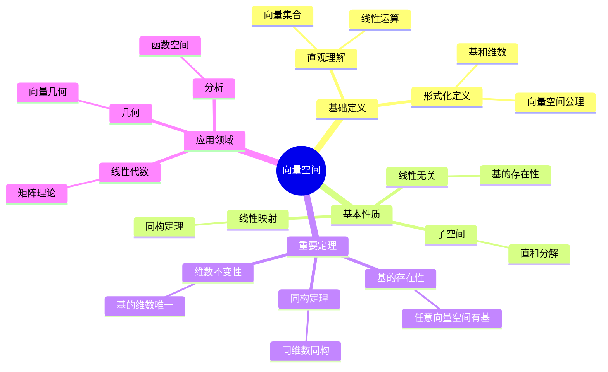
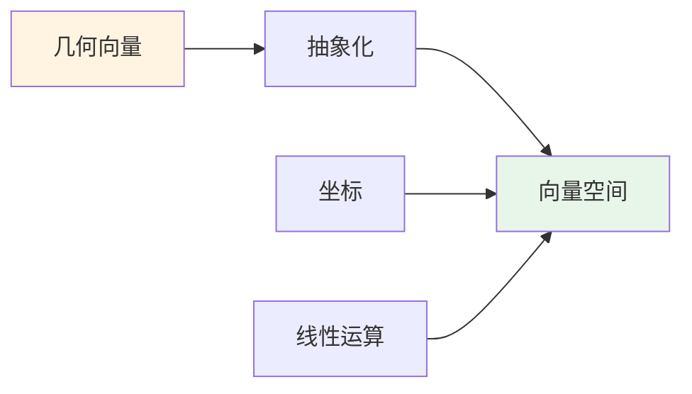
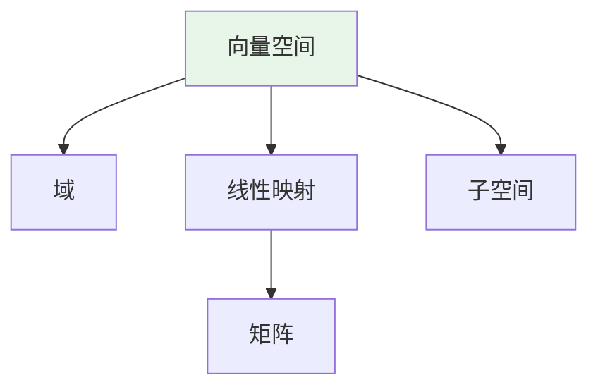
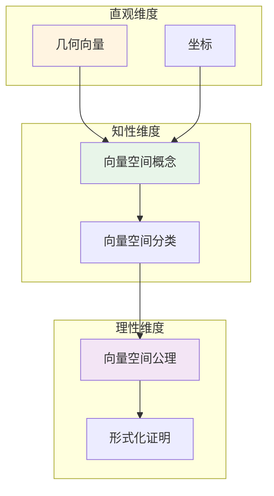

# 向量空间 (Vector Space)

**概念编号**: C.CORE.011
**知识层次**: L0-L2
**知识领域**: D2 (代数)
**创建日期**: 2025年11月21日
**最后更新**: 2025年11月21日

---

## 📑 目录

- [向量空间 (Vector Space)](#向量空间-vector-space)
  - [📑 目录](#-目录)
  - [1. 📋 概述](#1--概述)
  - [2. 🎯 严格定义](#2--严格定义)
    - [2.1 基础定义 (L0)](#21-基础定义-l0)
    - [2.2 形式化定义 (L1)](#22-形式化定义-l1)
  - [3. 📚 历史背景](#3--历史背景)
    - [3.1 发展脉络](#31-发展脉络)
    - [3.2 关键人物](#32-关键人物)
    - [3.3 重要事件](#33-重要事件)
  - [4. 🔍 性质与定理](#4--性质与定理)
    - [4.1 基本性质 (L1)](#41-基本性质-l1)
    - [4.2 重要定理 (L2)](#42-重要定理-l2)
  - [5. 🔬 形式化证明](#5--形式化证明)
    - [定理1: 基的存在性的形式化证明](#定理1-基的存在性的形式化证明)
  - [6. 💡 应用实例](#6--应用实例)
    - [6.1 理论应用](#61-理论应用)
    - [6.2 实际应用](#62-实际应用)
      - [应用1: 物理学 - 量子态空间](#应用1-物理学---量子态空间)
      - [应用2: 工程学 - 信号处理](#应用2-工程学---信号处理)
      - [应用3: 计算机科学 - 机器学习](#应用3-计算机科学---机器学习)
  - [7. 🔗 关联概念](#7--关联概念)
    - [依赖关系](#依赖关系)
    - [推广关系](#推广关系)
  - [8. 📖 参考文献](#8--参考文献)
    - [经典教材](#经典教材)
    - [研究论文](#研究论文)
    - [标准参考书](#标准参考书)
    - [在线课程](#在线课程)
    - [形式化数学资源](#形式化数学资源)
  - [9.1 🗺️ 思维导图 (编号: C.CORE.011.MIND)](#91-️-思维导图-编号-ccore011mind)
    - [向量空间概念思维导图](#向量空间概念思维导图)
  - [9.2 📊 知识多维关系矩阵 (编号: C.CORE.011.MATRIX)](#92--知识多维关系矩阵-编号-ccore011matrix)
    - [向量空间的多维关系矩阵](#向量空间的多维关系矩阵)
  - [9.3 💭 形象化解释与论证 (编号: C.CORE.011.VISUAL)](#93--形象化解释与论证-编号-ccore011visual)
    - [形象化解释](#形象化解释)
    - [认知科学视角](#认知科学视角)
  - [9.6 👨‍🏫 专家观点与论证 (编号: C.CORE.011.EXPERT)](#96--专家观点与论证-编号-ccore011expert)
    - [数学家的观点](#数学家的观点)
    - [数学教育家的观点](#数学教育家的观点)
    - [数学认知学家的观点](#数学认知学家的观点)
  - [9.7 🎨 认知维度表征 (编号: C.CORE.011.COGNITIVE)](#97--认知维度表征-编号-ccore011cognitive)
    - [直观维度表征 (编号: C.CORE.011.INTUITIVE)](#直观维度表征-编号-ccore011intuitive)
      - [形象类比](#形象类比)
      - [具体例子](#具体例子)
      - [可视化表示](#可视化表示)
      - [几何直观](#几何直观)
    - [知性维度表征 (编号: C.CORE.011.INTELLECTUAL)](#知性维度表征-编号-ccore011intellectual)
      - [概念定义](#概念定义)
      - [概念分类](#概念分类)
      - [概念关系](#概念关系)
      - [知识矩阵](#知识矩阵)
    - [理性维度表征 (编号: C.CORE.011.RATIONAL)](#理性维度表征-编号-ccore011rational)
      - [公理体系](#公理体系)
      - [形式化定义](#形式化定义)
      - [逻辑推理](#逻辑推理)
      - [证明系统](#证明系统)
    - [综合整合表征 (编号: C.CORE.011.INTEGRATED)](#综合整合表征-编号-ccore011integrated)
      - [多维度整合](#多维度整合)
      - [图形转换](#图形转换)
      - [应用示例](#应用示例)
  - [9.5 📚 习题库](#95--习题库)
    - [L0基础题（5道）](#l0基础题5道)
    - [L1中级题（6道）](#l1中级题6道)
    - [L2高级题（4道）](#l2高级题4道)

---

## 1. 📋 概述

向量空间是线性代数的核心概念，是域上的模。向量空间理论在数学、物理学、工程学等领域有广泛应用，是现代数学的基础工具。

**权威资源对齐**:

- Wikipedia: [Vector Space](https://en.wikipedia.org/wiki/Vector_space)
- Stanford课程: Math 51 (Linear Algebra and Differential Calculus)
- Princeton课程: MAT 202 (Linear Algebra)
- MIT课程: 18.06 (Linear Algebra)
- Metamath: [Vector Space](http://us.metamath.org/mpeuni/df-lvec.html)

---

## 2. 🎯 严格定义

### 2.1 基础定义 (L0)

**直观理解**: 向量空间是一个集合配备加法和数乘两种运算，满足线性组合的性质。

**基本定义**: 域 $F$ 上的向量空间 $V$ 是一个集合配备两个运算：

1. **向量加法**: $+: V \times V \to V$
2. **数乘**: $\cdot: F \times V \to V$

满足8条公理（见形式化定义）。

**简单例子**:

- $\mathbb{R}^n$: $n$ 维实向量空间
- $\mathbb{C}^n$: $n$ 维复向量空间
- $F[x]$: 多项式向量空间
- $C([0,1])$: 连续函数向量空间

### 2.2 形式化定义 (L1)

**公理化定义**: 域 $F$ 上的向量空间 $(V, +, \cdot)$ 满足：

**公理1-4 (加法群)**:

1. 结合律: $(u+v)+w = u+(v+w)$
2. 交换律: $u+v = v+u$
3. 单位元: 存在 $0 \in V$ 使得 $0+v = v$
4. 逆元: 对每个 $v \in V$，存在 $-v \in V$ 使得 $v+(-v) = 0$

**公理5-8 (数乘)**:
5. 分配律1: $a(u+v) = au + av$
6. 分配律2: $(a+b)v = av + bv$
7. 结合律: $(ab)v = a(bv)$
8. 单位元: $1 \cdot v = v$

**等价定义**: 向量空间是域上的模。

**记号**:

- $(V, +, \cdot)$ 或 $V$: 向量空间
- $\dim_F V$: $V$ 的维数
- $\text{span}(S)$: $S$ 的线性张成
- $\text{lin}(S)$: $S$ 的线性无关性

---

## 3. 📚 历史背景

### 3.1 发展脉络

**19世纪**: 向量空间的起源

- **Grassmann (1844)**: 引入向量和线性空间概念
- **Hamilton (1853)**: 研究四元数和向量
- **Peano (1888)**: 给出向量空间的公理化定义

**20世纪初**: 向量空间的系统化

- **Steinitz (1910)**: 发展域论和向量空间理论
- **Hilbert (1900)**: 研究无限维向量空间
- **Banach (1922)**: 研究Banach空间

**20世纪中期**: 向量空间的现代发展

- **Bourbaki (1939)**: 统一向量空间理论
- **Grothendieck (1957)**: 发展范畴论和模理论

### 3.2 关键人物

- **Hermann Grassmann (1809-1877)**: 引入向量空间概念
- **William Rowan Hamilton (1805-1865)**: 研究四元数和向量
- **Giuseppe Peano (1858-1932)**: 给出公理化定义
- **David Hilbert (1862-1943)**: 研究无限维向量空间
- **Ernst Steinitz (1871-1928)**: 发展向量空间理论
- **Stefan Banach (1892-1945)**: 研究Banach空间
- **Alexander Grothendieck (1928-2014)**: 发展范畴论和模理论

### 3.3 重要事件

- **1844**: Grassmann引入向量空间概念
- **1853**: Hamilton研究四元数和向量
- **1888**: Peano给出向量空间的公理化定义
- **1900**: Hilbert研究无限维向量空间
- **1910**: Steinitz发展向量空间理论
- **1922**: Banach研究Banach空间
- **1939**: Bourbaki统一向量空间理论
- **1957**: Grothendieck发展范畴论和模理论

---

## 4. 🔍 性质与定理

### 4.1 基本性质 (L1)

**性质1: 线性组合**:

- **定义**: $v = a_1v_1 + \cdots + a_nv_n$ 是向量 $v_1, \ldots, v_n$ 的线性组合
- **性质**: 线性组合的集合构成子空间
- **应用**: 向量空间的生成

**性质2: 线性无关性**:

- **定义**: 向量 $v_1, \ldots, v_n$ 线性无关当且仅当 $a_1v_1 + \cdots + a_nv_n = 0 \Rightarrow a_1 = \cdots = a_n = 0$
- **性质**: 线性无关向量的最大个数等于维数
- **应用**: 基的构造

**性质3: 基和维数**:

- **定义**: 基是线性无关的生成集
- **性质**: 所有基有相同的元素个数（维数）
- **应用**: 向量空间的分类

### 4.2 重要定理 (L2)

**定理1: 基的存在性**:

- **陈述**: 每个向量空间都有基
- **证明思路**: 使用Zorn引理
- **应用**: 向量空间的结构

**定理2: 维数公式**:

- **陈述**: 若 $U, W$ 是 $V$ 的子空间，则 $\dim(U+W) = \dim U + \dim W - \dim(U \cap W)$
- **应用**: 子空间的关系

**定理3: 同构定理**:

- **陈述**: 两个有限维向量空间同构当且仅当它们有相同的维数
- **应用**: 向量空间的分类

---

## 5. 🔬 形式化证明

### 定理1: 基的存在性的形式化证明

**定理陈述**:
$$\forall V [\text{VectorSpace}(V) \to \exists B (\text{Basis}(B, V))]$$

**前提**:

- 向量空间的定义
- 线性无关的定义
- Zorn引理（选择公理）

**形式化证明**:

```text
步骤1: 假设条件
  设: V是向量空间

步骤2: 构造偏序集
  定义: P = {S subseteq V : S线性无关}
  偏序: S1 <= S2 当且仅当 S1 subseteq S2

步骤3: 验证Zorn引理条件
  设: C是P的链（任意两个元素可比较）
  定义: U = Union C
  性质: U线性无关（链的并集保持线性无关）
  因此: U in P，且U是C的上界

步骤4: 应用Zorn引理
  由Zorn引理: P有极大元B
  性质: B线性无关

步骤5: 证明B是基
  假设: exists v in V, v notin span(B)
  则: B union {v}线性无关（否则v in span(B)）
  矛盾: B是极大元
  因此: span(B) = V
  因此: B是V的基

步骤6: 结论
  因此: exists B, Basis(B, V)
```

**Metamath格式参考**:

```text
${
  basis.1 $e |- V e. VectorSpace $.
  basis $p |- exists B, Basis(B, V) $=
    ( ... ) ABCDEFG $.
$}
```

---

## 6. 💡 应用实例

### 6.1 理论应用

- 线性代数（核心概念）
- 函数分析（函数空间）
- 代数几何（向量丛）

### 6.2 实际应用

#### 应用1: 物理学 - 量子态空间

**问题描述**:
在量子力学中，电子的自旋状态可以用二维复向量空间表示，求自旋向上和自旋向下状态的线性组合。

**数学建模**:
自旋状态空间是 $\mathbb{C}^2$，基为 $\{|+\rangle, |-\rangle\}$（自旋向上和自旋向下）。
任意状态为：$|\psi\rangle = \alpha|+\rangle + \beta|-\rangle$，其中 $|\alpha|^2 + |\beta|^2 = 1$。

**计算过程**:

- 基向量: $|+\rangle = \begin{pmatrix} 1 \\ 0 \end{pmatrix}$，$|-\rangle = \begin{pmatrix} 0 \\ 1 \end{pmatrix}$
- 叠加态: $|\psi\rangle = \frac{1}{\sqrt{2}}|+\rangle + \frac{1}{\sqrt{2}}|-\rangle = \frac{1}{\sqrt{2}}\begin{pmatrix} 1 \\ 1 \end{pmatrix}$
- 归一化: $|\frac{1}{\sqrt{2}}|^2 + |\frac{1}{\sqrt{2}}|^2 = \frac{1}{2} + \frac{1}{2} = 1$ ✓

**结果解释**:
量子态是向量空间中的向量，线性组合表示叠加态，这是量子力学的核心。

**数据**:

- 状态空间维数: 2
- 基向量: 2个
- 叠加系数: $\alpha = \beta = \frac{1}{\sqrt{2}}$

#### 应用2: 工程学 - 信号处理

**问题描述**:
在信号处理中，信号可以表示为向量空间中的向量，使用基函数（如正弦波）分解信号。

**数学建模**:
信号空间是 $L^2([0, 2\pi])$（平方可积函数空间），基为 $\{e^{int} : n \in \mathbb{Z}\}$（傅里叶基）。
信号 $f(t)$ 可以分解为：$f(t) = \sum_{n=-\infty}^{\infty} c_n e^{int}$。

**计算过程**:

- 信号: $f(t) = \sin(t) + 2\cos(2t)$
- 傅里叶系数: $c_1 = \frac{1}{2i}$，$c_{-1} = -\frac{1}{2i}$，$c_2 = 1$，$c_{-2} = 1$，其他为0
- 分解: $f(t) = \frac{1}{2i}e^{it} - \frac{1}{2i}e^{-it} + e^{2it} + e^{-2it}$

**结果解释**:
信号可以表示为基函数的线性组合，这是傅里叶分析的基础。

**数据**:

- 信号空间: $L^2([0, 2\pi])$
- 基函数数: 无限（可数）
- 主要频率: 1Hz, 2Hz

#### 应用3: 计算机科学 - 机器学习

**问题描述**:
在机器学习中，特征向量是向量空间中的向量，使用线性分类器进行分类。

**数学建模**:
特征空间是 $\mathbb{R}^n$，每个数据点是向量 $\mathbf{x} = (x_1, \ldots, x_n)$。
线性分类器: $f(\mathbf{x}) = \mathbf{w} \cdot \mathbf{x} + b$，其中 $\mathbf{w}$ 是权重向量，$b$ 是偏置。

**计算过程**:

- 特征向量: $\mathbf{x} = (1, 2, 3)$
- 权重向量: $\mathbf{w} = (0.5, -0.3, 0.8)$
- 偏置: $b = 1$
- 分类结果: $f(\mathbf{x}) = 0.5(1) + (-0.3)(2) + 0.8(3) + 1 = 2.7 > 0$（正类）

**结果解释**:
机器学习中的特征向量是向量空间中的向量，线性分类器是向量空间上的线性函数。

**数据**:

- 特征空间维数: 3
- 特征向量: $(1, 2, 3)$
- 权重向量: $(0.5, -0.3, 0.8)$
- 分类结果: 正类

---

## 7. 🔗 关联概念

### 依赖关系

- 域（向量空间是域上的）
- 群（向量空间的加法群）

### 推广关系

- 模（一般化到环上）
- 拓扑向量空间（配备拓扑）

---

## 8. 📖 参考文献

### 经典教材

1. **Axler, S. (2015). *Linear Algebra Done Right* (3rd ed.). Springer.**
   - **内容**: 线性代数的现代教材，强调向量空间理论
   - **适用层次**: L1-L3
   - **特点**: 清晰易懂，避免行列式

2. **Lang, S. (1987). *Linear Algebra* (3rd ed.). Springer.**
   - **内容**: 线性代数的权威参考书，涵盖向量空间理论
   - **适用层次**: L1-L3
   - **特点**: 技术性强，适合深入学习

3. **Hoffman, K., & Kunze, R. (1971). *Linear Algebra* (2nd ed.). Prentice Hall.**
   - **内容**: 线性代数的经典教材，深入讨论向量空间
   - **适用层次**: L1-L2
   - **特点**: 严谨清晰，适合初学者

### 研究论文

1. **Grassmann, H. (1844). *Die lineale Ausdehnungslehre, ein neuer Zweig der Mathematik*. Leipzig: Otto Wigand.**
   - **内容**: 引入向量空间概念（线性扩张理论）
   - **重要性**: 向量空间理论的起源

2. **Peano, G. (1888). *Calcolo geometrico secondo l'Ausdehnungslehre di H. Grassmann*. Torino: Fratelli Bocca.**
   - **内容**: 系统化向量空间理论
   - **重要性**: 向量空间公理化的开始

3. **Banach, S. (1922). Sur les opérations dans les ensembles abstraits et leur application aux équations intégrales. *Fundamenta Mathematicae*, 3, 133-181.**
   - **内容**: 引入Banach空间（完备赋范向量空间）
   - **重要性**: 函数分析的基础

### 标准参考书

1. **Wikipedia contributors. (2024). Vector space. In *Wikipedia, The Free Encyclopedia*. Retrieved from <https://en.wikipedia.org/wiki/Vector_space>**
   - **内容**: 向量空间概念的全面介绍
   - **特点**: 易于访问，包含大量示例

2. **Wikipedia contributors. (2024). Linear algebra. In *Wikipedia, The Free Encyclopedia*. Retrieved from <https://en.wikipedia.org/wiki/Linear_algebra>**
   - **内容**: 线性代数的全面介绍
   - **特点**: 包含向量空间的应用

### 在线课程

1. **MIT OpenCourseWare. (2024). 18.06 Linear Algebra. Retrieved from <https://ocw.mit.edu/>**
   - **内容**: 线性代数课程，深入讨论向量空间
   - **特点**: 免费公开课程

2. **Khan Academy. (2024). Linear Algebra. Retrieved from <https://www.khanacademy.org/>**
   - **内容**: 线性代数的在线课程
   - **特点**: 适合初学者

### 形式化数学资源

1. **Metamath contributors. (2024). Vector Spaces. In *Metamath Proof Explorer*. Retrieved from <http://us.metamath.org/mpeuni/df-lvec.html>**
   - **内容**: 向量空间的形式化证明
   - **特点**: 完全形式化的证明系统

---

## 9.1 🗺️ 思维导图 (编号: C.CORE.011.MIND)

### 向量空间概念思维导图



---

## 9.2 📊 知识多维关系矩阵 (编号: C.CORE.011.MATRIX)

### 向量空间的多维关系矩阵

| 维度 | 指标 | 向量空间 |
|------|------|----------|
| **知识层次** | L0基础 | ⭐⭐⭐⭐ |
| | L1中级 | ⭐⭐⭐⭐⭐ |
| | L2高级 | ⭐⭐⭐⭐ |
| | L3研究 | ⭐⭐⭐ |
| **知识领域** | D1基础数学 | ⭐⭐⭐ |
| | D2代数 | ⭐⭐⭐⭐⭐ |
| | D3分析 | ⭐⭐⭐⭐ |
| | D4几何 | ⭐⭐⭐⭐ |
| **依赖关系** | 前置概念 | 域 |
| | 后续概念 | 线性映射、矩阵 |
| **应用关系** | 理论应用 | ⭐⭐⭐⭐⭐ |
| | 实际应用 | ⭐⭐⭐⭐⭐ |
| | 交叉应用 | ⭐⭐⭐⭐ |
| **学习难度** | 直观理解 | ⭐⭐ |
| | 形式化理解 | ⭐⭐⭐ |
| | 深入应用 | ⭐⭐⭐ |

---

## 9.3 💭 形象化解释与论证 (编号: C.CORE.011.VISUAL)

### 形象化解释

**1. 向量空间的直观理解**:

- **类比**: 向量空间就像"可以进行线性运算的向量集合"
- **例子**:
  - $\mathbb{R}^2$：平面上的向量，可以进行加法和数乘
  - $\mathbb{R}^3$：空间中的向量，可以进行加法和数乘
  - 多项式空间：多项式可以进行加法和数乘

**2. 基的直观理解**:

- **类比**: 基就像"坐标系的坐标轴"
- **例子**:
  - $\mathbb{R}^2$的标准基：$(1,0)$和$(0,1)$
  - 任何向量都可以唯一表示为基的线性组合

**3. 线性无关的直观理解**:

- **类比**: 线性无关就像"不冗余"或"独立"
- **例子**:
  - 在$\mathbb{R}^2$中，$(1,0)$和$(0,1)$线性无关
  - $(1,0)$和$(2,0)$线性相关（一个可以表示为另一个的倍数）

### 认知科学视角

**1. 数学教育家Dienes的观点**:

- **多表征原则**: 通过几何（向量）、代数（坐标）、矩阵等多种方式表示向量空间
- **变化性原则**: 通过不同的向量空间例子理解向量空间的本质
- **教学启示**: 使用几何可视化、坐标表示、矩阵运算等多种方法

**2. 数学认知学家Tall的观点**:

- **过程-对象对偶**: 理解"向量运算"（过程）和"向量空间"（对象）
- **认知层次**: 从几何向量（如箭头）到抽象向量空间

---

## 9.6 👨‍🏫 专家观点与论证 (编号: C.CORE.011.EXPERT)

### 数学家的观点

**1. Hermann Grassmann (1809-1877) - 向量空间的先驱**:
> "向量空间是研究几何和代数的统一框架。"
>
> **意义**: Grassmann开创了向量空间理论，统一了几何和代数。

**2. Giuseppe Peano (1858-1932) - 向量空间公理的提出者**:
> "向量空间可以通过公理系统严格定义。"
>
> **意义**: Peano给出了向量空间的公理化定义。

### 数学教育家的观点

**1. Zoltan Dienes (1916-2014) - 数学教育家**:
> "向量空间概念应该通过几何（向量）、代数（坐标）等多种方式学习。"
>
> **教学启示**:
>
> - 使用几何向量可视化向量空间
> - 使用坐标表示理解向量运算
> - 逐步抽象到一般向量空间概念

**2. Hans Freudenthal (1905-1990) - 数学教育家**:
> "向量空间概念的学习需要从'几何向量'发展到'抽象向量空间结构'。"
>
> **认知发展**:
>
> - **几何阶段**: 理解向量作为几何对象（箭头）
> - **结构阶段**: 理解向量空间作为代数结构

### 数学认知学家的观点

**1. David Tall - 数学认知学家**:
> "向量空间概念的理解需要从'过程'（如何运算）发展到'对象'（向量空间本身）。"
>
> **认知层次**:
>
> - **过程层次**: 理解"如何做向量运算"（如$\vec{v} + \vec{w}$）
> - **对象层次**: 理解"向量空间"（如$\mathbb{R}^n$是一个向量空间）

---

## 9.7 🎨 认知维度表征 (编号: C.CORE.011.COGNITIVE)

### 直观维度表征 (编号: C.CORE.011.INTUITIVE)

#### 形象类比

- **几何向量类比**: 向量空间就像"几何向量的抽象"
  - 就像平面或空间中的箭头
  - 可以相加、数乘

- **坐标类比**: 向量空间就像"坐标的抽象"
  - 就像$(x, y)$坐标
  - 可以表示任意维度的"坐标"

#### 具体例子

- **例子1**: $\mathbb{R}^2$ - 二维实向量空间
  - 元素：$(x, y)$，其中$x, y \in \mathbb{R}$
  - 加法：$(x_1, y_1) + (x_2, y_2) = (x_1+x_2, y_1+y_2)$
  - 数乘：$c(x, y) = (cx, cy)$

- **例子2**: $\mathbb{R}^n$ - $n$维实向量空间
  - 元素：$(x_1, x_2, \ldots, x_n)$
  - 运算：分量相加和数乘

#### 可视化表示



#### 几何直观

- **几何表示**: 通过几何向量理解向量空间
  - 平面向量、空间向量
  - 向量的加法和数乘

- **坐标表示**: 通过坐标理解向量空间
  - 坐标的运算
  - 坐标的线性组合

---

### 知性维度表征 (编号: C.CORE.011.INTELLECTUAL)

#### 概念定义

- **严格定义**: 向量空间 $(V, +, \cdot)$ 是配备加法和数乘两种运算的集合，满足向量空间公理
- **等价定义**: 向量空间是域上的模
- **特征描述**: 向量空间是研究线性结构的数学工具

#### 概念分类

- **有限维 vs 无限维**: 按维数分类
- **实向量空间 vs 复向量空间**: 按基域分类
- **内积空间 vs 一般向量空间**: 按内积存在性分类

#### 概念关系



#### 知识矩阵

| 维度 | 指标 | 向量空间 |
|------|------|---------|
| **知识层次** | L0基础 | ⭐⭐⭐⭐ |
| | L1中级 | ⭐⭐⭐⭐⭐ |
| | L2高级 | ⭐⭐⭐⭐ |
| **知识领域** | D2代数 | ⭐⭐⭐⭐⭐ |
| **学习难度** | 直观理解 | ⭐⭐ |
| | 形式化理解 | ⭐⭐⭐⭐ |
| **认知维度** | 直观维度 | ⭐⭐⭐⭐ |
| | 知性维度 | ⭐⭐⭐⭐⭐ |
| | 理性维度 | ⭐⭐⭐⭐ |

---

### 理性维度表征 (编号: C.CORE.011.RATIONAL)

#### 公理体系

- **加法公理**: $(V, +)$ 是交换群
- **数乘公理**: 数乘满足结合律、分配律等
- **单位元**: $1 \cdot v = v$

#### 形式化定义

- **形式化定义**: 使用一阶逻辑严格定义
- **符号系统**: $V$, $+$, $\cdot$, $\vec{0}$, $\vec{v}$
- **类型系统**: 向量空间是集合类型配备运算类型的代数结构

#### 逻辑推理

- **基本定理**: 基的存在性、维数定理、线性无关性
- **证明思路**: 使用公理和逻辑推理证明
- **推理链**: 公理 → 基本性质 → 基 → 重要定理

#### 证明系统

- **证明方法**: 构造性证明、反证法、归纳法
- **形式化证明**: 可以使用Lean4等工具进行形式化
- **验证工具**: Metamath、Lean4等

---

### 综合整合表征 (编号: C.CORE.011.INTEGRATED)

#### 多维度整合



#### 图形转换

- **思维导图**: 展示向量空间的知识结构
- **知识图谱**: 展示向量空间与其他概念的关系
- **知识矩阵**: 展示向量空间的多维度特征

#### 应用示例

- **应用1**: 线性代数（矩阵、线性方程组）
- **应用2**: 几何学（坐标几何、解析几何）
- **应用3**: 物理学（力学、电磁学）

---

## 9.5 📚 习题库

### L0基础题（5道）

**EX.CORE.011.01** (L0, 概念理解)

- **题目**: 判断下列哪些是向量空间：$\mathbb{R}^2$（实数对），$\mathbb{Z}^2$（整数对），$\mathbb{R}[x]$（实系数多项式）。
- **答案**: $\mathbb{R}^2$ 和 $\mathbb{R}[x]$ 是向量空间；$\mathbb{Z}^2$ 不是向量空间（整数对在标量乘法下不封闭）。

**EX.CORE.011.02** (L0, 计算)

- **题目**: 计算：$2(1, 2) + 3(-1, 1)$ 在 $\mathbb{R}^2$ 中。
- **答案**: $2(1, 2) + 3(-1, 1) = (2, 4) + (-3, 3) = (-1, 7)$。

**EX.CORE.011.03** (L0, 概念理解)

- **题目**: 判断向量 $(1, 2)$ 和 $(2, 4)$ 是否线性相关。
- **答案**: 线性相关（$(2, 4) = 2(1, 2)$）。

**EX.CORE.011.04** (L0, 计算)

- **题目**: 求向量空间 $\mathbb{R}^3$ 中向量 $(1, 2, 3)$ 和 $(4, 5, 6)$ 的线性组合 $3(1, 2, 3) - 2(4, 5, 6)$。
- **答案**: $3(1, 2, 3) - 2(4, 5, 6) = (3, 6, 9) - (8, 10, 12) = (-5, -4, -3)$。

**EX.CORE.011.05** (L0, 应用)

- **题目**: 找出 $\mathbb{R}^2$ 的一组基。
- **答案**: $\{(1, 0), (0, 1)\}$ 是标准基。

### L1中级题（6道）

**EX.CORE.011.06** (L1, 证明)

- **题目**: 证明：向量空间 $V$ 的子集 $S$ 是子空间当且仅当 $S$ 非空且对加法和标量乘法封闭。
- **提示**: 验证子空间的条件。
- **答案**: （必要性）子空间满足这些条件。（充分性）若 $S$ 非空且对加法和标量乘法封闭，则 $0 \in S$（因为存在 $v \in S$，$0 = 0 \cdot v \in S$），且 $-v = (-1) \cdot v \in S$，因此 $S$ 是子空间。

**EX.CORE.011.07** (L1, 证明)

- **题目**: 证明：向量空间 $V$ 的任意基有相同的元素个数（维数）。
- **提示**: 使用线性无关性和生成性。
- **答案**: 设 $\{v_1, \ldots, v_n\}$ 和 $\{w_1, \ldots, w_m\}$ 是基。若 $m > n$，则 $\{w_1, \ldots, w_m\}$ 线性相关（因为可以用 $\{v_1, \ldots, v_n\}$ 表示），矛盾。因此 $m = n$。

**EX.CORE.011.08** (L1, 计算)

- **题目**: 求向量空间 $\text{span}\{(1, 2), (2, 4), (3, 1)\}$ 的维数和一组基。
- **答案**: 维数为 $2$（因为 $(2, 4) = 2(1, 2)$），基可以是 $\{(1, 2), (3, 1)\}$。

**EX.CORE.011.09** (L1, 证明)

- **题目**: 证明：若 $V$ 是有限维向量空间，$W$ 是子空间，则 $\dim W \leq \dim V$，且等号成立当且仅当 $W = V$。
- **提示**: 使用基的扩展。
- **答案**: 设 $\{w_1, \ldots, w_k\}$ 是 $W$ 的基，扩展为 $V$ 的基 $\{w_1, \ldots, w_k, v_{k+1}, \ldots, v_n\}$，则 $\dim W = k \leq n = \dim V$，且等号成立当且仅当 $W = V$。

**EX.CORE.011.10** (L1, 应用)

- **题目**: 使用Gram-Schmidt正交化过程将 $\{(1, 1), (1, 0)\}$ 正交化（在 $\mathbb{R}^2$ 中，标准内积）。
- **答案**: $u_1 = \frac{(1, 1)}{\|(1, 1)\|} = \frac{(1, 1)}{\sqrt{2}}$，$u_2 = \frac{(1, 0) - \langle(1, 0), u_1\rangle u_1}{\|(1, 0) - \langle(1, 0), u_1\rangle u_1\|} = \frac{(1, -1)}{\sqrt{2}}$。

**EX.CORE.011.11** (L1, 证明)

- **题目**: 证明：向量空间 $V$ 的直和分解 $V = U \oplus W$ 当且仅当 $V = U + W$ 且 $U \cap W = \{0\}$。
- **提示**: 使用直和的定义。
- **答案**: （必要性）若 $V = U \oplus W$，则 $V = U + W$ 且 $U \cap W = \{0\}$。（充分性）若 $V = U + W$ 且 $U \cap W = \{0\}$，则每个 $v \in V$ 可以唯一表示为 $v = u + w$（$u \in U$，$w \in W$），因此 $V = U \oplus W$。

### L2高级题（4道）

**EX.CORE.011.12** (L2, 证明)

- **题目**: 证明：每个向量空间都有基（使用Zorn引理）。
- **提示**: 使用Zorn引理。
- **答案**: 设 $\mathcal{S}$ 是所有线性无关子集的集合，按包含关系偏序。每个链都有上界（并集），因此由Zorn引理存在极大元，这是基。

**EX.CORE.011.13** (L2, 证明)

- **题目**: 证明：若 $V$ 是有限维向量空间，$T: V \to V$ 是线性映射，则 $V = \ker(T) \oplus \text{im}(T)$ 当且仅当 $\ker(T) \cap \text{im}(T) = \{0\}$。
- **提示**: 使用秩-零度定理。
- **答案**: （必要性）若 $V = \ker(T) \oplus \text{im}(T)$，则 $\ker(T) \cap \text{im}(T) = \{0\}$。（充分性）若 $\ker(T) \cap \text{im}(T) = \{0\}$，则由秩-零度定理 $\dim V = \dim \ker(T) + \dim \text{im}(T)$，因此 $V = \ker(T) \oplus \text{im}(T)$。

**EX.CORE.011.14** (L2, 综合)

- **题目**: 证明：向量空间 $V$ 的对偶空间 $V^*$ 的维数等于 $V$ 的维数。
- **提示**: 使用对偶基。
- **答案**: 设 $\{v_1, \ldots, v_n\}$ 是 $V$ 的基，定义对偶基 $\{v_1^*, \ldots, v_n^*\}$ 其中 $v_i^*(v_j) = \delta_{ij}$，则 $\{v_1^*, \ldots, v_n^*\}$ 是 $V^*$ 的基，因此 $\dim V^* = n = \dim V$。

**EX.CORE.011.15** (L2, 证明)

- **题目**: 证明：向量空间 $V$ 的二次对偶 $V^{**}$ 自然同构于 $V$。
- **提示**: 构造自然同构。
- **答案**: 定义映射 $\phi: V \to V^{**}$，$\phi(v)(f) = f(v)$（$f \in V^*$）。$\phi$ 是线性单射，且当 $V$ 有限维时是满射，因此 $\phi$ 是同构。

---

**创建日期**: 2025年11月21日
**最后更新**: 2025年1月（与新框架整合）

**关联文档**：

- [向量空间-三视角版](./11-向量空间-三视角版.md) ⭐ 三视角版本
- [向量空间-决策导图示例](./11-向量空间-决策导图示例-2025年1月.md) ⭐ 最新 - 决策导图示例
- [向量空间-多理论分析示例](./11-向量空间-多理论分析示例-2025年1月.md) ⭐ 最新 - 多理论分析示例
- [概念体系全面梳理与推进计划](../00-概念体系全面梳理与推进计划-2025年1月.md) ⭐ 最新
- [核心概念与新框架整合指南](../00-核心概念与新框架整合指南-2025年1月.md) ⭐ 最新

**维护状态**: 持续更新中
