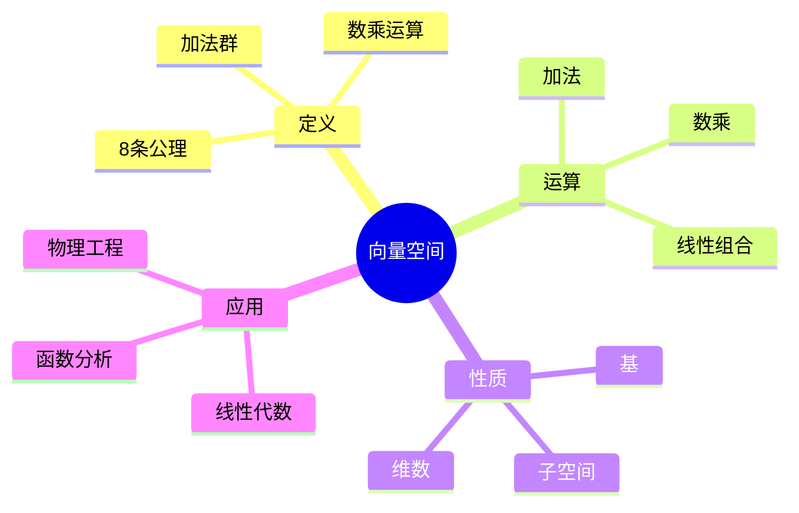
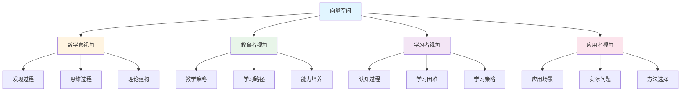
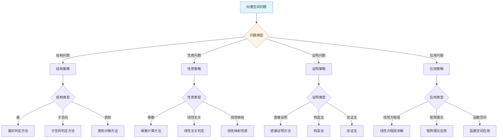
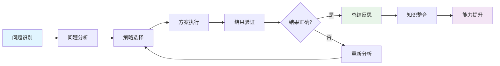
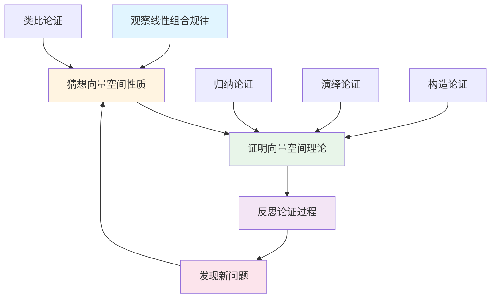
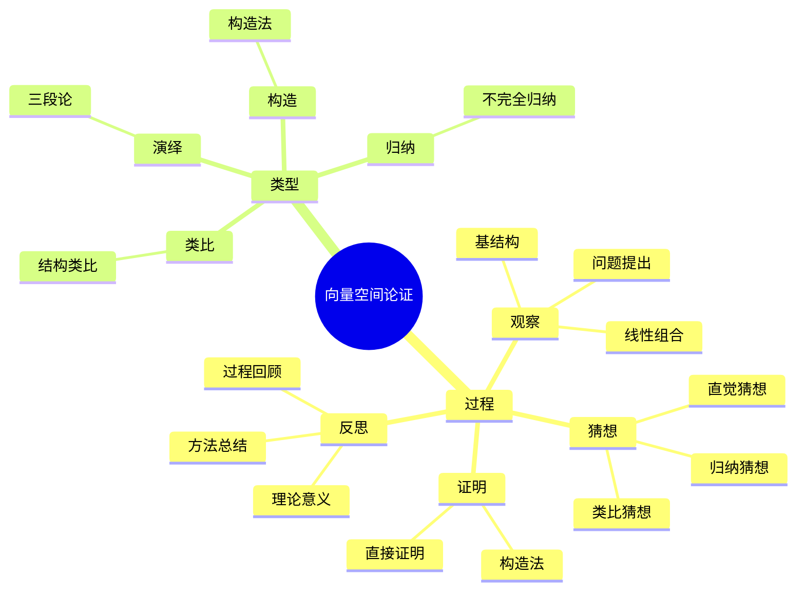
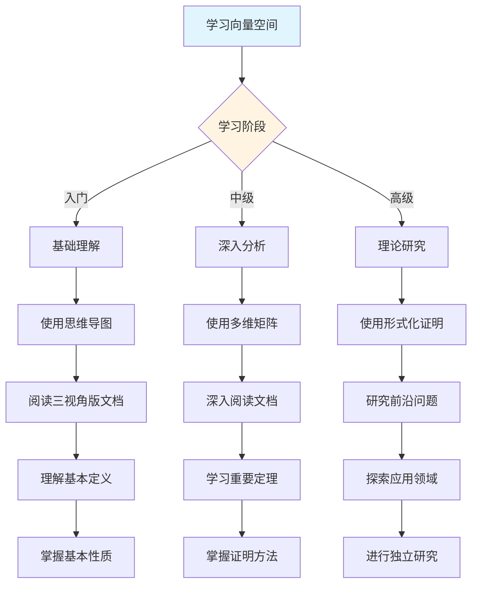
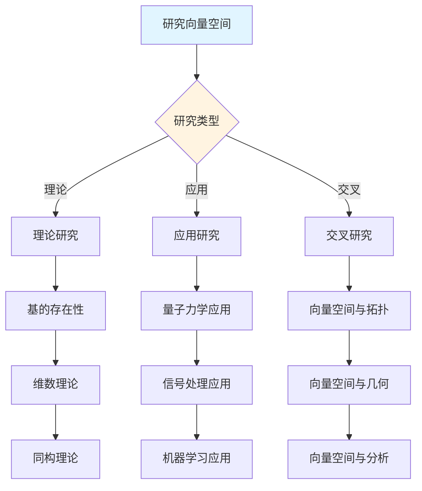
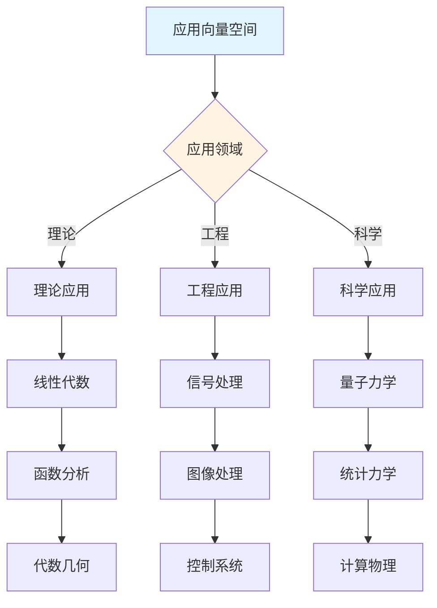
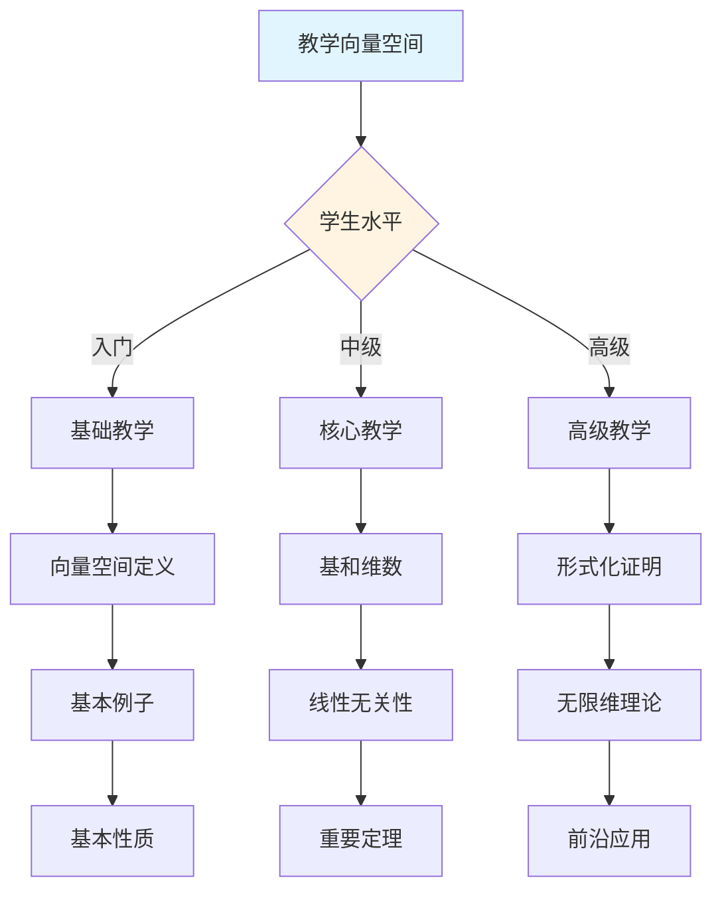

---
msc_primary: "00A99"
---

# 向量空间 (Vector Space) - 三视角组织版

**概念编号**: C.CORE.011
**知识层次**: L0-L2
**知识领域**: D2 (代数)
**创建日期**: 2025年1月
**最后更新**: 2026-04-05

---

## 📋 目录 / Table of Contents

- [向量空间 (Vector Space) - 三视角组织版](#向量空间-vector-space---三视角组织版)
  - 📋 目录 / Table of Contents
  - 1. 📋 概述 (编号: C.CORE.011.01)
  - [🧠 认知学视角：如何理解向量空间 (编号: C.CORE.011.02)](#认知学视角如何理解向量空间-编号-ccore01102)
    - [认知起点 (编号: C.CORE.011.02.01)](#认知起点-编号-ccore0110201)
    - [认知过程 (编号: C.CORE.011.02.02)](#认知过程-编号-ccore0110202)
      - [阶段1：直观理解阶段 (编号: C.CORE.011.02.02.01)](#阶段1直观理解阶段-编号-ccore011020201)
      - [阶段2：概念形成阶段 (编号: C.CORE.011.02.02.02)](#阶段2概念形成阶段-编号-ccore011020202)
      - [阶段3：形式化阶段 (编号: C.CORE.011.02.02.03)](#阶段3形式化阶段-编号-ccore011020203)

## 形式化定义

**定义（向量空间）**：设 $F$ 是域，$F$-向量空间是一个有序对 $(V, +, \cdot)$，其中 $V$ 是非空集合，满足：

1. $(V, +)$ 是**交换群**
2. **标量乘法**：$\cdot: F \times V \to V$ 满足：
   - $a \cdot (v + w) = a \cdot v + a \cdot w$
   - $(a + b) \cdot v = a \cdot v + b \cdot v$
   - $(ab) \cdot v = a \cdot (b \cdot v)$
   - $1 \cdot v = v$

**符号说明**：
- $V$：向量空间
- $u, v, w$：向量
- $a, b, c$ 或 $\lambda, \mu$：标量
- $\mathbf{0}$ 或 $0_V$：零向量
- $\dim_F(V)$ 或 $\dim(V)$：维数

    - [认知障碍 (编号: C.CORE.011.02.03)](#认知障碍-编号-ccore0110203)
    - [认知工具 (编号: C.CORE.011.02.04)](#认知工具-编号-ccore0110204)
  - [🎓 教育学视角：如何教学向量空间 (编号: C.CORE.011.03)](#教育学视角如何教学向量空间-编号-ccore01103)
    - [教学目标 (编号: C.CORE.011.03.01)](#教学目标-编号-ccore0110301)
    - [教学路径 (编号: C.CORE.011.03.02)](#教学路径-编号-ccore0110302)
      - [阶段1：引入阶段（激发兴趣） (编号: C.CORE.011.03.02.01)](#阶段1引入阶段激发兴趣-编号-ccore011030201)
      - [阶段2：探索阶段（主动建构） (编号: C.CORE.011.03.02.02)](#阶段2探索阶段主动建构-编号-ccore011030202)
      - [阶段3：形式化阶段（抽象概括） (编号: C.CORE.011.03.02.03)](#阶段3形式化阶段抽象概括-编号-ccore011030203)
      - [阶段4：巩固阶段（应用深化） (编号: C.CORE.011.03.02.04)](#阶段4巩固阶段应用深化-编号-ccore011030204)
    - [教学难点 (编号: C.CORE.011.03.03)](#教学难点-编号-ccore0110303)
    - [教学策略 (编号: C.CORE.011.03.04)](#教学策略-编号-ccore0110304)
    - [评估方法 (编号: C.CORE.011.03.05)](#评估方法-编号-ccore0110305)
  - [🔬 数学家视角：如何思考向量空间 (编号: C.CORE.011.04)](#数学家视角如何思考向量空间-编号-ccore01104)
    - [问题起源 (编号: C.CORE.011.04.01)](#问题起源-编号-ccore0110401)
    - [思维过程 (编号: C.CORE.011.04.02)](#思维过程-编号-ccore0110402)
      - [步骤1：问题提出 (编号: C.CORE.011.04.02.01)](#步骤1问题提出-编号-ccore011040201)
      - [步骤2：概念形成 (编号: C.CORE.011.04.02.02)](#步骤2概念形成-编号-ccore011040202)
      - [步骤3：理论发展 (编号: C.CORE.011.04.02.03)](#步骤3理论发展-编号-ccore011040203)
    - [历史发展 (编号: C.CORE.011.04.03)](#历史发展-编号-ccore0110403)
    - [3.2 关键人物和贡献 (编号: C.CORE.011.04.04)](#32-关键人物和贡献-编号-ccore0110404)
    - [重要定理 (编号: C.CORE.011.04.05)](#重要定理-编号-ccore0110405)
    - [开放问题 (编号: C.CORE.011.04.06)](#开放问题-编号-ccore0110406)
    - [一、第一人称思维描述 (编号: C.CORE.011.04.07)](#一第一人称思维描述-编号-ccore0110407)
      - [1.1 Peano的发现过程](#11-peano的发现过程)
    - [二、数学直觉的形成 (编号: C.CORE.011.04.08)](#二数学直觉的形成-编号-ccore0110408)
      - [2.1 直觉在概念发现中的作用](#21-直觉在概念发现中的作用)
      - [2.2 如何培养向量空间直觉](#22-如何培养向量空间直觉)
    - [三、数学美的教育价值 (编号: C.CORE.011.04.09)](#三数学美的教育价值-编号-ccore0110409)
      - [3.1 向量空间论的美在哪里](#31-向量空间论的美在哪里)
      - [3.2 如何培养学生的数学美感](#32-如何培养学生的数学美感)
    - [四、问题解决策略 (编号: C.CORE.011.04.10)](#四问题解决策略-编号-ccore0110410)
      - [4.1 数学家的启发式方法](#41-数学家的启发式方法)
      - [4.2 思维过程分析](#42-思维过程分析)
    - [五、批判性反思 (编号: C.CORE.011.04.11)](#五批判性反思-编号-ccore0110411)
      - [5.1 向量空间概念的局限性](#51-向量空间概念的局限性)
      - [5.2 向量空间理论的未解决问题](#52-向量空间理论的未解决问题)
  - [💡 数学解释：为什么向量空间是这样定义的 (编号: C.CORE.011.05)](#数学解释为什么向量空间是这样定义的-编号-ccore01105)
    - [一、直观解释：向量空间是什么？](#一直观解释向量空间是什么)
      - [1.1 具体例子](#11-具体例子)
      - [1.2 形象类比](#12-形象类比)
      - [1.3 几何直观](#13-几何直观)
      - [1.4 操作体验](#14-操作体验)
    - [二、知性解释：向量空间的本质是什么？](#二知性解释向量空间的本质是什么)
      - [2.1 概念定义](#21-概念定义)
      - [2.2 分类体系](#22-分类体系)
      - [2.3 抽象结构](#23-抽象结构)
      - [2.4 知识体系](#24-知识体系)
    - [三、理性解释：向量空间的公理化定义](#三理性解释向量空间的公理化定义)
      - [3.1 公理体系](#31-公理体系)
      - [3.2 形式化证明](#32-形式化证明)
      - [3.3 系统建构](#33-系统建构)
    - [四、多视角解释：从不同角度理解向量空间](#四多视角解释从不同角度理解向量空间)
      - [4.1 数学家视角：向量空间是如何被发现的？](#41-数学家视角向量空间是如何被发现的)
      - [4.2 教育者视角：如何教学向量空间？](#42-教育者视角如何教学向量空间)
      - [4.3 学习者视角：如何学习向量空间？](#43-学习者视角如何学习向量空间)
      - [4.4 应用者视角：如何应用向量空间？](#44-应用者视角如何应用向量空间)
    - [五、思维表征：用多种方式理解向量空间](#五思维表征用多种方式理解向量空间)
      - [5.1 思维导图：向量空间的知识结构](#51-思维导图向量空间的知识结构)
      - [5.2 矩阵对比：不同解释方式的对比](#52-矩阵对比不同解释方式的对比)
      - [5.3 多视角表征：从不同角度表征向量空间](#53-多视角表征从不同角度表征向量空间)
      - [5.4 决策树：向量空间问题分类和策略选择](#54-决策树向量空间问题分类和策略选择)
      - [5.5 决策逻辑路径：向量空间问题解决过程](#55-决策逻辑路径向量空间问题解决过程)
      - [5.6 多维对比矩阵：向量空间概念特征对比](#56-多维对比矩阵向量空间概念特征对比)
  - [🔍 数学论证：如何论证向量空间 (编号: C.CORE.011.06)](#数学论证如何论证向量空间-编号-ccore01106)
    - [一、论证过程：从观察到反思](#一论证过程从观察到反思)
      - [1.1 观察（Observation）](#11-观察observation)
      - [1.2 猜想（Conjecture）](#12-猜想conjecture)
      - [1.3 证明（Proof）](#13-证明proof)
      - [1.4 反思（Reflection）](#14-反思reflection)
    - [二、论证类型：多种推理方式](#二论证类型多种推理方式)
      - [2.1 归纳论证（Inductive Reasoning）](#21-归纳论证inductive-reasoning)
      - [2.2 演绎论证（Deductive Reasoning）](#22-演绎论证deductive-reasoning)
      - [2.3 类比论证（Analogical Reasoning）](#23-类比论证analogical-reasoning)
      - [2.4 构造论证（Constructive Reasoning）](#24-构造论证constructive-reasoning)
    - [三、论证可视化：用图形表示论证过程](#三论证可视化用图形表示论证过程)
      - [3.1 论证流程图](#31-论证流程图)
      - [3.2 论证类型对比](#32-论证类型对比)
      - [3.3 论证思维导图](#33-论证思维导图)
  - [🔗 三视角整合 (编号: C.CORE.011.07)](#三视角整合-编号-ccore01107)
    - [三个视角的关联](#三个视角的关联)
    - [如何综合运用三个视角](#如何综合运用三个视角)
  - [📚 参考文献 (编号: C.CORE.011.08)](#参考文献-编号-ccore01108)
    - [权威资源](#权威资源)
    - [经典教材](#经典教材)
    - [研究论文](#研究论文)

---

## 1. 📋 概述 (编号: C.CORE.011.01)

向量空间是线性代数的核心概念，是域上的模。向量空间理论在数学、物理学、工程学等领域有广泛应用，是现代数学的基础工具。

本文档从**数学认知学**、**教育学**、**数学家**三个视角深入展开向量空间概念，避免简单的概念堆垒。

**权威资源对齐**:

- Wikipedia: [Vector Space](https://en.wikipedia.org/wiki/Vector_space)
- Stanford课程: Math 51 (Linear Algebra and Differential Calculus)
- Princeton课程: MAT 202 (Linear Algebra)
- MIT课程: 18.06 (Linear Algebra)
- Metamath: [Vector Space](http://us.metamath.org/mpeuni/df-lvec.html)[需更新][需更新]

---

## 🧠 认知学视角：如何理解向量空间 (编号: C.CORE.011.02)

### 认知起点 (编号: C.CORE.011.02.01)

**学习者已有的知识基础**:

- 域的概念
- 向量的概念（几何向量）
- 日常经验中的"方向"、"大小"概念

**日常经验中的类似概念**:

- "箭头"：有方向和大小的量
- "位移"：从一个点到另一个点的移动
- "力"：有方向和大小的物理量

### 认知过程 (编号: C.CORE.011.02.02)

#### 阶段1：直观理解阶段 (编号: C.CORE.011.02.02.01)

**具体例子**:

- 例子1：$\mathbb{R}^2$ - 平面向量空间
- 例子2：$\mathbb{R}^3$ - 空间向量空间
- 例子3：$\mathbb{R}^n$ - $n$维向量空间

**形象类比**:

- **几何类比**: 向量空间就像"可以相加和数乘的向量集合"
  - 向量可以相加
  - 向量可以数乘
  - 满足线性组合的性质

- **结构类比**: 向量空间就像"域上的线性结构"
  - 加法构成群
  - 数乘满足分配律
  - 满足线性组合的性质

**可视化表示**:

```text
向量空间结构:
    向量加法 (V, +)
         ↓
    数乘 (F × V → V)
         ↓
    线性组合
```

#### 阶段2：概念形成阶段 (编号: C.CORE.011.02.02.02)

**从例子中抽象出共同特征**:

- 所有例子都涉及"向量和运算"
- 向量可以相加
- 向量可以数乘
- 满足线性组合的性质

**识别关键属性**:

1. **加法群**: $(V, +)$是交换群
2. **数乘**: 满足分配律、结合律
3. **线性组合**: 可以形成线性组合

**建立概念边界**:

- **什么是向量空间**: 满足加法群、数乘、线性组合性质的代数结构
- **什么不是向量空间**:
  - 群（只有加法，没有数乘）
  - 环（有两种乘法，没有数乘）

#### 阶段3：形式化阶段 (编号: C.CORE.011.02.02.03)

**严格定义**:

- 公理化定义：通过8条公理（加法4条、数乘4条）
- 范畴定义：向量空间是域上的模

**公理化表述**:

- 公理1-4：加法群
- 公理5-8：数乘性质

**逻辑结构**:

- 向量空间是域上的模
- 向量空间是线性代数的基础
- 向量空间是函数分析的基础

### 认知障碍 (编号: C.CORE.011.02.03)

**常见误解**:

1. **误解1**: 认为向量必须是几何向量
   - **纠正**: 向量可以是任意对象，只要满足向量空间公理

2. **误解2**: 认为向量空间必须是有限的
   - **纠正**: 向量空间可以是无限的，如函数空间

3. **误解3**: 混淆向量和标量
   - **纠正**: 向量是向量空间的元素，标量是域的元素

**理解难点**:

1. **难点1**: 抽象向量空间
   - **原因**: 抽象向量空间比较抽象
   - **解决方法**: 从几何向量开始，逐步抽象

2. **难点2**: 基和维数
   - **原因**: 基和维数的概念比较抽象
   - **解决方法**: 用具体例子，强调基的作用

3. **难点3**: 无限维向量空间
   - **原因**: 无限维向量空间比较抽象
   - **解决方法**: 用函数空间等具体例子

**认知陷阱**:

- **几何向量**: 需要理解向量不一定是几何向量
- **维数**: 需要理解维数的概念

### 认知工具 (编号: C.CORE.011.02.04)

**类比工具**:

- **几何类比**: 向量空间 = 可以相加和数乘的向量集合
- **结构类比**: 向量空间 = 域上的线性结构

**可视化工具**:

- **几何表示**: 用几何图形表示向量
- **基表示**: 用基表示向量

**具体化工具**:

- **具体例子**: 用具体例子理解抽象概念
- **反例**: 用反例理解概念边界

---

## 🎓 教育学视角：如何教学向量空间 (编号: C.CORE.011.03)

### 教学目标 (编号: C.CORE.011.03.01)

**知识目标**:

- 理解向量空间的基本概念
- 掌握向量空间的公理化定义
- 理解向量空间的性质
- 理解基和维数

**能力目标**:

- 能够判断一个结构是否是向量空间
- 能够进行向量运算
- 能够理解向量空间的结构
- 能够应用向量空间解决实际问题

**情感目标**:

- 培养数学抽象思维
- 培养线性思维
- 激发对数学的兴趣

### 教学路径 (编号: C.CORE.011.03.02)

#### 阶段1：引入阶段（激发兴趣） (编号: C.CORE.011.03.02.01)

**实际问题**:

- 问题1：如何描述平面和空间中的向量？
- 问题2：如何研究线性方程组？
- 问题3：如何研究函数空间？

**历史背景**:

- 向量空间的历史发展
- 向量空间在数学中的地位
- 向量空间在物理中的应用

**引发认知冲突**:

- 问题：如何统一描述各种向量？
- 引出向量空间的概念

#### 阶段2：探索阶段（主动建构） (编号: C.CORE.011.03.02.02)

**引导发现**:

1. 让学生自己列举向量的例子
2. 让学生观察这些例子的共同特征
3. 引导学生抽象出向量空间的定义

**合作探究**:

- 小组讨论：什么是向量空间？
- 小组讨论：向量空间有哪些性质？
- 小组讨论：如何表示向量空间？

**多元表征**:

- **语言表征**: "向量空间是满足加法群、数乘、线性组合性质的代数结构"
- **符号表征**: $(V, +, \cdot)$
- **图形表征**: 几何表示、基表示
- **集合表征**: 公理化定义

#### 阶段3：形式化阶段（抽象概括） (编号: C.CORE.011.03.02.03)

**严格定义**:

- 向量空间的公理化定义
- 向量空间的性质
- 基和维数

**性质证明**:

- 向量空间的基本性质
- 基的性质
- 维数公式

**应用拓展**:

- 向量空间在数学中的应用
- 向量空间在物理中的应用
- 向量空间在工程中的应用

#### 阶段4：巩固阶段（应用深化） (编号: C.CORE.011.03.02.04)

**练习应用**:

- 基础练习：向量空间的表示和运算
- 应用练习：用向量空间解决实际问题
- 综合练习：向量空间的综合应用

**变式训练**:

- 不同形式的向量空间表示
- 不同性质的向量空间
- 基和维数

**知识整合**:

- 向量空间与其他代数结构的联系
- 向量空间在数学体系中的地位

### 教学难点 (编号: C.CORE.011.03.03)

**难点1：抽象向量空间**:

- **难点描述**: 学生难以理解抽象向量空间
- **解决方法**:
  - 从几何向量开始
  - 逐步抽象到一般向量空间
  - 用具体例子说明

**难点2：基和维数**:

- **难点描述**: 学生难以理解基和维数的概念
- **解决方法**:
  - 用具体例子
  - 强调基的作用
  - 用图形可视化

**难点3：无限维向量空间**:

- **难点描述**: 学生难以理解无限维向量空间
- **解决方法**:
  - 用函数空间等具体例子
  - 强调无限维的特殊性
  - 用具体例子说明

### 教学策略 (编号: C.CORE.011.03.04)

**策略1：从具体到抽象**:

- 先给出具体例子
- 再抽象出一般概念
- 最后给出严格定义

**策略2：多元表征**:

- 用语言、符号、图形等多种方式表示同一概念
- 帮助学生建立不同表征之间的联系

**策略3：问题驱动**:

- 从实际问题出发
- 引出数学概念
- 解决问题

**策略4：可视化教学**:

- 使用几何表示
- 使用基表示
- 使用具体例子

### 评估方法 (编号: C.CORE.011.03.05)

**形成性评估**（评估理解过程）:

- 课堂提问：检查学生对概念的理解
- 小组讨论：观察学生的思考过程
- 练习作业：检查学生的应用能力

**总结性评估**（评估最终理解）:

- 测验：检查学生对概念和运算的掌握
- 项目：检查学生应用向量空间解决实际问题的能力
- 反思：检查学生对向量空间概念的理解深度

---

## 🔬 数学家视角：如何思考向量空间 (编号: C.CORE.011.04)

### 问题起源 (编号: C.CORE.011.04.01)

**历史背景**:

- 19世纪：向量空间的起源
- 20世纪初：向量空间的系统化
- 20世纪中期：向量空间的现代发展

**原始问题**:

- **问题1**: 如何统一描述各种向量？
- **问题2**: 如何研究线性结构？
- **问题3**: 向量空间有哪些性质？

**研究动机**:

- 统一向量理论
- 发展线性代数
- 发展函数分析

### 思维过程 (编号: C.CORE.011.04.02)

#### 步骤1：问题提出 (编号: C.CORE.011.04.02.01)

**观察到的现象**:

- 几何向量、函数、多项式都有线性结构
- 这些结构有一些共同的性质
- 需要统一的概念来描述

**提出的猜想**:

- 可以引入向量空间概念
- 向量空间可以统一描述这些结构
- 向量空间有丰富的结构

**需要解决的问题**:

- 如何定义向量空间？
- 向量空间应该满足什么条件？
- 向量空间有哪些性质？

#### 步骤2：概念形成 (编号: C.CORE.011.04.02.02)

**尝试性定义**:

- **公理化定义**: 通过8条公理
- **范畴定义**: 向量空间是域上的模

**性质探索**:

- 向量空间的基本性质
- 基和维数
- 线性映射

**结构发现**:

- 向量空间是域上的模
- 向量空间是线性代数的基础
- 向量空间是函数分析的基础

#### 步骤3：理论发展 (编号: C.CORE.011.04.02.03)

**定理证明**:

- 向量空间的基本性质
- 基的存在性
- 维数公式

**应用拓展**:

- 向量空间在数学中的应用
- 向量空间在物理中的应用
- 向量空间在工程中的应用

**理论完善**:

- 向量空间的公理化
- 向量空间的范畴论研究
- 函数分析的发展

### 历史发展 (编号: C.CORE.011.04.03)

**早期阶段**（19世纪）:

- **Grassmann (1844)**: 引入向量和线性空间概念
- **Hamilton (1853)**: 研究四元数和向量
- **Peano (1888)**: 给出向量空间的公理化定义

**关键突破**（20世纪初）:

- **Steinitz (1910)**: 发展域论和向量空间理论
- **Hilbert (1900)**: 研究无限维向量空间
- **Banach (1922)**: 研究Banach空间

**现代发展**（20世纪中期）:

- **Bourbaki (1939)**: 统一向量空间理论
- **Grothendieck (1957)**: 发展范畴论和模理论

### 3.2 关键人物和贡献 (编号: C.CORE.011.04.04)

**Hermann Grassmann (1809-1877)**:

- 引入向量空间概念
- 建立线性代数的基础

**Giuseppe Peano (1858-1932)**:

- 给出向量空间的公理化定义
- 建立现代向量空间理论

**Stefan Banach (1892-1945)**:

- 研究Banach空间
- 建立函数分析的基础

### 重要定理 (编号: C.CORE.011.04.05)

**基的存在性**:

- 每个向量空间都有基
- 证明思路：使用Zorn引理
- 意义：向量空间结构的基础

**维数公式**:

- 若$U, W$是$V$的子空间，则$\dim(U+W) = \dim U + \dim W - \dim(U \cap W)$
- 意义：子空间关系的基础

**同构定理**:

- 两个有限维向量空间同构当且仅当它们有相同的维数
- 意义：向量空间分类的基础

### 开放问题 (编号: C.CORE.011.04.06)

**未解决问题**:

- 向量空间的分类问题
- 向量空间的表示问题
- 向量空间的应用问题

**研究方向**:

- 向量空间的范畴论研究
- 向量空间的表示论研究
- 向量空间的应用研究

### 一、第一人称思维描述 (编号: C.CORE.011.04.07)

#### 1.1 Peano的发现过程

**详细历史背景**:

- **1888年**：Peano发表《几何演算》（Calcolo geometrico）
- **背景**：研究几何向量，发现向量有共同的性质
- **问题**：如何抽象向量的性质？如何统一处理几何和代数？

**Peano的详细第一人称描述**:
> "1888年，我在研究几何向量时，遇到了一个问题：如何抽象向量的性质？
>
> 我发现，几何向量有共同的性质：
>
> - **加法**：两个向量的和还是向量
> - **数乘**：数与向量的积还是向量
> - **运算性质**：加法满足交换律、结合律，数乘满足分配律
>
> 我的发现是：
>
> - **向量空间的概念**：一个集合配备加法和数乘运算，满足某些公理
> - **统一性**：几何向量和函数空间都是向量空间
> - **抽象性**：向量空间不依赖于具体的几何或代数结构
>
> 例如，对于几何向量$\mathbb{R}^3$：
>
> - **向量**：$(x, y, z)$，其中$x, y, z \in \mathbb{R}$
> - **加法**：$(x_1, y_1, z_1) + (x_2, y_2, z_2) = (x_1+x_2, y_1+y_2, z_1+z_2)$
> - **数乘**：$c(x, y, z) = (cx, cy, cz)$
> - **基**：$\{(1,0,0), (0,1,0), (0,0,1)\}$
>
> 对于函数空间$C[0,1]$（连续函数空间）：
>
> - **向量**：连续函数$f: [0,1] \to \mathbb{R}$
> - **加法**：$(f+g)(x) = f(x) + g(x)$
> - **数乘**：$(cf)(x) = c \cdot f(x)$
> - **基**：$\{1, x, x^2, \ldots\}$（无限维）
>
> 这让我意识到，向量空间是抽象的向量结构，不依赖于具体的几何或代数。这为几何和代数提供了统一的框架。"

**详细的思维过程**:

1. **观察到的现象**（1888年）:

   **现象1：向量有共同的性质**
   - **问题**：几何向量和函数都有加法和数乘运算
   - **例子**：$\mathbb{R}^3$和$C[0,1]$都有加法和数乘
   - **需要**：抽象这些性质

   **现象2：这些性质可以抽象**
   - **问题**：如何抽象向量的性质？
   - **思路**：定义向量空间的概念
   - **需要**：建立向量空间理论

   **现象3：需要统一的概念**
   - **问题**：如何统一处理几何和代数？
   - **思路**：用向量空间统一
   - **需要**：建立向量空间的理论体系

2. **提出的猜想**（1888年）:

   **猜想1：用向量空间描述向量的性质**
   - **思路**：定义向量空间的概念，向量是向量空间的元素
   - **例子**：$\mathbb{R}^3$和$C[0,1]$都是向量空间
   - **优点**：统一描述向量的性质

   **猜想2：向量空间与几何相关**
   - **关系**：几何向量是向量空间的例子
   - **例子**：$\mathbb{R}^3$是几何向量空间
   - **意义**：用向量空间统一几何和代数

   **猜想3：向量空间是数学的基础**
   - **性质**：向量空间是抽象的数学结构
   - **应用**：向量空间可以应用到更广泛的领域
   - **意义**：向量空间是统一的数学结构

3. **遇到的困难**（1888年）:

   **困难1：如何严格定义向量空间？**
   - **问题**：如何定义向量空间？
   - **解决**：通过公理定义向量空间（加法群、数乘、分配律）
   - **意义**：为向量空间提供严格的数学基础

   **困难2：如何判断向量空间的性质？**
   - **问题**：如何判断向量空间是否有限维？是否有基？
   - **解决**：通过向量空间的结构判断
   - **意义**：为向量空间分类提供方法

   **困难3：如何应用向量空间理论？**
   - **问题**：如何用向量空间理论解决实际问题？
   - **解决**：建立线性映射理论、基理论
   - **意义**：为几何和代数提供新视角

4. **突破的时刻**（1888年，Peano）:

   **突破1：向量空间的概念**
   - 引入向量空间的概念描述向量的性质
   - **关键**：抽象出向量空间的结构
   - **意义**：为向量空间理论提供基础

   **突破2：基理论**
   - 建立基理论
   - **关键**：每个向量空间都有基
   - **意义**：为向量空间分类提供方法

   **突破3：向量空间理论的广泛应用**
   - 向量空间理论可以应用到更广泛的领域
   - **关键**：向量空间是抽象的数学结构
   - **意义**：向量空间理论成为数学的基础

### 二、数学直觉的形成 (编号: C.CORE.011.04.08)

#### 2.1 直觉在概念发现中的作用

**Peano的直觉**:

- **直觉1**: "向量空间"是"向量的抽象"——这个直觉引导Peano发现向量空间
- **直觉2**: 向量空间可以统一几何和代数——这个直觉引导Peano建立向量空间理论
- **直觉3**: 向量空间是数学的基础——这个直觉引导Peano建立向量空间理论

**直觉的验证**:

- 通过严格的数学证明验证直觉的正确性
- 通过公理化严格化向量空间定义
- 通过应用验证向量空间的广泛性

**直觉的深化**:

- 从"向量的抽象"到"向量空间的公理化"
- 从"统一几何和代数"到"向量空间的广泛应用"
- 从"数学基础"到"向量空间的深入发展"

#### 2.2 如何培养向量空间直觉

**数学家的建议**:

- **Peano**: "向量空间直觉是长期训练的结果。通过大量练习和深入思考，我们可以培养对向量空间的直觉。"
- **Banach**: "从具体例子开始，逐步抽象，这是培养向量空间直觉的有效方法。"

**培养方法**:

1. **大量练习**: 通过大量向量空间运算练习，培养对向量空间的直觉
2. **深入思考**: 深入思考向量空间的本质，理解向量空间的深层结构
3. **类比和联想**: 通过类比和联想，建立向量空间与其他概念的联系
4. **与专家交流**: 与数学家交流，学习他们的思维方式

**教学启示**:

- 从具体例子开始，逐步抽象
- 鼓励学生思考向量空间的本质
- 引导学生建立向量空间与其他概念的联系

### 三、数学美的教育价值 (编号: C.CORE.011.04.09)

#### 3.1 向量空间论的美在哪里

**结构美**:

- **简洁性**: 向量空间的概念非常简洁——"满足加法和数乘公理的集合"
- **统一性**: 向量空间可以统一描述数学中的各种线性结构
- **和谐性**: 向量空间运算满足优美的规律（交换律、结合律等）

**数学家的评价**:

- **Peano**: "向量空间论的美在于它的统一性。它为我们提供了一个统一的框架来理解数学中的线性结构。"
- **Banach**: "向量空间论的美在于它的抽象性。它是数学的基础，所有线性结构都可以用向量空间来描述。"

#### 3.2 如何培养学生的数学美感

**数学家的建议**:

- **Peano**: "展示向量空间论的美感，让学生感受到数学的美。"
- **Banach**: "通过向量空间论的历史和发展，让学生理解数学的美。"

**教学方法**:

1. **展示数学美**:
   - 展示向量空间概念的简洁性和统一性
   - 展示向量空间运算的优美规律
   - 展示向量空间在数学中的基础地位

2. **引导学生欣赏**:
   - 引导学生欣赏向量空间概念的简洁性
   - 引导学生欣赏向量空间运算的和谐性
   - 引导学生欣赏向量空间的基础性

3. **鼓励学生创造美**:
   - 鼓励学生发现向量空间论的美
   - 鼓励学生创造优美的向量空间证明
   - 鼓励学生探索向量空间论的美

### 四、问题解决策略 (编号: C.CORE.011.04.10)

#### 4.1 数学家的启发式方法

**策略1：从具体到抽象**:

- 从具体的向量例子开始
- 抽象出向量空间的一般性质
- 建立向量空间的理论体系

**策略2：从简单到复杂**:

- 先理解基本向量空间
- 再理解向量空间运算
- 最后理解向量空间理论

**策略3：从问题到理论**:

- 从实际问题出发
- 引出向量空间概念
- 建立向量空间理论

#### 4.2 思维过程分析

**问题识别**:

- 识别问题类型：向量空间定义问题、向量空间性质问题、向量空间应用问题
- 识别问题难度：简单问题、中等问题、复杂问题

**策略选择**:

- 简单问题：直接方法
- 中等问题：分步方法
- 复杂问题：分解方法

**执行和反思**:

- 执行策略，解决问题
- 反思过程，总结经验
- 改进方法，提高效率

### 五、批判性反思 (编号: C.CORE.011.04.11)

#### 5.1 向量空间概念的局限性

**概念的边界**:

- 向量空间只描述线性结构，不能描述所有数学结构
- 向量空间是抽象的，需要具体化才能应用
- 向量空间不能表示所有数学量

**概念的推广**:

- 模：更一般的结构
- 代数：更一般的结构
- 范畴：更抽象的结构

#### 5.2 向量空间理论的未解决问题

**未解决的问题**:

- 向量空间的分类问题：如何分类所有向量空间？
- 向量空间的表示问题：如何表示向量空间？
- 向量空间的应用问题：如何更好地应用向量空间？

**研究方向**:

- 向量空间的范畴论研究
- 向量空间的表示论研究
- 向量空间的应用研究

---

## 💡 数学解释：为什么向量空间是这样定义的 (编号: C.CORE.011.05)

### 一、直观解释：向量空间是什么？

#### 1.1 具体例子

**生活中的例子**：

- **平面向量**：平面上的所有向量构成向量空间
  - 例如：$\mathbb{R}^2$表示所有二维向量的集合
  - **为什么这样定义**：因为我们需要一个概念来表示"可以进行加法和数乘运算的向量集合"
- **空间向量**：三维空间中的所有向量构成向量空间
  - 例如：$\mathbb{R}^3$表示所有三维向量的集合
  - **为什么这样定义**：因为我们需要一个概念来表示"三维向量的运算结构"
- **函数空间**：所有连续函数构成向量空间
  - 例如：$C[0,1]$表示区间$[0,1]$上的所有连续函数
  - **为什么这样定义**：因为我们需要一个概念来表示"函数的线性运算结构"

**数学中的例子**：

- **有限维向量空间**：$\mathbb{R}^n$（$n$维实向量空间）
  - **为什么这样定义**：我们需要一个概念来表示"有限维向量的运算结构"
- **无限维向量空间**：$C[0,1]$（连续函数空间）
  - **为什么这样定义**：我们需要一个概念来表示"无限维向量的运算结构"
- **多项式空间**：$\mathbb{R}[x]$（所有实系数多项式）
  - **为什么这样定义**：我们需要一个概念来表示"多项式的线性运算结构"

#### 1.2 形象类比

**线性组合类比**：

- **向量空间就像"可以线性组合的向量集合"**
  - 向量可以相加
  - 向量可以数乘
  - 向量可以线性组合
- **为什么这样类比**：这个类比帮助我们理解向量空间的本质

**基类比**：

- **向量空间就像"由基向量张成的空间"**
  - 基向量可以表示所有向量
  - 基向量的个数是维数
- **为什么这样类比**：这个类比帮助我们理解向量空间的结构

#### 1.3 几何直观

**坐标表示**：

- 使用坐标表示向量
- 例如：$(x, y, z)$表示三维向量
- **为什么使用坐标**：坐标提供几何直观，帮助我们理解向量的运算

**基表示**：

- 使用基表示向量空间
- 例如：$\{(1,0,0), (0,1,0), (0,0,1)\}$是$\mathbb{R}^3$的标准基
- **为什么使用基**：基揭示了向量空间的结构

#### 1.4 操作体验

**向量运算的操作**：

- **加法操作**：$(x_1, y_1) + (x_2, y_2) = (x_1+x_2, y_1+y_2)$
  - **为什么这样操作**：因为我们需要一个运算来表示"合并向量"
- **数乘操作**：$c(x, y) = (cx, cy)$
  - **为什么这样操作**：因为我们需要一个运算来表示"缩放向量"
- **线性组合操作**：$c_1\mathbf{v}_1 + c_2\mathbf{v}_2 + \cdots + c_n\mathbf{v}_n$
  - **为什么这样操作**：因为我们需要一个运算来表示"向量的线性组合"

### 二、知性解释：向量空间的本质是什么？

#### 2.1 概念定义

**向量空间的内涵**：

- **向量空间是一个集合$V$配备加法和数乘运算，满足8条公理**
  - **加法群**：$(V, +)$是Abel群
  - **数乘运算**：标量乘法满足分配律和结合律
  - **单位元**：存在零向量$\mathbf{0}$
- **为什么这样定义**：这些特征使得向量空间成为一个完整的线性结构，支持所有线性运算

**向量空间的外延**：

- **有限维向量空间**：维数有限的向量空间（如$\mathbb{R}^n$）
- **无限维向量空间**：维数无限的向量空间（如$C[0,1]$）
- **实向量空间**：标量域是实数的向量空间
- **复向量空间**：标量域是复数的向量空间
- **为什么这样分类**：不同的向量空间类型有不同的性质和用途

#### 2.2 分类体系

**按维数分类**：

- **有限维向量空间**：$\dim V < \infty$
- **无限维向量空间**：$\dim V = \infty$
- **为什么这样分类**：维数是向量空间的基本特征

**按标量域分类**：

- **实向量空间**：标量域是$\mathbb{R}$
- **复向量空间**：标量域是$\mathbb{C}$
- **为什么这样分类**：标量域是向量空间的重要特征

#### 2.3 抽象结构

**向量空间的运算结构**：

- **加法运算**：$+ : V \times V \to V$
- **数乘运算**：$\cdot : F \times V \to V$（$F$是标量域）
- **为什么有这些运算**：这些运算使得向量空间具有线性结构

**向量空间的关系结构**：

- **子空间关系**：$U \subseteq V$是子空间当且仅当$U$在加法和数乘下封闭
- **为什么有这个关系**：这个关系帮助我们研究向量空间的结构

**向量空间的子结构**：

- **子空间**：$U \subseteq V$是子空间当且仅当$U$在加法和数乘下封闭
- **基**：线性无关的生成集
- **维数**：基的元素的个数
- **为什么有这些结构**：这些结构是向量空间理论的基础

#### 2.4 知识体系

**向量空间在数学体系中的位置**：

- **基础地位**：向量空间是线性代数的基础
  - 向量空间是线性映射的域和陪域
  - 向量空间是矩阵理论的基础
- **为什么是基础**：向量空间提供了统一的框架来研究线性结构

**向量空间与其他概念的关系**：

- **向量空间与域**：向量空间是域上的模
- **向量空间与群**：向量空间的加法群是Abel群
- **向量空间与线性映射**：线性映射是向量空间之间的映射
- **为什么有这些关系**：这些关系揭示了向量空间与其他数学概念的内在联系

### 三、理性解释：向量空间的公理化定义

#### 3.1 公理体系

**向量空间的公理化定义**：

- **公理1-4（加法群）**：$(V, +)$是Abel群
- **公理5-8（数乘）**：标量乘法满足分配律和结合律
- **为什么需要这些公理**：这些公理定义了向量空间的基本结构

**向量空间的范畴论定义**：

- **向量空间是域上的模**
- **为什么这样定义**：这个定义将向量空间放在更一般的框架中

#### 3.2 形式化证明

**向量空间运算性质的证明**：

##### 定理1：零向量的唯一性

**定理陈述**：如果$\mathbf{0}$和$\mathbf{0}'$都是向量空间$V$的零向量，则$\mathbf{0} = \mathbf{0}'$。

**形式化表述**：
$$\forall \mathbf{0}, \mathbf{0}' \in V, \quad (\forall \mathbf{v} \in V, \mathbf{0} + \mathbf{v} = \mathbf{v}) \land (\forall \mathbf{v} \in V, \mathbf{0}' + \mathbf{v} = \mathbf{v}) \Rightarrow \mathbf{0} = \mathbf{0}'$$

**证明**：
1. **第一步**：由于$\mathbf{0}$是零向量，有$\mathbf{0} + \mathbf{0}' = \mathbf{0}'$
2. **第二步**：由于$\mathbf{0}'$是零向量，有$\mathbf{0} + \mathbf{0}' = \mathbf{0}$
3. **第三步**：因此$\mathbf{0} = \mathbf{0}'$

**为什么这样证明**：利用零向量的定义和加法的性质。

---

##### 定理2：基的存在性（需要选择公理）

**定理陈述**：每个向量空间都有基。

**形式化表述**：
$$\forall V \text{向量空间}, \exists B \subseteq V, \quad B \text{是}V\text{的基}$$

**证明**：
1. **线性无关集合**：设$\mathcal{S}$是所有线性无关子集的集合
2. **偏序关系**：在$\mathcal{S}$上定义包含关系$\subseteq$作为偏序
3. **Zorn引理**：每个链都有上界（并集是线性无关的）
4. **最大元**：由Zorn引理，存在最大线性无关集合$B$
5. **生成性**：如果$B$不生成$V$，则存在$\mathbf{v} \notin \text{span}(B)$，$B \cup \{\mathbf{v}\}$是线性无关的，矛盾
6. **结论**：$B$是$V$的基

**为什么这样证明**：利用Zorn引理（等价于选择公理）证明最大线性无关集合的存在性。

---

##### 定理3：维数公式

**定理陈述**：若$U, W$是向量空间$V$的子空间，则$\dim(U+W) = \dim U + \dim W - \dim(U \cap W)$。

**形式化表述**：
$$\forall U, W \subseteq V \text{子空间}, \quad \dim(U+W) = \dim U + \dim W - \dim(U \cap W)$$

**证明**：
1. **基的选择**：
   - 设$\{\mathbf{u}_1, \ldots, \mathbf{u}_k\}$是$U \cap W$的基
   - 扩展为$U$的基：$\{\mathbf{u}_1, \ldots, \mathbf{u}_k, \mathbf{v}_1, \ldots, \mathbf{v}_m\}$
   - 扩展为$W$的基：$\{\mathbf{u}_1, \ldots, \mathbf{u}_k, \mathbf{w}_1, \ldots, \mathbf{w}_n\}$
2. **生成性**：$\{\mathbf{u}_1, \ldots, \mathbf{u}_k, \mathbf{v}_1, \ldots, \mathbf{v}_m, \mathbf{w}_1, \ldots, \mathbf{w}_n\}$生成$U+W$
3. **线性无关性**：如果$\sum \alpha_i \mathbf{u}_i + \sum \beta_j \mathbf{v}_j + \sum \gamma_l \mathbf{w}_l = \mathbf{0}$，则$\sum \gamma_l \mathbf{w}_l \in U \cap W$，因此$\gamma_l = 0$，类似地$\alpha_i = \beta_j = 0$
4. **维数计算**：$\dim(U+W) = k + m + n = (k + m) + (k + n) - k = \dim U + \dim W - \dim(U \cap W)$

**为什么这样证明**：通过选择适当的基，利用基的性质计算维数。

#### 3.3 系统建构

**向量空间论在数学基础中的地位**：

- **作为线性代数基础**：向量空间是线性代数的基础
- **提供线性结构**：向量空间提供了线性结构
- **统一框架**：向量空间统一了各种线性结构

**向量空间论的发展历史**：

- **Peano的公理化**（1888年）：给出向量空间的公理化定义
- **Hilbert的研究**（1900年）：研究无限维向量空间
- **Banach的研究**（1922年）：研究Banach空间
- **为什么这样发展**：数学的发展需要严格的基础，向量空间论的发展反映了这一需求

### 四、多视角解释：从不同角度理解向量空间

#### 4.1 数学家视角：向量空间是如何被发现的？

**Peano的发现过程**：

- **问题提出**：如何抽象向量的性质？
- **关键洞察**：使用公理化定义向量空间
- **重要发现**：向量空间可以统一描述各种线性结构
- **为什么这样发现**：数学家的直觉和严格证明相结合

**Grassmann的抽象化过程**：

- **问题识别**：需要抽象化向量概念
- **策略选择**：使用线性组合和基
- **定义设计**：向量空间是满足公理的线性结构
- **为什么这样设计**：需要统一各种向量实例

#### 4.2 教育者视角：如何教学向量空间？

**教学策略**：

- **从具体到抽象**：先学习具体例子，再学习抽象定义
- **从简单到复杂**：先学习有限维向量空间，再学习无限维向量空间
- **从直观到形式化**：先使用几何直观等直观工具，再学习形式化定义
- **为什么这样教学**：符合认知规律，帮助学生逐步建立理解

**学习路径**：

- **阶段1**：直观理解（使用几何向量和具体例子）
- **阶段2**：概念形成（学习向量空间的定义和性质）
- **阶段3**：形式化（学习向量空间的公理化定义）
- **为什么这样设计**：循序渐进，逐步深入

#### 4.3 学习者视角：如何学习向量空间？

**认知过程**：

- **直观阶段**：通过几何向量理解向量空间的含义
- **概念阶段**：理解向量空间的定义和性质
- **形式化阶段**：理解向量空间的公理化定义
- **为什么这样学习**：符合认知发展规律

**学习困难**：

- **困难1**：理解"抽象向量空间"的概念
- **困难2**：理解"无限维向量空间"的概念
- **困难3**：理解"基和维数"的概念
- **如何克服**：通过具体例子、类比、历史背景等方式帮助理解

#### 4.4 应用者视角：如何应用向量空间？

**应用场景**：

- **数学**：使用向量空间研究线性代数和函数分析
- **物理**：使用向量空间描述物理系统的状态空间
- **工程**：使用向量空间进行信号处理和图像处理
- **为什么这样应用**：向量空间提供了强大的工具来处理各种问题

**应用方法**：

- **建立模型**：将实际问题转化为向量空间问题
- **使用理论**：使用向量空间理论解决问题
- **验证结果**：验证结果的正确性
- **为什么这样应用**：向量空间论提供了强大的工具来解决实际问题

### 五、思维表征：用多种方式理解向量空间

#### 5.1 思维导图：向量空间的知识结构


```mermaid
mindmap
  root((向量空间))
    定义
      加法群
      数乘运算
      8条公理
    运算
      加法
      数乘
      线性组合
    性质
      子空间
      基
      维数
    应用
      线性代数
      函数分析
      物理工程
```

#### 5.2 矩阵对比：不同解释方式的对比

| 解释方式 | 特点 | 方法 | 工具 | 适用阶段 | 优势 | 局限 |
|---------|------|------|------|---------|------|------|
| **直观解释** | 具体、形象、可视 | 例子、类比、直观 | 几何向量、坐标 | 入门阶段 | 易于理解 | 不够严格 |
| **知性解释** | 概念、分类、抽象 | 定义、分类、结构 | 概念图、知识图谱 | 中级阶段 | 系统完整 | 不够直观 |
| **理性解释** | 公理、证明、形式化 | 公理、证明、系统 | 形式化工具、证明系统 | 高级阶段 | 严格准确 | 不够具体 |
| **多视角解释** | 多角度、整合 | 多视角、整合 | 多视角工具 | 所有阶段 | 全面深入 | 可能复杂 |

#### 5.3 多视角表征：从不同角度表征向量空间


```mermaid
graph TD
    A[向量空间] --> B[数学家视角]
    A --> C[教育者视角]
    A --> D[学习者视角]
    A --> E[应用者视角]

    B --> B1[发现过程]
    B --> B2[思维过程]
    B --> B3[理论建构]

    C --> C1[教学策略]
    C --> C2[学习路径]
    C --> C3[能力培养]

    D --> D1[认知过程]
    D --> D2[学习困难]
    D --> D3[学习策略]

    E --> E1[应用场景]
    E --> E2[实际问题]
    E --> E3[方法选择]

    style A fill:#e1f5ff
    style B fill:#fff4e1
    style C fill:#e8f5e9
    style D fill:#f3e5f5
    style E fill:#fce4ec
```

#### 5.4 决策树：向量空间问题分类和策略选择


```mermaid
graph TD
    A[向量空间问题] --> B{问题类型}
    B -->|结构问题| C[结构策略]
    B -->|性质问题| D[性质策略]
    B -->|证明问题| E[证明策略]
    B -->|应用问题| F[应用策略]

    C --> C1{结构类型}
    C1 -->|基| C2[基的判定方法]
    C1 -->|子空间| C3[子空间判定方法]
    C1 -->|直和| C4[直和分解方法]

    D --> D1{性质类型}
    D1 -->|维数| D2[维数计算方法]
    D1 -->|线性无关| D3[线性无关判定]
    D1 -->|线性映射| D4[线性映射性质]

    E --> E1{证明类型}
    E1 -->|直接证明| E2[直接证明方法]
    E1 -->|构造法| E3[构造法]
    E1 -->|反证法| E4[反证法]

    F --> F1{应用类型}
    F1 -->|线性方程组| F2[线性方程组求解]
    F1 -->|矩阵理论| F3[矩阵理论应用]
    F1 -->|函数空间| F4[函数空间应用]

    style A fill:#e1f5ff
    style B fill:#fff4e1
```

**说明**：

- **问题分类**：根据问题类型（结构、性质、证明、应用）进行分类
- **策略选择**：根据问题类型选择相应的解决策略
- **方法应用**：根据具体问题选择合适的方法

#### 5.5 决策逻辑路径：向量空间问题解决过程


```mermaid
graph LR
    A[问题识别] --> B[问题分析]
    B --> C[策略选择]
    C --> D[方案执行]
    D --> E[结果验证]
    E --> F{结果正确?}
    F -->|是| G[总结反思]
    F -->|否| H[重新分析]
    H --> C

    G --> I[知识整合]
    I --> J[能力提升]

    style A fill:#e1f5ff
    style G fill:#e8f5e9
    style J fill:#f3e5f5
```

**说明**：

- **问题识别**：识别向量空间问题的类型和关键要素
- **问题分析**：分析问题的条件和目标
- **策略选择**：根据问题类型选择解决策略
- **方案执行**：执行选定的解决方案
- **结果验证**：验证结果的正确性
- **总结反思**：总结解题过程，反思解题方法
- **知识整合**：整合相关知识点
- **能力提升**：提升问题解决能力

#### 5.6 多维对比矩阵：向量空间概念特征对比

| 对比维度 | 向量空间定义 | 向量空间结构 | 向量空间性质 | 向量空间应用 |
|---------|---------|---------|---------|---------|
| **核心特征** | 向量空间公理、线性运算 | 基、子空间、直和 | 维数、线性无关、线性映射 | 线性方程组、矩阵、函数空间 |
| **理解难度** | ⭐⭐⭐ | ⭐⭐⭐⭐ | ⭐⭐⭐⭐ | ⭐⭐⭐⭐ |
| **应用频率** | ⭐⭐⭐⭐⭐ | ⭐⭐⭐⭐⭐ | ⭐⭐⭐⭐⭐ | ⭐⭐⭐⭐⭐ |
| **理论基础** | 向量空间公理体系 | 基理论、子空间理论 | 维数理论、线性映射理论 | 线性代数应用理论 |
| **教学重点** | 概念理解 | 结构分析 | 性质分析 | 应用能力 |
| **学习阶段** | 中级阶段 | 中级-高级 | 中级-高级 | 中级-高级 |
| **认知维度** | 知性+理性 | 理性 | 理性 | 理性+应用 |
| **思维表征** | 思维导图 | 决策树 | 决策逻辑路径 | 知识图谱 |

**说明**：

- **核心特征**：每个方面的核心特征
- **理解难度**：从1星到5星，表示理解难度
- **应用频率**：从1星到5星，表示应用频率
- **理论基础**：每个方面的理论基础
- **教学重点**：每个方面的教学重点
- **学习阶段**：每个方面的学习阶段
- **认知维度**：每个方面的认知维度
- **思维表征**：每个方面推荐的思维表征方法

---

## 🔍 数学论证：如何论证向量空间 (编号: C.CORE.011.06)

### 一、论证过程：从观察到反思

#### 1.1 观察（Observation）

**具体现象观察**：

- **现象1**：线性组合的规律性
  - 例如：观察$\mathbb{R}^2$中的向量可以表示为$(1,0)$和$(0,1)$的线性组合
  - **为什么重要**：这个现象揭示了向量空间的基结构
- **现象2**：线性无关和生成的关系
  - 例如：基是线性无关的生成集，所有基有相同的元素个数
  - **为什么重要**：这个现象揭示了向量空间的维数

**模式识别**：

- **模式1**：向量空间的公理结构
  - 例如：加法群、数乘的8条公理可以刻画线性结构
  - **为什么重要**：这个模式可能反映了向量空间的本质
- **模式2**：维数公式
  - 例如：$\dim(U+W) = \dim U + \dim W - \dim(U \cap W)$
  - **为什么重要**：这个模式可能反映了子空间的关系

**问题提出**：

- **问题1**：如何严格定义向量空间，统一不同的线性结构？
  - **为什么提出**：这个问题可能揭示向量空间的本质和基础
- **问题2**：如何证明基的存在性？
  - **为什么提出**：这个问题可能揭示向量空间的结构性质

#### 1.2 猜想（Conjecture）

**归纳猜想**：

- **猜想1**：向量空间是研究线性结构的统一工具
  - **依据**：观察不同线性结构都满足向量空间公理
  - **为什么提出**：这个猜想可能揭示向量空间的统一性
- **猜想2**：每个向量空间都有基
  - **依据**：观察具体向量空间的基
  - **为什么提出**：这个猜想可能揭示向量空间的结构性质

**类比猜想**：

- **猜想1**：向量空间类似于"域上的模"
  - **类比对象**：模（环上的模）
  - **为什么提出**：这个类比可能揭示向量空间的本质
- **猜想2**：基类似于"坐标系统"
  - **类比对象**：坐标系统
  - **为什么提出**：这个类比可能揭示基的作用

**直觉猜想**：

- **猜想1**：向量空间是"最自然"的线性结构
  - **直觉来源**：向量空间的直观
  - **为什么提出**：这个直觉可能揭示向量空间的基础地位
- **猜想2**：向量空间有"最小"的公理结构
  - **直觉来源**：向量空间的公理结构
  - **为什么提出**：这个直觉可能揭示向量空间的本质

#### 1.3 证明（Proof）

**直接证明**：

- **证明1**：基的存在性
  - **证明思路**：使用Zorn引理
  - **关键步骤**：构造线性无关集合的偏序集，应用Zorn引理得到极大元，证明是基
  - **为什么这样证明**：这个证明方法直接、清晰
- **证明2**：维数公式
  - **证明思路**：使用基的扩展
  - **关键步骤**：从$U \cap W$的基扩展到$U$和$W$的基，再扩展到$U+W$的基
  - **为什么这样证明**：这个证明方法直接、清晰

**构造法**：

- **构造法**：构造向量空间作为域上的模
  - **构造方法**：定义向量空间为域上的模，配备加法和数乘
  - **验证**：验证构造的向量空间满足向量空间公理
  - **为什么这样证明**：构造法适合证明存在性命题

#### 1.4 反思（Reflection）

**过程回顾**：

- **论证回顾**：从观察线性组合的规律性，到猜想向量空间的性质，再到严格证明
  - **成功之处**：成功建立了向量空间的严格理论
  - **不足之处**：向量空间概念需要进一步推广
  - **改进方向**：推广到模、代数等

**方法总结**：

- **证明方法**：使用了直接证明、构造法
  - **方法特点**：直接证明清晰，构造法明确
  - **适用范围**：不同方法适用于不同类型的命题
- **证明技巧**：使用Zorn引理、基的扩展、维数公式
  - **技巧要点**：将向量空间问题转化为集合问题，使用构造法处理存在性问题
  - **应用场景**：这些技巧可以应用于其他线性代数问题

**理论意义**：

- **理论贡献**：建立了向量空间的严格理论，揭示了向量空间的线性结构
  - **为什么重要**：这个论证揭示了线性代数的基础结构
- **应用价值**：向量空间为线性代数、函数分析、代数几何提供了基础
  - **为什么重要**：这个论证可以应用于所有线性问题

### 二、论证类型：多种推理方式

#### 2.1 归纳论证（Inductive Reasoning）

**不完全归纳**：

- **例子1**：从具体向量空间的基归纳一般规律
  - **观察**：观察$\mathbb{R}^2$、$\mathbb{R}^3$都有基
  - **结论**：所有向量空间都有基
  - **局限性**：不完全归纳的结论需要严格证明

#### 2.2 演绎论证（Deductive Reasoning）

**三段论**：

- **例子1**：证明向量空间的性质
  - **大前提**：所有向量空间都有基
  - **小前提**：$\mathbb{R}^n$是向量空间
  - **结论**：$\mathbb{R}^n$有基
  - **为什么有效**：三段论是严格的演绎推理

#### 2.3 类比论证（Analogical Reasoning）

**结构类比**：

- **例子1**：向量空间与模的类比
  - **类比对象**：模
  - **相似性**：向量空间是域上的模
  - **结论**：向量空间可以理解为"域上的模"
  - **局限性**：类比不能替代严格证明

#### 2.4 构造论证（Constructive Reasoning）

**构造法**：

- **例子1**：构造向量空间作为域上的模
  - **构造方法**：定义向量空间为域上的模
  - **验证**：验证构造的向量空间满足向量空间公理
  - **为什么有效**：构造法是严格的直接证明

### 三、论证可视化：用图形表示论证过程

#### 3.1 论证流程图


```mermaid
graph TD
    A[观察线性组合规律] --> B[猜想向量空间性质]
    B --> C[证明向量空间理论]
    C --> D[反思论证过程]
    D --> E[发现新问题]
    E --> B

    F[归纳论证] --> C
    G[演绎论证] --> C
    H[类比论证] --> B
    I[构造论证] --> C

    style A fill:#e1f5ff
    style B fill:#fff4e1
    style C fill:#e8f5e9
    style D fill:#f3e5f5
    style E fill:#fce4ec
```

#### 3.2 论证类型对比

| 论证类型 | 特点 | 适用场景 | 优势 | 局限 |
|---------|------|---------|------|------|
| **归纳论证** | 从特殊到一般 | 发现规律、提出猜想 | 启发性强 | 结论或然 |
| **演绎论证** | 从一般到特殊 | 严格证明、逻辑推理 | 结论必然 | 需要前提 |
| **类比论证** | 基于相似性 | 启发思路、发现联系 | 创造性高 | 结论或然 |
| **构造论证** | 直接构造 | 证明存在性命题 | 直接明确 | 需要构造 |

#### 3.3 论证思维导图


```mermaid
mindmap
  root((向量空间论证))
    过程
      观察
        线性组合
        基结构
        问题提出
      猜想
        归纳猜想
        类比猜想
        直觉猜想
      证明
        直接证明
        构造法
      反思
        过程回顾
        方法总结
        理论意义
    类型
      归纳
        不完全归纳
      演绎
        三段论
      类比
        结构类比
      构造
        构造法
```

---

## 🔗 三视角整合 (编号: C.CORE.011.07)

### 三个视角的关联

**认知学视角 ↔ 教育学视角**:

- 认知学视角揭示的理解机制，指导教育学视角的教学设计
- 教育学视角的教学实践，验证认知学视角的理论

**认知学视角 ↔ 数学家视角**:

- 数学家视角的思维过程，启发认知学视角的认知路径
- 认知学视角的认知障碍，解释数学家视角的历史困难

**教育学视角 ↔ 数学家视角**:

- 数学家视角的历史发展，为教育学视角提供教学素材
- 教育学视角的教学策略，帮助学习者理解数学家视角的思维过程

### 如何综合运用三个视角

**学习建议**:

1. **从认知学视角开始**: 先建立直观理解
2. **用教育学视角深化**: 通过教学路径系统学习
3. **用数学家视角升华**: 理解概念的深层意义和历史背景

**教学建议**:

1. **引入阶段**: 用数学家视角的问题起源激发兴趣
2. **探索阶段**: 用认知学视角的认知过程引导发现
3. **形式化阶段**: 用教育学视角的教学策略系统教学
4. **巩固阶段**: 综合三个视角深化理解

---

## 📚 参考文献 (编号: C.CORE.011.08)

### 权威资源

- Wikipedia: [Vector Space](https://en.wikipedia.org/wiki/Vector_space)
- Metamath: [Vector Space](http://us.metamath.org/mpeuni/df-lvec.html)[需更新][需更新]

### 经典教材

- Axler, S. (2015). *Linear Algebra Done Right*. Springer.
- Lang, S. (2002). *Algebra*. Springer.

### 研究论文

- Grassmann, H. (1844). *Die lineale Ausdehnungslehre*. Otto Wigand.
- Peano, G. (1888). *Calcolo geometrico secondo l'Ausdehnungslehre di H. Grassmann*. Fratelli Bocca.

---

**创建日期**: 2025年1月
**最后更新**: 2026-04-05
**维护状态**: 持续更新中

---

## 📚 附录: 扩展分析


### 1. 多理论分析

---
msc_primary: "00A99"
---

# 向量空间概念的多理论分析示例 / Multi-Theory Analysis Example: Vector Space Concept


---


## 🎯 一、Tall三个世界理论分析 (编号: C.CORE.011.MULTI.01)

### 1.1 感知-操作世界（Embodied World）

**向量空间在感知-操作世界的理解**：

- **具体经验**：
  - 通过几何向量理解向量空间：平面向量、空间向量
  - 例如：位移向量、力向量、速度向量
  - 通过向量加法和数乘操作理解向量空间

- **身体动作**：
  - 通过画向量理解向量空间
  - 通过向量加法操作理解向量运算
  - 通过数乘操作理解标量乘法

- **直观理解**：
  - 向量空间是"向量的集合"
  - 向量可以相加和数乘
  - 向量空间可以用来描述几何空间

**教学建议**：

- 使用具体几何向量（如位移、力）
- 通过图形和图表可视化向量空间
- 使用动态演示理解向量运算

### 1.2 概念-符号世界（Symbolic World）

**向量空间在概念-符号世界的理解 / Understanding Vector Spaces in the Symbolic World**：

- **符号表示 / Symbolic Representation**：
  - 使用向量符号：$\mathbf{v}$、$\mathbf{u}$、$\mathbf{w}$ / Using vector notation: $\mathbf{v}$, $\mathbf{u}$, $\mathbf{w}$
  - 使用向量空间符号：$(V, +, \cdot)$ / Using vector space notation: $(V, +, \cdot)$
  - 使用基和维数等概念 / Using concepts such as basis and dimension

- **概念理解 / Conceptual Understanding**：
  - 向量空间是满足向量空间公理的代数结构 / Vector spaces are algebraic structures satisfying vector space axioms
  - 向量空间有基和维数 / Vector spaces have bases and dimensions
  - 向量空间可以用来研究线性关系 / Vector spaces can be used to study linear relationships

- **抽象操作 / Abstract Operations**：
  - 通过符号操作进行向量运算 / Performing vector operations through symbolic operations
  - 通过基研究向量空间结构 / Studying vector space structure through bases
  - 通过线性映射研究向量空间关系 / Studying vector space relationships through linear maps

**教学建议 / Teaching Suggestions**：

- 逐步引入向量符号 / Gradually introduce vector notation
- 通过基练习向量表示 / Practice vector representation through bases
- 使用线性映射理解向量空间关系 / Use linear maps to understand vector space relationships

### 1.3 形式-公理世界（Formal World）

**向量空间在形式-公理世界的理解**：

- **公理系统**：
  - 向量空间公理：加法交换律、结合律、单位元、逆元、数乘分配律等
  - 通过公理严格定义向量空间
  - 通过公理推导向量空间性质

- **形式化定义**：
  - 向量空间的形式化定义：$(V, +, \cdot)$ 满足向量空间公理
  - 基和维数的形式化定义
  - 线性映射的形式化定义

- **逻辑推理**：
  - 通过逻辑推理证明向量空间性质
  - 通过形式化方法研究线性代数
  - 通过范畴论研究向量空间的一般性质

**教学建议**：

- 介绍向量空间公理系统
- 通过形式化证明理解向量空间性质
- 研究向量空间在线性代数中的作用

### 1.4 三个世界的转换 / Transitions Between Worlds

**转换路径 / Transition Paths**：

1. **从感知-操作到概念-符号 / From Embodied to Symbolic**：
   - 将具体向量操作抽象为向量空间符号 / Abstracting concrete vector operations into vector space symbols
   - 从操作中提取向量空间概念 / Extracting vector space concepts from operations
   - 例如：从"箭头相加"到"向量空间$\mathbb{R}^n$" / Example: from "adding arrows" to "vector space $\mathbb{R}^n$"

2. **从概念-符号到形式-公理 / From Symbolic to Formal**：
   - 将向量空间概念形式化为向量空间公理 / Formalizing vector space concepts into vector space axioms
   - 从符号运算到逻辑推理 / From symbolic operations to logical reasoning
   - 例如：从"$\mathbf{u} + \mathbf{v}$"到"向量空间公理" / Example: from "$\mathbf{u} + \mathbf{v}$" to "vector space axioms"

**转换支持 / Transition Support**：

- **识别转换困难 / Identifying Transition Difficulties**：
  - 识别从具体向量到抽象向量空间的困难 / Identifying difficulties in transitioning from concrete vectors to abstract vector spaces
  - 识别从符号运算到形式化定义的困难 / Identifying difficulties in transitioning from symbolic operations to formal definitions

- **设计转换活动 / Designing Transition Activities**：
  - 设计过渡活动支持转换 / Designing transition activities to support transitions
  - 提供渐进式支持 / Providing progressive support

- **评估转换效果 / Assessing Transition Effectiveness**：
  - 评估转换成功 / Assessing transition success
  - 提供反馈支持 / Providing feedback support

---

## 🔬 二、Dubinsky APOS理论分析 (编号: C.CORE.011.MULTI.02)

### 2.1 Action（动作）

**向量空间的Action阶段**：

- **具体操作**：
  - 进行向量运算：$\mathbf{v} + \mathbf{w} = ?$
  - 进行数乘运算：$c \cdot \mathbf{v} = ?$
  - 查找基：给定向量空间，找到一组基

- **操作特点**：
  - 需要外部指导（教师、教材）
  - 操作是具体的、机械的
  - 需要逐步执行

- **学习活动**：
  - 练习向量运算
  - 练习查找基和维数
  - 练习验证向量空间公理

**教学建议**：

- 提供大量练习机会
- 给予及时反馈
- 逐步增加操作复杂度

### 2.2 Process（过程）

**向量空间的Process阶段**：

- **内化过程**：
  - 将向量运算内化为心理过程
  - 理解向量运算的内在逻辑
  - 能够独立完成向量运算

- **过程理解**：
  - 理解"向量加法"是"组合的过程"
  - 理解"数乘"是"缩放的过程"
  - 理解"基"是"表示的过程"

- **灵活应用**：
  - 能够灵活应用向量空间概念
  - 能够处理复杂的向量空间问题
  - 能够理解向量空间的各种性质

**教学建议**：

- 引导学生内化操作过程
- 通过变式练习加深理解
- 鼓励学生独立思考和解决问题

### 2.3 Object（对象）

**向量空间的Object阶段**：

- **对象化理解**：
  - 将向量空间视为独立的对象
  - 可以对向量空间进行操作
  - 可以将向量空间作为其他概念的基础

- **对象操作**：
  - 向量空间的向量空间（向量空间范畴）
  - 向量空间的运算结果仍是向量空间
  - 向量空间可以作为其他结构的子结构

- **抽象理解**：
  - 理解向量空间的抽象性质
  - 理解向量空间在线性代数中的基础地位
  - 理解向量空间作为线性代数核心的作用

**教学建议**：

- 引导学生将向量空间视为对象
- 研究向量空间的向量空间（向量空间范畴）
- 探索向量空间在线性代数中的广泛应用

### 2.4 Schema（图式）

**向量空间的Schema阶段**：

- **完整图式**：
  - 整合向量空间的定义、运算、性质
  - 形成完整的向量空间概念图式
  - 理解向量空间与其他数学概念的关系

- **图式应用**：
  - 能够灵活应用向量空间概念
  - 能够解决复杂的向量空间问题
  - 能够理解向量空间在线性代数中的作用

- **图式扩展**：
  - 理解向量空间的推广（模、代数）
  - 理解向量空间在线性代数基础中的作用
  - 理解向量空间与其他数学分支的关系

**教学建议**：

- 帮助学生建立完整的向量空间概念图式
- 探索向量空间与其他数学分支的关系
- 研究向量空间在线性代数基础中的作用

### 2.5 APOS发展路径 / APOS Development Path

**发展过程 / Development Process**：

1. **Action → Process / 动作到过程**：
   - 将外部向量运算操作内化为心理过程 / Internalizing external vector operation actions as mental processes
   - 从需要指导到独立完成 / From needing guidance to independent completion
   - 例如：从"计算$\mathbf{u} + \mathbf{v}$"到"理解向量加法过程" / Example: from "computing $\mathbf{u} + \mathbf{v}$" to "understanding the vector addition process"

2. **Process → Object / 过程到对象**：
   - 将向量运算过程对象化 / Objectifying vector operation processes
   - 从过程理解到对象理解 / From process understanding to object understanding
   - 例如：从"理解向量加法过程"到"将向量空间视为对象" / Example: from "understanding the vector addition process" to "treating vector spaces as objects"

3. **Object → Schema / 对象到图式**：
   - 整合向量空间的所有方面形成完整图式 / Integrating all aspects of vector spaces to form a complete schema
   - 从对象理解到系统理解 / From object understanding to systematic understanding
   - 例如：从"理解向量空间对象"到"形成线性代数图式" / Example: from "understanding vector space objects" to "forming a linear algebra schema"

**发展支持 / Development Support**：

- **识别发展困难 / Identifying Development Difficulties**：
  - 识别内化困难 / Identifying internalization difficulties
  - 识别对象化困难 / Identifying objectification difficulties
  - 识别图式化困难 / Identifying schematization difficulties

- **设计发展活动 / Designing Development Activities**：
  - 设计支持内化的活动 / Designing activities to support internalization
  - 设计支持对象化的活动 / Designing activities to support objectification
  - 设计支持图式化的活动 / Designing activities to support schematization

- **评估发展效果 / Assessing Development Effectiveness**：
  - 评估各阶段发展 / Assessing development at each stage
  - 提供反馈支持 / Providing feedback support

---

## 💬 三、Sfard交流理论分析 / Sfard's Commognitive Theory Analysis (编号: C.CORE.011.MULTI.03)

### 3.1 向量空间作为交流工具 / Vector Space as a Communication Tool

**向量空间的交流功能 / Communicative Function of Vector Spaces**：

- **数学交流 / Mathematical Communication**：
  - 向量空间用于表达线性关系：$\mathbf{v} = c_1 \mathbf{v}_1 + \cdots + c_n \mathbf{v}_n$ / Vector spaces are used to express linear relationships: $\mathbf{v} = c_1 \mathbf{v}_1 + \cdots + c_n \mathbf{v}_n$
  - 向量空间用于描述几何空间：$\mathbb{R}^2$、$\mathbb{R}^3$ / Vector spaces are used to describe geometric spaces: $\mathbb{R}^2$, $\mathbb{R}^3$
  - 向量空间用于表达数学结构：线性映射、矩阵 / Vector spaces are used to express mathematical structures: linear maps, matrices

- **概念表达 / Conceptual Expression**：
  - 通过向量空间表达"线性"、"组合"等概念 / Expressing concepts such as "linear" and "combination" through vector spaces
  - 通过基表达"表示"、"坐标"等概念 / Expressing concepts such as "representation" and "coordinates" through bases
  - 通过维数表达"大小"、"自由度"等概念 / Expressing concepts such as "size" and "degrees of freedom" through dimension

- **问题解决 / Problem Solving**：
  - 使用向量空间语言表达问题 / Using vector space language to express problems
  - 使用向量空间方法解决问题 / Using vector space methods to solve problems
  - 使用线性代数方法证明定理 / Using linear algebra methods to prove theorems

### 3.2 向量空间学习的实践参与 / Practice Participation in Vector Space Learning

**通过参与数学实践学习向量空间 / Learning Vector Spaces through Participation in Mathematical Practice**：

- **实践场景 / Practice Scenarios**：
  - 通过几何研究学习向量空间 / Learning vector spaces through geometry research
  - 通过线性方程组研究学习向量空间 / Learning vector spaces through linear system research
  - 通过矩阵研究学习向量空间 / Learning vector spaces through matrix research
  - 通过线性代数研究学习向量空间理论 / Learning vector space theory through linear algebra research

- **实践方式 / Practice Methods**：
  - 参与数学讨论，使用向量空间语言 / Participating in mathematical discussions, using vector space language
  - 解决数学问题，应用向量空间方法 / Solving mathematical problems, applying vector space methods
  - 研究数学理论，理解向量空间作用 / Studying mathematical theory, understanding the role of vector spaces

- **学习效果 / Learning Outcomes**：
  - 通过实践理解向量空间概念 / Understanding vector space concepts through practice
  - 通过应用掌握向量空间方法 / Mastering vector space methods through application
  - 通过参与形成数学思维 / Forming mathematical thinking through participation

**教学建议 / Teaching Suggestions**：

- 设计数学实践活动 / Design mathematical practice activities
- 鼓励学生参与数学讨论 / Encourage students to participate in mathematical discussions
- 提供实际问题解决机会 / Provide opportunities for solving real-world problems

---

## 🧠 四、Piaget认知发展理论分析 / Piaget's Cognitive Development Theory Analysis (编号: C.CORE.011.MULTI.04)

### 4.1 具体运算阶段（7-12岁）/ Concrete Operational Stage (7-12 years)

**向量空间在具体运算阶段的理解 / Understanding Vector Spaces in the Concrete Operational Stage**：

- **具体对象 / Concrete Objects**：
  - 通过具体几何向量理解向量空间 / Understanding vector spaces through concrete geometric vectors
  - 例如：位移向量、力向量 / Examples: displacement vectors, force vectors
  - 需要具体对象支持理解 / Requires concrete object support for understanding

- **逻辑思维 / Logical Thinking**：
  - 能够理解向量空间的基本概念 / Being able to understand basic vector space concepts
  - 能够进行简单的向量运算 / Being able to perform simple vector operations
  - 但需要具体对象支持 / But requires concrete object support

- **教学建议 / Teaching Suggestions**：
  - 使用具体几何向量 / Use concrete geometric vectors
  - 通过图形和图表学习 / Learn through graphics and charts
  - 逐步引入抽象概念 / Gradually introduce abstract concepts

### 4.2 形式运算阶段（12+岁）/ Formal Operational Stage (12+ years)

**向量空间在形式运算阶段的理解 / Understanding Vector Spaces in the Formal Operational Stage**：

- **抽象思维 / Abstract Thinking**：
  - 能够理解抽象的向量空间概念 / Being able to understand abstract vector space concepts
  - 能够进行符号操作 / Being able to perform symbolic operations
  - 能够进行逻辑推理 / Being able to perform logical reasoning

- **形式推理 / Formal Reasoning**：
  - 能够证明向量空间性质 / Being able to prove vector space properties
  - 能够理解向量空间公理 / Being able to understand vector space axioms
  - 能够研究线性代数 / Being able to study linear algebra

- **教学建议 / Teaching Suggestions**：
  - 引入抽象概念和符号 / Introduce abstract concepts and symbols
  - 进行逻辑推理训练 / Conduct logical reasoning training
  - 研究线性代数理论 / Study linear algebra theory

---

## 🌍 五、Vygotsky社会文化理论分析 / Vygotsky's Sociocultural Theory Analysis (编号: C.CORE.011.MULTI.05)

### 5.1 最近发展区（ZPD）/ Zone of Proximal Development (ZPD)

**向量空间学习的最近发展区 / Zone of Proximal Development in Vector Space Learning**：

- **独立水平 / Independent Level**：
  - 学生可以独立理解向量空间的基本概念 / Students can independently understand basic vector space concepts
  - 学生可以独立进行基本向量运算 / Students can independently perform basic vector operations
  - 学生可以独立解决简单向量空间问题 / Students can independently solve simple vector space problems

- **最近发展区 / Zone of Proximal Development**：
  - 需要指导才能理解向量空间公理 / Requires guidance to understand vector space axioms
  - 需要指导才能掌握复杂向量运算 / Requires guidance to master complex vector operations
  - 需要指导才能解决复杂向量空间问题 / Requires guidance to solve complex vector space problems

- **潜在水平 / Potential Level**：
  - 未来可能理解线性代数公理 / May understand linear algebra axioms in the future
  - 未来可能掌握线性代数方法 / May master linear algebra methods in the future
  - 未来可能研究线性代数理论 / May study linear algebra theory in the future

### 5.2 社会文化工具 / Sociocultural Tools

**向量空间作为社会文化工具 / Vector Spaces as Sociocultural Tools**：

- **数学符号 / Mathematical Symbols**：
  - 向量符号是数学交流的工具 / Vector symbols are tools for mathematical communication
  - 通过社会文化实践学习向量符号 / Learning vector symbols through sociocultural practice
  - 通过数学实践掌握向量空间方法 / Mastering vector space methods through mathematical practice

- **数学语言 / Mathematical Language**：
  - 向量空间语言是数学表达的工具 / Vector space language is a tool for mathematical expression
  - 通过参与数学实践学习向量空间语言 / Learning vector space language through participation in mathematical practice
  - 通过数学交流掌握向量空间表达 / Mastering vector space expression through mathematical communication

**教学建议 / Teaching Suggestions**：

- 提供适当的学习支持 / Provide appropriate learning support
- 设计最近发展区的学习活动 / Design learning activities in the zone of proximal development
- 鼓励学生参与数学实践和交流 / Encourage students to participate in mathematical practice and communication

---

## 🔄 六、多理论整合分析 / Multi-Theory Integration Analysis (编号: C.CORE.011.MULTI.06)

### 6.1 理论共同点 / Theoretical Commonalities

**各理论在向量空间概念分析中的共同点 / Commonalities of Theories in Vector Space Concept Analysis**：

1. **多层次理解 / Multi-Level Understanding**：
   - 都强调从具体到抽象的发展 / All emphasize development from concrete to abstract
   - Tall的三个世界、APOS的四个阶段、Piaget的发展阶段都体现这一点 / Tall's three worlds, APOS's four stages, and Piaget's developmental stages all reflect this

2. **实践重要性 / Importance of Practice**：
   - 都强调实践在学习中的作用 / All emphasize the role of practice in learning
   - Sfard的交流理论、Vygotsky的社会文化理论都强调这一点 / Sfard's communication theory and Vygotsky's sociocultural theory both emphasize this

3. **认知发展 / Cognitive Development**：
   - 都关注认知发展的过程 / All focus on the process of cognitive development
   - 各理论都描述了从简单到复杂的发展 / Each theory describes development from simple to complex

### 6.2 理论互补性 / Theoretical Complementarity

**各理论在向量空间概念分析中的互补性 / Complementarity of Theories in Vector Space Concept Analysis**：

1. **Tall三个世界 / Tall's Three Worlds**：
   - 适用于理解向量空间概念的不同层次 / Applicable to understanding different levels of vector space concepts
   - 从感知操作到形式公理的发展 / Development from embodied operations to formal axioms

2. **APOS理论 / APOS Theory**：
   - 适用于分析向量空间概念的学习过程 / Applicable to analyzing the learning process of vector space concepts
   - 从动作到图式的发展 / Development from action to schema

3. **Sfard交流理论 / Sfard's Communication Theory**：
   - 适用于设计向量空间概念的实践活动 / Applicable to designing practice activities for vector space concepts
   - 通过数学实践学习向量空间 / Learning vector spaces through mathematical practice

4. **Piaget理论 / Piaget's Theory**：
   - 适用于理解向量空间概念的认知发展阶段 / Applicable to understanding cognitive development stages of vector space concepts
   - 从具体运算到形式运算的发展 / Development from concrete operations to formal operations

5. **Vygotsky理论 / Vygotsky's Theory**：
   - 适用于设计向量空间概念的学习支持 / Applicable to designing learning support for vector space concepts
   - 通过最近发展区促进学习 / Promoting learning through the zone of proximal development

---

## 📊 七、向量空间概念的多理论学习路径 / Multi-Theory Learning Path for Vector Space Concept (编号: C.CORE.011.MULTI.07)

### 7.1 入门阶段（Tall感知-操作世界 + APOS Action）/ Entry Stage (Tall Embodied World + APOS Action)

**学习目标 / Learning Objectives**：

- 通过具体几何向量理解向量空间概念 / Understanding vector space concepts through concrete geometric vectors
- 掌握基本向量运算 / Mastering basic vector operations

**学习活动 / Learning Activities**：

- 使用具体几何向量（如位移、力） / Using concrete geometric vectors (such as displacement, force)
- 通过图形和图表理解向量空间 / Understanding vector spaces through graphics and charts
- 练习基本向量运算 / Practicing basic vector operations
- 使用动态演示理解向量运算 / Using dynamic demonstrations to understand vector operations

**评估标准 / Assessment Criteria**：

- 能够独立完成基本向量运算 / Being able to independently complete basic vector operations
- 能够理解向量空间的基本概念 / Being able to understand basic vector space concepts

### 7.2 中级阶段（Tall概念-符号世界 + APOS Process/Object）/ Intermediate Stage (Tall Symbolic World + APOS Process/Object)

**学习目标 / Learning Objectives**：

- 理解向量空间的符号表示 / Understanding symbolic representation of vector spaces
- 掌握基和维数概念 / Mastering basis and dimension concepts
- 将向量空间视为对象 / Viewing vector spaces as objects

**学习活动 / Learning Activities**：

- 学习向量符号和向量空间公理 / Learning vector notation and vector space axioms
- 通过符号操作进行向量运算 / Performing vector operations through symbolic operations
- 理解向量空间的各种性质 / Understanding various properties of vector spaces
- 研究向量空间的向量空间（向量空间范畴） / Studying vector spaces of vector spaces (vector space category)

**评估标准 / Assessment Criteria**：

- 能够灵活应用向量符号 / Being able to flexibly apply vector notation
- 能够理解基和维数概念 / Being able to understand basis and dimension concepts
- 能够将向量空间视为对象进行操作 / Being able to operate on vector spaces as objects

### 7.3 高级阶段（Tall形式-公理世界 + APOS Schema）/ Advanced Stage (Tall Formal World + APOS Schema)

**学习目标 / Learning Objectives**：

- 理解向量空间公理系统 / Understanding vector space axiom system
- 形成完整的向量空间概念图式 / Forming a complete vector space concept schema
- 通过数学实践应用线性代数 / Applying linear algebra through mathematical practice

**学习活动 / Learning Activities**：

- 学习向量空间公理系统 / Learning vector space axiom system
- 通过形式化证明理解向量空间性质 / Understanding vector space properties through formal proofs
- 研究向量空间在线性代数基础中的作用 / Studying the role of vector spaces in linear algebra foundations
- 参与数学实践，应用线性代数方法 / Participating in mathematical practice, applying linear algebra methods

**评估标准 / Assessment Criteria**：

- 能够理解向量空间公理系统 / Being able to understand vector space axiom system
- 能够形成完整的向量空间概念图式 / Being able to form a complete vector space concept schema
- 能够通过数学实践应用线性代数 / Being able to apply linear algebra through mathematical practice

---

## 🧠 七、元认知理论分析 / Metacognitive Theory Analysis (编号: C.CORE.011.MULTI.07.5)

### 7.1 元认知知识（Metacognitive Knowledge）

**关于向量空间概念的知识 / Knowledge About the Vector Space Concept**：

- **概念知识 / Conceptual Knowledge**：
  - 向量空间的定义：具有向量加法和标量乘法的集合，满足特定公理 / Vector spaces are sets with vector addition and scalar multiplication satisfying specific axioms
  - 向量空间的性质：封闭性、结合律、分配律、单位元 / Properties: closure, associativity, distributivity, identity
  - 向量空间的表示方法：基、坐标、矩阵表示 / Representation methods: bases, coordinates, matrix representation
  - 向量空间与其他概念的关系：向量空间是线性代数的基础，是研究线性关系的工具 / Relationship: vector spaces are foundations of linear algebra and tools for studying linear relationships

- **策略知识 / Strategy Knowledge**：
  - 学习策略：通过几何向量理解向量空间，通过具体例子掌握向量运算 / Learning strategies: understand vector spaces through geometric vectors, master vector operations through concrete examples
  - 理解策略：从几何到抽象，从有限维到无限维 / Understanding strategies: from geometry to abstraction, from finite-dimensional to infinite-dimensional
  - 应用策略：将向量空间方法应用到实际问题中 / Application strategies: apply vector space methods to real-world problems

- **任务知识 / Task Knowledge**：
  - 典型任务：向量运算、基的确定、线性相关性分析 / Typical tasks: vector operations, basis determination, linear dependence analysis
  - 任务难度：基础任务（向量运算）→ 中级任务（基的确定）→ 高级任务（线性相关性分析） / Task difficulty: basic (vector operations) → intermediate (basis determination) → advanced (linear dependence analysis)
  - 任务要求：理解向量空间概念，掌握向量运算，能够进行线性推理 / Task requirements: understand vector space concepts, master vector operations, be able to reason about linear relationships

### 7.2 元认知监控（Metacognitive Monitoring）

**理解监控 / Comprehension Monitoring**：

- **自我提问 / Self-Questioning**：
  - "我理解向量空间的基本概念了吗？" / "Do I understand the basic concept of vector spaces?"
  - "我能区分向量空间和其他代数结构吗？" / "Can I distinguish between vector spaces and other algebraic structures?"
  - "我理解线性相关和线性无关的概念吗？" / "Do I understand the concepts of linear dependence and independence?"

- **理解检查 / Comprehension Checking**：
  - 能否用自己的话解释向量空间概念？ / Can I explain the concept of vector spaces in my own words?
  - 能否识别向量运算的错误？ / Can I identify errors in vector operations?
  - 能否判断向量组的线性相关性？ / Can I determine the linear dependence of vector sets?

- **困难识别 / Difficulty Identification**：
  - 识别理解困难：抽象性、基的概念、维数、线性变换 / Identify comprehension difficulties: abstraction, basis concept, dimension, linear transformations
  - 识别运算困难：向量运算、基的确定、线性相关性判断 / Identify operation difficulties: vector operations, basis determination, linear dependence judgment

**过程监控 / Process Monitoring**：

- **学习过程监控 / Learning Process Monitoring**：
  - 监控学习进度：是否按计划学习？ / Monitor learning progress: Am I learning according to plan?
  - 监控学习效果：是否掌握了向量空间概念？ / Monitor learning effectiveness: Have I mastered the concept of vector spaces?
  - 监控学习困难：遇到了哪些困难？ / Monitor learning difficulties: What difficulties have I encountered?

- **策略使用监控 / Strategy Use Monitoring**：
  - 使用的策略是否有效？ / Is the strategy I'm using effective?
  - 是否需要调整策略？ / Do I need to adjust my strategy?
  - 策略使用是否正确？ / Am I using the strategy correctly?

### 7.3 元认知调节（Metacognitive Regulation）

**计划调节 / Planning Regulation**：

- **学习计划制定 / Learning Plan Development**：
  - 制定学习计划：先学向量空间基本概念，再学向量运算，最后学向量空间应用 / Develop learning plan: first learn basic vector space concepts, then learn vector operations, finally learn vector space applications
  - 调整学习计划：根据学习情况调整计划 / Adjust learning plan: adjust plan based on learning situation
  - 优化学习路径：选择最适合自己的学习路径 / Optimize learning path: choose the learning path that best suits oneself

**策略调节 / Strategy Regulation**：

- **策略选择 / Strategy Selection**：
  - 根据任务类型选择策略：简单任务用直接方法，复杂任务用分步方法 / Select strategies based on task type: use direct methods for simple tasks, step-by-step methods for complex tasks
  - 根据学习阶段选择策略：入门阶段用具体例子，高级阶段用抽象方法 / Select strategies based on learning stage: use concrete examples in entry stage, abstract methods in advanced stage

- **策略调整 / Strategy Adjustment**：
  - 如果遇到困难，尝试不同的策略 / If encountering difficulties, try different strategies
  - 如果策略无效，调整策略 / If strategy is ineffective, adjust strategy
  - 如果策略有效，继续使用并优化 / If strategy is effective, continue using and optimize

**反思调节 / Reflection Regulation**：

- **学习反思 / Learning Reflection**：
  - 反思学习过程：从向量空间学习中获得了什么？ / Reflect on learning process: What have I gained from learning vector spaces?
  - 反思学习困难：遇到了哪些困难？如何克服？ / Reflect on learning difficulties: What difficulties did I encounter? How did I overcome them?
  - 反思学习策略：使用的策略是否有效？如何改进？ / Reflect on learning strategies: Were the strategies I used effective? How can I improve?

- **错误反思 / Error Reflection**：
  - 从错误中学习：分析错误原因，避免类似错误 / Learn from errors: analyze error causes, avoid similar errors
  - 改进学习方法：根据错误调整学习方法 / Improve learning methods: adjust learning methods based on errors

**教学建议 / Teaching Suggestions**：

- 教授元认知知识：帮助学生建立关于向量空间的元认知知识 / Teach metacognitive knowledge: help students build metacognitive knowledge about vector spaces
- 培养监控能力：引导学生自我监控理解过程 / Develop monitoring ability: guide students to self-monitor their comprehension process
- 训练调节能力：教授学生如何调节学习策略 / Train regulation ability: teach students how to regulate learning strategies
- 使用元认知提示语：在学习过程中使用提示语引导学生 / Use metacognitive prompts: use prompts to guide students during learning

---

## 🎓 八、教学建议 / Teaching Suggestions (编号: C.CORE.011.MULTI.08)

### 8.1 基于多理论的教学设计 / Multi-Theory Based Teaching Design

**教学设计原则 / Teaching Design Principles**：

1. **多层次设计 / Multi-Level Design**：
   - 从感知操作到形式公理 / From embodied operations to formal axioms
   - 从动作到图式 / From action to schema
   - 从具体运算到形式运算 / From concrete operations to formal operations

2. **实践导向 / Practice-Oriented**：
   - 设计数学实践活动 / Design mathematical practice activities
   - 鼓励学生参与数学交流 / Encourage students to participate in mathematical communication
   - 提供实际问题解决机会 / Provide opportunities for solving real-world problems

3. **学习支持 / Learning Support**：
   - 提供适当的学习支持 / Provide appropriate learning support
   - 设计最近发展区的学习活动 / Design learning activities in the zone of proximal development
   - 给予及时反馈 / Give timely feedback

4. **情感因素考虑 / Affective Considerations**：
   - **减少数学焦虑 / Reducing Math Anxiety**：
     - 从具体几何向量（位移、力）开始，降低向量空间概念的抽象难度 / Start with concrete geometric vectors (displacement, force) to reduce the abstract difficulty of vector space concepts
     - 使用图形和图表可视化向量空间 / Use graphics and charts to visualize vector spaces
     - 允许学生犯错，营造安全的学习环境 / Allow students to make mistakes and create a safe learning environment
     - 提供逐步支持，帮助学生建立信心 / Provide progressive support to help students build confidence

   - **激发学习动机 / Motivating Learning**：
     - 展示向量空间在现实中的应用（物理、工程、计算机科学等） / Show applications of vector spaces in real life (physics, engineering, computer science, etc.)
     - 设计有趣的向量空间问题 / Design interesting vector space problems
     - 介绍向量空间的历史和数学家的故事（Grassmann、Peano） / Introduce the history of vector spaces and mathematician stories (Grassmann, Peano)
     - 展示向量空间的结构美感 / Show the structural beauty of vector spaces

   - **培养数学兴趣 / Cultivating Math Interest**：
     - 展示向量空间的美感 / Show the beauty of vector spaces
     - 介绍Grassmann、Peano等数学家的故事 / Introduce stories of mathematicians like Grassmann and Peano
     - 探索向量空间在线性代数中的基础地位 / Explore the foundational role of vector spaces in linear algebra

### 8.2 具体教学策略 / Specific Teaching Strategies

**入门阶段策略 / Entry Stage Strategies**：

- 使用具体几何向量和图形 / Use concrete geometric vectors and graphics
- 通过动态演示理解向量运算 / Understand vector operations through dynamic demonstrations
- 提供大量练习机会 / Provide ample practice opportunities

**中级阶段策略 / Intermediate Stage Strategies**：

- 逐步引入抽象概念和符号
- 通过变式练习加深理解
- 鼓励学生独立思考和解决问题

**高级阶段策略**：

- 引入向量空间公理和形式化方法
- 研究线性代数理论
- 参与数学实践和研究

---

## 🔗 九、关联文档 / Related Documents (编号: C.CORE.011.MULTI.09)

### 9.1 核心概念文档 / Core Concept Documents

- [向量空间](./11-向量空间.md) / [Vector Space](./11-向量空间.md)
- [向量空间-三视角版](./11-向量空间.md) / [Vector Space-Three Perspectives Version](./11-向量空间.md)
- [向量空间-决策导图示例](./11-向量空间.md) / [Vector Space-Decision Map Example](./11-向量空间.md)

### 9.2 理论框架文档 / Theoretical Framework Documents

- [国际主流数学认知理论整合框架](../00-国际主流数学认知理论整合框架-2025年1月.md) / [International Mainstream Mathematical Cognitive Theories Integration Framework](../00-国际主流数学认知理论整合框架-2025年1月.md)
- [概念体系深度改进计划](./../00-概念体系全面梳理与推进计划-2025年1月.md) / [Concept System Deep Improvement Plan](./../00-概念体系全面梳理与推进计划-2025年1月.md)
- [集合-多理论分析示例](./01-集合.md) - 参考模板 / [Set-Multi-Theory Analysis Example](./01-集合.md) - Reference Template
- [函数-多理论分析示例](./02-函数.md) - 参考模板 / [Function-Multi-Theory Analysis Example](./02-函数.md) - Reference Template
- [自然数-多理论分析示例](./03-自然数.md) - 参考模板 / [Natural Number-Multi-Theory Analysis Example](./03-自然数.md) - Reference Template
- [群-多理论分析示例](./08-群.md) - 参考模板 / [Group-Multi-Theory Analysis Example](./08-群.md) - Reference Template
- [极限-多理论分析示例](./13-极限.md) - 参考模板 / [Limit-Multi-Theory Analysis Example](./13-极限.md) - Reference Template

---

## ✅ 十、总结 / Summary (编号: C.CORE.011.MULTI.10)

### 10.1 多理论分析的价值 / Value of Multi-Theory Analysis

**多理论分析的优势 / Advantages of Multi-Theory Analysis**：

1. **全面理解 / Comprehensive Understanding**：
   - 从多个角度理解向量空间概念 / Understanding vector space concepts from multiple perspectives
   - 理解向量空间概念的不同层次 / Understanding different levels of vector space concepts
   - 理解向量空间概念的学习过程 / Understanding the learning process of vector space concepts

2. **教学设计 / Teaching Design**：
   - 基于多理论设计教学 / Designing teaching based on multiple theories
   - 提供多层次学习支持 / Providing multi-level learning support
   - 设计实践活动 / Designing practice activities

3. **学习路径 / Learning Path**：
   - 设计基于多理论的学习路径 / Designing learning paths based on multiple theories
   - 支持不同认知发展阶段的学习 / Supporting learning at different cognitive development stages
   - 促进概念理解的发展 / Promoting the development of conceptual understanding

### 10.2 与集合、函数、自然数、群、极限概念的对比 / Comparison with Set, Function, Natural Number, Group, and Limit Concepts

**向量空间与集合、函数、自然数、群、极限的多理论分析对比 / Multi-Theory Analysis Comparison of Vector Spaces with Sets, Functions, Natural Numbers, Groups, and Limits**：

| 理论 / Theory | 集合概念 / Set Concept | 函数概念 / Function Concept | 自然数概念 / Natural Number Concept | 群概念 / Group Concept | 极限概念 / Limit Concept | 向量空间概念 / Vector Space Concept |
|------|---------|---------|-----------|--------|---------|------------|
| **Tall感知-操作世界 / Tall Embodied World** | 具体物体集合 / Concrete object collections | 输入输出关系 / Input-output relationships | 数数和计数 / Counting and enumeration | 对称性操作 / Symmetry operations | 趋近和接近 / Approaching and proximity | 几何向量 / Geometric vectors |
| **Tall概念-符号世界 / Tall Symbolic World** | 集合符号和运算 / Set notation and operations | 函数符号和表达式 / Function notation and expressions | 数字符号和运算 / Number notation and operations | 群符号和群表 / Group notation and group tables | 极限符号和$\varepsilon$-$\delta$ / Limit notation and $\varepsilon$-$\delta$ | 向量符号和基 / Vector notation and basis |
| **Tall形式-公理世界 / Tall Formal World** | ZFC公理系统 / ZFC axiom system | 函数的形式化定义 / Formal definition of functions | Peano公理系统 / Peano axiom system | 群公理系统 / Group axiom system | $\varepsilon$-$\delta$公理系统 / $\varepsilon$-$\delta$ axiom system | 向量空间公理系统 / Vector space axiom system |
| **APOS Action** | 集合操作 / Set operations | 函数值计算 / Function value calculation | 数数和计数操作 / Counting and enumeration operations | 群运算操作 / Group operation operations | 极限计算操作 / Limit calculation operations | 向量运算操作 / Vector operation operations |
| **APOS Process** | 集合运算过程 / Set operation process | 函数运算过程 / Function operation process | 自然数运算过程 / Natural number operation process | 群运算过程 / Group operation process | 极限趋近过程 / Limit approaching process | 向量运算过程 / Vector operation process |
| **APOS Object** | 集合的集合 / Sets of sets | 函数的函数 / Functions of functions | 自然数的集合 / Set of natural numbers | 群的群 / Groups of groups | 极限的极限 / Limits of limits | 向量空间的向量空间 / Vector spaces of vector spaces |
| **APOS Schema** | 集合概念图式 / Set concept schema | 函数概念图式 / Function concept schema | 自然数概念图式 / Natural number concept schema | 群概念图式 / Group concept schema | 极限概念图式 / Limit concept schema | 向量空间概念图式 / Vector space concept schema |

---

**维护状态**: 持续更新中
**状态**: ✅ 示例完成


### 2. 决策导图

---
msc_primary: "00A99"
---

# 向量空间概念决策导图示例


---


## 🎓 一、学习决策导图 (编号: C.CORE.011.DECISION.01)

### 1.1 学习路径决策


```mermaid
graph TD
    A[学习向量空间] --> B{学习阶段}
    B -->|入门| C[基础理解]
    B -->|中级| D[深入分析]
    B -->|高级| E[理论研究]

    C --> C1[使用思维导图]
    C1 --> C2[阅读三视角版文档]
    C2 --> C3[理解基本定义]
    C3 --> C4[掌握基本性质]

    D --> D1[使用多维矩阵]
    D1 --> D2[深入阅读文档]
    D2 --> D3[学习重要定理]
    D3 --> D4[掌握证明方法]

    E --> E1[使用形式化证明]
    E1 --> E2[研究前沿问题]
    E2 --> E3[探索应用领域]
    E3 --> E4[进行独立研究]

    style A fill:#e1f5ff
    style B fill:#fff4e1
```

### 1.2 学习重点决策

**基于知识矩阵的学习重点**：

| 学习阶段 | 知识层次 | 学习重点 | 推荐资源 |
|---------|---------|---------|---------|
| **入门** | L0基础 | 向量空间的定义、基本例子 | 思维导图、三视角版文档 |
| **入门** | L0基础 | 向量加法和数乘运算 | 三视角版文档、应用实例 |
| **中级** | L1中级 | 基和维数的概念 | 多维矩阵、形式化证明 |
| **中级** | L1中级 | 线性无关性和生成性 | 三视角版文档、习题库 |
| **高级** | L2高级 | 基的存在性定理 | 形式化证明系统 |
| **高级** | L2高级 | 维数公式 | 形式化证明系统 |

### 1.3 学习方法决策

**基于认知维度的学习方法**：

1. **直观维度**（入门阶段）
   - 使用思维导图建立总体框架
   - 使用具体例子理解概念（$\mathbb{R}^n$、$\mathbb{C}^n$）
   - 使用几何直观理解向量运算

2. **知性维度**（中级阶段）
   - 使用多维矩阵分析概念特征
   - 使用概念分类系统理解（有限维vs无限维）
   - 使用关系分析建立联系（与域、线性映射的关系）

3. **理性维度**（高级阶段）
   - 使用形式化证明严格理解
   - 使用逻辑推理深入分析
   - 使用系统建构整体把握

---

## 🔬 二、研究决策导图 (编号: C.CORE.011.DECISION.02)

### 2.1 研究方向决策


```mermaid
graph TD
    A[研究向量空间] --> B{研究类型}
    B -->|理论| C[理论研究]
    B -->|应用| D[应用研究]
    B -->|交叉| E[交叉研究]

    C --> C1[基的存在性]
    C1 --> C2[维数理论]
    C2 --> C3[同构理论]

    D --> D1[量子力学应用]
    D1 --> D2[信号处理应用]
    D2 --> D3[机器学习应用]

    E --> E1[向量空间与拓扑]
    E1 --> E2[向量空间与几何]
    E2 --> E3[向量空间与分析]

    style A fill:#e1f5ff
    style B fill:#fff4e1
```

### 2.2 研究问题决策

**基于知识矩阵的研究问题**：

1. **理论研究问题**
   - 基的存在性：使用Zorn引理证明
   - 维数定理：研究维数的性质
   - 同构定理：研究向量空间的分类

2. **应用研究问题**
   - 量子态空间：研究量子力学的数学基础
   - 信号处理：研究信号空间的向量空间结构
   - 机器学习：研究特征空间的向量空间性质

3. **交叉研究问题**
   - 拓扑向量空间：研究向量空间的拓扑结构
   - 几何向量空间：研究向量空间的几何性质
   - 函数空间：研究无限维向量空间

### 2.3 研究方法决策

**基于形式化证明的研究方法**：

1. **构造性证明** → 基的构造
   - 直接构造基
   - 适用于有限维向量空间

2. **Zorn引理** → 基的存在性
   - 使用Zorn引理证明基的存在
   - 适用于无限维向量空间

3. **归纳法** → 维数定理
   - 使用数学归纳法证明维数性质
   - 适用于有限维向量空间

---

## 💼 三、应用决策导图 (编号: C.CORE.011.DECISION.03)

### 3.1 应用场景决策


```mermaid
graph TD
    A[应用向量空间] --> B{应用领域}
    B -->|理论| C[理论应用]
    B -->|工程| D[工程应用]
    B -->|科学| E[科学应用]

    C --> C1[线性代数]
    C1 --> C2[函数分析]
    C2 --> C3[代数几何]

    D --> D1[信号处理]
    D1 --> D2[图像处理]
    D2 --> D3[控制系统]

    E --> E1[量子力学]
    E1 --> E2[统计力学]
    E2 --> E3[计算物理]

    style A fill:#e1f5ff
    style B fill:#fff4e1
```

### 3.2 应用方法决策

**基于应用场景的应用方法**：

1. **理论应用** → 使用形式化证明
   - 线性代数：使用向量空间理论
   - 函数分析：使用无限维向量空间
   - 代数几何：使用向量丛理论

2. **工程应用** → 使用论证过程
   - 信号处理：使用向量空间分解
   - 图像处理：使用向量空间变换
   - 控制系统：使用状态空间方法

3. **科学应用** → 使用综合方法
   - 量子力学：使用Hilbert空间
   - 统计力学：使用相空间
   - 计算物理：使用数值方法

---

## 🎓 四、教学决策导图 (编号: C.CORE.011.DECISION.04)

### 4.1 教学内容决策


```mermaid
graph TD
    A[教学向量空间] --> B{学生水平}
    B -->|入门| C[基础教学]
    B -->|中级| D[核心教学]
    B -->|高级| E[高级教学]

    C --> C1[向量空间定义]
    C1 --> C2[基本例子]
    C2 --> C3[基本性质]

    D --> D1[基和维数]
    D1 --> D2[线性无关性]
    D2 --> D3[重要定理]

    E --> E1[形式化证明]
    E1 --> E2[无限维理论]
    E2 --> E3[前沿应用]

    style A fill:#e1f5ff
    style B fill:#fff4e1
```

### 4.2 教学方法决策

**基于认知维度的教学方法**：

1. **直观维度**（入门教学）
   - 使用思维导图建立框架
   - 使用具体例子（$\mathbb{R}^2$、$\mathbb{R}^3$）
   - 使用几何直观理解

2. **知性维度**（中级教学）
   - 使用多维矩阵深入分析
   - 使用概念分类系统
   - 使用关系分析建立联系

3. **理性维度**（高级教学）
   - 使用形式化证明严格理解
   - 使用逻辑推理深入分析
   - 使用系统建构整体把握

---

## 🔄 五、整合应用示例 (编号: C.CORE.011.DECISION.05)

### 5.1 完整学习流程示例

**阶段1：入门理解**:

1. 使用学习决策导图 → 确定学习路径：基础概念 → 向量空间定义 → 基本性质 → 基本应用
2. 使用总体思维导图 → 了解向量空间在线性代数中的位置
3. 阅读[向量空间-三视角版](./11-向量空间.md) → 理解向量空间的定义和基本性质
4. 使用论证过程 → 理解向量空间的直观意义（线性组合、线性无关）

**阶段2：深入分析**:

1. 使用多维矩阵 → 分析向量空间的多维度特征（知识层次L1中级层、知识领域D2代数、学习难度中等）
2. 阅读[向量空间-三视角版](./11-向量空间.md) → 深入理解基和维数的概念
3. 使用形式化证明 → 学习基的存在性定理的证明
4. 使用分支关联思维导图 → 了解向量空间与线性映射、矩阵的关系

**阶段3：应用研究**:

1. 使用研究决策导图 → 确定研究方向：向量空间的应用
2. 使用知识关联网络 → 发现向量空间与量子力学、信号处理的关系
3. 使用形式化证明系统 → 构建应用理论体系
4. 阅读[向量空间-三视角版](./11-向量空间.md) → 了解应用实例和前沿问题

---

## 🔗 六、关联文档 (编号: C.CORE.011.DECISION.06)

### 6.1 核心概念文档

- [向量空间-三视角版](./11-向量空间.md)
- [向量空间](./11-向量空间.md)

### 6.2 框架文档

- [决策思维导图体系](../01-总体思维导图/05-决策思维导图体系.md)
- [概念体系全面梳理与推进计划](../00-概念体系全面梳理与推进计划-2025年1月.md)
- [核心概念与新框架整合指南](../00-核心概念与新框架整合指南-2025年1月.md)

### 6.3 相关文档

- [核心概念索引](./00-核心概念索引.md)
- [知识矩阵总览](../02-知识矩阵/00-知识矩阵总览.md)
- [形式化证明系统](../00-形式化证明系统-2025年11月.md)

---

**维护状态**: 持续更新中

