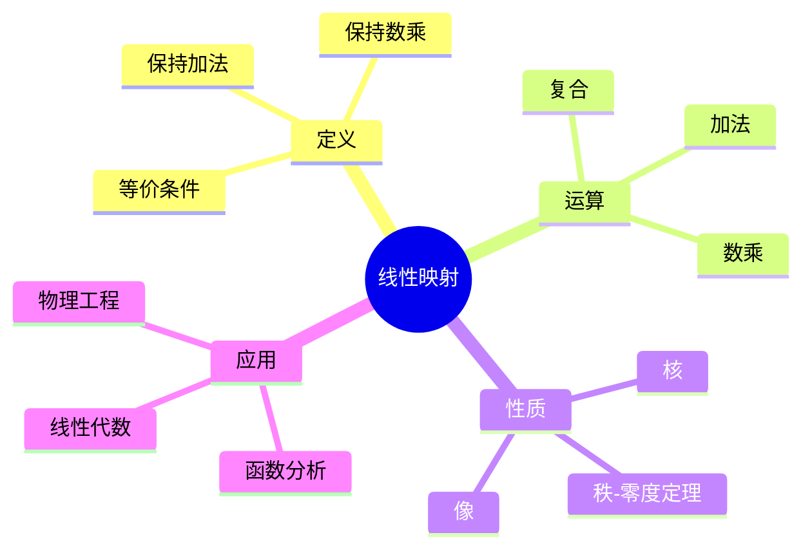
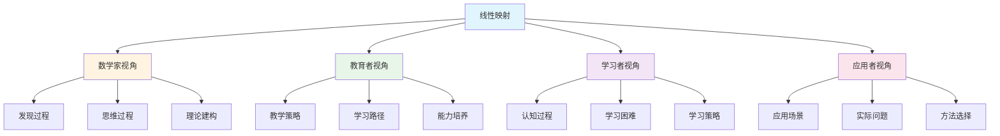
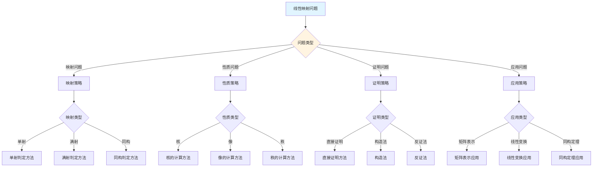
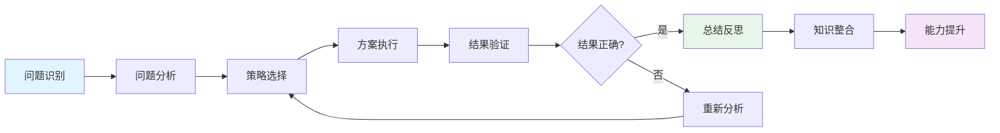
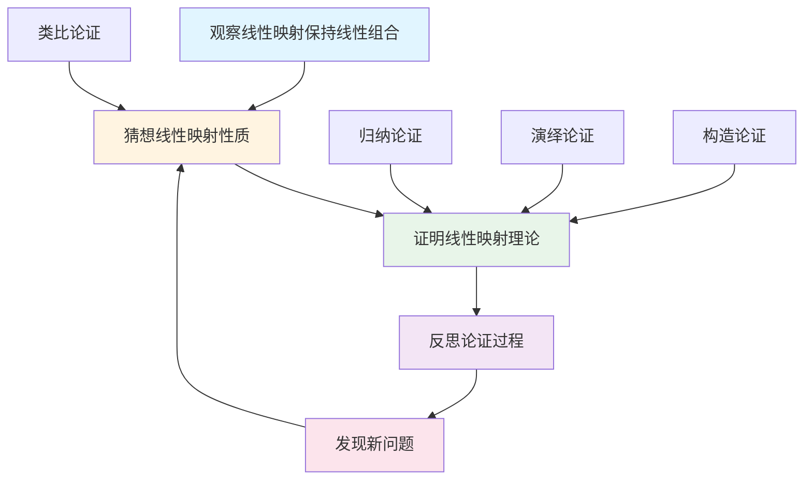
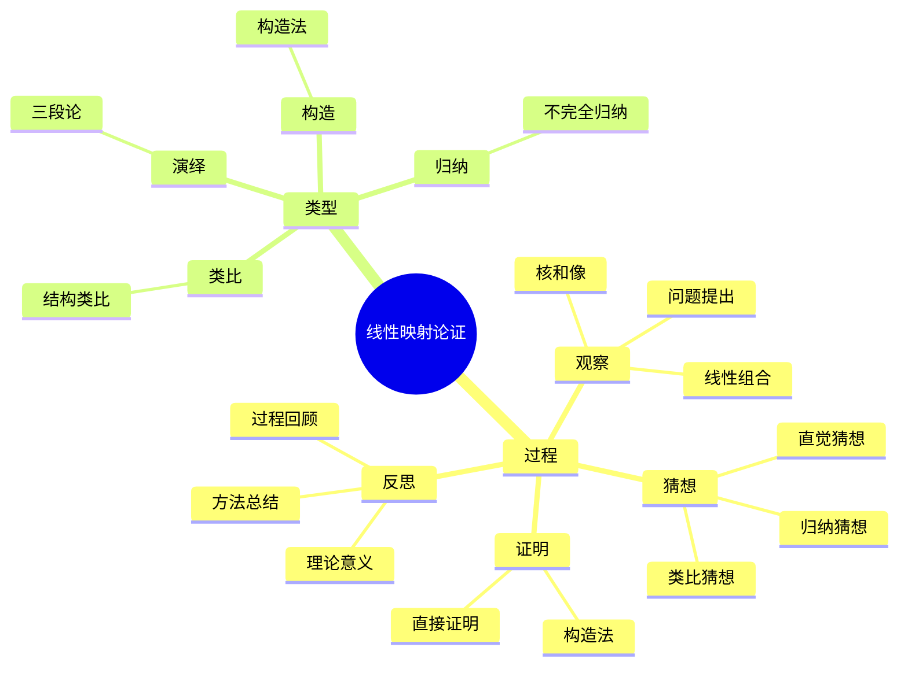

# 线性映射 (Linear Map) - 三视角组织版

**概念编号**: C.CORE.012
**知识层次**: L0-L2
**知识领域**: D2 (代数)
**创建日期**: 2025年1月
**最后更新**: 2025年1月

---

## 📋 目录 / Table of Contents

- [线性映射 (Linear Map) - 三视角组织版](#线性映射-linear-map---三视角组织版)
  - [📋 目录 / Table of Contents](#-目录--table-of-contents)
  - [1. 📋 概述 (编号: C.CORE.012.01)](#1--概述-编号-ccore01201)
  - [🧠 认知学视角：如何理解线性映射 (编号: C.CORE.012.02)](#-认知学视角如何理解线性映射-编号-ccore01202)
    - [认知起点 (编号: C.CORE.012.02.01)](#认知起点-编号-ccore0120201)
    - [认知过程 (编号: C.CORE.012.02.02)](#认知过程-编号-ccore0120202)
      - [阶段1：直观理解阶段 (编号: C.CORE.012.02.02.01)](#阶段1直观理解阶段-编号-ccore012020201)
      - [阶段2：概念形成阶段 (编号: C.CORE.012.02.02.02)](#阶段2概念形成阶段-编号-ccore012020202)
      - [阶段3：形式化阶段 (编号: C.CORE.012.02.02.03)](#阶段3形式化阶段-编号-ccore012020203)
    - [认知障碍 (编号: C.CORE.012.02.03)](#认知障碍-编号-ccore0120203)
    - [认知工具 (编号: C.CORE.012.02.04)](#认知工具-编号-ccore0120204)
  - [🎓 教育学视角：如何教学线性映射 (编号: C.CORE.012.03)](#-教育学视角如何教学线性映射-编号-ccore01203)
    - [教学目标 (编号: C.CORE.012.03.01)](#教学目标-编号-ccore0120301)
    - [教学路径 (编号: C.CORE.012.03.02)](#教学路径-编号-ccore0120302)
      - [阶段1：引入阶段（激发兴趣） (编号: C.CORE.012.03.02.01)](#阶段1引入阶段激发兴趣-编号-ccore012030201)
      - [阶段2：探索阶段（主动建构） (编号: C.CORE.012.03.02.02)](#阶段2探索阶段主动建构-编号-ccore012030202)
      - [阶段3：形式化阶段（抽象概括） (编号: C.CORE.012.03.02.03)](#阶段3形式化阶段抽象概括-编号-ccore012030203)
      - [阶段4：巩固阶段（应用深化） (编号: C.CORE.012.03.02.04)](#阶段4巩固阶段应用深化-编号-ccore012030204)
    - [教学难点 (编号: C.CORE.012.03.03)](#教学难点-编号-ccore0120303)
    - [教学策略 (编号: C.CORE.012.03.04)](#教学策略-编号-ccore0120304)
    - [评估方法 (编号: C.CORE.012.03.05)](#评估方法-编号-ccore0120305)
  - [🔬 数学家视角：如何思考线性映射 (编号: C.CORE.012.04)](#-数学家视角如何思考线性映射-编号-ccore01204)
    - [问题起源 (编号: C.CORE.012.04.01)](#问题起源-编号-ccore0120401)
    - [思维过程 (编号: C.CORE.012.04.02)](#思维过程-编号-ccore0120402)
      - [步骤1：问题提出 (编号: C.CORE.012.04.02.01)](#步骤1问题提出-编号-ccore012040201)
      - [步骤2：概念形成 (编号: C.CORE.012.04.02.02)](#步骤2概念形成-编号-ccore012040202)
      - [步骤3：理论发展 (编号: C.CORE.012.04.02.03)](#步骤3理论发展-编号-ccore012040203)
    - [历史发展 (编号: C.CORE.012.04.03)](#历史发展-编号-ccore0120403)
    - [3.2 关键人物和贡献 (编号: C.CORE.012.04.04)](#32-关键人物和贡献-编号-ccore0120404)
    - [重要定理 (编号: C.CORE.012.04.05)](#重要定理-编号-ccore0120405)
    - [开放问题 (编号: C.CORE.012.04.06)](#开放问题-编号-ccore0120406)
    - [一、第一人称思维描述 (编号: C.CORE.012.04.07)](#一第一人称思维描述-编号-ccore0120407)
      - [1.1 线性映射的发现过程](#11-线性映射的发现过程)
    - [二、数学直觉的形成 (编号: C.CORE.012.04.08)](#二数学直觉的形成-编号-ccore0120408)
      - [2.1 直觉在概念发现中的作用](#21-直觉在概念发现中的作用)
      - [2.2 如何培养线性映射直觉](#22-如何培养线性映射直觉)
    - [三、数学美的教育价值 (编号: C.CORE.012.04.09)](#三数学美的教育价值-编号-ccore0120409)
      - [3.1 线性映射论的美在哪里](#31-线性映射论的美在哪里)
      - [3.2 如何培养学生的数学美感](#32-如何培养学生的数学美感)
    - [四、问题解决策略 (编号: C.CORE.012.04.10)](#四问题解决策略-编号-ccore0120410)
      - [4.1 数学家的启发式方法](#41-数学家的启发式方法)
      - [4.2 思维过程分析](#42-思维过程分析)
    - [五、批判性反思 (编号: C.CORE.012.04.11)](#五批判性反思-编号-ccore0120411)
      - [5.1 线性映射概念的局限性](#51-线性映射概念的局限性)
      - [5.2 线性映射理论的未解决问题](#52-线性映射理论的未解决问题)
  - [💡 数学解释：为什么线性映射是这样定义的 (编号: C.CORE.012.05)](#-数学解释为什么线性映射是这样定义的-编号-ccore01205)
    - [一、直观解释：线性映射是什么？](#一直观解释线性映射是什么)
      - [1.1 具体例子](#11-具体例子)
      - [1.2 形象类比](#12-形象类比)
      - [1.3 几何直观](#13-几何直观)
      - [1.4 操作体验](#14-操作体验)
    - [二、知性解释：线性映射的本质是什么？](#二知性解释线性映射的本质是什么)
      - [2.1 概念定义](#21-概念定义)
      - [2.2 分类体系](#22-分类体系)
      - [2.3 抽象结构](#23-抽象结构)
      - [2.4 知识体系](#24-知识体系)
    - [三、理性解释：线性映射的公理化定义](#三理性解释线性映射的公理化定义)
      - [3.1 公理体系](#31-公理体系)
      - [3.2 形式化证明](#32-形式化证明)
      - [3.3 系统建构](#33-系统建构)
    - [四、多视角解释：从不同角度理解线性映射](#四多视角解释从不同角度理解线性映射)
      - [4.1 数学家视角：线性映射是如何被发现的？](#41-数学家视角线性映射是如何被发现的)
      - [4.2 教育者视角：如何教学线性映射？](#42-教育者视角如何教学线性映射)
      - [4.3 学习者视角：如何学习线性映射？](#43-学习者视角如何学习线性映射)
      - [4.4 应用者视角：如何应用线性映射？](#44-应用者视角如何应用线性映射)
    - [五、思维表征：用多种方式理解线性映射](#五思维表征用多种方式理解线性映射)
      - [5.1 思维导图：线性映射的知识结构](#51-思维导图线性映射的知识结构)
      - [5.2 矩阵对比：不同解释方式的对比](#52-矩阵对比不同解释方式的对比)
      - [5.3 多视角表征：从不同角度表征线性映射](#53-多视角表征从不同角度表征线性映射)
      - [5.4 决策树：线性映射问题分类和策略选择](#54-决策树线性映射问题分类和策略选择)
      - [5.5 决策逻辑路径：线性映射问题解决过程](#55-决策逻辑路径线性映射问题解决过程)
      - [5.6 多维对比矩阵：线性映射概念特征对比](#56-多维对比矩阵线性映射概念特征对比)
  - [🔍 数学论证：如何论证线性映射 (编号: C.CORE.012.06)](#-数学论证如何论证线性映射-编号-ccore01206)
    - [一、论证过程：从观察到反思](#一论证过程从观察到反思)
      - [1.1 观察（Observation）](#11-观察observation)
      - [1.2 猜想（Conjecture）](#12-猜想conjecture)
      - [1.3 证明（Proof）](#13-证明proof)
      - [1.4 反思（Reflection）](#14-反思reflection)
    - [二、论证类型：多种推理方式](#二论证类型多种推理方式)
      - [2.1 归纳论证（Inductive Reasoning）](#21-归纳论证inductive-reasoning)
      - [2.2 演绎论证（Deductive Reasoning）](#22-演绎论证deductive-reasoning)
      - [2.3 类比论证（Analogical Reasoning）](#23-类比论证analogical-reasoning)
      - [2.4 构造论证（Constructive Reasoning）](#24-构造论证constructive-reasoning)
    - [三、论证可视化：用图形表示论证过程](#三论证可视化用图形表示论证过程)
      - [3.1 论证流程图](#31-论证流程图)
      - [3.2 论证类型对比](#32-论证类型对比)
      - [3.3 论证思维导图](#33-论证思维导图)
  - [🔗 三视角整合 (编号: C.CORE.012.07)](#-三视角整合-编号-ccore01207)
    - [三个视角的关联](#三个视角的关联)
    - [如何综合运用三个视角](#如何综合运用三个视角)
  - [📚 参考文献 (编号: C.CORE.012.08)](#-参考文献-编号-ccore01208)
    - [权威资源](#权威资源)
    - [经典教材](#经典教材)
    - [研究论文](#研究论文)

---

## 1. 📋 概述 (编号: C.CORE.012.01)

线性映射是保持向量空间结构的映射，是线性代数的核心工具。线性映射理论在数学、物理学、工程学等领域有广泛应用。

本文档从**数学认知学**、**教育学**、**数学家**三个视角深入展开线性映射概念，避免简单的概念堆垒。

**权威资源对齐**:

- Wikipedia: [Linear Map](https://en.wikipedia.org/wiki/Linear_map)
- Stanford课程: Math 51 (Linear Algebra and Differential Calculus)
- Princeton课程: MAT 202 (Linear Algebra)
- MIT课程: 18.06 (Linear Algebra)
- Metamath: [Linear Map](http://us.metamath.org/mpeuni/df-lm.html)

---

## 🧠 认知学视角：如何理解线性映射 (编号: C.CORE.012.02)

### 认知起点 (编号: C.CORE.012.02.01)

**学习者已有的知识基础**:

- 向量空间的概念
- 函数的概念
- 日常经验中的"变换"、"映射"概念

**日常经验中的类似概念**:

- "旋转"：保持结构的变换
- "缩放"：保持结构的变换
- "投影"：保持结构的变换

### 认知过程 (编号: C.CORE.012.02.02)

#### 阶段1：直观理解阶段 (编号: C.CORE.012.02.02.01)

**具体例子**:

- 例子1：恒等映射 $\text{id}_V: V \to V$
- 例子2：旋转 $R_\theta: \mathbb{R}^2 \to \mathbb{R}^2$
- 例子3：投影 $\pi: \mathbb{R}^3 \to \mathbb{R}^2$

**形象类比**:

- **变换类比**: 线性映射就像"保持线性结构的变换"
  - 保持向量加法
  - 保持数乘
  - 保持线性组合

- **结构类比**: 线性映射就像"向量空间之间的同态"
  - 保持向量空间结构
  - 可以复合
  - 有核和像

**可视化表示**:

```text
线性映射:
    V ──T──> W
    |        |
    +        +
    |        |
    V ──T──> W
```

#### 阶段2：概念形成阶段 (编号: C.CORE.012.02.02.02)

**从例子中抽象出共同特征**:

- 所有例子都涉及"保持线性结构的映射"
- 保持向量加法
- 保持数乘
- 保持线性组合

**识别关键属性**:

1. **加法保持**: $T(u+v) = T(u) + T(v)$
2. **数乘保持**: $T(av) = aT(v)$
3. **线性组合保持**: $T(a_1v_1 + \cdots + a_nv_n) = a_1T(v_1) + \cdots + a_nT(v_n)$

**建立概念边界**:

- **什么是线性映射**: 保持向量加法和数乘的映射
- **什么不是线性映射**:
  - 非线性函数（不保持线性结构）
  - 一般函数（不保持线性结构）

#### 阶段3：形式化阶段 (编号: C.CORE.012.02.02.03)

**严格定义**:

- 公理化定义：通过加法保持、数乘保持两条公理
- 等价定义：保持线性组合

**公理化表述**:

- 公理1：加法保持
- 公理2：数乘保持

**逻辑结构**:

- 线性映射是向量空间之间的同态
- 线性映射是线性代数的基础
- 线性映射是函数分析的基础

### 认知障碍 (编号: C.CORE.012.02.03)

**常见误解**:

1. **误解1**: 认为所有映射都是线性的
   - **纠正**: 只有保持线性结构的映射才是线性的

2. **误解2**: 认为线性映射必须是双射
   - **纠正**: 线性映射可以是单射、满射或双射

3. **误解3**: 混淆线性映射和矩阵
   - **纠正**: 矩阵是线性映射的表示，不是线性映射本身

**理解难点**:

1. **难点1**: 线性性的概念
   - **原因**: 线性性比较抽象
   - **解决方法**: 用具体例子，强调保持线性结构的重要性

2. **难点2**: 核和像
   - **原因**: 核和像的概念比较抽象
   - **解决方法**: 用具体例子，强调核和像的作用

3. **难点3**: 秩-零度定理
   - **原因**: 秩-零度定理比较抽象
   - **解决方法**: 用具体例子，强调维数关系的重要性

**认知陷阱**:

- **线性性**: 需要理解保持线性结构的含义
- **核和像**: 需要理解核和像的作用

### 认知工具 (编号: C.CORE.012.02.04)

**类比工具**:

- **变换类比**: 线性映射 = 保持线性结构的变换
- **结构类比**: 线性映射 = 向量空间之间的同态

**可视化工具**:

- **几何表示**: 用几何图形表示线性映射
- **矩阵表示**: 用矩阵表示线性映射

**具体化工具**:

- **具体例子**: 用具体例子理解抽象概念
- **反例**: 用反例理解概念边界

---

## 🎓 教育学视角：如何教学线性映射 (编号: C.CORE.012.03)

### 教学目标 (编号: C.CORE.012.03.01)

**知识目标**:

- 理解线性映射的基本概念
- 掌握线性映射的公理化定义
- 理解线性映射的性质
- 理解核和像

**能力目标**:

- 能够判断一个映射是否是线性的
- 能够进行线性映射运算
- 能够理解线性映射的结构
- 能够应用线性映射解决实际问题

**情感目标**:

- 培养数学抽象思维
- 培养线性思维
- 激发对数学的兴趣

### 教学路径 (编号: C.CORE.012.03.02)

#### 阶段1：引入阶段（激发兴趣） (编号: C.CORE.012.03.02.01)

**实际问题**:

- 问题1：如何描述向量空间的变换？
- 问题2：如何研究线性方程组？
- 问题3：如何研究算子理论？

**历史背景**:

- 线性映射的历史发展
- 线性映射在数学中的地位
- 线性映射在物理中的应用

**引发认知冲突**:

- 问题：如何保持向量空间结构？
- 引出线性映射的概念

#### 阶段2：探索阶段（主动建构） (编号: C.CORE.012.03.02.02)

**引导发现**:

1. 让学生自己列举保持线性结构的映射
2. 让学生观察这些映射的共同特征
3. 引导学生抽象出线性映射的定义

**合作探究**:

- 小组讨论：什么是线性映射？
- 小组讨论：线性映射有哪些性质？
- 小组讨论：如何表示线性映射？

**多元表征**:

- **语言表征**: "线性映射是保持向量加法和数乘的映射"
- **符号表征**: $T: V \to W$
- **图形表征**: 几何表示、矩阵表示
- **集合表征**: 公理化定义

#### 阶段3：形式化阶段（抽象概括） (编号: C.CORE.012.03.02.03)

**严格定义**:

- 线性映射的公理化定义
- 线性映射的性质
- 核和像

**性质证明**:

- 线性映射的基本性质
- 核和像的性质
- 秩-零度定理

**应用拓展**:

- 线性映射在数学中的应用
- 线性映射在物理中的应用
- 线性映射在工程中的应用

#### 阶段4：巩固阶段（应用深化） (编号: C.CORE.012.03.02.04)

**练习应用**:

- 基础练习：线性映射的表示和运算
- 应用练习：用线性映射解决实际问题
- 综合练习：线性映射的综合应用

**变式训练**:

- 不同形式的线性映射表示
- 不同性质的线性映射
- 核和像

**知识整合**:

- 线性映射与其他概念的联系
- 线性映射在数学体系中的地位

### 教学难点 (编号: C.CORE.012.03.03)

**难点1：线性性的概念**:

- **难点描述**: 学生难以理解线性性
- **解决方法**:
  - 用具体例子
  - 强调保持线性结构的重要性
  - 用反例说明非线性

**难点2：核和像**:

- **难点描述**: 学生难以理解核和像的概念
- **解决方法**:
  - 用具体例子
  - 强调核和像的作用
  - 用图形可视化

**难点3：秩-零度定理**:

- **难点描述**: 学生难以理解秩-零度定理
- **解决方法**:
  - 用具体例子
  - 强调维数关系的重要性
  - 用图形可视化

### 教学策略 (编号: C.CORE.012.03.04)

**策略1：从具体到抽象**:

- 先给出具体例子
- 再抽象出一般概念
- 最后给出严格定义

**策略2：多元表征**:

- 用语言、符号、图形等多种方式表示同一概念
- 帮助学生建立不同表征之间的联系

**策略3：问题驱动**:

- 从实际问题出发
- 引出数学概念
- 解决问题

**策略4：可视化教学**:

- 使用几何表示
- 使用矩阵表示
- 使用具体例子

### 评估方法 (编号: C.CORE.012.03.05)

**形成性评估**（评估理解过程）:

- 课堂提问：检查学生对概念的理解
- 小组讨论：观察学生的思考过程
- 练习作业：检查学生的应用能力

**总结性评估**（评估最终理解）:

- 测验：检查学生对概念和运算的掌握
- 项目：检查学生应用线性映射解决实际问题的能力
- 反思：检查学生对线性映射概念的理解深度

---

## 🔬 数学家视角：如何思考线性映射 (编号: C.CORE.012.04)

### 问题起源 (编号: C.CORE.012.04.01)

**历史背景**:

- 19世纪：线性映射的起源
- 20世纪初：线性映射的系统化
- 20世纪中期：线性映射的现代发展

**原始问题**:

- **问题1**: 如何描述向量空间的变换？
- **问题2**: 如何研究线性结构？
- **问题3**: 线性映射有哪些性质？

**研究动机**:

- 统一变换理论
- 发展线性代数
- 发展算子理论

### 思维过程 (编号: C.CORE.012.04.02)

#### 步骤1：问题提出 (编号: C.CORE.012.04.02.01)

**观察到的现象**:

- 旋转、缩放、投影都保持线性结构
- 这些变换有一些共同的性质
- 需要统一的概念来描述

**提出的猜想**:

- 可以引入线性映射概念
- 线性映射可以统一描述这些变换
- 线性映射有丰富的结构

**需要解决的问题**:

- 如何定义线性映射？
- 线性映射应该满足什么条件？
- 线性映射有哪些性质？

#### 步骤2：概念形成 (编号: C.CORE.012.04.02.02)

**尝试性定义**:

- **公理化定义**: 通过加法保持、数乘保持
- **等价定义**: 保持线性组合

**性质探索**:

- 线性映射的基本性质
- 核和像
- 秩-零度定理

**结构发现**:

- 线性映射是向量空间之间的同态
- 线性映射是线性代数的基础
- 线性映射是函数分析的基础

#### 步骤3：理论发展 (编号: C.CORE.012.04.02.03)

**定理证明**:

- 线性映射的基本性质
- 核和像的性质
- 秩-零度定理

**应用拓展**:

- 线性映射在数学中的应用
- 线性映射在物理中的应用
- 线性映射在工程中的应用

**理论完善**:

- 线性映射的公理化
- 线性映射的范畴论研究
- 算子理论的发展

### 历史发展 (编号: C.CORE.012.04.03)

**早期阶段**（19世纪）:

- **Cayley (1858)**: 研究矩阵和线性变换
- **Sylvester (1850)**: 引入矩阵概念
- **Frobenius (1878)**: 发展矩阵理论

**关键突破**（20世纪初）:

- **Hilbert (1900)**: 研究算子理论
- **Banach (1922)**: 研究Banach空间上的算子
- **von Neumann (1929)**: 研究Hilbert空间上的算子

**现代发展**（20世纪中期）:

- **Bourbaki (1939)**: 统一线性映射理论
- **Grothendieck (1957)**: 发展范畴论

### 3.2 关键人物和贡献 (编号: C.CORE.012.04.04)

**Arthur Cayley (1821-1895)**:

- 研究矩阵和线性变换
- 建立线性代数的基础

**James Sylvester (1814-1897)**:

- 引入矩阵概念
- 发展矩阵理论

**Ferdinand Frobenius (1849-1917)**:

- 发展矩阵理论
- 建立现代线性代数

### 重要定理 (编号: C.CORE.012.04.05)

**第一同构定理（线性映射）**:

- 若$T: V \to W$是线性映射，则$V/\ker(T) \cong \text{im}(T)$
- 意义：线性映射结构的基础

**秩-零度定理**:

- $\dim V = \text{rank}(T) + \text{nullity}(T)$
- 意义：线性映射维数关系的基础

**矩阵表示**:

- 有限维向量空间的线性映射对应矩阵
- 意义：线性映射计算的基础

### 开放问题 (编号: C.CORE.012.04.06)

**未解决问题**:

- 线性映射的分类问题
- 线性映射的表示问题
- 线性映射的应用问题

**研究方向**:

- 线性映射的范畴论研究
- 线性映射的表示论研究
- 线性映射的应用研究

### 一、第一人称思维描述 (编号: C.CORE.012.04.07)

#### 1.1 线性映射的发现过程

**详细历史背景**:

- **19世纪**：研究向量空间和矩阵
- **背景**：研究向量空间之间的映射，发现保持线性结构的映射
- **问题**：如何描述向量空间之间的变换？如何统一处理这些变换？

**数学家的详细第一人称描述**:
> "19世纪，我在研究向量空间之间的映射时，遇到了一个问题：如何描述向量空间之间的变换？
>
> 我发现，有些映射保持线性结构：
>
> - **线性性**：$T(u+v) = T(u) + T(v)$，$T(cu) = cT(u)$
> - **例子**：旋转、缩放、投影都是线性映射
>
> 我的发现是：
>
> - **线性映射的概念**：一个映射$T: V \to W$是线性的，如果它保持加法和数乘
> - **统一性**：旋转、缩放、投影都是线性映射
> - **矩阵表示**：有限维向量空间的线性映射对应矩阵
>
> 例如，对于旋转映射$T: \mathbb{R}^2 \to \mathbb{R}^2$：
>
> - **定义**：$T(x,y) = (x\cos\theta - y\sin\theta, x\sin\theta + y\cos\theta)$
> - **线性性**：$T((x_1,y_1) + (x_2,y_2)) = T(x_1,y_1) + T(x_2,y_2)$
> - **矩阵表示**：$\begin{pmatrix} \cos\theta & -\sin\theta \\ \sin\theta & \cos\theta \end{pmatrix}$
>
> 对于投影映射$P: \mathbb{R}^3 \to \mathbb{R}^2$：
>
> - **定义**：$P(x,y,z) = (x,y)$
> - **线性性**：$P((x_1,y_1,z_1) + (x_2,y_2,z_2)) = P(x_1,y_1,z_1) + P(x_2,y_2,z_2)$
> - **矩阵表示**：$\begin{pmatrix} 1 & 0 & 0 \\ 0 & 1 & 0 \end{pmatrix}$
>
> 这让我意识到，线性映射是描述向量空间之间变换的工具，线性映射与矩阵一一对应。这为线性代数提供了基础。"

**详细的思维过程**:

1. **观察到的现象**（19世纪）:

   **现象1：向量空间之间的映射有特殊的性质**
   - **问题**：有些映射保持线性结构
   - **例子**：旋转、缩放、投影都保持线性结构
   - **需要**：描述这些性质

   **现象2：这些映射保持线性结构**
   - **问题**：如何描述保持线性结构的映射？
   - **思路**：定义线性映射
   - **需要**：建立线性映射理论

   **现象3：需要统一的概念**
   - **问题**：如何统一处理不同的变换？
   - **思路**：用线性映射统一
   - **需要**：建立线性映射的理论体系

2. **提出的猜想**（19世纪）:

   **猜想1：用线性映射描述保持线性结构的映射**
   - **思路**：定义线性映射$T: V \to W$，满足$T(u+v) = T(u) + T(v)$和$T(cu) = cT(u)$
   - **例子**：旋转、缩放、投影都是线性映射
   - **优点**：统一描述保持线性结构的映射

   **猜想2：线性映射与矩阵相关**
   - **关系**：有限维向量空间的线性映射对应矩阵
   - **例子**：旋转映射对应旋转矩阵
   - **意义**：用矩阵表示线性映射

   **猜想3：线性映射是数学的基础**
   - **性质**：线性映射是抽象的数学结构
   - **应用**：线性映射可以应用到更广泛的领域
   - **意义**：线性映射是统一的数学结构

3. **遇到的困难**（19世纪）:

   **困难1：如何严格定义线性映射？**
   - **问题**：如何定义线性映射？
   - **解决**：通过公理定义线性映射（保持加法和数乘）
   - **意义**：为线性映射提供严格的数学基础

   **困难2：如何判断线性映射的性质？**
   - **问题**：如何判断线性映射是否单射？是否满射？
   - **解决**：通过核和像判断
   - **意义**：为线性映射分类提供方法

   **困难3：如何应用线性映射理论？**
   - **问题**：如何用线性映射理论解决实际问题？
   - **解决**：建立矩阵理论、特征值理论
   - **意义**：为线性代数提供应用基础

4. **突破的时刻**（19世纪）:

   **突破1：线性映射的概念**
   - 引入线性映射的概念描述保持线性结构的映射
   - **关键**：抽象出线性映射的结构
   - **意义**：为线性映射理论提供基础

   **突破2：矩阵表示**
   - 建立线性映射与矩阵的对应关系
   - **关键**：有限维向量空间的线性映射对应矩阵
   - **意义**：为线性映射计算提供方法

   **突破3：线性映射理论的广泛应用**
   - 线性映射理论可以应用到更广泛的领域
   - **关键**：线性映射是抽象的数学结构
   - **意义**：线性映射理论成为数学的基础

### 二、数学直觉的形成 (编号: C.CORE.012.04.08)

#### 2.1 直觉在概念发现中的作用

**数学家的直觉**:

- **直觉1**: "线性映射"是"保持线性结构的映射"——这个直觉引导数学家发现线性映射
- **直觉2**: 线性映射可以统一处理变换——这个直觉引导数学家建立线性映射理论
- **直觉3**: 线性映射是数学的基础——这个直觉引导数学家建立线性映射理论

**直觉的验证**:

- 通过严格的数学证明验证直觉的正确性
- 通过公理化严格化线性映射定义
- 通过应用验证线性映射的广泛性

**直觉的深化**:

- 从"保持线性结构的映射"到"线性映射的公理化"
- 从"统一处理变换"到"线性映射的广泛应用"
- 从"数学基础"到"线性映射的深入发展"

#### 2.2 如何培养线性映射直觉

**数学家的建议**:

- **数学家**: "线性映射直觉是长期训练的结果。通过大量练习和深入思考，我们可以培养对线性映射的直觉。"
- **范畴论学家**: "从具体例子开始，逐步抽象，这是培养线性映射直觉的有效方法。"

**培养方法**:

1. **大量练习**: 通过大量线性映射运算练习，培养对线性映射的直觉
2. **深入思考**: 深入思考线性映射的本质，理解线性映射的深层结构
3. **类比和联想**: 通过类比和联想，建立线性映射与其他概念的联系
4. **与专家交流**: 与数学家交流，学习他们的思维方式

**教学启示**:

- 从具体例子开始，逐步抽象
- 鼓励学生思考线性映射的本质
- 引导学生建立线性映射与其他概念的联系

### 三、数学美的教育价值 (编号: C.CORE.012.04.09)

#### 3.1 线性映射论的美在哪里

**结构美**:

- **简洁性**: 线性映射的概念非常简洁——"保持加法和数乘的映射"
- **统一性**: 线性映射可以统一描述数学中的各种线性变换
- **和谐性**: 线性映射运算满足优美的规律（复合、逆映射等）

**数学家的评价**:

- **数学家**: "线性映射论的美在于它的统一性。它为我们提供了一个统一的框架来理解数学中的线性变换。"
- **范畴论学家**: "线性映射论的美在于它的抽象性。它是数学的基础，所有线性变换都可以用线性映射来描述。"

#### 3.2 如何培养学生的数学美感

**数学家的建议**:

- **数学家**: "展示线性映射论的美感，让学生感受到数学的美。"
- **范畴论学家**: "通过线性映射论的历史和发展，让学生理解数学的美。"

**教学方法**:

1. **展示数学美**:
   - 展示线性映射概念的简洁性和统一性
   - 展示线性映射运算的优美规律
   - 展示线性映射在数学中的基础地位

2. **引导学生欣赏**:
   - 引导学生欣赏线性映射概念的简洁性
   - 引导学生欣赏线性映射运算的和谐性
   - 引导学生欣赏线性映射的基础性

3. **鼓励学生创造美**:
   - 鼓励学生发现线性映射论的美
   - 鼓励学生创造优美的线性映射证明
   - 鼓励学生探索线性映射论的美

### 四、问题解决策略 (编号: C.CORE.012.04.10)

#### 4.1 数学家的启发式方法

**策略1：从具体到抽象**:

- 从具体的线性映射例子开始
- 抽象出线性映射的一般性质
- 建立线性映射的理论体系

**策略2：从简单到复杂**:

- 先理解基本线性映射
- 再理解线性映射运算
- 最后理解线性映射理论

**策略3：从问题到理论**:

- 从实际问题出发
- 引出线性映射概念
- 建立线性映射理论

#### 4.2 思维过程分析

**问题识别**:

- 识别问题类型：线性映射定义问题、线性映射性质问题、线性映射应用问题
- 识别问题难度：简单问题、中等问题、复杂问题

**策略选择**:

- 简单问题：直接方法
- 中等问题：分步方法
- 复杂问题：分解方法

**执行和反思**:

- 执行策略，解决问题
- 反思过程，总结经验
- 改进方法，提高效率

### 五、批判性反思 (编号: C.CORE.012.04.11)

#### 5.1 线性映射概念的局限性

**概念的边界**:

- 线性映射只描述线性变换，不能描述所有数学变换
- 线性映射是抽象的，需要具体化才能应用
- 线性映射不能表示所有数学量

**概念的推广**:

- 非线性映射：更一般的映射
- 函子：范畴论中的映射
- 态射：更抽象的结构

#### 5.2 线性映射理论的未解决问题

**未解决的问题**:

- 线性映射的分类问题：如何分类所有线性映射？
- 线性映射的表示问题：如何表示线性映射？
- 线性映射的应用问题：如何更好地应用线性映射？

**研究方向**:

- 线性映射的范畴论研究
- 线性映射的表示论研究
- 线性映射的应用研究

---

## 💡 数学解释：为什么线性映射是这样定义的 (编号: C.CORE.012.05)

### 一、直观解释：线性映射是什么？

#### 1.1 具体例子

**生活中的例子**：

- **旋转**：平面上的旋转是线性映射
  - 例如：绕原点旋转90度
  - **为什么这样定义**：因为我们需要一个概念来表示"保持线性结构的变换"
- **缩放**：向量的缩放是线性映射
  - 例如：将向量放大2倍
  - **为什么这样定义**：因为我们需要一个概念来表示"按比例变换"
- **投影**：将三维向量投影到二维平面是线性映射
  - 例如：$(x, y, z) \mapsto (x, y)$
  - **为什么这样定义**：因为我们需要一个概念来表示"降维变换"

**数学中的例子**：

- **矩阵变换**：$A\mathbf{x}$（矩阵乘法）
  - **为什么这样定义**：我们需要一个概念来表示"矩阵对应的线性变换"
- **微分算子**：$\frac{d}{dx}$（对函数求导）
  - **为什么这样定义**：我们需要一个概念来表示"保持线性结构的算子"
- **积分算子**：$\int_0^1 f(x)dx$（对函数积分）
  - **为什么这样定义**：我们需要一个概念来表示"线性泛函"

#### 1.2 形象类比

**变换类比**：

- **线性映射就像"保持线性结构的变换"**
  - 保持加法：$T(\mathbf{u} + \mathbf{v}) = T(\mathbf{u}) + T(\mathbf{v})$
  - 保持数乘：$T(c\mathbf{v}) = cT(\mathbf{v})$
- **为什么这样类比**：这个类比帮助我们理解线性映射的本质

**机器类比**：

- **线性映射就像"线性机器"**
  - 输入向量，输出向量
  - 保持线性结构
- **为什么这样类比**：这个类比帮助我们理解线性映射的作用

#### 1.3 几何直观

**矩阵表示**：

- 使用矩阵表示线性映射
- 例如：$2 \times 2$矩阵表示平面上的线性变换
- **为什么使用矩阵**：矩阵提供几何直观，帮助我们理解线性映射

**图像表示**：

- 使用图像表示线性映射的效果
- 例如：旋转、缩放、剪切的效果
- **为什么使用图像**：图像提供视觉直观

#### 1.4 操作体验

**线性映射运算的操作**：

- **复合操作**：$(T \circ S)(\mathbf{v}) = T(S(\mathbf{v}))$
  - **为什么这样操作**：因为我们需要一个运算来表示"连续应用两个线性映射"
- **加法操作**：$(T + S)(\mathbf{v}) = T(\mathbf{v}) + S(\mathbf{v})$
  - **为什么这样操作**：因为我们需要一个运算来表示"两个线性映射的和"
- **数乘操作**：$(cT)(\mathbf{v}) = cT(\mathbf{v})$
  - **为什么这样操作**：因为我们需要一个运算来表示"线性映射的数乘"

### 二、知性解释：线性映射的本质是什么？

#### 2.1 概念定义

**线性映射的内涵**：

- **线性映射是保持线性结构的映射**
  - **保持加法**：$T(\mathbf{u} + \mathbf{v}) = T(\mathbf{u}) + T(\mathbf{v})$
  - **保持数乘**：$T(c\mathbf{v}) = cT(\mathbf{v})$
  - **等价条件**：$T(c_1\mathbf{v}_1 + c_2\mathbf{v}_2) = c_1T(\mathbf{v}_1) + c_2T(\mathbf{v}_2)$
- **为什么这样定义**：这些特征使得线性映射成为一个完整的线性结构，支持所有线性运算

**线性映射的外延**：

- **单射线性映射**：核为$\{\mathbf{0}\}$的线性映射
- **满射线性映射**：像等于目标空间的线性映射
- **双射线性映射**：既是单射又是满射的线性映射（同构）
- **为什么这样分类**：不同的线性映射类型有不同的性质和用途

#### 2.2 分类体系

**按性质分类**：

- **单射**：$\ker T = \{\mathbf{0}\}$
- **满射**：$\text{im } T = W$
- **双射**：既是单射又是满射
- **为什么这样分类**：性质是线性映射的重要特征

**按维数分类**：

- **有限维线性映射**：定义域和值域都是有限维
- **无限维线性映射**：定义域或值域是无限维
- **为什么这样分类**：维数是线性映射的重要特征

#### 2.3 抽象结构

**线性映射的运算结构**：

- **复合运算**：$\circ : \text{Hom}(W, U) \times \text{Hom}(V, W) \to \text{Hom}(V, U)$
- **加法运算**：$+ : \text{Hom}(V, W) \times \text{Hom}(V, W) \to \text{Hom}(V, W)$
- **为什么有这些运算**：这些运算使得线性映射具有代数结构

**线性映射的关系结构**：

- **核关系**：$\ker T = \{\mathbf{v} \in V : T(\mathbf{v}) = \mathbf{0}\}$
- **像关系**：$\text{im } T = \{T(\mathbf{v}) : \mathbf{v} \in V\}$
- **为什么有这个关系**：这个关系帮助我们研究线性映射的结构

**线性映射的子结构**：

- **核**：$\ker T$是$V$的子空间
- **像**：$\text{im } T$是$W$的子空间
- **秩**：$\text{rank } T = \dim(\text{im } T)$
- **零度**：$\text{nullity } T = \dim(\ker T)$
- **为什么有这些结构**：这些结构是线性映射理论的基础

#### 2.4 知识体系

**线性映射在数学体系中的位置**：

- **基础地位**：线性映射是线性代数的基础
  - 线性映射是向量空间之间的映射
  - 线性映射是矩阵理论的基础
- **为什么是基础**：线性映射提供了统一的框架来研究线性变换

**线性映射与其他概念的关系**：

- **线性映射与向量空间**：线性映射是向量空间之间的映射
- **线性映射与矩阵**：有限维线性映射对应矩阵
- **线性映射与算子**：无限维线性映射是算子
- **为什么有这些关系**：这些关系揭示了线性映射与其他数学概念的内在联系

### 三、理性解释：线性映射的公理化定义

#### 3.1 公理体系

**线性映射的公理化定义**：

- **公理1（保持加法）**：$T(\mathbf{u} + \mathbf{v}) = T(\mathbf{u}) + T(\mathbf{v})$
- **公理2（保持数乘）**：$T(c\mathbf{v}) = cT(\mathbf{v})$
- **为什么需要这些公理**：这些公理定义了线性映射的基本结构

**线性映射的范畴论定义**：

- **线性映射是向量空间范畴中的态射**
- **为什么这样定义**：这个定义将线性映射放在更一般的框架中

#### 3.2 形式化证明

**线性映射运算性质的证明**：

- **核是子空间**：$\ker T$是$V$的子空间
  - **证明**：如果$\mathbf{u}, \mathbf{v} \in \ker T$，则$T(\mathbf{u} + \mathbf{v}) = T(\mathbf{u}) + T(\mathbf{v}) = \mathbf{0} + \mathbf{0} = \mathbf{0}$，因此$\mathbf{u} + \mathbf{v} \in \ker T$
  - **为什么这样证明**：利用线性映射的定义
- **像是子空间**：$\text{im } T$是$W$的子空间
  - **证明**：如果$\mathbf{w}_1, \mathbf{w}_2 \in \text{im } T$，则存在$\mathbf{v}_1, \mathbf{v}_2$使得$T(\mathbf{v}_1) = \mathbf{w}_1$，$T(\mathbf{v}_2) = \mathbf{w}_2$，因此$T(\mathbf{v}_1 + \mathbf{v}_2) = T(\mathbf{v}_1) + T(\mathbf{v}_2) = \mathbf{w}_1 + \mathbf{w}_2$，因此$\mathbf{w}_1 + \mathbf{w}_2 \in \text{im } T$
  - **为什么这样证明**：利用线性映射的定义

**线性映射关系的证明**：

- **秩-零度定理**：$\dim V = \dim(\ker T) + \dim(\text{im } T)$
  - **证明**：使用基的扩展和线性映射的性质
  - **为什么这样证明**：利用核、像和基的性质

#### 3.3 系统建构

**线性映射论在数学基础中的地位**：

- **作为线性代数基础**：线性映射是线性代数的基础
- **提供变换工具**：线性映射提供了研究线性变换的工具
- **统一框架**：线性映射统一了各种线性变换

**线性映射论的发展历史**：

- **Cayley的研究**（1858年）：研究矩阵和线性变换
- **Hilbert的研究**（1900年）：研究算子理论
- **Banach的研究**（1922年）：研究Banach空间上的算子
- **为什么这样发展**：数学的发展需要严格的基础，线性映射论的发展反映了这一需求

### 四、多视角解释：从不同角度理解线性映射

#### 4.1 数学家视角：线性映射是如何被发现的？

**Cayley的发现过程**：

- **问题提出**：如何研究线性变换？
- **关键洞察**：使用矩阵表示线性映射
- **重要发现**：线性映射可以统一描述各种线性变换
- **为什么这样发现**：数学家的直觉和严格证明相结合

**Hilbert的抽象化过程**：

- **问题识别**：需要抽象化线性映射概念
- **策略选择**：使用算子理论
- **定义设计**：线性映射是保持线性结构的映射
- **为什么这样设计**：需要统一各种线性变换实例

#### 4.2 教育者视角：如何教学线性映射？

**教学策略**：

- **从具体到抽象**：先学习具体例子，再学习抽象定义
- **从简单到复杂**：先学习有限维线性映射，再学习无限维线性映射
- **从直观到形式化**：先使用矩阵等直观工具，再学习形式化定义
- **为什么这样教学**：符合认知规律，帮助学生逐步建立理解

**学习路径**：

- **阶段1**：直观理解（使用矩阵和具体例子）
- **阶段2**：概念形成（学习线性映射的定义和性质）
- **阶段3**：形式化（学习线性映射的公理化定义）
- **为什么这样设计**：循序渐进，逐步深入

#### 4.3 学习者视角：如何学习线性映射？

**认知过程**：

- **直观阶段**：通过矩阵理解线性映射的含义
- **概念阶段**：理解线性映射的定义和性质
- **形式化阶段**：理解线性映射的公理化定义
- **为什么这样学习**：符合认知发展规律

**学习困难**：

- **困难1**：理解"保持线性结构"的概念
- **困难2**：理解"核和像"的概念
- **困难3**：理解"秩-零度定理"的概念
- **如何克服**：通过具体例子、类比、历史背景等方式帮助理解

#### 4.4 应用者视角：如何应用线性映射？

**应用场景**：

- **数学**：使用线性映射研究线性代数和函数分析
- **物理**：使用线性映射描述物理系统的变换
- **工程**：使用线性映射进行信号处理和图像处理
- **为什么这样应用**：线性映射提供了强大的工具来处理各种问题

**应用方法**：

- **建立模型**：将实际问题转化为线性映射问题
- **使用理论**：使用线性映射理论解决问题
- **验证结果**：验证结果的正确性
- **为什么这样应用**：线性映射论提供了强大的工具来解决实际问题

### 五、思维表征：用多种方式理解线性映射

#### 5.1 思维导图：线性映射的知识结构



#### 5.2 矩阵对比：不同解释方式的对比

| 解释方式 | 特点 | 方法 | 工具 | 适用阶段 | 优势 | 局限 |
|---------|------|------|------|---------|------|------|
| **直观解释** | 具体、形象、可视 | 例子、类比、直观 | 矩阵、图像 | 入门阶段 | 易于理解 | 不够严格 |
| **知性解释** | 概念、分类、抽象 | 定义、分类、结构 | 概念图、知识图谱 | 中级阶段 | 系统完整 | 不够直观 |
| **理性解释** | 公理、证明、形式化 | 公理、证明、系统 | 形式化工具、证明系统 | 高级阶段 | 严格准确 | 不够具体 |
| **多视角解释** | 多角度、整合 | 多视角、整合 | 多视角工具 | 所有阶段 | 全面深入 | 可能复杂 |

#### 5.3 多视角表征：从不同角度表征线性映射



#### 5.4 决策树：线性映射问题分类和策略选择



**说明**：

- **问题分类**：根据问题类型（映射、性质、证明、应用）进行分类
- **策略选择**：根据问题类型选择相应的解决策略
- **方法应用**：根据具体问题选择合适的方法

#### 5.5 决策逻辑路径：线性映射问题解决过程



**说明**：

- **问题识别**：识别线性映射问题的类型和关键要素
- **问题分析**：分析问题的条件和目标
- **策略选择**：根据问题类型选择解决策略
- **方案执行**：执行选定的解决方案
- **结果验证**：验证结果的正确性
- **总结反思**：总结解题过程，反思解题方法
- **知识整合**：整合相关知识点
- **能力提升**：提升问题解决能力

#### 5.6 多维对比矩阵：线性映射概念特征对比

| 对比维度 | 线性映射定义 | 线性映射结构 | 线性映射性质 | 线性映射应用 |
|---------|---------|---------|---------|---------|
| **核心特征** | 线性映射公理、保持运算 | 核、像、同构 | 单射、满射、同构 | 矩阵表示、线性变换、同构定理 |
| **理解难度** | ⭐⭐⭐ | ⭐⭐⭐⭐ | ⭐⭐⭐⭐ | ⭐⭐⭐⭐ |
| **应用频率** | ⭐⭐⭐⭐⭐ | ⭐⭐⭐⭐⭐ | ⭐⭐⭐⭐⭐ | ⭐⭐⭐⭐⭐ |
| **理论基础** | 线性映射公理体系 | 核像理论、同构理论 | 线性映射性质理论 | 线性代数应用理论 |
| **教学重点** | 概念理解 | 结构分析 | 性质分析 | 应用能力 |
| **学习阶段** | 中级阶段 | 中级-高级 | 中级-高级 | 中级-高级 |
| **认知维度** | 知性+理性 | 理性 | 理性 | 理性+应用 |
| **思维表征** | 思维导图 | 决策树 | 决策逻辑路径 | 知识图谱 |

**说明**：

- **核心特征**：每个方面的核心特征
- **理解难度**：从1星到5星，表示理解难度
- **应用频率**：从1星到5星，表示应用频率
- **理论基础**：每个方面的理论基础
- **教学重点**：每个方面的教学重点
- **学习阶段**：每个方面的学习阶段
- **认知维度**：每个方面的认知维度
- **思维表征**：每个方面推荐的思维表征方法

---

## 🔍 数学论证：如何论证线性映射 (编号: C.CORE.012.06)

### 一、论证过程：从观察到反思

#### 1.1 观察（Observation）

**具体现象观察**：

- **现象1**：线性映射保持线性组合
  - 例如：$T(a_1v_1 + a_2v_2) = a_1T(v_1) + a_2T(v_2)$
  - **为什么重要**：这个现象揭示了线性映射的本质
- **现象2**：核和像的关系
  - 例如：$\dim V = \dim \ker(T) + \dim \text{im}(T)$（秩-零度定理）
  - **为什么重要**：这个现象揭示了线性映射的结构

**模式识别**：

- **模式1**：线性映射的秩-零度定理
  - 例如：$\dim V = \text{rank}(T) + \text{nullity}(T)$
  - **为什么重要**：这个模式可能反映了线性映射的维数关系
- **模式2**：第一同构定理
  - 例如：$V/\ker(T) \cong \text{im}(T)$
  - **为什么重要**：这个模式可能反映了线性映射的结构

**问题提出**：

- **问题1**：如何严格定义线性映射，统一不同的线性变换？
  - **为什么提出**：这个问题可能揭示线性映射的本质和基础
- **问题2**：如何证明秩-零度定理？
  - **为什么提出**：这个问题可能揭示线性映射的结构性质

#### 1.2 猜想（Conjecture）

**归纳猜想**：

- **猜想1**：线性映射是研究线性变换的统一工具
  - **依据**：观察不同线性变换都满足线性映射公理
  - **为什么提出**：这个猜想可能揭示线性映射的统一性
- **猜想2**：秩-零度定理
  - **依据**：观察具体线性映射的维数关系
  - **为什么提出**：这个猜想可能揭示线性映射的结构性质

**类比猜想**：

- **猜想1**：线性映射类似于"保持结构的映射"
  - **类比对象**：同态（群、环的同态）
  - **为什么提出**：这个类比可能揭示线性映射的本质
- **猜想2**：核和像类似于"零空间和值域"
  - **类比对象**：零空间和值域
  - **为什么提出**：这个类比可能揭示核和像的作用

**直觉猜想**：

- **猜想1**：线性映射是"最自然"的线性变换
  - **直觉来源**：线性映射的直观
  - **为什么提出**：这个直觉可能揭示线性映射的基础地位
- **猜想2**：线性映射有"最小"的公理结构
  - **直觉来源**：线性映射的公理结构
  - **为什么提出**：这个直觉可能揭示线性映射的本质

#### 1.3 证明（Proof）

**直接证明**：

- **证明1**：秩-零度定理
  - **证明思路**：使用第一同构定理
  - **关键步骤**：证明$V/\ker(T) \cong \text{im}(T)$，因此$\dim V = \dim \ker(T) + \dim \text{im}(T)$
  - **为什么这样证明**：这个证明方法直接、清晰
- **证明2**：第一同构定理
  - **证明思路**：构造线性映射诱导的商空间同构
  - **关键步骤**：定义映射$\bar{T}: V/\ker(T) \to \text{im}(T)$，证明是同构
  - **为什么这样证明**：这个证明方法直接、清晰

**构造法**：

- **构造法**：构造线性映射作为矩阵
  - **构造方法**：对有限维向量空间，线性映射对应矩阵
  - **验证**：验证构造的矩阵对应线性映射
  - **为什么这样证明**：构造法适合证明存在性命题

#### 1.4 反思（Reflection）

**过程回顾**：

- **论证回顾**：从观察线性映射保持线性组合，到猜想线性映射的性质，再到严格证明
  - **成功之处**：成功建立了线性映射的严格理论
  - **不足之处**：线性映射概念需要进一步推广
  - **改进方向**：推广到算子、泛函等

**方法总结**：

- **证明方法**：使用了直接证明、构造法
  - **方法特点**：直接证明清晰，构造法明确
  - **适用范围**：不同方法适用于不同类型的命题
- **证明技巧**：使用第一同构定理、秩-零度定理、矩阵表示
  - **技巧要点**：将线性映射问题转化为向量空间问题，使用构造法处理存在性问题
  - **应用场景**：这些技巧可以应用于其他线性代数问题

**理论意义**：

- **理论贡献**：建立了线性映射的严格理论，揭示了线性映射的结构
  - **为什么重要**：这个论证揭示了线性代数的基础结构
- **应用价值**：线性映射为线性代数、函数分析、物理工程提供了基础
  - **为什么重要**：这个论证可以应用于所有线性问题

### 二、论证类型：多种推理方式

#### 2.1 归纳论证（Inductive Reasoning）

**不完全归纳**：

- **例子1**：从具体线性映射的性质归纳一般规律
  - **观察**：观察$\mathbb{R}^2$到$\mathbb{R}^2$的线性映射都满足秩-零度定理
  - **结论**：所有线性映射都满足秩-零度定理
  - **局限性**：不完全归纳的结论需要严格证明

#### 2.2 演绎论证（Deductive Reasoning）

**三段论**：

- **例子1**：证明线性映射的性质
  - **大前提**：所有线性映射都满足秩-零度定理
  - **小前提**：$T: \mathbb{R}^3 \to \mathbb{R}^2$是线性映射
  - **结论**：$T$满足$\dim \mathbb{R}^3 = \dim \ker(T) + \dim \text{im}(T)$
  - **为什么有效**：三段论是严格的演绎推理

#### 2.3 类比论证（Analogical Reasoning）

**结构类比**：

- **例子1**：线性映射与群同态的类比
  - **类比对象**：群同态
  - **相似性**：线性映射保持线性组合，群同态保持群运算
  - **结论**：线性映射可以理解为"向量空间的同态"
  - **局限性**：类比不能替代严格证明

#### 2.4 构造论证（Constructive Reasoning）

**构造法**：

- **例子1**：构造线性映射作为矩阵
  - **构造方法**：对有限维向量空间，线性映射对应矩阵
  - **验证**：验证构造的矩阵对应线性映射
  - **为什么有效**：构造法是严格的直接证明

### 三、论证可视化：用图形表示论证过程

#### 3.1 论证流程图



#### 3.2 论证类型对比

| 论证类型 | 特点 | 适用场景 | 优势 | 局限 |
|---------|------|---------|------|------|
| **归纳论证** | 从特殊到一般 | 发现规律、提出猜想 | 启发性强 | 结论或然 |
| **演绎论证** | 从一般到特殊 | 严格证明、逻辑推理 | 结论必然 | 需要前提 |
| **类比论证** | 基于相似性 | 启发思路、发现联系 | 创造性高 | 结论或然 |
| **构造论证** | 直接构造 | 证明存在性命题 | 直接明确 | 需要构造 |

#### 3.3 论证思维导图



---

## 🔗 三视角整合 (编号: C.CORE.012.07)

### 三个视角的关联

**认知学视角 ↔ 教育学视角**:

- 认知学视角揭示的理解机制，指导教育学视角的教学设计
- 教育学视角的教学实践，验证认知学视角的理论

**认知学视角 ↔ 数学家视角**:

- 数学家视角的思维过程，启发认知学视角的认知路径
- 认知学视角的认知障碍，解释数学家视角的历史困难

**教育学视角 ↔ 数学家视角**:

- 数学家视角的历史发展，为教育学视角提供教学素材
- 教育学视角的教学策略，帮助学习者理解数学家视角的思维过程

### 如何综合运用三个视角

**学习建议**:

1. **从认知学视角开始**: 先建立直观理解
2. **用教育学视角深化**: 通过教学路径系统学习
3. **用数学家视角升华**: 理解概念的深层意义和历史背景

**教学建议**:

1. **引入阶段**: 用数学家视角的问题起源激发兴趣
2. **探索阶段**: 用认知学视角的认知过程引导发现
3. **形式化阶段**: 用教育学视角的教学策略系统教学
4. **巩固阶段**: 综合三个视角深化理解

---

## 📚 参考文献 (编号: C.CORE.012.08)

### 权威资源

- Wikipedia: [Linear Map](https://en.wikipedia.org/wiki/Linear_map)
- Metamath: [Linear Map](http://us.metamath.org/mpeuni/df-lm.html)

### 经典教材

- Axler, S. (2015). *Linear Algebra Done Right*. Springer.
- Lang, S. (2002). *Algebra*. Springer.

### 研究论文

- Cayley, A. (1858). "A Memoir on the Theory of Matrices". *Philosophical Transactions of the Royal Society of London*.
- Sylvester, J. J. (1850). "On the Theory of Linear Transformations". *Cambridge and Dublin Mathematical Journal*.

---

**创建日期**: 2025年1月
**最后更新**: 2025年1月
**维护状态**: 持续更新中
