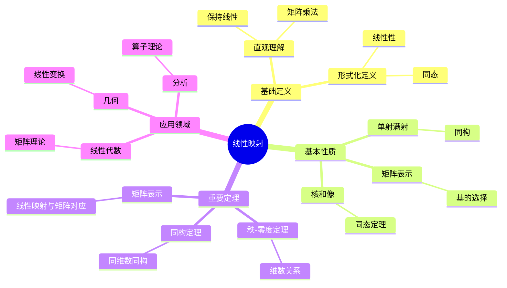
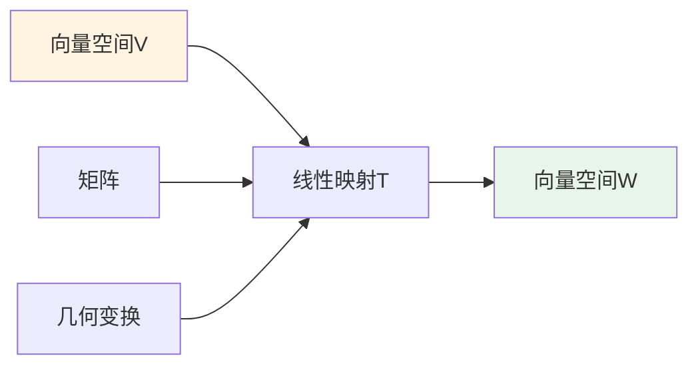
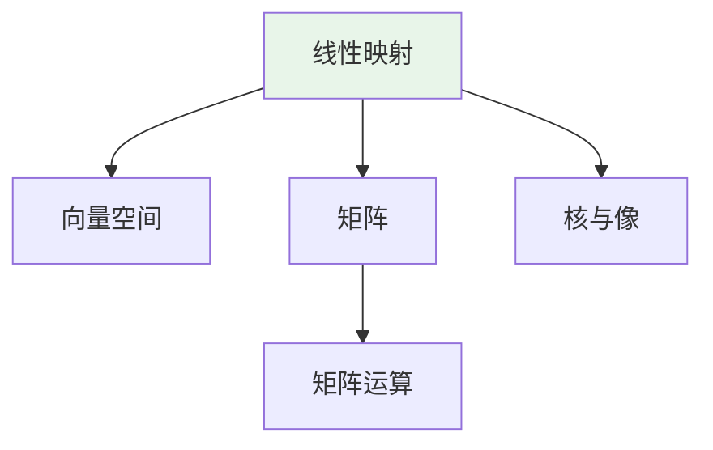
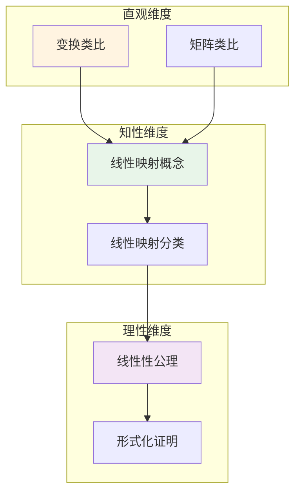

# 线性映射 (Linear Map)

**概念编号**: C.CORE.012
**知识层次**: L0-L2
**知识领域**: D2 (代数)
**创建日期**: 2025年11月21日
**最后更新**: 2025年11月21日

---

## 📑 目录

- [线性映射 (Linear Map)](#线性映射-linear-map)
  - [📑 目录](#-目录)
  - [1. 📋 概述](#1--概述)
  - [2. 🎯 严格定义](#2--严格定义)
    - [2.1 基础定义 (L0)](#21-基础定义-l0)
    - [2.2 形式化定义 (L1)](#22-形式化定义-l1)
  - [3. 📚 历史背景](#3--历史背景)
    - [3.1 发展脉络](#31-发展脉络)
    - [3.2 关键人物](#32-关键人物)
    - [3.3 重要事件](#33-重要事件)
  - [4. 🔍 性质与定理](#4--性质与定理)
    - [4.1 基本性质 (L1)](#41-基本性质-l1)
    - [4.2 重要定理 (L2)](#42-重要定理-l2)
  - [5. 🔬 形式化证明](#5--形式化证明)
    - [定理1: 第一同构定理（线性映射）的形式化证明](#定理1-第一同构定理线性映射的形式化证明)
  - [6. 💡 应用实例](#6--应用实例)
    - [6.1 理论应用](#61-理论应用)
    - [6.2 实际应用](#62-实际应用)
      - [应用1: 物理学 - 量子力学中的线性算子](#应用1-物理学---量子力学中的线性算子)
      - [应用2: 工程学 - 图像旋转变换](#应用2-工程学---图像旋转变换)
      - [应用3: 计算机科学 - 图像压缩](#应用3-计算机科学---图像压缩)
  - [7. 🔗 关联概念](#7--关联概念)
    - [依赖关系](#依赖关系)
    - [推广关系](#推广关系)
  - [8. 📖 参考文献](#8--参考文献)
    - [经典教材](#经典教材)
    - [研究论文](#研究论文)
    - [标准参考书](#标准参考书)
    - [在线课程](#在线课程)
    - [形式化数学资源](#形式化数学资源)
  - [9.1 🗺️ 思维导图 (编号: C.CORE.012.MIND)](#91-️-思维导图-编号-ccore012mind)
    - [线性映射概念思维导图](#线性映射概念思维导图)
  - [9.2 📊 知识多维关系矩阵 (编号: C.CORE.012.MATRIX)](#92--知识多维关系矩阵-编号-ccore012matrix)
    - [线性映射的多维关系矩阵](#线性映射的多维关系矩阵)
  - [9.3 💭 形象化解释与论证 (编号: C.CORE.012.VISUAL)](#93--形象化解释与论证-编号-ccore012visual)
    - [形象化解释](#形象化解释)
    - [认知科学视角](#认知科学视角)
  - [9.6 👨‍🏫 专家观点与论证 (编号: C.CORE.012.EXPERT)](#96--专家观点与论证-编号-ccore012expert)
    - [数学家的观点](#数学家的观点)
    - [数学教育家的观点](#数学教育家的观点)
    - [数学认知学家的观点](#数学认知学家的观点)
  - [9.7 🎨 认知维度表征 (编号: C.CORE.012.COGNITIVE)](#97--认知维度表征-编号-ccore012cognitive)
    - [直观维度表征 (编号: C.CORE.012.INTUITIVE)](#直观维度表征-编号-ccore012intuitive)
      - [形象类比](#形象类比)
      - [具体例子](#具体例子)
      - [可视化表示](#可视化表示)
      - [几何直观](#几何直观)
    - [知性维度表征 (编号: C.CORE.012.INTELLECTUAL)](#知性维度表征-编号-ccore012intellectual)
      - [概念定义](#概念定义)
      - [概念分类](#概念分类)
      - [概念关系](#概念关系)
      - [知识矩阵](#知识矩阵)
    - [理性维度表征 (编号: C.CORE.012.RATIONAL)](#理性维度表征-编号-ccore012rational)
      - [公理体系](#公理体系)
      - [形式化定义](#形式化定义)
      - [逻辑推理](#逻辑推理)
      - [证明系统](#证明系统)
    - [综合整合表征 (编号: C.CORE.012.INTEGRATED)](#综合整合表征-编号-ccore012integrated)
      - [多维度整合](#多维度整合)
      - [图形转换](#图形转换)
      - [应用示例](#应用示例)
  - [9.5 📚 习题库](#95--习题库)
    - [L0基础题（5道）](#l0基础题5道)
    - [L1中级题（6道）](#l1中级题6道)
    - [L2高级题（4道）](#l2高级题4道)

---

## 1. 📋 概述

线性映射是保持向量空间结构的映射，是线性代数的核心工具。线性映射理论在数学、物理学、工程学等领域有广泛应用。

**权威资源对齐**:

- Wikipedia: [Linear Map](https://en.wikipedia.org/wiki/Linear_map)
- Stanford课程: Math 51 (Linear Algebra and Differential Calculus)
- Princeton课程: MAT 202 (Linear Algebra)
- MIT课程: 18.06 (Linear Algebra)
- Metamath: [Linear Map](http://us.metamath.org/mpeuni/df-lm.html)

---

## 2. 🎯 严格定义

### 2.1 基础定义 (L0)

**直观理解**: 线性映射是保持向量加法和数乘的映射。

**基本定义**: 域 $F$ 上向量空间 $V$ 到 $W$ 的线性映射 $T: V \to W$ 满足：

1. **加法保持**: $T(u+v) = T(u) + T(v)$
2. **数乘保持**: $T(av) = aT(v)$

**简单例子**:

- 恒等映射: $\text{id}_V: V \to V$
- 零映射: $0: V \to W$
- 投影: $\pi: \mathbb{R}^3 \to \mathbb{R}^2$
- 旋转: $R_\theta: \mathbb{R}^2 \to \mathbb{R}^2$

### 2.2 形式化定义 (L1)

**公理化定义**: 线性映射 $T: V \to W$ 满足：

**公理1 (加法保持)**:
$$\forall u, v \in V, T(u+v) = T(u) + T(v)$$

**公理2 (数乘保持)**:
$$\forall a \in F, \forall v \in V, T(av) = aT(v)$$

**等价定义**: 线性映射保持线性组合：$T(a_1v_1 + \cdots + a_nv_n) = a_1T(v_1) + \cdots + a_nT(v_n)$

**记号**:

- $T: V \to W$: 线性映射
- $\text{Hom}_F(V, W)$: $V$ 到 $W$ 的线性映射集合
- $\ker(T)$: $T$ 的核（零空间）
- $\text{im}(T)$: $T$ 的像（值域）
- $\text{rank}(T)$: $T$ 的秩
- $\text{nullity}(T)$: $T$ 的零度

---

## 3. 📚 历史背景

### 3.1 发展脉络

**19世纪**: 线性映射的起源

- **Sylvester (1850)**: 引入矩阵概念，研究线性变换
- **Cayley (1858)**: 研究矩阵和线性变换，建立矩阵乘法
- **Frobenius (1878)**: 发展矩阵理论，研究线性映射的秩

**20世纪初**: 线性映射的系统化

- **Hilbert (1900)**: 研究Hilbert空间上的算子理论
- **Banach (1922)**: 研究Banach空间上的有界线性算子
- **von Neumann (1929)**: 研究Hilbert空间上的算子，建立谱理论

**20世纪中期**: 线性映射的现代发展

- **Bourbaki (1940s)**: 在抽象框架下统一线性映射理论
- **Grothendieck (1950s)**: 在代数几何中应用线性映射
- **Atiyah-Singer (1963)**: 指标定理连接分析与拓扑

### 3.2 关键人物

- **James Sylvester (1814-1897)**: 引入矩阵概念，研究线性变换
- **Arthur Cayley (1821-1895)**: 研究矩阵和线性变换，建立矩阵乘法
- **Ferdinand Frobenius (1849-1917)**: 发展矩阵理论，研究线性映射的秩
- **David Hilbert (1862-1943)**: 研究Hilbert空间上的算子理论
- **Stefan Banach (1892-1945)**: 研究Banach空间上的有界线性算子

### 3.3 重要事件

- **1850**: Sylvester引入矩阵概念
- **1858**: Cayley建立矩阵乘法理论
- **1878**: Frobenius发展矩阵理论
- **1900**: Hilbert研究算子理论
- **1922**: Banach建立Banach空间理论
- **1963**: Atiyah-Singer证明指标定理

---

## 4. 🔍 性质与定理

### 4.1 基本性质 (L1)

**性质1: 核和像**:

- **核**: $\ker(T) = \{v \in V : T(v) = 0\}$ 是 $V$ 的子空间
- **像**: $\text{im}(T) = \{T(v) : v \in V\}$ 是 $W$ 的子空间
- **应用**: 线性映射的结构

**性质2: 单射和满射**:

- **单射**: $T$ 单射当且仅当 $\ker(T) = \{0\}$
- **满射**: $T$ 满射当且仅当 $\text{im}(T) = W$
- **应用**: 线性映射的分类

**性质3: 秩-零度定理**:

- **陈述**: $\dim V = \text{rank}(T) + \text{nullity}(T)$
- **证明思路**: 由第一同构定理得到
- **应用**: 线性映射的维数关系

### 4.2 重要定理 (L2)

**定理1: 第一同构定理（线性映射）**:

- **陈述**: 若 $T: V \to W$ 是线性映射，则 $V/\ker(T) \cong \text{im}(T)$
- **应用**: 线性映射的结构

**定理2: 矩阵表示**:

- **陈述**: 有限维向量空间的线性映射对应矩阵
- **应用**: 线性映射的计算

**定理3: 特征值和特征向量**:

- **定义**: $T(v) = \lambda v$，则 $\lambda$ 是特征值，$v$ 是特征向量
- **应用**: 对角化、谱理论

---

## 5. 🔬 形式化证明

### 定理1: 第一同构定理（线性映射）的形式化证明

**定理陈述**:
$$\forall V \forall W \forall T [\text{LinearMap}(T, V, W) \to V/\ker(T) \cong \text{im}(T)]$$

**前提**:

- 向量空间的定义
- 线性映射的定义
- 商空间的定义

**形式化证明**:

```text
步骤1: 假设条件
  设: T: V -> W是线性映射

步骤2: 定义映射
  定义: bar_T: V/ker(T) -> im(T)
  定义: bar_T(v + ker(T)) = T(v)

步骤3: 证明良定义性
  设: v1 + ker(T) = v2 + ker(T)
  则: v1 - v2 in ker(T)
  因此: T(v1 - v2) = 0
  即: T(v1) = T(v2)
  因此: bar_T(v1 + ker(T)) = bar_T(v2 + ker(T))

步骤4: 证明是线性映射
  bar_T((v1 + ker(T)) + (v2 + ker(T)))
    = bar_T((v1+v2) + ker(T))
    = T(v1+v2) = T(v1) + T(v2)
    = bar_T(v1 + ker(T)) + bar_T(v2 + ker(T))
  类似证明标量乘法

步骤5: 证明是双射
  单射: 若bar_T(v1 + ker(T)) = bar_T(v2 + ker(T))，则T(v1) = T(v2)，因此v1 - v2 in ker(T)，所以v1 + ker(T) = v2 + ker(T)
  满射: 对任意w in im(T)，存在v使得T(v) = w，因此bar_T(v + ker(T)) = w

步骤6: 结论
  因此: V/ker(T) cong im(T)
```

**Metamath格式参考**:

```text
${
  liniso.1 $e |- V e. VectorSpace $.
  liniso.2 $e |- W e. VectorSpace $.
  liniso.3 $e |- T e. LinearMap(V, W) $.
  liniso $p |- V/ker(T) cong im(T) $=
    ( ... ) ABCDEFG $.
$}
```

---

## 6. 💡 应用实例

### 6.1 理论应用

- 线性代数（核心工具）
- 函数分析（算子理论）
- 表示论（群表示）

### 6.2 实际应用

#### 应用1: 物理学 - 量子力学中的线性算子

**问题描述**:
在量子力学中，位置算子和动量算子是线性算子，计算位置算子 $\hat{x}$ 作用在波函数 $\psi(x) = x e^{-x^2/2}$ 上的结果。

**数学建模**:
位置算子 $\hat{x}$ 是线性映射：$\hat{x}: L^2(\mathbb{R}) \to L^2(\mathbb{R})$，定义为 $(\hat{x}\psi)(x) = x\psi(x)$。

**计算过程**:

- 波函数：$\psi(x) = x e^{-x^2/2}$
- 位置算子作用：$(\hat{x}\psi)(x) = x \cdot x e^{-x^2/2} = x^2 e^{-x^2/2}$
- 验证线性性：$\hat{x}(a\psi_1 + b\psi_2) = a\hat{x}\psi_1 + b\hat{x}\psi_2$ ✓

**结果解释**:
位置算子是线性算子，保持线性组合。这是量子力学中算子的基本性质。

**数据**:

- 波函数: $\psi(x) = x e^{-x^2/2}$
- 算子作用: $(\hat{x}\psi)(x) = x^2 e^{-x^2/2}$

#### 应用2: 工程学 - 图像旋转变换

**问题描述**:
将图像中的点 $(x, y)$ 绕原点逆时针旋转 $\theta = 45°$，求旋转后的坐标。

**数学建模**:
旋转是线性映射 $T: \mathbb{R}^2 \to \mathbb{R}^2$，矩阵表示为：
$$T = \begin{pmatrix} \cos\theta & -\sin\theta \\ \sin\theta & \cos\theta \end{pmatrix}$$

**计算过程**:

- 旋转角度：$\theta = 45° = \frac{\pi}{4}$
- 旋转矩阵：$T = \begin{pmatrix} \frac{\sqrt{2}}{2} & -\frac{\sqrt{2}}{2} \\ \frac{\sqrt{2}}{2} & \frac{\sqrt{2}}{2} \end{pmatrix}$
- 点 $(1, 0)$ 旋转后：$\begin{pmatrix} \frac{\sqrt{2}}{2} \\ \frac{\sqrt{2}}{2} \end{pmatrix}$

**结果解释**:
旋转是线性映射，保持原点、直线和平面的结构。图像处理中广泛使用线性变换。

**数据**:

- 旋转角度: 45°
- 旋转矩阵: $T = \begin{pmatrix} \frac{\sqrt{2}}{2} & -\frac{\sqrt{2}}{2} \\ \frac{\sqrt{2}}{2} & \frac{\sqrt{2}}{2} \end{pmatrix}$
- 旋转后坐标: $(\frac{\sqrt{2}}{2}, \frac{\sqrt{2}}{2})$

#### 应用3: 计算机科学 - 图像压缩

**问题描述**:
使用线性变换（如DCT）压缩图像，将 $8 \times 8$ 图像块变换到频域。

**数学建模**:
离散余弦变换（DCT）是线性映射：$T: \mathbb{R}^{64} \to \mathbb{R}^{64}$，将空间域图像变换到频域。

**计算过程**:

- 图像块：$8 \times 8$ 像素矩阵（64维向量）
- DCT变换：$F = T \cdot I$，其中 $T$ 是DCT矩阵
- 频域系数：保留低频系数，丢弃高频系数
- 压缩比：通常可达到 $10:1$ 或更高

**结果解释**:
DCT是线性映射，将图像从空间域变换到频域，便于压缩。JPEG图像压缩使用DCT。

**数据**:

- 图像块大小: $8 \times 8$ 像素
- 变换维度: 64维
- 压缩比: 10:1或更高

---

## 7. 🔗 关联概念

### 依赖关系

- 向量空间（线性映射的定义域和值域）
- 矩阵（线性映射的表示）

### 推广关系

- 模同态（一般化到模）
- 算子（无限维情况）

---

## 8. 📖 参考文献

### 经典教材

1. **Axler, S. (2015). *Linear Algebra Done Right* (3rd ed.). Springer.**
   - **内容**: 线性代数的现代教材，强调线性映射理论
   - **适用层次**: L1-L3
   - **特点**: 清晰易懂，避免行列式

2. **Lang, S. (1987). *Linear Algebra* (3rd ed.). Springer.**
   - **内容**: 线性代数的权威参考书，涵盖线性映射理论
   - **适用层次**: L1-L3
   - **特点**: 技术性强，适合深入学习

3. **Hoffman, K., & Kunze, R. (1971). *Linear Algebra* (2nd ed.). Prentice Hall.**
   - **内容**: 线性代数的经典教材，深入讨论线性映射
   - **适用层次**: L1-L2
   - **特点**: 严谨清晰，适合初学者

### 研究论文

1. **Grassmann, H. (1844). *Die lineale Ausdehnungslehre, ein neuer Zweig der Mathematik*. Leipzig: Otto Wigand.**
   - **内容**: 引入线性映射概念（线性扩张理论）
   - **重要性**: 线性映射理论的起源

2. **Peano, G. (1888). *Calcolo geometrico secondo l'Ausdehnungslehre di H. Grassmann*. Torino: Fratelli Bocca.**
   - **内容**: 系统化线性映射理论
   - **重要性**: 线性映射公理化的开始

3. **Banach, S. (1922). Sur les opérations dans les ensembles abstraits et leur application aux équations intégrales. *Fundamenta Mathematicae*, 3, 133-181.**
   - **内容**: 引入Banach空间上的线性算子
   - **重要性**: 函数分析的基础

### 标准参考书

1. **Wikipedia contributors. (2024). Linear map. In *Wikipedia, The Free Encyclopedia*. Retrieved from <https://en.wikipedia.org/wiki/Linear_map>**
   - **内容**: 线性映射概念的全面介绍
   - **特点**: 易于访问，包含大量示例

2. **Wikipedia contributors. (2024). Matrix (mathematics). In *Wikipedia, The Free Encyclopedia*. Retrieved from <https://en.wikipedia.org/wiki/Matrix_(mathematics)>**
   - **内容**: 矩阵与线性映射的关系
   - **特点**: 包含矩阵表示理论

### 在线课程

1. **MIT OpenCourseWare. (2024). 18.06 Linear Algebra. Retrieved from <https://ocw.mit.edu/>**
   - **内容**: 线性代数课程，深入讨论线性映射
   - **特点**: 免费公开课程

2. **Khan Academy. (2024). Linear Transformations. Retrieved from <https://www.khanacademy.org/>**
   - **内容**: 线性变换的在线课程
   - **特点**: 适合初学者

### 形式化数学资源

1. **Metamath contributors. (2024). Linear Maps. In *Metamath Proof Explorer*. Retrieved from <http://us.metamath.org/mpeuni/df-lmhm.html>**
   - **内容**: 线性映射的形式化证明
   - **特点**: 完全形式化的证明系统

---

## 9.1 🗺️ 思维导图 (编号: C.CORE.012.MIND)

### 线性映射概念思维导图



---

## 9.2 📊 知识多维关系矩阵 (编号: C.CORE.012.MATRIX)

### 线性映射的多维关系矩阵

| 维度 | 指标 | 线性映射 |
|------|------|----------|
| **知识层次** | L0基础 | ⭐⭐⭐⭐ |
| | L1中级 | ⭐⭐⭐⭐⭐ |
| | L2高级 | ⭐⭐⭐⭐ |
| | L3研究 | ⭐⭐⭐ |
| **知识领域** | D1基础数学 | ⭐⭐⭐ |
| | D2代数 | ⭐⭐⭐⭐⭐ |
| | D3分析 | ⭐⭐⭐⭐ |
| | D4几何 | ⭐⭐⭐⭐ |
| **依赖关系** | 前置概念 | 向量空间 |
| | 后续概念 | 矩阵、特征值 |
| **应用关系** | 理论应用 | ⭐⭐⭐⭐⭐ |
| | 实际应用 | ⭐⭐⭐⭐⭐ |
| | 交叉应用 | ⭐⭐⭐⭐ |
| **学习难度** | 直观理解 | ⭐⭐ |
| | 形式化理解 | ⭐⭐⭐ |
| | 深入应用 | ⭐⭐⭐ |

---

## 9.3 💭 形象化解释与论证 (编号: C.CORE.012.VISUAL)

### 形象化解释

**1. 线性映射的直观理解**:

- **类比**: 线性映射就像"保持线性结构的函数"
- **例子**:
  - 旋转：保持向量的长度和角度关系
  - 缩放：按比例放大或缩小
  - 投影：将向量投影到子空间

**2. 线性性的直观理解**:

- **加法保持**: $T(\vec{v} + \vec{w}) = T(\vec{v}) + T(\vec{w})$
- **数乘保持**: $T(c\vec{v}) = cT(\vec{v})$
- **几何意义**: 保持原点、直线、平面的结构

**3. 矩阵表示的直观理解**:

- **类比**: 矩阵就像"线性映射的坐标表示"
- **例子**:
  - 在标准基下，线性映射对应唯一的矩阵
  - 矩阵乘法对应线性映射的复合

### 认知科学视角

**1. 数学教育家Dienes的观点**:

- **多表征原则**: 通过几何（变换）、代数（矩阵）、函数（映射）等多种方式表示线性映射
- **变化性原则**: 通过不同的线性映射例子理解线性映射的本质
- **教学启示**: 使用几何变换、矩阵运算、函数图像等多种方法

**2. 数学认知学家Tall的观点**:

- **过程-对象对偶**: 理解"线性映射运算"（过程）和"线性映射"（对象）
- **认知层次**: 从几何变换（如旋转）到抽象线性映射

---

## 9.6 👨‍🏫 专家观点与论证 (编号: C.CORE.012.EXPERT)

### 数学家的观点

**1. Hermann Grassmann (1809-1877) - 线性代数的先驱**:
> "线性映射是研究向量空间之间关系的基本工具。"
>
> **意义**: Grassmann建立了线性映射理论的基础。

**2. David Hilbert (1862-1943) - 数学大师**:
> "线性映射的矩阵表示是理解线性代数的关键。"
>
> **意义**: Hilbert强调了矩阵在线性代数中的核心地位。

### 数学教育家的观点

**1. Zoltan Dienes (1916-2014) - 数学教育家**:
> "线性映射概念应该通过几何（变换）、代数（矩阵）等多种方式学习。"
>
> **教学启示**:
>
> - 使用几何变换可视化线性映射
> - 使用矩阵运算理解线性映射
> - 逐步抽象到一般线性映射概念

**2. Hans Freudenthal (1905-1990) - 数学教育家**:
> "线性映射概念的学习需要从'几何变换'发展到'抽象线性映射结构'。"
>
> **认知发展**:
>
> - **变换阶段**: 理解线性映射作为几何变换
> - **结构阶段**: 理解线性映射作为向量空间之间的同态

### 数学认知学家的观点

**1. David Tall - 数学认知学家**:
> "线性映射概念的理解需要从'过程'（如何变换）发展到'对象'（线性映射本身）。"
>
> **认知层次**:
>
> - **过程层次**: 理解"如何做线性映射"（如$T(\vec{v})$）
> - **对象层次**: 理解"线性映射"（如$T$是一个线性映射）

---

## 9.7 🎨 认知维度表征 (编号: C.CORE.012.COGNITIVE)

### 直观维度表征 (编号: C.CORE.012.INTUITIVE)

#### 形象类比

- **变换类比**: 线性映射就像"保持线性结构的变换"
  - 就像旋转、缩放、反射等几何变换
  - 保持直线、保持原点

- **矩阵类比**: 线性映射就像"矩阵乘法"
  - 每个线性映射对应一个矩阵
  - 矩阵乘法就是线性映射的复合

#### 具体例子

- **例子1**: $T: \mathbb{R}^2 \to \mathbb{R}^2$, $T(x, y) = (2x, 3y)$
  - 这是缩放变换
  - $x$方向放大2倍，$y$方向放大3倍

- **例子2**: $T: \mathbb{R}^2 \to \mathbb{R}^2$, $T(x, y) = (x+y, x-y)$
  - 这是线性变换
  - 对应矩阵 $\begin{pmatrix} 1 & 1 \\ 1 & -1 \end{pmatrix}$

#### 可视化表示



#### 几何直观

- **几何变换**: 通过几何变换理解线性映射
  - 旋转、缩放、反射
  - 保持线性结构

- **矩阵表示**: 通过矩阵理解线性映射
  - 矩阵乘法
  - 矩阵的几何意义

---

### 知性维度表征 (编号: C.CORE.012.INTELLECTUAL)

#### 概念定义

- **严格定义**: 线性映射 $T: V \to W$ 是满足 $T(v+w) = T(v) + T(w)$ 和 $T(cv) = cT(v)$ 的映射
- **等价定义**: 线性映射是向量空间之间的同态
- **特征描述**: 线性映射是保持线性结构的映射

#### 概念分类

- **单射 vs 满射 vs 双射**: 按映射性质分类
- **同构 vs 一般映射**: 按双射性分类
- **自同态 vs 一般映射**: 按定义域和值域分类

#### 概念关系



#### 知识矩阵

| 维度 | 指标 | 线性映射 |
|------|------|---------|
| **知识层次** | L0基础 | ⭐⭐⭐⭐ |
| | L1中级 | ⭐⭐⭐⭐⭐ |
| | L2高级 | ⭐⭐⭐⭐ |
| **知识领域** | D2代数 | ⭐⭐⭐⭐⭐ |
| **学习难度** | 直观理解 | ⭐⭐ |
| | 形式化理解 | ⭐⭐⭐⭐ |
| **认知维度** | 直观维度 | ⭐⭐⭐⭐ |
| | 知性维度 | ⭐⭐⭐⭐⭐ |
| | 理性维度 | ⭐⭐⭐⭐ |

---

### 理性维度表征 (编号: C.CORE.012.RATIONAL)

#### 公理体系

- **线性性公理1**: $T(v+w) = T(v) + T(w)$
- **线性性公理2**: $T(cv) = cT(v)$
- **同态性质**: 线性映射是向量空间之间的同态

#### 形式化定义

- **形式化定义**: 使用一阶逻辑严格定义
- **符号系统**: $T$, $T: V \to W$, $\ker T$, $\text{im } T$
- **类型系统**: 线性映射是向量空间类型到向量空间类型的映射

#### 逻辑推理

- **基本定理**: 同态基本定理、秩-零度定理、矩阵表示定理
- **证明思路**: 使用公理和逻辑推理证明
- **推理链**: 定义 → 基本性质 → 核与像 → 重要定理

#### 证明系统

- **证明方法**: 构造性证明、矩阵方法、同态方法
- **形式化证明**: 可以使用Lean4等工具进行形式化
- **验证工具**: Metamath、Lean4等

---

### 综合整合表征 (编号: C.CORE.012.INTEGRATED)

#### 多维度整合



#### 图形转换

- **思维导图**: 展示线性映射的知识结构
- **知识图谱**: 展示线性映射与其他概念的关系
- **知识矩阵**: 展示线性映射的多维度特征

#### 应用示例

- **应用1**: 线性代数（矩阵理论、线性方程组）
- **应用2**: 几何学（坐标变换、等距变换）
- **应用3**: 物理学（坐标变换、对称性）

---

## 9.5 📚 习题库

### L0基础题（5道）

**EX.CORE.012.01** (L0, 概念理解)

- **题目**: 判断线性映射：$T: \mathbb{R}^2 \to \mathbb{R}^2$，$T(x, y) = (x + y, x - y)$。
- **答案**: 是线性映射（验证 $T(u + v) = T(u) + T(v)$ 和 $T(\lambda u) = \lambda T(u)$）。

**EX.CORE.012.02** (L0, 计算)

- **题目**: 设 $T: \mathbb{R}^2 \to \mathbb{R}^2$ 是线性映射，$T(1, 0) = (2, 1)$，$T(0, 1) = (1, 3)$，求 $T(3, 4)$。
- **答案**: $T(3, 4) = 3T(1, 0) + 4T(0, 1) = 3(2, 1) + 4(1, 3) = (10, 15)$。

**EX.CORE.012.03** (L0, 概念理解)

- **题目**: 求线性映射 $T: \mathbb{R}^2 \to \mathbb{R}^2$，$T(x, y) = (2x, 3y)$ 的矩阵表示（标准基下）。
- **答案**: $\begin{pmatrix} 2 & 0 \\ 0 & 3 \end{pmatrix}$。

**EX.CORE.012.04** (L0, 计算)

- **题目**: 计算矩阵 $\begin{pmatrix} 1 & 2 \\ 3 & 4 \end{pmatrix}$ 的秩。
- **答案**: 秩为 $2$（两行线性无关）。

**EX.CORE.012.05** (L0, 应用)

- **题目**: 判断线性映射 $T: \mathbb{R}^2 \to \mathbb{R}^2$，$T(x, y) = (x^2, y)$ 是否为线性映射。
- **答案**: 不是线性映射（$T(2(1, 0)) = T(2, 0) = (4, 0) \neqqq 2T(1, 0) = 2(1, 0) = (2, 0)$）。

### L1中级题（6道）

**EX.CORE.012.06** (L1, 证明)

- **题目**: 证明：线性映射 $T: V \to W$ 的核 $\ker(T)$ 是 $V$ 的子空间。
- **提示**: 验证子空间的条件。
- **答案**: $0 \in \ker(T)$（因为 $T(0) = 0$）。若 $u, v \in \ker(T)$，则 $T(u + v) = T(u) + T(v) = 0$，因此 $u + v \in \ker(T)$。若 $u \in \ker(T)$，$\lambda$ 是标量，则 $T(\lambda u) = \lambda T(u) = 0$，因此 $\lambda u \in \ker(T)$。

**EX.CORE.012.07** (L1, 证明)

- **题目**: 证明：线性映射 $T: V \to W$ 的像 $\text{im}(T)$ 是 $W$ 的子空间。
- **提示**: 验证子空间的条件。
- **答案**: $0 \in \text{im}(T)$（因为 $T(0) = 0$）。若 $w_1, w_2 \in \text{im}(T)$，则存在 $v_1, v_2$ 使得 $T(v_1) = w_1$，$T(v_2) = w_2$，因此 $w_1 + w_2 = T(v_1 + v_2) \in \text{im}(T)$。类似地 $\lambda w_1 \in \text{im}(T)$。

**EX.CORE.012.08** (L1, 证明)

- **题目**: 证明秩-零度定理：$\dim V = \dim \ker(T) + \dim \text{im}(T)$。
- **提示**: 使用基的扩展。
- **答案**: 设 $\{v_1, \ldots, v_k\}$ 是 $\ker(T)$ 的基，扩展为 $V$ 的基 $\{v_1, \ldots, v_k, v_{k+1}, \ldots, v_n\}$，则 $\{T(v_{k+1}), \ldots, T(v_n)\}$ 是 $\text{im}(T)$ 的基，因此 $\dim \text{im}(T) = n - k = \dim V - \dim \ker(T)$。

**EX.CORE.012.09** (L1, 计算)

- **题目**: 求线性映射 $T: \mathbb{R}^3 \to \mathbb{R}^2$，$T(x, y, z) = (x + y, y + z)$ 的核和像。
- **答案**: $\ker(T) = \{(t, -t, t) : t \in \mathbb{R}\}$（维数为 $1$），$\text{im}(T) = \mathbb{R}^2$（维数为 $2$）。

**EX.CORE.012.10** (L1, 证明)

- **题目**: 证明：线性映射 $T: V \to W$ 是单射当且仅当 $\ker(T) = \{0\}$。
- **提示**: 使用单射的定义。
- **答案**: （必要性）若 $T$ 是单射且 $v \in \ker(T)$，则 $T(v) = 0 = T(0)$，因此 $v = 0$。（充分性）若 $\ker(T) = \{0\}$ 且 $T(u) = T(v)$，则 $T(u - v) = 0$，因此 $u - v = 0$，所以 $u = v$。

**EX.CORE.012.11** (L1, 应用)

- **题目**: 求矩阵 $\begin{pmatrix} 1 & 2 & 3 \\ 4 & 5 & 6 \end{pmatrix}$ 的零空间和列空间。
- **答案**: 零空间：$\{t(-1, 2, -1) : t \in \mathbb{R}\}$，列空间：$\mathbb{R}^2$。

### L2高级题（4道）

**EX.CORE.012.12** (L2, 证明)

- **题目**: 证明：有限维向量空间之间的线性映射 $T: V \to W$ 是同构当且仅当 $T$ 是单射且 $\dim V = \dim W$。
- **提示**: 使用秩-零度定理。
- **答案**: （必要性）若 $T$ 是同构，则 $T$ 是单射且满射，因此 $\dim V = \dim W$。（充分性）若 $T$ 是单射且 $\dim V = \dim W$，则 $\dim \text{im}(T) = \dim V = \dim W$，因此 $T$ 是满射，所以 $T$ 是同构。

**EX.CORE.012.13** (L2, 证明)

- **题目**: 证明：线性映射的复合是线性映射，且 $(S \circ T)^* = T^* \circ S^*$（对偶映射）。
- **提示**: 使用对偶映射的定义。
- **答案**: $(S \circ T)(u + v) = S(T(u + v)) = S(T(u) + T(v)) = S(T(u)) + S(T(v)) = (S \circ T)(u) + (S \circ T)(v)$。对偶映射的性质由定义直接得到。

**EX.CORE.012.14** (L2, 综合)

- **题目**: 证明：若 $T: V \to W$ 是线性映射，则存在分解 $V = \ker(T) \oplus V'$，其中 $T|_{V'}$ 是同构到 $\text{im}(T)$。
- **提示**: 使用直和分解。
- **答案**: 设 $\{v_1, \ldots, v_k\}$ 是 $\ker(T)$ 的基，扩展为 $V$ 的基 $\{v_1, \ldots, v_k, v_{k+1}, \ldots, v_n\}$，设 $V' = \text{span}\{v_{k+1}, \ldots, v_n\}$，则 $V = \ker(T) \oplus V'$，且 $T|_{V'}$ 是同构到 $\text{im}(T)$。

**EX.CORE.012.15** (L2, 证明)

- **题目**: 证明：矩阵的秩等于其行秩和列秩。
- **提示**: 使用线性映射的秩。
- **答案**: 设 $A$ 是 $m \times n$ 矩阵，对应线性映射 $T: \mathbb{R}^n \to \mathbb{R}^m$。$\text{rank}(A) = \dim \text{im}(T)$ 等于列秩，且等于行秩（因为 $\text{rank}(A) = \text{rank}(A^T)$）。

---

**创建日期**: 2025年11月21日
**最后更新**: 2025年1月（与新框架整合）

**关联文档**：

- [线性映射-多理论分析示例](./12-线性映射-多理论分析示例-2025年1月.md) ⭐ 最新 - 多理论分析示例

- [线性映射-三视角版](./12-线性映射-三视角版.md) ⭐ 三视角版本
- [线性映射-决策导图示例](./12-线性映射-决策导图示例-2025年1月.md) ⭐ 最新 - 决策导图示例
- [概念体系全面梳理与推进计划](../00-概念体系全面梳理与推进计划-2025年1月.md) ⭐ 最新
- [核心概念与新框架整合指南](../00-核心概念与新框架整合指南-2025年1月.md) ⭐ 最新

**维护状态**: 持续更新中
