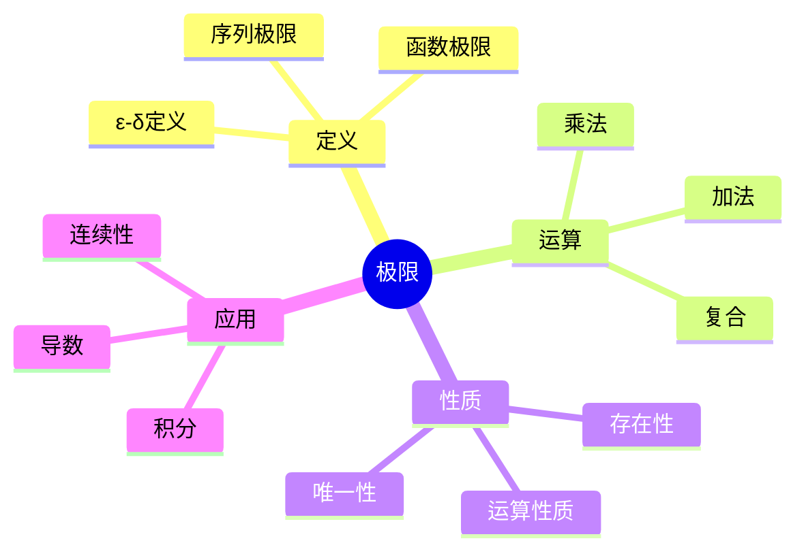
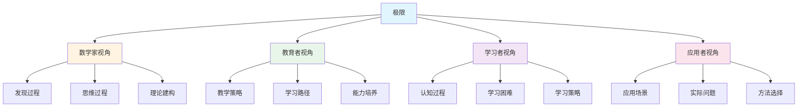
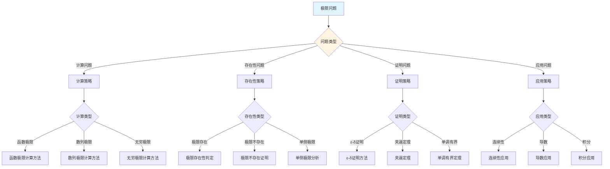
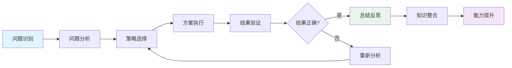
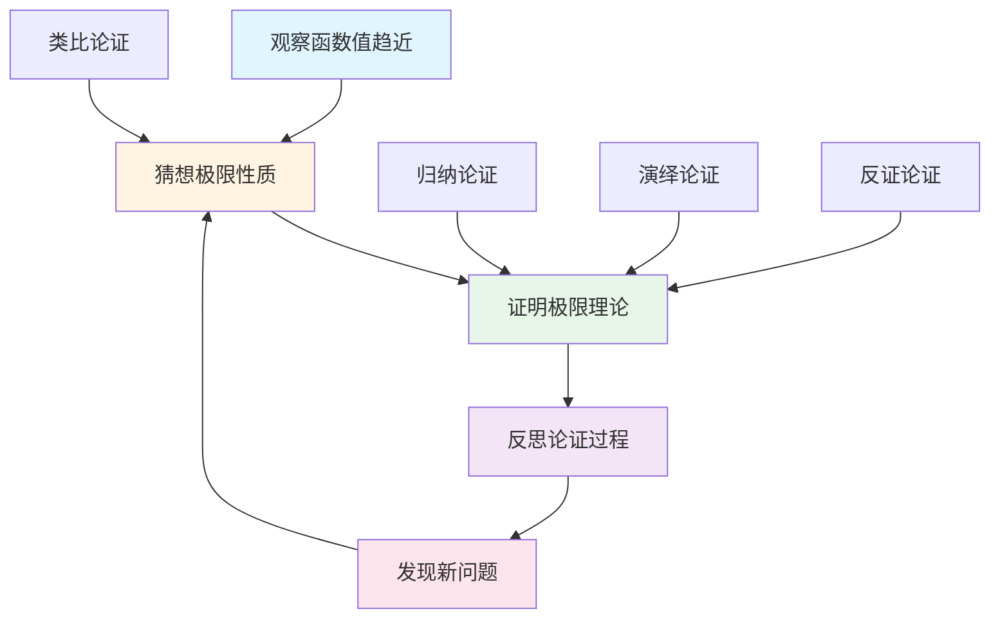
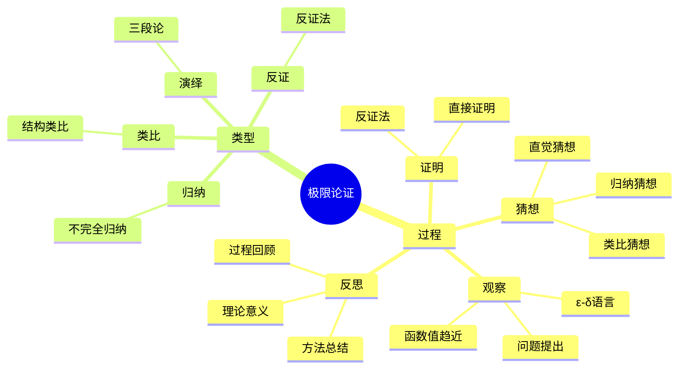

# 极限 (Limit) - 三视角组织版

**概念编号**: C.CORE.013
**知识层次**: L0-L2
**知识领域**: D3 (分析)
**创建日期**: 2025年1月
**最后更新**: 2025年1月

---

## 📋 目录 / Table of Contents

- [极限 (Limit) - 三视角组织版](#极限-limit---三视角组织版)
  - [📋 目录 / Table of Contents](#-目录--table-of-contents)
  - [1. 📋 概述 (编号: C.CORE.013.01)](#1--概述-编号-ccore01301)
  - [🧠 认知学视角：如何理解极限 (编号: C.CORE.013.02)](#-认知学视角如何理解极限-编号-ccore01302)
    - [认知起点 (编号: C.CORE.013.02.01)](#认知起点-编号-ccore0130201)
    - [认知过程 (编号: C.CORE.013.02.02)](#认知过程-编号-ccore0130202)
      - [阶段1：直观理解阶段 (编号: C.CORE.013.02.02.01)](#阶段1直观理解阶段-编号-ccore013020201)
      - [阶段2：概念形成阶段 (编号: C.CORE.013.02.02.02)](#阶段2概念形成阶段-编号-ccore013020202)
      - [阶段3：形式化阶段 (编号: C.CORE.013.02.02.03)](#阶段3形式化阶段-编号-ccore013020203)
    - [认知障碍 (编号: C.CORE.013.02.03)](#认知障碍-编号-ccore0130203)
    - [认知工具 (编号: C.CORE.013.02.04)](#认知工具-编号-ccore0130204)
  - [🎓 教育学视角：如何教学极限 (编号: C.CORE.013.03)](#-教育学视角如何教学极限-编号-ccore01303)
    - [教学目标 (编号: C.CORE.013.03.01)](#教学目标-编号-ccore0130301)
    - [教学路径 (编号: C.CORE.013.03.02)](#教学路径-编号-ccore0130302)
      - [阶段1：引入阶段（激发兴趣） (编号: C.CORE.013.03.02.01)](#阶段1引入阶段激发兴趣-编号-ccore013030201)
      - [阶段2：探索阶段（主动建构） (编号: C.CORE.013.03.02.02)](#阶段2探索阶段主动建构-编号-ccore013030202)
      - [阶段3：形式化阶段（抽象概括） (编号: C.CORE.013.03.02.03)](#阶段3形式化阶段抽象概括-编号-ccore013030203)
      - [阶段4：巩固阶段（应用深化） (编号: C.CORE.013.03.02.04)](#阶段4巩固阶段应用深化-编号-ccore013030204)
    - [教学难点 (编号: C.CORE.013.03.03)](#教学难点-编号-ccore0130303)
    - [教学策略 (编号: C.CORE.013.03.04)](#教学策略-编号-ccore0130304)
    - [评估方法 (编号: C.CORE.013.03.05)](#评估方法-编号-ccore0130305)
  - [🔬 数学家视角：如何思考极限 (编号: C.CORE.013.04)](#-数学家视角如何思考极限-编号-ccore01304)
    - [问题起源 (编号: C.CORE.013.04.01)](#问题起源-编号-ccore0130401)
    - [思维过程 (编号: C.CORE.013.04.02)](#思维过程-编号-ccore0130402)
      - [步骤1：问题提出 (编号: C.CORE.013.04.02.01)](#步骤1问题提出-编号-ccore013040201)
      - [步骤2：概念形成 (编号: C.CORE.013.04.02.02)](#步骤2概念形成-编号-ccore013040202)
      - [步骤3：理论发展 (编号: C.CORE.013.04.02.03)](#步骤3理论发展-编号-ccore013040203)
    - [历史发展 (编号: C.CORE.013.04.03)](#历史发展-编号-ccore0130403)
    - [3.2 关键人物和贡献 (编号: C.CORE.013.04.04)](#32-关键人物和贡献-编号-ccore0130404)
    - [重要定理 (编号: C.CORE.013.04.05)](#重要定理-编号-ccore0130405)
    - [开放问题 (编号: C.CORE.013.04.06)](#开放问题-编号-ccore0130406)
    - [一、第一人称思维描述 (编号: C.CORE.013.04.07)](#一第一人称思维描述-编号-ccore0130407)
      - [1.1 Cauchy的发现过程](#11-cauchy的发现过程)
    - [二、数学直觉的形成 (编号: C.CORE.013.04.08)](#二数学直觉的形成-编号-ccore0130408)
      - [2.1 直觉在概念发现中的作用](#21-直觉在概念发现中的作用)
      - [2.2 如何培养极限直觉](#22-如何培养极限直觉)
    - [三、数学美的教育价值 (编号: C.CORE.013.04.09)](#三数学美的教育价值-编号-ccore0130409)
      - [3.1 极限论的美在哪里](#31-极限论的美在哪里)
      - [3.2 如何培养学生的数学美感](#32-如何培养学生的数学美感)
    - [四、问题解决策略 (编号: C.CORE.013.04.10)](#四问题解决策略-编号-ccore0130410)
      - [4.1 数学家的启发式方法](#41-数学家的启发式方法)
      - [4.2 思维过程分析](#42-思维过程分析)
    - [五、批判性反思 (编号: C.CORE.013.04.11)](#五批判性反思-编号-ccore0130411)
      - [5.1 极限概念的局限性](#51-极限概念的局限性)
      - [5.2 极限理论的未解决问题](#52-极限理论的未解决问题)
  - [💡 数学解释：为什么极限是这样定义的 (编号: C.CORE.013.05)](#-数学解释为什么极限是这样定义的-编号-ccore01305)
    - [一、直观解释：极限是什么？](#一直观解释极限是什么)
      - [1.1 具体例子](#11-具体例子)
      - [1.2 形象类比](#12-形象类比)
      - [1.3 几何直观](#13-几何直观)
      - [1.4 操作体验](#14-操作体验)
    - [二、知性解释：极限的本质是什么？](#二知性解释极限的本质是什么)
      - [2.1 概念定义](#21-概念定义)
      - [2.2 分类体系](#22-分类体系)
      - [2.3 抽象结构](#23-抽象结构)
      - [2.4 知识体系](#24-知识体系)
    - [三、理性解释：极限的公理化定义](#三理性解释极限的公理化定义)
      - [3.1 公理体系](#31-公理体系)
      - [3.2 形式化证明](#32-形式化证明)
      - [3.3 系统建构](#33-系统建构)
    - [四、多视角解释：从不同角度理解极限](#四多视角解释从不同角度理解极限)
      - [4.1 数学家视角：极限是如何被发现的？](#41-数学家视角极限是如何被发现的)
      - [4.2 教育者视角：如何教学极限？](#42-教育者视角如何教学极限)
      - [4.3 学习者视角：如何学习极限？](#43-学习者视角如何学习极限)
      - [4.4 应用者视角：如何应用极限？](#44-应用者视角如何应用极限)
    - [五、思维表征：用多种方式理解极限](#五思维表征用多种方式理解极限)
      - [5.1 思维导图：极限的知识结构](#51-思维导图极限的知识结构)
      - [5.2 矩阵对比：不同解释方式的对比](#52-矩阵对比不同解释方式的对比)
      - [5.3 多视角表征：从不同角度表征极限](#53-多视角表征从不同角度表征极限)
      - [5.4 决策树：极限问题分类和策略选择](#54-决策树极限问题分类和策略选择)
      - [5.5 决策逻辑路径：极限问题解决过程](#55-决策逻辑路径极限问题解决过程)
      - [5.6 多维对比矩阵：极限概念特征对比](#56-多维对比矩阵极限概念特征对比)
  - [🔍 数学论证：如何论证极限 (编号: C.CORE.013.06)](#-数学论证如何论证极限-编号-ccore01306)
    - [一、论证过程：从观察到反思](#一论证过程从观察到反思)
      - [1.1 观察（Observation）](#11-观察observation)
      - [1.2 猜想（Conjecture）](#12-猜想conjecture)
      - [1.3 证明（Proof）](#13-证明proof)
      - [1.4 反思（Reflection）](#14-反思reflection)
    - [二、论证类型：多种推理方式](#二论证类型多种推理方式)
      - [2.1 归纳论证（Inductive Reasoning）](#21-归纳论证inductive-reasoning)
      - [2.2 演绎论证（Deductive Reasoning）](#22-演绎论证deductive-reasoning)
      - [2.3 类比论证（Analogical Reasoning）](#23-类比论证analogical-reasoning)
      - [2.4 反证论证（Proof by Contradiction）](#24-反证论证proof-by-contradiction)
    - [三、论证可视化：用图形表示论证过程](#三论证可视化用图形表示论证过程)
      - [3.1 论证流程图](#31-论证流程图)
      - [3.2 论证类型对比](#32-论证类型对比)
      - [3.3 论证思维导图](#33-论证思维导图)
  - [🔗 三视角整合 (编号: C.CORE.013.07)](#-三视角整合-编号-ccore01307)
    - [三个视角的关联](#三个视角的关联)
    - [如何综合运用三个视角](#如何综合运用三个视角)
  - [📚 参考文献 (编号: C.CORE.013.08)](#-参考文献-编号-ccore01308)
    - [权威资源](#权威资源)
    - [经典教材](#经典教材)
    - [研究论文](#研究论文)

---

## 1. 📋 概述 (编号: C.CORE.013.01)

极限是数学分析的基础概念，是微积分和连续性的核心。极限概念将离散与连续联系起来，是现代分析学的基石。

本文档从**数学认知学**、**教育学**、**数学家**三个视角深入展开极限概念，避免简单的概念堆垒。

**权威资源对齐**:

- Wikipedia: [Limit (Mathematics)](https://en.wikipedia.org/wiki/Limit_(mathematics))
- Stanford课程: Math 171 (Real Analysis)
- Princeton课程: MAT 201 (Analysis)
- MIT课程: 18.100A (Real Analysis)
- Metamath: [Limit](http://us.metamath.org/mpeuni/df-lim.html)

---

## 🧠 认知学视角：如何理解极限 (编号: C.CORE.013.02)

### 认知起点 (编号: C.CORE.013.02.01)

**学习者已有的知识基础**:

- 函数的概念
- 序列的概念
- 日常经验中的"趋近"、"接近"概念

**日常经验中的类似概念**:

- "越来越接近"：逐渐接近某个值
- "趋向于"：朝着某个方向
- "无限接近"：可以任意接近

### 认知过程 (编号: C.CORE.013.02.02)

#### 阶段1：直观理解阶段 (编号: C.CORE.013.02.02.01)

**具体例子**:

- 例子1：$\lim_{x \to 0} \frac{\sin x}{x} = 1$
- 例子2：$\lim_{n \to \infty} \frac{1}{n} = 0$
- 例子3：$\lim_{x \to 2} x^2 = 4$

**形象类比**:

- **趋近类比**: 极限就像"无限接近某个值"
  - 当$x$接近$a$时，$f(x)$接近$L$
  - 可以任意接近，但不一定达到

- **过程类比**: 极限就像"过程的终点"
  - 序列的极限是序列的"终点"
  - 函数的极限是函数的"趋势"

**可视化表示**:

```text
极限的几何表示:
    y
    ↑
    |     ●
    |    /
    |   /
    |  /
    | /
    └──────────→ x
       a
```

#### 阶段2：概念形成阶段 (编号: C.CORE.013.02.02.02)

**从例子中抽象出共同特征**:

- 所有例子都涉及"趋近"
- 当变量接近某个值时，函数值接近某个值
- 可以任意接近，但不一定达到

**识别关键属性**:

1. **趋近性**: 当$x$接近$a$时，$f(x)$接近$L$
2. **任意性**: 可以任意接近
3. **唯一性**: 极限如果存在，则唯一

**建立概念边界**:

- **什么是极限**: 当变量接近某个值时，函数值的"趋近值"
- **什么不是极限**:
  - 函数值本身（不是趋近值）
  - 函数在某点的值（不一定等于极限）

#### 阶段3：形式化阶段 (编号: C.CORE.013.02.02.03)

**严格定义**:

- $\varepsilon$-$\delta$定义：通过$\varepsilon$和$\delta$的量化表述
- 序列极限：通过$\varepsilon$和$N$的量化表述

**公理化表述**:

- 函数极限：$\forall \varepsilon > 0, \exists \delta > 0, \forall x, 0 < |x - a| < \delta \Rightarrow |f(x) - L| < \varepsilon$
- 序列极限：$\forall \varepsilon > 0, \exists N \in \mathbb{N}, \forall n > N, |a_n - L| < \varepsilon$

**逻辑结构**:

- 极限是分析学的基础
- 极限是连续性和可微性的基础
- 极限是微积分的基础

### 认知障碍 (编号: C.CORE.013.02.03)

**常见误解**:

1. **误解1**: 认为极限就是函数值
   - **纠正**: 极限是趋近值，不一定等于函数值

2. **误解2**: 认为极限必须达到
   - **纠正**: 极限是"可以任意接近"，不一定达到

3. **误解3**: 混淆极限和函数值
   - **纠正**: 极限是过程的终点，函数值是某点的值

**理解难点**:

1. **难点1**: $\varepsilon$-$\delta$定义的抽象性
   - **原因**: $\varepsilon$-$\delta$定义比较抽象
   - **解决方法**: 从直观理解开始，逐步形式化

2. **难点2**: 极限的"任意接近"
   - **原因**: "任意接近"的概念比较抽象
   - **解决方法**: 用具体例子，强调"可以任意接近"

3. **难点3**: 极限的存在性
   - **原因**: 不是所有函数都有极限
   - **解决方法**: 用反例说明，强调存在性条件

**认知陷阱**:

- **趋近性**: 需要理解"可以任意接近"的含义
- **存在性**: 需要理解极限不一定存在

### 认知工具 (编号: C.CORE.013.02.04)

**类比工具**:

- **趋近类比**: 极限 = 无限接近某个值
- **过程类比**: 极限 = 过程的终点

**可视化工具**:

- **函数图像**: 用函数图像表示极限
- **序列图像**: 用序列图像表示极限

**具体化工具**:

- **具体例子**: 用具体例子理解抽象概念
- **反例**: 用反例理解概念边界

---

## 🎓 教育学视角：如何教学极限 (编号: C.CORE.013.03)

### 教学目标 (编号: C.CORE.013.03.01)

**知识目标**:

- 理解极限的基本概念
- 掌握$\varepsilon$-$\delta$定义
- 理解极限的性质
- 理解极限的运算

**能力目标**:

- 能够计算极限
- 能够证明极限
- 能够应用极限解决实际问题
- 能够理解极限的存在性

**情感目标**:

- 培养数学抽象思维
- 培养分析思维
- 激发对数学的兴趣

### 教学路径 (编号: C.CORE.013.03.02)

#### 阶段1：引入阶段（激发兴趣） (编号: C.CORE.013.03.02.01)

**实际问题**:

- 问题1：如何描述函数的"趋势"？
- 问题2：如何计算瞬时速度？
- 问题3：如何计算曲线下面积？

**历史背景**:

- 极限的历史发展
- 极限在数学中的地位
- 极限在微积分中的作用

**引发认知冲突**:

- 问题：如何严格定义"趋近"？
- 引出$\varepsilon$-$\delta$定义

#### 阶段2：探索阶段（主动建构） (编号: C.CORE.013.03.02.02)

**引导发现**:

1. 让学生自己列举"趋近"的例子
2. 让学生观察这些例子的共同特征
3. 引导学生抽象出极限的定义

**合作探究**:

- 小组讨论：什么是极限？
- 小组讨论：极限有哪些性质？
- 小组讨论：如何计算极限？

**多元表征**:

- **语言表征**: "极限是当变量接近某个值时，函数值的趋近值"
- **符号表征**: $\lim_{x \to a} f(x) = L$
- **图形表征**: 函数图像
- **集合表征**: $\varepsilon$-$\delta$定义

#### 阶段3：形式化阶段（抽象概括） (编号: C.CORE.013.03.02.03)

**严格定义**:

- $\varepsilon$-$\delta$定义
- 序列极限定义
- 极限的性质

**性质证明**:

- 极限的唯一性
- 极限的运算性质
- 夹逼定理

**应用拓展**:

- 极限在微积分中的应用
- 极限在分析学中的应用
- 极限在物理中的应用

#### 阶段4：巩固阶段（应用深化） (编号: C.CORE.013.03.02.04)

**练习应用**:

- 基础练习：极限的计算
- 应用练习：用极限解决实际问题
- 综合练习：极限的综合应用

**变式训练**:

- 不同形式的极限
- 不同难度的极限计算
- 极限的证明

**知识整合**:

- 极限与其他概念的联系
- 极限在数学体系中的地位

### 教学难点 (编号: C.CORE.013.03.03)

**难点1：$\varepsilon$-$\delta$定义的抽象性**

- **难点描述**: 学生难以理解$\varepsilon$-$\delta$定义
- **解决方法**:
  - 从直观理解开始
  - 逐步形式化
  - 用具体例子说明

**难点2：极限的"任意接近"**:

- **难点描述**: 学生难以理解"任意接近"的概念
- **解决方法**:
  - 用具体例子
  - 强调"可以任意接近"
  - 用图形可视化

**难点3：极限的存在性**:

- **难点描述**: 学生难以理解极限不一定存在
- **解决方法**:
  - 用反例说明
  - 强调存在性条件
  - 用具体例子说明

### 教学策略 (编号: C.CORE.013.03.04)

**策略1：从具体到抽象**:

- 先给出具体例子
- 再抽象出一般概念
- 最后给出严格定义

**策略2：多元表征**:

- 用语言、符号、图形等多种方式表示同一概念
- 帮助学生建立不同表征之间的联系

**策略3：问题驱动**:

- 从实际问题出发
- 引出数学概念
- 解决问题

**策略4：可视化教学**:

- 使用函数图像
- 使用序列图像
- 使用具体例子

### 评估方法 (编号: C.CORE.013.03.05)

**形成性评估**（评估理解过程）:

- 课堂提问：检查学生对概念的理解
- 小组讨论：观察学生的思考过程
- 练习作业：检查学生的应用能力

**总结性评估**（评估最终理解）:

- 测验：检查学生对概念和计算的掌握
- 项目：检查学生应用极限解决实际问题的能力
- 反思：检查学生对极限概念的理解深度

---

## 🔬 数学家视角：如何思考极限 (编号: C.CORE.013.04)

### 问题起源 (编号: C.CORE.013.04.01)

**历史背景**:

- 17-18世纪：极限的直观使用
- 19世纪：极限的严格化
- 20世纪：极限的现代发展

**原始问题**:

- **问题1**: 如何严格定义"趋近"？
- **问题2**: 如何建立微积分的基础？
- **问题3**: 极限有哪些性质？

**研究动机**:

- 严格化微积分
- 建立分析学基础
- 统一极限理论

### 思维过程 (编号: C.CORE.013.04.02)

#### 步骤1：问题提出 (编号: C.CORE.013.04.02.01)

**观察到的现象**:

- 函数有"趋势"
- 序列有"终点"
- 需要严格定义"趋近"

**提出的猜想**:

- 可以引入极限概念
- 极限可以严格定义"趋近"
- 极限有丰富的性质

**需要解决的问题**:

- 如何定义极限？
- 极限应该满足什么条件？
- 极限有哪些性质？

#### 步骤2：概念形成 (编号: C.CORE.013.04.02.02)

**尝试性定义**:

- **$\varepsilon$-$\delta$定义**: 通过$\varepsilon$和$\delta$量化表述
- **序列极限**: 通过$\varepsilon$和$N$量化表述

**性质探索**:

- 极限的唯一性
- 极限的运算性质
- 极限的存在性

**结构发现**:

- 极限是分析学的基础
- 极限是连续性和可微性的基础
- 极限是微积分的基础

#### 步骤3：理论发展 (编号: C.CORE.013.04.02.03)

**定理证明**:

- 极限的基本性质
- 极限的运算性质
- 夹逼定理

**应用拓展**:

- 极限在微积分中的应用
- 极限在分析学中的应用
- 极限在物理中的应用

**理论完善**:

- $\varepsilon$-$\delta$定义的完善
- 极限的范畴论研究
- 极限的拓扑学研究

### 历史发展 (编号: C.CORE.013.04.03)

**早期阶段**（17-18世纪）:

- **Newton (1665)**: 使用流数法，直观使用极限
- **Leibniz (1684)**: 使用无穷小，直观使用极限
- **Euler (1748)**: 广泛使用极限，但缺乏严格基础

**关键突破**（19世纪）:

- **Cauchy (1821)**: 给出极限的严格定义
- **Weierstrass (1872)**: 完善$\varepsilon$-$\delta$定义
- **Bolzano (1817)**: 研究连续性和极限

**现代发展**（20世纪）:

- **Bourbaki (1939)**: 统一极限理论
- **范畴论 (1940s)**: 极限的范畴论研究

### 3.2 关键人物和贡献 (编号: C.CORE.013.04.04)

**Augustin-Louis Cauchy (1789-1857)**:

- 给出极限的严格定义
- 建立分析学的基础

**Karl Weierstrass (1815-1897)**:

- 完善$\varepsilon$-$\delta$定义
- 建立现代分析学

**Bernard Bolzano (1781-1848)**:

- 研究连续性和极限
- 建立分析学的基础

### 重要定理 (编号: C.CORE.013.04.05)

**极限的唯一性**:

- 若极限存在，则唯一
- 意义：极限定义的基础

**夹逼定理**:

- 若$f(x) \leqqq g(x) \leqqq h(x)$且$\lim f = \lim h = L$，则$\lim g = L$
- 意义：极限计算的重要工具

**L'Hôpital法则**:

- 若$\lim f = \lim g = 0$（或$\infty$），则$\lim \frac{f}{g} = \lim \frac{f'}{g'}$
- 意义：极限计算的重要工具

### 开放问题 (编号: C.CORE.013.04.06)

**未解决问题**:

- 极限的计算问题
- 极限的存在性问题
- 极限的应用问题

**研究方向**:

- 极限的范畴论研究
- 极限的拓扑学研究
- 极限的应用研究

### 一、第一人称思维描述 (编号: C.CORE.013.04.07)

#### 1.1 Cauchy的发现过程

**详细历史背景**:

- **1821年**：Cauchy发表《分析教程》（Cours d'analyse）
- **背景**：研究微积分的基础，发现极限概念需要严格化
- **问题**：如何严格定义极限？如何避免"无穷小"的歧义？

**Cauchy的详细第一人称描述**:
> "1821年，我在研究微积分时，遇到了一个问题：如何严格定义极限？
>
> 我发现，Newton和Leibniz的微积分依赖于'无穷小'，但'无穷小'本身需要定义。这导致了逻辑上的困难。
>
> 我的方法是这样的：
>
> - **思路**：用$\varepsilon$-$\delta$语言严格定义极限
> - **定义**：$\lim_{x \to a} f(x) = L$当且仅当$\forall \varepsilon > 0, \exists \delta > 0$，使得$0 < |x-a| < \delta$时，$|f(x) - L| < \varepsilon$
> - **关键**：不依赖于'无穷小'，而是使用'任意小的正数'
>
> 例如，要证明$\lim_{x \to 2} x^2 = 4$：
>
> - **给定**：$\varepsilon > 0$
> - **找**：$\delta > 0$，使得$0 < |x-2| < \delta$时，$|x^2 - 4| < \varepsilon$
> - **计算**：$|x^2 - 4| = |x-2||x+2|$
> - **选择**：如果$|x-2| < 1$，则$|x+2| < 5$，所以$|x^2 - 4| < 5|x-2|$
> - **取**：$\delta = \min(1, \varepsilon/5)$
> - **验证**：如果$0 < |x-2| < \delta$，则$|x^2 - 4| < 5\delta \leqqq \varepsilon$
>
> 这让我意识到，极限可以通过$\varepsilon$-$\delta$语言严格定义，避免了'无穷小'的歧义。这为分析学提供了严格的基础。"

**详细的思维过程**:

1. **观察到的现象**（1821年）:

   **现象1：函数在某点的行为可以通过"接近"来描述**
   - **问题**：函数在某点的值可以通过"接近"来描述
   - **例子**：$\lim_{x \to 2} x^2 = 4$表示当$x$接近$2$时，$x^2$接近$4$
   - **需要**：严格定义"接近"

   **现象2：这种"接近"需要严格定义**
   - **问题**：如何严格定义"接近"？
   - **困难**：Newton和Leibniz的"无穷小"有歧义
   - **需要**：严格的定义方法

   **现象3：需要统一的概念**
   - **问题**：如何统一处理不同的极限？
   - **思路**：用$\varepsilon$-$\delta$语言统一
   - **需要**：建立极限理论

2. **提出的猜想**（1821年）:

   **猜想1：用$\varepsilon$-$\delta$语言定义极限**
   - **思路**：用"任意小的正数"$\varepsilon$和"对应的$\delta$"定义极限
   - **例子**：$\lim_{x \to 2} x^2 = 4$的定义
   - **优点**：避免"无穷小"的歧义

   **猜想2：极限与连续性相关**
   - **关系**：函数在某点连续当且仅当极限存在且等于函数值
   - **例子**：$f(x) = x^2$在$x = 2$处连续，因为$\lim_{x \to 2} x^2 = 4 = f(2)$
   - **意义**：用极限定义连续性

   **猜想3：极限是分析学的基础**
   - **性质**：导数和积分都依赖于极限
   - **应用**：极限可以应用到更广泛的领域
   - **意义**：极限是分析学的基础

3. **遇到的困难**（1821年）:

   **困难1：如何严格定义"接近"？**
   - **问题**：如何定义"接近"？
   - **解决**：用$\varepsilon$-$\delta$语言定义
   - **意义**：为极限提供严格的数学基础

   **困难2：如何避免歧义？**
   - **问题**：如何避免"无穷小"的歧义？
   - **解决**：不使用"无穷小"，而是使用"任意小的正数"
   - **意义**：为分析学提供严格的基础

   **困难3：如何应用极限理论？**
   - **问题**：如何用极限理论解决实际问题？
   - **解决**：建立导数理论、积分理论
   - **意义**：为微积分提供严格的基础

4. **突破的时刻**（1821年，Cauchy）:

   **突破1：$\varepsilon$-$\delta$语言**
   - 引入$\varepsilon$-$\delta$语言严格定义极限
   - **关键**：避免"无穷小"的歧义
   - **意义**：为分析学提供严格的基础

   **突破2：极限的唯一性**
   - 证明极限如果存在，则唯一
   - **关键**：极限的唯一性是极限定义的基础
   - **意义**：为分析学提供严格的基础

   **突破3：极限的运算性质**
   - 建立极限的运算性质（和、积、商、复合）
   - **关键**：极限的运算性质简化了计算
   - **意义**：为分析学提供严格的基础

### 二、数学直觉的形成 (编号: C.CORE.013.04.08)

#### 2.1 直觉在概念发现中的作用

**Cauchy的直觉**:

- **直觉1**: "极限"是"接近"——这个直觉引导Cauchy发现极限
- **直觉2**: 极限可以严格化微积分——这个直觉引导Cauchy建立分析学
- **直觉3**: 极限是分析学的基础——这个直觉引导Cauchy建立极限理论

**直觉的验证**:

- 通过严格的数学证明验证直觉的正确性
- 通过$\varepsilon$-$\delta$语言严格化极限定义
- 通过应用验证极限的广泛性

**直觉的深化**:

- 从"接近"到"$\varepsilon$-$\delta$定义"
- 从"严格化微积分"到"分析学的公理化"
- 从"分析学基础"到"极限的广泛应用"

#### 2.2 如何培养极限直觉

**数学家的建议**:

- **Cauchy**: "极限直觉是长期训练的结果。通过大量练习和深入思考，我们可以培养对极限的直觉。"
- **Weierstrass**: "从具体例子开始，逐步抽象，这是培养极限直觉的有效方法。"

**培养方法**:

1. **大量练习**: 通过大量极限计算练习，培养对极限的直觉
2. **深入思考**: 深入思考极限的本质，理解极限的深层结构
3. **类比和联想**: 通过类比和联想，建立极限与其他概念的联系
4. **与专家交流**: 与数学家交流，学习他们的思维方式

**教学启示**:

- 从具体例子开始，逐步抽象
- 鼓励学生思考极限的本质
- 引导学生建立极限与其他概念的联系

### 三、数学美的教育价值 (编号: C.CORE.013.04.09)

#### 3.1 极限论的美在哪里

**结构美**:

- **简洁性**: 极限的概念非常简洁——"函数在某点的值"
- **统一性**: 极限可以统一描述数学中的各种"接近"
- **和谐性**: 极限运算满足优美的规律（唯一性、夹逼定理等）

**数学家的评价**:

- **Cauchy**: "极限论的美在于它的严格性。它为我们提供了一个严格的框架来理解分析学。"
- **Weierstrass**: "极限论的美在于它的基础性。它是分析学的基础，所有分析概念都可以用极限来描述。"

#### 3.2 如何培养学生的数学美感

**数学家的建议**:

- **Cauchy**: "展示极限论的美感，让学生感受到数学的美。"
- **Weierstrass**: "通过极限论的历史和发展，让学生理解数学的美。"

**教学方法**:

1. **展示数学美**:
   - 展示极限概念的简洁性和统一性
   - 展示极限运算的优美规律
   - 展示极限在数学中的基础地位

2. **引导学生欣赏**:
   - 引导学生欣赏极限概念的简洁性
   - 引导学生欣赏极限运算的和谐性
   - 引导学生欣赏极限的基础性

3. **鼓励学生创造美**:
   - 鼓励学生发现极限论的美
   - 鼓励学生创造优美的极限证明
   - 鼓励学生探索极限论的美

### 四、问题解决策略 (编号: C.CORE.013.04.10)

#### 4.1 数学家的启发式方法

**策略1：从具体到抽象**:

- 从具体的极限例子开始
- 抽象出极限的一般性质
- 建立极限的理论体系

**策略2：从简单到复杂**:

- 先理解基本极限
- 再理解极限运算
- 最后理解极限理论

**策略3：从问题到理论**:

- 从实际问题出发
- 引出极限概念
- 建立极限理论

#### 4.2 思维过程分析

**问题识别**:

- 识别问题类型：极限定义问题、极限计算问题、极限应用问题
- 识别问题难度：简单问题、中等问题、复杂问题

**策略选择**:

- 简单问题：直接方法
- 中等问题：分步方法
- 复杂问题：分解方法

**执行和反思**:

- 执行策略，解决问题
- 反思过程，总结经验
- 改进方法，提高效率

### 五、批判性反思 (编号: C.CORE.013.04.11)

#### 5.1 极限概念的局限性

**概念的边界**:

- 极限只描述函数在某点的行为，不能描述所有函数性质
- 极限是抽象的，需要具体化才能应用
- 极限不能表示所有数学量

**概念的推广**:

- 广义极限：更一般的极限
- 拓扑极限：拓扑空间中的极限
- 范畴极限：范畴论中的极限

#### 5.2 极限理论的未解决问题

**未解决的问题**:

- 极限的计算问题：如何计算复杂极限？
- 极限的存在性问题：如何判断极限是否存在？
- 极限的应用问题：如何更好地应用极限？

**研究方向**:

- 极限的范畴论研究
- 极限的拓扑学研究
- 极限的应用研究

---

## 💡 数学解释：为什么极限是这样定义的 (编号: C.CORE.013.05)

### 一、直观解释：极限是什么？

#### 1.1 具体例子

**生活中的例子**：

- **接近目标**：当$x$接近$2$时，$x^2$接近$4$
  - 例如：$x = 1.9$时，$x^2 = 3.61$；$x = 2.1$时，$x^2 = 4.41$
  - **为什么这样定义**：因为我们需要一个概念来表示"趋近"的过程
- **渐近线**：函数图像接近某条直线
  - 例如：$y = \frac{1}{x}$的图像接近$x$轴和$y$轴
  - **为什么这样定义**：因为我们需要一个概念来表示"无限接近"
- **收敛序列**：序列的值越来越接近某个数
  - 例如：$1, \frac{1}{2}, \frac{1}{3}, \ldots$收敛到$0$
  - **为什么这样定义**：因为我们需要一个概念来表示"序列的极限"

**数学中的例子**：

- **函数极限**：$\lim_{x \to 2} x^2 = 4$
  - **为什么这样定义**：我们需要一个概念来表示"函数在某点的极限值"
- **序列极限**：$\lim_{n \to \infty} \frac{1}{n} = 0$
  - **为什么这样定义**：我们需要一个概念来表示"序列的极限值"
- **无穷极限**：$\lim_{x \to \infty} \frac{1}{x} = 0$
  - **为什么这样定义**：我们需要一个概念来表示"函数在无穷远处的极限值"

#### 1.2 形象类比

**接近类比**：

- **极限就像"无限接近但永远达不到"**
  - 可以无限接近目标值
  - 但可能永远达不到目标值
- **为什么这样类比**：这个类比帮助我们理解极限的本质

**目标类比**：

- **极限就像"目标值"**
  - 函数或序列的值越来越接近目标值
  - 目标值是极限值
- **为什么这样类比**：这个类比帮助我们理解极限的含义

#### 1.3 几何直观

**函数图像表示**：

- 使用函数图像表示极限
- 例如：函数图像在某点附近的行为
- **为什么使用图像**：图像提供几何直观，帮助我们理解极限

**序列图像表示**：

- 使用序列图像表示极限
- 例如：序列的点越来越接近某个值
- **为什么使用图像**：图像提供视觉直观

#### 1.4 操作体验

**极限运算的操作**：

- **计算极限**：$\lim_{x \to 2} x^2 = 4$
  - **为什么这样操作**：因为我们需要一个运算来表示"函数在某点的极限值"
- **极限的运算**：$\lim_{x \to a} (f(x) + g(x)) = \lim_{x \to a} f(x) + \lim_{x \to a} g(x)$
  - **为什么这样操作**：因为我们需要一个运算来表示"极限的运算性质"
- **夹逼定理**：如果$f(x) \leqqq g(x) \leqqq h(x)$且$\lim_{x \to a} f(x) = \lim_{x \to a} h(x) = L$，则$\lim_{x \to a} g(x) = L$
  - **为什么这样操作**：因为我们需要一个工具来计算复杂极限

### 二、知性解释：极限的本质是什么？

#### 2.1 概念定义

**极限的内涵**：

- **极限是函数或序列在某点或无穷远处的"目标值"**
  - **$\varepsilon$-$\delta$定义**：对于任意$\varepsilon > 0$，存在$\delta > 0$，使得当$0 < |x - a| < \delta$时，$|f(x) - L| < \varepsilon$
  - **唯一性**：如果极限存在，则极限值唯一
  - **存在性**：不是所有函数或序列都有极限
- **为什么这样定义**：这些特征使得极限成为一个完整的分析工具，支持所有极限运算

**极限的外延**：

- **函数极限**：$\lim_{x \to a} f(x) = L$
- **序列极限**：$\lim_{n \to \infty} a_n = L$
- **单侧极限**：$\lim_{x \to a^+} f(x)$（右极限）、$\lim_{x \to a^-} f(x)$（左极限）
- **为什么这样分类**：不同的极限类型有不同的性质和用途

#### 2.2 分类体系

**按类型分类**：

- **函数极限**：函数在某点的极限
- **序列极限**：序列的极限
- **为什么这样分类**：类型是极限的基本特征

**按存在性分类**：

- **存在极限**：极限值存在
- **不存在极限**：极限值不存在（发散）
- **为什么这样分类**：存在性是极限的重要特征

#### 2.3 抽象结构

**极限的运算结构**：

- **极限的加法**：$\lim_{x \to a} (f(x) + g(x)) = \lim_{x \to a} f(x) + \lim_{x \to a} g(x)$
- **极限的乘法**：$\lim_{x \to a} (f(x) \cdot g(x)) = \lim_{x \to a} f(x) \cdot \lim_{x \to a} g(x)$
- **为什么有这些运算**：这些运算使得极限具有代数结构

**极限的关系结构**：

- **连续性关系**：函数在$a$点连续当且仅当$\lim_{x \to a} f(x) = f(a)$
- **为什么有这个关系**：这个关系帮助我们研究函数的连续性

**极限的子结构**：

- **单侧极限**：左极限和右极限
- **无穷极限**：$\lim_{x \to \infty} f(x)$
- **为什么有这些结构**：这些结构是极限理论的基础

#### 2.4 知识体系

**极限在数学体系中的位置**：

- **基础地位**：极限是分析学的基础
  - 极限是连续性的基础
  - 极限是导数和积分的基础
- **为什么是基础**：极限提供了统一的框架来研究函数的性质

**极限与其他概念的关系**：

- **极限与连续性**：连续性是极限的特殊情况
- **极限与导数**：导数是极限的特殊情况
- **极限与积分**：积分是极限的特殊情况
- **为什么有这些关系**：这些关系揭示了极限与其他数学概念的内在联系

### 三、理性解释：极限的公理化定义

#### 3.1 公理体系

**极限的$\varepsilon$-$\delta$定义**：

- **定义**：$\lim_{x \to a} f(x) = L$当且仅当对于任意$\varepsilon > 0$，存在$\delta > 0$，使得当$0 < |x - a| < \delta$时，$|f(x) - L| < \varepsilon$
- **为什么需要这个定义**：这个定义提供了极限的严格数学基础

**极限的拓扑定义**：

- **定义**：$\lim_{x \to a} f(x) = L$当且仅当对于$L$的任意邻域$U$，存在$a$的邻域$V$，使得$f(V \setminus \{a\}) \subseteq U$
- **为什么这样定义**：这个定义将极限放在拓扑框架中

#### 3.2 形式化证明

**极限运算性质的证明**：

##### 定理1：极限的唯一性

**定理陈述**：如果$\lim_{x \to a} f(x) = L_1$且$\lim_{x \to a} f(x) = L_2$，则$L_1 = L_2$。

**形式化表述**：
$$\forall f: D \to \mathbb{R}, \forall a \in D', \forall L_1, L_2 \in \mathbb{R},$$
$$(\lim_{x \to a} f(x) = L_1) \land (\lim_{x \to a} f(x) = L_2) \Rightarrow L_1 = L_2$$

**证明**：
1. **假设**：假设$L_1 \neqqq L_2$，设$\varepsilon = \frac{|L_1 - L_2|}{2} > 0$
2. **存在性**：由极限定义，存在$\delta_1, \delta_2 > 0$使得：
   - 当$0 < |x - a| < \delta_1$时，$|f(x) - L_1| < \varepsilon$
   - 当$0 < |x - a| < \delta_2$时，$|f(x) - L_2| < \varepsilon$
3. **矛盾**：取$\delta = \min(\delta_1, \delta_2)$，当$0 < |x - a| < \delta$时：
   $$|L_1 - L_2| = |(L_1 - f(x)) + (f(x) - L_2)| \leqqq |f(x) - L_1| + |f(x) - L_2| < 2\varepsilon = |L_1 - L_2|$$
   矛盾！
4. **结论**：因此$L_1 = L_2$

**为什么这样证明**：利用$\varepsilon$-$\delta$定义和三角不等式，通过反证法证明唯一性。

---

##### 定理2：极限的加法法则

**定理陈述**：如果$\lim_{x \to a} f(x) = L$且$\lim_{x \to a} g(x) = M$，则$\lim_{x \to a} (f(x) + g(x)) = L + M$。

**形式化表述**：
$$\forall f, g: D \to \mathbb{R}, \forall a \in D', \forall L, M \in \mathbb{R},$$
$$(\lim_{x \to a} f(x) = L) \land (\lim_{x \to a} g(x) = M) \Rightarrow \lim_{x \to a} (f(x) + g(x)) = L + M$$

**证明**：
1. **给定**：对任意$\varepsilon > 0$，需要找到$\delta > 0$使得当$0 < |x - a| < \delta$时，$|(f(x) + g(x)) - (L + M)| < \varepsilon$
2. **存在性**：由极限定义，存在$\delta_1, \delta_2 > 0$使得：
   - 当$0 < |x - a| < \delta_1$时，$|f(x) - L| < \frac{\varepsilon}{2}$
   - 当$0 < |x - a| < \delta_2$时，$|g(x) - M| < \frac{\varepsilon}{2}$
3. **选择**：取$\delta = \min(\delta_1, \delta_2)$
4. **验证**：当$0 < |x - a| < \delta$时：
   $$|(f(x) + g(x)) - (L + M)| = |(f(x) - L) + (g(x) - M)| \leqqq |f(x) - L| + |g(x) - M| < \frac{\varepsilon}{2} + \frac{\varepsilon}{2} = \varepsilon$$

**为什么这样证明**：利用$\varepsilon$-$\delta$定义和三角不等式，通过分拆$\varepsilon$证明。

---

##### 定理3：连续性与极限的关系

**定理陈述**：函数$f$在$a$点连续当且仅当$\lim_{x \to a} f(x) = f(a)$。

**形式化表述**：
$$\forall f: D \to \mathbb{R}, \forall a \in D, \quad f \text{在}a\text{点连续} \leqqftrightarrow \lim_{x \to a} f(x) = f(a)$$

**证明**：
1. **必要性**（$\Rightarrow$）：
   - 如果$f$在$a$点连续，则对任意$\varepsilon > 0$，存在$\delta > 0$使得当$|x - a| < \delta$时，$|f(x) - f(a)| < \varepsilon$
   - 这正好是$\lim_{x \to a} f(x) = f(a)$的定义（注意连续定义中允许$x = a$，而极限定义中要求$0 < |x - a|$，但两者等价）

2. **充分性**（$\leqqftarrow$）：
   - 如果$\lim_{x \to a} f(x) = f(a)$，则对任意$\varepsilon > 0$，存在$\delta > 0$使得当$0 < |x - a| < \delta$时，$|f(x) - f(a)| < \varepsilon$
   - 当$x = a$时，$|f(x) - f(a)| = 0 < \varepsilon$，因此$f$在$a$点连续

**为什么这样证明**：利用连续性和极限的定义，通过等价性证明。

#### 3.3 系统建构

**极限论在数学基础中的地位**：

- **作为分析学基础**：极限是分析学的基础
- **提供严格工具**：极限提供了严格的工具来研究函数
- **统一框架**：极限统一了各种分析概念

**极限论的发展历史**：

- **Cauchy的严格化**（1821年）：给出极限的严格定义
- **Weierstrass的完善**（1872年）：完善$\varepsilon$-$\delta$定义
- **Bourbaki的统一**（1939年）：统一极限理论
- **为什么这样发展**：数学的发展需要严格的基础，极限论的发展反映了这一需求

### 四、多视角解释：从不同角度理解极限

#### 4.1 数学家视角：极限是如何被发现的？

**Cauchy的发现过程**：

- **问题提出**：如何严格定义"趋近"？
- **关键洞察**：使用$\varepsilon$-$\delta$定义
- **重要发现**：极限可以严格定义"趋近"过程
- **为什么这样发现**：数学家的直觉和严格证明相结合

**Weierstrass的完善过程**：

- **问题识别**：需要完善极限定义
- **策略选择**：使用$\varepsilon$-$\delta$语言
- **定义设计**：极限是满足$\varepsilon$-$\delta$条件的值
- **为什么这样设计**：需要提供严格的基础

#### 4.2 教育者视角：如何教学极限？

**教学策略**：

- **从具体到抽象**：先学习具体例子，再学习抽象定义
- **从简单到复杂**：先学习简单极限，再学习复杂极限
- **从直观到形式化**：先使用图像等直观工具，再学习$\varepsilon$-$\delta$定义
- **为什么这样教学**：符合认知规律，帮助学生逐步建立理解

**学习路径**：

- **阶段1**：直观理解（使用图像和具体例子）
- **阶段2**：概念形成（学习极限的定义和性质）
- **阶段3**：形式化（学习$\varepsilon$-$\delta$定义）
- **为什么这样设计**：循序渐进，逐步深入

#### 4.3 学习者视角：如何学习极限？

**认知过程**：

- **直观阶段**：通过图像理解极限的含义
- **概念阶段**：理解极限的定义和性质
- **形式化阶段**：理解$\varepsilon$-$\delta$定义
- **为什么这样学习**：符合认知发展规律

**学习困难**：

- **困难1**：理解"$\varepsilon$-$\delta$定义"的概念
- **困难2**：理解"无限接近"的概念
- **困难3**：理解"极限的运算性质"的概念
- **如何克服**：通过具体例子、类比、历史背景等方式帮助理解

#### 4.4 应用者视角：如何应用极限？

**应用场景**：

- **分析学**：使用极限研究函数的性质
- **微积分**：使用极限定义导数和积分
- **物理**：使用极限描述物理过程
- **为什么这样应用**：极限提供了强大的工具来处理各种问题

**应用方法**：

- **建立模型**：将实际问题转化为极限问题
- **使用理论**：使用极限理论解决问题
- **验证结果**：验证结果的正确性
- **为什么这样应用**：极限论提供了强大的工具来解决实际问题

### 五、思维表征：用多种方式理解极限

#### 5.1 思维导图：极限的知识结构



#### 5.2 矩阵对比：不同解释方式的对比

| 解释方式 | 特点 | 方法 | 工具 | 适用阶段 | 优势 | 局限 |
|---------|------|------|------|---------|------|------|
| **直观解释** | 具体、形象、可视 | 例子、类比、直观 | 图像、序列图 | 入门阶段 | 易于理解 | 不够严格 |
| **知性解释** | 概念、分类、抽象 | 定义、分类、结构 | 概念图、知识图谱 | 中级阶段 | 系统完整 | 不够直观 |
| **理性解释** | 公理、证明、形式化 | 公理、证明、系统 | 形式化工具、证明系统 | 高级阶段 | 严格准确 | 不够具体 |
| **多视角解释** | 多角度、整合 | 多视角、整合 | 多视角工具 | 所有阶段 | 全面深入 | 可能复杂 |

#### 5.3 多视角表征：从不同角度表征极限



#### 5.4 决策树：极限问题分类和策略选择



**说明**：

- **问题分类**：根据问题类型（计算、存在性、证明、应用）进行分类
- **策略选择**：根据问题类型选择相应的解决策略
- **方法应用**：根据具体问题选择合适的方法

#### 5.5 决策逻辑路径：极限问题解决过程



**说明**：

- **问题识别**：识别极限问题的类型和关键要素
- **问题分析**：分析问题的条件和目标
- **策略选择**：根据问题类型选择解决策略
- **方案执行**：执行选定的解决方案
- **结果验证**：验证结果的正确性
- **总结反思**：总结解题过程，反思解题方法
- **知识整合**：整合相关知识点
- **能力提升**：提升问题解决能力

#### 5.6 多维对比矩阵：极限概念特征对比

| 对比维度 | 极限定义 | 极限计算 | 极限性质 | 极限应用 |
|---------|---------|---------|---------|---------|
| **核心特征** | ε-δ定义、极限存在性 | 函数极限、数列极限、无穷极限 | 唯一性、保号性、运算法则 | 连续性、导数、积分 |
| **理解难度** | ⭐⭐⭐⭐⭐ | ⭐⭐⭐⭐ | ⭐⭐⭐⭐ | ⭐⭐⭐⭐ |
| **应用频率** | ⭐⭐⭐⭐⭐ | ⭐⭐⭐⭐⭐ | ⭐⭐⭐⭐ | ⭐⭐⭐⭐⭐ |
| **理论基础** | 极限定义理论 | 极限计算理论 | 极限性质理论 | 极限应用理论 |
| **教学重点** | 概念理解 | 计算技能 | 性质分析 | 应用能力 |
| **学习阶段** | 中级阶段 | 中级阶段 | 中级阶段 | 中级-高级 |
| **认知维度** | 理性 | 知性+理性 | 理性 | 理性+应用 |
| **思维表征** | 思维导图 | 决策树 | 决策逻辑路径 | 知识图谱 |

**说明**：

- **核心特征**：每个方面的核心特征
- **理解难度**：从1星到5星，表示理解难度
- **应用频率**：从1星到5星，表示应用频率
- **理论基础**：每个方面的理论基础
- **教学重点**：每个方面的教学重点
- **学习阶段**：每个方面的学习阶段
- **认知维度**：每个方面的认知维度
- **思维表征**：每个方面推荐的思维表征方法

---

## 🔍 数学论证：如何论证极限 (编号: C.CORE.013.06)

### 一、论证过程：从观察到反思

#### 1.1 观察（Observation）

**具体现象观察**：

- **现象1**：函数值可以任意接近某个值
  - 例如：当$x$接近$2$时，$x^2$接近$4$，即$\lim_{x \to 2} x^2 = 4$
  - **为什么重要**：这个现象揭示了极限的本质
- **现象2**：$\varepsilon$-$\delta$语言的必要性
  - 例如：需要严格定义"接近"，避免"无穷小"的歧义
  - **为什么重要**：这个现象揭示了极限严格化的必要性

**模式识别**：

- **模式1**：极限的唯一性
  - 例如：如果$\lim_{x \to a} f(x) = L_1$且$\lim_{x \to a} f(x) = L_2$，则$L_1 = L_2$
  - **为什么重要**：这个模式可能反映了极限的本质
- **模式2**：极限的运算性质
  - 例如：$\lim(f+g) = \lim f + \lim g$，$\lim(fg) = \lim f \cdot \lim g$
  - **为什么重要**：这个模式可能反映了极限的代数结构

**问题提出**：

- **问题1**：如何严格定义极限，避免"无穷小"的歧义？
  - **为什么提出**：这个问题可能揭示极限的本质和基础
- **问题2**：如何证明极限的唯一性？
  - **为什么提出**：这个问题可能揭示极限的结构性质

#### 1.2 猜想（Conjecture）

**归纳猜想**：

- **猜想1**：极限是分析学的基础
  - **依据**：观察导数和积分都依赖于极限
  - **为什么提出**：这个猜想可能揭示极限的基础地位
- **猜想2**：$\varepsilon$-$\delta$语言可以严格定义极限
  - **依据**：观察$\varepsilon$-$\delta$语言可以避免歧义
  - **为什么提出**：这个猜想可能揭示极限的严格化方法

**类比猜想**：

- **猜想1**：极限类似于"趋近值"
  - **类比对象**：趋近值
  - **为什么提出**：这个类比可能揭示极限的本质
- **猜想2**：$\varepsilon$-$\delta$语言类似于"任意小的误差"
  - **类比对象**：任意小的误差
  - **为什么提出**：这个类比可能揭示$\varepsilon$-$\delta$语言的作用

**直觉猜想**：

- **猜想1**：极限是"最自然"的趋近概念
  - **直觉来源**：极限的直观
  - **为什么提出**：这个直觉可能揭示极限的基础地位
- **猜想2**：极限有"最小"的公理结构
  - **直觉来源**：极限的公理结构
  - **为什么提出**：这个直觉可能揭示极限的本质

#### 1.3 证明（Proof）

**直接证明**：

- **证明1**：极限的唯一性
  - **证明思路**：使用$\varepsilon$-$\delta$语言
  - **关键步骤**：假设有两个极限$L_1$和$L_2$，证明$|L_1 - L_2| < \varepsilon$对任意$\varepsilon > 0$，因此$L_1 = L_2$
  - **为什么这样证明**：这个证明方法直接、清晰
- **证明2**：极限的运算性质
  - **证明思路**：使用$\varepsilon$-$\delta$语言和极限的定义
  - **关键步骤**：对任意$\varepsilon > 0$，找到对应的$\delta$，证明运算后的函数值在$\varepsilon$范围内
  - **为什么这样证明**：这个证明方法直接、清晰

**反证法**：

- **反证法**：证明极限的唯一性
  - **假设**：假设有两个不同的极限$L_1$和$L_2$
  - **矛盾**：导出$|L_1 - L_2| < \varepsilon$对任意$\varepsilon > 0$，因此$L_1 = L_2$，矛盾
  - **为什么这样证明**：反证法适合证明唯一性命题

#### 1.4 反思（Reflection）

**过程回顾**：

- **论证回顾**：从观察函数值可以任意接近某个值，到猜想极限的性质，再到严格证明
  - **成功之处**：成功建立了极限的严格理论
  - **不足之处**：极限概念需要进一步推广
  - **改进方向**：推广到拓扑空间、度量空间等

**方法总结**：

- **证明方法**：使用了直接证明、反证法
  - **方法特点**：直接证明清晰，反证法有效
  - **适用范围**：不同方法适用于不同类型的命题
- **证明技巧**：使用$\varepsilon$-$\delta$语言、极限的定义、运算性质
  - **技巧要点**：将极限问题转化为不等式问题，使用反证法处理唯一性问题
  - **应用场景**：这些技巧可以应用于其他分析问题

**理论意义**：

- **理论贡献**：建立了极限的严格理论，揭示了极限的分析结构
  - **为什么重要**：这个论证揭示了分析学的基础结构
- **应用价值**：极限为微积分、实分析、复分析提供了基础
  - **为什么重要**：这个论证可以应用于所有分析问题

### 二、论证类型：多种推理方式

#### 2.1 归纳论证（Inductive Reasoning）

**不完全归纳**：

- **例子1**：从具体函数的极限归纳一般规律
  - **观察**：观察$\lim_{x \to 2} x^2 = 4$，$\lim_{x \to 3} x^2 = 9$的规律
  - **结论**：极限满足运算性质
  - **局限性**：不完全归纳的结论需要严格证明

#### 2.2 演绎论证（Deductive Reasoning）

**三段论**：

- **例子1**：证明极限的性质
  - **大前提**：所有极限都满足唯一性
  - **小前提**：$\lim_{x \to 2} x^2$是极限
  - **结论**：$\lim_{x \to 2} x^2$唯一
  - **为什么有效**：三段论是严格的演绎推理

#### 2.3 类比论证（Analogical Reasoning）

**结构类比**：

- **例子1**：极限与趋近值的类比
  - **类比对象**：趋近值
  - **相似性**：极限表示函数值趋近某个值
  - **结论**：极限可以理解为"趋近值"
  - **局限性**：类比不能替代严格证明

#### 2.4 反证论证（Proof by Contradiction）

**反证法**：

- **例子1**：证明极限的唯一性
  - **假设**：假设有两个不同的极限
  - **矛盾**：导出矛盾
  - **结论**：极限唯一
  - **为什么有效**：反证法是严格的间接证明

### 三、论证可视化：用图形表示论证过程

#### 3.1 论证流程图



#### 3.2 论证类型对比

| 论证类型 | 特点 | 适用场景 | 优势 | 局限 |
|---------|------|---------|------|------|
| **归纳论证** | 从特殊到一般 | 发现规律、提出猜想 | 启发性强 | 结论或然 |
| **演绎论证** | 从一般到特殊 | 严格证明、逻辑推理 | 结论必然 | 需要前提 |
| **类比论证** | 基于相似性 | 启发思路、发现联系 | 创造性高 | 结论或然 |
| **反证论证** | 假设否定 | 证明唯一性命题 | 间接有效 | 需要矛盾 |

#### 3.3 论证思维导图



---

## 🔗 三视角整合 (编号: C.CORE.013.07)

### 三个视角的关联

**认知学视角 ↔ 教育学视角**:

- 认知学视角揭示的理解机制，指导教育学视角的教学设计
- 教育学视角的教学实践，验证认知学视角的理论

**认知学视角 ↔ 数学家视角**:

- 数学家视角的思维过程，启发认知学视角的认知路径
- 认知学视角的认知障碍，解释数学家视角的历史困难

**教育学视角 ↔ 数学家视角**:

- 数学家视角的历史发展，为教育学视角提供教学素材
- 教育学视角的教学策略，帮助学习者理解数学家视角的思维过程

### 如何综合运用三个视角

**学习建议**:

1. **从认知学视角开始**: 先建立直观理解
2. **用教育学视角深化**: 通过教学路径系统学习
3. **用数学家视角升华**: 理解概念的深层意义和历史背景

**教学建议**:

1. **引入阶段**: 用数学家视角的问题起源激发兴趣
2. **探索阶段**: 用认知学视角的认知过程引导发现
3. **形式化阶段**: 用教育学视角的教学策略系统教学
4. **巩固阶段**: 综合三个视角深化理解

---

## 📚 参考文献 (编号: C.CORE.013.08)

### 权威资源

- Wikipedia: [Limit (Mathematics)](https://en.wikipedia.org/wiki/Limit_(mathematics))
- Metamath: [Limit](http://us.metamath.org/mpeuni/df-lim.html)

### 经典教材

- Cauchy, A.-L. (1821). *Cours d'analyse de l'École Royale Polytechnique*. De l'Imprimerie Royale.
- Rudin, W. (1976). *Principles of Mathematical Analysis*. McGraw-Hill.

### 研究论文

- Cauchy, A.-L. (1821). "Cours d'analyse de l'École Royale Polytechnique". *De l'Imprimerie Royale*.
- Weierstrass, K. (1872). "Über continuirliche Functionen eines reellen Arguments". *Monatsberichte der Königlich Preußischen Akademie der Wissenschaften*.

---

**创建日期**: 2025年1月
**最后更新**: 2025年1月
**维护状态**: 持续更新中
