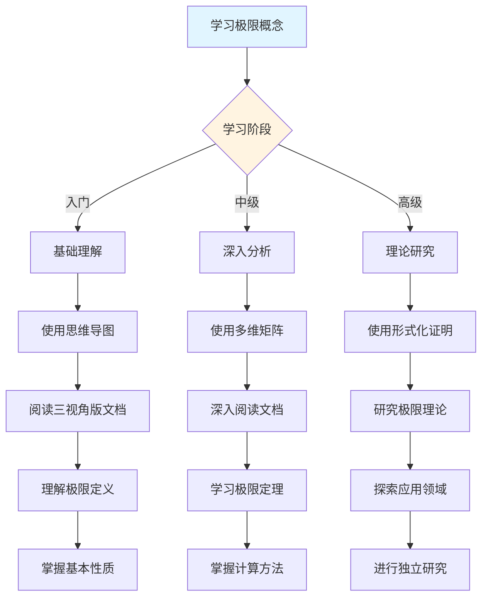
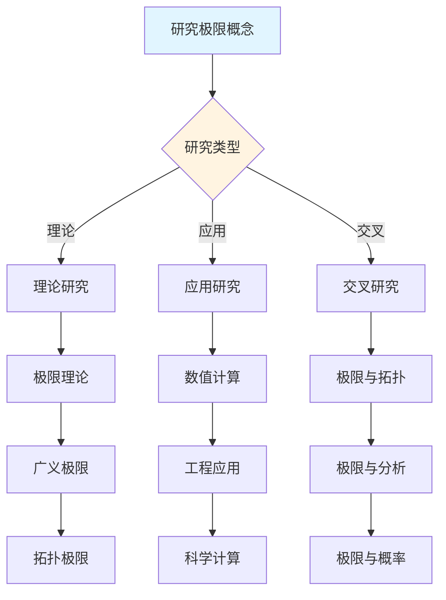
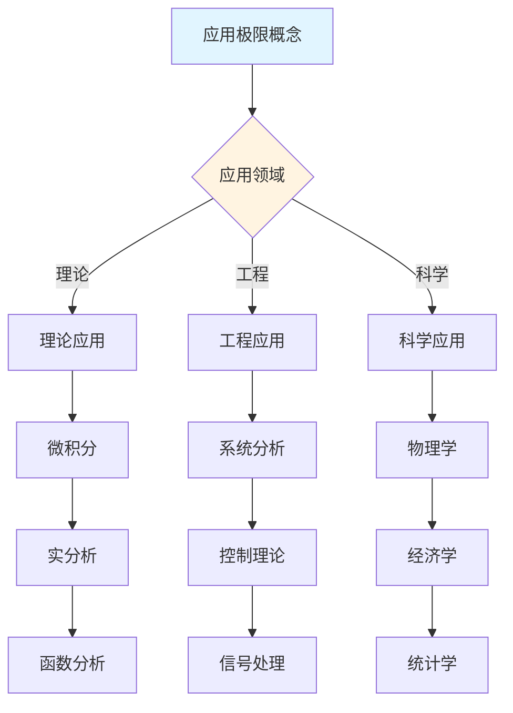
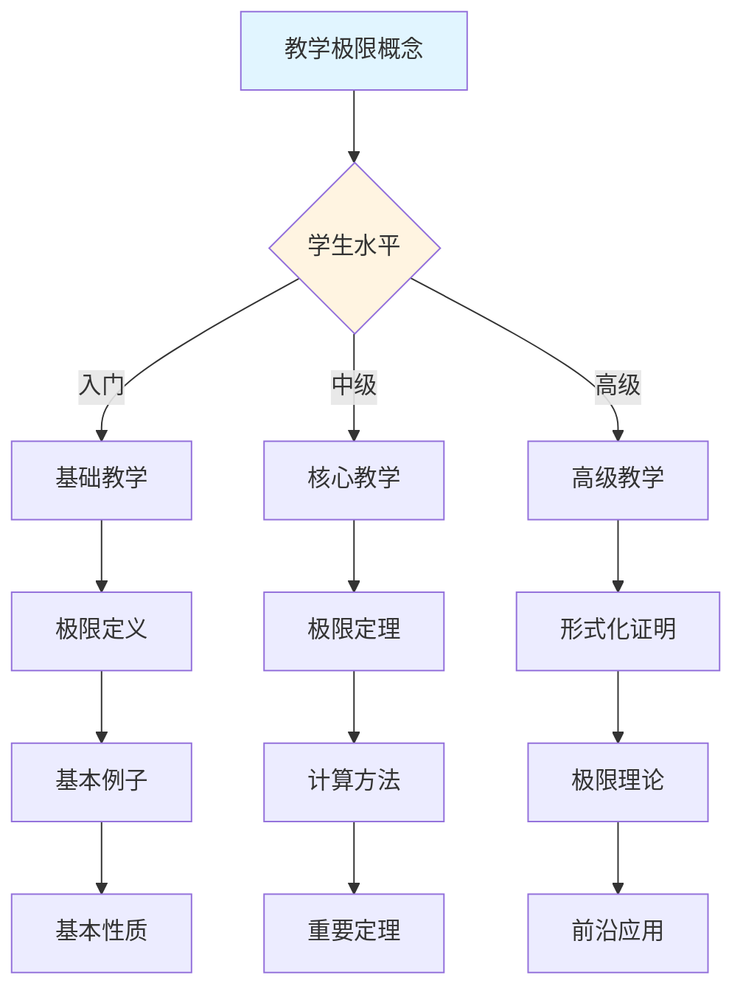

# 极限概念决策导图示例

**主题编号**: C.CORE.013.DECISION
**创建日期**: 2025年1月
**最后更新**: 2025年1月
**关联概念**: [极限-三视角版](./13-极限-三视角版.md)

---

## 📋 概述

本文档提供极限概念的详细决策导图示例，展示如何将[决策思维导图体系](../01-总体思维导图/05-决策思维导图体系.md)应用于极限概念的学习、研究、应用和教学。

**目标**：为极限概念提供完整的决策支持，包括：

- 学习决策导图
- 研究决策导图
- 应用决策导图
- 教学决策导图

---

## 🎓 一、学习决策导图 (编号: C.CORE.013.DECISION.01)

### 1.1 学习路径决策

### 1.2 学习重点决策

**基于知识矩阵的学习重点**：

| 学习阶段 | 知识层次 | 学习重点 | 推荐资源 |
|---------|---------|---------|---------|
| **入门** | L0基础 | 极限的定义、基本例子 | 思维导图、三视角版文档 |
| **入门** | L0基础 | 极限的直观理解（趋近、逼近） | 三视角版文档、应用实例 |
| **中级** | L1中级 | 极限存在性定理 | 多维矩阵、形式化证明 |
| **中级** | L1中级 | 极限运算法则 | 三视角版文档、习题库 |
| **高级** | L2高级 | 极限理论 | 形式化证明系统 |
| **高级** | L2高级 | 广义极限 | 形式化证明系统 |

### 1.3 学习方法决策

**基于认知维度的学习方法**：

1. **直观维度**（入门阶段）
   - 使用思维导图建立总体框架
   - 使用具体例子理解概念（数列极限、函数极限）
   - 使用几何直观理解极限

2. **知性维度**（中级阶段）
   - 使用多维矩阵分析概念特征
   - 使用概念分类系统理解（数列极限vs函数极限、单侧极限vs双侧极限）
   - 使用关系分析建立联系（与连续、导数、积分的关系）

3. **理性维度**（高级阶段）
   - 使用形式化证明严格理解
   - 使用逻辑推理深入分析
   - 使用系统建构整体把握

---

## 🔬 二、研究决策导图 (编号: C.CORE.013.DECISION.02)

### 2.1 研究方向决策

### 2.2 研究问题决策

**基于知识矩阵的研究问题**：

1. **理论研究问题**
   - 极限理论：极限的存在性和唯一性
   - 广义极限：广义函数、分布理论
   - 拓扑极限：拓扑空间中的极限

2. **应用研究问题**
   - 数值计算：极限的数值逼近方法
   - 工程应用：系统稳定性分析
   - 科学计算：科学计算中的极限方法

3. **交叉研究问题**
   - 极限与拓扑：拓扑空间中的极限
   - 极限与分析：复分析中的极限
   - 极限与概率：概率极限理论

### 2.3 研究方法决策

**基于形式化证明的研究方法**：

1. **ε-δ方法** → 极限的定义
   - 使用ε-δ语言严格定义
   - 适用于函数极限

2. **序列方法** → 极限的存在性
   - 使用序列收敛性
   - 适用于数列极限

3. **拓扑方法** → 广义极限
   - 使用拓扑理论
   - 适用于拓扑空间

---

## 💼 三、应用决策导图 (编号: C.CORE.013.DECISION.03)

### 3.1 应用场景决策

### 3.2 应用方法决策

**基于应用场景的应用方法**：

1. **理论应用** → 使用形式化证明
   - 微积分：连续、导数、积分的基础
   - 实分析：实数完备性
   - 函数分析：函数空间

2. **工程应用** → 使用论证过程
   - 系统分析：系统稳定性
   - 控制理论：控制系统分析
   - 信号处理：信号分析

3. **科学应用** → 使用综合方法
   - 物理学：瞬时速度、加速度
   - 经济学：边际分析
   - 统计学：大数定律

---

## 🎓 四、教学决策导图 (编号: C.CORE.013.DECISION.04)

### 4.1 教学内容决策

### 4.2 教学方法决策

**基于认知维度的教学方法**：

1. **直观维度**（入门教学）
   - 使用思维导图建立框架
   - 使用具体例子（数列极限、函数极限）
   - 使用几何直观理解

2. **知性维度**（中级教学）
   - 使用多维矩阵深入分析
   - 使用概念分类系统
   - 使用关系分析建立联系

3. **理性维度**（高级教学）
   - 使用形式化证明严格理解
   - 使用逻辑推理深入分析
   - 使用系统建构整体把握

---

## 🔄 五、整合应用示例 (编号: C.CORE.013.DECISION.05)

### 5.1 完整学习流程示例

**阶段1：入门理解**

1. 使用学习决策导图 → 确定学习路径：基础概念 → 极限定义 → 基本性质 → 基本应用
2. 使用总体思维导图 → 了解极限在分析学中的位置
3. 阅读[极限-三视角版](./13-极限-三视角版.md) → 理解极限的定义和基本性质
4. 使用论证过程 → 理解极限的直观意义（趋近、逼近、无限接近）

**阶段2：深入分析**

1. 使用多维矩阵 → 分析极限的多维度特征（知识层次L1中级层、知识领域D3分析、学习难度中等）
2. 阅读[极限-三视角版](./13-极限-三视角版.md) → 深入理解极限存在性定理和运算法则
3. 使用形式化证明 → 学习单调有界定理的形式化证明
4. 使用分支关联思维导图 → 了解极限与连续、导数、积分的关系

**阶段3：应用研究**

1. 使用研究决策导图 → 确定研究方向：极限理论
2. 使用知识关联网络 → 发现极限与拓扑、分析、概率的关系
3. 使用形式化证明系统 → 构建极限理论体系
4. 阅读[极限-三视角版](./13-极限-三视角版.md) → 了解极限的历史发展和开放问题

---

## 🔗 六、关联文档 (编号: C.CORE.013.DECISION.06)

### 6.1 核心概念文档

- [极限-三视角版](./13-极限-三视角版.md)
- [极限](./13-极限.md)

### 6.2 框架文档

- [决策思维导图体系](../01-总体思维导图/05-决策思维导图体系.md)
- [概念体系全面梳理与推进计划](../00-概念体系全面梳理与推进计划-2025年1月.md)
- [核心概念与新框架整合指南](../00-核心概念与新框架整合指南-2025年1月.md)

### 6.3 相关文档

- [核心概念索引](./00-核心概念索引.md)
- [知识矩阵总览](../02-知识矩阵/00-知识矩阵总览.md)
- [形式化证明系统](../00-形式化证明系统-2025年11月.md)

---

**创建日期**: 2025年1月
**最后更新**: 2025年1月
**维护状态**: 持续更新中
