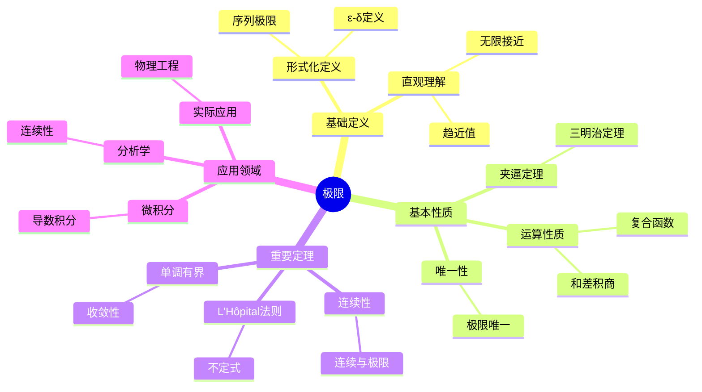
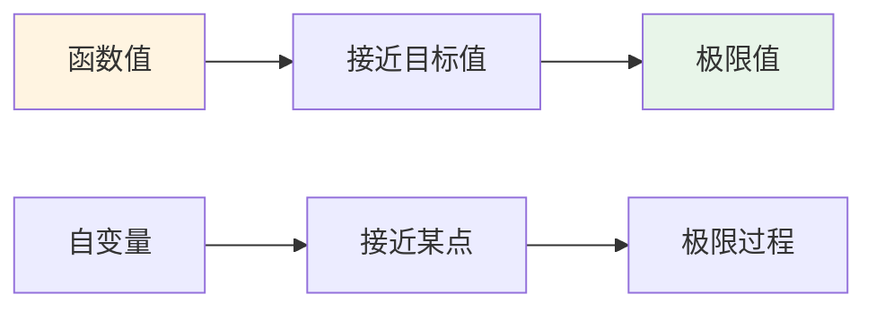
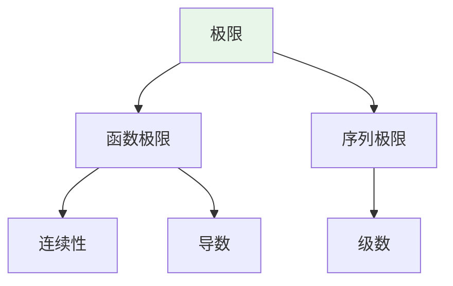
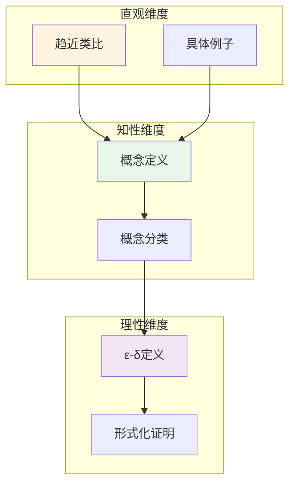

# 极限 (Limit)

**概念编号**: C.CORE.013
**知识层次**: L0-L2
**知识领域**: D3 (分析)
**创建日期**: 2025年11月21日
**最后更新**: 2025年11月21日

---

## 📑 目录

- [极限 (Limit)](#极限-limit)
  - [📑 目录](#-目录)
  - [1. 📋 概述](#1--概述)
  - [2. 🎯 严格定义](#2--严格定义)
    - [2.1 基础定义 (L0)](#21-基础定义-l0)
    - [2.2 形式化定义 (L1)](#22-形式化定义-l1)
  - [3. 📚 历史背景](#3--历史背景)
    - [3.1 发展脉络](#31-发展脉络)
    - [3.2 关键人物](#32-关键人物)
    - [3.3 重要事件](#33-重要事件)
  - [4. 🔍 性质与定理](#4--性质与定理)
    - [4.1 基本性质 (L1)](#41-基本性质-l1)
    - [4.2 重要定理 (L2)](#42-重要定理-l2)
  - [5. 🔬 形式化证明](#5--形式化证明)
    - [定理3: 单调有界定理的形式化证明](#定理3-单调有界定理的形式化证明)
  - [6. 💡 应用实例](#6--应用实例)
    - [6.1 理论应用](#61-理论应用)
    - [6.2 实际应用](#62-实际应用)
      - [应用1: 物理学 - 瞬时速度计算](#应用1-物理学---瞬时速度计算)
      - [应用2: 工程学 - 系统稳定性分析](#应用2-工程学---系统稳定性分析)
      - [应用3: 经济学 - 边际成本分析](#应用3-经济学---边际成本分析)
  - [7. 🔗 关联概念](#7--关联概念)
    - [依赖关系](#依赖关系)
    - [推广关系](#推广关系)
  - [8. 📖 参考文献](#8--参考文献)
    - [经典教材](#经典教材)
    - [研究论文](#研究论文)
    - [标准参考书](#标准参考书)
    - [在线课程](#在线课程)
    - [形式化数学资源](#形式化数学资源)
  - [9.1 🗺️ 思维导图 (编号: C.CORE.013.MIND)](#91-️-思维导图-编号-ccore013mind)
    - [极限概念思维导图](#极限概念思维导图)
  - [9.2 📊 知识多维关系矩阵 (编号: C.CORE.013.MATRIX)](#92--知识多维关系矩阵-编号-ccore013matrix)
    - [极限的多维关系矩阵](#极限的多维关系矩阵)
  - [9.3 💭 形象化解释与论证 (编号: C.CORE.013.VISUAL)](#93--形象化解释与论证-编号-ccore013visual)
    - [形象化解释](#形象化解释)
    - [认知科学视角](#认知科学视角)
  - [9.6 👨‍🏫 专家观点与论证 (编号: C.CORE.013.EXPERT)](#96--专家观点与论证-编号-ccore013expert)
    - [数学家的观点](#数学家的观点)
    - [数学教育家的观点](#数学教育家的观点)
    - [数学认知学家的观点](#数学认知学家的观点)
  - [9.7 🎨 认知维度表征 (编号: C.CORE.013.COGNITIVE)](#97--认知维度表征-编号-ccore013cognitive)
    - [直观维度表征 (编号: C.CORE.013.INTUITIVE)](#直观维度表征-编号-ccore013intuitive)
      - [形象类比](#形象类比)
      - [具体例子](#具体例子)
      - [可视化表示](#可视化表示)
      - [几何直观](#几何直观)
    - [知性维度表征 (编号: C.CORE.013.INTELLECTUAL)](#知性维度表征-编号-ccore013intellectual)
      - [概念定义](#概念定义)
      - [概念分类](#概念分类)
      - [概念关系](#概念关系)
      - [知识矩阵](#知识矩阵)
    - [理性维度表征 (编号: C.CORE.013.RATIONAL)](#理性维度表征-编号-ccore013rational)
      - [公理体系](#公理体系)
      - [形式化定义](#形式化定义)
      - [逻辑推理](#逻辑推理)
      - [证明系统](#证明系统)
    - [综合整合表征 (编号: C.CORE.013.INTEGRATED)](#综合整合表征-编号-ccore013integrated)
      - [多维度整合](#多维度整合)
      - [图形转换](#图形转换)
      - [应用示例](#应用示例)
  - [9.5 📚 习题库](#95--习题库)
    - [L0基础题（5道）](#l0基础题5道)
    - [L1中级题（6道）](#l1中级题6道)
    - [L2高级题（4道）](#l2高级题4道)

---

## 1. 📋 概述

极限是数学分析的基础概念，是微积分和连续性的核心。
极限概念将离散与连续联系起来，是现代分析学的基石。

**权威资源对齐**:

- Wikipedia: [Limit (Mathematics)](https://en.wikipedia.org/wiki/Limit_(mathematics))
- Stanford课程: Math 171 (Real Analysis)
- Princeton课程: MAT 201 (Analysis)
- MIT课程: 18.100A (Real Analysis)
- Metamath: [Limit](http://us.metamath.org/mpeuni/df-lim.html)

---

## 2. 🎯 严格定义

### 2.1 基础定义 (L0)

**直观理解**: 极限是函数或序列在某个点或无穷远处的"趋近值"。

**基本定义**: 当 $x$ 趋近于 $a$ 时，函数 $f(x)$ 的极限是 $L$，记作 $\lim_{x \to a} f(x) = L$，表示当 $x$ 充分接近 $a$ 时，$f(x)$ 可以任意接近 $L$。

**简单例子**:

- $\lim_{x \to 0} \frac{\sin x}{x} = 1$
- $\lim_{n \to \infty} \frac{1}{n} = 0$
- $\lim_{x \to 2} x^2 = 4$

### 2.2 形式化定义 (L1)

**$\varepsilon$-$\delta$ 定义**: 函数极限 $\lim_{x \to a} f(x) = L$ 定义为：

$$\forall \varepsilon > 0, \exists \delta > 0, \forall x, 0 < |x - a| < \delta \Rightarrow |f(x) - L| < \varepsilon$$

**序列极限**: 序列 $(a_n)$ 的极限 $\lim_{n \to \infty} a_n = L$ 定义为：

$$\forall \varepsilon > 0, \exists N \in \mathbb{N}, \forall n > N, |a_n - L| < \varepsilon$$

**记号**:

- $\lim_{x \to a} f(x)$: 函数在 $a$ 处的极限
- $\lim_{n \to \infty} a_n$: 序列的极限
- $\limsup$, $\liminf$: 上极限、下极限

---

## 3. 📚 历史背景

### 3.1 发展脉络

**17-18世纪**: 极限的直观使用

- **Newton (1665)**: 使用流数法，直观使用极限概念
- **Leibniz (1684)**: 使用无穷小，直观使用极限
- **Euler (1748)**: 广泛使用极限，但缺乏严格基础
- **d'Alembert (1765)**: 提出极限是微积分的基础

**19世纪**: 极限的严格化

- **Bolzano (1817)**: 研究连续性和极限，提出Bolzano-Weierstrass定理
- **Cauchy (1821)**: 在《分析教程》中给出极限的严格定义
- **Weierstrass (1872)**: 完善 $\varepsilon$-$\delta$ 定义，建立现代分析基础
- **Dedekind (1872)**: 通过实数构造严格化极限理论

**20世纪**: 极限理论的完善

- **Bourbaki (1939)**: 在集合论框架下统一极限理论
- **Robinson (1960)**: 发展非标准分析，用超实数研究极限

### 3.2 关键人物

- **Isaac Newton (1643-1727)**: 使用流数法，直观使用极限
- **Gottfried Leibniz (1646-1716)**: 使用无穷小，直观使用极限
- **Leonhard Euler (1707-1783)**: 广泛使用极限
- **Bernard Bolzano (1781-1848)**: 研究连续性和极限
- **Augustin-Louis Cauchy (1789-1857)**: 给出极限的严格定义
- **Karl Weierstrass (1815-1897)**: 完善 $\varepsilon$-$\delta$ 定义

### 3.3 重要事件

- **1665**: Newton使用流数法
- **1684**: Leibniz发表微积分论文
- **1817**: Bolzano研究连续性和极限
- **1821**: Cauchy在《分析教程》中给出极限的严格定义
- **1872**: Weierstrass完善 $\varepsilon$-$\delta$ 定义
- **1960**: Robinson发展非标准分析

---

## 4. 🔍 性质与定理

### 4.1 基本性质 (L1)

**性质1: 极限的唯一性**:

- **陈述**: 若极限存在，则唯一
- **证明思路**: 假设两个极限 $L_1$ 和 $L_2$，由三角不等式得到 $|L_1 - L_2| < \varepsilon$ 对任意 $\varepsilon$，因此 $L_1 = L_2$

**性质2: 极限的运算**:

- **和**: $\lim (f + g) = \lim f + \lim g$
- **积**: $\lim (fg) = (\lim f)(\lim g)$
- **商**: $\lim (f/g) = (\lim f)/(\lim g)$（若 $\lim g \neq 0$）

**性质3: 夹逼定理**:

- **陈述**: 若 $f(x) \leq g(x) \leq h(x)$ 且 $\lim f = \lim h = L$，则 $\lim g = L$

### 4.2 重要定理 (L2)

**定理1: 连续性与极限**:

- **陈述**: $f$ 在 $a$ 连续当且仅当 $\lim_{x \to a} f(x) = f(a)$

**定理2: L'Hôpital法则**:

- **陈述**: 若 $\lim f = \lim g = 0$（或 $\infty$），则 $\lim \frac{f}{g} = \lim \frac{f'}{g'}$

**定理3: 单调有界定理**:

- **陈述**: 单调有界序列收敛

---

## 5. 🔬 形式化证明

### 定理3: 单调有界定理的形式化证明

**定理陈述**:
$$\forall (a_n) [\text{Monotone}(a_n) \land \text{Bounded}(a_n) \to \exists L \lim_{n \to \infty} a_n = L]$$

**前提**:

- 实数的完备性
- 单调序列的性质
- 上确界的定义

**形式化证明**:

```
步骤1: 假设条件
  设: (a_n)单调递增有上界
  即: forall n, a_n <= a_{n+1} and exists M, forall n, a_n <= M

步骤2: 上确界存在
  定义: L = sup{a_n : n in N}
  存在性: 由实数完备性，L存在

步骤3: 证明收敛
  对任意epsilon > 0:
    存在N使得 a_N > L - epsilon  (上确界性质)
    对n >= N: L - epsilon < a_N <= a_n <= L < L + epsilon
    因此: |a_n - L| < epsilon
  因此: lim_{n->infty} a_n = L

步骤4: 单调递减情况
  若(a_n)单调递减有下界，类似证明收敛到下确界

步骤5: 结论
  因此: [Monotone(a_n) and Bounded(a_n)] -> exists L, lim a_n = L
```

**Metamath格式参考**:

```
${
  monotone.1 $e |- (a_n) e. Seq $.
  monotone.2 $e |- Monotone(a_n) $.
  monotone.3 $e |- Bounded(a_n) $.
  monotone $p |- exists L, lim a_n = L $=
    ( ... ) ABCDEFG $.
$}
```

---

## 6. 💡 应用实例

### 6.1 理论应用

- 微积分（导数、积分的基础）
- 实分析（连续性、可微性）
- 复分析（复函数的极限）

### 6.2 实际应用

#### 应用1: 物理学 - 瞬时速度计算

**问题描述**:
物体沿直线运动，位置函数为 $s(t) = t^2$（米），求 $t = 2$ 秒时的瞬时速度。

**数学建模**:
瞬时速度是位置对时间的导数，定义为：$v(t) = \lim_{h \to 0} \frac{s(t+h) - s(t)}{h}$

**计算过程**:

- $v(2) = \lim_{h \to 0} \frac{s(2+h) - s(2)}{h}$
- $= \lim_{h \to 0} \frac{(2+h)^2 - 4}{h}$
- $= \lim_{h \to 0} \frac{4 + 4h + h^2 - 4}{h}$
- $= \lim_{h \to 0} \frac{4h + h^2}{h}$
- $= \lim_{h \to 0} (4 + h) = 4$ 米/秒

**结果解释**:
在 $t = 2$ 秒时，物体的瞬时速度为 4 米/秒。这使用了极限的定义。

**数据**:

- 时间: 2秒
- 位置: $s(2) = 4$ 米
- 瞬时速度: 4 米/秒

#### 应用2: 工程学 - 系统稳定性分析

**问题描述**:
控制系统传递函数为 $G(s) = \frac{1}{s+1}$，分析系统在 $s \to 0$ 时的稳态响应。

**数学建模**:
稳态响应是传递函数在 $s \to 0$ 时的极限：$\lim_{s \to 0} G(s)$

**计算过程**:

- $\lim_{s \to 0} G(s) = \lim_{s \to 0} \frac{1}{s+1} = \frac{1}{0+1} = 1$

**结果解释**:
系统在稳态时的增益为1，系统稳定。

**数据**:

- 传递函数: $G(s) = \frac{1}{s+1}$
- 稳态增益: 1
- 系统稳定性: 稳定

#### 应用3: 经济学 - 边际成本分析

**问题描述**:
某公司的成本函数为 $C(x) = 1000 + 50x^2$（$x$ 为产量），求产量趋于无穷时的平均成本。

**数学建模**:
平均成本为：$\text{AC}(x) = \frac{C(x)}{x}$，边际成本为：$\text{MC}(x) = \lim_{h \to 0} \frac{C(x+h) - C(x)}{h}$

**计算过程**:

- $\text{AC}(x) = \frac{1000 + 50x^2}{x} = \frac{1000}{x} + 50x$
- $\lim_{x \to \infty} \text{AC}(x) = \lim_{x \to \infty} \left(\frac{1000}{x} + 50x\right) = \infty$
- $\text{MC}(x) = C'(x) = 100x$

**结果解释**:
当产量趋于无穷时，平均成本趋于无穷，边际成本为 $100x$。

**数据**:

- 成本函数: $C(x) = 1000 + 50x^2$
- 平均成本: $\text{AC}(x) = \frac{1000}{x} + 50x$
- 边际成本: $\text{MC}(x) = 100x$

---

## 7. 🔗 关联概念

### 依赖关系

- 实数（极限在实数中定义）
- 函数（函数极限）
- 序列（序列极限）

### 推广关系

- 单侧极限（左极限、右极限）
- 无穷极限（$\lim_{x \to \infty} f(x)$）
- 上极限、下极限

---

## 8. 📖 参考文献

### 经典教材

1. **Rudin, W. (1976). *Principles of Mathematical Analysis* (3rd ed.). McGraw-Hill.**
   - **内容**: 数学分析的经典教材，严格处理极限理论
   - **适用层次**: L1-L3
   - **特点**: 严谨清晰，适合深入学习

2. **Apostol, T. M. (1974). *Mathematical Analysis: A Modern Approach to Advanced Calculus* (2nd ed.). Addison-Wesley.**
   - **内容**: 数学分析的现代处理，强调几何直观
   - **适用层次**: L1-L2
   - **特点**: 直观易懂，包含大量应用

3. **Spivak, M. (2008). *Calculus* (4th ed.). Publish or Perish.**
   - **内容**: 微积分的经典教材，深入讨论极限
   - **适用层次**: L0-L2
   - **特点**: 强调严格性和直观性

### 研究论文

1. **Cauchy, A.-L. (1821). *Cours d'analyse de l'École Royale Polytechnique*. De l'Imprimerie Royale.**
   - **内容**: 给出极限的严格定义
   - **重要性**: 极限理论严格化的开始

2. **Weierstrass, K. (1872). Über continuirliche Functionen eines reellen Arguments, die für keinen Werth des letzteren einen bestimmten Differentialquotienten besitzen. *Königliche Akademie der Wissenschaften*, 71-74.**
   - **内容**: 完善$\varepsilon$-$\delta$定义
   - **重要性**: 现代极限理论的基础

3. **Bolzano, B. (1817). Rein analytischer Beweis des Lehrsatzes, dass zwischen je zwey Werthen, die ein entgegengesetztes Resultat gewähren, wenigstens eine reelle Wurzel der Gleichung liege. *Prag: Gottlieb Haase Söhne*.**
   - **内容**: 研究连续性和极限
   - **重要性**: 极限理论的早期工作

### 标准参考书

1. **Wikipedia contributors. (2024). Limit (mathematics). In *Wikipedia, The Free Encyclopedia*. Retrieved from <https://en.wikipedia.org/wiki/Limit_(mathematics)>**
   - **内容**: 极限概念的全面介绍
   - **特点**: 易于访问，包含大量示例

2. **Wikipedia contributors. (2024). Limit of a function. In *Wikipedia, The Free Encyclopedia*. Retrieved from <https://en.wikipedia.org/wiki/Limit_of_a_function>**
   - **内容**: 函数极限的详细介绍
   - **特点**: 包含$\varepsilon$-$\delta$定义和示例

### 在线课程

1. **MIT OpenCourseWare. (2024). 18.01 Single Variable Calculus. Retrieved from <https://ocw.mit.edu/>**
   - **内容**: 单变量微积分课程，深入讨论极限
   - **特点**: 免费公开课程

2. **Khan Academy. (2024). Limits and Continuity. Retrieved from <https://www.khanacademy.org/>**
   - **内容**: 极限和连续性的在线课程
   - **特点**: 适合初学者

### 形式化数学资源

1. **Metamath contributors. (2024). Limits. In *Metamath Proof Explorer*. Retrieved from <http://us.metamath.org/mpeuni/df-lim.html>**
   - **内容**: 极限的形式化证明
   - **特点**: 完全形式化的证明系统

---

## 9.1 🗺️ 思维导图 (编号: C.CORE.013.MIND)

### 极限概念思维导图



---

## 9.2 📊 知识多维关系矩阵 (编号: C.CORE.013.MATRIX)

### 极限的多维关系矩阵

| 维度 | 指标 | 极限 |
|------|------|------|
| **知识层次** | L0基础 | ⭐⭐⭐⭐ |
| | L1中级 | ⭐⭐⭐⭐⭐ |
| | L2高级 | ⭐⭐⭐⭐ |
| | L3研究 | ⭐⭐ |
| **知识领域** | D1基础数学 | ⭐⭐⭐ |
| | D2代数 | ⭐⭐ |
| | D3分析 | ⭐⭐⭐⭐⭐ |
| | D4几何 | ⭐⭐⭐ |
| | D5拓扑 | ⭐⭐⭐ |
| **依赖关系** | 前置概念 | 实数、函数 |
| | 后续概念 | 连续、导数、积分 |
| **应用关系** | 理论应用 | ⭐⭐⭐⭐⭐ |
| | 实际应用 | ⭐⭐⭐⭐ |
| | 交叉应用 | ⭐⭐⭐ |
| **学习难度** | 直观理解 | ⭐⭐⭐ |
| | 形式化理解 | ⭐⭐⭐⭐ |
| | 深入应用 | ⭐⭐⭐ |

---

## 9.3 💭 形象化解释与论证 (编号: C.CORE.013.VISUAL)

### 形象化解释

**1. 极限的直观理解**

- **类比**: 极限就像"无限接近但永远达不到"的过程
- **例子**:
  - 一个人走向墙壁，每一步走剩余距离的一半，永远走不到墙
  - 温度逐渐降低，接近绝对零度但永远达不到

**2. ε-δ定义的直观理解**

- **类比**: ε-δ定义就像"精度控制"
- **解释**:
  - ε是"允许的误差范围"
  - δ是"输入需要多接近"
  - 当输入足够接近时，输出在误差范围内

**3. 夹逼定理的直观理解**

- **类比**: 夹逼定理就像"三明治"
- **例子**:
  - 如果两个面包片夹住一个肉片，当面包片靠近时，肉片也被夹紧

### 认知科学视角

**1. 数学教育家Dienes的观点**

- **多表征原则**: 通过数值、图形、符号等多种方式理解极限
- **变化性原则**: 通过不同的极限例子理解极限的本质
- **教学启示**: 使用数值逼近、图形可视化、符号证明等多种方法

**2. 数学认知学家Tall的观点**

- **过程-对象对偶**: 理解"极限过程"（如何趋近）和"极限值"（极限本身）
- **认知层次**: 从直观理解（"接近"）到形式化理解（ε-δ定义）

---

## 9.6 👨‍🏫 专家观点与论证 (编号: C.CORE.013.EXPERT)

### 数学家的观点

**1. Augustin-Louis Cauchy (1789-1857) - 极限严格化的奠基者**
> "极限是分析学的基础，必须严格定义。"
>
> **意义**: Cauchy给出了极限的严格定义，奠定了现代分析学的基础。

**2. Karl Weierstrass (1815-1897) - ε-δ定义的完善者**
> "ε-δ定义是理解极限的关键，它消除了直观中的模糊性。"
>
> **意义**: Weierstrass完善了ε-δ定义，使极限概念完全严格化。

### 数学教育家的观点

**1. Zoltan Dienes (1916-2014) - 数学教育家**
> "极限概念应该通过数值逼近、图形可视化、符号证明等多种方式学习。"
>
> **教学启示**:
>
> - 使用数值计算展示极限过程
> - 使用函数图像可视化极限
> - 逐步引入ε-δ定义

**2. Hans Freudenthal (1905-1990) - 数学教育家**
> "极限概念的学习需要从'直观理解'发展到'形式化理解'。"
>
> **认知发展**:
>
> - **直观阶段**: 理解"接近"的概念
> - **形式化阶段**: 理解ε-δ定义

### 数学认知学家的观点

**1. David Tall - 数学认知学家**
> "极限概念的理解需要从'过程'（如何趋近）发展到'对象'（极限值）。"
>
> **认知层次**:
>
> - **过程层次**: 理解"如何计算极限"（如$\lim_{x \to 0} \frac{\sin x}{x}$）
> - **对象层次**: 理解"极限值"（如$\lim_{x \to 0} \frac{\sin x}{x} = 1$）

---

## 9.7 🎨 认知维度表征 (编号: C.CORE.013.COGNITIVE)

### 直观维度表征 (编号: C.CORE.013.INTUITIVE)

#### 形象类比

- **趋近类比**: 极限就像"无限接近但永远达不到"
  - 就像一个人走向一堵墙，越来越近但永远碰不到
  - 就像温度计读数接近某个值但可能永远达不到

- **过程类比**: 极限就像"过程的终点"
  - 就像数列的"最终值"
  - 就像函数图像的"趋势"

#### 具体例子

- **例子1**: $\lim_{x \to 0} \frac{\sin x}{x} = 1$
  - 当$x$接近0时，$\frac{\sin x}{x}$接近1
  - 可以通过数值计算验证：$x=0.1$时约为$0.998$，$x=0.01$时约为$0.9998$

- **例子2**: $\lim_{n \to \infty} \frac{1}{n} = 0$
  - 当$n$越来越大时，$\frac{1}{n}$越来越小，最终接近0
  - 序列：$1, 0.5, 0.33, 0.25, 0.2, \ldots$

#### 可视化表示



#### 几何直观

- **函数图像**: 通过函数图像理解极限
  - 当$x$接近$a$时，函数值接近$L$
  - 图像上的点越来越接近$(a, L)$

- **数值序列**: 通过数值序列理解极限
  - 序列的值越来越接近某个数
  - 可以通过数值计算观察趋势

---

### 知性维度表征 (编号: C.CORE.013.INTELLECTUAL)

#### 概念定义

- **严格定义**: 函数极限 $\lim_{x \to a} f(x) = L$ 定义为：$\forall \varepsilon > 0, \exists \delta > 0, \forall x, 0 < |x - a| < \delta \Rightarrow |f(x) - L| < \varepsilon$
- **等价定义**: 序列极限、上极限、下极限
- **特征描述**: 极限是函数或序列的"趋近值"

#### 概念分类

- **函数极限 vs 序列极限**: 按对象类型分类
- **有限极限 vs 无穷极限**: 按极限值分类
- **单侧极限 vs 双侧极限**: 按趋近方向分类

#### 概念关系



#### 知识矩阵

| 维度 | 指标 | 极限 |
|------|------|------|
| **知识层次** | L0基础 | ⭐⭐⭐⭐ |
| | L1中级 | ⭐⭐⭐⭐⭐ |
| | L2高级 | ⭐⭐⭐⭐ |
| **知识领域** | D3分析 | ⭐⭐⭐⭐⭐ |
| **学习难度** | 直观理解 | ⭐⭐⭐ |
| | 形式化理解 | ⭐⭐⭐⭐⭐ |
| **认知维度** | 直观维度 | ⭐⭐⭐⭐ |
| | 知性维度 | ⭐⭐⭐⭐⭐ |
| | 理性维度 | ⭐⭐⭐⭐⭐ |

---

### 理性维度表征 (编号: C.CORE.013.RATIONAL)

#### 公理体系

- **ε-δ定义**: $\forall \varepsilon > 0, \exists \delta > 0, \forall x, 0 < |x - a| < \delta \Rightarrow |f(x) - L| < \varepsilon$
- **序列极限定义**: $\forall \varepsilon > 0, \exists N \in \mathbb{N}, \forall n > N, |a_n - L| < \varepsilon$
- **上极限/下极限**: 通过上确界和下确界定义

#### 形式化定义

- **形式化定义**: 使用一阶逻辑严格定义
- **符号系统**: $\lim$, $\limsup$, $\liminf$
- **类型系统**: 极限是函数类型到数值类型的映射

#### 逻辑推理

- **基本定理**: 极限的唯一性、极限的运算性质
- **证明思路**: 使用ε-δ方法证明
- **推理链**: 定义 → 唯一性 → 运算性质 → 连续性

#### 证明系统

- **证明方法**: ε-δ方法、夹逼定理、单调有界定理
- **形式化证明**: 可以使用Lean4等工具进行形式化
- **验证工具**: Metamath、Lean4等

---

### 综合整合表征 (编号: C.CORE.013.INTEGRATED)

#### 多维度整合



#### 图形转换

- **思维导图**: 展示极限的知识结构
- **知识图谱**: 展示极限与其他概念的关系
- **知识矩阵**: 展示极限的多维度特征

#### 应用示例

- **应用1**: 连续性的定义依赖于极限
- **应用2**: 导数的定义依赖于极限
- **应用3**: 积分的定义依赖于极限

---

## 9.5 📚 习题库

### L0基础题（5道）

**EX.CORE.013.01** (L0, 计算)

- **题目**: 计算：$\lim_{x \to 2} (3x + 1)$。
- **答案**: $\lim_{x \to 2} (3x + 1) = 3 \times 2 + 1 = 7$。

**EX.CORE.013.02** (L0, 计算)

- **题目**: 计算：$\lim_{x \to 0} \frac{\sin x}{x}$。
- **提示**: 使用重要极限。
- **答案**: $\lim_{x \to 0} \frac{\sin x}{x} = 1$。

**EX.CORE.013.03** (L0, 概念理解)

- **题目**: 用 $\varepsilon$-$\delta$ 语言表述：$\lim_{x \to 1} x^2 = 1$。
- **答案**: 对任意 $\varepsilon > 0$，存在 $\delta > 0$，使得当 $0 < |x - 1| < \delta$ 时，$|x^2 - 1| < \varepsilon$。

**EX.CORE.013.04** (L0, 计算)

- **题目**: 计算：$\lim_{x \to \infty} \frac{1}{x}$。
- **答案**: $\lim_{x \to \infty} \frac{1}{x} = 0$。

**EX.CORE.013.05** (L0, 应用)

- **题目**: 判断：$\lim_{x \to 0} \frac{1}{x}$ 是否存在。
- **答案**: 不存在（左右极限不相等：$\lim_{x \to 0^+} \frac{1}{x} = +\infty$，$\lim_{x \to 0^-} \frac{1}{x} = -\infty$）。

### L1中级题（6道）

**EX.CORE.013.06** (L1, 证明)

- **题目**: 用 $\varepsilon$-$\delta$ 方法证明：$\lim_{x \to 2} x^2 = 4$。
- **提示**: 设 $\delta = \min(1, \varepsilon/5)$。
- **答案**: 对任意 $\varepsilon > 0$，取 $\delta = \min(1, \varepsilon/5)$。当 $0 < |x - 2| < \delta$ 时，$|x^2 - 4| = |x - 2||x + 2| < \delta \cdot 5 < \varepsilon$。

**EX.CORE.013.07** (L1, 证明)

- **题目**: 证明：若 $\lim_{x \to a} f(x) = L$ 且 $\lim_{x \to a} g(x) = M$，则 $\lim_{x \to a} (f(x) + g(x)) = L + M$。
- **提示**: 使用三角不等式。
- **答案**: 对任意 $\varepsilon > 0$，存在 $\delta_1, \delta_2 > 0$ 使得当 $0 < |x - a| < \delta_1$ 时 $|f(x) - L| < \varepsilon/2$，当 $0 < |x - a| < \delta_2$ 时 $|g(x) - M| < \varepsilon/2$。取 $\delta = \min(\delta_1, \delta_2)$，则当 $0 < |x - a| < \delta$ 时，$|(f(x) + g(x)) - (L + M)| \leq |f(x) - L| + |g(x) - M| < \varepsilon$。

**EX.CORE.013.08** (L1, 计算)

- **题目**: 计算：$\lim_{x \to 0} \frac{e^x - 1}{x}$。
- **提示**: 使用L'Hôpital法则或Taylor展开。
- **答案**: $\lim_{x \to 0} \frac{e^x - 1}{x} = 1$（使用L'Hôpital法则或 $e^x = 1 + x + o(x)$）。

**EX.CORE.013.09** (L1, 证明)

- **题目**: 证明夹逼定理：若 $f(x) \leq g(x) \leq h(x)$ 且 $\lim_{x \to a} f(x) = \lim_{x \to a} h(x) = L$，则 $\lim_{x \to a} g(x) = L$。
- **提示**: 使用极限的定义。
- **答案**: 对任意 $\varepsilon > 0$，存在 $\delta > 0$ 使得当 $0 < |x - a| < \delta$ 时，$L - \varepsilon < f(x) \leq g(x) \leq h(x) < L + \varepsilon$，因此 $|g(x) - L| < \varepsilon$。

**EX.CORE.013.10** (L1, 计算)

- **题目**: 计算：$\lim_{n \to \infty} \frac{n^2 + 3n}{2n^2 + 1}$。
- **答案**: $\lim_{n \to \infty} \frac{n^2 + 3n}{2n^2 + 1} = \lim_{n \to \infty} \frac{1 + 3/n}{2 + 1/n^2} = \frac{1}{2}$。

**EX.CORE.013.11** (L1, 应用)

- **题目**: 证明：$\lim_{x \to 0} \frac{\sin x}{x} = 1$（不使用L'Hôpital法则）。
- **提示**: 使用单位圆和面积比较。
- **答案**: 在单位圆中，当 $0 < x < \pi/2$ 时，$\sin x < x < \tan x$，因此 $\cos x < \frac{\sin x}{x} < 1$。由夹逼定理和 $\lim_{x \to 0} \cos x = 1$，得到 $\lim_{x \to 0} \frac{\sin x}{x} = 1$。

### L2高级题（4道）

**EX.CORE.013.12** (L2, 证明)

- **题目**: 证明：函数 $f$ 在 $a$ 处有极限当且仅当对任意序列 $(x_n)$ 满足 $x_n \to a$（$x_n \neq a$），有 $f(x_n) \to L$。
- **提示**: 证明两个方向。
- **答案**: （必要性）若 $\lim_{x \to a} f(x) = L$，则对任意序列 $(x_n) \to a$，由极限定义得到 $f(x_n) \to L$。（充分性）若对任意序列都有 $f(x_n) \to L$，假设 $\lim_{x \to a} f(x) \neq L$，则存在序列 $(x_n) \to a$ 使得 $f(x_n) \not\to L$，矛盾。

**EX.CORE.013.13** (L2, 证明)

- **题目**: 证明：若 $\lim_{x \to a} f(x) = L$ 且 $L > 0$，则存在 $\delta > 0$ 使得当 $0 < |x - a| < \delta$ 时，$f(x) > 0$。
- **提示**: 取 $\varepsilon = L/2$。
- **答案**: 取 $\varepsilon = L/2$，存在 $\delta > 0$ 使得当 $0 < |x - a| < \delta$ 时，$|f(x) - L| < L/2$，因此 $f(x) > L/2 > 0$。

**EX.CORE.013.14** (L2, 综合)

- **题目**: 证明：若 $f$ 在 $a$ 处有极限，则 $f$ 在 $a$ 的某个邻域内有界。
- **提示**: 使用极限的定义。
- **答案**: 设 $\lim_{x \to a} f(x) = L$，取 $\varepsilon = 1$，存在 $\delta > 0$ 使得当 $0 < |x - a| < \delta$ 时，$|f(x) - L| < 1$，因此 $|f(x)| < |L| + 1$，所以 $f$ 在 $(a - \delta, a + \delta) \setminus \{a\}$ 上有界。

**EX.CORE.013.15** (L2, 证明)

- **题目**: 证明：$\lim_{x \to 0} x \sin \frac{1}{x} = 0$。
- **提示**: 使用夹逼定理。
- **答案**: 由于 $-|x| \leq x \sin \frac{1}{x} \leq |x|$ 且 $\lim_{x \to 0} |x| = 0$，由夹逼定理得到 $\lim_{x \to 0} x \sin \frac{1}{x} = 0$。

---

**创建日期**: 2025年11月21日
**最后更新**: 2025年1月（与新框架整合）

**关联文档**：

- [极限-三视角版](./13-极限-三视角版.md) ⭐ 三视角版本
- [极限-决策导图示例](./13-极限-决策导图示例-2025年1月.md) ⭐ 最新 - 决策导图示例
- [概念体系全面梳理与推进计划](../00-概念体系全面梳理与推进计划-2025年1月.md) ⭐ 最新
- [核心概念与新框架整合指南](../00-核心概念与新框架整合指南-2025年1月.md) ⭐ 最新

**维护状态**: 持续更新中
