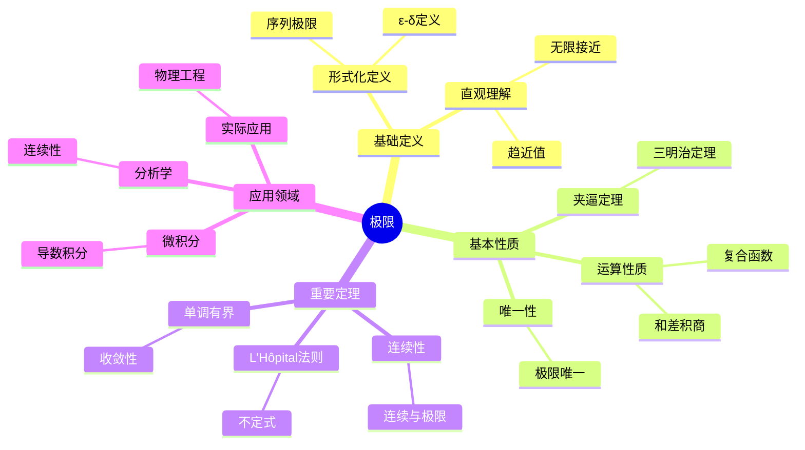

# 极限 (Limit)

**概念编号**: C.CORE.013
**知识层次**: L0-L2
**知识领域**: D3 (分析)
**创建日期**: 2025年11月21日
**最后更新**: 2025年11月21日

---

## 📋 概述

极限是数学分析的基础概念，是微积分和连续性的核心。极限概念将离散与连续联系起来，是现代分析学的基石。

**权威资源对齐**:

- Wikipedia: [Limit (Mathematics)](https://en.wikipedia.org/wiki/Limit_(mathematics))
- Stanford课程: Math 171 (Real Analysis)
- Princeton课程: MAT 201 (Analysis)
- MIT课程: 18.100A (Real Analysis)
- Metamath: [Limit](http://us.metamath.org/mpeuni/df-lim.html)

---

## 🎯 严格定义

### 基础定义 (L0)

**直观理解**: 极限是函数或序列在某个点或无穷远处的"趋近值"。

**基本定义**: 当 $x$ 趋近于 $a$ 时，函数 $f(x)$ 的极限是 $L$，记作 $\lim_{x \to a} f(x) = L$，表示当 $x$ 充分接近 $a$ 时，$f(x)$ 可以任意接近 $L$。

**简单例子**:

- $\lim_{x \to 0} \frac{\sin x}{x} = 1$
- $\lim_{n \to \infty} \frac{1}{n} = 0$
- $\lim_{x \to 2} x^2 = 4$

### 形式化定义 (L1)

**$\varepsilon$-$\delta$ 定义**: 函数极限 $\lim_{x \to a} f(x) = L$ 定义为：

$$\forall \varepsilon > 0, \exists \delta > 0, \forall x, 0 < |x - a| < \delta \Rightarrow |f(x) - L| < \varepsilon$$

**序列极限**: 序列 $(a_n)$ 的极限 $\lim_{n \to \infty} a_n = L$ 定义为：

$$\forall \varepsilon > 0, \exists N \in \mathbb{N}, \forall n > N, |a_n - L| < \varepsilon$$

**记号**:

- $\lim_{x \to a} f(x)$: 函数在 $a$ 处的极限
- $\lim_{n \to \infty} a_n$: 序列的极限
- $\limsup$, $\liminf$: 上极限、下极限

---

## 📚 历史背景

### 发展脉络

**17-18世纪**: 极限的直观使用

- **Newton (1665)**: 使用流数法，直观使用极限
- **Leibniz (1684)**: 使用无穷小，直观使用极限
- **Euler (1748)**: 广泛使用极限，但缺乏严格基础

**19世纪**: 极限的严格化

- **Cauchy (1821)**: 给出极限的严格定义
- **Weierstrass (1872)**: 完善 $\varepsilon$-$\delta$ 定义
- **Bolzano (1817)**: 研究连续性和极限

### 关键人物

- **Augustin-Louis Cauchy (1789-1857)**: 给出极限的严格定义
- **Karl Weierstrass (1815-1897)**: 完善 $\varepsilon$-$\delta$ 定义
- **Bernard Bolzano (1781-1848)**: 研究连续性和极限

---

## 🔍 性质与定理

### 基本性质 (L1)

**性质1: 极限的唯一性**:

- **陈述**: 若极限存在，则唯一
- **证明思路**: 假设两个极限 $L_1$ 和 $L_2$，由三角不等式得到 $|L_1 - L_2| < \varepsilon$ 对任意 $\varepsilon$，因此 $L_1 = L_2$

**性质2: 极限的运算**:

- **和**: $\lim (f + g) = \lim f + \lim g$
- **积**: $\lim (fg) = (\lim f)(\lim g)$
- **商**: $\lim (f/g) = (\lim f)/(\lim g)$（若 $\lim g \neq 0$）

**性质3: 夹逼定理**:

- **陈述**: 若 $f(x) \leq g(x) \leq h(x)$ 且 $\lim f = \lim h = L$，则 $\lim g = L$

### 重要定理 (L2)

**定理1: 连续性与极限**:

- **陈述**: $f$ 在 $a$ 连续当且仅当 $\lim_{x \to a} f(x) = f(a)$

**定理2: L'Hôpital法则**:

- **陈述**: 若 $\lim f = \lim g = 0$（或 $\infty$），则 $\lim \frac{f}{g} = \lim \frac{f'}{g'}$

**定理3: 单调有界定理**:

- **陈述**: 单调有界序列收敛

---

## 💡 应用实例

### 理论应用

- 微积分（导数、积分的基础）
- 实分析（连续性、可微性）
- 复分析（复函数的极限）

### 实际应用

- 物理学（瞬时速度、加速度）
- 工程学（系统稳定性）
- 经济学（边际分析）

---

## 🔗 关联概念

### 依赖关系

- 实数（极限在实数中定义）
- 函数（函数极限）
- 序列（序列极限）

### 推广关系

- 单侧极限（左极限、右极限）
- 无穷极限（$\lim_{x \to \infty} f(x)$）
- 上极限、下极限

---

## 📖 参考文献

- Wikipedia: [Limit (Mathematics)](https://en.wikipedia.org/wiki/Limit_(mathematics))
- Rudin, W. (1976). *Principles of Mathematical Analysis*. McGraw-Hill.
- Apostol, T. M. (1974). *Mathematical Analysis*. Addison-Wesley.

---

## 🗺️ 思维导图 (编号: C.CORE.013.MIND)

### 极限概念思维导图

---

## 📊 知识多维关系矩阵 (编号: C.CORE.013.MATRIX)

### 极限的多维关系矩阵

| 维度 | 指标 | 极限 |
|------|------|------|
| **知识层次** | L0基础 | ⭐⭐⭐⭐ |
| | L1中级 | ⭐⭐⭐⭐⭐ |
| | L2高级 | ⭐⭐⭐⭐ |
| | L3研究 | ⭐⭐ |
| **知识领域** | D1基础数学 | ⭐⭐⭐ |
| | D2代数 | ⭐⭐ |
| | D3分析 | ⭐⭐⭐⭐⭐ |
| | D4几何 | ⭐⭐⭐ |
| | D5拓扑 | ⭐⭐⭐ |
| **依赖关系** | 前置概念 | 实数、函数 |
| | 后续概念 | 连续、导数、积分 |
| **应用关系** | 理论应用 | ⭐⭐⭐⭐⭐ |
| | 实际应用 | ⭐⭐⭐⭐ |
| | 交叉应用 | ⭐⭐⭐ |
| **学习难度** | 直观理解 | ⭐⭐⭐ |
| | 形式化理解 | ⭐⭐⭐⭐ |
| | 深入应用 | ⭐⭐⭐ |

---

## 💭 形象化解释与论证 (编号: C.CORE.013.VISUAL)

### 形象化解释

**1. 极限的直观理解**

- **类比**: 极限就像"无限接近但永远达不到"的过程
- **例子**:
  - 一个人走向墙壁，每一步走剩余距离的一半，永远走不到墙
  - 温度逐渐降低，接近绝对零度但永远达不到

**2. ε-δ定义的直观理解**

- **类比**: ε-δ定义就像"精度控制"
- **解释**:
  - ε是"允许的误差范围"
  - δ是"输入需要多接近"
  - 当输入足够接近时，输出在误差范围内

**3. 夹逼定理的直观理解**

- **类比**: 夹逼定理就像"三明治"
- **例子**:
  - 如果两个面包片夹住一个肉片，当面包片靠近时，肉片也被夹紧

### 认知科学视角

**1. 数学教育家Dienes的观点**

- **多表征原则**: 通过数值、图形、符号等多种方式理解极限
- **变化性原则**: 通过不同的极限例子理解极限的本质
- **教学启示**: 使用数值逼近、图形可视化、符号证明等多种方法

**2. 数学认知学家Tall的观点**

- **过程-对象对偶**: 理解"极限过程"（如何趋近）和"极限值"（极限本身）
- **认知层次**: 从直观理解（"接近"）到形式化理解（ε-δ定义）

---

## 👨‍🏫 专家观点与论证 (编号: C.CORE.013.EXPERT)

### 数学家的观点

**1. Augustin-Louis Cauchy (1789-1857) - 极限严格化的奠基者**
> "极限是分析学的基础，必须严格定义。"
>
> **意义**: Cauchy给出了极限的严格定义，奠定了现代分析学的基础。

**2. Karl Weierstrass (1815-1897) - ε-δ定义的完善者**
> "ε-δ定义是理解极限的关键，它消除了直观中的模糊性。"
>
> **意义**: Weierstrass完善了ε-δ定义，使极限概念完全严格化。

### 数学教育家的观点

**1. Zoltan Dienes (1916-2014) - 数学教育家**
> "极限概念应该通过数值逼近、图形可视化、符号证明等多种方式学习。"
>
> **教学启示**:
>
> - 使用数值计算展示极限过程
> - 使用函数图像可视化极限
> - 逐步引入ε-δ定义

**2. Hans Freudenthal (1905-1990) - 数学教育家**
> "极限概念的学习需要从'直观理解'发展到'形式化理解'。"
>
> **认知发展**:
>
> - **直观阶段**: 理解"接近"的概念
> - **形式化阶段**: 理解ε-δ定义

### 数学认知学家的观点

**1. David Tall - 数学认知学家**
> "极限概念的理解需要从'过程'（如何趋近）发展到'对象'（极限值）。"
>
> **认知层次**:
>
> - **过程层次**: 理解"如何计算极限"（如$\lim_{x \to 0} \frac{\sin x}{x}$）
> - **对象层次**: 理解"极限值"（如$\lim_{x \to 0} \frac{\sin x}{x} = 1$）

---

**创建日期**: 2025年11月21日
**最后更新**: 2025年11月21日
**维护状态**: 持续更新中
