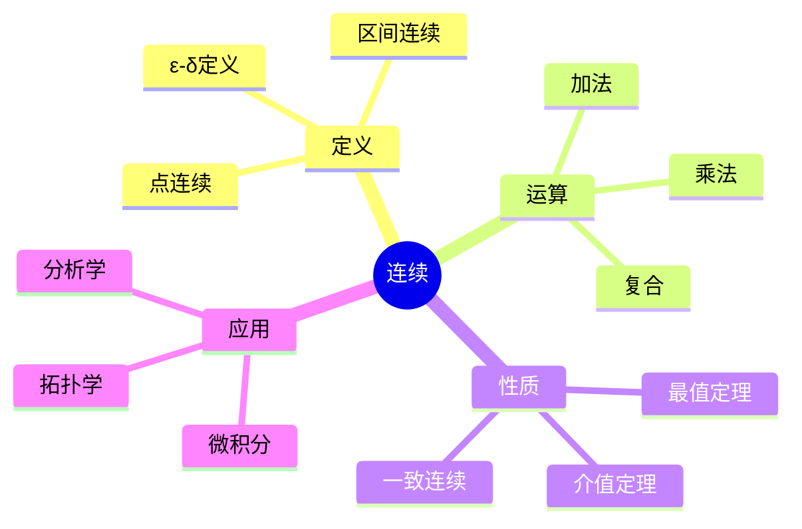
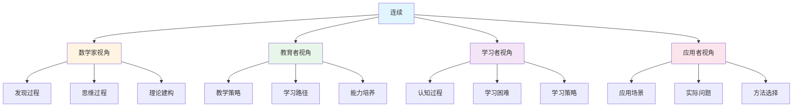
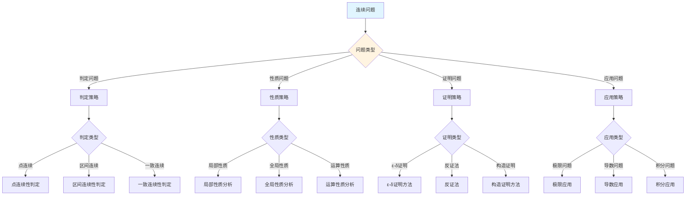
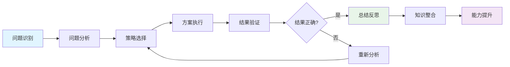
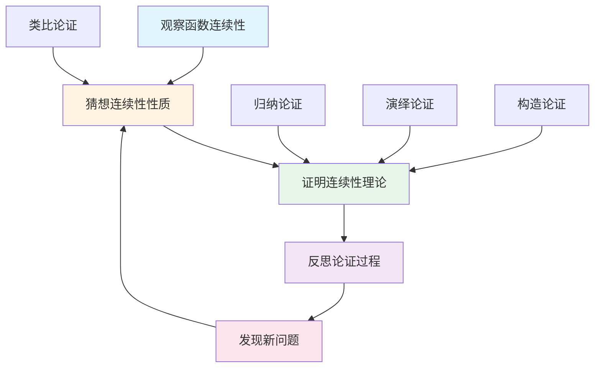
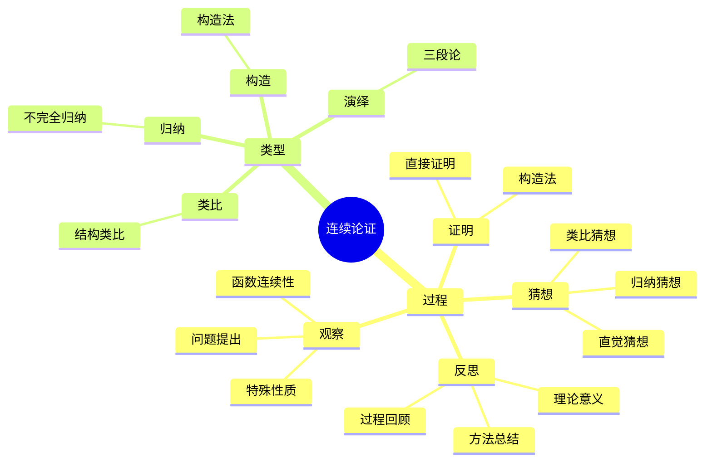

# 连续 (Continuity) - 三视角组织版

**概念编号**: C.CORE.014
**知识层次**: L0-L2
**知识领域**: D3 (分析)
**创建日期**: 2025年1月
**最后更新**: 2025年1月

---

## 📋 目录 / Table of Contents

- [连续 (Continuity) - 三视角组织版](#连续-continuity---三视角组织版)
  - [📋 目录 / Table of Contents](#-目录--table-of-contents)
  - [1. 📋 概述 (编号: C.CORE.014.01)](#1--概述-编号-ccore01401)
  - [🧠 认知学视角：如何理解连续 (编号: C.CORE.014.02)](#-认知学视角如何理解连续-编号-ccore01402)
    - [认知起点 (编号: C.CORE.014.02.01)](#认知起点-编号-ccore0140201)
    - [认知过程 (编号: C.CORE.014.02.02)](#认知过程-编号-ccore0140202)
      - [阶段1：直观理解阶段 (编号: C.CORE.014.02.02.01)](#阶段1直观理解阶段-编号-ccore014020201)
      - [阶段2：概念形成阶段 (编号: C.CORE.014.02.02.02)](#阶段2概念形成阶段-编号-ccore014020202)
      - [阶段3：形式化阶段 (编号: C.CORE.014.02.02.03)](#阶段3形式化阶段-编号-ccore014020203)
    - [认知障碍 (编号: C.CORE.014.02.03)](#认知障碍-编号-ccore0140203)
    - [认知工具 (编号: C.CORE.014.02.04)](#认知工具-编号-ccore0140204)
  - [🎓 教育学视角：如何教学连续 (编号: C.CORE.014.03)](#-教育学视角如何教学连续-编号-ccore01403)
    - [教学目标 (编号: C.CORE.014.03.01)](#教学目标-编号-ccore0140301)
    - [教学路径 (编号: C.CORE.014.03.02)](#教学路径-编号-ccore0140302)
      - [阶段1：引入阶段（激发兴趣） (编号: C.CORE.014.03.02.01)](#阶段1引入阶段激发兴趣-编号-ccore014030201)
      - [阶段2：探索阶段（主动建构） (编号: C.CORE.014.03.02.02)](#阶段2探索阶段主动建构-编号-ccore014030202)
      - [阶段3：形式化阶段（抽象概括） (编号: C.CORE.014.03.02.03)](#阶段3形式化阶段抽象概括-编号-ccore014030203)
      - [阶段4：巩固阶段（应用深化） (编号: C.CORE.014.03.02.04)](#阶段4巩固阶段应用深化-编号-ccore014030204)
    - [教学难点 (编号: C.CORE.014.03.03)](#教学难点-编号-ccore0140303)
    - [教学策略 (编号: C.CORE.014.03.04)](#教学策略-编号-ccore0140304)
    - [评估方法 (编号: C.CORE.014.03.05)](#评估方法-编号-ccore0140305)
  - [🔬 数学家视角：如何思考连续 (编号: C.CORE.014.04)](#-数学家视角如何思考连续-编号-ccore01404)
    - [问题起源 (编号: C.CORE.014.04.01)](#问题起源-编号-ccore0140401)
    - [思维过程 (编号: C.CORE.014.04.02)](#思维过程-编号-ccore0140402)
      - [步骤1：问题提出 (编号: C.CORE.014.04.02.01)](#步骤1问题提出-编号-ccore014040201)
      - [步骤2：概念形成 (编号: C.CORE.014.04.02.02)](#步骤2概念形成-编号-ccore014040202)
      - [步骤3：理论发展 (编号: C.CORE.014.04.02.03)](#步骤3理论发展-编号-ccore014040203)
    - [历史发展 (编号: C.CORE.014.04.03)](#历史发展-编号-ccore0140403)
    - [3.2 关键人物和贡献 (编号: C.CORE.014.04.04)](#32-关键人物和贡献-编号-ccore0140404)
    - [重要定理 (编号: C.CORE.014.04.05)](#重要定理-编号-ccore0140405)
    - [开放问题 (编号: C.CORE.014.04.06)](#开放问题-编号-ccore0140406)
    - [一、第一人称思维描述 (编号: C.CORE.014.04.07)](#一第一人称思维描述-编号-ccore0140407)
      - [1.1 Bolzano的发现过程](#11-bolzano的发现过程)
    - [二、数学直觉的形成 (编号: C.CORE.014.04.08)](#二数学直觉的形成-编号-ccore0140408)
      - [2.1 直觉在概念发现中的作用](#21-直觉在概念发现中的作用)
      - [2.2 如何培养连续性直觉](#22-如何培养连续性直觉)
    - [三、数学美的教育价值 (编号: C.CORE.014.04.09)](#三数学美的教育价值-编号-ccore0140409)
      - [3.1 连续性论的美在哪里](#31-连续性论的美在哪里)
      - [3.2 如何培养学生的数学美感](#32-如何培养学生的数学美感)
    - [四、问题解决策略 (编号: C.CORE.014.04.10)](#四问题解决策略-编号-ccore0140410)
      - [4.1 数学家的启发式方法](#41-数学家的启发式方法)
      - [4.2 思维过程分析](#42-思维过程分析)
    - [五、批判性反思 (编号: C.CORE.014.04.11)](#五批判性反思-编号-ccore0140411)
      - [5.1 连续性概念的局限性](#51-连续性概念的局限性)
      - [5.2 连续性理论的未解决问题](#52-连续性理论的未解决问题)
  - [💡 数学解释：为什么连续是这样定义的 (编号: C.CORE.014.05)](#-数学解释为什么连续是这样定义的-编号-ccore01405)
    - [一、直观解释：连续是什么？](#一直观解释连续是什么)
      - [1.1 具体例子](#11-具体例子)
      - [1.2 形象类比](#12-形象类比)
      - [1.3 几何直观](#13-几何直观)
      - [1.4 操作体验](#14-操作体验)
    - [二、知性解释：连续的本质是什么？](#二知性解释连续的本质是什么)
      - [2.1 概念定义](#21-概念定义)
      - [2.2 分类体系](#22-分类体系)
      - [2.3 抽象结构](#23-抽象结构)
      - [2.4 知识体系](#24-知识体系)
    - [三、理性解释：连续的公理化定义](#三理性解释连续的公理化定义)
      - [3.1 公理体系](#31-公理体系)
      - [3.2 形式化证明](#32-形式化证明)
      - [3.3 系统建构](#33-系统建构)
    - [四、多视角解释：从不同角度理解连续](#四多视角解释从不同角度理解连续)
      - [4.1 数学家视角：连续是如何被发现的？](#41-数学家视角连续是如何被发现的)
      - [4.2 教育者视角：如何教学连续？](#42-教育者视角如何教学连续)
      - [4.3 学习者视角：如何学习连续？](#43-学习者视角如何学习连续)
      - [4.4 应用者视角：如何应用连续？](#44-应用者视角如何应用连续)
    - [五、思维表征：用多种方式理解连续](#五思维表征用多种方式理解连续)
      - [5.1 思维导图：连续的知识结构](#51-思维导图连续的知识结构)
      - [5.2 矩阵对比：不同解释方式的对比](#52-矩阵对比不同解释方式的对比)
      - [5.3 多视角表征：从不同角度表征连续](#53-多视角表征从不同角度表征连续)
      - [5.4 决策树：连续问题分类和策略选择](#54-决策树连续问题分类和策略选择)
      - [5.5 决策逻辑路径：连续问题解决过程](#55-决策逻辑路径连续问题解决过程)
      - [5.6 多维对比矩阵：连续概念特征对比](#56-多维对比矩阵连续概念特征对比)
  - [🔍 数学论证：如何论证连续 (编号: C.CORE.014.06)](#-数学论证如何论证连续-编号-ccore01406)
    - [一、论证过程：从观察到反思](#一论证过程从观察到反思)
      - [1.1 观察（Observation）](#11-观察observation)
      - [1.2 猜想（Conjecture）](#12-猜想conjecture)
      - [1.3 证明（Proof）](#13-证明proof)
      - [1.4 反思（Reflection）](#14-反思reflection)
    - [二、论证类型：多种推理方式](#二论证类型多种推理方式)
      - [2.1 归纳论证（Inductive Reasoning）](#21-归纳论证inductive-reasoning)
      - [2.2 演绎论证（Deductive Reasoning）](#22-演绎论证deductive-reasoning)
      - [2.3 类比论证（Analogical Reasoning）](#23-类比论证analogical-reasoning)
      - [2.4 构造论证（Constructive Reasoning）](#24-构造论证constructive-reasoning)
    - [三、论证可视化：用图形表示论证过程](#三论证可视化用图形表示论证过程)
      - [3.1 论证流程图](#31-论证流程图)
      - [3.2 论证类型对比](#32-论证类型对比)
      - [3.3 论证思维导图](#33-论证思维导图)
  - [🔗 三视角整合 (编号: C.CORE.014.07)](#-三视角整合-编号-ccore01407)
    - [三个视角的关联](#三个视角的关联)
    - [如何综合运用三个视角](#如何综合运用三个视角)
  - [📚 参考文献 (编号: C.CORE.014.08)](#-参考文献-编号-ccore01408)
    - [权威资源](#权威资源)
    - [经典教材](#经典教材)
    - [研究论文](#研究论文)

---

## 1. 📋 概述 (编号: C.CORE.014.01)

连续性是分析学的核心概念，描述函数在局部和全局的"平滑性"。连续函数理论是微积分、拓扑学、函数分析的基础。

本文档从**数学认知学**、**教育学**、**数学家**三个视角深入展开连续概念，避免简单的概念堆垒。

**权威资源对齐**:

- Wikipedia: [Continuous Function](https://en.wikipedia.org/wiki/Continuous_function)
- Stanford课程: Math 171 (Real Analysis)
- Princeton课程: MAT 201 (Analysis)
- MIT课程: 18.100A (Real Analysis)
- Metamath: [Continuity](http://us.metamath.org/mpeuni/df-cn.html)

---

## 🧠 认知学视角：如何理解连续 (编号: C.CORE.014.02)

### 认知起点 (编号: C.CORE.014.02.01)

**学习者已有的知识基础**:

- 函数的概念
- 极限的概念
- 日常经验中的"连续"、"不间断"概念

**日常经验中的类似概念**:

- "连续的时间"：时间不间断
- "连续的线"：线不间断
- "连续的过程"：过程不间断

### 认知过程 (编号: C.CORE.014.02.02)

#### 阶段1：直观理解阶段 (编号: C.CORE.014.02.02.01)

**具体例子**:

- 例子1：多项式函数连续
- 例子2：指数函数连续
- 例子3：绝对值函数在$0$处连续

**形象类比**:

- **图像类比**: 连续函数就像"可以一笔画出的函数"
  - 图像没有跳跃
  - 图像没有间断
  - 图像是"平滑的"

- **过程类比**: 连续函数就像"连续的过程"
  - 过程不间断
  - 过程平滑
  - 过程可以预测

**可视化表示**:

```text
连续函数:
    y
    ↑
    |  ╱
    | ╱
    |╱
    └──────────→ x
```

#### 阶段2：概念形成阶段 (编号: C.CORE.014.02.02.02)

**从例子中抽象出共同特征**:

- 所有例子都涉及"没有跳跃"
- 当$x$接近$a$时，$f(x)$接近$f(a)$
- 函数值的变化是"平滑的"

**识别关键属性**:

1. **局部连续性**: 在每点都连续
2. **全局连续性**: 在整个定义域上连续
3. **极限等于函数值**: $\lim_{x \to a} f(x) = f(a)$

**建立概念边界**:

- **什么是连续**: 函数在每点都连续，即$\lim_{x \to a} f(x) = f(a)$
- **什么不是连续**:
  - 有跳跃的函数（不连续）
  - 有间断的函数（不连续）

#### 阶段3：形式化阶段 (编号: C.CORE.014.02.02.03)

**严格定义**:

- $\varepsilon$-$\delta$定义：通过$\varepsilon$和$\delta$量化表述
- 拓扑定义：开集的原像是开集

**公理化表述**:

- 函数$f$在点$a$连续：$\forall \varepsilon > 0, \exists \delta > 0, \forall x, |x - a| < \delta \Rightarrow |f(x) - f(a)| < \varepsilon$
- 函数$f$连续：在每点都连续

**逻辑结构**:

- 连续性是分析学的基础
- 连续性是微积分的基础
- 连续性是拓扑学的基础

### 认知障碍 (编号: C.CORE.014.02.03)

**常见误解**:

1. **误解1**: 认为所有函数都连续
   - **纠正**: 不是所有函数都连续，如阶梯函数

2. **误解2**: 认为连续就是可微
   - **纠正**: 连续不一定可微，如绝对值函数

3. **误解3**: 混淆连续和一致连续
   - **纠正**: 一致连续是更强的条件

**理解难点**:

1. **难点1**: 连续性的抽象性
   - **原因**: 连续性比较抽象
   - **解决方法**: 从直观理解开始，逐步形式化

2. **难点2**: 一致连续性
   - **原因**: 一致连续性比较抽象
   - **解决方法**: 用具体例子，强调一致连续的特殊性

3. **难点3**: 连续性的拓扑定义
   - **原因**: 拓扑定义比较抽象
   - **解决方法**: 从$\varepsilon$-$\delta$定义开始，逐步抽象

**认知陷阱**:

- **连续性**: 需要理解"没有跳跃"的含义
- **一致连续性**: 需要理解一致连续的特殊性

### 认知工具 (编号: C.CORE.014.02.04)

**类比工具**:

- **图像类比**: 连续函数 = 可以一笔画出的函数
- **过程类比**: 连续函数 = 连续的过程

**可视化工具**:

- **函数图像**: 用函数图像表示连续性
- **间断点**: 用间断点说明不连续性

**具体化工具**:

- **具体例子**: 用具体例子理解抽象概念
- **反例**: 用反例理解概念边界

---

## 🎓 教育学视角：如何教学连续 (编号: C.CORE.014.03)

### 教学目标 (编号: C.CORE.014.03.01)

**知识目标**:

- 理解连续的基本概念
- 掌握$\varepsilon$-$\delta$定义
- 理解连续的性质
- 理解连续性的应用

**能力目标**:

- 能够判断函数是否连续
- 能够证明函数的连续性
- 能够应用连续性解决实际问题
- 能够理解连续性的重要性

**情感目标**:

- 培养数学抽象思维
- 培养分析思维
- 激发对数学的兴趣

### 教学路径 (编号: C.CORE.014.03.02)

#### 阶段1：引入阶段（激发兴趣） (编号: C.CORE.014.03.02.01)

**实际问题**:

- 问题1：如何描述函数的"平滑性"？
- 问题2：如何研究函数的性质？
- 问题3：如何建立微积分的基础？

**历史背景**:

- 连续性的历史发展
- 连续性在数学中的地位
- 连续性在微积分中的作用

**引发认知冲突**:

- 问题：如何严格定义"没有跳跃"？
- 引出连续性的定义

#### 阶段2：探索阶段（主动建构） (编号: C.CORE.014.03.02.02)

**引导发现**:

1. 让学生自己列举连续函数的例子
2. 让学生观察这些函数的共同特征
3. 引导学生抽象出连续性的定义

**合作探究**:

- 小组讨论：什么是连续？
- 小组讨论：连续有哪些性质？
- 小组讨论：如何判断连续性？

**多元表征**:

- **语言表征**: "连续函数是没有跳跃的函数"
- **符号表征**: $\lim_{x \to a} f(x) = f(a)$
- **图形表征**: 函数图像
- **集合表征**: $\varepsilon$-$\delta$定义

#### 阶段3：形式化阶段（抽象概括） (编号: C.CORE.014.03.02.03)

**严格定义**:

- $\varepsilon$-$\delta$定义
- 拓扑定义
- 连续性的性质

**性质证明**:

- 连续函数的基本性质
- 连续函数的运算性质
- 连续函数的复合性质

**应用拓展**:

- 连续性在微积分中的应用
- 连续性在分析学中的应用
- 连续性在拓扑学中的应用

#### 阶段4：巩固阶段（应用深化） (编号: C.CORE.014.03.02.04)

**练习应用**:

- 基础练习：连续性的判断和证明
- 应用练习：用连续性解决实际问题
- 综合练习：连续性的综合应用

**变式训练**:

- 不同形式的连续性
- 不同难度的连续性证明
- 连续性的应用

**知识整合**:

- 连续性与其他概念的联系
- 连续性在数学体系中的地位

### 教学难点 (编号: C.CORE.014.03.03)

**难点1：连续性的抽象性**:

- **难点描述**: 学生难以理解连续性的抽象概念
- **解决方法**:
  - 从直观理解开始
  - 逐步形式化
  - 用具体例子说明

**难点2：一致连续性**:

- **难点描述**: 学生难以理解一致连续性
- **解决方法**:
  - 用具体例子
  - 强调一致连续的特殊性
  - 用图形可视化

**难点3：连续性的拓扑定义**:

- **难点描述**: 学生难以理解拓扑定义
- **解决方法**:
  - 从$\varepsilon$-$\delta$定义开始
  - 逐步抽象到拓扑定义
  - 用具体例子说明

### 教学策略 (编号: C.CORE.014.03.04)

**策略1：从具体到抽象**:

- 先给出具体例子
- 再抽象出一般概念
- 最后给出严格定义

**策略2：多元表征**:

- 用语言、符号、图形等多种方式表示同一概念
- 帮助学生建立不同表征之间的联系

**策略3：问题驱动**:

- 从实际问题出发
- 引出数学概念
- 解决问题

**策略4：可视化教学**:

- 使用函数图像
- 使用间断点说明
- 使用具体例子

### 评估方法 (编号: C.CORE.014.03.05)

**形成性评估**（评估理解过程）:

- 课堂提问：检查学生对概念的理解
- 小组讨论：观察学生的思考过程
- 练习作业：检查学生的应用能力

**总结性评估**（评估最终理解）:

- 测验：检查学生对概念和证明的掌握
- 项目：检查学生应用连续性解决实际问题的能力
- 反思：检查学生对连续性概念的理解深度

---

## 🔬 数学家视角：如何思考连续 (编号: C.CORE.014.04)

### 问题起源 (编号: C.CORE.014.04.01)

**历史背景**:

- 19世纪：连续性的严格化
- 20世纪初：连续性的系统化
- 20世纪中期：连续性的现代发展

**原始问题**:

- **问题1**: 如何严格定义"没有跳跃"？
- **问题2**: 如何研究函数的性质？
- **问题3**: 连续性有哪些性质？

**研究动机**:

- 严格化微积分
- 建立分析学基础
- 统一连续性理论

### 思维过程 (编号: C.CORE.014.04.02)

#### 步骤1：问题提出 (编号: C.CORE.014.04.02.01)

**观察到的现象**:

- 有些函数"平滑"，有些函数"有跳跃"
- 需要严格定义"平滑性"
- 需要研究连续函数的性质

**提出的猜想**:

- 可以引入连续性概念
- 连续性可以严格定义"平滑性"
- 连续函数有丰富的性质

**需要解决的问题**:

- 如何定义连续性？
- 连续性应该满足什么条件？
- 连续函数有哪些性质？

#### 步骤2：概念形成 (编号: C.CORE.014.04.02.02)

**尝试性定义**:

- **$\varepsilon$-$\delta$定义**: 通过$\varepsilon$和$\delta$量化表述
- **拓扑定义**: 开集的原像是开集

**性质探索**:

- 连续函数的基本性质
- 连续函数的运算性质
- 连续函数的复合性质

**结构发现**:

- 连续性是分析学的基础
- 连续性是微积分的基础
- 连续性是拓扑学的基础

#### 步骤3：理论发展 (编号: C.CORE.014.04.02.03)

**定理证明**:

- 连续函数的基本性质
- 连续函数的运算性质
- 连续函数的复合性质

**应用拓展**:

- 连续性在微积分中的应用
- 连续性在分析学中的应用
- 连续性在拓扑学中的应用

**理论完善**:

- $\varepsilon$-$\delta$定义的完善
- 连续性的拓扑学研究
- 连续性的范畴论研究

### 历史发展 (编号: C.CORE.014.04.03)

**早期阶段**（19世纪）:

- **Bolzano (1817)**: 研究连续性
- **Cauchy (1821)**: 给出连续性的严格定义
- **Weierstrass (1872)**: 完善连续性的定义

**关键突破**（20世纪初）:

- **Baire (1899)**: 研究连续函数的性质
- **Lebesgue (1902)**: 研究可测函数

**现代发展**（20世纪中期）:

- **Bourbaki (1939)**: 统一连续性理论
- **拓扑学 (1940s)**: 连续性的拓扑学研究

### 3.2 关键人物和贡献 (编号: C.CORE.014.04.04)

**Bernard Bolzano (1781-1848)**:

- 研究连续性
- 建立分析学的基础

**Augustin-Louis Cauchy (1789-1857)**:

- 给出连续性的严格定义
- 建立现代分析学

**Karl Weierstrass (1815-1897)**:

- 完善连续性的定义
- 建立现代分析学

### 重要定理 (编号: C.CORE.014.04.05)

**连续函数的运算性质**:

- 连续函数的和、积、商（分母非零）连续
- 连续函数的复合连续
- 意义：连续函数构成代数结构

**介值定理**:

- 连续函数在区间上取遍中间值
- 意义：连续函数的重要性质

**最值定理**:

- 闭区间上的连续函数有最大值和最小值
- 意义：连续函数的重要性质

### 开放问题 (编号: C.CORE.014.04.06)

**未解决问题**:

- 连续性的分类问题
- 连续性的表示问题
- 连续性的应用问题

**研究方向**:

- 连续性的拓扑学研究
- 连续性的范畴论研究
- 连续性的应用研究

### 一、第一人称思维描述 (编号: C.CORE.014.04.07)

#### 1.1 Bolzano的发现过程

**详细历史背景**:

- **1817年**：Bolzano发表《纯粹分析的证明》（Rein analytischer Beweis）
- **背景**：研究函数的性质，发现连续性需要严格定义
- **问题**：如何严格定义连续性？连续函数有什么性质？

**Bolzano的详细第一人称描述**:
> "1817年，我在研究函数的性质时，遇到了一个问题：如何严格定义连续性？
>
> 我发现，有些函数在某点'连续'，有些函数'不连续'。例如：
>
> - $f(x) = x^2$在$x = 2$处连续（没有跳跃）
> - $g(x) = \begin{cases} x^2 & x \neq 2 \\ 5 & x = 2 \end{cases}$在$x = 2$处不连续（有跳跃）
>
> 我的方法是这样的：
>
> - **思路**：用$\varepsilon$-$\delta$语言严格定义连续性
> - **定义**：$f$在$a$处连续当且仅当$\forall \varepsilon > 0, \exists \delta > 0$，使得$|x-a| < \delta$时，$|f(x) - f(a)| < \varepsilon$
> - **关键**：连续意味着'没有跳跃'，即函数值的变化可以任意小
>
> 例如，要证明$f(x) = x^2$在$x = 2$处连续：
>
> - **给定**：$\varepsilon > 0$
> - **找**：$\delta > 0$，使得$|x-2| < \delta$时，$|x^2 - 4| < \varepsilon$
> - **计算**：$|x^2 - 4| = |x-2||x+2|$
> - **选择**：如果$|x-2| < 1$，则$|x+2| < 5$，所以$|x^2 - 4| < 5|x-2|$
> - **取**：$\delta = \min(1, \varepsilon/5)$
> - **验证**：如果$|x-2| < \delta$，则$|x^2 - 4| < 5\delta \leq \varepsilon$
>
> 我还发现了连续函数的重要性质：
>
> - **中间值定理**：连续函数在区间上取遍中间值
> - **最值定理**：闭区间上的连续函数有最大值和最小值
>
> 这让我意识到，连续性可以通过$\varepsilon$-$\delta$语言严格定义，连续函数有重要的性质。这为分析学提供了严格的基础。"

**详细的思维过程**:

1. **观察到的现象**（1817年）:

   **现象1：有些函数连续，有些函数不连续**
   - **问题**：如何区分连续函数和不连续函数？
   - **例子**：$f(x) = x^2$连续，$g(x) = \begin{cases} x^2 & x \neq 2 \\ 5 & x = 2 \end{cases}$不连续
   - **需要**：严格定义连续性

   **现象2：连续性有特殊的性质**
   - **问题**：连续函数有什么性质？
   - **例子**：连续函数在区间上取遍中间值
   - **需要**：研究连续函数的性质

   **现象3：需要严格定义**
   - **问题**：如何严格定义连续性？
   - **思路**：用$\varepsilon$-$\delta$语言定义
   - **需要**：建立连续性理论

2. **提出的猜想**（1817年）:

   **猜想1：用$\varepsilon$-$\delta$语言定义连续性**
   - **思路**：用"任意小的正数"$\varepsilon$和"对应的$\delta$"定义连续性
   - **例子**：$f(x) = x^2$在$x = 2$处连续的定义
   - **优点**：严格定义连续性

   **猜想2：连续函数有特殊性质**
   - **性质**：中间值定理、最值定理
   - **例子**：连续函数在区间上取遍中间值
   - **意义**：连续函数有重要的应用

   **猜想3：连续性是分析学的基础**
   - **性质**：导数和积分都依赖于连续性
   - **应用**：连续性可以应用到更广泛的领域
   - **意义**：连续性是分析学的基础

3. **遇到的困难**（1817年）:

   **困难1：如何严格定义连续性？**
   - **问题**：如何定义连续性？
   - **解决**：用$\varepsilon$-$\delta$语言定义
   - **意义**：为连续性提供严格的数学基础

   **困难2：如何证明连续函数的性质？**
   - **问题**：如何证明中间值定理、最值定理？
   - **解决**：使用实数的完备性
   - **意义**：为连续函数理论提供基础

   **困难3：如何应用连续性理论？**
   - **问题**：如何用连续性理论解决实际问题？
   - **解决**：建立中间值定理、最值定理的应用
   - **意义**：为分析学提供应用基础

4. **突破的时刻**（1817年，Bolzano）:

   **突破1：$\varepsilon$-$\delta$定义**
   - 引入$\varepsilon$-$\delta$语言严格定义连续性
   - **关键**：严格定义连续性
   - **意义**：为分析学提供严格的基础

   **突破2：中间值定理**
   - 证明连续函数在区间上取遍中间值
   - **关键**：使用实数的完备性
   - **意义**：为连续函数理论提供基础

   **突破3：最值定理**
   - 证明闭区间上的连续函数有最大值和最小值
   - **关键**：使用实数的完备性
   - **意义**：为连续函数理论提供基础

### 二、数学直觉的形成 (编号: C.CORE.014.04.08)

#### 2.1 直觉在概念发现中的作用

**Bolzano的直觉**:

- **直觉1**: "连续性"是"没有跳跃"——这个直觉引导Bolzano发现连续性
- **直觉2**: 连续函数有特殊性质——这个直觉引导Bolzano建立连续函数理论
- **直觉3**: 连续性是分析学的基础——这个直觉引导Bolzano建立连续性理论

**直觉的验证**:

- 通过严格的数学证明验证直觉的正确性
- 通过$\varepsilon$-$\delta$语言严格化连续性定义
- 通过应用验证连续性的广泛性

**直觉的深化**:

- 从"没有跳跃"到"$\varepsilon$-$\delta$定义"
- 从"特殊性质"到"连续函数的理论体系"
- 从"分析学基础"到"连续性的广泛应用"

#### 2.2 如何培养连续性直觉

**数学家的建议**:

- **Bolzano**: "连续性直觉是长期训练的结果。通过大量练习和深入思考，我们可以培养对连续性的直觉。"
- **Weierstrass**: "从具体例子开始，逐步抽象，这是培养连续性直觉的有效方法。"

**培养方法**:

1. **大量练习**: 通过大量连续性判断练习，培养对连续性的直觉
2. **深入思考**: 深入思考连续性的本质，理解连续性的深层结构
3. **类比和联想**: 通过类比和联想，建立连续性与其他概念的联系
4. **与专家交流**: 与数学家交流，学习他们的思维方式

**教学启示**:

- 从具体例子开始，逐步抽象
- 鼓励学生思考连续性的本质
- 引导学生建立连续性与其他概念的联系

### 三、数学美的教育价值 (编号: C.CORE.014.04.09)

#### 3.1 连续性论的美在哪里

**结构美**:

- **简洁性**: 连续性的概念非常简洁——"函数在某点的值等于极限"
- **统一性**: 连续性可以统一描述数学中的各种"平滑"
- **和谐性**: 连续函数满足优美的性质（中间值定理、最值定理等）

**数学家的评价**:

- **Bolzano**: "连续性论的美在于它的严格性。它为我们提供了一个严格的框架来理解函数的性质。"
- **Weierstrass**: "连续性论的美在于它的基础性。它是分析学的基础，所有分析概念都可以用连续性来描述。"

#### 3.2 如何培养学生的数学美感

**数学家的建议**:

- **Bolzano**: "展示连续性论的美感，让学生感受到数学的美。"
- **Weierstrass**: "通过连续性论的历史和发展，让学生理解数学的美。"

**教学方法**:

1. **展示数学美**:
   - 展示连续性概念的简洁性和统一性
   - 展示连续函数的优美性质
   - 展示连续性在数学中的基础地位

2. **引导学生欣赏**:
   - 引导学生欣赏连续性概念的简洁性
   - 引导学生欣赏连续函数的和谐性
   - 引导学生欣赏连续性的基础性

3. **鼓励学生创造美**:
   - 鼓励学生发现连续性论的美
   - 鼓励学生创造优美的连续性证明
   - 鼓励学生探索连续性论的美

### 四、问题解决策略 (编号: C.CORE.014.04.10)

#### 4.1 数学家的启发式方法

**策略1：从具体到抽象**:

- 从具体的连续函数例子开始
- 抽象出连续性的一般性质
- 建立连续性的理论体系

**策略2：从简单到复杂**:

- 先理解基本连续性
- 再理解连续函数的性质
- 最后理解连续性理论

**策略3：从问题到理论**:

- 从实际问题出发
- 引出连续性概念
- 建立连续性理论

#### 4.2 思维过程分析

**问题识别**:

- 识别问题类型：连续性定义问题、连续性判断问题、连续性应用问题
- 识别问题难度：简单问题、中等问题、复杂问题

**策略选择**:

- 简单问题：直接方法
- 中等问题：分步方法
- 复杂问题：分解方法

**执行和反思**:

- 执行策略，解决问题
- 反思过程，总结经验
- 改进方法，提高效率

### 五、批判性反思 (编号: C.CORE.014.04.11)

#### 5.1 连续性概念的局限性

**概念的边界**:

- 连续性只描述函数在某点的性质，不能描述所有函数性质
- 连续性是抽象的，需要具体化才能应用
- 连续性不能表示所有数学量

**概念的推广**:

- 一致连续：更强的连续性
- 拓扑连续：拓扑空间中的连续
- 范畴连续：范畴论中的连续

#### 5.2 连续性理论的未解决问题

**未解决的问题**:

- 连续性的分类问题：如何分类所有连续函数？
- 连续性的表示问题：如何表示连续函数？
- 连续性的应用问题：如何更好地应用连续性？

**研究方向**:

- 连续性的拓扑学研究
- 连续性的范畴论研究
- 连续性的应用研究

---

## 💡 数学解释：为什么连续是这样定义的 (编号: C.CORE.014.05)

### 一、直观解释：连续是什么？

#### 1.1 具体例子

**生活中的例子**：

- **平滑曲线**：函数图像是平滑的曲线
  - 例如：$y = x^2$的图像是平滑的抛物线
  - **为什么这样定义**：因为我们需要一个概念来表示"没有跳跃"的函数
- **温度变化**：温度随时间连续变化
  - 例如：温度不会突然跳跃
  - **为什么这样定义**：因为我们需要一个概念来表示"平滑变化"
- **运动轨迹**：物体的运动轨迹是连续的
  - 例如：物体不会瞬间移动
  - **为什么这样定义**：因为我们需要一个概念来表示"连续运动"

**数学中的例子**：

- **连续函数**：$f(x) = x^2$在$\mathbb{R}$上连续
  - **为什么这样定义**：我们需要一个概念来表示"没有跳跃"的函数
- **不连续函数**：$f(x) = \begin{cases} 1 & x > 0 \\ 0 & x \leq 0 \end{cases}$在$x = 0$处不连续
  - **为什么这样定义**：我们需要一个概念来表示"有跳跃"的函数
- **一致连续函数**：$f(x) = x^2$在$[0, 1]$上一致连续
  - **为什么这样定义**：我们需要一个概念来表示"更强的连续性"

#### 1.2 形象类比

**平滑类比**：

- **连续就像"平滑的曲线"**
  - 没有跳跃
  - 没有断点
  - 可以一笔画出
- **为什么这样类比**：这个类比帮助我们理解连续的本质

**连接类比**：

- **连续就像"连接的线段"**
  - 函数图像是连接的
  - 没有断开的地方
- **为什么这样类比**：这个类比帮助我们理解连续的含义

#### 1.3 几何直观

**函数图像表示**：

- 使用函数图像表示连续性
- 例如：连续函数的图像是连接的曲线
- **为什么使用图像**：图像提供几何直观，帮助我们理解连续性

**跳跃表示**：

- 使用跳跃表示不连续性
- 例如：不连续函数在断点处有跳跃
- **为什么使用跳跃**：跳跃提供直观的不连续例子

#### 1.4 操作体验

**连续性判断的操作**：

- **判断连续性**：检查$\lim_{x \to a} f(x) = f(a)$
  - **为什么这样操作**：因为我们需要一个方法来判断函数是否连续
- **连续函数的运算**：连续函数的和、积、复合都是连续的
  - **为什么这样操作**：因为我们需要一个运算来表示"连续函数的运算性质"
- **连续函数的性质**：连续函数在闭区间上达到最大值和最小值
  - **为什么这样操作**：因为我们需要一个性质来研究连续函数

### 二、知性解释：连续的本质是什么？

#### 2.1 概念定义

**连续的内涵**：

- **连续是函数在某点没有跳跃的性质**
  - **$\varepsilon$-$\delta$定义**：对于任意$\varepsilon > 0$，存在$\delta > 0$，使得当$|x - a| < \delta$时，$|f(x) - f(a)| < \varepsilon$
  - **极限定义**：$\lim_{x \to a} f(x) = f(a)$
  - **拓扑定义**：开集的原像是开集
- **为什么这样定义**：这些特征使得连续成为一个完整的分析工具，支持所有连续函数的研究

**连续的外延**：

- **点连续**：函数在某点连续
- **区间连续**：函数在区间上连续
- **一致连续**：函数在区间上一致连续
- **为什么这样分类**：不同的连续类型有不同的性质和用途

#### 2.2 分类体系

**按类型分类**：

- **点连续**：函数在某点连续
- **区间连续**：函数在区间上连续
- **一致连续**：函数在区间上一致连续
- **为什么这样分类**：类型是连续的基本特征

**按性质分类**：

- **连续函数**：在定义域上连续的函数
- **不连续函数**：在某些点不连续的函数
- **为什么这样分类**：性质是连续的重要特征

#### 2.3 抽象结构

**连续的运算结构**：

- **连续函数的加法**：连续函数的和是连续的
- **连续函数的乘法**：连续函数的积是连续的
- **连续函数的复合**：连续函数的复合是连续的
- **为什么有这些运算**：这些运算使得连续函数具有代数结构

**连续的关系结构**：

- **连续性与极限**：函数在$a$点连续当且仅当$\lim_{x \to a} f(x) = f(a)$
- **为什么有这个关系**：这个关系帮助我们研究连续性

**连续的子结构**：

- **点连续**：函数在某点连续
- **区间连续**：函数在区间上连续
- **一致连续**：函数在区间上一致连续
- **为什么有这些结构**：这些结构是连续理论的基础

#### 2.4 知识体系

**连续在数学体系中的位置**：

- **基础地位**：连续是分析学的基础
  - 连续是导数和积分的基础
  - 连续是拓扑学的基础
- **为什么是基础**：连续提供了统一的框架来研究函数的性质

**连续与其他概念的关系**：

- **连续与极限**：连续是极限的特殊情况
- **连续与导数**：可导函数是连续的
- **连续与积分**：连续函数是可积的
- **为什么有这些关系**：这些关系揭示了连续与其他数学概念的内在联系

### 三、理性解释：连续的公理化定义

#### 3.1 公理体系

**连续的$\varepsilon$-$\delta$定义**：

- **定义**：函数$f$在$a$点连续当且仅当对于任意$\varepsilon > 0$，存在$\delta > 0$，使得当$|x - a| < \delta$时，$|f(x) - f(a)| < \varepsilon$
- **为什么需要这个定义**：这个定义提供了连续的严格数学基础

**连续的拓扑定义**：

- **定义**：函数$f$连续当且仅当开集的原像是开集
- **为什么这样定义**：这个定义将连续放在拓扑框架中

#### 3.2 形式化证明

**连续运算性质的证明**：

##### 定理1：连续函数的和

**定理陈述**：如果$f$和$g$在$a$点连续，则$f + g$在$a$点连续。

**形式化表述**：
$$\forall f, g: D \to \mathbb{R}, \forall a \in D,$$
$$(f \text{在}a\text{点连续}) \land (g \text{在}a\text{点连续}) \Rightarrow (f + g) \text{在}a\text{点连续}$$

**证明**：
1. **给定**：对任意$\varepsilon > 0$，需要找到$\delta > 0$使得当$|x - a| < \delta$时，$|(f + g)(x) - (f + g)(a)| < \varepsilon$
2. **存在性**：由连续性，存在$\delta_1, \delta_2 > 0$使得：
   - 当$|x - a| < \delta_1$时，$|f(x) - f(a)| < \frac{\varepsilon}{2}$
   - 当$|x - a| < \delta_2$时，$|g(x) - g(a)| < \frac{\varepsilon}{2}$
3. **选择**：取$\delta = \min(\delta_1, \delta_2)$
4. **验证**：当$|x - a| < \delta$时：
   $$|(f + g)(x) - (f + g)(a)| = |(f(x) - f(a)) + (g(x) - g(a))| \leq |f(x) - f(a)| + |g(x) - g(a)| < \frac{\varepsilon}{2} + \frac{\varepsilon}{2} = \varepsilon$$

**为什么这样证明**：利用连续性的定义和三角不等式，通过分拆$\varepsilon$证明。

---

##### 定理2：连续函数的复合

**定理陈述**：如果$f$在$a$点连续，$g$在$f(a)$点连续，则$g \circ f$在$a$点连续。

**形式化表述**：
$$\forall f: D \to E, \forall g: E \to F, \forall a \in D,$$
$$(f \text{在}a\text{点连续}) \land (g \text{在}f(a)\text{点连续}) \Rightarrow (g \circ f) \text{在}a\text{点连续}$$

**证明**：
1. **给定**：对任意$\varepsilon > 0$，需要找到$\delta > 0$使得当$|x - a| < \delta$时，$|(g \circ f)(x) - (g \circ f)(a)| < \varepsilon$
2. **第一步**：由于$g$在$f(a)$点连续，存在$\delta_1 > 0$使得当$|y - f(a)| < \delta_1$时，$|g(y) - g(f(a))| < \varepsilon$
3. **第二步**：由于$f$在$a$点连续，存在$\delta > 0$使得当$|x - a| < \delta$时，$|f(x) - f(a)| < \delta_1$
4. **验证**：当$|x - a| < \delta$时，$|f(x) - f(a)| < \delta_1$，因此$|g(f(x)) - g(f(a))| < \varepsilon$

**为什么这样证明**：利用连续性的定义和复合函数的性质，通过两步应用连续性。

---

##### 定理3：连续性与极限的关系

**定理陈述**：函数$f$在$a$点连续当且仅当$\lim_{x \to a} f(x) = f(a)$。

**形式化表述**：
$$\forall f: D \to \mathbb{R}, \forall a \in D, \quad f \text{在}a\text{点连续} \Leftrightarrow \lim_{x \to a} f(x) = f(a)$$

**证明**：
1. **必要性**（$\Rightarrow$）：
   - 如果$f$在$a$点连续，则对任意$\varepsilon > 0$，存在$\delta > 0$使得当$|x - a| < \delta$时，$|f(x) - f(a)| < \varepsilon$
   - 特别地，当$0 < |x - a| < \delta$时，$|f(x) - f(a)| < \varepsilon$，因此$\lim_{x \to a} f(x) = f(a)$

2. **充分性**（$\Leftarrow$）：
   - 如果$\lim_{x \to a} f(x) = f(a)$，则对任意$\varepsilon > 0$，存在$\delta > 0$使得当$0 < |x - a| < \delta$时，$|f(x) - f(a)| < \varepsilon$
   - 当$x = a$时，$|f(x) - f(a)| = 0 < \varepsilon$，因此$f$在$a$点连续

**为什么这样证明**：利用连续性和极限的定义，通过等价性证明。
  - **证明**：使用连续性和极限的定义
  - **为什么这样证明**：利用连续性和极限的定义

#### 3.3 系统建构

**连续论在数学基础中的地位**：

- **作为分析学基础**：连续是分析学的基础
- **提供函数工具**：连续提供了研究函数的工具
- **统一框架**：连续统一了各种函数性质

**连续论的发展历史**：

- **Bolzano的研究**（1817年）：研究连续性
- **Cauchy的严格化**（1821年）：给出连续的严格定义
- **Weierstrass的完善**（1872年）：完善连续性的定义
- **为什么这样发展**：数学的发展需要严格的基础，连续论的发展反映了这一需求

### 四、多视角解释：从不同角度理解连续

#### 4.1 数学家视角：连续是如何被发现的？

**Bolzano的发现过程**：

- **问题提出**：如何严格定义"平滑性"？
- **关键洞察**：使用$\varepsilon$-$\delta$定义
- **重要发现**：连续可以严格定义"平滑性"
- **为什么这样发现**：数学家的直觉和严格证明相结合

**Cauchy的严格化过程**：

- **问题识别**：需要严格化连续概念
- **策略选择**：使用$\varepsilon$-$\delta$语言
- **定义设计**：连续是满足$\varepsilon$-$\delta$条件的性质
- **为什么这样设计**：需要提供严格的基础

#### 4.2 教育者视角：如何教学连续？

**教学策略**：

- **从具体到抽象**：先学习具体例子，再学习抽象定义
- **从简单到复杂**：先学习点连续，再学习区间连续
- **从直观到形式化**：先使用图像等直观工具，再学习$\varepsilon$-$\delta$定义
- **为什么这样教学**：符合认知规律，帮助学生逐步建立理解

**学习路径**：

- **阶段1**：直观理解（使用图像和具体例子）
- **阶段2**：概念形成（学习连续的定义和性质）
- **阶段3**：形式化（学习$\varepsilon$-$\delta$定义）
- **为什么这样设计**：循序渐进，逐步深入

#### 4.3 学习者视角：如何学习连续？

**认知过程**：

- **直观阶段**：通过图像理解连续的含义
- **概念阶段**：理解连续的定义和性质
- **形式化阶段**：理解$\varepsilon$-$\delta$定义
- **为什么这样学习**：符合认知发展规律

**学习困难**：

- **困难1**：理解"$\varepsilon$-$\delta$定义"的概念
- **困难2**：理解"没有跳跃"的概念
- **困难3**：理解"一致连续"的概念
- **如何克服**：通过具体例子、类比、历史背景等方式帮助理解

#### 4.4 应用者视角：如何应用连续？

**应用场景**：

- **分析学**：使用连续研究函数的性质
- **微积分**：使用连续定义导数和积分
- **物理**：使用连续描述物理过程
- **为什么这样应用**：连续提供了强大的工具来处理各种问题

**应用方法**：

- **建立模型**：将实际问题转化为连续问题
- **使用理论**：使用连续理论解决问题
- **验证结果**：验证结果的正确性
- **为什么这样应用**：连续论提供了强大的工具来解决实际问题

### 五、思维表征：用多种方式理解连续

#### 5.1 思维导图：连续的知识结构



#### 5.2 矩阵对比：不同解释方式的对比

| 解释方式 | 特点 | 方法 | 工具 | 适用阶段 | 优势 | 局限 |
|---------|------|------|------|---------|------|------|
| **直观解释** | 具体、形象、可视 | 例子、类比、直观 | 图像、图形 | 入门阶段 | 易于理解 | 不够严格 |
| **知性解释** | 概念、分类、抽象 | 定义、分类、结构 | 概念图、知识图谱 | 中级阶段 | 系统完整 | 不够直观 |
| **理性解释** | 公理、证明、形式化 | 公理、证明、系统 | 形式化工具、证明系统 | 高级阶段 | 严格准确 | 不够具体 |
| **多视角解释** | 多角度、整合 | 多视角、整合 | 多视角工具 | 所有阶段 | 全面深入 | 可能复杂 |

#### 5.3 多视角表征：从不同角度表征连续



#### 5.4 决策树：连续问题分类和策略选择



**说明**：

- **问题分类**：根据问题类型（判定、性质、证明、应用）进行分类
- **策略选择**：根据问题类型选择相应的解决策略
- **方法应用**：根据具体问题选择合适的方法

#### 5.5 决策逻辑路径：连续问题解决过程



**说明**：

- **问题识别**：识别连续问题的类型和关键要素
- **问题分析**：分析问题的条件和目标
- **策略选择**：根据问题类型选择解决策略
- **方案执行**：执行选定的解决方案
- **结果验证**：验证结果的正确性
- **总结反思**：总结解题过程，反思解题方法
- **知识整合**：整合相关知识点
- **能力提升**：提升问题解决能力

#### 5.6 多维对比矩阵：连续概念特征对比

| 对比维度 | 连续定义 | 连续判定 | 连续性质 | 连续应用 |
|---------|---------|---------|---------|---------|
| **核心特征** | ε-δ定义、点连续、区间连续 | 点连续性判定、区间连续性判定 | 局部性质、全局性质、运算性质 | 极限、导数、积分应用 |
| **理解难度** | ⭐⭐⭐⭐⭐ | ⭐⭐⭐⭐ | ⭐⭐⭐⭐ | ⭐⭐⭐⭐ |
| **应用频率** | ⭐⭐⭐⭐⭐ | ⭐⭐⭐⭐ | ⭐⭐⭐⭐ | ⭐⭐⭐⭐⭐ |
| **理论基础** | 连续定义理论 | 连续判定理论 | 连续性质理论 | 连续应用理论 |
| **教学重点** | 概念理解 | 判定技能 | 性质分析 | 应用能力 |
| **学习阶段** | 中级阶段 | 中级阶段 | 中级阶段 | 中级-高级 |
| **认知维度** | 理性 | 知性+理性 | 理性 | 理性+应用 |
| **思维表征** | 思维导图 | 决策树 | 决策逻辑路径 | 知识图谱 |

**说明**：

- **核心特征**：每个方面的核心特征
- **理解难度**：从1星到5星，表示理解难度
- **应用频率**：从1星到5星，表示应用频率
- **理论基础**：每个方面的理论基础
- **教学重点**：每个方面的教学重点
- **学习阶段**：每个方面的学习阶段
- **认知维度**：每个方面的认知维度
- **思维表征**：每个方面推荐的思维表征方法

---

## 🔍 数学论证：如何论证连续 (编号: C.CORE.014.06)

### 一、论证过程：从观察到反思

#### 1.1 观察（Observation）

**具体现象观察**：

- **现象1**：有些函数连续，有些函数不连续
  - 例如：$f(x) = x^2$在$x = 2$处连续，$g(x) = \begin{cases} x^2 & x \neq 2 \\ 5 & x = 2 \end{cases}$在$x = 2$处不连续
  - **为什么重要**：这个现象揭示了连续性的本质
- **现象2**：连续性有特殊的性质
  - 例如：连续函数在闭区间上有最大值和最小值（最值定理）
  - **为什么重要**：这个现象揭示了连续函数的重要性

**模式识别**：

- **模式1**：连续性与极限的关系
  - 例如：$f$在$a$处连续当且仅当$\lim_{x \to a} f(x) = f(a)$
  - **为什么重要**：这个模式可能反映了连续性的本质
- **模式2**：连续函数的中间值定理
  - 例如：连续函数在区间上取遍中间值
  - **为什么重要**：这个模式可能反映了连续函数的结构

**问题提出**：

- **问题1**：如何严格定义连续性，避免"没有跳跃"的歧义？
  - **为什么提出**：这个问题可能揭示连续性的本质和基础
- **问题2**：如何证明中间值定理？
  - **为什么提出**：这个问题可能揭示连续函数的结构性质

#### 1.2 猜想（Conjecture）

**归纳猜想**：

- **猜想1**：连续函数有重要的性质
  - **依据**：观察连续函数的最值定理、中间值定理
  - **为什么提出**：这个猜想可能揭示连续函数的重要性
- **猜想2**：$\varepsilon$-$\delta$语言可以严格定义连续性
  - **依据**：观察$\varepsilon$-$\delta$语言可以避免歧义
  - **为什么提出**：这个猜想可能揭示连续性的严格化方法

**类比猜想**：

- **猜想1**：连续性类似于"没有跳跃"
  - **类比对象**：没有跳跃
  - **为什么提出**：这个类比可能揭示连续性的本质
- **猜想2**：连续函数类似于"可以一笔画出"
  - **类比对象**：可以一笔画出
  - **为什么提出**：这个类比可能揭示连续函数的几何性质

**直觉猜想**：

- **猜想1**：连续性是"最自然"的平滑概念
  - **直觉来源**：连续性的直观
  - **为什么提出**：这个直觉可能揭示连续性的基础地位
- **猜想2**：连续函数有"最小"的公理结构
  - **直觉来源**：连续函数的公理结构
  - **为什么提出**：这个直觉可能揭示连续性的本质

#### 1.3 证明（Proof）

**直接证明**：

- **证明1**：中间值定理
  - **证明思路**：使用连续性的定义和实数的完备性
  - **关键步骤**：构造集合$A = \{x \in [a,b] : f(x) < c\}$，证明$f(\sup A) = c$
  - **为什么这样证明**：这个证明方法直接、清晰
- **证明2**：最值定理
  - **证明思路**：使用连续性的定义和实数的完备性
  - **关键步骤**：证明连续函数在闭区间上有界，然后证明有最大值和最小值
  - **为什么这样证明**：这个证明方法直接、清晰

**构造法**：

- **构造法**：构造不连续函数
  - **构造方法**：定义$f(x) = \begin{cases} 1 & x \in \mathbb{Q} \\ 0 & x \notin \mathbb{Q} \end{cases}$，证明在任意点不连续
  - **验证**：验证构造的函数确实不连续
  - **为什么这样证明**：构造法适合证明存在性命题

#### 1.4 反思（Reflection）

**过程回顾**：

- **论证回顾**：从观察有些函数连续有些函数不连续，到猜想连续性的性质，再到严格证明
  - **成功之处**：成功建立了连续性的严格理论
  - **不足之处**：连续性概念需要进一步推广
  - **改进方向**：推广到一致连续、Lipschitz连续等

**方法总结**：

- **证明方法**：使用了直接证明、构造法
  - **方法特点**：直接证明清晰，构造法明确
  - **适用范围**：不同方法适用于不同类型的命题
- **证明技巧**：使用$\varepsilon$-$\delta$语言、连续性的定义、实数的完备性
  - **技巧要点**：将连续性问题转化为极限问题，使用构造法处理存在性问题
  - **应用场景**：这些技巧可以应用于其他分析问题

**理论意义**：

- **理论贡献**：建立了连续性的严格理论，揭示了连续函数的分析结构
  - **为什么重要**：这个论证揭示了分析学的基础结构
- **应用价值**：连续性为微积分、实分析、拓扑学提供了基础
  - **为什么重要**：这个论证可以应用于所有分析问题

### 二、论证类型：多种推理方式

#### 2.1 归纳论证（Inductive Reasoning）

**不完全归纳**：

- **例子1**：从具体连续函数的性质归纳一般规律
  - **观察**：观察$x^2$、$\sin x$都连续且有最值
  - **结论**：连续函数有最值
  - **局限性**：不完全归纳的结论需要严格证明

#### 2.2 演绎论证（Deductive Reasoning）

**三段论**：

- **例子1**：证明连续函数的性质
  - **大前提**：所有连续函数在闭区间上有最值
  - **小前提**：$f(x) = x^2$在$[0,1]$上连续
  - **结论**：$f(x) = x^2$在$[0,1]$上有最值
  - **为什么有效**：三段论是严格的演绎推理

#### 2.3 类比论证（Analogical Reasoning）

**结构类比**：

- **例子1**：连续性与没有跳跃的类比
  - **类比对象**：没有跳跃
  - **相似性**：连续函数没有跳跃
  - **结论**：连续性可以理解为"没有跳跃"
  - **局限性**：类比不能替代严格证明

#### 2.4 构造论证（Constructive Reasoning）

**构造法**：

- **例子1**：构造不连续函数
  - **构造方法**：定义Dirichlet函数
  - **验证**：验证构造的函数确实不连续
  - **为什么有效**：构造法是严格的直接证明

### 三、论证可视化：用图形表示论证过程

#### 3.1 论证流程图



#### 3.2 论证类型对比

| 论证类型 | 特点 | 适用场景 | 优势 | 局限 |
|---------|------|---------|------|------|
| **归纳论证** | 从特殊到一般 | 发现规律、提出猜想 | 启发性强 | 结论或然 |
| **演绎论证** | 从一般到特殊 | 严格证明、逻辑推理 | 结论必然 | 需要前提 |
| **类比论证** | 基于相似性 | 启发思路、发现联系 | 创造性高 | 结论或然 |
| **构造论证** | 直接构造 | 证明存在性命题 | 直接明确 | 需要构造 |

#### 3.3 论证思维导图



---

## 🔗 三视角整合 (编号: C.CORE.014.07)

### 三个视角的关联

**认知学视角 ↔ 教育学视角**:

- 认知学视角揭示的理解机制，指导教育学视角的教学设计
- 教育学视角的教学实践，验证认知学视角的理论

**认知学视角 ↔ 数学家视角**:

- 数学家视角的思维过程，启发认知学视角的认知路径
- 认知学视角的认知障碍，解释数学家视角的历史困难

**教育学视角 ↔ 数学家视角**:

- 数学家视角的历史发展，为教育学视角提供教学素材
- 教育学视角的教学策略，帮助学习者理解数学家视角的思维过程

### 如何综合运用三个视角

**学习建议**:

1. **从认知学视角开始**: 先建立直观理解
2. **用教育学视角深化**: 通过教学路径系统学习
3. **用数学家视角升华**: 理解概念的深层意义和历史背景

**教学建议**:

1. **引入阶段**: 用数学家视角的问题起源激发兴趣
2. **探索阶段**: 用认知学视角的认知过程引导发现
3. **形式化阶段**: 用教育学视角的教学策略系统教学
4. **巩固阶段**: 综合三个视角深化理解

---

## 📚 参考文献 (编号: C.CORE.014.08)

### 权威资源

- Wikipedia: [Continuous Function](https://en.wikipedia.org/wiki/Continuous_function)
- Metamath: [Continuity](http://us.metamath.org/mpeuni/df-cn.html)

### 经典教材

- Cauchy, A.-L. (1821). *Cours d'analyse de l'École Royale Polytechnique*. De l'Imprimerie Royale.
- Rudin, W. (1976). *Principles of Mathematical Analysis*. McGraw-Hill.

### 研究论文

- Bolzano, B. (1817). "Rein analytischer Beweis des Lehrsatzes, dass zwischen je zwey Werthen, die ein entgegengesetztes Resultat gewähren, wenigstens eine reelle Wurzel der Gleichung liege". *Prag*.
- Cauchy, A.-L. (1821). "Cours d'analyse de l'École Royale Polytechnique". *De l'Imprimerie Royale*.

---

**创建日期**: 2025年1月
**最后更新**: 2025年1月
**维护状态**: 持续更新中
