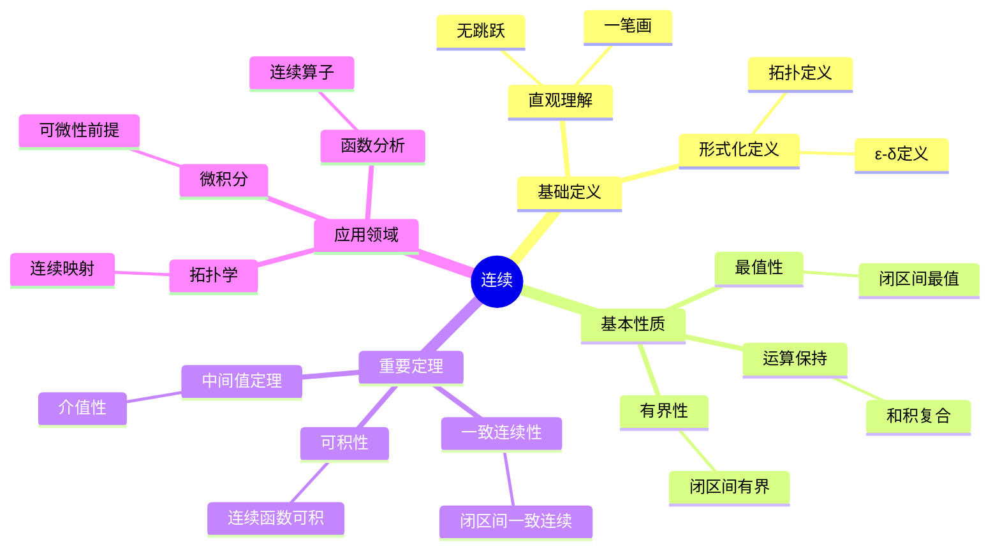

# 连续 (Continuity)

**概念编号**: C.CORE.014
**知识层次**: L0-L2
**知识领域**: D3 (分析)
**创建日期**: 2025年11月21日
**最后更新**: 2025年11月21日

---

## 📋 概述

连续性是分析学的核心概念，描述函数在局部和全局的"平滑性"。连续函数理论是微积分、拓扑学、函数分析的基础。

**权威资源对齐**:

- Wikipedia: [Continuous Function](https://en.wikipedia.org/wiki/Continuous_function)
- Stanford课程: Math 171 (Real Analysis)
- Princeton课程: MAT 201 (Analysis)
- MIT课程: 18.100A (Real Analysis)
- Metamath: [Continuity](http://us.metamath.org/mpeuni/df-cn.html)

---

## 🎯 严格定义

### 基础定义 (L0)

**直观理解**: 连续函数是"没有跳跃"的函数，其图像可以一笔画出。

**基本定义**: 函数 $f$ 在点 $a$ 连续，如果当 $x$ 接近 $a$ 时，$f(x)$ 接近 $f(a)$。

**简单例子**:

- 多项式函数连续
- 指数函数连续
- 绝对值函数在 $0$ 处连续

### 形式化定义 (L1)

**$\varepsilon$-$\delta$ 定义**: 函数 $f: X \to Y$ 在点 $a \in X$ 连续定义为：

$$\forall \varepsilon > 0, \exists \delta > 0, \forall x \in X, |x - a| < \delta \Rightarrow |f(x) - f(a)| < \varepsilon$$

**拓扑定义**: 函数 $f: X \to Y$ 连续当且仅当对任意开集 $U \subseteq Y$，$f^{-1}(U)$ 是 $X$ 中的开集。

**等价条件**:

- $\varepsilon$-$\delta$ 定义
- 拓扑定义
- 序列定义：$\lim_{n \to \infty} f(x_n) = f(\lim_{n \to \infty} x_n)$

---

## 📚 历史背景

### 发展脉络

**19世纪**: 连续性的严格化

- **Bolzano (1817)**: 研究连续函数
- **Cauchy (1821)**: 给出连续性的严格定义
- **Weierstrass (1872)**: 完善连续函数理论

### 关键人物

- **Bernard Bolzano (1781-1848)**: 研究连续函数
- **Augustin-Louis Cauchy (1789-1857)**: 给出严格定义
- **Karl Weierstrass (1815-1897)**: 完善理论

---

## 🔍 性质与定理

### 基本性质 (L1)

**性质1: 连续函数的运算**:

- **和**: 连续函数的和连续
- **积**: 连续函数的积连续
- **复合**: 连续函数的复合连续

**性质2: 连续函数的保持**:

- **有界性**: 闭区间上的连续函数有界
- **最值**: 闭区间上的连续函数达到最值

### 重要定理 (L2)

**定理1: 中间值定理**:

- **陈述**: 若 $f$ 在 $[a,b]$ 连续，$f(a) < c < f(b)$，则存在 $x \in (a,b)$ 使得 $f(x) = c$

**定理2: 一致连续性**:

- **陈述**: 闭区间上的连续函数一致连续

**定理3: 连续函数的可积性**:

- **陈述**: 闭区间上的连续函数可积

---

## 💡 应用实例

### 理论应用

- 微积分（连续性是可微性的前提）
- 拓扑学（连续映射）
- 函数分析（连续算子）

### 实际应用

- 物理学（连续介质）
- 工程学（信号处理）
- 经济学（连续模型）

---

## 🔗 关联概念

### 依赖关系

- 极限（连续性的定义需要极限）
- 函数（连续是函数的性质）

### 推广关系

- 一致连续（更强的连续性）
- 可微性（连续性的推广）

---

## 📖 参考文献

- Wikipedia: [Continuous Function](https://en.wikipedia.org/wiki/Continuous_function)
- Rudin, W. (1976). *Principles of Mathematical Analysis*. McGraw-Hill.

---

## 🗺️ 思维导图 (编号: C.CORE.014.MIND)

### 连续概念思维导图

---

## 📊 知识多维关系矩阵 (编号: C.CORE.014.MATRIX)

### 连续的多维关系矩阵

| 维度 | 指标 | 连续 |
|------|------|------|
| **知识层次** | L0基础 | ⭐⭐⭐⭐ |
| | L1中级 | ⭐⭐⭐⭐⭐ |
| | L2高级 | ⭐⭐⭐⭐ |
| | L3研究 | ⭐⭐ |
| **知识领域** | D1基础数学 | ⭐⭐⭐ |
| | D2代数 | ⭐⭐ |
| | D3分析 | ⭐⭐⭐⭐⭐ |
| | D5拓扑 | ⭐⭐⭐⭐ |
| **依赖关系** | 前置概念 | 极限、函数 |
| | 后续概念 | 可微性、可积性 |
| **应用关系** | 理论应用 | ⭐⭐⭐⭐⭐ |
| | 实际应用 | ⭐⭐⭐⭐ |
| | 交叉应用 | ⭐⭐⭐ |
| **学习难度** | 直观理解 | ⭐⭐ |
| | 形式化理解 | ⭐⭐⭐ |
| | 深入应用 | ⭐⭐⭐ |

---

## 💭 形象化解释与论证 (编号: C.CORE.014.VISUAL)

### 形象化解释

**1. 连续的直观理解**

- **类比**: 连续就像"没有跳跃"或"可以一笔画出"
- **例子**:
  - 平滑曲线：可以一笔画出，没有断点
  - 温度变化：连续的温度变化没有突然跳跃
  - 位置变化：连续的运动路径没有跳跃

**2. ε-δ定义的直观理解**

- **类比**: ε-δ定义就像"精度控制"
- **解释**:
  - ε是"允许的输出误差"
  - δ是"输入需要多接近"
  - 当输入足够接近时，输出在误差范围内

**3. 中间值定理的直观理解**

- **类比**: 中间值定理就像"连续函数不能跳过任何值"
- **例子**:
  - 如果温度从0度变到100度，必须经过所有中间温度
  - 如果函数从负值变到正值，必须经过零点

### 认知科学视角

**1. 数学教育家Dienes的观点**

- **多表征原则**: 通过图形、数值、符号等多种方式理解连续
- **变化性原则**: 通过不同的连续函数例子理解连续的本质
- **教学启示**: 使用函数图像、数值逼近、符号证明等多种方法

**2. 数学认知学家Tall的观点**

- **过程-对象对偶**: 理解"连续过程"（如何判断）和"连续函数"（对象）
- **认知层次**: 从直观理解（"无跳跃"）到形式化理解（ε-δ定义）

---

## 👨‍🏫 专家观点与论证 (编号: C.CORE.014.EXPERT)

### 数学家的观点

**1. Bernard Bolzano (1781-1848) - 连续函数研究的先驱**
> "连续函数是分析学的基础，中间值定理揭示了连续函数的深刻性质。"
>
> **意义**: Bolzano开创了连续函数的研究，为现代分析学奠定了基础。

**2. Augustin-Louis Cauchy (1789-1857) - 连续性的严格化者**
> "连续性必须通过ε-δ定义严格化，这消除了直观中的模糊性。"
>
> **意义**: Cauchy给出了连续性的严格定义，奠定了现代分析学的基础。

**3. Karl Weierstrass (1815-1897) - 连续函数理论的完善者**
> "连续函数理论是分析学的核心，一致连续性揭示了连续函数的全局性质。"
>
> **意义**: Weierstrass完善了连续函数理论，建立了现代分析学的框架。

### 数学教育家的观点

**1. Zoltan Dienes (1916-2014) - 数学教育家**
> "连续概念应该通过图形、数值、符号等多种方式学习。"
>
> **教学启示**:
>
> - 使用函数图像可视化连续
> - 使用数值逼近理解连续
> - 逐步引入ε-δ定义

**2. Hans Freudenthal (1905-1990) - 数学教育家**
> "连续概念的学习需要从'直观理解'发展到'形式化理解'。"
>
> **认知发展**:
>
> - **直观阶段**: 理解"无跳跃"的概念
> - **形式化阶段**: 理解ε-δ定义

### 数学认知学家的观点

**1. David Tall - 数学认知学家**
> "连续概念的理解需要从'过程'（如何判断）发展到'对象'（连续函数）。"
>
> **认知层次**:
>
> - **过程层次**: 理解"如何判断连续性"（如图形、数值）
> - **对象层次**: 理解"连续函数"（如$f$是连续函数）

---

**创建日期**: 2025年11月21日
**最后更新**: 2025年11月21日
**维护状态**: 持续更新中
