# 连续 (Continuity)

**概念编号**: C.CORE.014
**知识层次**: L0-L2
**知识领域**: D3 (分析)
**创建日期**: 2025年11月21日
**最后更新**: 2025年11月21日

---

## 📋 概述

连续性是分析学的核心概念，描述函数在局部和全局的"平滑性"。
连续函数理论是微积分、拓扑学、函数分析的基础。

**权威资源对齐**:

- Wikipedia: [Continuous Function](https://en.wikipedia.org/wiki/Continuous_function)
- Stanford课程: Math 171 (Real Analysis)
- Princeton课程: MAT 201 (Analysis)
- MIT课程: 18.100A (Real Analysis)
- Metamath: [Continuity](http://us.metamath.org/mpeuni/df-cn.html)

---

## 🎯 严格定义

### 基础定义 (L0)

**直观理解**: 连续函数是"没有跳跃"的函数，其图像可以一笔画出。

**基本定义**: 函数 $f$ 在点 $a$ 连续，如果当 $x$ 接近 $a$ 时，$f(x)$ 接近 $f(a)$。

**简单例子**:

- 多项式函数连续
- 指数函数连续
- 绝对值函数在 $0$ 处连续

### 形式化定义 (L1)

**$\varepsilon$-$\delta$ 定义**: 函数 $f: X \to Y$ 在点 $a \in X$ 连续定义为：

$$\forall \varepsilon > 0, \exists \delta > 0, \forall x \in X, |x - a| < \delta \Rightarrow |f(x) - f(a)| < \varepsilon$$

**拓扑定义**: 函数 $f: X \to Y$ 连续当且仅当对任意开集 $U \subseteq Y$，$f^{-1}(U)$ 是 $X$ 中的开集。

**等价条件**:

- $\varepsilon$-$\delta$ 定义
- 拓扑定义
- 序列定义：$\lim_{n \to \infty} f(x_n) = f(\lim_{n \to \infty} x_n)$

---

## 📚 历史背景

### 发展脉络

**18世纪**: 连续性的直观理解

- **Euler (1748)**: 直观使用连续函数
- **d'Alembert (1754)**: 研究连续函数的性质

**19世纪**: 连续性的严格化

- **Bolzano (1817)**: 研究连续函数，提出中间值定理
- **Cauchy (1821)**: 在《分析教程》中给出连续性的严格定义
- **Weierstrass (1872)**: 完善连续函数理论，证明有界性定理
- **Heine (1872)**: 研究一致连续性

**20世纪**: 连续性的现代发展

- **Baire (1899)**: 研究Baire分类，连续函数的分类
- **Lebesgue (1902)**: 研究可测函数，推广连续性
- **Bourbaki (1939)**: 在拓扑框架下统一连续性理论

### 关键人物

- **Leonhard Euler (1707-1783)**: 直观使用连续函数
- **Bernard Bolzano (1781-1848)**: 研究连续函数，提出中间值定理
- **Augustin-Louis Cauchy (1789-1857)**: 给出连续性的严格定义
- **Karl Weierstrass (1815-1897)**: 完善连续函数理论
- **Heinrich Heine (1821-1881)**: 研究一致连续性

### 重要事件

- **1748**: Euler广泛使用连续函数
- **1817**: Bolzano提出中间值定理
- **1821**: Cauchy给出连续性的严格定义
- **1872**: Weierstrass证明有界性定理和最值定理
- **1902**: Lebesgue研究可测函数

---

## 🔍 性质与定理

### 基本性质 (L1)

**性质1: 连续函数的运算**:

- **和**: 连续函数的和连续
- **积**: 连续函数的积连续
- **复合**: 连续函数的复合连续

**性质2: 连续函数的保持**:

- **有界性**: 闭区间上的连续函数有界
- **最值**: 闭区间上的连续函数达到最值

### 重要定理 (L2)

**定理1: 中间值定理**:

- **陈述**: 若 $f$ 在 $[a,b]$ 连续，$f(a) < c < f(b)$，则存在 $x \in (a,b)$ 使得 $f(x) = c$

**定理2: 一致连续性**:

- **陈述**: 闭区间上的连续函数一致连续

**定理3: 连续函数的可积性**:

- **陈述**: 闭区间上的连续函数可积

---

## 🔬 形式化证明

### 定理1: 中间值定理的形式化证明

**定理陈述**:
$$\forall f \forall a \forall b \forall c [\text{Cont}(f, [a,b]) \land f(a) < c < f(b) \to \exists x \in (a,b) (f(x) = c)]$$

**前提**:
- 连续函数的定义
- 实数的完备性
- 区间套定理

**形式化证明**:

```
步骤1: 假设条件
  设: Cont(f, [a,b]) and f(a) < c < f(b)

步骤2: 构造区间序列
  定义: [a_0, b_0] = [a, b]
  递归: 若f((a_n+b_n)/2) < c，则[a_{n+1}, b_{n+1}] = [(a_n+b_n)/2, b_n]
        否则[a_{n+1}, b_{n+1}] = [a_n, (a_n+b_n)/2]
  性质: f(a_n) < c < f(b_n)对所有n

步骤3: 区间套性质
  b_n - a_n = (b-a)/2^n -> 0
  由区间套定理: exists x, x in [a_n, b_n]对所有n

步骤4: 证明f(x) = c
  由连续性: lim f(a_n) = f(x) = lim f(b_n)
  由步骤2: f(a_n) < c < f(b_n)
  取极限: f(x) <= c <= f(x)
  因此: f(x) = c

步骤5: 结论
  因此: exists x in (a,b), f(x) = c
```

**Metamath格式参考**:
```
${
  ivt.1 $e |- f e. ( RR ^m RR ) $.
  ivt.2 $e |- Cont(f, [A, B]) $.
  ivt.3 $e |- A e. RR $.
  ivt.4 $e |- B e. RR $.
  ivt.5 $e |- A < B $.
  ivt.6 $e |- f(A) < C < f(B) $.
  ivt $p |- exists x in (A, B), f(x) = C $=
    ( ... ) ABCDEFGH $.
$}
```

---

## 💡 应用实例

### 理论应用

- 微积分（连续性是可微性的前提）
- 拓扑学（连续映射）
- 函数分析（连续算子）

### 实际应用

#### 应用1: 物理学 - 温度连续变化

**问题描述**:
某物体的温度函数为 $T(t) = 20 + 10e^{-0.1t}$（摄氏度），验证温度函数在 $t = 5$ 秒处连续。

**数学建模**:
函数连续需要：$\lim_{t \to 5} T(t) = T(5)$。

**计算过程**:

- 温度函数：$T(t) = 20 + 10e^{-0.1t}$
- $T(5) = 20 + 10e^{-0.5} = 20 + 10 \times 0.6065 = 26.065$ 摄氏度
- $\lim_{t \to 5} T(t) = 20 + 10e^{-0.5} = 26.065$ 摄氏度
- 因此：$\lim_{t \to 5} T(t) = T(5)$，函数连续 ✓

**结果解释**:
温度函数连续，表示温度变化没有突然跳跃，符合物理实际。

**数据**:

- 时间: $t = 5$ 秒
- 温度: $T(5) = 26.065$ 摄氏度
- 连续性: 连续

#### 应用2: 工程学 - 信号处理中的连续信号

**问题描述**:
连续信号 $f(t) = \sin(2\pi t)$ 在区间 $[0, 1]$ 上连续，用于信号采样。

**数学建模**:
连续信号可以精确采样，采样定理要求采样频率 $f_s \geq 2f_{max}$。

**计算过程**:

- 信号：$f(t) = \sin(2\pi t)$
- 最大频率：$f_{max} = 1$ Hz
- 采样频率：$f_s \geq 2$ Hz（Nyquist频率）
- 采样间隔：$\Delta t \leq \frac{1}{2}$ 秒

**结果解释**:
连续信号可以精确采样和重构。采样定理保证了信号不失真。

**数据**:

- 信号频率: 1 Hz
- 采样频率: $\geq 2$ Hz
- 采样间隔: $\leq 0.5$ 秒

#### 应用3: 经济学 - 连续复利模型

**问题描述**:
本金 $P = 1000$ 元，连续复利利率 $r = 0.05$（5%），求 $t = 3$ 年后的本息和。

**数学建模**:
连续复利公式：$A(t) = Pe^{rt}$，其中 $A(t)$ 是连续函数。

**计算过程**:

- 本金：$P = 1000$ 元
- 利率：$r = 0.05$
- 时间：$t = 3$ 年
- 本息和：$A(3) = 1000e^{0.15} = 1000 \times 1.1618 = 1161.8$ 元

**结果解释**:
连续复利模型使用连续函数，可以精确计算任意时刻的本息和。

**数据**:

- 本金: 1000元
- 利率: 5%
- 时间: 3年
- 本息和: 1161.8元

---

## 🔗 关联概念

### 依赖关系

- 极限（连续性的定义需要极限）
- 函数（连续是函数的性质）

### 推广关系

- 一致连续（更强的连续性）
- 可微性（连续性的推广）

---

## 📖 参考文献

### 经典教材

1. **Rudin, W. (1976). *Principles of Mathematical Analysis* (3rd ed.). McGraw-Hill.**
   - **内容**: 数学分析的经典教材，严格处理连续性理论
   - **适用层次**: L1-L3
   - **特点**: 严谨清晰，适合深入学习

2. **Apostol, T. M. (1974). *Mathematical Analysis: A Modern Approach to Advanced Calculus* (2nd ed.). Addison-Wesley.**
   - **内容**: 数学分析的现代处理，强调几何直观
   - **适用层次**: L1-L2
   - **特点**: 直观易懂，包含大量应用

3. **Munkres, J. R. (2000). *Topology* (2nd ed.). Prentice Hall.**
   - **内容**: 拓扑学的经典教材，讨论连续映射
   - **适用层次**: L1-L3
   - **特点**: 严谨清晰，适合深入学习

### 研究论文

1. **Bolzano, B. (1817). Rein analytischer Beweis des Lehrsatzes, dass zwischen je zwey Werthen, die ein entgegengesetztes Resultat gewähren, wenigstens eine reelle Wurzel der Gleichung liege. *Prag: Gottlieb Haase Söhne*.**
   - **内容**: 研究连续性和中间值定理
   - **重要性**: 连续性理论的早期工作

2. **Cauchy, A.-L. (1821). *Cours d'analyse de l'École Royale Polytechnique*. De l'Imprimerie Royale.**
   - **内容**: 给出连续函数的严格定义
   - **重要性**: 连续性理论严格化的开始

3. **Weierstrass, K. (1872). Über continuirliche Functionen eines reellen Arguments, die für keinen Werth des letzteren einen bestimmten Differentialquotienten besitzen. *Königliche Akademie der Wissenschaften*, 71-74.**
   - **内容**: 构造处处连续但无处可导的函数
   - **重要性**: 揭示了连续性和可微性的区别

### 标准参考书

1. **Wikipedia contributors. (2024). Continuous function. In *Wikipedia, The Free Encyclopedia*. Retrieved from <https://en.wikipedia.org/wiki/Continuous_function>**
   - **内容**: 连续函数概念的全面介绍
   - **特点**: 易于访问，包含大量示例

2. **Wikipedia contributors. (2024). Continuity (mathematics). In *Wikipedia, The Free Encyclopedia*. Retrieved from <https://en.wikipedia.org/wiki/Continuity_(mathematics)>**
   - **内容**: 连续性概念的详细介绍
   - **特点**: 包含$\varepsilon$-$\delta$定义和拓扑定义

### 在线课程

1. **MIT OpenCourseWare. (2024). 18.01 Single Variable Calculus. Retrieved from <https://ocw.mit.edu/>**
   - **内容**: 单变量微积分课程，深入讨论连续性
   - **特点**: 免费公开课程

2. **Khan Academy. (2024). Continuity. Retrieved from <https://www.khanacademy.org/>**
   - **内容**: 连续性的在线课程
   - **特点**: 适合初学者

### 形式化数学资源

1. **Metamath contributors. (2024). Continuity. In *Metamath Proof Explorer*. Retrieved from <http://us.metamath.org/mpeuni/df-cn.html>**
   - **内容**: 连续性的形式化证明
   - **特点**: 完全形式化的证明系统

---

## 🗺️ 思维导图 (编号: C.CORE.014.MIND)

### 连续概念思维导图

```mermaid
mindmap
  root((连续))
    基础定义
      直观理解
        无跳跃
        一笔画
      形式化定义
        ε-δ定义
        拓扑定义
    基本性质
      运算保持
        和积复合
      有界性
        闭区间有界
      最值性
        闭区间最值
    重要定理
      中间值定理
        介值性
      一致连续性
        闭区间一致连续
      可积性
        连续函数可积
    应用领域
      微积分
        可微性前提
      拓扑学
        连续映射
      函数分析
        连续算子
```



---

## 📊 知识多维关系矩阵 (编号: C.CORE.014.MATRIX)

### 连续的多维关系矩阵

| 维度 | 指标 | 连续 |
|------|------|------|
| **知识层次** | L0基础 | ⭐⭐⭐⭐ |
| | L1中级 | ⭐⭐⭐⭐⭐ |
| | L2高级 | ⭐⭐⭐⭐ |
| | L3研究 | ⭐⭐ |
| **知识领域** | D1基础数学 | ⭐⭐⭐ |
| | D2代数 | ⭐⭐ |
| | D3分析 | ⭐⭐⭐⭐⭐ |
| | D5拓扑 | ⭐⭐⭐⭐ |
| **依赖关系** | 前置概念 | 极限、函数 |
| | 后续概念 | 可微性、可积性 |
| **应用关系** | 理论应用 | ⭐⭐⭐⭐⭐ |
| | 实际应用 | ⭐⭐⭐⭐ |
| | 交叉应用 | ⭐⭐⭐ |
| **学习难度** | 直观理解 | ⭐⭐ |
| | 形式化理解 | ⭐⭐⭐ |
| | 深入应用 | ⭐⭐⭐ |

---

## 💭 形象化解释与论证 (编号: C.CORE.014.VISUAL)

### 形象化解释

**1. 连续的直观理解**

- **类比**: 连续就像"没有跳跃"或"可以一笔画出"
- **例子**:
  - 平滑曲线：可以一笔画出，没有断点
  - 温度变化：连续的温度变化没有突然跳跃
  - 位置变化：连续的运动路径没有跳跃

**2. ε-δ定义的直观理解**

- **类比**: ε-δ定义就像"精度控制"
- **解释**:
  - ε是"允许的输出误差"
  - δ是"输入需要多接近"
  - 当输入足够接近时，输出在误差范围内

**3. 中间值定理的直观理解**

- **类比**: 中间值定理就像"连续函数不能跳过任何值"
- **例子**:
  - 如果温度从0度变到100度，必须经过所有中间温度
  - 如果函数从负值变到正值，必须经过零点

### 认知科学视角

**1. 数学教育家Dienes的观点**

- **多表征原则**: 通过图形、数值、符号等多种方式理解连续
- **变化性原则**: 通过不同的连续函数例子理解连续的本质
- **教学启示**: 使用函数图像、数值逼近、符号证明等多种方法

**2. 数学认知学家Tall的观点**

- **过程-对象对偶**: 理解"连续过程"（如何判断）和"连续函数"（对象）
- **认知层次**: 从直观理解（"无跳跃"）到形式化理解（ε-δ定义）

---

## 👨‍🏫 专家观点与论证 (编号: C.CORE.014.EXPERT)

### 数学家的观点

**1. Bernard Bolzano (1781-1848) - 连续函数研究的先驱**
> "连续函数是分析学的基础，中间值定理揭示了连续函数的深刻性质。"
>
> **意义**: Bolzano开创了连续函数的研究，为现代分析学奠定了基础。

**2. Augustin-Louis Cauchy (1789-1857) - 连续性的严格化者**
> "连续性必须通过ε-δ定义严格化，这消除了直观中的模糊性。"
>
> **意义**: Cauchy给出了连续性的严格定义，奠定了现代分析学的基础。

**3. Karl Weierstrass (1815-1897) - 连续函数理论的完善者**
> "连续函数理论是分析学的核心，一致连续性揭示了连续函数的全局性质。"
>
> **意义**: Weierstrass完善了连续函数理论，建立了现代分析学的框架。

### 数学教育家的观点

**1. Zoltan Dienes (1916-2014) - 数学教育家**
> "连续概念应该通过图形、数值、符号等多种方式学习。"
>
> **教学启示**:
>
> - 使用函数图像可视化连续
> - 使用数值逼近理解连续
> - 逐步引入ε-δ定义

**2. Hans Freudenthal (1905-1990) - 数学教育家**
> "连续概念的学习需要从'直观理解'发展到'形式化理解'。"
>
> **认知发展**:
>
> - **直观阶段**: 理解"无跳跃"的概念
> - **形式化阶段**: 理解ε-δ定义

### 数学认知学家的观点

**1. David Tall - 数学认知学家**
> "连续概念的理解需要从'过程'（如何判断）发展到'对象'（连续函数）。"
>
> **认知层次**:
>
> - **过程层次**: 理解"如何判断连续性"（如图形、数值）
> - **对象层次**: 理解"连续函数"（如$f$是连续函数）

---

## 🎨 认知维度表征 (编号: C.CORE.014.COGNITIVE)

### 直观维度表征 (编号: C.CORE.014.INTUITIVE)

#### 形象类比

- **无跳跃类比**: 连续函数就像"没有跳跃"的函数
  - 就像一条可以一笔画出的曲线
  - 就像温度连续变化，没有突然的跳跃

- **平滑类比**: 连续函数就像"平滑"的函数
  - 就像一条没有断点的曲线
  - 就像物体运动的连续轨迹

#### 具体例子

- **例子1**: $f(x) = x^2$ 在所有点连续
  - 图像是一条平滑的抛物线
  - 没有跳跃或断点

- **例子2**: $f(x) = \frac{1}{x}$ 在 $x=0$ 处不连续
  - 在 $x=0$ 处有垂直渐近线
  - 存在断点

#### 可视化表示

```mermaid
graph LR
    A[函数值] --> B[接近函数值]
    B --> C[连续性]
    D[无跳跃] --> C
    E[平滑曲线] --> C

    style A fill:#fff4e1
    style C fill:#e8f5e9
```



#### 几何直观

- **函数图像**: 通过函数图像理解连续性
  - 连续函数的图像可以一笔画出
  - 不连续函数在断点处有跳跃

- **拓扑直观**: 通过拓扑理解连续性
  - 连续函数保持"接近"关系
  - 开集的原像是开集

---

### 知性维度表征 (编号: C.CORE.014.INTELLECTUAL)

#### 概念定义

- **严格定义**: $\forall \varepsilon > 0, \exists \delta > 0, \forall x, |x - a| < \delta \Rightarrow |f(x) - f(a)| < \varepsilon$
- **等价定义**: 拓扑定义、序列定义
- **特征描述**: 连续函数是"没有跳跃"的函数

#### 概念分类

- **点连续 vs 区间连续**: 按连续范围分类
- **一致连续 vs 逐点连续**: 按连续方式分类
- **连续函数 vs 不连续函数**: 按连续性分类

#### 概念关系

```mermaid
graph TD
    A[连续] --> B[极限]
    A --> C[导数]
    A --> D[积分]
    B --> E[ε-δ定义]
    C --> F[可导性]

    style A fill:#e8f5e9
```



#### 知识矩阵

| 维度 | 指标 | 连续 |
|------|------|------|
| **知识层次** | L0基础 | ⭐⭐⭐⭐ |
| | L1中级 | ⭐⭐⭐⭐⭐ |
| | L2高级 | ⭐⭐⭐⭐ |
| **知识领域** | D3分析 | ⭐⭐⭐⭐⭐ |
| **学习难度** | 直观理解 | ⭐⭐ |
| | 形式化理解 | ⭐⭐⭐⭐ |
| **认知维度** | 直观维度 | ⭐⭐⭐⭐ |
| | 知性维度 | ⭐⭐⭐⭐⭐ |
| | 理性维度 | ⭐⭐⭐⭐ |

---

### 理性维度表征 (编号: C.CORE.014.RATIONAL)

#### 公理体系

- **ε-δ定义**: $\forall \varepsilon > 0, \exists \delta > 0, \forall x, |x - a| < \delta \Rightarrow |f(x) - f(a)| < \varepsilon$
- **拓扑定义**: 对任意开集 $U$，$f^{-1}(U)$ 是开集
- **序列定义**: $\lim_{n \to \infty} f(x_n) = f(\lim_{n \to \infty} x_n)$

#### 形式化定义

- **形式化定义**: 使用一阶逻辑严格定义
- **符号系统**: $f$ 连续、$C(X,Y)$ 连续函数空间
- **类型系统**: 连续函数是函数类型到布尔类型的映射

#### 逻辑推理

- **基本定理**: 连续函数的运算、中间值定理、最值定理
- **证明思路**: 使用ε-δ方法和拓扑方法证明
- **推理链**: 定义 → 运算性质 → 中间值定理 → 最值定理

#### 证明系统

- **证明方法**: ε-δ方法、拓扑方法、序列方法
- **形式化证明**: 可以使用Lean4等工具进行形式化
- **验证工具**: Metamath、Lean4等

---

### 综合整合表征 (编号: C.CORE.014.INTEGRATED)

#### 多维度整合

```mermaid
graph TB
    subgraph 直观维度
        A1[无跳跃]
        A2[平滑曲线]
    end

    subgraph 知性维度
        B1[概念定义]
        B2[概念分类]
    end

    subgraph 理性维度
        C1[ε-δ定义]
        C2[形式化证明]
    end

    A1 --> B1
    A2 --> B1
    B1 --> B2
    B2 --> C1
    C1 --> C2

    style A1 fill:#fff4e1
    style B1 fill:#e8f5e9
    style C1 fill:#f3e5f5
```

#### 图形转换

- **思维导图**: 展示连续性的知识结构
- **知识图谱**: 展示连续性与其他概念的关系
- **知识矩阵**: 展示连续性的多维度特征

#### 应用示例

- **应用1**: 微积分基本定理依赖于连续性
- **应用2**: 优化问题中使用连续性求最值
- **应用3**: 拓扑学中使用连续性定义同胚

---

## 📚 习题库

### L0基础题（5道）

**EX.CORE.014.01** (L0, 概念理解)

- **题目**: 判断函数 $f(x) = x^2$ 在 $x = 1$ 处是否连续。
- **答案**: 连续（$\lim_{x \to 1} x^2 = 1 = f(1)$）。

**EX.CORE.014.02** (L0, 计算)

- **题目**: 判断函数 $f(x) = \begin{cases} x & x \neq 0 \\ 1 & x = 0 \end{cases}$ 在 $x = 0$ 处是否连续。
- **答案**: 不连续（$\lim_{x \to 0} f(x) = 0 \neq 1 = f(0)$）。

**EX.CORE.014.03** (L0, 概念理解)

- **题目**: 用 $\varepsilon$-$\delta$ 语言表述：函数 $f$ 在 $a$ 处连续。
- **答案**: 对任意 $\varepsilon > 0$，存在 $\delta > 0$，使得当 $|x - a| < \delta$ 时，$|f(x) - f(a)| < \varepsilon$。

**EX.CORE.014.04** (L0, 计算)

- **题目**: 判断函数 $f(x) = \frac{1}{x}$ 在 $x = 0$ 处是否连续。
- **答案**: 不连续（$f$ 在 $x = 0$ 处无定义）。

**EX.CORE.014.05** (L0, 应用)

- **题目**: 找出函数 $f(x) = \frac{x^2 - 1}{x - 1}$ 的所有不连续点。
- **答案**: $x = 1$（可去间断点，因为 $\lim_{x \to 1} f(x) = 2$）。

### L1中级题（6道）

**EX.CORE.014.06** (L1, 证明)

- **题目**: 证明：若 $f$ 和 $g$ 在 $a$ 处连续，则 $f + g$ 在 $a$ 处连续。
- **提示**: 使用连续性的定义和极限的性质。
- **答案**: $\lim_{x \to a} (f + g)(x) = \lim_{x \to a} f(x) + \lim_{x \to a} g(x) = f(a) + g(a) = (f + g)(a)$。

**EX.CORE.014.07** (L1, 证明)

- **题目**: 证明：若 $f$ 在 $a$ 处连续，$g$ 在 $f(a)$ 处连续，则 $g \circ f$ 在 $a$ 处连续。
- **提示**: 使用连续性的定义。
- **答案**: 对任意 $\varepsilon > 0$，存在 $\delta_1 > 0$ 使得当 $|y - f(a)| < \delta_1$ 时 $|g(y) - g(f(a))| < \varepsilon$。存在 $\delta > 0$ 使得当 $|x - a| < \delta$ 时 $|f(x) - f(a)| < \delta_1$，因此 $|g(f(x)) - g(f(a))| < \varepsilon$。

**EX.CORE.014.08** (L1, 证明)

- **题目**: 证明中间值定理：若 $f$ 在 $[a, b]$ 上连续且 $f(a) < 0 < f(b)$，则存在 $c \in (a, b)$ 使得 $f(c) = 0$。
- **提示**: 使用区间套定理。
- **答案**: 构造区间序列 $[a_n, b_n]$ 使得 $f(a_n) < 0 < f(b_n)$ 且 $b_n - a_n \to 0$，则存在 $c \in \bigcap [a_n, b_n]$ 使得 $f(c) = 0$。

**EX.CORE.014.09** (L1, 计算)

- **题目**: 证明：函数 $f(x) = x^3 - x - 1$ 在 $(0, 2)$ 内有根。
- **答案**: $f(0) = -1 < 0$，$f(2) = 5 > 0$，由中间值定理存在 $c \in (0, 2)$ 使得 $f(c) = 0$。

**EX.CORE.014.10** (L1, 证明)

- **题目**: 证明：连续函数在闭区间上达到最大值和最小值。
- **提示**: 使用有界性定理和最值定理。
- **答案**: 由有界性定理，$f$ 在 $[a, b]$ 上有界。设 $M = \sup\{f(x) : x \in [a, b]\}$，则存在序列 $(x_n)$ 使得 $f(x_n) \to M$，由紧性存在子列收敛到 $c \in [a, b]$，因此 $f(c) = M$。

**EX.CORE.014.11** (L1, 应用)

- **题目**: 证明：若 $f$ 在 $[a, b]$ 上连续且 $f(a) = f(b)$，则存在 $c \in (a, b)$ 使得 $f'(c) = 0$（Rolle定理的特殊情况）。
- **提示**: 使用最值定理。
- **答案**: 若 $f$ 是常数，则结论显然。否则，$f$ 在 $[a, b]$ 上达到最大值或最小值在 $(a, b)$ 内，设为 $c$，则 $f'(c) = 0$。

### L2高级题（4道）

**EX.CORE.014.12** (L2, 证明)

- **题目**: 证明：函数 $f$ 在 $a$ 处连续当且仅当对任意序列 $(x_n) \to a$，有 $f(x_n) \to f(a)$。
- **提示**: 证明两个方向。
- **答案**: （必要性）若 $f$ 在 $a$ 处连续，则对任意序列 $(x_n) \to a$，由连续性 $f(x_n) \to f(a)$。（充分性）若对任意序列都有 $f(x_n) \to f(a)$，假设 $f$ 在 $a$ 处不连续，则存在序列 $(x_n) \to a$ 使得 $f(x_n) \not\to f(a)$，矛盾。

**EX.CORE.014.13** (L2, 证明)

- **题目**: 证明：一致连续函数将Cauchy序列映射为Cauchy序列。
- **提示**: 使用一致连续性的定义。
- **答案**: 设 $(x_n)$ 是Cauchy序列，$f$ 是一致连续。对任意 $\varepsilon > 0$，存在 $\delta > 0$ 使得当 $|x - y| < \delta$ 时 $|f(x) - f(y)| < \varepsilon$。存在 $N$ 使得当 $m, n > N$ 时 $|x_m - x_n| < \delta$，因此 $|f(x_m) - f(x_n)| < \varepsilon$，所以 $(f(x_n))$ 是Cauchy序列。

**EX.CORE.014.14** (L2, 综合)

- **题目**: 证明：连续函数在紧集上的像也是紧集。
- **提示**: 使用紧性的定义。
- **答案**: 设 $K$ 是紧集，$f$ 连续。对 $f(K)$ 的任意开覆盖，$f$ 的原像构成 $K$ 的开覆盖，有有限子覆盖，因此 $f(K)$ 有有限子覆盖，所以 $f(K)$ 是紧集。

**EX.CORE.014.15** (L2, 证明)

- **题目**: 证明：若 $f$ 在 $[a, b]$ 上连续且单射，则 $f$ 严格单调。
- **提示**: 使用中间值定理。
- **答案**: 假设 $f$ 不是严格单调，则存在 $x_1 < x_2 < x_3$ 使得 $f(x_2)$ 不在 $f(x_1)$ 和 $f(x_3)$ 之间，由中间值定理存在 $y \in (x_1, x_3)$ 使得 $f(y) = f(x_2)$，与单射矛盾。

---

**创建日期**: 2025年11月21日
**最后更新**: 2025年11月21日
**维护状态**: 持续更新中
