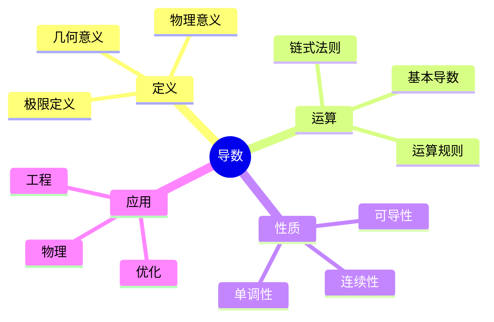
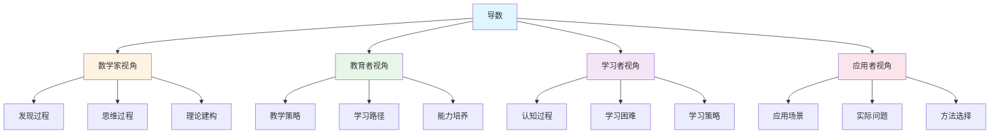
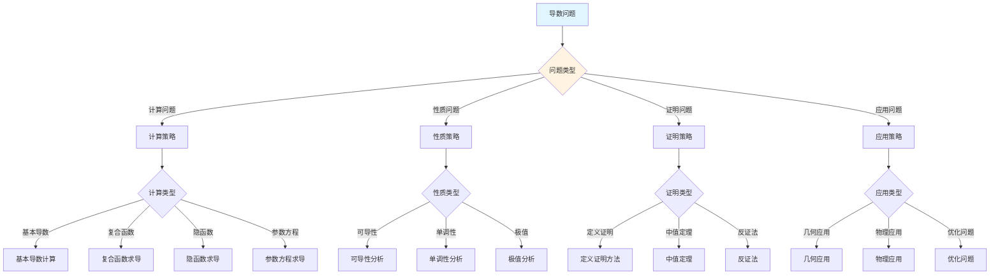
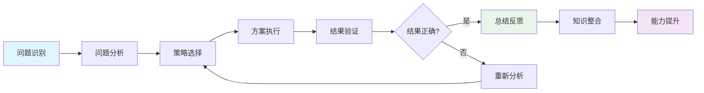
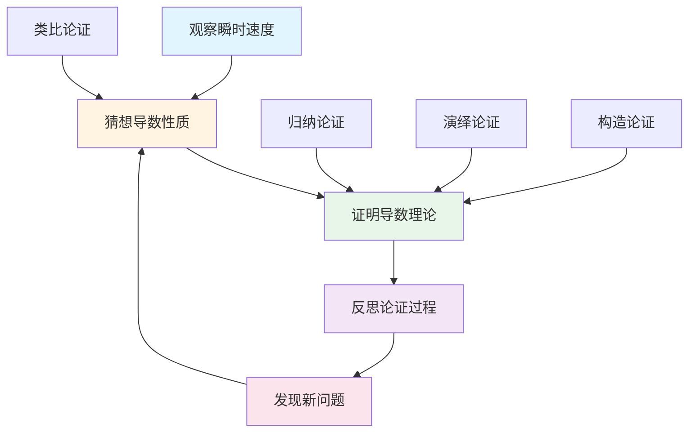
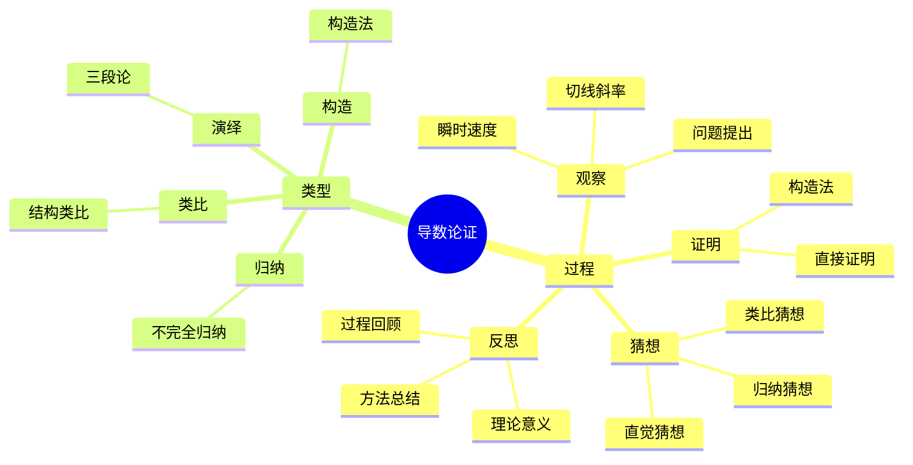

# 导数 (Derivative) - 三视角组织版

**概念编号**: C.CORE.015
**知识层次**: L0-L2
**知识领域**: D3 (分析)
**创建日期**: 2025年1月
**最后更新**: 2025年1月

---

## 📋 目录 / Table of Contents

- [导数 (Derivative) - 三视角组织版](#导数-derivative---三视角组织版)
  - [📋 目录 / Table of Contents](#-目录--table-of-contents)
  - [1. 📋 概述 (编号: C.CORE.015.01)](#1--概述-编号-ccore01501)
  - [🧠 认知学视角：如何理解导数 (编号: C.CORE.015.02)](#-认知学视角如何理解导数-编号-ccore01502)
    - [认知起点 (编号: C.CORE.015.02.01)](#认知起点-编号-ccore0150201)
    - [认知过程 (编号: C.CORE.015.02.02)](#认知过程-编号-ccore0150202)
      - [阶段1：直观理解阶段 (编号: C.CORE.015.02.02.01)](#阶段1直观理解阶段-编号-ccore015020201)
      - [阶段2：概念形成阶段 (编号: C.CORE.015.02.02.02)](#阶段2概念形成阶段-编号-ccore015020202)
      - [阶段3：形式化阶段 (编号: C.CORE.015.02.02.03)](#阶段3形式化阶段-编号-ccore015020203)
    - [认知障碍 (编号: C.CORE.015.02.03)](#认知障碍-编号-ccore0150203)
    - [认知工具 (编号: C.CORE.015.02.04)](#认知工具-编号-ccore0150204)
  - [🎓 教育学视角：如何教学导数 (编号: C.CORE.015.03)](#-教育学视角如何教学导数-编号-ccore01503)
    - [教学目标 (编号: C.CORE.015.03.01)](#教学目标-编号-ccore0150301)
    - [教学路径 (编号: C.CORE.015.03.02)](#教学路径-编号-ccore0150302)
      - [阶段1：引入阶段（激发兴趣） (编号: C.CORE.015.03.02.01)](#阶段1引入阶段激发兴趣-编号-ccore015030201)
      - [阶段2：探索阶段（主动建构） (编号: C.CORE.015.03.02.02)](#阶段2探索阶段主动建构-编号-ccore015030202)
      - [阶段3：形式化阶段（抽象概括） (编号: C.CORE.015.03.02.03)](#阶段3形式化阶段抽象概括-编号-ccore015030203)
      - [阶段4：巩固阶段（应用深化） (编号: C.CORE.015.03.02.04)](#阶段4巩固阶段应用深化-编号-ccore015030204)
    - [教学难点 (编号: C.CORE.015.03.03)](#教学难点-编号-ccore0150303)
    - [教学策略 (编号: C.CORE.015.03.04)](#教学策略-编号-ccore0150304)
    - [评估方法 (编号: C.CORE.015.03.05)](#评估方法-编号-ccore0150305)
  - [🔬 数学家视角：如何思考导数 (编号: C.CORE.015.04)](#-数学家视角如何思考导数-编号-ccore01504)
    - [问题起源 (编号: C.CORE.015.04.01)](#问题起源-编号-ccore0150401)
    - [思维过程 (编号: C.CORE.015.04.02)](#思维过程-编号-ccore0150402)
      - [步骤1：问题提出 (编号: C.CORE.015.04.02.01)](#步骤1问题提出-编号-ccore015040201)
      - [步骤2：概念形成 (编号: C.CORE.015.04.02.02)](#步骤2概念形成-编号-ccore015040202)
      - [步骤3：理论发展 (编号: C.CORE.015.04.02.03)](#步骤3理论发展-编号-ccore015040203)
    - [历史发展 (编号: C.CORE.015.04.03)](#历史发展-编号-ccore0150403)
    - [3.2 关键人物和贡献 (编号: C.CORE.015.04.04)](#32-关键人物和贡献-编号-ccore0150404)
    - [重要定理 (编号: C.CORE.015.04.05)](#重要定理-编号-ccore0150405)
    - [开放问题 (编号: C.CORE.015.04.06)](#开放问题-编号-ccore0150406)
    - [一、第一人称思维描述 (编号: C.CORE.015.04.07)](#一第一人称思维描述-编号-ccore0150407)
      - [1.1 Newton和Leibniz的发现过程](#11-newton和leibniz的发现过程)
    - [二、数学直觉的形成 (编号: C.CORE.015.04.08)](#二数学直觉的形成-编号-ccore0150408)
      - [2.1 直觉在概念发现中的作用](#21-直觉在概念发现中的作用)
      - [2.2 如何培养导数直觉](#22-如何培养导数直觉)
    - [三、数学美的教育价值 (编号: C.CORE.015.04.09)](#三数学美的教育价值-编号-ccore0150409)
      - [3.1 导数论的美在哪里](#31-导数论的美在哪里)
      - [3.2 如何培养学生的数学美感](#32-如何培养学生的数学美感)
    - [四、问题解决策略 (编号: C.CORE.015.04.10)](#四问题解决策略-编号-ccore0150410)
      - [4.1 数学家的启发式方法](#41-数学家的启发式方法)
      - [4.2 思维过程分析（通过具体问题）](#42-思维过程分析通过具体问题)
    - [五、批判性反思 (编号: C.CORE.015.04.11)](#五批判性反思-编号-ccore0150411)
      - [5.1 导数概念的局限性（深入分析）](#51-导数概念的局限性深入分析)
      - [5.2 导数理论的未解决问题（深入分析）](#52-导数理论的未解决问题深入分析)
  - [💡 数学解释：为什么导数是这样定义的 (编号: C.CORE.015.05)](#-数学解释为什么导数是这样定义的-编号-ccore01505)
    - [一、直观解释：导数是什么？](#一直观解释导数是什么)
      - [1.1 具体例子](#11-具体例子)
      - [1.2 形象类比](#12-形象类比)
      - [1.3 几何直观](#13-几何直观)
      - [1.4 操作体验](#14-操作体验)
    - [二、知性解释：导数的本质是什么？](#二知性解释导数的本质是什么)
      - [2.1 概念定义](#21-概念定义)
      - [2.2 分类体系](#22-分类体系)
      - [2.3 抽象结构](#23-抽象结构)
      - [2.4 知识体系](#24-知识体系)
    - [三、理性解释：导数的公理化定义](#三理性解释导数的公理化定义)
      - [3.1 公理体系](#31-公理体系)
      - [3.2 形式化证明](#32-形式化证明)
      - [3.3 系统建构](#33-系统建构)
    - [四、多视角解释：从不同角度理解导数](#四多视角解释从不同角度理解导数)
      - [4.1 数学家视角：导数是如何被发现的？](#41-数学家视角导数是如何被发现的)
      - [4.2 教育者视角：如何教学导数？](#42-教育者视角如何教学导数)
      - [4.3 学习者视角：如何学习导数？](#43-学习者视角如何学习导数)
      - [4.4 应用者视角：如何应用导数？](#44-应用者视角如何应用导数)
    - [五、思维表征：用多种方式理解导数](#五思维表征用多种方式理解导数)
      - [5.1 思维导图：导数的知识结构](#51-思维导图导数的知识结构)
      - [5.2 矩阵对比：不同解释方式的对比](#52-矩阵对比不同解释方式的对比)
      - [5.3 多视角表征：从不同角度表征导数](#53-多视角表征从不同角度表征导数)
      - [5.4 决策树：导数问题分类和策略选择](#54-决策树导数问题分类和策略选择)
      - [5.5 决策逻辑路径：导数问题解决过程](#55-决策逻辑路径导数问题解决过程)
      - [5.6 多维对比矩阵：导数概念特征对比](#56-多维对比矩阵导数概念特征对比)
  - [🔍 数学论证：如何论证导数 (编号: C.CORE.015.06)](#-数学论证如何论证导数-编号-ccore01506)
    - [一、论证过程：从观察到反思](#一论证过程从观察到反思)
      - [1.1 观察（Observation）](#11-观察observation)
      - [1.2 猜想（Conjecture）](#12-猜想conjecture)
      - [1.3 证明（Proof）](#13-证明proof)
      - [1.4 反思（Reflection）](#14-反思reflection)
    - [二、论证类型：多种推理方式](#二论证类型多种推理方式)
      - [2.1 归纳论证（Inductive Reasoning）](#21-归纳论证inductive-reasoning)
      - [2.2 演绎论证（Deductive Reasoning）](#22-演绎论证deductive-reasoning)
      - [2.3 类比论证（Analogical Reasoning）](#23-类比论证analogical-reasoning)
      - [2.4 构造论证（Constructive Reasoning）](#24-构造论证constructive-reasoning)
    - [三、论证可视化：用图形表示论证过程](#三论证可视化用图形表示论证过程)
      - [3.1 论证流程图](#31-论证流程图)
      - [3.2 论证类型对比](#32-论证类型对比)
      - [3.3 论证思维导图](#33-论证思维导图)
  - [🔗 三视角整合 (编号: C.CORE.015.07)](#-三视角整合-编号-ccore01507)
    - [三个视角的关联](#三个视角的关联)
    - [如何综合运用三个视角](#如何综合运用三个视角)
  - [📚 参考文献 (编号: C.CORE.015.08)](#-参考文献-编号-ccore01508)
    - [权威资源](#权威资源)
    - [经典教材](#经典教材)
    - [研究论文](#研究论文)

---

---

## 1. 📋 概述 (编号: C.CORE.015.01)

导数是微积分的核心概念，描述函数的变化率。导数理论在数学、物理学、工程学等领域有广泛应用。

本文档从**数学认知学**、**教育学**、**数学家**三个视角深入展开导数概念，避免简单的概念堆垒。

**权威资源对齐**:

- Wikipedia: [Derivative](https://en.wikipedia.org/wiki/Derivative)
- Stanford课程: Math 51 (Linear Algebra and Differential Calculus)
- Princeton课程: MAT 201 (Analysis)
- MIT课程: 18.01 (Single Variable Calculus)
- Metamath: [Derivative](http://us.metamath.org/mpeuni/df-dv.html)

---

## 🧠 认知学视角：如何理解导数 (编号: C.CORE.015.02)

### 认知起点 (编号: C.CORE.015.02.01)

**学习者已有的知识基础**:

- 函数的概念
- 极限的概念
- 日常经验中的"变化率"、"速度"概念

**日常经验中的类似概念**:

- "速度"：位置的变化率
- "加速度"：速度的变化率
- "增长率"：数量的变化率

### 认知过程 (编号: C.CORE.015.02.02)

#### 阶段1：直观理解阶段 (编号: C.CORE.015.02.02.01)

**具体例子**:

- 例子1：$(x^2)' = 2x$ - 平方函数的导数
- 例子2：$(\sin x)' = \cos x$ - 正弦函数的导数
- 例子3：$(e^x)' = e^x$ - 指数函数的导数

**形象类比**:

- **速度类比**: 导数就像"瞬时速度"
  - 平均速度：$\frac{\Delta s}{\Delta t}$
  - 瞬时速度：$\lim_{\Delta t \to 0} \frac{\Delta s}{\Delta t}$

- **切线类比**: 导数就像"切线的斜率"
  - 割线斜率：$\frac{f(x+h) - f(x)}{h}$
  - 切线斜率：$\lim_{h \to 0} \frac{f(x+h) - f(x)}{h}$

**可视化表示**:

```text
导数的几何意义:
    y
    ↑
    |     ╱
    |    ╱
    |   ╱
    |  ╱
    └──────────→ x
    切线斜率 = f'(x)
```

#### 阶段2：概念形成阶段 (编号: C.CORE.015.02.02.02)

**从例子中抽象出共同特征**:

- 所有例子都涉及"变化率"
- 变化率是"瞬时的"
- 变化率是"极限"

**识别关键属性**:

1. **变化率**: 函数值的变化率
2. **瞬时性**: 瞬时变化率
3. **极限性**: 通过极限定义

**建立概念边界**:

- **什么是导数**: 函数在某点的瞬时变化率
- **什么不是导数**:
  - 平均变化率（不是瞬时）
  - 函数值本身（不是变化率）

#### 阶段3：形式化阶段 (编号: C.CORE.015.02.02.03)

**严格定义**:

- 极限定义：$f'(a) = \lim_{h \to 0} \frac{f(a+h) - f(a)}{h}$
- 等价定义：$f'(a) = \lim_{x \to a} \frac{f(x) - f(a)}{x - a}$

**公理化表述**:

- 导数是通过极限定义的
- 导数存在当且仅当极限存在

**逻辑结构**:

- 导数是微积分的核心
- 导数是变化率的数学描述
- 导数是优化的基础

### 认知障碍 (编号: C.CORE.015.02.03)

**常见误解**:

1. **误解1**: 认为所有函数都可导
   - **纠正**: 不是所有函数都可导，如绝对值函数在$0$处不可导

2. **误解2**: 认为连续就是可导
   - **纠正**: 连续不一定可导，如绝对值函数

3. **误解3**: 混淆导数和微分
   - **纠正**: 导数是变化率，微分是线性近似

**理解难点**:

1. **难点1**: 瞬时变化率的概念
   - **原因**: "瞬时"比较抽象
   - **解决方法**: 从平均变化率开始，逐步到瞬时变化率

2. **难点2**: 导数的几何意义
   - **原因**: 需要理解切线的概念
   - **解决方法**: 用图形可视化，强调切线的斜率

3. **难点3**: 导数的计算
   - **原因**: 导数的计算规则较多
   - **解决方法**: 用具体例子，逐步掌握计算规则

**认知陷阱**:

- **瞬时性**: 需要理解"瞬时"的含义
- **可导性**: 需要理解可导的条件

### 认知工具 (编号: C.CORE.015.02.04)

**类比工具**:

- **速度类比**: 导数 = 瞬时速度
- **切线类比**: 导数 = 切线的斜率

**可视化工具**:

- **函数图像**: 用函数图像表示导数
- **切线**: 用切线表示导数

**具体化工具**:

- **具体例子**: 用具体例子理解抽象概念
- **反例**: 用反例理解概念边界

---

## 🎓 教育学视角：如何教学导数 (编号: C.CORE.015.03)

### 教学目标 (编号: C.CORE.015.03.01)

**知识目标**:

- 理解导数的基本概念
- 掌握导数的定义
- 理解导数的性质
- 理解导数的应用

**能力目标**:

- 能够计算导数
- 能够应用导数解决实际问题
- 能够理解导数的几何意义
- 能够理解导数的物理意义

**情感目标**:

- 培养数学抽象思维
- 培养分析思维
- 激发对数学的兴趣

### 教学路径 (编号: C.CORE.015.03.02)

#### 阶段1：引入阶段（激发兴趣） (编号: C.CORE.015.03.02.01)

**实际问题**:

- 问题1：如何计算瞬时速度？
- 问题2：如何求曲线的切线？
- 问题3：如何优化函数？

**历史背景**:

- 导数的历史发展
- 导数在数学中的地位
- 导数在物理中的应用

**引发认知冲突**:

- 问题：如何从平均变化率到瞬时变化率？
- 引出导数的概念

#### 阶段2：探索阶段（主动建构） (编号: C.CORE.015.03.02.02)

**引导发现**:

1. 让学生自己计算平均变化率
2. 让学生观察平均变化率的变化
3. 引导学生抽象出导数的定义

**合作探究**:

- 小组讨论：什么是导数？
- 小组讨论：导数有哪些性质？
- 小组讨论：如何计算导数？

**多元表征**:

- **语言表征**: "导数是函数在某点的瞬时变化率"
- **符号表征**: $f'(a) = \lim_{h \to 0} \frac{f(a+h) - f(a)}{h}$
- **图形表征**: 函数图像、切线
- **集合表征**: 极限定义

#### 阶段3：形式化阶段（抽象概括） (编号: C.CORE.015.03.02.03)

**严格定义**:

- 导数的极限定义
- 导数的性质
- 导数的计算规则

**性质证明**:

- 导数的基本性质
- 导数的运算性质
- 链式法则

**应用拓展**:

- 导数在微积分中的应用
- 导数在物理中的应用
- 导数在优化中的应用

#### 阶段4：巩固阶段（应用深化） (编号: C.CORE.015.03.02.04)

**练习应用**:

- 基础练习：导数的计算
- 应用练习：用导数解决实际问题
- 综合练习：导数的综合应用

**变式训练**:

- 不同形式的导数计算
- 不同难度的导数应用
- 导数的几何和物理应用

**知识整合**:

- 导数与其他概念的联系
- 导数在数学体系中的地位

### 教学难点 (编号: C.CORE.015.03.03)

**难点1：瞬时变化率的概念**:

- **难点描述**: 学生难以理解瞬时变化率
- **解决方法**:
  - 从平均变化率开始
  - 逐步到瞬时变化率
  - 用具体例子说明

**难点2：导数的几何意义**:

- **难点描述**: 学生难以理解切线的概念
- **解决方法**:
  - 用图形可视化
  - 强调切线的斜率
  - 用具体例子说明

**难点3：导数的计算**:

- **难点描述**: 学生难以掌握导数的计算规则
- **解决方法**:
  - 用具体例子
  - 逐步掌握计算规则
  - 用练习巩固

### 教学策略 (编号: C.CORE.015.03.04)

**策略1：从具体到抽象**:

- 先给出具体例子
- 再抽象出一般概念
- 最后给出严格定义

**策略2：多元表征**:

- 用语言、符号、图形等多种方式表示同一概念
- 帮助学生建立不同表征之间的联系

**策略3：问题驱动**:

- 从实际问题出发
- 引出数学概念
- 解决问题

**策略4：可视化教学**:

- 使用函数图像
- 使用切线
- 使用具体例子

### 评估方法 (编号: C.CORE.015.03.05)

**形成性评估**（评估理解过程）:

- 课堂提问：检查学生对概念的理解
- 小组讨论：观察学生的思考过程
- 练习作业：检查学生的应用能力

**总结性评估**（评估最终理解）:

- 测验：检查学生对概念和计算的掌握
- 项目：检查学生应用导数解决实际问题的能力
- 反思：检查学生对导数概念的理解深度

---

## 🔬 数学家视角：如何思考导数 (编号: C.CORE.015.04)

### 问题起源 (编号: C.CORE.015.04.01)

**历史背景**:

- 17世纪：导数的起源
- 19世纪：导数的严格化
- 20世纪：导数的现代发展

**原始问题**:

- **问题1**: 如何计算瞬时速度？
- **问题2**: 如何求曲线的切线？
- **问题3**: 导数有哪些性质？

**研究动机**:

- 解决物理问题
- 建立微积分基础
- 发展分析学

### 思维过程 (编号: C.CORE.015.04.02)

#### 步骤1：问题提出 (编号: C.CORE.015.04.02.01)

**观察到的现象**:

- 物体运动有速度
- 曲线有切线
- 需要计算"瞬时"的变化率

**提出的猜想**:

- 可以引入导数概念
- 导数可以计算瞬时变化率
- 导数有丰富的性质

**需要解决的问题**:

- 如何定义导数？
- 导数应该满足什么条件？
- 导数有哪些性质？

#### 步骤2：概念形成 (编号: C.CORE.015.04.02.02)

**尝试性定义**:

- **极限定义**: 通过极限定义
- **几何定义**: 切线的斜率

**性质探索**:

- 导数的基本性质
- 导数的运算性质
- 链式法则

**结构发现**:

- 导数是微积分的核心
- 导数是变化率的数学描述
- 导数是优化的基础

#### 步骤3：理论发展 (编号: C.CORE.015.04.02.03)

**定理证明**:

- 导数的基本性质
- 导数的运算性质
- 链式法则

**应用拓展**:

- 导数在微积分中的应用
- 导数在物理中的应用
- 导数在优化中的应用

**理论完善**:

- 导数的严格定义
- 导数的范畴论研究
- 导数的应用研究

### 历史发展 (编号: C.CORE.015.04.03)

**早期阶段**（17世纪）:

- **Newton (1665)**: 使用流数法，引入导数概念
- **Leibniz (1684)**: 使用微分，引入导数概念
- **Euler (1748)**: 广泛使用导数

**关键突破**（19世纪）:

- **Cauchy (1821)**: 严格化导数定义
- **Weierstrass (1872)**: 完善导数理论

**现代发展**（20世纪）:

- **Bourbaki (1939)**: 统一导数理论
- **微分几何 (1950s)**: 导数的几何研究

### 3.2 关键人物和贡献 (编号: C.CORE.015.04.04)

**Isaac Newton (1643-1727)**:

- 使用流数法，引入导数概念
- 建立微积分的基础

**Gottfried Wilhelm Leibniz (1646-1716)**:

- 使用微分，引入导数概念
- 建立微积分的基础

**Augustin-Louis Cauchy (1789-1857)**:

- 严格化导数定义
- 建立现代分析学

### 重要定理 (编号: C.CORE.015.04.05)

**导数的运算性质**:

- 和、积、商的导数公式
- 链式法则
- 意义：导数计算的基础

**中值定理**:

- 若$f$在$[a,b]$连续，在$(a,b)$可导，则存在$c \in (a,b)$使得$f'(c) = \frac{f(b) - f(a)}{b - a}$
- 意义：导数的重要性质

**Taylor定理**:

- 函数可以用多项式近似
- 意义：函数展开的基础

### 开放问题 (编号: C.CORE.015.04.06)

**未解决问题**:

- 导数的计算问题
- 导数的应用问题
- 导数的推广问题

**研究方向**:

- 导数的范畴论研究
- 导数的几何研究
- 导数的应用研究

### 一、第一人称思维描述 (编号: C.CORE.015.04.07)

#### 1.1 Newton和Leibniz的发现过程

**详细历史背景**:

- **1665-1666年**：Newton在剑桥大学因瘟疫返乡期间，发明流数法（微积分的前身）
- **1684年**：Leibniz发表第一篇关于微积分的论文《新方法》（Nova Methodus）
- **1687年**：Newton发表《自然哲学的数学原理》（Principia Mathematica），应用微积分
- **1821年**：Cauchy发表《分析教程》（Cours d'analyse），严格化导数定义
- **1872年**：Weierstrass建立$\varepsilon$-$\delta$语言，完善导数理论

**Newton的详细第一人称描述**:
> "1665年夏天，我在研究运动问题时，遇到了一个问题：如果一个物体在时间$t$的位置是$s(t)$，那么它在时刻$t$的瞬时速度是多少？
>
> 我尝试用平均速度来逼近：$v_{avg} = \frac{s(t+h) - s(t)}{h}$
>
> 但我发现，当$h$越来越小时，这个平均速度会趋近于某个值。我意识到，这个极限值就是瞬时速度。
>
> 例如，对于自由落体运动$s(t) = \frac{1}{2}gt^2$：
>
> - 在时间$t$到$t+h$的平均速度：$\frac{\frac{1}{2}g(t+h)^2 - \frac{1}{2}gt^2}{h} = \frac{1}{2}g(2t + h)$
> - 当$h \to 0$时，这个值趋近于$gt$
> - 因此，瞬时速度就是$gt$，这正是重力加速度乘以时间。
>
> 我称这种变化率为'流数'（fluxion），这就是导数的雏形。流数法让我能够研究变化的过程，这是数学史上的一大突破。"

**Leibniz的详细第一人称描述**:
> "1684年，我在研究曲线的切线问题时，遇到了一个问题：如何求曲线在某点的切线斜率？
>
> 我发现，如果曲线由方程$y = f(x)$给出，那么切线的斜率可以通过'微分'来计算。
>
> 我的方法是这样的：
>
> - 考虑曲线上的两个点：$(x, f(x))$和$(x+dx, f(x+dx))$，其中$dx$是'无穷小'
> - 连接这两点的直线的斜率是：$\frac{f(x+dx) - f(x)}{dx}$
> - 当$dx \to 0$时，这个斜率就是切线的斜率
>
> 例如，对于抛物线$y = x^2$：
>
> - $\frac{(x+dx)^2 - x^2}{dx} = \frac{x^2 + 2x \cdot dx + (dx)^2 - x^2}{dx} = 2x + dx$
> - 当$dx \to 0$时，这个值趋近于$2x$
> - 因此，$y = x^2$在点$x$处的切线斜率是$2x$
>
> 我称这种变化率为'微分'（differential），这就是导数的另一种表述。微分法让我能够研究函数的变化，这让我能够建立微积分理论。"

**详细的思维过程**:

1. **观察到的现象**（1665-1684年）:

   **现象1：瞬时速度问题**
   - **Newton的观察**：物体运动有瞬时速度
   - **例子**：自由落体运动$s(t) = \frac{1}{2}gt^2$
   - **问题**：如何计算瞬时速度？
   - **尝试**：用平均速度逼近：$v_{avg} = \frac{s(t+h) - s(t)}{h}$
   - **发现**：当$h \to 0$时，平均速度的极限存在
   - **结论**：瞬时速度 = $\lim_{h \to 0} \frac{s(t+h) - s(t)}{h}$

   **现象2：切线斜率问题**
   - **Leibniz的观察**：曲线在某点有切线
   - **例子**：抛物线$y = x^2$
   - **问题**：如何求切线斜率？
   - **尝试**：用割线斜率逼近：$\frac{f(x+dx) - f(x)}{dx}$
   - **发现**：当$dx \to 0$时，割线斜率的极限存在
   - **结论**：切线斜率 = $\lim_{dx \to 0} \frac{f(x+dx) - f(x)}{dx}$

   **现象3：需要统一的概念**
   - **共同点**：都是"变化率"的概念
   - **需要**：统一的概念来描述变化率
   - **意义**：导数是统一的概念

2. **提出的猜想**（1665-1684年）:

   **猜想1：存在统一的概念描述变化率**
   - **概念**：导数（derivative）
   - **定义**：$f'(x) = \lim_{h \to 0} \frac{f(x+h) - f(x)}{h}$
   - **例子**：$f(x) = x^2$，$f'(x) = 2x$
   - **意义**：统一了瞬时速度和切线斜率的概念

   **猜想2：导数应该有什么性质？**
   - **性质1**：可导函数连续
   - **性质2**：导数的运算性质（和、积、商、链式法则）
   - **性质3**：导数的几何意义（切线斜率）
   - **性质4**：导数的物理意义（瞬时速度）

   **猜想3：如何用导数研究变化？**
   - **应用1**：求函数的极值（$f'(x) = 0$的点）
   - **应用2**：研究函数的单调性（$f'(x) > 0$时递增）
   - **应用3**：研究函数的凹凸性（$f''(x) > 0$时凹）

3. **遇到的困难**（1665-1821年）:

   **困难1：如何严格定义"导数"？**
   - **问题**：Newton和Leibniz的定义依赖于"无穷小"，但"无穷小"本身需要定义
   - **尝试**：使用"流数"和"微分"的概念
   - **问题**：这些概念不够严格
   - **解决**：Cauchy使用极限严格定义导数

   **困难2：如何计算导数？**
   - **问题**：需要计算各种函数的导数
   - **尝试**：使用导数的定义直接计算
   - **问题**：计算复杂
   - **解决**：发现导数的运算性质（和、积、商、链式法则）

   **困难3：如何应用导数理论？**
   - **问题**：如何用导数解决实际问题？
   - **尝试**：应用到物理问题（运动、优化）
   - **问题**：需要更深入的理论
   - **解决**：建立中值定理、Taylor定理等

4. **突破的时刻**（1821年，Cauchy）:

   **突破1：导数的严格定义**
   - Cauchy使用极限严格定义导数：$f'(x) = \lim_{h \to 0} \frac{f(x+h) - f(x)}{h}$
   - **关键**：不依赖于"无穷小"，而是使用极限
   - **意义**：为导数提供严格的数学基础

   **突破2：导数的运算性质**
   - 和：$(f+g)' = f' + g'$
   - 积：$(fg)' = f'g + fg'$
   - 商：$(f/g)' = \frac{f'g - fg'}{g^2}$
   - 链式法则：$(f \circ g)' = (f' \circ g) \cdot g'$
   - **意义**：简化了导数的计算

   **突破3：导数的应用理论**
   - 中值定理：连接导数和函数值
   - Taylor定理：用多项式近似函数
   - **意义**：扩展了导数的应用范围

### 二、数学直觉的形成 (编号: C.CORE.015.04.08)

#### 2.1 直觉在概念发现中的作用

**Newton的直觉**:

- **直觉1**: "导数"是"变化率"——这个直觉引导Newton发现导数
- **直觉2**: 导数可以研究运动——这个直觉引导Newton建立微积分
- **直觉3**: 导数是微积分的核心——这个直觉引导Newton建立微积分理论

**Leibniz的直觉**:

- **直觉1**: "导数"是"切线斜率"——这个直觉引导Leibniz发现导数
- **直觉2**: 导数可以研究曲线——这个直觉引导Leibniz建立微积分
- **直觉3**: 导数是微积分的核心——这个直觉引导Leibniz建立微积分理论

**直觉的验证**:

- 通过严格的数学证明验证直觉的正确性
- 通过极限严格化导数定义
- 通过应用验证导数的广泛性

**直觉的深化**:

- 从"变化率"到"导数的严格定义"
- 从"研究运动"到"微积分的广泛应用"
- 从"微积分核心"到"导数的深入发展"

#### 2.2 如何培养导数直觉

**数学家的建议**:

- **Newton**: "导数直觉是长期训练的结果。通过大量练习和深入思考，我们可以培养对导数的直觉。"
- **Leibniz**: "从具体例子开始，逐步抽象，这是培养导数直觉的有效方法。"
- **Cauchy**: "导数直觉来自于对'极限'和'变化率'的深刻理解。"

**具体的培养方法**:

1. **大量练习**（通过具体例子）:

   **例子1：导数的基本计算**
   - 给定函数 $f(x) = x^2$
   - 使用定义：$f'(x) = \lim_{h \to 0} \frac{(x+h)^2 - x^2}{h} = \lim_{h \to 0} \frac{2xh + h^2}{h} = \lim_{h \to 0} (2x + h) = 2x$
   - **直觉培养**：通过具体计算理解导数的定义

   **例子2：导数的物理意义**
   - **问题**：物体从高度100米自由落下，求落地时的速度
   - **模型**：$h(t) = 100 - \frac{1}{2}gt^2$，其中$g = 9.8$ m/s²
   - **速度**：$v(t) = h'(t) = -gt$
   - **落地时间**：$100 - \frac{1}{2}gt^2 = 0$，$t = \sqrt{\frac{200}{g}} \approx 4.52$秒
   - **落地速度**：$v(4.52) = -9.8 \times 4.52 \approx -44.3$ m/s
   - **直觉培养**：通过物理问题理解导数的物理意义

   **例子3：导数的几何意义**
   - **问题**：求曲线$y = x^2$在点$(2, 4)$处的切线方程
   - **导数**：$f'(x) = 2x$，$f'(2) = 4$
   - **切线方程**：$y - 4 = 4(x - 2)$，即$y = 4x - 4$
   - **直觉培养**：通过几何问题理解导数的几何意义

2. **深入思考**（通过具体问题）:

   **思考1：导数的本质是什么？**
   - **问题**：导数是什么？是变化率？是切线斜率？还是其他？
   - **物理观点**：导数是瞬时速度（变化率）
   - **几何观点**：导数是切线斜率
   - **代数观点**：导数是函数的线性近似
   - **深入**：导数是函数的局部线性化
   - **直觉**：导数是研究函数变化的重要工具

   **思考2：为什么可导函数连续？**
   - **问题**：为什么可导函数必须连续？
   - **证明思路**：如果$f$在$x$可导，则$\lim_{h \to 0} \frac{f(x+h) - f(x)}{h}$存在
   - 因此$\lim_{h \to 0} [f(x+h) - f(x)] = \lim_{h \to 0} \frac{f(x+h) - f(x)}{h} \cdot h = f'(x) \cdot 0 = 0$
   - 因此$\lim_{h \to 0} f(x+h) = f(x)$，即$f$在$x$连续
   - **直觉**：可导性比连续性更强

   **思考3：链式法则的本质**
   - **问题**：为什么$(f \circ g)' = (f' \circ g) \cdot g'$？
   - **直观理解**：复合函数的变化率 = 外函数的变化率 × 内函数的变化率
   - **例子**：$f(x) = x^2$，$g(x) = x+1$，则$(f \circ g)(x) = (x+1)^2$
   - $(f \circ g)'(x) = 2(x+1) = f'(g(x)) \cdot g'(x) = 2(x+1) \cdot 1$
   - **直觉**：链式法则体现了复合函数的变化规律

3. **类比和联想**（通过具体类比）:

   **类比1：导数和速度**
   - **导数**：$f'(x) = \lim_{h \to 0} \frac{f(x+h) - f(x)}{h}$
   - **速度**：$v(t) = \lim_{\Delta t \to 0} \frac{s(t+\Delta t) - s(t)}{\Delta t}$
   - **对应关系**：导数是位置函数的瞬时速度
   - **直觉**：导数是变化率的数学描述

   **类比2：导数和斜率**
   - **导数**：$f'(x)$是曲线在点$(x, f(x))$处的切线斜率
   - **斜率**：直线的斜率 = $\frac{y_2 - y_1}{x_2 - x_1}$
   - **对应关系**：导数是切线的斜率
   - **直觉**：导数是曲线的局部线性近似

   **类比3：导数和线性近似**
   - **导数**：$f'(x)$是函数$f$在点$x$处的线性近似的斜率
   - **线性近似**：$f(x+h) \approx f(x) + f'(x)h$
   - **对应关系**：导数是函数的线性近似
   - **直觉**：导数是函数的局部线性化

4. **与专家交流**（通过具体案例）:

   **案例1：Newton和Leibniz的独立发现**
   - **背景**：17世纪，Newton和Leibniz独立发现微积分
   - **Newton的方法**：流数法（从物理问题出发）
   - **Leibniz的方法**：微分法（从几何问题出发）
   - **影响**：两种方法都成为微积分的基础
   - **启示**：不同视角可以导致相同的发现

   **案例2：Cauchy的严格化**
   - **背景**：19世纪，Cauchy严格化导数定义
   - **方法**：使用极限定义导数
   - **影响**：为微积分提供严格基础
   - **启示**：严格化可以深化理解

**具体的教学案例**:

**案例1：通过物理问题培养导数直觉**

**问题**：一个物体从高度100米自由落下，求落地时的速度。

**解决过程**：

1. **建立模型**：$h(t) = 100 - \frac{1}{2}gt^2$，其中$g = 9.8$ m/s²
2. **求导数**：$v(t) = h'(t) = -gt$
3. **求落地时间**：$100 - \frac{1}{2}gt^2 = 0$，$t = \sqrt{\frac{200}{g}} \approx 4.52$秒
4. **求落地速度**：$v(4.52) = -9.8 \times 4.52 \approx -44.3$ m/s

**教学启示**：

- 物理问题提供具体的应用场景
- 帮助学生理解导数的物理意义
- 培养导数直觉

**案例2：通过几何问题培养导数直觉**

**问题**：求曲线$y = x^2$在点$(2, 4)$处的切线方程。

**解决过程**：

1. **求导数**：$f'(x) = 2x$，$f'(2) = 4$
2. **切线方程**：$y - 4 = 4(x - 2)$，即$y = 4x - 4$

**教学启示**：

- 几何问题提供直观的理解
- 帮助学生理解导数的几何意义
- 培养导数直觉

**教学启示总结**:

1. **从具体例子开始，逐步抽象**：
   - 先学习导数的物理意义（瞬时速度）
   - 再学习导数的几何意义（切线斜率）
   - 最后学习导数的严格定义（极限）
2. **鼓励学生思考导数的本质**：
   - 导数是什么？
   - 导数的本质是什么？
   - 导数在数学中的作用是什么？
3. **引导学生建立导数与其他概念的联系**：
   - 导数和速度
   - 导数和斜率
   - 导数和线性近似

### 三、数学美的教育价值 (编号: C.CORE.015.04.09)

#### 3.1 导数论的美在哪里

**结构美**:

- **简洁性**: 导数的概念非常简洁——"函数在某点的变化率"
- **统一性**: 导数可以统一描述数学中的各种变化
- **和谐性**: 导数运算满足优美的规律（链式法则、乘积法则等）

**数学家的评价**:

- **Newton**: "导数论的美在于它的统一性。它为我们提供了一个统一的框架来理解变化。"
- **Leibniz**: "导数论的美在于它的基础性。它是微积分的基础，所有微积分概念都可以用导数来描述。"

#### 3.2 如何培养学生的数学美感

**数学家的建议**:

- **Newton**: "展示导数论的美感，让学生感受到数学的美。"
- **Leibniz**: "通过导数论的历史和发展，让学生理解数学的美。"

**教学方法**:

1. **展示数学美**:
   - 展示导数概念的简洁性和统一性
   - 展示导数运算的优美规律
   - 展示导数在数学中的基础地位

2. **引导学生欣赏**:
   - 引导学生欣赏导数概念的简洁性
   - 引导学生欣赏导数运算的和谐性
   - 引导学生欣赏导数的基础性

3. **鼓励学生创造美**:
   - 鼓励学生发现导数论的美
   - 鼓励学生创造优美的导数证明
   - 鼓励学生探索导数论的美

### 四、问题解决策略 (编号: C.CORE.015.04.10)

#### 4.1 数学家的启发式方法

**策略1：从具体到抽象**（通过具体例子）:

- **具体例子**：从具体的导数例子开始
  - 例子1：$f(x) = x^2$，$f'(x) = 2x$（基本导数）
  - 例子2：$f(x) = \sin x$，$f'(x) = \cos x$（三角函数导数）
  - 例子3：$f(x) = e^x$，$f'(x) = e^x$（指数函数导数）
- **抽象过程**：抽象出导数的一般性质
  - 导数的定义：$f'(x) = \lim_{h \to 0} \frac{f(x+h) - f(x)}{h}$
  - 导数的运算性质：和、积、商、链式法则
  - 导数的几何意义：切线斜率
- **理论建立**：建立导数的理论体系
  - 导数的基本定理（中值定理、Taylor定理）
  - 导数的应用理论（优化、近似）

**策略2：从简单到复杂**（通过渐进学习）:

- **阶段1**：先理解基本导数
  - 幂函数：$(x^n)' = nx^{n-1}$
  - 指数函数：$(e^x)' = e^x$
  - 对数函数：$(\ln x)' = \frac{1}{x}$
- **阶段2**：再理解导数运算
  - 和：$(f+g)' = f' + g'$
  - 积：$(fg)' = f'g + fg'$
  - 商：$(f/g)' = \frac{f'g - fg'}{g^2}$
  - 链式法则：$(f \circ g)' = (f' \circ g) \cdot g'$
- **阶段3**：最后理解导数理论
  - 中值定理：连接导数和函数值
  - Taylor定理：用多项式近似函数
  - 导数的应用：优化、近似、物理问题

**策略3：从问题到理论**（通过问题驱动）:

- **实际问题**：从实际问题出发
  - 问题1：如何求瞬时速度？（引出导数概念）
  - 问题2：如何求曲线的切线？（引出导数的几何意义）
  - 问题3：如何求函数的极值？（引出导数的应用）
- **概念引出**：引出导数概念
  - 导数：函数在某点的变化率
  - 导数的定义：$f'(x) = \lim_{h \to 0} \frac{f(x+h) - f(x)}{h}$
  - 导数的性质：可导函数连续、导数的运算性质
- **理论建立**：建立导数理论
  - 导数的基本定理
  - 导数的应用理论

#### 4.2 思维过程分析（通过具体问题）

**问题识别**（通过具体例子）:

- **问题类型1：导数计算问题**
  - 例子：求$f(x) = x^2 \sin x$的导数
  - **识别**：这是导数计算问题，需要使用乘积法则
  - **难度**：中等问题
- **问题类型2：导数应用问题**
  - 例子：求函数$f(x) = x^3 - 3x$的极值
  - **识别**：这是导数应用问题，需要求导数和临界点
  - **难度**：中等问题
- **问题类型3：导数理论问题**
  - 例子：证明中值定理
  - **识别**：这是导数理论问题，需要严格的数学证明
  - **难度**：复杂问题

**策略选择**（通过具体方法）:

- **简单问题：直接方法**
  - 例子：求$f(x) = x^2$的导数
  - **方法**：直接使用定义
  - **步骤**：
    1. $f'(x) = \lim_{h \to 0} \frac{(x+h)^2 - x^2}{h}$
    2. $= \lim_{h \to 0} \frac{2xh + h^2}{h}$
    3. $= \lim_{h \to 0} (2x + h) = 2x$
- **中等问题：分步方法**
  - 例子：求$f(x) = x^2 \sin x$的导数
  - **方法**：使用乘积法则
  - **步骤**：
    1. 设$u(x) = x^2$，$v(x) = \sin x$
    2. $u'(x) = 2x$，$v'(x) = \cos x$
    3. $f'(x) = u'(x)v(x) + u(x)v'(x) = 2x \sin x + x^2 \cos x$
- **复杂问题：分解方法**
  - 例子：求函数$f(x) = x^3 - 3x$的极值
  - **方法**：分解为多个步骤
  - **步骤**：
    1. **第一步**：求导数$f'(x) = 3x^2 - 3$
    2. **第二步**：求临界点$f'(x) = 0$，即$x = \pm 1$
    3. **第三步**：判断极值类型（二阶导数或符号分析）
    4. **第四步**：得出结论（$x = -1$是局部极大值，$x = 1$是局部极小值）

**执行和反思**（通过具体过程）:

- **执行策略**（通过具体例子）
  - 例子：求$f(x) = x^2 \sin x$的导数
  - **执行**：
    1. 使用乘积法则
    2. 计算$u'(x) = 2x$，$v'(x) = \cos x$
    3. 应用公式：$f'(x) = 2x \sin x + x^2 \cos x$
- **检查结果**（通过验证）
  - 验证：用具体例子验证
  - 例子：$x = 0$时，$f'(0) = 0$（正确，因为$f(x) = x^2 \sin x$在$x = 0$处有水平切线）
  - 验证：结果合理
- **反思过程**（通过总结）
  - **成功因素**：
    - 正确识别了问题类型（导数计算问题）
    - 选择了合适的方法（乘积法则）
    - 正确执行了计算
  - **改进建议**：
    - 可以尝试其他方法（如直接使用定义）
    - 可以尝试推广到更一般的情况
    - 可以尝试应用这个导数解决实际问题

### 五、批判性反思 (编号: C.CORE.015.04.11)

#### 5.1 导数概念的局限性（深入分析）

**概念的边界**（具体分析）:

- **限制1：只描述局部性质**
  - **问题**：导数只描述函数在某点的变化率，不能描述函数的全局性质
  - **例子**：$f(x) = x^2$在$x = 0$处的导数是$0$，但这不能告诉我们函数在整个定义域上的行为
  - **解决**：需要积分、级数等工具来描述全局性质
  - **影响**：限制了导数的应用范围

- **限制2：要求函数可导**
  - **问题**：导数要求函数可导，不是所有函数都可导
  - **例子**：Weierstrass函数$W(x) = \sum_{n=0}^{\infty} a^n \cos(b^n \pi x)$（其中$0 < a < 1$，$b$是奇数，$ab > 1 + \frac{3\pi}{2}$）处处连续但处处不可导
  - **解决**：引入广义导数（如分布导数）
  - **影响**：限制了导数的应用范围

- **限制3：只适用于一元函数**
  - **问题**：经典导数只适用于一元函数，不能直接应用于多元函数
  - **例子**：$f(x, y) = x^2 + y^2$需要偏导数
  - **解决**：推广为偏导数、方向导数、梯度等
  - **影响**：限制了导数的应用范围

**概念的推广**（具体例子）:

- **推广1：广义导数**
  - **定义**：在分布理论中，广义导数是导数的推广
  - **例子**：Heaviside函数$H(x) = \begin{cases} 0 & x < 0 \\ 1 & x \geq 0 \end{cases}$的广义导数是Dirac delta函数$\delta(x)$
  - **应用**：偏微分方程、信号处理
  - **意义**：扩展了导数的应用范围

- **推广2：分数阶导数**
  - **定义**：分数阶导数是导数的推广，允许导数的阶数为分数
  - **例子**：$D^{\frac{1}{2}}[x] = \frac{2\sqrt{x}}{\sqrt{\pi}}$
  - **应用**：分数阶微分方程、分形几何
  - **意义**：扩展了导数的概念

- **推广3：分布导数**
  - **定义**：在分布理论中，分布导数是导数的推广
  - **例子**：Dirac delta函数的导数是$\delta'(x)$
  - **应用**：偏微分方程、量子力学
  - **意义**：扩展了导数的应用范围

**概念的局限性总结**:

- **数学局限性**：
  - 导数只描述局部性质，不能描述全局性质
  - 导数要求函数可导，不是所有函数都可导
  - 经典导数只适用于一元函数

- **应用局限性**：
  - 导数不能直接应用于不可导函数
  - 导数不能直接应用于多元函数
  - 导数不能直接应用于非光滑函数

- **理论局限性**：
  - 导数概念依赖于极限理论
  - 导数概念在非标准分析中被推广
  - 导数概念在范畴论中被推广为切空间

#### 5.2 导数理论的未解决问题（深入分析）

**未解决的问题**（具体分析）:

- **问题1：导数的计算问题**
  - **问题**：如何计算复杂导数？
  - **具体例子**：
    - 如何计算$f(x) = \int_0^x e^{-t^2} dt$的导数？（需要Leibniz积分法则）
    - 如何计算隐函数$F(x, y) = 0$的导数？（需要隐函数定理）
    - 如何计算参数方程$x = x(t)$，$y = y(t)$的导数？（需要参数导数公式）
  - **困难**：复杂函数的导数计算需要特殊技巧
  - **影响**：限制了导数的应用范围

- **问题2：导数的应用问题**
  - **问题**：如何更好地应用导数？
  - **具体例子**：
    - 如何用导数解决优化问题？（需要拉格朗日乘数法）
    - 如何用导数解决微分方程？（需要导数的性质）
    - 如何用导数研究函数的性质？（需要导数的几何意义）
  - **困难**：导数的应用需要深入的理论
  - **影响**：限制了导数的应用范围

- **问题3：导数的推广问题**
  - **问题**：如何推广导数概念？
  - **具体例子**：
    - 如何推广到多元函数？（偏导数、方向导数、梯度）
    - 如何推广到非光滑函数？（广义导数、分布导数）
    - 如何推广到分数阶？（分数阶导数）
  - **困难**：导数的推广需要新的理论框架
  - **影响**：限制了导数的应用范围

**研究方向**（具体内容）:

- **方向1：导数的范畴论研究**
  - **内容**：切空间、切丛、微分形式
  - **定义**：在范畴论中，导数是切空间的推广
  - **应用**：微分几何、代数几何
  - **意义**：统一了不同数学结构中的导数概念

- **方向2：导数的几何研究**
  - **内容**：切空间、法空间、曲率
  - **应用**：微分几何、流形理论
  - **意义**：导数的几何意义在几何学中非常重要

- **方向3：导数的应用研究**
  - **内容**：优化、微分方程、数值计算
  - **应用**：工程、物理、经济
  - **意义**：导数的应用在科学和工程中非常重要

---

## 💡 数学解释：为什么导数是这样定义的 (编号: C.CORE.015.05)

### 一、直观解释：导数是什么？

#### 1.1 具体例子

**生活中的例子**：

- **瞬时速度**：物体在某一时刻的瞬时速度是导数
  - 例如：汽车在$t=2$秒时的瞬时速度是$v(2) = f'(2)$
  - **为什么这样定义**：因为我们需要一个概念来表示"瞬时变化率"
- **切线斜率**：曲线在某点的切线斜率是导数
  - 例如：$y = x^2$在$x=2$处的切线斜率是$f'(2) = 4$
  - **为什么这样定义**：因为我们需要一个概念来表示"曲线的斜率"
- **增长率**：函数在某点的增长率是导数
  - 例如：人口增长率、经济增长率
  - **为什么这样定义**：因为我们需要一个概念来表示"变化率"

**数学中的例子**：

- **基本导数**：$(x^n)' = nx^{n-1}$
  - **为什么这样定义**：我们需要一个概念来表示"幂函数的导数"
- **复合函数导数**：$(f(g(x)))' = f'(g(x)) \cdot g'(x)$（链式法则）
  - **为什么这样定义**：我们需要一个概念来表示"复合函数的导数"
- **隐函数导数**：通过隐函数求导
  - **为什么这样定义**：我们需要一个概念来表示"隐函数的导数"

#### 1.2 形象类比

**速度类比**：

- **导数就像"瞬时速度"**
  - 平均速度是$\frac{\Delta s}{\Delta t}$
  - 瞬时速度是$\lim_{\Delta t \to 0} \frac{\Delta s}{\Delta t} = \frac{ds}{dt}$
- **为什么这样类比**：这个类比帮助我们理解导数的本质

**斜率类比**：

- **导数就像"切线斜率"**
  - 割线斜率是$\frac{\Delta y}{\Delta x}$
  - 切线斜率是$\lim_{\Delta x \to 0} \frac{\Delta y}{\Delta x} = \frac{dy}{dx}$
- **为什么这样类比**：这个类比帮助我们理解导数的几何意义

#### 1.3 几何直观

**函数图像表示**：

- 使用函数图像表示导数
- 例如：导数是函数图像在某点的切线斜率
- **为什么使用图像**：图像提供几何直观，帮助我们理解导数

**切线表示**：

- 使用切线表示导数
- 例如：$y = f'(a)(x-a) + f(a)$是函数在$a$点的切线
- **为什么使用切线**：切线提供直观的导数表示

#### 1.4 操作体验

**导数运算的操作**：

- **求导操作**：$f'(x) = \lim_{h \to 0} \frac{f(x+h) - f(x)}{h}$
  - **为什么这样操作**：因为我们需要一个运算来表示"函数的导数"
- **导数运算规则**：$(f+g)' = f' + g'$，$(fg)' = f'g + fg'$，$(\frac{f}{g})' = \frac{f'g - fg'}{g^2}$
  - **为什么这样操作**：因为我们需要一个运算来表示"导数的运算性质"
- **链式法则**：$(f(g(x)))' = f'(g(x)) \cdot g'(x)$
  - **为什么这样操作**：因为我们需要一个工具来计算复合函数的导数

### 二、知性解释：导数的本质是什么？

#### 2.1 概念定义

**导数的内涵**：

- **导数是函数在某点的瞬时变化率**
  - **极限定义**：$f'(a) = \lim_{h \to 0} \frac{f(a+h) - f(a)}{h}$
  - **几何意义**：导数是函数图像在某点的切线斜率
  - **物理意义**：导数是函数在某点的瞬时变化率
- **为什么这样定义**：这些特征使得导数成为一个完整的分析工具，支持所有变化率研究

**导数的外延**：

- **可导函数**：在某点有导数的函数
- **不可导函数**：在某点没有导数的函数
- **高阶导数**：导数的导数（二阶导数、三阶导数等）
- **为什么这样分类**：不同的导数类型有不同的性质和用途

#### 2.2 分类体系

**按存在性分类**：

- **可导函数**：在某点有导数
- **不可导函数**：在某点没有导数
- **为什么这样分类**：存在性是导数的基本特征

**按阶数分类**：

- **一阶导数**：$f'(x)$
- **二阶导数**：$f''(x)$
- **高阶导数**：$f^{(n)}(x)$
- **为什么这样分类**：阶数是导数的重要特征

#### 2.3 抽象结构

**导数的运算结构**：

- **导数的加法**：$(f+g)' = f' + g'$
- **导数的乘法**：$(fg)' = f'g + fg'$
- **导数的除法**：$(\frac{f}{g})' = \frac{f'g - fg'}{g^2}$
- **为什么有这些运算**：这些运算使得导数具有代数结构

**导数的关系结构**：

- **连续性与可导性**：可导函数是连续的
- **为什么有这个关系**：这个关系帮助我们研究函数的性质

**导数的子结构**：

- **左导数**：$\lim_{h \to 0^-} \frac{f(a+h) - f(a)}{h}$
- **右导数**：$\lim_{h \to 0^+} \frac{f(a+h) - f(a)}{h}$
- **为什么有这些结构**：这些结构是导数理论的基础

#### 2.4 知识体系

**导数在数学体系中的位置**：

- **基础地位**：导数是微积分的基础
  - 导数是连续性的推广
  - 导数是积分的基础
- **为什么是基础**：导数提供了统一的框架来研究函数的变化

**导数与其他概念的关系**：

- **导数与极限**：导数是极限的特殊情况
- **导数与连续**：可导函数是连续的
- **导数与积分**：导数和积分是互逆运算（微积分基本定理）
- **为什么有这些关系**：这些关系揭示了导数与其他数学概念的内在联系

### 三、理性解释：导数的公理化定义

#### 3.1 公理体系

**导数的极限定义**：

- **定义**：$f'(a) = \lim_{h \to 0} \frac{f(a+h) - f(a)}{h}$，如果这个极限存在
- **为什么需要这个定义**：这个定义提供了导数的严格数学基础

**导数的线性化定义**：

- **定义**：$f'(a)$是使得$f(a+h) = f(a) + f'(a)h + o(h)$的唯一数
- **为什么这样定义**：这个定义揭示了导数作为线性近似的本质

#### 3.2 形式化证明

**导数运算性质的证明**：

- **导数的加法**：$(f+g)' = f' + g'$
  - **证明**：$(f+g)'(a) = \lim_{h \to 0} \frac{(f+g)(a+h) - (f+g)(a)}{h} = \lim_{h \to 0} \frac{f(a+h) - f(a)}{h} + \lim_{h \to 0} \frac{g(a+h) - g(a)}{h} = f'(a) + g'(a)$
  - **为什么这样证明**：利用导数的定义和极限的运算性质
- **链式法则**：$(f(g(x)))' = f'(g(x)) \cdot g'(x)$
  - **证明**：使用导数的定义和复合函数的性质
  - **为什么这样证明**：利用导数的定义和复合函数的性质

**导数关系的证明**：

- **可导性蕴含连续性**：如果$f$在$a$点可导，则$f$在$a$点连续
  - **证明**：$f(a+h) - f(a) = \frac{f(a+h) - f(a)}{h} \cdot h$，当$h \to 0$时，$\frac{f(a+h) - f(a)}{h} \to f'(a)$，$h \to 0$，因此$f(a+h) - f(a) \to 0$
  - **为什么这样证明**：利用导数的定义和连续性的定义

#### 3.3 系统建构

**导数论在数学基础中的地位**：

- **作为微积分基础**：导数是微积分的基础
- **提供变化工具**：导数提供了研究函数变化的工具
- **统一框架**：导数统一了各种变化率研究

**导数论的发展历史**：

- **Newton的引入**（1665年）：使用流数法，引入导数概念
- **Leibniz的引入**（1684年）：使用微分符号，引入导数概念
- **Cauchy的严格化**（1821年）：严格化导数定义
- **为什么这样发展**：数学的发展需要严格的基础，导数论的发展反映了这一需求

### 四、多视角解释：从不同角度理解导数

#### 4.1 数学家视角：导数是如何被发现的？

**Newton的发现过程**：

- **问题提出**：如何描述物体的瞬时速度？
- **关键洞察**：使用流数法，引入导数概念
- **重要发现**：导数可以统一描述各种变化率
- **为什么这样发现**：数学家的直觉和严格证明相结合

**Cauchy的严格化过程**：

- **问题识别**：需要严格化导数概念
- **策略选择**：使用极限定义
- **定义设计**：导数是极限的特殊情况
- **为什么这样设计**：需要提供严格的基础

#### 4.2 教育者视角：如何教学导数？

**教学策略**：

- **从具体到抽象**：先学习具体例子，再学习抽象定义
- **从简单到复杂**：先学习基本导数，再学习复杂导数
- **从直观到形式化**：先使用图像等直观工具，再学习极限定义
- **为什么这样教学**：符合认知规律，帮助学生逐步建立理解

**学习路径**：

- **阶段1**：直观理解（使用速度和斜率等具体例子）
- **阶段2**：概念形成（学习导数的定义和性质）
- **阶段3**：形式化（学习导数的极限定义）
- **为什么这样设计**：循序渐进，逐步深入

#### 4.3 学习者视角：如何学习导数？

**认知过程**：

- **直观阶段**：通过速度和斜率理解导数的含义
- **概念阶段**：理解导数的定义和性质
- **形式化阶段**：理解导数的极限定义
- **为什么这样学习**：符合认知发展规律

**学习困难**：

- **困难1**：理解"瞬时变化率"的概念
- **困难2**：理解"极限定义"的概念
- **困难3**：理解"链式法则"的概念
- **如何克服**：通过具体例子、类比、历史背景等方式帮助理解

#### 4.4 应用者视角：如何应用导数？

**应用场景**：

- **物理**：使用导数描述物理量的变化率
- **工程**：使用导数进行优化和建模
- **经济**：使用导数分析经济变化
- **为什么这样应用**：导数提供了强大的工具来处理各种问题

**应用方法**：

- **建立模型**：将实际问题转化为导数问题
- **使用理论**：使用导数理论解决问题
- **验证结果**：验证结果的正确性
- **为什么这样应用**：导数论提供了强大的工具来解决实际问题

### 五、思维表征：用多种方式理解导数

#### 5.1 思维导图：导数的知识结构



#### 5.2 矩阵对比：不同解释方式的对比

| 解释方式 | 特点 | 方法 | 工具 | 适用阶段 | 优势 | 局限 |
|---------|------|------|------|---------|------|------|
| **直观解释** | 具体、形象、可视 | 例子、类比、直观 | 图像、切线 | 入门阶段 | 易于理解 | 不够严格 |
| **知性解释** | 概念、分类、抽象 | 定义、分类、结构 | 概念图、知识图谱 | 中级阶段 | 系统完整 | 不够直观 |
| **理性解释** | 公理、证明、形式化 | 公理、证明、系统 | 形式化工具、证明系统 | 高级阶段 | 严格准确 | 不够具体 |
| **多视角解释** | 多角度、整合 | 多视角、整合 | 多视角工具 | 所有阶段 | 全面深入 | 可能复杂 |

#### 5.3 多视角表征：从不同角度表征导数



#### 5.4 决策树：导数问题分类和策略选择



**说明**：

- **问题分类**：根据问题类型（计算、性质、证明、应用）进行分类
- **策略选择**：根据问题类型选择相应的解决策略
- **方法应用**：根据具体问题选择合适的方法

#### 5.5 决策逻辑路径：导数问题解决过程



**说明**：

- **问题识别**：识别导数问题的类型和关键要素
- **问题分析**：分析问题的条件和目标
- **策略选择**：根据问题类型选择解决策略
- **方案执行**：执行选定的解决方案
- **结果验证**：验证结果的正确性
- **总结反思**：总结解题过程，反思解题方法
- **知识整合**：整合相关知识点
- **能力提升**：提升问题解决能力

#### 5.6 多维对比矩阵：导数概念特征对比

| 对比维度 | 导数定义 | 导数计算 | 导数性质 | 导数应用 |
|---------|---------|---------|---------|---------|
| **核心特征** | 极限定义、几何意义、物理意义 | 基本导数、复合函数、隐函数 | 可导性、单调性、极值 | 几何、物理、优化应用 |
| **理解难度** | ⭐⭐⭐⭐⭐ | ⭐⭐⭐⭐ | ⭐⭐⭐⭐ | ⭐⭐⭐⭐ |
| **应用频率** | ⭐⭐⭐⭐⭐ | ⭐⭐⭐⭐⭐ | ⭐⭐⭐⭐ | ⭐⭐⭐⭐⭐ |
| **理论基础** | 导数定义理论 | 导数计算理论 | 导数性质理论 | 导数应用理论 |
| **教学重点** | 概念理解 | 计算技能 | 性质分析 | 应用能力 |
| **学习阶段** | 中级阶段 | 中级阶段 | 中级阶段 | 中级-高级 |
| **认知维度** | 理性 | 知性+理性 | 理性 | 理性+应用 |
| **思维表征** | 思维导图 | 决策树 | 决策逻辑路径 | 知识图谱 |

**说明**：

- **核心特征**：每个方面的核心特征
- **理解难度**：从1星到5星，表示理解难度
- **应用频率**：从1星到5星，表示应用频率
- **理论基础**：每个方面的理论基础
- **教学重点**：每个方面的教学重点
- **学习阶段**：每个方面的学习阶段
- **认知维度**：每个方面的认知维度
- **思维表征**：每个方面推荐的思维表征方法

---

## 🔍 数学论证：如何论证导数 (编号: C.CORE.015.06)

### 一、论证过程：从观察到反思

#### 1.1 观察（Observation）

**具体现象观察**：

- **现象1**：瞬时速度需要导数的概念
  - 例如：物体在$t$时刻的瞬时速度是位置函数$s(t)$的导数$v(t) = s'(t)$
  - **为什么重要**：这个现象揭示了导数作为变化率工具的必要性
- **现象2**：切线的斜率需要导数
  - 例如：曲线$y = f(x)$在点$(a, f(a))$处的切线斜率是$f'(a)$
  - **为什么重要**：这个现象揭示了导数的几何意义

**模式识别**：

- **模式1**：导数的定义
  - 例如：$f'(a) = \lim_{h \to 0} \frac{f(a+h) - f(a)}{h}$
  - **为什么重要**：这个模式可能反映了导数的本质
- **模式2**：导数的运算规则
  - 例如：$(f+g)' = f' + g'$，$(fg)' = f'g + fg'$，链式法则
  - **为什么重要**：这个模式可能反映了导数的代数结构

**问题提出**：

- **问题1**：如何严格定义导数，避免"无穷小"的歧义？
  - **为什么提出**：这个问题可能揭示导数的本质和基础
- **问题2**：如何证明链式法则？
  - **为什么提出**：这个问题可能揭示导数的运算性质

#### 1.2 猜想（Conjecture）

**归纳猜想**：

- **猜想1**：导数是研究变化率的统一工具
  - **依据**：观察瞬时速度、切线斜率都依赖于导数
  - **为什么提出**：这个猜想可能揭示导数的统一性
- **猜想2**：导数满足运算规则
  - **依据**：观察具体函数的导数运算
  - **为什么提出**：这个猜想可能揭示导数的代数结构

**类比猜想**：

- **猜想1**：导数类似于"变化率"
  - **类比对象**：变化率
  - **为什么提出**：这个类比可能揭示导数的本质
- **猜想2**：导数类似于"切线的斜率"
  - **类比对象**：切线的斜率
  - **为什么提出**：这个类比可能揭示导数的几何意义

**直觉猜想**：

- **猜想1**：导数是"最自然"的变化率概念
  - **直觉来源**：导数的直观
  - **为什么提出**：这个直觉可能揭示导数的基础地位
- **猜想2**：导数有"最小"的公理结构
  - **直觉来源**：导数的公理结构
  - **为什么提出**：这个直觉可能揭示导数的本质

#### 1.3 证明（Proof）

**直接证明**：

- **证明1**：链式法则
  - **证明思路**：使用导数的定义和极限的性质
  - **关键步骤**：证明$(f \circ g)'(a) = f'(g(a)) \cdot g'(a)$
  - **为什么这样证明**：这个证明方法直接、清晰
- **证明2**：乘积法则
  - **证明思路**：使用导数的定义和极限的性质
  - **关键步骤**：证明$(fg)'(a) = f'(a)g(a) + f(a)g'(a)$
  - **为什么这样证明**：这个证明方法直接、清晰

**构造法**：

- **构造法**：构造不可导函数
  - **构造方法**：定义$f(x) = |x|$，证明在$x = 0$处不可导
  - **验证**：验证构造的函数确实不可导
  - **为什么这样证明**：构造法适合证明存在性命题

#### 1.4 反思（Reflection）

**过程回顾**：

- **论证回顾**：从观察瞬时速度需要导数的概念，到猜想导数的性质，再到严格证明
  - **成功之处**：成功建立了导数的严格理论
  - **不足之处**：导数概念需要进一步推广
  - **改进方向**：推广到偏导数、方向导数、全微分等

**方法总结**：

- **证明方法**：使用了直接证明、构造法
  - **方法特点**：直接证明清晰，构造法明确
  - **适用范围**：不同方法适用于不同类型的命题
- **证明技巧**：使用导数的定义、极限的性质、运算规则
  - **技巧要点**：将导数问题转化为极限问题，使用构造法处理存在性问题
  - **应用场景**：这些技巧可以应用于其他微积分问题

**理论意义**：

- **理论贡献**：建立了导数的严格理论，揭示了导数的分析结构
  - **为什么重要**：这个论证揭示了微积分的基础结构
- **应用价值**：导数为微积分、优化、物理工程提供了基础
  - **为什么重要**：这个论证可以应用于所有变化率问题

### 二、论证类型：多种推理方式

#### 2.1 归纳论证（Inductive Reasoning）

**不完全归纳**：

- **例子1**：从具体函数的导数归纳一般规律
  - **观察**：观察$(x^2)' = 2x$，$(x^3)' = 3x^2$的规律
  - **结论**：$(x^n)' = nx^{n-1}$
  - **局限性**：不完全归纳的结论需要严格证明

#### 2.2 演绎论证（Deductive Reasoning）

**三段论**：

- **例子1**：证明导数的性质
  - **大前提**：所有可导函数都满足乘积法则
  - **小前提**：$f(x) = x^2$和$g(x) = x$都可导
  - **结论**：$(x^2 \cdot x)' = (x^2)' \cdot x + x^2 \cdot (x)' = 2x \cdot x + x^2 \cdot 1 = 3x^2$
  - **为什么有效**：三段论是严格的演绎推理

#### 2.3 类比论证（Analogical Reasoning）

**结构类比**：

- **例子1**：导数与变化率的类比
  - **类比对象**：变化率
  - **相似性**：导数表示函数的变化率
  - **结论**：导数可以理解为"变化率"
  - **局限性**：类比不能替代严格证明

#### 2.4 构造论证（Constructive Reasoning）

**构造法**：

- **例子1**：构造不可导函数
  - **构造方法**：定义$f(x) = |x|$
  - **验证**：验证构造的函数确实不可导
  - **为什么有效**：构造法是严格的直接证明

### 三、论证可视化：用图形表示论证过程

#### 3.1 论证流程图



#### 3.2 论证类型对比

| 论证类型 | 特点 | 适用场景 | 优势 | 局限 |
|---------|------|---------|------|------|
| **归纳论证** | 从特殊到一般 | 发现规律、提出猜想 | 启发性强 | 结论或然 |
| **演绎论证** | 从一般到特殊 | 严格证明、逻辑推理 | 结论必然 | 需要前提 |
| **类比论证** | 基于相似性 | 启发思路、发现联系 | 创造性高 | 结论或然 |
| **构造论证** | 直接构造 | 证明存在性命题 | 直接明确 | 需要构造 |

#### 3.3 论证思维导图



---

## 🔗 三视角整合 (编号: C.CORE.015.07)

### 三个视角的关联

**认知学视角 ↔ 教育学视角**:

- 认知学视角揭示的理解机制，指导教育学视角的教学设计
- 教育学视角的教学实践，验证认知学视角的理论

**认知学视角 ↔ 数学家视角**:

- 数学家视角的思维过程，启发认知学视角的认知路径
- 认知学视角的认知障碍，解释数学家视角的历史困难

**教育学视角 ↔ 数学家视角**:

- 数学家视角的历史发展，为教育学视角提供教学素材
- 教育学视角的教学策略，帮助学习者理解数学家视角的思维过程

### 如何综合运用三个视角

**学习建议**:

1. **从认知学视角开始**: 先建立直观理解
2. **用教育学视角深化**: 通过教学路径系统学习
3. **用数学家视角升华**: 理解概念的深层意义和历史背景

**教学建议**:

1. **引入阶段**: 用数学家视角的问题起源激发兴趣
2. **探索阶段**: 用认知学视角的认知过程引导发现
3. **形式化阶段**: 用教育学视角的教学策略系统教学
4. **巩固阶段**: 综合三个视角深化理解

---

## 📚 参考文献 (编号: C.CORE.015.08)

### 权威资源

- Wikipedia: [Derivative](https://en.wikipedia.org/wiki/Derivative)
- Metamath: [Derivative](http://us.metamath.org/mpeuni/df-dv.html)

### 经典教材

- Newton, I. (1687). *Philosophiæ Naturalis Principia Mathematica*. London.
- Leibniz, G. W. (1684). "Nova methodus pro maximis et minimis". *Acta Eruditorum*.
- Rudin, W. (1976). *Principles of Mathematical Analysis*. McGraw-Hill.

### 研究论文

- Newton, I. (1687). *Philosophiæ Naturalis Principia Mathematica*. London.
- Leibniz, G. W. (1684). "Nova methodus pro maximis et minimis". *Acta Eruditorum*.

---

**创建日期**: 2025年1月
**最后更新**: 2025年1月
**维护状态**: 持续更新中
