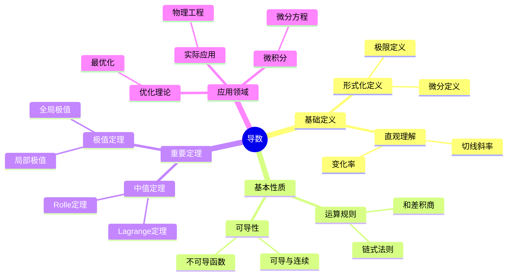
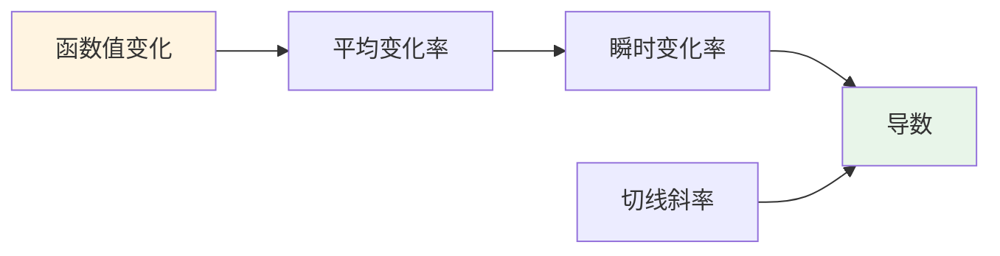
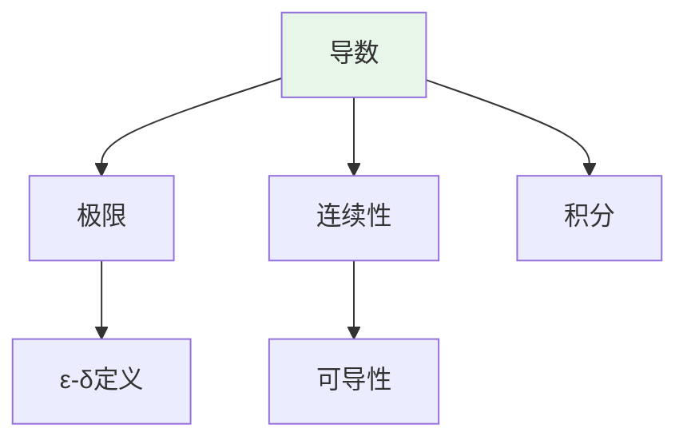
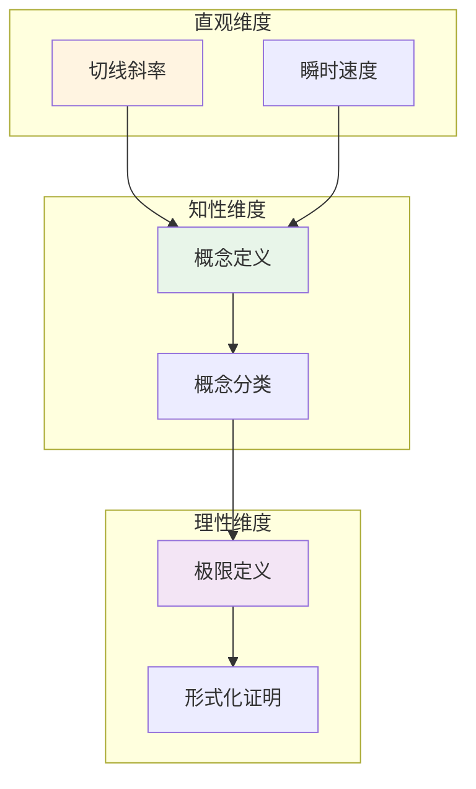

# 导数 (Derivative)

**概念编号**: C.CORE.015
**知识层次**: L0-L2
**知识领域**: D3 (分析)
**创建日期**: 2025年11月21日
**最后更新**: 2025年11月21日

---

## 📑 目录

- [导数 (Derivative)](#导数-derivative)
  - [📑 目录](#-目录)
  - [1. 📋 概述](#1--概述)
  - [2. 🎯 严格定义](#2--严格定义)
    - [2.1 基础定义 (L0)](#21-基础定义-l0)
    - [2.2 形式化定义 (L1)](#22-形式化定义-l1)
  - [3. 📚 历史背景](#3--历史背景)
    - [3.1 发展脉络](#31-发展脉络)
    - [3.2 关键人物](#32-关键人物)
    - [3.3 重要事件](#33-重要事件)
  - [4. 🔍 性质与定理](#4--性质与定理)
    - [4.1 基本性质 (L1)](#41-基本性质-l1)
    - [4.2 重要定理 (L2)](#42-重要定理-l2)
  - [5. 🔬 形式化证明](#5--形式化证明)
    - [定理1: 中值定理的形式化证明](#定理1-中值定理的形式化证明)
  - [6. 💡 应用实例](#6--应用实例)
    - [6.1 理论应用](#61-理论应用)
    - [6.2 实际应用](#62-实际应用)
      - [应用1: 物理学 - 速度计算](#应用1-物理学---速度计算)
      - [应用2: 工程学 - 最优化设计](#应用2-工程学---最优化设计)
      - [应用3: 经济学 - 边际成本分析](#应用3-经济学---边际成本分析)
  - [7. 🔗 关联概念](#7--关联概念)
    - [依赖关系](#依赖关系)
    - [推广关系](#推广关系)
  - [8. 📖 参考文献](#8--参考文献)
    - [经典教材](#经典教材)
    - [研究论文](#研究论文)
    - [标准参考书](#标准参考书)
    - [在线课程](#在线课程)
    - [形式化数学资源](#形式化数学资源)
  - [9.1 🗺️ 思维导图 (编号: C.CORE.015.MIND)](#91-️-思维导图-编号-ccore015mind)
    - [导数概念思维导图](#导数概念思维导图)
  - [9.2 📊 知识多维关系矩阵 (编号: C.CORE.015.MATRIX)](#92--知识多维关系矩阵-编号-ccore015matrix)
    - [导数的多维关系矩阵](#导数的多维关系矩阵)
  - [9.3 💭 形象化解释与论证 (编号: C.CORE.015.VISUAL)](#93--形象化解释与论证-编号-ccore015visual)
    - [形象化解释](#形象化解释)
    - [认知科学视角](#认知科学视角)
  - [9.6 👨‍🏫 专家观点与论证 (编号: C.CORE.015.EXPERT)](#96--专家观点与论证-编号-ccore015expert)
    - [数学家的观点](#数学家的观点)
    - [数学教育家的观点](#数学教育家的观点)
    - [数学认知学家的观点](#数学认知学家的观点)
  - [9.7 🎨 认知维度表征 (编号: C.CORE.015.COGNITIVE)](#97--认知维度表征-编号-ccore015cognitive)
    - [直观维度表征 (编号: C.CORE.015.INTUITIVE)](#直观维度表征-编号-ccore015intuitive)
      - [形象类比](#形象类比)
      - [具体例子](#具体例子)
      - [可视化表示](#可视化表示)
      - [几何直观](#几何直观)
    - [知性维度表征 (编号: C.CORE.015.INTELLECTUAL)](#知性维度表征-编号-ccore015intellectual)
      - [概念定义](#概念定义)
      - [概念分类](#概念分类)
      - [概念关系](#概念关系)
      - [知识矩阵](#知识矩阵)
    - [理性维度表征 (编号: C.CORE.015.RATIONAL)](#理性维度表征-编号-ccore015rational)
      - [公理体系](#公理体系)
      - [形式化定义](#形式化定义)
      - [逻辑推理](#逻辑推理)
      - [证明系统](#证明系统)
    - [综合整合表征 (编号: C.CORE.015.INTEGRATED)](#综合整合表征-编号-ccore015integrated)
      - [多维度整合](#多维度整合)
      - [图形转换](#图形转换)
      - [应用示例](#应用示例)
  - [9.5 📚 习题库](#95--习题库)
    - [L0基础题（5道）](#l0基础题5道)
    - [L1中级题（6道）](#l1中级题6道)
    - [L2高级题（4道）](#l2高级题4道)

---

## 1. 📋 概述

导数是微积分的核心概念，描述函数的变化率。
导数理论在数学、物理学、工程学等领域有广泛应用。

**权威资源对齐**:

- Wikipedia: [Derivative](https://en.wikipedia.org/wiki/Derivative)
- Stanford课程: Math 51 (Linear Algebra and Differential Calculus)
- Princeton课程: MAT 201 (Analysis)
- MIT课程: 18.01 (Single Variable Calculus)
- Metamath: [Derivative](http://us.metamath.org/mpeuni/df-dv.html)

---

## 2. 🎯 严格定义

### 2.1 基础定义 (L0)

**直观理解**: 导数是函数在某点的瞬时变化率，即切线的斜率。

**基本定义**: 函数 $f$ 在点 $a$ 的导数 $f'(a)$ 定义为：

$$f'(a) = \lim_{h \to 0} \frac{f(a+h) - f(a)}{h}$$

**简单例子**:

- $(x^2)' = 2x$
- $(\sin x)' = \cos x$
- $(e^x)' = e^x$

### 2.2 形式化定义 (L1)

**极限定义**: 函数 $f$ 在点 $a$ 可导，若极限存在：

$$f'(a) = \lim_{h \to 0} \frac{f(a+h) - f(a)}{h}$$

**等价定义**: $f'(a) = \lim_{x \to a} \frac{f(x) - f(a)}{x - a}$

**记号**:

- $f'(a)$: 函数在 $a$ 的导数
- $\frac{df}{dx}$: Leibniz记号
- $Df$: 微分算子

---

## 3. 📚 历史背景

### 3.1 发展脉络

**17世纪**: 导数的起源

- **Newton (1665)**: 使用流数法，研究变化率
- **Leibniz (1684)**: 使用微分记号 $dx$，建立微分法则
- **Fermat (1629)**: 研究极值问题，使用类似导数的方法

**18世纪**: 导数理论的发展

- **Euler (1748)**: 系统研究导数，建立导数表
- **Lagrange (1797)**: 使用幂级数研究导数
- **L'Hôpital (1696)**: 提出L'Hôpital法则

**19世纪**: 导数的严格化

- **Cauchy (1821)**: 在《分析教程》中严格化导数定义
- **Weierstrass (1872)**: 完善导数理论，构造处处连续但不可导的函数
- **Riemann (1854)**: 研究可导性与可积性的关系

**20世纪**: 导数的现代发展

- **Lebesgue (1902)**: 研究Lebesgue导数
- **Schwartz (1950)**: 引入广义函数（分布），推广导数

### 3.2 关键人物

- **Pierre de Fermat (1607-1665)**: 研究极值问题
- **Isaac Newton (1643-1727)**: 流数法的发明者
- **Gottfried Leibniz (1646-1716)**: 微分记号的发明者
- **Guillaume de l'Hôpital (1661-1704)**: 提出L'Hôpital法则
- **Leonhard Euler (1707-1783)**: 系统研究导数
- **Augustin-Louis Cauchy (1789-1857)**: 严格化导数定义
- **Karl Weierstrass (1815-1897)**: 完善导数理论

### 3.3 重要事件

- **1629**: Fermat研究极值问题
- **1665**: Newton使用流数法
- **1684**: Leibniz发表微分学论文
- **1696**: L'Hôpital提出L'Hôpital法则
- **1821**: Cauchy严格化导数定义
- **1872**: Weierstrass构造处处连续但不可导的函数
- **1950**: Schwartz引入广义函数

---

## 4. 🔍 性质与定理

### 4.1 基本性质 (L1)

**性质1: 导数的运算**:

- **和**: $(f+g)' = f' + g'$
- **积**: $(fg)' = f'g + fg'$
- **商**: $(f/g)' = \frac{f'g - fg'}{g^2}$
- **链式法则**: $(f \circ g)' = (f' \circ g) \cdot g'$

**性质2: 可导性与连续性**:

- **陈述**: 可导函数连续
- **逆命题不成立**: 连续函数不一定可导

### 4.2 重要定理 (L2)

**定理1: 中值定理**:

- **陈述**: 若 $f$ 在 $[a,b]$ 连续，在 $(a,b)$ 可导，则存在 $c \in (a,b)$ 使得 $f'(c) = \frac{f(b)-f(a)}{b-a}$

**定理2: 单调性定理**:

- **陈述**: 若 $f' > 0$，则 $f$ 单调递增；若 $f' < 0$，则 $f$ 单调递减

**定理3: 极值定理**:

- **陈述**: 若 $f'(a) = 0$ 且 $f''(a) > 0$，则 $f$ 在 $a$ 处有局部极小值

---

## 5. 🔬 形式化证明

### 定理1: 中值定理的形式化证明

**定理陈述**:
$$\forall f \forall a \forall b [\text{Cont}(f, [a,b]) \land \text{Diff}(f, (a,b)) \to \exists c \in (a,b) (f'(c) = \frac{f(b)-f(a)}{b-a})]$$

**前提**:

- 连续函数的定义
- 可导函数的定义
- Rolle定理
- 最值定理

**形式化证明**:

```text
步骤1: 假设条件
  设: Cont(f, [a,b]) and Diff(f, (a,b))

步骤2: 构造辅助函数
  定义: g(x) = f(x) - \frac{f(b)-f(a)}{b-a}(x - a)
  性质: g(a) = f(a), g(b) = f(b)

步骤3: 验证g的条件
  3a: g在[a,b]上连续 (步骤1: f连续)
  3b: g在(a,b)内可导 (步骤1: f可导)
  3c: g(a) = g(b) (步骤2: 计算)

步骤4: 应用Rolle定理
  由Rolle定理: exists c in (a,b), g'(c) = 0

步骤5: 计算g的导数
  g'(x) = f'(x) - \frac{f(b)-f(a)}{b-a}
  由步骤4: g'(c) = 0
  因此: f'(c) = \frac{f(b)-f(a)}{b-a}

步骤6: 结论
  因此: exists c in (a,b), f'(c) = \frac{f(b)-f(a)}{b-a}
```

**Metamath格式参考**:

```text
${
  mvt.1 $e |- f e. ( CC ^m RR ) $.
  mvt.2 $e |- A e. RR $.
  mvt.3 $e |- B e. RR $.
  mvt.4 $e |- A < B $.
  mvt.4 $e |- Cont(f, [A, B]) $.
  mvt.5 $e |- Diff(f, (A, B)) $.
  mvt $p |- exists c in (A, B), f'(c) = (f(B) - f(A))/(B - A) $=
    ( ... ) ABCDEFGH $.
$}
```

---

## 6. 💡 应用实例

### 6.1 理论应用

- 微积分（导数是微分的商）
- 优化理论（极值问题）
- 微分方程（导数的方程）

### 6.2 实际应用

#### 应用1: 物理学 - 速度计算

**问题描述**:
物体沿直线运动，位置函数为 $s(t) = t^2 + 2t$（米），求 $t = 3$ 秒时的速度。

**数学建模**:
速度是位置对时间的导数：$v(t) = s'(t)$

**计算过程**:

- $s(t) = t^2 + 2t$
- $s'(t) = 2t + 2$
- $v(3) = s'(3) = 2(3) + 2 = 8$ 米/秒

**结果解释**:
在 $t = 3$ 秒时，物体的瞬时速度为 8 米/秒。

**数据**:

- 时间: 3秒
- 位置: $s(3) = 15$ 米
- 速度: 8 米/秒

#### 应用2: 工程学 - 最优化设计

**问题描述**:
设计一个矩形盒子，体积为 $V = 1000$ 立方厘米，求使表面积最小的尺寸。

**数学建模**:
设长为 $x$，宽为 $y$，高为 $h = \frac{1000}{xy}$。
表面积函数：$S(x,y) = 2(xy + xh + yh) = 2xy + \frac{2000}{y} + \frac{2000}{x}$

**计算过程**:

- 对 $x$ 求偏导：$\frac{\partial S}{\partial x} = 2y - \frac{2000}{x^2} = 0$
- 对 $y$ 求偏导：$\frac{\partial S}{\partial y} = 2x - \frac{2000}{y^2} = 0$
- 解得：$x = y = 10$ 厘米，$h = 10$ 厘米

**结果解释**:
当盒子是边长为10厘米的立方体时，表面积最小。

**数据**:

- 体积: 1000 立方厘米
- 最优尺寸: 10cm × 10cm × 10cm
- 最小表面积: 600 平方厘米

#### 应用3: 经济学 - 边际成本分析

**问题描述**:
某公司的成本函数为 $C(x) = 1000 + 50x^2 - 0.1x^3$（$x$ 为产量），求产量为100单位时的边际成本。

**数学建模**:
边际成本是成本对产量的导数：$MC(x) = C'(x)$

**计算过程**:

- $C(x) = 1000 + 2000x - 0.1x^3$
- $C'(x) = 2000 - 0.3x^2$
- $MC(100) = C'(100) = 2000 - 0.3(100)^2 = 2000 - 3000 = -1000$

**结果解释**:
在产量为100单位时，边际成本为-1000，表示增加产量会降低总成本（规模经济效应）。

**数据**:

- 产量: 100单位
- 总成本: $C(100) = 1000 + 200000 - 100000 = 101000$
- 边际成本: -1000

---

## 7. 🔗 关联概念

### 依赖关系

- 极限（导数的定义需要极限）
- 连续（可导性要求连续性）

### 推广关系

- 偏导数（多元函数的导数）
- 方向导数（沿方向的导数）
- 全微分（多元函数的微分）

---

## 8. 📖 参考文献

### 经典教材

1. **Rudin, W. (1976). *Principles of Mathematical Analysis* (3rd ed.). McGraw-Hill.**
   - **内容**: 数学分析的经典教材，严格处理导数理论
   - **适用层次**: L1-L3
   - **特点**: 严谨清晰，适合深入学习

2. **Spivak, M. (2008). *Calculus* (4th ed.). Publish or Perish.**
   - **内容**: 微积分的经典教材，深入讨论导数
   - **适用层次**: L0-L2
   - **特点**: 强调严格性和直观性

3. **Apostol, T. M. (1967). *Calculus, Volume 1: One-Variable Calculus, with an Introduction to Linear Algebra* (2nd ed.). Wiley.**
   - **内容**: 微积分的现代处理，强调几何直观
   - **适用层次**: L0-L2
   - **特点**: 直观易懂，包含大量应用

### 研究论文

1. **Newton, I. (1687). *Philosophiæ Naturalis Principia Mathematica*. London: Royal Society.**
   - **内容**: 使用流数法（导数的前身）研究物理问题
   - **重要性**: 微积分的起源，导数的早期应用

2. **Leibniz, G. W. (1684). Nova methodus pro maximis et minimis, itemque tangentibus. *Acta Eruditorum*, 467-473.**
   - **内容**: 引入微分记号，建立微分法则
   - **重要性**: 现代导数记号的起源

3. **Cauchy, A.-L. (1823). *Résumé des leçons données à l'École Royale Polytechnique sur le calcul infinitésimal*. De l'Imprimerie Royale.**
   - **内容**: 严格定义导数，建立微积分基础
   - **重要性**: 导数理论严格化的开始

### 标准参考书

1. **Wikipedia contributors. (2024). Derivative. In *Wikipedia, The Free Encyclopedia*. Retrieved from <https://en.wikipedia.org/wiki/Derivative>**
   - **内容**: 导数概念的全面介绍
   - **特点**: 易于访问，包含大量示例

2. **Wikipedia contributors. (2024). Differentiation rules. In *Wikipedia, The Free Encyclopedia*. Retrieved from <https://en.wikipedia.org/wiki/Differentiation_rules>**
   - **内容**: 导数计算规则的详细介绍
   - **特点**: 包含所有基本规则和示例

### 在线课程

1. **MIT OpenCourseWare. (2024). 18.01 Single Variable Calculus. Retrieved from <https://ocw.mit.edu/>**
   - **内容**: 单变量微积分课程，深入讨论导数
   - **特点**: 免费公开课程

2. **Khan Academy. (2024). Derivatives. Retrieved from <https://www.khanacademy.org/>**
   - **内容**: 导数的在线课程
   - **特点**: 适合初学者

### 形式化数学资源

1. **Metamath contributors. (2024). Derivatives. In *Metamath Proof Explorer*. Retrieved from <http://us.metamath.org/mpeuni/df-dv.html>**
   - **内容**: 导数的形式化证明
   - **特点**: 完全形式化的证明系统

---

## 9.1 🗺️ 思维导图 (编号: C.CORE.015.MIND)

### 导数概念思维导图



---

## 9.2 📊 知识多维关系矩阵 (编号: C.CORE.015.MATRIX)

### 导数的多维关系矩阵

| 维度 | 指标 | 导数 |
|------|------|------|
| **知识层次** | L0基础 | ⭐⭐⭐⭐ |
| | L1中级 | ⭐⭐⭐⭐⭐ |
| | L2高级 | ⭐⭐⭐⭐ |
| | L3研究 | ⭐⭐ |
| **知识领域** | D1基础数学 | ⭐⭐⭐ |
| | D2代数 | ⭐⭐ |
| | D3分析 | ⭐⭐⭐⭐⭐ |
| | D4几何 | ⭐⭐⭐⭐ |
| **依赖关系** | 前置概念 | 极限、连续 |
| | 后续概念 | 积分、微分方程 |
| **应用关系** | 理论应用 | ⭐⭐⭐⭐⭐ |
| | 实际应用 | ⭐⭐⭐⭐⭐ |
| | 交叉应用 | ⭐⭐⭐⭐ |
| **学习难度** | 直观理解 | ⭐⭐ |
| | 形式化理解 | ⭐⭐⭐ |
| | 深入应用 | ⭐⭐⭐ |

---

## 9.3 💭 形象化解释与论证 (编号: C.CORE.015.VISUAL)

### 形象化解释

**1. 导数的直观理解**:

- **类比**: 导数就像"瞬时速度"或"变化率"
- **例子**:
  - 汽车的速度是位置的导数（位置的变化率）
  - 加速度是速度的导数（速度的变化率）
  - 曲线的斜率是函数值的导数

**2. 导数定义的直观理解**:

- **类比**: 导数定义就像"平均变化率的极限"
- **解释**:
  - $\frac{f(a+h) - f(a)}{h}$ 是平均变化率
  - 当 $h \to 0$ 时，平均变化率趋于瞬时变化率

**3. 链式法则的直观理解**:

- **类比**: 链式法则就像"复合函数的导数等于内外函数导数的乘积"
- **例子**:
  - 如果 $y = f(u)$ 且 $u = g(x)$，则 $\frac{dy}{dx} = \frac{dy}{du} \cdot \frac{du}{dx}$

### 认知科学视角

**1. 数学教育家Dienes的观点**:

- **多表征原则**: 通过几何（切线）、代数（公式）、物理（速度）等多种方式理解导数
- **变化性原则**: 通过不同的导数例子理解导数的本质
- **教学启示**: 使用几何可视化、物理类比、符号计算等多种方法

**2. 数学认知学家Tall的观点**:

- **过程-对象对偶**: 理解"求导过程"（如何计算）和"导数"（导数本身）
- **认知层次**: 从直观理解（"变化率"）到形式化理解（极限定义）

---

## 9.6 👨‍🏫 专家观点与论证 (编号: C.CORE.015.EXPERT)

### 数学家的观点

**1. Isaac Newton (1643-1727) - 微积分的发明者**:
> "流数法是研究变化率的工具。"
>
> **意义**: Newton发明了流数法（导数的前身），开创了微积分。

**2. Gottfried Leibniz (1646-1716) - 微分记号的发明者**:
> "微分记号 $\frac{dy}{dx}$ 是理解导数的关键。"
>
> **意义**: Leibniz发明了微分记号，使导数计算更加直观。

**3. Augustin-Louis Cauchy (1789-1857) - 导数严格化的推动者**:
> "导数必须通过极限严格定义。"
>
> **意义**: Cauchy严格化了导数定义，奠定了现代微积分的基础。

### 数学教育家的观点

**1. Zoltan Dienes (1916-2014) - 数学教育家**:
> "导数概念应该通过几何（切线）、物理（速度）、代数（公式）等多种方式学习。"
>
> **教学启示**:
>
> - 使用几何可视化展示导数（切线斜率）
> - 使用物理类比理解导数（瞬时速度）
> - 逐步引入形式化定义

**2. Hans Freudenthal (1905-1990) - 数学教育家**:
> "导数概念的学习需要从'变化率'发展到'极限定义'。"
>
> **认知发展**:
>
> - **变化率阶段**: 理解"平均变化率"（如$\frac{\Delta y}{\Delta x}$）
> - **极限阶段**: 理解"瞬时变化率"（如$\lim_{\Delta x \to 0} \frac{\Delta y}{\Delta x}$）

### 数学认知学家的观点

**1. David Tall - 数学认知学家**:
> "导数概念的理解需要从'过程'（如何计算）发展到'对象'（导数本身）。"
>
> **认知层次**:
>
> - **过程层次**: 理解"如何计算导数"（如$(x^2)' = 2x$）
> - **对象层次**: 理解"导数"（如$f'$是一个函数）

---

## 9.7 🎨 认知维度表征 (编号: C.CORE.015.COGNITIVE)

### 直观维度表征 (编号: C.CORE.015.INTUITIVE)

#### 形象类比

- **切线斜率类比**: 导数就像"切线的斜率"
  - 函数图像在某点的切线斜率就是该点的导数
  - 就像曲线在某点的"陡峭程度"

- **瞬时速度类比**: 导数就像"瞬时速度"
  - 位置函数的导数是速度
  - 就像汽车在某一瞬间的速度

#### 具体例子

- **例子1**: $f(x) = x^2$，$f'(x) = 2x$
  - 在$x=1$处，导数为$2$，表示函数在该点的变化率
  - 在$x=2$处，导数为$4$，表示函数变化更快

- **例子2**: $f(x) = \sin x$，$f'(x) = \cos x$
  - 在$x=0$处，导数为$1$，表示正弦函数在该点上升最快
  - 在$x=\pi/2$处，导数为$0$，表示正弦函数在该点达到最大值

#### 可视化表示



#### 几何直观

- **函数图像**: 通过函数图像理解导数
  - 导数等于切线的斜率
  - 导数大于0表示函数递增，导数小于0表示函数递减

- **物理直观**: 通过物理现象理解导数
  - 位置函数的导数是速度
  - 速度函数的导数是加速度

---

### 知性维度表征 (编号: C.CORE.015.INTELLECTUAL)

#### 概念定义

- **严格定义**: $f'(a) = \lim_{h \to 0} \frac{f(a+h) - f(a)}{h}$
- **等价定义**: $f'(a) = \lim_{x \to a} \frac{f(x) - f(a)}{x - a}$
- **特征描述**: 导数是函数在某点的瞬时变化率

#### 概念分类

- **一阶导数 vs 高阶导数**: 按导数阶数分类
- **左导数 vs 右导数**: 按导数方向分类
- **可导函数 vs 不可导函数**: 按可导性分类

#### 概念关系



#### 知识矩阵

| 维度 | 指标 | 导数 |
|------|------|------|
| **知识层次** | L0基础 | ⭐⭐⭐⭐ |
| | L1中级 | ⭐⭐⭐⭐⭐ |
| | L2高级 | ⭐⭐⭐⭐ |
| **知识领域** | D3分析 | ⭐⭐⭐⭐⭐ |
| **学习难度** | 直观理解 | ⭐⭐ |
| | 形式化理解 | ⭐⭐⭐⭐ |
| **认知维度** | 直观维度 | ⭐⭐⭐⭐⭐ |
| | 知性维度 | ⭐⭐⭐⭐⭐ |
| | 理性维度 | ⭐⭐⭐⭐ |

---

### 理性维度表征 (编号: C.CORE.015.RATIONAL)

#### 公理体系

- **极限定义**: $f'(a) = \lim_{h \to 0} \frac{f(a+h) - f(a)}{h}$
- **可导性条件**: 极限存在且有限
- **导数运算规则**: 和、积、商、链式法则

#### 形式化定义

- **形式化定义**: 使用极限严格定义
- **符号系统**: $f'$, $\frac{df}{dx}$, $Df$
- **类型系统**: 导数是函数类型到函数类型的映射

#### 逻辑推理

- **基本定理**: 可导函数连续、中值定理、泰勒定理
- **证明思路**: 使用极限定义和连续性证明
- **推理链**: 定义 → 可导性条件 → 运算规则 → 重要定理

#### 证明系统

- **证明方法**: 极限方法、中值定理、泰勒展开
- **形式化证明**: 可以使用Lean4等工具进行形式化
- **验证工具**: Metamath、Lean4等

---

### 综合整合表征 (编号: C.CORE.015.INTEGRATED)

#### 多维度整合



#### 图形转换

- **思维导图**: 展示导数的知识结构
- **知识图谱**: 展示导数与其他概念的关系
- **知识矩阵**: 展示导数的多维度特征

#### 应用示例

- **应用1**: 优化问题中使用导数求极值
- **应用2**: 物理问题中使用导数描述变化率
- **应用3**: 工程问题中使用导数进行近似

---

## 9.5 📚 习题库

### L0基础题（5道）

**EX.CORE.015.01** (L0, 计算)

- **题目**: 计算函数 $f(x) = x^2$ 在 $x = 2$ 处的导数。
- **答案**: $f'(2) = \lim_{h \to 0} \frac{(2+h)^2 - 4}{h} = \lim_{h \to 0} (4 + h) = 4$。

**EX.CORE.015.02** (L0, 计算)

- **题目**: 求函数 $f(x) = 3x^2 + 2x - 1$ 的导数。
- **答案**: $f'(x) = 6x + 2$。

**EX.CORE.015.03** (L0, 概念理解)

- **题目**: 用定义计算函数 $f(x) = \frac{1}{x}$ 的导数。
- **答案**: $f'(x) = \lim_{h \to 0} \frac{\frac{1}{x+h} - \frac{1}{x}}{h} = \lim_{h \to 0} \frac{-h}{x(x+h)h} = -\frac{1}{x^2}$。

**EX.CORE.015.04** (L0, 计算)

- **题目**: 使用乘积法则计算 $(x^2 + 1)(x + 2)$ 的导数。
- **答案**: $(x^2 + 1)'(x + 2) + (x^2 + 1)(x + 2)' = 2x(x + 2) + (x^2 + 1) = 3x^2 + 4x + 1$。

**EX.CORE.015.05** (L0, 应用)

- **题目**: 求函数 $f(x) = \sin x$ 在 $x = 0$ 处的切线方程。
- **答案**: $f'(0) = \cos 0 = 1$，切线方程为 $y = x$。

### L1中级题（6道）

**EX.CORE.015.06** (L1, 证明)

- **题目**: 证明：若 $f$ 在 $a$ 处可导，则 $f$ 在 $a$ 处连续。
- **提示**: 使用导数的定义。
- **答案**: $\lim_{x \to a} (f(x) - f(a)) = \lim_{x \to a} \frac{f(x) - f(a)}{x - a} \cdot (x - a) = f'(a) \cdot 0 = 0$，因此 $f$ 在 $a$ 处连续。

**EX.CORE.015.07** (L1, 证明)

- **题目**: 证明乘积法则：$(fg)' = f'g + fg'$。
- **提示**: 使用导数的定义。
- **答案**: $(fg)'(x) = \lim_{h \to 0} \frac{f(x+h)g(x+h) - f(x)g(x)}{h} = \lim_{h \to 0} \frac{f(x+h)(g(x+h) - g(x)) + g(x)(f(x+h) - f(x))}{h} = f(x)g'(x) + f'(x)g(x)$。

**EX.CORE.015.08** (L1, 证明)

- **题目**: 证明链式法则：$(f \circ g)'(x) = f'(g(x))g'(x)$。
- **提示**: 使用导数的定义。
- **答案**: $(f \circ g)'(x) = \lim_{h \to 0} \frac{f(g(x+h)) - f(g(x))}{h} = \lim_{h \to 0} \frac{f(g(x+h)) - f(g(x))}{g(x+h) - g(x)} \cdot \frac{g(x+h) - g(x)}{h} = f'(g(x))g'(x)$。

**EX.CORE.015.09** (L1, 计算)

- **题目**: 使用L'Hôpital法则计算：$\lim_{x \to 0} \frac{\sin x}{x}$。
- **答案**: $\lim_{x \to 0} \frac{\sin x}{x} = \lim_{x \to 0} \frac{\cos x}{1} = 1$。

**EX.CORE.015.10** (L1, 证明)

- **题目**: 证明Rolle定理：若 $f$ 在 $[a, b]$ 上连续，在 $(a, b)$ 内可导，且 $f(a) = f(b)$，则存在 $c \in (a, b)$ 使得 $f'(c) = 0$。
- **提示**: 使用最值定理。
- **答案**: 若 $f$ 是常数，则结论显然。否则，$f$ 在 $[a, b]$ 上达到最大值或最小值在 $(a, b)$ 内，设为 $c$，则 $f'(c) = 0$。

**EX.CORE.015.11** (L1, 应用)

- **题目**: 证明中值定理：若 $f$ 在 $[a, b]$ 上连续，在 $(a, b)$ 内可导，则存在 $c \in (a, b)$ 使得 $f'(c) = \frac{f(b) - f(a)}{b - a}$。
- **提示**: 构造辅助函数。
- **答案**: 设 $g(x) = f(x) - \frac{f(b) - f(a)}{b - a}(x - a)$，则 $g(a) = g(b)$，由Rolle定理存在 $c \in (a, b)$ 使得 $g'(c) = 0$，即 $f'(c) = \frac{f(b) - f(a)}{b - a}$。

### L2高级题（4道）

**EX.CORE.015.12** (L2, 证明)

- **题目**: 证明：若 $f$ 在 $(a, b)$ 内可导且 $f'(x) > 0$ 对所有 $x \in (a, b)$，则 $f$ 在 $(a, b)$ 上严格递增。
- **提示**: 使用中值定理。
- **答案**: 对任意 $x_1 < x_2 \in (a, b)$，由中值定理存在 $c \in (x_1, x_2)$ 使得 $f(x_2) - f(x_1) = f'(c)(x_2 - x_1) > 0$，因此 $f(x_2) > f(x_1)$。

**EX.CORE.015.13** (L2, 证明)

- **题目**: 证明：若 $f$ 在 $a$ 处二阶可导且 $f'(a) = 0$，$f''(a) > 0$，则 $f$ 在 $a$ 处有局部最小值。
- **提示**: 使用Taylor展开。
- **答案**: $f(x) = f(a) + f'(a)(x - a) + \frac{f''(a)}{2}(x - a)^2 + o((x - a)^2) = f(a) + \frac{f''(a)}{2}(x - a)^2 + o((x - a)^2)$，因此 $f(x) \geqqq f(a)$ 在 $a$ 的邻域内。

**EX.CORE.015.14** (L2, 综合)

- **题目**: 证明：若 $f$ 在 $[a, b]$ 上连续，在 $(a, b)$ 内可导，且 $|f'(x)| \leqqq M$，则 $|f(x) - f(y)| \leqqq M|x - y|$（Lipschitz连续性）。
- **提示**: 使用中值定理。
- **答案**: 对任意 $x, y \in [a, b]$，由中值定理存在 $c$ 在 $x$ 和 $y$ 之间使得 $f(x) - f(y) = f'(c)(x - y)$，因此 $|f(x) - f(y)| = |f'(c)||x - y| \leqqq M|x - y|$。

**EX.CORE.015.15** (L2, 证明)

- **题目**: 证明：若 $f$ 在 $a$ 处可导，则存在函数 $\varepsilon$ 使得 $f(a + h) = f(a) + f'(a)h + \varepsilon(h)h$ 且 $\lim_{h \to 0} \varepsilon(h) = 0$。
- **提示**: 定义 $\varepsilon(h) = \frac{f(a+h) - f(a)}{h} - f'(a)$。
- **答案**: 定义 $\varepsilon(h) = \frac{f(a+h) - f(a)}{h} - f'(a)$（$h \neqqq 0$），$\varepsilon(0) = 0$，则 $f(a + h) = f(a) + f'(a)h + \varepsilon(h)h$，且 $\lim_{h \to 0} \varepsilon(h) = 0$。

---

**创建日期**: 2025年11月21日
**最后更新**: 2025年1月（与新框架整合）

**关联文档**：

- [导数-三视角版](./15-导数-三视角版.md) ⭐ 三视角版本
- [导数-决策导图示例](./15-导数-决策导图示例-2025年1月.md) ⭐ 最新 - 决策导图示例
- [导数-多理论分析示例](./15-导数-多理论分析示例-2025年1月.md) ⭐ 最新 - 多理论分析示例
- [概念体系全面梳理与推进计划](../00-概念体系全面梳理与推进计划-2025年1月.md) ⭐ 最新
- [核心概念与新框架整合指南](../00-核心概念与新框架整合指南-2025年1月.md) ⭐ 最新

**维护状态**: 持续更新中
