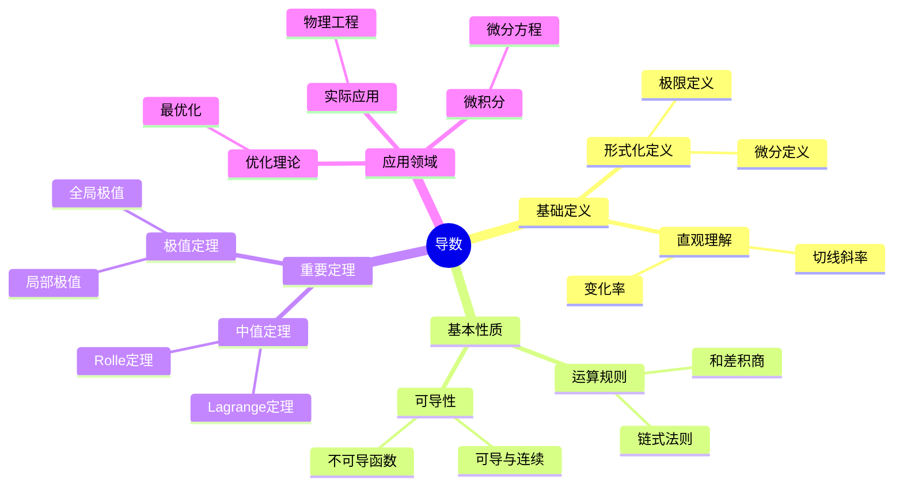

# 导数 (Derivative)

**概念编号**: C.CORE.015
**知识层次**: L0-L2
**知识领域**: D3 (分析)
**创建日期**: 2025年11月21日
**最后更新**: 2025年11月21日

---

## 📋 概述

导数是微积分的核心概念，描述函数的变化率。导数理论在数学、物理学、工程学等领域有广泛应用。

**权威资源对齐**:

- Wikipedia: [Derivative](https://en.wikipedia.org/wiki/Derivative)
- Stanford课程: Math 51 (Linear Algebra and Differential Calculus)
- Princeton课程: MAT 201 (Analysis)
- MIT课程: 18.01 (Single Variable Calculus)
- Metamath: [Derivative](http://us.metamath.org/mpeuni/df-dv.html)

---

## 🎯 严格定义

### 基础定义 (L0)

**直观理解**: 导数是函数在某点的瞬时变化率，即切线的斜率。

**基本定义**: 函数 $f$ 在点 $a$ 的导数 $f'(a)$ 定义为：

$$f'(a) = \lim_{h \to 0} \frac{f(a+h) - f(a)}{h}$$

**简单例子**:

- $(x^2)' = 2x$
- $(\sin x)' = \cos x$
- $(e^x)' = e^x$

### 形式化定义 (L1)

**极限定义**: 函数 $f$ 在点 $a$ 可导，若极限存在：

$$f'(a) = \lim_{h \to 0} \frac{f(a+h) - f(a)}{h}$$

**等价定义**: $f'(a) = \lim_{x \to a} \frac{f(x) - f(a)}{x - a}$

**记号**:

- $f'(a)$: 函数在 $a$ 的导数
- $\frac{df}{dx}$: Leibniz记号
- $Df$: 微分算子

---

## 📚 历史背景

### 发展脉络

**17世纪**: 导数的起源

- **Newton (1665)**: 使用流数法
- **Leibniz (1684)**: 使用微分记号

**19世纪**: 导数的严格化

- **Cauchy (1821)**: 严格化导数定义
- **Weierstrass (1872)**: 完善导数理论

### 关键人物

- **Isaac Newton (1643-1727)**: 流数法的发明者
- **Gottfried Leibniz (1646-1716)**: 微分记号的发明者
- **Augustin-Louis Cauchy (1789-1857)**: 严格化导数定义

---

## 🔍 性质与定理

### 基本性质 (L1)

**性质1: 导数的运算**:

- **和**: $(f+g)' = f' + g'$
- **积**: $(fg)' = f'g + fg'$
- **商**: $(f/g)' = \frac{f'g - fg'}{g^2}$
- **链式法则**: $(f \circ g)' = (f' \circ g) \cdot g'$

**性质2: 可导性与连续性**:

- **陈述**: 可导函数连续
- **逆命题不成立**: 连续函数不一定可导

### 重要定理 (L2)

**定理1: 中值定理**:

- **陈述**: 若 $f$ 在 $[a,b]$ 连续，在 $(a,b)$ 可导，则存在 $c \in (a,b)$ 使得 $f'(c) = \frac{f(b)-f(a)}{b-a}$

**定理2: 单调性定理**:

- **陈述**: 若 $f' > 0$，则 $f$ 单调递增；若 $f' < 0$，则 $f$ 单调递减

**定理3: 极值定理**:

- **陈述**: 若 $f'(a) = 0$ 且 $f''(a) > 0$，则 $f$ 在 $a$ 处有局部极小值

---

## 💡 应用实例

### 理论应用

- 微积分（导数是微分的商）
- 优化理论（极值问题）
- 微分方程（导数的方程）

### 实际应用

- 物理学（速度、加速度）
- 工程学（最优化设计）
- 经济学（边际分析）

---

## 🔗 关联概念

### 依赖关系

- 极限（导数的定义需要极限）
- 连续（可导性要求连续性）

### 推广关系

- 偏导数（多元函数的导数）
- 方向导数（沿方向的导数）
- 全微分（多元函数的微分）

---

## 📖 参考文献

- Wikipedia: [Derivative](https://en.wikipedia.org/wiki/Derivative)
- Rudin, W. (1976). *Principles of Mathematical Analysis*. McGraw-Hill.
- Spivak, M. (2008). *Calculus*. Publish or Perish.

---

## 🗺️ 思维导图 (编号: C.CORE.015.MIND)

### 导数概念思维导图

---

## 📊 知识多维关系矩阵 (编号: C.CORE.015.MATRIX)

### 导数的多维关系矩阵

| 维度 | 指标 | 导数 |
|------|------|------|
| **知识层次** | L0基础 | ⭐⭐⭐⭐ |
| | L1中级 | ⭐⭐⭐⭐⭐ |
| | L2高级 | ⭐⭐⭐⭐ |
| | L3研究 | ⭐⭐ |
| **知识领域** | D1基础数学 | ⭐⭐⭐ |
| | D2代数 | ⭐⭐ |
| | D3分析 | ⭐⭐⭐⭐⭐ |
| | D4几何 | ⭐⭐⭐⭐ |
| **依赖关系** | 前置概念 | 极限、连续 |
| | 后续概念 | 积分、微分方程 |
| **应用关系** | 理论应用 | ⭐⭐⭐⭐⭐ |
| | 实际应用 | ⭐⭐⭐⭐⭐ |
| | 交叉应用 | ⭐⭐⭐⭐ |
| **学习难度** | 直观理解 | ⭐⭐ |
| | 形式化理解 | ⭐⭐⭐ |
| | 深入应用 | ⭐⭐⭐ |

---

## 💭 形象化解释与论证 (编号: C.CORE.015.VISUAL)

### 形象化解释

**1. 导数的直观理解**

- **类比**: 导数就像"瞬时速度"或"变化率"
- **例子**:
  - 汽车的速度是位置的导数（位置的变化率）
  - 加速度是速度的导数（速度的变化率）
  - 曲线的斜率是函数值的导数

**2. 导数定义的直观理解**

- **类比**: 导数定义就像"平均变化率的极限"
- **解释**:
  - $\frac{f(a+h) - f(a)}{h}$ 是平均变化率
  - 当 $h \to 0$ 时，平均变化率趋于瞬时变化率

**3. 链式法则的直观理解**

- **类比**: 链式法则就像"复合函数的导数等于内外函数导数的乘积"
- **例子**:
  - 如果 $y = f(u)$ 且 $u = g(x)$，则 $\frac{dy}{dx} = \frac{dy}{du} \cdot \frac{du}{dx}$

### 认知科学视角

**1. 数学教育家Dienes的观点**

- **多表征原则**: 通过几何（切线）、代数（公式）、物理（速度）等多种方式理解导数
- **变化性原则**: 通过不同的导数例子理解导数的本质
- **教学启示**: 使用几何可视化、物理类比、符号计算等多种方法

**2. 数学认知学家Tall的观点**

- **过程-对象对偶**: 理解"求导过程"（如何计算）和"导数"（导数本身）
- **认知层次**: 从直观理解（"变化率"）到形式化理解（极限定义）

---

## 👨‍🏫 专家观点与论证 (编号: C.CORE.015.EXPERT)

### 数学家的观点

**1. Isaac Newton (1643-1727) - 微积分的发明者**
> "流数法是研究变化率的工具。"
>
> **意义**: Newton发明了流数法（导数的前身），开创了微积分。

**2. Gottfried Leibniz (1646-1716) - 微分记号的发明者**
> "微分记号 $\frac{dy}{dx}$ 是理解导数的关键。"
>
> **意义**: Leibniz发明了微分记号，使导数计算更加直观。

**3. Augustin-Louis Cauchy (1789-1857) - 导数严格化的推动者**
> "导数必须通过极限严格定义。"
>
> **意义**: Cauchy严格化了导数定义，奠定了现代微积分的基础。

### 数学教育家的观点

**1. Zoltan Dienes (1916-2014) - 数学教育家**
> "导数概念应该通过几何（切线）、物理（速度）、代数（公式）等多种方式学习。"
>
> **教学启示**:
>
> - 使用几何可视化展示导数（切线斜率）
> - 使用物理类比理解导数（瞬时速度）
> - 逐步引入形式化定义

**2. Hans Freudenthal (1905-1990) - 数学教育家**
> "导数概念的学习需要从'变化率'发展到'极限定义'。"
>
> **认知发展**:
>
> - **变化率阶段**: 理解"平均变化率"（如$\frac{\Delta y}{\Delta x}$）
> - **极限阶段**: 理解"瞬时变化率"（如$\lim_{\Delta x \to 0} \frac{\Delta y}{\Delta x}$）

### 数学认知学家的观点

**1. David Tall - 数学认知学家**
> "导数概念的理解需要从'过程'（如何计算）发展到'对象'（导数本身）。"
>
> **认知层次**:
>
> - **过程层次**: 理解"如何计算导数"（如$(x^2)' = 2x$）
> - **对象层次**: 理解"导数"（如$f'$是一个函数）

---

**创建日期**: 2025年11月21日
**最后更新**: 2025年11月21日
**维护状态**: 持续更新中
