# 导数 (Derivative)

**概念编号**: C.CORE.015
**知识层次**: L0-L2
**知识领域**: D3 (分析)
**创建日期**: 2025年11月21日
**最后更新**: 2025年11月21日

---

## 📋 概述

导数是微积分的核心概念，描述函数的变化率。
导数理论在数学、物理学、工程学等领域有广泛应用。

**权威资源对齐**:

- Wikipedia: [Derivative](https://en.wikipedia.org/wiki/Derivative)
- Stanford课程: Math 51 (Linear Algebra and Differential Calculus)
- Princeton课程: MAT 201 (Analysis)
- MIT课程: 18.01 (Single Variable Calculus)
- Metamath: [Derivative](http://us.metamath.org/mpeuni/df-dv.html)

---

## 🎯 严格定义

### 基础定义 (L0)

**直观理解**: 导数是函数在某点的瞬时变化率，即切线的斜率。

**基本定义**: 函数 $f$ 在点 $a$ 的导数 $f'(a)$ 定义为：

$$f'(a) = \lim_{h \to 0} \frac{f(a+h) - f(a)}{h}$$

**简单例子**:

- $(x^2)' = 2x$
- $(\sin x)' = \cos x$
- $(e^x)' = e^x$

### 形式化定义 (L1)

**极限定义**: 函数 $f$ 在点 $a$ 可导，若极限存在：

$$f'(a) = \lim_{h \to 0} \frac{f(a+h) - f(a)}{h}$$

**等价定义**: $f'(a) = \lim_{x \to a} \frac{f(x) - f(a)}{x - a}$

**记号**:

- $f'(a)$: 函数在 $a$ 的导数
- $\frac{df}{dx}$: Leibniz记号
- $Df$: 微分算子

---

## 📚 历史背景

### 发展脉络

**17世纪**: 导数的起源

- **Newton (1665)**: 使用流数法，研究变化率
- **Leibniz (1684)**: 使用微分记号 $dx$，建立微分法则
- **Fermat (1629)**: 研究极值问题，使用类似导数的方法

**18世纪**: 导数理论的发展

- **Euler (1748)**: 系统研究导数，建立导数表
- **Lagrange (1797)**: 使用幂级数研究导数
- **L'Hôpital (1696)**: 提出L'Hôpital法则

**19世纪**: 导数的严格化

- **Cauchy (1821)**: 在《分析教程》中严格化导数定义
- **Weierstrass (1872)**: 完善导数理论，构造处处连续但不可导的函数
- **Riemann (1854)**: 研究可导性与可积性的关系

**20世纪**: 导数的现代发展

- **Lebesgue (1902)**: 研究Lebesgue导数
- **Schwartz (1950)**: 引入广义函数（分布），推广导数

### 关键人物

- **Pierre de Fermat (1607-1665)**: 研究极值问题
- **Isaac Newton (1643-1727)**: 流数法的发明者
- **Gottfried Leibniz (1646-1716)**: 微分记号的发明者
- **Guillaume de l'Hôpital (1661-1704)**: 提出L'Hôpital法则
- **Leonhard Euler (1707-1783)**: 系统研究导数
- **Augustin-Louis Cauchy (1789-1857)**: 严格化导数定义
- **Karl Weierstrass (1815-1897)**: 完善导数理论

### 重要事件

- **1629**: Fermat研究极值问题
- **1665**: Newton使用流数法
- **1684**: Leibniz发表微分学论文
- **1696**: L'Hôpital提出L'Hôpital法则
- **1821**: Cauchy严格化导数定义
- **1872**: Weierstrass构造处处连续但不可导的函数
- **1950**: Schwartz引入广义函数

---

## 🔍 性质与定理

### 基本性质 (L1)

**性质1: 导数的运算**:

- **和**: $(f+g)' = f' + g'$
- **积**: $(fg)' = f'g + fg'$
- **商**: $(f/g)' = \frac{f'g - fg'}{g^2}$
- **链式法则**: $(f \circ g)' = (f' \circ g) \cdot g'$

**性质2: 可导性与连续性**:

- **陈述**: 可导函数连续
- **逆命题不成立**: 连续函数不一定可导

### 重要定理 (L2)

**定理1: 中值定理**:

- **陈述**: 若 $f$ 在 $[a,b]$ 连续，在 $(a,b)$ 可导，则存在 $c \in (a,b)$ 使得 $f'(c) = \frac{f(b)-f(a)}{b-a}$

**定理2: 单调性定理**:

- **陈述**: 若 $f' > 0$，则 $f$ 单调递增；若 $f' < 0$，则 $f$ 单调递减

**定理3: 极值定理**:

- **陈述**: 若 $f'(a) = 0$ 且 $f''(a) > 0$，则 $f$ 在 $a$ 处有局部极小值

---

## 🔬 形式化证明

### 定理1: 中值定理的形式化证明

**定理陈述**:
$$\forall f \forall a \forall b [\text{Cont}(f, [a,b]) \land \text{Diff}(f, (a,b)) \to \exists c \in (a,b) (f'(c) = \frac{f(b)-f(a)}{b-a})]$$

**前提**:
- 连续函数的定义
- 可导函数的定义
- Rolle定理
- 最值定理

**形式化证明**:

```
步骤1: 假设条件
  设: Cont(f, [a,b]) and Diff(f, (a,b))

步骤2: 构造辅助函数
  定义: g(x) = f(x) - \frac{f(b)-f(a)}{b-a}(x - a)
  性质: g(a) = f(a), g(b) = f(b)

步骤3: 验证g的条件
  3a: g在[a,b]上连续 (步骤1: f连续)
  3b: g在(a,b)内可导 (步骤1: f可导)
  3c: g(a) = g(b) (步骤2: 计算)

步骤4: 应用Rolle定理
  由Rolle定理: exists c in (a,b), g'(c) = 0

步骤5: 计算g的导数
  g'(x) = f'(x) - \frac{f(b)-f(a)}{b-a}
  由步骤4: g'(c) = 0
  因此: f'(c) = \frac{f(b)-f(a)}{b-a}

步骤6: 结论
  因此: exists c in (a,b), f'(c) = \frac{f(b)-f(a)}{b-a}
```

**Metamath格式参考**:
```
${
  mvt.1 $e |- f e. ( CC ^m RR ) $.
  mvt.2 $e |- A e. RR $.
  mvt.3 $e |- B e. RR $.
  mvt.4 $e |- A < B $.
  mvt.4 $e |- Cont(f, [A, B]) $.
  mvt.5 $e |- Diff(f, (A, B)) $.
  mvt $p |- exists c in (A, B), f'(c) = (f(B) - f(A))/(B - A) $=
    ( ... ) ABCDEFGH $.
$}
```

---

## 💡 应用实例

### 理论应用

- 微积分（导数是微分的商）
- 优化理论（极值问题）
- 微分方程（导数的方程）

### 实际应用

#### 应用1: 物理学 - 速度计算

**问题描述**:
物体沿直线运动，位置函数为 $s(t) = t^2 + 2t$（米），求 $t = 3$ 秒时的速度。

**数学建模**:
速度是位置对时间的导数：$v(t) = s'(t)$

**计算过程**:

- $s(t) = t^2 + 2t$
- $s'(t) = 2t + 2$
- $v(3) = s'(3) = 2(3) + 2 = 8$ 米/秒

**结果解释**:
在 $t = 3$ 秒时，物体的瞬时速度为 8 米/秒。

**数据**:

- 时间: 3秒
- 位置: $s(3) = 15$ 米
- 速度: 8 米/秒

#### 应用2: 工程学 - 最优化设计

**问题描述**:
设计一个矩形盒子，体积为 $V = 1000$ 立方厘米，求使表面积最小的尺寸。

**数学建模**:
设长为 $x$，宽为 $y$，高为 $h = \frac{1000}{xy}$。
表面积函数：$S(x,y) = 2(xy + xh + yh) = 2xy + \frac{2000}{y} + \frac{2000}{x}$

**计算过程**:

- 对 $x$ 求偏导：$\frac{\partial S}{\partial x} = 2y - \frac{2000}{x^2} = 0$
- 对 $y$ 求偏导：$\frac{\partial S}{\partial y} = 2x - \frac{2000}{y^2} = 0$
- 解得：$x = y = 10$ 厘米，$h = 10$ 厘米

**结果解释**:
当盒子是边长为10厘米的立方体时，表面积最小。

**数据**:

- 体积: 1000 立方厘米
- 最优尺寸: 10cm × 10cm × 10cm
- 最小表面积: 600 平方厘米

#### 应用3: 经济学 - 边际成本分析

**问题描述**:
某公司的成本函数为 $C(x) = 1000 + 50x^2 - 0.1x^3$（$x$ 为产量），求产量为100单位时的边际成本。

**数学建模**:
边际成本是成本对产量的导数：$MC(x) = C'(x)$

**计算过程**:

- $C(x) = 1000 + 2000x - 0.1x^3$
- $C'(x) = 2000 - 0.3x^2$
- $MC(100) = C'(100) = 2000 - 0.3(100)^2 = 2000 - 3000 = -1000$

**结果解释**:
在产量为100单位时，边际成本为-1000，表示增加产量会降低总成本（规模经济效应）。

**数据**:

- 产量: 100单位
- 总成本: $C(100) = 1000 + 200000 - 100000 = 101000$
- 边际成本: -1000

---

## 🔗 关联概念

### 依赖关系

- 极限（导数的定义需要极限）
- 连续（可导性要求连续性）

### 推广关系

- 偏导数（多元函数的导数）
- 方向导数（沿方向的导数）
- 全微分（多元函数的微分）

---

## 📖 参考文献

### 经典教材

1. **Rudin, W. (1976). *Principles of Mathematical Analysis* (3rd ed.). McGraw-Hill.**
   - **内容**: 数学分析的经典教材，严格处理导数理论
   - **适用层次**: L1-L3
   - **特点**: 严谨清晰，适合深入学习

2. **Spivak, M. (2008). *Calculus* (4th ed.). Publish or Perish.**
   - **内容**: 微积分的经典教材，深入讨论导数
   - **适用层次**: L0-L2
   - **特点**: 强调严格性和直观性

3. **Apostol, T. M. (1967). *Calculus, Volume 1: One-Variable Calculus, with an Introduction to Linear Algebra* (2nd ed.). Wiley.**
   - **内容**: 微积分的现代处理，强调几何直观
   - **适用层次**: L0-L2
   - **特点**: 直观易懂，包含大量应用

### 研究论文

1. **Newton, I. (1687). *Philosophiæ Naturalis Principia Mathematica*. London: Royal Society.**
   - **内容**: 使用流数法（导数的前身）研究物理问题
   - **重要性**: 微积分的起源，导数的早期应用

2. **Leibniz, G. W. (1684). Nova methodus pro maximis et minimis, itemque tangentibus. *Acta Eruditorum*, 467-473.**
   - **内容**: 引入微分记号，建立微分法则
   - **重要性**: 现代导数记号的起源

3. **Cauchy, A.-L. (1823). *Résumé des leçons données à l'École Royale Polytechnique sur le calcul infinitésimal*. De l'Imprimerie Royale.**
   - **内容**: 严格定义导数，建立微积分基础
   - **重要性**: 导数理论严格化的开始

### 标准参考书

1. **Wikipedia contributors. (2024). Derivative. In *Wikipedia, The Free Encyclopedia*. Retrieved from <https://en.wikipedia.org/wiki/Derivative>**
   - **内容**: 导数概念的全面介绍
   - **特点**: 易于访问，包含大量示例

2. **Wikipedia contributors. (2024). Differentiation rules. In *Wikipedia, The Free Encyclopedia*. Retrieved from <https://en.wikipedia.org/wiki/Differentiation_rules>**
   - **内容**: 导数计算规则的详细介绍
   - **特点**: 包含所有基本规则和示例

### 在线课程

1. **MIT OpenCourseWare. (2024). 18.01 Single Variable Calculus. Retrieved from <https://ocw.mit.edu/>**
   - **内容**: 单变量微积分课程，深入讨论导数
   - **特点**: 免费公开课程

2. **Khan Academy. (2024). Derivatives. Retrieved from <https://www.khanacademy.org/>**
   - **内容**: 导数的在线课程
   - **特点**: 适合初学者

### 形式化数学资源

1. **Metamath contributors. (2024). Derivatives. In *Metamath Proof Explorer*. Retrieved from <http://us.metamath.org/mpeuni/df-dv.html>**
   - **内容**: 导数的形式化证明
   - **特点**: 完全形式化的证明系统

---

## 🗺️ 思维导图 (编号: C.CORE.015.MIND)

### 导数概念思维导图

```mermaid
mindmap
  root((导数))
    基础定义
      直观理解
        变化率
        切线斜率
      形式化定义
        极限定义
        微分定义
    基本性质
      运算规则
        和差积商
        链式法则
      可导性
        可导与连续
        不可导函数
    重要定理
      中值定理
        Rolle定理
        Lagrange定理
      极值定理
        局部极值
        全局极值
    应用领域
      微积分
        微分方程
      优化理论
        最优化
      实际应用
        物理工程
```



---

## 📊 知识多维关系矩阵 (编号: C.CORE.015.MATRIX)

### 导数的多维关系矩阵

| 维度 | 指标 | 导数 |
|------|------|------|
| **知识层次** | L0基础 | ⭐⭐⭐⭐ |
| | L1中级 | ⭐⭐⭐⭐⭐ |
| | L2高级 | ⭐⭐⭐⭐ |
| | L3研究 | ⭐⭐ |
| **知识领域** | D1基础数学 | ⭐⭐⭐ |
| | D2代数 | ⭐⭐ |
| | D3分析 | ⭐⭐⭐⭐⭐ |
| | D4几何 | ⭐⭐⭐⭐ |
| **依赖关系** | 前置概念 | 极限、连续 |
| | 后续概念 | 积分、微分方程 |
| **应用关系** | 理论应用 | ⭐⭐⭐⭐⭐ |
| | 实际应用 | ⭐⭐⭐⭐⭐ |
| | 交叉应用 | ⭐⭐⭐⭐ |
| **学习难度** | 直观理解 | ⭐⭐ |
| | 形式化理解 | ⭐⭐⭐ |
| | 深入应用 | ⭐⭐⭐ |

---

## 💭 形象化解释与论证 (编号: C.CORE.015.VISUAL)

### 形象化解释

**1. 导数的直观理解**

- **类比**: 导数就像"瞬时速度"或"变化率"
- **例子**:
  - 汽车的速度是位置的导数（位置的变化率）
  - 加速度是速度的导数（速度的变化率）
  - 曲线的斜率是函数值的导数

**2. 导数定义的直观理解**

- **类比**: 导数定义就像"平均变化率的极限"
- **解释**:
  - $\frac{f(a+h) - f(a)}{h}$ 是平均变化率
  - 当 $h \to 0$ 时，平均变化率趋于瞬时变化率

**3. 链式法则的直观理解**

- **类比**: 链式法则就像"复合函数的导数等于内外函数导数的乘积"
- **例子**:
  - 如果 $y = f(u)$ 且 $u = g(x)$，则 $\frac{dy}{dx} = \frac{dy}{du} \cdot \frac{du}{dx}$

### 认知科学视角

**1. 数学教育家Dienes的观点**

- **多表征原则**: 通过几何（切线）、代数（公式）、物理（速度）等多种方式理解导数
- **变化性原则**: 通过不同的导数例子理解导数的本质
- **教学启示**: 使用几何可视化、物理类比、符号计算等多种方法

**2. 数学认知学家Tall的观点**

- **过程-对象对偶**: 理解"求导过程"（如何计算）和"导数"（导数本身）
- **认知层次**: 从直观理解（"变化率"）到形式化理解（极限定义）

---

## 👨‍🏫 专家观点与论证 (编号: C.CORE.015.EXPERT)

### 数学家的观点

**1. Isaac Newton (1643-1727) - 微积分的发明者**
> "流数法是研究变化率的工具。"
>
> **意义**: Newton发明了流数法（导数的前身），开创了微积分。

**2. Gottfried Leibniz (1646-1716) - 微分记号的发明者**
> "微分记号 $\frac{dy}{dx}$ 是理解导数的关键。"
>
> **意义**: Leibniz发明了微分记号，使导数计算更加直观。

**3. Augustin-Louis Cauchy (1789-1857) - 导数严格化的推动者**
> "导数必须通过极限严格定义。"
>
> **意义**: Cauchy严格化了导数定义，奠定了现代微积分的基础。

### 数学教育家的观点

**1. Zoltan Dienes (1916-2014) - 数学教育家**
> "导数概念应该通过几何（切线）、物理（速度）、代数（公式）等多种方式学习。"
>
> **教学启示**:
>
> - 使用几何可视化展示导数（切线斜率）
> - 使用物理类比理解导数（瞬时速度）
> - 逐步引入形式化定义

**2. Hans Freudenthal (1905-1990) - 数学教育家**
> "导数概念的学习需要从'变化率'发展到'极限定义'。"
>
> **认知发展**:
>
> - **变化率阶段**: 理解"平均变化率"（如$\frac{\Delta y}{\Delta x}$）
> - **极限阶段**: 理解"瞬时变化率"（如$\lim_{\Delta x \to 0} \frac{\Delta y}{\Delta x}$）

### 数学认知学家的观点

**1. David Tall - 数学认知学家**
> "导数概念的理解需要从'过程'（如何计算）发展到'对象'（导数本身）。"
>
> **认知层次**:
>
> - **过程层次**: 理解"如何计算导数"（如$(x^2)' = 2x$）
> - **对象层次**: 理解"导数"（如$f'$是一个函数）

---

## 🎨 认知维度表征 (编号: C.CORE.015.COGNITIVE)

### 直观维度表征 (编号: C.CORE.015.INTUITIVE)

#### 形象类比

- **切线斜率类比**: 导数就像"切线的斜率"
  - 函数图像在某点的切线斜率就是该点的导数
  - 就像曲线在某点的"陡峭程度"

- **瞬时速度类比**: 导数就像"瞬时速度"
  - 位置函数的导数是速度
  - 就像汽车在某一瞬间的速度

#### 具体例子

- **例子1**: $f(x) = x^2$，$f'(x) = 2x$
  - 在$x=1$处，导数为$2$，表示函数在该点的变化率
  - 在$x=2$处，导数为$4$，表示函数变化更快

- **例子2**: $f(x) = \sin x$，$f'(x) = \cos x$
  - 在$x=0$处，导数为$1$，表示正弦函数在该点上升最快
  - 在$x=\pi/2$处，导数为$0$，表示正弦函数在该点达到最大值

#### 可视化表示

```mermaid
graph LR
    A[函数值变化] --> B[平均变化率]
    B --> C[瞬时变化率]
    C --> D[导数]
    E[切线斜率] --> D

    style A fill:#fff4e1
    style D fill:#e8f5e9
```



#### 几何直观

- **函数图像**: 通过函数图像理解导数
  - 导数等于切线的斜率
  - 导数大于0表示函数递增，导数小于0表示函数递减

- **物理直观**: 通过物理现象理解导数
  - 位置函数的导数是速度
  - 速度函数的导数是加速度

---

### 知性维度表征 (编号: C.CORE.015.INTELLECTUAL)

#### 概念定义

- **严格定义**: $f'(a) = \lim_{h \to 0} \frac{f(a+h) - f(a)}{h}$
- **等价定义**: $f'(a) = \lim_{x \to a} \frac{f(x) - f(a)}{x - a}$
- **特征描述**: 导数是函数在某点的瞬时变化率

#### 概念分类

- **一阶导数 vs 高阶导数**: 按导数阶数分类
- **左导数 vs 右导数**: 按导数方向分类
- **可导函数 vs 不可导函数**: 按可导性分类

#### 概念关系

```mermaid
graph TD
    A[导数] --> B[极限]
    A --> C[连续性]
    A --> D[积分]
    B --> E[ε-δ定义]
    C --> F[可导性]

    style A fill:#e8f5e9
```



#### 知识矩阵

| 维度 | 指标 | 导数 |
|------|------|------|
| **知识层次** | L0基础 | ⭐⭐⭐⭐ |
| | L1中级 | ⭐⭐⭐⭐⭐ |
| | L2高级 | ⭐⭐⭐⭐ |
| **知识领域** | D3分析 | ⭐⭐⭐⭐⭐ |
| **学习难度** | 直观理解 | ⭐⭐ |
| | 形式化理解 | ⭐⭐⭐⭐ |
| **认知维度** | 直观维度 | ⭐⭐⭐⭐⭐ |
| | 知性维度 | ⭐⭐⭐⭐⭐ |
| | 理性维度 | ⭐⭐⭐⭐ |

---

### 理性维度表征 (编号: C.CORE.015.RATIONAL)

#### 公理体系

- **极限定义**: $f'(a) = \lim_{h \to 0} \frac{f(a+h) - f(a)}{h}$
- **可导性条件**: 极限存在且有限
- **导数运算规则**: 和、积、商、链式法则

#### 形式化定义

- **形式化定义**: 使用极限严格定义
- **符号系统**: $f'$, $\frac{df}{dx}$, $Df$
- **类型系统**: 导数是函数类型到函数类型的映射

#### 逻辑推理

- **基本定理**: 可导函数连续、中值定理、泰勒定理
- **证明思路**: 使用极限定义和连续性证明
- **推理链**: 定义 → 可导性条件 → 运算规则 → 重要定理

#### 证明系统

- **证明方法**: 极限方法、中值定理、泰勒展开
- **形式化证明**: 可以使用Lean4等工具进行形式化
- **验证工具**: Metamath、Lean4等

---

### 综合整合表征 (编号: C.CORE.015.INTEGRATED)

#### 多维度整合

```mermaid
graph TB
    subgraph 直观维度
        A1[切线斜率]
        A2[瞬时速度]
    end

    subgraph 知性维度
        B1[概念定义]
        B2[概念分类]
    end

    subgraph 理性维度
        C1[极限定义]
        C2[形式化证明]
    end

    A1 --> B1
    A2 --> B1
    B1 --> B2
    B2 --> C1
    C1 --> C2

    style A1 fill:#fff4e1
    style B1 fill:#e8f5e9
    style C1 fill:#f3e5f5
```

#### 图形转换

- **思维导图**: 展示导数的知识结构
- **知识图谱**: 展示导数与其他概念的关系
- **知识矩阵**: 展示导数的多维度特征

#### 应用示例

- **应用1**: 优化问题中使用导数求极值
- **应用2**: 物理问题中使用导数描述变化率
- **应用3**: 工程问题中使用导数进行近似

---

## 📚 习题库

### L0基础题（5道）

**EX.CORE.015.01** (L0, 计算)

- **题目**: 计算函数 $f(x) = x^2$ 在 $x = 2$ 处的导数。
- **答案**: $f'(2) = \lim_{h \to 0} \frac{(2+h)^2 - 4}{h} = \lim_{h \to 0} (4 + h) = 4$。

**EX.CORE.015.02** (L0, 计算)

- **题目**: 求函数 $f(x) = 3x^2 + 2x - 1$ 的导数。
- **答案**: $f'(x) = 6x + 2$。

**EX.CORE.015.03** (L0, 概念理解)

- **题目**: 用定义计算函数 $f(x) = \frac{1}{x}$ 的导数。
- **答案**: $f'(x) = \lim_{h \to 0} \frac{\frac{1}{x+h} - \frac{1}{x}}{h} = \lim_{h \to 0} \frac{-h}{x(x+h)h} = -\frac{1}{x^2}$。

**EX.CORE.015.04** (L0, 计算)

- **题目**: 使用乘积法则计算 $(x^2 + 1)(x + 2)$ 的导数。
- **答案**: $(x^2 + 1)'(x + 2) + (x^2 + 1)(x + 2)' = 2x(x + 2) + (x^2 + 1) = 3x^2 + 4x + 1$。

**EX.CORE.015.05** (L0, 应用)

- **题目**: 求函数 $f(x) = \sin x$ 在 $x = 0$ 处的切线方程。
- **答案**: $f'(0) = \cos 0 = 1$，切线方程为 $y = x$。

### L1中级题（6道）

**EX.CORE.015.06** (L1, 证明)

- **题目**: 证明：若 $f$ 在 $a$ 处可导，则 $f$ 在 $a$ 处连续。
- **提示**: 使用导数的定义。
- **答案**: $\lim_{x \to a} (f(x) - f(a)) = \lim_{x \to a} \frac{f(x) - f(a)}{x - a} \cdot (x - a) = f'(a) \cdot 0 = 0$，因此 $f$ 在 $a$ 处连续。

**EX.CORE.015.07** (L1, 证明)

- **题目**: 证明乘积法则：$(fg)' = f'g + fg'$。
- **提示**: 使用导数的定义。
- **答案**: $(fg)'(x) = \lim_{h \to 0} \frac{f(x+h)g(x+h) - f(x)g(x)}{h} = \lim_{h \to 0} \frac{f(x+h)(g(x+h) - g(x)) + g(x)(f(x+h) - f(x))}{h} = f(x)g'(x) + f'(x)g(x)$。

**EX.CORE.015.08** (L1, 证明)

- **题目**: 证明链式法则：$(f \circ g)'(x) = f'(g(x))g'(x)$。
- **提示**: 使用导数的定义。
- **答案**: $(f \circ g)'(x) = \lim_{h \to 0} \frac{f(g(x+h)) - f(g(x))}{h} = \lim_{h \to 0} \frac{f(g(x+h)) - f(g(x))}{g(x+h) - g(x)} \cdot \frac{g(x+h) - g(x)}{h} = f'(g(x))g'(x)$。

**EX.CORE.015.09** (L1, 计算)

- **题目**: 使用L'Hôpital法则计算：$\lim_{x \to 0} \frac{\sin x}{x}$。
- **答案**: $\lim_{x \to 0} \frac{\sin x}{x} = \lim_{x \to 0} \frac{\cos x}{1} = 1$。

**EX.CORE.015.10** (L1, 证明)

- **题目**: 证明Rolle定理：若 $f$ 在 $[a, b]$ 上连续，在 $(a, b)$ 内可导，且 $f(a) = f(b)$，则存在 $c \in (a, b)$ 使得 $f'(c) = 0$。
- **提示**: 使用最值定理。
- **答案**: 若 $f$ 是常数，则结论显然。否则，$f$ 在 $[a, b]$ 上达到最大值或最小值在 $(a, b)$ 内，设为 $c$，则 $f'(c) = 0$。

**EX.CORE.015.11** (L1, 应用)

- **题目**: 证明中值定理：若 $f$ 在 $[a, b]$ 上连续，在 $(a, b)$ 内可导，则存在 $c \in (a, b)$ 使得 $f'(c) = \frac{f(b) - f(a)}{b - a}$。
- **提示**: 构造辅助函数。
- **答案**: 设 $g(x) = f(x) - \frac{f(b) - f(a)}{b - a}(x - a)$，则 $g(a) = g(b)$，由Rolle定理存在 $c \in (a, b)$ 使得 $g'(c) = 0$，即 $f'(c) = \frac{f(b) - f(a)}{b - a}$。

### L2高级题（4道）

**EX.CORE.015.12** (L2, 证明)

- **题目**: 证明：若 $f$ 在 $(a, b)$ 内可导且 $f'(x) > 0$ 对所有 $x \in (a, b)$，则 $f$ 在 $(a, b)$ 上严格递增。
- **提示**: 使用中值定理。
- **答案**: 对任意 $x_1 < x_2 \in (a, b)$，由中值定理存在 $c \in (x_1, x_2)$ 使得 $f(x_2) - f(x_1) = f'(c)(x_2 - x_1) > 0$，因此 $f(x_2) > f(x_1)$。

**EX.CORE.015.13** (L2, 证明)

- **题目**: 证明：若 $f$ 在 $a$ 处二阶可导且 $f'(a) = 0$，$f''(a) > 0$，则 $f$ 在 $a$ 处有局部最小值。
- **提示**: 使用Taylor展开。
- **答案**: $f(x) = f(a) + f'(a)(x - a) + \frac{f''(a)}{2}(x - a)^2 + o((x - a)^2) = f(a) + \frac{f''(a)}{2}(x - a)^2 + o((x - a)^2)$，因此 $f(x) \geq f(a)$ 在 $a$ 的邻域内。

**EX.CORE.015.14** (L2, 综合)

- **题目**: 证明：若 $f$ 在 $[a, b]$ 上连续，在 $(a, b)$ 内可导，且 $|f'(x)| \leq M$，则 $|f(x) - f(y)| \leq M|x - y|$（Lipschitz连续性）。
- **提示**: 使用中值定理。
- **答案**: 对任意 $x, y \in [a, b]$，由中值定理存在 $c$ 在 $x$ 和 $y$ 之间使得 $f(x) - f(y) = f'(c)(x - y)$，因此 $|f(x) - f(y)| = |f'(c)||x - y| \leq M|x - y|$。

**EX.CORE.015.15** (L2, 证明)

- **题目**: 证明：若 $f$ 在 $a$ 处可导，则存在函数 $\varepsilon$ 使得 $f(a + h) = f(a) + f'(a)h + \varepsilon(h)h$ 且 $\lim_{h \to 0} \varepsilon(h) = 0$。
- **提示**: 定义 $\varepsilon(h) = \frac{f(a+h) - f(a)}{h} - f'(a)$。
- **答案**: 定义 $\varepsilon(h) = \frac{f(a+h) - f(a)}{h} - f'(a)$（$h \neq 0$），$\varepsilon(0) = 0$，则 $f(a + h) = f(a) + f'(a)h + \varepsilon(h)h$，且 $\lim_{h \to 0} \varepsilon(h) = 0$。

---

**创建日期**: 2025年11月21日
**最后更新**: 2025年11月21日
**维护状态**: 持续更新中
