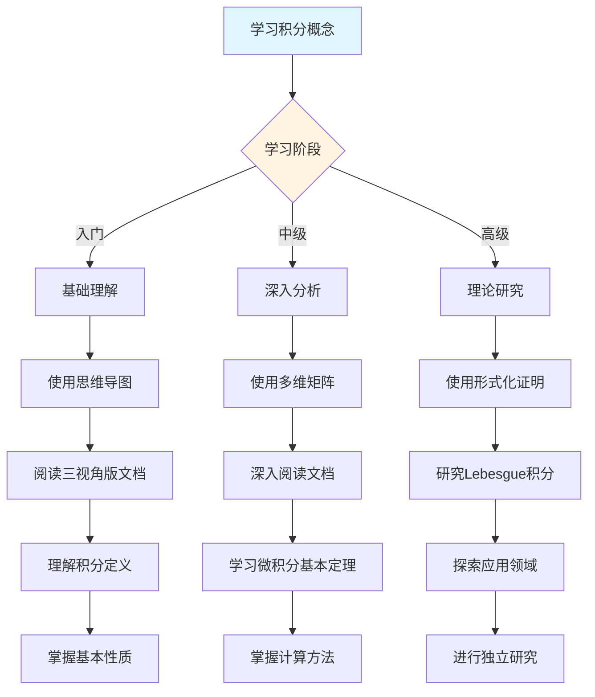
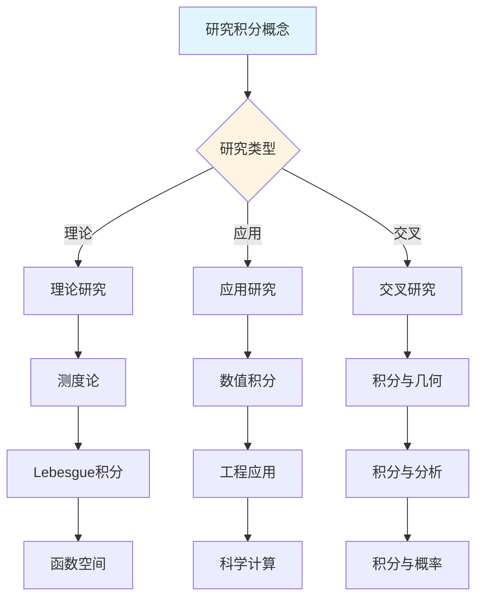
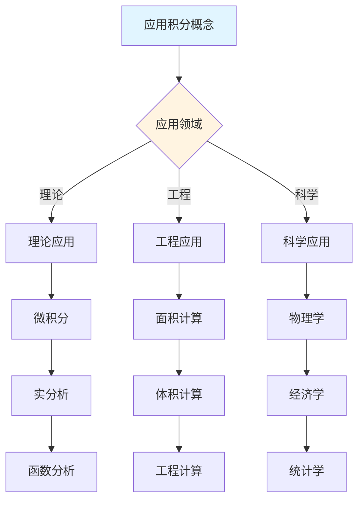
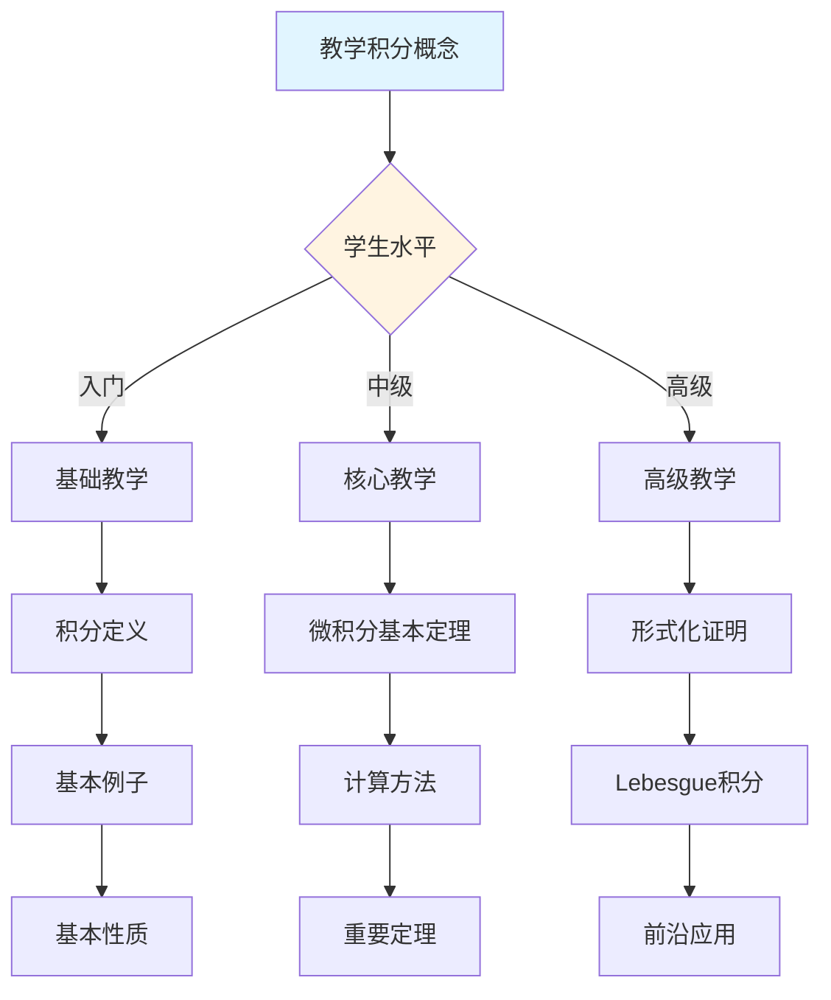

# 积分概念决策导图示例

**主题编号**: C.CORE.016.DECISION
**创建日期**: 2025年1月
**最后更新**: 2025年1月
**关联概念**: [积分-三视角版](./16-积分-三视角版.md)

---

## 📋 概述

本文档提供积分概念的详细决策导图示例，展示如何将[决策思维导图体系](../01-总体思维导图/05-决策思维导图体系.md)应用于积分概念的学习、研究、应用和教学。

**目标**：为积分概念提供完整的决策支持，包括：

- 学习决策导图
- 研究决策导图
- 应用决策导图
- 教学决策导图

---

## 🎓 一、学习决策导图 (编号: C.CORE.016.DECISION.01)

### 1.1 学习路径决策

### 1.2 学习重点决策

**基于知识矩阵的学习重点**：

| 学习阶段 | 知识层次 | 学习重点 | 推荐资源 |
|---------|---------|---------|---------|
| **入门** | L0基础 | 积分的定义、基本例子 | 思维导图、三视角版文档 |
| **入门** | L0基础 | 积分的直观理解（面积、累积） | 三视角版文档、应用实例 |
| **中级** | L1中级 | 微积分基本定理 | 多维矩阵、形式化证明 |
| **中级** | L1中级 | 换元积分法、分部积分法 | 三视角版文档、习题库 |
| **高级** | L2高级 | Lebesgue积分 | 形式化证明系统 |
| **高级** | L2高级 | 测度论 | 形式化证明系统 |

### 1.3 学习方法决策

**基于认知维度的学习方法**：

1. **直观维度**（入门阶段）
   - 使用思维导图建立总体框架
   - 使用具体例子理解概念（面积、体积、累积量）
   - 使用几何直观理解积分

2. **知性维度**（中级阶段）
   - 使用多维矩阵分析概念特征
   - 使用概念分类系统理解（定积分vs不定积分、Riemann积分vs Lebesgue积分）
   - 使用关系分析建立联系（与导数、极限、连续的关系）

3. **理性维度**（高级阶段）
   - 使用形式化证明严格理解
   - 使用逻辑推理深入分析
   - 使用系统建构整体把握

---

## 🔬 二、研究决策导图 (编号: C.CORE.016.DECISION.02)

### 2.1 研究方向决策

### 2.2 研究问题决策

**基于知识矩阵的研究问题**：

1. **理论研究问题**
   - 测度论：Lebesgue测度的构造
   - Lebesgue积分：可积性理论
   - 函数空间：L^p空间理论

2. **应用研究问题**
   - 数值积分：数值方法研究
   - 工程应用：工程问题中的积分计算
   - 科学计算：科学计算中的积分方法

3. **交叉研究问题**
   - 积分与几何：曲面积分、体积积分
   - 积分与分析：复积分、路径积分
   - 积分与概率：概率测度、期望值

### 2.3 研究方法决策

**基于形式化证明的研究方法**：

1. **构造性证明** → 积分的构造
   - 直接构造积分
   - 适用于Riemann积分

2. **测度方法** → Lebesgue积分
   - 使用测度理论
   - 适用于Lebesgue积分

3. **函数分析方法** → 函数空间
   - 使用函数分析
   - 适用于L^p空间

---

## 💼 三、应用决策导图 (编号: C.CORE.016.DECISION.03)

### 3.1 应用场景决策

### 3.2 应用方法决策

**基于应用场景的应用方法**：

1. **理论应用** → 使用形式化证明
   - 微积分：面积、体积计算
   - 实分析：Lebesgue积分
   - 函数分析：L^p空间

2. **工程应用** → 使用论证过程
   - 面积计算：使用定积分
   - 体积计算：使用多重积分
   - 工程计算：使用数值积分

3. **科学应用** → 使用综合方法
   - 物理学：功的计算、能量计算
   - 经济学：累积收益计算
   - 统计学：概率计算

---

## 🎓 四、教学决策导图 (编号: C.CORE.016.DECISION.04)

### 4.1 教学内容决策

### 4.2 教学方法决策

**基于认知维度的教学方法**：

1. **直观维度**（入门教学）
   - 使用思维导图建立框架
   - 使用具体例子（面积、体积、累积量）
   - 使用几何直观理解

2. **知性维度**（中级教学）
   - 使用多维矩阵深入分析
   - 使用概念分类系统
   - 使用关系分析建立联系

3. **理性维度**（高级教学）
   - 使用形式化证明严格理解
   - 使用逻辑推理深入分析
   - 使用系统建构整体把握

---

## 🔄 五、整合应用示例 (编号: C.CORE.016.DECISION.05)

### 5.1 完整学习流程示例

**阶段1：入门理解**:

1. 使用学习决策导图 → 确定学习路径：基础概念 → 积分定义 → 基本性质 → 基本应用
2. 使用总体思维导图 → 了解积分在分析学中的位置
3. 阅读[积分-三视角版](./16-积分-三视角版.md) → 理解积分的定义和基本性质
4. 使用论证过程 → 理解积分的直观意义（面积、累积、累加）

**阶段2：深入分析**:

1. 使用多维矩阵 → 分析积分的多维度特征（知识层次L1中级层、知识领域D3分析、学习难度中等偏难）
2. 阅读[积分-三视角版](./16-积分-三视角版.md) → 深入理解微积分基本定理和计算方法
3. 使用形式化证明 → 学习微积分基本定理的形式化证明
4. 使用分支关联思维导图 → 了解积分与导数、极限、连续的关系

**阶段3：应用研究**:

1. 使用研究决策导图 → 确定研究方向：Lebesgue积分
2. 使用知识关联网络 → 发现积分与测度论、函数空间的关系
3. 使用形式化证明系统 → 构建Lebesgue积分理论体系
4. 阅读[积分-三视角版](./16-积分-三视角版.md) → 了解积分的历史发展和开放问题

---

## 🔗 六、关联文档 (编号: C.CORE.016.DECISION.06)

### 6.1 核心概念文档

- [积分-三视角版](./16-积分-三视角版.md)
- [积分](./16-积分.md)

### 6.2 框架文档

- [决策思维导图体系](../01-总体思维导图/05-决策思维导图体系.md)
- [概念体系全面梳理与推进计划](../00-概念体系全面梳理与推进计划-2025年1月.md)
- [核心概念与新框架整合指南](../00-核心概念与新框架整合指南-2025年1月.md)

### 6.3 相关文档

- [核心概念索引](./00-核心概念索引.md)
- [知识矩阵总览](../02-知识矩阵/00-知识矩阵总览.md)
- [形式化证明系统](../00-形式化证明系统-2025年11月.md)

---

**创建日期**: 2025年1月
**最后更新**: 2025年1月
**维护状态**: 持续更新中
